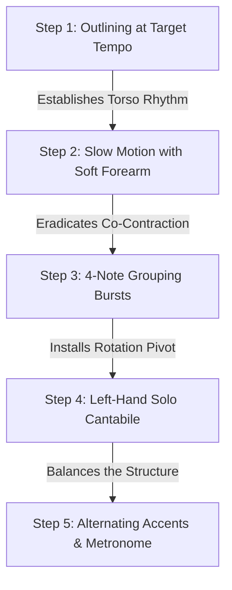

# 🎹 Actionable Practice Plan: Chopin Étude Op. 10 No. 4

This practice plan outlines the physiological approach to mastering **Chopin's Étude Op. 10 No. 4** (and similar high-velocity passages), drawing on the insights of **Josef Lhevinne**, **Tobias Matthay**, **Abby Whiteside**, **Boris Berman**, and **György Sándor**.

---

## 🗺️ Table of Contents
- [[#1. Core Technical Foundations]]
  - [[#A. Torso and Upper Arm Motor]]
  - [[#B. Muscular Cessation & Keybedding]]
  - [[#C. Invisible Forearm Rotation]]
  - [[#D. The Elastic Palm]]
- [[#2. 15-Minute Actionable Practice Plan]]
  - [[#Step 1: Outlining at Target Tempo (4 Minutes)]]
  - [[#Step 2: Slow-Motion Practice with Safety Check (3 Minutes)]]
  - [[#Step 3: Forearm-Finger Grouping Bursts (3 Minutes)]]
  - [[#Step 4: Left-Hand Solo Practice (3 Minutes)]]
  - [[#Step 5: Alternating Accents & Metronome Scaling (3 Minutes)]]
- [[#3. Related Resources]]

---

## 1. Core Technical Foundations

### A. Torso and Upper Arm Motor
*   **The Fallacy of the Fingers:** Playing Op. 10 No. 4 at tempo ($\approx 150-176 \text{ BPM}$) cannot be accomplished via isolated finger muscles; they are too small and fatigue quickly under prolonged rapid firing.
*   **The Canopy of Pulling:** The rhythm of the form must be initiated in the torso and supported by the upper arm. The upper arm must "poise" or float (*"canopy of the pulling activity"*), carrying the hand over the keyboard so the fingers do not bear the arm’s dead weight.
*   *Reference:* [[Abby Whiteside/Abby Whiteside - Indispensables of Piano Playing#Work Sketch for the Chopin Etudes, June 13, 1953|Indispensables, June 1953 Sketch]].

### B. Muscular Cessation & Keybedding
*   **Point of Sound:** The piano key has a point of escape (the escapement mechanism) slightly before reaching the bottom. Once the hammer escapes and strikes the string, any force applied against the keybed is wasted:
    $$ F_{\text{applied}} > F_{\text{hold}} \implies \text{Static Tension} $$
    Where $F_{\text{hold}}$ is only $20 - 30\text{ g}$ (the weight needed to keep the damper raised). Pressing past this point is **Keybedding**, which locks up the forearm flexors.
*   **Instant Cessation:** The instant you hear the tone, you must cease all muscular effort, allowing the key’s natural upward rebound to lift your finger back to the surface.
*   *References:* [[Thomas Mark/Thomas Mark - What Every Pianist Needs to Know About the Body#Mapping the Point of Sound|Thomas Mark, Ch. 9 (Mapping the Point of Sound)]] & [[Tobias Matthay/The Act of Touch in All Its Diversity/Tobias Matthay - The Act of Touch in All Its Diversity#CHAPTER XVIII. THE THREE CHIEF MUSCULAR TESTS REQUIRED DURING PRACTICE AND PERFORMANCE|Act of Touch, Ch. XVIII (Muscular Tests)]].

### C. Invisible Forearm Rotation
*   **No Rocking:** In rapid semiquaver runs, visible rocking movements of the wrist are a hindrance. Instead, use *invisible rotation* (momentary rotational stress/relaxation) in the direction of the new finger, using the previous playing finger as a pivot.
*   **Upper Arm Freedom:** Keep the upper arm slightly away from the body. Clamping it locks the radius and ulna in a crossed position, creating static tension before you even play.
*   *References:* [[Tobias Matthay/The Visible and Invisible/Tobias Matthay - The Visible and Invisible in Pianoforte Technique#THE FOREARM-ROTATION ELEMENT|Visible and Invisible, Forearm-Rotation Element]] & [[Gyorgy Sandor/Gyorgy Sandor - On Piano Playing#6 Rotation|Sándor, Ch. 6 (Rotation)]].

### D. The Elastic Palm
*   **Breath in the Hand:** Do not hold a rigid, wide hand shape. Expand the palm bridge for leaps and contract it immediately for close finger patterns (e.g., the opening motif of Op. 10 No. 4).
*   *Reference:* [[Boris Berman/Boris Berman - Notes from the Pianist's Bench#Chapter 2: Technique|Berman, Ch. 2 (Technique)]].

---

## 2. 15-Minute Actionable Practice Plan

Perform this routine daily, focusing entirely on **kinesthetic sensations** and **aural imagery**.

### Step 1: Outlining at Target Tempo (4 Minutes)
*   **Goal:** Train the brain and arm to navigate the keyboard at **performance speed** without notewise locking.
*   **Action:** 
    1. Set the metronome to your target speed (e.g., $\text{Half Note} = 76-88$).
    2. Play **only the first note of each beat** (the quarter-note skeleton), leaving the rest silent. Move your arm smoothly from note to note, feeling the torso shift balance on your sit bones.
    3. Next, play **only the 1st and 3rd sixteenth notes** of each beat at target speed.
    4. Fill in the remaining notes *only* when the skeletal outline feels as easy and continuous as a glissando.
*   *Reference:* [[Abby Whiteside/Abby Whiteside - Indispensables of Piano Playing#Work Sketch for the Chopin Etudes, June 13, 1953|Indispensables, Outlining]].

### Step 2: Slow-Motion Practice with Safety Check (3 Minutes)
*   **Goal:** Verify the complete release of the forearm flexor muscles after key descent.
*   **Action:**
    1. Play a passage slowly, but **do not** strike slowly. Use a rapid key-descent to produce the sound, then **instantly drop all effort**.
    2. **Safety Check:** Place your non-playing hand on the inner (volar) side of your playing forearm. Verify that the muscle turns rock-hard for a fraction of a second during key descent and **instantly goes soft** as you hold the key down.
    3. If the muscle stays hard while holding the note, you are keybedding.
*   *Reference:* [[Piano Physiology and Finger Release#Anatomical Breakdown: Why Tension Builds Up|Physiology & Release, Co-Contraction]].

### Step 3: Forearm-Finger Grouping Bursts (3 Minutes)
*   **Goal:** Group motivic sixteenth-note patterns into single forearm impulses.
*   **Action:**
    1. Take a 4-note motif (e.g., the right hand opening: $\text{G}\sharp - \text{F}\sharp - \text{E} - \text{D}\sharp$).
    2. Prepare the fingers close to the keys. Drop the forearm weight into the first note (finger 4) with a supple wrist.
    3. Play the middle notes (3 and 2) with a light, close-to-key "scratching" motion.
    4. Play the last note (finger 1) with an inward **finger snap** (wiping staccato) that tosses the hand out of the key, letting the wrist rise and float.
*   *Reference:* [[Lhevinne and Matthay - Pedagogical Summary#Phase 4: Forearm-Finger Grouping & Release (2 Minutes)|Pedagogical Summary, Warm-up Regimen]].

### Step 4: Left-Hand Solo Practice (3 Minutes)
*   **Goal:** Eliminate left-hand sluggishness and ensure the bass provides structural support.
*   **Action:**
    1. Play the left-hand part completely alone. 
    2. Do not treat it as a dry accompaniment; shape the left-hand runs with the rubato and breathing of an opera singer.
    3. Ensure the left wrist remains a flexible shock absorber, especially during the leaping chords and octaves.
*   *Reference:* [[Josef Lhevinne/Josef Lhevinne - Basic Principles in Pianoforte Playing#CHAPTER V: Accuracy in Playing|Basic Principles, Ch. V]].

### Step 5: Alternating Accents & Metronome Scaling (3 Minutes)
*   **Goal:** Break up habitual reflex patterns and build even finger velocity.
*   **Action:**
    1. Play the sixteenth-note runs slowly, accenting the **1st** of every four semiquavers.
    2. Repeat, shifting the accent to the **2nd** semiquaver, then the **3rd**, then the **4th**.
    3. Use the metronome to systematically test your control at intermediate speeds. Lhevinne warns that medium tempos are often harder to control than presto; verify that your hand remains relaxed at these tempos.
*   *Reference:* [[Josef Lhevinne/Josef Lhevinne - Basic Principles in Pianoforte Playing#Acquiring Velocity|Basic Principles, Ch. VI (Acquiring Velocity)]].

---

## 3. Related Resources

*   [[Lhevinne and Matthay - Pedagogical Summary|Lhevinne and Matthay - Pedagogical Summary]]
*   [[Piano Physiology and Finger Release|Piano Physiology: Finger Release and Tension-Free Velocity]]
