# Notes from the Pianist's Bench

## Table of Contents
- [[#Preface to the Second Edition]]
- [[#Preface to the First Edition]]
- [[#Part I: In the Practice Room]]
  - [[#Chapter 1: Sound and Touch]]
  - [[#Chapter 2: Technique]]
  - [[#Chapter 3: Articulation and Phrasing]]
  - [[#Chapter 4: Matters of Time]]
  - [[#Chapter 5: Pedaling]]
  - [[#Chapter 6: Practicing]]
- [[#Part II: Shaping Up a Performance]]
  - [[#Chapter 7: Deciphering the Composer's Message]]
  - [[#Chapter 8: Seeing the Big Picture]]
  - [[#Chapter 9: Technique of the Soul]]
  - [[#Chapter 10: At the Performance (and Prior to It)]]
  - [[#Chapter 11: The Art of Teaching and the Art of Learning]]
- [[#About the Author]]
- [[#Index]]

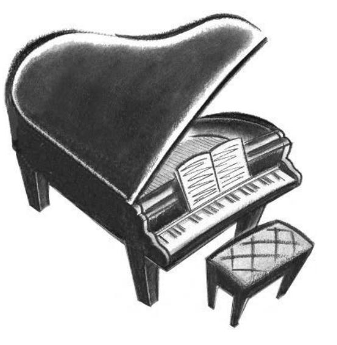

pianist 's bench SECOND EDITION Published with the assistance of the Frederick W. Hilles Publication Fund of Yale University.

First edition 2000. Second edition 2017. Copyright © 2000, 2017 by Yale University. All rights reserved. This book may not be reproduced, in whole or in part, including illustrations, in any form (beyond that copying permitted by Sections 107 and 108 of the U.S. Copyright Law and except by reviewers for the public press), without written permission from the publishers.

Yale University Press books may be purchased in quantity for educational, business, or promotional use. For information, please e-mai[l sales.press@](mailto:sales.press@yale.edu) [yale.edu](mailto:sales.press@yale.edu) (U.S. offi ce) or [sales@yaleup.co.uk](mailto:sales@yaleup.co.uk) (U.K. offi ce).

Designed by Nancy Ovedovitz and set in Scala type by Newgen North America. Printe d in the United States of America.

Library of Congress Control Number: 2017935186 isbn 978-0-300-22152-7 (paperback : alk. paper) isbn 978-0-300-22153-4 (multimedia)

A catalogue record for this book is available from the British Library.

This paper meets the requirements of ansi/niso z39.48-1992 (Permanence of Paper).

10 9 8 7 6 5 4 3 2 1

To my students, with whom I have shared many hours of joy, frustration, and discovery

## Preface to the Second Edition

## Preface to the First Edition

# Part I: In the Practice Room

- 1 Sound and Touch 3
- 2 Technique 26
- 3 Articulation and Phrasing 56
- 4 Matters of Time 82
- 5 Pedaling 104
- 6 Practicing 121

# Part II: Shaping Up a Performance

- 7 Deciphering the Composer's Message 149
- 8 Seeing the Big Picture 161
- 9 Technique of the Soul 181
- 10 At the Performance (and Prior to It) 192
- 11 The Art of Teaching and the Art of Learning 211

#### viii Contents

Notes 225

About the Author 229

Index 231

Credits 237

preface to the second edition

Since the fi rst edition of this book was published in 2000, I have been gratifi ed by the warm reception accorded to it. Not only did it receive positive feedback and comments from colleagues, but it has also been adopted as a required text in universities and conservatories throughout the world and has been translated into several languages. This response made me feel that the profession needs and appreciates my approach, which is based on an inseparable connection between technical details and broader musical issues.

In the years since the fi rst edition appeared, my thinking on many subjects evolved. I started wishing that I had set certain ideas in a clearer way, while many thoughts seemed to merit a greater expansion. I waited for the opportunity to update the book, as well as to implement suggestions of many friends, including such masters as Radu Lupu and Emanuel Ax.

I was particularly excited when Yale University Press came up with a suggestion to take advantage of newly available technology and to add audio and video components to the book. I welcomed the opportunity to address many issues in a more concrete and detailed way. The result is a much more hands-on version. I hope that the new aural and visual aspects make the reading experience more comprehensive and engaging as well.

This second edition is available in both print and electronic formats. If you are reading the multimedia edition, then click the links to go directly to

the audio and video examples. If you are reading the print edition, then you can access the audio and video examples via the Internet:

This symbol indicates that there is an audio fi le accompanying a musical example. To listen to the corresponding audio fi le, visit [yalebooks.com/berman,](http://yalebooks.com/berman) sign in or register for an account, and enter the password *berman*.

This symbol indicates that a video fi le is available in which I demonstrate and explain select issues. To watch the video, go to [yalebooks.com/berman,](http://yalebooks.com/berman) sign in or register for an account, and enter the password *berman*.

I am grateful to Eugene Kimball and Austin Kase for producing audio and video clips, respectively. I appreciate the help of Thomas Hicks with formatting additional and corrected music examples. I am indebted to the Yale University Press team—Sarah Miller, Sara Sapire, and my editor Jenya Weinreb—for guiding me through the process of creating a new version of the book. As always, the support and advice of my wife, Zina, and my children, Daniella and Ilan, have been invaluable.

This book is a compendium of various thoughts, discussions, and experiences that I have had in the course of my work as a performer and teacher. A refl ection of my personal and professional experience, it presents issues that arise continually in my work with advanced students or that seem relevant to me as a performer. Much of the book has been written during concert tours as well as in the wake of numerous lessons. This has infl uenced the choice of the repertoire discussed here.

I do not purport to cover each and every problem that pianists may encounter, nor do I aspire to produce revelations; in fact, I hope that my colleagues will be able to identify with much of what I have to say. I also hope that they will fi nd helpful some of the ways I suggest to address familiar problems. My goal is not to replace the piano instructor. Rather, students should approach the book in the same way they approach a master class as an opportunity to be exposed to another point of view to complement the instruction of the teacher. The teacher faces a multitude of problems during the short time of a lesson. Between correcting notes and rhythms, suggesting a better fi ngering, and discussing the interpretation of a particular piece, he can seldom fi nd time for a general discussion of any of the issues covered in this book.\* Thus, I hope that some of my colleagues may

\* In writing this book I struggled with the grammatical issue of gender parity. I ultimately felt that constant use of "he or she" makes the text cumbersome. Because much of the writing refl ects my own experience, it seemed more natural to occasionally assign a chapter as useful supplemental reading for a student to complement the more concrete work done during the lesson.

This is neither a how-to book nor one confi ned exclusively to general musical matters. My experiences as both teacher and performer have convinced me of the fallacy of separating practical and ideal aspects of the art of playing piano. I strongly believe that these two areas cannot be addressed independently of each other. Technical work should always have a musical goal in sight, and lofty ideas need to be supported by know-how to be put into practice. In lessons with students, discussion of the stylistic features of a particular composer whose work is being studied can switch to the examination of the position of the student's hand or a search for the best fi ngering for a diffi cult passage. The book refl ects this interdependence of the practical and the ideal. Although it is divided into two parts—the fi rst dealing with more technical issues and the second with more artistic ones—this separation is made only for purposes of easy reference. In reality, even an accomplished artist occasionally revisits technical issues and revises his approach. In this sense, an inquisitive artist remains a student for a lifetime. By the same token, a talented student, even one whose expertise is limited, is an artist and should be treated as such.

I often had diffi culty deciding which material should go into which chapter, for one cannot really separate articulation from technique, or draw a dividing line between work on sound and work on technique. Crossreferences abound between both parts, as well as within them, refl ecting my strong conviction that we should mobilize all the tools and approaches at our disposal to re-create a work of music in all its richness.

Sometimes, for the sake of clarity, issues in the book have been formulated and separated too neatly. The reader will do well to remember that in real life they are often interwoven with, and infringe on, each other with fascinating complexity. Or, as Goethe said: "Grau . . . ist alle Theorie / Und grün des Lebens goldner Baum." (Grey is all theory / And green of life the

use masculine pronouns throughout the book. I hope that my female readers will not mind.

golden tree). Students naturally look for clear-cut answers to their problems, and teachers understandably try to respond with catch-all solutions. Yet, apart from working with young beginners, no recommendation or solution should be given (or received) with the words "always" or "never" in mind. In the green of the music's golden tree there surely is room for many exceptions to even the wisest rules.

The chapters of this book do not have to be read in order. I encourage pianists to turn to individual chapters that respond to their current needs. Readers who are not practicing pianists (no pun intended) may be daunted by the technical discussions in certain chapters of Part 1 ("In the Practice Room"). For them, Part 2 ("Shaping Up a Performance") and such chapters of Part I as "Articulation and Phrasing" and "Matters of Time" may be more interesting.

This book could not have been written without the help and encouragement of many people. My sincere thanks go to Michael Friedmann, my friend and fellow faculty member at Yale School of Music. His advice throughout every stage of my work has been invaluable. Other colleagues read early versions of the manuscript and contributed extremely helpful opinions. Among these individuals are the late Claude Frank, Peter Frankl, Annie Frankl, Stephane Lemelin, and Janos Cegledy. Harry Haskell of Yale University Press guided me through the unfamiliar terrain of the publishing world. Harold Meltzer, Wei-Yi Yang, Dmitri Novgorodsky, and my meticulous editor Jeff rey Schier all helped me to prepare the manuscript for publication. Harold Shapero produced photos, Leora Zimmer formatted music examples. I gratefully acknowledge the assistance of the Griswold Fund and the Frederick W. Hilles Publication Fund of Yale University.

Finally, I thank most aff ectionately my wife, Zina, and my children, Ilan and Daniella (my fi rst reader), for their constant encouragement, particularly when the task seemed to be too immense and daunting. I doubt that the book could have been written without their support.

## Chapter 1: Sound and Touch

Many issues are important in shaping the pianist's skills. Technique, rhythm, memorization, and repertoire are among them and will all be discussed in this book. I would like to begin, though, with a topic that is frequently neglected by teachers and students or that receives only perfunctory attention: *sound*. For music, this omission is as strange as ignoring color in visual arts, or body movement in acting. Sound production should be considered part of technique in a broader sense, for technique is much more than the ability to play notes rapidly and evenly.

On the rare occasion when sound production is discussed, it is often reduced to such platitudes as "It must sound beautiful," "Sing!" or "Change the color." Instructors rarely give advice on *how* to achieve a beautiful sound, *what* to do with the hands or arms to make the piano sing, or what one needs to do physically to create the sensation of a change in color. I believe that the teacher must be specifi c to meet the needs of students who seek more practical guidance on these matters. Over the years, I have developed a way to deal with this issue. Before presenting it here, I would like to off er a few caveats:

1. Although I fi nd it actually quite easy to teach the basics of sound production, these skills usually do not "stick" to one who is indiff erent to quality of piano tone, or to one whose ears do not crave a particular kind of sound. In short, you cannot refi ne your touch without refi ning your ear. I am referring to two kinds of "musical ears." One is the "subjective ear,"

#### 4 In the Practice Room

the pianist's image of the kind of sound he would like to produce. The more specifi c the image, the better the results will be. The other is the "objective ear," which refers to the musician's ability to monitor the sound that actually comes from under his fi ngers. Objective listening is a perennial goal, a lifelong battle, for a musician always tries to listen objectively to his own playing but never fully succeeds. The pianist cannot do meaningful work without learning to listen intently and tirelessly to every sound he produces on the piano (more about this in the chapter on practicing).

- 2. Often overlooked is the need to work on an instrument that responds suffi ciently to the nuances of touch. (No electronic keyboard will do, I'm afraid.) Chopin apparently had this opinion because, according to his student Karol Mikuli, in the master's house "the pupil played always on a magnifi cent concert grand, and it was his duty to practice only on best quality instruments."1 As Russian pianist and writer Grigory Kogan put it: "The pianist must be able to play on any piano, but he must practice only on a good one."2
- 3. The pianist may be tempted to look for sound of absolute beauty that fi ts all occasions. I often tell my students that there is no such thing as beautiful sound; but there is sound appropriate to a particular style, piece, or passage. (To be sure, there *is* such a thing as ugly sound, and the pianist should know how to avoid producing it.) Sound that suits Rachmaninov would feel out of place in Mozart, and vice versa. In fact, sound can and should be used as a tool of stylistic defi nition. Stylistic awareness, expressed in the choice of tempo, rhythm, phrasing, and articulation that the performer considers appropriate to the style of a work, should incorporate the notion of a proper sound.
- 4. Even a two-year-old can produce the "right" sound occasionally, but it will be *a* sound, a single note. Only a well-trained pianist can produce a second sound to perfectly match the qualities of the fi rst. It is crucial for pianists to have the ability to sustain a certain type of sound for the length of a passage or a phrase and to change it at will.

When pianists talk about beautiful sound, they usually mean a singing, long-lasting tone that reveals as little as possible of the piano's inherently percussive nature. Even in the relatively infrequent instances when composers highlight the instrument's percussiveness (examples that come to mind are Bartók's First Concerto and Stravinsky's *Les Noces*), the pianist should not be indiff erent to the quality of sound; he should aspire to emulate the brassy resonance of a gong or the powerful combination of dryness and resonance of African drums, rather than a clatter of kitchen pots.

Each professional pianist has (or should have) endured long and often frustrating hours in the practice room looking for his own way of producing this beautiful, long-lasting sound. We are all diff erent physically, and for this reason every pianist develops his own strategy. The multitude of approaches and their combinations, however, can be reduced to two generic types. My late teacher the wonderful Russian pianist and pedagogue Lev Oborin defi ned the polarity of these physical approaches as *sostenuto* and *leggiero*. I prefer using the English words "in" and "out." Both of these ways of playing, as we will see, share a common goal: to mask the most treacherous, dangerously telling moment—that of the actual attack, when the hammer hits the string.

Eloquent imagery has been used to describe the "in" kind of sound production. Rachmaninov talked about fi ngers growing roots in the keyboard. Joseph Hoff mann said that the sound should be produced as if there were a very ripe strawberry sitting on a key and you had to push through it. These images imply two important features of the "in" type. One is the deliberate speed of the process: the slow pace at which the roots grow, and the unhurried tempo at which the strawberry must be penetrated to avoid a messy keyboard. The other is the continuous quality of the process; the roots grow without stopping at a certain point. The "in" type, then, is based on a slow immersion in the keyboard: the action continues even after the sound has been produced, as if the moment of attack were ignored. The weight brought into the key stays there without being released; it is then "poured" into the next note of the phrase.

The "out" type is quite the opposite. The sound is produced by a quick stroke, as if the fi nger left the key even before the sound could be heard. Obviously, if the note has to be sustained or connected to the next, the fi nger does not leave the key. But most of the weight is gone; only a vestige remains to hold the key down. This type of action is similar to playing the harp (is not the piano essentially a horizontally placed harp?). The harpist strikes and then escapes the strings almost before the notes are produced, otherwise the sound is dampened by the fi ngers. Or think about the way the percussionist plays the tam-tam: the performer never leaves the mallet pressed against the instrument. After striking the tam-tam he pulls the mallet out of the way, allowing the instrument to resonate without being obstructed.

Playing this way, the pianist should not direct the movement downward into the keyboard. Rather, he should employ a circular (tangential) motion, as if passing through the key but not stopping. Once again, the action is similar to the circular motion used to pluck the harp, strike the tam-tam, crash a pair of cymbals—or play baseball or tennis. In the sports analogy the tennis racquet and baseball bat pass the point at which they strike the ball, continuing in a circular motion (called follow-through). The pianist directs the motion toward himself as if he were "grabbing" the sound from the keyboard and bringing it out.\*

(Some pianists prefer to move the hand forward rather than toward themselves. Konrad Wolff describes Artur Schnabel's playing in this manner.3 Schnabel may have learned it from Theodor Leschetizky, whose other student and one-time wife, the legendary Russian pianist and teacher Anna Esipova, recommended: "Place your hand on the keys, form the chord, and move the hand as if pushing a drawer into a desk."4 What is important to me is that both this motion and the "out" way as discussed above do not aim vertically downward but touch the key at an angle. Both motions can be described as caressing; they both allow the fi nger to glide along the key.\*\* I fi nd it more practical to move the hands toward me instead of away from the body because in the latter case the piano's name-board restricts the

\* The circular movement approach is executed by either fi nger, hand, or forearm, depending on which lever the pianist decides to employ at any particular time. The reasons for choosing a particular lever are discussed below.

\*\* The gliding movement can be very helpful in achieving smoothness of legato, though strictly speaking it is irrelevant for producing the sound.

2

movement on the far end. More room exists between the keyboard and the pianist's body.)

These two types of sound production, the "in" and the "out," almost never appear in their pure form; rather, there are countless combinations of the two. Diff erent national schools have shown preferences for one or the other: pianists of the Russian school have favored the "in" approach, while those of French or German musical descent seem to have preferred the "out" way of playing. (I use the perfect tense here because the current crossfertilization of traditions has left hardly any national school untouched by other infl uences.)

For me, it is important to use diff erent kinds of sound for diff erent types of music. A work of introverted character, such as Brahms's Intermezzo op. 119, no. 1 (Ex. 1.1), may benefi t from an "in" approach, while more outspoken, extroverted music, like the beginning of Chopin's C-Minor Nocturne (Ex. 1.2), asks for the "out" stroke. Many pieces can be presented equally convincingly using either of these approaches—Chopin's F-sharp Major Nocturne, for example (Ex. 1.3). The pianist who is conversant with both may choose the one that seems more appropriate.

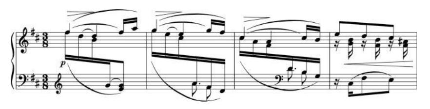

*Ex. 1.1 Brahms, Intermezzo in B Minor, op. 119, no. 1*

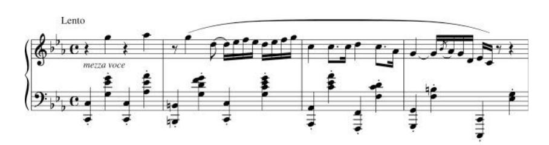

*Ex. 1.2 Chopin, Nocturne in C Minor, op. 48, no. 1*

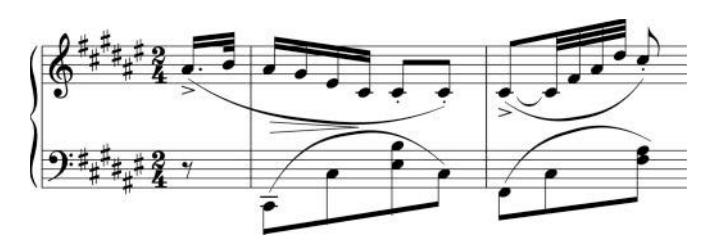

*Ex. 1.3 Chopin, Nocturne in F-sharp Major, op. 15, no. 2*

At times the pianist may wish to imitate the sound of other instruments, especially when trying to realize an orchestral reduction at the piano. The airy sound of the French horn, as in the beginning of the orchestral part of the B-fl at Major Concerto by Brahms (Ex. 1.4), will be better rendered by the "out" stroke. The warmth of the strings in the excerpt from Liszt's First Concerto (Ex. 1.5), on the other hand, calls for the "in" approach.

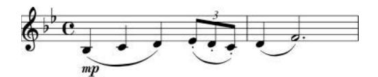

*Ex. 1.4 Brahms, Concerto no. 2 in B-fl at Major, op. 83, mvt. 1*

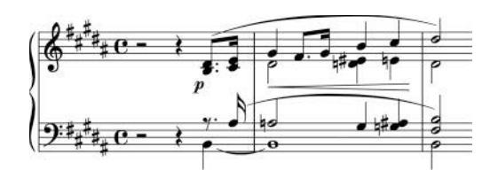

*Ex. 1.5 Liszt, Concerto no. 1 in E-fl at Major*

So far, we have contemplated ways of producing the sound while dealing with relatively soft music. For loud playing, I am afraid, the "in" approach almost never succeeds. Imagine a long crescendo: as we increase the speed of immersion into the key to produce the louder sound, the time between the moment of attack and the imaginary goal of the movement becomes shorter and shorter, until the two coincide. As a result, instead of masking the moment of attack we are highlighting it; the sound becomes unpleasantly hard and harsh, and immersion turns into pressure.

My solution to avoid harshness of sound is to switch to the "out" way using a "hit-and-run" approach. The louder the dynamic level is, the faster the movement should be. The chords in Ex. 1.6, for instance, are played as if being torn from the piano. (Naturally, the pedal will prolong their duration and enhance the resonance.) If the notes must be sustained, the fi ngers do not leave the keys, but the weight of the hands is used for the attack only, and they do not sink into the keys even for a moment. A good example of this approach is the fi rst subject of Beethoven's Fourth Concerto (fi rst movement) as it appears forte in the beginning of the recapitulation (Ex. 1.7).

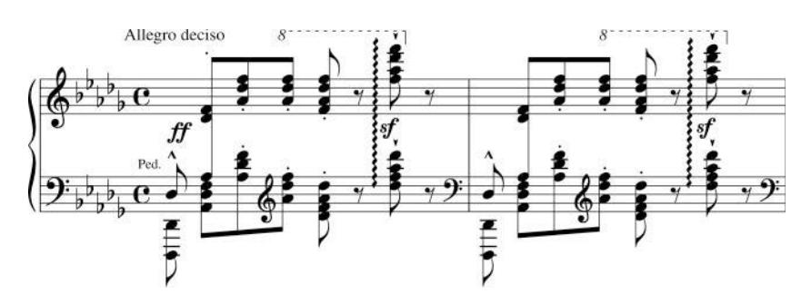

*Ex. 1.6 Liszt, Concerto no. 2 in A Major*

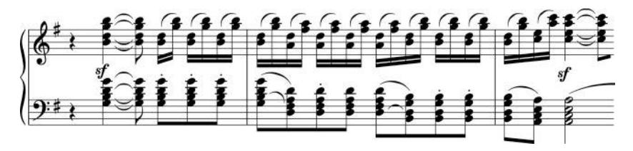

*Ex. 1.7 Beethoven, Concerto no. 4 in G Major, op. 58, mvt. 1*

Earlier, I was talking about the need for the pianist to have sound imagination, the refi ned "subjective ear." This is not enough, however, for the performer must also possess the technical ability to realize the sonorities he hears in his head. The pianist needs to know what physical actions infl uence sound and in what way. Here are several variables that are used

in both "in" and "out" types of sound production. Some also aff ect other aspects of playing, such as articulation or velocity. (The real life of a practicing pianist cannot be neatly compartmentalized.) But fi rst I would like to mention one physical constant that is indispensable for producing rich, nuanced tone: the fl exible wrist. Josef Lhevinne compared its role to that of shock absorbers in a car.5 The wrist cushions the sound and absorbs the excess force. (Frequently the pianist uses the elbow as an additional shock absorber, as described in the next chapter.)

1. *Weight*. The more weight that is applied to the key, the fuller (and/ or louder) the sound. The pianist needs to be able to use the full weight of his fi ngers, hand, forearm, and upper arm. Equally important is knowing how *not* to use weight when a lighter sonority is required. I often ask my students to experiment with making their fi ngers heavy by letting the weight of the bigger joints "pour" into the fi ngers (not to be confused with applying pressure), and then gradually withdrawing the weight to regain the lightness. (For the latter, imagine a vacuum cleaner being applied to your shoulder blade, sucking the weight from the hand. This image can be particularly helpful for larger-sized pianists who fi nd it diffi cult to prevent the weight of their arms from participating when the music requires lightness of touch.) These experiments are important for learning one of the most necessary skills for the pianist: to let in just as much or as little of the weight as is needed for a particular passage.

Pianists who possess a delicate physique sometimes feel that they cannot muster enough weight to play a loud passage. They try to compensate by pressing into the key using the "in" touch, which is generally not suitable for forte, as discussed above. The pressure usually produces a hard, forced sound. In such cases I strongly recommend that the pianist resist the temptation to apply additional pressure. Instead, I would switch to the "out" approach and increase the speed of the stroke.

2. *Mass*. This variable concerns how much of the body is involved in sound production. The sound can be produced with the fi nger alone, or with the fi nger supported by the hand, or with fi nger supported by the hand plus the forearm, or with the fi nger supported by the hand plus the forearm plus the upper arm. The bigger the participating joint—that is, the greater the mass—the fuller the sound.

5

When we want to increase the volume we activate the bigger joints. When we want to stay at the same dynamic level, however, and at the same time, achieve a fuller sound, we seek the support of the bigger joints, rather than their overt participation. To help my students accomplish this goal, I often mention that they should develop the feeling of a "long fi nger" or imagine that all the "juices" from the arm are fl owing into the fi nger. Another useful image is that of a "long neck" to help feel uninterrupted succession of muscles from behind one's ear to the neck, to the upper arm and so forth down to the fi nger tip. (Compare this with the "extension" principle discussed in the next chapter.)\* When the pianist feels the need to add air to his sound, which he experiences as excessively thin and "bony," a fl exible elbow can be particularly helpful. Imagining a parachute attached to one's elbow can be useful.

It is important to distinguish between mass and weight. One can use the whole arm and still make a very light sound, or use just the fi nger, which would have the weight of bigger joints "poured" into it.

3. *Speed*. The speed with which the fi nger strikes the key contributes to changes not only in volume but also in articulation. Elementary physics teaches us that speed can be developed only over a certain distance. This means that a fi nger needs to fall from a certain height, unless we want to play very softly. If the pianist tries to play loudly while his fi ngers remain glued to the surface of the key, all he can do is to push the key down, producing a very pressured sound. The greater the speed we want to develop, the higher we should position the fi nger. At a certain point, however, the pianist cannot rely merely on the energy of the falling fi nger; he

\* The "long neck" image can be helpful in fi ghting a widespread fault of many students who play with their shoulders lifted. Apart from generating tension in the shoulder area and neck, this way of playing makes producing full, long-lasting tone virtually impossible.

must involve the hand as well. (This is discussed further in the chapter on technique.)

In my discussion of the "out" way of playing, I stated that its basic movement must be fast. Yet gradations of the speed can add much variety to this type of touch, and in my lessons I use diff erent images to underline the diff erences. I talk about "taking" the sound out of the piano as opposed to "pulling" it or, on the other end of the spectrum, "tearing" it out as opposed to "plucking."

Speed not only can compensate for insuffi cient weight, it can also be interchangeable with mass. A similar dynamic level can be achieved by using a larger joint with lesser speed, or a smaller joint with greater speed. The decision regarding the course of action to take depends on the pianist's feeling of the sound that is best suited or most appropriate stylistically for a particular piece of music. A mezzo-forte singing line in Mozart, for example, may require using fi ngers to activate keys fairly quickly, probably supported by the hand, possibly with just a little participation of the forearm. In contrast, a similar dynamic level in a Rachmaninov work will be best produced by bringing the weight of the arm into the key with a relatively slow speed. The lean sound appropriate for Mozart is quite diff erent from the full or thick sound suitable for Rachmaninov.

Frequently upon confronting a dull piano, pianists start using a great deal of force and pressure. This results in a strained, unpleasant sound and frequently causes tendinitis. The correct approach in such cases is to use a very fast and light stroke. In contrast, if the piano is very bright, a slower speed of the stroke and a very light touch will prevent the sound from being ugly.

4. *Perception of depth*. More than the other variables, this depends on the pianist's imagination, because the depth of the key has very little leeway per se. Yet every properly trained pianist is able to hear the diff erence between deep and shallow touch. One usually plays deep into the key to achieve a singing tone. (The depth should not be exaggerated, though, as it invites pressure, which in turn produces a forced, strangulated tone. I have seen pianists who played as if they were intent on making a hole in the bottom of the keyboard.)

A common mistake is to aim deep while playing loudly, but to use a much shallower stroke while playing softly. For developing the deep touch in piano, Esipova's advice is very useful: "First practice the phrase (which is to be played pianissimo) slowly, feeling the bottom of the key and in the dynamics of mezzo-forte. Afterward repeat it with the same feeling of depth, but very softly. Keep switching from one way of playing to the other."6

The depth of the touch should remain the same for the duration of a phrase or passage. Inconsistent touch, when adjacent notes are produced in diff erent layers of depth, is clearly noticeable to the trained ear and testifi es to the pianist's poor sound control. However, not all lines in the musical texture need to sing; for those that do not, a shallower touch may be more appropriate. For each particular line or phrase we aim for a certain depth in the keys. It is crucial to sustain this depth until the nature of the material changes. Very often we have two or more elements, played simultaneously or in quick succession, each performed with a diff erent depth. Obviously, this situation requires great ability to control the touch, especially when these diff erent elements appear in the part of the same hand. In such cases, the pianist develops the feeling of a "split hand," when one half of it aims into a deeper layer within the keys than the other. (Diff erentiation in articulation, very much linked with the subject of depth, is discussed in the chapter "Articulation and Phrasing.")

When the "out" way of playing is used, the diff erence in depth can be as eff ective as with the "in" touch. For the "out" approach I encourage students to imagine taking (or pulling, tearing, and so on, as described above) the sound from a deeper or shallower layer within the keyboard.

5. *The shape of the fi ngers*. Josef Lhevinne observed: "It is almost an axiom to say that the smaller the surface of the fi rst joint of the fi nger touching the key, the harder and blunter the tone; the larger the surface, the more ringing and singing the tone."7 The diff erence in sound is made by touching the key with either the fl eshier part of the fi nger or with the tip. To play music that requires clarity of articulation, the pianist often curves his fi ngers so that the smallest joint is almost perpendicular to the keys. On the

#### 14 In the Practice Room

other hand, eff orts to create a singing sound of great warmth will succeed if the fi ngers assume a fl atter position, shaping the phrase as if molding warm clay. To avoid muscular tension, fi ngers should never be outstretched more than is natural. The physiologically correct position can be checked by letting the arm hang freely alongside the body; the fi ngers will naturally assume their proper curved position (Fig. 1.1).

6. *The role of fi ngertips*. Whether one uses fl atter or more rounded fi ngers, the sensitivity of the fi ngertips is of supreme importance. The tips of the fi ngers have to be "alert" and active even in the softest and most delicate passages. To quote Natan Perelman, Russian pianist and a longtime professor of Leningrad (St. Petersburg) Conservatory, "The soul of pianists is located in their fi ngertips."8 Alertness and activity of the fi ngertips are indispensable for projecting sound in a concert hall, especially in soft passages. Lack of projection is a common defi ciency among students, who usually spend their time practicing in small rooms on overly bright pianos.

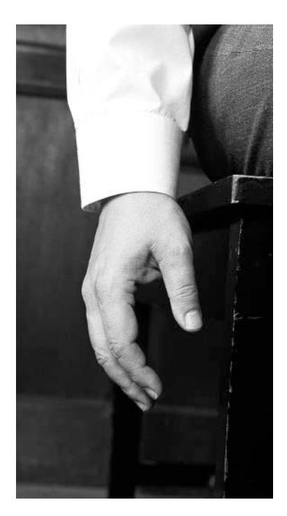

*Fig. 1.1 Naturally curved position of the hand*

In these conditions, their paramount concern is to prevent the piano from shouting. It is only once they begin appearing in concerts and start receiving comments about insuffi cient clarity of their playing, and in fact of their musical intentions, that the issue of projection comes to the fore. Even in the softest passages, when other parts of the pianist's body do just minimal work or no work at all, fi ngertips must remain as active as ever. I'll have more to say on this subject in the chapter on technique.

Having described these concrete tools of piano playing, I should emphasize that they serve to achieve the most important goal: *the ability to create an illusion*. What one does is infi nitely less important than the sound that emerges from the instrument. Thus, for instance, it is not always necessary to play physically legato to create the legato sound. In fact, eff orts to connect notes physically may make the melodic line less smooth than by playing it non legato (naturally, with the help of pedaling). In the passage from Debussy's "La fi lle aux cheveux de lin" (Ex. 1.8), the pianist who tries to connect the chords with his fi ngers can easily become "stuck" in the keyboard; the lightly gliding melodic line will be better served by gentle non legato playing, assisted by a frequently changed pedal. The key to success in this and similar cases is an ideal matching of the attacks of successive chords. In playing this excerpt, as well as numerous other examples of legato chords (see Debussy's "La cathédrale engloutie," his Sarabande from *Pour le Piano,* or the piano statement of the fi rst theme of Beethoven's *Emperor* Concerto), the pianist's hands move carefully from one chord to the next as if carrying a cup full of liquid.

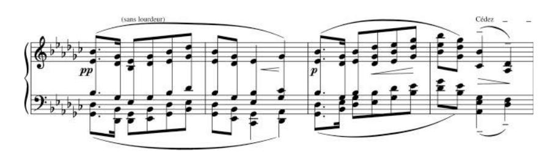

*Ex. 1.8 Debussy, "La fi lle aux cheveux de lin," from Preludes, book 1*

On the other hand, too often we hear insuffi cient legato, even though technically the pianist does not break the melodic line. To remedy it, the pianist needs to stay in the key with the weight he brought in, not to withdraw it but to pass it to the next fi nger. I cannot emphasize enough that I am talking here about the weight and not the pressure, which should be avoided at all cost. Here, too, very close listening is crucial.

Control over dynamics is an important manifestation of cultivated touch. Heightened awareness of diff erentiation of dynamics can be traced to the piano literature of the early twentieth century. Baroque music used just two indications, forte and piano, almost exclusively (only occasionally can we fi nd examples of pianissimo in J.S. Bach's music). In keyboard music of the time, these dynamic markings served merely as an indication for a louder or softer keyboard on harpsichord or organ. Classical period composers used a greater number of dynamic markings; Romantic composers used still more. Even so, these indications were not meant to be interpreted literally. In fact, very often we would play an expressive passage in Romantic music in the mezzo-forte dynamic range, though the composer's indication may be piano.

It was Claude Debussy who revolutionized our perception of the scale of dynamics. In the development of piano playing his importance may be compared only to that of Liszt. Whereas Liszt reached new horizons in matters of velocity, Debussy raised the level of awareness of touch control to an unprecedented height. His indications require precise changes of minute dynamic gradations. See, for example, the end of *Pagodes* from *Estampes*, in which the dynamic indications are *ff , dim, p, dim, pp, più pp, encore plus pp*, and *aussi pp que possible*. Even more demanding are the occurrences when he uses several layers of texture within the same dynamic level, each requiring a touch and articulation of its own (Ex. 1.9). Touch control was carried further in serial music, which assigns every note its own indication of dynamics and articulation, as in the groundbreaking *Modes de valeurs et d'intensités* by Messiaen (Ex. 1.10).

I am convinced that a contemporary pianist simply cannot function without acquiring the precision of control over the scale of dynamics. We all

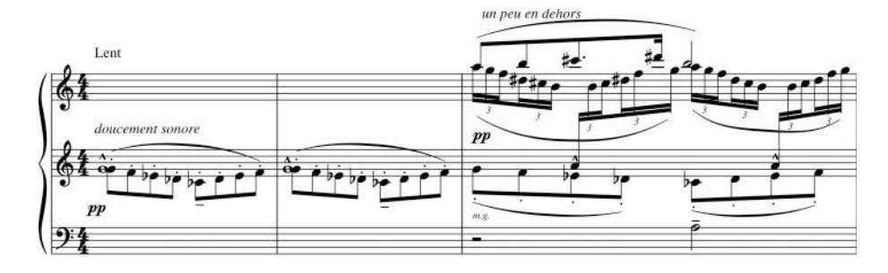

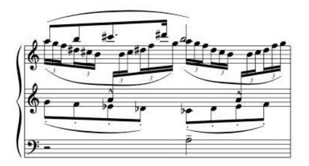

*Ex. 1.9 Debussy, "Les cloches à travers les feuilles," from* Images*, book 2*

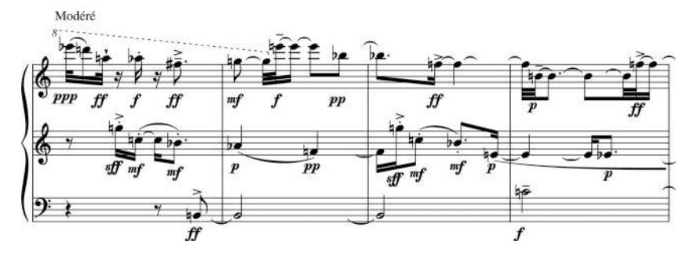

*Ex. 1.10 Messiaen,* Modes de valeurs et d'intensités

know that every pianist's dynamic scale is diff erent. Besides, when a pianist switches from one instrument to another, from one hall to another, he adjusts the dynamics accordingly. And yet, within the conditions of a specifi c performance, one is frequently required to establish a more or less absolute dynamic scale. To clarify this concept, I often ask students to play a short melodic phrase repeatedly, changing the dynamics on my request. Starting with *mf*, for example, we proceed to *pp*, to *f*, to *mp*, to *p*, and then back to *mf*. When the student returns to *mf*, I insist that it sound neither louder nor softer than it did before. The objective of this exercise is to establish a scale of dynamics to teach the pianist, for example, that *mf* is not merely somewhat louder than *p*, but exactly two steps above it.\*

Playing two or more notes simultaneously, we must prioritize, or voice, the dynamics between them, even when the composer is not making specifi c demands. The more notes that are struck simultaneously, the more important the issue of voicing becomes, particularly in loud playing. Nothing on the piano sounds more vulgar than a loud chord in which all notes shout indiscriminately. Each chord must have a certain leading note, while the other tones in the chord should be voiced down. To accomplish this, the pianist needs to decide which sound in the chord (or which line in the chordal progression) to highlight. Then he must have enough control over his fi ngers and enough fi nger independence to execute it. The exercise in Ex. 1.11 helps the fi ngers to develop these qualities. The white notes of the chords shown in the example are to be played forte, the rest of the notes piano. Practice with both hands playing separately as well as together. Later choose diff erent, less convenient chords.

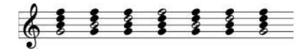

*Ex. 1.11*

In the past several hundred years the leading melodic line was entrusted with increasing frequency to the top voice. As a result, our ear habitually craves the clarity of the top line. In chordal textures, the highest note of the chord is almost always the melodic one and needs to be highlighted. Insuffi cient voicing of the top notes of chords (or of octaves) makes them sound

\* Establishing the dynamic scale does not absolve the pianist from mastering differences of sound within each category. *Forte pesante* should sound diff erent from *forte leggiero*; *piano espressivo* from *piano misterioso*.

"blind," lacking profi le and clarity. Sometimes we voice to reveal a hidden melody, like the bass line of a passage from Beethoven's "Eroica" Variations (Ex. 1.12). On other occasions the pianist achieves diff erent shades of color by choosing to highlight certain notes within the chord, or a certain line in the chordal progression. In the beginning of Debussy's *La cathédrale engloutie* the diff erent choice in voicing indicated by "+" and "−" in the two examples changes the color of the passage (Ex. 1.13).

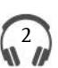

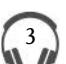

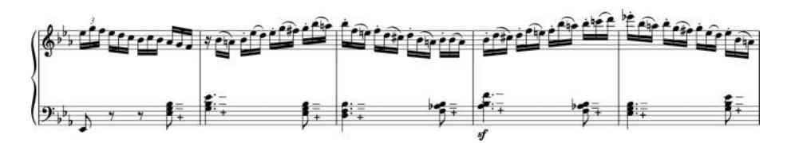

*Ex. 1.12 Beethoven, 15 Variations with a Fugue ("Eroica"), op. 35, fi nale*

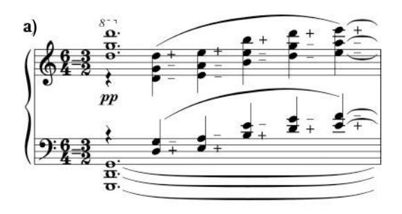

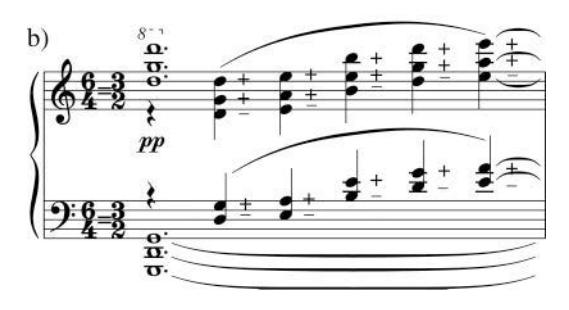

*Ex. 1.13 Debussy, "La cathédrale engloutie" from Preludes, book 1*

When a melodic line is doubled in one or two octaves, whether played by one or two hands, we usually bring out the upper line. However, changing the balance in favor of the lower voice can be very eff ective in giving a darker color to the passage. In all matters of voicing, one should take care to maintain consistency of balance between lines or within chords.

A related issue is the balance among diff erent elements of a texture, for instance among melody, accompaniment, and secondary voices. Even the less-complicated texture, for instance, of many Chopin nocturnes, valses, or mazurkas requires careful treatment. What many inexperienced players regard as two-part writing (melody and accompaniment) is, in fact, threepart writing: melody, low bass, and chords in the middle register, or the harmonic "stuffi ng" (Ex. 1.14). Beautiful sonority is achieved only if the bass has a resonant, airy quality and the stuffi ng is played very lightly and sensitively.\* Balance among these components will determine the way one uses the pedal (see the chapter "Pedaling"). The separation of sonorities among these strata will help the performer to reveal the inner life of each of these layers and enhance the clarity of the voice leading.

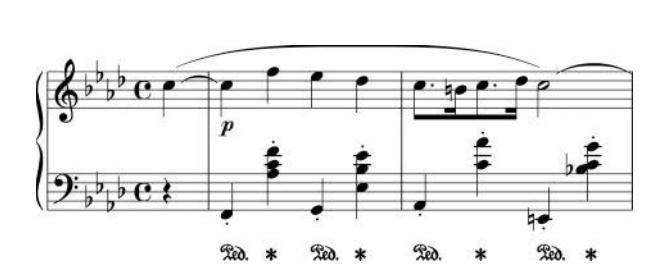

*Ex. 1.14 Chopin, Nocturne in F Minor, op. 55, no. 1*

In accompaniment presented in the form of rolled arpeggios (Ex. 1.15), one should not play each note of an arpeggio with the same degree of loud-

\* In such instances, the bass is usually played "out" from a deep layer of the keyboard. A comparison with the resonant *pizzicato* of the double bass may be helpful. Clearly, the loudness as well as the speed of the stroke change depending on the circumstances.

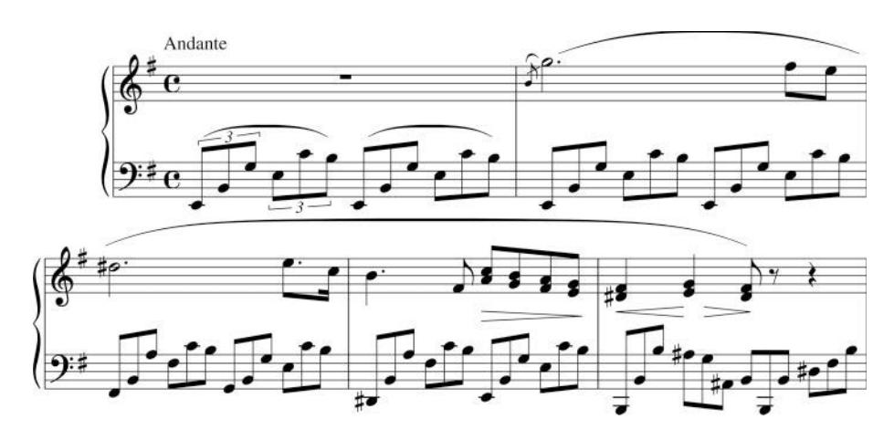

*Ex. 1.15 Chopin, Nocturne in E Minor, op. 72, no. 1*

ness. Usually, after the full and resonant low bass the few notes that follow it are played softer, gradually emerging with a slight dynamic increase.

I have paid so much attention to the issue of *producing* the sound, of the beginning of the tone, that it threatens to overshadow the even more important factor, that of the follow-up, of "listening through" the note. Phrases cannot sing without the pianist listening between the notes. Heinrich Neuhaus suggests a very good exercise to become aware of this concept (Ex. 1.16a).9 It can be made more complicated by including additional dynamic gradations (Ex. 1.16b). It is essential to match the dynamic level of the new sound to that of the preceding note, not at the point of the attack but at the very end of it.\* If a pianist is using the "in" touch while listening between the notes, the pressure his fi nger exerts on the key will keep diminishing as the ear follows the decay of the sound, so that it is ready to match the touch required to produce the dynamics of the ensuing note.

Yet a pianist cannot be too dependent on the natural decay of the piano sound, otherwise all phrases will have to be played diminuendo. If his

\* Neuhaus also off ers the very good suggestion of practicing a melodic passage much slower than it is going to be played, as if in slow motion.

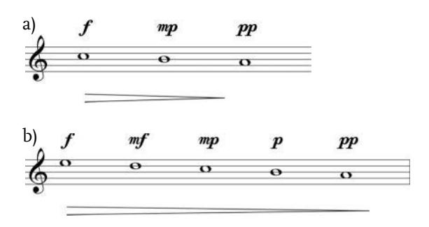

*Ex. 1.16*

 intention is to make a crescendo, he does not follow what he hears but, rather, what he imagines. (In the "in" sound the weight of the fi nger staying on the key will grow accordingly.) This technique may help to make credible crescendi on a sustained note or chord, both of which are found in Beethoven's works and which, strictly speaking, are not performable on the piano.

At any point in this chapter someone could ask, "Are all these minute details really noticeable to most listeners?" My answer would have to be, "Probably not." The ear of somebody who works constantly with the nuances of the sound of his instrument becomes much more discerning than that of an outsider, even when the outsider is himself a musician. I remember being present at a lesson where a very good percussion player demonstrated to a student diff erences in sound produced by diff erent strokes on the triangle. To my great embarrassment, I could not tell much of a difference, but both the teacher and the student clearly recognized it. When working with string players, I often witness their deliberations (and arguments) over whether to play a certain note on the A string or the D string. To me, the diff erence does not seem signifi cant.

Are musicians splitting hairs to worry about such matters? For me, the importance of this work lies as much in the practical result it achieves as in the dedication to the music it manifests. Together with Arnold Schoenberg, I marvel: "How high the development of spirit that could fi nd pleasure in such subtle things!"10 I am also reminded of the story about Michelangelo, working with great care on the back of one of his sculptures that was to be placed in a corner of a church. He was asked why he spent so much eff ort on the part that no one would see. His reply was, "God will see it."

From time to time, a composer reveals that he was thinking in orchestral terms: such indications as "quasi tromboni" or "quasi corni" appear in the score. Even without such an explicit suggestion, the pianist often feels that a certain phrase would sound wonderful being played, for example, by the oboe or the cello. He then may wish to try to create the sound evocative of that particular instrument. Performing transcriptions of orchestral works, the pianist often fi nds that creating the illusion of a specifi c instrument's sonority is indispensable. In the last four bars of "The Young Juliet," Prokofi ev's own transcription from his ballet *Romeo and Juliet* (Ex. 1.17), a pianist cannot adequately represent the sonority of the original without trying to imitate its orchestration. The fi rst scale in the left hand is scored for the harp; it is answered by the saxophone. In the orchestra, the two scales sound dramatically diff erent; the pianist is challenged to re-create this diff erence.

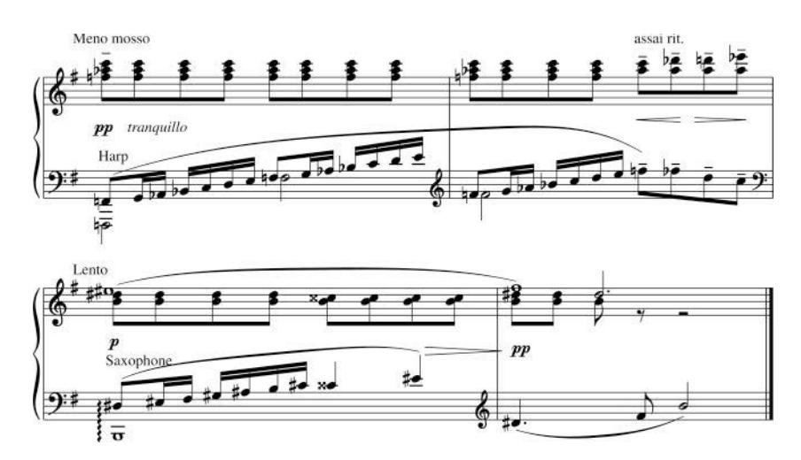

*Ex. 1.17 Prokofi ev, "The Young Juliet" from Ten Pieces from Romeo and Juliet, op. 75*

#### 24 In the Practice Room

Often a Classical or Romantic composer writes a melody in parallel thirds or sixths, evoking the sonority of two woodwind instruments, or three-note chords that are suggestive of trumpets or French horns. It can be useful to remember that in the orchestra these instruments play such passages on the same dynamic level, without highlighting the top voice.

I can anticipate a sober critic saying here: "No matter how hard you try, the piano will always sound like a piano." I agree entirely with this statement but fi nd these attempts extremely important nevertheless, as they will yield a much richer and more varied *piano* sonority. Or, as Perelman put it: "The best results are reached when one demands an impossible thing of the student: vibrato! pizzicato! tutti! French horn! drum! sing! quartet! clarinet! . . . until the student starts getting hallucinations of sound color."11

It is diffi cult to fi nd practical advice on how to make the piano sound like other instruments. In fact, I have encountered only one such example: Alfred Brendel's essay, "Turning the Piano into an Orchestra (Liszt's transcriptions and paraphrases)," published in his book *Musical Thoughts and Afterthoughts*. 12 Here are some of his suggestions:

The sound of the oboe I achieve with rounded, hooked-under, and, as it were, bony fi ngers, in poco legato. . . .

The fl ute . . . whenever possible, I play every note with the help of a separate arm movement. . . .

The bassoon . . . the touch is fi nger-staccato. . . .

The noble, full, somewhat veiled, 'romantic' sound of the horn demands a loose arm and a fl exible wrist. Although its dynamics extend from *pp* to *f*, the sordino pedal should always be used. . . .

Do not forget that the harp is a plucked instrument! The pianist should play harp notes with round, tensed fi ngers—sempre poco staccato within the sustained pedal. In rapid, sharply ripped-off arpeggios, the fi nger-play is assisted by movements of the wrist.

I suggest that every pianist try to apply Brendel's recommendations, though I predict that the rate of success will not be very high. This does not mean that the suggestions of this wonderful and experienced pianist are wrong or imprecise. Rather, this advice may not work as successfully for anyone else because the delicate area of piano coloring depends so much on individual physique or on each pianist's innate approach to playing.

Still, it is extremely important for the teacher to be able to suggest to the student what to do physically if he wants to imitate a bassoon, harp, or other instrument. Even more important is to encourage students to seek their own approach, to fi nd what would work best for each person. I see it as building one's vocabulary of physical motions, a personal pianistic "toolbox." The larger the vocabulary, the more eloquent our musical speech becomes; the better equipped the toolbox, the more eff ective and effi cient the pianist's work will be. And the better the pianist controls sound, the more eff ectively he is able to communicate musical expression to an audience.

## Chapter 2: Technique

The word "technique" derives from the Greek word *techne*, which means "art." According to this defi nition, the term should cover the range of problems faced by a performer. Colloquially, however, the word is used in a much more limited way to defi ne issues of velocity and manual dexterity. Bowing to the common usage, I will focus on this limited area throughout this chapter.

I do not aspire to provide a comprehensive, defi nitive textbook on piano technique. I doubt whether such a book could be written. To begin with, so many of a pianist's physical actions are conditioned by individual physical makeup. Technique is equally the result of a pianist's musical tastes and ideals, the repertoire that is dear to him, and other factors. It is naive to think that by combining technical approaches of diff erent pianists one can create a *ne plus ultra* supertechnique. Even if such "genetic engineering" were possible, do we really want to hear a pianistic Frankenstein who would combine the precision and control of touch of, say, Michelangeli with the velocity of young Ashkenazy and the sensitive shading of Lupu? Probably not, for the technique of every good performer is an inseparable part of his artistic personality and, as Wilhelm Furtwängler put it, "standardised technique creates in return standardised art."1

Of the many technical approaches, teachers generally emphasize one of the following three fundamental physical actions: (1) independent use of well-articulated fi ngers; (2) rotation movements of wrist or forearm, as well as thrust initiated by these body parts; (3) use of weight of the forearm and upper arm as the source of the pianist's physical activity. Some instructors endorse one of these actions exclusively while belittling the other two. In my opinion, it is equally wrong to exaggerate the importance of any one of these physical approaches over another or to ignore any of them. In reality, most of the pianist's movements are combinations of two or all three of these actions.

The old school espousing active fi ngers and an absolutely immobile hand was notorious for its insistence on practicing with a penny that was supposed to remain undisturbed on the back of the pianist's hand. We no longer play this way because, in addition to producing dry and infl exible sound, it could lead to muscular strain and even injury. On the other hand, some teachers, especially those specializing in rehabilitation of injured pianists, seek to replace all fi nger activity with the rotation movements of bigger joints. Such playing produces limp sound lacking articulation and precision. Although each of these approaches by itself produces totally unsatisfactory results, combination of well-articulated action by fi ngers with the fl exibility and fl uidity provided by the wrist assures naturally expressive and clear piano playing. Finally, the weight of bigger joints gives body to the sound and often provides a welcome release of tension. Substitution of effort with weight allows for brief moments of relaxation so important for the pianist. Relying too much on weight, though, can also produce unwanted thickness and heaviness of playing.

Although the combination of the elements seems to be indispensable, various considerations may infl uence the decision to rely mostly on one of them. I have occasionally entered into almost ideological arguments with fellow pianists about whether a certain passage should be played mainly by fi ngers with the support of a bigger joint or vice versa. I believe that each pianist does what comes naturally and, probably, what was stressed during his early training. Some pianists have better-developed fi ngers, while others rely on bigger joints. The important point to remember is that these different actions almost never can be separated from each other. In practice, fi ngers are always supported by bigger joints. At the same time, the action of hand or forearm should never be an excuse for the fi ngers to dangle passively, like limp noodles on a fork.

Frequently and conspicuously missing from the technical discussions of piano methodists is consideration of the music performed. We do talk about the sound quality appropriate for Rachmaninov but not for Mozart (see the previous chapter), or about the fi ngering that may be natural for Chopin but unsuitable for Beethoven (discussed later on in the chapter "Practicing"). Similarly, we should be prepared to use diff erent technical approaches for diff erent repertoire. Using the weight of the forearm would be appropriate for fast chordal passages of Rachmaninov, such as the one in the Second Piano Concerto (Ex. 2.1), but out of place in the fi nale of Beethoven's Sonata op. 2 no. 3 (Ex. 2.2), even when the material appears *forte* later in the movement. As for the example from Bach's G Major Prelude from Book II of *Well-Tempered Clavier* (Ex. 2.3), I cannot agree with the recommendation of Gyorgy Sandor to play it using forearm rotation.2 In my view, the style of the

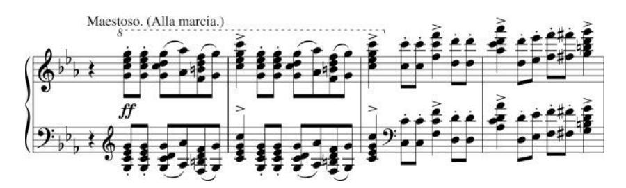

*Ex. 2.1 Rachmaninov, Concerto no. 2 in C Minor, op. 18, mvt. 1*

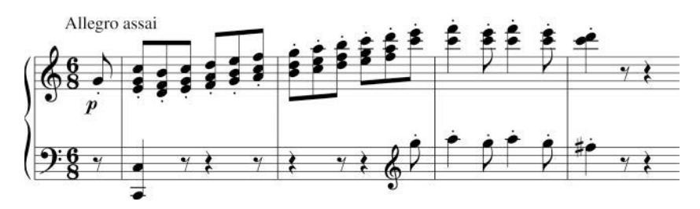

*Ex. 2.2 Beethoven, Sonata in C Major, op. 2, no. 3, mvt. 4*

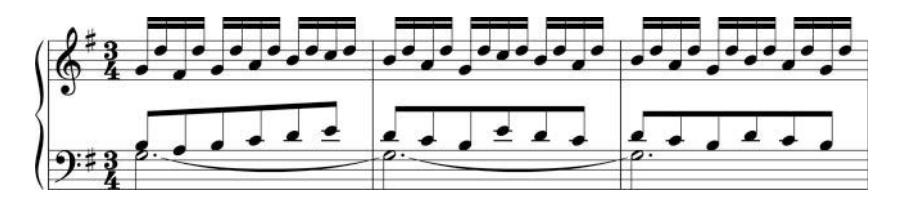

*Ex. 2.3 Bach, Prelude in G Major, BWV 884 from Well-Tempered Clavier, book 2*

piece requires clarity of articulation best achieved by fi nger action. On the other hand, the light axial rotation would be very suitable in the opening of Schubert's Phantasy for Violin and Piano (Ex. 2.4).

Light, lateral movements of the wrist along the contour of the melodic line generally bring natural expressivity to the playing. I would recommend this technique for the passage from Chopin's Fantasy in F minor (Ex. 2.5).

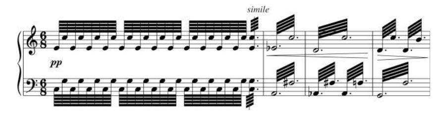

*Ex. 2.4 Schubert, Phantasy in C Major for Violin and Piano, D. 934*

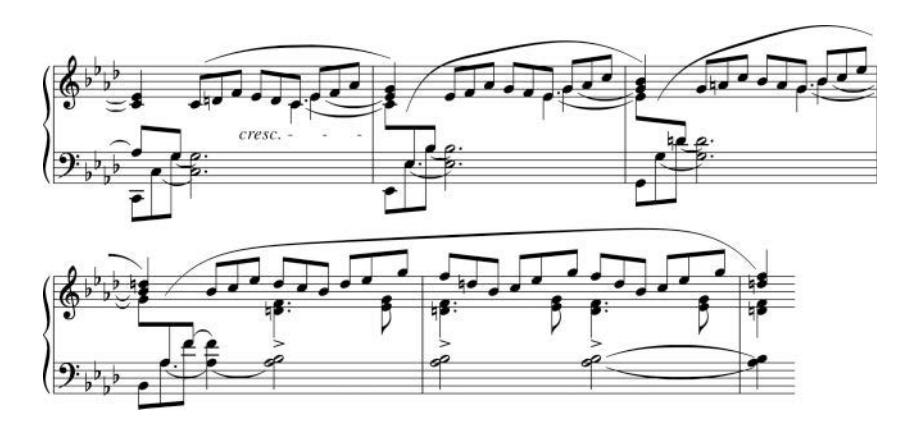

*Ex. 2.5 Chopin, Fantasy in F Minor, op. 49*

In addition, a light, ascending movement of the wrist at the end of every phrase will help make them sound light, inconclusive. (Still, contrary to Sandor, I do not believe that the upward wrist motion must accompany the end of *every* phrase, as I do not think that every musical phrase needs to end lightly.) If these little wrist "loops" were used in the beginning of the fi nale of Prokofi ev's Sixth Sonata (Ex. 2.6), however, the music would sound too "nice," too gentle, and be robbed of its stubborn, unyielding character.

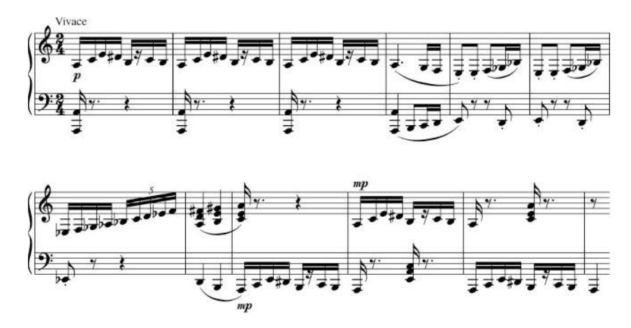

*Ex. 2.6 Prokofi ev, Sonata no. 6, op. 82, mvt. 4*

I believe that two pillars form the foundation of good piano technique: I will call them "the economy principle" and "the extension principle." The "economy principle" requires the pianist to be economical in his movements, not to use a bigger part of his body—fi nger, hand, forearm, arm when a smaller one will suffi ce. To quote William Newman, "For utmost effi ciency we must use the least powerful lever that will answer our need."3 To be inclusive, this formula must address musical needs as well as technical ones. The beginning of Bach's F Major Invention (Ex. 2.7), for example, can be played easily by fi ngers alone, but such performance may sound too thin and insuffi ciently articulated. One may wish to incorporate a light, bouncing motion of wrist as well to add more body and spirit to the sonority.

The "extension principle" requires us to regard each of the various segments of our piano-playing anatomy (fi nger, hand, forearm, arm) as the

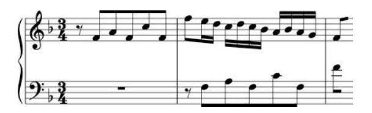

*Ex. 2.7 Bach, Invention in F Major, BWV 779*

continuation of the adjacent parts, with each individual unit always ready to support and share the work with the others. Collaboration among these divisions is the key to eff ortless technique. To some people this may seem contradictory to the "economy principle." "Why," someone may ask, "should I worry about bigger parts of my body if I am supposed to use the smallest of them?" In fact, even while using the small joints only, the pianist must develop the feeling of silent support given by bigger joints to the smaller ones, the sensation of the continuity of the muscular fl ow. Joints not involved in the playing must never be tensed; rather, they are to be kept in a state of active relaxation, always ready to join in.

In accordance with these two principles, we shall discuss the functions of each joint, starting with the smallest. Before proceeding, however, I would like to address the issue of the position of the pianist's hand and of his whole body at the keyboard.

In the early stages of learning to play the piano the position of the pianist's hands and overall posture at the piano rightly receive a lot of attention. Working with advanced students, piano teachers usually treat this issue much more liberally than do our string colleagues, because piano playing seems to allow considerable latitude in this area. In my teaching I prefer not to interfere unless I sense that the wrong hand position of the student gets in the way of his music-making.\* This does not mean, however, that I do not have a defi nite opinion on this matter. For me, the correct shape of

\* Sometimes my reasons for not interfering are similar to those that prompted the great Russian violin teacher Yuri Yankelevich to say to his young assistant who was zealously fussing over the hand position of a student of limited talent: "Remember that even with a wrong hand position one can play violin . . . badly." He obviously felt that the investment of eff ort, painful for the student and the teacher alike, was not likely to make a signifi cant diff erence in the student's playing.

the pianist's hand is the one that is also the physiologically innate one, with naturally curved fi ngers (as discussed in the previous chapter). Esipova described this position as one of "holding a ball" and coined the term "*la main voutée"* (the vaulted hand).4 I consider this position to be standard. As the shape of the fi ngers may change slightly, depending on whether we want to use the fl eshy cushion of the fi nger or its pointed tip (see the previous chapter), the hand assumes a slightly lower or higher position correspondingly. Keeping the fi ngers exaggeratedly straight creates tension in the palm of the hand and forearm and should be avoided.

The height of one's seat at the piano is determined by the position of the elbows, which should not be below the level of the keyboard to avoid introducing too much weight into the playing. Sitting *much* lower prevents the pianist from using the weight of his upper body. (I am convinced that Glenn Gould was able to play the way he did not because of his abnormally low sitting position but in spite of it. It certainly has not worked as well for some of his emulators.) People with a small build in particular may need every ounce of their upper body weight to produce a powerful and full sound. On the other hand, sitting too high may invite shallow playing, with fi ngers not reaching to the depth of the keys.

The wrist should be positioned to form a more or less straight line between the elbow and the knuckles. Holding it too low will interrupt the fl ow of muscular continuity from the shoulder to the fi ngertips. Holding it too high brings fi ngers too close to the surface of the keys, interfering with articulation. However, slight changes in the height of the wrist are often useful, among other things, to prevent tension in the forearm.

As has been discussed in the previous chapter, the *fi ngers* must always be active; this is essential for enunciation. More specifi cally, it is the tips of the fi ngers that must always be alert.

Every instrumentalist or singer strives to achieve clarity of performance, and for each of them one or more parts of the body are responsible for enunciation. For singers as well as woodwind players these are the lips and the tongue; for string players it is the right arm that brings the bow into

contact with the strings. For pianists, this function is performed by the fi ngertips. In loud passages, when we use the forearm and upper arm to create powerful sonority, the fi ngertips give defi nition to the sound; without their contribution the sound may become too booming, overwhelming, or unfocused. In soft passages, when the activity of bigger joints is minimal, the fi ngertips must remain as active as ever. This technique can be compared to an actor's stage whisper, which involves action of the lips, not the vocal cords, to enable the voice to carry the words to the hall.

A common mistake is to decrease the alertness of the fi ngertips when playing softly, which makes the sound fuzzy. To correct this fl aw I ask students to play a scale in a long, continuous diminuendo, making sure that the fi ngertips remain equally sensitive and alert throughout.

The importance of well-developed fi ngers is undervalued in some quarters and overestimated in others. Having worked with students in diff erent countries, I can make a (facetious) observation about the Northern Hemisphere: in the territory between Tokyo and Warsaw one is likely to encounter an overrated attention to fi ngers, while between Warsaw and San Francisco their importance is often overlooked. Sometimes I hear the opinion that the activity of fi ngers is dangerous and causes injuries. I am convinced that this is a misconception. Finger technique is not only indispensable but also completely safe if practiced properly. First of all, fi ngers often play very lightly, producing no muscular strain at all. Any tension that does exist during soft playing indicates that the pianist's posture or hand position is wrong and needs to be corrected. But even when requiring stronger action of the fi ngers, the pianist should not produce it by vigorously lifting the fi ngers and bringing them down powerfully. Instead, I suggest holding the fi ngers at some distance above the keyboard and releasing, or dropping, them. The acceleration of a falling fi nger allows it to gain strength by the time it reaches the key. The image I sometimes use is: I do not lift my fi ngers, they just live there, on the second fl oor. When the time to play comes, a fi nger is dropped while the one that has fi nished playing is coming home. If I feel that the passage requires more active articulation, I move the fi ngers one fl oor up. If I need less articulation, I'll move them a fl oor down.

To develop the ability of holding the fi ngers at various distances from the keys, I recommend practicing scales while positioning fi ngers (a) very close to the keys, (b) at a small distance from the keys, and (c) at a considerable distance from the keys. This exercise is not easy for those students who are accustomed to feeling the surface of the keys under their fi ngers at all times and are afraid to lose this direct contact. They experience diffi culty in letting the fi ngers fall from above. Instead, they break the movement into two parts, bringing the fi ngers in contact with the surface of a key fi rst and stopping momentarily before pushing the key down. Obviously, this action does not achieve the goal. It takes time to overcome this "fear of heights" and to let the fi ngers plunge into the key from above without stopping on the surface.

Depending on the sound goal of the passage, the fi ngers need to be either "glued" to the keys (as in Chopin's Etude op. 25 no. 2 [Ex. 2.8]), lightly dropped from a short distance (many passages of Mozart sonatas and concertos), or very quickly dropped from approximately one to one and one-half inches above the key (Brahms Concerto no. 1 [Ex. 2.9]). In the last example,

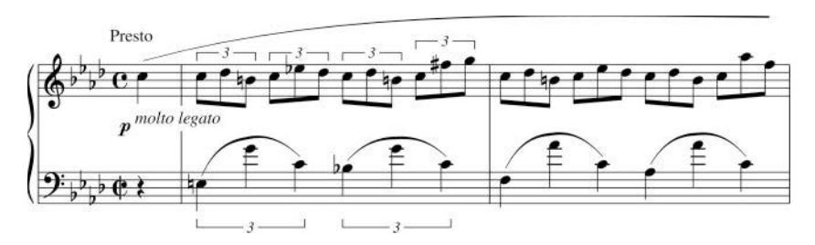

*Ex. 2.8 Chopin, Etude in F Minor, op. 25, no. 2*

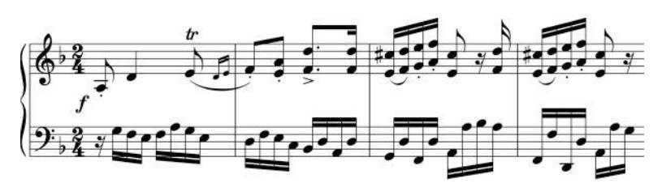

*Ex. 2.9 Brahms, Concerto no. 1 in D Minor, op. 15, mvt. 3*

the tempo is too fast for the pianist to involve his hand or forearm; on the other hand, playing the passage legato does not produce the required clarity and decisiveness. The solution is to play the passage with fi nger staccato (*quasi pizzicato*), making a plucking motion toward the pianist. This way the fi nger will be off the key sooner than if it were lifted straight up. Other examples of fi nger staccato include the beginning of Prokofi ev's 7th Sonata (Ex. 2.10) and the left-hand part in the second movement of Beethoven's op. 31, no. 3 (Ex. 2.11).

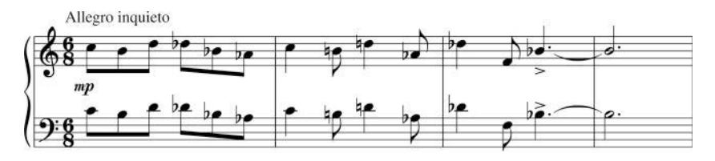

*Ex. 2.10 Prokofi ev, Sonata no. 7, op. 83, mvt. 1*

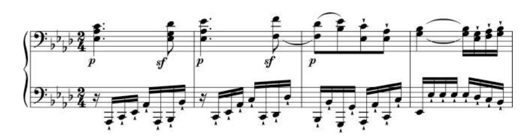

*Ex. 2.11 Beethoven, Sonata in E-fl at Major, op. 31, no. 3, mvt. 2*

(I consider fi nger staccato an essential and very eff ective technical device, but the pianist needs to exercise great care when practicing it. The energetic plucking action of the fi nger may lead to overstraining of fl exor muscles located on the inner [volar] side of the forearm. When learning a passage with one hand, the pianist can put the other hand on the inner [lower] part of the forearm to check that every eff ort required to produce the plucking motion is followed by a moment of relaxation of the muscles.) ^berman-flexor-safety

One of the most frequently encountered problems is faulty action of the *thumb*. Except for special cases, when its heaviness is exploited, even "celebrated" (for example, in the third movement of Bartók's Sonata [Ex. 2.12]),

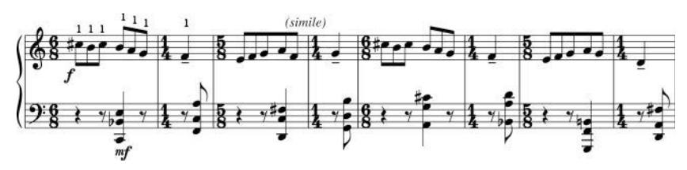

*Ex. 2.12 Bartók, Sonata, mvt. 3*

the thumb needs to play with the same lightness as other fi ngers to prevent unwanted accents. Some students seem unaware that the thumb has several joints; they use it as a little stick poking into the key. The pianist needs to realize how the phalanges of the thumb work and be able to use them. Proper thumb action is accomplished more easily if the thumb's normal position is curved (like the shape it assumes when forming the letter *O* with the thumb and the second fi nger). Involuntary accents happen often because the pianist lets his hand "fall down" every time the thumb strikes a key. This movement should be avoided; one should maintain the same height in the position of the hand.

In its role as a pivot in playing scales and arpeggios, the thumb should not be pushed under the palm of the hand by its biggest joint, but instead should be folded starting with the smallest one (Fig. 2.1). It is the tip of the thumb that pulls the bigger joints into action when necessary, rather than the other way around. Whatever functions the thumb is called upon to perform, its place is above the keys, together with the rest of the fi ngers. It should not hang outside, under the key level, as seen in some students' playing (Fig. 2.2).

The pianist must develop an extremely fl exible *palm* of the hand. Depending on the nature of the passage, the pianist makes his hand wider or narrower—that is, either expands or contracts it—to help achieve smoothness during running passages. In Chopin's Etude op. 10 no. 4 (Ex. 2.13), for example, the opening group of notes is played with a relatively wide hand to accommodate the upcoming leap; the closeness of the next group of notes requires the hand to contract to a narrow position. The hand widens gradually in the following bar and even more so in the next, in keeping with the ^berman-flexible-palm

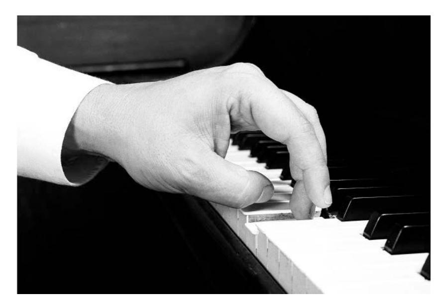

*Fig. 2.1 Correct action of the thumb*

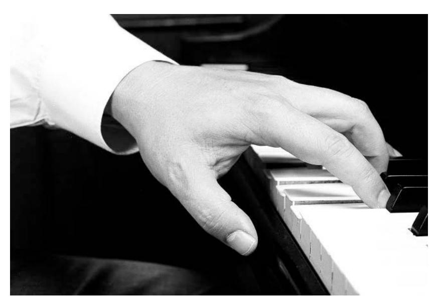

*Fig. 2.2 Incorrect position of the thumb*

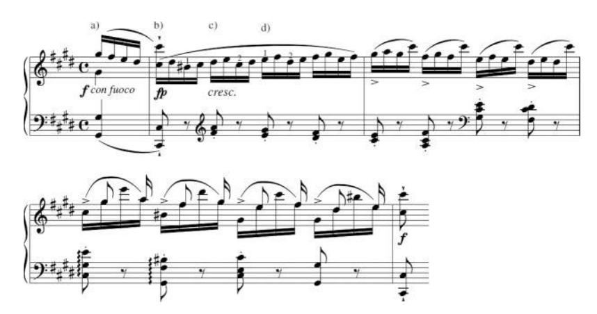

*Ex. 2.13 Chopin, Etude in C-sharp Minor, op. 10, no. 4*

changing texture. (The letters above the staff in Ex. 2.13 correspond to the timing of the photographs of Fig. 2.3.)

The expansion of a hand must not be accompanied by tension. The hand should not abandon its vaulted, or domed, shape described above. The following image may help to accomplish such tensionless expansion: Imagine you are holding in the palm of your hand a small air balloon, fi rmly enveloped by your hand and fi ngers. This balloon is connected to a pump. When the air is pumped in, the balloon grows in size; the grasp of your hand and your fi ngers expands accordingly, the fi ngers retaining their roundness. The expansion and contraction described above are closely connected with the concept of *position*, the term pianists use for the mental and physical grouping of several sounds. The hand becomes the guardian of the position and, depending on the notes that the position embraces, is made wider or narrower, expanded or contracted. Sometimes the position is wider than the hand can cover (for example, in the Chopin Etude op. 10 no. 1); correspondingly, the hand is held in a wide open position, as if able to embrace all of it. Many passages in Chopin's music require such wide positions. They are based on Chopin's personal technical abilities. According to a contemporary account, "it was a wonderful sight to see one of those small hands expand and cover a third of the keyboard. It was like the opening of

*Fig. 2.3 Expansion and contraction of the hand during playing of Chopin's Etude op. 10, no. 4, in C-sharp Minor*

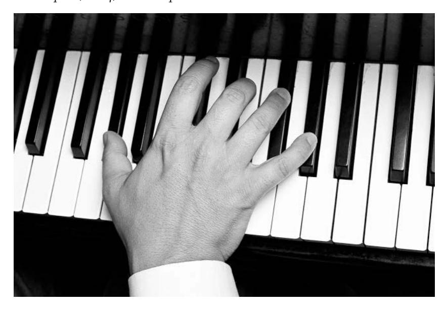

(a)

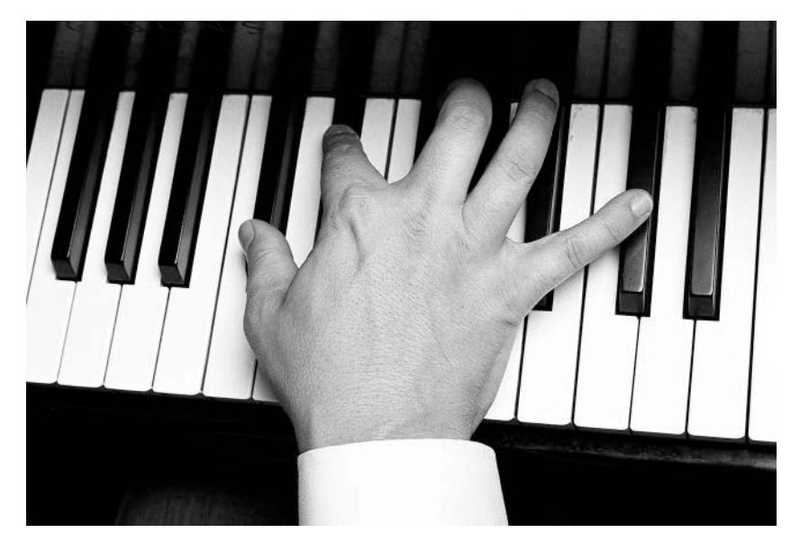

(b)

*Fig. 2.3 (continued)*

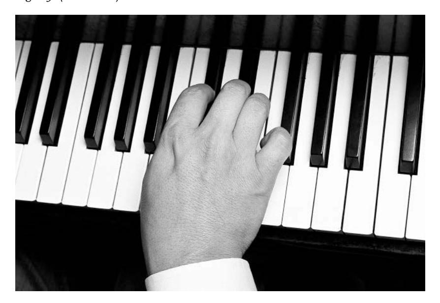

(c)

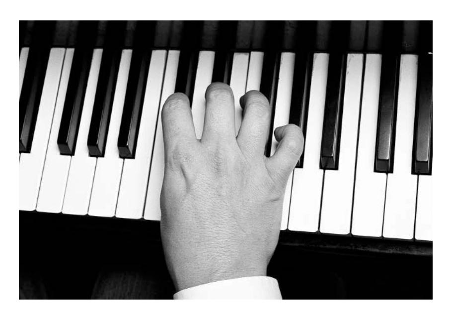

(d)

the mouth of a serpent which is going to swallow a rabbit whole."5 To follow up on this metaphor from the animal kingdom, I often tell my students that the pianist's hands should move like an octopus. This openness of the hand should not be confused with tense stretching, which should be minimized. Excessive and prolonged stretching is, in fact, a frequent cause of hand injuries, but they can be easily avoided if the actual stretching takes a very short time and if most or all of it is replaced by the tension-free opening of the palm followed by a jump or a "wide step."

In playing arpeggios or passages such as that from Chopin's Etude op. 10 no. 8 (Ex. 2.14), the pianist may wonder whether to skip from one hand position to another or to use fi nger legato. Both solutions may have undesired results. Skipping may hamper the feeling of legato and create accents on the fi rst note of each position. On the other hand, fi nger legato may require a big turn of the wrist, which, in a fast tempo, creates rhythmic and dynamic unevenness and damages the fl ow. I advocate a compromise approach: retain the positions, but attempt to connect them. In the excerpt

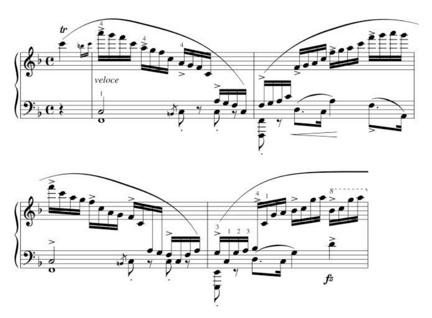

*Ex. 2.14 Chopin, Etude in F Major, op. 10, no. 8*

#### 42 In the Practice Room

12

from the F Major Etude, start turning the wrist as if trying to connect the thumb, which plays the last note in the fi rst group, with the fourth fi nger, which introduces the new position. When you feel that a further turn of the wrist may damage the fl ow of the run, skip.

It is essential for the pianist to develop a fl exible *wrist*, capable of small and rapid movements. It should be able to work fl exibly and smoothly in three ways: rotating, performing horizontal shifts, and making vertical motions. Rotating movements of the wrist are extremely useful, for instance, in playing tremolos, trills, or textures like the example from Beethoven's First Piano Concerto (Ex. 2.15). (Actually, it is the forearm that does the rotation, as the wrist is not capable of executing such a movement independently.)

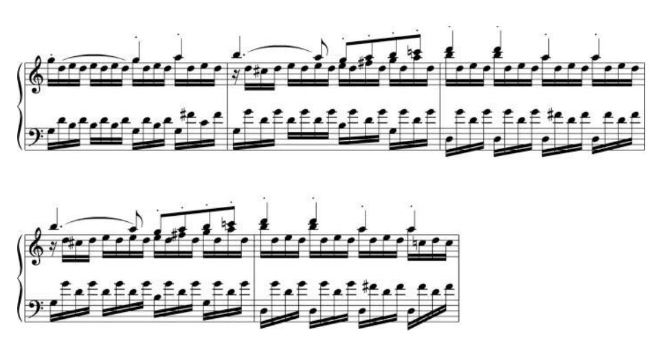

*Ex. 2.15 Beethoven, Concerto no. 1 in C Major, op. 15, mvt. 1*

Horizontal movements of the wrist, which change what Josef Lhevinne called "hand slant" in response to the design of the melodic line, are very helpful in supporting fi nger passages. Said Lhevinne: "Often pupils struggle with diffi cult passages and declare them impossible, when a mere change of the hand position, such as raising or lowering the wrist or slanting the hand laterally, would solve the problem."6 Such movements are indispensable when using fi ngering which involves passing the third or fourth fi ngers over the fi fth, as is often necessary in Baroque music or in many works by Chopin (see Etude op. 10 no. 2). They are also important for ensuring the evenness of fi nger work and for supporting the infl ection of musical phrase.

Sandor introduced the concept of adjusting movements of the wrist: when, say, the fi ngers in the right hand play in succession, from the fi rst to the fi fth fi nger, the wrist will make a corresponding movement to the right to align each fi nger with the forearm muscles that govern its work. I fi nd this concept useful only if these movements are kept very slight.

Vertical motion of the wrist is indispensable to playing octaves and chords. A well-trained wrist is capable of performing a gamut of motions, from a barely perceptible tremor for producing lightly shimmering repeated octaves, to the strong bounce necessary for chords in the "Russian Dance" from Stravinsky's *Petrouchka*. Naturally, in loud passages like these, the wrist joins forces with fi ngers and forearm.

Apropos the "Russian Dance," I once had a student who played it as though he had one solid bone from the elbow to the fi nger knuckles, and the repeated chords were negotiated through extreme tension of the forearm as if by a sheer act of will. The student was lucky not to have developed muscular pains. The sound he was producing, however, was quite painful to hear. This kind of playing derived from his early training, which concentrated almost exclusively on fi ngers. Although he used his forearm for chords and big leaps, his wrist had been neglected and remained essentially underdeveloped. In the course of our work the student was able to incorporate wrist movements into his performance of *Petrouchka*, resulting in dramatic reduction of the tension and a much more agreeable sound.

The change did not come naturally to him, because wrist technique needs to be developed early in the pianist's life; it is much more diffi cult to accomplish later. A teacher can, nevertheless, help a physically stiff student to loosen up. As a fi rst step I ask the student to stand and face me. I hold three or four of the student's fi ngers (never one) and move the arm gently in various directions and in circles, insisting that the student relax

#### 44 In the Practice Room

his muscles completely and entrust his hand to me. This exercise helps the student to discover "hinges" at various points: knuckles, wrist, elbow, and shoulder. Having experienced the looseness of these hinges, the student should not allow the limbs to stiff en at these joints. From here the pianist works toward delicate coordination of the movements of various parts of the body.

When a group of repeated chords (or octaves) is to be played at a fast tempo, like the circled section at the end of Ex. 2.16, the chords are usually played as if generated by a single physical impulse on the fi rst chord; the rest of the chords are played by a "ricochet" bouncing of the wrist, like a pebble sent skipping across a pond. When one of the repeated chords or octaves forms an upbeat to the next, such as the pairs of repeated chords in the example from the Tchaikovsky Concerto no. 1 (Ex. 2.17), the approach is opposite: we play the fi rst chord as if "on the way" to the second one. In other words, the fi rst chord is played less deep into the keys than the second. When, with the second chord, the wrist brings fi ngers to the deepest layer of the keys, the forearm simultaneously starts the "shock-absorbing" upward motion.

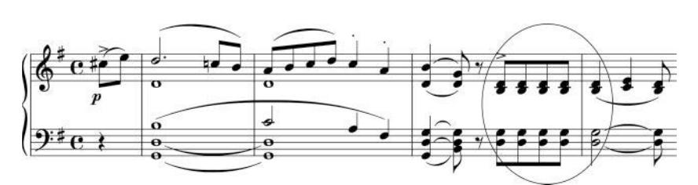

*Ex. 2.16 Schubert, Sonata in G Major, op. 78, D. 894, mvt. 4*

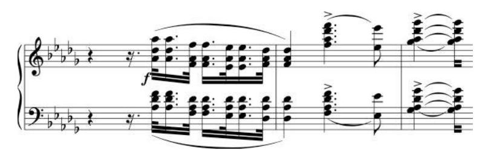

*Ex. 2.17 Tchaikovsky, Concerto no. 1 in B-fl at Minor, op. 23, mvt. 1*

Though loud and long octave passages are usually played with a fi xed, unbending wrist kept in a high position, occasional movement of the wrist can be very useful in preventing tension in the muscles.

One of the diffi cult elements of piano technique is the *trill*. There are two ways to play it: by the action of fi ngers or through rotation. The pianist should master both techniques, though probably one of them will feel more natural for his physical makeup. In cases of a prolonged and loud trill, the combination of fi nger work and rotation seems prudent. The pianist should be able to trill with any two adjacent fi ngers, as well as with the 1–3–2–3 fi ngering. Sometimes the circumstances dictate using two nonadjacent fi ngers, and the pianist must be prepared for this as well (1–5 and 2–5 are probably the only combinations that are never used).

The primary role of the *elbow* is to serve as a pivot, remaining generally in the same position as it helps the hand to move along the keyboard. (When the hand must leap a great distance, the elbow starts moving along a horizontal line parallel to the keyboard, either away from the pianist's body or toward it.) It enables the arm to reach distant areas of the keyboard without shifting the whole body in that direction. The elbow also functions as a pivot for the forearm to move vertically. Only when the whole arm is involved in playing loud chords does the elbow participate in the downward motion, but it should not descend below the line of the keyboard. When the elbow is not involved in the action, it should remain in a position of "sympathetic neutrality," ready to participate when needed. For soft passages played primarily with the fi ngers, the elbow serves as conduit for tacit support from the arm.

Sometimes the concept of a "fl oating elbow" becomes useful. Imagine sitting in a bathtub with hands on knees while the tub fi lls with water. When the water level reaches the elbows, they start fl oating. This feeling is particularly useful for yet another function often assumed by the elbow, that of the "shock absorber." When the pianist performs loud chords, the elbow shares with the wrist in the role of cushioning the stroke and absorbing the

excessive force. (The fl oating elbow image is related to that of a parachute attached to the pianist's elbow described in the preceding chapter. The latter metaphor can be helpful to make the sound rounder and to add air to it.)

The position of the elbow should ensure that both the forearm and the upper arm are in a tension-free, alert state. There should be some distance between the elbow and the side of the pianist's body; I sometimes ask the student to feel the air between the two. On the other hand, keeping the elbow too far from the body (and therefore too high) may become tiring for the pianist. Another important role of the elbow is to assist the wrist in smooth execution of the lateral adjusting movements described above. The elbow moves in the same direction as the wrist in small, well-balanced movements.

I previously discussed the importance of using the weight of the *arm* in playing chords. The weight of this bigger lever, brought in from above, produces a full, unforced forte. Neuhaus discusses very eloquently the mechanics of piano playing borrowing well-known terms and symbols of physics: force (f), height (h), mass (m), and velocity (v). To rephrase his conclusions, with which one cannot disagree: loudness, or force (f), is greater when using either a larger acting part of the body with a larger mass (m) or greater speed (v) to activate the key. Because the speed is developed over distance, the greater the distance traveled by the hand, or the height (h) from which it descends, the greater the loudness (f). Of course, the same loudness can be achieved by pushing the hand into the keys, but the resulting sound may be unpleasantly forced. Also, the pianist is likely to tire quickly. Sometimes the chord's confi guration requires the fi ngers to be carefully prepared so they do not miss the notes. In these instances the pianist has no alternative but to use the thrust from a close distance, rather than the fall from above. Still, the fall should remain the preferred solution whenever possible.

In instances requiring hand-crossing, or when the hands come very close to each other, the pianist needs to choreograph his movements carefully.

The hands must act on diff erent horizontal planes, with one assuming a higher position than the other. In the case of wide leaps of one hand over the other the forearms also travel on two parallel levels. The pianist needs to decide which hand is playing above and which below and where they switch their positions. I recommend that the pianist make this decision early in learning a piece, mark the score accordingly (the traditional Italian indications are *sopra* and *sotto*), and always practice these passages in the same way. With regard to such hand-placement decisions, I suggest that the hand with either a more signifi cant part musically or a more demanding one technically be assigned the more comfortable position, leaving the other hand to adjust accordingly.

To be complete, I should mention the *diaphragm*. This muscle separating the chest and abdomen is important for the performer as it regulates breathing. If the diaphragm is tensed as a result of either physical eff ort or stage fright, the pianist's oxygen supply becomes limited, which may adversely aff ect both the musical phrasing and the overall well-being of the pianist. Taking a few deep breaths may help to loosen the diaphragm.

Observing the playing of good pianists, one is impressed by how "smart" their hands look: economical in their movements, anticipating the direction and shape of an upcoming passage and the composition of the impending chord. Such an impression is made because these pianists have the foresight to make transitions or leaps smoother by preparing for them as early as possible. Many technical diffi culties disappear or become less problematic if the pianist can anticipate in this manner. For instance, if an upcoming passage involves playing predominantly on the black keys, the pianist should move the hand toward the black keys (away from his body) in advance. (To make smooth transitions of the hand from the outer to the inner part of the keyboard and back, I often glide my fi ngers along the keys.) Anticipating a passage in a distant area of the keyboard, a pianist should position his bigger joints and the body itself to shorten the leap and to "deliver" fi ngers to the appropriate area of the keyboard smoothly.

When activity on the keyboard shifts from one register to another, the *torso* of the pianist should not only participate in the move but frequently anticipate it, shifting ahead of the hands rather than following them. Playing the second subject of the Scherzo no. 3 by Chopin (Ex. 2.18), every pianist will move to the right for the second half of the phrase. However, the transition will be much smoother and the musical continuity will gain if he makes this move not when the change of register occurs but during the preceding two bars, while the hands are still playing the chords, as marked in Ex. 2.18.

One of my early pianistic "revelations" occurred while my teacher prodded me to move my body to the right to accommodate an ascending passage (she actually delivered quite a strong push to my left shoulder). I was surprised to discover that it was possible to play without *both* buttocks being glued to the bench. The pianist should also adjust the position of his body to give more room to the hand if it moves toward the middle of the keyboard. If both hands have to play in the middle register, the forearm or upper arm may feel jammed by the proximity of the pianist's body. Moving the body backward slightly will help. If the hands play at the opposite ends of the keyboard, the body should lean forward a little.

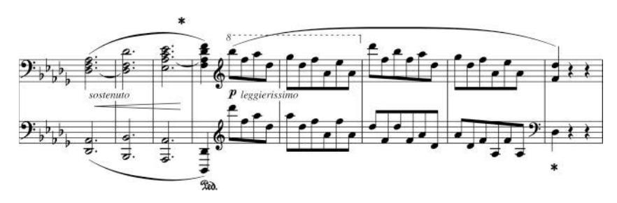

*Ex. 2.18 Chopin, Scherzo no. 3 in C-sharp Minor, op. 39*

In many instances, skillful maneuvering of the pianist's body may turn a clumsy rendering of cumbersome passages into a graceful one. I defi nitely do not advocate unnecessary gyrations at the piano, yet I cannot help but

notice that pianists who sit at the piano as if they were made of stone make music that is just as stiff .

Sometimes an action seemingly as trivial as where and when pianists focus their eyes makes a big diff erence. Working with a student who could not play the leaps in the Finale of Beethoven's Sonata op. 27 no. 1 (Ex. 2.19) cleanly, I insisted that she move her gaze, turning her head in the direction of the next leap a little ahead of her hands (at the times indicated in the score by asterisks). The diffi culty magically disappeared.

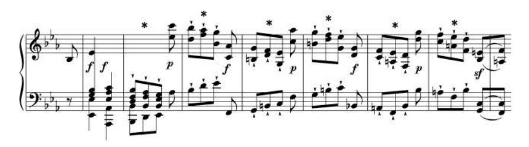

*Ex. 2.19 Beethoven, Sonata in E-fl at Major, op. 27, no. 1, mvt. 4*

In many instances, however, the pianist's eyes are engaged in an area of diffi culty in one hand's part and cannot help the other hand to fi nd the right notes (or the pianist is busy looking at either the conductor or his chamber music partners). To master various *leaps* involving either individual notes or chords, one needs to develop a sense of distance on the keyboard. (Pianists have it easier than string players, who, without the help of any visual mark, have to develop a feeling for distance on the fi ngerboard to fi nd notes.) Blind knowledge of the keyboard is also a precondition for good sight- reading, because it requires the pianist to be always looking at the score and not at his fi ngers. Many pianists consequently acquire a habit of gliding along the keyboard to fi nd the right note by touch, much in the same way that a sightless person would. This way of playing never produces assured, confi dent playing, which can be achieved only by building an invisible bridge or arch between the notes. Neuhaus made this excellent comparison when he said that piano playing "is truly the realm of non-Euclidian geometry 17

18

since, whatever Euclid may say, our fi rst axiom states: the shortest distance between the two points is a curve."7 Granted, somebody who has always "crawled" along the keyboard will fi nd this advice very risky\* and, trying it for the fi rst time, will likely start missing notes. He will need to reacquaint himself with distances on the piano, remembering that they are measured by curved arches rather than by straight lines.\*\*

When playing chords, the pianist will improve his precision if, whenever possible, the fi ngers form the position of the chord while they are still in the air and fall on the notes like a hawk diving on its prey. In the case of octaves, both the stretch of the palm and the right shape of the thumb and the fi fth (or fourth) fi ngers need to be prepared in advance to ensure clean execution.

The pianist's technique is built with the help of a vast training repertoire. Not being engaged in teaching beginners, I am unfamiliar with the available material for this group of students. For more advanced students I would certainly recommend studies by Czerny, Cramer, Clementi, and Moszkowski before reaching out for Chopin, Liszt, Rachmaninov, or Scriabin. Even students who study works of the latter composers may benefi t from turning to the easier studies of the former group if they have a particular weakness in their technique (and few have none). In addition, one should not neglect exercises that are useful for dealing with a single technical problem, such as evenness in playing of all fi ngers and independence of their action; strengthening the weaker fi ngers (4 and 5); developing fl exibility and endurance of the wrist; or increasing elasticity of the hand and stretches between fi ngers. (Attempts to increase independence of fi ngers and stretches between them should be made with the utmost caution; such eff orts ruined many pianistic careers, including those of Schumann and Scriabin.)

\* &quot;The creature, born to crawl, cannot fl y," wrote Maxim Gorky in his "Song of the Falcon."

\*\* This "fear of heights" has been described above in connection with the dependence that many pianists develop on feeling the surface of keys under the fi ngers.

Exercises have advantages over studies because they focus on a specifi c problem and provide for unsparingly methodical repetition of the same formula in both hands (I also recommend transposing exercises to other keys). They are also much shorter than studies and require no time to learn. Unfortunately they are quite boring and usually devoid of even a semblance of musical content. The pianist should therefore limit the time he spends on them to avoid hindering his musical development.

Among numerous collections of exercises I favor those of Brahms, Tausig, and Hanon (Brahms's exercises are unquestionably the most musically satisfying). Some of them are well worth incorporating into a daily technical routine, which I strongly recommend to every student. (Along with many professional pianists, I fi nd such a routine to be highly useful for daily warm-up.) In addition, throughout the history of piano playing many pianists have integrated technically diffi cult passages from the "real" repertoire into their technical work. It may seem demeaning for individual Chopin preludes or the Finale of "Appassionata" to be turned into a study, but the truth is that they are no less useful than the "legitimate" technical repertoire. Besides, working on them is much more musically rewarding, and one ends up having at least a fragment of the great work familiar to his fi ngers.

I build my daily technical routine on scales and arpeggios, which are the essential elements for eighteenth- and nineteenth-century repertoire. Knowing them and having the fi ngering for them literally at one's fi ngertips saves a lot of time when learning any of the compositions that use them. Instead of reinventing the wheel and fi guring out the fi ngering for every new passage, in most cases the pianist would already know it. The knowledge of fi ngering for scales and arpeggios facilitates sight-reading signifi cantly. An additional benefi t of playing arpeggios of chords in various inversions is the strengthening of one's sense of harmony.

I am accustomed to playing scales and arpeggios as I learned them during my school years in Moscow. Since the collapse of the Soviet Union, this technical regimen is no longer regarded as "the secret weapon" of the Russian school. Many Russian-trained pianists, teaching all over the world,

#### 52 In the Practice Room

have passed it on to their students or have referred to it in print. Still, students often ask me to demonstrate the "Russian torture," as they called it. These requests prompted me to include them here.

All the scales and arpeggios are played from each of the twelve tones, except for the "long" arpeggios (see below), which are more practical to play starting from the white keys only. I start with a scale in parallel motion, played over four octaves both up and down, with hands playing two octaves apart (to make it easier to hear a lack of togetherness). The minor scales are played in all three forms: harmonic (up and down), melodic (up), and natural (down). Then I play the same scale in contrary motion, as well as in thirds, sixths, and tenths (Ex. 2.20), also over four octaves up and down. I follow the same procedure for chromatic scales (Ex. 2.21). Then come double thirds, both diatonic and chromatic. For chromatic major and minor thirds, I give my preferred fi ngerings (Ex. 2.22). The major thirds fi ngering

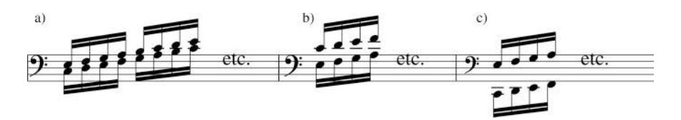

*Ex. 2.20*

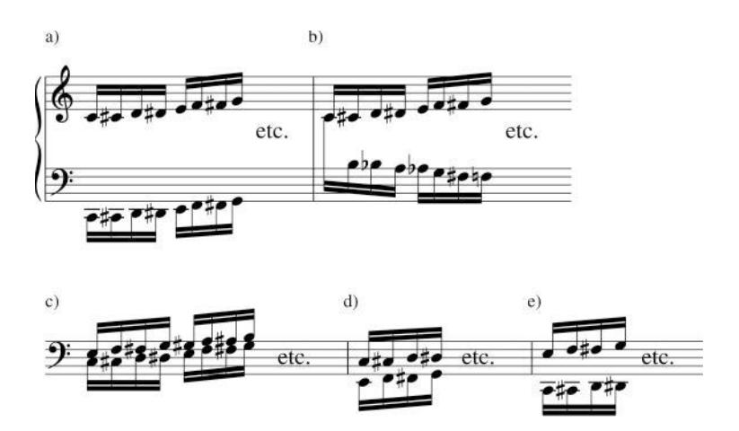

*Ex. 2.21*

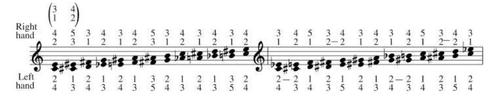

*Ex. 2.22*

is recommended by Anna Esipova;8 for the minor thirds I use Chopin's fi ngering, which was changed later in the nineteenth century to incorporate glissando of the second fi nger. The exploration of scales is concluded with playing them in parallel octaves both diatonically and chromatically.

For arpeggios, I follow the pattern of eleven chords, all based on the same note—major triad, minor triad, major sixth chord, minor sixth chord, major six-four, minor six-four, dominant seventh in root position and in three inversions, and diminished seventh chord (Ex. 2.23). I play them in three types of arpeggios: "long," "short," and "broken" (skipping one note), in both parallel and contrary motion. (Note the accentuation in Ex. 2.24, the purpose of which is to strengthen each fi nger.)

Naturally, one should not play all the scales in a single day, although the goal is to know them all eventually. For my daily routine, I choose a "scale of the day" and play it in all forms, including all kinds of arpeggios based on the same note. This takes me from twenty to twenty-fi ve minutes to complete.

*How* one practices exercises and studies is even more important than *what* one practices. Playing them carelessly, mechanically, or with ugly sound does more harm than good. Scales, arpeggios, and other exercises should be practiced in various tempi using various dynamics (including crescendo and diminuendo) and diff erent types of articulation. The pianist must strive to achieve evenness of playing, togetherness of hands, and a rounded tone. I play scales and arpeggios setting fi ngers at diff erent distances from the keyboard, as mentioned earlier.

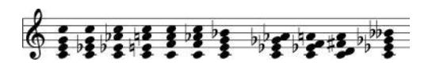

*Ex. 2.23*

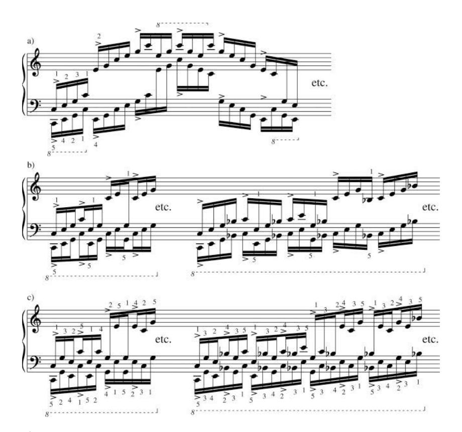

*Ex. 2.24*

Many teachers consider muscular relaxation to be the most important facet of good piano technique. I may draw fi re for this statement, but I believe that achieving a state of sustained relaxation is both impossible and unnecessary. The pianist approaches the piano not to relax but to perform a certain task involving signifi cant physical work. I cannot conceive of physical work being done without physical eff ort. The pianist's eff ort will have absolutely no harmful consequences if it does not last too long and is followed by a moment of relaxation, however brief. At the same time, the pianist needs to be vigilant and guard against tension in the parts of the body that do not participate in playing, such as the neck, jaws, shoulders, and facial muscles. In various forms, including facial grimaces or other mannerisms, this problem is familiar to many pianists, including some of the greatest. Often it is a by-product of the excitement of the performance and of the pianist's identifi cation with the emotional tension of the music he plays. As Sandor observed, "Obviously, excitement and exaltation can cause muscular tension and strain, but conscious control of our playing mechanism should help to reduce this strain and prevent it from interfering with our technical processes."9 The collateral tension that causes various pains indicates unresolved problems with the pianist's technique or posture.

Pianists fi nd many passages diffi cult not because they are tricky but because they require a prolonged and taxing eff ort. Endurance for such passages is built up gradually, by patient repetition and frequent pauses for rest, especially during initial stages of working. "Gradually" is the key word here. Forcing the muscles to work in spite of fatigue is the main cause of hand, forearm, and shoulder aches. It is often crucial to distribute the work among diff erent muscles. Small, shock-absorbing motions of the wrist or elbow may be very helpful in relieving the tension.

Prolonged loud playing can be especially dangerous. Injury can be avoided by spreading the load over a bigger group of muscles. Another important way of handling such passages is to substitute the weight of one's forearm or upper arm for eff ort whenever possible. Lifting the hand even for a very brief moment and allowing it to fall freely gives the pianist a "free ride" at the expense of gravity. The resulting sound is much more agreeable than that created by pushing the hand into the keyboard; the lift and fall also give the muscles a welcome respite. When a continuous legato texture prevents such a lift, one should fi nd a way to let the weight of the bigger joints "pour" into the fi ngertips and through them into the keyboard.

Important as the technical work is, it should never be done without a musical goal in mind. Realizing the musical content of the passage helps the pianist to fi nd the right technical approach.

## Chapter 3: Articulation and Phrasing

Articulation is among the performer's most important tools for musical expression. Regrettably pianists discuss it signifi cantly less often than do singers or instrumentalists specializing in the performance of early music. The term "articulation" is commonly used in more than one sense: (1) to denote general clarity of playing, or enunciation; (2) to defi ne the diff erence in types of attack and the varying degrees of separation of one note from another; (3) to defi ne motivic units (especially in the music of pre-Classical and Classical periods), which serve as building blocks of the longer line.

The previous chapter explored enunciation in connection with the activity of fi ngers. Clarity of playing, of course, is a relative, not absolute term; in piano playing we commonly use various degrees of it. In fact, in some passages the clarity of individual notes is unwelcome, for example when the music needs a harmonious, atmospheric blur as in the beginning of Debussy's "Feux d'artifi ce." More frequently we encounter passages in which a melody is supported or enveloped by harmonic background. In such instances the melody should be articulated more clearly than the accompaniment. By creating diff erent gradations of articulation, the pianist gives depth to the sound picture.\*

\* In practical terms, the degree of clarity is changed by varying the speed at which the key is activated and the depth of playing (see chapter 1).

19

Many years ago I had an interesting experience with a student from Beijing who played every note of Brahms's Intermezzo op. 119 no. 1 (see Ex. 1.1) with an astonishing, albeit unwelcome, clarity. To my remark that we do not necessarily want to hear the accompaniment as clearly as the melody, she reacted by asking, "Why?" Trying to answer the question, I made the analogy with perspective in painting, but this concept was completely unfamiliar to her, probably because she did not have much experience with Western-style painting. To make my point, I showed her two pictures of birds, one a Chinese drawing and the other a Western landscape. I asked if she could tell me which birds in the fi rst picture were closest to the viewer. That she was unable to do so was not surprising, because perspective was not a component of the artistic system of the picture. The student had no problem in answering the same question in relation to the second picture. Then I tried to explain how the Western artist created the impression of certain objects being farther away than others by making them smaller in size and—very important—more blurred than those in the foreground. In music, I said, we also present the background smaller (that is, softer) and more blurred (that is, less articulated).

The diffi culty of creating such perspective increases when melody and harmony need to be played by the same hand, as in Schubert's Impromptu in G-fl at Major (Ex. 3.1), or when the melody comes from within the harmony and is dissolved into it, as in Brahms's Intermezzo op. 117 no. 2

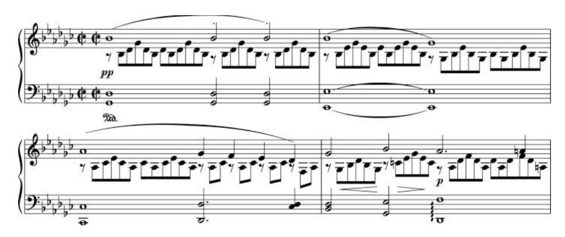

*Ex. 3.1 Schubert, Impromptu in G-fl at Major, op. 90, no. 3, D. 899*

*Ex. 3.2 Brahms, Intermezzo in B-fl at Minor, op. 117, no. 2*

(Ex. 3.2). In the fi rst example, the pianist should have two completely different tactile feelings in the right hand, as if the hand were split down the middle. I referred to such instances in the fi rst chapter, observing that often one plays the main melodic line with a deeper touch, and the accompanying texture with a shallow one. In the second example, touch needs to be constantly adjusted in accordance with the changing role of the texture.

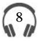

In its second meaning (defi ning the diff erences in the types of attack), articulation is an umbrella term for specifi c indications: staccato, legato, portamento, and tenuto. These terms denote the degree of activity required for the attack, as well as the duration of the sound. The quality of the attack is determined by the speed and strength with which the fi nger activates the key: fast and light for staccato leggiero, slower and light for portamento; fast and strong for staccato marcato, slow and rather determined for tenuto. In many of these examples, our concern is with the *beginning* of the note.

Control over the *end* of the sound is a powerful means of creating gradations of touch for organists and harpsichordists. As a rule, pianists are rather indiff erent to these gradations, partly because of a somewhat blurred quality of the end of the piano sound, partly because the piano has so many other means of expression. Still, the ability to establish control of the cutoff moment (executed by the fi ngers) enriches the variety of articulation. From the slight separation of notes to what Schoenberg marks as *äusserst kurz* (exceedingly short), numerous gradations are available to the pianist. As for legato, by using "overlapping" touch, when the note is released belatedly, after the next one has been activated (not simultaneously), one can create various shades of singing melody or of harmonic background. (This overlapping legato serves as a very useful complement to pedal technique. In the chapter "Pedaling," I will use the term "fi nger pedal" to indicate instances when the notes of the harmonic accompaniment are held down with fi ngers rather than with the pedal.)

When earlier in my life I was teaching harpsichord I invented a slightly sadistic exercise, the purpose of which was for students to develop control over the end of the note (Ex. 3.3). This exercise becomes quite diffi cult when one is asked to play using diff erent types of articulation in each hand (Ex. 3.4).

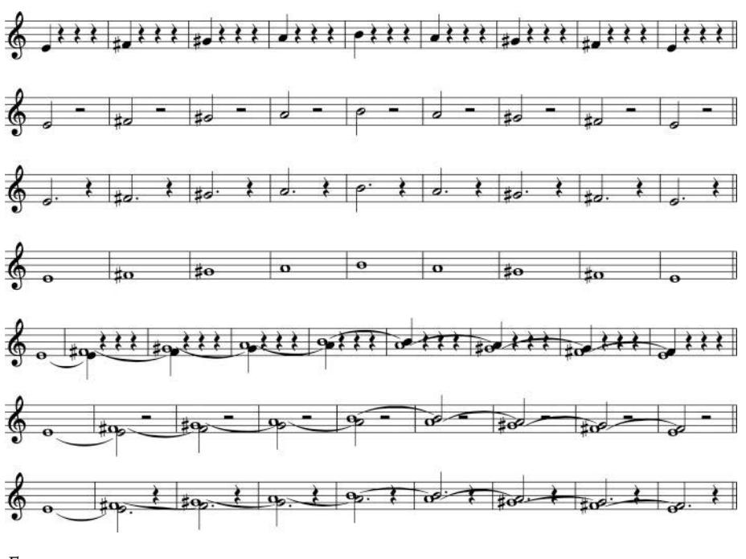

*Ex. 3.3*

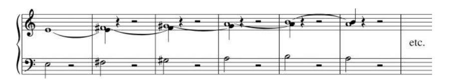

*Ex. 3.4*

#### 60 In the Practice Room

A pianist can live well without suff ering through this exercise; the piano off ers many other expressive tools. Nevertheless, the ability to exercise control over the end of the sound adds an uncommon crispness and precision to the touch of the pianist. It also provides an additional way of creating diff erent sonorities. Working with a student on the Scherzo from Liszt's arrangement of Beethoven's "Eroica" Symphony, I suggested that he try to re-create the juxtaposition of strings and woodwinds found in the orchestra score: the chords of strings to be played exceedingly short—as if he were plucking the keys; the woodwind chords, I off ered, should be rendered by short tenuto strokes, each separated from the next (Ex. 3.5).

The exercise in Exx. 3.3 and 3.4 trains the pianist to execute a precise and *quick* release of the key. Sometimes, though, the key should be released slowly. "The speed with which the damper falls back on the string to stop its vibrations results from the speed with which the fi nger *abandons* the key," according to Gyorgy Sandor. "If we leave the key slowly, the damper halts the strings gently and gradually, and the sound seems to fade away. Therefore we have to cultivate a technique of abandoning the key gradually."1 Sandor makes this observation in connection with legato playing. In

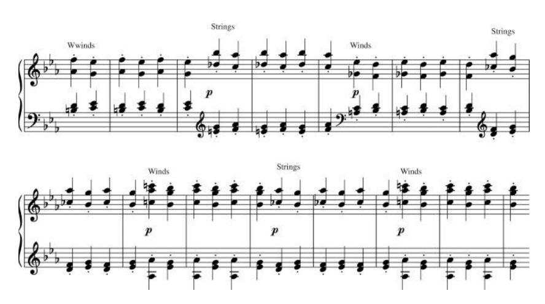

*Ex. 3.5 Beethoven/Liszt, Symphony no. 3 in E-fl at Major, op. 55 ("Eroica"), mvt. 3*

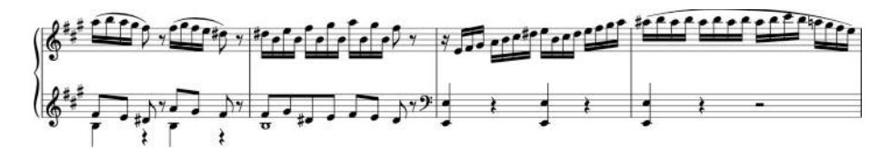

*Ex. 3.6 Mozart, Concerto in A Major, K. 414, mvt. 1*

my own practice, I often use the slow release of the key in conjunction with fi nger overlapping as discussed above.\*

Mozart must have had great sensitivity to the fi ne gradations of touch and articulation. In the example from the fi rst movement of his Concerto in A Major, K. 414, the pattern of using slurs over some groups of sixteenths and not others illustrates his desire to diff erentiate between the way the groups are to be played (Ex. 3.6). This distinction is very diffi cult to render on a modern piano; it requires lightness and precision of fi nger action. Here, as in many other instances, the issues of articulation turn into technical ones.

In his neoclassical works Stravinsky displayed a similar attention to piano articulation. In his *Capriccio* for piano and orchestra, for instance, he went beyond detailed indication of staccato, portamento, and legato, frequently requiring each hand to produce diff erent articulation; he also included such verbal instructions as "semi-legato" and, for the concluding scale-run of the second movement, "non legato, poco a poco più legato." Schoenberg insisted on a great variety of articulation and agogic stresses throughout his output. He used a broad and well-defi ned gamut of signs in his scores ( ⋀, +, ▼ , ∙, ▼ , \_, \_∙, \_▼ ) and specifi ed the meaning of each in the preface to his compositions (among his piano works, the most detailed table is found in Suite op. 25). This elaborate scheme has been used by many younger composers (see Ex. 3.26 from Luigi Dallapiccola's *Quaderno musicale di Annalibera*). In the serial compositions by Messiaen (see Ex. 1.10), Boulez,

\* Unfortunately, on some poorly regulated pianos the slow contact of a damper with a string produces an unpleasant buzz, similar to what occurs on some pianos when slowly releasing the pedal.

Stockhausen, and many others, articulation of individual notes is strictly governed by the series, together with pitch, duration, and dynamics.

Articulation in the sense of enunciation of small motives is indispensable to the performance of early music. Much of this music lies, unfortunately, beyond the mainstream of the piano repertoire. But works by Baroque and Classical composers that have become part of the repertoire (as well as works by twentieth-century composers written in the neoclassical style) cannot be expressively performed without a good sense of articulation.

Dealing with short motives, indicated by articulation slurs, the pianist must understand that each of these short groups of notes does not represent a meaningful musical thought but just a part of it. The slurs do not denote the beginning and end of musical phrases, which is the case with much nineteenth-century music, but rather the small cells from which phrases are built. Short motives do not make sense without being combined into a coherent musical thought, which always must be the priority of the performer. Yet neglecting to separate motives from each other will rob the phrase of expressive shading. The following comparison can be helpful: the late-nineteenth-century musical phrase is built from one slab of marble, while the eighteenth-century one is built from many small bricks.

Very few people would want to apply detailed eighteenth-century articulation to the Romantic melodic line. Breaking the melody into short motives would make it sound unbearably disjointed and mannered. Yet many pianists do not hesitate erring in the opposite direction, ignoring the detailed articulation of Mozart's music in favor of the big Romantic line. The subtlety and the delicate shading of a Mozart melody is eff ectively wiped out by this "bulldozer" approach.

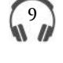

Some articulation markings found in the music of the Baroque and Classical eras are extremely idiomatic and revealing. Consider the last movement of Bach's Italian Concerto (Ex. 3.7), in which an indication to articulate the eighth notes as 3 and 1 makes the music much more vital than a mechanical, undiff erentiated run that we hear so often. Or take the id io matic pairs of sixteenths in the fi rst movement of Sonata op. 110 by

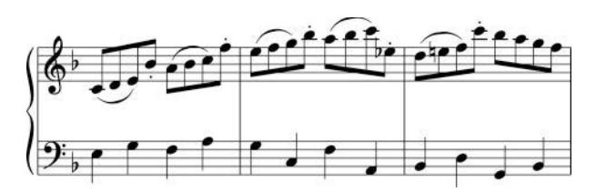

*Ex. 3.7 Bach, Italian Concerto, BWV 971, mvt. 3*

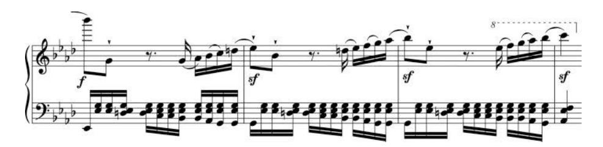

*Ex. 3.8 Beethoven, Sonata in A-fl at Major, op. 110, mvt. 1*

Beethoven (Ex. 3.8). Obliterating the composer's slurs will destroy the special character of the passage.

Articulation indications are scarce in Bach's keyboard music; for this reason, we should study carefully those few that do exist (most of them are in the *Klavierübung* collection, which contains, among other works, the Italian Concerto, the Partitas, and the Goldberg Variations). Because Bach transcribed many of his works for diff erent instruments, it is very useful to compare various versions. The excerpt from the Harpsichord Concerto in G minor contains no articulation slurs, but the earlier version of it—Violin Concerto in A Minor—provides the missing information on the composer's wishes (see Ex. 8.8).

Because the same principles govern Baroque articulation for string, wind, or keyboard instruments, it is very instructive to study the bowing markings or the slurring found in Bach's works for other instruments or in instrumental parts of his Cantatas. Allemanda from Sonata in E Minor for violin and basso continuo, BWV 1023, can serve as an example of Bach's imaginative articulation (Ex. 3.9). By studying Bach's articulation slurs one realizes that long, spaghetti-like phrases that have been favored by many teachers

#### 64 In the Practice Room

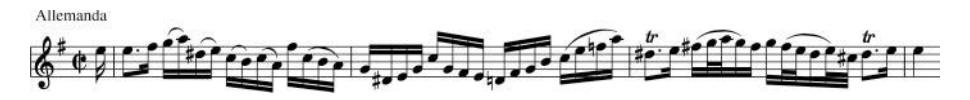

*Ex. 3.9 Bach, Allemanda from Sonata in E Minor for violin and basso continuo, BWV 1023*

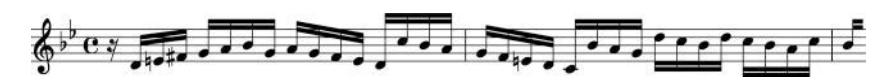

*Ex. 3.10 Bach, Invention in G Minor, BWV 782*

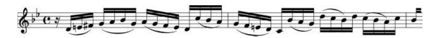

*Ex. 3.11 Bach, Invention in G Minor, BWV 782*

are foreign to Bach's thinking. The seemingly endless line of the G minor Invention (Ex. 3.10) is, in fact, a succession of small units of diff erent length. If played on a string instrument, it would probably be bowed by a Baroque violinist in a fashion similar to that shown in Ex. 3.11. In the beginning of the fi nale of Mozart's Sonata in A Major, K. 526 for piano and violin (Ex. 3.12a), there is no articulation indicated in the piano part. However, close to the end of the movement the theme reappears in the violin part with the detailed articulation markings (Ex. 3.12b). It seems appropriate to me to incorporate these indications into the piano part, as well.

Separation of small groups of notes from one another is a crucial element of harpsichord or organ articulation. On the modern piano, this separation must be executed in such a way that the musical phrase does not sound chopped (often, the smallest lifting of the fi nger suffi ces). Usually, a pianist complements or even replaces separation with dynamic molding, something harpsichordists or organists do not have at their disposal. Very often such dynamic articulation makes the actual separation of motives unnecessary. In the example from the Mozart Sonata in C Major, K. 284b (309), the pianist can almost completely dispense with the separation of initial pairs of notes by introducing a small diminuendo to each of them

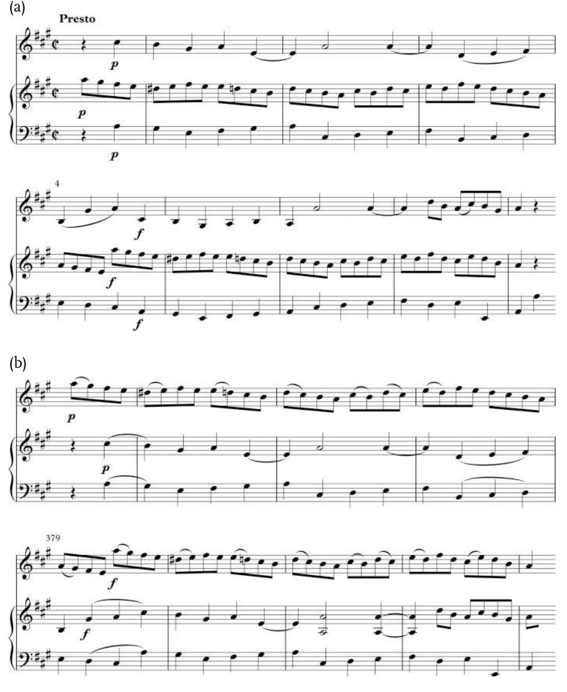

*Ex. 3.12 Mozart, Sonata for piano and violin in A Major, K. 526, mvt. 3*

(Ex. 3.13). Individual taste will dictate how much of the indicated articulation in this example is executed by separation and how much by dynamic shading. (Among many similar examples I can cite the beginnings of Mozart Sonatas K. 332 and K. 570.)

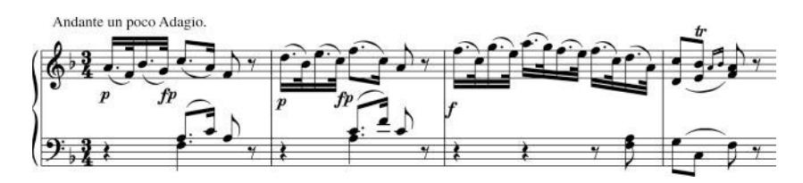

*Ex. 3.13 Mozart, Sonata in C Major, K. 284b [309], mvt. 2*

The term "phrasing" is applied to longer musical statements; it should be regarded as the soul of an expressive musical performance. Phrasing is the result of a delicate combination of dynamic shaping and timing. Musicians feel this instinctively, though obviously these instincts can and must be educated and developed.

The feeling of a melody's natural infl ection is probably the most important aspect to bringing a phrase to life. Various devices can help to develop the performer's sensitivity to phrasing. One of the most common and the most eff ective is for the pianist to sing the phrase, observing the natural rise and fall in dynamics, as well as small changes in timing, and then to try to reproduce them in his playing. I often ask my students to do this and afterward I may comment: "In your singing you tapered the phrase very nicely. Why, when you play it, do you make an accent on the last note?"

In the chapter "Sound and Touch" I mention that listening "in between the notes" is necessary to achieve a singing quality of the musical phrase and to be able to match the attack of the next note with the end of the preceding one. However, if such matching were the only criterion for good phrasing, piano playing would be reduced to playing diminuendo all the time. In reality, we try to combine this listening through the sound with building the melodic shape from the attacks of individual notes.

To illustrate this point, I ask you to remember that a melodic line can be played expressively even by the xylophone (for instance, in the beginning of the third movement of Bartók's Sonata for two pianos and percussion). Unable to sustain the sound, the percussionist shapes the phrase by calibrating the loudness of attack of each note. A pianist should not forget about the percussive nature of his instrument and learn from his musical cousin.

✦✦✦

In phrasing the fi rst thing to determine is where the big phrase begins and where it ends. This is not always clear from the written text. Often a performer has to decide whether a given bar marks the end of the previous phrase or the beginning of a new one. (Schnabel must have felt very strongly about this issue. In his editions, when he thought that the phrasing could be interpreted in diff erent ways, he sometimes introduced Roman numerals to number bars. A Roman numeral 'I' over a particular bar indicates the beginning of a new phrase.) The performer also has to be attentive to the moments of elision, when the end of one phrase becomes the beginning of the other.

Phrasing indications by Chopin represent a special case. Usually, the structure of his melodies is very clear. However, very often the slurs in his works are impossibly long, going over obvious caesuras; elsewhere they indicate elisions (Ex. 3.14) or otherwise obfuscate the phrasing, which might

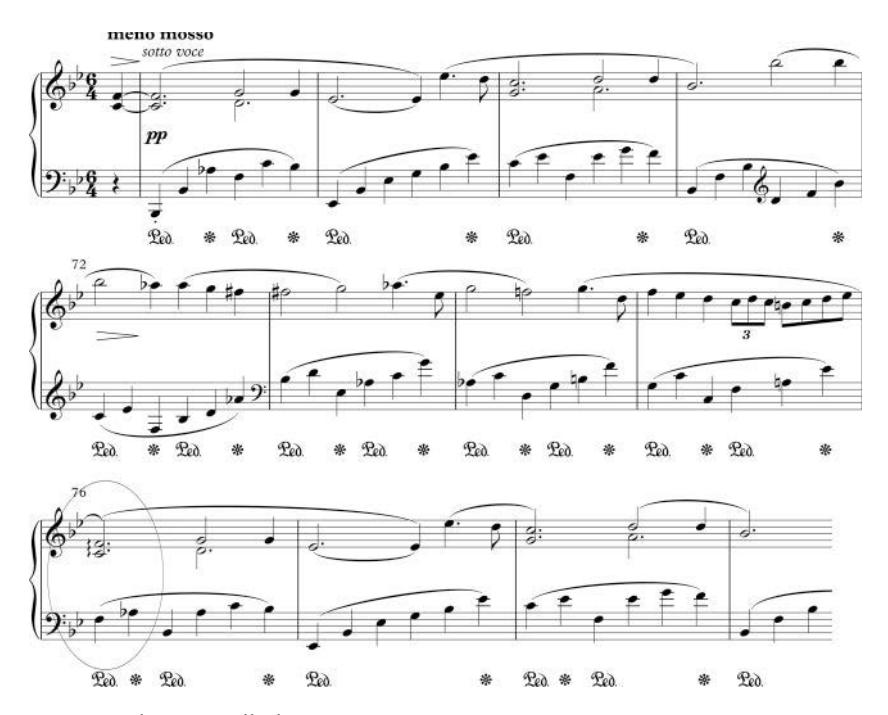

*Ex. 3.14 Chopin, Ballade No. 1 in G Minor, op. 23*

seem too obvious or even square. Having established the dimensions of big phrases, one proceeds to identify smaller phrases that form the bigger one.

It is not enough just to recognize them; we need to fi gure out how they work with each other. Does the phrase develop or elaborate the preceding one or serve as an answer to the preceding question? Does the tension increase or the confl ict resolve in the new phrase? For an example of the latter see the fi rst theme of the last movement of the Schubert Sonata in B-fl at Major, in which the anxiety of two fi rst short phrases (the melody is circling indecisively around two notes, B-natural and C; the tonality is provisionally suggested as C minor) is defused by the following longer one that brings the music to the eventual home key (Ex. 3.15).

Sometimes, one of the smaller phrases appears to be a parenthetical one, only loosely related to the general direction of the bigger phrase. An example of this appears at the end of the fi rst movement of the Fantasy by Schumann, in which the quotation from Beethoven's *An die ferne Geliebte* is followed by a Schumann "aside" (Ex. 3.16).

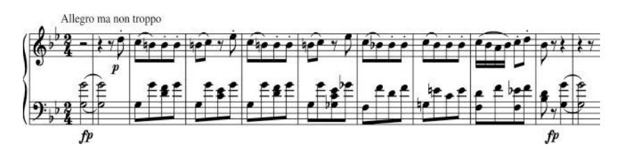

*Ex. 3.15 Schubert, Sonata in B-fl at Major, D. 960, mvt. 4*

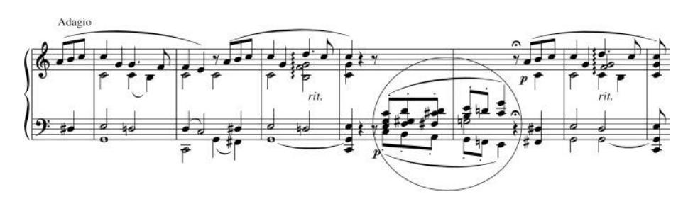

*Ex. 3.16 Schumann, Fantasy in C Major, op. 17, mvt. 1*

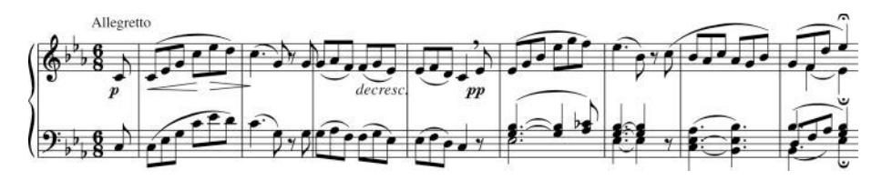

*Ex. 3.17 Schubert, Allegretto, D. 915*

A performer reveals his understanding of the phrase structure by introducing certain caesuras, or breathing points, into the musical fl ow. In practice, this means delaying, ever so slightly, the beginning of the new phrase (see the comma in the upper staff of Ex. 3.17). I will have more to say about this temporal phrasing in the chapter "Matters of Time." Here I will just observe, following many musicians before me, that musical speech, like any other language, has its punctuation marks, which should not be ignored. A performer should develop the ability to recognize and diff erentiate between commas, semicolons, and periods in music. His understanding will be shown in the degree of conclusiveness that he gives to the end of the phrase and in the length of the caesura that follows. Musical punctuation marks include parentheses for a composer's asides and quotation marks for quotations and quasi quotations.

Pianists have never been shy in peppering their musical speech with exclamation points; I frequently alert students to this danger, noting that a spoken conversation would degenerate into hysterical shouting if every word in the sentence were stressed. Musical question marks, however, are often neglected; some performers close many phrases that need to end inconclusively. In the example from Scriabin's Second Sonata (Ex. 3.18),

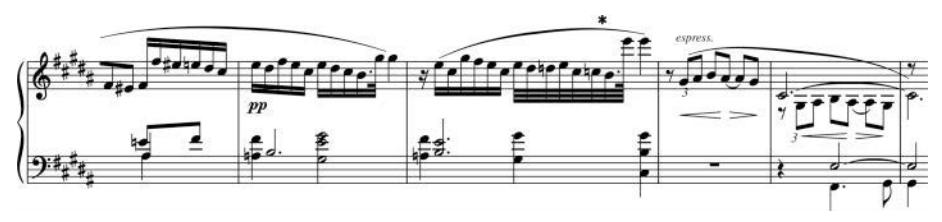

*Ex. 3.18 Scriabin, Sonata no. 2 in G-sharp Minor, op. 19, mvt. 1*

failure to recognize the musical question in the marked bar of the quoted excerpt will make the ensuing phrase senseless.

The next task of the performer is to identify the focal point, the "address" of the phrase, its center to which the musical fl ow is directed. Without it the music lacks the urgency to compel the listener to follow the musical thought. This issue is much more delicate than many realize, because the strength of the "pull" exercised by the phrase's peak is diff erent for diff erent styles. It is manifested most clearly in nineteenth-century music and, perhaps most emphatically, in Russian music. The performer's sensitivity to varying degrees of this pull is an important part of what we call a sense of style. An unequivocally singular focal point of the phrase appears relatively seldom. One such example is the main subject of the fi rst movement of Chopin's E Minor Concerto; it seems to fl ow toward B, the penultimate note of the phrase (Ex. 3.19), although the preceding downbeat (F-sharp) must be also acknowledged.

Very often, although the "address" of the phrase seems to be clear, it cannot be pursued in an excessively heavy-handed way. Most performers would show in their playing that the peak of the fi rst phrase in the main subject of the fi rst movement of Chopin's B-fl at Minor Sonata (Ex. 3.20) is

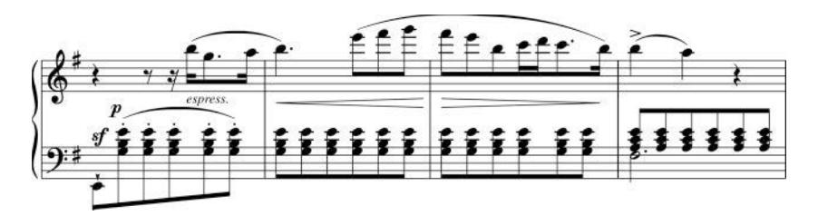

*Ex. 3.19 Chopin, Concerto no. 1 in E Minor, op. 11, mvt. 1*

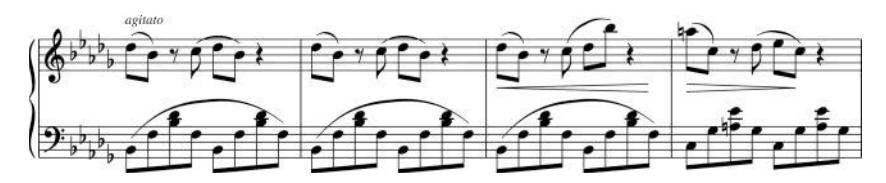

*Ex. 3.20 Chopin, Sonata in B-fl at Minor, op. 35, mvt. 1*

either A-natural or the preceding B-fl at. But a performer who disregards the local "peaks and valleys"—that is, the smaller infl ections of the preceding bars—and "rams" through them in a single-minded crescendo will produce a musically awkward result. Discussing this issue with students, I use the word "micro-dynamics" to describe the minute shaping of the melodic line. As I mentioned before, disregarding the inner life of small melodic cells is particularly detrimental to Classical and pre-Classical music. Its rhetoric frequently indicates more than one center; a pianist can usually detect a certain ranking among these strong points, however, and one of them will serve as the focal point of the phrase.

Correspondingly, local fl uctuations of dynamics should refl ect the general goal of the phrase. In the middle section of Chopin's First Scherzo (Ex. 3.21), though the dynamics are marked identically for bars 1 and 3 and for 2 and 4, respectively, the stress of the whole phrase is on the fi rst beat of the fourth bar. This makes the diminuendo in the second bar smaller than in the fourth, while the crescendo in the third bar is played as if to continue the one in the fi rst.

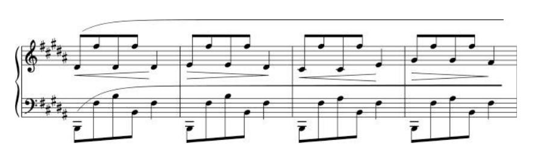

*Ex. 3.21 Chopin, Scherzo no. 1 in B Minor, op. 20*

The infl ections of a melodic line must be preserved even during continuous crescendi or diminuendi. Crescendo does not mean that *every* note of the phrase must be played louder than the preceding one; often it includes small diminuendi, although by the end of the phrase the higher dynamic level will have been reached. Graphically, such a crescendo will be accurately represented not by an ascending straight line but, rather, by an ascending wavy one . In the example from the fi rst movement of ———▶ ∼∼▶

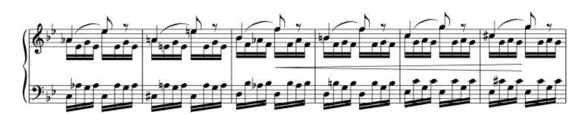

*Ex. 3.22 Schumann, Sonata in G Minor, op. 22, mvt. 1*

Schumann's Sonata in G minor (Ex. 3.22) the second beat of each bar needs to be played lighter than the fi rst, the general crescendo notwithstanding. This is implied by the way Schumann notates the melody, with the eighth notes following the quarters. (Not every piece needs nuanced phrasing, though. The strength of works like the second movement of Prokofi ev's Second Sonata or the Finale of his Seventh Sonata is in their stubborn, unyielding force; a supple naturalness of phrasing will weaken their impact.)

Sometimes a melody has the quality of unfolding continuously. The beginning of the main subject of the Third Concerto by Rachmaninov (Ex. 3.23) has clear stresses in bars 2, 4, 6, and 7. However, a performance proceeding diligently from one strong point to the next will be lacking the magic of the "endless melody," which is the heart of Russian Romantic mu-

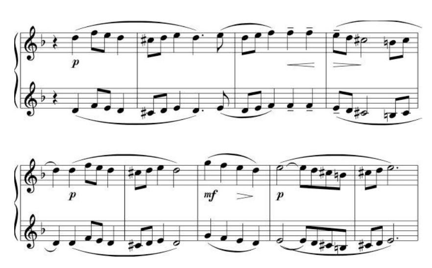

*Ex. 3.23 Rachmaninov, Concerto no. 3 in D Minor, op. 30, mvt. 1*

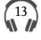

sic. Here I would recommend an approach akin to hiking through a vast, open space. On this hike you decide to reach a tree looming far off on the horizon. As you approach the tree you realize that the line of the horizon has moved farther away and there are new beautiful vistas beyond your initial goal. Similarly, playing Rachmaninov's theme, I would initially target the E in the second bar. However, as I near this note, I reset my goals for the downbeat two bars later, only to realize that this is not the "end of the road" either. It is always better not to set your goal too close to the beginning of the phrase, otherwise the rest of the phrase may sound like an unnecessary appendix. When an early goal does seem the most appropriate, one should still pay attention to the end of the phrase and not let it droop.

In some cases, it is impossible to identify a single focal point; none of the possible solutions seem to work. In the fi rst two bars of Chopin's Nocturne in F-sharp Major (see Ex. 1.3), targeting any single note does not feel right, nor does the music lend itself to the extended horizon approach. In these situations I recommend the concept of a moving target: start with the feeling that you are aiming for the downbeat of the second bar, but as you approach it, realize that the strongest point has been the *fi rst* downbeat, which is already behind you.

Some melodic phrases of Schubert or Chopin that start with an upbeat have an accent on the fi rst note. If played tastefully, the stress on the upbeat adds a sense of artless immediacy to the melody. Such accents must not sound heavy; they should not create the feeling of a misplaced downbeat (Ex. 3.24).

Phrasing in twentieth-century music is a complex issue given the vast range of existing styles. Clearly, it would be wrong to look for the direction of a long melodic line in minimalist works by Glass, Riley, and others, the whole point of which is to create a feeling of aimlessness. It would likewise be inappropriate in pointillistic compositions of Boulez and Stockhausen or in the "chance" music of Cage. As for Messiaen, although his meditative, exalted works (see the last movement of *Quartet pour la fi n du temps*, for instance) need to have the feeling of long breath and endless melody, a focal point is out of place in compositions based on birdcalls. The well-etched infl ection of short motives is needed there instead.

#### 74 In the Practice Room

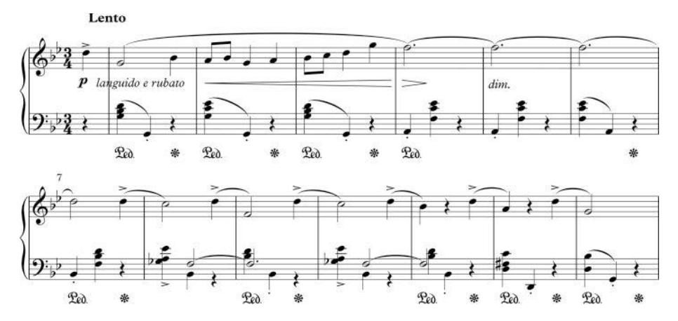

*Ex. 3.24 Chopin, Nocturne in G Minor, op. 15, no. 3*

For Schoenberg and Berg the concept of melodic line was very important. Their complex scores are abundant in detailed dynamic markings and in indications of principal and secondary lines (*Hauptstimmen* and *Nebenstimmen*). In their music, clear articulation and delineation of small motives is necessary but the motives are subordinate to the larger general direction an approach similar to that of Classical and pre-Classical music. Generally speaking, the more complex and unfamiliar the language of the modern work, the more the listener depends on the performer to provide guidance to him, identifying the melodic lines and their direction to the fullest possible extent. Without such assistance and overwhelmed by complex, unfamiliar sonorities the listener may forego any attempt to follow the logic of the composition.

For some performers, the Schenkerian analysis has been very helpful in discovering and illuminating the direction of a melodic line. During a fascinating master class given at the Yale School of Music by Murray Perahia, the comments of this wonderful artist were clearly infl uenced by the Schenkerian approach to voice leading, revealing the structural unity of the piece.

Also in the spirit of Schenker, it is important for a performer to distinguish between the pitches that are essential in creating the contour of the melodic line and those whose function is ornamental. The latter ones often need to be played with a greater fl exibility, subtly underlining their embellishing role. Sometimes in lessons, I play a phrase omitting these "less important" notes, as if putting the melodic line through an X-ray scan.

20

In a polyphonic texture, it is imperative for the pianist to maintain the logic of phrasing in each voice, not allowing any of them, even the leading one, to impose its phrasing on the others. Even in a texture that is not strictly polyphonic, the bass line often phrases or breathes diff erently from the melody or secondary voices.

Playing an imitative passage, the pianist needs to maintain the infl ection of the phrase as it travels from one voice to the next; a stress made on a certain note in one voice must be imitated by the other (Ex. 3.25). Luigi Dallapiccola, in his *Quaderno musicale di Annalibera*, requires that the imitating voice perfectly mimics the dynamics, agogic stresses, articulation, and expression from the fi rst presentation of the material (Ex. 3.26).

In an imitative passage that contains accents, as in Etude 4 from Schumann's Symphonic Etudes, care should be taken that accents in one line not create simultaneous accents in another.

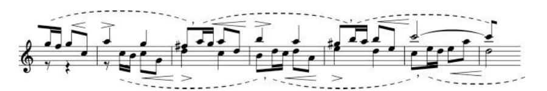

*Ex. 3.25 Bach, Fugue in C Major, BWV 870 from* Well-Tempered Clavier, *book 2*

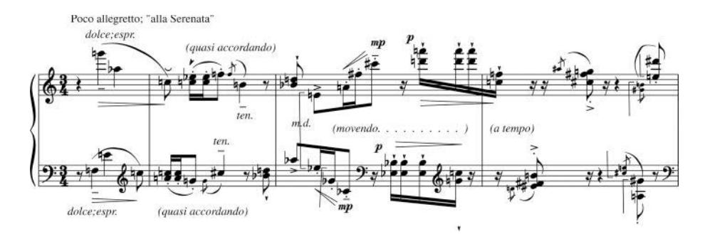

*Ex. 3.26 Dallapiccolla*, Quaderno musicale di Annalibera, *no. 5*

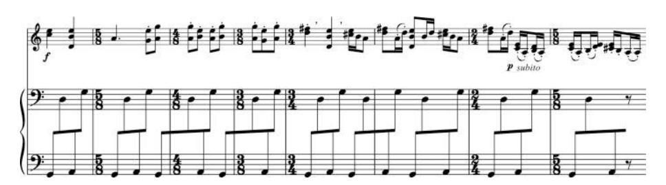

*Ex. 3.27 Stravinsky, Suite from* L'Histoire du soldat *for violin, clarinet, and piano, mvt. 2*

A performer must also be able to recognize the rhythmic grouping of smaller motives. Sometimes the composer indicates the way he structures his material by separating, say, an eighth note, rather than connecting it to others with a single beam. Beams going across the bar lines may further emphasize the phrasing structure, like in the left-hand part of the "Paganini" piece of Schumann's *Carnival* or in Stravinsky's *L'Histoire du soldat* (Ex. 3.27). Usually, however, the composer supplies no such markings, leaving us with one more thing to fi nd out.

With Bach, realizing the inner rhythmic structure is the most important task. The vast majority of his phrasing is iambic, or anacrustic, going from the weak to the strong (Ex. 3.28). Frequently, even when the phrase does not end on a strong part of the bar, as in the fi rst movement of the Italian Concerto (Ex. 3.29), it begins on the weak part of it as an upbeat. Yet so many pianists seem to be hypnotized by the way the notes are grouped on the printed page, especially in pieces with a uniform or perpetual motion. The results are static, mechanical performances. To reveal the phrasing intended by the composer, often it is enough to take the hint from the fi rst

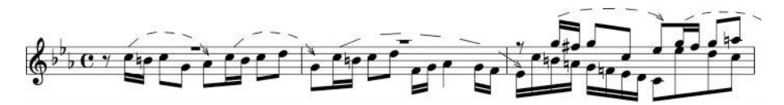

*Ex. 3.28 Bach, Fugue in C Minor, BWV 847 from* Well-Tempered Clavier, *book 1*

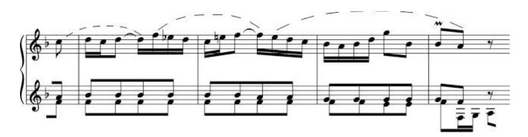

*Ex. 3.29 Bach, Italian Concerto, BWV 971, mvt. 1*

appearance of the motive and to follow through on it. The initial motive of the Prelude of the English Suite in G Minor (Ex. 3.30), for example, indicates the rhythmic phrasing of 2–3–1, 2–3–1 and is carried through the piece, yet I have heard many performances that slipped into a 1–2–3, 1–2–3 mold soon after the beginning. The latter makes the music sound square and static while the iambic phrasing propels the music forward. (When applying the iambic phrasing, guard against stressing or "swelling" of the weak beats. The point of this phrasing is to emphasize the forward motion of the phrase toward the downbeat, which will be lost if the upbeats become too heavy.)

Syncopations (the accents on the weak beats) are a powerful means of expression. In the music of Beethoven, syncopations are frequently high-

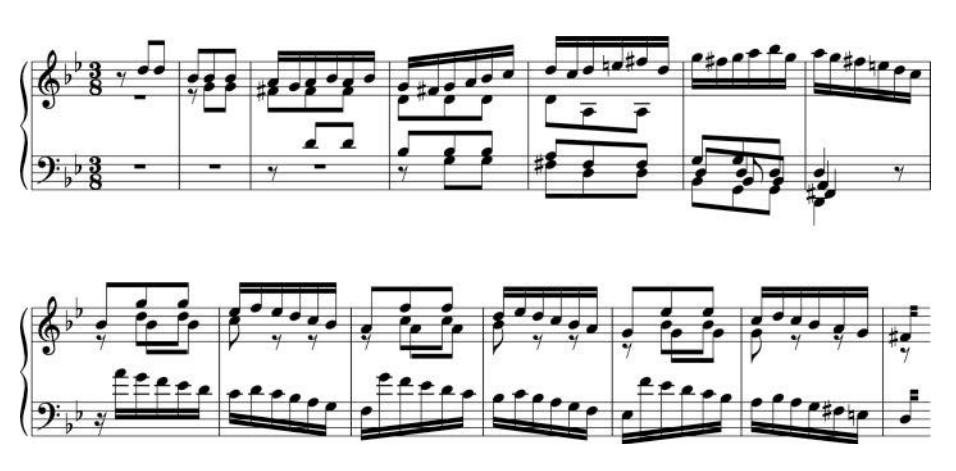

*Ex. 3.30 Bach, Prelude from English Suite in G Minor, BWV 808*

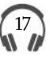

#### 78 In the Practice Room

lighted by a *sf* sign. These *sforzandi* add either an unpredictable twist or an additional impetus to the melodic line. Yet the inherent nature of the melody should not be distorted. The syncopation can be played with a stabbing incisiveness, but, placed on the weaker part of the bar, it must remain light. On the other hand, the downbeat, even unstressed, retains its natural heaviness (Ex. 3.31). Researchers of early music practice have suggested that the succession of *sforzandi* in Beethoven's work implies that each *sf* be louder than its predecessor without making a general crescendo in between (see the example from the fi rst movement of the *Kreutzer* Sonata, Ex. 3.32).

Sudden dynamic changes in the middle of a phrase are another trademark of Beethoven. They, too, must be executed without distorting the logic of the melodic line (Ex. 3.33). Often the tension between the natural infl ection of the phrase and the "unnaturalness" of the dynamics becomes a powerful way for Beethoven to convey dramatic confl ict. See, for instance, the second subject of the fi rst movement of Sonata op. 109 (Ex. 3.34). The pianist here has the diffi cult task of balancing these confl icting aspects. If he allows the logic of the phrase to be distorted by the dynamics, the

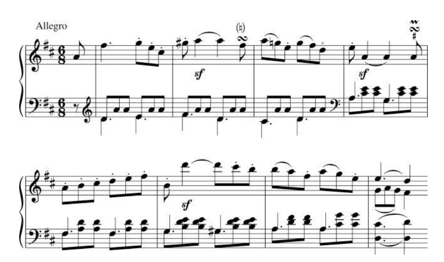

*Ex. 3.31 Beethoven, Sonata in D Major, op. 12, no. 1, for violin and piano, mvt. 3*

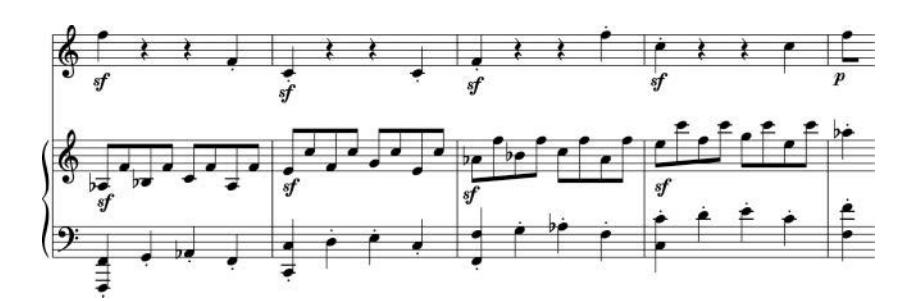

*Ex. 3.32 Beethoven, Sonata in A Major, op. 47 ("Kreutzer") for violin and piano, mvt. 1*

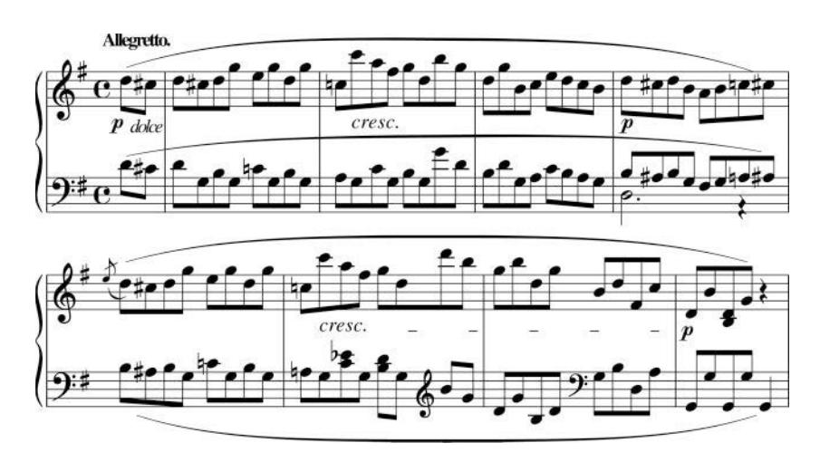

*Ex. 3.33 Beethoven, Variations in F Major, op. 34, variation 3*

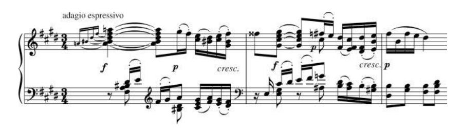

*Ex. 3.34 Beethoven, Sonata in E Major, op. 109, mvt. 1*

music becomes senseless. If, on the other hand, the dynamic changes are played down for the sake of the melodic fl ow, the passage may seem too pretty and confl ict-free, exactly the opposite of the composer's intentions. (The dynamic indications of a sudden drop after a crescendo are frequent in the works of Debussy. But how diff erent these subtle "crescendi to nowhere" are from the tortured dynamics of Beethoven. With Debussy they often depict a gentle breeze or a comparable emotional state of animated anticipation.)

Syncopations should be distinguished from displacement of the bar line, which was so typical of Schumann. In his music we frequently encounter passages that are written as if the bar line has been displaced by one beat, as in the examples from *Grillen* from the *Fantasiestücke* op. 12 (Ex. 3.35) and from the second movement of the Piano Quartet (Ex. 3.36). It is a challenge for the performer to make this more than merely a visual play of musical notation. In such instances the composer apparently was after the eff ect of

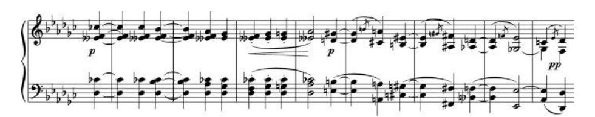

*Ex. 3.35 Schumann*, Grillen *from* Fantasiestücke, *op. 12, no. 4*

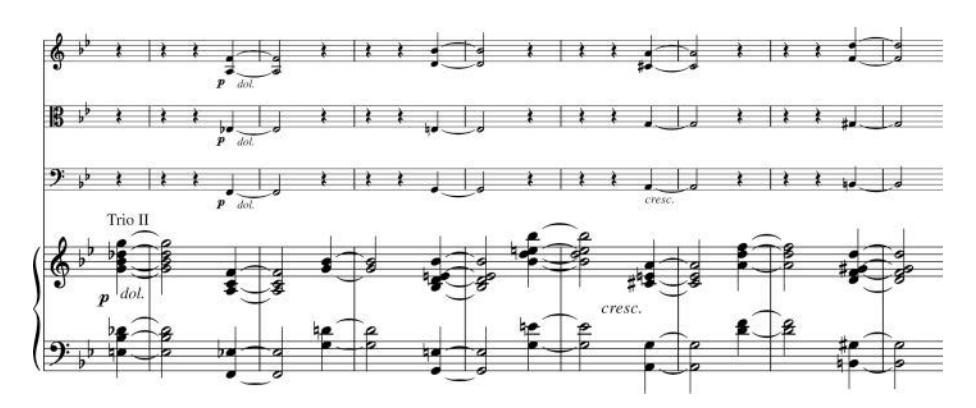

*Ex. 3.36 Schumann, Piano Quartet in E-fl at Major, op. 47, mvt. 2*

weightlessness, of suspending the usual stresses, of ambiguity. Delicate shades of touch and skillful pedaling (I often recommend that a pianist pedal the downbeats in the chords that are tied over from the previous bar) will help to create this illusion.

The application of timing to phrasing is an extremely delicate matter, for it involves the skillful use of rubato. This issue will be examined at length in the next chapter.

## Chapter 4: Matters of Time

Because music is an art unfolding over time, it is only natural that issues related to time are always on the mind of the performer. "How long should this dot be played?" (rhythm), "Do I rush?" (steadiness of tempo), "Can it be played more freely?" (rubato), "How much slower should this meno mosso be in relation to the main tempo?" (tempo relationship), or the most nagging of all, "Does it sound boring?" (controlling the overall structure). These are just a few among many questions that preoccupy us.

*Rhythm*. Rhythm is the basis of a musical composition. In the words of Hans von Bülow, the Bible of the musician should begin with this sentence: "Am Anfang war der Rhythmus" (In the beginning there was rhythm).1 An accomplished performer must possess full control over the rhythm aspect of his performance, which goes far beyond keeping a steady pace. In a satisfying performance rhythmical steadiness never comes across as rigidity; there is always room for fl exibility. The combination of these seemingly opposing qualities is the mark of a truly talented performer.

The contemporary pianist should master the exactness of various rhythmic patterns, played both separately and in various combinations. He should be able to crisply execute everything from an easy "two against three" in a Classical sonata to the intricate rhythmical combinations found in serial and postserial compositions (Ex. 4.1).

Diff erent styles require diff erent degrees of rhythmically literal precision. Encountering the combination of dotted rhythm with triplet in Baroque

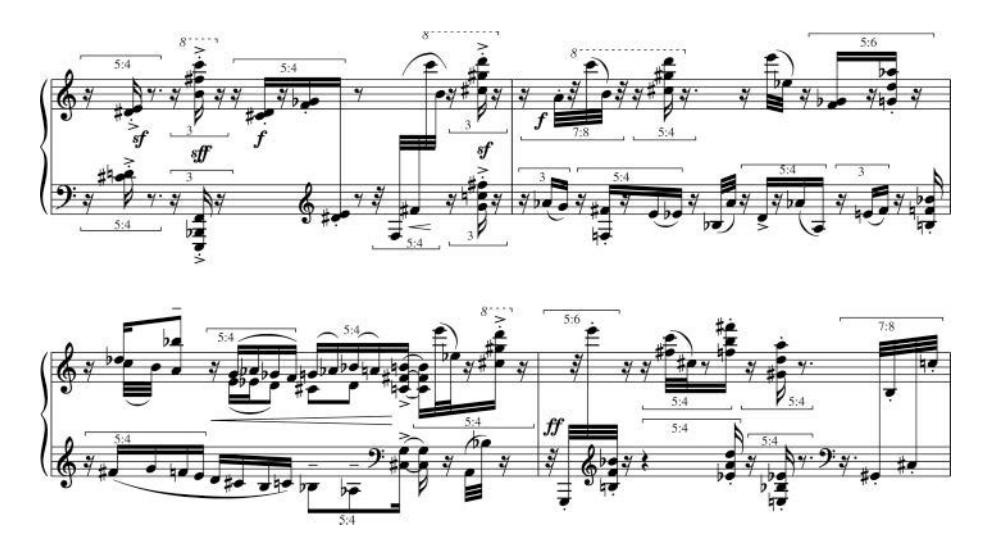

*Ex. 4.1 Denisov, Concerto, mvt. 1*

music we follow the performing practice of the time by playing the last note of both patterns together. Yet when playing the passage from Prokofi ev's Third Sonata (Ex. 4.2), we strive to execute the rhythmic fi gures in each hand exactly as written. In the C Major Sonata by Scarlatti (Ex. 4.3), the rhythm would gain a needed folksy character from a little delay and

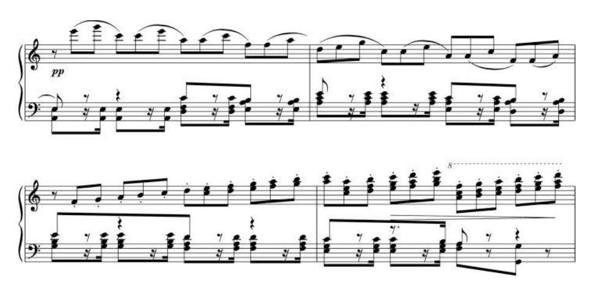

*Ex. 4.2 Prokofi ev, Sonata no. 3, op. 28*

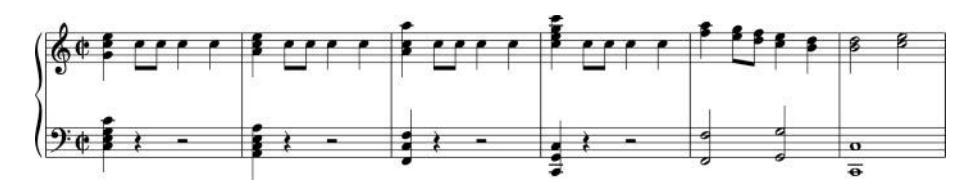

*Ex. 4.3 Scarlatti, Sonata in C Major, K. 420*

a subsequent acceleration of the two faster notes. The distinctive rhythm in the opening measures of the March from Prokofi ev's *Love for the Three Oranges*, however, should be played as written (Ex. 4.4).

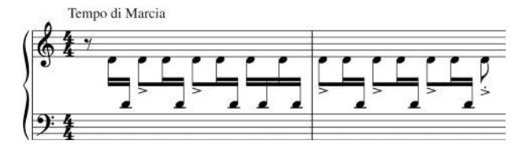

*Ex. 4.4 Prokofi ev, March from* Love for Three Oranges

Although performance practice generally moves through the centuries in the direction of greater exactness, I can think of at least two twentiethcentury composers who defy this convenient statement. Contemporaries of Scriabin have testifi ed to the great rhythmic freedom with which the composer performed his often rhythmically intricate compositions. The few existing recordings of Scriabin's own playing confi rm these perceptions. Listening to the surviving recordings of Bartók performing his own works (the live broadcast of the opening of the Second Concerto, for example), one is astounded by the rhythmic fl exibility of his playing, far removed from the unyielding precision we are now accustomed to hearing.

In passages containing diff erent note values, stylistic considerations inform the performer's decision whether the diff erences between the note values should be clearly marked or blurred. In many twentieth-century compositions (see Ex. 4.1 above from Denisov's Piano Concerto) the diff erences between various rhythmic groups are expected to be clearly shown.

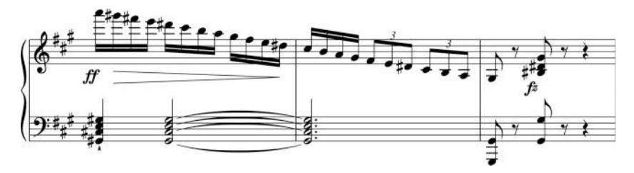

*Ex. 4.5 Schubert, Sonata in A Major, D. 959, mvt. 3*

On the other hand, in the third movement of Schubert's A Major Sonata, op. posth. (Ex. 4.5), the rhetorical sweep of the run will be lessened if the diff erence between the triplets and the sixteenths is stressed pedantically.

In the cadenza of the second movement of Beethoven's Fourth Concerto (Ex. 4.6), it seems wrong to play eighth notes twice as slow as the sixteenths, and quarter notes twice as slow as the eighths. We seem to be dealing almost with a written-out ritenuto (the eff ect is close to what a twentieth-century composer might notate as shown in Ex. 4.7). The same phenomenon occurs at the end of the Rhapsody in G Minor, op. 79, no. 2, by Brahms (Ex. 4.8). Although the pianist must maintain a steady tempo, the diff erences between faster and slower metric values should be blurred to preserve the eff ect of the continuous ritenuto.

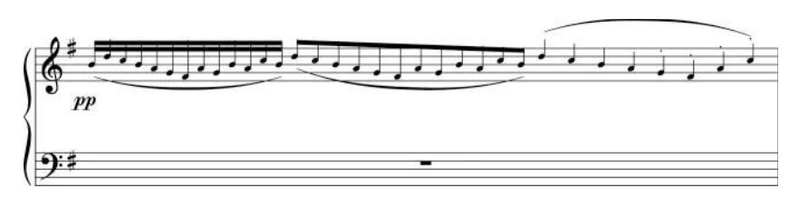

*Ex. 4.6 Beethoven, Concerto no. 4 in G Major, op. 58, mvt. 2*

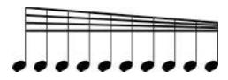

*Ex. 4.7*

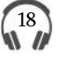

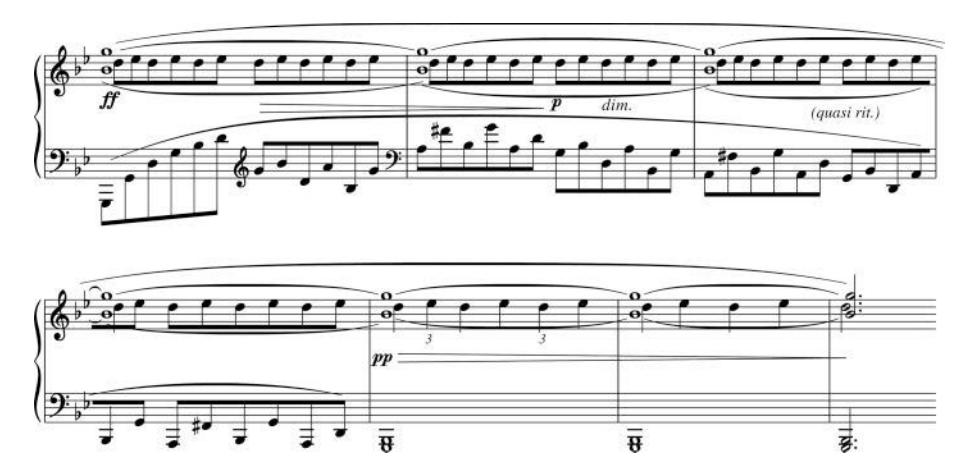

*Ex. 4.8 Brahms, Rhapsody in G Minor, op. 79, no. 2*

Sometimes the approach diff ers within the output of the same composer, as in the case of Messiaen. His atmospheric, "inspirational" works (like many pieces from *Vingt regards sur l'enfant Jésus*) need the feeling of freedom, while those based on birdcalls require precision, albeit without rigidity (see the cadenza from *Oiseaux exotiques*, Ex. 4.9). The note values need to be followed most scrupulously in Messiaen's music based on strict rhythmical systems (nonretrogradable rhythms or Indian rhythms) or in serial compositions (see Ex. 1.10).

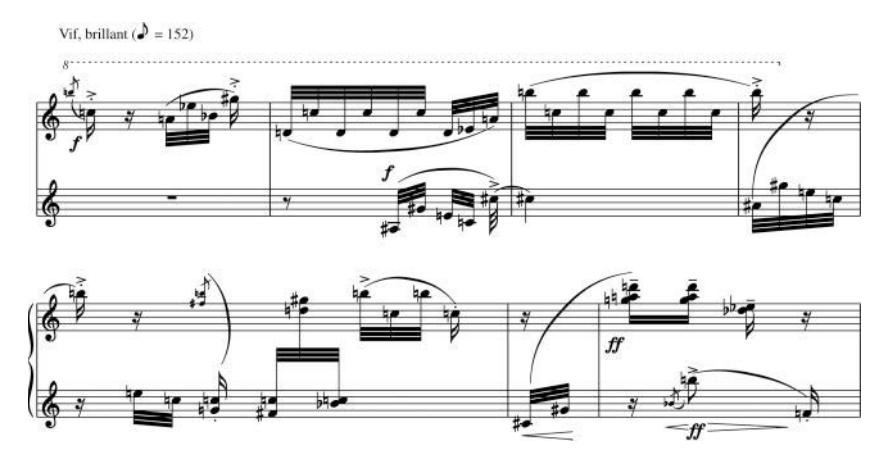

*Ex. 4.9 Messiaen*, Oiseaux exotiques, *cadenza*

*Meter*. The meter of a piece is usually communicated through the time signature. In the music of Baroque and Classical periods, it can tell us a lot about tempo. I will not dwell on this subject, which has been covered thoroughly by numerous books on performance practice. I strongly recommend that performers who play the music of these periods acquaint themselves with conventions contemporary to the music. Unfortunately, even the more obvious ones remain unknown to many pianists; frequently I have to remind my students, for instance, of the crucial diff erence between 4/4 and alla breve in Classical music. Here I choose to concentrate on certain compound meters in the music of the nineteenth and twentieth centuries.

All Chopin ballades are written in six (6/4 or 6/8). Both components of this compound meter (the double and the triple ones) contribute to the general pacing of the piece. The triple meter gives the music beguiling lilt, while the double meter brings in narrative continuity, the importance of which is determined by the very title of the work (ballade). Often these compositions are played "too much in two," robbing the music of its dancelike charm. Even more often they are felt "too much in three," making the music sound like a whining waltz.

Brahms explored various possibilities for six-beat meters in many of his works. He is a composer known for his interest in combinations of different metric patterns, either his beloved hemiolas or other polyrhythmic play. Look at the example from the fi rst movement of the Sonata in G Major for violin and piano, op. 78 (Ex. 4.10). Each of the three lines has its own

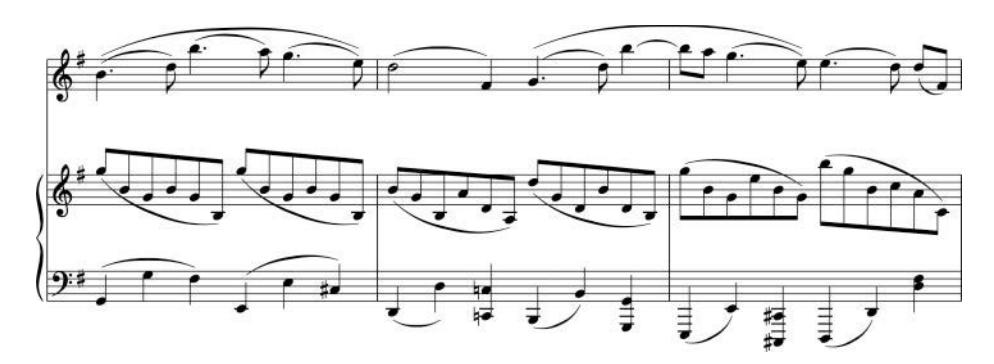

*Ex. 4.10 Brahms, Sonata no. 1 in G Major, op. 78 for violin and piano, mvt. 1*

 meter: the violin plays in 3/2, alternating with 3/4; the right hand of the piano is in 4/4, and the left hand is in 6/4 (3/4 + 3/4). The performance needs to refl ect these diff erences; the players must be sensitive to the evershifting metrical patterns in each part.

Irregular time signatures, like 5 or 7, seldom appear as musical prime numbers (the Promenades from Mussorgsky's *Pictures at an Exhibition* may be seen as such). In most cases they present themselves as a combination of groups of two and three. Bartók was fond of these irregular meters, as well as of 9/8 and 8/8. In an unorthodox way, he revealed the inner divisions of these meters in the initial time signatures, such as 4 + 2 8 + 3 , 2 +2 8 + 3 , 3 + 2 8 + 3 , or 2 +2 8 + 2 + 3 . All of these can be found in "Dances in Bulgarian Rhythms" from the *Microkosmos*. (This practice has been adopted by many composers of a subsequent generation.) In such instances, counting eighth notes, or other small values, usually feels cumbersome. One should perceive such a compound meter as a simple meter of bigger rhythmic values with uneven beats: 5/8 can be felt as 2/4 with one of the quarters longer than another, 3 +3 8 + 2 as 3/4 with the last beat being shorter. (This approach is known to every conductor and to every orchestra player, but too few pianists have experience conducting or playing in an orchestra.)

So much has been written about various tempo indications having had diff erent meanings in diff erent times and for diff erent composers that I will stay clear of the subject. Once again, books on the performing practice of various periods can be very useful reading. But knowledge of the conventions of a given period or style does not resolve all questions, for the choice of tempo seems to be one of the most individual aspects in the whole area of music performance. Even if musicians generally agree that, say, Andante should be played faster than Adagio, the question of how much faster has been the cause of countless disagreements. One might think that the invention of the metronome would have quelled the disputes about tempo, but that is far from being the case. So many stories culminate in this moral: One should take the "objective" metronome markings with a grain of salt.

I will avoid the subject of Beethoven's metronome markings, often debated among musicologists and performers alike. For a thought- provoking though controversial reading I refer the reader to the article by Rudolf Kolisch.2 But even in twentieth-century music there is no guarantee that metronome indications are always reliable. Take Bartók, who marked even minute changes of tempo with the greatest care: he reportedly spurned the use of an actual metronome device, preferring to determine the tempo with a weight attached to a piece of string. No wonder many of his metronome markings are impossible to follow. Working on his Second Piano Concerto I came to realize that the metronome indications there are some twenty to twenty-fi ve beats-per-minute too fast. It is the *relation between tempi* in Bartók's music, rather than the absolute metronomic value of any one of them, that requires serious attention on the part of a performer; this composer had an extraordinary sensitivity to the smallest changes of speed.

It is well known that a performer's perception of the right tempo for a piece can change over time, sometimes even during the course of a single day. Acknowledged less often is that the views of the composer himself can change as well. Thus after a rehearsal Anton Felix Schindler, conductor and private secretary to Beethoven, made this entry in Beethoven's 1824 conversation book: "It was . . . clearly recognizable . . . that you wanted *all the Allegros slower* than you had earlier."3

Lev Oborin told me that when he asked Dmitri Shostakovich why he played his Preludes and Fugues in tempi diff erent from the metronome markings in the score, the composer looked embarrassed and explained nervously that his metronome was out of order when he put the indications into the score; for this reason they should not be trusted. It is more likely that Shostakovich's perception of the right tempi evolved.

Like many performers of the Piano Quintet by Shostakovich, I was perplexed by the metronome markings in the score. I was overjoyed to discover the existence of not one but three diff erent recordings of the work featuring the composer at the keyboard, expecting to fi nd defi nitive answers to all my questions. To my astonishment, the tempi in these performances were substantially diff erent from each other—and from the printed metronome markings.

The metronome markings in Schumann's piano works were, as a rule, supplied by his wife, Clara. She took great care with this task, as described

#### 90 In the Practice Room

in her letter to Brahms: "*Carnaval* and *Phantasiestücke* have at last gone to Härtels [the publisher], after I had worried myself for days with the metronome on their account. I had bought myself a watch with a minute hand and the long and short of it is that I have given it up. You were quite right, the work is pure torture. It makes one quite desperate. Anybody who understands the pieces will play them all right, and those who do not understand them we need not bother about."4

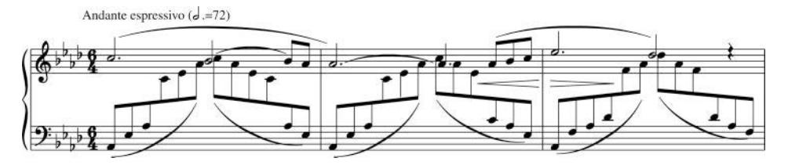

*Ex. 4.11 Schumann, Concerto in A Minor, op. 54, mvt. 1*

Examining the results of Clara Schumann's work, we can see that today's performers have generally accepted most of her suggested tempi. A few examples, however, pose interesting questions, such as the A-fl at major episode (Andante espressivo) of the development in the fi rst movement of Schumann's Piano Concerto (Ex. 4.11). The metronome indication ( . = 72) seems too fast to be followed literally. But it is worth pondering how close this tempo is to the marked initial speed of the movement ( = 84) which, by the way, is practically never sustained by performers beyond the introductory three bars. Can it be that the accepted tempo for performing this work has evolved contrary to the composer's intentions? I personally favor a tempo much faster than the conventional one, although certainly slower than . = 72. This way the episode sounds more like a visionary dream than a profound meditation. In addition, the faster tempo better reveals the cohesion of the movement, which is built on permutations of the same motive.

Brahms was not fond of giving metronome indications in his works. "Those metronome marks which one fi nds on my compositions," he wrote, "I was cozened by good friends into putting there; for I myself have never believed that my blood and a machine could get on so well together."5 He defi nitely cared about the correct tempo, however: "I am always being told of passages to which it is impossible to do justice, and the annoying answer is obviously that the right tempo makes them possible."6 It is diffi cult to tell whether Brahms was talking here about the right tempo for a whole piece or a passage of it that should deviate from the main tempo. We know that he considered inserting small tempo changes into the score of the Piano Concerto no. 2 but at the end decided against it, feeling that a talented performer should be able to fi nd these places by himself.7

This brings us to the issue of tempo changes within the work. Not only the Romantic composers but even the "Classicist" Beethoven recognized such a necessity. On the autograph of [Beethoven's] song "Nord oder Süd" one can clearly read, in Beethoven's hand: "100 according to Mälzel,\* but this is only valid for the fi rst measures, since feeling also has its beat, which however cannot be expressed completely by this tempo (namely, 100)."8 Fluctuations of tempo should not be confused with the lack of rhythmic steadiness, a weakness that must be fought tirelessly. The metronome can be helpful in this task (as explained in the chapter on practice).

In the second half of the twentieth century, composers increasingly marked the metronome of the tempi and their fl uctuation with meticulous care, especially in serial music where the speed becomes the part of the comprehensively predetermined musical matter. Performers of such compositions must develop an inner sense of the speed without consulting the metronome. This ability can be dubbed "absolute speed," analogous to "absolute (or perfect) pitch." I am convinced that one can develop this sense of speed just as eff ectively as one can refi ne his pitch. When, for instance, Luciano Berio changes the speed frequently in his works, using the same few metronome indications (in the "Sequenza IV" they are 40, 50, 60, 72, 104, 124), the pianist must be able to plunge into one speed and then into

\* Johann Nepomuk Maelzel (1772–1838), inventor of the metronome.

another without any transition. (On the other hand, there seem to be limits to one's ability to guess speed exactly: Stockhausen indicates one of the tempo changes in his "Klavierstück V" as = 113.5, but I doubt that many performers have ever been able to produce that degree of precision.)

The performer's sense of exact timing is especially challenged in works using prerecorded tape, such as Stockhausen's *Kontakte* or Davidovsky's *Synchronisms*, to name just two. Confronted with the most infl exible "partner," the performer must bring his perception of the absolute musical time, rhythm, and tempo to the highest level.

An inexperienced musician is often baffl ed by a work's tempo, which he has diffi culty discerning from its beginning. In many works of the Classical era faster note values do not appear until later in the piece. As a result, performers often choose a speed that seems correct in the beginning but becomes untenably fast later. When the beginning material reappears the performer notices that the tempo has changed and tries to fi x it, which only stresses the unsuitability of the initial speed. If we see that the tempo cannot be maintained, it is better to give up on the speed that suits the fi rst theme but no other passage in the work. Instead, we make an eff ort to discover exactly where the initial tempo becomes impossible to sustain and what the viable alternative would be; then we should rework the beginning to fi t this new, more realistic speed.

Sometimes it is diffi cult to capture the correct tempo right away. In such cases, before starting the performance I recommend mentally reviewing the passage that best approximates the ideal tempo for that piece. Playing the opening chords of the third movement of the Piano Trio by Shostakovich, I hum in my mind the fi rst phrase of the violin that follows them (Ex. 4.12).

The preceding discussion brings us to another important matter of time, the *musical pulse*. During lessons, I often ask my students to conduct the piece they play. I do this to fi nd out how they count and what they choose as a unit of musical pulse. Very often, switching from thinking "in quarters" to thinking "in half notes" gives a musical phrase a much larger

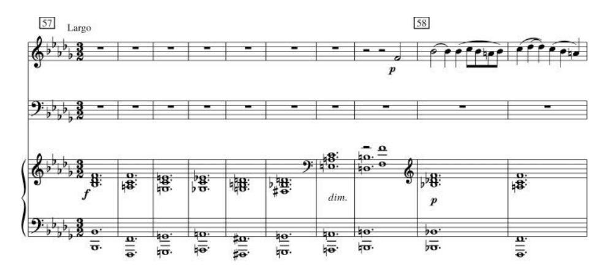

*Ex. 4.12 Shostakovich, Piano Trio no. 2 in E Minor, op. 67, mvt. 3*

scope. A student once played for me the second movement of Schubert's A Major Sonata, op. posth. (Ex. 4.13). Its beginning sounded unpleasantly busy. I did not want to suggest that he adopt a slower tempo for this Andantino in 3/8; instead, I asked him to play it while thinking of a pulse of full bars rather than of eighth notes. The result was just what both he and I wanted: an unhurried, lilting fl ow.

Sometimes these bigger beats need, in turn, to be arranged into even larger units. In this regard, Chopin's Scherzi, all four written in 3/4 Presto, are very instructive. The tempo in each of them is clearly too fast for thinking in quarters; naturally, everybody plays them "in one." Often, as in the case of Scherzo no. 2, I would suggest going a step further, thinking not merely in one but in hypermeasures of "eight-bar bars." Feeling the piece in bigger units gives the performer a greater sense of the long phrase. But he will

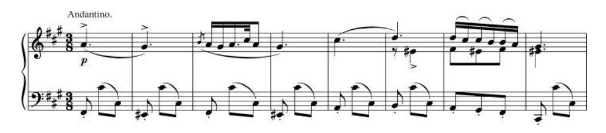

*Ex. 4.13 Schubert, Sonata in A Major, D. 959, mvt. 2*

#### 94 In the Practice Room

get a true understanding of structure only if he doubles the length of these hypermeasures. The beginning of the piece shown in Ex. 4.14, for instance, consists of three phrases. Each of the fi rst two phrases combines the soft "question" with the powerful "answer," the latter being expanded in the third phrase. Beethoven's remarks in the Scherzo of the Ninth Symphony (also Presto in 3/4)—*Ritmo di tre battute* and *Ritmo di quattro battute*—show his thinking in such hypermeasures of three or four bars, respectively.

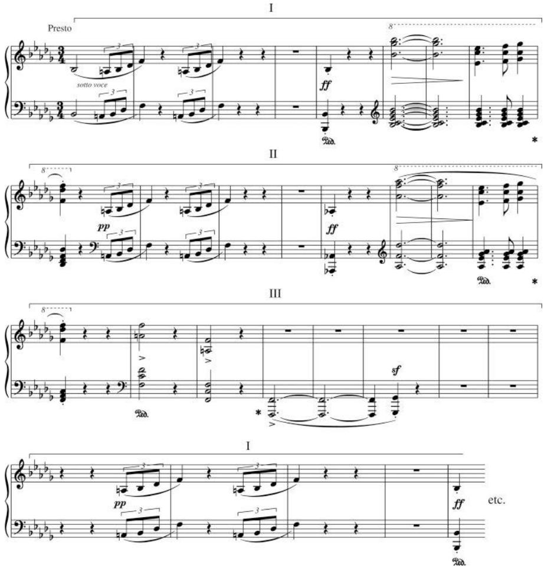

*Ex. 4.14 Chopin, Scherzo no. 2 in B-fl at Minor, op. 31*

In the course of a piece the pace of the music frequently changes. This does not necessarily mean that the tempo should be changed, although an inexperienced performer will eagerly do just that. Usually, it will be more natural for the performer, while staying in the same tempo, to change the unit of pulse mentally. In such cases, I often say to students: "Here a conductor would switch from two to four."

*Rubato*. Probably no aspect of performance fascinates the student more than rubato. It is also an issue that terrifi es many teachers, because it can be abused so easily and because excessive use of rubato may hinder the student's development of rhythmic steadiness. Yet no artistic performance is possible without it.

The most important factor in using rubato is to feel its proper measure. This makes the diff erence between a naturally free performance and a mannered one. Excessive rubato can ruin the performer's (and listener's) sense of the piece's structure. Although I believe that rubato can be used in almost any kind of music, the nature of the rubato varies with musical style. Even in styles that tolerate a high degree of rubato, it should not be applied erratically, by arbitrarily placing beats earlier or later. We all have heard performances in which changes of speed were as chaotic and unpredictable as driving along a congested highway. After hearing a student play a passage with an exaggerated rubato, I often ask him to stand up and conduct it while I try to follow the conducting on the piano. After the fi rst trial I always inquire whether I played the way the student wanted. If the answer is no, I urge him to show me his intentions more clearly. This exercise requires the student to prepare his "orchestra" (myself, in this case) for the impending change of tempo *in advance*. In this way he can create a continuity of pacing and the sensation of musical matter being either stretched or compressed like a rubber band.

In my opinion, good rubato is never fully preprogrammed but is applied spontaneously. In performing certain passages I may know that I will be bending the tempo somewhat, but in which direction and to what degree I prefer to decide on the spur of the moment. Of course, after playing the same work many times one tends to narrow the choices, but I would still try to leave something to chance. (Some musicians feel diff erently, however. I remember the fi rst rehearsal of a duet work that I played with a great musician. He began by saying, "We should play it very freely." This was followed by him stopping every other bar to tell me whether he wanted to go forward or slow down and exactly how big the change should be. At the end, he confessed that, because he had played the work since he was very young, the interpretation had become so chiseled in his mind that he could not conceive of any other way to play it.)

Because the purpose of rubato is to add a sense of improvisatory freedom to the performance, one should avoid using the same kind of rubato repeatedly in a piece. Stretching or rushing successive phrases in the same way creates a monotonous sense of predictability that defi es the purpose. After all, if your rubato is turned into a regular event, you may just as well play the way it was printed.

Neuhaus, referring to the origin of the term (in Italian *rubare* means to steal), declared, "If you steal time without returning it soon after, you are a thief; if you fi rst accelerate the tempo, you must subsequently slow down; remain an honest man: restore balance and harmony."9 I do not believe that this injunction should always be followed rigidly, but the idea of the balanced "mean tempo," even in a rhythmically free performance, appeals to me.

The naturalness of rubato depends on what one chooses as the unit of pulsation. I have come up with a formula for the benefi t of those who prefer this manner of presentation: Natural freedom is the result of the optimal set of constraints. Let me explain what I mean. Suppose I perform Chopin's Funeral March from the B-fl at Minor Sonata feeling the music in quarters. The performance will likely be quite mechanical. To allow for some fl exibility, I need to enlarge the unit of pulsation. Thinking in half bars will give me more room for rhythmic freedom, without interfering with the steadiness of the pacing. If, however, I experiment with feeling the music in whole bars, I may realize that I have given myself too much space; the performance may become too lax, losing the severity appropriate for a funeral march. Thus, the steadiness of the half-bar beats turns out to be the "optimal constraint" for this particular piece. In fact, if chosen correctly these beats are not experienced as a constraint at all but rather as a framework of stability.\*

The word "rubato" is used to describe diff erent expressive deviations from a steady tempo: (1) when every element of the texture changes the tempo, and (2) when some elements bend the tempo, while the others remain steady. Actually, pianists much more frequently use a slight deviation in some elements (usually the melody), with others remaining unaff ected, than they use an all-out rubato.

Sometimes the composer writes out such rubato. In the slow movement of Mozart's Sonata in C Minor, K. 457, the composer wrote down a variant that amounts to notating the hands' lack of togetherness (compare bars 3 and 20 in Ex. 4.15). Schumann used the same device in the second movement of his Piano Quartet op. 47 (Ex. 4.16), in which the viola and the left hand of the pianist play ahead of the right hand. In both examples, the performers must convey the feeling of freedom by playing the cited passages without pedantic precision, but as if the melody lagged slightly behind the other parts.

Rubato that aff ects mainly the melody and is off set by a steady accompaniment was well known and much discussed in the Classical era. Mozart wrote in a letter to his father: "What [these people] cannot grasp is that in tempo rubato in an adagio, the left hand should go on playing in strict time. With them, the left hand always follows suit."10

Leopold Mozart defi nitely knew what his son was talking about, for in his *Violinschüle* he himself wrote, "when a true virtuoso . . . is to be accompanied, then one must not allow oneself to be beguiled by the postponing or anticipating of the notes, which he knows how to shape so adroitly and touchingly, into hesitating or hurrying, but must continue to play throughout in the same manner; otherwise the eff ect which the performer desired

\* One may be tempted to try extending the application of this formula beyond the realm of music making, but this book will not address it.

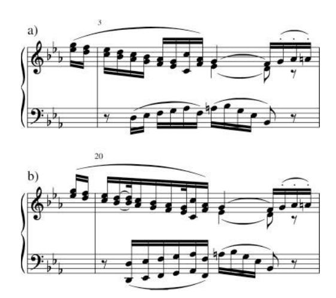

*Ex. 4.15 Mozart, Sonata in C Minor, K. 457, mvt. 2*

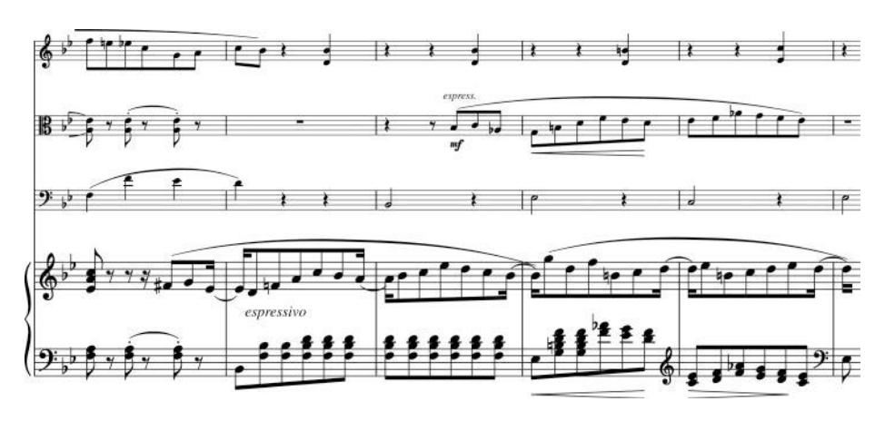

*Ex. 4.16 Schumann, Piano Quartet in E-fl at Major, op. 47, mvt. 3*

to build up would be demolished by the accompaniment. . . . A clever accompanist . . . to a sound virtuoso he certainly must not yield, for he would then spoil his tempo rubato."11

Chopin espoused the same approach, as many of his students remembered. One of them, Wilhelm von Lenz, related: "What characterized Chopin's playing was his rubato, in which the totality of the rhythm was constantly respected. 'The left hand,' I often heard him say, 'is the choir master [Kappelmeister]: it mustn't relent or bend. It's a clock. Do with the right hand what you want and can.'"12

It is, of course, easier said than done. One conclusion that we can draw from this quotation is that the hands were not expected to play together at all times (compare with Examples 4.15 and 4.16 above). But a "desynchronization" of the hands can very easily make the playing sound mannered or erratic to the modern ear. I propose that this limited rubato be considered a phrasing device that is used to enhance the expressivity of the melody. The way to ensure the combination of melodic fl exibility and metric stability is to feel the continuous pacing of the larger beats. In Chopin's Nocturne in G Minor, op. 37, no. 1 (Ex. 4.17), the melody speaks freely in between the even quarter beats of the accompaniment. In case the pianist feels the urge to escape the metronomic regularity of these quarters as well, he should switch mentally to the pulse of the half notes (which, in my view, become here the units of "optimal constraint"). Let them be steady while everything in between is looser. 20

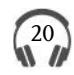

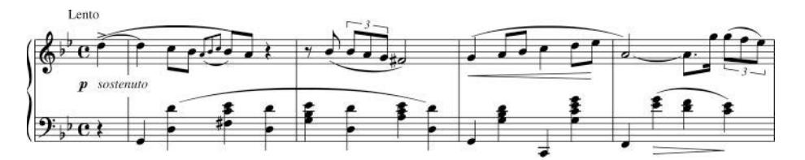

*Ex. 4.17 Chopin, Nocturne in G Minor, op. 37, no. 1*

In the second movement of the Italian Concerto by Bach (Ex. 4.18), a performer in pursuit of fl exibility in the melody may feel limited by the continuous fl ow of eighth notes in the left hand. My advice would be to make sure that the larger beats are steady (depending on your tempo, feel the pacing either by quarters or by whole bars) and to make the melody fl ow

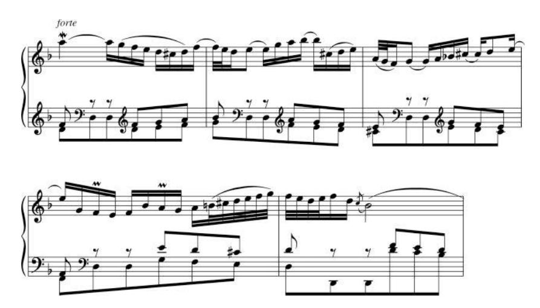

*Ex. 4.18 Bach, Italian Concerto, BWV 971, mvt. 2*

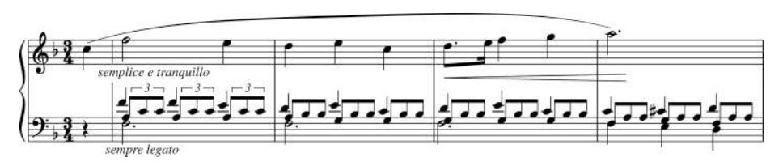

*Ex. 4.19 Chopin, Nocturne in F Major, op. 15, no. 1*

in between them. Let the thirds in the accompaniment also bend a little, but not as much as the melody. If this means that *occasionally* the hands do not play together (within the large beats), let it be this way.

Obviously, when the melody moves slower than the accompaniment, as in the Nocturne in F Major, op. 15, no. 1 (Ex. 4.19), Chopin's admonition to regard the left hand as a clock seems impossible to implement. Here the left hand as well will have to bend the tempo slightly. Yet it is still important to ensure the steadiness of the downbeats.

In Lev Oborin's remembrance of his only conducting lesson with Bruno Walter, his leading of the First Symphony by Beethoven was interrupted by Walter several times with the same phrase: "Rubato spielen!" (Play rubato!) Oborin wrote: "I was somewhat surprised, as we were dealing with one of the earliest works by Beethoven, with an even motion of the triplets, and here, suddenly,—rubato. Then this wonderful musician took the baton himself and showed how one can breathe life into this classically strict music by way of continuous, hardly noticeable deviations from the tempo."13 Clearly Walter did not have in mind an all-out rubato, which would change the principal tempo signifi cantly. Rather, he sought an expressive fl exibility, a natural musical breathing that would not upset the steadiness of the general pacing, especially when felt in larger beats. In fact, thinking about breathing, whether in singing, speech, or daily activity may help the player to achieve the naturalness and fl exibility of musical phrasing.

Even the larger beats, normally the pillars of stability of musical pacing, may need to be bent for the sake of expressivity. In this respect music can be likened to speech: Although in most languages, printed words are separated from each other by a single space, only a computer-generated voice will make each and every space between the words equal. In human speech, words tend to come in blocks. (If someone heard me say aloud the last sentence, for instance, it would sound something like, "Inhumanspeech — words—tendtocome—inblocks.") Because music is also a language, musical beats, though formally equidistant from one another, in actuality work as magnets with same or diff erent polarities. Some want to come closer to other beats, while some want to distance themselves from each other. In performance this "expressive meter" can easily be overdone, resulting in an unbearably mannered playing. When executed with taste, however, such metric fl exibility adds naturalness of speech to the performance. In the example from the second movement of Schubert's early Sonata in E-fl at Major, the infi nitesimally small caesuras, delaying the following note by just a hair, will breathe into the music the air of touching and simple spontaneity (Ex. 4.20). (I indicated the suggested briefest of delays with commas; the dash in the fourth bar signifi es slight lingering on E-fl at.)

The temporal aspect of phrasing discussed here and its dynamic aspect addressed in the previous chapter are mutually dependent; a delicate

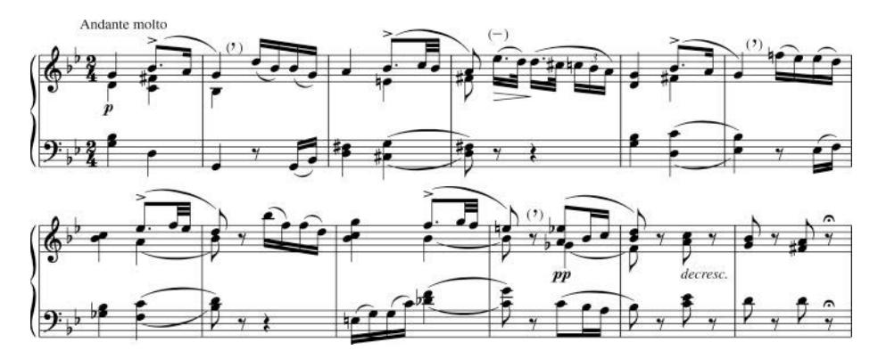

*Ex. 4.20 Schubert, Sonata in E-fl at Major, op. 122, D. 568, mvt. 2*

 balance between them is often required. The more elaborate the dynamic phrasing, the less rubato should be used, and vice versa. One should avoid investing heavily in both aspects at the same time. A phrase may gain an impetuous quality if a slight accelerando is applied on the way toward a focal point, but a crescendo added to this accelerando will cause the passage to sound somewhat pushy or hysterical.

"The link between tone and rhythm becomes especially clear in rubato," observed Neuhaus.14 I frequently notice that a performer (not only a pianist) who possesses thick tone uses less rubato than one whose sound is leaner. Probably for the same reason, the same degree of rubato that sounds natural on the harpsichord makes an artifi cial, exaggerated impression on the piano, an instrument with a thicker, richer tone. I invite the reader to play a passage from a slow movement of a Mozart sonata several times using touch of varying thickness. As this exercise will demonstrate, the leaner the sound, the greater the degree of rubato that can be gotten away with.

As a somewhat related postscript, I would like to off er a word of caution against a bad habit that creeps into the playing of too many performers: hesitation before the downbeat, which can become a constant feature of one's playing. When such a delay occurs repeatedly, the bar line seems to become an invisible wall that one needs to push through to proceed further.\* At the root of this habit is probably a desire to emphasize the importance of the downbeat, but the result is terribly unnatural and often irritating. This agogic accent is often better achieved by getting to the important musical point without any hesitation and lingering on it slightly (and by no means should every downbeat be felt with equal importance). Once acquired, this habit of delaying the beat is very diffi cult to exorcise. I myself suff ered from this ailment at one time and had diffi culty purging my playing of it. The best remedy was to listen for this hesitation very persistently in recordings of my own playing. (Sometimes students do not feel that getting rid of this problem merits great eff ort. With them I joke that such playing reminds me of walking a dog that is absolutely determined to stop at every tree.)

There are additional issues connected with musical time. They properly belong, however, in Part 2, which pertains to more general aspects of performance.

\* &quot;If humankind was treating the meridians on the globe the way we treat the bar lines, moving around our planet would become much more cumbersome." Perelman, *Osenniye Listya*, p. 19.

## Chapter 5: Pedaling

Pianists use pedaling to achieve various goals: to prolong sounds that cannot be held by fi ngers; to assist fi ngers in producing good legato; to combine notes into harmony; or to augment rhythmic accents. But for me the greatest contribution of the pedal to piano playing lies in how its use can enrich the sound of the instrument by freeing overtones. Lifting the dampers allows for sympathetic vibrations of all the strings, adding resonance to the sonority.

Technical developments in piano building during the nineteenth and twentieth centuries resulted in a sturdier instrument with a greater power of tone and a more stable tuning. This could not be achieved, however, without sacrifi cing lightness in the body of earlier instruments (harpsichord, clavichord, or early fortepiano), which served as a potent resonator similar to that of a string instrument. Introduction of the metal frame and heavy dampers in the piano's design diminished the sympathetic vibration of strings, making the sound of the piano much poorer in overtones. They can be released now only by using the pedal. (Knock on the side of a harpsichord or clavichord. The instrument will respond with a light rumble. Do the same with a piano; all you hear is a dry knocking sound. The rumble will occur only if you fi rst depress the pedal, thus allowing for the sympathetic vibrations of strings.) This is why the pianist who is interested in producing an acoustically rich sound (that is, rich in overtones) must resort to help from the pedal. For this reason I advocate an abundant, though delicate and often discreet, use of the pedal.

I believe that those who prohibit use of the pedal in the performance of

earlier music, particularly that of Bach, are misguided. They may argue that early instruments did not have pedal and, consequently, the music written for these instruments does not call for it. But though the harpsichord and clavichord do not have a pedal device, they are built to allow a constant halo of overtones to surround each sound. The sound of the piano without pedal is by comparison much poorer. People who avoid the pedal to make the piano sound more like a harpsichord are actually achieving the opposite eff ect.

Another frequently heard argument against the pedal is that it may upset the clarity of part-writing in polyphonic music. Such a danger defi nitely exists, and for this reason we can use the pedal much more freely in the dance movements of suites and partitas than in fugues. Even so, skillful shallow pedaling with frequent changes will enable the pianist to enrich sonority without sacrifi cing clarity.\*

Good pedaling comes more from a discriminating ear and sensitive touch than from foot technique. The pianist's attentive ear continuously analyzes the sound being produced and serves as a guide in his using the pedal. In fact, pedaling is just one of several components of sonority, touch being the principal one. There is an inverse correlation between fi nger touch and pedaling. Pedal can be applied liberally when the touch is light; lighter and more careful pedaling is required when the touch is thicker.

Dynamic balance among various elements of the texture is another factor that determines the way one pedals. In the typical Chopinesque three-part texture (melody, low bass, and the chords in the middle), a thick touch in the middle register or an insuffi ciently resonant bass will require frequent changes of pedal. By contrast, a lighter sonority of the "harmonic stuffi ng" or a full, sonorous bass will allow for a much more generous, inclusive approach to pedaling. A resonant bass serves as a smoke screen, covering many passing dissonances in the harmonic texture. I suggest that the

\* Admittedly, I have heard many good nonpedaled Bach performances, as well as many bad pedaled ones. My polemic is directed not at every single nonpedaled performance but toward the blanket prohibition of using the pedal in Bach's music.

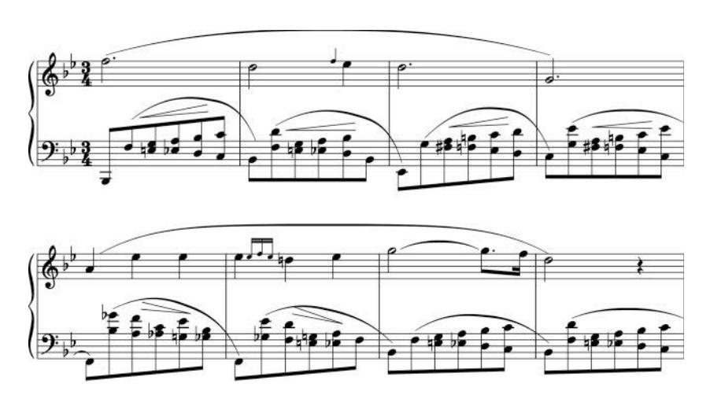

*Ex. 5.1 Chopin, Prelude in B-fl at Major, op. 28, no. 21*

reader experiment with playing the opening of the Chopin B-fl at Major Prelude (Ex. 5.1), varying the degree of thickness in the double stops of the middle register and the degree of resonance in the bass on the downbeat. It is highly instructive to see that changes in touch determine how long one can hold the pedal without making the texture sound muddy.

When performing scale-like passages of a nonmelodic, ornamental nature—often found in the works of Debussy and Ravel, for instance—pianists have no reservations about holding the pedal through them. Such pedaling produces very good results, provided the touch is appropriately light. More care should be exercised in pedaling a stepwise *melodic* motion.

Unlike an electric switch that has only the on and off position, the pedal has infi nite gradations in both the depth and the speed of its activation. To execute "fl eeting" pedaling, both very short and very shallow, the foot must always be "standing by." Not only should it rest on the surface of the pedal at all times, it also frequently needs to depress the pedal slightly but not enough to lift the dampers.

Sometimes the pedal is depressed together with the keys ("direct pedal"), though more often it is done later ("delayed pedal"), to make sure that the sounds of the previous sonority have died away. Again, it is the ear that will determine the right time to move the foot.

Some instruments built around 1800 were equipped with two knee levers that allowed the pianist to operate the dampers of the upper and lower halves of the range separately.1 The contemporary piano does not off er such an option, but the pianist can still control diff erent areas of the instrument by using partial changes of pedal, either the so-called half pedal or quarter pedal. Because of the more resonant nature of the piano's lower register, the dampers stop the sound in the treble register sooner than they do in the bass. In a multilayered texture, therefore, a half-pedal change will help the pianist to get rid of some of the sounds in the higher register only.

By extending the life of sounds the pedal creates harmonies. One obviously cannot achieve correct pedaling without comprehending the harmonic processes in a piece. Understanding the harmonic language will prevent the pianist from mixing together diff erent harmonies or separating the sounds of the same chords. In fact, the pedal can be an eff ective tool for elucidating the harmonic structure of the piece. Scriabin's music, for instance, is often based on extended harmonic complexes that need to be sustained by pedal. Contrary to what one would expect, frequent changes of pedal would obscure its harmonic structure rather than clarifying it. An excellent example is the passage from the third movement of Scriabin's Sonata no. 3 (Ex. 5.2). Vladimir Sofronitsky, one of the greatest performers of Scriabin's music, has recommended the indicated pedaling.

Often it is important to distinguish between the harmony and a melody built on the arpeggiation of a chord. Although I have heard many bizarre performances in my life, I have yet to hear anyone simple-minded enough to try holding the pedal through the entire beginning of Beethoven's "Appasionata." Though the fi rst two bars contain nothing but the sounds of the F-minor chord, holding the pedal there would be a grave mistake. Such pedaling would distort the nature of the music, converting the tension of the bare melodic line into a fl abby, euphonic cloud. Only a very discreet pedaling that helps the fi ngers to achieve a perfect legato is acceptable here.

In another example from Beethoven, the transition from the third to the fourth movements of Sonata op. 101 (Ex. 5.3), the composer's pedal marking shows that he wants the single line of the recitative to dissolve into

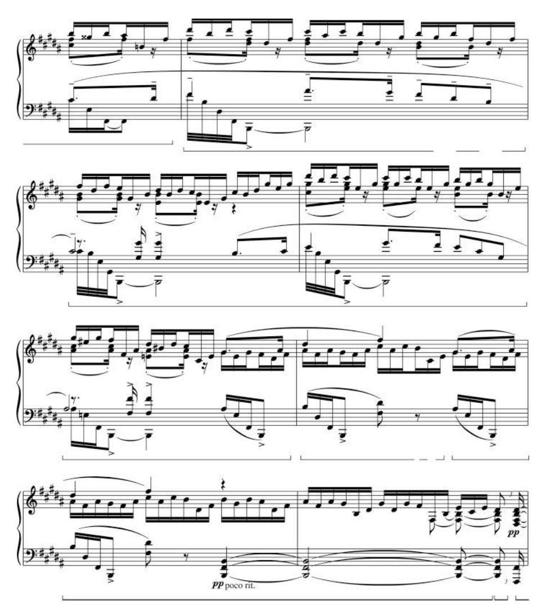

*Ex. 5.2 Scriabin, Sonata no. 3 in F-sharp Minor, op. 33, mvt. 3*

harmony. An attempt to take the long pedal earlier than indicated would destroy the meaning of the passage. (Short, "lubricating" pedaling in the beginning of the recitative, on the other hand, may be very welcome.)

When it does seem possible to hold the pedal through a melody built along the sounds of the same chord, one should keep in mind a certain psycho-

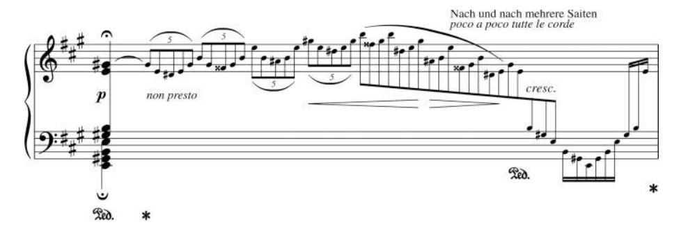

*Ex. 5.3 Beethoven, Sonata in A Major, op. 101, mvt. 3*

acoustic phenomenon: although pedaling through an *ascending* melody of this kind usually presents no problem, a *descending* melody requires more frequent changes of pedal to get rid of higher notes in the melody. Without these changes the lower notes might get obscured.

Very often the best pedaling is done not by the foot but by the so-called fi nger pedal (mentioned in the chapter on articulation and phrasing), when the notes of the texture are held over by fi ngers to create harmonic continuity. In the works of Mozart and other eighteenth-century composers this technique is applied often when the harmonic accompaniment, usually an Alberti bass, cannot be sustained by the pedal because of rapidly moving passage work in the right hand. In these situations holding the foot pedal through the scale-like passage would be decidedly out of style.

Although fi nger pedaling helps the foot to do its work, the opposite happens almost as frequently: the foot helps the fi ngers to achieve connection between the notes, which is impossible or cumbersome to do with the fi ngers alone. Some teachers are reluctant to encourage the use of pedal in fi nger legato, believing that the student needs to learn how to achieve it with fi ngers only. Far from endorsing pedaling as a universal substitute for fi nger legato, I feel that fl uency is best achieved in numerous passages without the fi ngers "digging in," struggling to accomplish the physical connection between the notes. Light portamento, expertly assisted by very light, discreet, fl eeting pedaling, can often achieve much better results (I refer again to the passage from Debussy's "La fi lle aux cheveux de lin"  discussed in the chapter "Sound and Touch" [see Ex. 1.8].) In such instances the pianist needs to develop sophisticated coordination between his fi ngers and his foot. The foot must always be ready to assist the fi ngers without revealing itself.

Pedal indications given by the composer need to be treated with the utmost respect, although frequently they cannot and should not be observed literally. Dealing with music of the past, one should always remember that the piano has changed. The sound of the piano in Beethoven's time, and to a lesser extent in Schumann's or Brahms's, had much faster decay than that of the modern piano. On the instruments of those eras, with their much lighter and thinner hammers, a continuously depressed pedal resulted in a highly resonant sonority without creating a disturbing dissonant thickness. Today's performers frequently need to alter the pedal indications made by these composers by using a half or quarter pedal, adjusting the voicing of the texture, or shortening somewhat the prescribed pedal duration. Beethoven's wonderfully idiosyncratic pedal indications in the last movement of the "Waldstein Sonata" (Ex. 5.4) are the cause of considerable apprehension by many who play this piece. Yet the composer's intentions can be realized convincingly if the sixteenth notes of the accompanying texture are played with very light and sensitive fi ngers.\*

It seems a pity to give up on even the most problematic indications of this kind, like the opening of the second movement of Beethoven's Concerto no. 3 (Ex. 5.5). One clearly cannot follow the pedal indications of the composer on a modern piano, and it is highly challenging even on a period instrument. Nevertheless, I would try, by delayed changes of pedal, to recreate the resonant blur that the composer seemed to have in mind.

\* It may be prudent to mention here that Beethoven uses the Italian word *sordino* (a mute) in relation to the piano dampers. When he writes *senza* [without] *sordino*, he means "with pedal," and when he indicates *con* [with] *sordino*, he means "without pedal." (It has nothing to do with the soft pedal, which is sometimes called the *sordino* pedal.) Haydn in his London Sonatas uses the words "open Pedal."

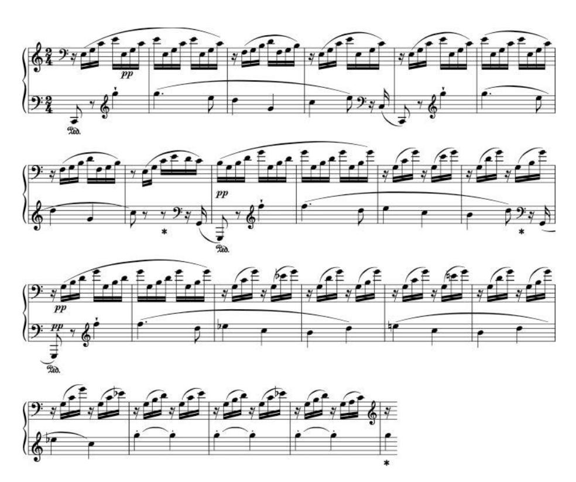

*Ex. 5.4 Beethoven, Sonata in C Major, op. 53. mvt. 3*

The use of pedal in the works by Chopin requires a separate discussion. There has probably been no other composer who marked pedal as meticulously as Chopin did. However, these markings are routinely ignored by pianists, usually on the grounds that Chopin's piano was diff erent. Even though this is true, many of his pedal eff ects are too important to disregard. Among them is his preference for not changing the pedal if the harmony does not change. In the beginning of Nocturne op. 15, no. 3 (see Ex. 3.24), the continuous pedal in bars 4–6 breaks the monotony of stressing the downbeat by separate pedaling in each of the preceding bars. A more problematic indication occurs later in the piece (Ex. 5.6): here the busy movement in the melody has led many pianists to change the pedal in each bar. This, however, diminishes the wonderful eff ect of the irregular changes of

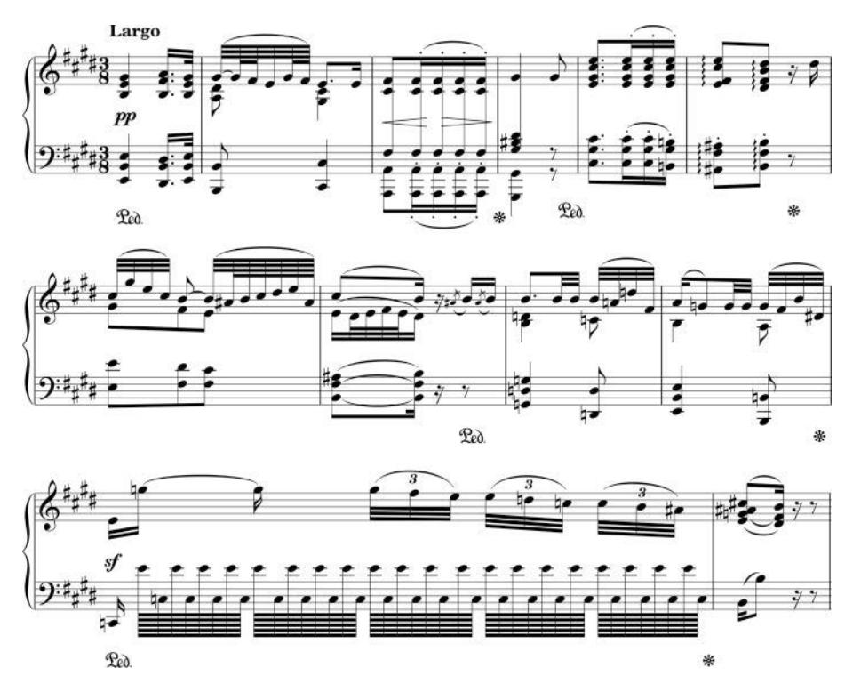

*Ex. 5.5 Beethoven, Concerto no. 3 in C Minor, op. 37, mvt. 2*

harmonies. A delicate touch, resonant low bass notes, and, perhaps, minute quarter-pedal changes may be a better solution.

In the beginning of the coda of the fi rst Ballade, many students are putting pedal on the accents, making the syncopations sound like downbeats, instead of using Chopin's original pedaling as shown in Ex. 5.7. The composer's pedaling requires some getting used to, as it challenges the pianist's coordination between hands and foot. However, this way of pedaling helps to create the appropriate atmosphere of dramatic turmoil, making the accented chords incisive but light, without adding an aspect of heavy stomping to them.

One of the most striking examples of how incorrect pedaling can ruin the whole meaning of a piece is Chopin's Prelude in A Major (Ex. 5.8). Among the wonderfully eloquent works that constitute the cycle of twenty-four

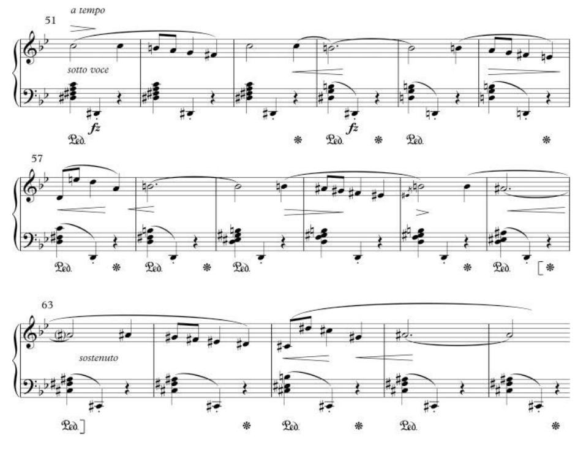

*Ex. 5.6 Chopin, Nocturne in G Minor, op. 15, no. 3*

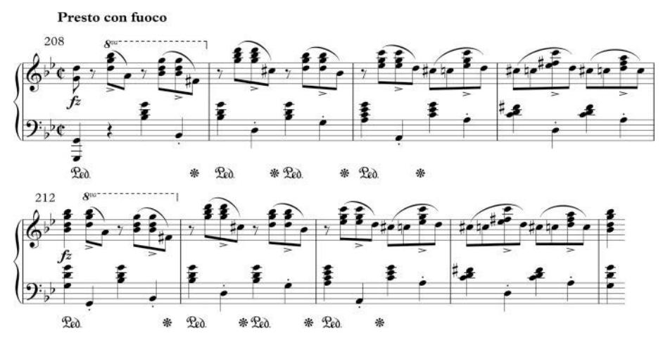

*Ex. 5.7 Chopin, Ballade No. 1 in G Minor, op. 23*

#### 114 In the Practice Room

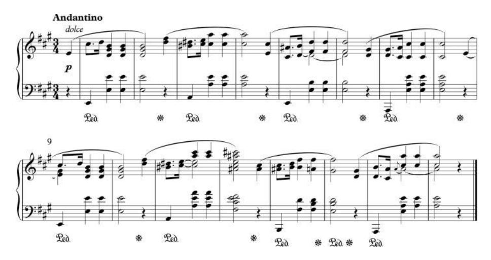

*Ex. 5.8 Chopin, Prelude in A Major, op. 28, no. 7*

 preludes, this miniature may give an impression of a rather insignifi cant, fairly straightforward mazurka. However, this impression changes if one plays the prelude observing the composer's pedal markings. True, on the modern piano this requires a signifi cant adjustment of touch and occasional quarter-pedal changes. However, the eff ort will defi nitely pay off . Hearing the pedaling prescribed by Chopin, one realizes that the piece is not a simple mazurka but rather an idealized one, a nostalgic dream of mazurka.

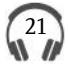

I don't believe that it is helpful to memorize pedaling, except perhaps for certain passages requiring special eff ects. The pianist's use of the pedal varies from one room to another, in response to diff erent acoustical conditions. In a dry hall, especially one fi lled to capacity, the pianist will have to use a lot of pedal to "moisturize" the sound, while in an overresonant (or badly attended) one only very little pedal will be required. This does not mean, however, that we should neglect pedaling while practicing; quite the opposite is true. In most cases, it is not the specifi c actions of the foot that will be saved in one's memory but the worked-out sound image to which the pedaling will be adjusted in each performance.

Some students use the pedal in a careless, overabundant way. To them I say that pedal is like makeup: if you notice it, it means you have used way too much.

The pianist can use the pedal to produce a number of special eff ects that contribute to sound variety. In many twentieth-century compositions such eff ects are often explicitly required. Some of them are described below. The fi rst two have to do with what has been previously described as half pedal or quarter pedal, which consists of either partially releasing or depressing the pedal halfway or a quarter of the way. The fi rst technique, releasing the pedal in this manner, is indispensable for weeding out some dissonances without creating moments of harmonic nakedness. It can also be very useful in a resonant hall. If a pianist feels that the sonority becomes too thick, he may bring his foot up halfway, reducing the resonance. (Frequent action of this kind has been termed by some "pedal vibrato" or "pedal tremolo.") An experienced pianist would never decide in advance on such a pedaling; rather, he would improvise it, instinctively responding to what he hears. Such pedaling is commonly used by seasoned performers but is very diffi cult to notate and, consequently, is almost never indicated in the score.

A slow release of pedal, sometimes specifi cally requested by the composer, is a variant of this type of pedaling. (Valentin Silvestrov indicates it in his works as Ped > 1/2 > 0.) This kind of pedaling can produce a magical result with its gradually vanishing sound. Unfortunately, in some pianos the eff ect may be spoiled by an unpleasant metallic buzz because of improperly adjusted dampers. In his work *Ellis*, Heinz Holliger uses the slow release of the pedal to cause not the usual diminuendo but a crescendo: after a glissando across the low strings of the piano (in a motion parallel to the keyboard), the pedal is released very slowly; a crescendo occurs when the dampers contact the vibrating strings.

Partially depressing the pedal, like partially releasing it, is used for the same purpose of limiting the resonance of the piano. In some twentiethcentury scores it is specifi cally requested, as in the passage in the fi rst movement of the Bartók Concerto no. 2 (Ex. 5.9), where the composer

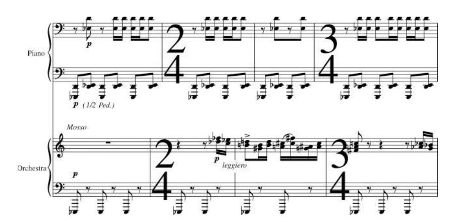

*Ex. 5.9 Bartók, Concerto no. 2, mvt. 1*

 indicated that a half-depressed pedal should be held for a few bars without changing. Such pedaling creates a continuous ringing, like that of a suspended cymbal. The same eff ect, indicated on the fi nal pages of Bartók's Sonata for Two Pianos and Percussion, is, in fact, employed concurrently with the resonance of the suspended cymbal. I use this pedaling in Debussy's "Minstrels" (Ex. 5.10) in response to the composer's indication of *quasi tambouro* to imitate the buzz of the metal string in the snare drum. 22

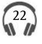

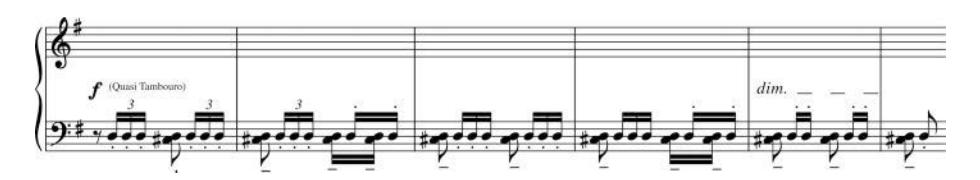

*Ex. 5.10 Debussy, "Minstrels" from Preludes, book 1*

To re-create the eff ect of *sfp*, the pianist abruptly releases the pedal and then immediately depresses it, capturing the echo of previous sonority. This action is often combined with fi rst releasing and then silently depressing the keys. This combined procedure, cumbersome to describe in words but relatively easy to demonstrate, is somewhat risky as the pianist may end up losing the sound in the course of performing these manipulations. When the described maneuver succeeds, it is very eff ective in rapidly reducing the volume. A more straightforward variation of it is used in Luciano Berio's "Sequenza IV." The chord marked *sff z* is accompanied by the pedal indication Ped. \_\_\_\_\_\_∣ and this note: "The attack sff z must always be as loud as possible. The pedal, when used immediately after this type of attack, should collect only random noises and resonances."2

Another eff ect is to play without using any pedaling. Although unnatural for the pianist, it can be used to create an especially straight, matter-of-fact sonority, as in the beginning of the third movement of Prokofi ev's Concerto no. 4 marked *senza Ped*, or in the second of his *Sarcasms* op. 17 marked *secco e senza Ped*. In the fi rst piece of the same set Prokofi ev achieves a striking contrast between the dry, direct sound *senza ped* and the overresonant *forte con ped* (Ex. 5.11). 23

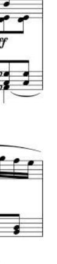

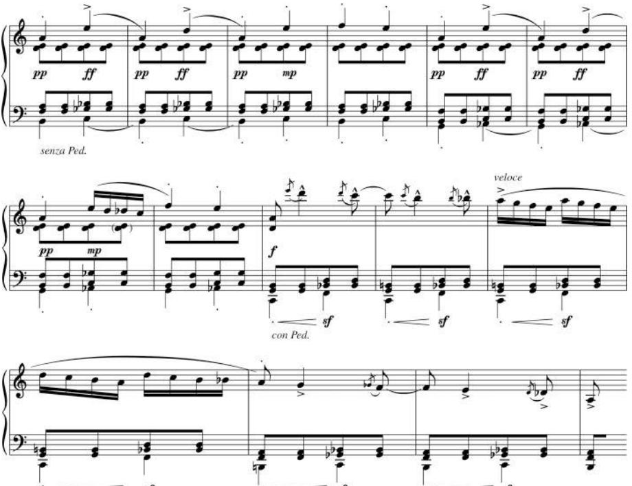

*Ex. 5.11 Prokofi ev*, Sarcasms, *op. 17, no. 1*

The remainder of this chapter is dedicated to the piano's other pedals. The *left* pedal, commonly referred to as "soft pedal," is often indicated in a score as "una corda." The change in sound happens because depressing the left pedal causes the keyboard of the grand piano to shift to the right. As a result, for most of the notes the hammers strike two strings instead of three. The third string resonates sympathetically, contributing to the overall impression of a much less percussive sound. The indication una corda (Italian for one string) can be executed on the modern piano literally only in the limited area that has but two strings to a key; in most cases the unison consists of three strings, and the result would be more accurately described as "due corde." Thus, the construction of the modern piano does not allow us to follow the letter of Beethoven's instruction, in the second movement of the Fourth Concerto, "due, poi una corda" (two and, later, one string). All we can do is to press down the left pedal slowly. Similarly, we release it slowly to approximate what Beethoven indicated in Sonata op. 101 with the words "Nach und nach mehrere Saiten (Poco a poco tutte le corde)" (See Ex. 5.3).

The other change in sonority produced by the left pedal is much less welcome: on hammers that have not been fi led when needed grooves have been cut because of the repeated contact with the strings. When the left pedal causes the hammers to move, they strike the strings with the narrow ridges between these grooves, producing an unpleasant, nasal tone. In such cases, the pianist may decide to give up using the una corda eff ect.

Too often the left pedal is used merely as a mute, when its main purpose should be to add a special color to the sonority. Debussy knew this when he asked for the entire "Serenade for the Doll" from the *Children's Corner* to be played una corda, even the loud passages. As a coloristic device the left pedal can add subtle variety to the sound without necessarily changing the overall dynamic scheme. The music can often benefi t from the special color of una corda even when applied for a short stretch. In the example from the fi fth piece of Prokofi ev's *Sarcasms* (Ex. 5.12), the composer indicated it for just a few notes.

In principle, the left pedal should not be treated as a life vest, to be used whenever one cannot reduce the volume enough. In real life, however,

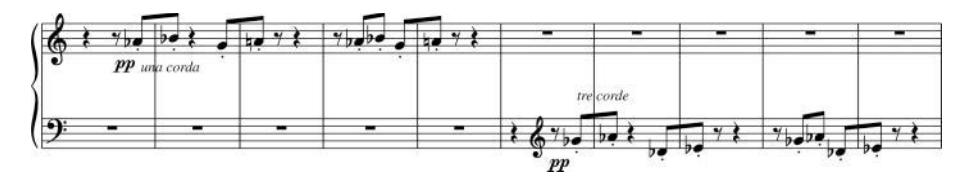

*Ex. 5.12 Prokofi ev*, Sarcasms, *op. 17, no. 5*

when a pianist has to confront tremendously bright pianos, the left pedal often does become a means of last resort.

The action of the left pedal is completely diff erent in the upright piano than in the grand. In the grand piano the hammers shift to the side, while in the upright they are brought closer to the string, thus reducing the distance over which the hammer can develop speed to attack the string. In the latter action, the volume is reduced but the timbre is not aff ected. I recently played a grand piano built by the Australian maker Stuart & Sons, which, in addition to offering the usual shifting soft pedal, also had an additional pedal that operated on the upright's principle of bringing the hammers closer to the strings.

With respect to the sostenuto (middle) pedal, which sustains only those notes that are depressed when the pedal is applied, I must confess that I am reluctant to use it except when it is specifi cally requested by the composer. To begin with, not every piano is equipped with a sostenuto pedal; when the pedal is included, it frequently malfunctions. More important, I often do not fi nd the result to be a satisfying one artistically. When the sostenuto pedal is used to hold a sustained bass against changing harmonies, for instance, as some pianists do in playing Debussy's "La cathédrale engloutie" (Ex. 5.13), the result is disappointing. Though the right pedal can now be changed with every new harmony without losing the sustained bass note, the ensuing sonority lacks harmonic ambiance. I strongly believe that here Debussy did not have in mind merely a sustained single bass note but an atmospheric blur accompanying it as well. The right solution in my mind lies in skillful half-changes of the damper pedal. A pianist who possesses good control over touch may need to change the pedal but very infrequently

#### 120 In the Practice Room

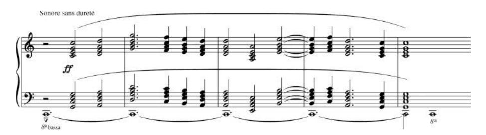

*Ex. 5.13 Debussy, "La cathédrale engloutie" from Preludes, book 1*

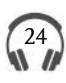

or even not at all, provided the chords are carefully voiced and their thickness is reduced.

When use of the sostenuto pedal is requested by the composer, however, the indications for it must be carefully observed. Some contemporary composers, among them Luciano Berio, cleverly combine all three pedals, creating contrast between dry, unpedaled textures and sustained sounds prolonged by the sostenuto pedal. Such pedaling needs to be practiced precisely; it requires a good deal of coordination between the feet.

In conclusion, I would like to stress that I do not believe in foot technique as such; there is no complexity in movements of the foot per se. The diffi culty lies in a subtle collaboration between fi ngers and foot, controlled by the ear. This is why my earlier comments about touch apply equally to the pedal: if the pianist wants to refi ne his pedaling, he must fi rst refi ne his ear.

## Chapter 6: Practicing

Practicing—a lifelong occupation of performing musicians—can easily be taken for granted. On any given day, thousands of pianists all over the world set themselves in front of their pianos and, switching off their minds, spend hours in mechanical repetition. We must recognize that regular practicing is indispensable and that, by necessity, it includes repetition. But we owe it to ourselves to make it quality time and to not waste thousands of hours in mindless activity.

Should one start the day with exercises, études, or scales? People have diff erent feelings about the usefulness of the daily warm-up routine. I have noticed that adult pianists who practiced diligently at a tender age need to do much less practicing and technical work than those who did not. (Younger readers are invited to make their own conclusions.) Personally, I fi nd that some twenty minutes of warm-up routine (mainly scales and arpeggios) are very useful to bring my "machinery" into working order. (After all, no dancer would dream of starting dancing in earnest without going through various warming-up and stretching exercises fi rst, nor would a soccer team start a game cold.)

Every pianist passes through periods of devoting increased attention to technical needs. These phases are very important in the pianist's life, as this is the time when technical development is given a strong push. During these periods much time is spent working on particular types of technique that are in need of improvement. One can do it with exercises, études, or diffi cult passages from the proper repertoire. Yet even during these periods one should not let technical drills fi ll the entire time spent at the piano. The pianist should decide in advance on the amount of time allocated to purely technical work and adhere to it.

Learning a new work starts with choosing a good edition. One needs to feel confi dent that the selected edition reproduces the composer's text reliably. I strongly advocate using Urtext editions, which are free from editorial interference. Students who already own another edition typically say: "But I do not pay attention to the editor's dynamic markings in my Bach edition. Why shouldn't I use it?" The problem is that, looking at the score on a daily basis, one cannot help but be infl uenced by it, even against his will. I consider editions prepared by important musicians (for instance, Schnabel's edition of Beethoven sonatas) to be tremendously useful. But I would keep them on the side rather than in front of me on the music stand, consulting them periodically for highly valuable, though not binding, advice. Obviously, one should not be a slave to the Urtext edition; the original text (especially of pre-Classical and Classical music) is missing many necessary dynamic, agogic, and other indications. A performer cannot avoid adding them. But I feel that the decisions on what and when to add should be made by the performer himself. He should not passively follow the personal taste of an editor, even if the editor is a great musician.

Actually, every performer becomes his own editor, because inevitably he must make choices in almost every piece he studies. Many publications based on fi rst editions faithfully reproduce the original texts, which, unfortunately, come complete with the engraver's mistakes. Besides, the composer, even the most meticulous proofreader, could have made a mistake himself. A good example of this is Debussy's prelude "La cathédrale engloutie." The manuscript shows that the composer was not sure how to notate certain sections of the piece.\* Trying diff erent notational strategies, he may have become distracted and failed to indicate that bars 7–12 and 22–83 should be played at twice the speed of the rest of the composition

\* The facsimile was published by Pierpont Morgan Library in 1987 in association with Dover Publications, preceded by a helpful introduction by Roy Howat.

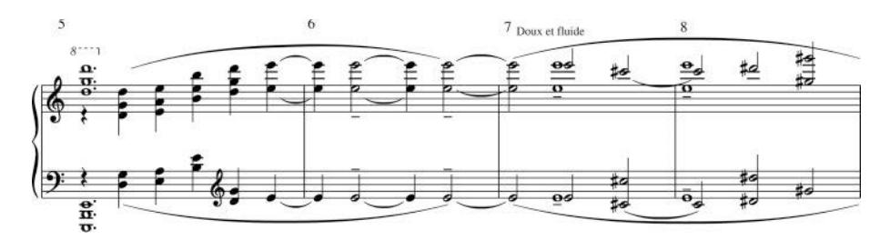

*Ex. 6.1 Debussy, "La cathédrale engloutie" from Preludes, book 1*

(see Ex. 6.1). This was the way Debussy himself played the work in a preserved piano roll recording.

In the process of examining the score, the performer encounters dynamic, agogic, or even textual diff erences in parallel passages (for example, diff erences between the way the same material is presented in the exposition and the recapitulation of a sonata). If the performer is working intelligently, not just unthinkingly pushing down the keys, he will have questions to answer: Is the diff erence an intentional, meaningful one to be observed, perhaps even stressed in performance? Or is it an oversight on the part of the composer that should be corrected? When only one bar among many similar ones in a Bach piece has an articulation slur, should this bar be played diff erently from the others? Or is the slur there to show how the rest of the passage should be played? If, in a chamber work, a slur indicating legato over a violin phrase is missing from the piano rendering of the same phrase, should this diff erence be corrected or preserved? The search for answers forces us to look closer, more attentively at the work, to consider the stylistic traits, performance practice conventions, and circumstances of the creation of the piece. Often one cannot reach an unequivocal conclusion. Why do similar passages in the exposition and recapitulation of the fi rst movement of Beethoven's *Emperor* Concerto diff er in just one note in each hand's part (Ex. 6.2)? Or, even if we leave the few diff erences in actual notes aside, why did Beethoven articulate similar passages from the same work diff erently (Ex. 6.3)? \*

\* Unable to answer this question, I preserve these inconsistencies while performing the work, bearing in mind Ralph Waldo Emerson's words: "A foolish consistency is the hobgoblin of little minds." (from *Essays*)

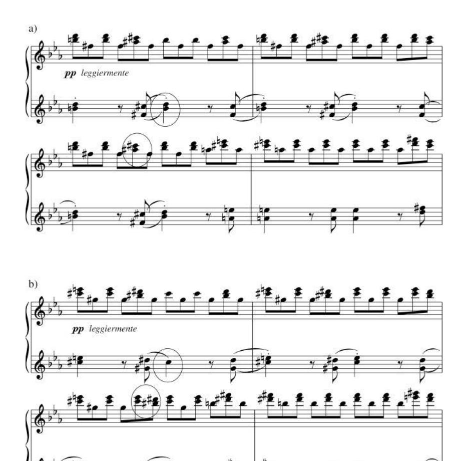

*Ex. 6.2 Beethoven, Concerto no. 5 in E-fl at Major, op. 73 ("Emperor"), mvt. 1*

When Mozart and Beethoven recapitulated thematic material in a diff erent key, they often needed to modify the transposed version to conform to the range of the piano of their time. Mozart seemed always to have been able to adjust to this constraint, producing a variant not wanting in any way; with Beethoven, however, not every adjustment of a transposed passage sounds natural. I am far from recommending an automatic "correction" of such passages to make them sound identical. Occasionally, however, little

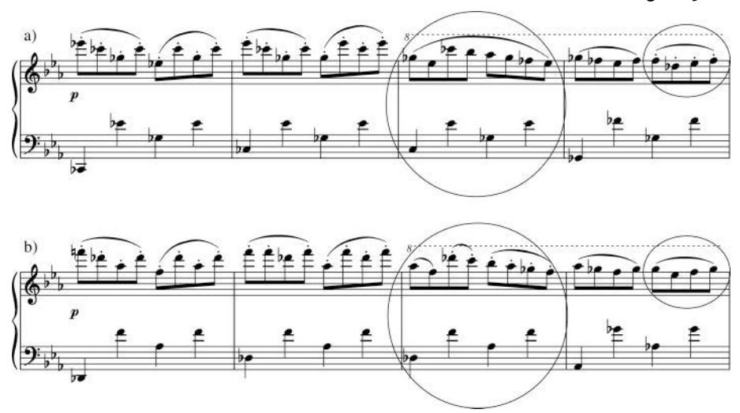

*Ex. 6.3 Beethoven, Concerto no. 5 in E-fl at Major, op. 73 ("Emperor"), mvt. 1*

retouches suit the music better. See, for example, the passage from the *Emperor* Concerto, in which the proposed octave adjustments in the piano part match the cello line (Ex. 6.4). Whereas these retouches are hardly noticeable, changes in the treble, such as those generally accepted in the fi rst movement of Beethoven's Fourth Concerto, are more exposed.

Important as they are, the correct notes, rhythm, and dynamics are not the ultimate goal by themselves. They are just the foundation for the creative work, which really only starts after the basics have been established. Practicing of the higher artistic order is governed by three questions the pianist should be constantly asking himself:

- (1) "How do I want it to sound?" This inquiry ranges from the character of the piece as a whole or a section of it to the specifi c kind of sonority that the pianist considers appropriate to the correct balance between voices.
- (2) "Does it sound the way I want?" To answer this question the pianist must carefully listen to his playing.
- (3) "If not, what should I do to make it sound the way I want?" The performer must decide which practical solutions will accomplish the job.

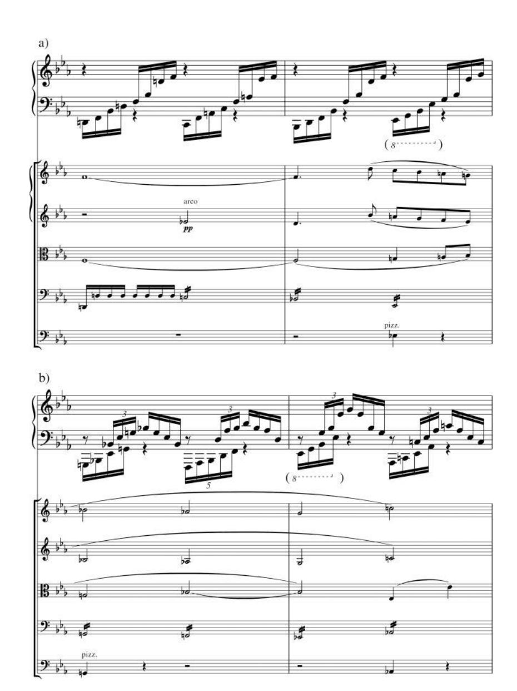

*Ex. 6.4 Beethoven, Concerto no. 5 in E-fl at Major, op. 73 ("Emperor"), mvt. 1 (piano and strings only)*

Where should the pianist start? At the beginning, say many students. Work on the fi rst bar, then on the second, and so on. But is this the most effi cient way to work? No painter starts a picture with detailed work on one section, methodically proceeding over the rest of the canvas. Instead the artist usually begins by generally sketching in the overall composition of the picture. The pianist will do well to adopt a similar approach.

One should try to get a general idea of the piece's character and structure as early as possible. (People who sight-read well are at a clear advantage.) This impression will guide the performer through practice, advising him on how the music will ultimately sound and on the best ways to achieve this sonority. In turn, the general plan is amended daily as a result of discoveries made during practice sessions. Joseph Hoff mann used to compare the pianist's brain to a photographic plate, registering every change that happens during the practice session. A contemporary reader may relate better to an analogy with a computer: the pianist's performance plan can be compared to an electronic document that has been stored in the computer's memory. Changes that occur in this general plan during practice are "saved" in memory at the end of every practice session.

Many students turn their practice sessions into repeated run-throughs. This habit is very harmful because it ingrains in the pianist's mind all the faults and imperfections of attempting to perform a piece that has not been learned properly. Although I advocate playing through the work (or a movement or section) from time to time—even during the initial stages of learning the work in order not to lose sight of the whole—each of these infrequent trial performances should be followed by a conscientious "cleanup" with full attention paid to every detail.

The general idea of the composition's character and sonority determines the pianist's approach to practicing. When I practice I try to approximate what I want the music ultimately to sound like, though, by necessity, often not in the intended tempo. It makes no sense to practice, for instance, Chopin's Etude op. 25, no. 2 (see Ex. 2.8), using strong, heavy fi ngers and exaggerating the articulation, when the ultimate result must be a light, fl eeting, whispering touch. On the other hand, practicing the last movement of

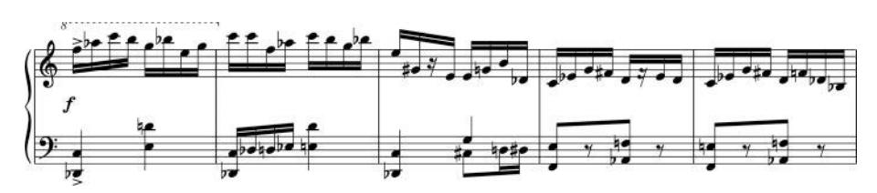

*Ex. 6.5 Prokofi ev, Sonata no. 6, op. 82, mvt. 4*

Prokofi ev's Sonata no. 6 (Ex. 6.5) with weak, fl abby fi ngers will not prepare the pianist for the clear, sometimes steely articulation that is required. For the same reason, I am skeptical about practicing "in rhythms." I do not see any merit in practicing unevenly what ultimately has to sound even, and vice versa. Its greatest benefi t may be in refreshing the pianist's fl agging attention, but a fi fteen-minute walk in fresh air will achieve the same result.

Most readers are probably familiar with George Orwell's *Animal Farm* and the main commandment on the farm: "All animals are equal but some animals are more equal than others." I refer to this quote frequently when working with students on numerous technical passages. It is true that notes of the same duration should run evenly, but this does not mean that these notes are equal in their melodic, harmonic, or thematic importance. By playing such runs mechanically and articulating every note in the same way, one robs the passage of its melodic content. Such an approach can be especially harmful to the works of Mozart and Chopin, whose *passagi di bravura* are melodies in disguise. "A fast Chopin passage," writes Perelman, "has enough intonation material for fi ve or six nocturnes."1

Good practicing should reveal to a pianist the diff erent roles of the notes in a passage. To explain, let us look closely at the passage from Mozart's Sonata in A Minor, K. 310 (Ex. 6.6). The right-hand part consists entirely of sixteenth notes, which causes scores of pianists to play the notes in a mindlessly even way—a perversely understood concept of *jeu perlé*. Yet on close examination, we notice that each of the fi rst three beats in the fi rst and second bars has a group of four notes circling around one tone (in the fi rst bar, these notes are A, F, and D, respectively). In each of the groups, this tone is more important than the other three notes; neighbor notes from above and below are dependent on it. But the greatest attention should be given to the fi rst note of each group, an appoggiatura that wants to be resolved into the main tone a step down; a gentle leaning on this note may be required in performance. The fourth beats of both bars break the symmetry, prolonging the "circling" from below before climbing to connect with the next bar. In the third bar, the descending scale is embellished by a neighbor note (every other sixteenth note: second, fourth, and so on) gently masking the generally descending direction. These notes need to be played lighter, less independently than the alternate ones (fi rst, third, and so on). In the last beat of the fourth bar, the choice of B-fl at produces a momentary infl ection toward the subdominant. Mozart further stresses the impending melodic resolution to A by introducing G-sharp instead of G. Working on this passage slowly, not just cerebrally analyzing but "listening through it," the pianist gently molds his articulation and touch. He should apply a "loving magnifying glass"—enjoying every one of these even notes, trying to make each of them expressive and, therefore, unlike the others. 25

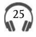

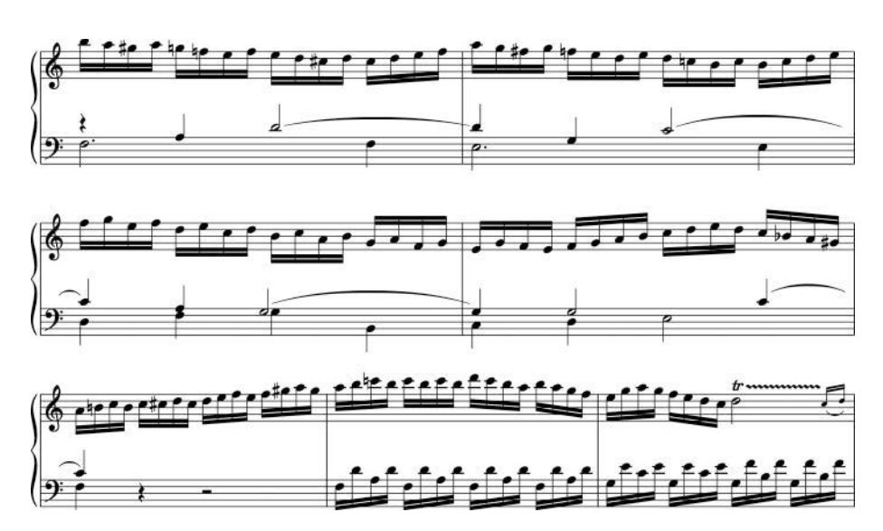

*Ex. 6.6 Mozart, Sonata in A Minor, K. 310, mvt. 1*

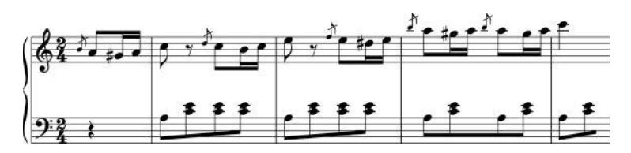

*Ex. 6.7 Mozart, Sonata in A Major, K. 331, mvt. 3*

Let us now turn to the beginning of Mozart's "Rondo alla turca" from the Sonata in A Major, K. 331 (Ex. 6.7). Everyone correctly plays the grace notes as even sixteenth notes. However, those practical editions that, for the sake of convenience, replace the grace notes with regular sixteenths do a great disservice to the music. Mozart's way of writing indicates that he sees these notes as apoggiaturas that require a special infl ection, a slight leaning or emphasis, a slightly greater degree of legato. A performance that makes the four notes as even in dynamics and articulation as they are rhythmically harms the expressivity of the passage. (Obviously, I am talking about the smallest degree of leaning and emphasis, which should not hamper the general light, upward motion of the melodic line.)

Whereas string players are constantly experimenting with fi ngering, changing it frequently, pianists tend to stay with their original choice. By determining the appropriate fi ngering early, they will speed up the process of learning the piece. (Revisiting repertoire learned earlier, however, one often reexamines and sometimes changes the fi ngering, along with other aspects of the performance.) Convenience and effi ciency are the important considerations for choosing a particular fi ngering. There is one more aspect that students frequently ignore: a fi ngering that seems perfectly fi ne for slow practicing may not be suitable for a piece when they will perform at a fast tempo. Often this confl ict occurs when the chosen fi ngering requires frequent changes of positions, big movements of the wrist, or, in scale-like runs, frequent use of the thumb. At a fast tempo, when every fraction of a second counts, the pianist will strive to replace wasteful big movements with smaller, more effi cient ones, which often necessitates reconsidering the fi ngering. This is one more argument in favor of trying early on to play up to the optimum speed of a piece.

In addition to effi ciency and convenience, other aspects infl uence our choice of fi ngering. The best fi ngering generally is one that fully serves the musical goals of the pianist. In the case of an idiosyncratic articulation, this means the fi ngering that necessarily results in the intended phrasing, or, to put it diff erently, does not allow the pianist to play in any other way. Often in such cases a composer suggests the fi ngering himself; it should always be taken seriously, especially if the composer has also been a great pianist. An often cited excerpt from Beethoven's Variations in C Minor is a good example (Ex. 6.8). Similarly, Prokofi ev in his Fourth Concerto (for the left hand) instructs the performer to play octave leaps with the same fi nger (Ex. 6.9) to achieve a specifi c sonority, as well as an overall audacious character. To replace this fi ngering with a standard one (5–1) would be to miss the point. (I do not consider distributing this passage between the two hands: in a piece written explicitly for the left hand such an alteration would have been

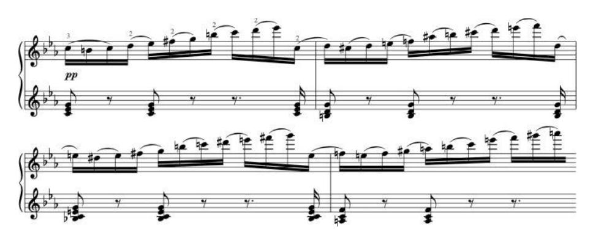

*Ex. 6.8 Beethoven, 32 Variations in C Minor, WoO 80, variation 31*

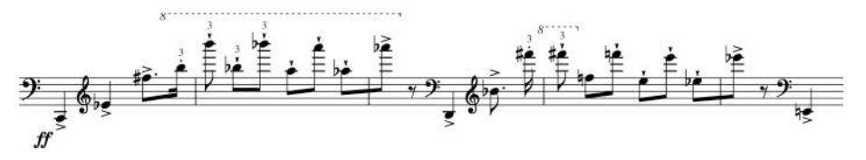

*Ex. 6.9 Prokofi ev, Concerto no. 4, op. 53, mvt. 1*

against "the rules of the game.") Of course, an experienced pianist can execute the required articulation and create a needed sound character using any fi ngering, but choosing the one that accomplishes his goal without additional thought frees the mind for more important tasks.

Great pianists have often come up with creative, unorthodox fi ngerings in pursuit of specifi c musical ideas. A serious student will do well to examine them. As an example of fi ngering that aims at a specifi c sonority I can cite the unusual fi ngering suggested by Busoni for the passage from the B Minor Sonata by Liszt (Ex. 6.10). It forces the fi ngers of the right hand to assume an almost vertical position, creating a very special voicing of the chord and an idiomatically "brassy" sonority. In his eff orts to achieve a special sound, Liszt often directed the performer to play several notes of the melody with the same fi nger. Such fi ngering makes the pianist use both the forearm and upper arm and gives more body to the sound.

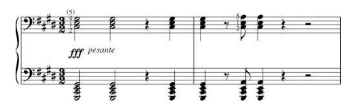

*Ex. 6.10 Liszt, Sonata in B Minor*

Another criterion in choosing a specifi c fi ngering concerns "the aesthetics of fi ngering," a consideration understood by every professional pianist. The fi ngering can seem ugly or beautiful depending on how well it fi ts the musical (and pianistic) style of the composer. Chopin, for instance, frequently conceived his texture in wide positions, often exceeding the span of the pianist's hand (as in Etude op. 10, no. 1). The pianist should choose a corresponding wide-position fi ngering, avoiding angular jumps or twists even though they may seem more convenient from a purely mechanical point of view.

Harmonic accompaniment of the type found in Chopin's Mazurka op. 63, no. 3 (Ex. 6.11) needs to be fi ngered, whenever possible, in a way that would acknowledge this wide-position thinking, as well as the fact that the bass and the chords in the middle register are parts of the same harmony. Many students, leery of wide stretches and afraid of missing notes, would prefer the fi ngering that is crossed out in Ex. 6.11. Yet every experienced pianist will fi nd this alternative foreign to the composer's idiom and avoid it, unless a small hand forces the performer to use the fi fth fi nger twice, as in bar 3.

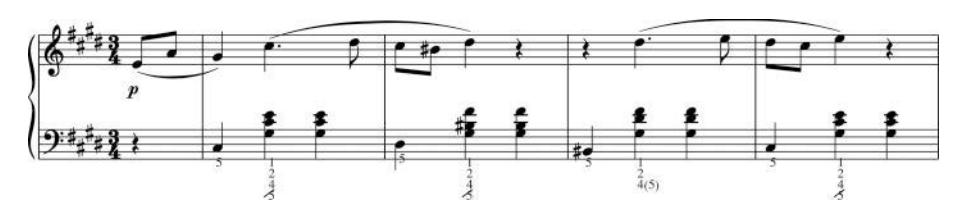

*Ex. 6.11 Chopin, Mazurka in C-sharp Minor, op. 63, no. 3*

Musical considerations should govern our decisions concerning redistribution of material between hands as well. Cleverly altering a score by transferring one or more notes from one hand's part to another can turn an awkward technical passage into a smooth one. Such adjustment should not be done uncritically, however: one may gain in convenience but at the same time distort the sound or the mood. The famous passage for the lefthand solo in Schumann's Fantasy (Ex. 6.12) loses its solo-like character if the texture is divided between the hands.

There is another reason not to rush to rearrange the material, even if this makes the piece technically easier: the "pride of the virtuoso," which often moves us not to avoid technical challenges but to face them. Even when

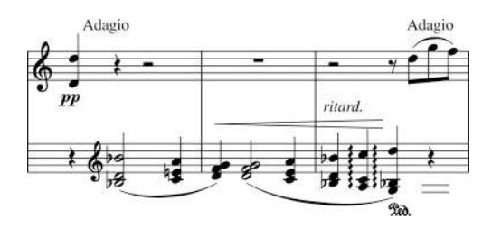

*Ex. 6.12 Schumann, Fantasy in C Major, op. 17, mvt. 1*

encountering easier versions, authorized by the composer, one should approach them with caution. For instance, I strongly discourage using such a variant in the last movement of Brahms's Concerto no. 1 (Ex. 6.13). The diffi cult octave leaps in the right hand bring the fearless feeling to the passage, well suited to the overall character of the movement. After all, such passages were written specifi cally for soloists to showcase their skill. The performer had better have something to show.

While practicing, I try to avoid any artifi cial dismantling of the music. Some people insist on beginning work on a piece by practicing one hand alone fi rst, adding the second hand later, then the pedal (then the mind, then the heart. . . . ). Of course, sometimes we do need to separate elements, but I would compare practicing for a concert performance to driving down a highway. Sometimes we are forced to slow down or take a detour, but we try to come back to the highway as soon as we can.

When I practice an individual section of a piece, I start slightly before the section in question and end slightly after its conclusion. I do this to avoid the seams that are so evident in many student performances. Another observation: some pianists always start their daily practice of a piece at the beginning, only to run out of steam before fully covering it. As a result, they know the beginning of a work much better than the end. To prevent such an outcome, start sometimes with the last page, then go to the preceding page, work on it and connect with the last one, then to the page before that, and so on. In addition, it is sometimes very helpful and revealing to work on similar passages sequentially, for example on the same theme in the exposition and the recapitulation.

Many famous pianists have left us with practice variants of technically diffi cult passages. Such variants expose—and even frequently augment the diffi culty so that the original version seems easy by comparison. In this vein I sometimes encourage my students to invent their own technical variants of passages they fi nd diffi cult, though I believe that such variants should be abandoned as soon as the diffi culties are conquered. The same purpose is served by exposing the relative weakness of the left hand. When learning the concluding passage from the *Emperor* Concerto by Beethoven

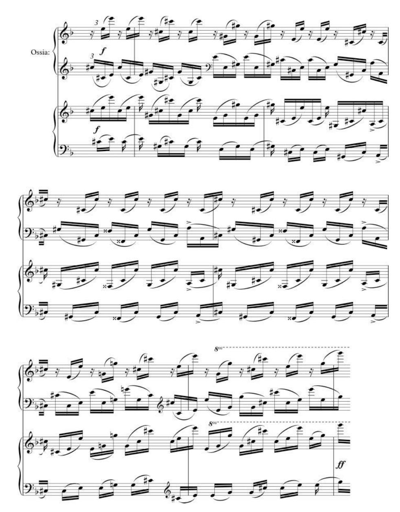

*Ex. 6.13 Brahms, Concerto no. 1 in D Minor, op. 15, mvt. 3*

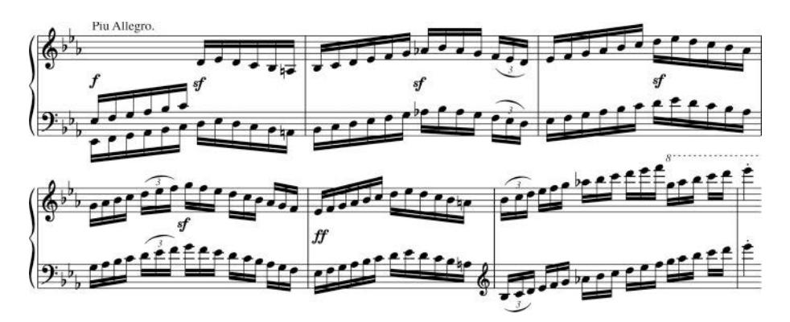

*Ex. 6.14 Beethoven, Concerto no. 5 in E-fl at Major, op. 73 ("Emperor"), mvt. 3*

(Ex. 6.14), the pianist may wish to do some practicing with the hands crossed (playing the left-hand part with the right hand and vice versa) to expose any unevenness the left hand may have. Pianists with a masochistic streak may wish to practice the entire last movement of Chopin's Sonata in B-fl at Minor in the same way. This method of "self-teaching," when the right hand "teaches" the left, can be used in other circumstances as well. If, for instance, a complicated passage in one hand's part does not sound right, I double it with the other hand, letting one hand "teach" another.

Some pianists went so far as to take whole compositions and compose variants that are much more diffi cult than the original. Examples include Leopold Godowsky's versions of Chopin études, as well as Brahms's studies after Chopin's op. 25, no. 2 (the original melodic line is presented in parallel sixths!), the rondo from Weber's Sonata in C Major, and Schubert's Impromptu op. 90, no. 2. (Here is the virtuoso's pride again.) These and many other transcriptions show the "sporting" aspect of a performer's work that moves him to challenge his virtuoso abilities. Rising to meet extremely diffi cult challenges, the pianist tests (and expands) the limits of his technique.

Tireless listening to one's own playing is the key to effi cient practicing, because it informs the pianist about anything that may need improving. When encountering a problem, the pianist must fi gure out exactly what it is, instead of (or at least, before) repeating the passage countless times. It is not enough to notice that a run is uneven. To correct it effi ciently, one should ascertain precisely what is happening: Is the note coming too soon or too late? If the pianist misses a jump, he should fi nd out whether he is likely to go too far or not far enough while executing the leap. The perception of the distance must then be adjusted accordingly.

Should one practice slowly? I think that one should practice as fast as one's ear can acknowledge every detail and the mind can control every motion. Slow practice is intended not just to train the fi ngers to move faster but to teach the mind to react faster to what the ear hears. "With suffi cient repetition we need less and less time to exercise . . . control," wrote Sandor.2 If the ear cannot keep pace, the playing will be muddled, even if the desired speed is achieved. Many students avoid dealing with this problem by mentally switching off for a part of a virtuoso passage. It is as if they tell their fi ngers, "See you in the next bar," and allow the hands to fi nish the rest of the bar automatically. These mentally skipped parts are easily recognizable by the unmusical, mechanical way in which they are played. The remedy is—you guessed it—to listen tirelessly to every note you play.

In the chapter "Matters of Time" I discussed how perception of musical pulse aff ects the understanding and performance of a composition. It plays a similarly helpful role in overcoming the technical challenges of a work. Suppose a student is learning Chopin's "black keys" Etude in G-fl at Major, op. 10, no. 5 (Ex. 6.15). Having studied each hand's part separately, he then combines them. Most likely, at this early stage he feels the eighth note pulse (four beats to a bar). He starts appropriately with a slow tempo, gradually increasing the speed as his mind and his fi ngers become more familiar with the music. He may ultimately reach a point when, in spite of his eff orts, he cannot move to a faster tempo. He should then change to a quarter-note pulse (two beats to a bar). Very often this mental switch opens a new reservoir of velocity, and the pianist can progressively increase the speed. After some time, however, he may encounter the same obstacle again: he cannot play any faster. Switching to thinking in whole bars may allow him to conquer the faster tempo. Finally, the student is able to play

#### 138 In the Practice Room

the étude very fast indeed. If now he tries to enlarge the unit of musical pulse once again, feeling it once every two bars, he may gain a truly virtuoso lightness of playing while feeling much less preoccupied and more in command. This fi nal perception of the musical beat underscores the inseparability of technical and musical considerations, because it coincides with the harmonic rhythm of this piece: two bars of predominantly tonic harmony are followed by two bars governed largely by the dominant. (The eff ectiveness of switching to progressively larger units of musical pulse depends on appropriate timing of the changes. Delaying the switch stalls the pianist's technical progress. On the other hand, by making the change prematurely, before his technical and musical familiarity with the piece justifi es the step, he will cultivate sloppy performance habits.)

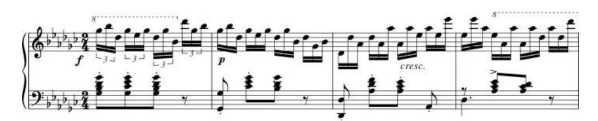

*Ex. 6.15 Chopin, Etude in G-fl at Major, op. 10, no. 5*

In rapid passages, enlarging units of pulse means, in fact, that the pianist decreases the frequency of "will impulses" sent by brain to fi ngers. In other words, the brain sends the fi ngers "orders" not for every note but for groups of notes that progressively increase in number as the perception of pulse changes. The unfortunate "side eff ect" of this is that the pianist's ear may stop listening to every note, hearing them in blocks instead; perfunctory playing may result, the see-you-in-the-next-bar phenomenon as described above. The pianist must therefore combine progressively infrequent commands to the fi ngers with attentive listening to every note. This is just one of many examples of diff erent functions carried simultaneously in the pianist's brain, discussed in greater length in the chapter on performing.

With the proliferation of recordings, the level of accuracy expected of the pianist has risen sharply. We are much less tolerant of wrong notes than performers and audiences were just a few decades ago. Although a pianist should not become upset over every note he misses, he should strive to achieve maximum accuracy. A mistake that occurs repeatedly cannot be considered accidental anymore; it needs to be corrected.

Countless times I have heard the explanation "it was clean at home" in the wake of inaccurate performances in concerts or lessons. I do not doubt the truth of this statement in most cases. The problem is that the diffi cult passage that has been repeated again and again with maximum concentration during practice sessions may fare less well in the context of performing the whole piece, especially on the fi rst attempt. One needs to build up a "security reserve" to ensure clean playing even when the pianist is not focused exclusively on the diffi culty in question or is nervous. To this end, I suggest that practice sessions include playing through a diffi cult passage or a work when the performer simulates the emotional state of a concert performance. The imperfections that reveal themselves in these run-throughs should be worked on not only in a cool-headed, calm manner, but also in a slightly excited, performance-like state of mind.

People who have wandered through the corridors of music schools and conservatories must have often heard the sounds of completely mechanical practicing, totally devoid of musical content. With people of limited musical abilities, not much can be done. Unfortunately, very often this is the way talented people are practicing; many of them have a perverse understanding of work ethic ("I will not move from this passage until I have played it fi fty times"). This self-punishing attitude achieves disappointingly little and can make one's playing lifeless—soulless—and mechanical. One should practice creatively: after repeating a passage several times without any sign of improvement, rather than continuing the repetitions, try to fi gure out exactly where the problem lies and whether your approach should be changed.

Sometimes it is useful to simplify the texture of a piece temporarily, not just to make it technically more manageable but also to gain a better understanding of its inner workings. A pianist can gain insight into a work's general structure by playing the outlines of themes while omitting transitional passages. Paying attention to voice-leading (applying Schenkerian analysis

#### 140 In the Practice Room

even very generally) will help to achieve the same goal and will greatly facilitate memorization of the piece. Simplifi cation of harmonic texture may clarify the harmonic progression. Playing a fugue one voice at a time will enhance one's appreciation of the melodic qualities of each part. ^harmonic-simplification

Unlike many instrumentalists or singers who have to take care of single melodic lines, pianists constantly have to control several elements or lines simultaneously. We must be able to play polyphonic textures in a coherent, clear, and expressive way; this skill needs to be developed most persistently. Time-honored ways of learning polyphonic works—every voice alone, followed by various combinations of voices in twos, threes, and so on—will produce good results only if they are pursued against the background of acute listening. The lines of each voice must not be hammered out mindlessly; they each must be played expressively. Combining the voices, one should follow the logic of each of them.

Many students, even talented ones, are unable to listen to more than one line at a time. When the teacher pushes them in this direction, they start skipping mentally from one voice to another, instead of listening to them simultaneously. Some students develop this "shifting spotlight technique" to the level of an art; nevertheless, it cannot substitute for real polyphonic hearing. The diff erence becomes apparent when one of the voices has a sustained note, as in the example from Bach's Prelude in E Major (Ex. 6.16). In the hands of a pianist who cannot listen polyphonically this excerpt would sound like Ex. 6.17.

The ability to play polyphonically can and must be developed. The following, embarrassingly childish analogy that I sometimes off er to my students

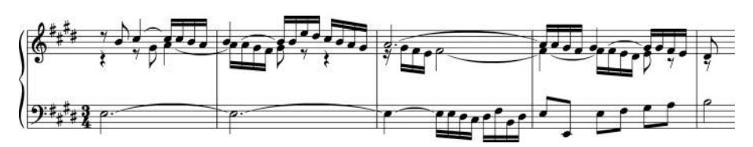

*Ex. 6.16 Bach, Prelude in E Major, BWV 878 from* Well-Tempered Clavier, *book 2*

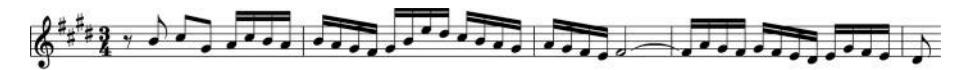

*Ex. 6.17*

has proven to be surprisingly eff ective: Imagine taking two dogs for a walk. While you are watching one of them, the other tries to run away. As you try to control it, the fi rst one does something bad to the neighbor's lawn. To handle both dogs, you must position your head in such a way that you can keep watch over both of them at all times. The pianist needs to develop a similar ability to keep two (or more) lines under constant aural control. As a fi rst step let me off er another juvenile idea: when playing a two-part texture, decide that your right ear will be responsible for the upper voice while the left ear will take care of the lower one.

I very strongly recommend memorizing a piece at a very early stage. I am aware that many students fi nd memorization a great ordeal. Many excellent performers are terrifi ed of playing without the score. I am also aware that performing by memory is not expected of performers of many instruments other than pianists. I nevertheless consider memorization a vital part of learning a piece. At his master class at Yale, Murray Perahia said that, despite having played many chamber works with the music in front of him, he would be the fi rst to admit that he did not know them as well as the solo repertoire he had to memorize.

Yes, there are diffi culties in memorizing pieces written in a very complex language. In the case of many modern works, though, time makes this task much less awesome: fi fty to seventy years ago, people often performed works by Schoenberg, Bartók, or Stravinsky with music. Nowadays this music is considered a part of the mainstream repertoire; as the novelty of modern musical language becomes less formidable, young musicians fi nd no special diffi culty in committing these works to memory.

Granted, taking away the score removes a considerable chunk of security from the performer, although I have witnessed performances—and, unfortunately, given some of them myself—where having the score in front

#### 142 In the Practice Room

of the performer did not prevent mistakes from happening. Still, there are inestimable advantages to keeping a whole composition, with all its details, in one's head; I strongly believe that solo pieces should be performed from memory whenever possible.\* In the process of learning a piece, committing it to memory signifi es moving to a higher level in mastering it. Procrastination in memorizing the piece delays the pianist's learning of it. For this reason, I insist that, as a rule, my students never play for me pieces they have not memorized, even at the fi rst lesson. I am happy to say that, after the initial shock wears off , they rarely have problems with this requirement.

I do not follow Karl Leimer's rigorous regimen of memorizing a piece before playing one note of it on the keyboard, although I have occasionally insisted on this method with students who were terrifi ed of memorization to prove that they can do it.3 I try not to make memorization a special activity; by the time I have learned a passage through concentrated and repeated practicing, I usually know it by heart. When I feel that I have achieved my goals for a particular passage during practice, I then play it one more time, this time without the music. Soon I discover that I know most of the piece by memory; the missing links are usually not diffi cult to memorize with additional eff ort. If a passage does not lend itself readily to memorization, I try to fi nd its logic, rationalizing to myself why it should be the way it is written and not any other way. Compositions (or sections of them) that are especially complex need to be analyzed; memorizing them by rote may do more harm than good. As Josef Lhevinne wrote: "So many students waste hours of time trying to remember black notes. Absurd! They mean nothing. Get the thought, the composer's idea; that is the thing that sticks."4

\* It is true that many great artists in their late years have used the score during a performance. I do not feel, however, that this concession to age negates any of the points I made above. Even though Richter used music in his last recitals, he performed the same works by heart on countless occasions in his younger years and knew them inside out.

In the sections of a piece that start the same way but diff er later on (think, for instance, about appearances of the same theme within the exposition and recapitulation of the sonata form), pay attention to the moments of divergence. Often a simple mental note, like "the melody goes up the fi rst time and down the second" or "this motive is repeated twice the fi rst time and three times the second," solves the problem.

People have diff erent kinds of memory, such as aural, analytical, visual, and motoric, and they frequently have a particular strength in one of them. It makes sense to use all individual abilities to facilitate memorization. The above recommendations relate to the analytical kind of memory. For musicians aural memory naturally becomes the most important tool in their work. As for visual memory, some exceptionally lucky people have a socalled photographic memory. Even for the rest of us who are not blessed in this way, the visual image of the printed page can be very helpful. For this reason, it is prudent to stick to one edition during memorization to avoid confusion with a diff erent layout from an unfamiliar edition. Similarly, constant experimentation with a new fi ngering or hand distribution prevents a pianist from taking advantage of his motoric memory. The issue of emotional memory will be discussed in the chapter "Technique of the Soul." ^memorization-types

As soon as the notes of a piece are memorized, the music must return to the music stand. Except for one who possesses an extraordinary photographic memory, it is virtually impossible to remember all the dynamic, agogic, and articulation markings from the initial memorization. One continues practicing with music, closing it only for playing through all or part of the piece.

As discussed above, we establish an initial general conception of a new piece when we begin to work on it; we try to bring it to life during subsequent practicing. Yet each time we play the piece we discover something new in it that infl uences and reshapes our overall conception. Each additional playing brings more fl esh to the bare bones of the initial idea. This fl eshing-out

#### 144 In the Practice Room

process cannot be accomplished without listening continuously and intensely; mindless, repeated running through the piece achieves very little. In truth, these runs are just confi dence boosters, but how short-lived their results are! One is tempted to test oneself again and again, which only prolongs practice time unnecessarily. As a famous pianist once said, "I do not need to practice much. I have enough self-confi dence."

For some performers conscientious practicing means not allowing their emotions to interfere. I fi nd it unnatural for a musician not to permit himself any feelings while practicing. Besides, I believe that the emotions also need to be practiced. On the other hand, excessively emotional practicing can be equally counterproductive: winding oneself up in a state of ecstasy makes it impossible to monitor one's own playing. After all, the purpose of practicing is to learn to control various aspects of performance. The performer's whole life is spent trying to learn how to listen objectively to his own playing. Though this goal is never achieved, we must try to come as close to it as possible. Whenever a performer hears a recording of himself for the fi rst time, he is stunned to realize how imperfectly he hears himself while playing. For this reason, using a tape recorder in practicing can be very helpful. I would not recommend recording one's playing constantly, however. Wait until you feel that you have accomplished something, then record yourself—and be prepared to be disappointed with the results. Analyze your impressions and continue practicing.

Although overused, the metronome can nevertheless help to improve steadiness of tempo or correctness of rhythm. The problem is that many people use it wrongly: they switch on the metronome, simultaneously switch off their musical feeling, and proceed to play mechanically. By doing so, they eliminate the emotions that usually are the source of their inconsistency in keeping the tempo. No wonder that, toward the end of a practicing session when they switch off the metronome and switch on their musical feeling, they play precisely as they did before the practice session, not having learned a thing. I therefore recommend playing with considerable musical feeling while using the metronome; not every beat should coincide with the beat of the metronome, but bigger units, either bars or half bars, depending on the tempo, should come together.\*

Joseph Hoff mann stated: "There are four ways to study a composition: (1) on the piano with the music, (2) away from the piano with the music, (3) on the piano without the music, and (4) away from the piano without the music."5 I fi nd myself quoting this remarkably wise observation to my students who often ignore the second and the fourth possibilities. This is unfortunate, for much can be accomplished by practicing away from the piano. As the pianist reads the score or "performs" the piece in his mind without looking at the music, he starts feeling it as a whole. "Easy" passages that may have been neglected during "manual" practicing, and "diffi cult" ones that took a lot of the performer's attention, both regain their rightful place in the composition. The general tempo, which may have been sacrifi ced to accommodate technical diffi culties, is restored. Practicing away from the piano without the music requires a lot of concentration to be useful. The mental playing through should not be reduced to a silent humming of the main tune; the performer should be able to hear the music in his mind in all its richness, complete with the most minute details. Throughout the entire process of learning the piece, good practicing must combine all four ways mentioned by Hoff mann. The second and the fourth become increasingly important as the piece becomes ready for performance.

As the pianist advances in his art, he spends less time on purely technical work. Notes are mastered sooner and the performer may begin to draw on

\* I am indebted to Prof. Janos Cegledy of Tokyo for his interesting observation regarding the currently popular electronic metronomes, which further aggravate the negative mechanical aspect of the device. With the old-fashioned pendulum we can at least see when the next beat is coming and are able to adjust the playing in a musical fashion, much as one reacts to the conductor's beat. Although some electronic metronomes display a visual imitation of the pendulum, most of them emit their sound or light signal with no advance warning, prompting us to hurry or to slow down abruptly in a most unmusical way.

#### 146 In the Practice Room

his experience to fi nd a variety of technical solutions. On the other hand, the repertoire he studies is more complex; longer works challenge his ability to handle larger structures. New issues loom larger, central among them issues of interpretation. For many students this period coincides with late adolescence, when the blessed innocence of relying solely on intuition comes to an end. I concentrate on these new challenges in the second part of this book.

## Chapter 7: Deciphering the Composer's Message

Every performing musician must have had times in his life when he asked himself: "Why am I doing it? What is the purpose of my being on stage?" The answers to these questions are not trivial. Usually there are various factors that make the act of stage performance so attractive for the artist. An undeniable moving force for almost any musician, actor, or other public performer (politicians included) is the thrill of being in the limelight and commanding the attention of dozens, hundreds, or even thousands of people. For some artists this exhibitionist aspect of performance becomes their true raison d'être. For such musicians or actors the music performed or the lines recited often become a mere vehicle for personal expression.

Yet we must recognize that the work of a performing musician is not a creative process (in the sense of actually producing something new) but a *re*-creative one. In other words, we are playing music written by somebody else. We are the medium through which this music becomes audible. The impression of a musical work that the listener receives depends on us. Ours is therefore a position of great responsibility; it behooves us to try to fi gure out as much as we can regarding the composer's intentions and to realize them to the best of our ability. In so doing, the performer's personality should never clash with or obstruct the composer's ideas. We have all witnessed performances in which a gap between performer and composer could be clearly sensed. In such instances I am always on the composer's

side. The performer may possess a fascinating artistic personality, but he is in the wrong profession if he allows it to dominate the work he is playing.

Does this mean that there is no room for the performer's creativity and self-expression? On the contrary, there are plenty of opportunities for that. Of course, as a rule, we are supposed to stick to the notes, as well as to dynamic, agogic, temporal, and other indications of the composer. However, in many cases these indications are scarce, if not missing outright, as in most compositions of the Baroque era. Even notes themselves are not as sacred as we tend to think; in various periods of music history the performer was not only allowed but often obliged to change or embellish the composer's text. Of course, these alterations require taste and a sense of style to know where and what to change or add.

But the performer's creativity lies principally in the area of musical expression in fi nding the right feeling, in choosing where emphasis should be placed, and in revealing the true emotional essence of a musical composition. To quote Grigory Kogan, "The musical score is Sleeping Beauty, the performer is the Prince releasing her from the spell."1 The performer's freedom should never be denied; rather, it must be defi ned.

The phenomenon of a musician-performer who plays music written by someone else is relatively new. Until early in the nineteenth century, the composer as a rule performed or at least supervised the performance of his own works. For this reason, the question "What is the meaning of this composition?" never bothered these people. They knew. Not possessing this knowledge, we must discover it.

One needs to keep in mind that terms like "truthful" or "correct" are very subjective when dealing with the arts. In the words of art historian Vincent Scully, we must "realize how various the experience of works of art can be, how inexhaustible those works of art are in terms of meaning, and how they can be studied in any number of diff erent ways. They never embody one truth—a fact that human beings seem afraid to acknowledge—but multiple truths, always exceeding the intentions of their makers in depth, ambiguity, and variety, and changing over time as those who perceive them change."2 These beautiful words help explain how it is possible that various performers of the same work, being equally committed to musical truth, come up with diff erent interpretations of it, that the same performer may change his view of the piece over time, and that one interpretation out of many may strike a particularly responsive chord in the heart of a perceptive listener.

Because performing a piece of music is not a passive act of appreciation but an active one of re-creation, it is natural that many performers feel an urgent need to appropriate the work internally, to identify emotionally with the composer. One can view a musical score as a kind of seismogram, a record of the internal processes, upheavals, and eruptions that occurred in the composer's soul. It is but the visible tip of the iceberg.\* Understandably, the performer strives to reconstruct the invisible part, to discover the processes that caused the composer to write the piece as we know it. Often a performer becomes preoccupied with tantalizing questions: "What did the composer have in mind? Why did he write it this way?" It may seem that if only we could obtain the answers to these questions the enigmas of interpretation would largely be solved. The problem with this approach is not just that in many cases the composer is no longer available to answer these questions. (If he were still alive, most likely the answer would be, "Because I felt like it.") Even when a composer has volunteered to disclose the source of inspiration, it needs to be taken with a grain of salt. A dramatic occurrence or a strong emotional experience in the composer's life might have caused a musical idea or a new work to come into being, but so could a heavy meal eaten the night before.\*\* The truth is that a large component of

\* The composer "experiences the real import of what he has to say before or while he commits it to paper; the improvisation on which the written version is based represents the core of the creative process. But as far as the interpreter is concerned, the work is the exact opposite of such improvisation: it is an outer shell of signs and forms, which he must pierce if he would penetrate to the work he wishes to perform." Furtwängler, *Concerning Music*, pp. 47–48.

\*\* Still, every opportunity to glance into the creative laboratory of the composer is too precious to be missed. For this reason, working with a living composer can be an invaluable experience for a performer. Often a casual word dropped by a composer may reveal a lot. Playing Piano Sonata no. 1 by Alfred Schnittke for the composer,

#### 152 Shaping Up a Performance

the composition process is intuitive. Rational decisions play varying roles in the work of diff erent composers, but no composer is fully cognizant of the sources of his creativity.

If the composer's inspiration can never be fully explained, how can we hope to understand the emotional content of the work? Instead of speculating about the mysterious processes that may have taken place in the soul, mind, and body of the composer, it seems more productive for the performer to turn his attention to the work he is studying. Observing its musical language and idioms, the pianist might ask, "If *I* were a musician writing in this musical idiom, what emotions would have caused *me* to write this?" Here begins the fascinating work of the performer as musical detective, examining the score in search of clues. Compositional gestures, harmonic progressions, modulations, textural changes, and other events in the score help to reveal the emotional content of the work. Sometimes a performer's intuitive feeling for the music is so "right" that there is no need for any research. But musicians blessed with such extraordinary insight are rare, and their intuition usually works better for certain styles than for others. When the performer's sensibility does not match the music perfectly, various types of musical analysis (harmonic, structural, Schenkerian, and so on), which many performers commonly avoid as a dry and cerebral occupation, can contribute immensely to the creative process.\*

I am often astonished that many students who play complex and demanding repertoire have no basic knowledge of elementary theory or functional harmony. Much sadder is the fact that even those who possess a sound

I was stunned by his words in reference to the huge cluster at the end of it: "They buried the sonata." This glimpse into the composer's associative thinking enabled me to see the piece in a dramatically new light. Just as often, however, the composer chooses to speak about various technical details of the composition or performance instead of digging into the background of his inspiration.

\* More rarely one encounters performers for whom the analytical work becomes the end in itself, and their feelings remain untouched by music. Such players should let the music speak directly to their heart and forgo the urge to fi gure out everything. To quote Pushkin: "Poetry, God forgive me, must be a little silly."

theoretical foundation are unable to use it meaningfully in their interpretive work. Their knowledge remains stored as a collection of abstract data, completely detached from their music-making.

What follows is an attempt to show how such information can help performers do their creative work.

Probably the most important step toward understanding a composition is trying to identify its most important emotions and where in the piece they are revealed. If we agree that a strong feeling requires a musical means of expression that is out of the ordinary, then the way to accomplish our task is to distinguish the common from the extraordinary. This can be accomplished only when we feel comfortable with the musical language and style of the composition.

We must know and feel the meanings of various expressive devices for diff erent composers. The potency and the importance of certain expressive means (harmonic, melodic, or rhythmic) are not the same for compositions of diff erent styles and periods. The German sixth chord played a special expressive role in Mozart's music, but it was not nearly so radical a device in later periods. Compare its use in the passage from Mozart's Fantasy in C Minor (Ex. 7.1) with the treatment of the same chord in the fi nale of the First Piano Concerto by Tchaikovsky (Ex. 7.2). A diminished seventh chord is not a shattering event in late Romantic music, but it may have been one for a Baroque composer (see, for instance, Bach's use of it in his "Chromatic Fantasy"). It would be naive to deduce, however, that each one of

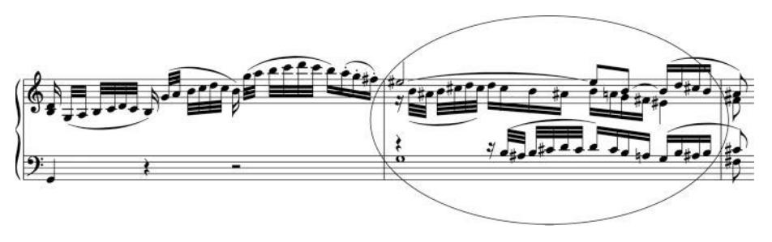

*Ex. 7.1 Mozart, Fantasy in C Minor, K. 475*

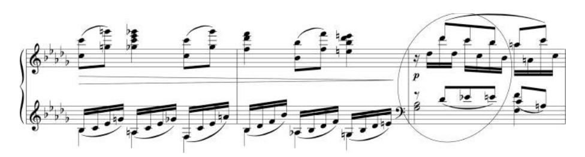

*Ex. 7.2 Tchaikovsky, Concerto no. 1 in B-fl at Minor, op. 23, mvt. 3*

many diminished chords used by Bach in the "Chromatic Fantasy" should be treated as an extraordinary event. Rather, the extensive use of this chord, not an everyday occurrence for Bach, defi nes the emotional climate of the piece in general.

Often we discover that a certain way of writing that is common for one composer is used as a special device by another. This usually happens when a composer "borrows" the musical language of an earlier time. Contrapuntal writing is typical of the musical language of Bach, but not of Mozart or Beethoven. When we encounter it in their music, we may often sense that a special emotion (or perhaps a metaphysical idea) was the reason for using it. (The signifi cance of fugues in late sonatas of Beethoven, for instance, has been eloquently discussed in Thomas Mann's novel *Doctor Faustus*.) In the same way, Alberti bass is an "emotionally neutral" device for eighteenthcentury composers, but when Prokofi ev used it in the beginning of the third movement of his Sonata no. 5 or—in a slightly less typical form—in the opening bars of the fi rst movement of the same piece (Ex. 7.3), it represented a conscious stylization. (This last realization still does not give a ready recipe to a performer; rather, it narrows down the area where the emotional answer may lie. For example, one can choose to interpret these excerpts as idyllic, ironic, or naive.) The following quotation by Stravinsky makes a similar point: "Dotted rhythms are characteristic eighteenth-century rhythms. My uses of them in . . . the introduction to my piano Concerto are conscious stylistic references. I attempted to build a new music on eighteenth-century classicism using the constructive principles of that classicism . . . and even evoking it stylistically by such means as dotted rhythms."3

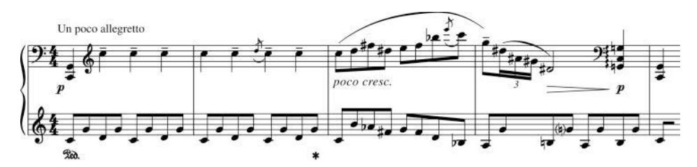

*Ex. 7.3a Prokofi ev, Sonata no. 5, op. 38/135, mvt. 3*

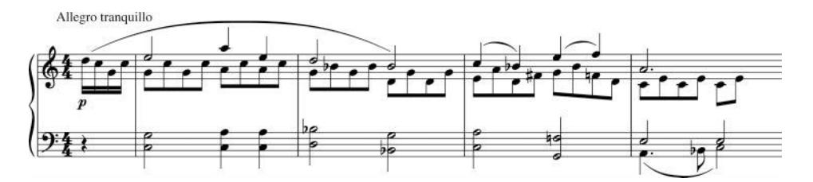

*Ex. 7.3b Prokofi ev, Sonata no. 5, op. 38/135, mvt. 1*

Frequently, the performer's understanding of the structural role of the material infl uences his perception of its emotional content. In the sonata form, for instance, where contrast between themes serves usually as the principal dramatic force of the composition, determining the character of the fi rst subject may condition one's feelings about the character of the second. On the other hand, observing how the composer varies the same material later in the piece helps our comprehension of overall structure. When the second theme of the fi nale of Brahms's Concerto no. 1 (Ex. 7.4a), marked *espressivo* in the exposition, reappears in the recapitulation in a minor key carrying the indication *con passione* (Ex. 7.4b), it testifi es to the dramatic development of the theme's emotional content. The performer who realizes and feels this transformation will be able to create an arch spanning the whole monumental structure of the movement.

A pull between creating expectations and frustrating them lies at the root of many compositions, especially those of the nineteenth century.\* Studying

\* Let me explain what I mean very simply: When a listener of a Classical-style composition encounters a V7 chord, he expects it to be resolved to the tonic. If the

#### 156 Shaping Up a Performance

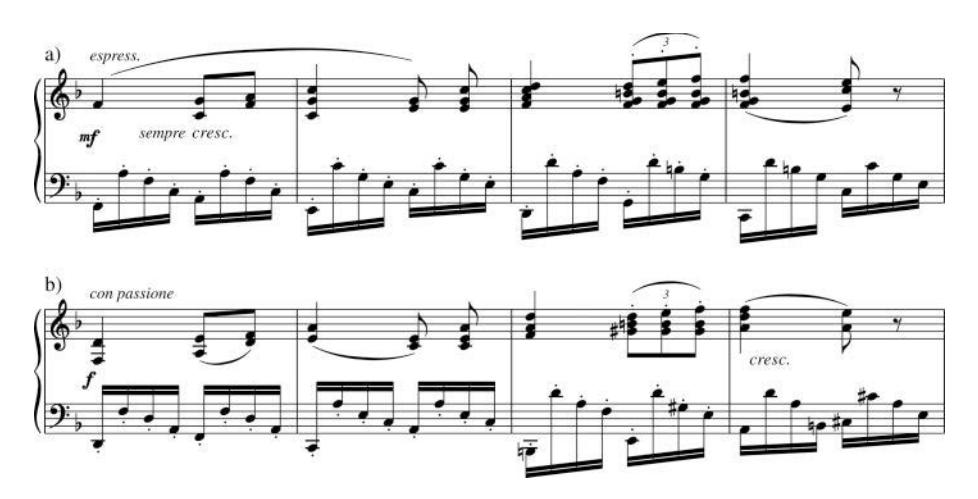

*Ex. 7.4 Brahms, Concerto no. 1 in D Minor, op. 15, mvt. 3*

them, the performer needs to understand what kind of expectation has been created in each case. It is important not just to notice an unexpected turn of melody or an unusual harmony but to realize what we would expect to hear in their place. One may understand the uniqueness of a work by imagining how it might have been written by a more run-of-the-mill composer. At a lesson dedicated to Schubert's Sonatina in D Major for violin and piano (Ex. 7.5), I surprised my students by asking them to change the opening of the second movement to make it sound less interesting and more ordinary. They had to abandon their "taken for granted" approach before they could realize that, by using the 5 + 5 structure instead of the more ordinary 4 + 4 (play the music example omitting the bracketed bars), Schubert was able to elaborate on the questioning intonation of bars 2 and 7, making the remainder of the phrase (bars 4–5 and 9–10) sound like an answer.

chord is followed by VI instead, the listener's expectation is frustrated; this forces him to listen more attentively. If a composer chooses to go through several keys using the same sequence (V7–VI), he creates a new expectation. If, then, at the end of the passage the V7 chord is interpreted, enharmonically, as a German augmented sixth chord and is resolved accordingly, this new expectation is frustrated as well. The listener's attention is aroused once again.

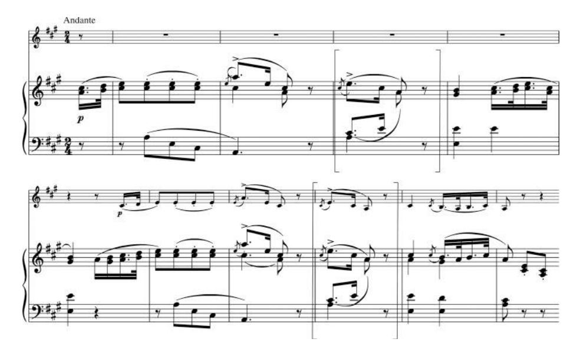

*Ex. 7.5 Schubert, Sonatina in D Major, D. 384, for violin and piano, mvt. 2*

The fi rst subject of the last movement of Haydn's Sonata in C Major (Hob. XVI:48) does not present the usual 4 + 4 bars either, but instead 6 + 6, or, more exactly, (4 + 2) + (4 + 2) (Ex. 7.6). To appreciate the unusual proportions, we can try to re-create what would have been expected (Ex. 7.7). In comparison, Haydn's original version is striking in the freshness of its

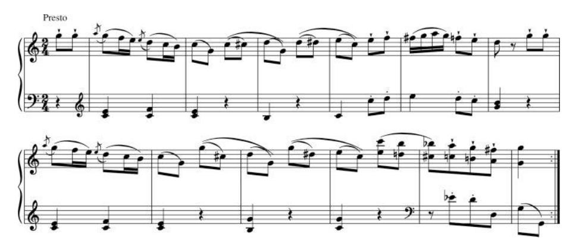

*Ex. 7.6 Haydn, Sonata in C Major, Hob. XVI: 48, mvt. 2*

#### 158 Shaping Up a Performance

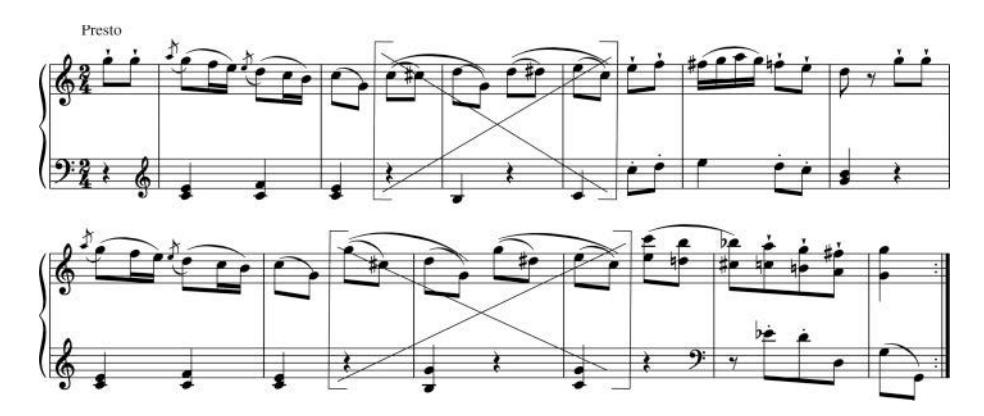

*Ex. 7.7 Haydn, Sonata in C Major, Hob. XVI: 48, mvt. 2*

asymmetrical phrasing, which creates a special, humorous feeling. In the words of Artur Schnabel, "In a work of genius the unexpected is more probable than the common."4

I often fi nd that the humorous, joking aspect of music is missing in many performances, even in those of accomplished artists. It seems that people feel uncomfortable allowing the great work of music to be anything but sublimely serious. Trying to shake off this reverential solemnity, I once asked a student who played Beethoven's Sonata op. 31, no. 3, to imagine being among the fi rst people to receive the score of this newly published work in 1804. She would immediately discover that it opens with what normally was expected to be found at the end: the cadential harmonic progression (Ex. 7.8). What's more, this well-known formula is emphasized by ritenuto, crescendo, and a fermata and is repeated once more before proceeding. I suggested to the student that her reaction might have been one of amazement and disbelief: "What is going on? Is the composer pulling my leg?" Beethoven returns to this cadential formula several times in the course of the movement, but the last time—close to the end—it appears in the least conclusive form: in the high register and without either crescendo or fermata. Once again, the composer frustrates our expectations, underlining the humorous character of the work.

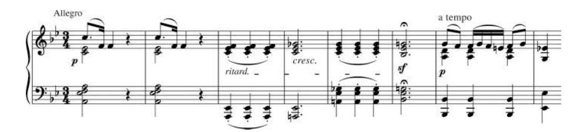

*Ex. 7.8 Beethoven, Sonata in E-fl at Major, op. 31, no. 3, mvt. 1*

The approach in which aspects of the music are taken for granted is often revealed in habitual interpretive assumptions. It is worth remembering that, for instance, crescendo does not automatically mean either agitato or accelerando. In many cases, quite to the contrary, crescendo is an indication of the music becoming broader, more majestic, more dignifi ed. If an alteration of timing is justifi ed, such instances may call for an allargando rather than an accelerando. Similarly, diminuendo should not always be taken as an indication of calming down, connected with rallentando. I can think of many examples of diminuendo that indicate, in fact, an increase of activity, albeit of a fantastic, visionary order, sometimes accompanied by an accelerando (see passages in a variety of works by Scriabin, for example).

Investigative work needs to be carried out on diff erent levels, from the most general to the most specifi c. Sometimes small details of notation help the perceptive performer to build his interpretation. At the beginning of the piano part in the second movement of Brahms's Sonata in D Minor for violin and piano (Ex. 7.9), the composer put bar-long slurs in spite of the fact that the general indication of legato seemingly makes the slurs redundant. But even this is not all: The fi rst two eighth notes are covered with yet another slur. We all know that the basic meaning of the slur is to connect. In this passage, however, the composer would not need additional slurs to achieve this result. Clearly, he had in mind something diff erent. In my view, the bigger slur indicates thinking in whole bars, rather than in eighth notes, while the little slur calls for a slight diminuendo, which would add a certain lilt to the accompanying chords. This last detail changes the

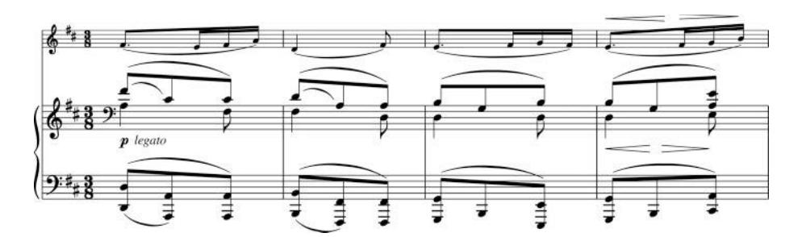

*Ex. 7.9 Brahms, Sonata no. 3 in D Minor, op. 108, for violin and piano, mvt. 2*

perception of rhythm from even eighth notes to a pattern. Thus, an indication of articulation seems to call for realization through a change in dynamics.

No matter how thorough a performer's investigation of a single piece of music, however, he cannot suffi ciently comprehend it without an understanding of the work's place among other compositions by the same composer. He also needs to put it in the context of the historic period and corresponding musical styles. These issues will be examined in the next chapter.

## Chapter 8: Seeing the Big Picture

This chapter is based on observations made by me in the course of my work. Almost every one of them has been a subject of various books and articles. My goal is not to cover any of the topics exhaustively but, rather, to make readers aware of these issues and interested in further investigation on their own.

As we have seen in the previous chapter, close examination of a piece may bring unexpected insights into its character, mood, and overall meaning. Still more can be gained by looking beyond the single work. We all realize that a pianist who has played several Beethoven sonatas is better equipped to approach a new one. Knowledge of other works puts at one's disposal a wealth of comparisons and associations that lie at the root of every creative work.

To gain such insights, the pianist should not limit himself to the piano repertoire. To understand a musical work, one should approach it as a part of the composer's entire output. To interpret a late Beethoven sonata with the right feeling, a performer must mentally place it in the context not only of other Beethoven sonatas but of his late quartets as well. It is especially important to refer to the medium with which a composer has felt the greatest affi nity. Many pages of Schubert's piano music, for example, have strong connections to his lieder; a movement of Mozart's instrumental music comes alive when a performer approaches it as an opera scene. The plasticity of the human body, felt so beautifully by Prokofi ev in his ballet music, feeds many of his instrumental works as well.

#### 162 Shaping Up a Performance

The more familiar one feels with the output of the composer, the less prompting one needs for creative ideas to appear. Working with some of my students on a Mozart sonata or concerto, I fi nd it suffi cient to mention the word "opera" to put them in the right frame of mind. Others will need to dig up memories of specifi c Mozart operas. With some, we will need to conjure specifi c characters, imagining a certain phrase sung by, say, Suzanna or Figaro. Sometimes I even need to ask my students what they think the character is talking about.

Operatic references may work for other composers as well. Trying to help a student breathe life into the second movement of the Sonata in C Major (Hob. XVI: 50) by Haydn (Ex. 8.1), who also was a prolifi c opera composer, I suggested that he see it as an embellished keyboard rendering of an aria. I even came up with an imaginary reconstruction of the fi rst bars of such an aria (Ex. 8.2).

Creative ideas can come from imagining the orchestration for a particular passage. The greater the knowledge that the pianist possesses of the composer's orchestration style, the more specifi c his ideas will be. In the trio from the menuet of Beethoven's Sonata op. 31, no. 3, the gap in range

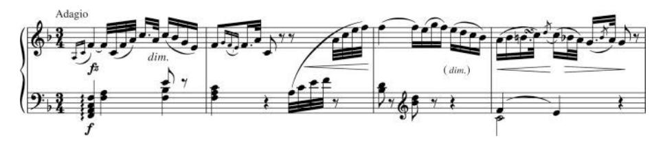

*Ex. 8.1 Haydn, Sonata in C Major, Hob. XVI: 50, mvt. 2*

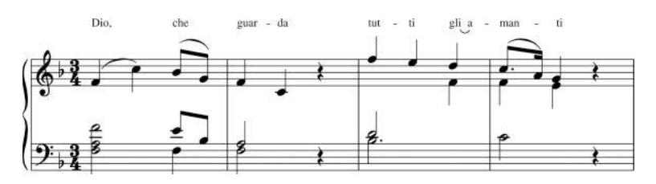

*Ex. 8.2*

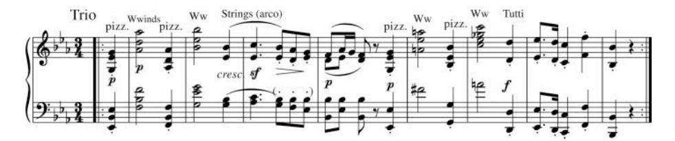

*Ex. 8.3 Beethoven, Sonata in E-fl at Major, op. 31, no. 3, mvt. 3*

between the chords seems to require diff erences in sonority. Why not go a step further and try to imagine the passage in the orchestra? A possible orchestration might involve a string pizzicato chord followed by a woodwind chord tenuto as marked in the example (Ex. 8.3). This extra step gives the pianist a concrete goal in the form of a specifi c sound image.

Bach, an heir to so many traditions, provides us with especially fertile ground for establishing connections and associations. *The Well-Tempered Clavier* in particular abounds with references to his works for orchestra, choir, or chamber groups. I sometimes go over the entire collection with my students, trying to fi gure out the genesis of each of the preludes. The D Major Prelude from Book 2 (Ex. 8.4), for example, is related to the orchestral suites or opening movements of cantatas; this particular key was

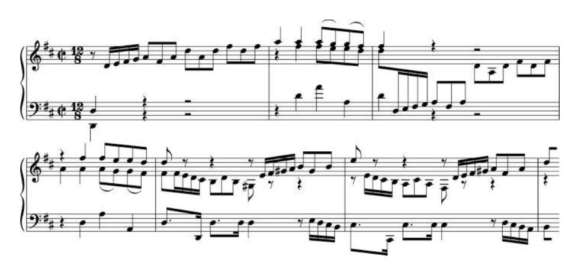

*Ex. 8.4 Bach, Prelude in D Major, BWV 874, from* Well-Tempered Clavier, *book 2*

#### 164 Shaping Up a Performance

commonly used by Baroque composers to take advantage of trumpets (in D) combined with timpani, which bring a festive mood to the music. The sustained four-part writing in the Prelude in C Major (Book II) reveals its origins in organ music. The texture of the Prelude in B-fl at Major from Book I (Ex. 8.5) suggests the lute; recalling the harmonious sound of the instrument, a close relative of the guitar, the pianist should try to achieve a similar sonority on the piano, rather than playing with the prosaic dryness of a typewriter. The Prelude in E Major (Book 2) is composed as a movement of a trio sonata (Ex. 6.16); realizing this, the pianist will do his best to create an illusion of two diff erent sonorities of, say, oboe and violin in the part of the right hand.

An important but often neglected aspect of Bach's music is its harmonic component. Basso continuo, or thorough bass, the dominant feature of the Baroque period, is ever present in his works. Even when no continuo part is written, a continuous harmonic fabric is always felt. Because we know that Bach frequently transcribed the same material for diff erent media, we can imagine with a high degree of probability that the passage from the C Minor Partita (Ex. 8.6) could be set for solo instrument and basso continuo. In such a setting, the harpsichordist would play chords with the right hand (Ex. 8.7). In the original version, of course, there is no room for the chords

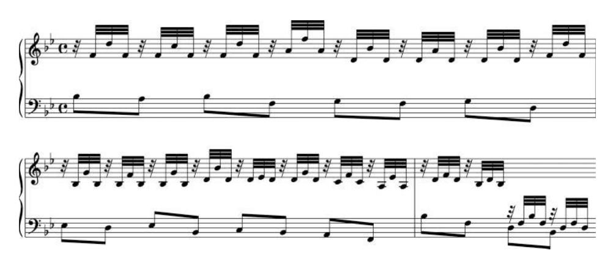

*Ex. 8.5 Bach, Prelude in B-fl at Major, BWV 866, from* Well-Tempered Clavier, *book 1*

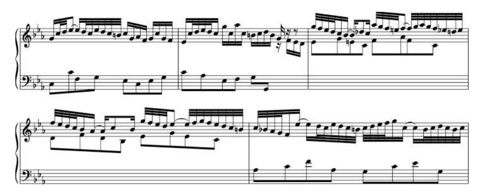

*Ex. 8.6 Bach, Sinfonia from Partita in C Minor, BWV 826*

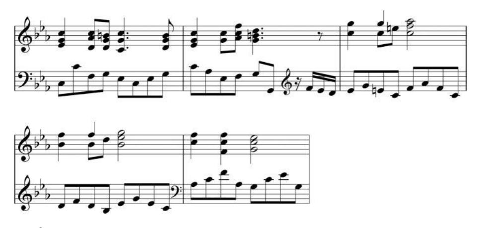

*Ex. 8.7*

to be inserted. Yet the pianist's sound somehow must refl ect this harmonic richness, transcending a bare two-part heterophony.

Or consider Bach's keyboard concerti, all composed originally for a melodic instrument. Only two of the original versions survived: the Violin Concerto in E Major, which Bach later made into the D Major Harpsichord Concerto, and the Concerto for Violin in A Minor, transcribed for the harpsichord as a G minor concerto. In the violin concerti, the harpsichord continuo plays the important function of cementing the texture harmonically. Yet when the keyboard concerto version is performed, the continuo

#### 166 Shaping Up a Performance

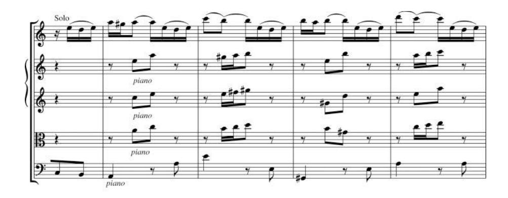

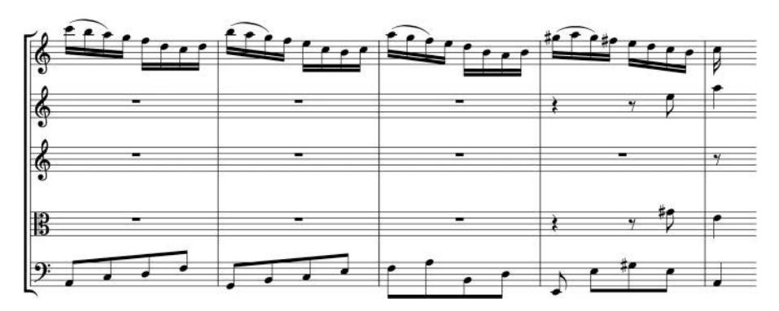

*Ex. 8.8a Bach, Concerto in A Minor for violin and strings, BWV 1041, mvt. 1*

part is usually dropped. (In Bach's time, in fact, a second harpsichord playing continuo was often used.) Compare the initial solos in the fi rst movements of the A minor violin concerto and the G minor harpsichord concerto (Ex. 8.8). In the violin version, the harpsichord continuo contributes harmonies on the downbeats in the beginning of the excerpt and provides a full harmonic texture in the following four bars. In the harpsichord transcription, the right hand of the soloist plays the melody while the left hand plays an ornamented bass line. This arrangement makes playing the chords physically impossible. Here again, the pianist cannot present the

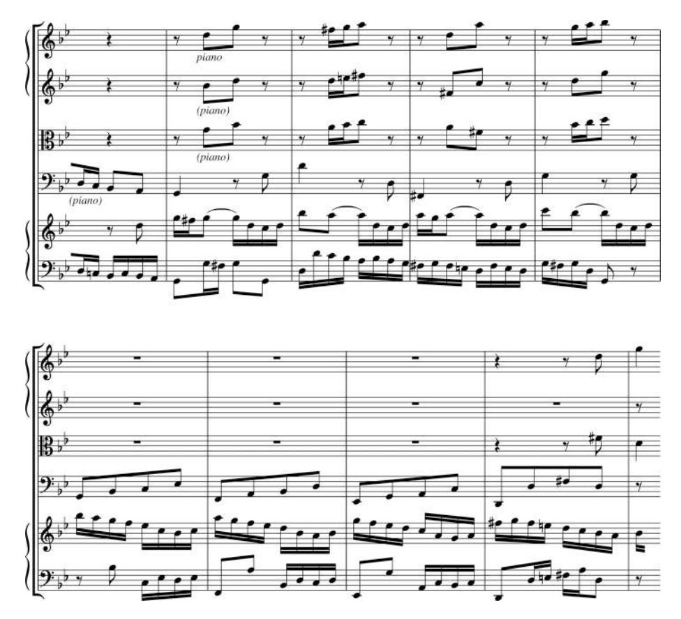

*Ex. 8.8b Bach, Concerto in G Minor for clavier and strings, BWV 1058, mvt. 1*

texture as merely a linear two-part writing; the sound of the piano should have harmonic ambiance.

This is a good place to express my views on historical performance practice. Unlike many of my colleagues, I am very interested in this fi eld and try to follow developments in it. Doubtless my fascination has to do with my considerable involvement in early music during the beginning of my career. Playing harpsichord and being a member of an early music group that performed Medieval, Renaissance, and early Baroque music gave me a

#### 168 Shaping Up a Performance

knowledge and love of the repertoire that is normally outside the pianist's scope. This experience also helped me to acquire sensitivity to the sonorities of early instruments, especially keyboard instruments. Though no longer a performer on them (which I truly regret, but alas, one cannot do everything), I am very interested in and often stimulated by both the sonority of early instruments and the approach of many of the practitioners. I am not always convinced by the indulgent, wailing sound of some string players or the fl ippantly brisk tempi taken by others. Yet the fl exibility of their phrasing, rubato, and ornamentation, as well as the leanness of sonority of their instruments, seem much more suitable to pre-Classical and Classical music than the stiff ness and pomposity of some of the mainstream performances. Besides, we all profi t from the tremendous amount of research into performance practice generated by this trend. Even those who disagree with the interpretive decisions of many performers cannot aff ord turning a deaf ear to this valuable information. Or, to use a phrase that is often heard in my studio, "Ignorance is not a point of view."

I would never blindly accept anything that has been proclaimed as the last word of historical accuracy. As the playwright Tom Stoppard said, "All supposed historical truths are temporary, meaning they're always there to be modifi ed in the light of subsequent discoveries."1 What is important for me is the quest to get to the core of what the music making should be, which also incorporates the investigation of what it might have been.

Even verbal indications must be read in the context of the composer's idiom: seeing the word "sostenuto" in Brahms's works, we always pull the tempo back (see, among many examples, the development of the fi rst movement of Sonata in G Major for violin and piano, where "più sostenuto" indicates a slower tempo for most of the section before being canceled by "poco a poco Tempo I"). The same word encountered on a page of Chopin has a completely diff erent meaning: it tells us to sustain the melodic line. In the same vein, Debussy, using the French version of the term, used to mark, "La melodie bien soutenue."

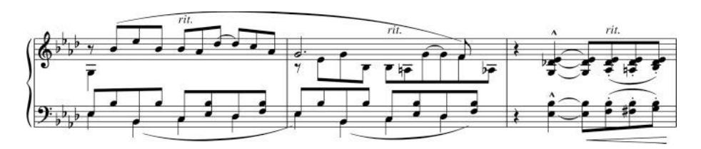

*Ex. 8.9 Schumann, Fantasy in C Major, op. 17, mvt. 1*

It is interesting to observe how diff erently Schumann marks various instances of slowing the tempo. A progressive, gradual one is introduced with *ritard*. or *rit*. and, most signifi cantly, with dashes clearly indicating its extent. A slight, momentary easing of tempo Schumann in most cases marks *rit*., omitting any precise indication as to how long it should last and where exactly one should return to the tempo. The latter type, exemplifi ed by the passage from the Fantasy op. 17 (Ex. 8.9), is very delicate and elusive; it is hard to achieve the required natural fl exibility.

Schubert may have distinguished between *decrescendo* and *diminuendo*, the latter indicating a slowing down going together with the softening of the sonority. The second term appears less frequently than the fi rst, and it is often followed by a general pause. In two instances of diminuendo leading to such a pause in the fi nale of the A Major Sonata, op. posth., Schubert follows it with *a tempo* after the pause (Ex. 8.10).

Diff erent composers have used agogic markings idiosyncratically. The most common sign in Schubert's music, for instance, is the accent. He never employed either the dash to indicate tenuto or the hairpin ( < >) loved by Schumann; instead he used the sign > or *sfz* (sometimes *fp*) for all kinds of stresses. Moreover, one notices that an accent in one Schubert edition has been replaced by a diminuendo sign in another. The reason for this inconsistency becomes clear after looking at Schubert's manuscripts. In many cases, the nervous zigzag in his handwriting can be interpreted as either an accent or a diminuendo. (Some editions try to solve the problem by copying the sign exactly as it appears in the manuscript, sometimes resulting in a strangely elongated accent or an abrupt diminuendo sign.) We

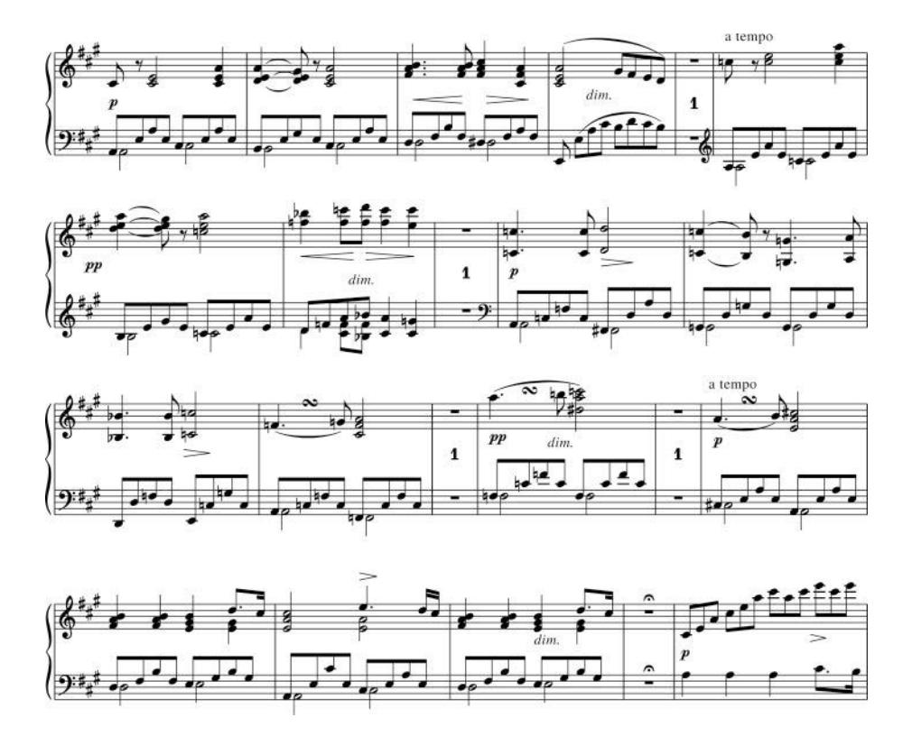

*Ex. 8.10 Schubert, Sonata in A Major, D. 959, mvt. 4*

must consequently take care to fi gure out what the marking stands for in each case. In the example from the fi rst movement of the A Major Sonata (Ex. 8.11), it is better to interpret the accent on the fi rst of three repeated chords as a diminuendo (as some editions, in fact, suggest) that continues through the end of the third chord. As for the accents at the very begin-

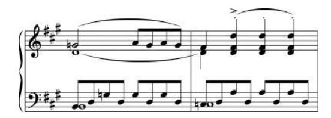

*Ex. 8.11 Schubert, Sonata in A Major, D. 959, mvt. 1*

ning of the same movement (bars 8, 10, and so on), I interpret them as tenuto dashes (Ex. 8.12). The accents in the phrase from the "Trout" Quintet (Ex. 8.13a) could be rewritten as shown in Ex. 8.13b.

No clue is too insignifi cant for a musical Sherlock Holmes. Studying the titles of the movements of Bach's Partitas we notice that the same dance is spelled diff erently in diff erent Partitas: Allemande (the French spelling) is called Allemanda (Italian) in Partita no. 6; Courante (French spelling) sometimes appears as Corrente (Italian), Aria (Italian) as Air (French). Far

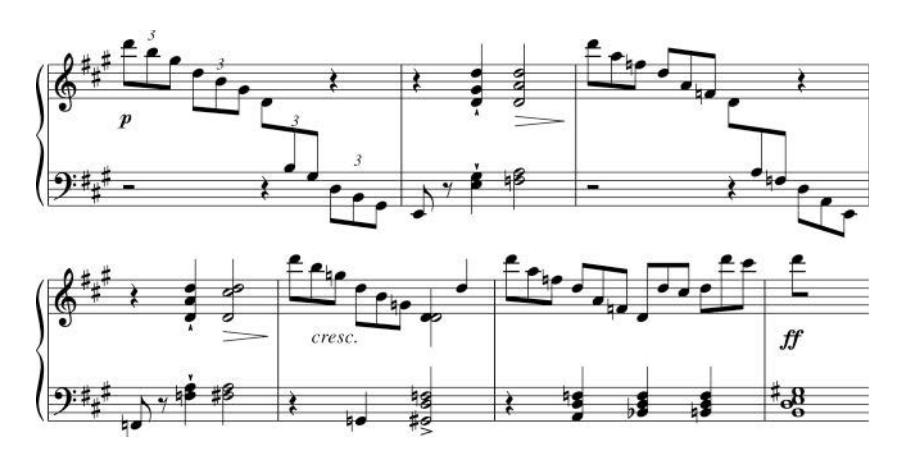

*Ex. 8.12 Schubert, Sonata in A Major, D. 959, mvt. 1*

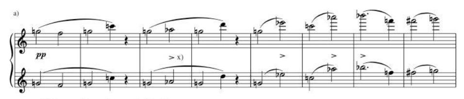

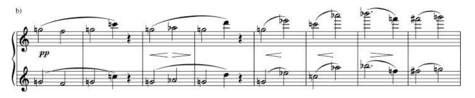

*Ex. 8.13 Schubert, Piano Quintet in A Major, D. 667 ("Trout"), mvt. 1*

#### 172 Shaping Up a Performance

from being a linguistic inconsistency on the part of the great composer, diff erent spellings indicate that Bach followed diff erent models in each case. A rhythmically supple French Courante, as in the Partita in C Minor (Ex. 8.14), is very diff erent from the driven, rhythmically uniform Italian Corrente that appears in the Partita in G Major (Ex. 8.15). The dances are actually quite diff erent from each other and should be played in diff erent styles, including diff erent tempi.

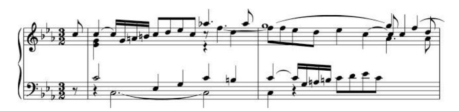

*Ex. 8.14 Bach, Courante from Partita in C Minor, BWV 826*

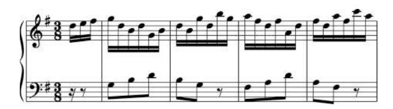

*Ex. 8.15 Bach, Corrente from Partita in G Major, BWV 829*

Even beyond the movements from suites or partitas, strong connection to dance is an important feature of Bach's music. Many works of his "pure music" (inventions, sinfonias, preludes and fugues) will gain vitality if their dance roots are revealed. I do not mean only such obvious examples as the gigue subject of the Fugue in F Major or passepied of the Fugue in B Minor (Book 2); the subjects of the fugues in C Minor and B-fl at Major in Book 1, among many others, will benefi t from the dance bounce, so diff erent from the customary severity of their execution.

The dance connection is generally much stronger in various musical styles than is usually acknowledged by the performers. Let us not forget that the full title of Schumann's great work "Davidsbündler" is "Davidsbündlertaentze" (dances). Look at the titles or performance indications in works of Debussy, Ravel, or Scriabin and you will fi nd plenty of references to a dance. The lilt of the Viennese waltz not only permeates music by Brahms and his contemporaries but can be clearly heard in the music of Schoenberg, such as the beginning of his Piano Concerto (Ex. 8.16), or even Webern in the fi rst movement of Variations op. 27 (Ex. 8.17). A diff erent kind of waltz is very important in the music of Prokofi ev: not only is it a frequent feature of his stage works (the ballet *Cinderella* contains no fewer

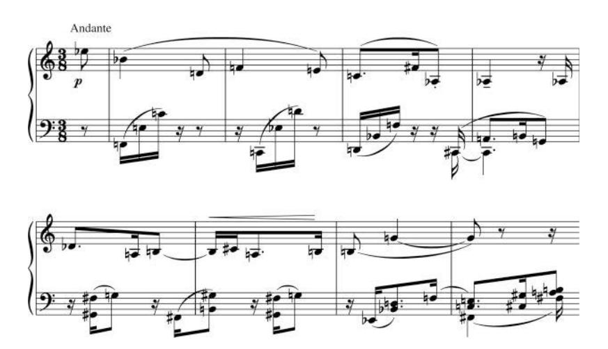

*Ex. 8.16 Schoenberg, Concerto, op. 42*

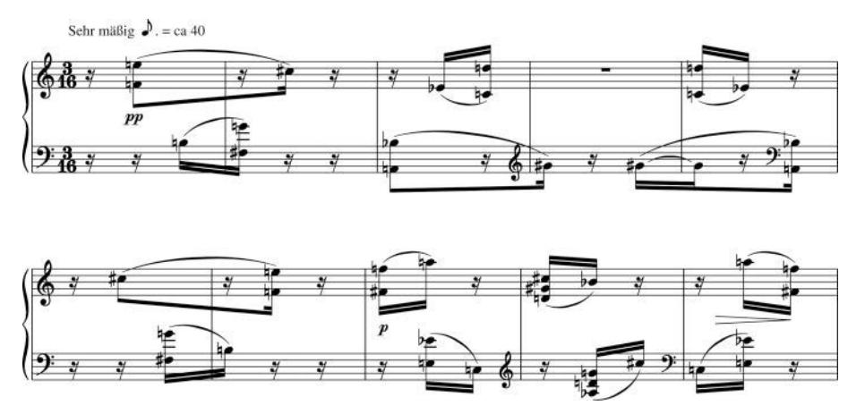

*Ex. 8.17 Webern, Variations, op. 27, mvt. 1*

#### 174 Shaping Up a Performance

than four waltzes), but it appears in many of his instrumental compositions as well (see, for instance, the second movement of the Sixth Sonata, which, written in 9/8, is a slow waltz). Without the dance lilt one cannot satisfactorily perform Chopin's ballades or many of his other works.

Rhythms of folk dances are pervasive in the music of Grieg, Smetana, Dvorák, Bartók, Kodaly, Albeniz, Granados, de Falla, and many others. As for Scarlatti, the gutsy Spanish fl avor of his music is expressed in dance rhythms, spicy dissonances, and imitations of guitar strumming or fanfares of a town fi esta. All this regrettably is missing from too many piano performances of his sonatas, and replaced by the misapplied "gallant style."

I often remind my students that dances of all peoples and all times share one common trait: there are moments in each of them when the body, or parts of it, goes down and others when it goes up. This is an axiom for as long as dancing happens on the Earth—because of the force of gravity. (Undoubtedly, it is diff erent in outer space, but I will have to leave the verifi cation of this to future generations.) This corporeal movement corresponds in music to some bars, or parts of them, that are light, and others that are heavy. We must distinguish between them and play accordingly, because it is impossible to convey the feeling of dance without this interplay of heavy and light. In my experience, it is the lighter side of the dance that is often neglected by students.

Although the pianist spends much time and eff ort learning how to make the piano sing, remember that not everything in music must sing. Some music should instead dance, speak, or declaim. At a piano competition, I once heard the passage from Haydn's Variations in F Minor (Ex. 8.18) played with a beautiful singing tone that sounded decidedly out of place. I was missing the declamatory rhetoric of the repeated octave leaps. The importance of fi nding the right "tone of voice" appropriate for a given style will be further discussed in the following chapter.

Often it helps to know at which point in the composer's life a particular work was written. Take Prokofi ev's Concerto no. 1, for example, a brilliant and high-spirited work of no great profundity. Keep in mind that it was

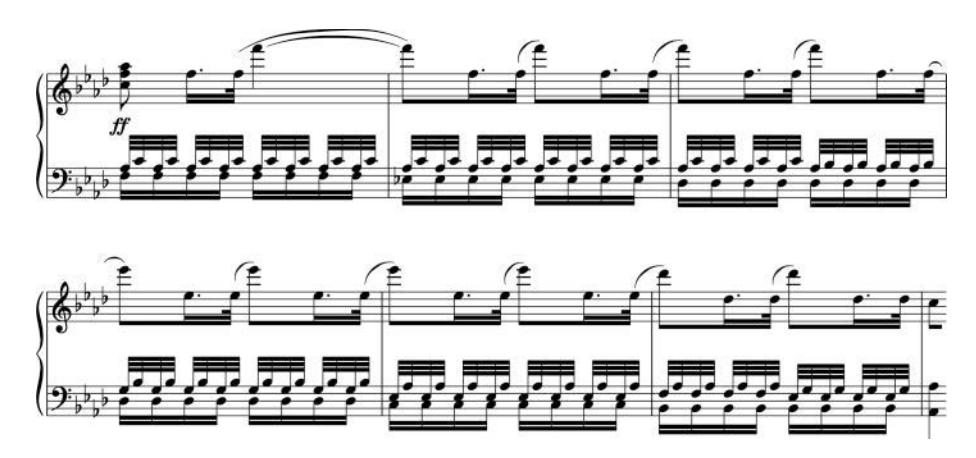

*Ex. 8.18 Haydn, Variations in F Minor, Hob. XVII:6*

written by a twenty-year-old who enjoyed the role of *enfant terrible* and loved shocking his conservative older colleagues. Or consider the diff erence in emotional tone between the two Brahms concerti. They are defi nitely conditioned by the composer's age at the time he wrote them: the youthful ardor of the First Concerto is replaced by Olympian maturity in the Second.

Furthermore, one needs to know about the composer's musical infl uences. The best suggestion for a student studying the E Minor Prelude and Fugue by Shostakovich (Ex. 8.19) is to listen to the folk scenes of Mussorgsky's *Boris Godunov*, especially its "Yurodivy" music (Ex. 8.20).\* Regarding Shostakovich, I remember disagreeing with a colleague who was inclined to interpret the passage from the Piano Concerto no. 1 (Ex. 8.21) with an almost Viennese grace and fl exibility. It was clear to me that this passage was the product of the many hours the young Shostakovich spent earning his living as a pianist for silent movies. This mechanical, mind-numbing occupation and the "trashy," "anything-goes" quality of its material colors the music. (Listen to the unyielding way the composer himself plays it at breakneck speed, sacrifi cing a great number of notes in the process.)

\* Yurodivy is a character in the opera. The word can be roughly translated as "holy fool."

#### 176 Shaping Up a Performance

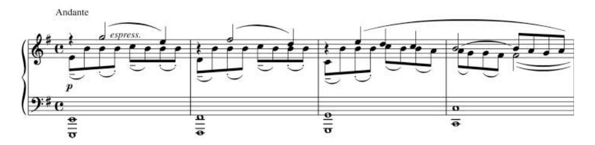

*Ex. 8.19 Shostakovich, Prelude in E Minor, op. 87, no. 4*

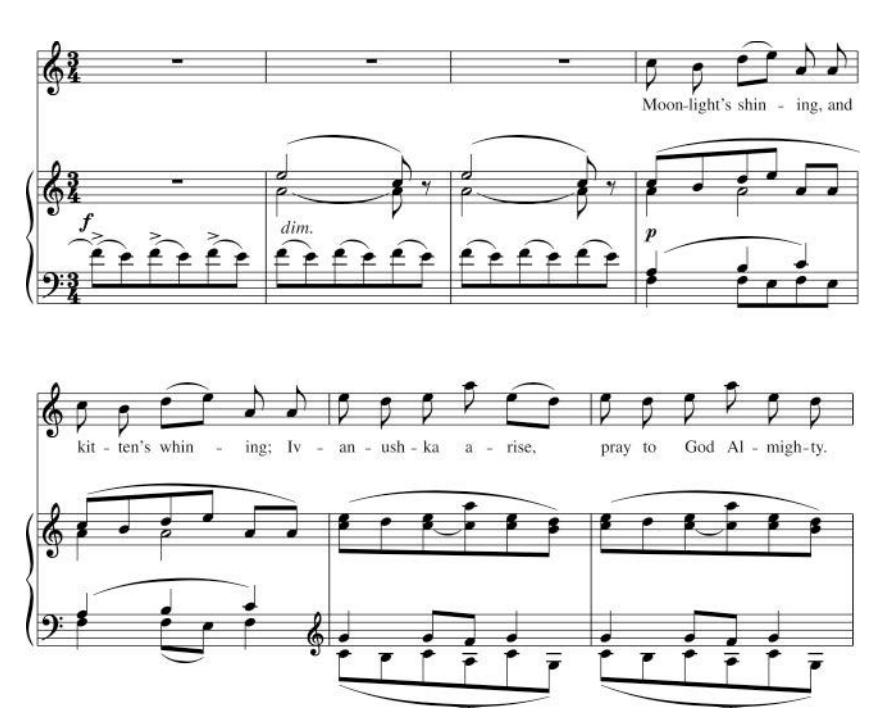

*Ex. 8.20 Mussorgsky, from* Boris Godunov

By immersing himself in the artistic and emotional world of the composer, a performer can place a work within a much larger cultural context. I always insist that a student who studies Schumann's *Kreisleriana* must also read E. T. A. Hoff mann's books. A pianist who plays Debussy's prelude "Minstrels" will understand its dry irony better if he is acquainted with paintings by Toulouse-Lautrec. I am sure that when Debussy turned to Baudelaire's line "Les sons et les parfums tournent dans l'air du soir"

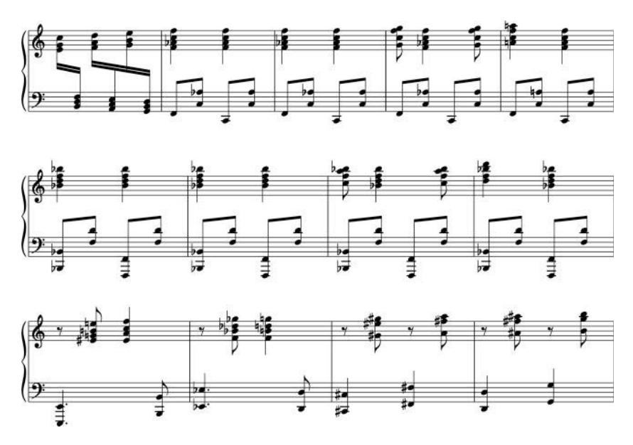

*Ex. 8.21 Shostakovich, Concerto no. 1, op. 35, mvt. 4*

for the title of one of his preludes, he responded not just to a beautiful quotation but to the general atmosphere of Baudelaire's poetry. Reading the poems of Baudelaire, as well as other poets who were important to Debussy (such as Verlaine and Mallarmé), would be of more help in creating an inspired performance of the piece than would many hours spent in a practice room.

Sometimes we fi nd the composer making references to aural aspects of his everyday life, such as Beethoven's Sonata op. 81a, "Sonate caractéristique: Les adieux, l'absence et le retour."2 The programmatic aspect of the piece is evident; it determines one's approach to the character of the work. The fi rst two bars even have the word "Lebewohl" (farewell) spelled out in the score, accompanying the fi rst three intervals. I point out to my students that these sonorities represent the so-called golden step typical of music written for natural horns. The diffi culty comes when I ask why the composer thought here about horns and not, say, violins. To answer this question, one has to remember that at that time people often traveled by stagecoach (which also

#### 178 Shaping Up a Performance

carried the post). Coach drivers would announce their arrival or departure by blowing a horn; the sound of this horn became associated with traveling or with parting. For an example see the *Aria di Postiglione* in Bach's "Capriccio on the Departure of the Beloved Brother" (Ex. 8.22), which includes the imitation of the post horn. This lengthy verbal detour pays off handsomely when one realizes that the coda of the fi rst movement of the Beethoven sonata contains exquisite tone painting, with the coach receding farther and farther away, its calls mingling and echoing in the distance (Ex. 8.23).

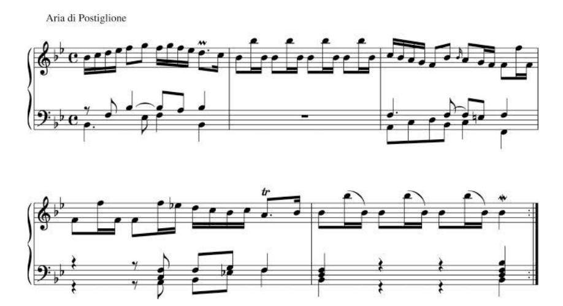

*Ex. 8.22 Bach*, Aria di Postiglione *from "Capriccio sopra la lontananza del suo fratello dilettissimo," BWV 992*

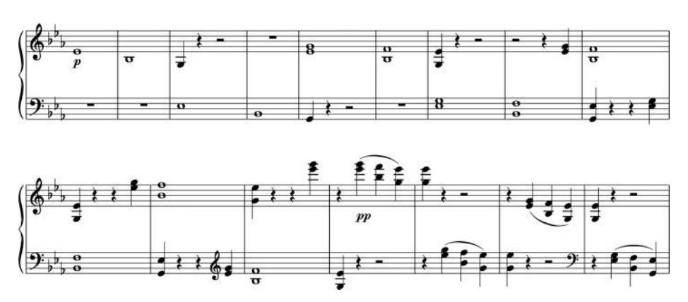

*Ex. 8.23 Beethoven, Sonata in E-fl at Major, op. 81a ("Les Adieux"), mvt. 1*

Or take an altogether diff erent subject: the role of bells in Russian music. No Russian historical opera is complete without bells to accompany and underline the jubilation of victory, the sorrow of mourning, or the tragedy of defeat. This tradition is rooted in the Russian past, when bells were used to bring people together on various momentous occasions. Bells fi nd their way into Russian instrumental music as well. Recognizing them helps to identify the character of certain passages. The tintinnabulation in the Great Gate of Kiev from Mussorgsky's *Pictures at an Exhibition*, for instance, underscores the joyous, jubilant mood of the passage (Ex. 8.24). Bells are plentiful in Prokofi ev's "War" sonatas; their resonant sonorities help to establish the calamitous atmosphere of the music (Ex. 8.25).

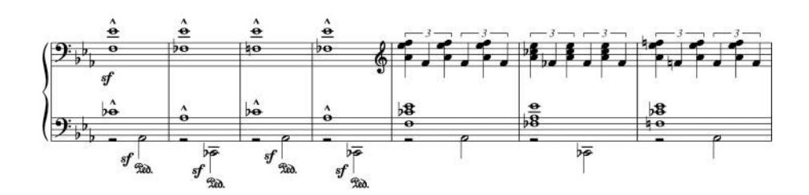

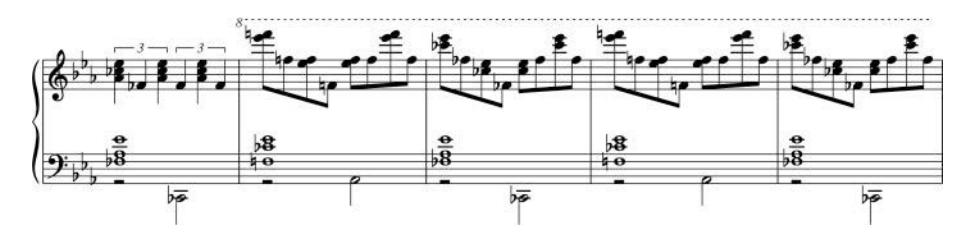

*Ex. 8.24 Mussorgsky, The Great Gate of Kiev from* Pictures at an Exhibition

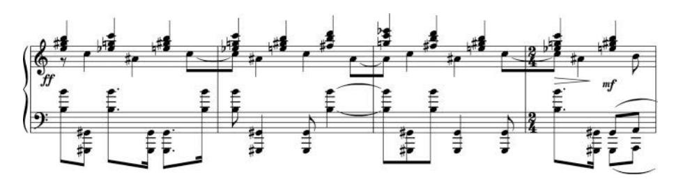

*Ex. 8.25 Prokofi ev, Sonata no. 7, op. 83, mvt. 2*

#### 180 Shaping Up a Performance

Bells and post horns are no longer part of our everyday life. These composers relied on their listeners to make the connections that we cannot readily make today, unless we become aware of them by studying the period in question. To make the point clear, let me give yet another example. We all know E. T. A. Hoff mann's famous description of the opening motive of Beethoven's Fifth Symphony as "Fate knocking on the door." The association adds to our perception of the music's insistent, demanding character. Nowadays when calling on someone we are as likely to ring the doorbell as to knock on the door. Suppose that in the next thirty years we become unaccustomed to knocking on doors at all. The association made by Hoff mann conceivably could lose its meaning for us. We should still be able to relate to the eloquent Romantic description by Hoff mann ("Beethoven's music opens the fl oodgates of fear, of terror, of horror, of pain"3 ). But the concrete image of knocking will speak only to those who are informed of the quaint habits of life in olden times.

The issues discussed in this chapter represent diff erent stages of a most fascinating journey that starts with seeing a piece within the composer's overall oeuvre. This awareness, in turn, is enriched by further understanding of the piece as an integral part of a particular cultural tradition, which is part of the rich fabric of life itself.

## Chapter 9: Technique of the Soul

The sense of emotional freedom experienced on stage is one of the greatest rewards of the performing artist. During this time a performer can allow himself to engage in emotional free-association—emotional dreaming, if you will—within the context of the work he is performing.\* When this happens, the artist has a wonderful sensation of complete emotional identifi cation with the piece. But can a performer do more than just wait for this feeling to come?

I have previously discussed ways of trying to discover the composer's intentions as well as the technical means to execute them. Unfortunately, the intellectual, analytical approach will not lead to an artistically credible performance if the performer fails to internalize the results of his search for truth, to make them emotionally his own. Can one learn how to identify emotionally with the inner world of the composition? Let me pose yet another question: if, despite the right intentions, the performer is not in an inspired mood on the day of the concert, can he train himself to feel inspired on demand?

These are vexing questions for many; a performer who can answer them affi rmatively has the emotional discipline necessary to be a professional. Herein lies the diff erence between an amateur and a professional.

\* A friend who is also a great musician must have had this in mind when he told me, "I do not need psychoanalysis—I go through it every day on stage."

#### 182 Shaping Up a Performance

A talented amateur musician can, at his inspired best, rival a professional performer in his involvement in and dedication to the music. On a bad day, however, the amateur's playing may be at a level to which no professional would allow himself to descend. The amateur's music making is geared fi rst of all toward pleasing himself; his mission is accomplished if *he* feels moved. The professional's mission is to move his *audience*.

The dexterity of the professional artist's trained fi ngers ensures that the technical aspect of his playing will be acceptable even when he is not in top form. Similarly, a high "guaranteed minimum" of the performer's emotional involvement must be ensured by his emotional technique, or what I call "the technique of the soul." Developing such a technique is a high priority for actors. (I often recommend that my students read the books of Konstantin Stanislavsky, the great Russian actor and stage director famous for creating the "method" acting technique. His writings, which contain numerous insights, will be quoted repeatedly in this and the following chapter.) Among musicians, only singers (particularly opera singers) regularly deal with this important issue, but other performers almost never discuss it. Even those teachers who recognize the importance of psychological preparation for a performance tend to limit it to pep talks and "handholding." In this chapter I will try to examine the emotional skills needed by a performing artist and the ways to acquire them.

Any teacher who guides musically gifted children through their adolescence knows that many of them lose their spark as they mature; talented children—musicians, poets, and artists—far outnumber talented adults. I will not go into a psychological investigation of this phenomenon, which is beyond the scope of both this book and my qualifi cations. Suffi ce it to say that changes begin when children start applying their emotional forces, previously channeled entirely to their artistic endeavors, to real life.

Most people's natural artistic gifts diminish or are lost forever during adolescence. Artistically talented teenagers may discover that their pursuit of the arts has been a mere substitute for real emotional life. They may fi nd that directing their passions toward living human objects, rather than idealized ones, is much more fulfi lling and rewarding emotionally. Only very few, endowed with a stronger and deeper talent—those for whom the imaginary world continues to be the object of great fascination—will struggle to regain their motivation and to fi nd the balance between artistic life and real life.\* They make their readjustment gradually; a thoughtful teacher can help a student a lot during this trying period. Some gifted adolescents are so involved in their art that their emotional maturation is postponed (often through the eff orts of overprotective or overly ambitious parents). But sooner or later the change will have to come. When it does, the young artist will need to restructure his creative process, which previously has been developing spontaneously and intuitively. For him, art will become a refl ection of life instead of a substitute for it.

We all use our own life experiences and emotions to help us in our creative work.1 Sometimes they take the form of reminiscences of and refl ections upon actual events. In other instances, these events are distilled into "emotional colors," and the artist is able "to paint" with them without referring to actual incidents. Clearly, young people have a limited amount of their own life experiences to draw upon. Often we hear performances of great works by young musicians who demonstrate that they may be technically quite accomplished but lacking in much-needed depth. Sometimes the young artist will have to wait to gain the maturity and understanding that come with time. However, it would be ridiculous for young people to postpone performing great masterpieces until they accumulate enough wisdom in life to support their interpretations. Young artists can and must enrich their insuffi cient real-life experiences by reading good books and poetry, seeing good theater and cinema, and observing works of visual art. By doing so a young performer will expand his range of responses that will serve as a reservoir of emotions for his music making.

\* This balance is found only to a degree. Many artists forever remain childish, even infantile, throughout their lives. In fact, every artist must retain from childhood such qualities as spontaneity, imagination, and the ability to discover new things; without them one cannot function in the arts. The following joke has a grain of truth in it. Child: "Mommy, when I grow up I want to be a musician." Mother: "No, honey, you cannot have it both ways."

#### 184 Shaping Up a Performance

It is said that an actor lives a much richer life than the rest of humanity because, in addition to his own life, he experiences the lives of his many characters. Often a role calls for character traits that the actor does not possess. A good actor knows how to transcend the limitations of his personality to respond to such a challenge. Similarly, a piece of music often requires emotions that do not come naturally to a performer. Once I told a student who gave a technically perfect but far too orderly performance of the last movement of Prokofi ev's Seventh Sonata: "This piece has a certain aggressive quality which is missing in your playing. I know that you are not an aggressive person, but you cannot tailor the music to your character." This is similar to Stanislavsky's comment about the necessity "to create on stage the inner life of the character . . . adopting our own feeling to this foreign life."2

We all know that there are performers (both in music and in theater) with a broad emotional profi le, as well as those with a much smaller character range. Both types are known to function successfully in the arts. However, I strongly believe that even a performer endowed with a narrow emotional spectrum should constantly try to challenge himself by pushing the limits (real or perceived) of his emotional abilities. This is especially important for a young person who does not yet know the true nature of his artistic personality. Being typecast is a dangerous thing for the development of a performing artist; it is particularly damaging when the typecasting is done by the artist himself.

I mentioned earlier that the performer's emotional involvement and identifi cation with a piece are necessary conditions for creating an artistically credible performance. Sometimes everything seems to fall into place with no eff ort needed on the part of the artist. When it does not happen, the performer needs to fi nd a path that will lead him to the emotional connection with the piece. One starts with defi ning the character of the whole piece, its sections, and even short passages. The question that I ask my students most frequently is, "What is the character?" It is often diffi cult to defi ne the mood; words seem to be too crude. Still, it is a very helpful thing to do, especially if one is unsure about the answer. Pressed to give one, the performer starts looking for hints in the music, bringing into play various considerations discussed in previous chapters.

Not every mood is constructive for a performer in his work. A listener may describe a piece of music as pale, passive, one where "nothing is happening." However, if a performer plays passively, not allowing "anything to happen," the audience will be bored. The quote from Paul Valéry comes to mind: "He who wishes to write down his dream must himself be very wide awake."3

Sometimes two subjects within a musical composition appear to have more or less the same character. In the interest of variety or to highlight the dramatic structure of the work the performer often makes them emotionally farther apart from each other. Such a need may arise when a performer wants to make one piece in a cycle of short compositions sound diff erent from the previous one; it may also occur in a sonata movement, in which the contrast between themes is the engine that drives the composition. Very often one needs to defi ne the character of a passage in relation to another: this passage, by comparison, is "more what" or "less what"? Suppose that two principal themes of a sonata allegro are both of a lyrical character, but one has a calmer, more singing nature than the other. In such a case the performer may choose to emphasize this calmness while stressing different qualities in the mood of the other theme; they can be, for example, either yearning and breathlessness or lightness, playfulness, and grace.

To create musical continuity, it is necessary to establish emotional continuity: the "unbroken line" referred to by Stanislavsky in his book *Building the Character*. Telling a story, a narrator does not merely list facts or events. He puts them into a cause-and-consequence relationship with the help of connecting words, such as "and," "but," "in spite of," "because of," "therefore," and others. These words do not provide us with new facts, but instead they create emotional connection between them as well as emotional continuity in the narrative. Similarly, when working on a musical composition, one must do more than defi ne the character of a certain passage; one has to determine whether a new mood develops from the previous one or negates it; or perhaps the mood functions as a diversion, an emotional aside within the general narrative of the composition.

In compositions with complex emotional content like the late Beethoven sonatas, the transitional passages are often the most important. They usually appear to contain a transformation of the character or a search for resolution of a confl ict. They are among the most interesting moments of these works; they are also the most diffi cult to interpret. Listening to a student play Beethoven's Sonata op. 101 during a lesson, I noticed that the music was well characterized and deeply felt. Least convincing were transitions, such as the one between the third and fourth movements. I told the student that, in actor's terminology, he was "playing the result." In other words, he seemed to be interested in the fi nal emotional state but not in the search for it, perhaps the most fascinating aspect of the piece. We then discussed the changing emotions of the passage and where and how the changes occurred.

Having developed an idea of the emotions that are in play and how they are connected to each other, the performer then needs to identify with these emotions. He must strive to appropriate them fully, to see the divide between the required emotion and his own feelings to disappear completely. Some people help themselves by creating a whole story to justify for themselves the emotional world of the work. There is nothing wrong with this approach, except that not every piece lends itself readily to a story. Besides, such programs tend to wear themselves out. This is especially noticeable when the artist comes back to a composition that he has studied and performed earlier and discovers that the program, which had been so exciting in the past, fails to move him now. The performer who feels this way has no alternative other than to try to look at the piece with fresh eyes, to approach it more or less as a new work.

For many musicians and a great majority of works of music, the programmatic approach appears to be too crude. It becomes necessary for a performer to fi nd a way to let the music talk directly to his heart. But how does one do it? And how does one cope with the lack of inspiration when the day and time of the performance arrives and the performer simply does not feel like playing? Finally, when playing a certain work repeatedly, how does one prevent the piece from becoming stale, from losing its initial freshness?

To meet these challenges, a performing artist needs to develop a technique for putting himself in the necessary mood, something I called earlier "the technique of the soul."\* Finger technique can be described as the ability to have the fi ngers in the right place at the right time. Similarly, the technique of soul means that the performer needs to be in the right emotional state at the right time, the essential aspect of the performing art to which pianists (and other instrumentalists) are surprisingly indiff erent. Not only must musicians, like actors, be inspired when they are called upon to perform, they also have to be in the required mood at a certain moment and prepared to change it when the emotional context of the work changes.

Following is a conversation I had with a student:

"Are you in a sad mood now?"

"No, not at all."

"If I ask you to play a funeral march, will you become sad?"

"Yes, I guess so."

"Genuinely sad?"

"No, probably not genuinely."

"Of course not, because you have no reason to be sad. Will you be faking, then?"

"No, I would not call it faking."

The truth is that a performing artist frequently enters an emotional state "as if," to use the Stanislavsky defi nition. He is not genuinely sad but "as if" sad, simulating the genuine feeling of sadness. The closer this simulation comes to the real thing, and the more credible this emotional state feels to the performer himself, the easier it will be for him to engage his listeners, to take them with him. To be able to enter this "as if" state, the performer needs to develop emotional fl exibility and openness to the feelings the

\* Stanislavsky used the term "psychotechnique."

 music suggests to him; he must be tuned in to the emotional frequency of the piece and be able to "plunge" into the required emotional state. In an interview, the actor Paul Newman talked about "loosening up the machine, so that when you call on something, it's there for you."4 Actors may have it easier, because they are guided by the words of their lines. In music, clues are much less defi ned, making the need for soul technique even greater for musicians.

Training of the soul involves exercising it regularly, much as we train muscles by physically exercising them. This is another important reason for allowing emotions in daily practicing. Apart from general emotional involvement, there are often specifi c challenges the performer needs to meet. To give but one concrete example of the kind of work required, I off er here an outline of the lesson I gave once to a student on Debussy's étude "Pour les arpèges composés." This talented pianist had diffi culty capturing the kaleidoscopic changes of character in the piece. I tried to help by guiding him through the following chain of exercises.

- (1) Defi ne the moods encountered within these two bars (Ex. 9.1). The student off ered the characterizations "playful," "pleading," "mocking," and "ironic."
- (2) Think about an event in your life when you felt playful. Try to recapture it as fully as possible, including the feeling inside your body, your gut feeling.\*
- (3) Recall this "gut feeling," and sink into it without thinking about the event itself using what Stanislavsky called "emotional memory."
- (4) Repeat steps 2 and 3 with the "pleading," "mocking," and "ironic" emotions.
- (5) Sink once again into the "playful" emotion, taking as much time as you need, then switch to the "pleading" mood, observing changing sen-

\* Stanislavsky: "Let the visual images, which are more readily available, help us to resurrect and to fi rm up the less stable feelings of the soul." *Rabota Aktiora nad Soboi*, p. 136.

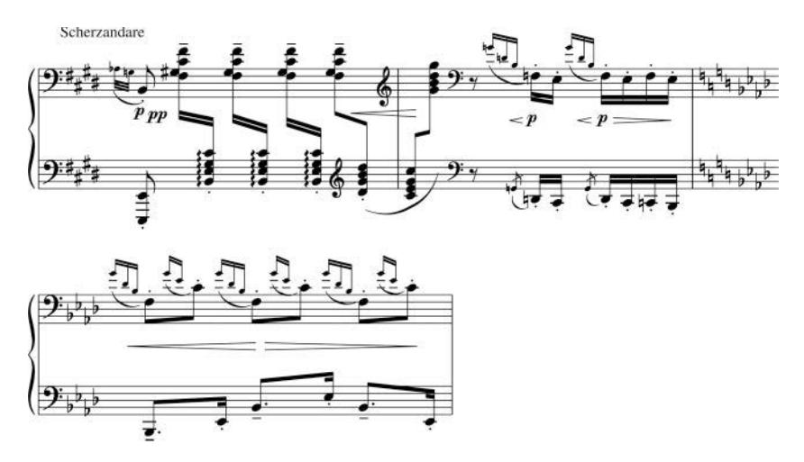

*Ex. 9.1 Debussy, Etude "Pour les arpèges composés"*

sations in your body. Then proceed to the "mocking" and, later, "ironic" feelings.

- (6) Repeat step 5, but this time make the changes on my cue. Once you hear the signal, try to accomplish the transformation as quickly as possible.
- (7) Play the passage in question very slowly, continuously observing your inner state. Take care to switch to a new emotion when, as you have determined, the mood of the music changes.
- (8) Repeat the passage several times, increasing the tempo gradually and making sure that the speed of change in your inner emotional state does not lag behind the music.

This exercise, modifi ed to suit the needs of a particular piece or a particular student, is very helpful for drawing the player's attention to his inner state and developing its fl exibility.

Another important issue for the performer to consider is fi nding the appropriate emotional tone for the piece. A student once played the fi nale of Chopin's Sonata in B Minor with genuine involvement and commitment, but the performance nevertheless left me unsatisfi ed. I felt that the drama and abandon of the music was delivered in a headstrong and rather common way, without the rhetorical dignity of a Romantic hero. The student's feeling was genuine and sincere, but her emotional delivery was not appropriate for this composition.

Human feelings seem to change very little over the centuries, but the way we express them evolves considerably. Earlier we examined how composers of diff erent times and styles turned to diff erent musical devices to express the same basic emotions. The performer must fi nd the appropriate emotional mode to match the style and period of the composition. This is what we call performance style. The composer works within his own style, but the performer must be a chameleon, adopting his delivery of the musical material to the style of the music he plays.

Too often we speak about style as the assemblage of assorted dos and don'ts concerned with articulation, dynamics, and pedaling. To continue my earlier examination of various aspects of piano playing—such as sound, technique, or fi ngering—and their role in defi ning the style of the piece, I propose now to look at the issues of style from the point of view of soul technique. It is not enough to determine *what* you feel; you need to decide *how* to deliver this feeling in the way appropriate for the style of the work you play. Nor is it merely a matter of the technical delivery: a performer "turns into a diff erent person" when he moves from one style to another. If the actor playing a character in a Schiller drama started to talk in the abrupt style of a modern thriller, or if a character in the latter expressed himself with lofty Romantic eloquence, such a presentation would sound false and out of place, the similarity of the situation and the basic emotion notwithstanding. In the same way, the declamatory style appropriate for Liszt would feel false if applied to even the most dramatic of Mozart's compositions, for example the C Minor Concerto. The rhetorical eloquence of Brahms's First Concerto cannot be transplanted to the First Concerto of Bartók.

To sum up, the important components of the technique of the soul are recognizing emotions called for in a musical composition; identifying with these emotions; creating emotional continuity; recalling (or reliving) these emotions and moving from one to another in a timely manner to correspond with the changing moods of the composition; and presenting the emotional content in a tone that is appropriate to the style of the composition. Though this technique is developed during the pianist's preparatory work, the issues examined here are connected primarily with the act of public performance, which is the subject of the next chapter.

## Chapter 10: At the Performance (and Prior to It)

As the day of a public performance approaches, the nature of the pianist's work gradually changes. By this time he should have given quite a few performances already, fi rst by running through the piece for himself, later in front of his friends or a teacher. By playing the piece through, the pianist develops a feel for the work as a whole, an understanding of how various details, practiced separately, sound and fi t next to each other. During these trial runs he is engaged in an ongoing dialogue with the work.

The performer becomes aware, among other things, of the time aspect of the composition. He must scale his feeling of time to the work's dimensions. Playing the last piece from op. 19 by Schoenberg, a total of nine bars, the pianist needs to give much more weight to each detail than he would in a movement of a big Schubert sonata. In the few bars of the Schoenberg piece the complete musical message is delivered; every musical gesture here represents highly condensed musical thought.\* Playing it with a long breath appropriate for a work of expansive dimensions will result in a

\* Beautiful lines from William Blake's "Auguries of Innocence" always come to mind whenever I deal with repertoire of this nature (such as works by Webern or Preludes op. 74 by Scriabin):

To see a World in a Grain of Sand And a Heaven in a Wild Flower Hold Infi nity in the palm of your hand And Eternity in an hour.

 feeling that the piece is over before the performer has said anything. On the other hand, I once taught a talented accompanist who played a Schubert sonata as a succession of beautiful small episodes. I told him that his performance sounded as if he had played three or four lieder, one after another, rather than one whole movement. My impression had to do with the lack of emotional connection between diff erent sections of the composition. As discussed in the previous chapter, this connection must be established to convey a feeling of a large form.

Sense of structure is a crucial component of a satisfying interpretation. We all have heard performances in which the player seemed to be lost in musical ruminations, with no sense of direction. When this happens, the listener, not being able to follow the logic of the music, "switches off " and stops listening actively. (Much more rarely, structure is presented too clearly and the music seems stripped to its bare bones. In works of dreamy, brooding character such excessive clarity of construction may kill the magical aura of the music.) In discussions of structure music is often compared to architecture; indeed, the two arts share many similar features although one inhabits time and the other space. Like an architect, a composer working on a piece must have a sense of the whole edifi ce (unless the structure is meant to be fl exible, as in aleatoric compositions). Mozart said in his famous apocryphal letter (quoted here as paraphrased by Neuhaus) that "Sometimes, when composing a symphony in his head, he became more and more elated and fi nally reached a state that it seemed to him that he could hear the whole of his symphony from beginning to end at once, simultaneously, in a single instant! (It is before him like an apple in the hollow of his hand.)"1 I am not concerned here with the authenticity of this letter. The image is a wonderful one, no matter who created it. As Italians say, "Se non è vero, è ben trovato" ([Even] if not true, it is made up well).

A performer should strive to develop a similar feeling and carry it throughout the performance. He must be attentive to every detail, realizing, at the same time, the place of each detail in the whole piece. Drawing on the similarities between music and architecture again, I would like to suggest the following analogy. Imagine entering a vast building (say, a Greek temple or

#### 194 Shaping Up a Performance

Gothic cathedral), examining and admiring every part of it. Meanwhile, a video camera placed above registers your position within the structure, and you can see yourself on the screen. In this analogy, one sees oneself as if in two diff erent spatial dimensions at the same time. But music operates in time, not space, and consequently the performer has to develop a sense of living in several temporal dimensions simultaneously. While performing, he clearly lives in the *present*; but he always builds the present in relation to the preceding material and how he has played it (the *past*). In addition, a good performance always has to carry the listener forward, anticipating the *future*. The listener comprehends the musical structure only when all three time dimensions involved in the performer's work are in perfect balance.

Though in performance we refer to the past all the time, we obviously cannot change it. It is the present and the future that are shaped during a performance. One errs usually by either paying too much attention to detail (the present) at the expense of the longer vision (the future), or vice versa. At a master class a student started playing a Mozart sonata and gave excessive weight to details, while the music as a whole went nowhere. Later in the piece a sense of direction appeared, but details were played in a rather perfunctory way. It felt as if the beginning of the piece was presented from the point of view of an ant making its way across the page. The recapitulation was seen more from a bird's-eye view but it was a rather myopic bird, unable to distinguish details below. The student's excessive attention to detail in the beginning of this performance may have resulted from adopting the "magnifying glass" approach described in the chapter on practicing. But whereas a magnifying glass is good for studying and learning about the minute details of a picture, it is not helpful in appreciating the work as a whole. To do that one needs to put the glass away and, keeping the details in memory, step back to take in the whole picture. Overall vision is often lacking also when the piece is too new; the performer simply does not know the music well enough to see its development into the future. This is when a run-through performance (at the piano or away from it) can be helpful.

Another observation on this endlessly intriguing subject of time perception: sometimes we get the sense that a composer is presenting his  narrative as if it were happening in several time dimensions. One example is the episode "Im Legendenton" of Schumann's Fantasie, which, for me, has the eff ect of a cinematic fl ashback; the jolting return of the fi rst subject that follows throws us into the turmoil of the present. Some narrative works seem to be framed by a musical equivalent of the often-used fairy tale opening, "Once upon a time," setting the musical story in the distant past (I feel it in the beginning and the end of Chopin's Second Ballade, for instance). But this is a subjective image that can be fruitful for those who believe in it and indefensible to those who do not.

Having discussed the performer's perception of musical structure, I would like to branch out briefl y to the issue of repeats. Repetition of material is the most important structural device used by composers. It manifests itself in a variety of ways, each requiring a diff erent approach on the part of a performer. Short phrases, or even mere motives that are repeated two or three times, sound very mechanical if played exactly the same way. In speech, we repeat words either to emphasize a statement or to express hesitation. In music, composers repeat notes, motives, or phrases to express similar emotions. No work can be a better example of willful emphasis than Beethoven's Fifth Symphony (Ex. 10.1). For a feeling of doubtful hesitation,

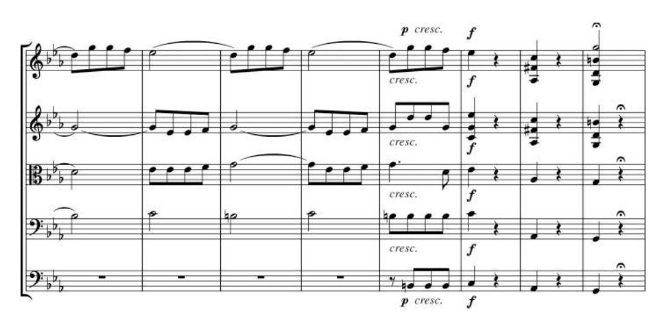

*Ex. 10.1 Beethoven, Symphony no. 5 in C Minor, op. 67, mvt. 1 (strings only)*

#### 196 Shaping Up a Performance

I refer the reader to the beginning of the last movement of Schubert's B-fl at Major Sonata (see Ex. 3.15). The performer must decide for himself the role that repetition plays in each specifi c case. This will lead him to fi nding the appropriate musical expression.

On the other hand, there are times when repetition brings nothing new. Here its purpose may be to prolong, to extend the emotional state, as in the passage from Beethoven's Sonata op. 31, no. 3, shown here (Ex. 10.2). By all means the performer should avoid signaling to the audience, "Well, you got the idea, nothing new is going to happen." Such a message will cause listeners to disengage from the performance. The player instead must convey to the audience the emotional suspense of the passage.

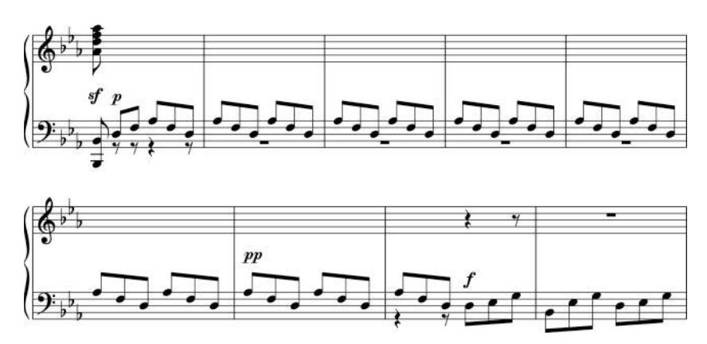

*Ex. 10.2 Beethoven, Sonata in E-fl at Major, op. 31, no. 3, mvt. 4*

There is also a great variety of "near repeats," in which a phrase comes back in a diff erent mode, makes an unexpected modulation, or is harmonized diff erently. It is imperative that a performer react to these diff erences and modify the expression accordingly. In the Classical style, many varied passages can at fi rst glance be mistaken for repeated sentences. In the opening of Beethoven's Sonata op. 2, no. 3 (Ex. 10.3), students often respond to the similarity of the melody and the rhythm in both two-bar phrases, playing them exactly the same way. Unfortunately, they do not notice that the phrases are diff erent harmonically: while the fi rst proceeds from tonic to dominant, the second reverses the harmonic progression. For this reason,

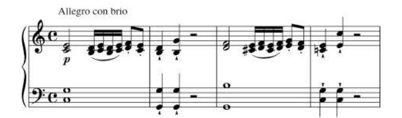

*Ex. 10.3 Beethoven, Sonata in C Major, op. 2, no. 3, mvt. 1*

they should be played not as a repetition but rather as a question-answer sequence, with a corresponding diff erence in their infl ections.

I must confess that I have little faith in the "echo" eff ect favored by many in performances of Baroque music. This somewhat routine tool is perfectly legitimate, but it is often used at the slightest provocation, easily making the music predictable. J. S. Bach gave us an ingenious example of this device in the "Echo" movement from the French Overture. Soft echo phrases, deliciously asymmetric and not at all literally repetitive, create a witty atmosphere, constantly keeping the listener on the edge of his seat (Ex. 10.4).

When whole sections are repeated (in dance movements of Bach suites or other Baroque and early Classical works written in the binary form), I believe that the goal of the composer has been to give the listener another opportunity to grasp the music. For this reason, I feel that a performer who varies the dynamics of repeats obsessively, as if presenting the listener with

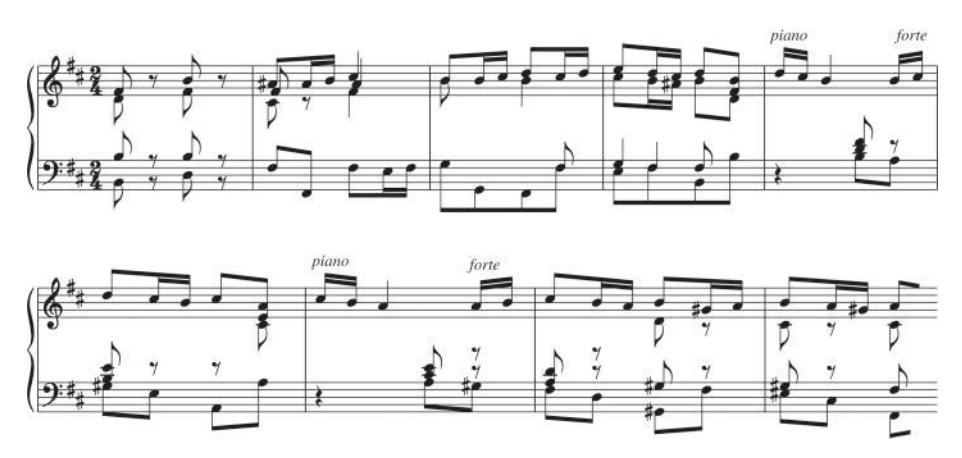

*Ex. 10.4 Bach, "Echo" from French Overture in B Minor, BWV 831*

a photographic negative of the dynamic plan, changing every piano into forte and vice versa, is confusing his audience. Certainly, some dynamic changes in repeats are possible and often welcome, provided that they reinforce the impression of a piece rather than destroy it. I feel the same way about ornamentation of such repeats, customary in Baroque music: I welcome it, but in modest quantities. My attitude is slightly diff erent when dealing with material that comes back periodically as a refrain (see many of Mozart's movements written in a rondo form). After listeners have had a chance to acquaint themselves with the music, it may be appropriate for the pianist to ornament subsequent statements with increasing boldness.

When a large section of the piece (say, an exposition of the sonata allegro) is repeated or subsequently reappears (for instance, in the recapitulation), more than a decorative variation is needed. The treatment of the repeated passage should refl ect what we have lived through in the piece since the fi rst time we heard it. Sometimes it is useful to imagine that the section in question, instead of having the repetition sign, has been reprinted in the score (in fact, many passages of Schubert or Chopin were represented by repetition signs in the manuscript but were printed out in their entirety in the published editions). The performer will feel that he is going forward in the musical narrative instead of coming back.

In compositions with material that reappears many times (such as Chopin's Scherzo no. 1, or Nocturne in F Minor, op. 55, no. 1), many performers try to avoid monotony by deciding in advance that, for instance, the second time they will play the section louder and the third time softer than the fi rst. I would instead experiment with practicing the passage in as many diff erent moods as could be justifi ed. Playing the beginning of the First Scherzo (after the fi rst two chords), for example, I may wish to make it sound alternately mysterious, stormy, questioning, or tragic. I "store" these emotional variants in my memory, without assigning them to this or that recurrence of the section. During the performance, I "retrieve" the character that feels right at the moment.

Earlier I examined the split perception of time, when a performer's attention is divided between past, present, and future. Another aspect of performance requires a similar split in attention. While aiming for an inspired performance, free from worries and concerns, we must never allow ourselves to abandon control over our actions. During the emotional high of an inspired performance a pianist should never cease listening to an objective inner monitor that guided him through hours of preparatory work. This monitor will report when the left hand overpowers the right, when the passage just played was overpedaled, and when the forearm grows tired and, therefore, its position must be adjusted. The critical "inner ear" may warn us that the tempo has not been steady, that the fortissimo in the approaching climax should not be allowed to become hard, and that the pianissimo is in danger of losing clarity. The performer should register all these comments and act on them without allowing this process to hamper the inspiration that continues to propel the performance. This split between emotional involvement and professional control is beautifully described by the great actor Tomaso Salvini (as quoted by Stanislavsky): "The actor lives, he weeps and laughs on stage, but while weeping and laughing he observes his laughter and his tears. This duality, this balance between life and acting makes the art."2

Such observation is not limited to the technical aspects of performance; a good artist is able to evaluate the emotional impact of it as well while remaining absorbed in the act of performance. In his book *The Mask and the Soul*, the great singer and artist Feodor Chaliapin eloquently stated: "The actor is facing a very diffi cult task, one of splitting himself while being on stage. . . . I sing and I listen, I act and I observe. I am never alone on stage, there are two Chaliapins there: one is acting, another one is correcting. 'Too many tears, buddy,' says the observer to the actor. 'Remember that it is not you who cries, it is your character.' Or: 'Too little, too dry. Give more.'" 3

The fi nal stages of working on a piece constitute a crucial and delicate time when the composition matures inside the performer. This is a mysterious process, when all discoveries and decisions one has made during the work begin to cohere. One cannot say exactly how and when it happens, as one cannot say how and when dough turns to bread. I am all for an effi cient and industrious approach to learning a new composition in

#### 200 Shaping Up a Performance

the initial stages of work: learning the notes, solving technical problems, and committing the piece to memory. But when it comes to the fi nal steps, I often have to prevent zealous students from attempting to push themselves too hard, telling them, "Modern medicine developed various fertility treatments helping women to conceive, but it is still impossible to deliver the baby in three months instead of nine. The natural process of gestation cannot be rushed." Similarly, one cannot speed up the process of creative maturation; one can help it, though, by gradually changing the way one works on the piece.

At this stage, more of the pianist's work should be done away from the piano, by either looking through the score or playing the piece in one's head by memory (see Hoff mann's second and fourth ways of learning a piece, described in the chapter on practicing). Instead of playing the piece yet one more time, it is more useful to sit in an armchair in a quiet room or go for a walk in the woods and let the music play inside you. At this time it can be helpful to listen to recordings of the piece (I would not recommend doing this earlier, before one's own view of the work has been formed) and to perform it for a trusted colleague. By now, the pianist should have enough conviction about his interpretation to take other people's ideas critically, incorporating what fi ts his view of the piece and rejecting the rest. Often, though, what helps the most is leaving the piece alone, not pushing it, letting it mature by itself. In this fi nal stage, I would recommend giving the piece some breathing space. Go for a walk or to an art exhibition; do not forbid yourself from thinking about the piece but do not force yourself to do it, either. Sometimes you can reach a stage in which you feel no need to work on the program anymore but reasonably think that you also cannot aff ord to spend days without touching the piano. In such a case, I suggest that the pianist start to learn new repertoire: it will keep him in good pianistic shape while making substantial work on the concert program unnecessary. ^mental-practice-woods

Often at this time the performer develops fears that the program is not ready technically. He practices even more conscientiously than before, but the results seem to get worse by the day. This feeling is not unknown; even very prominent performers may experience it. Let me share a story that I heard from Lev Oborin. In 1927, at the age of twenty, Oborin won the First Chopin International Competition in Warsaw. It was the fi rst time that Soviet artists had competed abroad since the Revolution of 1917. (The Soviet team included, among others, young Dmitry Shostakovich, who took one of the prizes.) At that time there were very few piano competitions in the world, so each of them was taken much more seriously than they are now. Oborin returned home an instant celebrity. He was off ered a recital in one of the most prestigious halls of Moscow. For the program he chose the Sonata op. 106 ("Hammerklavier") by Beethoven and one of the sets of Chopin études (I am not sure whether it was op. 10 or op. 25). Oborin remembered: "The program was accepted, I started practicing it and suddenly discovered that technically I could not play the études. I imagined the full house on the night of the recital, terrible reviews the following morning and panicked. Then I told myself: 'All right, I may be no pianist, but I am defi nitely a musician. So let me treat these études as musical pieces, not technical ones.' The funny thing was, that people who came backstage after the recital were telling me how well everything went from the technical point of view." Of course, there is no magic in what happened: Oborin possessed a wonderful technique. But he was able to take full advantage of it only after he abandoned his fi xation on technical problems.

For pianists who become concerned that their playing is not clean enough at performances, I can add another story from my own experience. Quite a few years ago I was recording the Second Sonata by Shostakovich. Its last movement, a *passacaglia*, enabled each variation to be recorded separately, and that was what I did after a couple of whole takes. For some reason, the recording session did not go easily: my playing was not clean and I had to repeat each variation several times. After we fi nished, I asked the producer to let me play the whole movement once again. With one or two corrections, this last take was the one used for the release. Apparently, knowing that all the notes were there allowed me to stop worrying about the cleanness of my playing, which, in turn, made the playing clean. Performers can easily become obsessed with trying to be note-perfect, not only during recording sessions, but in concert performances as well. The general technical standard of playing is so high nowadays that pianists should work relentlessly during practice sessions to expunge wrong notes. But at performances (including trial performances and run-throughs for oneself) the pianist should let himself go, deal with musical tasks, and not become paranoid about every missed note. (Yet he should address missed notes very seriously again during clean-up sessions, which should follow each such performance.)

No seasoned performer allows himself to appear with a new program in an important concert before he has had a chance to play it in front of other people, no matter how small and informal this audience may be. The presence of listeners makes us experience the music diff erently; the described dialogue with the piece gains a new dimension. It is on stage, in front of the audience, where the performance truly matures. In the words of the Russian stage director Vsevolod Meyerhold: "The production is never ready on the fi rst night, not because we 'did not have enough time' but because it 'ripens' only in the presence of the audience. At least, I have never seen productions which were ready for the fi rst night performance. Salvini used to say that he truly understood Othello only after his 200th performance."4

It is important that trial performances the artist gives for himself or for his friends do not have the air of a progress report. Rather, they are a kind of improvisation in public, at which time the performer is ready to change the charted course. This way one gets closer to the feeling of a real performance. The essence of a truly inspired artistic presentation lies in the combination of the planned aspects of interpretation, thought through and prepared in advance, with spontaneous changes made in the course of the performance-in-progress. We all should strive to capture it every time we appear in front of an audience. This will be easier to accomplish if, in his preparation, the pianist does not determine all the minute details. He should leave some space for small changes within the well-conceived performance. I compare it to railway construction, in which space is left between the rails to allow for expansion of heated metal. (Sometimes during a performance the pianist is forced to improvise interpretive details to justify an accidental occurrence. Suppose the fi rst note of a phrase sounded much softer than planned. An experienced performer will change expression on the spot to justify the softer treatment of the whole phrase or the crescendo that would help him to rejoin the "planned" interpretation.)

The reader may have diffi culty reconciling my advocacy of self-eff acing fi delity to the work with my encouragement of the pianist's reliance on intuition and his inspiration on the spur of the moment. I can try to explain my position by likening the performer to a good trial lawyer who presents a case in court. The lawyer must be eloquent and persuasive, and he must know and value his strong qualities. At the same time, he must always have his client's interests in mind, not turning a trial into a self-display. The much quoted but still beautiful words by Stanislavsky say it all: "Love the art in yourself, rather than yourself in art."

Recently an interviewer asked me what was new in my reading of the Brahms Concerto. I told him that I am trying to play the way I think is right for the piece. I do not care whether no one else plays it this way or whether a thousand people have played like this before me. I advise my students not to worry whether their individuality will show in their performance. Real individuality will always be noticeable without one's trying to do something unusual.

Often an eager and ambitious pianist is trying so hard to make music as expressive as possible that his performance becomes forced; the music seems to suff ocate in his tight embrace. When this happens to my students, I recommend that they let the music fl ow without trying "to make it" in an excessively active way. On the other hand, a performer overwhelmed by admiration for the music he is playing may develop an emotional state that can be labeled "catatonic reverence," a feeling of being unworthy of the great work. Though noble in its intention, such an attitude paralyzes the performer's creativity and needs to be abandoned. A related problem appears when the performer takes his work with exaggerated solemnity. In my attempt to loosen students up, I remind them that in English, as well as

#### 204 Shaping Up a Performance

in other languages, we do not work piano, dig into piano, or suff er through piano, but we *play* piano. Playfulness, both emotional and physical, and the joy associated with it should not disappear from the process.

Earlier I observed that the infl uence of national schools is vanishing in our global village. I fi nd reasons to both laud and lament this development. If the term "national school" stands for limitations of one's musical understanding or pianistic abilities, then the time for national schools has passed, to the benefi t of all. We should no longer assume, or tolerate, that a Russian pianist cannot play Mozart or that a German may have diffi culties with Debussy. But there are times when I miss the idiosyncratic intensity of musicians who play "their" repertoire with full dedication to a certain tradition. I cherish instances when I can say, "He plays Schubert like a Viennese," no matter what the performer's origin or place of schooling may have been.

Psychologically, the performer's task can be seen as impossibly diffi cult and complex. Dealing with masterpieces, many of which defi nitely fi t Schnabel's defi nition of "music . . . better than it can be performed,"5 the musician is constantly refi ning every nuance of his performance, trying to match the perfection of the music. As he strives to achieve optimal results, he needs to understand that a "perfect" performance is impossible. We spend our professional life acquiring and improving control over our physical, mental, and emotional faculties. No wonder that we fi nd it unsettling to realize that certain unknowable forces will infl uence the performance. We try to ensure its success by establishing optimal conditions (such as being rested and eating properly), but in reality many of these rituals are mere superstitions. They guarantee nothing, but rather represent our hope for the performance to go well. The most auspicious preconcert conditions can result in a poor performance; on the other hand, one can play one of the best concerts of his life while feeling dead tired. Moreover, a superb rendering of one work on the program does not guarantee that the rest of the program will go the same way.

Anxiety over the possibility that a performance may not go as one hopes becomes even bigger when one's eff orts are directed toward a single performance which may assume disproportionately great signifi cance in the performer's mind. For this reason, a professional performer should not play too few concerts. Many will smile ironically as they read this statement, thinking about the diffi culty in obtaining engagements. But I do not necessarily mean a proper concert for a paying audience, with proper advertising and a fee. Any occasion for playing in front of an audience, be it in a community center, a school, even at a friend's home, is important to make sure that your artistic soul will not feel "out of practice."

There is a particular quality that is essential for stage performance. People know it by various names: stage presence, charisma, public appeal, or emotional projection. Some think this quality is the crucial ingredient in what we call talent (a big word that is much devalued presently). We all have witnessed performances that could not be criticized for anything except for being boring. On the other hand, a friend has described a diff erent kind of performance by saying, "It is like watching TV: you hate it but keep watching." Why are we compelled to listen to one performer but not another? In a radio broadcast, the program may have superb content but people will not hear it if the transmitter is not powerful enough. When we study music, our work is focused on perfecting the content of the broadcast. Can we improve on the transmitter as well, or do we have to deal with what has been installed at birth? I do not have the answer to this question, but it seems impossible to avoid mentioning the issue. Neuhaus speaks on the subject in this way: "Talent is passion plus intellect. The main error made by the majority of pedagogues, 'methodologists in art,' is that they understand only the intellectual aspect of artistic activity, or rather the process of reasoning which is part of it, and their reasoning and intellectual advice is aimed at infl uencing that side alone, while completely forgetting the other side, this inconvenient X, which they simply discard, not knowing what to do with it."6

What seems to be in our power to develop is the ability to lead an audience through a piece, sharing with listeners our love for it. Often, the

#### 206 Shaping Up a Performance

performer's role is as if to tell his audience: "Listen to it, isn't it beautiful!" This can be done only if we retain a sense of wonderment and not allow ourselves to take the piece for granted. We must know how the composition works and be able to communicate the logic of it to our audience. Yet the inevitability of the work should never degenerate into dull predictability.

Some artists are so intimidated by the presence of an audience that they shut themselves off from it. Granted, there are diff erent personalities and diff erent types of artists. More extroverted performers communicate by bringing the music to the listener, while others draw the listener toward the music, as if into a magic circle. But whatever the approach may be, interaction with the audience is a crucial part of any public performance.

At lessons I usually follow a student's performance by looking at the score. Sometimes I may start to feel that the performance is dull. But if I lift my eyes and look at the player I often see a facial expression showing that he is completely absorbed in the music. Clearly, there is an energy loss somewhere, when whatever is happening in the mind of the player fails to reach the listener. This is yet another problem for which I know no sure remedy. It seems to help if the performer develops the feeling of channeling his emotions into the hall, of beaming them to the listener.\*

Insecurity may creep in as the date of the performance draws near. Trial runs may deteriorate into a mechanical playing through, when the only goal the performer seems to have in mind is to see whether he can play the piece from beginning to end. There is very little value in such tests. Even if the trial has been successful, doubt returns very soon: "Has it been just sheer luck? Am I capable of doing this again?" One should resist giving in to the temptation of testing oneself over and over repeatedly. It leads to nothing other than mechanical playing.

\* Sometimes there seems to be another explanation for this phenomenon. People who fear an audience often try to combat their anxiety by forcing themselves to ignore its presence. This attitude leads to severing the lines of communication with the listener. Even if this approach helps the performer to overcome his fright, the price he pays seems too high. The very reason for his being on stage is put into question.

In most cases, security of memory becomes the performer's main concern. Memory slips are the most frequent result of performance (and preperformance) anxiety. Actually, the term "memory slips" is a misnomer, because the problem is usually not with memory but with concentration. I remember a student whom I taught for one year at a school where I had a visiting professorship. She was one of the most pianistically gifted people I have ever met. Still, there were quite a number of musical issues that I thought she should consider. All in all we had a very productive year, at the end of which she played a splendid recital. After the recital several people approached me to ask, "What did you do with her?" Apparently, the student was known for being plagued by memory problems; every performance used to be marred by blackouts. Unaware of this history, I certainly did not put any eff ort into trying to prevent them from happening. Curious about this welcome change, I spent some time attempting to fi gure out what caused it to happen. I knew that the student used to practice almost obsessively, spending far too many hours in the practice room. Unnecessarily repeating her pieces again and again, she was able to play them almost automatically, reaching a stage at which the mind had no role to play. During performances her mind was roaming freely, entering the dangerous area of personal insecurity. Because many of the ideas we discussed in lessons were new to the student, she possibly needed to keep track of many more things than before. During the recital, these concrete tasks occupied her mind, leaving no room to contemplate the possibility of making a mistake. (I worked with this student for just that one year and had no opportunity to see whether her problems reappeared. If she continued to challenge her mind with new artistic goals, she may well have remained free of problems. But if new ideas were relegated to autopilot through many hours of practice, quite possibly her mind became free to wander again and allow memory slips to resurface.) ^autopilot-case

During a performance, the artist should avoid turning the mental spotlight from the music to his own well-being. All thoughts such as "I am doing terribly," "I am doing great," "They love it," or "They hate it" are extremely destructive. Because we can never forbid ourselves to think certain thoughts, the best approach in such moments is to come up with a concrete musical task to occupy our attention. Compare this with Stanislavsky's advice "to take your attention from what should not be noticed, what should not be thought" and "to lock the attention on what is useful for the role."7

If a mistake does occur, make an eff ort to maintain the continuity of the music by covering up the mistake, rather than by announcing a mea culpa to the audience. Under no circumstances should a mistake be allowed to ruin the remainder of a performance. The performer should put the error behind him and continue making music rather than dwell on his failure. We must remember that listeners attend concerts to enjoy the music, not to judge us, and that in most cases, mistakes loom much larger to the performer than they do to the listeners.

Stage fright seems to be an enemy fought by most artists, including some of the best ones. People fi nd their own ways to cope with it; relaxation, concentration, meditation, and self-hypnosis are the prevailing solutions. A performer who suff ers from stage anxiety to the point that it seriously interferes with his artistic work should look into techniques to overcome it. A well-known pianist described his way of dealing with the problem by thinking several bars ahead of what he was playing at the moment. I am afraid that such an approach may lead to a perfunctory treatment of the "present" of the performance (although it is defi nitely preferable to having constant memory failings). Whatever remedy works for the artist, ideally it should help him come out in front of the audience with a certain musical task in mind and a message to convey, rather than just a hope to survive the ordeal.

The bane of the pianist's existence is the perpetual necessity to adjust to unfamiliar pianos. Very often we do not have a proper rehearsal and need to adjust during the performance. When this happens, we are forced to combine the creative process of performance with the need to observe the peculiarities of the instrument. While playing, we must take note of the unevenness of registers or individual notes or other faults of the instrument and try to compensate for them.

Whenever possible, one should familiarize oneself and become comfortable with the piano on stage in advance of a performance. I would not suggest, however, spending too much time with it, because the pianist may become complacent and expect no surprises from the piano. Subsequently, he may be caught off guard if the piano in the fi lled hall sounds quite different than it did during rehearsal.

Here is a small but important piece of advice: in the days leading to the performance do not always practice on the same piano, or you may fi nd yourself unprepared to face a much brighter or stiff er instrument. If you are familiar with the piano that will be at your disposal for the concert, you should try to practice on an instrument with similar qualities. Otherwise, vary the instruments on which you are practicing to be prepared for every eventuality. The pianist may need to modify his technical approach, sometimes signifi cantly, when dealing with an unfamiliar piano. A very bright instrument will require much less fi nger work as well as smaller movements of bigger joints. It may also require more shock-absorbing motions of the wrist and elbow. Confronting a stiff or dull piano, one should avoid forcing it. Too many hand problems have been triggered by doing so. It is much more effi cient and benign to employ a very fast but light "out" stroke.

In addition to dealing with an unfamiliar instrument, the pianist is confronted on stage with various other challenges. In the chapter on articulation I mentioned the importance of sound projection. Shortcomings in this area become immediately apparent in the concert hall. Every sound, even the softest, must carry to the last row of chairs. Focused sound created by extrasensitive fi ngertips will make it happen. (As mentioned before, sound projection concerns any instrumentalist or singer who appears on stage. I remember advising a singer on an intimate song to sing it as a secret message to the person sitting in the last row.)

Most concert performers develop a certain pattern of behavior on the day of the concert. Earlier I may have been too dismissive of it as being largely a prejudice. Actually, such a routine is important for preparing a performer's body and soul, for putting him in the right mood and mobilizing his inner resources. This ritual should not be too elaborate or infl exible: the artist can become so dependent on it that any change in the routine (an unusual

#### 210 Shaping Up a Performance

rehearsal or concert time, for example) may have a disturbing eff ect. Not wishing to impose my own preconcert routine on others, I will not describe it in detail. I will limit myself to giving certain prudent suggestions: avoid a heavy meal, alcohol, or social excitement before the performance. (The individual can decide for himself how far ahead of the concert this ban should go into eff ect.) A good night's sleep and, if possible, a nap before the concert are very important to me.

The artist's personality determines the nature of the preconcert regimen. A performer who is easily excited should avoid unnerving experiences on the day of the concert. Someone with a steady nervous system who is prone to deliver excessively sober performances may need to wind up emotionally. A famous Russian singer used to get his surge of adrenaline before a performance by going out into the street and picking a quarrel with passersby. This example may be too risky to follow. But whatever the artist's preconcert preparation, it should put him in an alert, uplifted, and concentrated mood. With luck, he will be able to follow the very appropriate wish commonly exchanged by performers before a concert: "Enjoy it."

## Chapter 11: The Art of Teaching and the Art of Learning

This chapter is written from my dual perspective as a student (over the course of my whole life, but formally in Moscow during the 1950s and 1960s) and as a teacher for more than thirty years. Because I work mostly with advanced undergraduate and graduate students, I feel most confi dent discussing how to work with those students who range in age from seventeen to twenty-eight.

With talented students, the teacher's main role is to help them fi nd their own musical voice. The best compliment I have received as a teacher was made by a colleague who attended two excellent graduate recitals given by my students. He told me, "If I did not know, I could never guess that they study with the same teacher." A famous injunction of the Russian stage director Vladimir Nemirovich-Danchenko, "The stage director must die in the actor," can be applied to the teacher. The teacher listens to the student's playing as if holding a mirror to it, commenting on its various aspects, from physical to psychological. By doing so he teaches the student what to pay attention to and what to listen for, thereby passing along his standards.

Musical taste and its most important manifestation, a sense of the right measure, are among the most important things a teacher communicates to the student. My work with other musicians—whether students, chamber musicians, conductors, or fellow teachers—has taught me that most differences of opinion among musicians are not about the dos or don'ts of performance but about how much to do or not to do certain interpretive things. In other words, we argue mostly not about slow or fast tempo, or

#### 212 Shaping Up a Performance

loud or soft dynamics, but about slower or faster, louder or softer. Students with little experience can easily overdo the teacher's advice. Very often I have to remind both my students and myself that the best advice of the teacher can be compromised by the pupil who takes it to extremes. My biggest hesitation about writing this book has been a fear that my advice will be misinterpreted or carried *ad absurdum*. Guided by the teacher, a young musician must learn to use common sense, both in making interpretive decisions and in deciding on appropriate physical actions to realize them. He must avoid exaggerations that render his music making unnatural and pretentious, and the physical process of his piano playing mannered or awkward. Discussing the physical aspect of piano playing, Gyorgy Sandor wrote, "We must try to avoid any excesses and exaggerations throughout our pianistic activities."1 I would defi nitely expand this statement to cover the area of interpretation as well.

In his role as a mentor who shapes the student's taste and understanding, the teacher may be tempted to present himself as the only keeper of ultimate truth. I do not believe that there are such keepers, as I do not believe in ultimate truth in art. I strongly encourage my students to seek opinions other than my own. Having said this, I must remark that a consumerist approach has recently become prevalent among aspiring musicians. With the proliferation of master classes and summer schools all over the world, students hop from one of these events to another, aiming to get lessons from as many teachers as possible within the shortest period of time. They may decide to go to teacher A to have their scales improved, to teacher B for a quick fi x of octave technique, and to teacher C for general musical ideas. Some have come to view their lessons as a visit to a supermarket; if they do not fi nd a specifi c brand, it just means that they have to go to another store. They forget that a teacher is much more than a provider of useful tips. To learn what a teacher can give, a student must be ready to subscribe to the teacher's *Weltanschauung*, his general musical and aesthetic principles. As the student evolves, this allegiance may, and most probably will, be reviewed and revised later. But it must be present at the start of the journey with a chosen teacher.

Being a good student is not as simple a task as one might think. The objective of one's studies should be to become an artist, not to perpetuate one's status as a student. With some students I have the feeling that they fall in my lap as a piece of clay: "Here I am, mold me." In some cases such an attitude is a refl ection of the individual's general passivity, and in others it comes from being accustomed to spoon-feeding by their previous teacher. Sometimes a student adopts such a stance because of the mistaken idea that this is how he can learn the most from his teacher. I always discourage such a passive approach, insisting that the student needs to off er the result of his creative work, thoughts, and ideas for me to be able to respond with suggestions or corrections. It is not enough to follow the teacher's advice obediently; each apprentice must assimilate these suggestions into his own playing. At some student recitals I feel that the young artist comes to the performance armed with a thick mental log of notes containing faithfully memorized directives from the teacher. A mature artist (and an advanced student should strive to become one) would try instead to digest and absorb these suggestions to make them his own.

Young musicians have diff erent needs at diff erent times in their development; the teacher must recognize these changing needs and alert the student to them. There have been times when I said to my students: "You are so profi cient at the keyboard; how about practicing less and spending more time reading, visiting museums, or listening to music other than the piano repertoire?" On other occasions I felt compelled to say: "You are intelligent and know a lot, but do you know enough about your instrument? Spend more time with the piano." I have frequently seen students in their late teens and older who play physically like little children. Their bodies have grown but they have neither discovered nor made use of their bigger hands, forearms, or upper arms. (This is especially noticeable with boys, who undergo much more drastic physical growth than girls; they often play as if ashamed of their grown bodies.) It is the teacher's task to help students make physical adjustments in their playing.

On occasion the teacher, having identifi ed a student's problem and zeroed in on fi xing it over an extended period of time, may miss the moment when

#### 214 Shaping Up a Performance

the problem no longer exists. The teacher's continued work, in fact, creates a new issue. I remember a student who played with remarkably motionless wrists. He told me that his previous teacher, a very good pianist with whom he had studied for two years, insisted on this way of playing. Trying to under stand the reason for it, I ventured a guess and asked, "Before coming to her, were you in the habit of making all kinds of unnecessary or exaggerated motions with your hands and wrists?" When the student confi rmed my suspicion, I realized that the teacher had passed the point at which the problem she was rightfully bent on eradicating had actually been resolved. Her continued vigilance caused the student to acquire equally wrong habits of an opposite nature. I recall an old saying, the wisdom of which has been repeatedly proven: "Our faults are the extension of our virtues."

An important task that many teachers forget is to make sure their charges know how to practice, both in general and when working on a specifi c passage. I often ask my students to show me how they practice to make sure that they do not work ineffi ciently or harmfully. In making recommendations on ways to improve practicing, I always stress how we want the passage to sound ultimately. The same goal is served by the time-honored device of the teacher playing the part of one hand while the pupil plays the other. When the result is to both parties' liking, they switch parts. After the passage has been satisfactorily performed both ways, the student should try to reproduce it by himself.

There are teachers who are much more interested in the musical compositions they teach than in the development of the student who plays them. We know about some great musicians who did not allow their pupils to bring any piece to a lesson more than once. Apparently, for these teachers the opportunity to express their views on a work was infi nitely more interesting than seeing how their suggestions were understood and absorbed and whether they really worked for each particular student. I fi nd this kind of work limited; such an approach to teaching loses a great deal of the human dimension, which to me is so attractive. It is fascinating to see how diff erent a musical composition can sound in a new light shed by the personality of a talented student.

When dealing with gifted and highly profi cient young musicians, a teacher often feels that, even when a performance is accomplished in many ways, something is still missing from the student's playing. Very often the source of the defi ciency lies beyond the piano and, frequently, outside music. It is a challenge for the teacher to help a student identify a path to further growth. On the other hand, there are teachers who are so dedicated to the development of their students that they regard great works of music exclusively from the point of their usefulness as teaching tools. I have witnessed interpretations that were tailored to the technical limitations of a student and compositions that were cut to fi t the duration requirements of a competition. This approach not only degrades the music, it ultimately does not serve the student well either. I believe that one of the teacher's jobs is to instill a deep respect for the music performed. While helping each individual to achieve the best performance he can muster, the teacher should endeavor to give him the fullest possible picture of the work even if this is beyond that person's present grasp.

Charting my course with each student, I try to concentrate on the underdeveloped sides of his playing and overall musicianship. If one plays mostly Romantic music, I will insist that he study Bach fugues or Beethoven sonatas. I have had students who declared on arrival in my studio that they saw themselves as exclusively Mozart specialists, modern music specialists, or chamber musicians. They all ended up playing varied repertoire. My goal is not to make my students omnivorous—we all have preferred areas of music with which we feel a strong affi nity. But specialization at an early age is born more of insecurity or inexperience than of natural predilection. Moreover, even if one who is a Romantic pianist par excellence will end up playing Mozart far less convincingly than he plays Chopin, his Chopin playing will greatly benefi t from learning Mozart sonatas. When a student claims to dislike and therefore shies away from a certain style or composer, I want to make sure that this reaction is not merely a refl ection of his limited knowledge. My conversations with young people on this matter often end with the phrase that I mentioned earlier: "Ignorance is not a point of view."

#### 216 Shaping Up a Performance

I would like to say a few words about the role of chamber music. For me, it is one of the most gratifying forms of music making. It is also the noblest form of human discourse in music, in which musicians are engaged in an emotional give and take. It must be seen as an indispensable part of both the musician's education and his subsequent professional activity. I remember how shocked I was, during my fi rst years in the United States, when a noted New York manager told me, "Chamber music is the kiss of death for your career." It was widely assumed at the time that anyone who appeared on stage with others did so because he was not good enough to be engaged as a soloist. This view, happily, is becoming more and more outdated. Now every successful soloist is expected to be a good and active chamber musician.

Having said that, I remember some of my very talented students who were chamber musicians of uncommon sensitivity. They enjoyed this activity immensely, feeling that this was what they should be doing in their professional life. I felt, however, that their success in chamber music was based exclusively on their ability to adapt to their partners, to pick up creative vibrations from other musicians and react to them. In the give and take, they were much more adept at taking than at giving. Their solo performances had all kinds of faults, including passivity, lack of authority, and a certain paleness. Consequently, in my work with them I stressed the need for musical initiative and imagination. I feel strongly that a good chamber musician must be able to generate his own impulses as well and to have a strong will and initiative, qualities that are developed best in solo work. This is why I feel that the pragmatic approach of young musicians who try to build their career niche too early works against them. One should fi rst become as good a performer as one can, and only later decide on an area of specialization.

When working with students, I try to understand the ways of learning that are natural to them. With those who can incorporate new ideas immediately, I go over details, asking them to try my suggestions. Others need to make several attempts in the privacy of their practice room. I respect this and do not force them to make changes on the spot. The teacher needs to fi nd out what speaks best to a particular person. Depending on what this is, the instructor may modify his approach accordingly, choosing associations with literature, cinema, psychology, or religion, or evoking a visual image to gain optimal results. I had one student whose approach to Schubert was exceedingly driven and determined in a Beethovenesque way. I compared the known pictures of Schubert, with his eyes gazing dreamily at the sky, with the one of Beethoven walking with Goethe, taking angry, determined steps and looking at the ground. This contrast helped the student to fi nd the right emotional tone. If a person is prone to conceptualizing, we talk a lot in general terms. With someone whose approach to playing is largely physical, I try to help fi nd the right physical state.

I believe that if a teacher succeeds in igniting the student's imagination, the result is much more creative than anything that dry, albeit effi cient, directives can accomplish. One of the most memorable lessons I received from Lev Oborin was on Debussy's "La soirée dans Granade" from *Estampes*. Referring to the character of the dance of habanera, which permeates the piece, he told me the most wonderful story, which I retell here. Keep in mind that, in his early years, Oborin was active as a composer as well as a pianist, and that throughout his life he was in contact with the best artistic talents of Russia, including Vsevolod Meyerhold, the legendary stage director.

"Once," Oborin told me, "Meyerhold approached me with an off er to write music for his projected production of *Carmen*. He wanted it to be based on the novella by Prosper Mérimée rather than on the opera by Bizet; he felt that Bizet had spoiled Mérimée's story. Meyerhold described to me his plans to obtain a grant from the Soviet government to travel to Spain to study authentic Spanish music. At the end, nothing came out of the idea; we did not get the grant and Meyerhold never came to stage *Carmen*. However, he already had whole scenes of the production ready in his mind. He told me: 'I will have the glass fl oor on the stage and I will have powerful lights placed underneath. The stage will be awash with a golden glow and, basking in it, women will be dancing the habanera. They will dance slowly

#### 218 Shaping Up a Performance

because the fast habanera is danced only on the stage of the Bolshoi Theater. Spain is hot; one cannot dance fast there.'" I guess Oborin could have saved himself the trouble of telling me this story. He might have merely offered: "You are playing too fast." I doubt, though, that it would have left me with as lasting an impression. The striking image of dancers slowly moving in the golden light has remained chiseled in my mind for thirty years.

Sometimes I have found it necessary to refuse to cater to a student's expectations. For one who is adept at imitation, I try to show very little on the piano, because of the danger that he will imitate me before he actually understands what I am after. (I once had a student who imitated me perfectly, complete with occasional slips I had made.) Yet I may demonstrate much on the piano to one who is very good with general concepts but rather indiff erent to their practical applications. I show both how I think the music should be played and how it should not; I try to make sure that the student hears the diff erence.

Throughout this book I have tried to adopt a balanced stand on many issues. In actual work with students, my emphasis shifts to refl ect their needs and background, be it in the fi eld of piano technique, musicianship, or working habits. While working with musicians trained in America or western Europe I often preach the necessity of having active, well- articulating fi ngers. Teaching in Japan, though, I found myself saying repeatedly, " Hakkiri-sugizuni" (not so clear) in relation to excessively articulated accompanying fi gures. Working with an overzealous student I may suggest that he limit the time he spends in the practice room, but I would not give this advice to someone whose diligence is questionable. Instead, I would try to motivate him to practice by presenting the student with concrete challenges in the repertoire he studies and insisting on his meeting them.

The emotions of the performer can be discussed on many diff erent levels. The teacher uses his discretion to decide the best approach in each case. Discussing emotional yearnings with someone who has not yet experienced his fi rst heartbreak may confuse the student. Fortunately, the desired result can be achieved by presenting the subject in a diff erent light. Talking about the feeling of longing so pervasive in the music of Brahms, for example, I often recall a story about the daughter of a friend. When she was nine, she watched her father, a pianist, rehearse with a violinist. After the last movement of the Brahms G Major Sonata, the girl was asked what she thought the music was about. She answered, "It is about wanting ice cream so much." To the next question, "And do you get your ice cream at the end?" she looked sad and said, "I do not think so." Here the young girl captured, in her inimitably childlike way, the feeling of yearning for the unattainable that fi lls so many of Brahms's pages. I do not hesitate to borrow this image, especially when I feel that a student has enough child in him to relate to it.

When guiding students toward a performance, I try to help them unleash all their emotional resources. Conversations I have had with two of my students may help illustrate this process. The fi rst was with a talented, easygoing, and very profi cient pianist after he played for me Schubert's C Minor Sonata. The recital for which he was preparing the piece was only a few days away, and the sonata still lacked the necessary emotional intensity. When I expressed this opinion, he agreed, adding, "Well, I'll just have to do the best I can and not worry about it." My reaction was: "I am sorry, this is my line, not yours. You are supposed to try desperately to capture the correct mood of the piece and be heartbroken because it eludes you."

The other conversation was with a very sensitive, thoughtful, and inquisitive musician. At a particular lesson, I was concerned that his playing of late seemed to have lost its naturalness, that many interpretive ideas were being presented in a forced, exaggerated manner. I told him, "When you came to me three years ago your playing lacked many necessary skills. Yet you played Chopin mazurkas with an intuitive naturalness that is missing now when you have become a much more accomplished pianist. Can it be that, realizing how many things were imperfect in your playing, you started to doubt your musical intuition and sensitivity, qualities at the core of what we call "talent"? At this point, I remembered what Claude Frank had once said to me: "Preparing for a performance, one should be very self-critical in details and not critical in general." Elaborating on these words, I told my student, "Your thinking should work approximately like this: 'Yes, I have much to learn, this run is not even, that passage is not steady rhythmically, and so on, but I am defi nitely a talented musician and have something important to off er.' If you decide to learn how to be a good cook, you may need to learn various techniques, get to know how to use fl avors and spices, but there is the premise that you have an excellent piece of meat for your meal. Even if you feel that you have a lot to learn about cooking, it would be a sad mistake to begin with throwing away the meat. Do not doubt your talent—respect it, value it." For this student I would stress the fi rst half of Stanislavsky's famous quotation, "Love the art in yourself. . . ."

It may seem that in these two conversations I went in opposite directions. In reality, in both of them I was pursuing the same goal: making sure that the pianist utilizes not only his acquired skills, technical or intellectual, but also dedicates himself to the performance with all his emotional intensity.

Earlier I wrote about the performer's need to project authority and confi dence in his playing. It is naive to think that an obedient, even docile student will develop this quality by himself once his studies are over. The teacher must encourage him to learn to take a stand in performance, not to wait for instructions to be given to him. Often I say, "Yes, you are my student and I am your teacher. My task is to teach and your task is to learn. But we begin each lesson with you playing the piece (or at least a movement of it) in its entirety. This is your performance and you should feel like a performer, not like a mousy little child submitting his work to the teacher for criticism and corrections. That part of the lesson comes later. During the performance, however, our roles are reversed. You are the leader whom I am to follow, you are here to command and I am to obey."

I have many times been baffl ed when an obviously musical student delivers a dull, disengaged performance. Over the years, I think I have learned to diagnose possible reasons for this, and I have discussed them in diff erent chapters of this book. To summarize, the problem is usually the result of:

- (1) overpracticing, which often leads to mindless, mechanical playing;
- (2) frequent switching-off of attention, mental skipping to the next bar, or next sentence, or next page;
- (3) some kind of emotional laziness when, having established a character, a pianist fails to follow its development and assumes that nothing changes until arriving at a new, contrasting section;
  - (4) complacency as the student's general character trait.

Though all these reasons stem from very diff erent causes (some of them beyond the realm of music performance), my response to them as a teacher is similar. It boils down to insisting that, for every second of a performance, every detail must matter to the student. The player's ear must be guiding him at every turn with unfl agging attention, and his creative will helps him to project his feelings about the piece to the audience.

Learning to listen objectively to one's own playing is an effi cient cure for the student prone to extravagance. Bizarre interpretations do not necessarily mark him as a new Glenn Gould. Frequently, the student just does not realize that what is coming from under his fi ngers is not what he intends. Lack of proportion in such areas as bringing out secondary voices or using tempo rubato need to be brought to the attention of the student to help him hear it. Having the student record his own playing and listen to the playback (perhaps together with the teacher) is very helpful.

I have been asked what I think about creating "programs" for the works that young pianists study—that is, inventing stories about their content. I fi nd that this approach is often eff ective in triggering the imagination of a student, even an older and more sophisticated one. I would much prefer, though, for the initiative to come from the student himself. Ideally, the teacher should limit himself to tactfully prodding the pupil along in the right direction. It is important to insist that the student not indulge merely in fl ights of fancy but fi nd justifi cation for his ideas in the music. If, for instance, one told me that a work reminded him of a helicopter ride or a

#### 222 Shaping Up a Performance

football game, I would try not to cringe but rather would ask him what aspects of the score made him feel this way.

When I disagree with a student's vision of a piece, I try to corroborate my opinion by referring to the score. A student once described the character of Brahms's op. 119, no. 2, as lighthearted. When I asked her to substantiate this description, she referred to the dancelike rhythm of the initial melody. "Yes," I said, "the music has this quality but it has much more than that. Look at the melodic line that obsessively circles around the same narrow range of notes over and over again." This started a conversation on the complex, even contradictory nature of the emotion of the intermezzo, so typical of Brahms's late works.

There are diff erent teaching styles; a good teacher should be able to switch from one to another as needed. Working on mundane technical matters, he needs to be persistent and concrete, but never dull. The student should always be aware of the musical reason behind the teacher's demands. On the other hand, I have been present at some master classes where the teacher's enthusiasm was positively contagious. Such classes are exciting and gratifying not only for the teacher and the student but for observers as well. Inspired by the teacher's eff usive encouragement and praise, a student seemed to be on cloud nine, and the performance had an engaging air of spontaneity. But I could not help thinking about the morning after, when the student would sit by himself at the piano trying to replicate his performance without the charismatic teacher nearby. Perhaps all he would feel is that he had played wonderfully the day before but could not do it again, because he did not have any idea what exactly he had done the day before. I fi nd this electrifying way of teaching very useful, especially for shaking off a student's self-consciousness and inhibitions, and I use it myself. In the midst of the great excitement of an inspired performance, though, I may stop the student to ask, "Have you noticed what exactly you have been doing diff erently now?" This interruption often works like a cold shower; the student sets aside the euphoria and starts fi guring out just what he has changed in his playing. In a situation like this it is important that the teacher knows exactly what the answer is and leads the student toward it.

Making the student aware of his actions is a critical part of my overall teaching approach. I hope that, working on his own and facing a certain problem, he will be able to relate to our work together on a similar issue. Because I work mostly with graduate students, I am likely to be the last, or next to last, teacher they will have before they embark on professional careers. Are they always going to assign their future students the same few Bach preludes and fugues or Beethoven sonatas that they studied with a teacher because they have no clue how to approach the others? It seems to me that the teacher's contribution in giving students lasting musical and pianistic guidance is far more important than helping them to prepare a recital program or win a competition. In the words of a Chinese proverb, "Give a man a fi sh, that is dinner for the night. Teach the man how to fi sh, that is dinner for life."

Last, I would like to comment once again on the dual responsibility of the teacher to the music and to the student. Only when both are benefi ting from his work can the teacher claim real success.

## notes

#### *Chapter 1: Sound and Touch*

- 1. Jean-Jacques Eigeldinger, *Chopin: Pianist and Teacher as Seen by His Pupils* (Cambridge: Cambridge University Press, 1986), p. 25.
- 2. Grigory Kogan, *Izbrannye Statyi* [Selected essays] (Moscow: Sovetskiy Kompozitor, 1972), p. 255 [my translation].
- 3. See Konrad Wolff , *Schnabel's Interpretation of Piano Music* (New York: W. W. Norton, 1979), p. 25.
- 4. Quote from Nikolai Bertenson, *Anna Nikolaevna Esipova* (Leningrad: Gosudarstvennoye Muzykalnoye Izdatelstvo, 1960), p. 113.
- 5. Josef Lhevinne, *Basic Principles in Pianoforte Playing* (New York: Dover, 1972), p. 19.
- 6. Quote from Bertenson, *Anna Nikolaevna Esipova*, p. 119.
- 7. Lhevinne, *Basic Principles in Pianoforte Playing*, pp. 18–19.
- 8. Natan Perelman, *Osenniye Listya* [Autumnal leaves] (Ann Arbor, Mich.: Braun-Brumfi eld, 1994), p. 34.
- 9. Heinrich Neuhaus, *The Art of Piano Playing* (New York: Praeger, 1973), p. 59.
- 10. Arnold Schoenberg, *Theory of Harmony* (Berkeley, 1978), p. 422.
- 11. Perelman, *Osenniye Listya*, p. 13.
- 12. Alfred Brendel, *Musical Thoughts and Afterthoughts* (London: Robson, 1976), pp. 95–96.

#### *Chapter 2: Technique*

- 1. Wilhelm Furtwängler, *Concerning Music* (London: Boosey and Hawkes, 1953), p. 55.
- 2. See Gyorgy Sandor, *On Piano Playing* (New York: Schirmer, 1981), p. 88.
- 3. William S. Newman, *The Pianist's Problems* (New York: Da Capo, 1984), p. 49.

#### 226 Notes to Pages 32–117

- 4. Bertenson, *Esipova*, p. 105.
- 5. Quoted in Eigeldinger, *Chopin: Pianist and Teacher,* p. 101.
- 6. Lhevinne, *Basic Principles in Pianoforte Playing*, pp. 34–35.
- 7. Neuhaus, *The Art of Piano Playing*, p. 108.
- 8. See Bertenson, *Esipova*, p. 109.
- 9. Sandor, *On Piano Playing*, pp. 151–152.

#### *Chapter 3: Articulation and Phrasing*

1. Sandor, *On Piano Playing*, p. 69.

#### *Chapter 4: Matters of Time*

- 1. Quoted in Neuhaus, *The Art of Piano Playing*, p. 30.
- 2. Rudolph Kolisch, "Tempo and Character in Beethoven's Music," *Musical Quarterly* 77 (spring 1993): 1, 90–142 [part 1]; 77 (summer 1993): 2, 268–275 [part 2].
- 3. Adolf Bernhard Marx, *Anleitung zum Vortrag Beethovenscher Klavierwerke* (Berlin, 1875), p. 63, quoted in Kenneth Drake, *The Sonatas of Beethoven as He Played and Taught Them* (Bloomington: Indiana University Press, 1972), p. 44.
- 4. Bertold Litzmann, ed., *Letters of Clara Schumann and Johannes Brahms* (New York: Vienna House, 1973), p. 33.
- 5. Robert H. Schauffl er, *The Unknown Brahms* (New York: Dodd, Mead, 1936), p. 180.
- 6. Litzmann, *Letters of Clara Schumann and Johannes Brahms*, p. 185.
- 7. See Karl Geiringer, *Brahms: His Life and Work* (New York: Da Capo, 1981), p. 259.
- 8. Marx, *Anleitung*, p. 62, quoted in Drake, *The Sonatas by Beethoven*, p. 44.
- 9. Neuhaus, *The Art of Piano Playing*, p. 31.
- 10. Quoted in Eva and Paul Badura-Skoda, *Interpreting Mozart on the Keyboard* (New York: St. Martin's, 1962), p. 43.
- 11. Ibid., p. 43.
- 12. Eigeldinger, *Chopin: Pianist and Teacher*, p. 50.
- 13. L. N. Oborin, *Statyi, Vospominaniya* (Moscow: Muzyka, 1977), p. 58 [my translation].
- 14. Neuhaus, *The Art of Piano Playing*, p. 53.

#### *Chapter 5: Pedaling*

- 1. This information was provided by the late Prof. Richard Rephann, curator of Collection of Musical Instruments at Yale. His advice on this matter, as well as on the realization of basso continuo in Ex. 8.7, is gratefully acknowledged.
- 2. Luciano Berio, *Sequenza IV* (London: Universal Edition, 1967), p. 1.

#### *Chapter 6: Practicing*

- 1. Perelman, *Osenniye Listya*, p. 8.
- 2. Sandor, *On Piano Playing*, p. 186.
- 3. See Walter Gieseking and Karl Leimer, *Piano Technique* (New York: Dover, 1972).
- 4. Lhevinne, *Basic Principles in Pianoforte Playing*, p. 42.
- 5. Josef Hofmann, *Piano Playing with Piano Questions Answered* (New York: Dover, 1976), p. 52.

#### *Chapter 7: Deciphering the Composer's Message*

- 1. Kogan, *Izbrannye Statyi*, p. 245 [my translation].
- 2. Vincent Scully, *Architecture: The Natural and the Manmade* (New York: St. Martin's, 1991), p. 155.
- 3. Igor Stravinsky and Robert Craft, *Conversations with Igor Stravinsk*y (1958; repr., Berkeley and Los Angeles: University of California Press, 1980), p. 21.
- 4. Artur Schnabel, *My Life and Music* (New York: Dover, 1988).

#### *Chapter 8: Seeing the Big Picture*

- 1. Quoted in Sarah Lyall, "The Muse of Shakespeare Imagined as a Blonde," *New York Times*, December 13, 1998, p. 17.
- 2. This is the way the sonata was titled in the fi rst edition. The composer himself preferred the German headings: Das Lebewohl, Abwesenheit, Das Wiedersehen.
- 3. From his review of the Fifth Symphony in *Allgemeine Musikalische Zeitung* of 1810, quoted in Maynard Solomon, *Beethoven Essays* (Cambridge: Harvard University Press, 1988), p. 23.

#### *Chapter 9: Technique of the Soul*

- 1. Compare with Stanislavsky's description: "We channel through ourselves the material received from the author and from the stage director." Konstantin Stanislavsky, *Rabota Aktiora nad Soboi* [The actor works] (Moscow: Khudozhestvennaya Literatura, 1948), p. 103 [my translation].
- 2. Ibid., p. 49.
- 3. Quoted in Dennis Looney, *Compromising the Classics: Romance Epic Narrative in the Italian Renaissance* (Detroit: Wayne State University Press, 1996), p. 93.
- 4. Dinitia Smith, "A Star in the Twilight Turns Refl ective," *New York Times,* March 1, 1998, Section 2, p. 25.

#### *Chapter 10: At the Performance (and Prior to It)*

- 1. Neuhaus, *The Art of Piano Playing*, p. 49.
- 2. Stanislavsky, *Rabota Aktiora nad Soboi*, p. 506.

#### 228 Notes to Pages 199–212

- 3. *Maska i dusha*; English translation was published as *Feodor Chaliapine, Man and Mask: Forty Years in the Life of a Singer* (New York: Knopf, 1932). Quoted in Grigory Kogan, *Voprosy Pianisma* [Issues in piano playing] (Moscow: Sovetskiy Kompozitor, 1968), p. 167 [my translation].
- 4. A. Gladkov, "Meyerhold Speaks," quoted from Grigory Kogan, *Rabota Pianista* (Moscow: Muzgiz, 1963), pp. 171–172 [my translation].
- 5. Schnabel, *My Life and Music*, p. 122.
- 6. Neuhaus, *The Art of Piano Playing*, p. 24.
- 7. Stanislavsky, *Rabota Aktiora nad Soboi*, p. 186.

*Chapter 11: The Art of Teaching and the Art of Learning*

1. Sandor, *On Piano Playing*, p. 43.

## About the Author

Born in Moscow, Boris Berman studied at Moscow Tchaikovsky Conservatory with the distinguished pianist and pedagogue Lev Oborin; he graduated with distinction as both pianist and harpsichordist. In 1973, he left the Soviet Union to immigrate to Israel. Since 1979 he has resided in the United States. As a concert pianist, Boris Berman has performed in over fi fty countries on six continents. His repertoire ranges from Baroque to the most recent contemporary compositions. His discography includes recordings with the Israel Philharmonic Orchestra under Leonard Bernstein and the Royal Concertgebouw Orchestra under Neemi Jarvi. Boris Berman was the fi rst pianist to record all solo piano works by Sergei Prokofi ev. His Shostakovich disc received the Edison Classic Award. Other recordings include complete sonatas by Scriabin, complete piano works by Schnittke, as well as compositions by von Weber, Franck, Debussy, Stravinsky, Brahms, Schumann, Janacek, Joplin, and Cage.

Boris Berman has served on the faculties of Indiana (Bloomington), Boston, Brandeis, and Tel-Aviv universities. Currently, he is Professor of Piano at Yale School of Music. He also conducts master classes throughout the world and is a frequent member of juries of international competitions. The web site [www.borisberman.com](http://www.borisberman.com) contains more information about Boris Berman's performances, discography, and teaching.

## Index

agogic stress, 61, 75, 103, 169 Albeniz, Isaac, 174 Alberti bass, 109, 154 analysis of the music, 129, 142, 152. *See also* Schenkerian analysis appoggiatura, 129–130 arm/upper arm, weight of, 10–12, 27–28, 32, 46, 55 arpeggios, 20, 24, 36, 41, 51–53, 121 articulation, 10, 13, 16, 32, 53, 56, 58–59, 61, 64, 74–75, 129–132, 143, 160, 190; in early music, 62–64, 123; fi nger, 11, 13, 27, 29, 33–34, 127–128 Ashkenazy, Vladimir, 26 associations. *See* connections attack, 5, 8, 9, 15, 21, 56, 58, 66, 117, 119. *See also* articulation

Bach, Johann Sebastian, 16, 63, 75, 99–100, 122–123, 140, 153–154, 163–167, 178, 215, 223; articulation, 62–64; harmony, 153–154, 164–167; pedaling, 105; phrasing, 76–77; polyphony, 140–141; repeats, 197; spelling of movements, 171–172; technique, 28–31

basso continuo, 164–165 Beethoven, Ludwig van, 9, 15, 19, 49, 68, 94, 100–101, 122–126, 131, 154, 158–159, 161, 177–178, 180, 195–197, 201, 215, 217, 223; articulation, 62–63, 131; dynamics, 22, 77–79; orchestration allusions, 60, 162–163; pedaling, 107, 109, 110–112, 118; rhythm, 85; technique, 28, 35, 42, 134, 136; tempo, 88–89, 91; transitional passages, 186, 196 Berg, Alban, 74 Berio, Luciano, 91, 117, 120 Bizet, Georges, 217 body: mass 10–12, 27, 46; position/ posture, 31, 32 Boulez, Pierre, 61, 73 Brahms, Johannes, 7–8, 51, 110, 134–136, 190, 203; articulation, 57–58, 159–160; connections to dance, 173; emotional content, 155–156, 175, 219,

222; fi nger technique, 34; meter,

Bartók, Béla, 5, 35–36, 66, 88–89, 141, 174, 190; pedaling, 115–116; rhythmic fl exibility, 84

87–88; rhythm, 85–86; sostenuto, 168; tempo, 90–91 breath/breathing: musical, 69, 73, 75, 101; physical, 2, 47 Brendel, Alfred, 24 Bulow, Hans von, 82 Busoni, Ferruccio, 132 Brahms, Johannes (*continued*)

Cage, John, 73 Cegledy, Janos, 145fn Chaliapin, Feodor, 199 chamber music, 216 character of music, 7, 30, 83, 125, 127, 131–134, 154, 158, 161, 177, 179–180, 184–186, 188, 190, 193, 198, 217, 221–222 children, gifted, 182–183 Chopin, Frédéric, 4, 7, 8, 20–21, 28–29, 43, 48, 50–51, 87, 93–94, 128, 136, 189, 195, 198, 201, 215, 219; connections to dance, 174; études, 34, 36, 38–41, 43, 50, 137–138, 201; fi ngering, 53, 132–133; pedaling, 105–106, 111–114; phrasing, 67, 70–71, 73–74; repeats, 198; rubato, 96, 98–100; sostenuto, 168 chord(s), 6, 9, 15–16, 22, 24, 28, 33, 58–60, 81, 107–108, 112, 117, 120, 132–133, 151, 153–156, 159, 163, 170; legato, 15; progression, 53; repeated, 43–44; technique needed for, 43–46, 47–48, 50–51; voicing of, 18–20 clarity of performance, 32, 56 clavichord, 104, 105 Clementi, Muzio, 50 conducting, 88, 95, 100 connections: emotional, 185; with other

repertoire, 161, 163, 172

continuity: emotional, 185, 191; musical, 48, 87, 95 contrapuntal writing, 154 Cramer, Johann Baptist, 50 crescendo, 8, 22, 53, 71–72, 78, 80, 102, 115, 158–159, 169, 203 Czerny, Carl, 50

Dallapiccola, Luigi, 61 dance, 43, 87–88, 105, 121, 171–174, 197, 217–218, 222–223 Davidovsky, Mario, 92 Debussy, Claude, 15–17, 56, 109, 116, 168, 173, 176–177, 188–189, 204, 217; dynamics, 16, 80; notation, 122–123; pedaling, 106, 118–120; voicing, 19 de Falla, Manuel, 174 Denisov, Edison, 83 depth of touch, 12–13, 32, 56fn diaphragm, 47 Dvorák, Anton, 174 dynamic(s), 24, 62, 123, 125, 150, 190, 212; and articulation, 64–65, 130, 150, 160, 197–198, 212; balance, 105; of Beethoven, 78–80; control of, 16–18, 24; of Debussy, 80; and left (soft) pedal, 118; markings, 74–75, 122; in phrasing, 66, 71, 101–102; in practicing scales and arpeggios, 53; and repeats, 197–198; and sound production, 9, 11–12

economy principle. *See* technique editions, 67, 122, 130, 169–170, 198 elbow, 11, 32, 43–44, 55; "fl oating," 45; as pivot, 45; as shock absorber, 10, 45–46, 209 emotion, 181–191, 198–199, 216–222; "as if" state, 187; content of work, 150,

152, 153, 155; identifi cation with, 176; and practicing, 144; style and, 189– 190. *See also* continuity: emotional endurance, physical, 55 enunciation, 32, 56, 62 Esipova, Anna, 6, 13, 32, 53 études, 34, 36, 38–39, 41–43, 75, 121, 127, 132, 136–138, 188–189, 201 exercises, 18, 21, 34–35, 44, 50–51, 53, 59–60, 95, 102, 137; daily routine, 51, 121; emotions of, 188–189. *See also*  practicing

extension principle. *See* technique

fi ngering, 130–133

fi nger(s), 43, 45; activity, 27, 32, 56, 128, 218; articulation, 26, 29, 53, 56, 58; contact with key, 9, 34; distance from keyboard, 34, 50fn; gliding movement, 6fn; independence of, 26, 50; legato, 16, 41; pedal, 109–110; shape of, 13–14, 24, 38, 50, 132; speed of action, 5–6, 11, 56fn, 61; staccato, 35; technique, 187; tips of, 14, 32–33 foot. *See* pedal/pedaling forearm, 6, 10–12, 26–28, 30, 32–33, 35, 42–48, 55, 132, 199, 213 Frank, Claude, 219 Furtwängler, Wilhelm, 26, 151fn

Glass, Philip, 73 Godowsky, Leopold, 136 Gould, Glenn, 32, 221 Granados, Enrique, 174 Grieg, Edvard, 174

hand(s): crossing, 47; position, 38, 41; shape/expansion of, 31, 32, 36–41, 47 Hanon, Charles Louis, 51

harmony, 51, 57, 96, 104, 107–108, 111, 119, 133, 138, 152, 156 harpsichord, 16, 58–59, 63–64, 102, 105, 164–167 Haydn, Franz Joseph, 110fn, 157–158, 162, 174–175 Hoff mann, Ernst Theodor Amadeus, 176, 180 Hoff mann, Joseph, 5, 127, 145, 200 Holliger, Heinz, 115 humor, 158

identifi cation, emotional, 55, 184 imagery, 5, 10–12, 33, 38, 46, 163, 180, 188fn, 193, 195, 217–219 imitation of other instruments, 174, 178 imitations, 145, 184, 204, 215, 218 injuries, 27, 33, 41, 55 interpretation of the music, 96, 151, 159, 183, 193, 200, 202–203, 212, 215, 221

keyboard, 5–7, 12, 13, 16, 31–33, 38, 45, 47–50, 53, 55, 63, 89, 115, 118, 142, 162, 165, 168, 213, 226 Kodaly, Zoltan, 174 Kogan, Grigory, 4, 150

leaps and jumps, 36, 41, 43, 45, 47, 49, 131–132, 134, 137, 174 legato, 6fn, 15–16, 24, 35, 41, 55, 58–61, 123, 130, 159; fi nger, 15, 41, 58–59; pedaling and, 104, 107, 109 Leimer, Karl, 142 Lenz, Wilhelm von, 98 Leschetizky, Theodor, 6 Lhevinne, Josef, 10, 13, 42, 142 Liszt, Franz, 8–9, 16, 24, 50, 60, 132, 190 "long neck" concept, 11

mass. *See* body: mass melody/melodic line, 15–16, 62, 68, 73–74, 75, 78–80, 97, 99–100, 105–109, 111, 128, 132, 140, 153, 156, 168, 196, 222; phrasing of, 66, 71–75; voicing of, 18–20, 24, 56–58 memorization, 3, 140–143 Messiaen, Oliver, 16–17, 61, 73, 86 meter, 87–88, 101 metronome, 88–91, 144–145 mistakes in performance (memory slips), 207–208 Moszkowski, Moritz, 50 motives, 62, 64, 73–74, 76–77, 90, 143, 180, 195 Mozart, Leopold, 97–98 Mozart, Wolfgang Amadeus, 190, 193–194; appoggiatura, 130; articulation, 61–62, 64–66; connections to opera, 161–162; fi nger pedaling, 109; fi nger technique, 34; harmony, 153; note groupings, 128–130; repeats, 124, 198; tempo rubato, 97–98, 102; sound, 4, 12, 102 Mussorgsky, Modest, 88, 176, 179 national schools, 7, 204 Neuhaus, Heinrich, 21, 46, 49, 96, 102,

Oborin, Lev, 5, 89, 100, 201, 217–218 octaves, 18, 20, 43–44, 50, 52–53 opera, 161–162, 179 orchestration, 23–24, 162–163 organ, 16, 58, 64, 164 ornamentation, 168, 198

193, 205

Newman, William, 30

pedal/pedaling, 61fn, 81, 104–120, 134, 190; in Bach's music, 105;

in Beethoven's music, 108–112; changes, 106; in Chopin's music, 111–114; fi nger, 59, 109; fi nger touch and, 105, 106; foot technique, 106, 107; harmony and, 107; indications, 107, 110; left, 118–119; legato and, 15; sostenuto, 119–120; special eff ects, 115–117 Perahia, Murray, 74, 141 Perelman, Natan, 14, 24, 128 performance, 149; anxiety, 206–208; historical, 167–168; maturing of, 202–203; preparation and pre concert conditions, 182–187, 192–196, 209– 210; style, 190 performance practice, 84, 87, 123, 168 phrase/phrasing, 4–5, 13–14, 17, 21, 23, 30, 43, 62–64, 66–78, 92–96, 102, 156, 168; asymmetrical, 156; beginning and end of, 67, 69; dynamic, 71; focus of, 70–71, 73; infl ection of, 66, 75; parenthetical, 68; repeated, 96, 195, 196–197; rhythmic grouping, 131; temporal, 69, 101 piano(s), 4, 12, 14, 24, 61, 64, 104–105, 107, 110, 114–115, 118–119, 209; adjusting to, 208–209; onstage, 14–15, 208–209; as a percussion instrument, 116 pitch, perfect, 91 polyphonic music, 75, 105, 140 practicing, 4, 14, 21fn, 27, 35, 114, 121, 125, 127–130, 134, 136, 139, 142–145, 188, 194, 198, 200–201, 209, 213, 221; arpeggios and scales, 34; emotional, 143–144; overpracticing, 221; in rhythms, 128; slow, 130, 137 program, concert, 189, 200, 200–202,

204–205, 221, 223

Prokofi ev, Serge, 23, 30, 35, 72, 83–84, 117–119, 128, 131, 154–155, 161, 173–174, 179, 184 pulse, musical, 92–97, 99–101, 137–138 Rachmaninov, Serge, 5, 12, 28, 50, 72–73 Ravel, Maurice, 106, 173 relaxation, 27, 31, 35, 54, 208 repeats/repetition, 195–198 repertoire, 28, 50–51, 62, 121, 130, 141, 146, 161, 168, 200, 204, 213, 215, 218 rhythm, 76–77, 82–88, 91–92, 98–99, 102, 104, 130, 138, 144, 154, 160, 172, 174, 222 Richter, Sviatoslav, 142fn Riley, Terry, 73 rubato, 81–82, 95–102, 168, 221 Sandor, Gyorgy, 28, 30, 43, 55, 60, 137, 212 scales, 34, 36, 51–53, 121, 212 Scarlatti, Domenico, 83–84, 174 Schenkerian analysis, 74, 139, 152 Schindler, Anton Felix, 89 Schnabel, Artur, 6, 67, 122, 158, 204 Schnittke, Alfred, 151fn Schoenberg, Arnold, 22, 58, 61, 74, 141, 173, 192 Schubert, Franz, 29, 44, 57, 68–69, 73, 85, 93, 101–102, 136, 156–157, 161, 169–171, 192–193, 196, 198, 204, 217, 219 Schumann, Clara, 89–90 Schumann, Robert, 50, 68, 72, 76, 80, 89–90, 97–98, 110, 133, 169, 172, 176, 195 score, verbal indications, 168

Scriabin, Alexander, 50, 69, 84, 107,

108, 159, 173, 192fn

self-confi dence/security, 139, 141, 144, 206–207, 215 serial music, 16, 61, 82, 86, 91 Shostakovich, Dmitri, 89, 92–93, 175–177, 201 sight-reading, 49, 51 Silvestrov, Valentin, 115 slurring. *See* articulation Smetana, Berdrich, 174 Sofronitsky, Vladimir, 107 sonority, 10, 20, 24, 30, 33, 125, 127, 168–169; fi ngering and, 131–132; imitation of instruments, 23–24, 163–164; pedaling and, 104–106, 110, 115–119 sostenuto: in works of Brahms, 168; in works of Chopin, 168 sostenuto pedal. *See* pedal/pedaling sound production, 3–26; "in" kind of, 5; mass, 10–12, 46; "out" kind of, 5–6; perception of depth, 12–13; shape of fi ngers and, 13–14; speed of activating the key and, 11–12, 20fn, 46, 56fn, 58; weight, 5–6, 9–12, 16, 22, 27–28, 32, 46, 55 speed: of activating pedal, 106; of entering the key, 5, 8, 10–12, 20fn, 46, 56fn, 58, 60, 130–131, 137; fi ngering and speed of learning, 130; of playing, 89, 130–131, 137 stage fright. *See* performance: anxiety Stanislavsky, Konstantin, 182, 184– 185, 187, 187fn, 188, 188fn, 199, 203, 208, 220 Stockhausen, Karlheinz, 62, 73, 92 Stravinsky, Igor, 5, 43, 61, 76, 141, 154 structure: of compositions, 82, 95, 107, 127, 139, 146, 155, 185, 193–195; of phrases, 67–68, 76, 94, 156

student, development of, 176, 183–184, 194, 211, 212, 214–215, 221, 223 style, 28, 62, 82, 88, 95, 109, 132, 150, 152–153, 155, 160, 162, 172, 174, 196, 215, 222; defi ned by phrasing, 70, 73; defi ned by rhythm, 82–84; defi ned by sound, 4; emotional tone of work and, 152, 190–191. *See also* articulation; technique syncopation, 77–78, 80, 112

Tausig, Karl, 51 Tchaikovsky, Peter Ilich, 44, 153–154 technique, 3, 12, 15, 22, 26-55, 59–60, 105, 109, 115, 120–121, 136, 201, 208, 218, 220; appropriate to style, 28–30; economy principle, 30–31; emotional (technique of the soul), 181–191; extension principle, 30–31. *See also* fi nger(s): technique tempo, 4, 35, 41, 44, 82–85, 92–101, 122, 127, 130–131, 137, 168–169, 189, 199, 211, 221; delay of downbeat, 102–103; metronome indications, 87–92; steadiness of, 144–145; time signature, 87–88. *See also* pulse, musical tension, physical, 14, 27, 32–33, 41, 43, 45–46, 54–55 texture, 13, 16, 20, 38, 42, 55, 58, 75, 97, 105, 106–107, 109–110, 120, 132–133,

139–141; accompanying, 58, 110; chordal, 18; harmonic, 105, 109, 140, 164–167; polyphonic, 75, 140, 141 thumb, 35–37, 42, 50, 130 time perception, 89, 92, 137, 180, 195, 198 tone, emotional, 175, 189, 191, 217. *See also* style transcriptions, 23, 136, 166 trill, 42, 45

una corda. *See* pedal/pedaling: left

voice(s), 74–75, 139–141; voice leading, 18–20, 110, 132

Weber, Carl Maria, 136 Webern, Anton von, 173, 193fn weight, 5, 9–12, 16, 22, 27–28, 32, 46, 55 Wolff , Konrad, 6 wrist, 24, 26–27, 29–30, 32, 41–46, 50, 55, 130, 214; bouncing movement of, 30, 44; fl exibility of, 10, 24, 27, 42, 50; horizontal movements of, 29, 42; rotation of, 26, 42; as shock absorber, 10, 45, 55, 209; technique, 43

Yankelevich, Yuri, 31fn

Walter, Bruno, 100–101

## Credits

- Ex. 1.10. Olivier Messiaen, *Mode de Valeurs et d'Intensités.* Copyright © 1950 by Elkan-Vogel, Inc. Copyright renewed. Theodore Presser Company, authorized representative. All rights reserved. Used with permission.
- Ex. 2.12. Béla Bartók, *Sonata for Piano.* Copyright © 1927 in the USA by Boosey and Hawkes, Inc. Copyright Renewed. Reprinted by permission.
- Ex. 3.26. Luigi Dallapiccola, *Quaderno Musicale di Annilibera.* Edizioni Suivini Zerboni, Milano. © 1953.
- Ex. 4.1. Edison Denisov, *Piano Concerto.* Copyright by C. F. Peters Corporation. Used by permission.
- Ex. 4.12. Dmitri Shostakovich, *Trio No. 2 in E Minor, Op. 67.* Copyright © 1945 (Renewed) by G. Schirmer, Inc. International Copyright Secured. All Rights Reserved. Used by Permission.
- Ex. 5.9. Béla Bartók, *Piano Concerto No. 2.* Copyright © 1927 in the USA by Boosey and Hawkes, Inc. Copyright Renewed. Reprinted by permission.
- Ex. 6.9. Sergei Prokofi ev, *Piano Concerto No. 4 in B Flat Major, Op. 53.* Copyright © 1966 (Renewed) by G. Schirmer, Inc. (ASCAP). International Copyright Secured. All Rights Reserved. Reprinted by Permission.
- Ex. 8.16. Arnold Schoenberg, *Concerto for Piano and Orchestra, Op. 42.* Used by permission of Belmont Music Publishers, Los Angeles. Copyright © 1944 (Renewed) by Associated Music Publishers, Inc. International Copyright Secured. All Rights Reserved.
- Ex. 8.21. Dmitri Shostakovich, *Concerto for Piano No. 1 in C Minor, Op. 35.* Copyright © 1933 (Renewed) by G. Schirmer, Inc. (ASCAP). International Copyright Secured. All Rights Reserved. Used by Permission.