# On Piano Playing

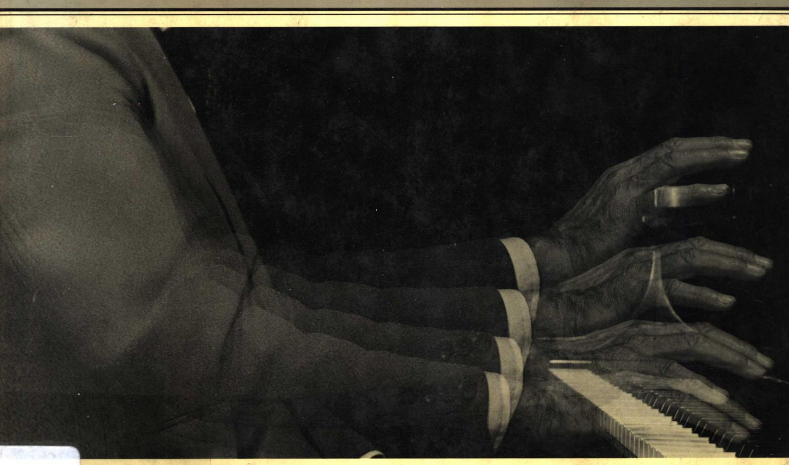

Motion, Sound and Expression

总登记号: 300487

分类号: H5.3

作者: Sandor, G.

On Piano Playing is Gyorgy Sandor's complete, practical program for developing the physical skills essential to accomplished playing. Tested by years of distinguished performing and teaching, Sandor's methods will help any pianist build coordination and flexibility—and master the totality of playing by fusing technique to interpretation. Rich in musical examples and illustrated with photos and drawings, On Piano Playing covers:

## The Determining Factors in Piano Technique

Music, Motions and Emotions • The Piano • The Human Performing Mechanism

## **Basic Technical Patterns**

Free Fall • Five Fingers, Scales and Arpeggios • Rotation • Staccato • Thrust

## Technique Becomes Music

Identification and Application of the Basic Technical Patterns
• Independence and Interdependence • The Pedals • Singing

Tone • Practicing • Memorization • Musical Diction

• Public Performance • Mannerisms and Excess Energy

## On Piano Playing

Motion, Sound and Expression

**Gyorgy Sandor** 

Schirmer Books A Division of Macmillan Publishing Co., Inc. NEW YORK

> Collier Macmillan Publishers LONDON

### Copyright © 1981 by Schirmer Books A Division of Macmillan Publishing Co., Inc.

All rights reserved. No part of this book may be reproduced or transmitted in any form or by any means, electronic or mechanical, including photocopying, recording, or by any information storage and retrieval system, without permission in writing from the Publisher.

Schirmer Books A Division of Macmillan Publishing Co., Inc. 866 Third Avenue, New York, N.Y. 10022

Collier Macmillan Canada, Ltd.

Library of Congress Catalog Card Number: 80-5442

Printed in the United States of America

printing number

4 5 6 7 8 9 10

Library of Congress Cataloging in Publication Data

Sandor, Gyorgy
On Piano Playing

1. Piano--Instruction and study. I. Title. MT220.S19 786.3'041 80-5442 ISBN 0-02-872280-9 AACR2

## Preface

Purpose of this book

Since the introduction of the modern piano (approx. 1709), innumerable books have been written on piano technique; indeed, there are also quite a few books to be found on the keyboard technique of the piano's predecessors, the clavichord and the harpsichord. The purpose of my book is not to list and describe the content of these works or to give a bibliography on the subject. Rather, its aim is to clarify concepts of piano playing, describe and organize fundamental elements of technique, and indicate how to apply these elements in performance. In a broad sense, technique is the sum total of organized motions executed by the performer. These motions produce sounds that recreate the moods of the composer in the performer's own interpretation.

Technique: coordination of motions according to the characteristics of the piano Many intangibles are obviously involved in this process. Mood, interpretation, improvisation, inspiration, and creativity are terms that are hard to define. They are subject to discussion and to varying opinions and tastes. Technique, however, is a skill—a well-coordinated system of motions conditioned by the anatomy of the human body and the nature of the piano. Even the most complex technical activities can and should be comprehended by anyone who wishes to master them. They can be reduced to their components: motions executed by the fingers, hand, wrist, arm, and body—in fact, by the entire human anatomy. The coordination of this human mechanism is based on simple common-sense principles of physiology and the force of gravity. When you dance or when you play golf, ping-pong, tennis, the violin, or the piano, you are subject to these same conditions whether you know it or not. You might as well be aware of them!

Practicing must be conscious, not mechanical

It is not that awareness of these factors is essential to an artistic and inspired performance; in fact, quite the opposite is the case—creative processes are hardly conscious. But the preparation—the innumerable hours spent practicing—must be purposeful, not automatic and mechanical, and it must be consciously controlled by the mind.

Sustained muscular tension: the cause of fatigue, ailments, and poor tone production

All pianistic problems solved by a limited number of motion patterns and their combinations,

While we are practicing we must know what we are doing; otherwise we will waste most of our time. Some of us enjoy practicing for its own sake and are hardly aware of the enormous amounts of time consumed in the process. For the majority of us, it is reassuring to realize that our practice time can be drastically reduced by the conscious application of correct principles and that this kind of practicing produces the best results.

The spectacularly high incidence of ailments among pianists (fatigue, muscle pain, tendonitis, bursitis, and other temporary and chronic afflictions) is primarily the result of faulty practice habits, of excessive tensions, and of muscle-building exercises. These undesirable and troublesome symptoms result from the continuous abuse of our muscular system; they can and must be avoided. I must disagree with the many pianists who believe that muscular fatigue is inevitable when playing the Chopin Etude, opus 10 no. 1 or 2, the extended and rapid octave passages of such pieces as Chopin's Polonaise in A Flat, opus 53, or Liszt's "Les Funérailles." They attribute their fatigue to the weakness of their muscles, which, they contend, must be built up. Nothing can be further from the truth! The finer, smaller muscles of our forearms move our fingers and are responsible for precision work. When the stronger upper-arm, shoulder, and body muscles are properly activated, they assist the weaker muscles and prevent all causes of fatigue. Our task is to know how to coordinate and activate the stronger muscles within the entire apparatus and to acquire the habit of doing so whenever we play the piano. The purpose of practice is to establish the right habits, not to spend unnecessary hours with mechanical warming-up exercises. Technique must be based not on the strength and endurance of our muscles but rather on their optimal coordination.

Most books on piano playing have certain merits. Some of them, such as Rudolf Breithaupt's book *Die Grundlage der natürliche Klaviertechnik* (1925), were quite a revelation in their day. Others present valid observations on technique, interpretation, and performance practice. Still others are filled with impressive biological, chemical, and anatomical statistics and resemble nothing so much as scientific textbooks. Obviously all of these aspects must be considered in examining piano technique. But I believe that it is the totality of piano playing that must be understood and described and not just some of its components. In fact, a strict correlation exists between the visual patterns of the score and the technical formulas that we use to interpret them. We may go a step further and state that motion patterns produce and correspond to sonorities that reflect the varying moods of the music. It

Fundamentals explained in their respective chapters.

Technique: the mastery of motions. Motion and emotion to correspond.

Visual and motion patterns interrelated.

is these moods that we aim to evoke in the listener through our own interpretation. Therefore interpretation and technique are indivisible.

This categorical statement and many other principles set down in this book run the risk of seeming either simplistic and arbitrary or not quite clear. I hope you will have the patience to read the respective chapters in which they are explored and save your evaluation until you have read these descriptions. I assure you that I not only formulate principles and rules, but I also describe, explain, and justify them. When the technique of piano playing is reduced to its fundamentals, it turns out to be a skill that is rather uncomplicated and unproblematical, but it is nonetheless a composite one; that is, the individual motions of the fingers, hand, arm, and shoulder are very simple in scope and in function, but they all must be coordinated and synchronized. If any element fails to function, or if it does too much or too little, the entire apparatus is affected. If the playing mechanism malfunctions, tone, touch, phrasing, breathing, the shaping of the music, and the interpretation as a whole are adversely affected. Thus musicianship and technique are inseparable!

This book deals with the technique and art of piano playing. Technique precedes art, and therefore it must be discussed first. In our examination of technique we will be concerned with the human anatomy, sources of energy (muscles and the force of gravity), and the characteristics of the piano. While innumerable motions are involved in piano playing, we can identify them as variants of a very limited number of fundamental motions. These fundamental motion patterns will be properly defined, described, and differentiated; they will then be integrated into the composite activities that comprise piano playing. It will then be necessary for them to be related unequivocally to their counterparts in the score.

In music, as in any kinetic art (such as dancing, acting, or conducting), emotions are expressed by motions; although we are not suggesting that these motions be executed with even a hint of uniformity, we recognize certain fundamental ways in which the motions correspond to and reflect the emotions that generate them. To illustrate this point in a rather obvious way, a delicate, dreamy, and subtle passage in a Chopin nocturne or in a Debussy prelude should not be performed with angular or abrupt motions.

There is one respect in which this book may transcend similar books on piano playing. Here technique will be reduced to a handful of fundamental motions and patterns, the combinations and variants of which form the entire scope of technique. What is of greater importance, however, is that the reader will discover that the types of motion

patterns to be used are indicated by the written score and will have to be identified by him. As we will see, visual features of the music (for example, phrasing, intervallic patterns, dynamics, and the location of notes on the keyboard) have their equivalents in the appropriate motion patterns.

The art of technique

These motion patterns by no means limit the freedom a performer seeks in his interpretations; instead they serve as guidelines in the choice of technical solutions. The art of piano technique begins at the point where technical problems have already been resolved and where a sophisticated technique serves the creative purposes of the interpreter.

## Table of Contents
- [[#Preface]]
- [[#PART ONE: The Determining Factors in Piano Technique]]
  - [[#1 Music, Motions and Emotions]]
  - [[#2 The Piano]]
  - [[#3 The Human Performing Mechanism]]
- [[#PART TWO: Basic Technical Patterns]]
  - [[#4 Free Fall]]
  - [[#5 Five-Fingers, Scales, and Arpeggios]]
  - [[#6 Rotation]]
- [[#PART THREE: Technique Becomes Music]]
  - [[#7 Staccato]]
  - [[#8 Thrust]]
  - [[#9 Summary of the Basic Technical Patterns]]
  - [[#10 Identification and Application of the Basic Technical Patterns]]
  - [[#11 Independence and Interdependence]]
  - [[#12 The Pedals]]
  - [[#13 Singing Tone]]
  - [[#14 Practicing]]
  - [[#15 Memorization]]
  - [[#16 Musical Diction]]
  - [[#17 Public Performance]]
  - [[#18 Mannerisms and Excess Energy]]
- [[#Index]]

# PART ONE: The Determining Factors in Piano Technique


**CHAPTER** 

## 1 Music, Motions and Emotions

Music begins with modification of pitch, volume, timbre, and duration of sound.

The human ear responds to sounds and noises within a limited range of pitch and volume. We cannot hear sounds above or below certain pitches-namely, above 25,000 and below 20 vibrations per second, approximately. Nor can the ear distinguish extremely soft or loud sounds. As to music, I would not attempt to formulate a precise definition, but I'd be satisfied to live with the assumption that sound alone, without variation in pitch, timbre, or intensity is not music. Not unless we have a certain modification in any or all of these characteristics will sound turn into music. The sound of a foghorn, of a stationary beep, or even of any one note played on the organ with unchanging volume and color does not impress one as music; what transforms sound into music is its alteration. The expressiveness of music depends on the degree and quality of change of pitch, color and volume. When a musical instrument produces variances in pitch, dynamics, or color, then we may have music. Although I will not elaborate further on this topic now, I would like to submit that it is the motions used to alter the sound that determine how sound changes, how music develops, and what it expresses. The manner in which a pianist attacks the keyboard, the way the violinist uses his bow arm and fingers, and the way singers and wind-instrument players control their breath determine the quality of the tone they produce. Their music is the result of the motions they employ. In other words, the subtleties of their sound production arise from the motions that created them.

That is why technique cannot be separated from music and why faulty technique results in faulty music. One must achieve a well-coordinated correct technique in order to produce a beautiful varied sound expressive of all the infinite shadings of human emotions. Yet the sound we produce does not always have to be beautiful—if we choose it not to be. We are dealing with the entire range of human emotions, and beautiful sensations and experiences are not the only feelings we wish to express.

Sound modifications reflect motions; motions reflect emotions. Just as motions and sounds are interrelated, so are motions and emotions. Sounds are the result of motions, and motions must correspond to emotions. Although emotional responses to music are individual, they should always manifest themselves in a manner that corresponds in degree and quality to the feelings of the composer. Obviously the mood that inspired Chopin to write some of his gentle, lovely nocturnes is not evoked by spastic, sudden, angular, or overtense motions. Nor should one respond to the tempestuous vehemence and ecstasy of a Scriabin etude with dreamy, subtle gestures. Whether repressed or not, the degree and intensity of a pianist's feelings are expressed by the motions of his physical organism; these motions are transmitted through the piano and generate the same responses in the listener.

Composer, performer, listener The chain of events is therefore established: we go from emotions to motions (technique) and from motions to sounds (music). The complete cycle in the creation of music is rather simple too: the emotions that prompt the composer to create his music are expressed by his music. When this music is notated, it becomes visible (musical score). The performer's role is to recreate the music (and the emotions that inspired its creator) in a manner that generates similar moods in the listener. The important link in this chain is technique—the motions employed by the performer to recreate the music. Under ideal circumstances, the listener's emotions are evoked by music played by the performer, whose mood and emotions reflect those of the composer. The performer's competence hinges on whether or not he interprets the written text according to the composer's indications and whether his technique (motions) corresponds to the emotional content of these indications.

This explanation may seem repetitious to some; to others it may seem like an oversimplification of a rather complex and subtle procedure. What I am trying to describe is the sequence of the composer's, performer's, and listener's roles in creating, recreating, and responding to music. I do so to call attention to a fundamentally important factor: the written image of music (the notes) indicates with unequivocal clarity the type of motions (technique) to be employed in the process of performing the music. The notated score establishes an absolutely clear connection between emotions and motions. One will find in the visible image of the music the corresponding motion patterns that provide the technical solution for any particular passage.

One must simply organize the innumerable movements of the human body into a few clearly defined fundamental motion patterns, which form the essence of technique, and identify these with the visual patterns of the music itself. It is easy to do so because the human anatomy is basically the same all over the world and has been so from

Limited number of fundamental motion patterns

Practicing: the establishment of habits through conscious repetition

Coordination

Don't build muscles; coordinate them,

time immemorial, certainly so since the invention of the piano. Given this uniformity, it is possible for us to establish human motion patterns that are basic to piano playing. Yet there is a welcome and limitless variety within this uniformity: the size, weight, and proportions of the components within the body are different for each individual. This variety in body types provides an unlimited variety of movements within these fundamental motion patterns. Thus every individual can produce his own distinctive sound—his own tonal palette of touch and color—when playing the piano.

The descriptions and groupings of these basic motion patterns are provided in the appropriate chapters. In order to develop a good technique the student and performer must learn and master these motion patterns—that is, he must make them an innate part of his physical movements. After he determines the specific motion pattern required from the score, he then applies it to the music. The practicing of technique is nothing other than the process of assimilating motion patterns through repetition. If these motions are executed correctly and consciously, relatively few repetitions will suffice. Practice methods will be discussed more fully in chapter fourteen; for now I'd like to suggest that once our motion habits have been correctly and firmly acquired, a need to practice technique no longer exists. All we need to do then is to apply these motion patterns to our repertory. Our technique continues to improve, and it becomes an obedient tool in our search for musical interpretation.

Let us assume that most people who study music and are practicing musicians were born with a certain degree of coordination. The innate coordination of the human body enables us to survive, to function in our daily life, to move about, and to respond to challenges. If our coordination is properly developed, it may enable us to achieve peak accomplishments. Breaking world records in swimming, running, or pole vaulting and developing an exceptionally brilliant and expressive technique as a pianist or violinist are matters of coordination of the highest order. Besides training their coordination skills athletes must also build endurance and muscular strength, but musicians only need to develop coordination. We do not build strong muscles; instead we learn to activate the ones that are already strong and to use them in collaboration with the weaker ones in order to help them. Using the strong muscles to help the weaker ones is the essence of coordination, and this kind of skill is what we must put in the service of art. Tempting as it may be for some, music and practicing need not be regarded as athletic activity.

There are many ways to practice this coordination—this interdependence of the entire body. Practicing to develop independence of the fingers from one another has its merits too, but we should be

Interdependence vs. independence

Practicing, not performing, is our present concern.

Volume of sound contingent upon speed of hammer

careful in its application. As a rule these exercises abuse the forearm muscles by fixing and forcing them; they are based on the erroneous idea that our forearm muscles become tired because they are weak and therefore have to be strengthened by exercises. In fact, they become tired because they are being abused! What we may possibly gain in independence of the fingers, we will lose by disrupting the interdependence of the entire apparatus. Actually, nothing is gained, as I will explain in chapter eleven. Now I will simply say that finger exercises are useful only if they serve to create interdependence. By consistently placing the arm in the correct position for each and every finger. we relieve strain and avoid the overall fixed position that causes strain. The aim is not to strengthen muscles but to learn to synchronize them in the most effortless way. Any strain you feel in the arm is a sure warning that the muscles have been abused and are calling for help. We have mentioned some of the ailments (tendonitis, ganglia, bursitis) that result from faulty practice habits, continuous abuse of the muscles, forcing and fixing the joints, and extended pressure on the keys.

Our main concern now is not the unsuccessful performances that result from these wrongs, but all the damage caused during the countless hours, weeks, and years spent practicing. How much discomfort and suffering we must put up with! They can and must be avoided, especially since pianists have an enormous repertoire to cope with, larger than any other instrumentalist, and cannot afford to waste time and energy on wrong practice habits. With all the frustrations of strenuous practicing, many pianists become either discouraged or obsessive about proving themselves and will make a virtue of punishing themselves in the name of Art. It is for this reason that many people measure the quality, depth, and value of art by the amount of suffering poured into it. My apologies for sounding glib, but I wish merely to make the point that the mechanics of piano playing ought to be completely painless, enjoyable, and gratifying whether one practices or concertizes.

Our observations about the correct functioning of the human anatomy must be related to the characteristics of the piano itself. As we know, the sound of the piano is produced by hammers striking strings. The volume of the sound depends exclusively on the speed with which the hammer hits the string. It is important to realize this mechanical fact, since many confusing things have been said about weight, mass, force, strength, pressure, and, last but not least, about relaxation. The old school of piano playing emphasized "finger" strength. While this kind of technique sufficed for the harpsichord, clavichord, and organ, it became completely unsatisfactory for the modern concert grand piano. The strain on the muscles was such that a new approach had to be developed, and that new approach was

Relaxation?

Sources of energy: force of gravity and the muscles

Position of equipment when activated

Pressure?

called weight technique. By using weight instead of force, considerable relief was felt in the abused muscles: thus appeared the school of relaxation. Unfortunately, although this method became very popular, it wasn't satisfactory either. Use of weight in itself merely achieved a relatively comfortable sensation in the arm and body, compared to the tenseness inherent in the old technique. However, the "relaxed" muscles now tended to play sloppily, unevenly, and inaccurately, and they could not be controlled like the tense muscles. It should be obvious that there is no such thing as complete relaxation during piano playing: some of the muscles work some of the time, others relax, and one must identify those that are to be activated.

I have mentioned before that volume of sound is contingent on hammer speed. In order to mobilize the playing apparatus and generate the desired speed in the hammers, there are no other but two sources of energy available: the force of gravity, which pulls everything down toward the center of the earth, and muscular energy, or the force of our own muscles, which pulls the finger and the arm toward the affixed portion of the contracting muscles. These forces, and their combinations, provide all the sources of energy available to activate the entire playing equipment. The force of gravity helps immeasurably if the mass of the playing equipment is exposed to it judiciously. Most of the time, it is the participation of both energy sources that provides the optimal solution. Our aim is to achieve the greatest results with the least expenditure of energy. It will be up to us to determine when to utilize the force of gravity exclusively, when to use muscular energy exclusively, and when and how to combine both. Total relaxation is nonexistent in piano playing. Even when we rely purely on the force of gravity, we must use the necessary muscular equipment to lift and place the arm and hand in their proper positions. Most motions are executed by antagonistic sets of muscles: while one group (for example, the flexors) works, the other group (extensors) relaxes. Partial relaxation alternates with muscular activity at all times; complete relaxation exists only if we lie down and rest.

Our task is to determine what the position of the various components of the playing apparatus should be at activation, what groups of muscles should be activated, and how these muscles should function in order to achieve optimum results both technically and musically. What we seek is the maximum expression with the least expenditure of physical energy. One should not mistakenly equate inner intensity with continuous muscular tension, nor cultivate inner tension by stimulation of muscular activities (pressing the keys).

We must remember that once the piano's hammer strikes, we cannot alter the sound by any subsequent activity. Pressure and extended leaning on the keys (a futile throwback to the *Bebung* of the clavi-

Weight: of value only when set into motion

Stress alters respiration and phrasing.

Tone quality: essential in performance

chord) may create the illusion that the sound is altered, but its effect is only visual; all this pressure will only hinder the attack on the following note. The string player's technique includes pressure, the pianist's does not. If pressure is used on the piano, it must be used only instantaneously, at the moment of impact, never extendedly!

Weight alone is also of little use, unless it is set in motion. Even if a ton of weight is applied to the key, it does not produce a sound unless it moves downward with a certain speed. It is speed that generates sound, not weight; therefore let us use as little weight as possible when generating speed. Muscular force is of use only in generating speed in the hammers, not as energy spent statically. The simultaneous and extended activation of an antagonistic set of muscles (for example, the flexors and extensors of the forearm or the biceps and triceps of the upper arm) is unproductive, and in spite of a vigorous feeling of energy and tension in the arm, it is totally superfluous and therefore should be avoided. All it causes is immobility and stiffness, which ultimately result in a poor sound. The inescapable conclusion is that technique must concern itself with setting the hammers in motion, using the force of gravity, and expending a minimal and efficient amount of our own muscular energy. A maximum fortissimo as well as the lightest pianissimo can be produced by these procedures in a completely effortless manner.

One cannot emphasize too strongly the fact that music and technique are indivisible. The human organism is affected by and responds to stress and soothing: one's breathing, pulse, metabolism will also accelerate or decrease according to emotions and musical experiences. This is inevitable, even desirable. And, if the human organism is under stress for purely physical reasons (overtense muscles, a depressed diaphragm or off-balance sitting), forced and unsatisfactory breathing results. This altered respiration affects musical phrasing and the shaping of melodic lines, not only while playing under stress in public, but at all times. A malfunctioning apparatus affects phrasing, tone production, dynamics, rubatos, accents, tempo changes, and expression—almost everything that is vital to music. Rapid and short breathing generates a hectic mood, and, in general, melodic and rhythmic distortions are caused by excessive muscular contractions in and around the respiratory system. Stiff muscles and joints cause a hard sound, while excessively soft ones produce a pale, anemic sound.

Although the piano is far less responsive and sensitive than string instruments (not to mention the human voice), it does nevertheless respond to one's technique, and it produces sounds accordingly. In the last analysis, it is tone quality—the sound—that is the most essential artistic ingredient in the world of music. Every artist has a touch

and timbre that we can recognize as his own. Certainly one can identify the sound of Horowitz or Rostropovich in a live performance, and this sound may even be evident on a recording, in spite of the ultra-homogenizing effects of electronic reproduction. It is unfortunate that the piano (especially the lower-quality instruments) has a rather prefabricated sound. But if we succeed in cultivating tone quality through a well-coordinated and natural technique, we will realize that we are the fortunate possessors of a miraculously expressive and complete instrument, one that is capable of every shading. Pianists are doubly blessed because they have the possibility of using this technique in the service of a fabulous repertoire.

## 2 The Piano

The piano: the most complete instrument

As a solo instrument, the modern piano is second to none. Even if its expressive qualities don't match those of some of the string instruments or of the human voice, its range of pitch, dynamics, and coloring makes it the most complete instrument. Because of its harmonic capabilities and its range, all other solo instruments enlist its services most of the time. Seldom do composers write for any other instrument alone, without the accompaniment of the piano. Its repertoire is enormous, composed for it during the past two hundred years or so. Not all of this music is of the best quality, of course, but many of the greatest composers overwhelmingly favored the piano to other solo instruments.

Its forerunners: harpsichord and clavichord

Of the piano's predecessors, the clavichord is the closest to it. The clavichord produces a sound that can vary in dynamic level and color according to the player's touch. The volume of the clavichord, however, is minimal and unsuitable for most concert halls today. The piano has maintained and developed the first two characteristics of the clavichord (its ability to vary dynamics and color), but in addition its volume has grown considerably. The harpsichord cannot produce gradations of volume and color by touch, only by mechanical manipulation, but it has much more volume than the clavichord and can double, triple, and quadruple its notes by using added sets of strings, thereby producing a wider variety of sound. The piano has all the expressiveness of the clavichord and can be louder than the harpsichord, but it lacks the mechanical couplings of the latter instrument. However, with its great pitch span and its ability to vary dynamics and tone color, the piano is unsurpassed.\*

<sup>\*</sup> There is one instrument that surpasses the piano. It is the Moór-Duplex piano, a double-keyboard piano that was invented by Emanuel Moór during the first quarter of this century. Unfortunately it has been totally ignored since World War II. It has the same sound and coloring possibilities as the ordinary piano, but it also has an upper octave-coupling device (middle pedal). Its upper keyboard sounds an octave higher and by the simultaneous use of both keyboards by the same hands, the reach of the hands is twice that of the normal piano! Also, a chromatic glissando can be played on the lower keyboard (in octaves, too, when the coupling

Compositional devices: arpeggios, tremolos, and others

**Ornaments** 

Transcriptions

With all its wealth of sound, the piano still has certain limiting characteristics; for example, its sound fades rapidly. Composers have compensated for this deficiency by developing styles that are typically pianistic, or rather "keyboardistic," since the harpsichord and clavichord also suffer from the same limitation. Since the duration of any one note is extremely short on these keyboard instruments, the continuity in the sound has to be supplemented by trills, tremolos, repeated notes, arpeggios, filling notes, passage-work, and pedaling. These devices are used both in sustained melodies and in accompanying passages in practically all periods and styles.

Another device, the ornament, was thoroughly explored and utilized on instruments like the harpsichord and the organ. Since these instruments cannot emphasize individual notes within any one given tone color and register, the only way to accent an important note is to add a dissonance to it. Grace notes, mordents, and trills contain dissonant neighboring notes. These widely used instruments made the ornaments very popular during the Baroque period, and their indiscriminate use spread to other keyboard instruments, especially to the clavichord and the piano. These instruments are fully capable of accentuating, coloring, and emphasizing any note. Therefore it is not necessary to resort to certain ornaments on them.

When Bach wrote for the violin or for voice, he seldom used mordents or prallers. However, when he transcribed string music for the keyboard (as in the first movement of the Sonata for Unaccompanied Violin in C Major or the entire Partita for Unaccompanied Violin in A Minor), he added a number of these ornaments for emphasis. (It is

Example 1. Bach, Sonata in C for Solo Violin, first movement

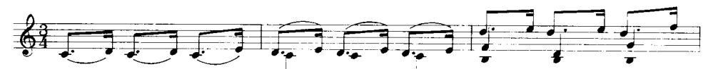

Example 2. Bach, Sonata in C for Solo Violin, transcribed, in G, for keyboard

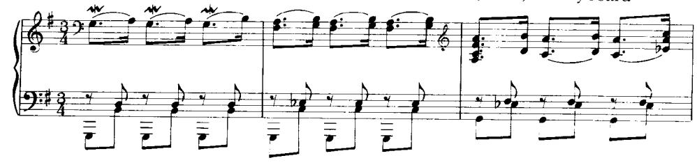

pedal is activated), since the white keys are elevated to the level of the black ones where adjacent to the upper keyboard. The technique of the Moór piano is essentially the same as of the normal piano, but can be expanded spectacularly. For composers it has unlimited possibilities. One can only hope that the Moór piano is merely dormant and not extinct!

Ornamentation varies with the instrument.

interesting that he used the key of G major for his keyboard version of a C major composition on the violin, and D minor for the A minor Partita.) It is also noteworthy that Baroque composers very seldom specified whether their keyboard music was for the clavichord, the harpsichord, or the organ. For example, two of the best known "organ" compositions by Bach, the *Passacaglia in C Minor* and the *Fantasy and Fugue in G Minor*, were originally conceived for the two-keyboard and pedal harpsichord; only later were they adopted by organists. The practice of interchanging instruments was always very common in the past.

Since the choice of instruments was mostly a matter of opportunity and convenience and since all of these instruments were strikingly different in terms of their tone quality and technique, it is evident that devices like ornamentation should be used according to the needs and characteristics of each instrument. Common sense dictates much less ornamentation on the piano and on the clavichord than on the harpsichord and the organ. Also the type of ornament should be selected according to the instrument. When a melody begins at the same time as its accompaniment on the harpsichord or the organ, one simply cannot hear the melody because it is one of the overtones of the bass note and it is impossible to play it louder or differently. Therefore a mordent or grace note is used in order to call attention to it. In the case of the clavichord or the piano, the melody can be played loudersimply by playing it louder! Therefore the mordent is often not necessary. Furthermore, the ground rule that we know so well about trills and ornaments to start on the upper note in the Baroque and early Classical periods needs reconsideration. This rule was necessitated by the condition mentioned above—that of the inaudibility of the main note when it was played at the same time as the bass. In the first place, there is no need for the mordent on the piano, because you can emphasize the desired note; then if you still wish to affix the ornament, it doesn't make any difference whether you start it on the upper note or the main note. You might as well emphasize the main note by an accent or by a difference in shading, since the piano can do this easily. The validity of all the treatises and articles written about ornamentation is highly debatable when they are applied to the piano. To support the above argument, examine the beginnings of melodies by Bach for strings, winds, and voice to see whether they start with a mordent or with the main note. No matter how slow the piece is, you will not find a single work that begins with an ornament. On the other hand, look at the first notes of the melodies of the second movement of the Italian Concerto, the Adagio of the Organ Toccata in C Major, and the Toccata and Fugue in D Minor: all of them begin with some kind

The span of the hand: a limiting factor

of ornament, because they were written for Baroque keyboard instruments. When these pieces are played on the harpsichord or organ, ornamentation should be applied, but it is not absolutely necessary when the piano or clavichord is used.

Another limiting factor on use of the piano, in addition to the rapid decay of its sound, is the limited span of the human hand. Since its reach usually includes nine or ten notes at the most, most broad orchestral chords must be arpeggiated. This condition helped to develop compositional styles that turned this disadvantage into an asset. Just think of the Chopin *Etude*, opus 10 no. 1, or his arpeggio etude in E flat, opus 25 no. 12, or the opening of the second movement of the Schumann *Fantasy*, opus 17. Innumerable works are based on runs and passage-work that present and enhance broad harmonic progressions. The limitations of the hand also created another condition. Composers were obliged to choose only from the notes that were reachable. Instead of selecting notes within the overtone series, as they did for works for orchestra and string quartet, they usually selected four notes for the top and four for the bottom register.

Example 3. Chord for piano and orchestra

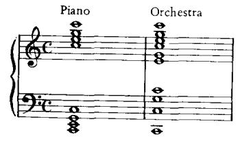

Of course, the piano chord doesn't sound as good as the orchestral chord: the four notes in the bass are too thick, there is nothing in the middle register, and the top notes are too shrill or thin. We have become used to these sonorities by now (we have no choice), but if we wanted a fuller, rounder, and more beautiful sonority, we would need either a third hand or another instrument like the Moór-Duplex piano. Beethoven and other composers often employed pedal effects and shifts of register to compensate for this limitation. And again, this condition gave rise to a number of compositional problems in piano writing.

When we examine certain aspects of piano playing, we find that many difficulties can be overcome if we are aware of the obvious fact that the black keys are about two inches farther away from us and about half an inch higher than the white keys. In order for the hand to play on black keys with the same ease as on white keys, the upper

Black keys, white keys: shifting arm positions Piano sound: volume and tone quality arm, the wrist, and even the body must be shifted slightly. When one plays on black keys, the upper arm (elbow) should move slightly forward and up in order to create a wrist position that is exactly the same as it is when one plays on white keys. (For a more detailed discussion of the white and black keys, see chapter five.)

The sound of the piano is produced when the hammer strikes the strings and thereby brings them into vibration; thus the substance, quality, hardness or softness, elasticity, and the state of humidity of the surface of the hammer (which is covered with felt) influence the tone quality. If these conditions are satisfactory, we are able to modify the dynamic level and tone quality by altering the speed with which the hammer strikes the strings. All our concern with matters of weight, mass, force, strength, tension, relaxation, fixed positions, muscles, nerves, joints, bones, shoulders, arms, hands, and fingers is related to the skill and technique required to set these hammers in motion with the proper speed in order to produce the desired piano sound.

While everyone agrees about the piano's capability to vary dynamics from triple piano to triple forte, its ability to vary tone color is a topic that is quite controversial. It has been "proven" by some "experts" that it is only the volume of the sound that can be altered and that altering tone quality is purely a matter of imagination. This may be true in playing one single note, but a series of sounds in sequence is quite another matter: touch and tone quality are most personal things, and they are clearly recognizable. Even if they are hard to define, the difference in tone qualities among certain artists undoubtedly exists and is not imagined. Perhaps it is caused by the rate of acceleration of the speed of the hammers; perhaps it is the way the damper stops the sound when it descends on the strings; perhaps it is the spacing of notes, the agogic qualities of the playing, or the flexibility of metric units-these and many other factors may influence tone quality. But differences do exist! There can be no argument that the piano sounds different when Horowitz, Richter, Michelangeli, or Argerich play it. Also of great importance is the way the particular instrument we are playing responds to touch. There are many pianos that have a rather pleasant but "ready-made" sound. They respond only to quantitative changes of dynamics and not to different shadings of touch, to the reflexes of the performer. It would be most beneficial if all pianists could do all their practicing, not just performing, on instruments that were sensitive enough to respond to shadings of color as well as to dynamics.

Speaking of dynamics, we must realize that the piano, like any other musical instrument, is limited in the amount of sound it can produce and in the responsiveness of its mechanism. It might not be as sensitive as the human voice, which simply cracks when forced. But

Limits to the response of the piano

Spirituality not found in excessive muscular tension.

if the piano is hit hard—if it is beaten by a stiff, rigid equipment—its volume and carrying power will be impaired and its sound will become hard and hollow. Forcing only spoils the sound. Under no circumstances must one exert oneself when playing fortissimo! Although the piano can produce a tremendous volume, its maximum sonorities will come about not when the maximum amount of energy is used, but when the limits of elasticity in its mechanism are arrived at but not surpassed. If one reaches the limit of elasticity in the felt, wood, and metal, and employs the minimum effort to achieve this limit, one gets the crashing fortissimos that may be the real climactic moments of a performance.

The lowest level of sonority, the pianissimo, must also be totally effortless in its production. It is really amazing how many pianists cultivate extreme strain and tension when they play softly. Gritting their teeth and breathing heavily, they expend enough energy to lift the piano, even though they are playing a gentle, soft little melody. Maybe they have the idea that control can be best achieved by tensing up various sets of antagonistic muscles simultaneously. Instead of using soft equipment and minimum muscular activity, they tighten up. Worst of all, this extreme state of muscular tension is supposed to represent a state of sublime "spiritual" exaltation, when in reality we are witnessing the consequences of excessive discharges of the thyroid and adrenal glands. Mind you, there is nothing wrong with glandular responses to the stimuli of music, but the question is when, where, and how much? In any case, if we are going to produce soft sounds, our joints and muscles must be resilient, and they must contract and fixate gently. We'll discuss this further in chapter thirteen.

Let us not equate inner intensity with stiff muscles. It is quite fashionable nowadays to overproject and overintensify musical performances. This is understandable when one considers the enormous size of concert halls, the vast open-air spaces where outdoor concerts are given, and the huge size of concert audiences, who may not be familiar with the repertoire. There are many pressures on pianists to impress audiences instantaneously. However most music suffers by overselling. Music should be narrated, sung, and sometimes even whispered and hummed; seldom should it be shouted or screamed.

**CHAPTER** 

## 3 The Human Performing Mechanism

Characteristics of the human equipment

Before we confront the many challenges of artistic problems—the matters of interpretative, creative, and improvisatory elements in music—we must investigate a much more tangible and equally essential area. I refer to the playing mechanism—the individual components and the totality of the human body that participate in creating musical sounds. In order to establish the technical formulas that serve to make music, we must examine the mechanism itself—the individual parts, characteristics, and actions of the human apparatus. We need not make a complete anatomic survey of every particle of the human body, but we do need an elementary knowledge of the equipment we constantly use. While art is a matter of unpredictables (inspiration, instinct, and improvisation), technique is a skill that one must develop intelligently, effectively, and without abusing the participating mechanism. Our muscles, joints, nervous system, and breathing mechanism function at their best when we know how to put them to good use. The same is true of any mechanism—your bicycle, typewriter, or car. It is true that you don't need to know much about them when they work satisfactorily—you simply use them. But if they get out of order, or if you want them to function beyond their obvious capabilities, you'd better know them quite thoroughly. We all reach a certain level of playing by just "doing what comes naturally." But when you reach the limit of a purely instinctive activity (the limit may be extremely low or high; it depends on your talents), if all you do is practice mechanically, you won't make much progress. You must know how to practice intelligently.

Coordination, not muscle building; small muscles for precision, larger muscles for assisting

As I mentioned before, piano playing is not a matter of muscular strength and endurance. We have a rather complex set of muscles at our command. Some of these muscles are small and weak, made for precision work, others are strong and powerful. If we can activate these larger muscles properly, we do not need to strengthen the weaker ones. We must learn the kind of coordination that enables us to put to use the necessary equipment and to play without any trace of

Children and short people coordinate better.

Instinctive coordination

Activation of stronger muscles

fatigue, no matter how demanding and difficult the passages we must perform.

Every normal living thing is born with the degree of coordination it needs to function within its environment and to survive. After only a few months, infants develop this quality remarkably well. In general, it is possible that children have even better coordination than adults, as a result of their small stature. Shorter people, too, are often better coordinated than tall ones. They move more effectively and with greater agility and ease.

Some of the most outstanding virtuosos were short and had small hands; Godowsky, Hofmann, and Friedman, just to name a few, were great artists who were of small stature. Obviously, tall people can also be great pianists, but it is well known that some child prodigies possess a miraculous ability to coordinate, and thus they are able to perform the most demanding and seemingly strenuous technical feats with the greatest ease.

I mention this because it seems clear that when a child begins his musical studies, he usually possesses a considerable amount of innate coordination. If a teacher can take good advantage of this and doesn't interfere with it, he can shape a much better and happier pianist. When a child plays loudly, he instinctively throws his whole arm and body into action, and most likely he plays without any effort. I am not sure this is the case with advanced pianists, with grown-ups! Many of them are constrained because of their practice habits, and they are often handicapped by all kinds of inhibiting ideas. Very often their main concern is how to regain the innate coordination that they lost on their way to becoming advanced pianists. The most common cause for this loss of coordination is an overuse of drills designed to make the fingers independent and to strengthen the weak "wrist" muscles. Many adult pianists were required to suffer through finger exercises in order to develop "strong muscles." They gained a certain degree of finger independence at the expense of interdependence and coordination. Often psychological factors also inhibit performers. For now, however, let us concentrate on the purely technical aspects of piano playing. Independence of the fingers is essential; but instead of trying to acquire it by forced and muscle-stiffening exercises, our fundamental approach to technical solutions is to search for the correct positions in which the right equipment helps the fingers work independently and provides them with the power they need. This approach seems to be the most sensible way to avoid forcing and fatigue in the forearm muscles that move the fingers and to produce a good tone.

When the larger muscles are mobilized, the effort required to play the piano will be distributed in such a way that the necessary expenditure of energy will hardly be felt or seen. May I emphasize here that Distribution and reduction of motions

Avoid stiffness rather than remedy it by relaxation

Understand the total equipment; use only the necessary equipment.

Muscles

Warning; consequences of unheeded warning this extreme reduction of energy must not be mistaken for "relaxation." It is a simple matter of utilizing muscles so expeditiously that hardly any effort need be used. As mentioned previously, total relaxation when playing the piano doesn't exist, since even the raising of a finger or hand must activate some muscles. Relative relaxation may be felt because most of the muscles are making no effort; the ones that work can handle their chores easily since they are being helped by the stronger muscles.

Compared to finger exercising, with its resulting strained and stiff muscles, the large and loose motions of weight technique certainly must have felt enjoyable. The term *relaxation* (see Breithaupt) sounds alluring, but however pleasurable large and loose motions may be, they are not the solution for our technical problems. If we weren't so tense, we wouldn't need relaxation either as a remedy or as prevention. If we utilize the optimal combination of certain muscles, we will never become stiff and tense. We don't want to relax; we want to make music and to be involved in all its drama and emotions—but with no physical strain!

Our aim here is to identify and apply all the necessary motion patterns that are the tools for piano playing in order to play effortlessly and expressively without inflammation of muscles and tendons. We will learn all about active and passive motions and about the exact role of the fingers, hand, wrist, forearm, upper arm, and body. Since it is only the fingers that are in actual contact with the keys, all other activities will be geared and limited to the role of helping them. We don't execute motions for motions' sake. Instead of bogging down with strenuous fingerwork or with exaggerated, circular "relaxing" gestures, we will carefully select the appropriate motion patterns and activate the proper sets of muscles.

Before we describe these muscular activities, let us first examine how a muscle works. A muscle contracts voluntarily or involuntarily on orders from our nerve centers; when it contracts, it gets shorter and thicker. As it shortens, it pulls the portion of the anatomy to which its farther end is affixed toward its other point of attachment (figure 1). This is the only thing that a muscle can do: it can pull a limb or part of the body to which its tendon is attached toward itself. It can never return the pulled-in portion to its original position. This movement is made by the antagonistic muscle or by the force of gravity or by both. However, after the muscle has been contracted and put to work, it needs to return to its original shape in order to function again.

If it doesn't return to its original shape, it can respond to another nervous stimulus and contract still more, but it will be under strain. When this happens, fatigue sets in, in proportion to the degree of strain. This state of strain is the response the muscle uses to warn the

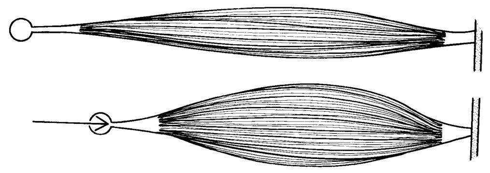

Figure 1. Muscle before and during contraction

nerve centers that help is needed. When help comes, the muscle can regain its original shape and go to work again. If help does not arrive, the muscle will work under greater strain and the warning signal will become more acute. Fatigue will increase; then stiffening, numbness, and more pain will occur; and in due time there will be chronic aches and inflammation of the tendons. Once tendonitis sets in, one must stop playing, sometimes for as long as three or four months or more.

Let us therefore remember that muscles need to return to their normal state after contraction; at this point the alternate (antagonistic) muscles should take over. This alternate activity ensures the needed relaxation of previously contracted muscles and enables the system to work continuously.

The forearm is the home of the muscles that move the fingers up and down. To raise the fingers we have a set of muscles on the upper (dorsal) side of the forearm called the extensor muscles. As long as these extensor muscles are contracted, the fingers stay up. If these muscles relax, the fingers come down with the partial help of the force of gravity. If we want to pull them down actively, we must contract a set of muscles on the lower (volar) side of the forearm called the flexor muscles. When this happens, the previously used (antagonistic) extensor muscles have a chance to relax and become slightly stretched. This relaxing and stretching enables them to be in perfect condition to contract again. In other words, the up-and-down motion of the fingers is executed by the antagonistic sets of extensor and flexor muscles that work and relax alternately. As long as antagonistic muscles work alternately, they can go on indefinitely! There are frequent occasions, however, when the antagonistic muscles have to contract simultaneously, but here the fixation must be instantaneous, not extended. If the contraction is extended, there will be excessive tension in the muscles. This undue strain must be avoided.\*

\* Within the framework of this book I don't believe it to be necessary to discuss the role of lactic

Flexors and extensors in the forearm lift and depress the fingers.

To move the forearm use the biceps and triceps; to move the upper arm use the shoulder and back muscles.

No muscle building

Range of activities: central area preferred To pull in the forearm, we activate the *biceps* and for the opposite motion we use the *triceps*. Both these muscles are located on the upper arm, and they are much stronger than the muscles of the forearm. To raise the upper arm we use some of the shoulder and back muscles. To direct the upper arm downward, the chest, back, and body muscles are activated. These muscles are among the strongest in the human body. By using all these strong muscles we can easily avoid fatigue. Once our coordination is right and there is no extended contraction of the antagonistic muscles, a practically unlimited source of muscular energy is available. I say "unlimited" because we are concerned with piano playing and not with breaking the world record in weight lifting or pull-ups. The frailest, thinnest human being has all the sources of energy he needs to play the most strenuous pianistic passages as loudly as possible. May I remind you that the resistance of the piano key is only about two or three ounces.

When we feel fatigue, we should deactivate the contracted muscles and utilize others; under no circumstances do we strain and "build up" the suffering muscles with torturous exercises. On the contrary, we don't want to desensitize our muscles—we want them to warn us when they are overworked and malfunctioning. We need these warning devices; they enable us to achieve closer and more successful coordination with our entire anatomy. I utterly disagree with the notion that muscle endurance has to be developed for playing the violin, piano, or any other musical instrument. Forcing muscles may be needed in athletics, where not only coordination but extreme strength and endurance are essential. In music, however, coordination is the name of the game; the strength that is already available in our muscles is sufficient, and we must consciously strive to conserve their sensitivitv. Whatever might be gained by forcing the muscles will prove to be costly. Not only will our coordination suffer, but so will tone production.

Now that we are familiar with the work of the muscle (pulling by contraction), with the role of antagonistic muscles (alternate activities of opposite muscles), and with their partial relaxation, let us examine the exact range of activities of the playing apparatus (that is, of the fingers, hand, forearm, upper arm, and shoulder). An understanding of this range is of great importance in determining why, how, and to what degree these components should be activated in order to achieve optimum results in both technique and interpretation. It is a definite advantage to remain within the central areas of the available ranges as much as possible and to avoid the extremes whenever possible.

acid in causing a sensation of tiredness in the contracted muscles. Our concerns are the mechanical causes and remedies of tiredness.

The fingers

Although each of the fingers is different in length and shape, four of them (the index finger, and the third, fourth, and fifth fingers) are similar in structure. However the thumb is different in structure as well as in length and shape. I call attention to this seemingly obvious fact simply because unevenness in scale and arpeggio playing is usually caused by the misuse of the thumb. The thumb needs special attention, and moreover it requires a different wrist, hand, and arm position than the other fingers (see chapter five for a fuller discussion of the thumb).

The thumb has two phalanxes, while all the other fingers have three each. The fingers are attached to the hand (*metacarpal*) bones, and four of these metacarpal bones (from the index to the fifth finger) are closely tied by ligaments. The thumb, however, is freely movable, as you can see in Figure 2. Again, the thumb is different.

Figure 2. Skeletal structure of the hand

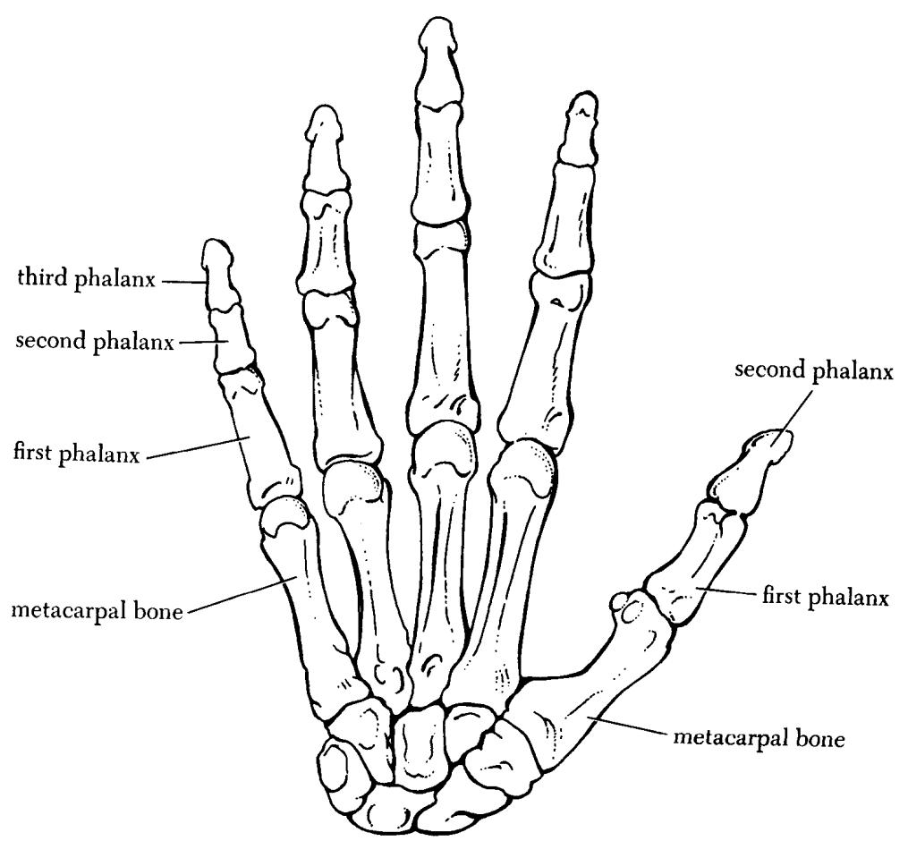

Horizontal arm adjustments

All vertical finger motions are executed by antagonistic muscles located on the forearm, as described before. Therefore a finger's position is correct only if it is placed as if it were an extension of its corresponding muscles; it will be moved in a direct line with these muscles too. This means that there must be a slight horizontal adjustment in the position of the arm for each finger. There can be no fixed wrist position for all five fingers unless they play simultaneously (that is, unless they play chords). To achieve the particular position that is optimal for each finger, the arm (including the wrist and hand) must be shifted continuously in the horizontal dimension. Figure 3 shows the central position of the arm and fingers. When the fingers are called into play, the horizontal shifts will be very small; otherwise the fingers will get out of line. We don't want to exaggerate the adjusting motion, since an unnecessarily large motion again causes friction and wastes energy within the tendons that move the finger.

The description of the equally important vertical adjusting motions is given in chapter five.

Before we examine the range of action of the fingers, I would like to describe the way in which the piano key is set in motion by the finger. The piano key moves up and down in a straight vertical line, except for the negligible curve, which is caused by the fulcrum. Therefore the position of the last phalanx of the finger should be as close to vertical as possible at landing on the key so that energy can be transferred in the most direct manner. Any slanted approach to the keys results in a certain detraction of energy, and the amount of energy wasted depends on the angle of the vertical component. Sometimes we intentionally slant our fingers on the keys in order to avoid an overly direct attack (espressivo playing).

Movement of the piano key: a vertical path

Figure 3. Central position of the arm and fingers

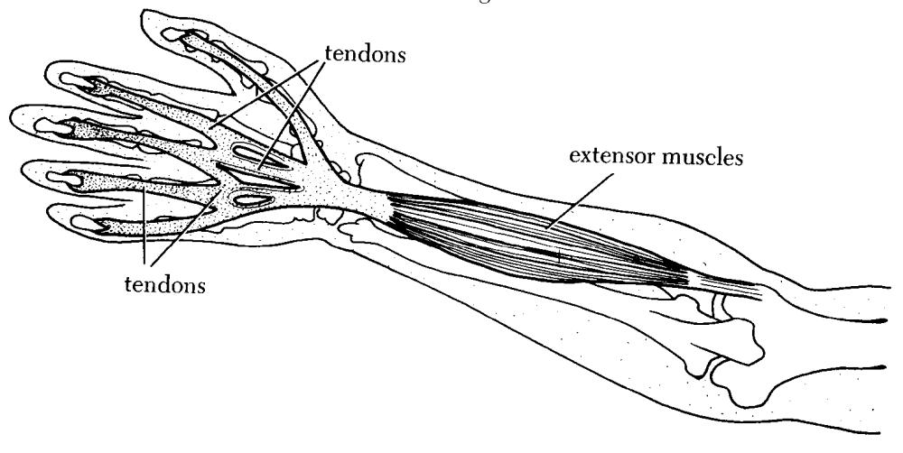

We know that the fingers, like the hand, arm, and the rest of the human anatomy, always move in a curved line because they are affixed to certain points of support; they act as the radius of a circle. Therefore we must modify the wrist position so that the last phalanx of the finger is able to approximate a perpendicular direction to the key. Each finger requires this adjustment, especially when we shift from white keys to black keys and from black keys to white keys.

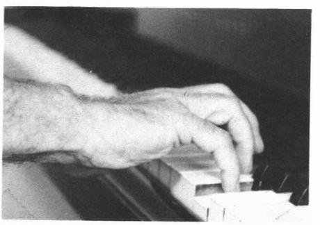

Figure 4. Correct position of the fifth finger; last phalanx placed vertically

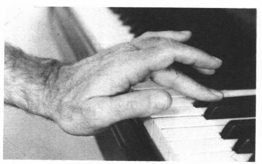

Figure 5. Incorrect position; third finger slanted, pulling outward

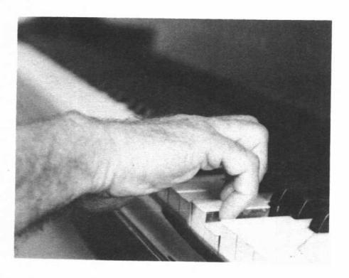

Figure 6. Incorrect position; fifth finger pulled in excessively, last phalanx slanted

Extreme and central ranges of the fingers, hand, and arm

Avoid fixed and extreme positions.

Figures 7 and 8 show the positions of the thumb and the other fingers in their extreme ranges; figures 9 through 13 illustrate other extreme ranges of the hand and the wrist. Somewhere in the middle of these extremes we find the central areas, where we can function comfortably and avoid any forced positions.

With the cooperation of the rest of the playing mechanism, we can accommodate practically any of the components and avoid strain.

Figures 9 through 11 show the extreme ranges of the wrist in the vertical, lateral, and circular directions. The dotted lines indicate the complete range, and the thick line shows the central area where the

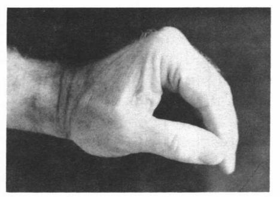

Figure 7. Extremely contracted thumb Figure 8. Extremely raised thumb and and finger position; comfortable area somewhat higher

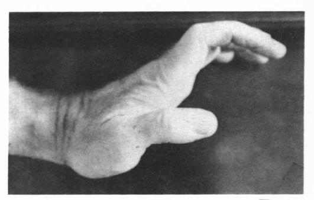

fingers; comfortable area somewhat lower

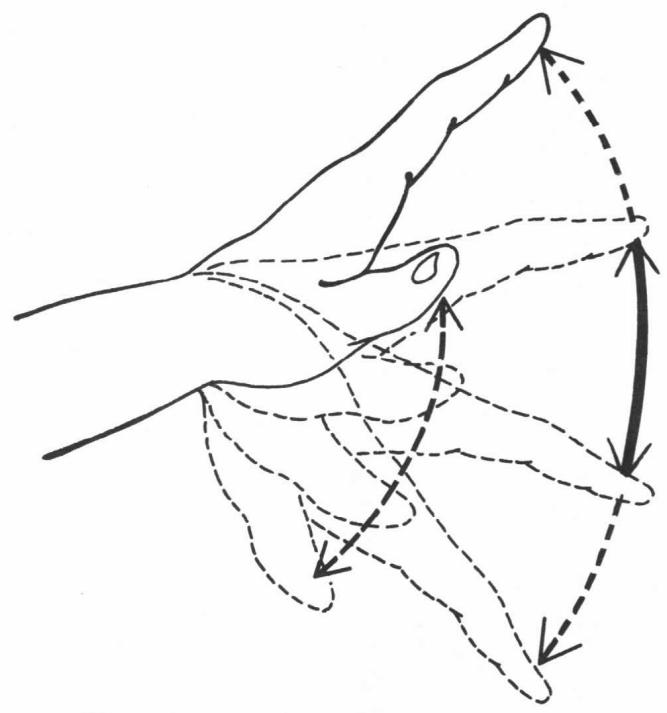

Figure 9. Vertical range of wrist and hand; central area marked

hand functions comfortably. Our aim is to bring the wrist, the fingers, and the arm within or close to these central areas, where they move with ease.

The horizontal motions of the fingers (open and closed position of the hand) are executed by muscles located on the hand. The fingers' vertical motions, as said before, are done by the antagonistic muscles of the forearm. None of these motions are done by "finger muscles" because nothing can move itself; the muscles that do the work are always found at the adjoining component of the human apparatus. The

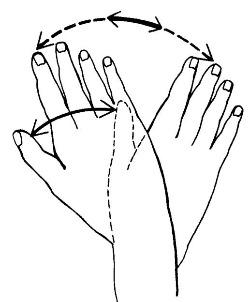

Figure 10. Lateral range of wrist and hand; central area marked

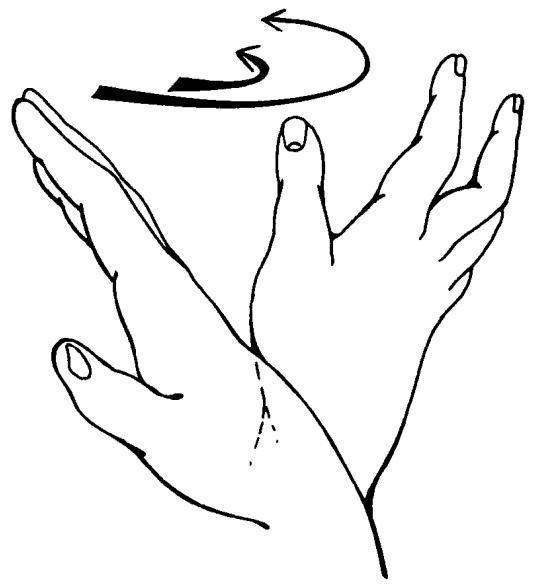

Figure 11. Circular range of wrist and hand; central area marked

hand is moved by the forearm muscles, the forearm by the upper-arm muscles, the upper arm by the back and chest muscles, etc. None of the muscles should stay extremely contracted for an extended time, and this is particularly important to observe when the hand is in a wide stretch. It will be necessary to permit the fingers to approximate their normal position as soon and as often as possible, even if one has

Listing of basic components and their motion capabilities: fingers, hand, forearm, upper arm, and shoulder only a split-second time to achieve this. This is the case with rapid staccato octaves too (see chapter seven).

With the help of the horizontal and vertical adjusting motions the fingers can avoid most extreme or fixed positions and operate within their central areas of activity. The rest of the playing mechanism is also helped by the respective adjusting motions of the adjacent members.

Let us give the exact listing of the capabilities of the various components that execute motions. These motions are described within the three dimensions—vertical, horizontal, and depth (depth refers to the plane from the back of the key to its edge). However, the combination of this limited number of motions provides an infinitely varied gamut of motions, sounds, and shadings of sounds!

The *fingers* can execute vertical and horizontal motions (see figures 7 and 8). They are moved by the flexor-extensor muscles of the forearm and by the abductor-adductor muscles of the hand. They can execute circular motions by combining the vertical and horizontal motions.

The *hand* can be moved vertically, horizontally, and circularly by the forearm muscles. It cannot execute rotary motions, which are the motions of the forearm (see figures 9, 10, and 11).

The *forearm* can be moved vertically by the upper-arm muscles (the biceps and triceps). With the help of muscles attached to the upper arm and forearm, it can rotate on its own axis by the pronation and supination of the ulna and radius. It cannot move laterally; this motion is made by the rotation of the upper arm.

The *upper arm* can move vertically, horizontally, and circularly as well as rotate with the help of the back, shoulder, and chest muscles. It is one of the most mobile members of the human body.

The *shoulder* can move vertically, forward and backward, and circularly. It seldom moves actively, but it supports and moves the entire arm.

Occasionally we refer to the position and motions of the trunk, in terms of the sideways, forward and backward, and rotational motions of the backbone. We also refer to the participation of the legs and feet in supporting and balancing the body and ensuring its stability, mobility, and equilibrium. Of course, the feet also manipulate the pedals. No discussion of the anatomy is complete without mention of the neck and head. However, their roles are negligible in piano playing, except that the head does all the thinking!

This list constitutes a complete inventory of the components used in piano playing and of all their possible motions. It shows that the number of ingredients is remarkably limited. However, with these motions and their combinations we can meet all pianistic demands.

They form the basic ingredients of our technique; we must know them and we must master them. The syntax of our technical language is composed of the various motion patterns that evolve from these motion components. We will combine them into synchronized activities of the fingers, hand, and arm. By understanding the basic motions clearly, how they are executed and what equipment is to be utilized, we can spot any malfunction and correct it immediately.

Curved lines result in straight vertical lines.

We have referred previously to the curved paths of every component and to the need of manipulating them in a manner that they result in a straight vertical line of the fingertip when landing on the keys. This is the optimal transference of speed to the vertically moving keys and hammers.

If we want the fingertips to descend in a straight vertical line, we must activate the upper arm. The fingers, hand, and forearm must be lifted with a simultaneous forward motion of the upper arm; when these components descend, we let the upper arm move back to its original position. The ultimate result of the four slight curves (finger, hand, forearm, and upper arm) will be a completely straight line at the fingertips, if the upper arm doesn't move too little or too much.

Figures 12 and 13 show the results of insufficient and excessive

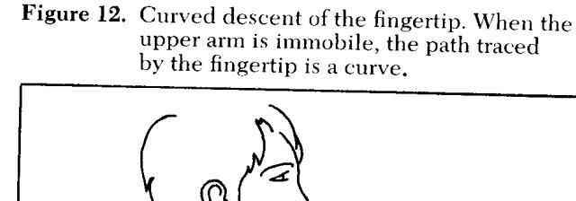

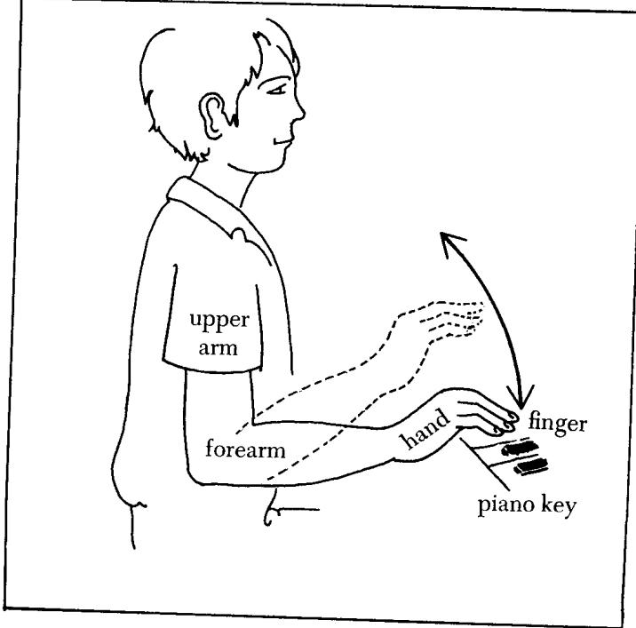

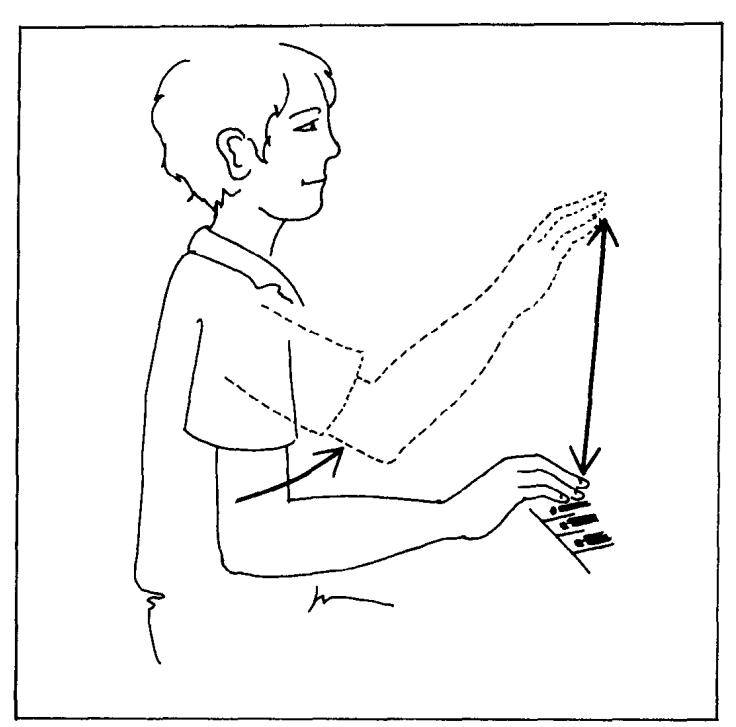

Figure 13. Slanted descent of the fingertip caused by excessive upper-arm motion

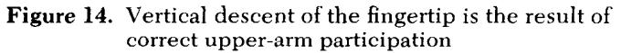

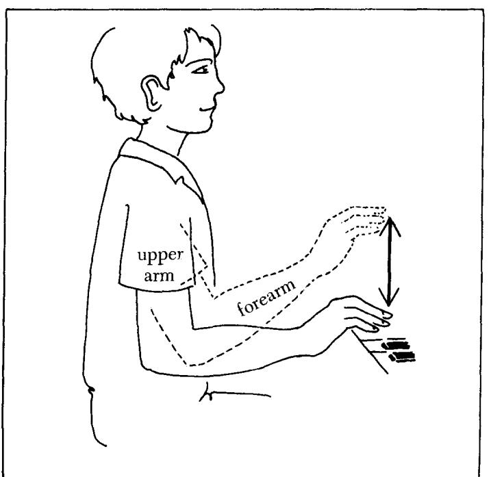

upper-arm participation; figure 14 shows the correct position of the upper arm.

Once again I must warn you against extreme positions. Overly raised fingers, straight fingers, overly curved fingers, extremely low and high wrists, extremely bent hands (in or out), pulled-in elbows, and stretched arms should all be avoided. All of these positions cause trouble.

Intense music, tense muscles Sometimes it is the emotional intensity of the music that causes tense muscles. We should try to temper this condition. Today, more than ever, audiences mistake the excessively tense muscular activities of the performer for an intense musical experience, and all too often we see the public impressed and awed by convulsive contortions and spastic gyrations. What is worse than that is that these excesses are often inflicted on the unsuspecting audiences quite incongruously, when the music happens to be lyrical, serene, and gentle. One should indeed distinguish between purposeful and overcharged muscular activities.

The shoulder

The shoulder's main role is to lift the arm and to carry, guide, and control its weight. As a rule, the shoulder is not supposed to move much, and as a result of this, a feeling of strain may be experienced. To remedy this, all one has to do is to move it slightly, either circularly or toward the opposite position in which it was before. Even the shoulder, chest, and back muscles need relief, strong as they may be. Since it is the shoulder that carries the full weight of the arm continuously, it should rest occasionally; this happens during the free fall of the arm, when gravity takes over and when the arm drops close to the body. Sometimes a deep breath brings all the relief it needs. All in all, the shoulder has sufficient opportunities to rest temporarily and there is no need for it to tire.

Interplay between the shoulder and the fingers ("feelers") Actually there is a continuous interplay that occurs between the shoulder and the fingertips. The power (or weight in motion) of the whole arm can be either completely held by the shoulder or fully transferred to the fingertips (beware of that!), or it can be partially held and partially transferred. The extremely sensitive tactile nerve endings on the fingertips regulate this activity by sending messages through the nervous system. It is because of this acute sensitivity of the fingertips that so many pianists enjoy staying in continuous contact with the keys, practically never abandoning them. They continuously "feel" the keys, and this physical stimulation by the surface of the keys helps them to generate more intensity in their feelings. Unfortunately there is a drawback to this habit: because the fingertips are touching the surface of the keys, they are unable to generate the speed that is possible when they are at a distance from the keys and allowed

to fall. Their weight is not exploited because they cannot be moved by the force of gravity: they are already on the keys! The tone quality of the "touching fingers" is never harsh, of course, but the volume is insufficient unless one adds big swinging arm motions, which may then disrupt the musical phrasing.

Let me warn you against transferring the full weight of the arm to the fingers for an extended period of time. The transfer of weight to the fingers should be instantaneous, and the shoulder should immediately resume carrying the full weight of the arm in order to avoid excessive strain on the fingers. It is simply too much for the fingers to carry the full weight of the arm, and it is harmful to get used to applying pressure on the keys.

We can greatly benefit from the positive participation of the rest of the torso and its powerful muscles, one that is a purposeful and not an inhibitive participation. By the latter I mean that the body muscles may tense up, immobilize the performer and let his arms alone to do all the work. Sometimes not even the arms work, only the hands, while the rest of the equipment is immobilized and is fighting itself. The constructive role of the body muscles is to accommodate the arms while helping to keep the body in a mobile but secure condition.

Excessive body motion, the opposite of this immobility, is not commendable either, but at least it seldom causes exhaustion or tension, only puzzling vistas and sounds, to say the least.

The chest muscles, which execute all downward and inward motions of the arms, are very helpful in certain kinds of chord playing. Of course, there are other groups of muscles involved in these motions too. Some back muscles are active in lifting the arms and the shoulders, others in pulling them down and they enable the body to lean backward and sideways.

One of our most important muscles is the diaphragm. Because this muscle is totally hidden, many of us are unaware of its role, but it is crucial because it also regulates our breathing. When it becomes tense and rigid, this muscle (that practically divides the human body in two halves) keeps the lungs from expanding properly, and it can cause a sensation of utter discomfort and tension. When the lungs cannot function freely, breathing becomes faster and shorter in order to supply all the oxygen needed. During a performance the pianist needs more oxygen than usual because his body functions are accelerated and increased. Therefore the effects of a tense diaphragm and lungs can be quite disturbing. Needless to say, this impaired breathing has a harmful effect on the musical phrasing that becomes hectic and hasty. Unfortunately, the more tense the muscles get, the tighter the diaphragm will be. The closest connecting link between the performing apparatus

The torso

Excessive body motion

Chest and back muscles

The diaphragm

and music itself is the breathing, which guides and controls both the phrasing and the pace of muscular activities. If inner tension can cause rigidity in the diaphragm, so can a faulty and tense technique; one trouble feeds on the other. A deep breath sometimes helps; it presses the diaphragm down and lets it expand so that normal breathing can be reestablished. If the playing mechanism recovers, and its respiratory system is not handicapped by continuous tension in either the diaphragm or other muscles, we have the setting for proper music making. By the way, one of the most familiar symptoms of stage fright is a tense, tight diaphragm that inhibits the entire body and spirit. Try a few deep breaths; they will help the diaphragm return to normal functioning.

Sitting

When we examine the correct way to sit at the piano we have to deal with two sets of factors: with the constant and with the variable. The constants include the size and shape of the piano and the height of the keyboard. The variables include all the things that relate to the performer. Not only his height and weight, but the infinite diversity within the proportions of his anatomy vary tremendously. The shape and size of his fingers, hands, forearm, arm, torso—all these influence the ideal sitting position. Even if two people of exactly the same height use a piano bench, its height may have to be changed. Even though two people may be the same height, if the lengths of their upper arms or the lengths of their torsos differ, their hands and fingers will be in a different position. Obviously there is no one way to sit at the piano; that is why adjustable benches had to be invented.

Stability, mobility

Instead of setting up rules, I would like to offer certain principles for consideration. In maintaining our balance at the piano, we seek both stability and mobility; we also seek minimum effort in maintaining balance at the piano. By stability I mean a position that enables us to sit comfortably, and by mobility I mean a position that enables us to move freely and effortlessly all over the keyboard. Most of the body weight rests on the bench, but some of it is supported by the feet, especially when the body is in motion. Whenever our hands or arms are in motion, the balance of the body changes, even though the change is very slight. The body assists the arms and hands and brings them to the position where they can act to their best advantage.

Equilibrium

This means, of course, that there is a continuous change of equilibrium. Most of the time the change is minimal or even invisible, but unless we move slightly, we will be off balance. An off-balance body position causes a certain tension in both the torso and the limbs. As I have said before many times, any fixed position is caused by and causes tension. But a change of position practically guarantees relief in the contracted muscles. The real reason why we always seek equi-

No uniform sitting position

The feet

White and black keys

librium is that we can remain in that position with the minimum effort. With any shift our balance changes and needs to be reestablished by a compensating shift of other components of the body. Total immobility is uncalled for, since there is no music without motion, and where there is motion, there will be a change of equilibrium. We will sit at the piano in a mobile manner, moving continuously but never in excess. Energy is wasted both through tension (in order to maintain a fixed position) and through moving too much. We have to maintain equilibrium, however, whether we are sitting still or in motion.

No two pianists look alike at the piano. If we observe Horowitz's supereconomical ways of keeping anchored but mobile while performing the most hair-raising feats of virtuosity or watch Richter undulating continuously while he plays the simplest melodies, we find only one thing in common—their uncanny sense of balance and coordination. They sit and move completely differently, but at the same time each pianist takes the best advantage of his constitution and reflexes.

When we move from one extreme of the piano to the other, our feet can help to balance these motions of the body either by moving one foot in the opposite direction or by turning the other heel in the direction the body is leaning, thereby supporting it more effectively.

When you move from the white keys to the black keys, it is necessary to lean slightly forward and to raise the elbow (upper arm) so as to bring the wrist and fingers to an identical or very similar position to that used in playing on white keys. There is no reason why one should be uncomfortable when playing on the black keys, even though the

Figure 15. Leaning backward

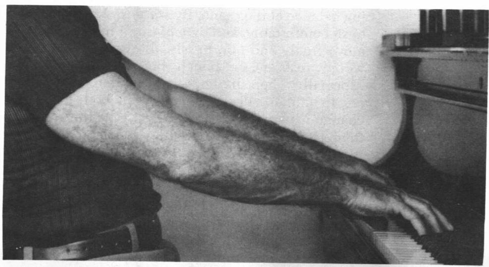

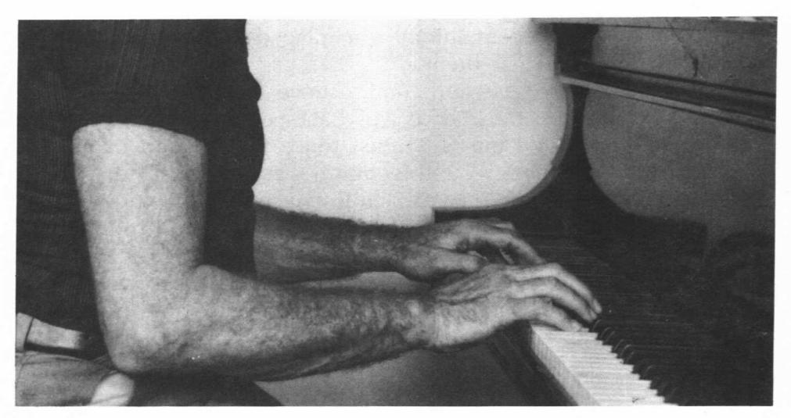

Figure 16. Leaning forward

keys are narrower. By raising the elbow the wrist has room to move up and down. When we alternate black and white key positions continuously, the body may assume a "central" position between the two extremes. However a continuous and slight change of position of the body is always beneficial; it helps one to keep the "tone" of the muscles alive and lets us breathe freely.

The bench

Every pianist should set the height of the bench and its distance from the piano to his own liking. As long as the playing is comfortable and not handicapped, the position is right. Quite a number of excellent pianists choose to sit extremely low, and they are nonetheless able to transfer all the necessary power and skill to the keyboard. The same is true for those who sit unusually high. There seems to be a generally accepted rule that the forearm ought to be completely horizontal and on the same level as the keys, but even this simple rule is not valid for every pianist. For instance, if the upper arm is extremely short, it is preferable to have the forearm at a slight angle to the keys, but if the upper arm is long, it may bring the elbow (forearm) to a low position. We have only to accept one ground rule—that of convenience and ease. When we practice pieces like the Chopin Etudes, opus 10 no. 1 and opus 25 no. 12, where most of the main notes of the melody and the bass are on the far left side of the keyboard, we will be more comfortable if we consider moving the bench a bit to the left of the center of the keyboard. It will be easier to lean to the far right and forward from this secure position rather than to be seated in the central position and to be continually off balance while weaving to the right and the left. Since the left foot does not have to be on the left pedal, it

can conveniently be placed in positions where it can support and balance the body.

Ease and comfort have priority over everything else because unless the body is well balanced and supported, the diaphragm and other body muscles must tense up; tension in these muscles affects our breathing and technique, and while this handicap is hardly visible, it certainly takes its toll. During the countless hours that we spend practicing, any unnecessary activity adds up to a formidable expenditure of precious energy. We must be adamant in avoiding and correcting this pitfall of tensing up our muscles. Furthermore, continuous inner muscular tension is quite habit forming and damaging.

# PART TWO: Basic Technical Patterns

All human motions can be systematized.

Part Two of this book presents a set of technical, or motion, patterns that are fundamental to piano playing. They are comprehensive in the sense that these patterns and their combinations serve as technical solutions to any and all pianistic writing. It may seem pretentious to claim that a few technical formulas will answer any pianistic problems, but, in the final analysis, it is possible to reduce and condense any and all movements of the human body into a very limited number of motion patterns. If Linnaeus and Darwin were capable of organizing the entire flora and fauna of the earth into clearly definable groups, we might manage to do something similar with the seemingly endless variety of human motions and gestures. The types of motions will be classified according to which part or parts of anatomy are involved and in what manner. Then we need to establish the best, most economical and expressive ways to execute these motions. Then we must assimilate them (practicing) and employ them in their proper contexts (interpretation). Simple, isn't it? Well, it's not that easy since technical difficulties such as speed, accuracy, and control still do exist, and matters of interpretation are, fortunately, wide open to different tastes and approaches. However, technical problems as such must be resolved unequivocally since the basic motion patterns and their combinations do provide solutions.

Therefore my aim is, first, to define these motion patterns; second, to describe their execution; and, finally, to point out where, when, and how they are to be employed. Since technical and musical patterns are definitely correlated, in that technical patterns should correspond to and express the music, the musical text will tell us with surprising clarity which technical pattern to employ. In a broader sense, correct reading of music includes identifying not only the notes to be played but also the corresponding technical solutions. This is the case in any style of music from Bach to Bartók.

## 4 Free Fall

Two sources of energy: gravity and our own muscular system The first and most available source of energy we can draw from is the force of gravity. Its presence is universal; it exists wherever matter is present. It influences all matter. Anything that is free to move moves toward the center of the earth. It is not that we are preoccupied with every aspect of this centripetal force, but it is a force that we must consider whenever we deal with anything that moves. Because it turns mass into weight, we are obliged to think of it whether we build a house, fly a plane, or play the piano. Since technique is organized motion and motions are our concern here, we recognize this inexhaustible source of energy; we try to tap it whenever possible, and put it to our own use. Since it is ever present, it is futile to ignore it: we might as well cooperate with it and save our own energy wherever possible.

The other source of energy is our own muscular system. As I stated earlier, the list ends here. There are no other physical sources of energy available to us. The force of gravity and our muscles will accomplish anything we require. Most of the time we combine the two, but it is obvious that it is more economical to utilize the force of gravity whenever possible and save our own energy. One exception to this principle is the *thrust* (see chapter eight).

Finger technique vs. Breithaupt's weight technique In effect, the so-called modern school of piano playing was initiated by Rudolf Breithaupt when he published his book *Die Grundlage der natürliche Klaviertechnik* ("Natural Piano Technique"), whose first edition appeared in 1905. This work gave great and sometimes excessive importance to the role of relaxation and of weight in reaction against the old schools, which used and abused "finger technique." There was a need for new ideas because it was evident that the modern piano could not be mastered by sheer muscular force and especially not by the relatively weak forearm muscles that move the fingers. Breithaupt's technical terminology spread rapidly, but it was employed in a rather confused and confusing way.

Not more weight but longer leverage for more sound

Breithaupt advocated the substitution of force by weight; in his view the volume of sound produced is in proportion to the quantity of weight employed: more weight, more sound. However, the volume of sound depends exclusively on the speed with which the hammer hits the strings, regardless of weight that generates that speed. To achieve this speed the muscles and the force of gravity combine in a way that activates the arms, hands, and fingers; they in turn transfer this speed to the keys and hammers. Whether the speed is generated by a small or a large weight is immaterial: the fact is that the rate of acceleration produced by the force of gravity is exactly the same whether the weight is small or large. (The factor of air resistance is negligible in this situation.) Therefore it is more economical to use as little weight as possible. The notion that the full weight of the arm produces more sound than a lighter weight is erroneous: the fact is that the activation of a longer lever generates more speed than a shorter one and therefore we add the upper arm to the forearm. The activation of the whole arm serves to increase the speed of the fingertips in a whiplike action. We should not equate great tonal volume with a larger weight but rather with the speed that a longer lever can generate. Ideally we should combine minimal weight and maximal leverage for extreme speed; we can increase the acceleration that is brought about by the force of gravity by using a slight muscular activity (throw) in an elongated arm. One might be tempted to rename weight technique as 'speed technique."

Figure 17. Arm ready to fall

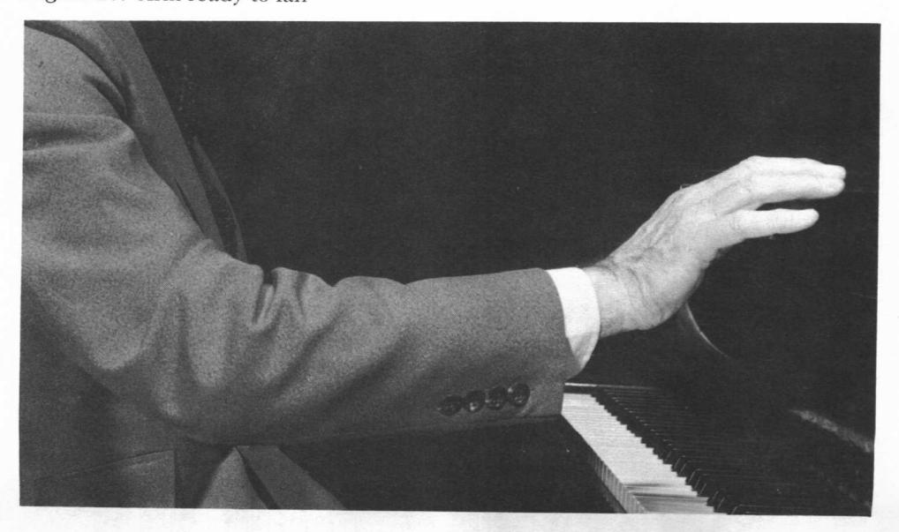

When describing the motion and technique of the *free fall*, let us bear in mind that although the force of gravity does most of the work, gravity is active in only one phase of the motion. Before the arm drops, it must be lifted actively by muscles, and at the moment when it lands on the keys, the impact is transferred and cushioned by an instantaneous muscular contraction. Therefore total relaxation occurs only between these two stages—between lifting and landing—during the

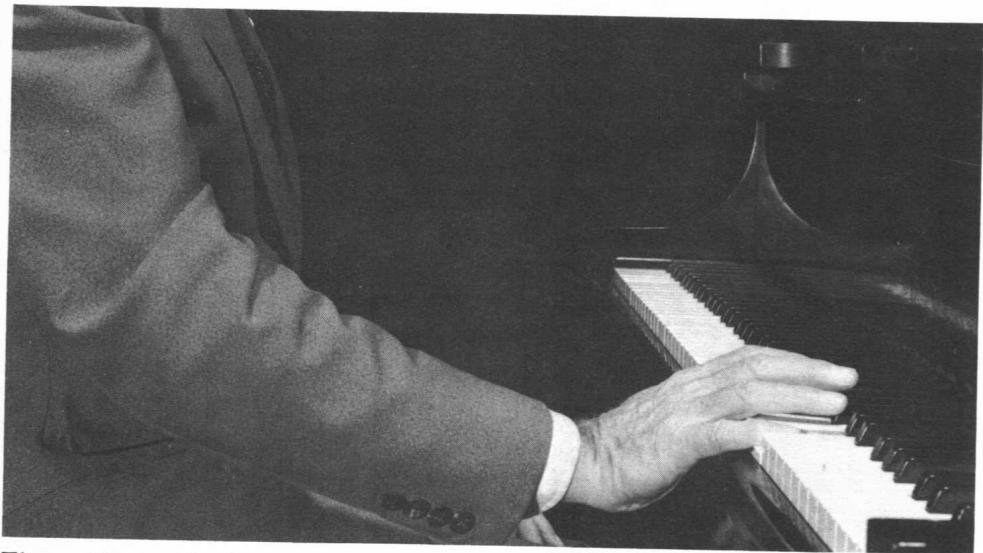

Figure 18. Arm landing: wrist assumes its lowest position and will rebound instantaneously as shown in Figure 19


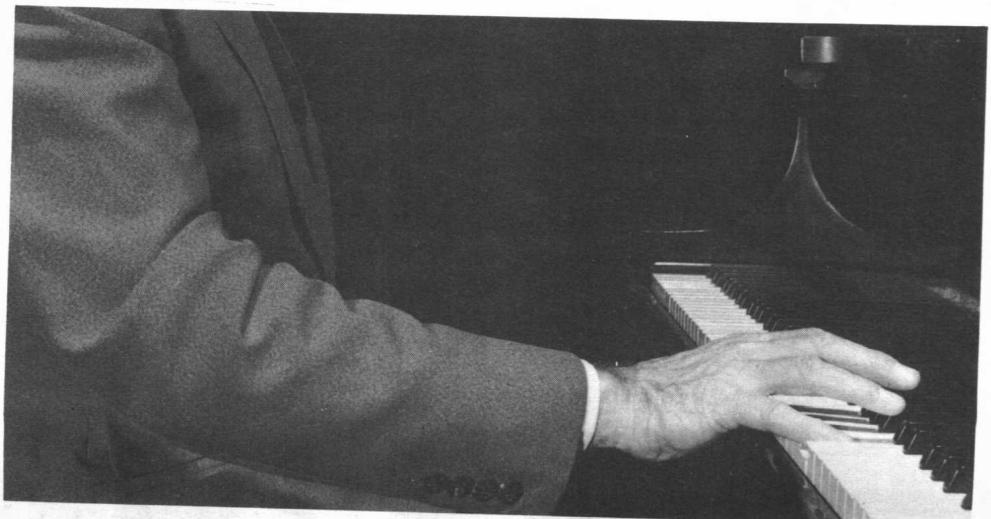

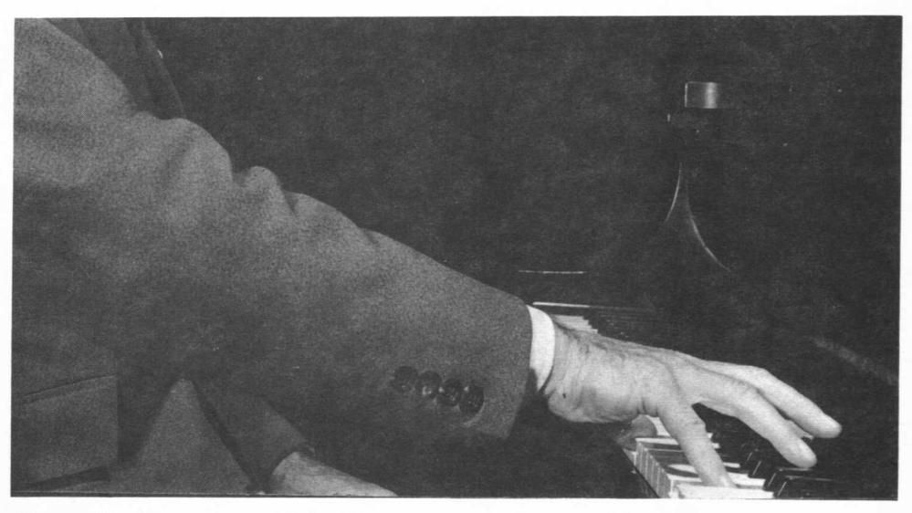

Figure 20. Successive raising of the upper arm, wrist, and hand

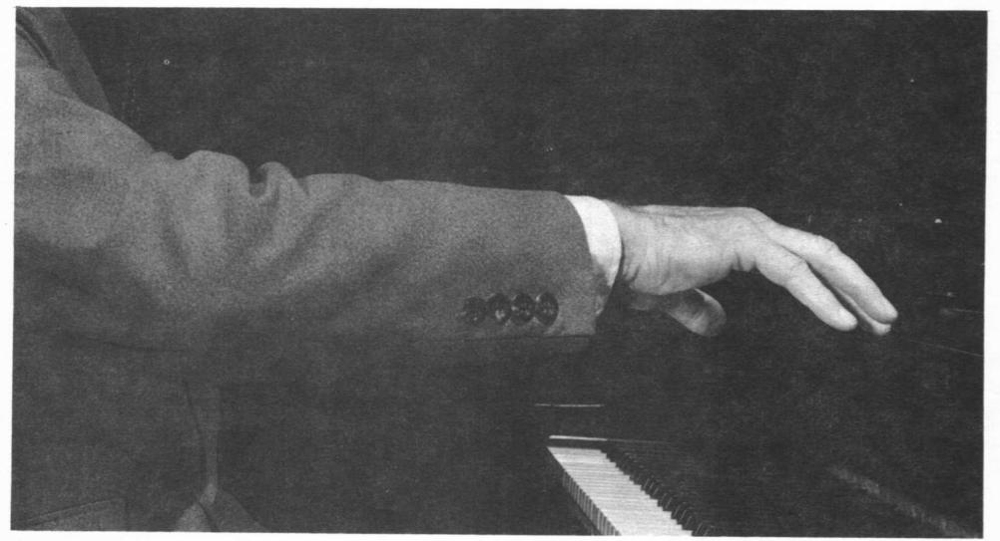

**Figure 21.** Position before fall: note far-out position of elbow. The upper arm must assume position closer to body (Figure 22) before falling.

short time the arm is falling. I mention this to point out that even the action that is most dependent on gravity, the free fall, is not a totally relaxed activity. It is only when the fingers, hands, and arm have been lifted and set in the proper position for falling that we let go and let the force of gravity take over. We must learn not to interfere with the acceleration by slowing it down or increasing it with a throw. We must acquire the ability to let any part (or parts) of the arm fall freely as though it were an object that didn't belong to us. In other words, we

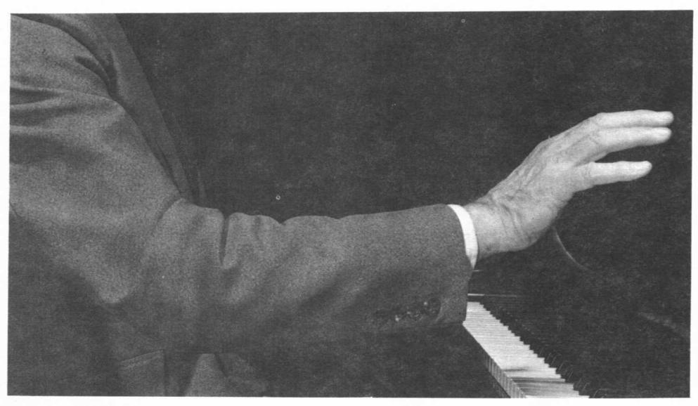

Figure 22. Arm ready to fall again

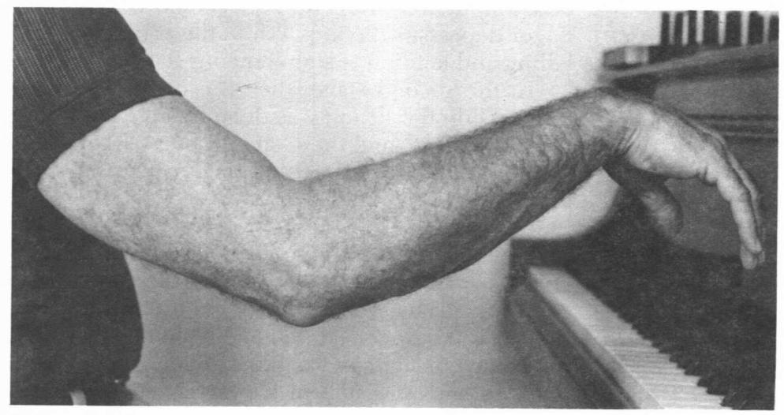

Figure 23. Wrong position for the wrist before free fall; wrist should be low

must be able to let the sheer force of gravity act upon it. We can practice this motion with the fingers alone, with the hand, the forearm, and the upper arm and then combine them in any way. As said before, the longer the equipment we use, the greater the speed we can generate.

Three stages of free fall—first stage: lifting least expende

The free-fall motion consists of three stages. The first stage of the free fall is the lifting of the equipment. As always we strive for the least expenditure of energy. Therefore we initiate the upward motion with a slight upper-arm movement; this is immediately followed by

the upward motion of the forearm, which in turn raises the hand and the fingers. It is not a simultaneous motion but a successive one. When ready to fall, the distance from the keys to the fingertips is approximately ten inches; at this point the elbow should be slightly lowered so that the fall of the wrist and fingertips will be completely vertical (see figures 17 through 22). It is very important to have the entire arm and hand completely immobile before the drop starts so as not to interfere with the force of gravity either by increasing the acceleration or by decreasing it. Please note the slightly curved position of the fingers and wrist; this position insures that at the moment of landing all the joints will be able to cushion elastically and transfer the energy to the keys correctly. Every one of the joints—the two joints between the phalanxes of the finger, the knuckle, the wrist, and, to a lesser extent, the elbow and shoulder joints—has a share in regulating the energy transference. The quality of the sound—its fullness, harshness. or weakness-depends on the degree to which the joints have been fixed. If they are loose, hardly any sound will come through; if they are rigid and stiff, we get a harsh, martellato sound. The joints must be resilient and firm, and they should be fixed only at the instant the finger depresses the key. While the lifting is a successive motion, the falling and landing is simultaneous for all the elements involved.

Second stage: drop

Third stage: landing, rebound

In the second stage, the arm, hand, and fingers fall at the same time. While the lifting was done by *active* muscles, this stage is completely passive, and there should be no interference with the acceleration caused by the force of gravity. During the fraction of a second that the equipment is falling, we are totally relaxed—yes, this is the time to relax.

Now comes the third stage—the landing. At this point there is a slight, instantaneous fixation in all the respective joints. This fixation causes the transference of energy into the keys and a slight rebound of the hand and fingers, and, notably, of the wrist. It is essential that this fixation be instantaneous, not extended, and that there be no sensation of continuous pressure in the fingertips. On the contrary, the moment the rebound of the hand takes place, the shoulder muscles begin to raise the upper arm (bringing it back to stage one), thereby relieving any extended pressure on the fingertips. During most of the lifting, the fingertips remain on the keys, since we don't want a staccato or an abrupt ending to the sound. Also we want a complete change of position in every joint after the sudden impact (and fixation of joints) at landing. If we use this sequence of motions, there will be an easy, flexible upward motion in the whole arm, and we will be ready for the next free fall. Our movement fits in with one of our basic principles the avoidance of any prolongation of any fixed position. A very important detail to watch out for is that the wrist must be in a relatively low

White keys, black keys

Distance

No exaggeration

When to use free fall

position at landing so that it can cushion naturally. If the wrist is high and loose, it will have an excessive "dead" run downward; if it is put in a fixed position, we get a harsh, hard sound. If the wrist is high, it will not be able to cushion properly (see figure 23).

The free-fall movement may be used on single notes, intervals, and chords, and ought to be practiced accordingly. When the arm drops on black keys, it is essential to assume a slightly higher arm position so that when the fingers land on the keys, the wrist has enough room to cushion and to rebound, just as when the fingers land on white keys. Unless we raise the upper arm (not the shoulder), the wrist won't have the needed extra space. The "feel" in the hands and fingers should be the same on the black keys as it is on the white keys.

Every pianist should determine for himself or herself the point from which the arm should fall. If we are too near the keys, the arm cannot accelerate enough; if we're too far away, we'll crash on the keys and may miss the key we're aiming at entirely. We must be sure that none of the components are in an extremely contracted or stretched position, that none of the knuckles stick out or collapse, and that the wrist is neither too high nor too low.

I am afraid that this warning will have to be repeated many times, since we must try to avoid any excesses and exaggerations throughout our pianistic activities. Often one hears that, while practicing, one must exaggerate the "right" motion, but how can one exaggerate balance, equilibrium, effortless playing, and proper placing of the equipment?

Gravity works on its own terms and unless enough time and distance are given for acceleration, insufficient speed will be generated


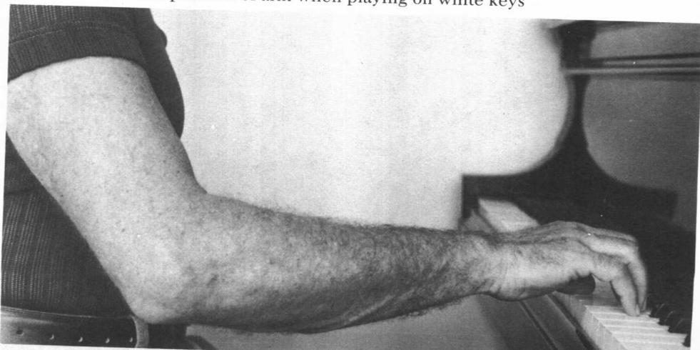

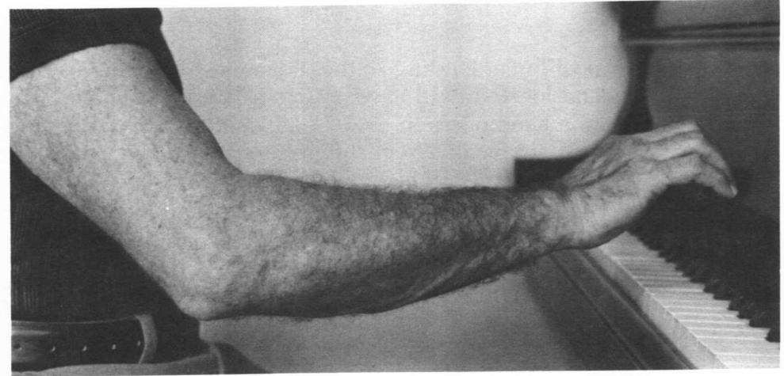

Figure 25. Raising the arm and hand over white keys

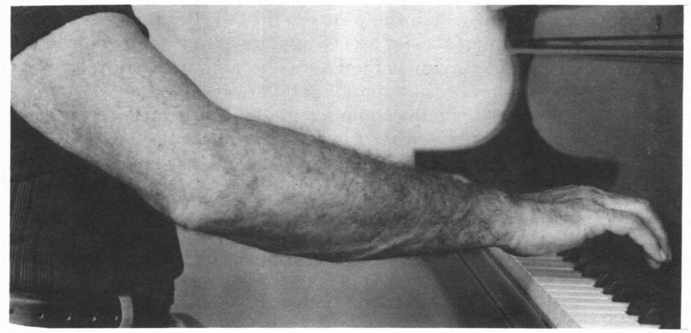

Figure 26. General position of arm when playing on black keys

Figure 27. Raising the arm and hand over black keys

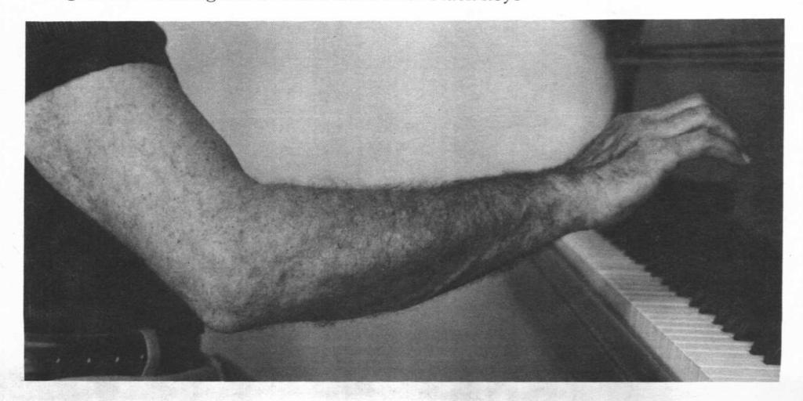

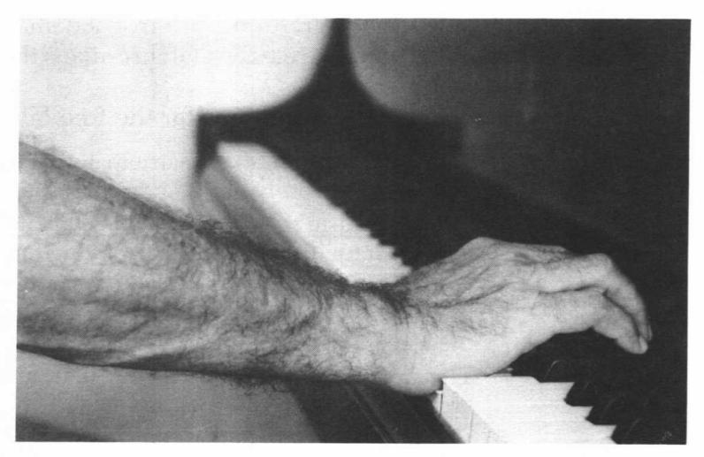

Figure 28. The palm touches the keys when the upper arm is not raised enough for free fall on black keys (wrong position).

in free fall without the addition of a throw. Therefore we can only employ free fall in passages in moderate tempo. Nothing can "drop" fast! For instance, the left hand of the Chopin *Etude*, opus 10 no. 1 and the opening of the Tchaikovsky *Piano Concerto No. 1* are ideal spots for free fall. However free fall is not very practical for chords that require a wide reach because the stretched hand that is needed for these chords tends to alter the acceleration of the falling hand. Here we had better use another type of motion—the *thrust* (for a full discussion of this motion see chapter eight).

In free fall we utilize the force of gravity alone (only in the falling stage, of course). In other situations we may use it only partially. But first we must master it in its original, unaltered form—a premise that is true of any of the basic patterns we are going to investigate. Only after we have clearly understood and assimilated these motions will we be successful in varying and combining them. Before we play these patterns quickly, we should practice and master the motions in slow tempo in their purest form. In fast playing almost everything looks alike; the motions become small, and all we can see are tiny, blurred finger movements very near the keys or rapid tremolo-like activities. These blurs are all reductions or distillations of the larger, welldefined movements we have described. Considerable patience is required in slow practicing, since our attention must be divided among all the participating components at all times; there are at least four components-the fingers, hand, forearm, and upper arm-that we should be aware of at all times. This slow beginning should bring good

results; once the ingredients are in good shape and function well, our natural coordination easily synchronizes the motions, and they become second nature.

Guidelines for free fall

Here are a few guidelines for the free fall:

- 1. The shoulder should not participate actively in the free fall. It should not move; it merely holds and releases the arm.
- 2. The upper arm must be active; the forearm should not act alone since full impact will result only in conjunction with the upper arm.
- 3. Don't sit too near the piano or too far away from it; the correct position is the one in which the fingertips fall completely vertical with the fingers slightly curved.
- 4. The head and body should not participate actively in the motion; they are immobile during the free fall.
- 5. Do not slide your fingers on the keys after they have landed—and certainly not while they are landing. In stage one the fingers should be brought up vertically by the combined upper arm, forearm, and hand motion.
- 6. There should be no pressure on the keys after the instantaneous impact nor while the fingers are in process of being lifted by the upper arm. Simply hold the key down with a minimum amount of weight until you abandon it. The shoulder will carry the full weight of the arm during lifting.
- 7. The joints of the fingers and wrist should be elastic, neither stiff nor loose.
- 8. Avoid supination (see forearm rotation, p. 79) of the forearm while raising it.
- 9. Differentiate between white and black key position by changing upper arm level.
- 10. It is most important that you do not influence the speed generated by the force of gravity, either by acceleration or by slowing down.
- 11. Since the fingertips have to move up and down in a perfectly vertical line, be sure that you observe the proper ratio of motion for the hand, forearm, and upper arm. Too much forearm motion raises the fingers in the shape of an arch away from the piano; too much upper-arm motion brings them too far forward. Also make sure that the fingers are lifted no more than about ten inches from the keys.
- 12. Lifting the arm is a successive, not a simultaneous, motion of the equipment, while dropping is synchronized.

There is no question that the piano's biggest sonorities can be achieved by the free-fall motion. The force of gravity does most of the work, and the rate of acceleration of any falling body is the same, regardless of its weight. Therefore the size, weight, and strength of the performer are of no consequence. All we have to do is to raise the arm

to the proper position where the force of gravity can act on it in the best possible way—and let go! Another equally effective but quite different way to produce big sonorities is described in the chapter on thrust (chapter eight). In this gesture we put to use the largest and strongest muscles of the body and arm. The thrust is also totally effortless. If the right coordination of the entire body is achieved, the tiniest or frailest person can develop a powerful sound and technique—without a trace of forcing and without any muscle-building exercises.

As I mentioned earlier, many of the greatest piano virtuosos (Hofmann, Godowsky, Friedman, Schnabel, Bartók, and de Larrocha, for example) were and are of small stature. All of them produced powerful sonorities at will. It is also true that there were and are many tall or heavy-set pianists (Gieseking, Bachauer, Johannesen, Cliburn, Rachmaninoff), and they all had superb coordination, a highly refined sense of tone production based on a total lack of forcing, and a wonderful ear and tactile sense that enabled them to manipulate every gradation of weight, speed, and energy and to bring out the best of the piano and of themselves. If anything, one must guard against using too much power because of the limits of elasticity in the instrument. In the case of free fall, one must not drop the arm from too high a position, since its speed accelerates by its square per second under the pull of gravity.

Exercises for free fall

The following free-fall exercises are extremely simple; they enable us to exercise the required motions, but they do not induce us to practice mechanically.

**Example 4.** Sixth chords on white keys; play them hands separate and together

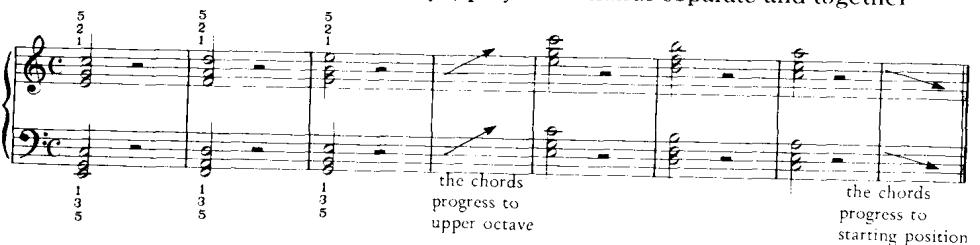

- 1. Sixth chords on white keys, hands separate and together. Practice the three distinct stages of the movement. Do not interfere with the force of gravity.
- 2. Sixth chords on black keys, hands separate and together. When you practice sixth chords on black keys, adjust the body and arm posi-

tion: *Lean* slightly forward; the wrist and fingers should be in same position as they are on the white keys.

Example 5. Chords on black keys; play them hands separate and together

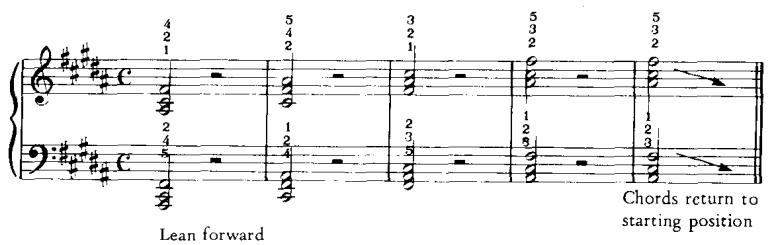

3. One hand is on the white keys and the other is on the black keys, then vice versa. The body turns slightly to adjust to the proper position. In example 6, the left shoulder moves slightly forward; in example 7, the right shoulder moves forward.

**Example 6.** Right hand on white keys; left hand on black keys; left shoulder slightly forward

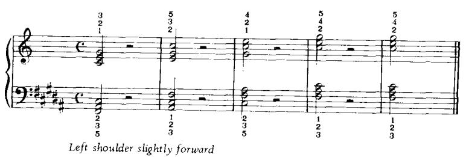

Example 7. Right hand on black keys; left hand on white keys; right shoulder slightly forward

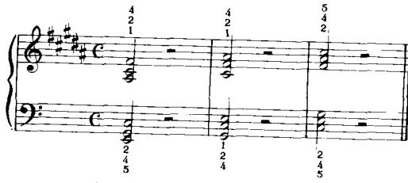

Right shoulder slightly forward Exercise of same pattern as previous examples (up and down)

- 4. Exercise both hands at central and extreme locations of the key-board (on white and black keys), always adjusting the position of the body and arms.
- 5. In chords that contain a combination of white and black keys, adjust the arm and body to the most comfortable position. As you alter

the position of your upper arms, maintain the correct hand and wrist angles.

Example 8. Parallel shift of upper arms

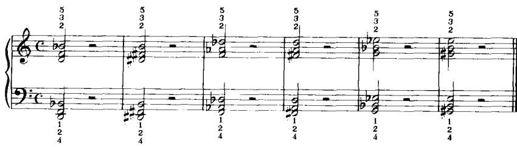

Parallel upper arms shift up, down, and sideways inot wrist).

Example 9. Symmetrical shift of upper arms

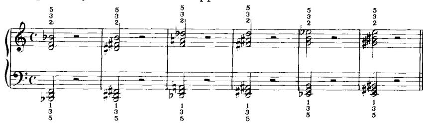

Symmetrical upper arms shift up, down, and sideways (not wrist).

6. This exercise may include any combination of white, black, and mixed chords. At the third stage (the landing) make sure that the wrist has ample room to cushion the impact and that it can bounce down and up from the keys with no interference.

After having mastered the free-fall motion on intervals smaller than the octave, we should achieve the same freedom and elasticity of joints with the extended fingers that octaves require. The main goal is to expose the hand freely to the force of gravity in an unhindered way and to place the whole playing apparatus in its optimal position. After the fingers leave the keys, the hands should assume their central positions.

7. At first practice octaves on white keys only and on black keys only, with the hands separate and the proper body adjustment; you should be aware of the three stages and all these instructions. Then practice them combined, using the same exercises given for sixths.

Examples for free fall

The examples for the use of the free-fall motion are from the standard piano literature. I have indicated the points at which free fall is

to be used by the symbol A. The motion of thrust is indicated by E (see chapter eight).

### Symbols

| Α            | free fall                           | $\mathbf{E}$ | thrust     |
|--------------|-------------------------------------|--------------|------------|
| В            | five-fingers, scales, and arpeggios | $\downarrow$ | low wrist  |
| $\mathbf{C}$ | rotation                            | <b>↑</b>     | high wrist |
| D            | staccato                            |              |            |

Example 10. Chopin, Etude, opus 10 no. 1

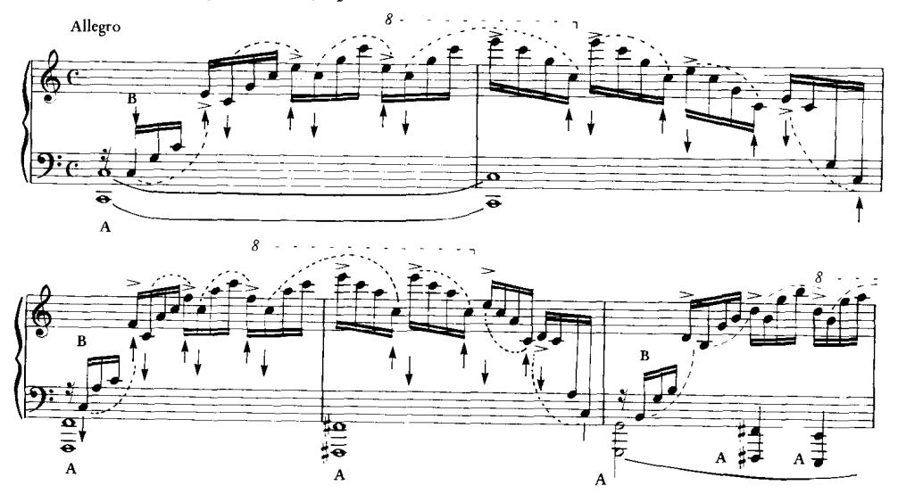

Example 11. Bach, Italian Concerto, first movement

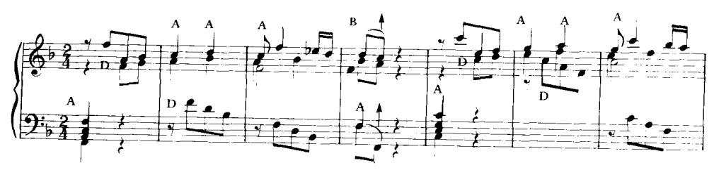

Example 12. Liszt, Sonata in B Minor

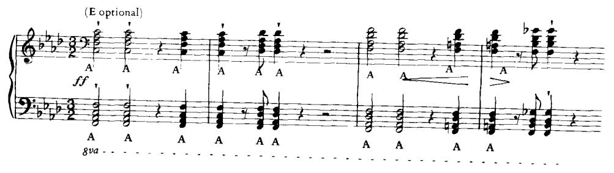

Example 13. Chopin, Sonata in B Minor, opus 58, fourth movement

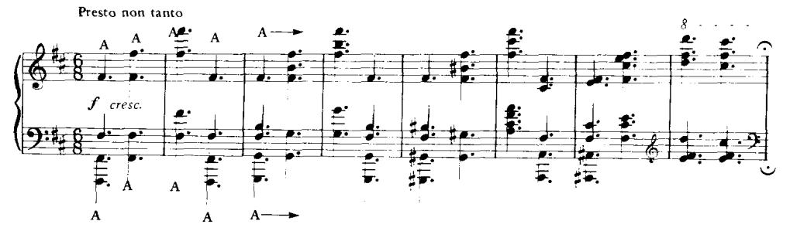

Example 14. Chopin, Sonata in B Flat Minor, opus 35, first movement

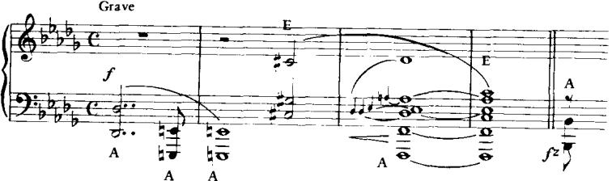

## 5

## 5 Five-Fingers, Scales, and Arpeggios

Five-fingers, scales, arpeggios

Fingers: extension of forearm muscles

Adjustment of arm for each finger; flexible wrist

In the free fall the role of the fingers was minimal; they acted mainly as a recoil mechanism. Now, however, we are going to examine the characteristics and functions of the fingers carefully. Their role is of foremost importance and they must be coordinated with, and helped by, the entire playing apparatus and the force of gravity. They are extremely important both in their active and passive roles because they are the "executors": they alone are in touch with the keys. Actually all our arm and body motions serve no other purpose than to help and to cooperate with the fingers.

It is most important that we regard the fingers not as isolated units but as the extension and continuation of the forearm muscles and tendons that move them. I would like to make this point very clear: no finger exercise will ever give us true independence of the fingers unless each finger is helped by the proper placement and adjustment of the forearm and upper arm. True independence can be achieved only by cultivating *interdependence* with the forearm and upper arm muscles and not by maintaining a fixed hand (or wrist) position that brings the fingers into a forced, unnatural situation. In the long run these fixed positions will cause tension, fatigue, pain, and acute or chronic ailments. Worst of all, they produce a poor piano sound.

Although the fingers are different in size, shape, and (in the case of the thumb) even in anatomy, we strive for evenness of sound in playing and practicing our scales and arpeggios. If we assume fixed hand and wrist positions and don't accommodate each one of the fingers, the unevenness of the fingers manifests itself in a most pronounced way: the short and thin fifth finger and the bulky, two-phalanxed thumb will never sound the same. We can force them to behave in a similar way, but we will have to keep on forcing them to do so all our life; they will never sound identically with a fixed wrist. Instead of a uniform, fixed hand position, the fingers need continuous adjusting motions by the wrist, the forearm, and the upper arm to accommodate the fingers and

Anatomy of the fingers; the thumb is different.

enable them to move freely, without hindrance and forcing, to produce the kind of motions that these components are capable of making.

The thumb differs greatly from the other four fingers; it has only two phalanxes, while the others have three of them. It is the strongest and most agile finger; it can move alongside the hand and pass under the other fingers, and it is much more independent than the others. Its metacarpal bone is free from the other bones and is not tied to them by ligaments. The vertical motion of the other fingers originates where their first phalanx hinges on the metacarpal bone, but the thumb moves vertically from the point where its metacarpal bone is attached to the wrist (see figure 29).

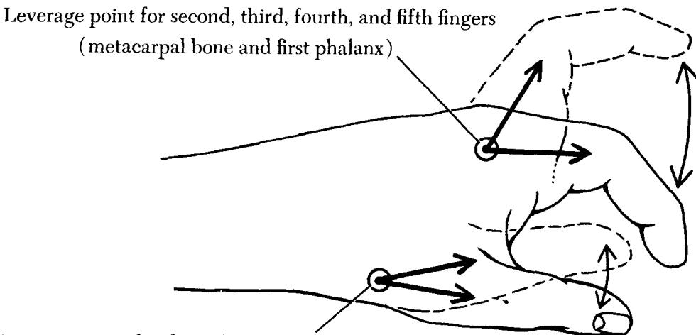

Leverage point for thumb's vertical motion

(from metacarpal bone and wrist)

Figure 29. Leverage points for the fingers

Always lower the wrist for the thumb. The obvious consequence of this anatomical difference is that when the thumb moves vertically, it requires a different wrist position: the wrist must be placed considerably lower. If the wrist remained in the higher position suitable for the other fingers, the thumb's vertical motion would consist of an outward arch instead of a perpendicular one (see figures 30–33).

We must enable every one of the fingertips to descend vertically because the keys themselves move exclusively in a vertical direction. Therefore any diverted and slanted direction of the fingers toward the keys is uneconomical.

There are two equally indispensable adjusting motions of the arm and wrist that enable them to collaborate with each of the fingers; they are (1) movement in the vertical plane and (2) movement in the hori-

Horizontal adjusting motion

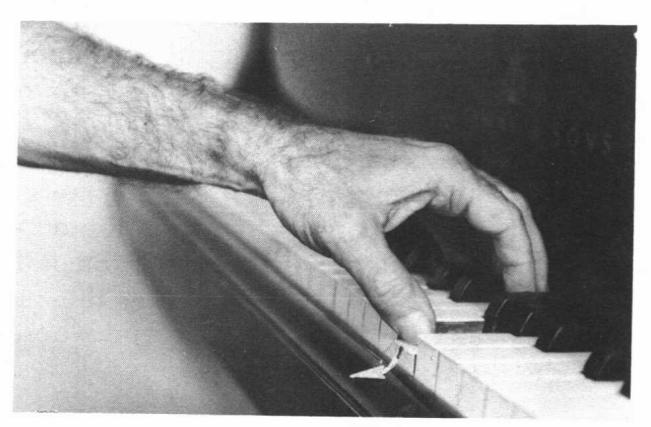

**Figure 30.** Wrist too high: thumb unable to move vertically

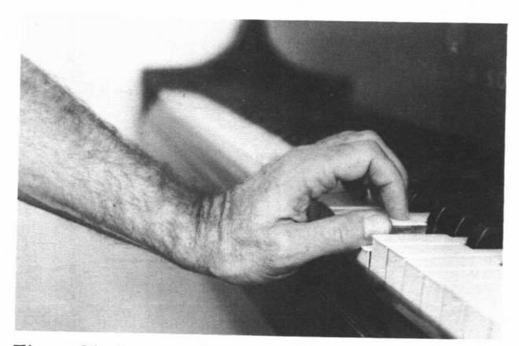

Figure 31. Wrist too low

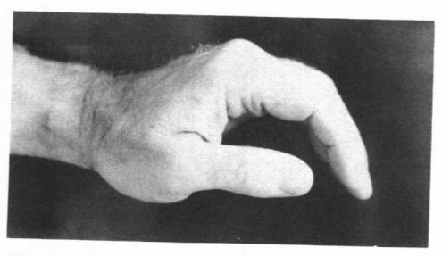

**Figure 32.** Low wrist enables thumb to move vertically

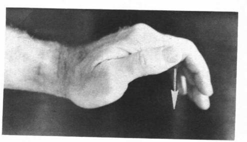

Figure 33. Thumb raised for vertical descent

zontal plane. Since we want to place the fingers in line with their respective forearm muscles (the flexors and extensors), there will be a slight lateral (or horizontal) change in the position of the wrist and forearm for each finger (see figure 34).

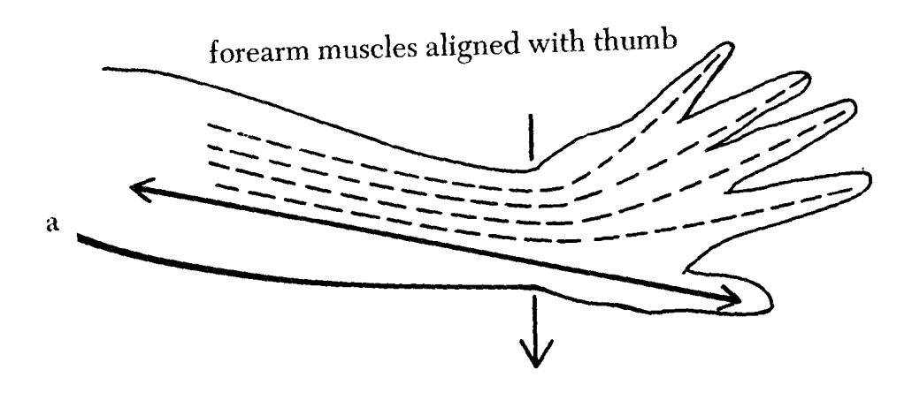

forearm muscles aligned with third finger

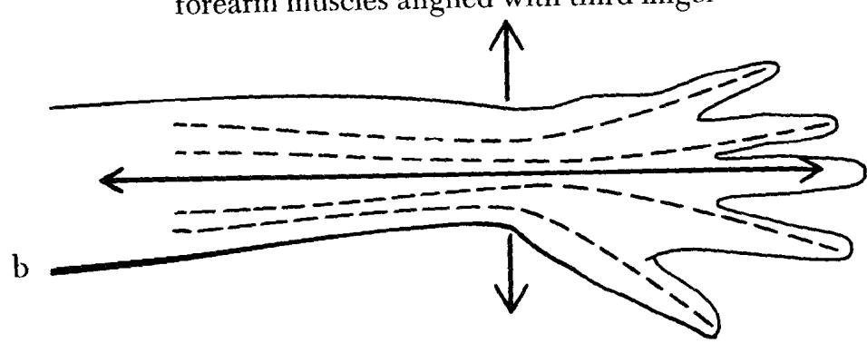

forearm muscles aligned with fifth finger

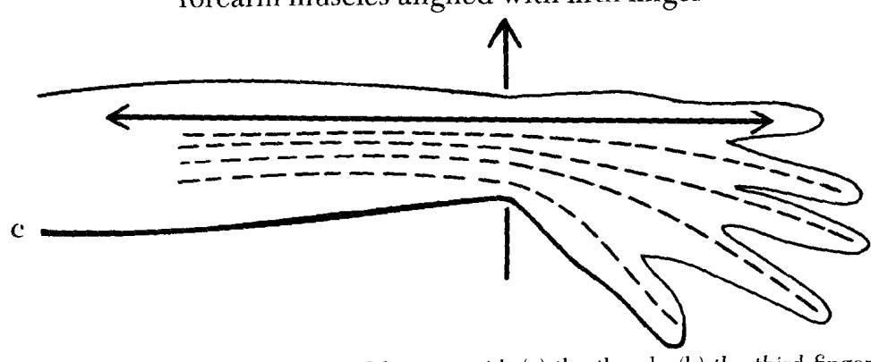

Figure 34. Horizontal alignment of forearm with (a) the thumb, (b) the third finger (and with 2-4 and 1-5 pairs of fingers), and (c) the fifth finger. The aligning and adjusting should be *continuous* and *exact*; overdoing it would put the finger out of line again!

Both the vertical and horizontal alignings (adjusting) should be continuous and precise: overdoing them would put the finger out of line again.

Figure 35 shows lateral views of the horizontally adjusted position for each finger. In figure 35e, the arm assumes the proper position for the fifth finger; that causes the thumb to find itself away from the keys, which is correct.

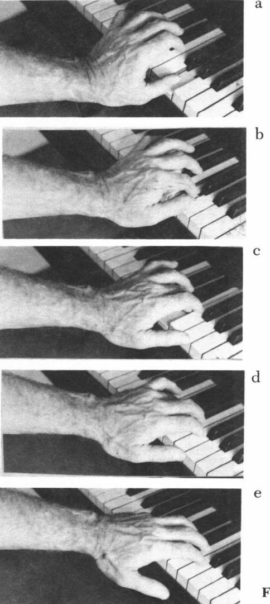

Figure 35. Lateral view of the horizontally adjusted position for each finger

Figure 36 provides an overhead view of these horizontally adjusted positions.

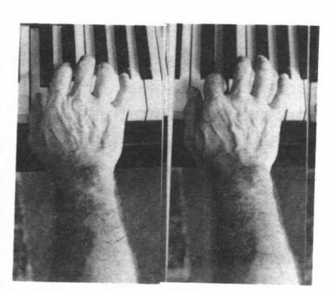

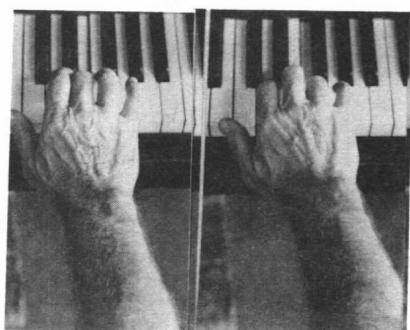

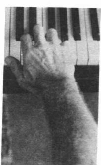

Figure 36. Overhead view of the horizontally adjusted position for each finger

Vertical adjusting motion

Whenever the thumb plays, the wrist should be lowered. When we proceed to the second finger we raise the wrist slightly, because the second finger's first phalanx and metacarpal bone join at a higher point than the place where the thumb's metacarpal bone and wrist meet. The thumb and the second finger can only execute their vertical motions from these points.\* In the case of the third, fourth, and fifth fingers the wrist and forearm continue to rise, reaching their highest positions with the fifth finger. (Remember that a horizontal adjusting motion is also continuously occurring.) Both vertical and horizontal adjustments are essential, and the fingers should always be aligned with their respective higher or lower wrist positions with the thumb at the lowest point and the fifth finger at the highest. If both horizontal and vertical adjustments are accomplished, the fingers will be in their optimal positions.

Although we need not become experts in anatomy and physiology, we should know something about the structure of the equipment we use constantly—the fingers, hand, forearm, and upper arm. This knowledge will help to clear up fundamental misconceptions and will bring common sense into the nebulous world of the "art of piano playing." Remember that musical interpretation is an art but piano playing, per se, is not an art but a skill! There are too many false traditions, taboos, and fetishes—too many do's and don'ts, most of them based on anatomic nonsense—and they impede the development of the skill of piano playing.

Thumb; *never* under the palm

One of the most damaging technical errors is the habit of placing the thumb under the palm. It is usually done when playing scales and

<sup>\*</sup>It is impossible to move the thumb vertically from the point where its first phalanx and metacarpal bone meet: it can move only horizontally (that is, toward and away from the palm). Its vertical motion is executed from the point where its metacarpal bone joins the wrist, and therefore we must lower the wrist when the thumb plays.

passages. This widespread and erroneous routine causes most of the problems in piano playing. Uneven passage-work, involuntary accents, a cramped feeling in the hand, and clumsiness and unsureness are caused by the fact that once the thumb is placed under the palm it is not only in an uncomfortable position but it simply has no equipment, no muscles available to bring it down vertically (see figure 37). You have to press, to push it down with the wrist or perform rapid shifts with the forearm, and inevitably there's the bump—the accent and uneven notes! How can one play an even effortless scale when one of the fingers is cramped or needs so many extra motions? This strenuous situation can be avoided altogether simply by not ever permitting the thumb to go under the palm. It must function in an unhindered way and be free to fall vertically; this is possible only if it is kept alongside the hand, out of the palm, and the wrist is lowered to accommodate it (see figure 38).

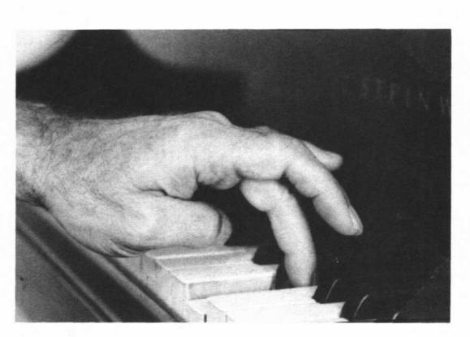

Figure 37. Thumb forced under the palm: wrong

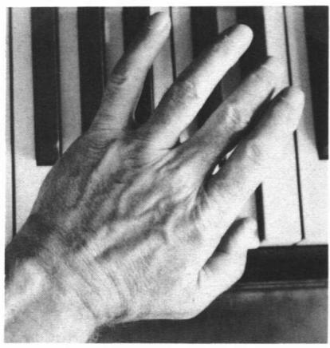

Figure 38. Thumb alongside the hand, enabling it to descend vertically: correct

Characteristics of the fingers

Before we describe scale playing in detail, let us examine the rest of the fingers individually. While the other four fingers differ distinctly from the thumb, they also vary among themselves. They differ in shape and size and, although they have adequate muscles, they are not equal in strength. The fourth finger, in particular, feels weak, but not because it lacks strong muscles. However its flexors and extensors are wrapped together with the third finger's muscles: hence these two fingers tend to contract and extend together. The fourth finger cannot be totally independent of the third. But it is possible to make the horizontal and vertical adjusting motions so precise, so accurate that the activation of the fourth finger can be done effortlessly. Without

these adjustments the fourth finger is indeed handicapped. Contrary to common belief the fifth finger is one of the stronger fingers. It is true that it is the smallest one, but, in addition to the forearm muscles, it has a special set of strong muscles at the outer side of the hand. These muscles can develop substantially and give added power to the "pinky." It certainly needs this strength since most of the fundamental bass notes are played by the left, and the melodies by the right hand's fifth finger, as well as most of the "virtuoso" octave passages.

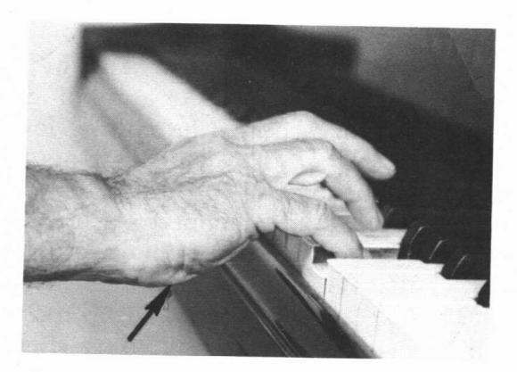

**Figure 39.** Extra sets of muscles on the outer side of the hand for the fifth finger

Lack of adjusting motions causes friction.

The forearm muscles that move the fingers are relatively small compared to the upper arm, shoulder, and chest muscles. Hence, if they are not utilized effectively—if they cannot transfer their full energy to the respective fingers—they tire quickly. If the fingers are not placed to form a fairly straight, continuous line with their forearm muscles and tendons, there is unnecessary friction alongside the tendons. Energy is wasted because the contracted muscles pull the finger sideways instead of directly. In order to achieve this close-to-straight line between the fingers and the elbow, the adjusting motions of the wrist should not be excessive; otherwise a bent line occurs again. Incidentally, these slight changes in the position of the arm are good, not only because they line up the fingers, but also because the slight but continuous changes prevent fixation and stiffness in the wrist. Thus we continually employ fresh, unused muscles and fibers.

Distinct positions

Each finger has its optimal position when it is properly lined up with its muscles. However what is ideal for the thumb is way off for the fourth or fifth finger. Actually we must think in terms of five slightly different "ideal" positions—one for each finger. We find, for instance, that when we are in the fifth-finger position, the thumb is actually removed from the keys (see figure 35e). Here the upper arm moves away from the body slightly; this motion brings the forearm and

Third adjusting motion: in and out, for white and black keys

All nonplaying fingers slightly raised

The "feelers"

wrist slightly up, creating the fitting position for the fifth finger and displacing the thumb. When we use the thumb, the opposite happens; the arm and wrist are low, and the fifth finger is displaced. The point is that we should establish an ideal position for each finger. If we play several notes at the same time, the position of the arm and wrist should be central: that is, it should be halfway between the extreme fingers. For example, if we use the thumb and the fifth finger at the same time, the arm position will be that of the third finger, and for a combination of the third and fifth fingers the arm will be in position for the fourth finger.

When the wrist is adjusted for the use of the fifth finger, its upward motion is the consequence of the upper arm being moved away from the body. The upper arm also aids in shifting levels from white to black keys and from black keys to white. This is the third adjusting motion, of the in-and-out dimension (in depth), which together with the horizontal and vertical adjustments sets up the fingers for their optimal functionings, relieving them from excessive work.

It is imperative that fingers that are not playing be raised slightly from the keys. They should not be pulled up too high and strained, and they should be ready to come down from a slight distance as soon as the arm and hand are lined up for the next finger's action. There are two important reasons for lifting the inactive fingers. First, the actual weight of the finger, no matter how small, can be utilized only if it is set in motion from a certain distance from the key. Once the finger rests on the key, the force of gravity cannot pull it down because it is down already. Its action must then be generated purely by the muscular energy stimulated by the tactile nerve endings of the fingertips. It is true that when our fingers rest on the keys, they have a relaxed sensation in them, and it is also true that if we feel the keys, we won't play wrong notes. But a slightly raised finger is secure and it feels under control too. Moreover it is ready to act effortlessly with the combined help of the force of gravity and the muscles. When the finger is slightly raised, it is possible to alternate contractions between the flexors and extensors, and the slightly raised fingers can receive any added throwing motion by the hand and arm that accelerates their speed by the vertical adjusting motions much more effectively than the motion of a finger touching the key. (For a further discussion of throwing motions see chapter seven.)

The "feelers," those pianists who like to stay close to the keys at all times, usually produce sounds that are never too harsh, but their playing hardly goes beyond mezzo forte. For them volume can be increased only by forcing, mainly because the force of gravity has been mostly eliminated. Furthermore, the tone quality tends to become rather bland and dull. Another drawback to constant contact with the

keys is the tendency to press. When we press the keys, extended contraction of certain muscles occurs; this contraction causes stiffness, and besides it is totally unnecessary. Because the pressure is continuous, one tends to pull the elbows (and the upper arm) toward the body. Thus one immediately creates an obstructed hand position characterized by excessive pronation (see page 79), a severe handicap that causes unnecessary tension and fatigue in the forearm. The only justification for "feeling" the keys is in pianissimo and legatissimo playing—but I wouldn't use it then either.

Again, the thumb

I have emphasized the importance of not placing or squeezing the thumb under the palm. When playing scales, also, we must raise the thumb alongside the hand while turning the elbow outward; then we must immediately lower the wrist in order to arrive at the position the thumb should be in before it descends on the key (a position in which the wrist is low). In this way we can avoid pulling the thumb under the palm. This motion is slightly bigger when the thumb passes under the fourth finger. Also the size of this motion decreases as the speed increases because the down motion of the wrist (before the thumb plays) helps to throw the thumb, instead of placing it, toward the correct position for its descent. It is helpful to place the third or fourth finger toward the back area of the keys when it is played before the thumb so that the elbow doesn't have to move too far out and the thumb can be placed more easily.

#### Guidelines

- 1. The finger that plays should be in a straight line with its flexor and extensor muscles.
- 2. The hand, wrist, and arm should slightly adjust within the vertical and horizontal planes to place each finger in the position where its muscles can contract effectively and where the hand arm are in equilibrium over the finger that plays.
- 3. This slight change of position eliminates any fixed, tense situation in the joints and muscles and guarantees their readiness to be put to use again.
- 4. Any change of position enables the hand and arm to transmit a throw to the fingers, thereby allowing them to augment their speed and power.
- 5. The location of the forearm for double notes and chords is somewhere in the middle, between the extreme fingers.
- 6. When you play on the black keys, your upper arm should assume a slightly higher and more forward position so that the hand, wrist, and fingers can maintain the same relative position as on the white keys. The wrist should be in a normal position; it is the arm, not the wrist, that is higher than normal.

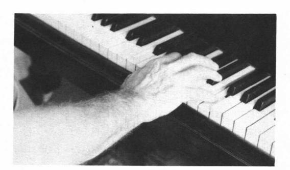

Figure 40. Arm position for white keys

Figure 41. Arm position for black keys

7. When you change the arm position, under no circumstances should you use any rotary motion of the forearm. This type of motion is used amply in other technical patterns, but not in five-finger, scale, or arpeggio movements.

8. Fingers should always be slightly raised before they play; they have to share the work with the rest of the equipment. However, the arm's adjusting motions are intended not to take over the fingers' work but to assist it. One of the most common mistakes is to use either the fingers alone or only wrist and arm motions. Fingers and arms are supposed to complement, not to substitute for, each other. Obviously relying on the fingers alone causes overwork in the forearm muscles, while the use of only the wrist and arm produces sloppy, inaccurate, and inarticulate playing.

9. Each finger must encounter, acquire, and ingrain the specific finger-hand-forearm-upper arm line-up unique and characteristic to that particular finger. When you play, each finger endeavors to assume, or to approximate, that particular position.

Scales and arpeggios We have determined that specific conditions are characteristic for each finger and that the fingers must be coordinated and lined up with the muscles that place and move them. When we play scales and arpeggios, we try to establish or to approximate these optimal positions, modifying them according to specific conditions.

From the point of view of piano technique we group scales and arpeggios together, since arpeggios are essentially magnified, amplified scales. The only difference between them is that in arpeggios the intervals between the notes are larger than the intervals in scales. The technique is identical, but the connecting and adjusting motions between the notes and fingers are larger and wider in arpeggios than they are in scales.

Toward the extremes of the keyboard: right-hand-upward and left-hand-downward scales. More on the thumb!

Compared to the five-finger activities previously described, scales and arpeggios are complicated by the role of the thumb after the use of the third and fourth finger in right-hand-ascending scales and lefthand-descending scales and by the use of the third or the fourth finger after the thumb in right-hand-descending scales and left-hand-ascending scales. Here again I must set a negative goal: we have to avoid placing the thumb under the palm of the hand at all costs. Unfortunately placing the thumb under the palm is the most widespread method of teaching scales; we must protest against it vigorously. The thumb is our strongest and best-equipped finger, that has a special, husky extra muscle that pulls it toward the palm. But once it is pulled under the palm, it lacks the equipment to pull its second phalanx downward. Although it is most agile and can move in any direction while it is alongside the hand, the thumb is totally handicapped and cramped when it is pulled in. In no way can it match the other four fingers in their freedom to move downward from their respective knuckles. Since we want our scales and passages to be even and effortless, we should never create a situation where one of the fingers is severely restrained. This is exactly what happens to the thumb when it is forced under the palm. As I have mentioned before, the thumb always needs special attention and even when it is alongside the hand, it requires a lowered wrist position to descend on the key vertically and to function within its central area. If we force it into that unnatural and tight position (under the palm), we practically incapacitate it, and we lose all hope of achieving even, fluent playing. Once it is in that awkward, impossible position, the only way to bring it down is to push the whole wrist down and pretend that the inevitable clumsy, bumpy accent did not happen! You may try to camouflage it with a cautious, extra motion, but this motion would also interfere with the fluent motions of the other fingers. This is no way to play scales—this is no way to play the piano! No wonder that practicing scales becomes such an unpleasant, frustrating chore, both for children and adults.

The solution is natural and effortless. When a child or an untaught adult attempts his first scale, what does he do? First he sticks out his elbow and tries to reach the note with his thumb sideways. But then, he will be told, disciplined, cajoled, or beaten into the habit of raising his wrist, pressing his arm down, and forcing his thumb into that nasty little nest that the palm of the hand becomes. It is much better to allow the elbow to swing out and the thumb to reach its note in an unrestricted way than to restrain it by forcing it under the palm. When the critical moment comes for the thumb to follow the third or fourth finger, let us anticipate the event with a slight outward motion of the upper arm (and elbow), a slight lift of the thumb alongside the hand, a

The body helps

slight lowering of the wrist in preparation for the thumb, and then a quiet descent of the thumb to the next note. The size of these individual motions is minimal. This preparation is a perfectly natural, easy motion to execute, and there should be no problem with the timing of all the described activities.

Also there is nothing wrong with a slight motion of the body in the direction of the scale: it accommodates and reduces the elbow motion. As you can see, it is better to mobilize the entire human apparatus than to isolate its components and force them! We encourage the participation of as many components as necessary to save the thumb from being immobilized. Further, the more we can distribute the motions amongst the components, the more reduced they will become in size until they are practically invisible. We cannot give precise measurements of the size of the motions; we can only indicate their direction. But as long as total coordination exists, the individual motions may be only millimeters in size.

The topography of the keyboard must be considered too. It is always easier for the thumb to play on a white key when the previous finger has played on a black key. Since the white key is lower, a lowered wrist position for the thumb comes about quite naturally. It is harder to move with the thumb from white key to white key and even more difficult to move from white key to black key. But these moves can be simplified if we use the simultaneous motions described. It is easier to play a D, A, E, or B major scale than the C major scale because the former scales allow the thumb to play a white key after a black key.

We use the same motions in fast scales, but there these motions are reduced, and we throw the fingers instead of placing them. Still, small as these motions are, we need the participation of every component.

So far we have described the thumb's role in the right-hand-ascending and left-hand-descending scales. In scales that move from the extremities of the keyboard toward the center we encounter a different situation. When the third or fourth finger follows the thumb, it tends to reach over it, cramping the thumb under the palm of the hand. This happens inevitably when the upper arm remains close to the body. When you play a descending scale with the right hand or an ascending scale with the left hand, the solution is simply to hold out the upper arm (and elbow). This way the third or fourth finger reaches over the thumb comfortably. The upper arm stays out, and the wrist moves down and up continuously, to accommodate the thumb (down) and the third and fourth fingers (up). Do watch that the thumb is raised both before and after playing! When the upper arm is lifted, all the fingers, including the thumb, will be parallel to each other.

The thumb: used on a white key after a black key and on a white key after a white key

Toward the center of the keyboard: right-hand-downward and left-hand-upward scales

Function of the upper arm in scales

Motions of the body in scales

Symmetrical vs. parallel motions

Adjusting motions to aid the fingers

Central areas

Let us summarize the ground rules for scale playing. In scales that move toward the extremes of the keyboard, the upper arm, forearm, and wrist go down when the thumb is used and up when the other fingers are used. The fingers are always slightly raised when they are not playing. In scales that move toward the center of the keyboard, however, the upper arm must stay out continuously, and only the forearm and wrist go up and down, according to the fingers used.

Do not mix the two motions: the role of the upper arm is totally different in each. In scales toward the extremes of the keyboard the upper arm uses small, pendulumlike motions while the body moves forward; in scales toward the center it will stay out at all times, away from the body as far as necessary while the body leans backward. Activating the upper arm is the only way to accommodate the fingers. Obviously the same rules apply to arpeggio playing, where the motions are slightly magnified.

If the upper arm stays out for an extended period, and it will during the above scales, the shoulder muscles need relief; they find it by occasionally lowering the arm toward the torso. If both hands start from the opposite extremes of the keyboard, the body must lean forward to accommodate the arms; then, as we proceed toward the center, the body leans backward. This forward-and-backward motion is the usual adjustment of the body; it moves to keep the arms from a stretched or overly bent position.

We see now why symmetrical motions are easier to execute than parallel ones: in symmetrical passages the motions of both arms are identical; in parallel ones we must synchronize two distinct motions. Furthermore in parallel passages the body has to move sideways, not backward and forward, according to the location. This sideways motion often causes an imbalance of the body, too.

The adjusting motions of the hand, arm, and body serve exclusively to help the fingers. They are called upon depending on which finger is to be used and where it plays: the black keys or the white keys, the extremities of the keyboard or its center. The direction of the motions we described as being horizontal, vertical, forward and backward, circular, and rotary motions. Most components act simultaneously; therefore, although the size of each motion is minimal, their synchronization is sufficient to accomplish the task at hand.

Preferably, each component should be used within the central area of its range, not at its extremes. We constantly refer to these central areas because this is where all the components function with no strain or excessive muscular tension and are easy to coordinate. It is this type of activity that serves our aim: to make piano playing a perfectly coordinated, totally effortless, and natural activity.

Arpeggios

The motions described pertain to arpeggios as well. In arpeggios the distances are wider and the adjusting motions are somewhat larger. Interestingly enough, the advocates of the thumb-under-the-palm cause less damage here. Because of the larger intervals, it is unrealistic and less tempting to squeeze the thumb under. The forced motion is usually replaced by a quick lateral shift with a fixed hand position. This type of motion is less damaging, but it is not the right solution either. The sudden shift tends to create an accent; furthermore it obstructs the flexible flow of movement, no matter how cleverly it is camouflaged. Also, it makes no sense to practice sudden shifting in slow tempo. There should be no sudden motions in slow practice, ever; how can you later accelerate an already fast motion? Anyway, no need exists for a sudden shift, since we have a smooth, well-synchronized upper arm-forearm-wrist-finger motion for any of these passages.

Shifts for wide skips

Incidentally we do use sudden shifts for wide lateral skips under special circumstances but we don't use them for ordinary scale and arpeggio passages.

Grouping of notes; legato playing

Groupings, musical and technical Thus far we have established a few pianistic concepts and have described certain positions and technical patterns as accurately as possible. We must now introduce a formula that is of the utmost importance; we will refer to it continually. It concerns the grouping of notes, both musically and technically. Its validity is such that it supersedes any other formulas that may seem to be in conflict with it.

This unpretentious word, grouping, applies to many areas of piano playing. It has to do with legato playing, with phrasing, and with the execution of groups of motions (or technical formulas). It affects the position of the hand, wrist, forearm, and upper arm, and it is analogous to string players' bowing and singers' and wind players' breathing. It is an extremely meaningful activity for pianists, since the piano, essentially, is a percussion instrument and notes tend to sound isolated from one another. The grouping of notes is vitally important, both musically and technically.

The piano has another disadvantage compared to other instruments; its tone decays rapidly. The volume of a note or chord can be crashingly loud at first impact, but soon it is barely audible. To connect notes that by their nature represent instantaneous decrescendos, to shape melodic lines, to sustain intensity, and to produce a series of sounds that we hear as one phrase is an art in itself (see chapter sixteen). The technical solution for legato playing and grouping notes can be as well defined as the problem itself; it consists of an easily executed set of motion patterns. Incidentally we must distinguish be-

tween technical and musical groupings, for the two groupings do not necessarily coincide. By technical grouping I mean the connection of several notes in one motion, while the musical phrase sometimes doesn't end with the completion of the technical motion but continues on.

Legato markings

Grouping is often indicated in the score either directly or indirectly. Most of the time we see a slur tying two or more notes together; sometimes the word *legato* is written. Sometimes nothing is written, but we recognize easily the technical and musical groupings of the notes.

Technique of legato playing

Legato playing is one of the mysteries of piano playing. Almost everybody knows the objective, but there are many theories about the best way to achieve a true legato. The mind, inspiration, and imagination have much to do with it, but the actual legato effect must be accomplished by physical means. By "physical means" I don't mean by the fingers, and certainly not by the fingers alone. There is no way to play a real legato by the fingers alone! No matter how tightly one grips the keys, trying not to release one note before the next is played, an imperfect legato results. Actually, if one note slightly overlaps the next (this is how legato is attempted by many), a series of short, instantaneous dissonances results; melodies very often consist of a sequence of scalelike notes, and these overlapping intervals of seconds are dissonances. A real legato, a real grouping of notes, can be accomplished only by a unifying motion of the arm (that is, of the forearm and upper arm). When we see a slur, or assume the presence of one, we begin the phrase with a relatively low wrist position and end it with a somewhat higher wrist. By low or high wrist I imply a low or high forearm position that often involves the upper arm too. The fingers act in their usual manner; they are slightly raised before and after playing. Let us

any kind of fingering (1-2, 2-3, 3-4 or 3-2-1, 5-4-3, 2-3-4, for example). Regardless of which finger plays, always initiate the group with a relatively low wrist position and move gradually higher until the last note of the group has been played! In our examples the highest wrist position is on the second note in the two-note group and on the third note in the three-note group (when I say "highest," I mean a slight elevation). We must avoid an extremely low or high wrist position. The fingers move up and down with slight motions, and extremes should be avoided for them as well. When we combine motions, which we do all the time, each motion must be reduced to its minimum. If we raise the fingers slightly and if we apply the usual horizontal, vertical, and in-depth adjusting motions of the arm and wrist, we can easily obtain a perfect legato.

A seeming contradiction

You may have noticed that there seems to be a contradiction between our latest formula (raise the wrist at the end of a group) and the rule that the wrist must be low whenever the thumb plays and higher whenever the fifth finger plays. There is indeed a contradiction, because we just said that in legato the wrist must be low at the beginning of the group and high at the end, regardless of the finger in use. Does this rule mean that if the phrase begins with the fifth finger and ends with the thumb, the wrist will be in a higher position for the thumb than for the fifth finger? Yes, this is exactly the case! And, as I said before, this latter rule supersedes the first one (see figures 42 and 43).

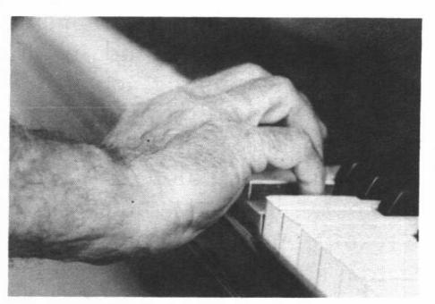

Figure 42. Group starts with fifth finger: low wrist

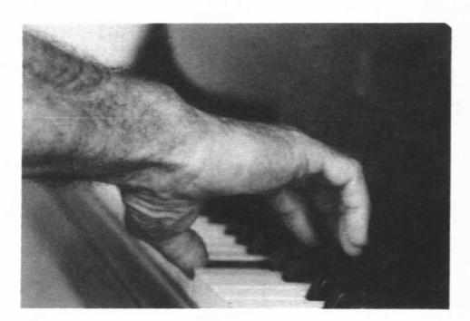

**Figure 43.** Group ends with thumb: higher wrist

However, the first rule is still valid. Considering that the thumb is more comfortable with a lower wrist and the fifth finger with a higher wrist, the upward motion of the wrist is definitely influenced by the former "thumb" rule; the relative height of the wrist at the ending of the group is a little lower than it would be if the phrase had ended on the fifth finger. As an example let us compare two phrases: one ends on the thumb, the other on the fifth finger. The phrase that ends with the fifth finger will have a somewhat higher wrist position than the phrase that ends with the thumb. Thus, although we do accept the rule for grouping notes (with the wrist raised at the end of the phrase), we also respect the primary need of the thumb for a relatively lower wrist position than that required by the other fingers. So much for the seeming contradiction.

I suggested before that the fingers alone can never produce a true legato. Legato demands that a note must blend into the next note without a break or any overlapping. The break does not occur when we hold over the previous note, but overlapping does occur. Since overlapping causes a trace of dissonance in scalewise motion, a better solution must be found. We'd prefer the previous note to fade away when the following note comes into existence, and blend into it.

Role of the damper in legato playing

The first note must cease sounding in due time, but not in a sudden, brusque manner, because suddenness in itself is contrary to the character of legato.

At this point, it is necessary to examine the essential role of the use of the damper in legato playing in producing the fading or blending effect I mentioned above. The damper (or sordino) is the mechanism that was affixed to the overgrown length of the piano strings during the second half of the 18th century. Its role is to stop the excessive reverberation of these longer strings. Before Mozart there was no need for the damper because the strings were shorter, the sound weaker, and one didn't mind a little extra reverberation. Actually, it made the sound of the old instruments richer, because it incorporated the harmonics of all the strings. But the piano soon reached adolescence and then developed into the Lisztian and contemporary nine- to ten-foot concert grand. Now the damper became a must, a life saver! Imagine how a concert grand piano would sound without that safeguard to stop its unwanted vibrations (for a further discussion of the pedal and pedal effects see chapter twelve). Let us return now to the damper's role in legato playing, and to the role of the fingers in manipulating it.

The speed with which the damper falls back on the string to stop its vibrations results from the speed with which the finger abandons the key; that is, if we raise the finger abruptly, the damper drops abruptly and stops the sound instantaneously. By the same token, if we leave the key slowly, the damper halts the strings gently and gradually, and the sound seems to fade away. Therefore we have to cultivate a technique of abandoning the key gradually. Since legato playing requires that notes blend into one another, we must rely on the mechanical device that can help to achieve this blending. As you will see, a combination of the damper, the fingers, and the arm is needed to enable us to play a real legato. This approach to legato playing is not yet understood and people seem to be too concerned with the activities of the fingers only.

Technique of manipulating the dampers

Our goal is to let the fingers abandon the keys slowly, but this task is a difficult one for the fingers alone; it is hard to raise one finger slowly and lower the next one at normal speed. The solution to this problem is to raise the arm slightly. This arm motion gently lifts the finger that has just played, and the slow abandoning of the key retards the damper, which thereby halts the sound gently. By this gradual fading away of the previous note one creates not an illusionary but a true legato. If the next note enters gently, it will blend easily with the previous note. Therefore do not attempt legato playing with inhibited, repressed finger motions alone or with a motionless and fixed arm and wrist. Avoid large circular "relaxed" motions of the whole arm on each

note too; they will have the effect of isolating, not connecting, notes. Instead guide smooth and slight finger motions with a smooth, unifying, and slightly upward motion of the whole arm. Remember, there is only one upward arm motion for the entire group of notes! No pressure is required, and no excessive finger or arm activities are needed, just a slight lifting of the arm toward the end of each group is all that is necessary.

Why upward?

Why is the arm moved upward rather than downward? The reason is that a quietly tapered phrase ending is achieved by lifting the weight of the arm rather than by lowering it into the keys. The upward arm motion retards the fall of the damper and slows down the finger, while a downward arm motion would accelerate it.

Phrase endings: touchstone of musicianship

If we acquire this easy, smooth technique of combining fingers, arm, and damper during and at the end of a phrase, our musical diction will improve significantly. One of the telling earmarks of good musicianship is the manner with which one ends a phrase: does the performer end the phrase gently or abruptly, does he use suitable or excessive motions?

Tense playing affects tone quality too.

Some may think that it is easier to achieve control with tensed-up muscles and with fixed hands and fingers, but under these circumstances not only the flow of music suffers, but the tone quality as well. We must be aware of the fact that in piano playing, just as in science, poetry, or sports, the ultimate can be achieved only by utmost economy and purposefulness, with no waste of the media. In a well-coordinated system of music making, the fingers work together with the arms, the arms work with the body, and they all mesh with our breathing. Occasionally we associate upward motions with inhaling and downward motions with exhaling. Breathing affects phrasing, and this is what interpretation is mostly about: how to phrase music! The mechanical, respiratory, and interpretative activities must be completely integrated. If our efforts and motions are continuously shared by the active but minute participation of the entire apparatus, only then can we develop a totally effortless technique, and our own, unmistakably individual tone quality.

Guidelines for five-fingers, scales and arpeggios

To sum up, here are a few guidelines for five-fingers, scale and arpeggio playing:

- 1. Each finger has its own characteristics.
- 2. Each finger is to be helped by the rest of the playing apparatus, which assumes a corresponding position suitable to that particular finger.

- 3. The need for changing positions for each finger results in continuous adjusting movements of the arm.
- 4. In general, the wrist is at its lowest point when the thumb is used and at its highest point when the fifth finger is used.
- 5. Guideline 4 is modified when grouping of notes is involved; in groups the lowest wrist position is assumed at the beginning of the phrase, no matter which finger plays, and the highest position is assumed at the end of the phrase. However the relative height is influenced by guideline 4.
- 6. When we play scales, we should avoid placing the thumb under the palm; instead we should place it alongside the hand. A combined finger-wrist-arm motion prevents a cramped and uncomfortable position for the thumb.
- 7. Whenever the hand is in the playing position, we should avoid an extreme pronation of the radius and ulna (of the forearm) by slightly raising the upper arm.
- 8. The technique for scales and arpeggios is fundamentally the same, except that in arpeggios wider intervals are covered with slightly larger arm motions than those used in scales.
- 9. The height of the upper arm should be modified for playing on black keys or white keys: it should be higher on black keys and lower on white keys. Thus we can maintain exactly the same position for the wrist, hand, and fingers in both situations.
- 10. When the speed of playing increases, the size of the motions decreases. The types of motions, however, remain unchanged. In a slow tempo we place the fingers in their proper position; in a fast tempo, we throw them toward the desired position. It is with this throw that the fingers can reduce their motion and achieve the increased speed, balance, and volume of sound even though the distance from which they approach the keys may be small. However, we cannot throw slowly, so in a slow practice we must place them in position.
- 11. In order to facilitate the passing of the thumb it is advisable to let the third or fourth finger play closer to the back of the key. In this way the upper arm can move less and still keep the thumb outside the palm of the hand.

Exercises for five-fingers, scales and arpeggios

The five-finger exercises given here should make the fingers independent, not from the arms, but from each other! By insisting on a specific position for each finger and collaboration with its equipment, we will establish conditions for each finger's independence and, at the same time, for being interdependent with the arm. Therefore these exercises are intended to activate the finger not in spite of its mobiliz-

Exercises serve to ingrain the appropriate arm position for each finger ers but in conjunction with them. All the fingers should be lined up with their respective forearm muscles by using the adjusting motions.

The following simple set of exercises serves to bring about typical, characteristic constellation of the finger, arm, forearm, upper arm, and torso position that is unique for each finger. Each of the fingers will assume and ingrain its own distinct arm position, and whenever and wherever any of the fingers play, we will have to bring about this particular position automatically.

The slight changes that bring about these conditions for each finger, the adjusting motions, are in the horizontal, vertical, and depth dimensions. The process of establishing and ingraining the quality, size, and timing of the motions must be very carefully controlled. In a nutshell, when we move from the thumb toward the fifth finger and back, there is a gradual and precisely measured change laterally, vertically, and in depth in the arm position. The value of these exercises lies not so much in what we play as in how we play. Therefore the following few notes suffice for our purposes:

Example 15. Five-finger exercises on any keys

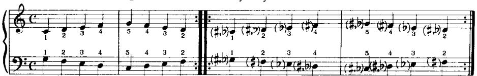

You may add a sharp or flat to any of the notes (as indicated), thereby creating different situations for each finger. As you know, the general position of the arm and body should be altered when you play on the black keys. It is important that you do not practice the exercises mechanically. With the conscious control of the mind you can establish and ingrain these rather complex motions quickly and effectively. Once you have mastered these motions don't bother practicing exercises any more: go right on to the repertoire. The reason why I have not submitted here the usual, copious assortment of exercises (see Cortot's edition of the Chopin *Études*) is because they might induce mechanical practicing, which is mostly a waste of time.

The exercises in example 16 include the same notes as before; however here they are grouped in various ways. It is these grouping signs that indicate the differences in the technique employed, in the position of the wrist and arm. We must begin each group with a lower wrist position and end with a relatively higher one, regardless of which finger plays. It is as simple as that. Again we don't need different sets of exercises; all we need is to alter the slurs, to tie notes in various combinations, and to use combinations of black and white keys

to form smaller and larger intervals, using this one group of notes. Help yourself: the idea is, not to practice exercises for their own sake, not to "practice" but to master the motion itself; once you have mastered this technique, apply it to the repertoire. We must avoid mechanical practicing, even if conscious practice is more strenuous on the mind: we are concerned with avoiding strain to the muscular system—not to the mind!

Example 16. Five-finger groups, phrased

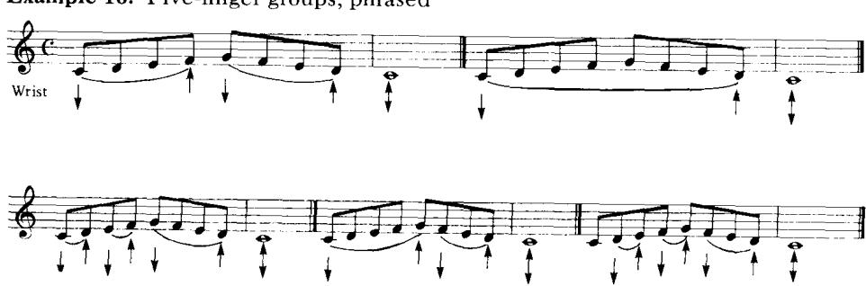

Examples for five-fingers, scales and arpeggios

The list of all symbols used in the musical examples is given again here so that you may become familiar with them.

### Symbols

| Α            | free fall                          | $\mathbf{E}$ | thrust     |
|--------------|------------------------------------|--------------|------------|
| В            | five-fingers, scales and arpeggios | $\downarrow$ | low wrist  |
| $\mathbf{C}$ | rotation                           | <b>↑</b>     | high wrist |
| D            | staccato                           | ·            | 9          |

B indicates the type of motion treated in this chapter. Free fall (A) was discussed in chapter four. Since rotation, staccato, and thrust have not yet been described, concentrate mainly on A and B in examples 17–28.

Example 17. Bach, Partita No. 5 in G Major. "Praeambulum"

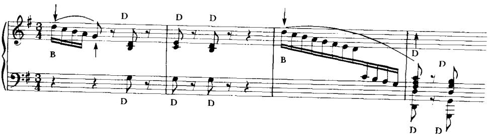

Example 18. Beethoven, Sonata, opus 2 no. 2, first movement

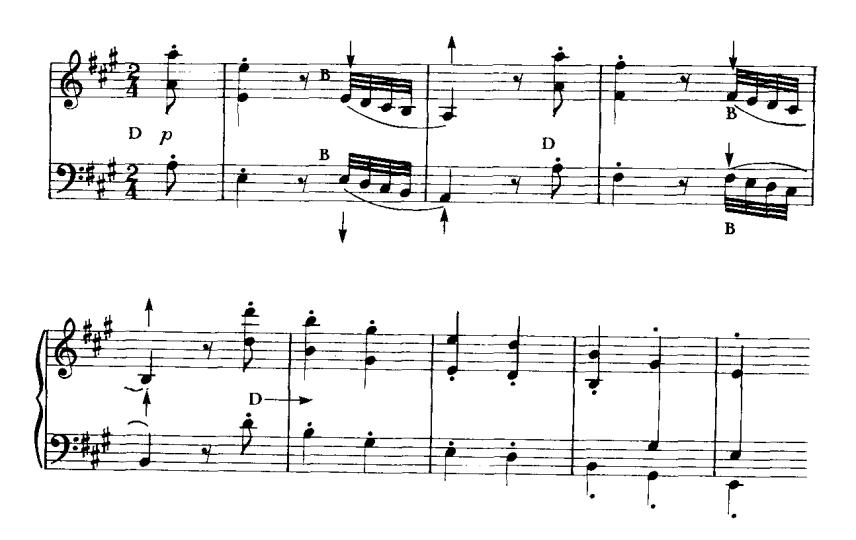

Example 19. Beethoven, Sonata, opus 14 no. 2, third movement

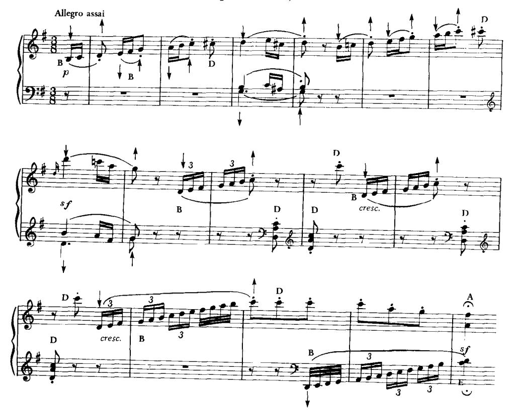

Example 20. Bach, Chromatic Fantasy and Fugue

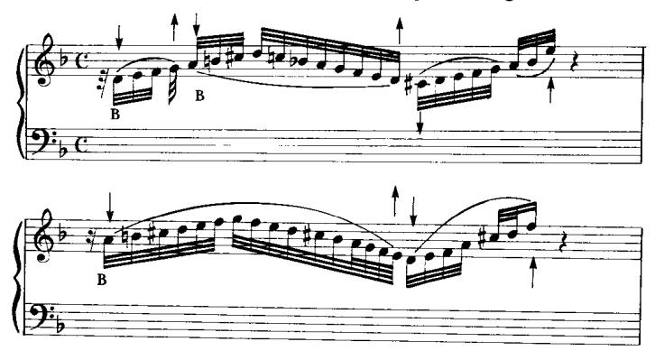

Example 21. Beethoven, Sonata, opus 31 no. 3, first movement

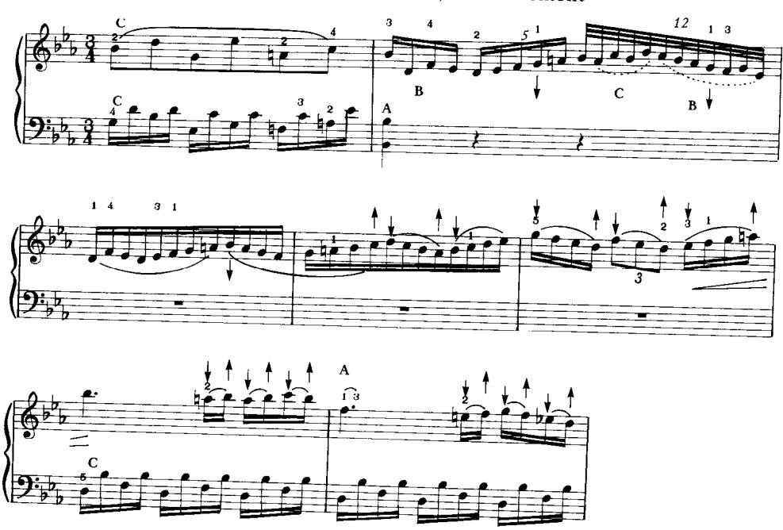

Example 22. Chopin, Prelude in B Flat Minor, opus 28 no. 16

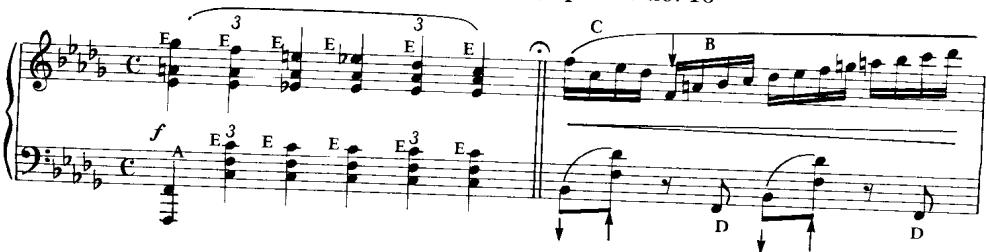

### (Example 22 continued)

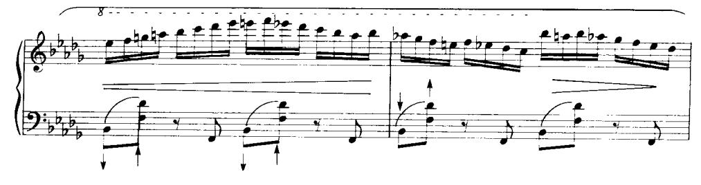

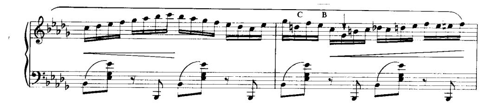

Example 23. Chopin, Etude, opus 25 no. 2

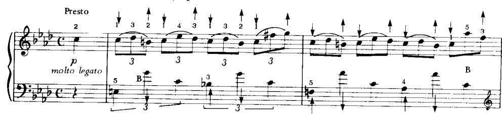

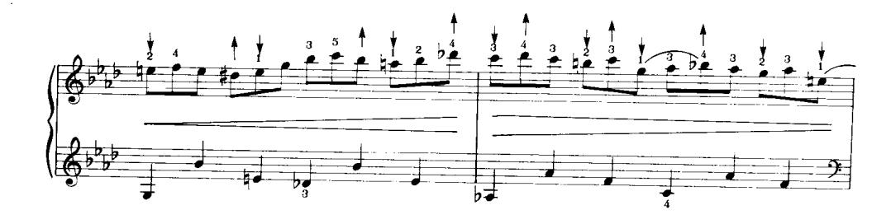

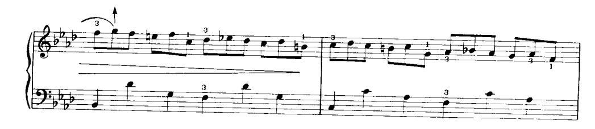

Example 24. Chopin, Sonata in B Minor, opus 58, second movement

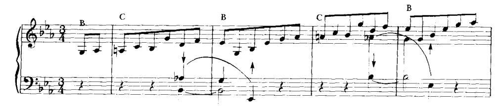

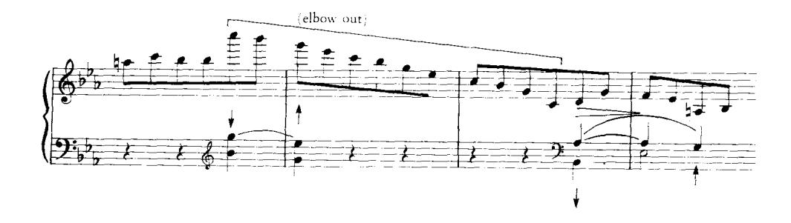

Example 25. Chopin, Sonata in B Minor, opus 58, fourth movement

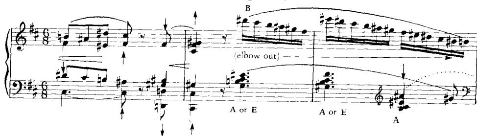

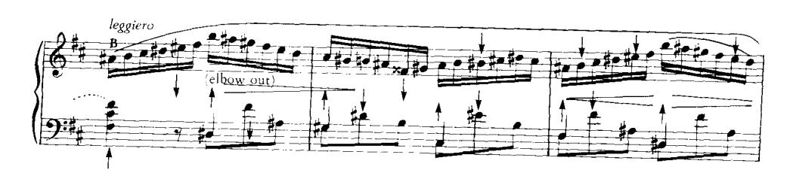

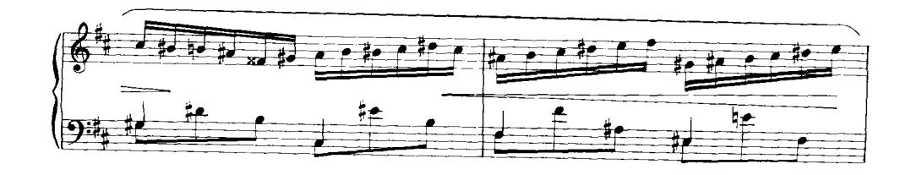

Example 26. Liszt, Concert Etude No. 2 in F Minor ("La Leggierezza")

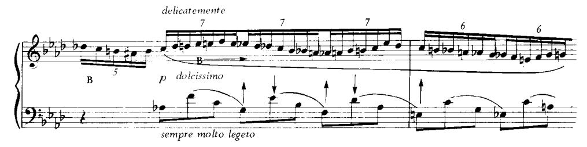

Example 27. Chopin, Prelude in F Major, opus 28 no. 23

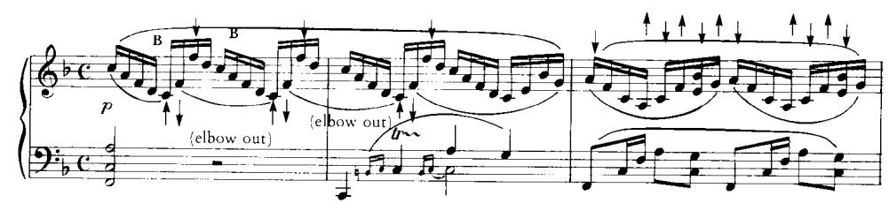

Example 28. Liszt, Spanish Rhapsody

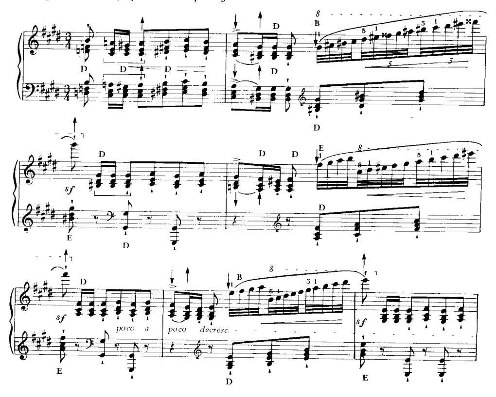

### **CHAPTER**

## 6 Rotation

#### Rotation

Scales and arpeggios constitute a large part of piano playing, and the technique required in this activity takes care of a major share of pianistic problems. Rotary motion of the forearm, however, is eminently important too. We call it simply *rotation* because we are seldom concerned with the rotary motion of any other part of the playing mechanism. Only occasionally will I refer to the rotation of the torso and to the upper-arm rotation that participates in the lateral motion of the forearm.

Rotation is very helpful in adding power and speed to the fingers; if it is properly done, there will be no strain in the arm whatsoever. In general, the scale motion (B) is used when several notes proceed in one direction (either up or down the keyboard). Rotary motion (C) is applied whenever notes go zig-zagging, up and down alternately.

### Example 29. Rotation patterns

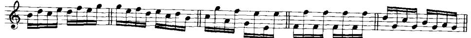

These and similar passages indicate that the use of rotary motion is the technical solution.

Pronation; supination

Before I describe the technique of rotation, let me mention the role of the ulna and the radius, the two bones of the forearm. When the arm hangs freely next to the body, these two bones are in a parallel position. This is the forearm's most natural position. Because the two bones are in their central position, they can move into pronation or supination quite comfortably. In this central position the thumb points forward. *Pronation* results in turning the thumb toward the body, supination in turning the fifth finger toward the body. Now when we raise the forearm from this central position, the thumb points upward. This is roughly the position of the arm and hand used in playing the

harp. We, however, want to play the piano, not the harp! Therefore we must bring the hand into a horizontal position with its palm down; this is done by pronation. You will notice now that when you put the hand in a completely horizontal position, you will feel considerable tension in the inner portion of the forearm (that is, in the flexors). Unless you move the upper arm away from the body, the forearm will be brought into its extreme position in which the ulna and radius will be crossed to their utmost and the pronation will be complete. This stiff, rigid position will cause severe tension in the forearm even before you play a single note. If you hold your hand and arm like this for a few seconds, even without playing, you will feel fatigue in the forearm flexor area. However when the upper arm is raised, the ulna and radius will be removed from their extreme position and relieved of tension, and the hand can assume its horizontal position without extreme pronation.

Therefore our ground rule is: whenever you sit down to play the piano, do not press the upper arm toward the body. The old school advocated an upper arm motionless and close to the body; it even demanded that a book be held under the arm or that a penny be placed on the hand in this cramped position. It disregarded the basic anatomic facts of the ulna and radius mentioned above and made you start off to play the piano under extreme handicap. The underarm was stiff to begin with and the immobilized upper arm was unable to adjust and help the fingers; as a result, one felt continuous tension and fatigue in the forearm. The teachers of the old school wanted to eliminate the sensation of fatigue by strengthening the forearm muscles (they called them "finger muscles") with "finger exercises." No wonder fatigue was the result! They put your arm muscles in a straitjacket before you even started to play "Chopsticks."

It is essential to avoid such excessive pronation of the forearm. Actually avoiding it is quite simple—just don't do it! Don't press down the upper arm. Raise your upper arm slightly, and the extreme tension caused by an excessive pronation will disappear. The other extreme—that of excessive supination—is no threat because we don't ever reach that position when playing the piano.

Once the upper arm is in position, the forearm, wrist, and fingers can easily line up, and you can start to play the piano effortlessly. So please remember: don't lock the upper arm in; move it away from the body and make it accomplish all the adjusting motions the finger requires in cooperation with the forearm and the wrist.

Rotation is primarily a forearm motion executed by muscles that adhere to the upper arm and forearm. During the axial rotation of the forearm the upper arm's role is passive; the upper arm merely places the forearm in the position where it can actively execute the rotary motion, and where it transmits its effect to the fingers. Only the fore-

Axial rotation: active and passive participants Role of the fingers and the forearm

arm and the fingers are active; the upper arm and the wrist are both passive. The wrist doesn't participate in the motion at all; it doesn't move up or down or else it would obstruct the rotary motion. The eventual movement of the upper arm during rotation is a purely passive one; it is merely a response to the activities of the moving forearm. I wish to emphasize this fact because it is erroneous to think that the upper arm is an active participant in pure forearm rotary motion. The upper arm becomes active only when it adds a lateral dimension to the axial forearm motion in order to reach wider intervals; it is not active in pure axial forearm rotation.

Pure axial forearm rotation is used for small intervals, up to about a sixth or a seventh, depending on the size of the hand. The role of the forearm's axial activity is to add power and speed to the fingers, which must be active at all times. The fingers should be slightly raised before playing, and both pronation and supination will add distance from the keys to the finger that is about to play. The forearm should be located in the center in relation to the fingers that play. For instance, if the thumb and fifth finger rotate, the forearm should be in a position where it is aligned with the third finger; it should also be in this position for the 2-4 combination. If you use the 2-5 combination while you rotate, the forearm will be somewhere between the third and fourth finger positions. When you use 3-5, you should be in the fourth-finger position, etc. While rotating double notes, the forearm should be in a central position between the two innermost fingers.

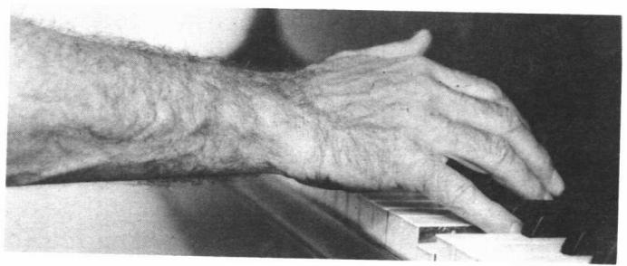

Figure 44. Supination on the fifth finger

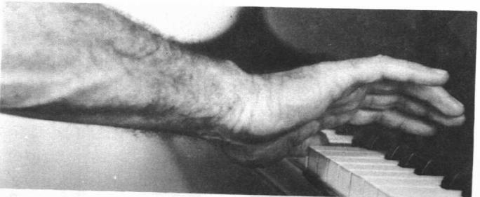

Figure 45. Pronation on the thumb

For extreme distances: lateral motion of the upper arm

As I mentioned before, when the interval to be rotated increases over six or seven notes, we add a lateral component to the motion of the forearm. This lateral motion of the forearm is possible only if we make an axial rotation of the upper arm that enables the forearm to move horizontally also. Its size conforms with the increased interval. Moreover, in very wide distances the upper arm may make a lateral motion (from the shoulder down) in addition to its axial rotation. We can cover practically the whole keyboard with this motion.

Example 30. Liszt, Mozart, Don Juan Fantasy

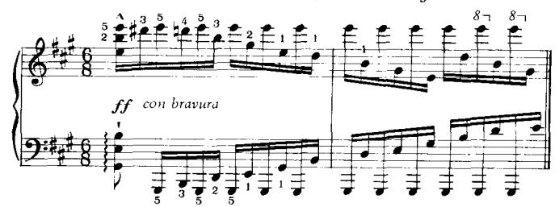

Both fingers and forearm must be active.

In both the purely axial and the combined rotary motions, the forearm rolls from one side to the other. When it is at the thumb's side (pronation), the fifth finger must be slightly (actively) raised and ready to receive the subsequent throw (supination) that will roll the arm over to the fifth finger's side. When the arm is rolled over to the fifth finger, the thumb will be raised and ready for its turn to be thrown by pronation. It is a composite motion; one cannot rotate purely by the forearm with the fingers staying passive, nor if the fingers are overactive and the forearm is inactive. Proper coordination and timing are needed; the fingers and the forearm have to complement one another. The rolling movement of the forearm is steady; it is not sudden, but rolls from one side to the other with steady speed. When we increase speed, the size of the motions will be reduced. But the motions should never be sudden and jerky. The fingers are moved by the arm in an arch, and when the tempo increases, the arch becomes flatter; at maximum speed the arch resembles a straight line. However, as I said before, the fingers are slightly active at all times, while receiving the throw from the forearm in their ready (raised) position.

Location of the elbow

We must be sure that the elbow is placed correctly; it doesn't change its location unless the intervals and notes change. It must be equidistant from the extreme fingers that play. Rotation is fundamentally a symmetrical motion that provides equal throw to the fingers. If we want to emphasize a certain finger so it can be heard more, we raise it slightly and thus it can receive more throw from the forearm;

Elbow shift

we increase its distance from the keys by turning the forearm more toward the opposite finger. This may seem puzzling, but it really is quite simple: we don't produce more sound by more weight, but by greater speed from a greater distance from the keys. Since the element of time is the same for both notes, speed will be increased by increasing the distance. So, if you want to feature the fifth finger, turn the arm more toward the thumb.

When we rotate on black keys, the general arm position is higher, and the upper arm is placed slightly forward and sideways (just as it is adjusted in free fall and scales). This position maintains the straight line between the elbow and the fingers. If the rotation is on one black and one white key, the position of the elbow must be changed accordingly. If the right thumb is on a black key and the fifth finger on a white key, the elbow moves closer to the body; if the reverse is true, the elbow moves outward. If we play a descending chromatic sixth sequence, the elbow will be very busy moving right and left, to conform with the above conditions. If the elbow fails to adjust, the hand and fingers will stiffen and play unevenly, skipping notes. If the elbow's continuous shifting is well executed, ease and evenness for the fingers and the elimination of stiffness are guaranteed. These adjusting motions of the elbow should be minimal and very precise. They should be noticeable only in slow tempo. At high speed they

Figure 46. Pure axial rotation: (a) pronation, (b) supination

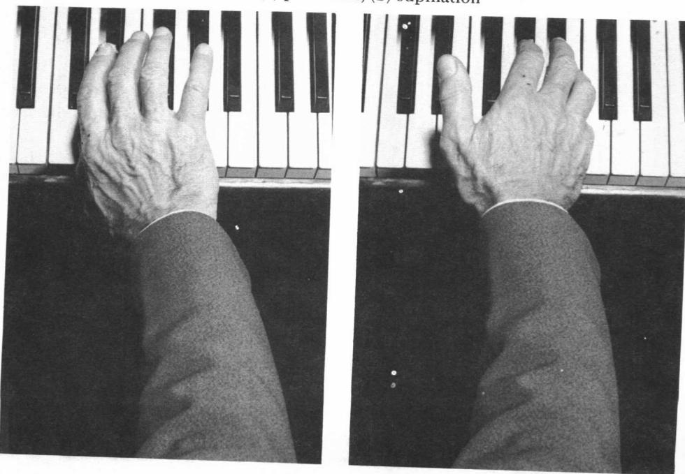

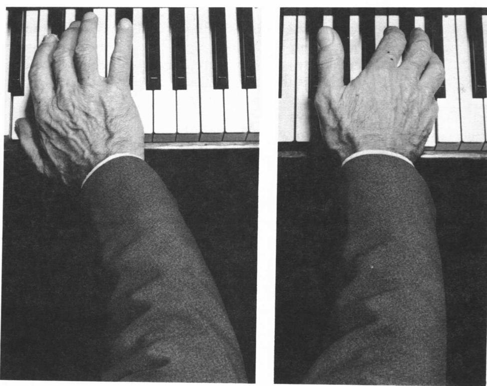

**Figure 47.** When larger intervals are played, lateral motion of the forearm is added to axial rotation.

become practically invisible, but they are nonetheless there. The reason that we go into such detail is that we are concerned with the learning processes, and it is in the slow tempo we use for practicing that these motions must be brought into play; however they are essential in any tempo.

Here are a few reminders. The wrist must be inactive, and it must avoid any twisting motions. It holds the hand steadily, in straight continuation of the forearm. The fingers must be active, but they must never reach out to the next note. Reaching out is one of the most common errors, and it must be watched carefully: the finger must be slightly raised, but it must stay on the same side where the arm is rotated until the arm begins its turn in the opposite direction and transmits its throw to the finger. If the finger reaches away toward the next note, it loses distance from the next key to be played; there will be tension, and, worst of all, the motion will originate from the finger: it will disrupt forearm rotation, decrease the distance and speed, and the finger begins to force. Here's a final hint: if there is an extended loud rotation passage, we can always alter the position of the arm and

The fingers should never reach out toward the next key. Guidelines for rotation elbow, going up or down slightly, in order to avoid a fixed position and prevent fatigue.

Guidelines for using rotation follow:

- 1. Find the right position for the arm, hand, and fingers. Silently press down the keys to be played; the elbow should be in a central position. Now test the pronation position by raising the fifth finger; most likely your elbow will rise to the point where the upper arm can remain static during rotation. This point is the right location for the elbow (upper arm) for these particular notes. The elbow should move from this position only when you change notes.
- 2. The wrist functions only as an inactive connecting joint; it should never move independently and it should not twist. It aligns the hand with the forearm according to the fingers used, and it helps to establish the elbow in its central position between the two or more fingers involved. If there are more than two fingers in action, the elbow is equidistant from the two inner fingers.
- 3. The fingers' role can never be replaced by the rotating forearm; it can only be complemented by it. For instance, if the second and fifth fingers rotate in pronation, the fifth finger must be raised slightly but actively; if they rotate in supination, the second finger must be raised. Even in fast rotation the fingers must be raised actively somewhat before and after playing.
- 4. When rotation takes place in the middle of the keyboard, the upper arm is jammed in, and it will feel stiff. To avoid this uncomfortable situation we should move the body slightly away from the upper arm; if both arms are engaged, the body should lean slightly backward. By the same token, if both arms rotate simultaneously at the opposite, outer extremes of the keyboard, the body should lean forward to avoid stretching the arms unduly and placing the hands at an extreme angle.

Exercises for forearm rotary motion

The essence of rotary motion lies in a passive upper arm, an active forearm, an inactive hand and wrist, and slightly active fingers. The hand and fingers receive the side-swinging effects of the axially rotating forearm. When the intervals increase and the axial rotation of the forearm no longer suffices to reach the notes comfortably, we add lateral motion to the rotation of the forearm by rotating the upper arm on its own axis. The forearm and finger motions are complementary: neither can substitute for the other. The elbow must be placed equidistant between the extreme fingers; it will be perpendicular to the imaginary line that connects the points where the two extreme fingers

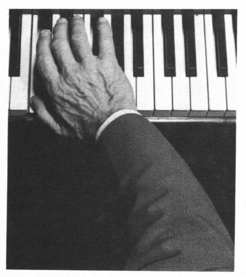

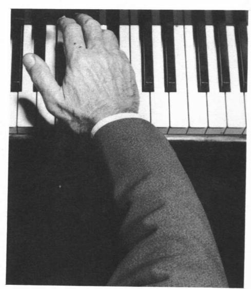

Figure 48. Rotation from white keys to black keys: elbow out

Figure 49. Rotation from black keys to white keys: elbow in

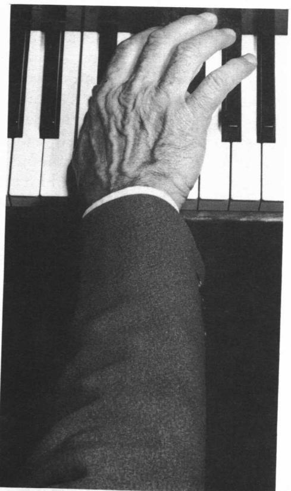

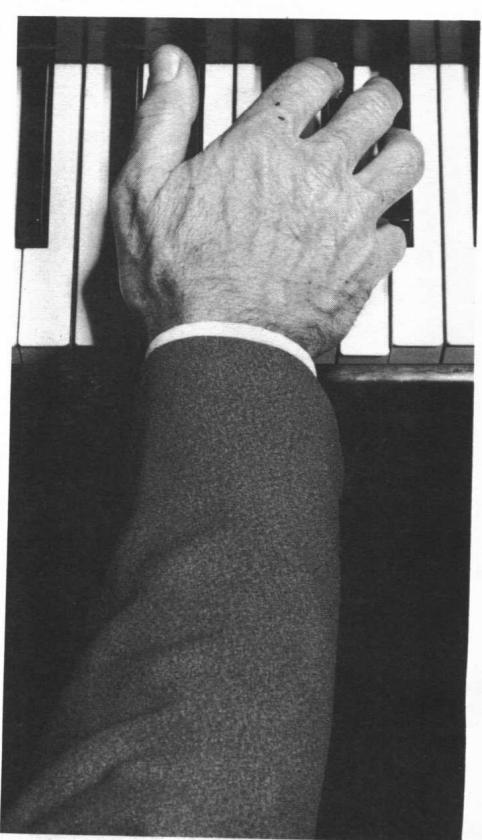

touch the keys. When we rotate on two black or two white keys, the position of the elbow is central between the two notes engaged. When one of the notes is white and the other black, the elbow shifts to be perpendicular to the center of the previously mentioned imaginary line that connects the fingers and adjusts its distance from the body, according to the keys and fingers.

### Elementary Exercises

Axial forearm rotation

Avoid shifting the elbow and watch the size and curve of rotation. The fingers should be raised, but they should not reach out toward the next note. The upper arm is immobile, and the wrist does not participate actively in the motion.

Example 31. Purely axial forearm rotation

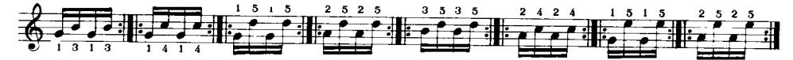

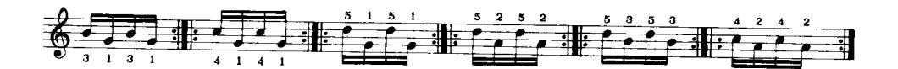

Do these exercises with the left hand too; play them two octaves lower than in example 31 so that the arm is free and not too close to the body. Add sharps and flats, play them hands together in both a parallel and symmetrical manner, and start the exercises from any note and any register of the piano; watch your elbow and body position here also.

Use the same type of motions for double notes and chords in rotation. Do the exercise with the left hand too; alter notes at will in order to avoid playing mechanically. Symmetrical motions for both hands are easier than parallel ones.

Example 32. Rotation of double notes and chords

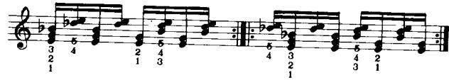

Lateral motion of forearm added to axial rotation

Where intervals are larger, we add a forearm lateral motion, produced by the axial rotation of the upper arm (see figure 47). The fingers must not reach out to the next note (they couldn't reach it anyway), and the wrist must still remain inactive. With the help of upper-arm

Lateral motion of upper arm added to its rotation rotation, the forearm is brought to the position where it can throw the fingers exactly as it does with smaller intervals. For distances up to two octaves (approximately) the elbow doesn't have to change location; for larger intervals the entire upper arm moves laterally too. However this type of movement is most unusual.

Add sharps and flats to example 33 also; use any larger intervals and any register of the piano.

Examples for rotation

Example 33. Lateral motion added to axial rotation

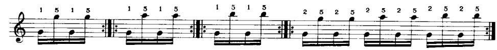

### Symbols

- Afree fallDstaccatoBfive-fingers, scales, arpeggiosEthrustCrotation↓low wrist
  - ↑ high wrist

C is the symbol used for rotation, the motion discussed in this chapter. You are already familiar with A and B. D and E are discussed in chapters seven and eight, respectively.

Example 34. Bach, Well-Tempered Clavier, book 2, Prelude No. 15 in G Major

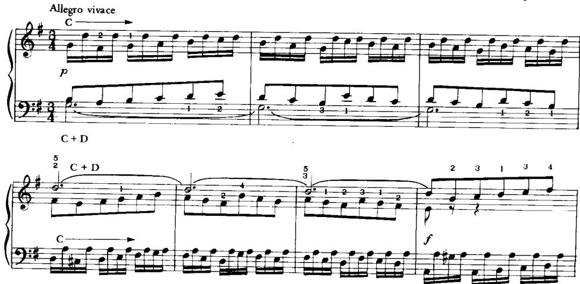

Example 35. Haydn, Sonata in E Minor, third movement

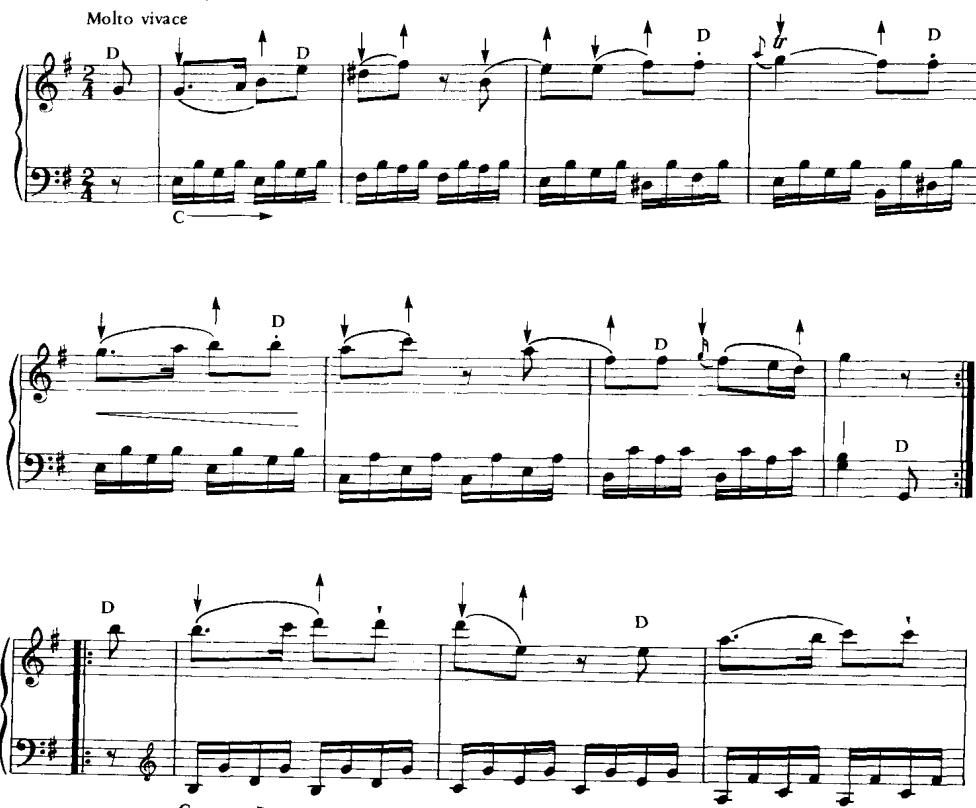

Example 36. Mozart, Sonata in A Minor, K. 310, first movement

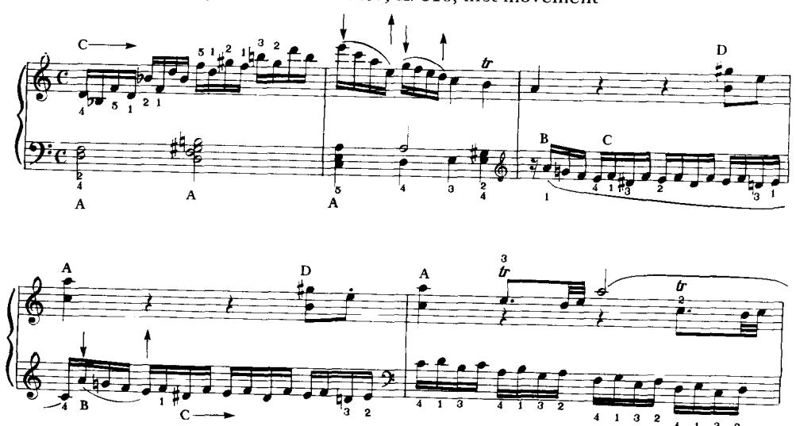

### (Example 36 continued)

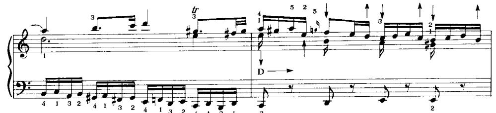

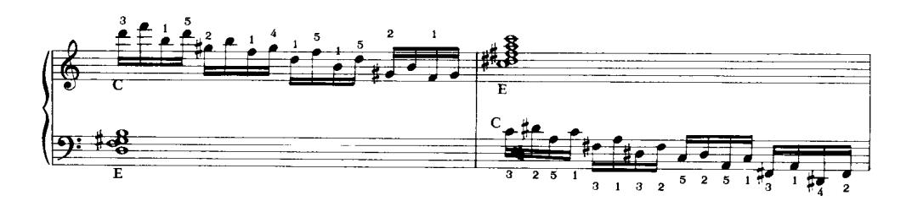

Example 37. Beethoven, Piano Concerto in G Major, opus 58, third movement

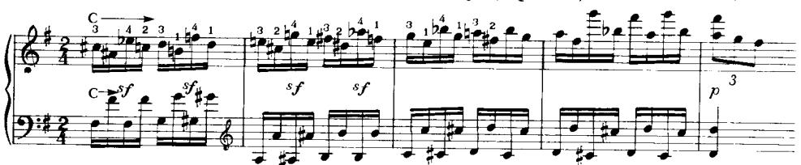

Example 38. Beethoven, Sonata, opus 26, fourth movement

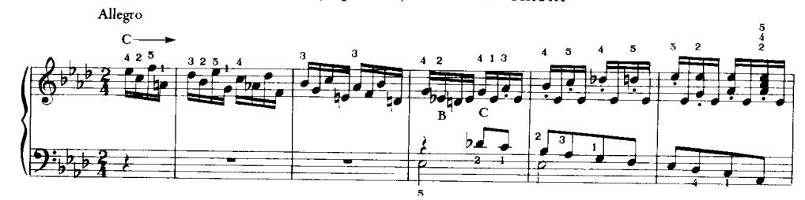

Example 39. Chopin, Etude, opus 25 no. 1 Allegro sostenuto

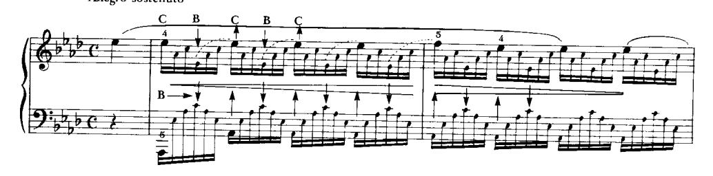

Example 40. Brahms, Variations on a Theme by Paganini, opus 35, book 1 variation 4

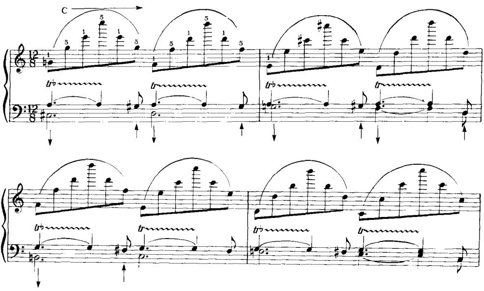

Example 41. Schumann, Carnaval, opus 9, "Paganini"

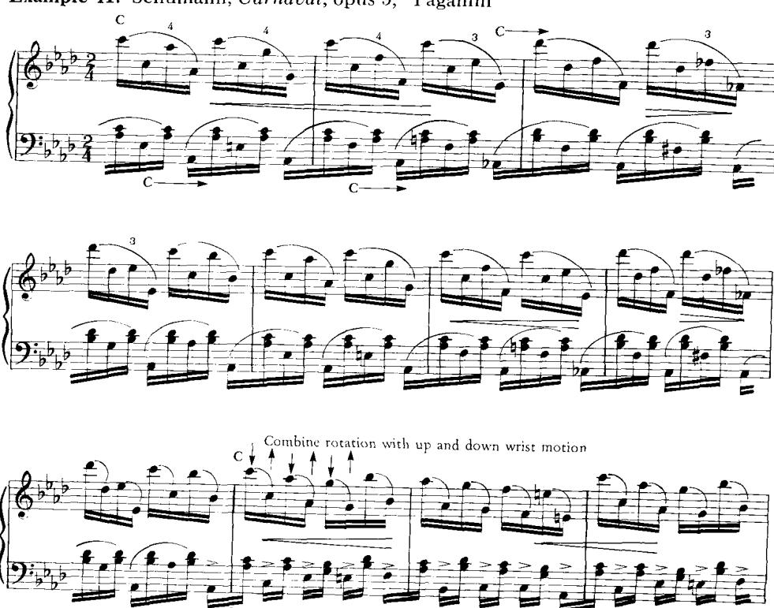

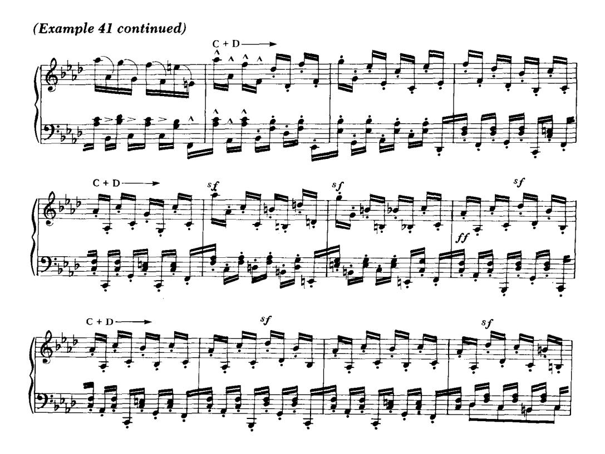

Example 42. Ginastera, Sonata, second movement

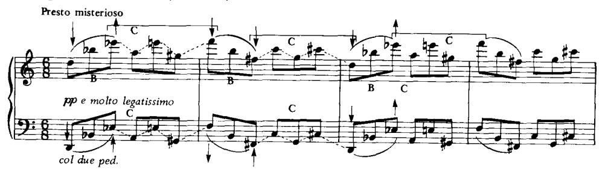

## 7 Staccato

Same technique for staccato single notes. double notes, and chords

Entire arm active at all times

Octaves are one of the most spectacular activities in piano playing. Professionals and amateurs alike seem to be fascinated and impressed by octaves, possibly because of the stormy, dynamic quality and the immense volume of sound that is produced by some virtuosos. Undoubtedly one often experiences a quasi-hypnotic effect when listening to the excitement and the irresistible sweep of crescendos in Liszt's "Funérailles," Balakirev's Islamey, and Chopin's Polonaise in A Flat Major, opus 53.

In our attempts to simplify and classify technical formulas, we will equate the motions of octave technique with those of the ordinary staccato—grandiose as these sound effects may be. While we realize that legato octaves and pianissimo octaves also exist, we nevertheless maintain that even in them the fundamental motion pattern is identical to that of staccato single notes, double notes, and chords (with certain modification, of course). The technique of staccato involves an active and coordinated arm, wrist, hand, and finger motion in which all the components participate simultaneously. By sharing this motion, extreme speed and volume can be achieved with complete effortlessness. Again our aim is not relaxation but a minimal expenditure of energy with optimal results. If the arm in its totality functions well and if it is activated by the strongest muscles of the body (the chest, back, stomach, and diaphragm), we can achieve maximum speed and volume with no strain. Actually the maximum speed with which we can play staccato octaves is about the same as that of a wind player playing staccato notes. It is a matter of coordination and reflexes; a well-synchronized mechanism can create wonders.

In scales and arpeggios and in rotation, most muscular activities take place within the forearm area, and they are helped, actively or passively, by the upper arm. However in the staccato motion the entire arm, including the upper arm, is actively engaged at all times. In

Throwing must come from the upper arm; fallacy of the "wrist" staccato addition to the fingers, hand, wrist, and forearm, we must activate the upper arm continuously; it gives us an added source of power that is essential to this motion. Since in all composite motions both the nature and size of the movements involved must be determined correctly, it is necessary to define the exact role of the upper arm as well as that of the rest of the components. Remember that the upper arm is the link that connects the strongest body muscles to the fingers.

Essentially staccato motion is a throwing motion. The throw has to involve the entire arm, the hand, and the fingers. We are familiar with the conditions of making sounds on the piano: the keys move vertically, and therefore the most effective way to transfer energy to the keys is in the vertical direction. The fallacy of playing a "wrist staccato" is manifold: first, if we use the wrist alone, we are utilizing exclusively and overburdening our comparatively weak forearm muscles. Furthermore, when the lever that is used (the hand) is very short, the curved line traced by the fingertips is rather pronounced; consequently the desired straight vertical descent of the fingertips cannot be attained.

Figure 50 shows the synchronized action of the upper arm, forearm, hand, and fingers in the staccato motion that enables the fingertips to descend vertically. The greatest amount of movement takes place in the hand and fingers, and there is a minimum of movement in the upper arm.

Figure 50. Synchronized action of the upper arm, forearm, hand, and fingers in the staccato motion

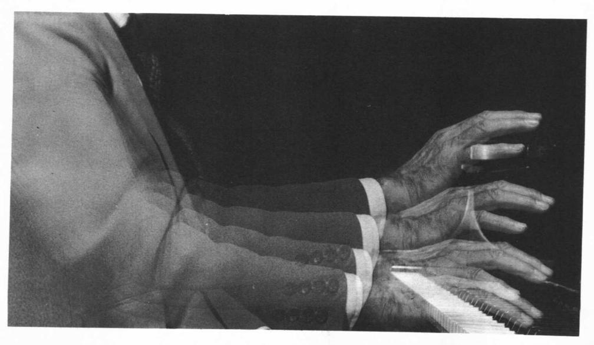

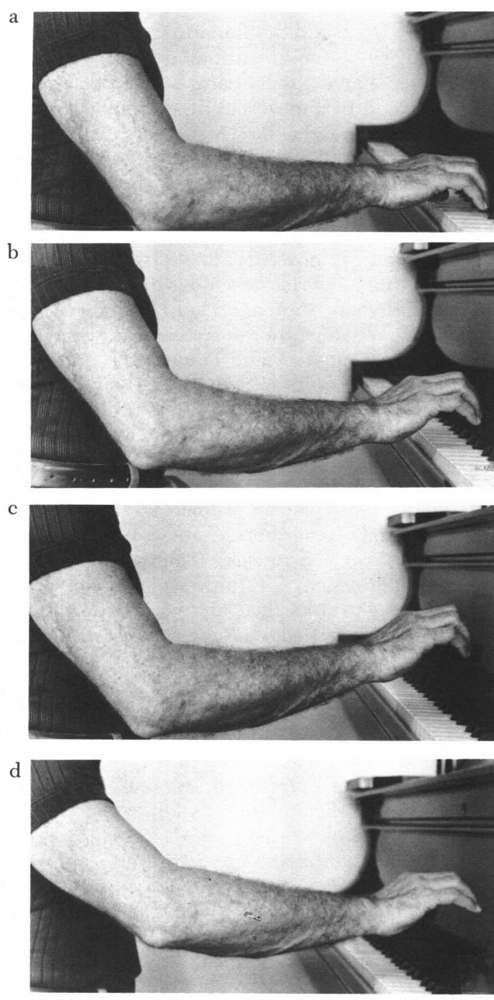

Figure 51. Staccato: simultaneous, gradual lifting of the (a) fingers, (b) hand, (c) forearm, and (d) upper arm

Optimal throw of the fingertip by activation of the hand, forearm, and upper arm

Coordination is essential.

Four components at all times

Upward and downward synchronization of the entire equipment If we add the forearm to the wrist motion, we are somewhat better off since we are utilizing stronger muscles—the upper-arm muscles that move the forearm (the biceps and triceps). Although the path traced by the descending fingertips is a less extreme curve, it is still not a straight line. Also, we still have no chance to activate the body muscles. The only way to produce a straight vertical line for the descent of the last phalanx of the finger is to activate the upper arm. And only with the aid of the upper arm can the strongest body muscles (the shoulder, back, chest, stomach, and diaphragm) participate in the throw. It now becomes obvious that the reason we get tired when using the wrist staccato is that the forearm muscles are relatively small and weak; they need help from the stronger body muscles.

We must therefore learn how to activate and cooperate with these larger muscles and generate the throw from the body itself. No ball player would dream of using only his wrist unless he wished to throw the ball a minimal distance. A pitcher's hand is thrown by the forearm, the forearm is thrown by the upper arm, and the upper arm is activated with the help of a strong twisting motion of the entire body. These motions involve the utmost coordination and efficiency. What happens in piano playing is that we throw the fingers toward the keys in a similar coordinated and effortless way. Our hand is thrown by the forearm, the forearm is thrown by the upper arm, and the upper arm is thrown by the powerful muscles of the body (no twisting motion though!). We then lift the fingers with the same active apparatus. In the loudest and fastest staccatos we can also take advantage of the rebound from the keyboard.

By using a considerably longer and larger equipment than the hand alone, by distributing the up-and-down motions among four components instead of two, and by using the powerful muscles of the shoulder and chest instead of the weak forearm muscles, we are infinitely better off in terms of economy, endurance, and tone quality. Because of the efficient cooperation of the total equipment there is no trace of fatigue even in the most demanding passages, and there is a much better sound and greater identification with the music.

Let us examine the above points one by one. The activation of a longer lever obviously helps to generate greater speed at the extremity of the playing equipment; the result is a larger sound that is produced in a more economical way. The distribution of the motions is also advantageous; for example, if we want to raise the fingertips eight inches above the keys using the wrist alone, the hand will move about thirty-five degrees (see figure 52). Now, if we wish to cover the same distance by distributing the upward motion so that all components of the arm participate, we will only use a tiny motion by the fingers, a

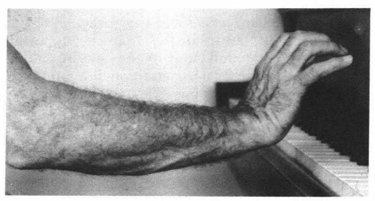

Figure 52. Excessive raising of the hand while keeping the forearm immobile causes excessive tension (wrong position).

tiny motion by the hand, a smaller motion by the forearm, and a still smaller one by the upper arm. The individual motions are minuscule, but with the correct synchronization, the result will be perfect and effortless. If we can get up to eight inches of height with minimal motions, how much less we'll have to move in rapid tempos when we need to come up only a fraction of an inch. All this is achieved by the distributed motions within a synchronized equipment. The synchronization of the motions both up and down is essential. When we go up, there must be a slight simultaneous rise of the finger, hand, forearm, and upper arm. The size of the individual motions is not only small but smaller and smaller as we proceed toward the larger ingredients: the upper arm moves the least. When we go down, all four components again move simultaneously. This condition is absolutely necessary. One error that is frequently made in playing staccato is that the arm is lifted but the hand is allowed to hang down passively, "relaxedly." The passive hand obstructs the throw motion! The hand and fingers must come up together with the rest of the equipment.

Let us now examine the various stages of the staccato motion. We

have discussed how to raise the arm, getting it into position before the throw begins. In the free-fall motion we prepared and lifted the arm and then simply inactivated the shoulder muscles to let the arm drop freely by the force of gravity, without interference or throw. The staccato motion differs from free fall in that here we actively throw the arm with the help of the shoulder and chest muscles: the throw is minimal, but it is active. The force of gravity also contributes to the downward motion but the main source of energy is one's own muscles. Also, in high speed the path covered is extremely short, so there is no time for the gradual acceleration caused by gravity. All the compo-

Active motion by all four components

nents are active and they execute very tiny motions. They receive a throw that originates from the upper arm, with the muscles of the shoulder and chest. When landing on the key and on the way back, all components must go through a minimal but definite change in every one of their joints. This minimal change guarantees that the muscles will not get fixed and stiff. Obviously these changes will be totally invisible in fast tempos, but they will be there! Please do not exaggerate any of these changes either, otherwise the relationship among the four components will be affected: the distribution has to be right. We can verify that we are performing the motions correctly by seeing that the fingertips move in a completely straight vertical line in the updown motion.

We must be careful to avoid the following: stretched fingers at the landing, overly drawn-in fingers, a wrist either too high or too low, excessive forearm action, an immobilized forearm, excessive upper-arm motion (which causes excessive forward motion of the hand that disrupts the vertical approach to the keys), and insufficient movement of the upper arm.

Since we are playing staccato, we spend as little time as possible on the surface of the keys; when landing on the keys, the time spent on the surface will be a mere fraction of a second. The moment the fingers touch the keys, we immediately lift the entire equipment (the fingers, hand, and arm), raising it to its original position to receive the next throw. The hand and fingers must bounce back immediately as if dribbling a ball, or as if the keys were sizzling hot!

It is also important to lift up the entire arm simultaneously—not the arm first and then the hand as in the free-fall lifting, but the whole unit together. This motion is essential. We must place them again in a position where they can best receive the throw which is within their central range.

Since we want to utilize any help we can get, we also take advantage of the rebound from the bottom of the key. When we play loud and fast, we throw the fingers to the bottom of the keys; since the keybed is made of elastic material, it responds with considerable rebound. When we come down with vigor, we feel quite a strong recoil. This counteraction to our action can be of considerable advantage in lifting the equipment, our next chore before throwing it down again. An elastic hand and arm, therefore, receive considerable help from the keybed itself. Therefore in extreme fortissimo passages played at top speed the staccato action may be reduced to a purely downward active throw; the upward motion is automatically taken care of by this upward rebound. This is the way to play some of the most spectacularly rapid fortissimo octaves and chords.

Time spent on keys is minimal.

Entire equipment is lifted simultaneously.

Rebound from keybed Innumerable variants in combinations of the four components

White and black keys

The body moves.

Adjusting motions: lining up the fingers with their muscles

Legato octaves

After we acquire the habit of using the entire arm for staccato, we can explore innumerable variants of this motion. They are innumerable because, although only four components are involved, we can vary their speed, height, and position, and we can vary the prominence given to the fingers, hand, forearm, and upper arm or to any combination of these components. While we always use the entire apparatus, we may alter slightly the amount of finger action, wrist action, forearm action, and upper-arm action; we may also vary a combination of any two or three components (forearm-fingers, wrist-fingers, forearm-wrist, and so on). The potential for variety in sound production is also unlimited since sound is the result of motions that generate it and you will have different tone qualities and quantities according to the way the equipment is used. Obviously a light sound results from using more finger and wrist action than forearm and upper-arm action. We may choose the components to emphasize, but it must be the entire mechanism that always works. No "wrist staccato," please—don't use the wrist exclusively.

Concerning white and black keys, the same considerations are valid as for the free fall, scales and arpeggios, and rotation. Because of the topography of the keyboard the playing equipment has to be placed higher when you play on the black keys. If they are used extensively, the forward position of the arms is helped by a slight leaning forward of the trunk; that position can reduce the forward motion of the arm.

If we keep on changing the position of the body continuously, we help to free joints of any fixed, immobile condition. Don't move too much, though; just move a little—in the direction where you play: the less the better.

To line up the fingers with their respective forearm muscles is just as necessary in staccato playing as in scale and free-fall playing. Lining them up is done by a horizontal, vertical, and in-depth adjusting motion. Because of this alignment the throw from the upper arm is received much more directly, and it is transmitted through the fingers straight to the keys.

Legato octaves require basically the same up-and-down motions of the arm as staccato octaves, except for two things: first, the up-down motions (used on each note) are as gentle and small as possible, and, second, the fingers stay on the keys until the end of the metric value of the note. The legato effect is produced by the gentle depression of the key in the down motion while the next note will be connected by the slow descent of the damper caused by the slow-up motion of the arm. Incidentally notes are grouped together with the help of an upward motion of the arm, just as in ordinary legato playing. Whether the

Volume: joints

sequence of the notes is white followed by black or black followed by white, we don't have to go up-down on each note; we lower the arm gently on the first key and raise it on the key that ends the group.

The volume of the sound of legato octaves is regulated the same way as it is in staccato octaves: soft joints are used for soft sounds; resistant and resilient joints are used for louder sounds. Any fixation of the joints in forte playing should always be instantaneous and not prolonged.

The motion for legato-octave playing is more like a shift than a throw (see figure 53). The octave passages in examples 43 and 44 illustrate the contrast between the two types of playing motion; the Liszt sixth rhapsody calls for the staccato throwing motion, while the Chopin etude requires the shift of the legato octave motion. Bear in mind that this is not a wrist motion: the entire arm must always participate, helped by the body.

Example 43. Liszt, Hungarian Rhapsody No. 6

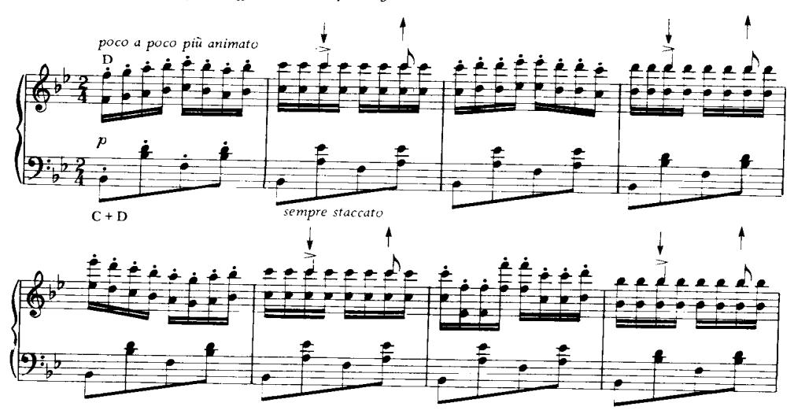

Example 44. Chopin, Etude, opus 25 no. 10

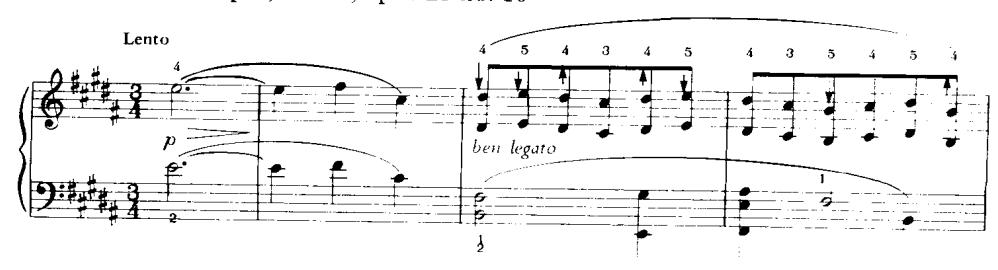

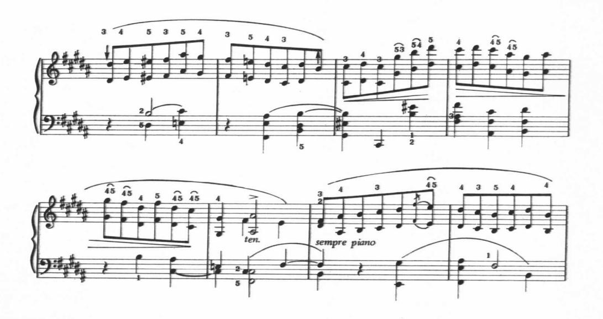

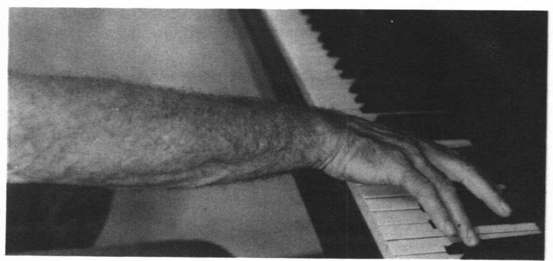

Figure 53. Elevation of the wrist for legato octaves on black keys

Eliminate strain,

If we adopt these ideas and live or, rather, play by them, the use of the strongest muscles of the body and the distribution of the movements will enable us to play without any strain. The need to strengthen the smaller muscles will be eliminated; instead of exercising muscles we will aim for coordination, synchronizing the small muscles with the powerful ones and enabling them to receive help. The resistance of the keys is not more than two ounces: if we tap the available powerful muscles, we have no excuse for feeling tired in our arms—or anywhere else. The force of gravity is always present, and will help us if we allow it to do so.

First practice individual components; then combinations.

Change in motion when accelerating

It is advisable to begin practicing the staccato motion with an awareness of all the components; at first concentrate only on the slight raising and lowering of the fingers, then of the hand, then of the forearm, and the upper arm. Next, synchronize them in two's and three's, before you attempt to master all four of them.

In the summary of basic technical patterns I will describe a certain change in the motions of the arm while accelerating the staccato motion. In the meantime let us concentrate on the correct assimilation of the fundamental motion itself (see page 104).

Guidelines for staccato

- 1. Single notes, intervals, and chords all require the same throwing motion when they are played staccato. Therefore octaves can be played just as quickly as the fastest single notes. Because the throw comes from the strongest body muscles, which transmit their energy through the entire arm, the entire arm must always be activated in the staccato motion.
- 2. The throw is initiated by the upper arm. Both in the down motion and the up motion the components act simultaneously. The speed of the motions is the same in both directions. The time spent on the surface of the keys (whether we "hit bottom" or not) should be as short as possible—a mere fraction of a second is all the time necessary—except in legato octaves, where we stay on the keys with the fingers.
- 3. The staccato motion is never sudden or jerky; if we want a louder sound, we make the joints more resilient or increase the distance of the throw, or we combine these actions.
- 4. When we move from finger to finger and from key to key, we must make a continuous adjustment in the arm and body position in order to prevent any fixed, stiff position. If we have to repeat the same notes with the same fingers for an extended time, we prevent fixation by slight changes of position of some or all of the components.
- 5. In legato octaves, we complement a minimal arm-throw motion with active fingerwork to connect the notes more easily. The throw is so small that the finger doesn't have to leave the key.
- 6. The staccato motion is often combined with other basic motions: scales (horizontal and vertical adjustment of the arm) and rotation are the most common ones.
- 7. There is no need to concentrate on and exercise the activities of the shoulder, chest, and stomach muscles; it is sufficient to practice the complete synchronization of the four elements of the arm (finger, hand, forearm, and upper arm). Once the body position is well established, the control of the active components of the arm is all that is

needed. If the arm works well, the strong muscles will step in when they are needed.

- 8. Every participating member of the playing apparatus should endeavor to operate within its central range; and should also continuously and purposefully change its position to let the antagonist muscles be activated.
- 9. Once the body muscles that help the arm in staccato motion are activated, the diaphragm can participate on its own. In a sense, it "initiates" the motion by means of its rapid contractions. The diaphragm can generate maximum speed—the same speed that singers and wind players can attain in their staccatos!

Exercises for staccato

- 1. Most faults in staccato (octave) playing are caused by the lack or excess of action in some components of the playing apparatus. As I have repeatedly stated, the upper arm, forearm, hand, and fingers must all be actively involved in this motion. The exercises aim primarily at achieving correct coordination by establishing at what rate each unit should move. The simplest way to test the correctness of the total movement is to check whether the up-and-down motion of the arm results in a vertical path of the fingertips. If there is too much or too little activity in any of the ingredients, this line will deviate from a line perpendicular to the keys. We must make sure that the adjusting motions of the forearm line up the fingers with their respective forearm muscles. Remember that all motions of the arm serve only one purpose-to help the fingers receive and transmit their throw. After wide stretches (octaves or ninths) be sure that the hand has a chance to regain its central position: this is achieved by raising the hands and slightly pulling in the fingers. The wrist should not remain in a fixed position.
- 2. Use fingers 1, 2, 3, 4, and 5 successively (watch their forearm-adjusting motions); first play the exercises hands separately; then hands together, using both parallel and symmetrical motions. Play them on white and black keys, simultaneously and alternately. Graduate the volume from pianissimo to fortissimo. Use the same exercises for intervals of all sizes and chords. As the speed increases, the size of the motion will decrease.
- 3. Although staccato motion can be considered a simultaneous throw of all the components involved, there is nevertheless an infinitesimal time lapse between the initiation of the throw by the shoulder and its reception by the fingers. Therefore in fast tempos a slight

Shift of sequence of arm motion in rapid staccato

shift in the sequence and appearance of the staccato motion occurs. In slow tempos the fingers, hand, forearm, and upper arm move up or down simultaneously. In fast tempo, that minimal lapse of time will cause the fingers, hand, and forearm to go downward, while the upper arm moves forward (or up); when the first three components move upward, the upper arm moves back (or down). This slight alteration happens only beyond a certain fast tempo, and it occurs automatically. Do not be concerned with it; under no circumstance should you try to practice the staccato motion that way in slower tempos. All four components must move in the same direction and simultaneously, and the altered motion must come about involuntarily. When you become aware of this change, do not interfere with it, nor should you try to bring it about consciously either. As a matter of fact, when you play fast and are about to slow down, be sure that the original motion (the simultaneous one) returns. Then, when you accelerate beyond a certain speed, let the resultant motion come about automatically. You might have some doubts about this, but experience will validate my observations.

Example 45. Staccato patterns (single, double)

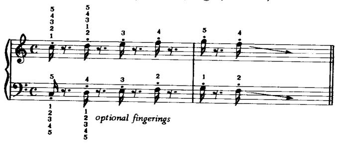

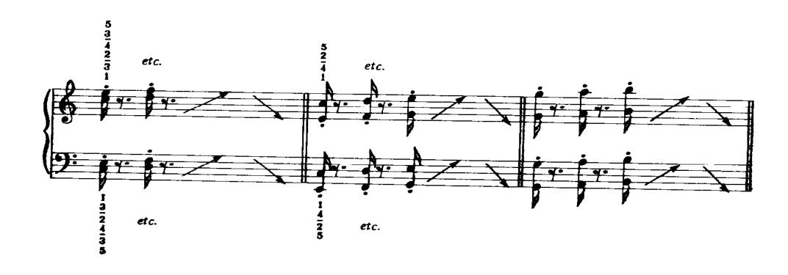

### Symbols

Examples for staccato

A free fall

B five-fingers, scales, arpeggios

C rotation

D staccato

E thrust

↓ low wrist

↑ high wrist

Example 46. Beethoven, Sonata, opus 14 no. 2, second movement

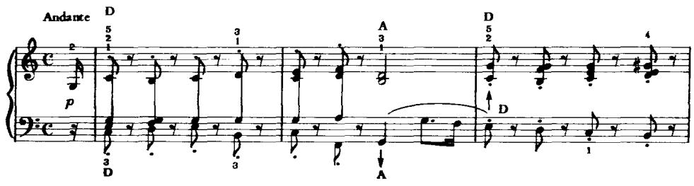

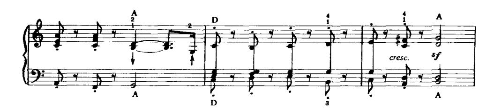

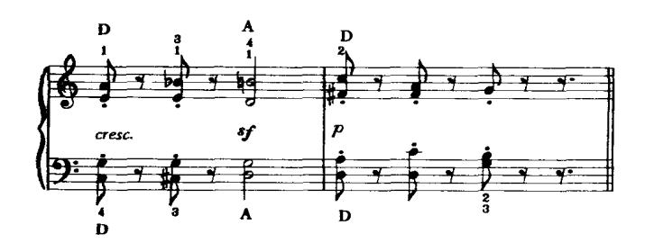

Example 47. Brahms, Variations and Fugue on a Theme by Handel, opus 24, variation 22

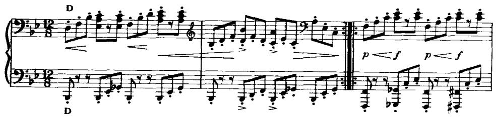

Example 48. Liszt, Sonata in B Minor

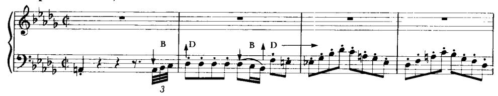

Example 49. Liszt, Transcendental Etude No. 4 ("Mazeppa")

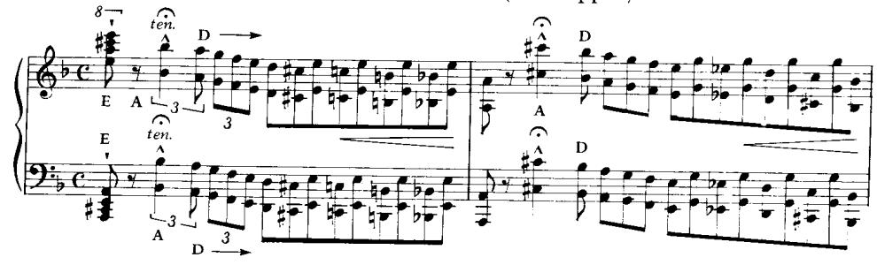

Example 50. Liszt, Spanish Rhapsody

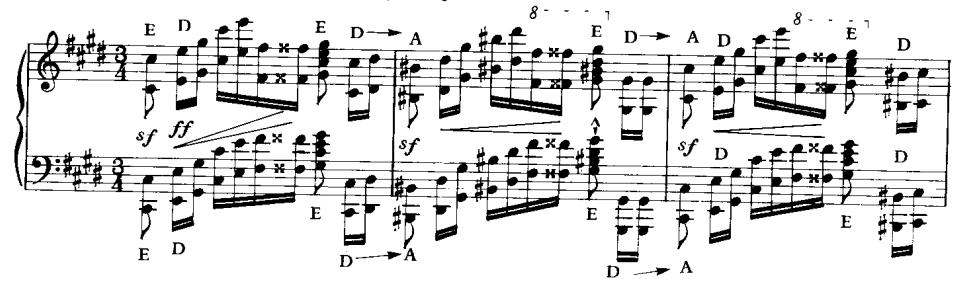

Example 51. Liszt, Transcendental Etude No. 7 ("Eroica")

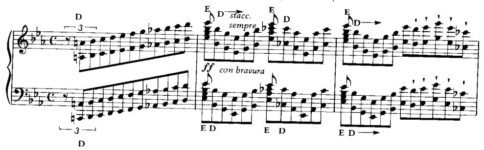

Example 52. Chopin, Etude, opus 25 no. 10

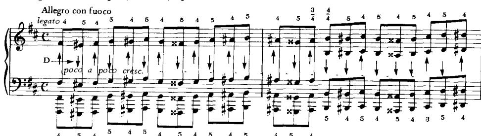

## 8 Thrust

Thrust vs. free fall

Thrust: maximum power and fast reflexes from the surface of the keys In the chapter on free fall (chapter four) we explained the technique of producing large sonorities primarily with the help of the force of gravity. The active involvement of the muscular system was limited to (1) lifting the playing equipment (the arms and the hands) and placing it in the proper position where the force of gravity could activate its downward fall, and (2) the instantaneous fixating of the forearm muscles when contact is made with the keys, enabling the fingers to transfer the full impact of the fall to the keys. After this split-second fixation the shoulder muscles immediately lift the arm to prepare it for the next fall. In the free fall muscles do not participate during the downward motion of the arm; its fall and acceleration are caused exclusively by the force of gravity.

The technique we will examine now, the thrust, is executed purely by active muscles, and neither the force of gravity nor weight are employed. Instead of raising the arm, hand, and fingers and exposing them to the gradual acceleration of the force of gravity, we place the fingers right on the surface of the keys and push the keys down with a sudden instantaneous contraction of some of the strongest body and arm muscles (the chest, stomach, back triceps, and forearm flexor muscles). This action generates maximum speed in the fingertips. In the thrust, unlike the techniques described before, the fingers are in constant contact with the keys; they touch the keys before, during and after the actual sudden muscle contraction takes place. The speed our powerful muscles generate by this lightninglike contraction is such that, were we to create distance between the fingers and keys, a crude, harsh and forced sound would result. Within the limits of the elasticity of the materials the piano is made of, the maximum sonorities of the instrument can be produced by this thrust from the surface of the keys. Since we use our strongest equipment only for a split second, the motion feels totally effortless, and since the muscles return to their original condition and shape immediately, they are ready at once for the next thrust.

No extended contraction or fixation. Downward direction

When to use thrust

We do not want to mix the thrust with either the free fall or with any throw motion. We must train the entire muscular system for this sudden electric-shocklike contraction during which the body appears to be motionless. First we must assume the right position for this action, and then we must not budge while the thrust takes place. The fingers stay on the surface of the keys, and the arms are slightly bent. The thrust must go vertically down into the keys, and the body must remain immobile to resist the rebound that takes place from the keybed. No matter how sudden and rapid the thrust, it will not produce a hard sound, since the fingers are in direct contact with the keys and their acceleration will not surpass the optimum speed for maximum volume. This last condition is essential; otherwise the speed of the thrust would compel the piano to produce a forced sound. A good, sensitive piano should never be forced!

In executing the thrust motion there is absolutely no need to push the arm upward, no need to lean during the motion, and no need to push the head forward. Also any prolonged fixation should be avoided at all costs. The contraction must be as sudden and as short as possible; otherwise stiffness and rigidity will occur.

As usual, the position of the body and arms is adjusted for playing on white or black keys (see figures 54 and 55).

The thrust lends itself to moderately fast passages and slow chord sequences. The sudden contraction followed by the total relaxation of the muscles obviously takes more time than a rapid succession of throw motions. However the sound is powerful and effortless. This technique is also ideal for wide stretches and chords, where the freefall motion would be risky. Of course, the degree and speed of contraction is optional: in fortissimos we utilize the maximum speed of contraction; otherwise we apportion speed according to the volume of sound we want to produce.

Figure 54. Position for thrust on white keys Figure 55. Position for thrust on black

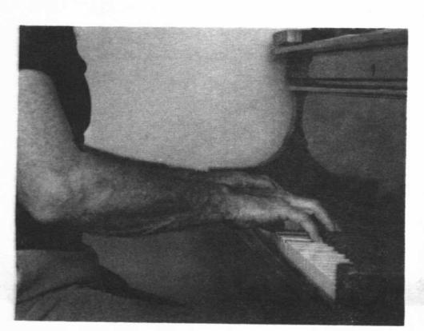

keys

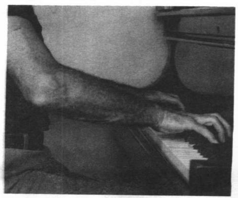

Summary

Here is a summary of the basic principles involved in the thrust:

- 1. The fingers must be in touch with the keys before, during, and sometimes after the push. Even at the loudest fortissimos, the muscular contraction is instantaneous and as brief as possible. The direction of the push is vertical, not slanted or upward. If we abide by these conditions, we will be able to produce the loudest sonorities without a trace of tension or fatigue. The speed of our reflexes can be developed by practice.
- 2. The suddenness of the contraction can be regulated at will. We need not think in terms of excessive fortes at all times; the thrust can serve mezzo forte or piano sonorities as well. The dynamic level depends on the abruptness of the attack. This motion is regulated by the extremely sensitive, tactile nerve endings of the fingertips, which are in continuous touch with the keys, and the volume is influenced by the degree of softness and elasticity of the joints at the moment of impact.
- 3. For large, extended chords thrust is preferable to free fall. There is less risk of hitting wrong notes; moreover a stretched hand position usually interferes with the free acceleration of the fall.
- 4. During the thrust the shoulders and body support the active role of the arms; they remain immobile when the thrust goes into the keyboard. Unless we hold the shoulders and body firmly in place, they will bounce backward by resistance from the keybed; during the thrust they should remain still. Visually, this activity appears surprisingly low key because the body remains immobile and the arms move downward only about a half inch. But it can generate the loudest bang the piano can produce!

Exercises for thrust

None needed! Apply the technique of thrust as it is described here to any chord or interval; and then apply it to any portion of the literature that calls for it. Some sample passages that call for thrust are given in the following examples.

Examples for thrust

Symbols

- A free fall
- B five-fingers, scales, arpeggios
- C rotation
- D staccato

- E thrust
- ↑ high wrist
- ↓ low wrist

Example 53. Chopin, Prelude in C Minor, opus 28 no. 20

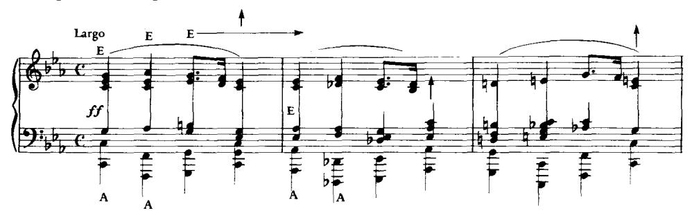

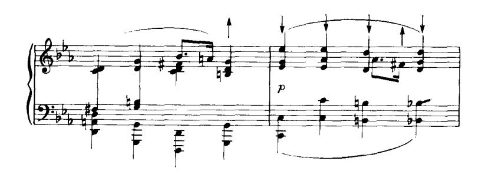

Example 54. Liszt, Années de Pèlerinage, "Après une lecture de Dante"

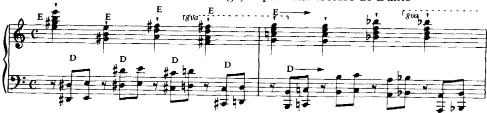

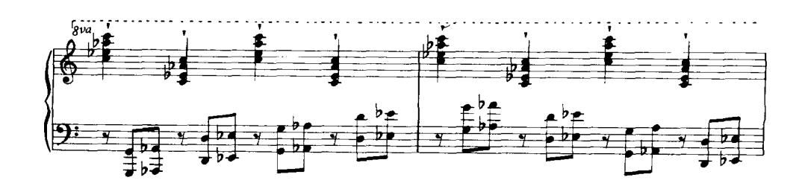

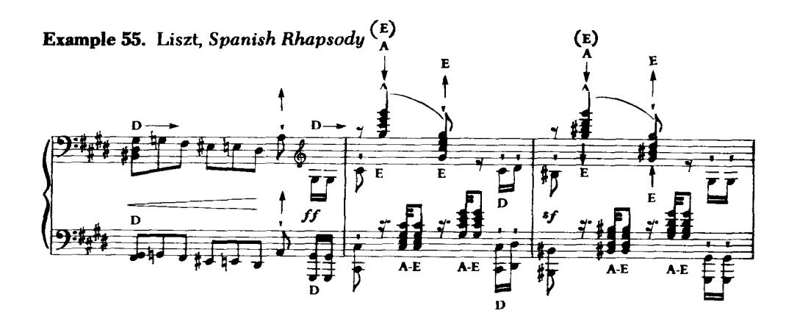

Example 56. Brahms, Variations and Fugue on a Theme by Handel, opus 24 variation 9

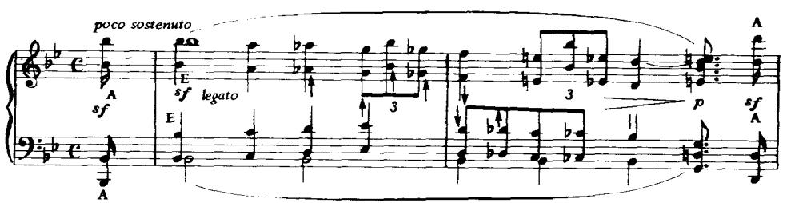

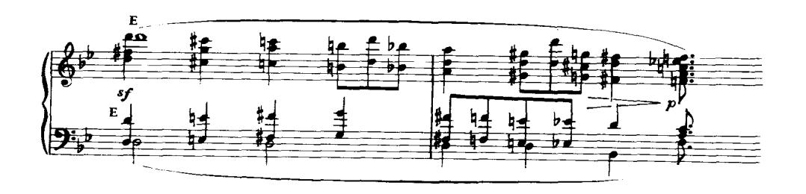

Example 57. Beethoven, Piano Concerto No. 5 ("Emperor"), opus 83, first movement

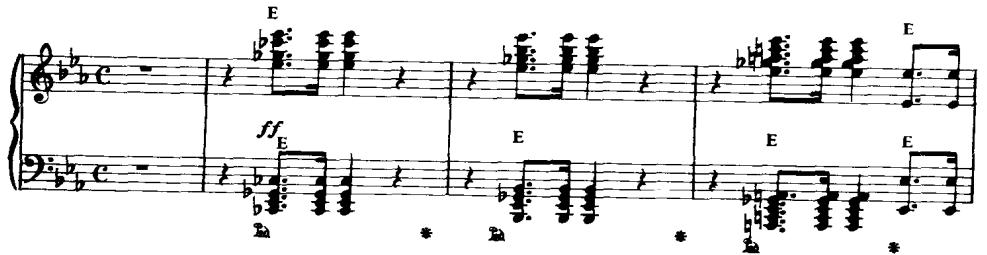

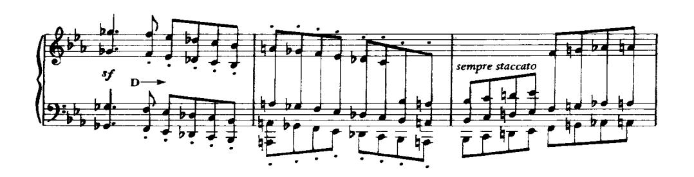

Example 58. Liszt, Transcendental Etude No. 7 ("Eroica")

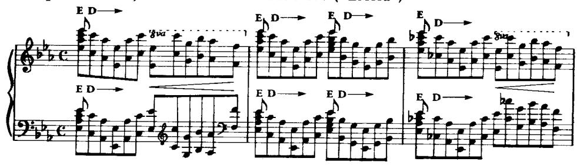

Example 59. Beethoven, Sonata, opus 106, first movement

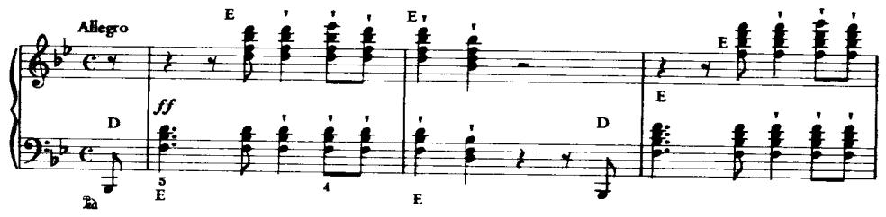

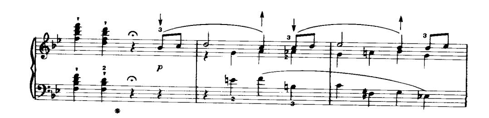

Example 60. Tchaikovsky, Piano Concerto No. 1, first movement

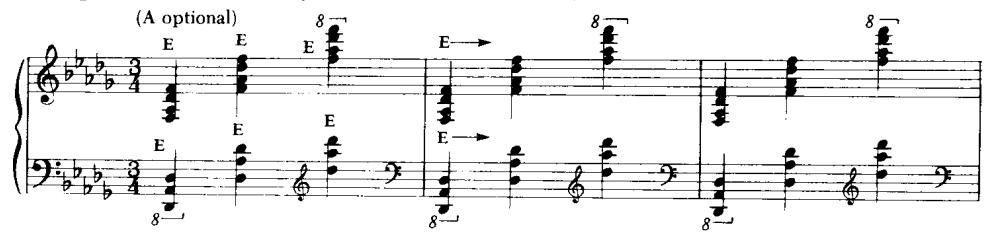

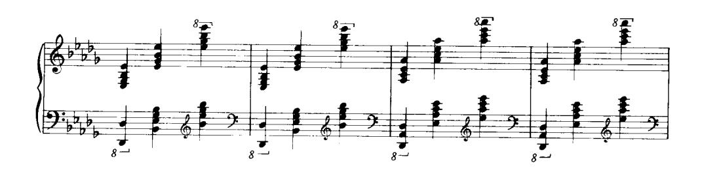

**CHAPTER** 

## 9 Summary of the Basic Technical Patterns

Fundamental motion patterns, individually or combined, provide the solution to all technical problems.

The preceding chapters have listed five basic motion patterns and their symbols: (A) free fall; (B) five-fingers, scales, and arpeggios; (C) rotation; (D) staccato (octaves); and (E) thrust.

We contend that these five fundamental patterns offer a solution for most, if not all, technical problems in piano playing when they are applied individually or in combination with one another. This is not to say that all difficulties will be eliminated; rather, it means that no passage should leave us puzzled about the type of motion to apply in resolving the technical problem posed. The difficulties of playing with extreme speed, accuracy, and control still exist, but we now know how to resolve technical problems and how to practice even the most complex and challenging passages. One may not be able to duplicate the nearly incredible feat of Richter's performance of Liszt's "Feux Follets," but the technical solutions are available; the rest depends on our perseverance, imagination, and talent.

Score indicates the motions to be applied. All of these basic technical patterns are recognizable and indicated within the written score. The patterns of musical notation indicate unequivocally the basic formula or formulas to be applied. Indeed, any sequence of notes, phrasing indication, or touch forms (legato, staccato, portato, and tenuto) can and must be matched with its own technical equivalent. Once we have identified the type of motions to be used (after the indications in the score), our only concern is its proper execution.

Individuality and variety in every action

I must emphasize that the recognition and application of these basic patterns by no means limit the variety and richness of expression we are seeking. Rudimentary as they may be, these patterns lend themselves to an unlimited variety of shadings according to how they are graduated, how they are combined and what each performer's anatomy, reflexes, temperament, tactile sensibilities, weight, and size are. If I accent a note or if I retard or accelerate a passage, these actions reflect my own reflexes, responses, and personality. Similarly any motion pattern will be characterized by the performer's constitution

and anatomy, and so will the quality of his tone. There is no need to search for individualizing performances, because the individual is manifested in every breath and every gesture. Once the technical doubts and obstacles are removed, there is unlimited opportunity for spontaneous responses, where originality, talent, or genius can manifest themselves.

These observations apply to the interpretation and execution of the written text. The text will be realized through the application of the appropriate, basic motion patterns—the technical formulas explained in the preceding chapters. A summary of the technical, mechanical aspects of piano playing will be followed by an explanation of the way to translate the visual patterns of a score into motion patterns—that is, the way to transform the score into technique. Although free fall was the first motion discussed, we will begin our review with the five-finger, scale, and arpeggio movement (B), because it is the motion pattern that is used most often.

Five-fingers require five characteristic hand and arm positions

First, let us remember that each of the fingers has a characteristic position in which it functions at its best. It should be placed in a straight line with its respective forearm muscles. We know that the thumb generically requires a lower wrist position than the other fingers and that the wrist and arm gradually rise as we progress toward the fifth finger. We call these motions that align the fingers with their forearm muscles adjusting motions; they can be made horizontally, vertically, and in depth (from the edge of the key to its back). They accommodate the fingers with small changes of position and thus eliminate any fixed positions of the wrist and arm. Therefore a sequence of notes in the score not only dictates the notes' location on the keyboard and the finger action that makes them sound, but it automatically specifies all the simultaneous, coordinated arm and wrist actions appropriate to the playing mechanism. There is a slight and continuous change in the position of the equipment while we move from one finger to the other; it is not an aimless wandering, but a purposeful one. Bear in mind that we are actually dealing with five slightly different arm-handfinger positions that come about as the occasion requires. Of course, these positions are modified according to whether we play on white or black keys, whether at the central or extreme areas of the keyboard. The body leans forward or sideways, and the wrist position changes to avoid any unnecessary strain.

Let us examine these simple note patterns:

Example 61. Unslurred five-finger pattern

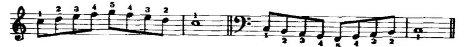

Score indicates the location of the notes and the motion patterns to be used.

Their visual image at once evokes the five-finger technical solution. We immediately equate (in both hands) the first C with a low wrist position (the thumb calls for it), a forearm position that falls in line with the thumb, and a gentle finger motion. The next note, the D, calls for a slightly higher wrist for the index finger, and it also demands a slight lateral shift of the forearm to line up the second finger with its muscles. At this point we lift the thumb to join the other fingers that are not playing. In other words, this sequence of notes in the score indicates the action to be taken, not only by the fingers, but by the wrist, forearm, and upper arm; it also tells us how to proceed to the following note. By the time we reach the note to be played by the fourth finger, the forearm and wrist are in exactly the position the fourth finger requires—that is, farther out and up. The highest position for the wrist and arm is at the fifth note (avoid being too far out), after which the upper arm, forearm, and wrist gradually return to original position, reaching the lowest point at the thumb. Remember that each finger must do its own share; only one is on a key; the other fingers are slightly raised, ready to come down as soon as the rest of the equipment (the wrist and arm) are brought into position. These principles apply to both hands.

A slur modifies technique.

The notes in example 62 follow the same ascending and descending stepwise pattern as those in example 61. However here the slurs unite the notes into groups.

Example 62. Slurred five-finger pattern

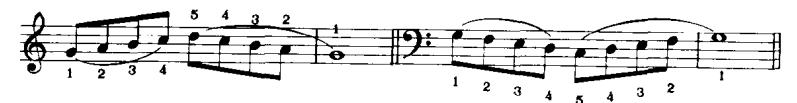

These slurs thoroughly modify the technical interpretation of the notes. In example 61 our only concern was placing the arm, fingers, and wrist in the precise position required for each finger, with the lowest wrist for the thumb and the highest for the fifth finger. In example 62 the slur indicates a grouping that alters the technical solution to the passage. We must tie these notes together; to do so we use the technique of legato playing.

Arm and wrist always lower at beginning of a group, higher at end We have stated that a real legato cannot be achieved solely by finger activity (even though, as usual, the fingers have an active role); for the notes tied together by a slur, we use an upward motion of the arm and hand. At the beginning, we always use a relatively low wrist, hand, and arm position, and at the end of a group, the wrist, hand, and arm position is higher; this is a firm rule with no exceptions.

Now this rule seems to contradict our first basic rule; actually it only complements it. We still line up the forearm with each finger, and we still have a relatively low position for the thumb and a higher one for the fifth finger; however while we play the notes within the slur, the upper arm gradually raises the whole apparatus slightly. At the end of the slur the forearm, hand, and fingers abandon the keys with an upward motion, regardless of which finger is ending the phrase. Any group of notes that is perceived to be a technical or musical group should be played with this ascending arm motion whether the slur has actually been notated or not. The extent of the lift is determined by the usual factors: whether we end the group on black or white keys, what is the location of the passage on the keyboard, and which one of the fingers ends the group.

Therefore the technical interpretation of example 62 demands: a low wrist position for the first note, a higher position for the next, and the highest position at the last note (not too high, please!) On the next note, at the beginning of the new slur, a low wrist position is used for the fifth finger; a gradually higher position is used for the next note, and the highest position is used for the last note, which is played by the thumb. Again the technical interpretation is the same for both hands.

Phrase endings

Please remember that no matter which finger plays—whether it is the thumb or the fifth finger—at the beginning of the phrase the wrist is low and at the end of the phrase, it is higher. The reasons for these categorical statements can be found in the chapter on legato playing, if you wish to refresh your memory. No matter how many notes there are in the group, there is always an upward motion at the end of the group. In a very long legato passage smaller subdivisions may be found where we can employ this upward movement; at the end of the phrase the upward motion will again be in evidence. Of course, anything that goes up has to come down; so be sure that the wrist returns to its low point when you begin the next group. These groupings are sometimes technical and sometimes musical; the two aspects do not always coincide. Also the groupings are not always marked in the score. Nevertheless, whether we play Bach or Bartok, slowly or quickly, loudly or softly, the binding of notes into groups is accomplished by upward arm motions.

Example 63. Beethoven, Sonata, opus 53 ("Waldstein"), first movement

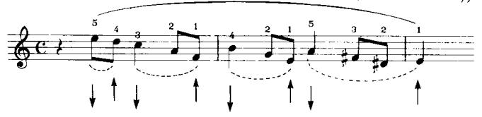

In example 63 the dotted slurs represent subdivisions of the printed slur. Use a lower wrist at the beginning and a higher wrist at the end of each of these subdivisions.

By the way, when we end a phrase, the length of the last note is the performer's choice; it can be short, medium, or long. This note's length is determined by the amount of time the finger remains on the key and is indicated by the score. An upward arm motion regulates this motion too. Do not make all your phrase endings uniform; we have all the tools we need to vary the touch, color, and dynamics. A satisfactorily working apparatus in which all the components function within, or close to, the central areas of their range is all that is necessary.

Each
component must
do its work; no
compensation
by other
members of the
team

One word of caution: whenever the wrist, hand, and arm are in action, watch the fingers. They tend to become passive, motionless, and to hang over the keys. There must be a coordinated action between the fingers and the rest of the apparatus; the fingers must always be slightly raised before playing, and they should be constantly active. Only in maximum speed does the finger action become so tiny that it is invisible. Another word of warning: whenever the fingers are active (especially when they are overactive), the wrist may freeze; it tends to become fixed and stiff. Both of these threats are real, and many pianistic problems and absurdities result from these two mistakes. We must synchronize our actions so that each component does its own work, thereby reducing all motions to their minimum. But one does not substitute the work of any one component for the work of another. You will find that if one is inactive or overactive, the other components will compensate for it. Avoid excessive motions, don't raise the fingers too high, and don't make large circular motions with the wrist, forearm, or upper arm. Don't fix and stiffen the wrist, don't press the upper arm to the body, or hold your fingers glued to the keys.

Recognize patterns containing notes moving in the same direction (scales, arpeggios).

Examples 61–63 are extremely simple, but they are quite characteristic of passages in complex scores. The five-finger, scale, and arpeggio formulas should be applied in any passage where the notes move in the same direction in groups of three or more notes. No matter which direction they move in, what the style of the piece is, what the dynamics are, or whether the notes are single, double, or chords, the scale and arpeggio technique applies. However, if the notes are marked staccato, tenuto, or portato, we must employ the respective touch forms.

Examples

Here are a few examples of passages where the scale technique can be applied:

Example 64. Chopin, Etude, opus 10 no. 2

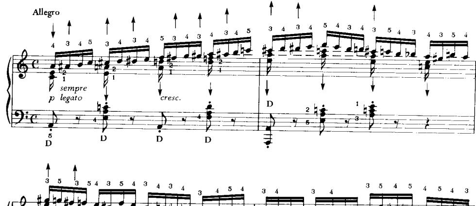

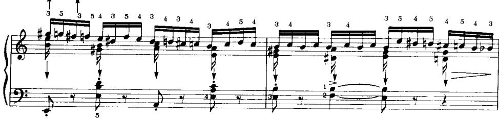

Example 65. Chopin, Etude, opus 10 no. 4

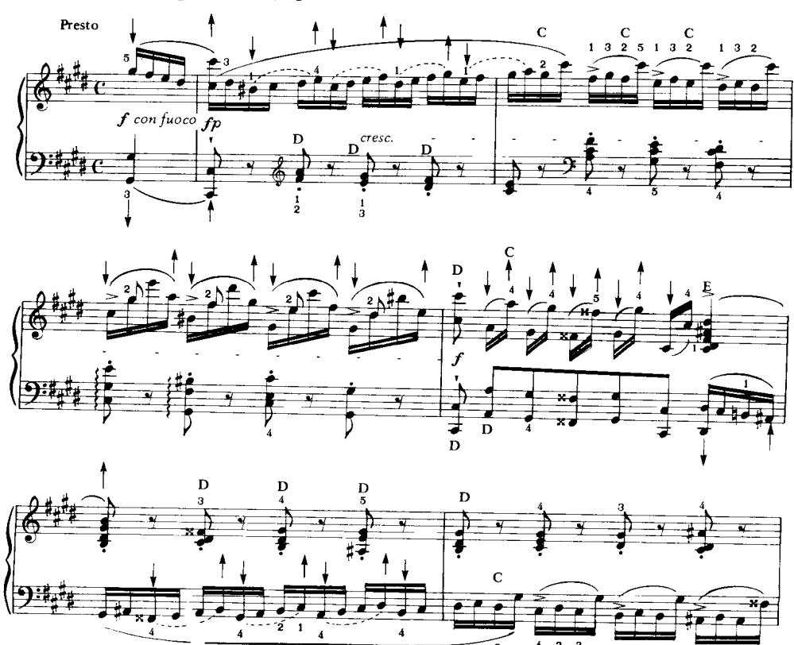

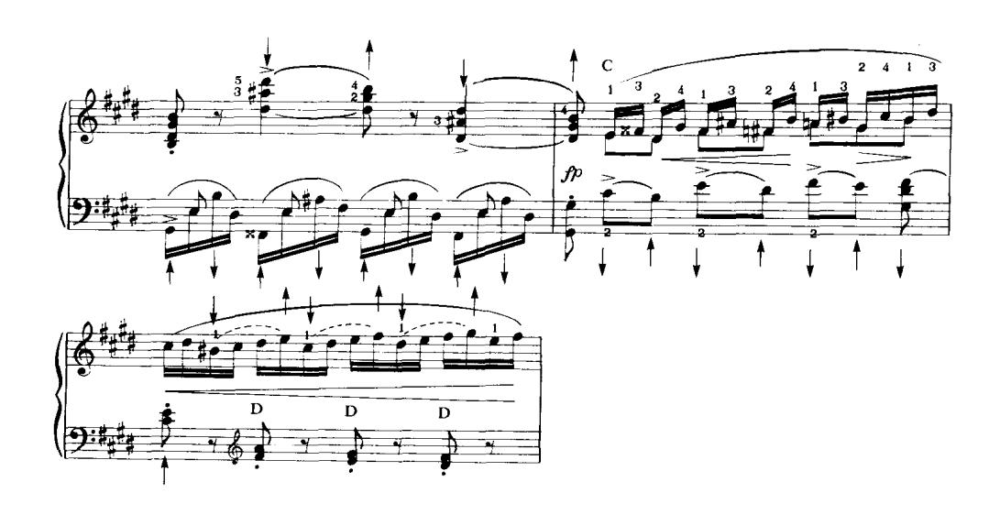

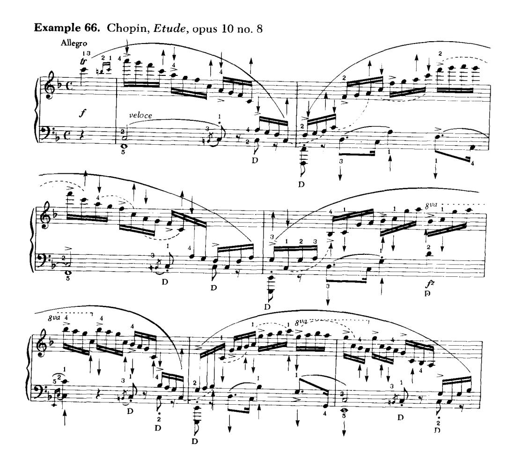

Example 67. Chopin, Etude, opus 10 no. 12 Allegro con fuoco legatissimo con fuoco

**Example 68.** Chopin, Etude, opus 25 no. 2

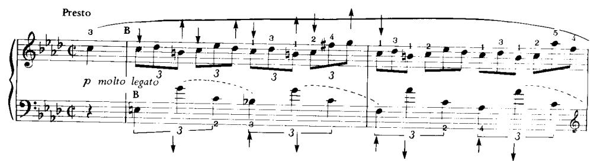

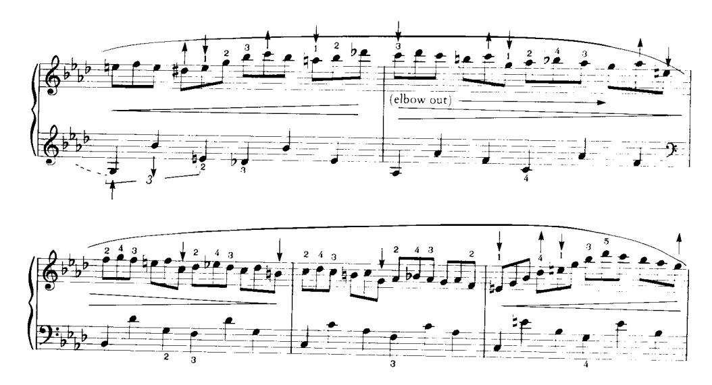

Example 69. Chopin, Etude, opus 25 no. 12

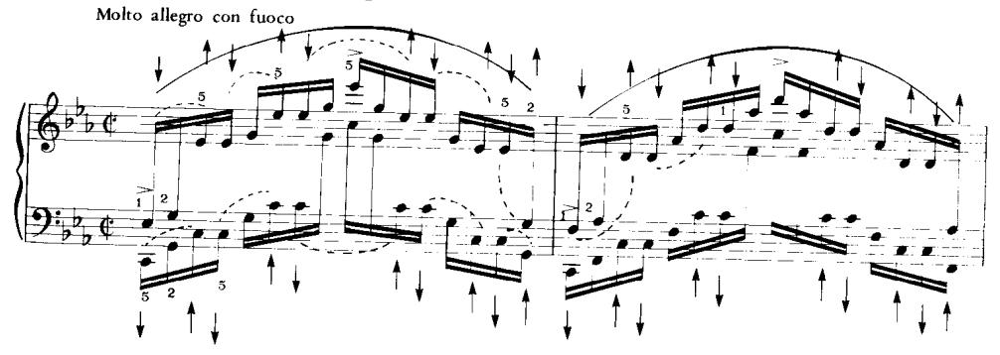

Example 70. Mendelssohn, Etude in F Major, opus 104

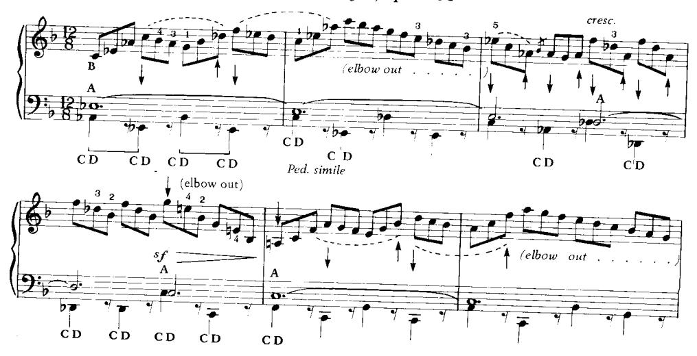

sempre legato

Example 71. Liszt, Concert Etude No. 2 in F Minor ("La Leggierezza")

The thumb and upper arm

Scales and arpeggios are basically five-finger motions with the added complication that the thumb passes under or over the third or fourth finger. In scales and arpeggios avoid keeping the thumb under the palm of the hand and allow it to function alongside the hand by lifting the upper arm slightly away from the body. When the hand moves away from the center of the keyboard, the elbow must move away from the body just before the thumb is about to play, and the wrist must be lowered. Then the position appropriate to the next finger is assumed. The elbow swings back and forth continuously during runs in which the right hand goes up and the left hand goes down. However, when you move from the extremities of the keyboard toward its center, the upper arm must stay out all the time, and it is the wrist that goes down and up depending on the note grouping and the fingers that play. The degree to which the upper arm stays up depends on the location of the notes on the keyboard: at the extremes the elbow must stay farther out. In arpeggios, where the intervals between notes are large, the elbow must stay even farther out to facilitate the fingers' passing over the thumb. The size of the motions, as always, depends on the speed at which we play. It diminishes as speed increases, and grows as the tempo gets slower. However each component must contribute its full share of aid to the fingers.

Rotation suggested by the score

Identifying musical patterns where rotation is applied is a simple matter; rotation is used whenever notes go up-down-up or down-up-down. The obvious examples of this motion are tremolos and tremolo-like passages.

Example 72. Bach, Organ Toccata and Fugue in D Minor

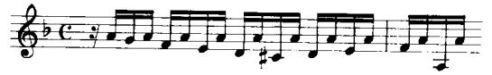

You will recall how carefully one must modify the size of the rotary motions when the size of the interval, the dynamics, or the location on the keyboard is changed or when there is a change from white keys to black.

Other examples in which rotation should be applied include:

Example 73. Chopin, Etude, opus 10 no. 5

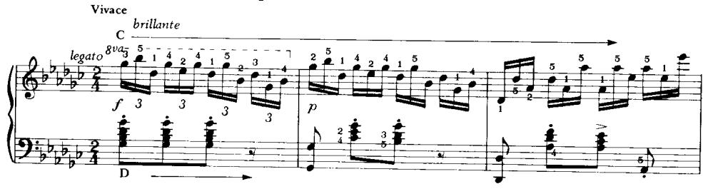

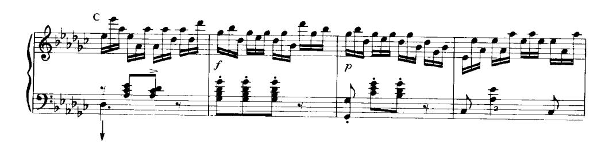

Example 74. Chopin, Etude, opus 10 no. 10

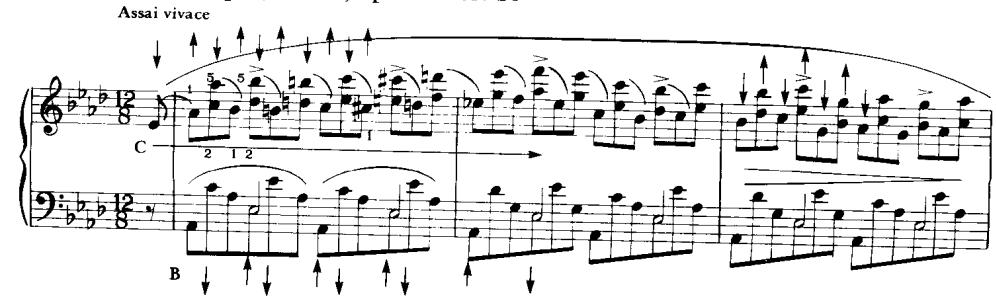

(Example 74 continued)

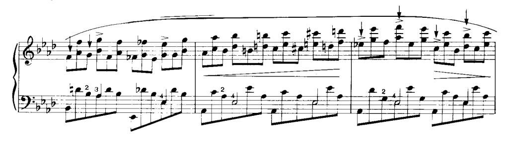

Example 75. Chopin, Etude, opus 25 no. 11

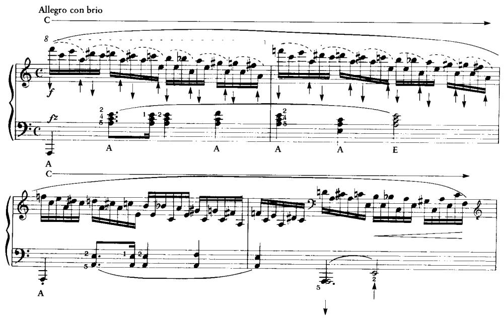

Example 76. Liszt, Paganini Etude No. 3 ("La Campanella")

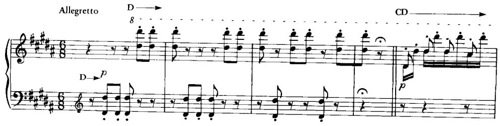

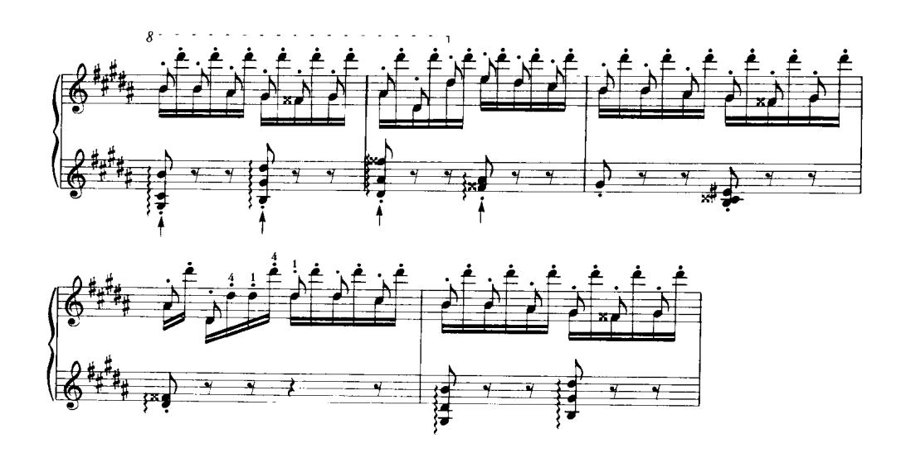

Example 77. Beethoven, Sonata, opus 13, first movement

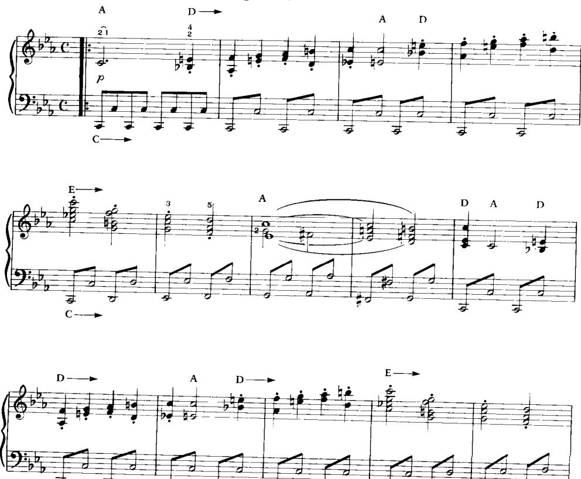

Example 78. Beethoven, Sonata, opus 26, fourth movement

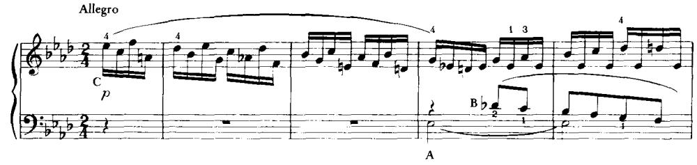

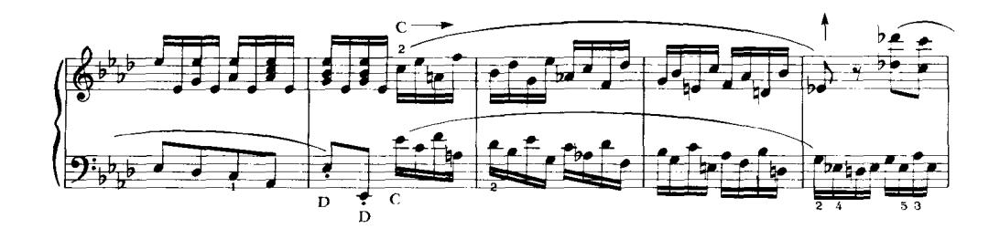

Trills

In all these examples, rotary motion prevails and it can be easily recognized from the score. Many trills can be executed with this motion, especially when the 1–3, 2–4, or 3–5 fingerings are used. It is essential that the forearm rotation be transmitted to the fingers, which should be slightly raised in anticipation of the axial throw of the forearm. Forearm rotation must be used judiciously—too much activity may immobilize the fingers; too little activity strains them as they try to do most of the work.

I mentioned earlier that the technical grouping of a passage may not coincide with its musical grouping. In the Chopin *Etude*, opus 25 no. 11 (example 75) the rotary motion must be applied in groups of four, according to the technical demands of the passage, in spite of the fact that the notes are written in groups of six. In example 79, the quadruple grouping of the rotary action is indicated by dotted slurs.

Example 79. Chopin, Etude, opus 25 no. 11

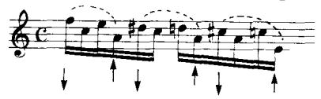

A slight downward position must be assumed on the first note of each group, and a slight upward motion of the wrist is needed toward the fourth note of each group. These cyclic motions do not coincide with the musical grouping of the passage and with the bass, but they are required to increase the fast, loud, and effortless activities of the

Rotation plus lateral movement and in combination with staccato

Staccato

Staccato not always indicated in score

Infinite variety in the application of staccato

fingers. Besides the forearm's rotary motion, the fingers need the extra up-down motion of the wrist to add maximum speed and power to their activities.

Many passages in piano music call for rotation. Whenever the notes constantly reverse their direction, rotation is the motion pattern to use. When the intervals grow wider and when axial rotation is insufficient, a lateral movement of the forearm has to be added. On some occasions rotation must be combined with a staccato motion; for example, see Liszt's "La Campanella" (example 76) and "Paganini" in Schumann's *Carnaval*.

The vertical throw of staccato motion is most often employed for isolated sounds; its visual symbol in the score is a dot or a wedge, but it is often not indicated in the score. That little dot represents a fairly complex throwing motion that originates from the shoulder and actively involves the entire arm, hand, and fingers. It is complex in that several components of the playing mechanism must act, but the motion itself amounts to nothing more than a straight throw. That is the essence of the staccato: the upper arm transmits a throw through the forearm and hands toward the fingers, which transmit this impulse to the keys. The fingers and the rest of the equipment return immediately to the position from which the throw began. Since this activity is so thoroughly distributed, the motions of the participating components are minimal and effortless, regardless of the tempo or dynamics of the passage. Incidentally, a distinction between the dot and the wedge should be made only after the Baroque period. In the days when quill feathers were used for writing, there was simply no way to write a dot, therefore a wedge became the symbol for staccato. Later on, especially in the Romantic period, the wedge was identified as the sign for a sharper staccato and the dot stood for a regular staccato. However, this distinction should not be made for music written before the 19th century.

The beginning of Beethoven's "Waldstein" Sonata, opus 53 is an example of a passage in which staccato is required but the dot is missing in the score. This passage requires a light throw with no excessive sharpness or abruptness in the sound. Many of the formidable octave passages in Liszt's *Sonata in B Minor* are not marked staccato either, but they obviously call for this type of motion.

As mentioned before, the execution of staccato and octaves can be varied infinitely. Although the entire apparatus must always participate, we can increase or decrease the role of the fingers, hand, forearm, upper arm, and any combination of these components. If we desire a shorter, crisper sound, we may activate the fingers and the hand slightly more; if we want a heavier and more massive sound, we use more forearm and upper arm action.

No muscle building!

In all of these variants the entire equipment must be actively involved at all times. The motion is a highly coordinated and integrated activity. Total effortlessness is achieved by a sensible distribution of energy and not by strengthening some of the congenitally weaker muscles of the wrist or forearm. There is nothing more harmful and unpleasant for pianists than the "wrist-building" exercises some people advocate: the pianist usually ends up with tendonitis as he works diligently on his way to develop a hard and wooden sound.

The famous octave passages in Chopin's *Polonaise in A Flat Major*, opus 53 and Liszt's "Funérailles" require staccato technique, as do all of the following examples:

Example 80. Liszt, Hungarian Rhapsody No. 6

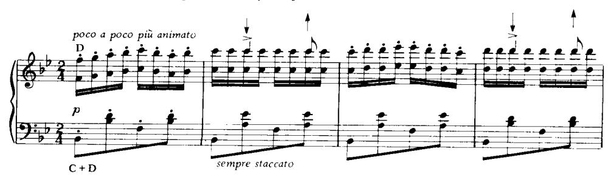

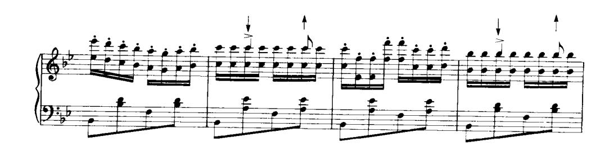

**Example 81.** Anton Rubinstein, *Etude*, opus 23 no. 2 ("Staccato Etude") Allegro vivace

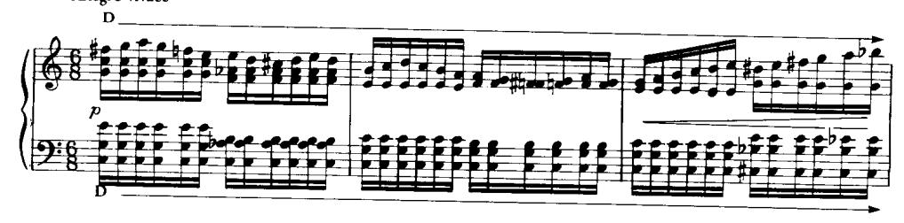

Example 82. Schumann, Toccata, opus 7

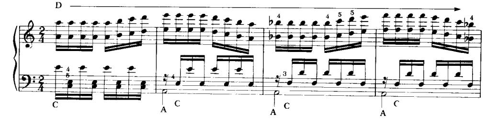

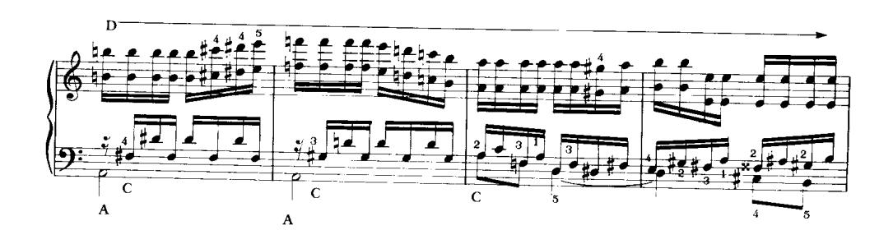

Example 83. Prokofiev, Toccata, opus 11

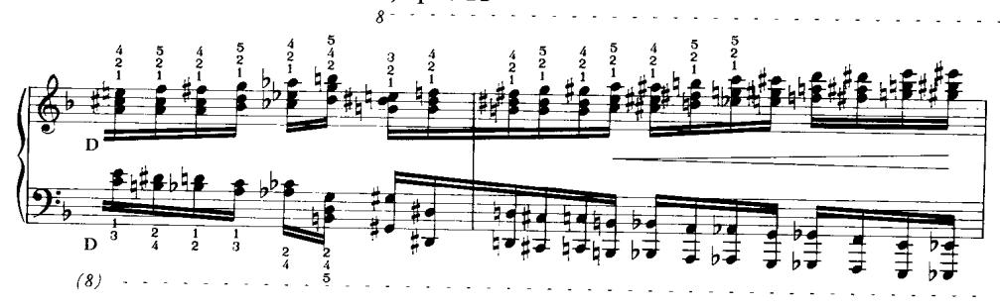

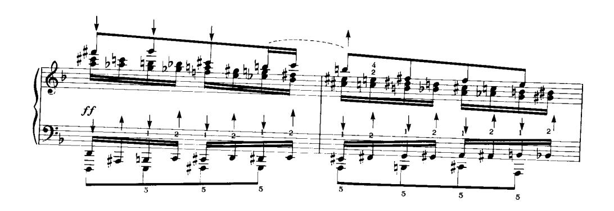

Example 84. Ravel, Le Tombeau de Couperin, "Toccata"

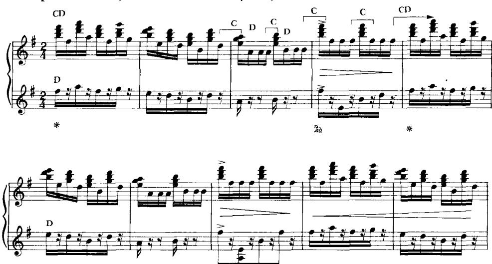

In many of these examples the staccato motion is combined with other motions, particularly with rotary motion. However our first purpose is to develop a staccato motion in its purest form!

Legato octaves will be played with the staccato-type motion, provided that it will be tempered by extra finger work; extra wrist motion is important too, especially in alternating white and black keys. This is the case in Chopin's *Etude*, opus 25 no. 10:

Example 85. Chopin, Etude, opus 25 no. 10

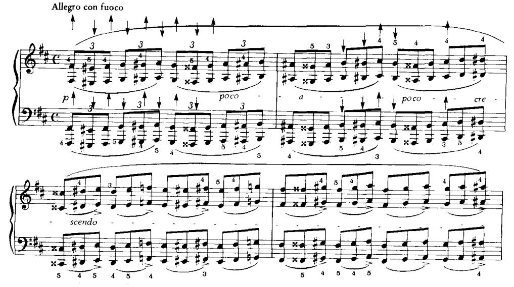

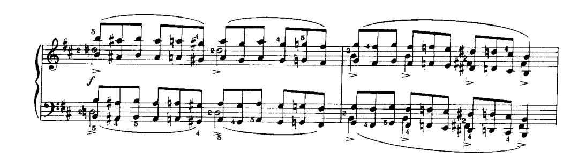

The Rondo from Beethoven's "Waldstein" Sonata calls for a greatly concentrated and rapid series of octave movements:

Example 86. Beethoven, Sonata, opus 53, third movement

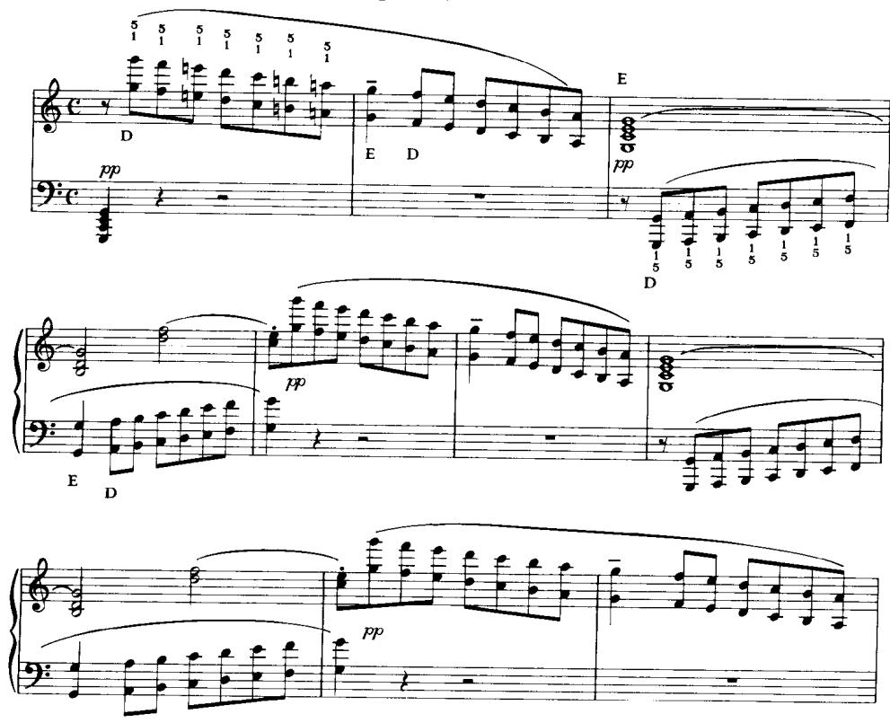

It is obvious that once extreme speed is attained, distinctions between a true legato and a true staccato disappear and all we have is a semi-staccato.

Free fall and thrust

Free fall and thrust are quite interchangeable even though the former motion is produced mainly by the force of gravity while the

latter is generated solely by the muscles. Both motions produce big, massive sonorities, and they are used mainly for this purpose. It should be remembered that thrust is more appropriate for chords with wide intervals, while free fall is called for in passages in slow or moderate tempo.

Examples

Either motion may be used in examples 87 and 88:

Example 87. Schubert, Fantasy in C Major, opus 15 ("Wanderer")

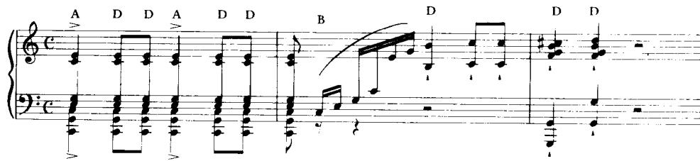

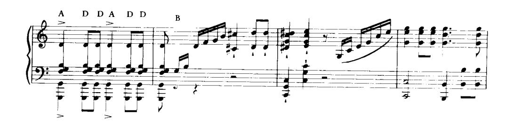

Example 88. Tchaikovsky, Piano Concerto No. 1, first movement

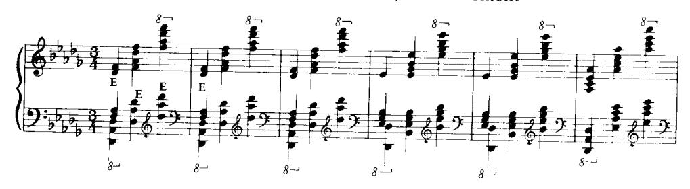

While both thrust and free fall will serve in the Chopin *Prelude in C Minor* in example 89, thrust may be more suitable for producing the character specified in the opening phrase:

Example 89. Chopin, Prelude in C Minor, opus 28 no. 20

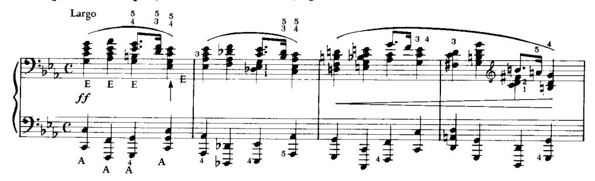

Free fall is recommended for the bass of examples 90 and 91:

Example 90. Chopin, Etude, opus 10 no. 1

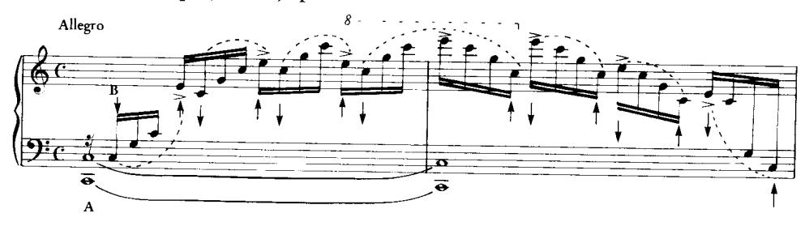

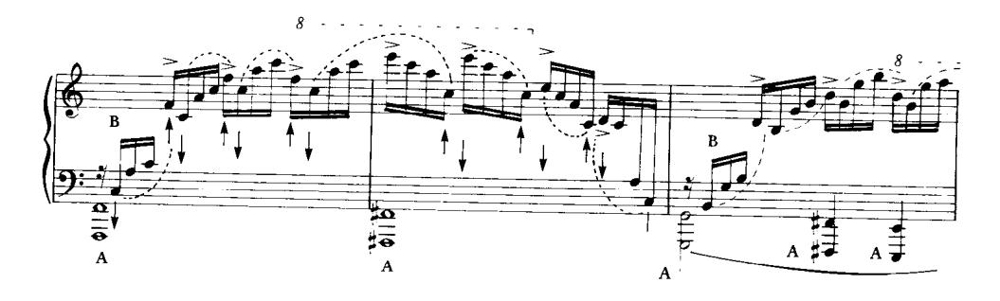

Example 91. Beethoven, Sonata, opus 109, second movement

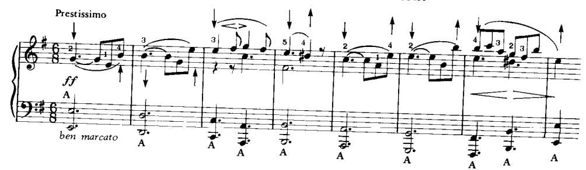

Avoid creating a combination of the two motions; do not lean into a free fall and do not employ thrust from a distance. Neither the piano nor your knuckles can endure these actions! When the whole arm is freely accelerating from a sufficient distance, its speed is more than enough to produce the greatest possible sound. If you increase the speed of the arm with a throw, no good or sensitive piano can respond to the onslaught; there is a limit to the elasticity of felt, wood, and strings. The maximum sound can be produced either by the sheer force of gravity or by the sudden contraction of our strongest and biggest muscles. Do not combine the two!

Trills

As an appendix to our discussion of the five basic motion patterns, I add a few words on trills, a subject conspicuous for its absence in the preceding discussion of piano technique. Trills are an important part of piano playing since they are found in every style of piano music. When they are properly executed they create an impressive effect, but formulating a clear-cut solution to the technical problem they pose is difficult because they seem to be executed in rather elusive and highly personal ways. In this respect they resemble an important device used by all string players, the *vibrato*. It is difficult to define a formula for practicing either the trill or the vibrato, and it is almost impossible to teach these devices. However it is possible to create the conditions that enable one to produce either a good trill or a sensitively applied vibrato: if the ingredients of a well-coordinated and smoothly functioning playing apparatus are working properly, effortlessly, and resiliently, they won't let us down!

Finger combinations

Experience shows that almost any combination of fingers can produce a fine trill. Some players are most comfortable with a 3-5 combination, while others prefer 1-3, even 3-4, or complex combinations like 1-4-2-3 or 1-3-2-4. Some prefer the left hand to the right hand and medium speed to fast speed, and some excel at very fast and loud, even shrill trills! This highly individual activity results from a combination of reflex and adjusting motions, and the teacher's main task is to ensure a free mobilization of all the components involved—the fingers, wrist, and forearm.

Speed of the trill

It is best to start a trill at a moderate tempo with slightly articulated finger and forearm motions. The speed of the trill should be gradually accelerated while the player carefully guards against tension in the arm, hand, and fingers. At excessive speed coordination is lost, forcing occurs, and the trill freezes in its tracks. Trills need not be executed at a frantic pace; those that are played effortlessly at a moderate tempo are often completely satisfying.

Execution

A trill may be comfortably executed in a variety of ways: the fingers can be either curved or extended, the wrist can be low or high, and a

variety of finger combinations can be used. The same may also be said for double thirds. It is important to place the arm in a comfortable position, to align the fingers with their respective forearm muscles, and to use the usual adjusting motions of the wrist and arm. In order to prevent tension, it is especially important to attend to both the vertical and horizontal adjusting motions that we use whenever the fingers are in action; these motions diminish as the speed of the trill increases.

In example 92 a variety of fingerings are furnished for a single-note trill:

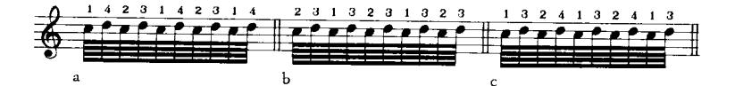

In example 93 four fingerings are provided for the same brief excerpt from Chopin's etude in thirds. The changes of fingering in the fourth variant allow a cyclic adjusting motion to be made for every group of eight thirds played.

Example 93. Chopin, Etude, opus 25 no. 6

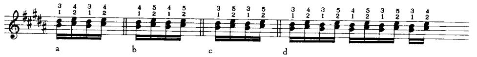

| • |  |  |
|---|--|--|
|   |  |  |
|   |  |  |
|   |  |  |
|   |  |  |
|   |  |  |
|   |  |  |
|   |  |  |
|   |  |  |
|   |  |  |
|   |  |  |
|   |  |  |
|   |  |  |
|   |  |  |
|   |  |  |
|   |  |  |
|   |  |  |
|   |  |  |
|   |  |  |
|   |  |  |
|   |  |  |
|   |  |  |
|   |  |  |
|   |  |  |
|   |  |  |
|   |  |  |
|   |  |  |
|   |  |  |
|   |  |  |
|   |  |  |
|   |  |  |
|   |  |  |
|   |  |  |
|   |  |  |
|   |  |  |
|   |  |  |
|   |  |  |
|   |  |  |
|   |  |  |
|   |  |  |
|   |  |  |
|   |  |  |
|   |  |  |
|   |  |  |
|   |  |  |
|   |  |  |
|   |  |  |
|   |  |  |
|   |  |  |
|   |  |  |
|   |  |  |
|   |  |  |
|   |  |  |
|   |  |  |
|   |  |  |
|   |  |  |
|   |  |  |
|   |  |  |
|   |  |  |
|   |  |  |
|   |  |  |
|   |  |  |
|   |  |  |
|   |  |  |
|   |  |  |

# PART THREE: Technique Becomes Music

### **CHAPTER**

## 10 Identification and Application of the Basic Technical Patterns

Symbols for basic patterns, wrist positions, and touch forms We have reduced piano technique to five basic motion patterns and their combinations. We contend that the musical text clearly indicates which to select as the appropriate technical solution. Now we will submit an extended musical example indicating the technical formulas to apply both in practice and in performance (see example 94).

The symbols for the five motion patterns and for low and high wrist are joined by symbols for the four touch forms.

### Symbols

```
free fall A
five-fingers, scales and arpeggios B
rotation C
staccato D
thrust E
low wrist 
high wrist 
legato

portato....
tenuto ----
staccato...ori
marcato > A
```

**Tenuto** 

Besides staccato and legato there are two other touch forms: the tenuto and the portato. The tenuto marking ———— indicates that the note is to be held for its full value; if there are several tenuto notes in succession, they should not be as closely connected as they would be if they were marked legato. In legato we connect the notes with an upward arm motion and by letting the dampers fall slowly; in tenuto

we let the dampers fall freely. This will create a slight disconnection between the notes that is characteristic to tenuto. The slight finger motion is helped by the usual horizontal and vertical adjustment of the forearm, but the raising of the fingers is not slowed down by an upward grouping motion of the arm as it is in legato playing. The damper falls without impediment, and the sound ends distinctly with the lifting of the finger. Incidentally, the tenuto sign does not necessarily indicate an accent!

Portato

The portato (sometimes incorrectly called "portamento") marking . . . . indicates sort of a semilegato or semistaccato; the notes are not tied but gently separated. When tenuto is called for, a horizontal arm motion with a clear upward articulation of the fingers is used, and the almost imperceptible separation of the notes is accomplished by the free fall of the damper. The portato indicates a vertical wrist motion on each note and gentle finger activity. This subtle down-up motion of the wrist slows the action of the dampers to the point where the notes are barely separated gradually, not suddenly. Legato, staccato, portato, and tenuto are the four distinct touch forms; an understanding of the differences among them helps in finding the exact motion patterns with which to produce the appropriate sounds.

Skill

We have a clear concept of the five basic motion patterns and their method of execution; we understand the four touch forms and how they can be produced; we know our sources of energy and how to tap them; we know what the location factors are that modify the positions and actions of our torso, arms, and feet in order to adjust to the use of black and white keys and different sections of the keyboard. Now our task is to translate the notational patterns in the score into their corresponding motion patterns. Technique in a broader sense is the application of movements to produce sounds according to the specifications of the written text—technique is not artistry; it is a mechanical and intellectual skill.

Artistry

Art and artistry are manifested by a highly aesthetic, original, personal, and convincing approach that reveals the true and deeper aspects of the music and by the mastery of the performer. To approach and to achieve artistry we must develop a superior skill, a complete pianistic mastery, that can lift us to artistic heights. Art and interpretation are intangible and indefinable, full of unpredictable and improvisatory elements, but piano playing is not. The ingredients of piano technique are clearly definable; they include the anatomy and motions of the human body, the mechanics of the instrument, and the force of gravity. Nonetheless, these motions that comprise piano technique must correspond to their musical counterparts: this is indispensable if we are to interrelate motions with the corresponding emotions!

Conscious, not mechanical, practicing

The musical example is the exposition of the first movement of Beethoven's Sonata, opus 53 ("Waldstein"). As in the previous examples the symbols of the basic motion patterns are included, and arrows indicate a high or low wrist position. The measure numbers are also given. In the excerpt from the "Waldstein" Sonata, with the help of the indications inherent in the score, we will use the list of symbols to indicate performance techniques. The multiplicity and synchronization of the various ingredients require intense concentration, especially at first. Compared to mechanical practice, this kind of practicing is strenuous: we must control several ingredients at the same time. It may be easy to pay attention to the thumb alone, but it is more difficult to control the wrist, the forearm, and upper arm, and the size of each of their motions all at the same time. But as our practice methods improve, more can be achieved with less and less mental and physical effort. Furthermore, once technique is established and acquired, don't practice it anymore—ever! With the basic formulas at our disposal we merely adapt them to particular passages and apply them. It is like learning the alphabet. As a child, one must learn and practice every letter, but once the letters are ingrained, there is no longer any need to practice them—one simply uses them for writing. The writing continues to improve and becomes more and more one's own means of expression, whether it is used for poetry, the weather report, or a recipe. Similarly our scales, octaves, and tremolos improve with use, and they become more and more characteristic of our own manner of performing (for more hints about how to practice technique see chapter fourteen).

The "Waldstein" Sonata: first movement, exposition

Here is the exposition of the first movement of Beethoven's "Waldstein" Sonata. I indicate the basic motion patterns as well as the touch forms and technical solutions suggested by the score. The composer's score markings are the basis for our interpretation: the added dotted slurs indicate technical groupings.

Example 94. Beethoven, Sonata, opus 53 ("Waldstein"), first movement, exposition

Allegro con brio

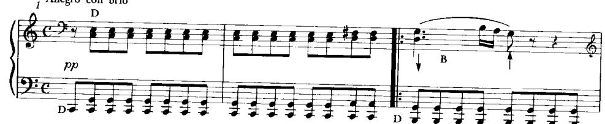

The first two measures are played with staccato motion (D). The left hand continues playing staccato through the tenth measure. In the

third measure the right hand starts the legato (B) with a low wrist and ends it on the third beat with a higher wrist. The fourth measure is played the same way as the third measure; however here the trunk moves slightly forward and to the right to enable the right arm to reach the high notes comfortably.

### (Example 94 continued)

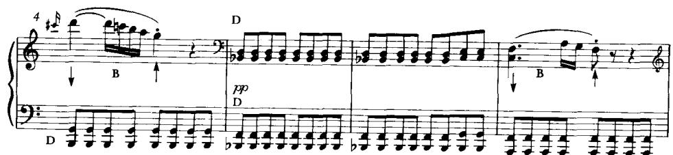

Measures 5–8 are played the same way as measures 1–4. At beginning of bar 9 lean slightly forward in order to reach the top note comfortably. The right hand uses a typical five-finger motion for measures 9–10, with a lower wrist at the thumb, a higher wrist at the fifth finger, and the standard lateral adjusting motion for each finger in order to line it up with its respective muscles. Beginning with the second beat of measure 11, the right elbow is kept in a raised position until the end of the bar to accommodate the fingers during the downward scale, while the trunk moves gradually toward the central position. The left hand uses free fall (A) for the first two beats of measure 11 and then it ascends toward the downbeat of the next measure—a typical motion for a group ending. The right hand carries out this same motion on the downbeat of bar 12, after which both hands are thrown gently, with staccato (D) motion. In bar 13 use a gentle free fall (A) for both hands.

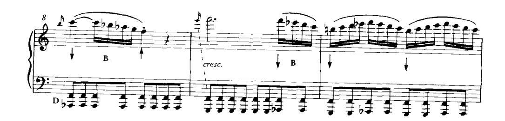

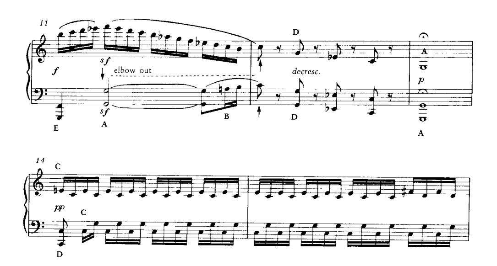

In measure 14 the left hand begins with a slight throw (using staccato) on the first note and then it joins the right hand with a forearm rotation (C). The right arm rotates until bar 16, and the left arm continues until bar 18; then after one staccato motion, it continues to the end of bar 22. The right hand uses legato motion in bars 16–17 (the wrist uses a down-up motion) and at bar 18 resumes rotation until end of bar 19. In bars 20–21 the right hand is legato. From bar 23 until the end of bar 30 both hands use scale and arpeggio motions, grouping them according to the slurs marked. In bar 29 the left hand uses thrust (E) for the chord.

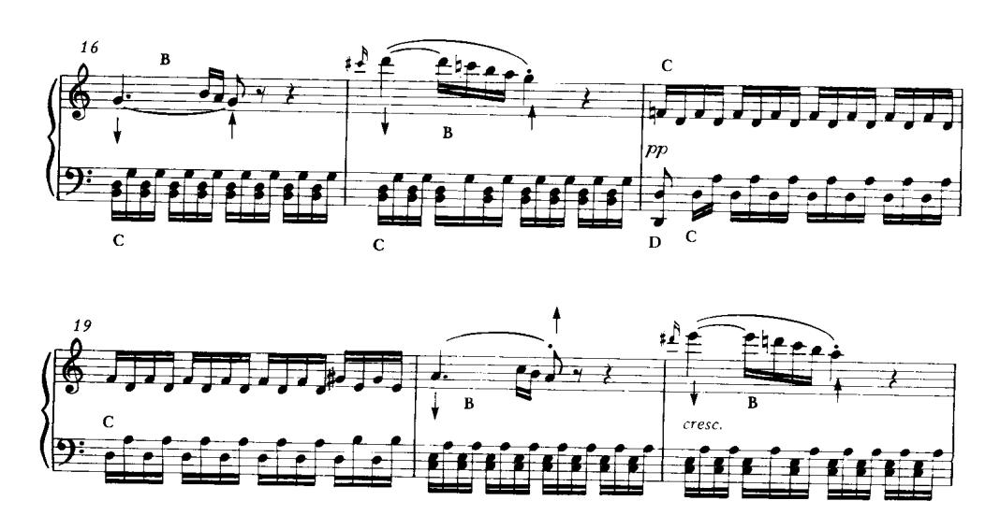

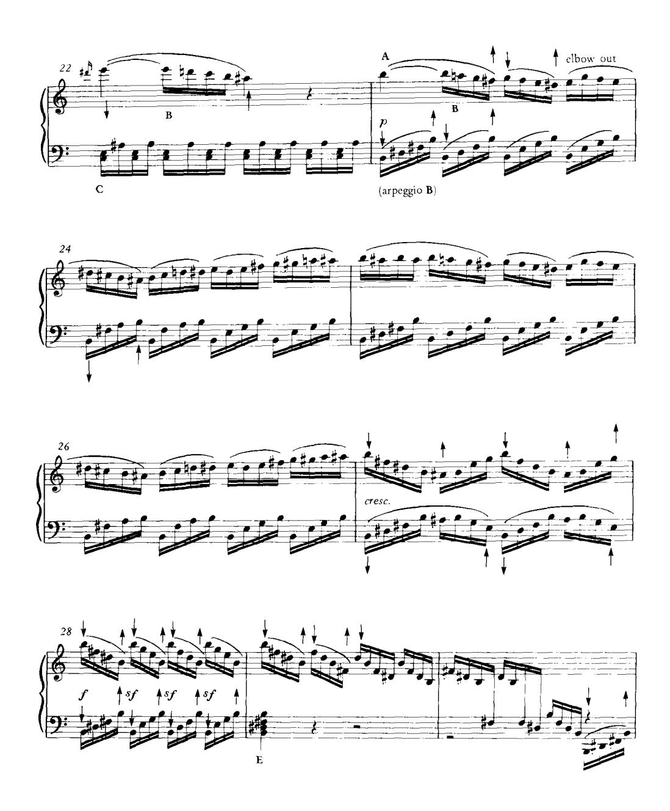

From bar 31 to the end of bar 34 both the right and left hands use staccato combined with rotation. From bar 35 to end of bar 41 both hands use legato for the slurred notes. At measure 42 the right hand uses scale technique. From measure 43 to end of measure 57 the same technique is used as in measures 35–41.

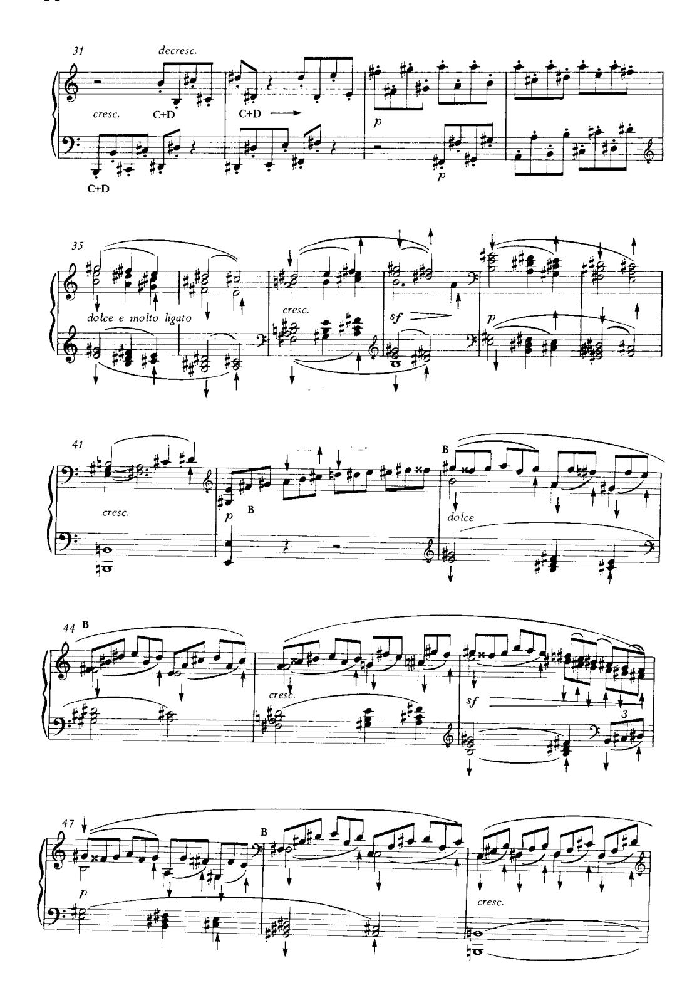

### (Example 94 continued)

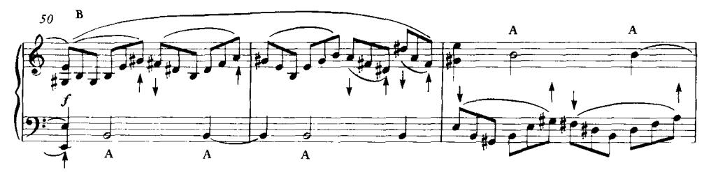

From bar 58 to end of bar 61 the left hand uses rotation. On the first and third beats of bar 58 the right hand uses legato-arpeggio technique, and on the second and fourth beats it uses rotation; rotation is also used in bars 59–60. In bar 61 the right hand uses a descending scale motion with the upper arm out. In bars 62–65 the right hand groups scale motion according to the slurs, and the left hand plays staccato. In bars 66–67 the right hand plays staccato, and the left hand uses arpeggio motion until the third beat of measure 67; then it uses staccato.

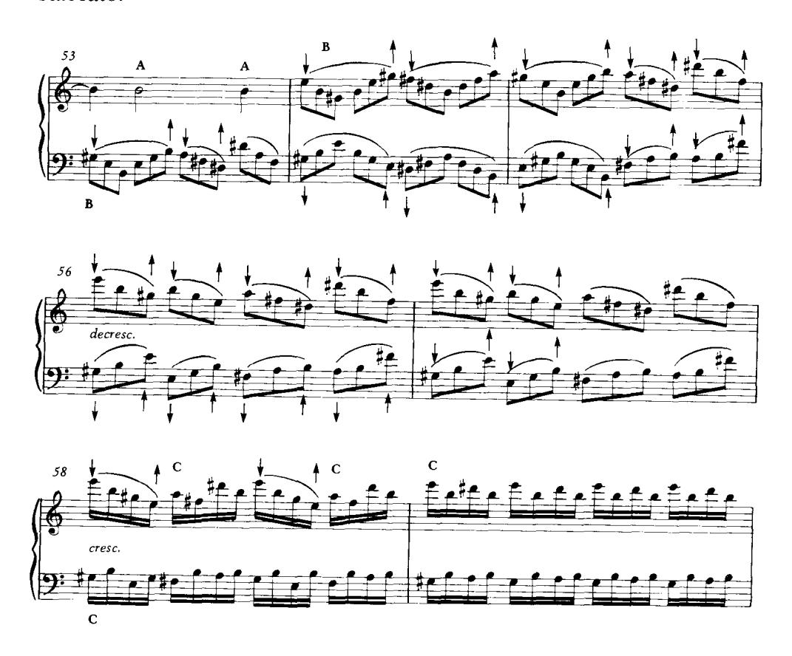

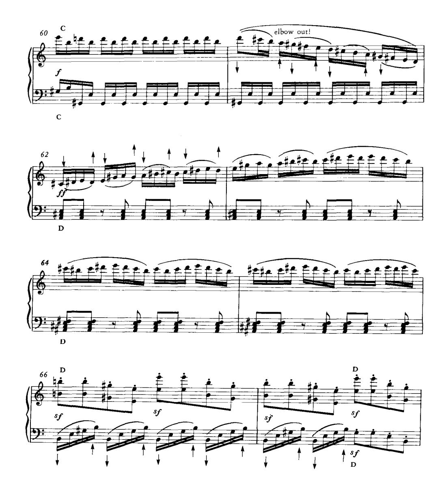

In bars 68–73 the right hand uses rotation, and the left hand uses staccato. The left hand trills from measure 72 to the end of measure 73 (with a slight rotation if it is convenient). In measure 74 the first beat is a thrust for both hands; then the right hand proceeds with scale motion (which is grouped according to the slurs) until the third beat of measure 76. At this point use legato arpeggio according to the slurs until the end of measure 77. Bars 78–85 use the same motions as bars 74–77. Bars 86–87 use staccato as they are a repetition of the first two measures of the piece.

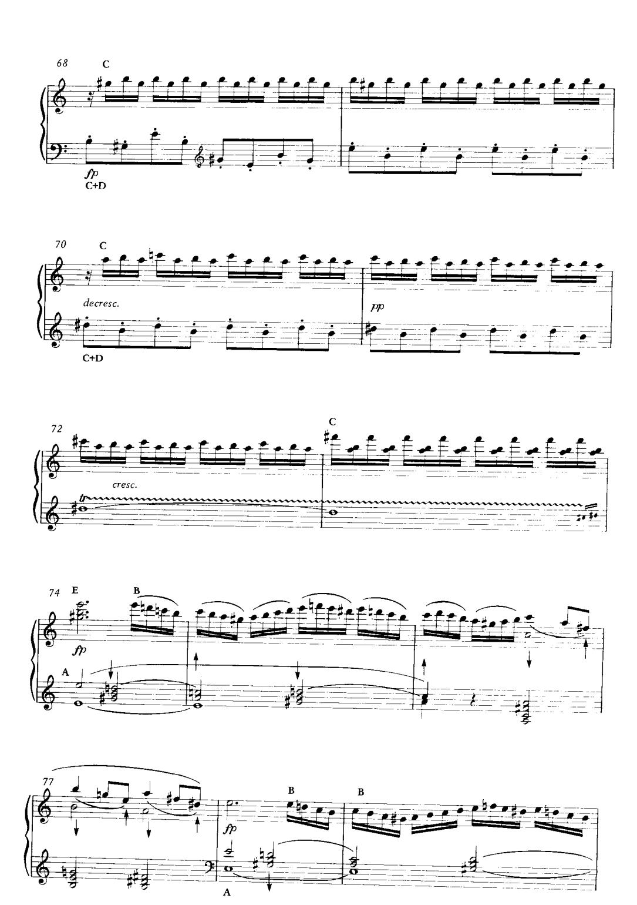

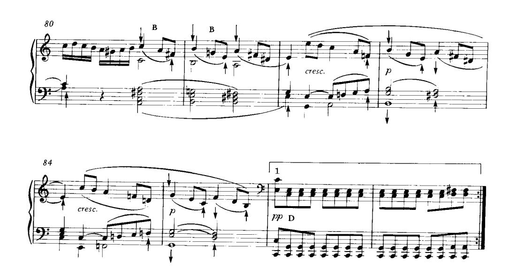

Our only concern in example 94 is to indicate technical solutions (or motion patterns) that are suggested by the written text. There is no attempt whatsoever to suggest our own ideas of interpretation, only to "translate" visual patterns to motion patterns. However interpretation and individuality do manifest themselves even at these initial stages because dynamics, tempo changes, accents, phrasing, and quality of touch (just to mention a few factors) reflect our own, personal responses. At this point our aim is only to recognize the formulas, to diagnose technical solutions, and to execute them in the correct manner. We must always remember that every one of the motions is complex; it is the result of coordinated activities of the fingers, hand, wrist, forearm, upper arm, and often the trunk. Furthermore the size of the motions and the degree of muscular intensity must be considered: they must be reduced to the very minimum to create an efficient collaboration among all the participating members. We know that totally relaxed playing does not exist, but totally effortless playing is our aim. Total emotional involvement is very desirable, but physical involvement should be minimal. If we cultivate interdependence within the playing apparatus and eliminate excessive effort, we can avoid impairing our breathing and phrasing, and we will be in a position to serve music better. As stated earlier, excitement and exaltation should be felt and generated not by muscular strain and tension but by the music itself. Obviously, excitement and exaltation can cause muscular tension and strain, but conscious control of our playing mechanism should help to reduce this strain and prevent it from interfering with our

technical processes. Many performances suffer from continuously "turned on," exaggeratedly tense physical activities and gestures that simulate the intense involvement of the artist even when the music at hand is serene and lyrical.

Rapid up-down motion converts to in-out motion.

One technical process that has not yet been discussed is a variant of a familiar basic motion. In rapid double-note passages the up-down motion of the forearm and wrist that accommodates the thumb changes to an in-and-out motion. The upper arm executes a slight to-and-fro motion that causes the forearm, hand, and fingers to vibrate back and forth. This process is applicable to the passages in examples 95 to 99 and will facilitate greatly the performances of these rather difficult works.

Example 95. Schumann, Toccata, opus 7

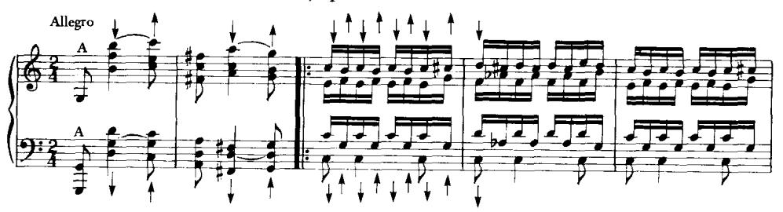

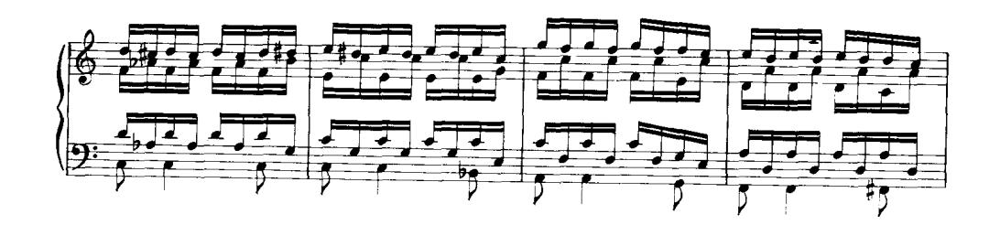

Example 96. Liszt, Transcendental Etude No. 5 ("Feux Follets")

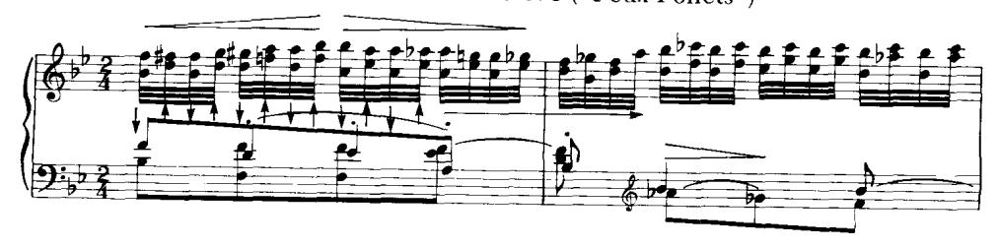

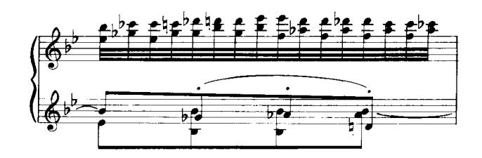

In Chopin's *Etude* in C major, opus 10 no. 7 as well as in the other examples, the wrist is lowered for the notes played by the thumb and raised for the following ones. However, in fast tempo this up-and-down motion is transformed into a forward-back movement of the upper arm. Thus the original vertical motion of the wrist is converted into another motion that serves us better. As in all motions executed in conjunction with finger motions, this motion adds to the speed of the fingers by means of an extra throw. The fingers, as always, must be slightly raised in order to receive the throw. Be sure, however, that in slow or medium-fast tempo you insist on the *up-down* wrist motion. The in-and-out motion must happen only at increased speed, and always involuntarily.

Example 97. Chopin, Etude, opus 10 no. 7

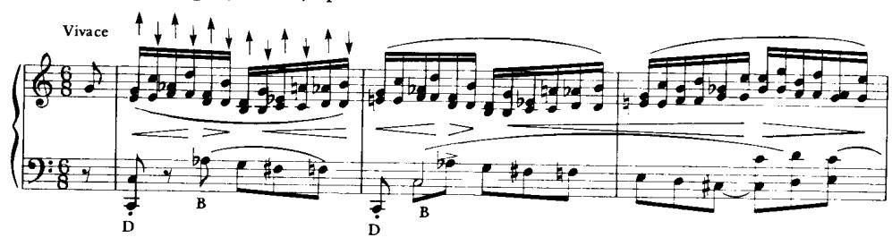

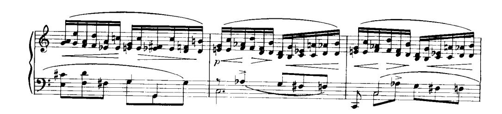

**Example 98.** Brahms, Variations on a Theme by Paganini, opus 35, book 1, variation 1

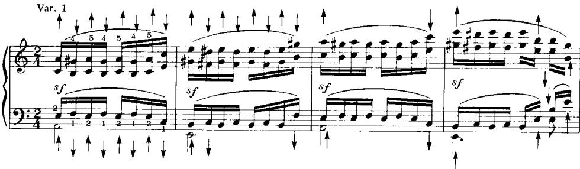

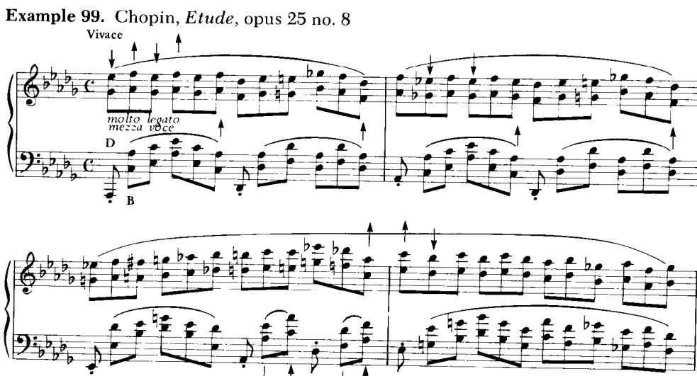

### **CHAPTER**

## 11 Independence and Interdependence

Coordination, not muscle building, is main goal.

In discussing piano technique I have favored the coordination, synchronization, and interdependence of the human anatomy over the development of muscular strength and the isolation of the components of the playing mechanism. During the endless hours of practicing pianists tend to give too much importance to the development of muscles that help the independence of the fingers, wrist, and the forearm. Of course, independence of the fingers is tremendously important; the question is how to achieve it. The wrong kind of practice for independence breeds complications and fails to resolve the inherent problem—the weakness and unevenness of finger action.

The reason usually given for grueling, tedious finger exercises is that the fingers play unevenly and weakly because they are weak and therefore need strengthening. The truth is that they function unsatisfactorily because the fingers are not placed in positions where their own muscles can help them satisfactorily, and therefore the stronger muscles of the body cannot be activated: they are simply not coordinated with the total equipment.

We are all born with a considerable ability to coordinate—we could not survive otherwise. Most beginners at the piano start off with a normal, natural position and disposition. Later they are told to "build up the strength of the fingers, especially the fourth finger," or to "strengthen the wrist," a joint that tires after a series of forced motions. Children usually begin with broad arm and body motions that help their "strength" but soon their fingers are glued to the keys in exercises in which four of the five fingers must hold on to the keys, while the fifth finger goes through its forced and senseless "muscle building." Coordination is thereby destroyed!

This manner of practicing goes on for years; this kind of practicing must go on indefinitely because it goes against the nature of the human anatomy and of normal coordination. You must keep on working at it to maintain these strenuous and wasteful habits. While you may gain a certain independence of the fingers, you fail to use your entire playing apparatus interdependently: the fortified but isolated units are detached from the larger equipment that could pass on power to them if only the fingers were ready to cooperate.

Practicing to achieve independence is beneficial only if it is carried on within the framework of *interdependence*. Finger exercises are useful only if the position and participation of the arm (that is, the forearm and upper arm) are considered. The fingers must be lined up with their respective forearm muscles, and the upper arm must participate in placing the entire equipment where it belongs. Without a continuous but always slight adjusting activity of the arm, coordination is spoiled. We really cannot strengthen "finger muscles" because it is the forearm muscles that move the fingers. However unless these arm muscles are properly lined up with the fingers and upper arm, they work under a handicap. By the same token, if the whole apparatus works under proper conditions, there is no need to strengthen the forearm muscles—or any other muscles, for that matter. The strong muscles supply all the help the weak ones need; above all, the slight changes in the arm's position eliminate stiffness in the wrist.

Principal adjusting motions

The principal adjusting motions are: (1) horizontal (lateral) adjusting motions, which line up the fingers with their respective flexor and extensor forearm muscles; (2) vertical motions, which raise the wrist from the low thumb position toward the higher fifth-finger position, and (3) depth motions (forward and backward from the edge to the back of the key), which adjust the fingers to white and black keys with the help of the upper arm: the position of the upper arm for black keys is somewhat higher and more forward than the position for white keys. We may add to these the movements of the body: sideways, axially and forward-backward, according to need.

The purpose of these motions (which should be neither too large nor too small) is to accommodate the fingers. Most of these motions may occur automatically and instinctively. This is fine when it happens, but unfortunately we cannot always rely on instinct alone. It is possible that "doing what comes naturally" will take us a long way, but it won't take us all the way. When problems arise, we must know how to help ourselves. Fortunately, in due time most conscious activities become subconscious, and then they become automatic, when they are completely mastered. It is not necessary to be aware of everything all the time—God forbid! But in case we need it, our knowledge can come to our assistance.

No pressure

The ever-present adjusting motions enable us not only to place the equipment properly and to activate any and all of the necessary muscular resources, but they eliminate extended fixation, stiffness, and rigidity in the muscles and joints—the most common source of trouble in technique and tone production. The continuous alternation of antagonistic sets of muscles automatically relaxes the previously en-

gaged muscles while the opposite muscles work. Of course, we only relax to a certain extent; we don't do it completely. But whenever the joints and muscles must be fixed, the fixing must be only momentary, not only because our muscles prefer it, but because of the nature of the piano. When the hammer is activated to its proper speed, it hits the strings in a split-second throw, bounces back and never applies pressure on the strings. Pressure on the keys may be habit-forming and gratifying (see chapter thirteen), but it is unnecessary and wasteful. If we are not addicted to it, we can easily eliminate it and not indulge in "relaxing" motions, for instantaneous fixation is totally effortless.

Vibrato on string instruments

Extended pressure is necessary only for playing string instruments; this is one of the reasons why string players welcome and feature the vibrato. In addition to its beauty vibrato also serves to relieve muscle tension through a continuous shifting in position. Stiffness caused by extended tension is removed by the rapid alternation in the use of antagonistic muscles. It also helps to reduce intonation problems; furthermore, the sound itself is improved by the physiologically advantageous muscular actions.

Another even more important purpose of the adjusting motions is to add speed and power to the fingers. No matter how small these adjusting motions are, when they are timed correctly, the synchronized vertical, horizontal, and in-and-out motions add a considerable throw to the fingers, sufficient to increase their speed. This occurs in fast tempo as well, even though the motions are so small that they are invisible.

Direction, but not size, of motions is being specified. While we can clearly define the directions of the motions (up and down, side to side, back and forth, and axial), everyone has to determine their size according to his or her anatomy. A long upper arm and short fingers move differently than a short upper arm and long fingers; all we know for certain is the general direction of the movement. Similarly the adjusting motions of the body serve the pianist to maintain his balance, and the size of movements depends on the size of the various sections of his anatomy. We must be concerned with the proper placing of the entire mechanism (torso, legs, head) and with the height of the stool and its distance from the piano.

The five basic motions contain the following active and passive movements:

Chart of active and passive motions

Free fall: The entire arm, hand, and fingers are actively engaged during lifting and landing. Not the body and the head.

Five-finger motion, scales, and arpeggios: Here, too, the entire arm, hand, and fingers are actively engaged; and we move the body according to the location of the hands on the keyboard.

Rotation: Only the forearm and the fingers are actively engaged in the forearm's axial rotation, not the wrist and the upper arm. In wider rotation the upper arm rotates axially and brings about a lateral motion of the forearm, and in extremely wide distances the upper arm moves laterally too.

Staccato: The entire arm, hand, and fingers are active at all times. Not the head and body.

Thrust: The muscles of the entire body are active, and the force of gravity is not involved. The slight motion of the forearm and hand is barely visible. The head, torso, and feet are immobile; they support the thrust and resist the rebound caused by the keys. There are no passive motions.

Besides active motions there are passive ones that come about indirectly:

Free fall: During the arm's downward motion that is caused by the force of gravity, the falling arm is totally passive.

Five-finger motion, scales, and arpeggios: This motion is totally active; there are no passive motions.

Rotation: In the forearm's axial rotation the upper arm simply holds the rest of the arm; otherwise it is passive. It may "shake along," but it doesn't participate in the motion itself. It is active only in wide intervals.

Staccato: There are no passive motions except during the rebound in extremely fast and loud playing.

Thrust: There are no passive motions.

Finger exercises to "build muscles"

As we stated earlier, our aim is to develop independence within the framework of interdependence; this is why we have referred so often to interdependence in this chapter.

We must examine now the harmful effects of forced finger exercises when interdependence is not taken into consideration. The exercises in examples 100 and 101 are typical of those that aim to develop independence at the expense of interdependence.

Example 100. Five-finger exercise (harmful: fixed position)

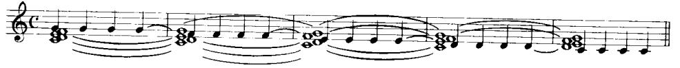

Example 101. Five-finger exercise (harmful: fixed position)

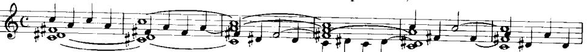

The victim, or student, is supposed to press down four notes, raise the finger that plays, and repeat the down-and-up motion until he feels considerable tension and stiffness in the forearm. He then proceeds to the next finger and lets the previously active one join the others in pressing down the keys. During the entire procedure the arm and wrist are supposed to be held immobile in a fixed position by tightening up both the flexor and the extensor muscles of the forearm. This type of exercise is a rather unpleasant experience, but it is supposed to make us better pianists. If we practice example 101, the experience is not only unpleasant but painful too since the intervals are wider and the tension will be greater in the arm. Moreover, in due time it becomes quite harmful. Nevertheless, we feel good; we pay our debt to society, to Art and to our teacher: we work "hard!" The chronic pain doesn't stop us as yet, but now there is a fair chance that tendonitis will develop. If we insist on continuing this masochistic pastime, we will indeed develop chronic tendonitis—which becomes the "coup de grâce" that will liberate us from any further undue suffering. We will then have to give up the piano completely!

There is a great deal wrong with this approach. The role of the forearm muscles is to act as an antagonistic set—the flexors pull the fingers down, and extensors raise them. When the four inactive fingers in these exercises continually press down the keys instead of resting, their flexors are under continuous tension; this state is not only unnecessary but harmful. Furthermore, because the arm and wrist are fixed and immobile, the active finger cannot find a correct position in line with its muscles. Therefore not only the finger but the muscles that move it must function under a handicap. We know that each finger has an optimal position where it can work effortlessly; by not permitting the wrist and arm to move, we make it impossible for the finger to assume this position. We need the horizontal, vertical, and depth adjusting motions to place the finger properly—a fixed wrist prohibits this. Thus what could be a continuous enjoyable flow of activities (going from the thumb to the fifth finger and back) becomes agonizing drudgery.

The warning system

It is true that in due time the pain diminishes because the muscles become tough and insensitive (so does the sound), but this in turn causes further damage: (1) the coordination and interdependence of the system become impaired, and (2) the desensitized muscles lose the ability to warn us when forcing takes place. In short, the muscles have been strengthened and desensitized. This is a bad situation because the first symptom of incorrect, forced activity should be fatigue and tension in the abused muscles; when these symptoms occur, the "big brother" muscles should rush in to help. So we have a vicious

circle: we try to strengthen the weak muscles, and in doing so we eliminate the instinctive activation of the stronger ones; with no help from the strong muscles we have to keep on strengthening the weaker ones. As a result numbness and pain afflict the muscles. The worst of it is that an ugly tone is a direct result of the malfunctioning apparatus.

In contrast to finger exercises that stress independence alone, finger exercises that incorporate correct arm participation can be really useful. Evenness and power can be achieved in the fingers without strain if you use the correct arm motions. Instead of building muscles, it is much more beneficial to learn how to coordinate the weaker muscles with the stronger ones. Sensations of fatigue in the muscles are not necessarily signs of weakness but a call for help. In all truth, one ought to cultivate this warning system instead of desensitizing it.

Blood circulation

In spite of all the damage they do, it must be conceded that these painful, athletic muscle-building exercises, like all exercises, help to increase blood supply and circulation. When these strenuous exercises stop, the fingers feel relief and move with more ease for a while. The reason they are used as warming-up exercises is that some people think they need them in order to loosen up when they begin practicing. My contention, however, is that by activating the entire body—by distributing motions and effort among all the participating members —one hardly needs any warming-up exercises. After all, the pianist is using the same equipment that he uses constantly for lifting a chair, for opening a door, or for writing, and he doesn't need warming-up exercises for any of these activities. When piano playing becomes totally effortless, the need for warming up vanishes. You can always rub your fingers together or stretch your arms if you feel sluggish, but you don't need anything else. If you enjoy stretching exercises at the piano, by all means go ahead and use them, but don't overburden the muscles.

Independence of fingers is best achieved by feeling and ingraining the arm and wrist position appropriate to each individual finger; every finger should assume its optimal position when called to duty.

Although we have emphasized the interdependence of the arm, hand, and fingers in this discussion, it is obvious that the entire body thrives on interdependence. In order to maintain balance and support the body, we often change the position of the feet and the head. The more interaction within the entire body, the more effortless and economical the playing becomes. When the body is totally involved in participating and the muscular action is totally distributed among its components, the performer hardly seems to be moving at all; yet he may play with lightning speed and produce thundering sounds.

## 12 The Pedals

Pedals were needed to mute the longer strings.

Damper originally operated by knee, then foot.

Two or three pedals now

Pedal nomenclature As the piano evolved into its present form, and especially as it increased in range and size, various alterations and additions were needed to cope with the duration of its sound, volume of the sound and the control of the volume of sound. The strings constantly grew longer and finally, around the time of Mozart, the excessive reverberations of these longer strings had to be curbed. Dissonant and transient notes were not objectionable on the earlier short-stringed instruments because the sounds didn't last long enough to drown out the fundamental harmonies and basses.

Near the midpoint of the eighteenth century, when the strings had become quite long, matters seemed to have gotten out of hand. So a mechanism operated by the knees that served as a mute was affixed to the piano to stop the sound of these unwanted cacophonies. This device, which was known as the *sordino*, or *damper*, was added to the strings, enabling the performer to stop its vibrations at will. In due time the feet took over from the knee, and the device came to be known as the *pedal*. Pianists now had a very effective device that allowed them to clear sonorities or to mix them. The pianist's repertoire of effects was expanded since he could weaken sonorities, strengthen them, feature them, blend them, and create sounds that could be magical or ghastly, depending on the artistry of the performer.

Considerable evolution in the development of the pedal led eventually to excess; in the early nineteenth century pianos had as many as six to eight pedals, some of which imitated drums and cymbals. Later the number of pedals was reduced to two or three.

A comprehensive history of the evolution of the pedal can be found in many excellent books and sources of reference on the subject; but it will not be given here. Nor is it necessary to describe the pedal; we are all familiar with it. However the nomenclature associated with this device is confusing. Several different names are applied to the three pedals, and often we find ourselves in the perplexing situation of not knowing which pedal people are discussing. Before I list some of these confusing names, I would suggest using just one name for each of them. For convenience's sake let us call them the *right*, *left*, and *middle* pedals.

The right pedal is sometimes called the *forte* pedal; it is also called the loud pedal, and the sustaining pedal—or just pedal. The middle pedal is called the sostenuto pedal, the organ point pedal, and the sustaining pedal. The left pedal is occasionally called the sordino pedal, the damper pedal, the una corda pedal, the due corde pedal, and the muted pedal; most often it is called the soft pedal. Depending on the part of the world you come from, you may use any of these terms. What adds to the confusion in a spectacular way is that in some countries the damper was originally called sordino because it muted the strings. In many of Beethoven's scores we find the indications con sordino and senza sordino; these terms appear in the Urtext edition of the second movement of the third piano concerto, for instance. Since in Italian con means "with," and senza means "without," the semiknowledgeable understood con sordino to mean "with pedal" and senza sordino to mean "without pedal"; of course, this was not the case. By sordino Beethoven meant the damper, not the pedal. Therefore in this case con sordino means "with damper" (without pedal) and senza sordino means "without damper" (with pedal). Confusing, isn't it!

Whatever name we give to the pedals (and we might as well settle for *right*, *middle*, and *left* pedals), their role is extremely important. They enhance sonorities and can help to produce sound effects that make a performance memorable and unique.

The right pedal is sometimes called the loud pedal because it actually increases the volume of the sound. When the pedal is depressed with a note or chord, sympathetic vibrations are generated in all the strings of the piano. (Sympathetic vibrations are produced by vibrations in neighboring bodies of the same wavelength.) Without the pedal we hear the vibrations of only those strings that are hit by the hammers, because they are the only strings whose dampers are raised. If we play middle C without pedal, only the harmonics of this string participate in the sound produced. On the other hand, if we put the right pedal down while playing the C, all the other strings of the piano—some two hundred from top to bottom—join in with sympathetic vibrations. When several notes or chords are played, the sympathetic vibrations are even richer; they prolong the sound and add to it an aura of many more harmonics.

There are no hard and fast rules governing the use of the right

"Sordino"

The right pedal: a richer sound

Registers

pedal, but there are several valid guiding principles. In general, much more pedal can be used for the higher strings than for the lower strings. Actually the highest notes on the piano have no dampers at all. Because the sound is so short, the dissonances don't bother us. It is perfectly feasible to play a scale in the high register with the pedal down; this same procedure is impossible in the bass. The farther down we go, the more cacophonic any simultaneous sound will be. A major third is a perfect consonance, but if it is played in the lowest register, it turns into a sinister rumble—with or without the pedal.

Harmonics

As a general guideline, one can safely pedal any number of notes that form the harmonics of an audible fundamental note.

**Example 102.** Harmonics of A; all notes can be pedaled with the bass note.

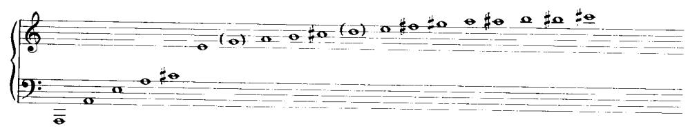

As we go up the harmonics ladder from bass to treble, the intervals gradually diminish; the octave is followed by the fifth, fourth, major third, minor third, and major second, etc. Even though some of these intervals are not in tune with the piano (tempered or not), they may be pedaled together as long as their root notes (that is, their lowest notes) lie above the lower limit of human hearing. As I mentioned before, intervals played in the lower register sound "bad" because their fundamental notes are far below the limits of human hearing. It is safe to pedal notes in the higher register, especially when the fundamental note is also played and heard.

**Example 103.** Harmonics of C; emphasizing different harmonics' combinations

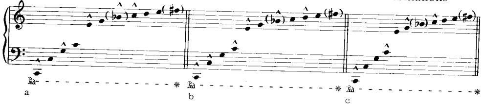

Timing

In general, one applies the right pedal immediately after depressing the keys. It is preferable to capture the sound *after* the hammer

hits the strings and after the dampers are raised. In this way we can prolong the pure sound and exclude the noise of the hammer, the keybed, and the damper. Minimal as they may be, these noises influence the purity of the sound. The moment at which to put the pedal down is determined by the registers: the lower register requires more time than the middle register to produce a pure sound; therefore we put the pedal down a bit later. The ear is the best and only judge of how much pedal to use. If we listen carefully, we can time our pedaling well. Because every piano and every hall is slightly different, we must listen very carefully, especially when harmonics change, when a dissonance overlaps, and when a voice must be brought out; we may or may not wish to mix sonorities. There should be a split-second delay between the depression of the keys and the depression of the pedal; but that split-second is subject to changes.

Partial pedals

Soon after the invention of the pedal, composers began to include pedal markings in their scores. We should heed these indications when we are certain that they are the composer's markings because they are both authentic and sometimes quite explicit. However there are a number of uncertainties in these pedal marks: first, most of the markings merely indicate when the pedal should be depressed but not whether it should be depressed partially or completely. One can use a half pedal, or even one-third or one-fifth of the pedal's capacity. If we depress the pedal completely, the dampers clear the strings completely; a partial pedal mutes the strings only partly, and this type of pedaling produces a totally different sound effect.

The size of the instrument also has a bearing on its sound, for the length of the strings varies with the length of the piano. In Mozart's and Beethoven's time piano sound was weaker and decayed more rapidly than the sound of the larger pianos of Liszt's day and our own time. Beethoven indicated long pedals in the following well-known examples:

Rondo
Allegretto moderato

sempre pp

Example 104. Beethoven, Sonata, opus 53, last movement

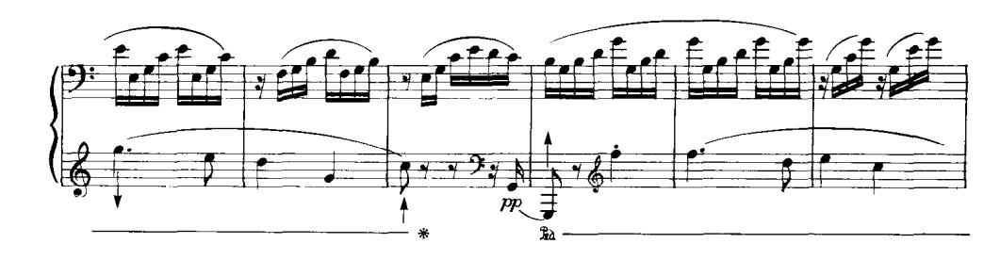

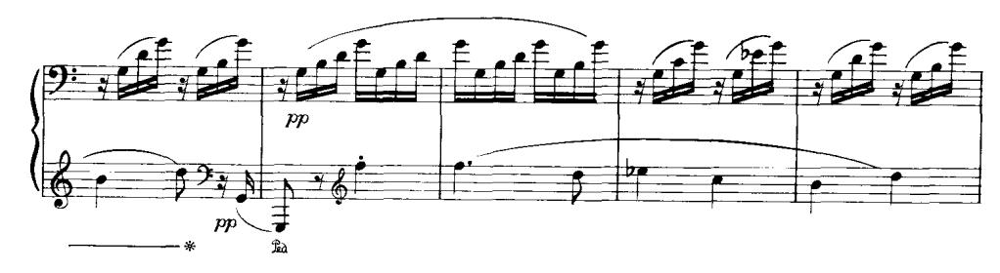

Example 105. Beethoven, Sonata, opus 31 no. 2, first movement

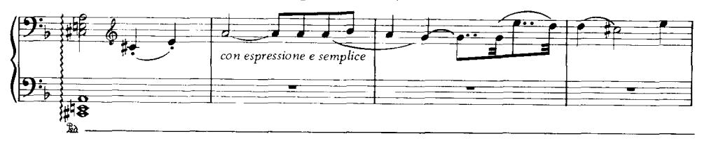

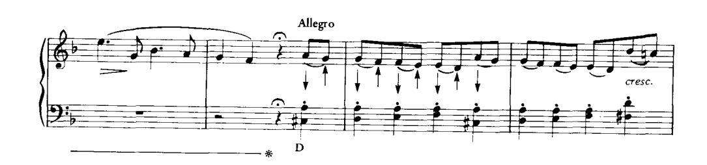

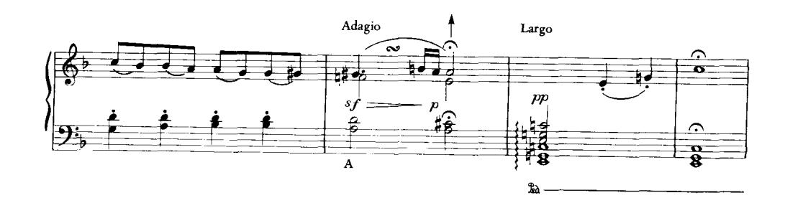

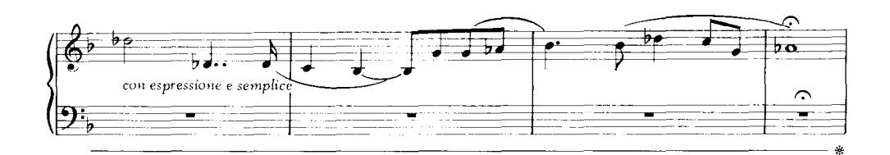

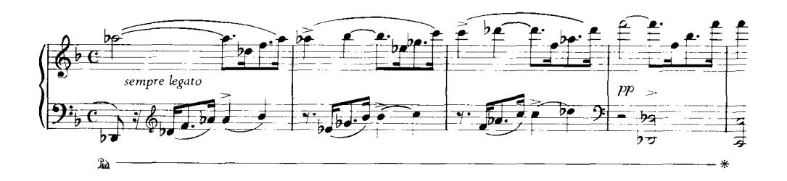

Example 107. Beethoven, Sonata, opus 53, last movement

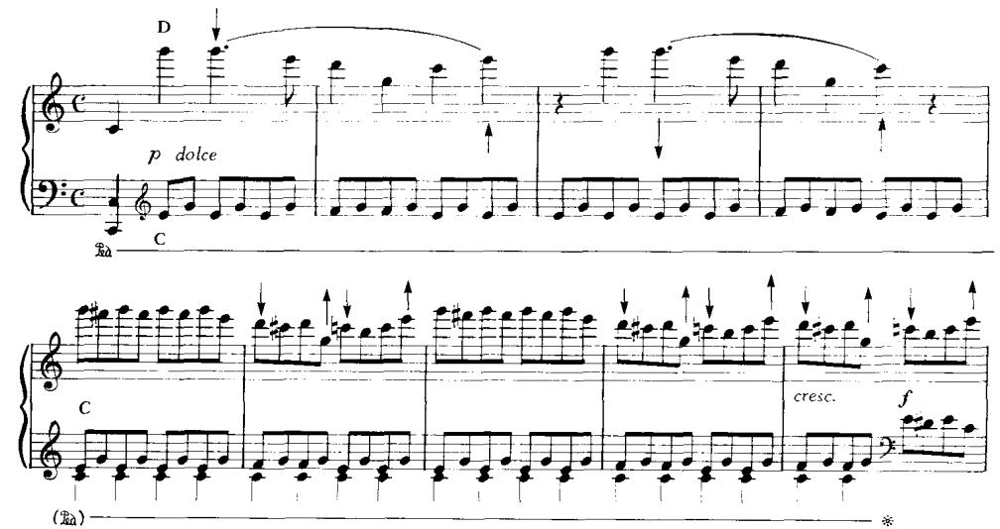

Example 108. Beethoven, Concerto No. 4, opus 58, third movement

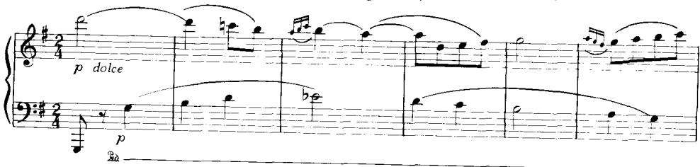

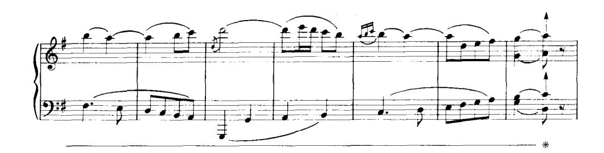

Blending bass, middle, and top registers over an organ point The art of pedaling hinges on our ability to blend harmonics. For example, just take one set of harmonics: by accentuating and coloring different harmonics within the same column, we create innumerable sound effects, even without varying the dynamics. When you consider the fact that you can also alter the dynamics, touch, speed, and rhythm of the harmonics of one note, you can indeed see that a great variety of effects can be created within the same column of harmonics.

It was a traditional device even in Bach's time to blend certain harmonies, especially the tonic and the dominant, in a tempered and aesthetic way. But discretion must be used. For instance, if we play the bass note softly and the middle register more loudly in a passage of mixed harmonies, we will produce a muddy and generally unpleasant effect. But if we gently accent the bass, underplay the middle register, and bring out the top notes, the blend of chords can be beautiful.

The ear is the judge.

One must not take the pedal markings in the Beethoven examples we cited literally: instead we must search for the real meaning behind the indications in all pedal markings. Some contemporary composers (Bartók and Prokofiev, for example) are more specific in their pedal markings; for instance, half pedal signs and pedal tremolo signs are indicated in their work. But in general composers often supply no markings at all.

On today's piano it would be pedantic and naïve to depress the pedal completely and hold it to the bitter end just because "Beethoven said so." The sounds would become blurred and cacophonic, while all Beethoven wanted was a blended effect with two or more harmonies merging over a fundamental note or chord. We must remember that his piano had much shorter strings than ours and that he never did specify how far the pedal should be depressed.

The pedal tremolo

The pedal *tremolo* is an effective device that may be used quite often both to mix and to clear sonorities. It is used frequently in Impressionist and modern music, but there is room for it in any style. Some good examples of pedal *vibrato* (as the tremolo is often called) are the following:

Example 109. Chopin, Etude, opus 25 no. 2

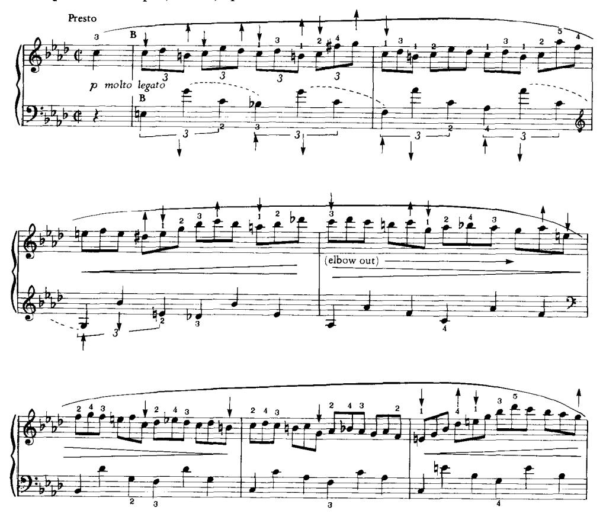

Example 110. Chopin, Sonata in B Flat Minor, opus 35, fourth movement

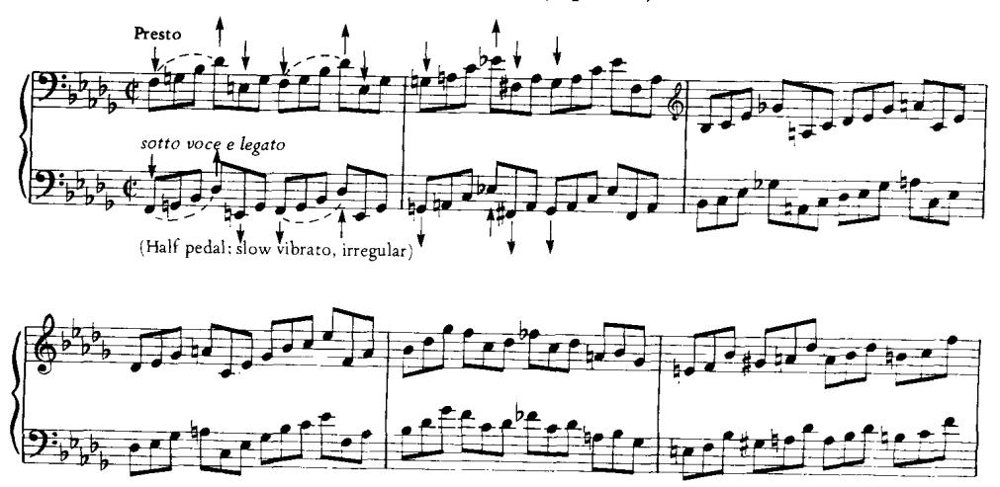

Example 111. Ginastera, Sonata, second movement

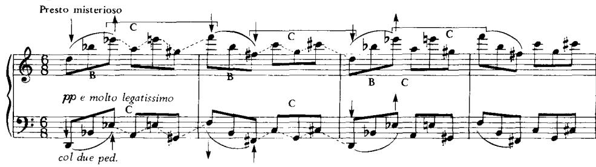

Example 112. Debussy, "Feux d'artifice"

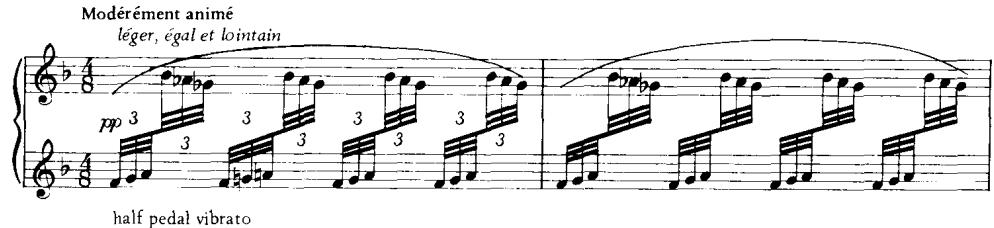

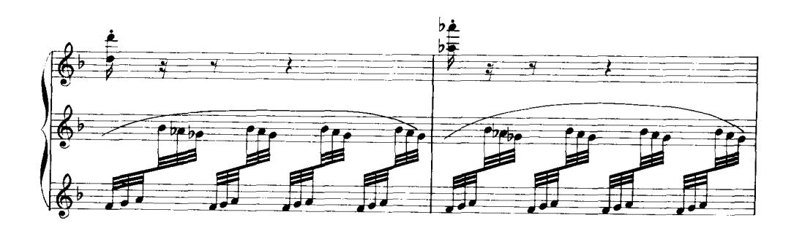

Incidentally the pedal vibrato may be applied as rapidly, regularly or irregularly as one chooses, depending on one's ear and coloristic imagination.

Crescendo effect

Another effective way of using the right pedal is in crescendo effects in both loud and soft passages. The right pedal augments a crescendo by generating sympathetic vibrations in all the strings. It is effective for short glissando-type runs in both pianissimo and fortissimo passages like the ones in examples 113 and 114:

ON PIANO PLAYING

Example 113. Mozart, Concerto in D Minor, K. 466, first movement

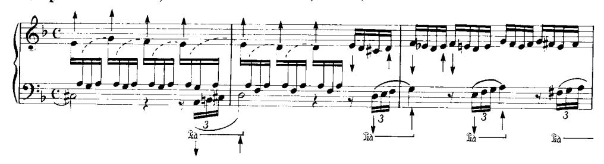

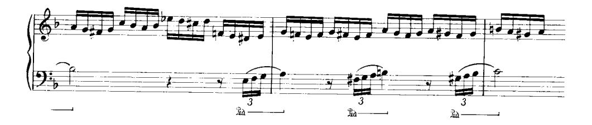

Example 114. Liszt, "Mephisto Waltz"

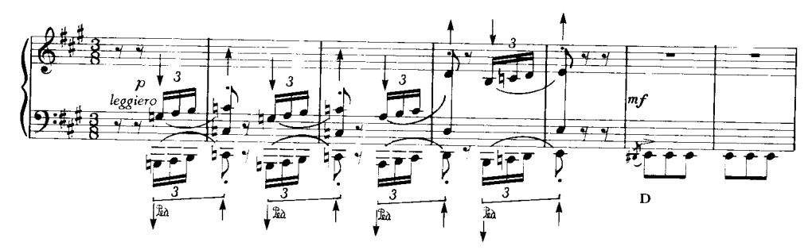

Harmony

Since the right pedal helps to synchronize sounds, chords, and harmonies, a thorough knowledge of harmony is desirable for its effective manipulation. The pedal is also very helpful in contemporary music where the main notes and harmonies are often obscured by neighboring or derived (sharpened, flattened) notes; the pedal can help a great deal to underline structurally important notes. All in all, it is advisable to use as much pedal as possible. The pedal can be regarded as a device that can restore the piano to its previous happy state, when no damper interfered with the rich sympathetic vibrations of its entire string system. Let us use the dampers ("con sordino") only when overlapping sonorities necessitate a "blotter" to soak up and eliminate unwanted sounds. The dampers, in effect, can choke off the vibrations of the strings quite suddenly; this abrupt quality is sometimes undesirable, especially at phrase endings. Here a smooth pedaling and a gentle lifting of the fingers with the help of the arm is

Pedal indications

preferable. I would fully concur with the response of a fine pianist who was asked when he uses the right pedal. His answer was, "Whenever it doesn't sound bad." Indeed it is a good idea to use a little pedal on the last note of every phrase ending.

There are several ways to indicate pedaling. Most frequently the sign indicates the point where the pedal should be depressed. An asterisk\* is often used where the pedal is to be lifted. Sometimes this sign is used: \_\_\_\_\_\_\_\_\_; the first vertical line indicates the depressing of the pedal, and the second vertical line indicates its lifting.

Example 115. Pedal marking

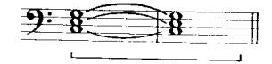

Sometimes dots are used for the duration of the pedal: \*\*...... "½ Pedal" or "½ Pedal" is used occasionally. For pedal tremolo or vibrato we sometimes find either the words printed or the following: \*\*

Another indication for the right pedal—one that was often used by Beethoven—is *tutte corde*. In some instances, however, this term is a substitute for *tre corde*, and it should be interpreted merely in the sequence beginning with *una corda* and *due corde*; in this case it means to let all three strings of a note sound, and is used after the left pedal has been lifted. In due time, however, *tutte corde* became an indication that all strings should be freed of their dampers: it simply means that the right pedal should be depressed.

As we mentioned earlier, the term *senza sordino* is also a right pedal sign; it was frequently used by Beethoven. The end of his indication is *con sordino*, a term that means the dampers are to be dropped on the strings to stop the sound, by releasing the pedal.

Senza sordino; con sordino

Example 116. Beethoven, Piano Concerto No. 3, opus 37, second movement

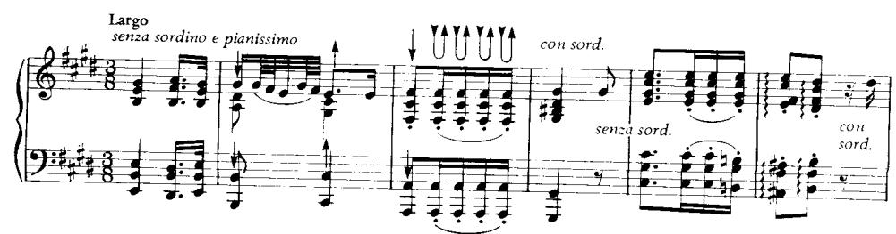

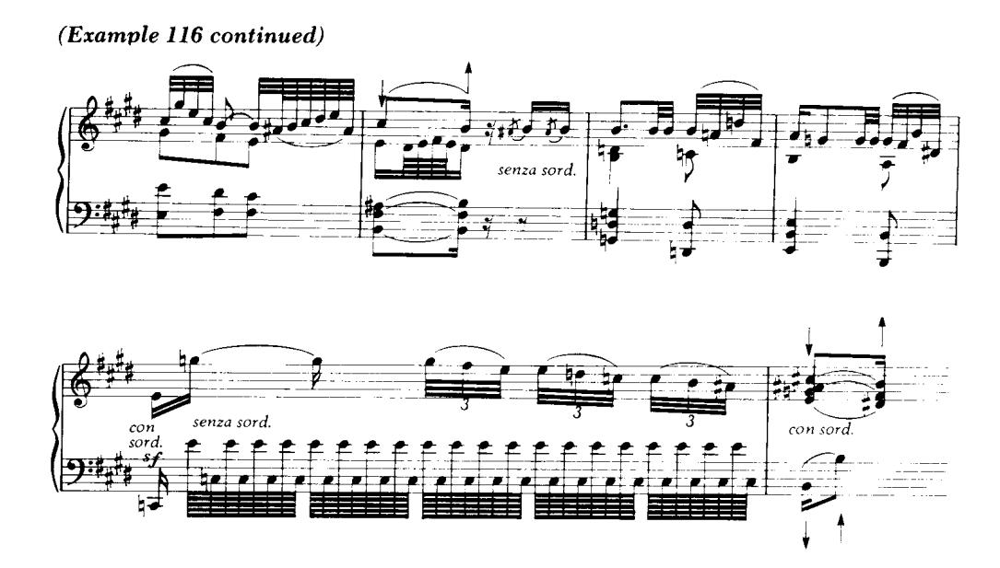

The pedal in Baroque and pre-Baroque music

Even when no pedal indication appears in the score, we should still use the pedal unless there is a special reason not to do so. As I said before, the ear is the judge. Even though Baroque music was written before the piano and its pedals were invented, we are fully justified in using anything and everything possible to make it sound the way that best serves our musical purposes. The piano was not invented as a whim or as a superfluous addition to some already-existing and totally satisfactory family of instruments. On the contrary, it was invented because there was a need for it; its predecessors left a great deal to be desired, and composers created music that necessitated an evolution in keyboard instruments. The increased volume and expressiveness of the piano was a step ahead of its forebears, and the pedal added to its already richer tonal palette. Arpeggios, runs, and tremolos sound better with the pedal in any period or style, be it Baroque, Classic, Romantic, or contemporary. The pedal can also enhance polyphonic music if it is handled judiciously.

Middle pedal: invaluable for isolating and blending certain notes The middle pedal is a relatively new addition to the piano. Actually it was an American invention, and only recently has it been adopted by some of the European and Asian piano factories. It certainly is a most welcome improvement. It enables us to sustain any particular note or notes that we wish to feature or include in subsequent passages, without having all the strings vibrating sympathetically. Its role is very, very important. When properly used, it equals the right pedal, and I personally use it nearly as much as the right

When to activate the middle pedal

Combining middle and right pedals

Harmonics

pedal. It should be activated just *after* the key (or keys) is pressed down and held; the respective dampers are then suspended in the up position, permitting the strings to vibrate until the dampers are released again.

Since the middle pedal prolongs only the notes we wish to hold, it is ideal for organ points and sustained notes whenever we don't want to submerge the rest of the notes in one pedal. For instance, we can sustain a whole column of harmonics of a chord and let these notes, and only these, generate sympathetic vibrations to the other notes played. The harmonics of the chord feed on each other's vibrations; they reinforce the pure harmony held by the middle pedal and keep it emerging clearly beyond all the other nonharmonic notes that are played. The effect of the middle pedal is much more evident in the lower registers, where the strings are longer than those of the treble.

We can and should develop the technique of applying the middle pedal during runs, passages, and scales. We can hold certain notes that are organically part of the main harmony with the fingers, sustain them with the middle pedal, and highlight the chord as a structural part of the music. Once these pure harmonies emerge, we can then use the right pedal to incorporate them and improve the overall sonority. Thus the middle pedal can act as a filter that passes on the "purified harmonic product" to the musical texture. This technique is very useful in any style of music. In conventional music the harmonies can emerge from scale passages, and in contemporary music we can choose to feature the structural notes that are often obscured by grace notes or passing notes. Used either overtly or covertly the middle pedal is a great improvement to the modern piano, and it is well worth cultivating.

One of the more sophisticated uses of the middle pedal involves the use of harmonics. If we want the harmonics of some notes to sound and to envelop other sonorities, we can press down these notes mutely and catch them with the middle pedal even before we start to play the piece. The harmonics of the sustained notes will come to life through sympathetic vibrations; sometimes they produce an eerie and strangely beautiful sonority. This device is well employed in bagpipe music (musettes) and in music-box imitations. One of Bartók's compositions, "Harmonics," exploits this technique in a most imaginative way:

Example 117. Bartok, Mikrokosmos, vol. 4, "Harmonics"

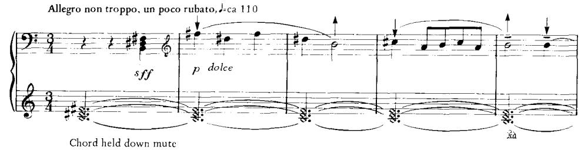

By the way, we must be watchful to release the middle pedal at the right time in order to avoid mixing (and catching) unwanted sounds if the harmony changes.

A classic example of the use of harmonics is in Schumann's Carnaval:

Example 118. Schumann, Carnaval, opus 9, "Paganini"

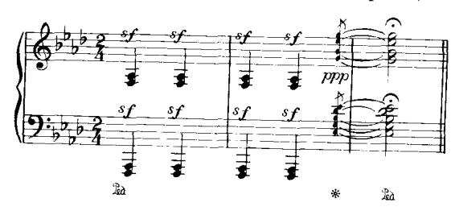

The last chord of "Paganini" is to be depressed mutely while the previous fortissimo chords still sound and generate sympathetic vibrations in the strings.

The middle pedal can be used with or without the right pedal for effects like the long pedals of Beethoven. Another obvious passage in which the middle pedal is used is the extended A-flat-major harmony with its recitative-like cadenza at the end of Chopin's *Fantasy*, opus 49. The middle pedal can be held throughout the long fermatas.

Example 119. Chopin, Fantasy, opus 49

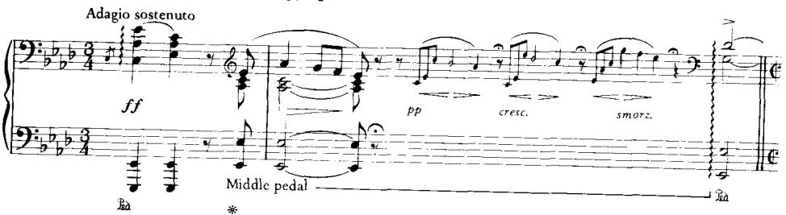

Still another ideal spot for both pedals is the coda of the *Chromatic Fantasy* by Bach.

Example 120. Bach, Chromatic Fantasy and Fugue

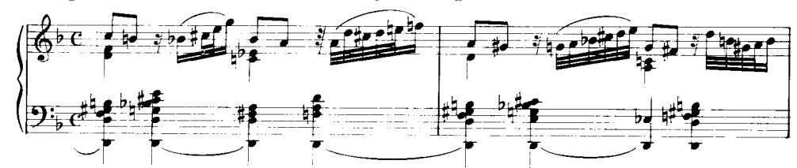

From the beginning of the Coda: middle pedal for low D. plus some right pedal until end of the Fantasy.

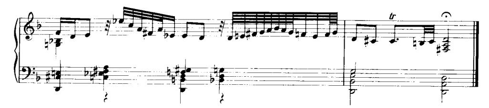

Wide stretches

We can accomplish much with the middle pedal in wide stretches; it is easier to hold notes with the pedal than to strain the hand. At the beginning of the third movement of Beethoven's *Sonata*, opus 31 no. 2 ("Tempest") it is quite possible to hold the sustained A in the left hand with the middle pedal; you can depress its key mutely before starting the picce and then activate the middle pedal. The note must be released when the harmony changes and then caught again when it recurs.

Example 121. Beethoven, Sonata, opus 31 no. 2, third movement

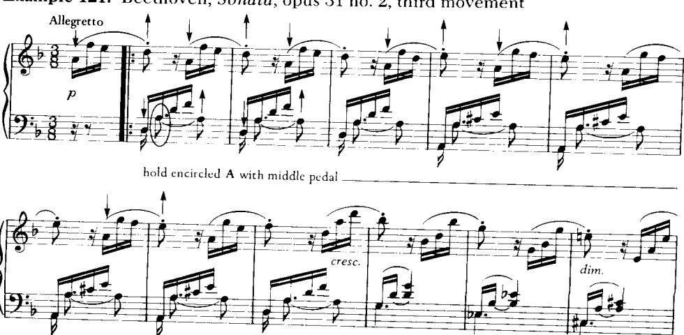

Sometimes the middle pedal can be used more subtly. In example 122 one's first impulse might be to catch the low C with the middle pedal and sustain it through the harmony. If you did this you would soon notice that this low C is overwhelmingly loud because of the dynamic marking. A much better effect results when the C of the octave higher is sustained. The tonic note is still sustained, but it is done in a much more attractive manner.

Example 122. Beethoven, Sonata, opus 53, last movement

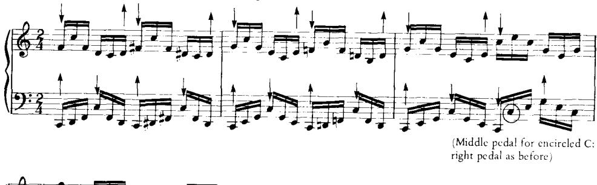

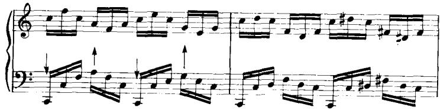

Una corda; due corde

The left pedal, which is often called the soft pedal, una corda, or due corde, helps us to produce softer sonorities by mechanical means. When we use the left pedal, the entire mechanism of the piano shifts to the right so that the hammers do not hit all three strings but only one or two; the number of strings hit depends on when the piano was built. When the shifting device was first applied in the eighteenth century, the mechanism went far enough to the right for the hammer to play only one string: it could be shifted back gradually to touch two strings and then back to its normal position, where the hammer hit all three strings. Beethoven often indicated una corda, due corde, and tutte corde. Today's instruments do not shift quite as far to the right as those of Beethoven's day, and the left pedal activates two strings. Even so, the difference in the volume of two strings is quite noticeable when it is compared to the sound produced by three strings. Since the lowest bass notes have only one string each, their sound is not reduced by the use of the left pedal. However there might be some difference in volume and in the tone quality because a softer portion of the felt contacts the string when the left pedal is depressed.

A different timbre too

"Riding" the left pedal And this brings up an interesting topic: if the piano has new hammers, the shifting of the mechanism merely reduces volume of the sound because two strings are struck instead of three. Most of the time, however, the hammers are "played in," and the felt has grooves on it. Therefore when the left pedal is depressed and the piano mechanism shifts, a less-used portion of the felt contacts the strings and this alters the tone quality. Although the purpose of this pedal is not a change in tone quality, everyone now associates the left pedal with both a reduced sound and a new timbre. We might as well accept this fact and use the left pedal also as a coloring device that enriches our tonal palette. But let us bear in mind that it is preferable to rely on touch quality created by the fingers rather than the feet.

The shifting of the hammers to a softer-sounding portion of the felt tempts many pianists to use the left pedal excessively. Indeed with it the piano does sound gentler, and it is easier to control in soft passages. At public performances, when one often must play an unfamiliar and imperfect instrument, the left pedal can safeguard against unpleasant surprises in sonority. Another cause of "riding" the left pedal continuously may be nerves, a problem we will discuss in chapter eighteen.

I believe that the use of the left pedal in Baroque music is as valid as in that of any other period. There is no reason to believe that Bach and his contemporaries did not occasionally desire extremely soft or extremely loud sonorities; they certainly asked for loud moments in music for the organ, voice, and strings; moreover the sound of the clavichord, a very popular Baroque keyboard instrument, was very soft and gentle. It seems to me that the gentlest of pianissimos is entirely appropriate in music like this prelude by Bach; if this work doesn't call for pianissimo, I don't know what does:

Example 123. Bach, Well-Tempered Clavier, book 1, Prelude No. 8 in E Flat Minor

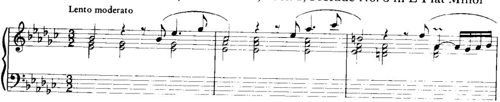

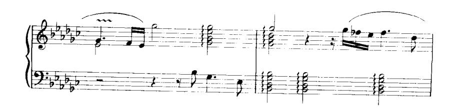

Depress early and fully.

Here the left pedal is certainly an asset.

Unlike the other two pedals, the left pedal is applied just *before* we play the note. The mechanism should already be in position when the hammer hits the strings so that it doesn't slide at the moment of attack. Unless you are playing one of the older instruments with una corda, due corde, and tre corde options, you should keep the left pedal fully depressed at all times while in use.

We have three pedals but only two feet. A problem arises on those occasions when we must depress all three pedals simultaneously. Performers with broader feet have less of a problem than those with narrow feet. But for both types it might be useful to turn the left heel outward so that a larger portion of the sole covers the left and middle pedals. The right foot is reserved for just one pedal for the obvious reason that the right pedal is used most frequently; therefore the right foot must be more mobile.

The ear is master.

Fortunately foot technique is not terribly strenuous—at least nobody ever complained of tired or tense feet while playing the piano. But I must emphasize that the manner, frequency, quantity, and intensity of pedal work must be guided primarily by the ear: constant listening, awareness, and control are needed to produce the desired sounds. Every piano is different, and acoustic conditions vary greatly; therefore you cannot preplan your pedaling at home to make it perfect anywhere. The only constant is the sound image we want to create; but even this aspect of playing frequently changes on the spur of the moment. It is essential for performers to familiarize themselves with the concert instrument, especially by experimenting with extreme pianissimos and extreme fortissimos. Some of the lowest bass strings, for example, have the tendency to shift to horizontal vibrations in extreme fortissimos. Thus they touch the metal portion of the damper and surprise you with an infernal rattling and metallic sound. You simply cannot guess whether the piano does this or not! Obviously, you may find the opposite too: no response to your extreme pianissimos. The only way to find out is by rehearsing on the piano.

## 13 Singing Tone

Expressive capability of the piano

Although the piano is primarily a percussion instrument, it has the ability to talk, to sing, and to shout if necessary, as well as to whisper. Its mechanism is so ingenious that somehow it can respond to, and generate, the widest range of human emotions. Nobody doubts its ability to graduate dynamics, but some often question its ability to vary tone quality. Is it capable of responding to changes of touch, and, if so, how do we achieve this? First, let me assure you that the piano is indeed responsive to various touches, and it can produce a singing tone, as anyone who has heard the varied piano sounds of Horowitz, Rubinstein, or Richter can testify. But how can we produce a singing tone?

The piano produces a sound that reflects the voicing of its hammers. A very fine piano does much more than that: it responds sensitively to the way the pianist plays. A pianist's sound is the direct result of his technique—of the motions he uses; a sensitive instrument reflects not only his manner of playing but also his personality. A very fine piano does what a musical instrument is supposed to do; it acts as a vehicle for the performer through which he expresses himself by his personal interpretation of the music.

Role of the equipment

Our concern here is the quality of sound that results from the player's technique rather than the piano's intrinsic sound. It is correct to assume that a hard sound results from a hard equipment (or from fixed joints of the performer), while a soft, singing sound is produced by a soft mechanism (that is, resilient joints). This seems to be a rather simplistic statement, but it is nonetheless true. If the attack on the piano is sudden, angular, and produced with a stiff wrist, a hard, harsh sound is inevitable. If we want a round, sonorous sound, we must activate a well-cushioned elastic human mechanism. We must not force this mechanism on the piano, but throw it or drop it with a responsive springy action in the wrist and the other joints. Under any circumstances the sound reflects both the quality of the playing equip-

ment and the technique utilized, as well as the tone quality of the piano.

Resiliency in the joints

If a hard sound results from a nonresilient mechanism and a soft sound results from a yielding one, how does one produce a *singing tone*? The essential quality in a singing tone is intensity, and this is true for soft as well as for loud sounds. The sound should carry; it should have body, it should be expressive, and it should have lasting quality. The playing mechanism, therefore, should be neither too hard nor too soft; the joints of the fingers, wrist, and hand must be supple, resilient, and elastic. They should cushion the descending energy in order to eliminate sudden impacts, and they should reduce the speed with which the fingertip contacts the key. If all the joints (including the joints between the phalanges of the fingers) are resilient, a singing tone will result.

You will notice that when I discuss the joints, I use the term *elastic* instead of *limp*. Limpness produces an anemic sound, not a soft sound, because the energy directed toward the keys is not transferred properly. Hard, stiff joints do have one use: they are reserved for *martellato* or "hammered" effects.

The degree of hardness and stiffness in our joints, or resistance, can be controlled. For an extreme pianissimo, the resistance of our joints is minimal. The degree of resistance can be different from one joint to the other; this variety does also affect our tone quality. For example, we can use very loose finger joints with a rather fixed wrist or rather firm finger joints and a very supple wrist; resistance can be varied almost infinitely. The use of the entire arm and very flexible joints produces an extremely light and gentle sound. You may utilize only the forearm or you may feature only the hands and fingers: you have all the choices in the world!

When you play a singing melody, observe the descending and lifting motions of your arm; they are slow, quiet, and effortless. The character of the motion must correspond to that of the sound; this is the essence of piano playing. Technique, sound, and motions are indivisible: they affect, influence, and create one another.

Cushioning resembles pressure.

We should fully realize that these cushioned, gentle motions resemble, and alarmingly so, that which is popularly called "pressure." Pressure, a word frequently applied to piano technique, is, if I may say so, the most abused, the most misplaced and unattractive activity in piano playing. First, it is totally inappropriate to an instrument that produces its sounds by an instantaneous hammer action. Once the sound is made, pressure has no influence whatsoever on it. It should be obvious that any activity on the key after the sound has been heard is wasted. Moreover, it hinders free tone production for the following note, because of an excessively prolonged tension in the muscles.

Spiritual or carnal experience: the piano as "love object"

Shoulder, not the fingers, carries the weight.

for pent-up energy. Carnal gratification is best achieved in other, more pleasurable, activities! Frankly speaking, those long lonely hours spent in practicing the piano do not justify transforming the instrument into an object of love making, no matter how handy (excuse the pun) it may seem. An extremely widespread "method" of practicing urges us to lean on, to press, and to squeeze the keys—to generate stimulation in the physical sense and to equate these activities with spiritual sensations! Instead of indulging in these misplaced activities one should build a technique sensibly, without forcing, and should then use this physical equipment as a means of creating genuinely spiritual and sublimated experiences. Singing tone is produced when the cushioning activities of the joints slow down the descending arm speed, thus making it possible for only a portion of the speed and weight to be transferred to the keys. The shoulder muscles, not the fingertips, should always carry most of the arm weight. The "relaxed but massive sensation" in the fingertips that the advocates of pressure aim for should be replaced by the gentle, resilient feeling of a light and effortless weight transference. This partial weight of the arm produces an intense, warm singing tone without excessive and damaging pressure on the fingertips. In the delicate balance between spiritual intensity and physical intensity, the former should have priority. The gentle, slowed-down cushioning activity of the joints should not be mistaken for pressure. Mind you, we do not want to eliminate the physical gratification inherent in piano playing; on the contrary, we do want to activate the physical equipment, but we want to do it properly and without using it as a source

Extended pressure tightens up the muscles, and, what is still

worse, it is habit forming. It affects the flow of the music with an

uncalled-for exaggerated intensity that usually has very little to do

with the music's content. Often it is used as an added energizing factor

in performance. There is no doubt that pressure produces a strong physical sensation in the muscles; it also stimulates the tactile nerve endings of the fingertips—not a negligible factor in terms of carnal gratification! But pressing on the keys just isn't the thing to do! The piano is a musical instrument, and although these pleasurable activities in the human physical equipment are part of the enjoyment of making music, they should not become a habitual outlet or a substitute

Breithaupt: weight addict gratification.

One of Breithaupt's fundamental errors was to misunderstand and overemphasize the role of weight in piano technique. He sought to reduce active muscle work by letting the fingers carry an overload of weight, and thus he exposed them to constant pressure and strain.

for physical excitation and pseudospiritual self-stimulation. Let the piano be a tool for musical expression and not an object for muscular Difference between cushioning and pressure There are two problems with his approach: first, the finger muscles located in the forearm are not intended to carry excess weight; their role is to transfer energy instantaneously to the fingers and to the hammers. Second, it is the shoulder muscles that should carry most of the weight of the whole arm at all times.

The essential difference between the *cushioning* technique and *pressure* is that in cushioning, the joints are essentially passive and under minimal strain. However, when pressure is applied, both the flexors and extensors of the forearm become tightly contracted for an extended time and the fingers are forced to carry too much weight. These excessive muscular activities are habit-forming. Many pianists get so used to them that they actually enjoy them: they feel busy and "involved." In actuality excessive muscular activities are strenuous and, in a way, damaging to the technique and to the sound.

### **CHAPTER**

## 14 Practicing

Practicing: one phase of learning

Before we discuss conditions, difficulties and problems of public performances, we will examine what practicing is, how to practice and the results of correct and faulty practicing. If we think of the endless hours we spend practicing and compare these hours with the time actually spent performing in public, we realize the high priority of our concern with practice itself. Granted, the proof is in the performance, which is like the icing on the cake. But to mix our metaphors, performance is the tip of the iceberg that is visible above the surface of the water, while practicing represents the immense and invisible bulk that is underneath the "icing." Efficient practice and wasteful practicing yield entirely different results, and the time one can save by avoiding wasteful practicing is spectacular! We should try to develop practice habits that are productive—that is, habits that are based on minimum effort and maximum efficiency. We will find it gratifying that we can steadily improve this technique of learning; indeed, there is no limit to what is possible. One's learning capacity can be developed to an impressive degree.

Learning processes

Practicing is that phase of learning in which we acquire motion habits through repetition. Other stages of learning include the readings of the piece, the search for its meaning, and its memorization. We practice when we sit at the keyboard and execute motions according to the text. We repeat these motions until we secure the desired speed, dynamics, interpretation, and mood of the music. We try to ingrain certain motion patterns, and then we apply them in their respective passages. After we have reached the point where we can execute these motions automatically, we can concentrate exclusively on interpretation.

Learning by conscious effort

Now let us examine the learning processes themselves. It has been proven that the amount of time required to memorize a text can vary dramatically, depending on whether or not attention is paid to its

content. If we read a text mechanically, without concentration and without being aware of its content, we may never memorize it, no matter how many times we go through it. On the other hand, if the text is given to us to be memorized, and if we read this text with total concentration on its meaning, we may be able to memorize it after just a few readings. The difference between the mechanical and the conscious approach is quite striking; the number of repetitions needed to ingrain habits is infinitely smaller when we concentrate.

The same holds true for practicing the piano. Conscious and carefully executed motions are learned and retained very rapidly; sometimes only a few repetitions are needed to master a passage. Since the mind registers any experience indelibly, the speed with which it ingrains motions depends on the sameness, frequency and intensity of the repeated motions. Therefore, if we repeat a certain motion with great concentration and play it the same way on every repetition, the process of ingraining the material will be very rapid, and the results will be lasting. The mind can be compared with the smooth, flat surface of a record; its grooves deepen continuously if the needle always follows the same path. However, if the needle is continuously sidetracked, its grooves do not deepen, and when the record is played again, the needle wanders off to any one of the grooves engraved on the record's surface. If while practicing the motions we execute constantly vary, the engraving process of our mind will be slow and unreliable. Not only memory problems but technical insecurity are the result of this approach. This is why haphazard practicing brings such poor results.

Mechanical vs. conscious practicing

The advantages of conscious practice and the waste in mechanical work can be seen clearly. Mechanical practice obviously produces some results, but they are achieved in a time-consuming and inefficient way. One never feels sure of the results of purely mechanical practice—one never "knows" the passage, and consequently one easily forgets it. All practicing should be done consciously. One could say that the worst practicing is no practice at all, but I am not so sure about that! Mechanical practicing can form detrimental habits that have to be eliminated sooner or later.

Varying rhythmic patterns?

A commonly used practice method is one in which passages are repeated with varying rhythmic patterns. For several reasons, I do not advocate this type of practice; the use of a rhythmic formula tends to make practicing mechanical, and when patterns with dotted notes are used, the short notes usually don't receive sufficient time and attention. It is better to practice the notes as they are originally written and ingrain the text as you want it engraved in your mind.

Example 124. Varying rhythmic patterns; (a) original, (b) variations

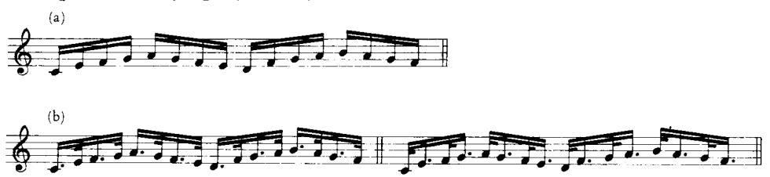

As learning process improves, fewer repetitions are necessary.

Since we talked about good and bad practice methods, why not mention the ideal one? If we know exactly what motion to learn, if we know how to execute it, and if we concentrate intensely on repeating the motion correctly and in exactly the same way for a sufficient number of times, we will engrave it in minimum time. To carry the analogy with the record further, the engraving will be ideal; there will be no conflict or divergence in the groove because there will be only one groove. The depth of the groove will become sufficient after a few practice sessions. For instance, if we practice a new passage twelve times at the first practice session, we may find that at the beginning of the second practice session it feels as if we had never seen it before. But after five or six repeats it will go as well as it did at the end of the twelve repetitions in the first practice session. The third session will require two or three repetitions, and most likely you will know the passage the fourth time you try it. But we want to accomplish more than just this! The number of repetitions applies only to the basic learning processes; additional repetitions should enable us to improve the passage interpretatively as well as technically. If the basic foundation is well established, continuous improvement will follow. This is the reason it is so very important to employ the correct motions with conscious attention.

Slow practice most helpful, but not the goal Slow practice is very helpful; it enables us to execute every aspect of the motion effortlessly and with absolute accuracy. However, a word of caution is necessary. We advocate slow practice because the mind requires sufficient time to make the mechanism execute and control the motions. When a passage is new and difficult, considerable time is needed for these processes. Sometimes we have to spend extra time on a group of notes, or even on a single note. Then again, the next note may be easily manageable, and consequently it requires much less time. Our aim is slow practice, not for its own sake, but for the sake of executing the required motions with sufficient control and awareness. Consequently, if a certain passage is well under control, easy to execute, and in no need of extra time, then we just move on.

We give the time necessary to any passage, or any note, that needs it. But we do not spend time playing it over and over in slow and even tempo, just because we began slowly; this activity would waste our time. We must make the seemingly contradictory statement that practicing should be as fast as possible; by this we mean that it should be as fast as possible while completely controlling the intended motions. The statement makes sense because our aim is to achieve awareness and control. With sufficient repetition we need less and less time to exercise this control, and thus we will be able to play faster and correctly all the time. The important thing is to avoid playing a passage any faster than we can control it. Being aware of the degree of control we have is really a matter of inner discipline—something we must work on all the time.

Uneven practice most economical

There is one last point to be made about slow practice. If we follow these suggestions and give the necessary time (no more and no less) to each note, we will find ourselves playing totally uneven metric values because the amount of time it takes to master each note or passage varies with its difficulty! This unevenness is quite different from mechanical practicing, in which the poor victim repeats everything with mechanical regularity. It is not that I advocate unevenness in performance, but if the needed time given to each note while learning a work results from the continuous watchfulness of the mind, it is a most welcome sign of intelligent practicing. Mechanical practicing can be compared to an assembly line where the speed is constant regardless of the tasks to be accomplished; too much time is allotted for simple operations, and not enough time is allotted for the complex ones. Conscious practice, on the other hand, provides all the time needed for complex situations and very little time for the simple ones. To develop this continuous control is really a matter of inner discipline that is well worth cultivating.

Role of the conscious mind

Much has been said about the importance and effectiveness of the conscious mind during the learning process; it is undeniable that conscious practicing has a considerable edge over mechanical practicing. Conscious practicing is analogous to a spotlight that focuses on a relatively small area and illuminates it thoroughly. It then proceeds to other problem areas and finally is able to integrate the examined areas. It can observe and resolve many things that the subconscious and automatic centers couldn't handle at all. However, we must realize that the conscious mind soon tires and concentration cannot be maintained for extended periods: for most people the limit is about twenty minutes. However, with a little rest it can recuperate and, with proper training, it can be strengthened considerably. Nevertheless, it seems

Conscious, subconscious, and automatic centers

Two-way traffic

Conscious mind acquires experiences; subconscious mind stores them.

Conscious mind is inhibitive, not creative.

that a short break after practicing twenty minutes is advisable; because we insist on conscious practicing, we should use the mind at its best.

If the conscious mind is like a spotlight, the subconscious is similar to a large dimly lit cave; the spotlight can enter it and pinpoint small spots, but it can never illuminate the entire area at once. It is in the subconscious mind that we store most of our experiences, and it is also the place where most of our memories are submerged. There is still another region where most of the vital bodily processes are controlled by the unconscious and automatic nerve centers; the conscious mind has hardly any control over these centers.

A primarily one-way connection exists between the conscious, subconscious, and unconscious minds. In due time conscious activities pass to the realm of the subconscious; many of them continue to the unconscious region. However this sequence can be reversed, for much traffic moves between the subconscious and conscious mind. Most of what we have learned and stored in the subconscious can be brought back to our awareness at will, and it seems that having been in storage didn't hurt it a bit! We may often be surprised how much better a piece feels, both musically and technically, after it has been "put away" for a long period. A well-learned piece may take very little time, or no time at all, to revive. Sometimes we can remember and replay it with every detail instantly recalled.

With its three layers (the conscious, subconscious, and unconscious levels) the human mind is eminently capable of coping with most human experiences; in any case, that's all we have. The role of these layers of the mind in learning, in storing the learned experience, and in recalling it corresponds to its role in music—practicing, memorizing, and performing a composition.

The unconscious mind stores and manipulates most of the innate and instinctive processes related to our vital functions, and it also stores the acquired skills that have become automatic; this level of the mind has little to do with the processes of learning and acquiring. It is the conscious mind that is responsible for selecting, analyzing, and finding the best ways to assimilate the material or skill to be acquired. The latter's role, therefore, is to make us aware of the material, to make us understand it, and to enable us to master it. In learning new music, the conscious mind converts the written image of the notes into its respective technical patterns and then finds the best ways to apply these technical formulas.

However, although the conscious mind can analyze problems, find solutions to these problems, and can help to acquire skills and put them to use, it cannot take part in creative processes. Its role is intellectual and inhibitive; it hinders all spontaneous, improvisatory, and instinctive processes. But at the same time as it prevents these processes it feeds the subconscious and automatic mind. Once a skill has been learned and assimilated, it inevitably sinks into the subconscious and unconscious levels. The conscious mind's valuable role is irreplaceable, for it continues to enrich and develop us during our entire lifetime; it is in charge of learning. On the other hand, the creative processes are the product of the subconscious and unconscious mind; they produce the spontaneous and involuntary activities. All that has been said about the vital role of the conscious mind refers to the learning processes: creativity is not a function of the conscious mind.

Conscious mind should not interfere with acquired skills.

The use of the conscious mind is limited to acquiring the skill of piano playing. The conscious process establishes the correct mental concept of the motions and controls the practice methods in which we apply and assimilate the motion patterns. After these motions are learned, we no longer need the supervision of the conscious mind; the skill of piano playing will have become "second nature," and from here on it belongs to the subconscious and unconscious layers of the mind. Once the skill becomes a habit, not only do we not need the control of the conscious mind, but we must discourage it, for it interferes with the natural flow of happenings. When we know a passage and can play it freely, we should not be concerned with the details of raising our wrist or elbow.

Practice technique only when correction is necessary. The critical mind is only helpful in establishing new habits and in eliminating bad ones; these activities belong to the conscious process of learning (or unlearning), but they are not part of the uninhibited, unconscious flow of automatic processes. Once our technique is ingrained and is automatic, it is in the domain of the subconscious and the unconscious—and that is where it should be. Once we possess a good technique, we use it; we don't have to practice it. Once you have learned to walk, to bicycle, to write, or to talk, you don't practice these automatic skills; instead you use them in the best possible way. Only if one of these skills fails will you use your conscious processes to correct it.

This is the sequence of events: once we have acquired skill in piano playing, the subconscious and unconscious mind provides us with an automated technique for performing familiar musical patterns and imbues them with spontaneous and creative improvisations. The role of the conscious mind is to help us acquire unfamiliar repertoire and technical know-how; it also enables us to recall, supervise, and improve old repertoire and technical formulas, all under the revealing "spotlight" of our awareness.

Practice is conscious; performance spontaneous.

No "etudes"; only essential exercises

There is truth in the old saving: when you practice alone, you should be as aware of every note and motion as if you were on the stage of Carnegie Hall, being watched by two thousand people. But when you actually perform there, you should play as if you were at home, alone. Practicing should be conscious, performing mostly spontaneous. In this chapter we have discussed the first half of this saving —that is, when you practice, you must be fully aware and conscious of everything you do so that you can conceive the correct motion patterns, ingrain them, and execute them perfectly. Mind you, this manner of working is much more strenuous mentally than mechanical practicing, but the results are achieved in an incomparably shorter time; furthermore the results of attentive practicing are reliable and permanent, and they eliminate any further need for practicing the already-acquired technique. When you have a good technique, your practice should then center on the application of this effortless, reliable, and automatic technique directly to the repertoire.

Now that we have thoroughly examined the "how" of practicing, the next question to consider is "what" to practice. Since I do not believe in mechanical practicing, I recommend eliminating most studies that feature technique and not music (Hanon, Pischna, Czerny). Exercises and technical studies that employ certain technical patterns repetitiously tend to lead us to mechanical practicing. It is much more productive to assimilate a technical formula in its purest form and, when it is learned correctly, to employ it at once in a musical composition by adapting it to the specific demands of the piece. The piano repertoire is so immense—there is so much to learn—that it is foolish to spend time with inferior music when the same technical development can be achieved by working on great music. Etudes by Chopin and Liszt are masterpieces of the first order and merit the most serious study; in previous chapters we supplied examples from great works of music in which the various motions should be applied. The literature is filled with technical formulas, and I urge that you apply what you have learned to real music rather than to "etudes" concocted by innumerable nameless composers.

Of course, I am not saying that we should avoid any technical practice and learn only pieces of music. On the contrary, it is imperative to learn first the technical formulas impeccably though the necessary exercises and only then proceed to their application in the repertory.

Motion patterns

Since most of you who are interested in these pianistic observations must have certain familiarity with piano playing, I would recommend, as a practical consideration, that you examine and assimilate the five motion patterns successively, and not all at once. Conscious practice and controlled application of these formulas require considerable mental strain. It is better to learn first the free fall motion alone, and look for repertory where it can be applied: you will find numerous opportunities to use it. Then, continue with the five-finger, scale and arpeggio motion, and proceed the same way. Here, of course, you will find an inexhaustible area to explore. Follow through then with rotation, staccato and the thrust. Obviously, this is not an overnight venture and it may take quite a few months' time. However, the time will be well spent and the results ought to be conclusive.

Mental practice

Now that we have established a clear concept of piano playing, and in particular of its five basic motion patterns, we can practice very successfully away from the piano. When the execution of these basic formulas is completely mastered, their application to the text will be direct, immediate, and unequivocal. If the music calls for rotary motion, we understand its technique and we are capable of doing it (it is not enough to know how to do something; one must be able to do it!). As we look at a musical passage we associate it with its technical solution, and thus we can go through the motion mentally; this whole sequence of events can become almost automatic. We can imagine the motion without actually performing it at the piano; you may be surprised to find that it is perfectly feasible to practice and learn a composition in this manner. Furthermore, when we practice mentally, we don't play wrong notes, we don't miss notes, we don't play mechanically, and we waste no time or energy. What we need is intense concentration—an activity that is strenuous but efficient and fast working. In mental practice the mind engraves these immediate, clear associations and processes (reading the score and associating the visual material with the motoric activities) with great ease, and the "replay" will occur without interference.

Mental practice can be developed to the highest degree. It is true that at first the strain is considerable, but it gradually decreases, and after a short while spectacular results can be achieved. We should not ignore the piano and rely purely on mental practice; but we will find that by combining mental practice and conventional practice, we can absorb and master repertoire much more securely in a much shorter time. The ideal way to practice is to combine the two approaches. When a pianist is on a concert tour, he will often have no access to a piano; mental practice can be a lifesaver. Obviously singers, violinists, and flutists are luckier than those of us who choose the piano, since they can carry their instruments with them; but some of the advantages of mental practicing apply to them too. The musicians who work with the most complex scores, the orchestra conductors, are obliged to rely exclusively on mental learning and practice—at least until they have

Conductors and mental practice

an orchestra at their command. It is most useful to be able to imagine the sound of music without the aid of an instrument, and it is enjoyable as well. One learns to read the score like a book! Since mechanical practicing is taboo (it is time consuming and it usually doesn't resolve technical problems), you should favor practicing consciously whether you are at the piano or away from it.

## 15 Memorization

Why memorize?

Since Liszt introduced the practice more than a century ago, it has become customary to perform from memory in public. Toscanini established the same standard for conductors. Most of us go along with this practice, but we must realize that the quality of a performance has nothing to do with the use of a score; it is possible that some of the very best recordings were made with a wide-open score and that some of the poorest concert performances were performed by memory.

There are many arguments both for and against performing without the music. Some say that by the time you know a piece really well, you have it memorized; others say that the absence of music puts more pressure and tension on the already quite tenuous existence of the artist. Chamber-music players practically always use music at public performances. Most of us soloists play by memory most of the time, but some of us do not. Mitropoulos conducted extremely complex contemporary scores, and he did not even use the score at rehearsals! As you can see, there is no uniformity on this subject. In any case, because it is possible to memorize practically anything and because almost everybody wants to, or must, perform by memory, the technique of memorization warrants consideration.

In essence memorization implies not only the ability to store music but also the ability to bring it back—to perform it. It is one thing to recognize a melody when one hears it and quite another thing to remember it or sing it. A much lesser degree of prior engraving of the music in the mind is sufficient for recognition than that required for active reproduction.

Technique of memorization

Memory is something we were born with, but, to develop it, a technique of memorization must be acquired; like conscious practicing, it can be developed to a remarkable degree. The mind can be trained and strengthened the same way that an athlete can develop his muscles. There are many ways to improve memory; according to some

Memorize only when properly prepared.

Too early memorization

Memorize while young.

No memory is infallible.

mnemotechnicians the most impressive memorization feats can be achieved by the average human being, if his training is right.

It is advisable to concentrate on memorization only when the material is ready to be stored—that is, when most of the technical and musical problems have been cleared. It is possible to modify passages once they have been memorized, but these alterations will conflict with the material already retained. For ideal memorization, we should repeat every note and every motion while practicing in exactly the same way. In this way we can ingrain the entire product unequivocally and uniquely; we would then come as close as possible to an infallible system of memorization, and there would be no conflict during replay. One should attempt to approximate this ideal situation, even if we know that this is hardly ever possible; in any case, the less conflict we create in the mind, the better we can memorize.

Some of us memorize so easily that we retain the material even during the first practice sessions, when the solutions of all the problems have not been achieved. The subsequent practice sessions are then spent on activities that may conflict with the original "storing"; because of these conflicts there may be difficulties during the replay. The concentrated and intentional memorization of the finished product is much more effective and faster in the long run than the instantaneous procedure of the overly fast memorizer. We should memorize music intentionally at the point when it is almost completely prepared.

There are two valid observations that can be made about memory. First, the earlier in life we learn something, the longer and more securely we retain it. Things that we have ingrained in our early child-hood are always going to be remembered. The same principle applies to music; we feel much more secure with music we memorized in our teens than with pieces that we memorized in our thirties or forties. However we cannot determine the exact age at which this or that will happen, and it is possible to learn something more thoroughly and more intelligently in middle age than in youth! We can compensate for age with improved learning techniques and purposefulness; in spite of this, it is of great advantage for a young artist to have a repertoire built at an early age and to store it for future use.

The other observation that we can make with certainty is that, unfortunately, no memory is infallible. You may know a piece forward and backward, you may be able to write every note of it, you may know its structure, you may have practiced it and performed it innumerable times; but there is always the possibility of a blank, of a wrong connection, a faulty association of sequences, and—you forget! In retrospect we often know the reasons. We may be able to cope with the

The four ingredients

Visual memory

Acoustic memory

Motoric memory

things that went wrong one by one, but not with all of them all at once and always. We cannot be absolutely perfect, like machines; and, as a matter of fact, even machines may go wrong!

While memorization is not infallible and, it must be admitted, is a rather mysterious process, we do know something about it, and we should be able to improve it considerably. Four ingredients share in the process of memorization, and although all of them may be equally important, their roles do vary in the individual musician. The four elements are: (1) visual memory; (2) acoustic or aural memory; (3) motoric or kinetic memory; and (4) intellectual or analytical memory. Everyone uses these four elements in memorizing, but most of us rely more on only two of them (for example, a combination of visual-motoric, aural-motoric, or aural-intellectual elements), while the other two elements are used somewhat less. Of course, this is a generalized observation, but it is one that is well documented.

People with visual memory retain primarily by sight. For instance, many of us remember the exact location of a passage in the text (upper left page, second line, small print), and we can memorize a whole page just by looking at it. In actuality many of the most spectacular memories are "photographic," or purely visual. Experiments have been made in which a seven-digit number is covered with the hand. The hand is then raised for a split second and immediately lowered, permitting the number to be seen for an instant. The picture of the number is engraved on the mind like a flash and it can be recalled instantly. This kind of memory can be trained and developed, and the number of digits can be considerably increased. Some conductors have prodigiously trained minds; they can remember entire pages of fully orchestrated scores purely by visual memory.

Acoustic memory is obviously very important for musicians. Many "popular" musicians learn and retain their music purely by ear; "serious" music can be learned in the same way, but only up to a certain point. Classical music can be so complex—with its voice crossings, complicated harmonies and rhythms, and the enormous structures of symphonies and sonatas—that we need the help of all four memory ingredients. Acoustic memory is quite valuable, and it can be greatly helped by ear training. Perfect pitch is very helpful, but it is not essential; good relative pitch is sometimes even better, especially when you are dealing with transposing instruments or when the general pitch of an instrument (or singer) you are working with is half a note off. A knowledge of harmony and theory helps us to recognize chords and structures, to organize them, and to retain them with greater ease.

Motoric memory is of utmost significance especially for instrumen-

talists. One may tend to disparage it and to consider it a mechanical activity, but it is more than that. It is the memorization of all the motions executed while making music. Remember, we started off learning them consciously with the intention of ingraining them. Only after thorough learning will they become automatic, after they have been stored quite securely. We find ourselves playing fluently, without hesitation, even without being aware of the notes that we are playing. Actually motoric memory may be reliable enough to carry us through intricate passages that we have not learned and memorized securely by means of the other three components of the process. Because the habits of the performing apparatus are well ingrained, they may pull us through the performance. This situation is not ideal, but it is better than stopping in the middle of a passage to think what comes next! However motoric memory is *not* reliable, and we must endeavor to reinforce it with the other three ingredients.

Intellectual memory

The role of *intellectual memory* is obvious. By analyzing and understanding form and harmonic structure, by organizing the material and determining where climaxes, low points, dynamic fluctuations, ornaments, pedal effects, and modulatory processes take place, we reinforce our memory and allow it to contribute its share to a flawless performance. There are often places in the music where we have to count measures, repetitions, and pauses; this is especially true when we play contemporary music or when we play with orchestras or ensembles. All these processes are intellectual activities and complement the other three factors effectively.

Reinforce all four memory components.

By understanding these four ingredients and by identifying the two that are our best skills, we will learn how to reinforce our memory. If you are an audio-motoric type of memorizer (a very common combination) and you repeatedly have many unexpected lapses that always occur in different places when you play from memory, it is very likely that the visual and intellectual aspects have not contributed enough support. The memory lapses occur because of the performer's failure to reread the music. It may only be necessary to read through the score carefully a few times in order to reinforce the visual component. It could also be possible that you have looked at the music but haven't reanalyzed it. In this case, your intellectual memory has weakened. Maybe you haven't practiced enough, and your motoric memory has suffered—there are any number of reasons for a memory lapse.

The solution to this problem is to reinforce all four components with all the conscious attention they require. Check the structure of the music carefully, listen to it with attention, employ and correct the technical patterns with care, and read through the music with intense

concentration. If these four essential memory ingredients receive enough attention, you will have done your best to consolidate your memory.

Memory slips: causes

One reason no memory is infallible is that we often encounter factors beyond our control. We may have practiced and mastered a piece, using the most apt technical solutions; we may have performed it faultlessly any number of times. Then we play the piece in public on another piano with an unexpectedly different action. The result is an immediate interference with our motoric and acoustic memory that affects the usual flow of motions. We may feel that we have to force the piano (which creates more tension in the muscles) or use smaller motions (which will inhibit us). A memory lapse does not mean that we do not know the piece well enough. Our timing and reflexes have been disturbed, and the flow of our feelings and our motoric memory is also upset. Sometimes the visual circumstances, such as the lighting of the hall and stage, are disturbing. At other times the acoustic conditions, or the temperature in the hall, or the noise of the audience shake us up. Innumerable details we cannot anticipate distract us, and sometimes we cannot cope with them. These things can affect our memory in a split second; sometimes our lapse is noticeable, and sometimes it is not. This is understandable, because a concert performance happens not only in space but in time. A performance must have a certain flow—a continuity and timing with no obstructions. As the composer writes down his music, he may stop for a second between notes or scribble as fast as he can; what counts is not the flow and regularity with which he writes but what he puts down on paper. In a performance it is not only the "what" and "how" that counts but the "when." You may know the music, you may know the next note, but not at this instant—sorry, too late!

Never mind; it can and does happen to everybody. This is the reason some of the finest artists (Myra Hess and Béla Bartók, for example) used music when they concertized. Nobody really objected to it. All performers can do is try their best: reinforce the memory with its four ingredients and use a consistently good and well-ingrained technique. Remember that playing the piece over and over probably will not help; try to find the weakest of the four ingredients, work on it, and then follow through with the others. Familiarize yourself with the conditions under which you will perform and try to avoid unforeseen happenings—rehearse at the hall!

Psychological factors

There are many factors besides physical and pianistic reasons that affect memory; emotional complexes, inhibitions, and stage fright are among them. It is beyond the scope of this book to examine these aspects in detail. Obviously our past experiences, the vast reservoir of

the subconscious, our drives, our urges, our conditioned reflexes, our frustrations and successes, and our anticipated failures and punishments all influence the flow of our actions. A human being is the sum total of present, past, and distant experiences: our childhood experiences, and even our prenatal and atavistic influences, have a profound effect on our lives. It is no wonder that our actions and reactions are not always predictable and seem to be quite often unexplainable. Still, with all of these unknown and intangible factors to contend with, we can, and must, lean on knowledge and experience that we can exploit. For this reason I have defined certain principles in memorization and their manner of application, calling attention to the vast resources we can mobilize if the stage is adequately set for them.

## 16 Musical Diction

Music evokes feelings; it does not communicate information.

The language of music differs from other languages; unlike verbal languages, it does not have precise means for dealing with facts, objects, and abstract concepts. We cannot say in music: "Today the temperature is eighty-two degrees, and the air is very humid." We cannot use it to communicate facts or convey ideas. What music can do is generate and communicate moods—the emotional responses that accompany facts and ideas. In a rather mysterious way music can represent and evoke emotions that correspond to circumstances, events, and actions that have not even taken place. A direct and immediate connection exists between certain combinations of sounds and certain feelings. When we hear Beethoven's "Moonlight Sonata" or Debussy's Clair de Lune we do not actually have to see the moon, but we can perhaps feel its presence and respond emotionally to the mood created by moonlight! We may feel elated at some parts of the Eroica Symphony and depressed by its "Funeral March" without knowing what actually "happened." Actually, nothing "happened." The authenticity of the plot that inspired Beethoven is of no importance. When Beethoven got disillusioned with Napoleon, who originally inspired him to write the Eroica Symphony, he simply substituted him with another, imagined hero, who remained nameless, but evoked the same heroic and dramatic moods. Music will circumvent events, communications and information, and will evoke emotional responses by direct aural contact, whether they are stimulating, soothing or depressing. Unquestionably sound alone can represent and affect the entire human emotional gamut.

Notation is rudimentary.

The scope of this book does not permit us to go into detail concerning the why and how of all this; however, consonances, dissonances, and harmonic overtones that blend or clash do have the role of creating tension and release. The subject of musical diction—the means by which music communicates—can be very controversial. Nonetheless

Pianists are less flexible than other instrumentalists.

Downbeats and upbeats; the mazurka

pretation. First, it is clear that musical notation is rudimentary: it is rigid and imperfect as to shadings, flexibilities and freedom of phrasing, rhythm, dynamics and pedaling.

Also, singers, string players, and wind players are much freer in

we can set certain norms about this important area concerning inter-

Also, singers, string players, and wind players are much freer in their interpretation of notes and especially in metric values than pianists. Their instruments are more expressive and sensitive than ours, and through bowing and breathing they can make much more use of slight delays, suspenses and accelerandos. Keyboard musicians deal with mechanically regulated pitches; they tend to articulate evenly, instantly, and precisely; unfortunately their diction also tends to be monotonous, square, and lifeless. However, pianists should not merely rattle off the notes; they should be as flexible on their instruments as those who achieve subtlety with breathing or bowing—in other words, they should be musicians. They too can find the meaningful notes in the score and emphasize them; their use of emphasis determines whether their musical diction is convincing and beautiful or dull and artificial.

Most music is divided into bars, and within the bars the notes are grouped into cyclic patterns of heavy and light beats. No matter how many beats there are in a bar (and some pieces have continually changing numbers of beats in the bar, while other pieces have no barlines at all), certain notes need emphasis. The obvious note of emphasis in each measure is the downbeat, the first beat of the bar. In a four-beat measure the third beat is the second-heaviest one, while the second and fourth beats are lighter. In a three-beat measure the downbeat is the emphasized note, and the second and third beats vary in intensity. When measures are syncopated, the upbeats are emphasized. In mazurkas, for example, the emphasis may be on any beat of the bar; the melody may have its own accent on the first and third beats, and the accompaniment may have several voices, each with its own accents. (Contrary to popular belief the mazurka does not always have an accent on the second beat; although the second beat is often important, there is no hard-and-fast rule for its accentuation, and many mazurkas don't even have a note on the second beat!) No matter how many beats there are in a measure, other notes besides the downbeat may be important for melodic, harmonic, coloristic, or rhythmic reasons; and any of them may have free rubatos too! As a matter of fact, in the mazurka the metric length of some notes must vary too, not only their volume.

Certain types of notes by their nature should be very lightly played. They include passing notes, some grace notes, notes that fill

Means of emphasis

in an interval, and ornamental notes. Emphasis can be given to a note by an added length of time we hold it; accented notes are likely to be slightly longer than unaccented ones.

It is impossible to list the innumerable species of notes; all I wish to say is that in music some notes are more important than others. Our musical diction will not be right unless we register these differences in our performances. Some performers can emphasize instinctively; others proceed in a more deliberate fashion. The way that we emphasize is also an individual matter; we may call attention to a note by playing it louder or softer or by slightly prolonging it or delaying it. We can make it stand out by applying a different touch—staccato, legato, portato, or tenuto. Besides the addition of ornaments (which was general practice during the Baroque period) or an octave or two (upper or lower), one may add other harmonics also or shift register. The score also includes marcatos, sforzatos, subito pianos, etc. Besides these, our musical sensitivity and spontaneous reactions will find their way to give subtle meaning to certain notes.

Because the piano, unlike the organ and the harpsichord, responds to "touch" we need not depend on extreme agogy or rhythmic freedom the way harpsichord players often do. On the other hand, our rhythm should be flexible and free; we should not be slaves to the notated rhythmic values. Some music is meant to be motoric (for example, certain toccatas and etudes), but in general one never should play with inflexible evenness.

The most important factor in musical diction on the piano is the nature of the sound of the piano itself. After the hammer has struck the strings, the intensity of the sound immediately diminishes whether we played loudly or softly. If we want to connect the second note of the bar to the downbeat that preceded it, we must realize that this second note is an upbeat—that is, it occurs in a weaker part of the bar than the note on the downbeat. Therefore the second note should have less volume than the downbeat. Also, because of the decrease in intensity of the piano sound, this lesser volume note must be geared to the volume the first note has at the moment when the second note is about to sound. This means we must use still less volume when connecting upbeats on the piano than on other instruments with better sustaining powers.

If we play upbeats with the same intensity as downbeats, we appear to be accenting the weak part of the bar; melodies played this way sound syncopated. If we ignore this fact, at best we project a series of clearly articulated sounds, not a melody; at worst we have a series of unrelated, poorly articulated notes. Since each note on the piano decays rapidly, upbeat notes can be connected satisfactorily

Flexibility

Maintaining the same dynamic level for an entire group of notes only if the dynamic level of the attack of subsequent notes is lower than the dynamic level of the previous note was at its inception. Equal emphasis on the second (lighter) beat produces a crescendo, if the next downbeat is played louder than the first one was. A decrescendo on the piano is easier to produce: the next downbeat will have to be softer than the previous one was. These slight alterations in dynamic level can ensure continuity in the melodic line:

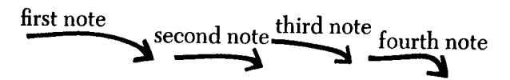

Figure 56. Dynamic manipulation of a melody

You will notice that the third note starts on a higher dynamic level than the end of the second note. The flow of the melody is not obstructed by this change because the third note is the next-heaviest beat after the downbeat, and it lends itself to more emphasis than the second or fourth beat of the measure.

This formula is rather primitive, but it works. If we want to give the impression of playing four notes on the same dynamic level, we have to play the second and fourth notes softer than the first note, and the third note nearly as loud as the first. In other words, the downbeat usually dominates the measure, both harmonically and melodically. Because the downbeat receives more emphasis, it unifies the whole measure. We only play the upbeats as loud as the heavy parts of the bar if we intend to give the impression of a crescendo; in this case the next downbeat is actually played louder than the preceding one.

The next formula for achieving continuity with dynamics is simple indeed; if a melody starts on an upbeat, or if a note that preceded it is a long note, its dynamic level must be much lower than the downbeat's. There is an inherent, slight crescendo in such passages that start in an upbeat and lead to a downbeat.

Crescendo

Upbeats are lighter than downbeats.

Example 125. Bach, Well-Tempered Clavier, book 2, Prelude No. 8 in E Flat Minor

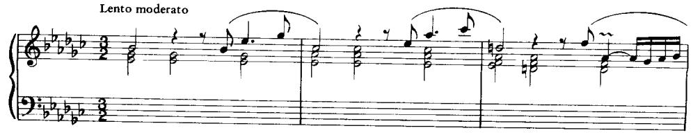

### (Example 125 continued)

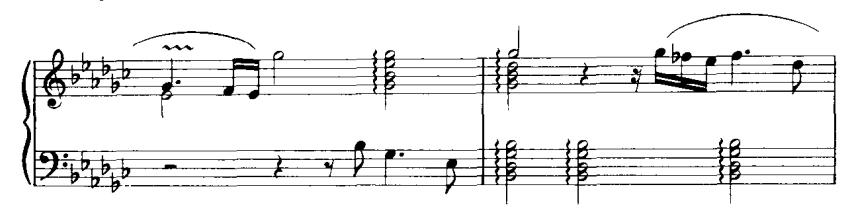

"Negative accents"

Such crescendos are often marked by the composer, but sometimes they are not. Occasionally we find a certain indication quite characteristic of Beethoven—an upbeat crescendo ending with an unexpected piano on the downbeat. Here the emphasis to the featured note is given by a "negative accent": it is quite legitimate, since the "subito piano" calls attention to the note.

Example 126. Beethoven, Sonata, opus 31 no. 2, second movement

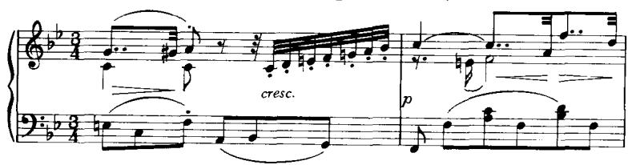

Positive (convex) and negative (concave) climaxes

The device of calling attention to a note by using less rather than more volume is justified, especially in gentle, lyrical passages; it is just as convincing as the conventional loud accent. In a more aggressive, virile kind of music, however, melodic and harmonic climaxes are better served by a positive accent. Obviously there are many ways to call attention to meaningful moments in music, and personality and temperament are the qualities that determine our means of expression. Actually, the highlights and climaxes of certain melodies can be emphasized in totally opposite ways. The plasticity in a bas-relief is such that the features of a face in it can be prominent in both a convex and concave manner; what matters is that the extreme features are emphasized. It seems to be an oversimplification to say that the positive emphasis (convex) is masculine, while the negative emphasis (concave), with a decrescendo toward the climax, is feminine. In today's "unisex" and "chauvinistic-versus-liberated" societies such a statement may seem provocative. Nevertheless this diagnosis of masculinefeminine approaches toward a musical climax is not totally out of place! In any case, what matters in music is the sum total of tension and release; everyone is entitled to a personal interpretation as long

as it is sound and convincing and based on sufficient knowledge and good taste.

Ornamental passages: less volume

We often find ornamental passages—turns, trills, grace notes, and so on—within a melody; many of them appear in small print. It is quite safe to play these notes with less volume than the main notes whether or not they appear in small print.

Example 127. Chopin, Concerto No. 2, opus 21, second movement

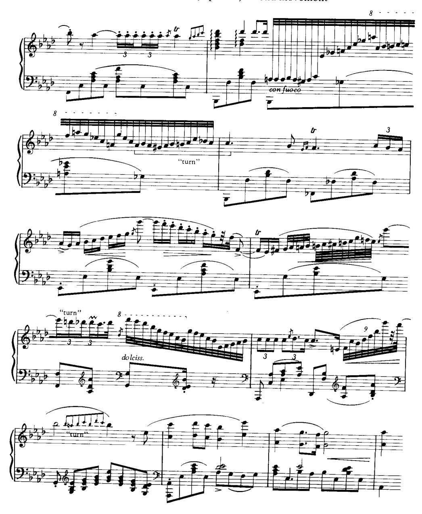

**Fiorituras** 

The role of these notes is to connect and feature the main notes, to prolong their sound, and to delay their entrance slightly; in this way they call attention to the main note. Since they are not organic to the melodies, they should be played unobtrusively, gently, and flexibly, and their dynamic level should always be somewhat lower than that of the main notes. We find many of these embellishments not only in Baroque but also in Classical and Romantic music. Actually, some of the most beautiful melodies of Chopin are essentially elaborate fiorituras (or embellishments); by expanding them and filling them with chromatic and transient notes of all kinds, Chopin managed to write sublime music. Obviously these "emancipated" embellishments that have been transformed into such expressive melodies must be treated more emphatically than simple ornamental notes. However, many of them are subject to the same interpretative principles we have mentioned.

The physical means for holding these melodies together is the legato technique, which was described in chapter five.

Appoggiaturas are essentially dissonances that resolve on the following note. They always should be emphasized because of their harmonic function. Appoggiaturas must always receive a positive accent, never a negative one; accentuate the first note and play the resolution with less volume.

Appoggiaturas

Example 128. Mozart, Sonata in A Minor, K. 310, second movement

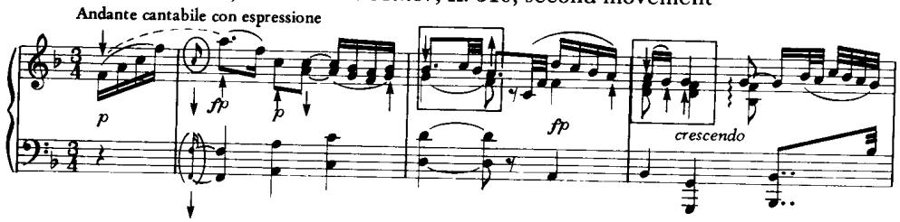

Example 129. Beethoven, Sonata, opus 2 no. 1, second movement

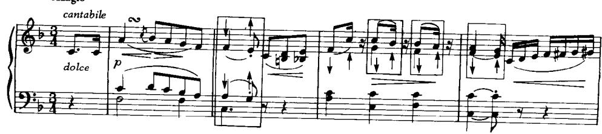

There are few exceptions to this rule, and sometimes a crescendo is marked after an appoggiatura or dissonance; usually this dynamic is indicated in the text.

Example 130. Beethoven, Sonata, opus 10 no. 2, second movement

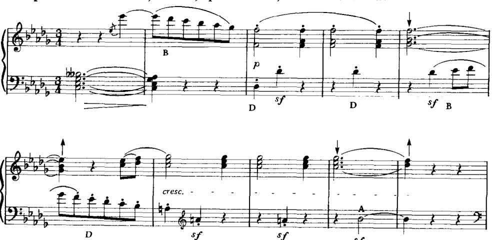

Example 131. Beethoven, Sonata, opus 81a, first movement

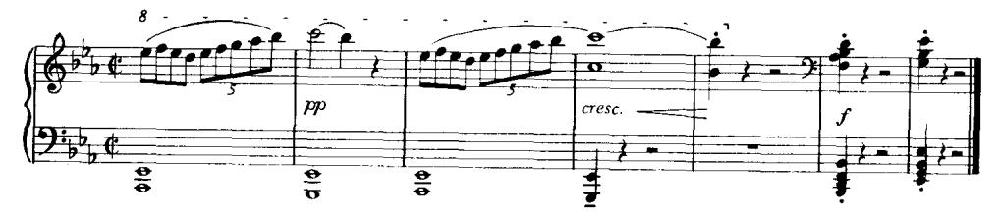

Consonant grace note never to be emphasized; main note receives its full value. A widespread, glaring, and most unmusical mistake is often encountered in the execution of consonant grace notes. It is common knowledge that grace notes are to be played on the downbeat simultaneously with the bass. However this doesn't mean that they should be accentuated and featured. Their role is to call attention to the following note by slightly delaying its appearance and, of course, it is the main note—never the grace note—that is emphasized. As a matter of fact, the grace note must be played considerably softer than the main note, and, even more important, the main note must be held for its full metric duration. We must never deduct the metric value of the grace note from that of the main note and shorten it; instead we should add the value of the grace note to the value of the beat. The fact that it extends the metric value of the bass is no cause for alarm; this effect may be exactly what the composer intended and the reason he uses

the grace note. One should not be a slave to "counting" at the expense of musical content; instead one should base one's rubatos and agogic accents on the live pulsation of the music, especially in slower music. When string players and singers interpret meaningful passages, they are usually flexible and free of metronomic rigidity that affects pianists. Only an unmusical violinist would arpeggiate the opening of Beethoven's "Kreutzer" Sonata in such a way that the top A loses some of its value:

Example 132. Beethoven, Sonata for Piano and Violin, opus 47 ("Kreutzer"), first movement

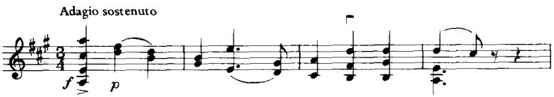

Yet when pianists encounter the same problem, as we do in the third movement of Beethoven's *Sonata*, opus 109, we seldom hear the correct solution. Example 133a shows the opening of a slow, expressive phrase as it was notated by Beethoven. Some pianists interpret this measure as indicated in example 133c, and the least musical perform it as it appears in example 133d. The correct way to play it is shown in example 133b; the high B receives its full value as a half note.

Example 133. Beethoven, Sonata, opus 109, third movement

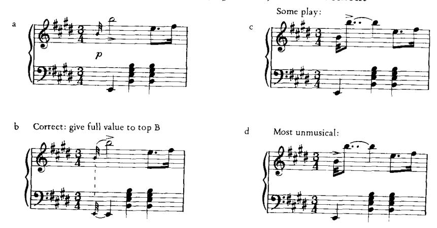

This musical anomaly stems from the valid rule that grace notes are to be played on the beat and not before it so that the value of the note that precedes the grace note is not shortened. But it is also necessary that the grace note not disturb the melodic flow, and the main note should certainly not be cheated of its full metric value, especially since it is considered important enough to merit the adding of an ornamental tone. The solution is to play a soft, unobtrusive grace note on the beat and a main note with its metric value *intact*. A slight flexible extension of the entire beat will sound fine.

Dissonant grace notes

Dissonant grace notes, the most common of which are appoggiaturas, are played on the beat; they should be emphasized, they add spice to music, but the degree to which they are emphasized is subject to the discretion of the performer.

Example 134. Mozart, Sonata in A Minor, K. 310, first movement Allegro maestoso

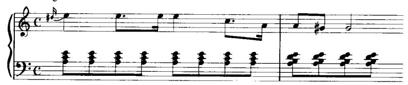

Two types of grace notes

A distinction must be made between the two types of grace notes—the ones that pertain to the beat and the ones that connect two notes. A grace note that belongs to a beat is usually characterized by a slur tying it to the next note; a grace note that connects two notes is printed between them, usually without a slur and sometimes before the barline. While the former is played on the beat, the latter is played between the beats. The notation of the first type of grace note varies

Example 135. Prokofieff, Sonata No. 4, first movement

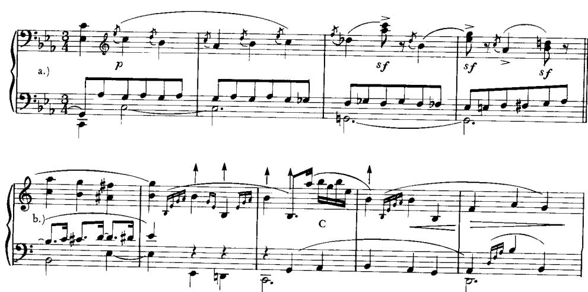

greatly; in Baroque and Classical music some of these notes are slashed to indicate that they are short, while those without a slash are held to their full printed value—sometimes even longer. This notation is not consistent, however, and the performance of these notes is open to debate. Some grace notes without a slash are abbreviated, while other slashed grace notes (especially appoggiaturas) are given their full value, or even double their value. In the Baroque period connecting grace notes are often marked by a thin diagonal line indicating a glissando-like connection.

Example 136. Different types of grace notes

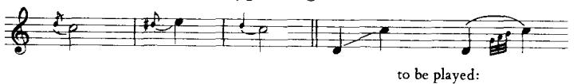

Ritardando and accelerando

Composers most frequently use the terms ritardando and accelerando to introduce rhythmic flexibility into their music. As in all interpretive matters, the manner in which these tempo changes are applied determines their artistic validity. The word ritardando (ritenente or ritenuto) implies a slowing down. But with all such directions, the problem is how much, when, and at what rate? When there is a series of ritardandos in the course of a phrase, they should not be treated in the same way: the ones that occur in the middle of the phrase should be less pronounced than those at the end of the phrase.

Structural considerations should guide us. An indication can be interpreted in many different ways, and we possess much leeway in the evaluation of the text.

One actor may say the same words as another, but he will bring out their meaning in his own way. His diction is different. The volume of his voice, his pauses, and his use of emphasis all differ from those of the other actor. As different as these two actors may be, if they are good actors, they have one thing in common: they do not recite the text mechanically or in a clearly enunciated but noncommittal way. Instead they emphasize the meaningful portions of the text positively or negatively and play down the unimportant ones.

It is frustrating to listen to an articulate, note-perfect performance that lacks flexibility and imagination. The essentials are not emphasized, the right mood is not created, and the entire performance amounts to little more than a succession of pleasant sounds. A flexible, imaginative performance requires a minute but continuous modification of the metric values printed in the music; it includes color grada-

Even articulation vs. expressiveness

The intangibles

Tension and release: the role

of dissonance

tion and variety in the use of dynamics, pedaling, and rubato, elements that are indicated in the score only rudimentarily.

Musical diction involves the many tangibles and intangibles that allow us to fashion our own mode of musical speech. We must learn to call attention to the heavy beats and to treat nonharmonic tones effectively. All altered chords, like the Neapolitan-sixth, the diminished, and augmented chords must be recognized and treated according to the tension they represent. Notes that have auxiliary roles should be played unobtrusively. These notes of lesser importance include consonant grace notes, upbeat figures, passages that start as upbeats, the short notes in dotted figures, notes printed in small type, and connecting notes, resolutions of dissonances, accompaniment figures in general, and arpeggio figures that lead to a principal note.

Music can produce powerful effects on us; it can make us feel extremely stimulated or extremely depressed. These effects are brought about by the alternation of tension and release of tension, and those states are created by dissonances and consonances, fast and slow tempos, loud and soft dynamics, accelerandos and ritardandos, crescendos and diminuendos, counterpoint and homophony, rhythmic irregularities and regularities, and asymmetry and symmetry. The fact that a minor chord depresses us, while a major chord does not, is not a matter of upbringing or tradition but is based on an unalterable physical condition: some harmonics in the overtone series of the minor chord clash, while those of the major chord do not. This clash causes tensions, a slight discomfort in the hearing apparatus, and a depressing effect on the human organism. Since major chords correspond to actual overtones of the fundamental note, no such conflict is present, and their effect is restful, even stimulating.

Tension corresponds to dissonance, but dissonance is a relative matter; when a strongly dissonant chord is followed by a relatively less dissonant chord, it provides relief. In contemporary music a minor chord is certainly not considered a dissonance. However, in the Baroque period the minor chord was a dissonance, and very few works in this period end on a minor chord: it fails to provide a total release of tensions the way the major chord does. In earlier periods not even a major third was restful enough to resolve conflicts. Pure fifths were used at cadences, and in even earlier times pieces were required to end on an octave or a unison. Over the centuries we have become used to the higher tones in the overtone series, and today we tolerate, and even enjoy, a wide variety of dissonances—even those that remain unresolved.

In the nineteenth century it was considered most daring for Cho-

pin to end a prelude with a cadence in which the seventh of the chord was allowed to linger on:

Example 137. Chopin, Prelude No. 23 in F Major, opus 28

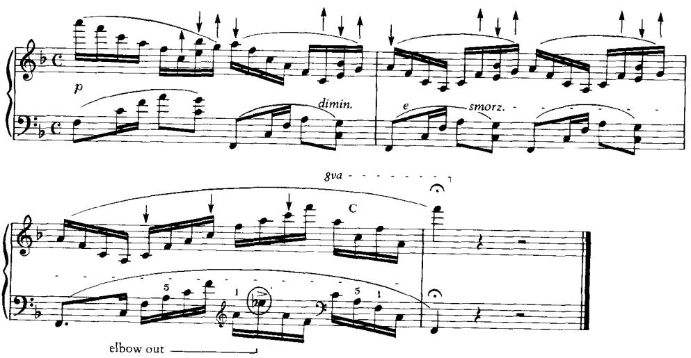

Today we fully accept the use of any of the twelve notes of the chromatic scale with the tonic, as this composition by Bartók illustrates:

Example 138. Bartok, Sonata (1926), first movement

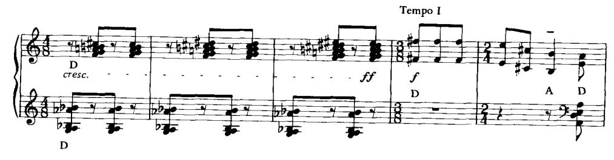

The art of piano playing

Present-day listeners respond to the same stimuli as did musicians of past eras. Musical tension and release still result from the clash and resolution of overtones, and the more our musical diction reflects an awareness of these elements, the more convincingly will we communicate our musical impulses. It is up to our sensibility to respond to the limitless shadings inherent in the score. The art of piano playing really begins at the point when we can translate the score into the motion patterns necessary for the communication of the subtlest musical impulses.

Orchestrate the piano!

The piano is comparable to the orchestra in its wealth and variety of sound. The color potential of the piano often tempts us to "orchestrate" many of the compositions we play. The piano works, the string quartets and symphonies of Beethoven or the ones of Brahms share many common features beyond the obvious horn and woodwind effects and timpani rolls. The coloring effects we can evoke from the piano make it very tempting to think of "orchestration." The orchestral effects of Liszt's piano music come instantly to mind. Try to think of the bassoon or the viola—or the organ, harpsichord, or snare drum. Think of anything besides the piano! You have already mastered the technique of piano playing; now try to enrich your sound by imitating the voice or the sound of other instruments.

The human voice

The human voice is surely the most expressive instrument of all; to say that a pianist "sings" as he plays is the supreme compliment. We can and should sing, and we can acquire the expressiveness and flexibility of the human voice: we should not hesitate to prolong or shorten a note when its meaning calls for it and breathe like singers do. We can learn much from listening to and watching good singers, who breathe, phrase, and shape music with more freedom and spontaneity than can any instrumentalist.

Problems of the singer

However. I wouldn't go so far as to sav that the only source of music is the human voice. Admirable a musical instrument as it is, we must realize that, in a way, it is tremendously limited. Not only is its range limited, its dynamics too; also, it is a purely homophonic instrument. But, besides these limitations, its great weakness is that the singer can produce a sound only when he exhales. When he runs out of air he must inhale in order to fill his lungs so that he can sing again: singing is a "one-way" activity! While he is inhaling, everything must stop. He must inhale extremely rapidly and make every effort to exhale the air as slowly as possible so that he can use it for as many notes as possible. If the musical phrase ends where his breath ends, all is well! But, if not, all kinds of efforts are needed to cover up this sudden inhaling. His natural inclination would be to start singing high and loud and then to descend both in pitch and in volume; incidentally most ancient folk music does exactly this. Ascending melodies and extended crescendos are against the nature of the human voice. Obviously a singer must acquire superb breath control in order to surmount these basic difficulties inherent to singing. A fine singer is able to control ascending lines and crescendos, with their extended rise in tension. But he must always fight the limitation of his own lung capacity: he must breathe!

Breathing and singing

I mention this, not because I lack affection and respect for singers, but to call attention to a fundamental quality in music. Besides sound,

music expresses and consists of motion above all else. I say "above all else" because sound itself is nothing other than the product of motion. As mentioned at the beginning of this book, music is motion within fluctuations of pitch, volume and timbre. It is best served by instruments that function in a continuous manner and can produce extended tensions both in crescendos and diminuendos without the need to gasp for breath. It is breathing rather than singing that represents the kinetic quality in music. The string player also can carry on a melody indefinitely with the up-and-down movements of his bow. Although a slight break must occur when the bow changes direction, this can be covered up and is negligible and inconspicuous compared to the gasp for breath of the singer. When he runs out of air he has to camouflage his need to breathe to convince us that his long phrase has not been interrupted by the well-covered gasp. If we think of the extended passages that lead to some of the irresistible climaxes of the orchestral and piano literature—passages during which we hold our breath and gasp for air—we realize just how difficult it is for the singer to maintain musical momentum and the long line of the melody while exhaling. It is, indeed, contrary to the upward sweep of such music to equate it with exhaling. How I would cherish a singer who is capable of inhaling and exhaling incessantly while he sings.

Singing tone at any cost?

Music represents a series of motions and changes that results in widely varying sounds. It is true that many of these sounds are best expressed by the human voice, but others are not. While it is desirable to equate some of our music with singing, we shouldn't think in these terms exclusively. Music is more than just a combination of lovely sounds. It must express the entire human emotional gamut, from the sublime to the vicious and from the serene to the hysterical, if necessary. We need not sugarcoat everything with a "lovely singing quality": often a certain passage should be hummed, whispered, or even shouted out. The insistence of cultivating a sensuous and warm singing tone for all music brings to mind the woman who was hired as an announcer for one of our radio stations because of her deepthroated sexy voice—and who ended up being a weather forecaster and a stockmarket announcer, bless her soul.

## Elements of musical diction

- 1. Downbeats
- 2. Upbeats
- 3. Melodic high and low points (to be emphasized either positively or negatively)
- 4. Harmonic tensions and releases (dissonances and consonances)
- 5. Rhythmic patterns (long and short)

- 6. Passing notes
- 7. Filling notes
- 8. Grace notes (consonant, dissonant, on the beat, transient, no emphasis)
- 9. Ornaments (mordents, trills, and turns; these may start on the main note, the upper note, or the lower note)
- 10. Ornamented passages (amplified turns, etc.)
- 11. Anticipatory arpeggios
- 12. Decreasing intensity of piano sound (tying melodies)
- 13. Upbeat passages leading to downbeats (inherent crescendo, subito piano after crescendo)
- 14. Endings of phrases, groups of notes
- 15. Ritardandos and accelerandos
- 16. Rubato and agogy
- 17. Suspense, delay
- 18. Accents (> A; two kinds of sforzatos and fp)
- 19. Precipitation toward accents
- 20. Fermatas and series of fermatas
- 21. Appoggiaturas
- 22. Adding grace note values to beats
- 23. Small print (transient, ornamental notes, fiorituras)
- 24. Accompanying figures

Most of these elements have been discussed in this chapter and, of course, many other ingredients in music can be interpreted at the performer's discretion. Some of the items on this list need further explanation.

explanation.

Harmonic Tensions and Releases. In general, the further harmonies wander away from the tonic, the more tension they create, especially when they contain altered notes. Altered notes tend to strain the tonal frame and anticipate or cause a change of key; for example, the

cially when they contain altered notes. Altered notes tend to strain the tonal frame and anticipate or cause a change of key; for example, the secondary dominant in any key creates more tension than the dominant. Any diminished-seventh chord of a major scale contains notes that don't belong to the diatonic scale: this means tension! The Neapolitan-sixth chord's altered notes cause a jolting, dramatic effect. The direction of alteration causes uplifting or depressing effects (sharps uplift; flats depress) not only in the notes, but in our spirit too. This statement sounds superficial, but it is true. All over the world humans respond in a similar way to constellations of sounds. Notes altered by a flat within the key, minor chords, and diminished chords have a depressing effect. Sharps have the opposite effect; change a minor chord to a major chord, and you'll see what I mean. Augmented chords have a disconcerting effect; they create suspense, uncertainty, and

Harmonic tensions and releases Ornaments

Rubato and agogic effects

Accents

considerable tension and vagueness because of lack of tonal direction. In the symbolic language of music our emotions are affected by the physiological stimuli caused by the ups and downs (the sharps and flats) of the text; it is as simple as that. Obviously other factors like tempo, loudness, pulsation, intensity, and timbre, etc., influence us too, but none influence us more than these intervallic factors.

Ornaments. The role of an ornament is to call attention to a note. Ornaments are used mainly by instruments that do not have the capacity to emphasize a single note by dynamics or timbre and therefore must synchronize dissonant notes with the main note. The harpsichord and the organ are examples of this type of instrument, but the clavichord and the piano are not. Therefore other criteria are to be used for ornaments on the latter instruments. There is a school of thought—and a very valid one—according to which most ornaments should be dispensed with on the clavichord and the piano. Incidentally the often-debated question of where to start the trill (on the upper or main note) is totally inconsequential when it is applied to the piano. On the harpsichord and organ it is obvious that ornaments start on the upper note because the main note, being part of the harmony of the bass, could not be emphasized and would be inaudible.

Rubato and Agogic Effects. Rubato and agogic effects are essentially free, imaginative alterations of metric values that create flexible enunciation and parlando effects. They are necessary and justified in practically any style of music, with the exception of an intentionally motoric composition; however they must be made in good taste, and the style of the music must be taken into consideration in deciding the amount of rubato to use. One of the ultimate tests of an artistic interpretation is the skillful use of rubatos.

Accents. The intensity of accents is indicated by the design of the wedge: a wedge that points upward is usually stronger than one that is horizontal. The "extended" wedge, a wedge that applies to a group of several notes, was occasionally used by Liszt.

Example 139. Accent markings > A

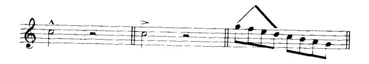

The sforzato (sf) can be interpreted in two different ways. In fast dynamic pieces the sforzato ordinarily calls for a sudden accent that

may be either witty or violent, depending on the text. However it must always be executed in accord with the actual dynamic level: it is poor taste to play a fortissimo sforzato in a mezzo forte or piano passage. These loud accents in relatively quiet passages are heard all too often, and they leave a spastic, even hysterical, impression. The other kind of sforzato, which is usually found in melodious slow passages, is not so much a quantitative accent as an espressivo emphasis. It should so und somewhat louder than the other notes, but the effect should be more intense than loud. Think of this sforzato as an espressivo sign rather than as an accent. Both sforzatos use the same sign (sf); we must use our own judgment in interpreting them according to their contents.

Crescendo sounds like accelerando.

Precipitation Toward Accents. It is an acoustical phenomenon that a sudden, steep crescendo played in a steady tempo gives the impression of a precipitated accelerando. The accumulation of steadily increasing, crowding sonorities seems to have an extra dynamic effect. We must avoid making an accelerando, because it actually weakens the climax of the crescendo by causing the passage to sound hurried and overrushed. It is necessary to keep the crescendo steady and not accelerate the tempo.

**Fermatas** 

Fermatas. The official value of the fermata is approximately one and a half times that of the written note. Its correct length depends on its location in the phrase—whether it occurs in the middle of a phrase, at the end of a phrase, or at the end of a section. The coda of the first movement of Beethoven's "Waldstein" Sonata provides an interesting example of fermatas in series: the three fermatas have different roles, and obviously the last one should be the longest.

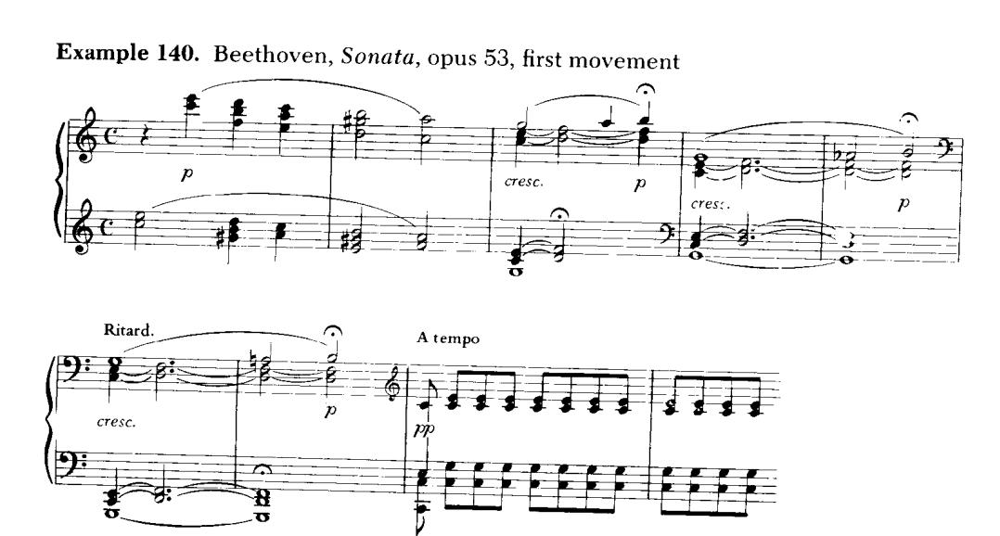

We find a very long fermata at the end of the recitative in Chopin's Fantasy:

Example 141. Chopin, Fantasy, opus 49

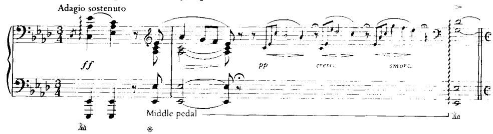

There are innumerable passages in which a prolonged pause is desirable, and they are not always marked in the score. Such halts and hesitations are meaningful in our musical diction; they should be used like well-timed pauses in a speech, but, of course, they should not be overdone.

Phrasing signs, and slurs in particular, were inherited from string music. Slurs were originally used as bowing signs for the purpose of indicating those notes that should be played in one bow. In string scores, when slurs appear in an extended melody, they should be regarded purely as a prescription for bowing and not as an indication that the musical phrase is to be segmented. The bowing often indicates the number of notes grouped together, but not necessarily separated groups. A great many pianists, however, seem to be obsessed with observing the end of slurs with breathless, hiccup-like separations, even within the musical phrases.

Slurs were adapted for use in keyboard music, indicating technical rather than musical groupings. Some pianists mistakenly regard the slur not so much as a connecting sign between notes but as an indication to separate one group from the next. This notion is totally absurd in most cases: string players strive for the completely opposite effect; they try their utmost to make their bow changes unnoticeable in order to avoid disrupting the musical phrasing. Instead of calling attention to the end of a technical slur, pianists should also try to connect it with the rest of the melody. Unless the end of the slur comes at the end of the musical phrase, we should regard the slur exclusively as a connecting sign and not as a separating device. In examples 142 and 143 the dotted slurs show the musical phrasing.

Slurs

Slurs indicate connection, not separation, except at the ends of phrases.

Example 142. Haydn, Sonata in E Minor, second movement

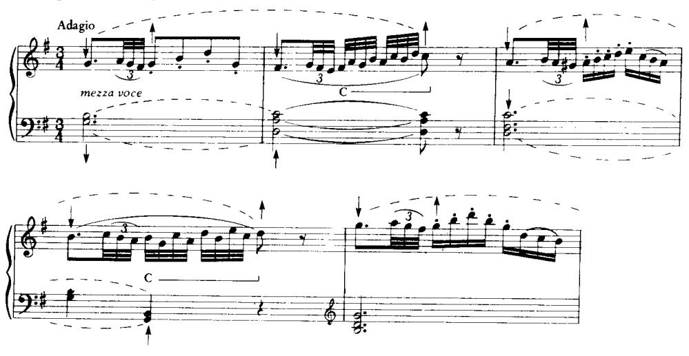

Example 143. Beethoven, Sonata, opus 31 no. 2, second movement

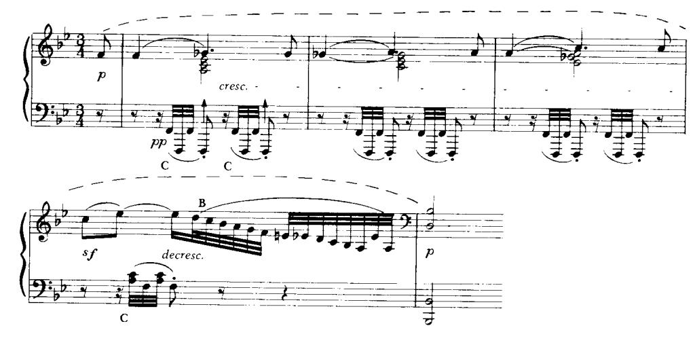

Remember that the real musical phrasing signs are often not notated, especially when they extend over the full length of the line.

National characteristics: French vs. Hungarian Music is not a language in the sense that French, Spanish, or English is; it deals with sounds that represent, stimulate, and are generated by universal human emotions. Nonetheless certain characteristics of musical diction can be related to the performer's national background. Let us take two extremes. The French language and the Hun-

garian language, for instance, have very different kinds of inflection. French sounds as if almost every word had an upward inflection; the end of the word ascends both in pitch and in emphasis. On the other hand, Hungarian characteristically emphasizes the first syllable of a word; you can hear a descent toward the end of every word, as if it were actually marked decrescendo! If we consider two important aspects of musical diction, strong downbeats and light downbeats, we can easily see how these tendencies manifest themselves in music. I don't mean that every Hungarian emphasizes the downbeat more strongly than every Frenchman, but I would be somewhat surprised to hear a Magyar emphasize an upbeat, and I would expect more upbeat emphasis from a Frenchman.

A national rhythmic formula

An example of this phenomenon can be seen in a very characteristic Hungarian rhythmic formula. You will find many examples of it in Liszt's Hungarian rhapsodies, in the music of Bartók and Kodály, and in some of the Hungarian inspirations of Brahms and Sarasate; it also occurs in Polish music. This is the formula:

sponds to Hungarian enunciation, with its short, strong accent on the first note and its altered metric value. The first note is actually played shorter than the written text indicates. This rhythmic alteration is valid in many cases; for example, it can be applied to passages like this:

Example 144. Bartok, Piano Concerto No. 3, third movement

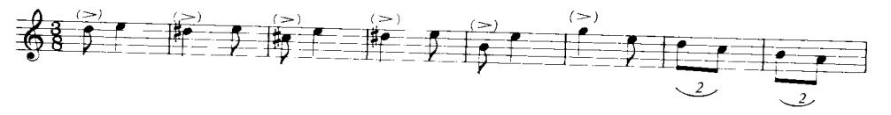

Although Bartók wrote strict eighth notes and quarter notes in 3/8 measures, the eighth notes in these measures should be slightly shortened when they are downbeats. (But beware! When the quarter notes are on the downbeat, they will be slightly lengthened.) Accents should be applied to all downbeats whether they are eighths or quarters, but we should see to it that all downbeats are altered metrically as I have described.

Individual contributions

Even though the differences among most languages are not as striking as those between Hungarian and French, languages do have varying rules on accentuation. Certain nationalistic traits can add flavor to an individual's musical diction; sometimes the effect can be most welcome. However, although regional contributions can enhance a performance, it is the feelings and thoughts of the individual, as they

Musical Diction 219

are expressed in his inflection, that are most valuable; of course it is important that they be tasteful and serve the music loyally. Although music is a universal language, there is obviously room for collective and individual influences and for all temperaments and tastes. The most intriguing and beautiful musical diction is still that of the gifted individual of any nationality.

## 17 Public Performance

Performing is the ultimate issue.

Performing teachers are more effective.

Learn from performances, live and canned.

The expected and the unexpected conditions at live concerts

The stage affects almost everyone.

Since music is a performing art, our ultimate goal is to present definitive renditions of the compositions we play—renditions that convey our own interpretations. We want to reach audiences whether we play live concerts or make recordings or films. While it is true that nowadays there is more lecturing about and writing on music than ever before, our ultimate goal is to make music audible—to play it.

Everything this book has covered so far is designed to prepare us for performing. All of our study of analysis, composition, technique, interpretation, theory, how to memorize, how to practice, and how to develop a suitable musical diction has as its goal making pianists better performers. In fact, performing is a form of teaching; a teacher who can demonstrate what he preaches is incomparably more effective than one who can't.

It is an essential part of the pianist's course of study to listen to as many performances and concerts as possible (preferably to the best ones, of course). However, one may learn from practically any experience; because interpretations vary greatly and because almost every performer plays differently every time, we have unlimited opportunities and challenges to learn from performances, live or canned.

The great challenge in performing in public comes from the way the, environment of a live concert differs from your practice room. There are many anticipated as well as unexpected circumstances at a live concert, and some of the unexpected ones may be unfortunately beyond our control. The condition of the piano, the acoustics, noises during the concert, photographers, problems with our health, an emotional shock before and during the performance—all these can take their toll. But we should also be wary of the conditions we can anticipate and prepare for.

First and foremost, almost everyone feels somewhat different when he is on the stage—and this is an understatement! The degree of tension and pressure varies, of course; but in some shape or form it is ever present, and it does affect the performer. Ideally it will affect the pianist in a positive, inspiring way that enables him to surpass himself, but the reverse may happen too.

The performer feels differently on stage because he or she is affected by a number of physical, physiological, and psychological changes. The most obvious ones are the altered rate of pulse, respiration, metabolic processes, and the reflexes. The functioning of the glandular system, the flow of thought associations (both conscious and subconscious), inhibitive and repressive processes, spontaneous and improvisatory activities are also affected. Often we experience apprehension, anxiety, fear, and even panic. Sounds like more than a bit of misery, doesn't it?

Basic tempo conforms to the pulse.

Even if playing in public is not all that bad, it is worthwhile to explore the reasons for these symptoms. It is obvious that since our pulse and breathing accelerate (in some rare instances they slow down), our sense of timing and tempo must be affected. Tempo and timing are closely related to our normal pulse rate. Normally, if the beat unit of a piece is slower than our pulse, we perceive the music as slow and, of course, the reverse is also true. Also if the tempo is a bit slower than our heartbeat, it has a soothing effect; if it is faster, it stimulates us. When we are on stage, our pulse may be faster than normal. Will this change affect our sense of timing and our rate of playing? Of course it will!

Listen carefully.

The first priority in performing is to establish the proper tempo—the one we established in the practice room when our pulse was normal. On stage this tempo may feel slow. For the same reason, the tempo that feels right on stage may actually be too fast. Fortunately, if we are trained to listen carefully, we can adjust to our accelerated physical processes and still maintain the proper tempo in the pieces we play. Remember that what really counts is not what you feel but what you hear. With experience the discrepancy between the two will disappear. If you belong to the select minority that slows down under pressure, again listen carefully and make the necessary adjustment.

To slow down, magnify motions.

Our knowledge of the technical processes of piano playing helps us while we're on stage. To establish a slower tempo we can magnify all of our arm, forearm, hand, and finger motions so that everything takes just a bit more time. Prolong the pauses slightly, and try to breathe more slowly and deeply. We must regulate our motions according to the degree of tension we feel. In fact, if the pieces are well under control and if we know exactly what we want to do, we can get the upper hand in no time. Furthermore, if we are able to overcome the negative effects of pressure, tension may turn into an asset by adding that extra improvisatory quality that can make a performance memorable.

I don't pretend to offer an instant cure for all performance prob-

Familiarity eases fear.

Character and mood

Spastic intensity at performances

Conscious mind can interfere with habits.

lems; we all have our share of ups and downs at concerts. But I'd like to define certain factors that cause and that can remedy problems. Those negative factors that we can anticipate in public performance are threatening because they can be just as hard to handle as the unforeseen ones. We can count on having butterflies in the stomach, on not knowing the piano, the acoustics, the lights of the hall, and we can cope with them more easily if we understand them. The fears that lead to queasy stomachs are anticipated but are primarily related to the unfamiliarity of the performance situation; if one were to play the same pieces several times in a row under exactly the same circumstances, the stress and pressure would diminish to a great degree. Once our pulse, breathing, and metabolic processes return to normal, we can regain the control we have in the practice room, and we can play as we always do. In other words, the frequency with which we perform the same piece adds much to the quality of performance. Actually, a too-often performed piece under overly familiar circumstances can dull the rendition. This, however, is all too seldom, and one always can experiment with new interpretative ideas.

We can see how anxiety can affect the tempo of a performance; what's even more important is that stress can have an effect on the projection of the mood of the music. Sometimes the inhibiting factors are excessive, and the playing becomes bland; but usually projection and intensity become exaggerated. This tendency is prevalent today, incidentally, and much music performed in the concert halls suffers from tense overprojection. Simple melodies are played in an exalted, feverish manner, and these exaggerations, of course, distort the true meaning of the music. If climaxes are slightly exaggerated, they might still be inoffensive, but serene melodies suffer the most.

I am puzzled when I see a perfectly quiet, civilized human being become totally transformed and frenzied when he sits down at the piano to perform, let us say, a tender, gentle Brahms intermezzo. Suddenly his breathing becomes heavy, the eyes roll, the lips pucker, the diaphragm stiffens, the left foot starts to scrub the floor, the right shoulder moves forward, and the head swings right and left, up and down (see chapter eighteen). All this transpires in the name of artistry and exaltation, poetry and lyricism! What a show it is, and what a tremendous expenditure of energy, totally uncalled for by the mood of the music. It is quite a sight—honestly—and it does impress the layman. Perhaps in this age of visual media communication (television) there is a trend to replace acoustic pleasures with optical ones.

Although practicing must be essentially a conscious activity, public performance combines automatic, subconscious, and minimally conscious processes. When automatic activities are well established, spontaneous, improvisatory, and creative elements manifest them-

Composers: craftsmanship vs. dilettantism

Recorded and live performances

The conductor: purely visual

No exaggerations!

selves in an uninhibited manner, and the most meaningful interpretative ideas can emerge on the spot. At performances the conscious mind must not interfere with subconscious processes: it should occupy itself with more general or peripheral ingredients. Do not concentrate on the individual notes or technical patterns, but rather on the form and structure of the piece—the dynamic high and low points, suspenses and the length of the fermatas. In other words, pay conscious attention to those aspects of the music that don't interfere with the automatic habits. Memory troubles may arise when the conscious and inhibitive mind interferes with already established, automatic motion patterns.

Composers learn the techniques of composition with great care and in great detail by applying conscious discipline. But after they have mastered the craft of composition, they put it in the service of their creative and subconscious impulses. For the actual creative process is never conscious—it simply happens; craftsmanship exercises its control later. Remember that technique without creative processes amounts only to craftsmanship, and creative processes without technique amount to amateurism and dilettantism.

The performer's lot is similar to that of the composer. To be outstanding, a performer needs a well-laid-out, well-ingrained technique that he can trust in creative spontaneous moments.

There is considerable difference between the manner of playing live concerts and playing for recordings. First, the visual factor is non-existent in a recording, while at live concerts it plays a great role. The most obvious proof of the impact and importance of the visual factor is that of the conductor. He doesn't produce a single sound, still he is the main interpreter of the music. Obviously he needs an orchestra, but a fine conductor, simply by supplying the visual, kinetic element, can interpret music in a most effective way, both to the musicians of his orchestra and to the public. His motion patterns spring from the content of the music and help him to communicate his ideas about the music. The facial expressions of Toscanini were never seen by the audience while he was conducting, except on television, but they conveyed innumerable meaningful interpretive details of the music, that sounds alone never could achieve!

Just as a conductor can reveal much about music through his gestures and facial expressions, the performing pianist, violinist, or singer can complement the interpretation of the music he performs with visually convincing and revelatory expressions and movements. Needless to say, the slightest exaggeration or affectation may spoil everything; nothing puts off a sensitive listener more than banalities and "corn." Only a judicious use of the visual element can enhance a musical performance.

Besides the total lack of visual contributions, several other condi-

Limited range of dynamics of recordings

The telling pause

The loss of touch

Standardization inevitable when recording.

tions make live concerts differ greatly from recording sessions. First, the range of dynamics on recordings is extremely limited compared to that of the concert stage. Even today, when we enjoy the benefits of high-fidelity technology, pianissimos are never soft enough, and fortissimos never register fully on the microphone as they do in life. Some of the most effective and memorable effects in a concert hall are the nearly inaudible sounds and the crashing crescendos and fortissimos that the microphone can never reproduce. When you "turn up" the fortissimos in a recording, they will be distorted, and up goes the pianissimo too! The average listener doesn't own super-stereo equipment, therefore the dynamic range he hears is significantly narrower than in real life. This means most of the musical climaxes and low points are misplaced.

Another important aspect of live performance is the telling pause—a split-second suspense between passages of a piece during which the hand and arm move appropriately. In a live performance the visible gesture fills in the time between notes and makes it convincing, and the visual factor convincingly complements the auditory. If one makes the same gestures while recording, they will remain unseen, and the suspenses become a blank, black hole, a long and unjustified pause. Therefore all such rhetorical pauses should be modified when a recording is being made. The inability of the microphone to capture extreme dynamics makes these subtle, prolonged suspenses illogical in one's interpretation. Therefore, if one attempts to adjust one's suspenses to the reduced dynamic range, the process of making records will represent a flattening and a homogenizing of all the best attributes of a performance.

One of the most important ingredients, the "timbre" or touch of the performer, suffers greatly by the electronic conversion of sound. Most of one's individual colorings suffer by it.

Indeed this homogenization is worse when diction and interpretation are considered. Actually one soon realizes that a certain degree of standardization is indispensable; the reason for it is very simple and quite inevitable. Suppose that during a live concert you have a most memorable and startling inspiration, and on the spur of the moment you create a totally unexpected effect in phrasing, accentuation, or rhythm. The element of surprise—an unpredictable little turn—gives the audience a unique and memorable experience. Suppose the same thing happens on a recording; the startling, unexpected little happening will be engraved—recorded forever, which means the listener will hear it exactly the same way whenever he listens to this recording. When the listener hears it the first time, he is just as enchanted as the audience at the live performance. When he hears it again: this time he

knows what is about to happen, and he anticipates the thrill of hearing it again. At the next hearing, the surprise is replaced by familiarity. When he hears it for the fifth, eighth, and ninth time, when the "unexpected" happens in exactly the same way, the darned passage may well become merely irritating. What at first sounded like a startlingly beautiful surprise wears off sooner than you think. Unfortunately what is impressive as a "one-shot" experience at a live performance will not do in a canned performance. If you want to satisfy reviewers and your colleagues, you'd better learn to stay fairly close to conventional low-key interpretations. This is not my preference, of course, but is an observation I'd like to pass on to you.

Wrong notes are taboo!

If an unusual but beautifully played passage can prove irritating after repeated hearings, a wrong note provokes even more wrath. Wrong notes are strictly taboo in recordings, however tolerable they may be in a live performance if the interpretation is satisfying. After all, any child or amateur can hear a "sour" note, even if they don't notice the wrong interpretation.

To sum it all up, the order of priorities in a live performance is:

Criteria for a live performance

- 1. Original, personal, and convincing interpretations that are as spontaneous and creative as possible
- 2. Touch of the finest quality with the most varied range
- 3. Dynamics of the widest possible range
- 4. Pauses in proportion to the acoustics of the hall; more is better than less
- 5. Notes are emphasized according to their importance. Accompanying runs, passages, and filling-in notes should be underplayed; grace notes and derived notes should be treated as complementary ingredients.
- 6. No wrong notes, but beware of playing every right note in an overly articulated way.

The order of priorities for recorded performance is:

Criteria for a good recording

- 1. No wrong notes
- 2. No extremely soft or loud playing
- 3. No excessive (out-of-the-ordinary) rubatos
- 4. Compared to live performances, every pause, especially the ones between sections, should be shortened.
- 5. Every note should be clearly articulated even in accompaniments or fill-in notes.
- 6. Enunciation should be clear.
- 7. Gradations exist for the most part by volume. The individual touch is homogenized by the electronic equipment, and therefore it is of little value.

Poor balance in recordings of concert performances

Analogy with theater and films

Recordings and live performances are complementary; the audiovisual film, a welcome innovation.

It can be seen clearly that the priorities for live and recorded performances are different, and we ought to abide by them. Unfortunately the recording of live performance is more and more widespread today, and, with few exceptions, the result is most unfair both to the performer and to the listener. In addition to the considerations already discussed, most on-the-spot recordings are distorted by poor balance between the bass and treble. One is often shocked on hearing tapes of outstanding live performances.

A parallel situation exists in the world of theater and films. These two modes of acting also differ: they serve different purposes, and they suffer if they are treated in the same way. Theater performances must be scaled to the dimensions of the stage, while film is concerned with details and close-ups, as well as with settings that transcend the limitations of the theater. We need not dwell on this analogy; the correspondences are obvious.

Recordings today are much more widespread than live concerts. Both forms complement one another, but one will never replace the other. The live concert will never provide the availability, the scope, and the learning possibilities of the recording, and the recording can never give you the creative, spontaneous, and thrilling experiences of a live concert. The two will continue to coexist, and hopefully they will soon be joined by an innovative and overwhelmingly superior companion, the audiovisual film.

### **CHAPTER**

## 18 Mannerisms and Excess Energy

Mannerisms: manifestations of excess energy One could write a whole book (and a quite amusing one, I am sure) on the many idiosyncrasies, mannerisms, "showmanship," and affectations of performers past and present. However it must be acknowledged that mannerisms can be valid. At best they are in fact manifestations of excess energy, reserve energy, personal peculiarities and temperament, and they may even enhance the process of self-expression. Music being what it is can bring us to a high degree of stimulation and exaltation. When we consider that only a relatively small portion of our physical energy is needed to execute even the most demanding pianistic feats, we may wonder where does the remaining energy go. Especially if our technique is effortless and we are not fighting ourselves and the instrument, our excess energy will require an outlet.

Spontaneous and cultivated mannerisms

Let us discuss those performers who are oblivious of audiences who do "things," even when they practice alone and unobserved. They are unaware of their excess energy and excess motions and don't use them for ulterior motives like calling attention to themselves. It might be pretentious to assume that one knows the whys and wherefores of another person's actions, but one can distinguish between spontaneous, cultivated, and assumed mannerisms. We see examples of these mannerisms wherever we look. We also see "negative" mannerisms: repressed spontaneity, total lack of nonessential motions, impersonal behavior and interpretations, etc. Some performers who cultivate mannerisms do it in the name of "showmanship," to impress audiences. Both types are defended by those who adopt them: the first group is more numerous and "successful" because they cultivate "Romantic" or "dynamic" attitudes, while the other is puritanically "Classical" or "Baroque" in attitude. There are others who tend to cultivate unattractive, grotesque gestures: these represent phoney spontaneity. But they do the job because they call attention to the performer. Obviously all cultivated mannerisms are motivated by a desire to attract

Mannerisms can be symptoms of a malfunctioning technique.

Audience reaction to "showmanship"

Some mannerisms are not objectionable.

attention. This is somewhat true in many areas today: certainly in fashion, hairdos, obscenities shouted out "spontaneously." Anything goes in this crowded world that calls attention to the otherwise stereotype individual. Some performers are just plain nervous and act this out their own personal way. In any case, we don't wish to judge them but will examine those who have developed a consistent pattern of nonessential motions, noises, and gestures.

Mannerisms must also be classified on the basis of their being symptoms of an adequately functioning or a malfunctioning playing mechanism. And both types of these symptoms can be spontaneous or assumed. As diverse as these mannerisms may be, they belong to two main categories: (1) the ones that are the byproduct of a wellfunctioning, responsive, and expressive playing mechanism and that do not interfere with technique and tone production; and (2) those that are caused by excessive physical and emotional strain, as a result of a poorly functioning, wastefully operating equipment. The second group is stuck with frustration and continuous strain: the contorted. spastic motions and facial expressions are symptoms of forced and poor technique that will impair tone quality. Healthy mannerisms may evolve into an extra means of expressing the varying moods of the text -happy or unhappy as they may be. But the latter group of mannerisms dooms the performers to discomfort and frustration, no matter what the musical content may be. It is true that this suffering may be sublimated into "spirituality" in due time (then it is called "deep artistry"), but the fact remains that the source of all this self-inflicted suffering is simply an unnatural, painfully operating, and physiologically unsound human apparatus.

Whether they are a byproduct of a faulty mechanism or a well-functioning one, the forms that mannerisms take are unpredictable. Both types are certainly very much in evidence, and audiences appear to be very impressed by them. Ambition and an instinct for good show-manship may cause the performer to exploit this potent ingredient for success, and we occasionally witness quite a display of cultivated "involuntary" gestures on the concert stage. However the cultivation of mannerisms is objectionable for many obvious reasons, and most sensitive people react negatively to these rehearsed "spontaneities." The fact is that truly spontaneous reflex motions may occur at any time; they need not be cultivated and they are convincing.

If a well-functioning human organism possesses excess energy, it will generate its own intriguing mannerisms. Nobody resented Gieseking's grunting, Toscanini's humming (mostly out-of-tune, too), or the grimaces of Horowitz or Heifetz: they were (and are) all artists, graced with a strong personality, technical perfection and lovely sound.

Some mannerisms provide relief from tension.

Most slow, flexible motions are welcome.

A mannerism sampler

"Yes-yes" vs.

Some excess motions may be beneficial, since any change of position prevents stiffness in the muscles. Many younger pianists cultivate a motion that is technically beneficial; it consists of a slow, gentle lifting of the arm with the thumb pointing upward, and it is usually accompanied by a suggestive, caressing motion. Because this motion (supination) enables the two bones of the forearm to return to a parallel situation, the tension caused by excessive crossing of the ulna and radius (pronation) will be relieved. This tension is particularly noticeable when the upper arm has been held too close to the body. Whether this mannerism is consciously executed or is sheer imitation is of no importance: it is beneficial, and therefore welcome, because it usually causes a pleasant relief in the forearm.

From the technical point of view slow and flexible extra motions may be of value, whether they are instinctive or consciously cultivated. And, unless the music happens to call for them, violent, spastic motions are not only unattractive and obtrusive, but they spring from an overtense, faultily functioning physical or emotional mechanism. The antagonistic sets of arm muscles are so excessively contracted that they respond only to violent stimuli. When the technique itself is corrected, these symptoms disappear. You will notice that I avoid psychological processes as the cause for mannerisms: they certainly are in evidence but my main concern, within the scope of this book, is the physical factors.

It is undeniable that among susceptible young and older pianists and audiences certain unattractive mannerisms are just as appealing as are attractive mannerisms. We could name a number of these spastic movements such as "catching flies," a sudden, upward circular motion of the forearms at the end of a phrase, with clenched fists; or "relay running," with one arm thrown violently backward at the end of a phrase and the other sharply forward, the eyes peering with a visionary stare toward infinity. When "relay running" or "catching flies" occurs after a dramatic crescendo, this is not too bad. But when an idyllic, lyrical melody by Schubert or an aria by Bach is disrupted by such violent, spastic convulsions, one begins to wonder! Both of these mannerisms are disconcerting and unnecessary, but maybe that's "show business."

Certain head motions are both widespread and harmless. Swinging the head horizontally (like saying "no-no") is evoked by and supposedly represents a lyrical, reflective mood, while a vertical movement of the head ("yes-yes") illustrates a dynamic and aggressive mood. Therefore the horizontal headshaker ("no-no") is categorized as "poetic," while the vertical headshaker ("yes-yes") qualifies as the steel-fingered, irresistible virtuoso. On a lucky day we may "see" a pianist who is complete: he goes "no-no" and "yes-yes" with equal abandon.

Walking on and off stage

Beware of excess energy!

Another sight that is fun to watch is the "silent muncher," whose lips pucker at an uncontrollable but rhythmic beat: one puff for each note played.

Walking on and off stage can provide quite a show too. We have the "tiptoeist," who walks with light and rapid steps and with a slow and deliberate bow toward the audience. He holds one elbow tightly to his midriff, while the other arm swings to and fro. His facial expression may range from the humble but grateful look of the shy schoolboy to the victorious, triumphant stare of the gladiator, who has just overpowered his black, three-legged opponent with great ease and relish. Others proceed with firm, deliberate steps toward the piano, fixing their eyes securely on the audience while walking: if they are lucky, most of these "starers" make it to the piano in spite of the hazards of an unfamiliar stage floor. Indeed, one has a broad selection of "walkers" to emulate. None was more impressive than the eighty-four-yearold Moritz Rosenthal (God bless his soul), who took seven minutes to reach the piano stool, fifty seconds to play the "Minute Waltz" by Chopin and another eight minutes to exit. The fifty seconds made the experience quite unforgettable.

Most mannerisms are really harmless. But it is objectionable when all our energies go right into the keyboard, when forcing, hitting, pressing, and massaging the keys become a habit and an outlet for the tension and hostilities of the performer. The piano simply cannot cope with all this explosive energy channeled into it. Its tone quality will suffer and so will the music. Sometimes this forcing and pressuring is well camouflaged, but both the sound of the piano and the muscular equipment of the pianist will be adversely affected.

So you may walk on and off stage in any way; you may groan, snore, and roll your head and eyes horizontally, vertically, or circularly; you may even catch flies and scrub the floor with your left foot (a very popular pastime), as long as you don't violate the piano and its sound in the process. Once your body has been conditioned as a well-functioning, coordinated mechanism and you have found safety valves for your excess energy in the form of mannerisms that are superimposed over correct motion patterns, the means for artistic self-expression is yours.

## Index

#### A Partita for Unaccompanied Violin in A Accelerando, 208, 209, 213, 215 Minor, 11, 12 Accents, 8, 151, 213, 214-215 Sonata in C for Solo Violin, 11, 12 Acoustic memory, 194 Toccata and Fugue in D Minor, 12 Adjusting motions: see Depth motions: Well-Tempered Clavier, book 1, Horizontal (lateral) adjusting Prelude No. 8 in E Flat Minor, 177; motions; Vertical adjusting motions book 2, Prelude No. 8 in E Flat Agogic effects, 213, 214 Minor, 201; book 2, Prelude No. 15 Altered chords, 209, 213 in G Major, 88 Amplified turns, 213 Bachauer, Gina, 47 Antagonistic muscles, 18–20, 22, 157 Back muscles, 20, 25, 29, 30, 96 Appoggiaturas, 204–205, 207, 208, 213 Backbone, 26 Argerich, 14 Balakirev, Mily, Islamey, 93 Arm: see Forearm muscles; Upper-arm Baroque music, 11–13, 172, 177, 200, muscles 204, 208, 209 Arpeggios: see Scales and arpeggios Bartók, Béla, 47, 167, 196 Asymmetry, 209 Mikrokosmos, vol. 4, "Harmonics," Audiovisual film, 226 173 - 174Augmented chords, 213 Piano Concerto No. 3, third movement, 218 B Sonata (1926), first movement, 210 Bach, Johann Sebastian, 177 Bebung, 7 Chromatic Fantasy and Fugue, 76, 175 Beethoven, Ludwig van, 13, 162, 171, Italian Concerto, 12 176, 211 Organ Toccata in C Major, 12 Concerto No. 4, opus 58, third Organ Toccata and Fugue in D Minor, movement, 166-16 125 Piano concerto in G Major, opus 58, Passacaglia in C Minor, 12 third movement, 90 Partita No. 5 in G Major, Piano Concerto No. 3, opus 37, second "Praeambulum," 73 movement, 171-172

Beethoven (cont.) Piano Concerto No. 5 ("Emperor"), opus 83, first movement, 112-113 Sonata, opus 2 no. 1, second movement, 204 Sonata, opus 2 no. 2, first movement, 74 Sonata, opus 10 no. 2, second movement, 205 Sonata, opus 13, first movement, 127 Sonata, opus 14 no. 2, third movement, Sonata, opus 26, fourth movement, 90 Sonata, opus 27 no. 2 ("Moonlight"), 198 Sonata, opus 31 no. 2, first movement, 165 - 166Sonata, opus 31 no. 2, second movement, 202, 217 Sonata, opus 31 no. 2, third movement, "Tempest," 175 Sonata, opus 31 no. 3, first movement, Sonata, opus 53 ("Waldstein"), 129 Sonata, opus 53 ("Waldstein"), first movement, 118, 215 Sonata, opus 53 ("Waldstein"), first movement, exposition, 143-151 Sonata, opus 53 ("Waldstein"), third movement, 133 Sonata, opus 53 ("Waldstein"), last movement, 164-165, 166 Sonata, opus 81a, first movement, 205 Sonata, opus 101, second movement, 166 Sonata, opus 106, first movement, 113 Sonata, opus 109, second movement, 135 Sonata, opus 109, third movement, 206 Sonata for Piano and Violin, opus 47 ("Kreutzer"), first movement, 206 Symphony no. 3 ("Eroica"), 198 Bench, height of, 31, 33 Biceps, 8, 20, 26, 96

Black keys, 13-14, 32-33 arm position for, 44, 61–62 free fall, 43–45, 47–49 position for thrust on, 109 rotation and, 83, 86, 87 staccato and, 99 Blood circulation, 160 Brahms, Johannes, 211, 218 Variations and Fugue on a Theme by Handel, opus 24, variation 9, 112 Variations and Fugue on a Theme by Handel, opus 24, variation 22, 105 Variations on a Theme by Paganini, opus 35. book 1, variation 1, 154; variation 4, 91 Breathing, 8, 30–31, 34, 70, 211–212, 221, Breithaupt, Rudolf, 37, 181-182 Bursitis, 6

### $\mathbf{C}$

"Catching flies," 229 Chest muscles, 20, 25, 29, 30, 96, 97, 98, 108 Child prodigies, 17 Chopin, Frédéric, 4, 189, 204 Arpeggio Etude in E Flat, opus 25, no. 12, 13 Concerto No. 2, opus 21, second movement, 203 Etude, opus 10 no. 1, 13, 33, 45, 50, 135 Etude, opus 10 no. 2, 120 Etude, opus 10 no. 4, 120-121 Etude, opus 10 no. 5, 125 Etude, opus 10 no. 7, 153 Etude, opus 10 no. 8, 121 Etude, opus 10 no. 10, 125-126 Etude, opus 10 no. 12, 122 Etude, opus 25 no. 1, 90 Etude, opus 25 no. 2, 76, 122-123, 168 Etude, opus 25 no. 6, 137 Etude, opus 25 no. 8, 154

Etude, opus 25 no. 10, 100–101, 107, 132 - 133Etude, opus 25 no. 11, 126, 128 Etude, opus 25 no. 12, 33, 123 Fantasy, opus 49, 174, 216 Polonaise in A Flat Major, opus 53, 93, 130 Prelude in B Flat Minor, opus 28 no. 16,75-76Prelude in C Minor, opus 28 no. 20, 111, 134–135 Prelude in F Major, opus 28 no. 23, 78, 210 Sonata in B Flat Minor, opus 35, first movement, 51 Sonata in B Flat Minor, opus 35, fourth movement, 168 Sonata in B Minor, opus 58, second movement, 77 Sonata in B Minor, opus 58, fourth movement, 51 Classical period, 204, 208 Clavichord, 6, 7–8, 10, 11, 12–13, 177, 214 Cliburn, Van, 47 Color, 3, 10 Composers, 4, 223 Con sordino, 162, 171–172 Conductor, 223 Conscious mind, 184, 186, 222–223 Consonances, 209, 212, 213-214 Consonant grace notes, 205–207 Coordination, 5, 16–17, 20, 96, 155–156 Counterpoint, 209 Crescendo effect, 169-170, 201-202, 209, 213, 215, 224 Cushioning technique, 180, 182

D

Damper (sordino), 69-70, 141-142, 161, 162, 170

de Larrocha, Alicia, 47 Debussy, Claude Clair de Lune, 198 "Feux d'artifice," 169 Depth adjusting motions, 60, 72, 99, 116, 156, 159 Diaphragm, 30-31, 34, 96, 103 Diminished chord, 209 Diminuendos, 209 Dissonances, 11, 204–205, 209–210, 212, 213-214 Dissonant grace notes, 207 Double-note passages, 152–154 Double thirds, 137 Downbeats, 199-202, 205, 212, 213 Due corde pedal, 162, 176-178 Dynamics, 8, 10, 14, 151, 167, 179, 200-201, 209, 224

### $\mathbf{E}$

Ear training, 194
Elbow, rotation and, 82–83, 85
Emotional responses to music, 3–4, 29, 151–152
Emphasis, means of, 199–200
Energy sources, 7, 37; see also Gravity; Muscles
Equilibrium, 31–32
Espressivo playing, 22
Exaltation, 151
Excess energy, 222, 227–230
Excitement, 151
Extensor muscles, 7, 8, 19, 159

### F

Facial expressions, 223, 228 Fatigue, 17–20, 59, 61, 80, 101, 159–160 Fear, 31, 196, 221, 222

| Feet, 26, 32, 33–34, 178 Fermatas, 213, 215–216 Fifth finger: see Fingers Filling notes, 11, 213 Fingers, 52–62; see also Fingertips; Scales and arpeggios central position of, 22 characteristics of, 58–59 circular motions, 26 depth motions, 156, 157, 159 distinct positions, 59–60 as extension of forearm muscles, 52\nextreme ranges of, 23 "feeling" the keys, 29–30, 60–61 forced exercises, 5–6, 17, 18, 158–160 free fall, 39–42, 46, 48–49 horizontal motions, 22, 24, 26, 54, 57, 156, 157, 159\nindependence of, 5–6, 17, 52, 155–160 legato playing, 67–70, 117–118 position of nonplaying, 60 rotation, 81–82, 128, 129 skeletal structure of, 21 staccato, 93–99, 102–104, 129 thrust, 108–110 thumb: see Thumb trills, 136–137 | Forced finger exercises, 158–160 Forearm muscles, 8, 19–20, 22, 25, 26, 37, 38\nextensors, 7, 8, 19, 159 fatigue, 59, 61, 80 flexors, 7, 8, 80, 159 free fall, 39–42, 46, 108 horizontal motions, 53–56\nin-out motion, 152–153 legato playing, 67, 69, 70, 117–118 position of, 33 rotation, 128–129 scales, 116, 119 staccato, 93–99, 102–104, 129 thrust, 108–110 trills, 136–137 Fortissimo, 8, 15, 109, 110, 224 Fourth finger: see Fingers Free fall, 37–51, 108, 157, 158, 190\nexamples for, 49–51, 134, 135\nexercises for, 47–49 guidelines for, 46–47 summary of, 133–134, 136 three stages of, 41–43\nuse of, 43, 45 Friedman, Ignaz, 17, 47 |
|---------------------------------------------------------------------------------------------------------------------------------------------------------------------------------------------------------------------------------------------------------------------------------------------------------------------------------------------------------------------------------------------------------------------------------------------------------------------------------------------------------------------------------------------------------------------------------------------------------------------------------------------------------------------------------------------------------------------------------------------------|----------------------------------------------------------------------------------------------------------------------------------------------------------------------------------------------------------------------------------------------------------------------------------------------------------------------------------------------------------------------------------------------------------------------------------------------------------------------------------------------------------------------------------------------------------------------------------------------------------------------------------------------------------|
| vertical motions, 22, 24, 26, 53, 57, 156,<br>157, 159<br>weight technique, 181–182                                                                                                                                                                                                                                                                                                                                                                                                                                                                                                                                                                                                                                                               | C                                                                                                                                                                                                                                                                                                                                                                                                                                                                                                                                                                                                                                                        |
| Fingertips: see also Fingers                                                                                                                                                                                                                                                                                                                                                                                                                                                                                                                                                                                                                                                                                                                      | $\mathbf{G}$                                                                                                                                                                                                                                                                                                                                                                                                                                                                                                                                                                                                                                             |
| curved descent of, 27                                                                                                                                                                                                                                                                                                                                                                                                                                                                                                                                                                                                                                                                                                                             | Ganglia, 6                                                                                                                                                                                                                                                                                                                                                                                                                                                                                                                                                                                                                                               |
| free fall, 42, 46                                                                                                                                                                                                                                                                                                                                                                                                                                                                                                                                                                                                                                                                                                                                 | Gieseking, Walter, 47, 228                                                                                                                                                                                                                                                                                                                                                                                                                                                                                                                                                                                                                               |
| interplay between shoulder and, 29–<br>30                                                                                                                                                                                                                                                                                                                                                                                                                                                                                                                                                                                                                                                                                                         | Ginastera, Alberto, Sonata, second                                                                                                                                                                                                                                                                                                                                                                                                                                                                                                                                                                                                                       |
| pressure, 181                                                                                                                                                                                                                                                                                                                                                                                                                                                                                                                                                                                                                                                                                                                                     | movement, 169                                                                                                                                                                                                                                                                                                                                                                                                                                                                                                                                                                                                                                            |
| slanted descent of, 28                                                                                                                                                                                                                                                                                                                                                                                                                                                                                                                                                                                                                                                                                                                            | Godowsky, Leopold, 17, 47                                                                                                                                                                                                                                                                                                                                                                                                                                                                                                                                                                                                                                |
| "touching," 29–30, 60–61                                                                                                                                                                                                                                                                                                                                                                                                                                                                                                                                                                                                                                                                                                                          | Grace notes, 11, 12, 203, 205–208, 213<br>Gravity, 7, 8, 37, 38, 41, 42, 45, 47, 60, 67                                                                                                                                                                                                                                                                                                                                                                                                                                                                                                                                                                  |
| vertical descent of, 27, 28                                                                                                                                                                                                                                                                                                                                                                                                                                                                                                                                                                                                                                                                                                                       | Gravity, 7, 8, 37, 38–41, 43, 45–47, 60, 97, 108                                                                                                                                                                                                                                                                                                                                                                                                                                                                                                                                                                                                         |
| Fiorituras, 204, 213                                                                                                                                                                                                                                                                                                                                                                                                                                                                                                                                                                                                                                                                                                                              |                                                                                                                                                                                                                                                                                                                                                                                                                                                                                                                                                                                                                                                          |
| Five-fingers: see Fingers                                                                                                                                                                                                                                                                                                                                                                                                                                                                                                                                                                                                                                                                                                                         | Grouping of notes: see Legato playing                                                                                                                                                                                                                                                                                                                                                                                                                                                                                                                                                                                                                    |
| Flexor muscles, 7, 8, 19, 80, 159<br>Flexors, 7, 8, 80, 159                                                                                                                                                                                                                                                                                                                                                                                                                                                                                                                                                                                                                                                                                       | Grundlage der natürliche Klaviertechnik,<br>Die ("Natural Piano Technique")<br>(Breithaupt), 37                                                                                                                                                                                                                                                                                                                                                                                                                                                                                                                                                          |
|                                                                                                                                                                                                                                                                                                                                                                                                                                                                                                                                                                                                                                                                                                                                                   |                                                                                                                                                                                                                                                                                                                                                                                                                                                                                                                                                                                                                                                          |

#### H Johannesen, 47 Hammer, speed of, 6, 7, 8, 14, 38 Hand: see also Fingers; Fingertips; Wrist Joints, 42, 179, 180 circular range of, 25, 26 extreme ranges of, 23, 25 K fixed position, 52 free fall, 39–42 Kodály, Zoltán, 218 horizontal motions, 25, 26 skeletal structure of, 21 span of, 13 L staccato, 93–97, 99, 102–104, 129 Left pedal, 162, 176–178 vertical motions, 24, 26 Legato octaves, 99–101, 132–133 Harmonic tensions and releases, 212, Legato playing, 61, 115, 117–118, 141– 213-214 142, 200, 204 Harmonics, 163, 167, 173–174 damper, 69-70 Harmony, 170–171, 173 markings, 67 Harpsichord, 6, 10, 11, 12–13, 200, 214 technique of, 67–69 Haydn, Franz Joseph, Sonata in E Minor. Legs, 26 second movement, 217; third Limpness, 180 movement, 89 Listener, role of, 4 Head motions, 26, 229-230 Liszt, Franz, 189, 192, 211, 214, 218 Heifetz, Jascha, 228 Années de Pèlerinage, "Après une Hess, Myra, 196 lecture de Dante," 111 Hofmann, Josef, 17, 47 Concert Etude No. 2 in F Minor ("La Homophony, 209 Leggierezza"), 78, 124 Horizontal (lateral) adjusting motions, 22, Don Juan Fantasy, 82 24-26, 53-56, 72, 99, 116, 156, 159 "Funérailles," 93, 130 Horowitz, Vladimir, 9, 14, 32, 179, 228 Hungarian Rhapsody No. 6, 100, 130 "Mephisto Waltz," 170 Paganini Etude No. 3 ("La Campanella"), 126-127, 129 I Sonata in B Minor, 106, 129 Spanish Rhapsody, 78, 106, 112 In-and-out dimension (in depth): see Transcendental Etude No. 4 Depth adjusting motions ("Mazeppa"), 106 Independence of the fingers, 5-6, 17, 52, Transcendental Etude No. 5 ("Feux 155-160 Follets"), 115, 152-154 Individuality, 115-116, 151 Transcendental Etude No. 7 ("Eroica"), Intellectual memory, 194, 195 106, 113 Interdependence, 156, 158, 160 Live performance: see Performance Interpretation, 151 Lungs, 30

#### M Sonata in A Minor, K. 310, first movement, 89-90, 207 Major chord, 209, 213 Sonata in A Minor, K. 310, second Mannerisms, 222, 227-230 movement, 204 cultivated and spontaneous, 227-Muscles, 5–7 228 back, 20, 25, 29, 30, 96 malfunctioning technique and, 228 chest, 20, 25, 29, 30, 96, 97, 98, 108 as relief from tension, 229 coordination, 5, 16–17, 20, 96, 155–156 walking on and off stage, 230 diaphragm, 30-31, 34, 96, 103 Marcato, 141, 200 fatigue, 17–20, 59, 61, 80, 101, 159–160 Martellato, 42, 180 forearm: see Forearm muscles Mazurkas, 199 relaxation, 18, 37 Mechanical practicing, 72, 73, 143, 184, shoulder: see Shoulder muscles 186, 189, 191 stomach, 96, 108 Memorization, 183-184, 192-197 tension, 15, 34, 70, 159–160, 180–182. acoustic memory, 194 infallibility, 193-194, 196, 223 upper-arm: see Upper-arm muscles intellectual memory, 194, 195 workings of, 18–19 motoric memory, 194-195 Musical diction, 198-219 technique of, 192–193 accents, 213, 214-215 too early, 193 crescendo, 201-202 visual memory, 194 dissonances and consonances, 209youth and, 193 210, 212, 213-214 Mendelssohn, Felix, Etude in F Major, dynamic level, 200-201 opus 104, 123 elements of, 212-213 Mental practice, 190–191 emphasis, means of, 199-200 Metacarpal bones, 21, 53 fermatas, 213, 215-216 Michelangeli, 14 flexibility, 199, 200 Middle pedal, 162, 172-176 intangibles, 209 Minor chord, 209, 213 national characteristics, 217-219 Mitropoulos, Dimitri, 192 "negative accent," 202 Mobility in sitting position, 31 ornamental passages, 203-208 Moór, Emanuel, 10n. positive and negative climaxes, 202 Moór-Duplex piano, 10n., 11n., 13 ritardando and accelerando, 208, 213 Mordent, 11, 12, 213 rubato and agogic effects, 213, 214 Motion patterns: see Depth adjusting slurs, 216-217 motions; Horizontal (lateral) Musical score, 4, 115 adjusting motions; Vertical adjusting motions Motoric memory, 194-195 N Mozart, Wolfgang Amadeus Concerto in D Minor, K. 466, first National characteristics, musical diction movement, 170

and, 217-219

| Neapolitan-sixth chord, 209, 213       | Pianissimo, 8, 15, 61, 180              |
|----------------------------------------|-----------------------------------------|
| Neck, 26                               | Piano, 10–15                            |
| "Negative accent," 202                 | compositional devices, 11               |
| Negative climaxes, 202                 | forerunners of, 10                      |
| Nerves, 177                            | ornaments, 11, 12–13                    |
| <b>,</b>                               | span of hand, 13                        |
|                                        | tone quality, 14                        |
| 0                                      | volume, 14–15                           |
| •                                      | Pitch, 3, 10                            |
| Octaves: see Staccato                  | Portato, 115, 141, 142, 200             |
| Organ, 6, 11, 12–13, 214               | Positive climaxes, 202                  |
| Ornamental passages, 203–208, 213      | Practicing, 5–6, 143–156, 181, 183–191  |
| Ornamentation, 11, 12–13, 213, 214     | conscious, 184, 186–189                 |
| Overprojection, 222                    | learning processes, 182–183             |
| o verprojection, <b>222</b>            | mechanical, 72, 73, 143, 184, 186, 189, |
|                                        | 191                                     |
| P                                      | mental, 190–191                         |
| -                                      | slow, 45, 185–186                       |
| Passage-work, 11, 13                   | uneven, 186                             |
| Passing notes, 213                     | varying rhythmic patterns, 184–185      |
| Pedals, 11, 69, 161–178                | Pressure technique, 7–8, 157, 180–182   |
| in Baroque and pre-Baroque music,      | Prokofiev, Serge, 167                   |
| 172, 177                               | Sonata No. 4, first movement, 207       |
| blending, 167                          | Toccata, opus 11, 131                   |
| crescendo effect, 169–170              | Pronation, 61, 79–83, 229               |
| evolution of, 161                      | Public performance: see Performance     |
| harmonics, 163, 167, 173-174           | Pulse, 221, 222                         |
| harmony, 170–171, 173                  | , - <del></del>                         |
| left pedal, 162, 176–178               |                                         |
| markings (indications), 164, 167, 171- | R                                       |
| 172                                    |                                         |
| middle pedal, 162, 172–176             | Rachmaninoff, Sergei, 47                |
| nomenclature, 161–162                  | Radius, 26, 79, 80, 229                 |
| partial, 164                           | Ravel, Maurice, Le Tombeau de           |
| right pedal, 162–164, 170–171          | Couperin, "Toccata," 132                |
| timing, 163–164                        | Reaching out, 85                        |
| tremolo (vibrato), 167–169, 171        | Rebound from keybed, 98                 |
| Performance, 4, 196, 220-230; see also | Recorded performances                   |
| Recorded performances                  | limited range of dynamics, 224          |
| Phalanxes, 21, 53                      | order of priorities for, 225            |
| Phrase endings, 70, 118–119            | poor balance in, 226                    |
| Phrasing, 66, 151                      | Relaxation, 18, 37                      |
| Physical intensity, 181                | "Relay running," 229                    |

| Repeated notes, 11 Respiration: see Breathing Rhythmic patterns, 184–185, 209, 212 | Fantasy, opus 17, 13 Toccata, opus 7, 131, 152 Score, 4, 115 |
|------------------------------------------------------------------------------------|--------------------------------------------------------------|
| Richter, Sviatoslav, 14, 32, 115, 179                                              | Second finger: see Fingers                                   |
| Right pedal, 162–164, 170–171                                                      | Senza sordino, 162, 171–172                                  |
| Ritardando, 208, 209, 213                                                          | Sforzato (s <b>f</b> ), 141, 200, 213, 214–215               |
| Romantic period, 204                                                               | Shoulder muscles, 20, 26, 29–30, 96, 97,                     |
| Rosenthal, Moritz, 230                                                             | 98, 181                                                      |
| Rostropovich, M., 9                                                                | free fall, 46, 48, 108                                       |
| Rotation, 73, 79–82, 102, 158, 190                                                 | scales and arpeggios, 65                                     |
| axial, 80–81                                                                       | thrust, 110                                                  |
| examples for, 125–128                                                              | Singing, 211–212                                             |
| exercises for, 85–88                                                               | Singing tone, 179–182                                        |
| fingers and forearm, role of, 81–82, 128, 129                                      | Sitting position, 31–34                                      |
| guidelines for, 85                                                                 | Skill, 142                                                   |
| lateral motion of forecasts 00,04,07,07                                            | Slow practice, 45, 185–186                                   |
| lateral motion of forearm, 82, 84, 85, 87 summary of, 125, 128–129                 | Slurs, 117, 118, 216–217                                     |
| Rubatos, 8, 213, 214                                                               | Sordino pedal, 162, 176–178                                  |
|                                                                                    | Span of hand, 13                                             |
| Rubinstein, Anton, <i>Etude</i> , opus 23 no. 2 ("Staccato Etude"), 130            | Speed, 8, 38, 93                                             |
| Rubinstein, Arthur, 179                                                            | Spiritual intensity, 181, 228                                |
| Runs, 13                                                                           | Stability in sitting position, 31                            |
|                                                                                    | Staccato, 26, 73, 88, 93–107, 115, 141,                      |
|                                                                                    | 142, 158, 190, 200                                           |
|                                                                                    | coordination of elements, 96                                 |
|                                                                                    | examples for, 105–107, 130–132                               |
| S                                                                                  | exercises for, 103–104                                       |
|                                                                                    | guidelines for, 102–103                                      |
| Sarasate, Pablo de, 218                                                            | legato octaves, 99–101, 132–133                              |
| Scales and arpeggios, 11, 13, 62-66, 102,                                          | rebound, 98                                                  |
| 157, 158, 190                                                                      | summary of, 129                                              |
| examples for, 73–78, 120–124                                                       | synchronization of elements, 96–97,                          |
| exercises for, 71–73                                                               | 102–103                                                      |
| guidelines for, 70–71                                                              | throwing motion, 94, 96, 98, 102                             |
| summary of, 116–119, 124                                                           | Stage fright, 31, 196, 221, 222<br>Stomach muscles, 96, 108  |
| thumb position, 63–64, 66, 116, 124                                                | Stress, 8, 222                                               |
| upper arm, 65                                                                      | Stretching exercises, 160                                    |
| Schnabel, Artur, 47                                                                | Subito pianos, 200, 202, 213                                 |
| Schubert, Franz, Fantasy in C Major,                                               | Subconscious mind, 187, 188, 222–223                         |
| opus 15 ("Wanderer"), 134                                                          | Supination, 46, 79–83, 229                                   |
| Schumann, Robert                                                                   | Symbols, 141                                                 |
| Carnaval, opus 9, "Paganini," 91–92,                                               | Symmetry, 209                                                |
| 129, 174                                                                           | Sympathetic vibrations, 162                                  |
|                                                                                    | , Factorio Vibrations, 102                                   |

#### T Unconscious mind, 187, 188 Uneven practicing, 186 Upbeats, 199-202, 209, 212, 213 Tchaikovsky, Peter Ilyitch, Piano Upper-arm muscles, 14, 20, 25, 26–29 Concerto No. 1, 45, 134 Technical grouping, defined, 67 biceps, 8, 20, 26, 96 black keys and white keys, playing on, Telling pause, 224 Tempo, 8, 151, 209, 221 61 - 62Tendonitis, 6, 19, 130, 159 forward-back movement, 152-153 Tension, 15, 34, 70, 159–160, 180–182, free fall, 42, 46, 49 229 legato playing, 67, 69, 70, 118 Tenuto, 115, 141-142, 200 pronation, 80 Third finger: see Fingers rotation, 80-81 Throwing motion, 60, 94, 96, 98, 102 scales and arpeggios, 65, 71, 124 Thrust, 37, 45, 47, 73, 88, 108–114, 158. staccato, 93-99, 102-104, 129 190 triceps, 8, 20, 26, 96, 108 examples for, 111-114, 135 principles of, 110 summary of, 133-134, 136 V use of, 109–110 Thumb, 21, 53 Variety, 115–116 position of, 57–58, 61, 71 Vertical adjusting motions, 22, 24, 26, 53. scales and arpeggios, 63-64, 116, 124 57, 72, 99, 156, 159 Timbre, 3, 224 Vibrato, 136, 157 Timing, 221 Visual memory, 194 Tone color, 10, 14 Volume, 3, 10, 14–15, 38, 60, 93; see also Tone production, 8 **Pedals** Tone quality, 8-9, 14, 30, 60, 70, 151, 177 Toscanini, Arturo, 228 Touch, 224 $\mathbf{W}$ Tre corde, 171 Tremolo (vibrato) of pedal, 167-169, 171 Walking on and off stage, 230 Tremolos, 11 Warming-up exercises, 160 Triceps, 8, 20, 26, 96, 108 Weight technique, 7, 8, 18, 37-38, 181-Trills, 11, 12, 128, 136–137, 203, 213, 214 182 Trunk, 26, 30 White keys, 13-14, 32-33 Turns, 203, 213 arm position for, 43, 61-62 Tutte corde, 171 free fall, 43-45, 47-49 Tying melodies, 213 rotation, 83, 86, 87 staccato, 99 thrust, 109 U Wrist circular range of, 25 Ulna, 26, 79, 80, 229 extreme ranges of, 23, 25 Una corda pedal, 162, 176-178 fifth finger position, 59-60

Wrist (cont.) fixed position, 52, 159 free fall, 39–43, 46, 48–49 legato playing, 67–68 phrase endings, 118–119 rotation, 81, 84, 128, 129

scales and arpeggios, 71, 82, 116, 119 staccato, 93, 94, 96, 98, 99 thumb position, 53, 57, 61, 63 trills, 136–137 vertical range of, 24 Wrong notes, 225 Document generated by Anna's Archive around 2023-2024 as part of the DuXiu collection (https://annas-blog.org/duxiu-exclusive.html).

Images have been losslessly embedded. Information about the original file can be found in PDF attachments. Some stats (more in the PDF attachments):

```
{
 "filename": "YV80MDA3MjAzNS56aXA=",
 "filename_decoded": "a_40072035.zip",
 "filesize": 26469388,
 "md5": "01dd6e87328ae50835a51fb63c87c23e",
 "header_md5": "fe6a69a278bbf19fd7e99544acbb3f46",
 "sha1": "78313d354168dd0dd9de2454277dce9bbc1c3520",
 "sha256": "042ce106c6931c6f3a5bbdcc8494b0776e695d38a50f0a8aaa9c32d111c8a9c3",
 "crc32": 3810945234,
 "zip_password": "",
 "uncompressed_size": 28144560,
 "pdg_dir_name": "a_40072035",
 "pdg_main_pages_found": 240,
 "pdg_main_pages_max": 240,
 "total_pages": 251,
 "total_pixels": 1659026688,
 "pdf_generation_missing_pages": false
}
```