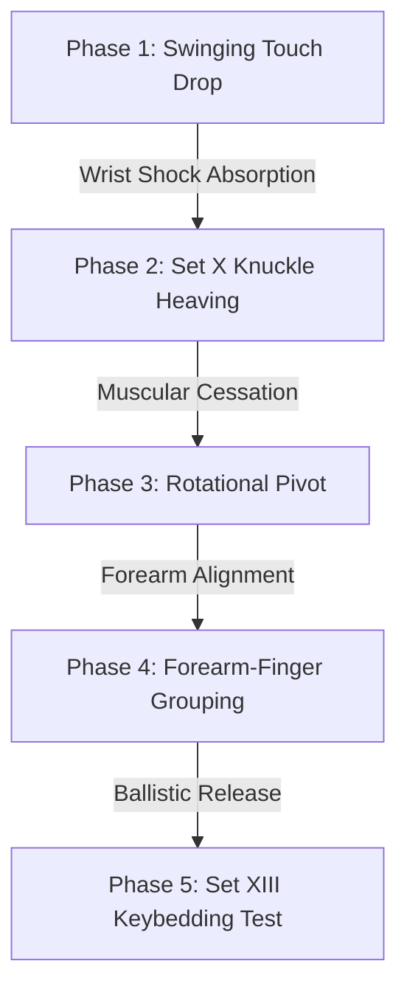

# 🎹 Lhevinne and Matthay: Comparative Piano Pedagogy and Rotational Synthesis

This note presents a comprehensive synthesis of the piano methodologies of **Josef Lhevinne** and **Tobias Matthay**. By integrating the artistic, tone-oriented Russian school (Lhevinne) with the rigorous physiological mechanics of the British school (Matthay), this guide provides advanced pianists with a unified framework for achieving a singing tone, rapid finger release, and tension-free velocity.

---

## 🗺️ Table of Contents
- [[#1. Introduction: Two Paths to Mastery]]
- [[#2. Core Technical and Physiological Concepts]]
  - [[#A. Tone Production: Speed-Descent vs. Weight-Release]]
  - [[#B. Forearm Rotation: The Visible and the Invisible]]
  - [[#C. The Poised Arm and Weight Transfer]]
  - [[#D. Muscular Cessation: Eradicating Co-Contraction]]
- [[#3. Comparative Terminology Matrix]]
- [[#4. Integrated 10-Minute Technical Warm-Up Regimen]]
  - [[#Phase 1: Lhevinne's "Swinging Touch" Drop (2 Minutes)]]
  - [[#Phase 2: Matthay's Set X Knuckle Heaving & Cessation (2 Minutes)]]
  - [[#Phase 3: Forearm Rotation & Bone Alignment (2 Minutes)]]
  - [[#Phase 4: Forearm-Finger Grouping & Release (2 Minutes)]]
  - [[#Phase 5: Keybedding & Point of Sound Agility Test (2 Minutes)]]
- [[#5. Related Technical References]]

---

## 1. Introduction: Two Paths to Mastery

The history of piano pedagogy contains a natural divide between the empirical, ear-led traditions of the Russian School and the analytical, anatomical systems of the early 20th-century physiological schools. 

*   **Josef Lhevinne** (*Basic Principles in Pianoforte Playing*, 1924) represents the peak of Russian pianism: an aesthetic centered on a rich, cantabile tone, loose wrists, economic velocity, and absolute ear-governed accuracy.
*   **Tobias Matthay** (*The Act of Touch*, 1903; *The Visible and Invisible*, 1932) represents the first systematic attempt to map the anatomical forces behind piano playing: emphasizing forearm rotation, arm-weight release, and the precise timing of muscular relaxation.

Rather than opposing each other, these two schools describe the same physical sensations from different perspectives. By aligning Lhevinne's qualitative descriptions (e.g., "pneumatic tires" and "shock absorbers") with Matthay's physiological definitions (e.g., "weight-release" and "muscular cessation"), we can resolve the root causes of playing tension, lazy fingers, and keybedding.

---

## 2. Core Technical and Physiological Concepts

### A. Tone Production: Speed-Descent vs. Weight-Release

Both Lhevinne and Matthay agree that the quality and volume of piano tone are determined entirely during the key's descent, not after it hits the keybed. However, they describe the initiation of this movement differently:

*   **Lhevinne's "Swinging Touch":**
    For lyrical cantabile playing, Lhevinne advocates a prepared drop. The hand is poised approximately two inches above the keyboard and falls "on the wing," grasping the key with the flat, fleshy cushions of the finger pads—which he terms **"pneumatic tires."** Crucially, the wrist acts as a **"shock absorber"** or spring, sinking below key level at the bottom of the stroke to absorb the impact.
    *   *Reference:* [[Josef Lhevinne/Josef Lhevinne - Basic Principles in Pianoforte Playing#CHAPTER III: The Secret of a Beautiful Tone|Basic Principles, Chapter III]] & [[Josef Lhevinne/Josef Lhevinne - Basic Principles in Pianoforte Playing#The Ringing, Singing Tone|The Ringing, Singing Tone]].
*   **Matthay's "Weight-Release Touch":**
    Matthay provides the mechanical explanation for Lhevinne's singing tone. He divides touch into **Weight-release** (releasing the arm's supporting muscles) and **Muscular-exertion** (using hand and finger muscles to drive the key down):
    > "The tendency is towards the 'singing' (or 'sympathetic') tone-character, when this initiatory-prompting is by Release of arm-weight; and the tendency is towards brilliancy and even harshness, when this Initiative dates from finger and hand Exer-tion."
    *   *Reference:* [[Tobias Matthay/The Act of Touch in All Its Diversity/Tobias Matthay - The Act of Touch in All Its Diversity#CHAPTER VII. PREAMBLE: SYNOPSIS OF THE MAIN INSTRUMENTAL FACTS|The Act of Touch, Chapter VII]] & [[Tobias Matthay/The Act of Touch in All Its Diversity/Tobias Matthay - The Act of Touch in All Its Diversity#CHAPTER XV. THE CONCEPTIONS OF TOUCH ARISING FROM CORRECT KEY-CONTACT AND DEFLECTION;—THE TWO CONCEPTS AND ACTS, OF RESTING AND ADDED-IMPETUS|Chapter XV]].

> [!IMPORTANT]
> **The Exception of Brilliancy:**
> Lhevinne notes that for passages demanding extreme sharpness and force (e.g., Liszt's *La Campanella* or Schumann's *Papillons*), pointed fingers and stiff wrists are *"not only permissible, but absolutely necessary"* to achieve the required mechanical speed and bite. This matches Matthay's "Muscular-initiative" touch, where hand and finger flexors exert force directly.
> *   *Reference:* [[Josef Lhevinne/Josef Lhevinne - Basic Principles in Pianoforte Playing#The Part the Wrist Plays in a Good Tone|Basic Principles, Chapter III]].

---

### B. Forearm Rotation: The Visible and the Invisible

Advanced speed (as required in the torrents of notes in *Chopin Étude Op. 10 No. 4*) cannot be achieved by finger action alone. The forearm must provide a rotational basis for each finger.

*   **Matthay's Rotation Principle:**
    Forearm rotation involves pronation (inward rotation, radius crossing ulna) and supination (outward rotation, radius parallel to ulna). Matthay warns that in rapid passages, visible rocking movements are a hindrance. Instead, the rotation is **invisible**:
    > "discoveries on this point do not refer merely to the actual rotatory movements... but, on the contrary, deal particularly with those invisible changes of state rotationally (momentary reversals or repetitions of stress and relaxation rotationally) which, although unseen, are needed for every note we play."
    *   *Reference:* [[Tobias Matthay/The Visible and Invisible/Tobias Matthay - The Visible and Invisible in Pianoforte Technique#THE FOREARM-ROTATION ELEMENT|The Visible and Invisible, Forearm-Rotation Element]].
*   **The Pivot Law:**
    In a rapid run, the forearm rotates in the direction of the new finger, away from the last playing finger, which serves as a momentary pivot. Failing to release this rotational stress immediately results in **muscular conflict** (co-contraction of pronators and supinators), locking the wrist.
*   **Anatomical Alignment:**
    As mapped by **György Sándor** (*On Piano Playing*, Chapter 6) and **Thomas Mark** (*What Every Pianist Needs to Know About the Body*, Chapter 5), keeping the upper arm clamped to the side of the body forces the forearm bones into extreme pronation, locking the wrist. Raising the upper arm slightly outward aligns the center of gravity directly over the playing finger, enabling free rotation.
    *   *References:* [[Gyorgy Sandor/Gyorgy Sandor - On Piano Playing#6 Rotation|Sándor, Chapter 6 (Rotation)]] & [[Thomas Mark/Thomas Mark - What Every Pianist Needs to Know About the Body#The Elbow Joint|Thomas Mark, Ch. 5 (The Elbow Joint)]].

---

### C. The Poised Arm and Weight Transfer

Pianists playing rapid passage work often suffer from fatigue because they carry the weight of their arms on their fingertips, or alternatively, force the fingers to lift the arm.

*   **The Poised Arm:**
    Matthay teaches that for light, rapid passages, the arm must float, balanced by its own raising muscles:
    > "The Poised Arm. You may 'poise' (or balance) the whole arm by its raising muscles, causing it (as it were) to float above or on the keyboard. No part of its weight or force rests upon the keyboard when the arm is FULLY poised... its inertia, alone, suffices as a basis for the exertion of the hand-and-finger."
    *   *Reference:* [[Tobias Matthay/The Visible and Invisible/Tobias Matthay - The Visible and Invisible in Pianoforte Technique#The Poised Arm, and The Rofative Arm,|The Visible and Invisible, The Poised Arm and Rotative Arm]].
*   **Wrist Elevation for Lightness:**
    Lhevinne applies this concept practically to fleet staccato passages (e.g., Rubinstein’s *Staccato Étude*). By raising the wrist, the pianist alters the angle of finger attack, eliminating percussive tapping noise and allowing the arm's poise to carry the hand:
    > "By raising the wrist, the stroke comes from a different angle, is lighter, but nonetheless secure and makes for ease in very fleet passages."
    *   *Reference:* [[Josef Lhevinne/Josef Lhevinne - Basic Principles in Pianoforte Playing#CHAPTER V: Accuracy in Playing|Basic Principles, Chapter V]].
*   **Weight-Transfer Legato:**
    In slow legato playing, the arm is only partially poised. A tiny fraction of arm-weight is allowed to rest continuously on the keys, passing from finger to finger like a fluid stream. Matthay calls this **"Weight-transfer"** or **"Passing-on" touch**, forming the natural basis of cantabile legato.

---

### D. Muscular Cessation: Eradicating Co-Contraction

Forearm tension and "lazy fingers" (lingering weight) are caused by **co-contraction**—the simultaneous firing of antagonistic muscle groups (flexors and extensors).

*   **The Escapement and the "Point of Sound":**
    **Thomas Mark** (Chapter 9) points out that the piano key has a point of escape (the "point of sound") shortly before reaching the bottom. Once the hammer escapes, any force applied against the keybed is wasted:
    $$ F_{\text{applied}} > F_{\text{hold}} \implies \text{Static Tension} $$
    Where $F_{\text{hold}}$ is only $20 - 30\text{ g}$ (the weight needed to keep the damper raised).
    *   *Reference:* [[Thomas Mark/Thomas Mark - What Every Pianist Needs to Know About the Body#Mapping the Point of Sound|Thomas Mark, Ch. 9 (Mapping the Point of Sound)]].
*   **Keybedding:**
    Matthay terms the application of force after the sound is produced **"Keybedding."** To play fast runs without tension, the hand and finger muscles must **cease all exertion** the split-second the sound is heard. This allows the key's up-weight to push the finger back up naturally.
    *   *Reference:* [[Tobias Matthay/The Act of Touch in All Its Diversity/Tobias Matthay - The Act of Touch in All Its Diversity#CHAPTER XVIII. THE THREE CHIEF MUSCULAR TESTS REQUIRED DURING PRACTICE AND PERFORMANCE|The Act of Touch, Chapter XVIII]].
*   **The Muscle Cessation Law:**
    Both Lhevinne's "Swinging Touch" (wrist drop) and Fink's "Finger Snap" rely on this: the finger articulates ballistically, slides or drops, and then immediately goes flaccid, resting on the key surface without pressing the keybed.

---

## 3. Comparative Terminology Matrix

| Technical Concept | Russian School (Lhevinne) | Physiological School (Matthay) | Physiological & Anatomical Explanation |
| :--- | :--- | :--- | :--- |
| **Lyrical Cantabile** | "Swinging Touch" (Grasping the key "on the wing") | "Weight-Release Touch" (Sympathetic / Singing) | Key descent driven by arm-weight release; fingers contact key with flat pads to cushion impact. |
| **Wrist Suppleness** | "Wrist Shock Absorber" (Spring) | "Wrist Hinge Freedom" (Vertical & Lateral) | Flexor tendons pass through the wrist; a supple wrist prevents static co-contraction of forearm muscles. |
| **Finger Staccato** | "Wiping Touch" (Inward scooping staccato) | "Momentary Added Impetus" (Form B / Finger staccato) | Rapid flexion of the finger from the MCP joint (knuckle), immediately followed by complete muscle relaxation. |
| **Avoidance of Pressing** | Grasping key bottom (avoiding pounding) | "Avoidance of Keybedding" | Exertion ceases the instant the hammer escapes; only $F_{\text{hold}}$ ($20-30\text{ g}$) remains to hold the key. |
| **Rotational Drive** | Slanting the hand laterally | "Forearm Rotation" (Visible & Invisible) | Pronation/supination of the radius around the ulna, providing rotational inertia to each finger. |
| **Floating Arm** | High-wrist fleet staccato runs | "The Poised Arm" | Arm-raising muscles (deltoids) balance arm weight, allowing fingers to act on forearm inertia. |
| **Legato Connection** | "String of uniform beads" | "Weight-Transfer Touch" (Passing-on touch) | A tiny residue of released arm weight flows continuously from one finger to the next. |

---

## 4. Integrated 10-Minute Technical Warm-Up Regimen

Perform these exercises daily with absolute focus on **listening** to the tone and **feeling** the muscle sensations. 

### Phase 1: Lhevinne's "Swinging Touch" Drop (2 Minutes)
*   **Objective:** Inculcate Lhevinne's singing tone and flexible wrist shock-absorption.
*   **Action:**
    1. Poise the hand 2 inches above the keyboard.
    2. Drop the arm freely, letting the curved finger pad grasp the key "on the wing."
    3. Let the wrist remain so loose that it sinks below the level of the keyboard at the bottom of the stroke.
    4. Listen for a ringing, round, non-harsh tone. Repeat with each finger of both hands.
    *   *Reference:* [[Josef Lhevinne/Josef Lhevinne - Basic Principles in Pianoforte Playing#CHAPTER III: The Secret of a Beautiful Tone|Basic Principles, Ch. III]].

### Phase 2: Matthay's Set X Knuckle Heaving & Cessation (2 Minutes)
*   **Objective:** Train finger muscles to support resting weight and cease exertion instantly.
*   **Action:**
    1. Place a fingertip on the key surface, knuckles dropped in a low position.
    2. Heave the knuckles upward by gently exerting the finger, keeping the wrist stable.
    3. Hold this poised weight (hand weight only) for 3 seconds.
    4. Suddenly let the knuckles fall back to the dropped starting position by the **complete cessation of finger exertion**.
    5. Practice in both the **flat (clinging)** attitude and the **bent (thrusting)** attitude.
    *   *Reference:* [[Tobias Matthay/Relaxation Studies/Tobias Matthay - Relaxation Studies#SET X. THE STUDY OF FINGER-ACTION AND ITS CESSATION|Relaxation Studies, Set X]].

### Phase 3: Forearm Rotation & Bone Alignment (2 Minutes)
*   **Objective:** Eliminate pronation tension and practice invisible rotational stress.
*   **Action:**
    1. Play a 5-finger pattern (C-D-E-F-G) slowly.
    2. Raise your upper arm slightly away from your body to align the radius and ulna.
    3. As you play each note, rotate the forearm **in the direction of the new finger and away from the last finger**, using the last finger as a pivot.
    4. Focus on letting the forearm release the rotational stress immediately after the sound is produced. Keep the rotation *invisible* (no rocking).
    *   *Reference:* [[Tobias Matthay/The Visible and Invisible/Tobias Matthay - The Visible and Invisible in Pianoforte Technique#THE FOREARM-ROTATION ELEMENT|Visible and Invisible, Forearm-Rotation Element]].

### Phase 4: Forearm-Finger Grouping & Release (2 Minutes)
*   **Objective:** Group multiple finger snaps into a single forearm impulse (for fast runs like *Chopin Op. 10 No. 4*).
*   **Action:**
    1. Select a 4-note sixteenth-note run (e.g., G#-F#-E-D#).
    2. Cover the keys. Drop the forearm weight into the first key (finger 4) with a slightly lowered wrist.
    3. Play the middle notes (3 and 2) close to the key surface using light, elastic finger action.
    4. Play the last note (finger 1) with an inward **finger snap** (wiping touch) that releases the hand, allowing the wrist to rise and float.
    *   *Reference:* [[Seymour Fink/Seymour Fink - Mastering Piano Technique#15 B: Forearm-Finger Grouping|Fink, Section 15 B (Forearm-Finger Grouping)]] & [[Josef Lhevinne/Josef Lhevinne - Basic Principles in Pianoforte Playing#CHAPTER V: Accuracy in Playing|Basic Principles, Ch. V]].

### Phase 5: Keybedding & Point of Sound Agility Test (2 Minutes)
*   **Objective:** Eliminate keybedding and test for instant muscle cessation in fast passages.
*   **Action:**
    1. Play a swift, ascending arpeggio using alternating hands in closest position (adjacent inversions, e.g., C-E-G-C).
    2. Because the hands repeat notes in close succession, **any keybedding or lingering weight** by the leading hand will block or blur the notes of the trailing hand.
    3. Focus on ending your finger/hand effort exactly at the point of sound, letting the keys rebound freely.
    *   *Reference:* [[Tobias Matthay/Relaxation Studies/Tobias Matthay - Relaxation Studies#SET XIII. AGILITY-TESTING EXERCISES (ADDITIONAL FORMS OF THE "THROW-OFF" EXERCISE, FOR THE ELISION OF ARM-STIFFNESS, &C.)|Relaxation Studies, Set XIII]] & [[Thomas Mark/Thomas Mark - What Every Pianist Needs to Know About the Body#Mapping the Point of Sound|Thomas Mark, Ch. 9 (Mapping the Point of Sound)]].

---

## 5. Related Technical References

*   [[Piano Physiology and Finger Release|Piano Physiology: Finger Release, Snapping, and Tension-Free Velocity]]
*   [[Josef Lhevinne/Josef Lhevinne - Basic Principles in Pianoforte Playing|Josef Lhevinne - Basic Principles in Pianoforte Playing]]
*   [[Tobias Matthay/The Act of Touch in All Its Diversity/Tobias Matthay - The Act of Touch in All Its Diversity|Tobias Matthay - The Act of Touch in All Its Diversity]]
*   [[Tobias Matthay/The Visible and Invisible/Tobias Matthay - The Visible and Invisible in Pianoforte Technique|Tobias Matthay - The Visible and Invisible in Pianoforte Technique]]
*   [[Tobias Matthay/Relaxation Studies/Tobias Matthay - Relaxation Studies|Tobias Matthay - Relaxation Studies]]
