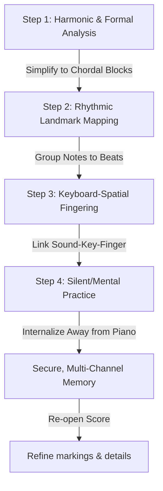

# 🧠 Piano Memorization: Theory, Physiology, and Practice

This note presents a comprehensive synthesis of the cognitive, physiological, and analytical memorization methods from the primary keyboard treatises in this vault. By combining **Tobias Matthay's** psychological laws of association, **Heinrich Neuhaus'** division of muscular and musical memory, **Boris Berman's** concentration-centered performance strategies, **Josef Lhevinne's** phrase-oriented structural mapping, and **Seymour Fink's** kinesthetic coordination drills, this guide provides advanced pianists with an efficient, reliable workflow for committing music to memory and performing securely under stress.

---

## 🗺️ Table of Contents
- [[#1. The 8 Channels of Piano Memory]]
- [[#2. Core Laws of Piano Memorization]]
  - [[#A. The Master and Servant Division (Musical vs. Muscular)]]
  - [[#B. The "Memory Scratch" Law (Fault Correction)]]
  - [[#C. The "Next-Note" Fallacy (Darwin's Sneeze)]]
- [[#3. Actionable 4-Step Memorization Method]]
  - [[#Step 1: Harmonic & Formal Outlining (The "Master" Plan)]]
  - [[#Step 2: Rhythmic Landmark Mapping]]
  - [[#Step 3: Keyboard-Spatial Fingering Association]]
  - [[#Step 4: Silent / Mental Practice (Away from the Piano)]]
- [[#4. Performance Security & Score Usage]]
- [[#5. Related Technical References]]

---

## 1. The 8 Channels of Piano Memory

Pianists often suffer from memory slips because they rely solely on automatic finger movements. **Tobias Matthay** (*[[Tobias Matthay/On Memorizing/Tobias Matthay - On Memorizing and Playing from Memory#^eight-forms|On Memorizing and Playing from Memory, p. 8]]*) establishes that secure memory is a multi-dimensional web. He deconstructs memory into **three main systems** yielding **eight distinct channels**:

| Memory System | Sub-Channel | Description & Function | Practice Application |
| :--- | :--- | :--- | :--- |
| **I. Musical** | **1. Melodic** | Retention of melodic contours and pitch intervals (*"a succession of intervals, rhythmically shaped"*). | Singing the melodic line; naming intervals aloud. |
| | **2. Harmonic** | Understanding chord progressions and their structural voice leading. | Playing the piece as a series of block chords (harmonic skeleton). |
| | **3. Rhythmical** | Recognizing the time-pulse structures and rhythmic landmarks. | Practicing with slight pauses before major metrical beats. |
| | **4. Moodal** | Memorizing the poetic curves, dynamics, and shifts in emotional character. | Storing distinct "emotional variants" to choose from in performance. |
| **II. Visual** | **5. Page-Visual** | The photographic image of the printed page (notes, markings, layouts). | Sticking strictly to **one edition** to prevent conflicting visual layouts. |
| | **6. Keyboard-Visual**| The visual patterns of the hands and keys on the keyboard. | Looking at your hands while practicing slow jumps or complex shapes. |
| **III. Muscular** | **7. Keyboard-Spatial** | The kinesthetic sense of distances and spaces traversed by the arm/hand (*"whenceness"*). | Playing jumps blindly, feeling the arm's lateral distance. |
| | **8. Key-Motion** | The tactile sensation of key resistance, escapement (point of sound), and key depth. | Feeling the physical resistance of key descent and the instant release post-sound. |

*   *Matthay Reference:* [[Tobias Matthay/On Memorizing/Tobias Matthay - On Memorizing and Playing from Memory#^eight-forms|On Memorizing, Eight Forms of Memory]].
*   *Berman Reference:* [[Boris Berman/Boris Berman - Notes from the Pianist's Bench#^memorization-types|Notes from the Pianist's Bench, Ch. 6 (p. 1584)]].

---

## 2. Core Laws of Piano Memorization

### A. The Master and Servant Division (Musical vs. Muscular)
*   **The Concept:** **Heinrich Neuhaus** (*[[Heinrich Neuhaus/Heinrich Neuhaus - The Art of Piano Playing#^musical-muscular-memory|The Art of Piano Playing, Chapter IV]]*) divides memory into the **Musical (spiritual/mental)** memory and the **Muscular (bodily/locomotor)** memory:
    > *"The first is, of course, much more important; it is the master and organizer. But the second also is indispensable; it is the faithful servant carrying out the work and making the master’s task easier."*
*   **The Autopilot Trap:** If a pianist practices obsessively without active mental concentration, the piece is relegated entirely to muscular memory (the "servant"). Under performance stress, if the mind wanders or panics, the servant loses its cue and a complete blackout occurs. 
*   **The Solution:** You must keep the "master" awake during practice by constantly giving the brain active musical and technical tasks (e.g., directing forearm rotation, listening to voice-leading, checking keybedding). 
*   *Neuhaus Reference:* [[Heinrich Neuhaus/Heinrich Neuhaus - The Art of Piano Playing#^musical-muscular-memory|The Art of Piano Playing, Addendum to Chapter IV (Fingering & Memory)]].
*   *Berman Reference:* [[Boris Berman/Boris Berman - Notes from the Pianist's Bench#^autopilot-case|Notes from the Pianist's Bench, Ch. 10 (p. 2150 - The Autopilot Case Study)]].

### B. The "Memory Scratch" Law (Fault Correction)
*   **The Concept:** Every physical action played on the keyboard writes a permanent impression on the brain's neural pathways—what Matthay calls a **"memory scratch"**:
    > *"If you make a wrong scratch on your memory-tablets (however slight the scratch) it will take much painful labour, afterwards, to erase the mis-impression... Such a wrong scratch is almost as bad as slightly exposing a photographic film by accident."*
*   **The Error of "Un-Practice":** When a student makes a mistake, plays the correct note immediately *after* the wrong one, and continues, they have chained the wrong note to the right note in their mind. The brain memorizes the *sequence*:
    $$ \text{Target Note} \to \text{Wrong Note} \to \text{Correction Note} $$
    This guarantees a stumble or hesitation at that exact spot in future performances.
*   **The Corrective Protocol:** 
    1. **Stop immediately** upon playing a wrong note. Do not play the "correct" note as an afterthought.
    2. Go back **before** the damaged area.
    3. Traverse the boundary at a slow, controlled speed, playing the correct notes **exclusively**, ensuring the brain receives only a clean, uninterrupted sequence.
*   *Matthay Reference:* [[Tobias Matthay/On Memorizing/Tobias Matthay - On Memorizing and Playing from Memory#^memory-scratches|On Memorizing, Additional Note I (Memory Scratches)]].

### C. The "Next-Note" Fallacy (Darwin's Sneeze)
*   **The Concept:** During a performance, trying to consciously recall "what note comes next" paralyzes the natural flow of automatic memory-ways. Matthay compares this to **Charles Darwin's sneeze experiment**: when Darwin challenged his students to sneeze willfully after taking snuff, none could do it, because willing an automatic reflex inhibits its execution.
*   **The Rule of Onwardness:** 
    *   In performance, your mind must remain vividly focused on the **sound and tactile sensation of the present note**. 
    *   Provided your memory-ways have been linked by association, the physical and musical events of the **present** moment will automatically and surely trigger the next. 
    *   If you panic and reach ahead mentally to test your memory, you disrupt the chain of association and trigger a blackout.
*   *Matthay Reference:* [[Tobias Matthay/On Memorizing/Tobias Matthay - On Memorizing and Playing from Memory#^next-note-fallacy|On Memorizing, The Next-Note Fallacy]].

---

## 3. Actionable 4-Step Memorization Method

Use this systematic workflow to commit any complex technical or musical passage to memory:

### Step 1: Harmonic & Formal Outlining (The "Master" Plan)
*   **Goal:** Establish the harmonic structure (chords, keys, voices) so you are memorizing musical *words* rather than isolated *letters* (black notes).
*   **Action:**
    1. Analyze the passage harmonically. Identify passing/ornamental notes and temporarily discard them to expose the underlying chord skeleton.
    2. Play the passage as **block chords** (e.g., in Chopin's Op. 10 No. 4, reduce the sixteenth-note runs to their harmonic basis: G# minor, A# dominant, D# minor chords).
    3. Practice playing one voice of a polyphonic passage (e.g., a Bach Fugue or the secondary lines of the Chopin Étude) while singing another, cementing the horizontal voice leading.
*   *Lhevinne Reference:* [[Josef Lhevinne/Josef Lhevinne - Basic Principles in Pianoforte Playing#^remember-the-thought|Basic Principles, Ch. VI (Chords as words)]].
*   *Berman Reference:* [[Boris Berman/Boris Berman - Notes from the Pianist's Bench#^harmonic-simplification|Notes from the Pianist's Bench, Ch. 6 (p. 1550)]].

### Step 2: Rhythmic Landmark Mapping
*   **Goal:** Install rhythmic "anchors" in the memory so you do not slither or rush through rapid notes.
*   **Action:**
    1. Divide a long sixteenth-note run into rhythmic groups (e.g., groups of 4, 6, or 8 notes leading to a specific beat).
    2. Practise the run with **deliberate micro-pauses** just before the first note of each beat (the landmark).
    3. During the pause, do not look at your fingers; instead, mentally **pre-hear** the upcoming landmark note, name the finger that will play it, and visualize its key. Once clear, play the note and continue the run to the next landmark.
*   *Matthay Reference:* [[Tobias Matthay/On Memorizing/Tobias Matthay - On Memorizing and Playing from Memory#^rhythmical-landmarks|On Memorizing, Rhythmic Landmarks]].

### Step 3: Keyboard-Spatial Fingering Association
*   **Goal:** Lock in the tactile coordination of the hand and arm by linking the physical keyboard geography to a fixed fingering scheme.
*   **Action:**
    1. Select a fingering and **never change it**. Constant experimentation with fingerings confuses the motoric memory.
    2. Focus on **finger-groups** rather than individual fingers. Think of scale segments, chords, and expansions/contractions as single physical shapes.
    3. **Fink's Kinesthetic Mapping:** Practise the gestures in the air (away from keys) or silently on the keyboard surface. Memorize the alternating configurations of pronation (elbow out, hand sloped inward) and supination (elbow in, hand sloped outward) for each finger-group.
*   *Fink Reference:* [[Seymour Fink/Seymour Fink - Mastering Piano Technique#^im2-1-memory|Mastering Piano Technique, IM 2.1 (Kinesthetic Memory)]] & [[Seymour Fink/Seymour Fink - Mastering Piano Technique#15 B: Forearm-Finger Grouping|Fink, Section 15 B (Grouping)]].
*   *Matthay Reference:* [[Tobias Matthay/On Memorizing/Tobias Matthay - On Memorizing and Playing from Memory#^learning-fingering|On Memorizing, Learning Fingering]].

### Step 4: Silent / Mental Practice (Away from the Piano)
*   **Goal:** Uncouple your musical memory from physical keyboard contact, verifying that the "master" organizer (the brain) has a clear, independent blueprint of the score.
*   **Action:**
    1. **Neuhaus' Candlelit Method:** Read the score away from the instrument (e.g., before sleep). Visualize the look of the notes, the hands playing them, the tactile key resistance, and the musical tone in your head.
    2. **Berman's Armchair Run-Through:** Sit in an armchair or go for a walk. Play the entire piece mentally from memory. If your mind gets "stuck" or blank at a certain measure, it means that specific link in your memory web is weak. Mark it, go back to the piano, and reinforce that local transition.
*   *Neuhaus Reference:* [[Heinrich Neuhaus/Heinrich Neuhaus - The Art of Piano Playing#^hammerklavier-study|The Art of Piano Playing, Ch. VI (Hammerklavier Case Study)]].
*   *Berman Reference:* [[Boris Berman/Boris Berman - Notes from the Pianist's Bench#^mental-practice-woods|Notes from the Pianist's Bench, Ch. 11 (p. 2108)]].

---

## 4. Performance Security & Score Usage

### Managing Stage Fright & Concentration slips
*   Memory blackouts are rarely failures of memory; they are **failures of concentration** (Berman, Ch. 10).
*   If your mind is left with nothing to do because the fingers are on autopilot, it will focus on fear and doubt. 
*   To secure your performance, you must keep your mind filled with **specific musical and physical tasks** (e.g., tracing the bass-line progression, guiding lateral arm movements, listening to tone coloring, and aiming for dynamic balance).

### When to Use the Score in Public
*   **Matthay's Advice:** While playing from memory is the modern fashion, if fear-motive threatens to ruin your playing, **use the score in public** (*[[Tobias Matthay/On Memorizing/Tobias Matthay - On Memorizing and Playing from Memory#^score-in-public|On Memorizing, Additional Note II]]*). Clara Schumann sometimes sat on her copy for comfort, and Raoul Pugno performed with it on the desk.
*   The presence of the score is preferable to a performance ruined by memory anxiety, as it allows you to focus fully on the spirit of the music rather than survival.
*   *Matthay Reference:* [[Tobias Matthay/On Memorizing/Tobias Matthay - On Memorizing and Playing from Memory#^score-in-public|On Memorizing, Additional Note II]].

---

## 5. Related Technical References

*   [[Lhevinne and Matthay - Pedagogical Summary|Lhevinne and Matthay - Pedagogical Summary]]
*   [[Piano Physiology and Finger Release|Piano Physiology: Finger Release and Tension-Free Velocity]]
*   [[Tobias Matthay/On Memorizing/Tobias Matthay - On Memorizing and Playing from Memory|Tobias Matthay - On Memorizing and Playing from Memory]]
*   [[Heinrich Neuhaus/Heinrich Neuhaus - The Art of Piano Playing|Heinrich Neuhaus - The Art of Piano Playing]]
*   [[Boris Berman/Boris Berman - Notes from the Pianist's Bench|Boris Berman - Notes from the Pianist's Bench]]
*   [[Josef Lhevinne/Josef Lhevinne - Basic Principles in Pianoforte Playing|Josef Lhevinne - Basic Principles in Pianoforte Playing]]
*   [[Seymour Fink/Seymour Fink - Mastering Piano Technique|Seymour Fink - Mastering Piano Technique]]

#piano #piano/memorization #piano/physiology #piano/technique #music/practice #relaxation #memory #stagefright #matthay #neuhaus #berman #lhevinne #fink #sandor #mark
