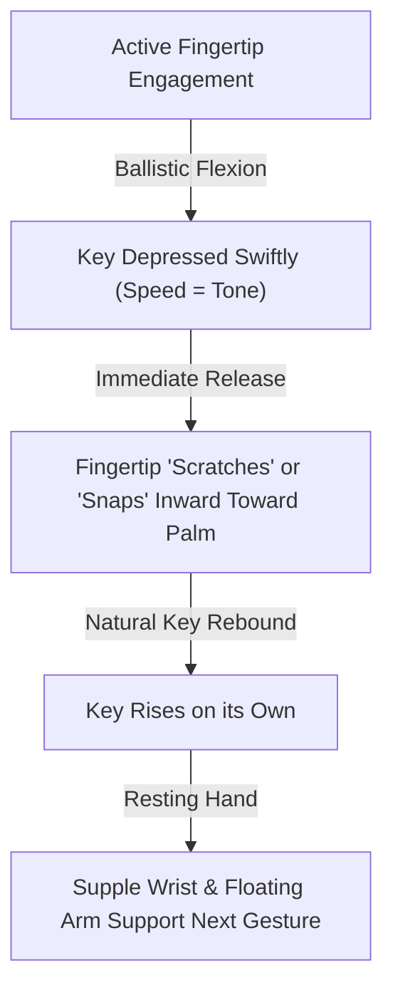

# 🎹 Piano Physiology: Finger Release, Snapping, and Tension-Free Velocity

A technical reference guide exploring the anatomical and physiological mechanics of active finger release, the "snapping" (scratching) stroke, and how to eliminate forearm tension in rapid, high-density passage work (such as *Chopin Étude Op. 10 No. 4* or *Liszt's La Campanella*).

---

## 🦾 1. Anatomical Breakdown: Why Tension Builds Up (The Co-Contraction Enemy)

To master rapid velocity and eradicate forearm fatigue, we must dissect the physiological mechanics of **co-contraction**—the pianist's primary physical obstacle.

### A. The Physiology of Co-Contraction (The Antagonistic Tug-of-War)
Muscles are living pull-engines; they can only shorten by contraction to pull a limb, but they can never actively push it back to its original length. Movement of a joint requires two opposing (antagonistic) muscle groups:
*   **The Agonist (e.g., Flexors)**: Contracts to pull the finger down.
*   **The Antagonist (e.g., Extensors)**: Must actively relax and stretch to allow the flexor to move the key.

Under normal, efficient conditions, these muscles fire alternately. **György Sándor** (*[[03 - Resources/Music/Piano Technique/Gyorgy Sandor/Gyorgy Sandor - On Piano Playing#3 The Human Performing Mechanism|On Piano Playing, Chapter 3]]*) notes:
> *"The up-and-down motion of the fingers is executed by the antagonistic sets of extensor and flexor muscles that work and relax alternately. As long as antagonistic muscles work alternately, they can go on indefinitely!"*

**Co-contraction** occurs when both the flexor and extensor muscles fire simultaneously. This creates an internal tug-of-war across the wrist and finger joints. Visually, the arm may seem active, but internally, the muscles are locking each other up:
> *"If the two antagonistic exertions are precisely equal, then nothing happens visibly, but you can feel the tense struggle if you are observant... and any such 'stiffness' will preclude our attaining any accuracy in tone, or ease in performance."* (Tobias Matthay, *[[03 - Resources/Music/Piano Technique/Tobias Matthay/The Visible and Invisible/Tobias Matthay - The Visible and Invisible in Pianoforte Technique#^matthay-antagonistic-struggle|The Visible and Invisible, line 795]]*)

---

### B. The Four Main Causes of Co-Contraction in Piano Playing

#### 1. Joint Instability and the "Fixation" Trap
When the brain feels that a joint (like the wrist or knuckle) is unsupported or unstable, its instinctive safety response is to freeze that joint by firing all surrounding muscles at once. This static locking is what Matthay terms **Fixation**:
*   **The Fallacy**: Trying to stabilize the finger by tensing the wrist.
*   **The Anatomical Cure**: You must steady the wrist not by a tug-of-war of local antagonistic muscles, but by supplying a dynamic basis of support from the next adjacent part of the limb—the **poised arm** (Matthay, *[[03 - Resources/Music/Piano Technique/Tobias Matthay/The Visible and Invisible/Tobias Matthay - The Visible and Invisible in Pianoforte Technique#^matthay-invisible-rotation|The Visible and Invisible, line 2412]]*). The arm weight floats, providing a steady platform for the fingers without forearm locking.

#### 2. Chronically Curled Fingers (The Claw)
*   Curling the middle and end joints of the fingers requires constant activation of the flexor muscles.
*   If you attempt to lift the finger from the knuckle (using the extensors) while keeping the tips curled, the flexors and extensors actively fight each other (Thomas Mark, *[[03 - Resources/Music/Piano Technique/Thomas Mark/Thomas Mark - What Every Pianist Needs to Know About the Body#The Elbow Joint|What Every Pianist Needs to Know, Chapter 8]]*).
*   This constant contraction of the flexor tendon sheath leads to friction, rapid fatigue, and tendonitis.

#### 3. Rotational Stiffness (Pronator vs. Supinator Tug-of-War)
Just as with vertical movements, forearm rotation is governed by antagonistic muscle pairs: the **pronators** (rotating inward) and **supinators** (rotating outward).
*   If you attempt to execute rapid runs with a stiff, immobile forearm, your pronators and supinators fire simultaneously to lock the forearm rotationally.
*   Matthay warns (*[[03 - Resources/Music/Piano Technique/Tobias Matthay/The Visible and Invisible/Tobias Matthay - The Visible and Invisible in Pianoforte Technique#^pronation-supination-conflict|The Visible and Invisible, line 1506]]*) that this creates a *"technique-destroying muscular conflict"* which paralyzes finger velocity. You must rotate in the direction of the new finger while inhibiting the opposite exertion.

#### 4. The Abduction-Extension Conflict (The "Wide Hand" Lock)
When playing wide chords, octaves, or rapid lateral leaps (as in Chopin Op. 10 No. 4), the pianist spreads the fingers using the **interossei muscles** of the hand (abduction).
*   Physiologically, abducting the fingers mechanically restricts their ability to flex and extend freely.
*   If you maintain a wide, rigid, stretched hand shape while trying to execute rapid runs, the forearm flexors and extensors must work under a massive mechanical handicap, triggering instant co-contraction.
*   **The Cure**: Boris Berman's *elastic palm* concept—narrowing and widening the hand dynamically.

---

### C. Self-Diagnostic Tests: Finding Your Co-Contraction
Use these simple tests during practice to instantly check if you are co-contracting:

1. **The Forearm Touch Test (Berman's Safety Check)**:
   Place your non-playing hand on the inner (volar) side of your playing forearm. Play a few rapid notes. If the muscle feels continuously rock-hard, you are co-contracting and keybedding. It should feel hard *only* for the microsecond of key-descent, immediately turning soft.
2. **The Wrist-Jiggle Test**:
   While playing a slow trill or run, try to gently jiggle your wrist up and down, or left and right. If you cannot do this easily, or if the wrist feels like a solid block of wood, your antagonistic muscles are locking the joint.
3. **The Forearm Rotational Swing Test (Matthay)**:
   Rest your hand loosely on the key surfaces. Use your other hand to grasp your forearm and gently roll it left and right. Your hand should flop rotatively like a swing. If you feel resistance, you are maintaining a rotational co-contraction even when "resting."
4. **The Air-Play Test**:
   Raise your hand in the air and pretend to play a rapid run. Note how light and effortless it feels. Now, curl your fingers tightly into a claw and try to do the same. Feel the instant forearm burn? That is the sensation of co-contraction you must avoid at the keyboard.

---

### D. The Practical Cures for Co-Contraction
To eliminate co-contraction, you must retrain your neuro-muscular system to send the "off" signal (relaxation) the split-second the sound is produced:

1. **The Ballistic Articulation & Free Rebound**:
   A ballistic movement is like throwing a ball: a brief burst of energy initiates the movement, after which the limb travels by momentum. In piano touch, the finger exerts energy *only* to accelerate the key during its descent. The instant the hammer escapes, the muscles must go flaccid, allowing the key's upward spring-force to lift the finger back to the surface.
2. **The Neutral Curve Hand Position**:
   Avoid the "prepared claw" or the flat finger. Rest your hand on your thigh; note the relaxed, semi-curved shape of the fingers. This is the **neutral resting state** where flexors and extensors are at their resting length. Play from this position, flexing only from the knuckle (MCP joint).
3. **Continuous Adjusting Motions**:
   As György Sándor (*[[03 - Resources/Music/Piano Technique/Gyorgy Sandor/Gyorgy Sandor - On Piano Playing#3 The Human Performing Mechanism|On Piano Playing, Chapter 3]]*) insists, you must continuously shift the hand and arm vertically, horizontally, and in depth. Changing the physical angles of attack forces previously active muscles to rest and allows their antagonistic pairs to take over, preventing static accumulation of tension.

---

### Keybedding and the Physics of Tone
**Thomas Mark** (Chapter 9, "Mapping the Point of Sound") explains that as you depress a key, you will feel a point of slight resistance, a "bump," shortly before the key reaches the keybed. That bump corresponds to the escapement mechanism—the **point of sound**—slightly before it reaches the keybed. Once the key passes this point, the hammer is thrown against the string and escapes. Nothing that happens at the keybed can alter the sound in the air:
> "No amount of pressing, sliding, or wobbling on the keybed can alter a sound that has already been produced... Pressing down on the keybed, for example, perhaps in the name of improving the tone, is pointless."

**Tobias Matthay** (*[[03 - Resources/Music/Piano Technique/Tobias Matthay/The Visible and Invisible/Tobias Matthay - The Visible and Invisible in Pianoforte Technique#^keybedding-definition|The Visible and Invisible, Chapter I, p. 23]]*) originally defined this phenomenon as **Keybedding**:
> "If you mis-apply (mis-time) the force with which you intend to produce a tone, and thus, instead of producing keymotion (and string-speed) allow the force to be wasted on the beds or pads under the keys, then your tone cannot correspond with your musically-intended wish... I have termed this mis-timing of the TONE-PRODUCING FORCE 'Keybedding.'"

$$ F_{\text{applied}} > F_{\text{hold}} \implies \text{Static Tension} $$

Where:
*   $F_{\text{applied}}$ is the force exerted by the pianist after the key hits the keybed.
*   $F_{\text{hold}}$ is the minimal force required to keep the damper raised (approximately $20 - 30\text{ g}$).

Any pressure exerted beyond $F_{\text{hold}}$ is physically wasted. **Abby Whiteside** (*[[03 - Resources/Music/Piano Technique/Abby Whiteside/Abby Whiteside - Indispensables of Piano Playing#^whiteside-keybedding-emotional|Indispensables of Piano Playing, Chapter 6, p. 21]]*) highlights that pressing the keybed is an emotional association rather than physical sound control:
> "...the result is merely a pressure against the keybed which in no way influences the held tone. This holding is worse than ineffectual. It stops the rhythm and destroys the possibility of the greatest subtlety in the use of dynamics."

She further warns (*[[03 - Resources/Music/Piano Technique/Abby Whiteside/Abby Whiteside - Indispensables of Piano Playing#^whiteside-shortest-power|Part II, Chapter XIII, p. 184]]*):
> "...there is nothing that hampers speed more than the habit of holding the key down after tone is produced. The basis for all speed is the shortest possible application of power for tone... The key will come up if it is not held down."

---

### The Limits of the Leschetizky Hand-Drop
The Theodor Leschetizky school teaches dropping the hand or arm weight into the keybed. While this is effective for lyrical cantabile or chordal passages, it has physiological limits in velocity:
1.  **Mass vs. Acceleration:** The arm and wrist have high mass and cannot vibrate or "drop" at the frequency required for a seventeenth-century *presto* or sixteenth-note torrents at $\approx 150\text{ BPM}$ (e.g., *Chopin Op. 10 No. 4*).
2.  **Lack of Reflex Rebound:** Relying on downward drops without a rapid release mechanism leads to sluggishness. At high speeds, we must transition from *gravity-driven drops* to *reflex-driven finger impulses* supported by forearm rotation, poising the arm to float above the keys.

---

## ⚡ 2. The Mechanics of the "Finger Snap" and "Scratch Touch" Strokes

The "snapping back" or **scratching stroke** (historically termed *staccato du doigt* or *pincé*) is a mechanical coordination designed to bypass co-contraction and keybedding. Modern piano pedagogy divides these pull-and-release motions into three specific techniques:

### 1. The Finger Snap Stroke (Fink, Section 9A / Chapter 2, PM 9A)
This is a prepared, pull-and-release motion designed to produce clean, rapid staccato.
*   **The Motion:** The finger starts in contact with the key surface. **Seymour Fink** (*[[03 - Resources/Music/Piano Technique/Seymour Fink/Seymour Fink - Mastering Piano Technique#^fink-finger-snap-stroke|Mastering Piano Technique, p. 113]]*) describes the playing stroke:
    > "...play staccato finger snaps... Release the keys by continuing the pulling-scooping playing gesture of the fingers. Maintain finger shape not by stiffening the finger, but by timing your long and small muscle pull: begin by scooping your fingertips... then continue the stroke by flexing largely in the hand knuckle."
*   **Release Mechanism:** The finger slides quickly under the palm along the key to both sound and release the note. The pianist must completely relax between efforts to prevent tension or fatigue.

### 2. The Scratch Touch Stroke (Fink, Section 9A)
This is a micro-articulation designed for high-density, rapid legato/staccato combinations where fingers stay in close contact with the keyboard.
*   **The Motion:** Place the fingers in an exaggerated palm position lightly on the bottoms of the keys. Vibrate the tips back and forth, making quick repeated sounds.
*   **Release Mechanism:** The fingers neither leave the keys nor allow them to surface completely. **Seymour Fink** (*[[03 - Resources/Music/Piano Technique/Seymour Fink/Seymour Fink - Mastering Piano Technique#^fink-scratch-touch-stroke|Mastering Piano Technique, Section 9A]]*) notes:
    > "The tiny scratching motion has little if any up/down feeling. Set correspondences carefully, for even minor miscalculations affect efficiency."

### 3. Lhevinne's Wiping Staccato (Lhevinne, Chapter V)
*   **The Motion:** Produced by active finger pads *wiping* or *scooping* the keys inward. **Josef Lhevinne** (*[[03 - Resources/Music/Piano Technique/Josef Lhevinne/Josef Lhevinne - Basic Principles in Pianoforte Playing#^lhevinne-wiping-staccato|Basic Principles in Pianoforte Playing, Chapter V]]*) asserts:
    > "Finger staccatos, produced by wiping the keys, are also effective when properly applied... let the fingers look down—see and feel the keys and not look at the ceiling!"
*   **Release Sensation:** The finger acts as a "pneumatic tire" cushioning the key descent, immediately sliding off the key surface inward toward the palm, which allows the key to rebound instantly.

> [!CAUTION]
> **Forearm Flexor Safety Warning (Boris Berman, *[[03 - Resources/Music/Piano Technique/Boris Berman/Boris Berman - Notes from the Pianist's Bench#^berman-flexor-safety|Notes from the Pianist's Bench, Chapter 2, p. 46]]*):**
> Finger staccato (*quasi pizzicato*, or a plucking motion toward the pianist) is an essential device for velocity, but the energetic plucking action of the finger can easily lead to overstraining of the flexor muscles located on the inner [volar] side of the forearm.
> **Verification Technique:**
> *"When learning a passage with one hand, the pianist can put the other hand on the inner [lower] part of the forearm to check that every effort required to produce the plucking motion is followed by a moment of relaxation of the muscles."*

---

## 🌊 3. Synthesizing Rotation, Grouping, and Hand Expansion

To play *Chopin Étude Op. 10 No. 4* without tension, we must synthesize active finger snapping with forearm rotation, wrist grouping, and a flexible palm bridge.

### Forearm Rotation & Bone Alignment (Sándor, Chapter 6; Mark, Chapter 5)
Fingers must never act in isolation. Forearm rotation—supination (turning outward, radius parallel to ulna) and pronation (turning inward, radius crossing ulna)—provides the fundamental drive shaft for the hand.
*   **Anatomical Alignment:** **György Sándor** (Chapter 6) notes that to place the hand palm-down on the keyboard, we must use pronation. If the upper arm is pressed tight to the body, the radius and ulna are crossed to their absolute limit, creating static tension in the forearm flexors before playing a single note. Raising the upper arm slightly away from the body aligns the forearm's center of gravity vertically over the playing finger.
*   **Invisible Rotation (Matthay, *[[03 - Resources/Music/Piano Technique/Tobias Matthay/The Visible and Invisible/Tobias Matthay - The Visible and Invisible in Pianoforte Technique#^matthay-invisible-rotation|The Visible and Invisible, Chapter III, p. 76-77]]*):**
    Matthay warns that visible rocking movements are a hindrance in rapid playing. Instead, the rotation is **invisible**:
    > "In a quick passage... such rotatory-movements cannot be attempted — there is not time for them... The direction of rotation (whether accompanied by actual rotatory-movement or not) is always in the Direction of the new finger and away from the last finger, which each time becomes the pivot for the new action."

### Forearm-Finger Grouping Gestures (Fink, Section 15B)
At tempo, executing notes as isolated downward efforts is physically impossible. You must group multiple notes into single coordination units.
*   **Forearm-Finger Grouping:** **Seymour Fink** (*[[03 - Resources/Music/Piano Technique/Seymour Fink/Seymour Fink - Mastering Piano Technique#^fink-forearm-finger-grouping|Mastering Piano Technique, p. 174]]*) defines this as organizing a motivic unit of notes so that they are played within a *single forearm drop*:
    > "(a) cover all notes as though playing a chord; (b) play the first note as a forearm drop on fingers set to reach bottom as the others just touch the surface of their respective keys; (c) play the last note of the group as a finger snap which releases all the held notes, kicking the fingers and forearms out of the keys."
*   **Rhythmic Cycle:** Minimizing wrist and shoulder movement maintains synchronicity between forearm and fingertip motion. With stable wrists, the movements can be as small as the key depth itself.

### The Flexible Palm in Chopin Op. 10 No. 4 (Berman, *[[03 - Resources/Music/Piano Technique/Boris Berman/Boris Berman - Notes from the Pianist's Bench#^berman-flexible-palm|Chapter 2, p. 48]]*)
In rapid, wide-interval passage work, keeping the hand bridge in a fixed, rigid span is a primary source of co-contraction and missed notes.
*   **The Concept:** **Boris Berman** (*[[03 - Resources/Music/Piano Technique/Boris Berman/Boris Berman - Notes from the Pianist's Bench#^berman-flexible-palm|Notes from the Pianist's Bench, Chapter 2]]*) emphasizes that the pianist must maintain an extremely flexible palm, constantly expanding (widening) and contracting (narrowing) the hand to match the topography of the keys.
*   **Application to Op. 10 No. 4:**
    > *"In Chopin's Etude op. 10 no. 4, for example, the opening group of notes is played with a relatively wide hand to accommodate the upcoming leap; the closeness of the next group of notes requires the hand to contract to a narrow position."*
    This elastic, breathing palm prevents static hand stretching and reduces extensor load.

---

## 🎹 4. Targeted Practice Regimen for Light, Active Fingers

Perform these exercises daily for 5–10 minutes before starting repertoire. Focus entirely on the **sensations of release**, **muscular recovery**, and **elasticity**.

### Exercise 1: Single-Note Finger Snap & Safety Check (2 minutes)
*   **Objective:** Train instant muscle release post-impact and prevent flexor strain (**Fink, Section 9A; Berman, Chapter 2**).
*   **Action:**
    1. Place a finger (e.g., finger 3) resting lightly on the surface of a key.
    2. Play the note with a sudden, rapid inward "scratch-snap" toward the palm, flexing from the MCP knuckle.
    3. **Immediately** let go of all effort, allowing the finger to rebound.
    4. **Safety Check:** Place your non-playing hand on the inner (volar) side of the playing forearm. Verify that the forearm flexor muscle tenses for only a split second during the stroke and instantly relaxes to a soft state.

### Exercise 2: Forearm-Finger Grouping Bursts (Chopin 10/4 Application) (3 minutes)
*   **Objective:** Apply forearm drop and finger snapping to fast sixteenth-note streams (**Fink, Section 15B; Berman, Chapter 2**).
*   **Action:**
    1. Take a 4-note sixteenth run from the Étude (e.g., $\text{G}\sharp - \text{F}\sharp - \text{E} - \text{D}\sharp$ played by fingers 4 - 3 - 2 - 1).
    2. Cover the notes as a physical group. Drop the forearm weight into the first key (finger 4) with a slightly lowered wrist.
    3. Articulate the middle notes (3 and 2) using light, close-to-key snapping fingers.
    4. **Snap** the final note (finger 1) to kick the forearm slightly out of the keys, letting the wrist rise and float.
    5. Use Berman's *flexible palm* concept: ensure the palm bridge expands for the first note and contracts dynamically for the narrow fingers.

### Exercise 3: Pronation-Free Rotational Trills (2 minutes)
*   **Objective:** Eliminate finger-isolation tension by utilizing forearm rotation and proper bone alignment (**[[03 - Resources/Music/Piano Technique/Gyorgy Sandor/Gyorgy Sandor - On Piano Playing#6 Rotation|Sándor, Chapter 6]]**; **[[03 - Resources/Music/Piano Technique/Tobias Matthay/The Visible and Invisible/Tobias Matthay - The Visible and Invisible in Pianoforte Technique#^matthay-invisible-rotation|Matthay, *Visible and Invisible*, p. 77]]**).
*   **Action:**
    1. Play an alternating trill (e.g., fingers 2 and 3 on D and E). Keep the fingers close to the key surfaces.
    2. Raise your upper arm slightly away from the body to prevent extreme crossed pronation of the forearm bones (radius/ulna).
    3. Play the trill by rotating the forearm left and right, throwing the arm weight from finger 2 to 3. The rotation must be invisible—rotate *in the direction of the new finger and away from the last*, letting each last finger serve as a pivot.

### Exercise 4: Silent Finger-Action and Knuckle-Freeing (Matthay's SET X) (2 minutes)
*   **Objective:** Train the finger to support resting weight and cease exertion instantly without keybedding (**Matthay, *Relaxation Studies*, Part III, Set X**).
*   **Action:**
    *   **Form A (Continuous Exertion - Knuckle Heaving):**
        1. Place a fingertip on a table, with knuckles fully dropped (sunk).
        2. Exert the finger to heave the knuckles upward until fully raised. Maintain wrist height.
        3. Support the weight (Staccato-resting: hand weight only; Legato-resting: hand + slight arm weight) for 3 seconds.
        4. Suddenly let the knuckles fall back to the dropped starting position by the **complete cessation of finger exertion**.
        5. Practise in both the **flat (clinging)** attitude (fingertip pad on table, finger straight/elastic, knuckles dropped below table level) and **bent (thrusting)** attitude (vertical nail-phalange, knuckles sunk, finger curved).
    *   **Form B (Momentary Exertion - Knuckle Tossing):**
        1. Start in the same dropped knuckle position on the table.
        2. Deliver an extremely short-lived, sharp action against the table to **toss the knuckles up**, allowing them to fall back instantly by gravity.
        3. Practise under the **Three Species of Touch-Formation**:
            *   *1st Species:* Limit exertion to the finger alone against a loose-lying hand (elbow poised).
            *   *2nd Species:* Toss forearm and wrist up by adding hand force behind the finger (knuckle and wrist level).
            *   *3rd Species:* Release arm weight momentarily so that the finger/hand tosses up the whole forearm weight (knuckle, wrist, and elbow rise together).

### Exercise 5: Closest-Position Arpeggio Keybedding Test (Matthay's SET XIII) (2 minutes)
*   **Objective:** Eliminate keybedding and check for early cessation of force in agility (**Matthay, *Relaxation Studies*, Set XIII, Form A**).
*   **Action:**
    1. Play a swift, ascending close arpeggio (e.g., C-E-G-C) using alternating hands in closest position (adjacent inversions).
    2. Because the hands repeat the same notes, **any keybedding or lingering weight** by the leading hand will instantly block or blur the notes of the trailing hand.
    3. Ensure the fingers of the leading hand cease action **early in key-descent**, letting the keys rebound freely. The non-legato hand must execute a "resilient" touch, letting the keys bounce back, fingers and all.

---

## 🧾 Summary of Technical Sensations

| Technical Element | Old "Tense" Habit | New "Efficient" Habit | Literature Source |
| :--- | :--- | :--- | :--- |
| **Finger Strike** | Vertical pushing down into the keybed. | Inward pulling-scooping motion (*pincé* / wiping). | Fink Sec. 9A, Berman Ch. 2, Lhevinne Ch. V |
| **Key Contact** | Lifting high and striking from above. | Low finger height, resting on key surface. | Lhevinne Ch. IV, Sandor Ch. 3, Matthay Set X |
| **Post-Sound** | Pressing hard against the keybed. | Instant release ($F_{\text{hold}}$ only), finger rebounds. | Mark Ch. 9, Whiteside Ch. 6, Matthay Set X |
| **Finger Shape** | Chronically curled end joints. | Neutral, natural curved shape (relaxes flexors). | Mark Ch. 8 |
| **Arm/Wrist** | Pressed to body, wrist locked. | Upper arm slightly out, rotating forearm, loose wrist. | Sandor Ch. 6, Lhevinne Ch. III, Matthay Set XVIII |
| **Fast Run Conception** | Every note is an individual downward effort. | A single arm gesture grouping multiple finger snaps. | Fink Sec. 15B, Whiteside Ch. 5, Matthay Set XIII |

---

## 🔗 Related Notes
*   [[03 - Resources/Music/Piano Technique/Lhevinne and Matthay - Pedagogical Summary|Lhevinne and Matthay - Pedagogical Summary]]

#piano #piano/physiology #piano/technique #music/practice #rebound #relaxation #velocity #chopin #flexors #extensors #cocontraction #keybedding #matthay #lhevinne #berman #whiteside #fink #sandor #mark
