--- type: literature tags:
- music/theory
- piano/technique author: Tobias Matthay date_published: 1903
---
# The act of touch in all its diversity: an analysis and
## Table of Contents
- [[#PART I. INTRODUCTORY]]
  - [[#GENERAL ASPECT OF THE PROBLEMS OF PIANOFORTE PLAYING]]
  - [[#CHAPTER I. PREAMBLE]]
  - [[#CHAPTER II. THE PROBLEM OF PIANOFORTE TRAINING]]
  - [[#CHAPTER III. THE PROBLEM OF EDUCATION IN THE ART OF TONE-PRODUCTION]]
  - [[#CHAPTER IV. THE PROBLEM OF MUSCULAR EDUCATION]]
  - [[#CHAPTER V. THE FINAL PROBLEM: THE UNION OF EXECUTION WITH CONCEPTION]]
  - [[#CHAPTER VI. CONCLUSION AND SUMMARY]]
- [[#PART II. KEY-TREATMENT FROM ITS INSTRUMENTAL ASPECT]]
  - [[#CHAPTER VII. PREAMBLE: SYNOPSIS OF THE MAIN INSTRUMENTAL FACTS]]
  - [[#CHAPTER VIII. THE INSTRUMENT]]
  - [[#CHAPTER IX. ON SOUND]]
  - [[#CHAPTER X. THE STRING: ITS BEHAVIOUR DURING THE VARIOUS FORMS OF TONE-PRODUCTION]]
  - [[#CHAPTER XI. THE KEY—THE STRING-MOVING IMPLEMENT, ITS BEHAVIOUR AND REQUIREMENTS DURING TTHE ACT OF TONE-PRODUCTION]]
- [[#PART III. KEY-TREATMENT FROM ITS MUSCULAR ASPECT]]
  - [[#CHAPTER XII. PREAMBLE: SYNOPSIS OF THE MAIN MUSCULAR FACTS]]
  - [[#CHAPTER XIII. THE LINK BETWEEN KEY AND MUSCLE—OUR SENSE OF KEY-RESISTANCE]]
  - [[#CHAPTER XIV. ON KEY-CONTACT: THE NATURE OF THE IMPACT OF THE FINGER AGAINST THE KEY]]
  - [[#CHAPTER XVI. THE NATURE OF THE LIMBS EMPLOYED, AND THEIR MUSCULAR EQUIPMENT]]
  - [[#CHAPTER XVII. THE MUSCULAR ACTIONS AND INACTIONS CONCERNED IN THE ACT OF TOUCH]]
  - [[#CHAPTER XVIII. THE THREE CHIEF MUSCULAR TESTS REQUIRED DURING PRACTICE AND PERFORMANCE]]
  - [[#CHAPTER XX. ENUMERATION AND CLASSIFICATION OF TOUCHES]]
  - [[#CHAPTER XXI. RECAPITULATORY AND SUMMARY OF THE MAIN CONCLUSIONS OF PART III (THE LINK)]]
- [[#PART IV. ON POSITION]]
  - [[#CHAPTER XXII. PREAMBLE: SYNOPSIS OF THE MAIN ASPECTS OF POSITION]]
  - [[#CHAPTER XXIII. THE DETAILS OF POSITION]]
  - [[#RECAPITULATORY OF CHAPTER XXIII., AND OF PART IV]]
  - [[#CHAPTER XXIV. CONCLUSION: GLOSSARY AND SUMMARY OF THE MAIN TEACHINGS OF THIS WORK]]

---

Converted from digitized archive text pages.

PIANOFORTE TONE-PRODUCTION TOBIAS MATTHAY

The Library of TO THE UNIVERS A COMMUNE VINCULUM OMNIBUS ARTIBUS RSITY Mu Class
786.4 Book M43

Pill.

"

1

PIANOFORTE TONE-PRODUCTION

BY TOBIAS MATTHAY TTHE ACT OF TOUCH IN ALL THE ITS DIVERSITY. An analysis and synthesis of Pianoforte Tone-Production. THE PRINCIPLES OF TPIANOFORTE PLAYING. Being an extract from the author's "TTTHE ACT OF TOUCH." Designed for school use, and in- cluding two new chapters, DIRECTIONS FOR LEARNERS AND ADVICE TO TEACHERS. SOME COMMENTARIES ON THE TEACHING OF PIANOFORTE TECHNIQUE. A Supplement to "TTTHE ACT OF TOUCH" and "FIRST PRINCIPLES." LONGMANS, GREEN, AND CO. LONDON, NEW YORK, BOMBAY, AND CALCUTTA

TTTHE ACT OF TOUCH IN ALL ITS DIVERSITY AN ANALYSIS AND SYNTHESIS OF PIANOFORTE TONE-PRODUCTION BY TOBIAS MATTHAY FELLOW AND PROFESSOR OF THE ROYAL ACADEMY OF MUSIC, LONDON, ETC. NEW IMPRESSION MINNESOTA LIBRARY LONGMANS, GREEN AND CO. 39 PATERNOSTER ROW, LONDON FOURTH AVENUE & 30TH STREET, NEW YORK BOMBAY, CALCUTTA, AND MADRAS 1916

COPYRIGHT, 1903, BY LONGMANS, GREEN, AND CO. First Edition Dec, 1903. Reprinted May 1905
• . Reprinted September 1911 Reprinted February -1914 Reprinted June 1916. Press of J. J. Little & Ives Co. New York

Mu786.4 DEC 13 1916 40L Mc Clurg
1.36 M+3 To MY FELLOW WORKERS AT THE PIANOFORTE STUDENTS, ARTISTS, AND TEACHERS 206101

"There can be no effect without a cause."

PREFACE. ABILITY to understand and feel Music, and ability to com- municate such perceptions to others by means of an instrument, are two totally distinct accomplishments. They have often been confused, owing to the fact, that it is impossible to achieve a really satisfactory musical performance without their happy combination. To become pianoforte players, we must learn Music, and must acquire Taste, but we can only succeed in expressing what we feel, musically, by means of the physical act of key-depression. In short, the purely physical act of playing consists solely of an ACT of Touch,—an act of Tone-production. All the gradations of Agility (fleetness of finger), Duration (staccato and legato), as well as all the contrasts of Tone-inflection depend solely and directly on the nature of this act; and it is therefore upon our expertness in the ART of Touch that the whole superstructure of Pianoforte-playing rests. The Art of Touch may indeed be concisely defined as: command over the Means of Expression. This Art thus forms the very Foundation (the Elements or Rudiments) of Pianoforte-playing; and it can no more be a "gift" (as so often supposed) than is the art of articulate Speech itself; for it can be acquired by every person of average intelligence. Its precise place in the scheme of Piano- forte Education need not here be further dilated upon, since vii

viii PREFACE. Part I. is devoted to that purpose; and the reader is referred to the Summary of this Part, on page 40. A performer can indeed prove himself to be musical only to the extent of his command over touch variety. It is the constant flow of note to note touch-inflections that forces one to realize that a performer is a sentient being. And it is just this Art of Touch, that willl for ever defy mechanical imitation; and willl for ever render the simplest performance, coloured by human fingers, immeasurably superior to the most com- plex one obtained by mechanical agency, however perfect the machine. Although it is only thus, by perfecting himself in the Art of Touch, that the player can obtain the means of expressing his musical sensibilities, yet until within quite recent years the paramount necessity of studying this problem had not be- gun to dawn upon teachers, artists, and students. As the true fundamentals of this Art remained practically unrecognized, no serious attempt could be made to give direct instruction in it. True, it was recognised that the musically endowed evinced a "finer touch " than did others less endowed; but this, it was assumed, was owing solely to some occult influence over the keyboard, the possession of which enabled the favoured ones to produce tone of a better quality and of finer gradations;—and there is some half-truth in this, for it is certain that the possession of a musical ear, and a strong wish for musical expression, willl undoubtedly compel the player to experiment at the keyboard, until he does sooner or later discover for himself at least some of the mechanical Means that willl conduce to success. the more serious teachers have insisted upon the necessity of good quality and variety of Touch. But even the greatest, so far, have relied almost exclusively upon empirical methods True, also, that

PREFACE. ix or upon the force of Example. Or they have insisted upon what is after all a mere accompaniment of good touch, i. e. : Position and Movement-thus placing "the cart before the horse." True it is, moreover, that the necessity of ra- tionally studying this problem has lately made itself keenly felt, especially in America. How pressing this need is, be- comes only too painfully evident, when one has to teach those who have already formed wrong muscular-habits, and when one is compelled to witness the ineffectual struggles of many even of the musically endowed in the Examination-room, and Concert-room, who, were they not thus handicapped by faulty habits (acquired through ignorance of these Rudiments) could give free vent to the powers of perception and imagination evidently latent in them! Obviously the only way to succeed in the attempt ration- ally to learn and teach the Act of Touch in all its immense va- riety, is, first to discover through ANALYSIS how the successful players obtain their effects, and then to test such Analysis, by observing whether the act of touch, built up in accordance with such analysis, does give the anticipated tonal-results. Having thus determined the structure of all varieties of touch, and the permits to Agility, we ought then to be in a position directly to help ourselves and others towards their acquisition. The Means of Touch-variety or Key-treatment having thus been analysed, it follows that all who willl take the trouble to master the subject-all who willl take the trouble to under- stand the requirements of Key and Muscle, and willl take the trouble to form these into physical and mental habits-willl be able to acquire the language of Expression. Everyone may thus be enabled to gain power of Agility and Colouring; and even the musically endowed, may, by directly acquiring a tone-palette (or Touch-palette) thus save years of time, which

X PREFACE. would otherwise be wasted in futile experiments, and in form- ing bad habits. As I have now for a great number of years applied such Analysis and Synthesis of Touch in my daily work of teaching, doing so always with increasing directness, and mainly as- cribe such success as I have had as a teacher (and my pupils, also, as teachers) to the resulting ability to point out the im- mediate causes of the observed faults, and the direct means of their correction-to the ability to show explicity How to command the physical fulfilment of each interpretative and technical detail, I have long been urged to render this knowledge more widely accessible, and the present little work is the result. In endeavouring to place the many unfamiliar facts and new ideas before the reader, there was however this dilemma to face that innumerable prejudices and fallacies would have to be combated, and that to do this would render the treatise too elaborate for the Schoolroom; whereas, to limit it to direct information in its concisest form (as required for the School- room) might render its teachings liable to misconception, and unacceptable to the prejudiced. To overcome this difficulty, the work has been laid out in four Parts, as follows:-Part I, is purely introductory, and purposes to show the relation the study of Touch bears to the general problems of Pianoforte-education. This is followed by the practical Parts, II to IV. Part II, "The instrumental aspect of Key-treatment," demonstrates the nature of the mechanical difficulties to be overcome,-what are the re- quirements of the key, and how the key must be treated for each kind of effect. Part III, "The muscular-aspect of Key- treatment," exhibits the muscular difficulties of the problem, and their solution-the muscular means we must adopt, to ful- fil the key's requirements. Finally, Part IV deals with the

PREFACE. xi positional aspect of the subject-the postures and movements which must, or may, accompany correct key-treatment. Each of these practical Parts consists first of a Preamble, giving a general idea of the matter to be dealt with, followed by a num- ber of chapters, providing explanatory details; each of these chapters being followed by a RECAPITULATION, and each of the Parts again by a SUMMARY; the concluding chapter of the work, moreover, giving a Glossary of the whole. A system of Notes accompanies the text, and Appendices, which follow each Part, give further opportunity for detailed instruction. In this way, the close enquirer may obtain full information in the chapters, while the less advanced student can be re- ferred to these Recapitulatories and Summaries. These, in fact, form a work complete in itself,—a digest or extract, de- signed for school use. This Digest or Extract, is in- tended for publication in a separate form later on, to render it more easily available for such purpose. The work, it willl be seen, is entirely explanatory. It has nothing to do with any particular system of exercises or stud- ies, etc. /The_Student can apply its teachings at any stage of his progress, since it applies in all cases, whatever the system of teaching or exercises adopted in other respects. The Artist can learn from it the reason of his greater or lesser success technically, and how further to improve his powers of Expression. The Teacher willl find it useful at every step; and finally the Critic can find in it a basis for his technical opinions. This work may presently be followed by an extra Part— Part V, giving certain exercises for acquiring Muscular-dis- crimination, which have been found useful in direct teaching. Coming now to the end of the years of labour expended on this little volume, the late Professor TYNDALL'S words recur

xii PREFACE. to me: "The ease with which an essay is read, is often a meas- ure of the laboriousness with which it has been written; "- and in concluding, I can only express the hope that my read- ers may find some measure of correspondence between my labour in this instance, and its result! I must also here take the opportunity of thanking the many kind friends who have encouraged me in my self-im- posed task, and to acknowledge the valuable help given me in the revision of the proofs, etc., by Mrs. Kennedy-Fraser, of Edinburgh, and others. HAMPSTEAD, LONDON, July, 1903 TOBIAS MATTHAY.

RECOMMENDATION. In studying this work, each of the four Parts should be taken in the following order:
I. The Preamble to each Part.
II. The Contents of each chapter.
III. The Summary of each chapter.
IV. The Text of each chapter, with re-study of the Recapitulatories.
V. The Recapitulatory or Summary of each Part, to con- centrate the knowledge acquired.
VI. The student should afterwards constantly refer to the Recapitulatories, whenever he perceives technical difficulties between himself and his interpretative intentions. : The reader may here be warned against a mistake often made, viz. the assumption, that an author must needs be in the wrong, because a reader fails to understand the facts dealt with ! Granted, that it is wrong to accept any teachings unless one's reason is convinced of their truth, nevertheless it is still more deeply wrong, to be convinced that such teachings are untrue, because they happen, perhaps, to be in complete opposition to doctrines faithfully clung to for years! Only by a rigid analysis of facts can we hope to eliminate untruth, and the author begs for such test, convinced as he is that the facts here stated become only the clearer, the more they are subjected to examination.

:

CONTENTS. PART I.—INTRODUCTORY. CHAPTER I. PREAMBLE. The absurdity of attempting to teach Pianoforte Playing, without teaching the Elements of "Touch ".-Comparison of Empiric with Rational, or Direct, methods of teaching.-Practice unprofitable, unless it tends towards the acquisition of Variety in Touch, through the formation of correct habits.-Only by a preliminary practical understanding of the Laws of Tone-production can this be ensured.-Such understand- ing insufficient by itself, the rules of procedure must be fixed into Mental-muscular Habit. The form of Attention a fully-trained Artist gives during the act of performance, must hence widely differ from that required from a Learner.-Comparison of the Accidental with the Rational methods of attaining Touch.-The Highly-talented may happen to discover correct forms of tone-production, the Less-talented willl probably fail.-Tone-production discovered by accident is easily forgotten; whereas, this is not likely, once the facts are understood.— The rational method of acquiring Tone-production premises know- ledge of the laws that govern it.—The formation of correct habits of Touch is ensured, when we understand what Treatment the Key re- quires for each different kind of sound, and the nature of the Mus- cular-Conditions by means of which such Key-treatment can be fulfilled. Three stages of acquaintanceship are possible with regard to Tone-production, viz.: (a) Ability to obtain the effects from the in strument, while ignorant of the processes adopted; (b) Understand- ing the nature of these processes, how key and limb have to be treated for each effect; (c) Perception of the reason for such treat PAGE ment 1

xvi CONTENTS. CHAPTER II. THE PROBLEM OF PIANOFORTE TRAINING.
- Successful Performance consists in the combination of two distinct proc- esses: the mental act of Musical Perception, and the physical act leading to its Execution.The first process implies Musicianship; the second, Executantship. Neither avails, unless Attention is forthcom- ing from both sides during the act of performance.—Musicianship has a dual aspect: the Emotional, and the Intellectual; both sides must be trained.-Emotional training permits us to feel Music; Intellectual training permits us to see the Musical Shapes through which Feeling is expressed.-Executantship similarly has a dual aspect : one, imply- ing Artistic Judgment, and the other, implying Command over the Art of Tone-Production.-Artistic-judgment comprises: (a) Famili- arity with the possible Instrumental effects; (b) Judgment, as to their appropriate Application; and (c) Keenness of Pulsational-Sense, of perception of Time-lapse. Command over Tone-Production in- volves special training for the particular instrument; it implies Abil- ity to draw from it every effect dictated by our Musicianship, and our Artistic-sense PAGE CHAPTER III. THE PROBLEM OF EDUCATION IN THE ART OF TONE-PRODUCTION. The Art of Tone-production comprises the production of all possible Sound-effects from the instrument: those of Tone-Quantity; those of Tone-Quality; those of Continuance; it includes also the attainment of Agility.—The laws of Tone-Production apply equally to everyone, gifted and non-gifted.—Certain endowments render easier the acquisi- tion of Agility; these are distinct from those which constitute a large Pianoforte-voice.—Even the smallest natural Piano-voice, when prop- erly produced, is capable of far larger volume of tone, and its mod. ifications, than is generally supposed possible.—“Stiff” fingers and wrists also indicate faulty habits, rather than natural incapacity.— Facility in Tone-production rests on knowledge and physical attain- ments, in two distinct directions: Instrumental education and Muscu- lar Education.-The Key-treatment required for each kind of sound must be understood; and the muscular Conditions consummating each shade of treatment must be forthcoming 21

CONTENTS. xvii CHAPTER IV. THE PROBLEM OF MUSCULAR EDUCATION. Consists of two steps.-We must learn to discriminate the right muscu- lar-conditions from the wrong ones; we must then learn to apply these correctly-discriminated Conditions to the Keyboard, both as regards amount and duration.-The First step in Muscular-education can be carried out apart from the Pianoforte keyboard.-It is a pro- cess of Elimination of not-required activities.-The result is Freedom of action. The needful muscular activities and inactivities produce two distinct classes of effects; Visible effects, in the shape of move- ments, and Invisible effects in the shape of stresses and tensions.-The mode of imparting the Visible actions; also, the Invisible actions.— Warning not to overlook ultimate Object, Sound excitation, during such process of Muscular-education.-The Second step in muscular- education demands a keyboard, and that of a good instrument.—We must here learn to time the muscular-act both to commence and to cease at the right moment.—We must learn to gauge the intensity of the Muscular-act in obedience to the needs of the Key, before, during, and after its descent
• PAGE 25 CHAPTER V. THE FINAL PROBLEM: THE UNION OF EXECUTION WITH CONCEPTION. The completion of the act of Tone-production arises at a definite point in Key-descent, and at a definite moment of Time; herein lies the means of Union.-This Union is accomplished, by timing a muscular- act, of requisite intensity, to culminate the mechanical operation upon the key in absolute correspondence with the degree and time which our conception of the Music demands for each note.-Execution fulfils Conception, when Key-arrival "at Sound" corresponds with the musi- cally-intended moment of tone-excitation.—Only through the Ear can we be promptly enough notified of the moment when the act of "Touch" is consummated: the moment of transition from Silence to Sound.-Alertness of Ear, hence, the final and most important problem of Executive-education.-Final definition of the Four Ele- ments which together constitute the Act of Attention required in per. formance.-Warning not to forget the ultimate Object in endeavour- ing to fulfil the Means.—Even Attention itself must not be given for its own sake.—In performance, our consciousness must always be a supreme desire to perceive Music, for the sake of communicating it 80
•

xviii CONTENTS. CHAPTER VI. CONCLUSION, AND SUMMARY. Realization of the components of Pianoforte Education willl enable us to locate each fault. This willl enable us to correct each fault separately, the quickest and surest way.-It willl enable us the better to Prac- tise, Criticise, Play, and Teach Summary, a Table, giving the relationship of the various components of Pianoforte Education · PAGE 37 · 40 APPENDIX TO PART I. NOTE I. On Listening NOTE II. On Rhythm NOTE III. As to Gymnastics NOTE IV. Piano-talent NOTE V. As to Self-consciousness and Nervousness NOTE VI. Musical Feeling. · 40 · 41
•
• 42 42 · 43 43
• PART II.-KEY-TREATMENT FROM ITS INSTRU- MENTAL ASPECT. CHAPTER VII. PREAMBLE: THE MAIN INSTRUMENTAL FACTS.
- The Pianoforte consists of two distinct portions, the instrument proper, and the set of machines provided to excite it into sound.-The Sounding-board with its strings forms the instrument proper.-The Key with all its appurtenances forms the exciting Tool.―This only serves to transmit Speed to the string.-Sound can only be excited by giving Motion to the Key, nothing else forms Tone-production.-The application of Energy must be so Timed during key-descent, as to culminate coincidently with the moment that tone begins to appear.- Hitting or Striking the key is as fallacious as Pressing it upon its bed.
-We must realise the key's weight and resistance through the finger- tip, and must overcome this resistance so as to aim the hammer-end of the key against the string. Thus used, the key forms but a me- chanical elongation of the finger.-The act of aiming involved in cre- ating String-speed by means of the hammer-end, includes three points: (a) the full key-speed intended must be reached as the sound arises; (b) the Energy applied must cease at that moment; (c) the X 3

CONTENTS. xix "" 66 manner of its application must be determined-suddenly applied energy creates 'brilliant" tone, harsh and non-carrying; gradually applied energy creates sympathetic tone, singing and carrying.- The first lesson of key-treatment is, that every note must be musically- intended as to Time and Tone; the second lesson is, that the culmina- tion of each key-descent must be made to coincide with such in- tention. PAGE
• 47 "" CHAPTER VIII. THE INSTRUMENT. The outer Case contains the sounding-board, the strings and frame and the Mechanism, or action."-Description of the Sounding-board.- The Strings and Frame.—Description of the components of the Mech- anism-Firstly: A compound Lever, to facilitate the transmission of speed to the string-its resemblance to a see-saw, since all speed trans- mission-power vanishes with the key's full depression-Secondly: The Escapement, to allow the hammer to fall away from the string the moment that tone-production is completed.-The Repetition contriv. ance- -Thirdly: the Check, to prevent rebound of the hammer- Fourthly: The Damper, to stop the sound when the key is released- Fifthly: The Damper-Pedal, which raises all the dampers simultane- ously-Correct Pedalling-The Sostenente pedal-Sixthly: The Una Corda pedal and its substitutes.-Recapitulation. CHAPTER IX. ON SOUND. 1292 · 52 The physical nature of Sound.-Concussions travel through the air as areas of alternate compression and rarefaction.-We are unable to iden- tify air-concussions individually when repeated more frequently than about sixteen per second.-Beyond that speed they blur into a contin- uous ear-impression.-The sensation of Noise arises when the ear-im- pression is derived from an irregular sequence of impacts.—We hear a Musical-note when the continuous ear-impression arises from a reg- ular sequence of impacts.-The Pitch of a note depends on the com- ponent number of impacts that form such ear-impression; the ear counts these component impacts and delivers the result as a musical- sensation; the higher the number, the higher the note.-Loudness de- pends on the intensity of the individual air-disturbances, the more violent the vibrations the louder is the sound.-A sound wave reaching us may be simple in its structure, or compound.-Thence arises the sensation of difference in the Quality of the sound, a powerful means of expression. 64

CONTENTS. CHAPTER X. THE STRING, ITS BEHAVIOUR DURING THE VARIOUS FORMS OF TONE-PRO- DUCTION. We create sound from the Pianoforte by causing a String or set of strings to move.—The string, in moving, beits the air, and is said to vibrate.
-The length, tension and thickness of the string determines how of- ten per second it willl be compelled to complete its vibration.-The actual Speed with which the string moves must not be confused with this rate of vibration.-The sounding-board, owing to its large surface, magnifies the effect of the string-movements for our ear.—The string is set in motion by the hammer reaching it, and slightly driving it out of its place of rest.—The hammer shares its speed and momentum with the string during this moment of contact.-The string is then left free to continue in gradually decreasing movement, unless checked by the damper's descent.-The act of tone-production ceases with the first outward swing of the string.-Each act of tone-production is therefore of exceedingly short duration, never taking longer than it does in the shortest Staccato.-It is quite distinct from the act of retaining the Key depressed, whence arises Tenuto and Legato.-Loudness depends upon the extent of ground covered by the string during each vibra- tion. The string's vibrations are necessarily completed during the same period of time, whether these vibrations are ample or small in extent; the string must hence be made to move faster for a loud note than for a soft note.-The Quality of the sound depends upon the man- ner in which the string is reached.-Sudden application of energy causes the harsher harmonics of the string to appear, whereas gradual application of energy causes the string movements to be simpler in character, and therefore more beautiful, pleasant, and carrying in tone- result.
• PAGE 69 ん ​7 CHAPTER XI. THE KEY-THE STRING-MOVING IMPLEMENT—ITS BEHAVIOUR AND REQUIRE- MENTS DURING TTHE ACT OF TONE-PRODUCTION. The key enables us to propel the String into great speed. It is a machine complete for each note.-The term Key here includes the whole lever- age-system, with all its attached contrivances.-Weight and muscular- energy have to be brought to bear upon our end of this lever; they are translated by it into Speed at the hammer-end.-The key consid- ered as a mechanical continuation of our finger.—All application of

CONTENTS. xxi
- energy must be fulfilled before the key-descent culminates in sound, since the hammer then slips off the end of the hopper.—The laws of key. movement. We can rest upon the key up to certain point of heav- iness without its giving way; slightly more weight than that causes the key to give way at its softest; still greater weight and energy are needed to induce tone louder than pp.-The fallacies of Key striking and Key-bed squeezing.-Key-speed can be induced Suddenly or Gradually; illustration of the difference.-The more gradually key. speed is induced, the more beautiful is the tone-character.-Tenuto arises when the weight that just suffices to bear the key down, is per- mitted to continue on it beyond the moment that tone-emission begins.
-Legato arises when such Tenuto-causing weight is transferred from key to key.-Super-Legato.—Staccato arises when all weight and en- ergy bearing upon the key is accurately and completely ceased the moment that tone begins; the key is thus left free to rebound, even with the finger lying thereon.-No force greater than is needed to pre- vent such rebound (in Tenuto and Legato) should ever be permitted to reach the key-bed, except momentarily in an extreme form of Stac- cato.- Summary.- Recapitulatory, and Conclusions drawn from Part II.
---- PAGE 78 APPENDIX TO PART II. NOTE (I.) VII. On Choice of Instrument . NOTE (II.) VIII. Tone-exciters
•
• NOTE (III.) IX. On Quality of Sound NOTE (IV.) X. On the Fallacy of Key-hitting or Striking 91 ·
• 93
• 93
• 96 PART III-KEY-TREATMENT FROM ITS MUSCU. LAR ASPECT. PREAMBLE: CHAPTER XII. SYNOPSIS OF THE MAIN MUSCULAR FACTS. Muscular Condition is by far the most important problem to be dealt with in considering the act of Touch.-The eye here often proves mislead- ing, as the visible movements accompanying Touch give but little clue to the actual muscular processes of activity and inactivity, through which, alone, we can influence the key.—The muscular-components are

xxii CONTENTS. three in number: (1) Finger down-exertion, (2) Hand down-exertion, and (3), Arm-weight, occasionally supplemented by shoulder-weight.
-It is owing to the great number of combinations these offer us, that Variety in touch (and Expression) becomes possible.-Two apparently antagonistic forces arise from the combination of these three compo- nents (or ingredients) of Touch, which meet at the Wrist-joint; where a down-stress is produced by the force derived from LAPSE of arm- support, and where an upward stress is produced by the exertions of the Hand and Fingers reacting from the keys. Since the latter exer- tions are the main ones employed to induce the act of key-descent, it follows, that the sensation of work done during key-descent must be felt to be upwards; upwards by reaction (or recoil) from the key against the Knuckle, and again upwards against the Wrist, and even in extreme cases against the Shoulder.-Touch can therefore be defined as an act of Levering Weight upon the key during the latter's descent.-All exertions employed at the Pianoforte must exhibit absolute freedom, so far as possible; however vigorously we may wish to urge one set of muscles into activity, we must not permit this to influence the opposite set into activity.-Movement must appear in some portion of the superimposed limb when a key gives way; this may take the form of either Arm-movement, Hand-movement or Finger-move- ment. Which of these three movements ensues, depends on the rela- tive balance existing between the three muscular-components during key-depression.—Arm-touch arises, when the arm-weight released exactly balances the exertion of the other two components during key-descent; Hand-touch (Wrist-touch) arises when hand-exertion is slightly in excess of the other two components; while Finger touch arises when that component is slightly in excess.-Moreover, we have the option of not applying all three components against the key, simultaneously.-Owing to this option, we are able to pro- vide forms of Technique suitable for ponderous passages and agile passages, respectively.-Agility depends muscularly on the careful elimination of all arm-exertion (and even Weight) for the time.-We must in such case rely almost exclusively on finger and hand exer- tions; and must in extreme cases of Agility, even restrict ourselves to the unaided exertion of the finger.-In both the latter cases, the arm "floits" over the key-board, supported by its own muscles.-Three principles of muscular-combination are thence deduced, which are so important as to deserve the title, Species.—The first Species of Touch- construction depends on finger-exertion alone, with passive hand and self-supported arm; permits fullest degrees of Agility, but restricts Tone-variety to the narrowest limits.—The second Species gives hand- exertion behind that of the finger, while the arm remains self-sup-

CONTENTS. xxii ported; permits greater variety of tone-quantity, while slightly reduc- ing Agility-power.-The third Species gives arm-weight (individually released for each sound) in addition to the other two components; while considerably hampering Agility, this species offers the fullest variety not only of tone-amount, but of quality.-Beauty of quality in any tone above a piano is only attainable under this last Species.— Contrasts in quality depend on the option we have in this third species, of initiating (or “willling") the muscular-act into operation either
(a) by Weight-release, or (b) by Muscular-exertion (of the finger and hand); the remaining components participating in both cases, but doing so in automatic response, either (a) to such willled Release, or
(b) to such willled Exertion.-The tendency is towards the "singing" (or "sympathetic ") tone-character, when this initiatory-prompting is by Release of arm-weight; and the tendency is towards brilliancy and even harshness, when this Initiative dates from finger and hand Exer- tion.-The two forms of key-attack thus obtained (i. e., (a) Weight- touch, and (b) Muscular-touch) are so important in their distinctions, as to deserve the name of Sub-genera.-These distinctive tendencies (toward singing and brilliant qualities, respectively) are materially enhanced by the two opposite modes of finger use available, with their correlated opposite conditions of the Upper-arm.-The "Flat-finger- attitude" reduces the whole limb to its most elastic condition; its clinging action upon the key demands a corresponding release of the Upper-arm or Elbow, and it thus furthers gradual key-attack, and has been recognized as "pressure-touch or melody-touch."-The "Bent-finger-attitude," on the contrary, reduces the elasticity of the finger, hand and arm; and while the thrusting action of the finger here demands a forward tendency of the Upper-arm and Elbow, it thus furthers sudden key-attack, and has been recognized as "ham- mer-touch or "passage-touch."-To obtain Tone-beauty in its fullest measure, we must combine the "Flat-finger" attitude with Weight- touch, unalloyed.-To enable us accurately to obtain the musically- desired tone from the muscular-operation intended to produce it, we must learn to " 'AIM" this operation during key-descent; we must learn to direct it so that it may culminate and cease at the very moment that Production ceases, the moment when Sound-emission commences.—All force applied to induce key-descent must cease at that moment, whether derived from Weight-release, or from Mus- cular-exertion.We can only be apprised with sufficient directness of the moment when this culmination and cessation is demanded, by listening for the moment of sound-beginning.-The result thus ob- tained is STACCATO, since the key is here left free to rebound.-To obtain TENUTO, we must rest continuously upon the key-board with 66

xxiv CONTENTS. sufficient weight, to compel the finger and hand slightly to continue their work upon the key beyond the moment of sound-emission.— Such "Resting" is a process quite distinct and independent from the one that induces key-descent.-Such Tenuto-inducing Resting should, moreover, be no heavier than willl just suffice to overbalance the key into descent.-LEGATO is obtained by the intervention of successive fingers during the continuance of such tenuto-inducing Resting.— The Resting is in this case transferred from key to key by the succes- sive lapse in each successive finger's weight-supporting exertion.- The conception of all Touch moreover implies some form of Resting, and all Touch is therefore dual.-It implies (1) an act (the "Added- impetus") individually directed against each key to induce its depres- sion, and (2), an act of Resting, continuous during each phrase, and sufficiently cumbrous in Tenuto and Legato to retain the keys de- pressed, and light enough in Staccato not to influence the key into descent.-All touch is thus compound in its nature; the only excep- tion is the absolute pianissimo, when this is Tenuto or Legato.-This is the only form of Simple-touch, since the Resting itself here suffices to produce the required tone, as well as the effect of tenuto or legato. Rotary Adjustments of the Fore-arm conditions are important; they greatly influence the extreme fingers at the two opposite sides of the Hand; these fingers are thus rendered equally available for strong or light action against the key; this furthers not only evenness of touch, but also the individualization of Melody notes from accompaniment.
-Horizontal (lateral) movements of the Hand and Wrist are required to enable us to connect succeeding fingering-positions in unbroken sequence. We also require side-to-side movements of the fingers themselves, to bring these over the required notes; and for the same purpose, horizontal movements of the Fore-arm alone, or in combi- nation with the Upper-arm; also slight vertical-movements of the Wrist-joint, to enable us alternately to reach black and white keys in octave passages, without disturbing the Elbow
• PAGE
101. CHAPTER XIII. THE LINK BETWEEN KEY AND MUSCLE-OUR SENSE OF KEY-RESISTANCE. Each difference in sound-kind, exacts a difference in our application of energy to the key; we therefore need to be constantly reminded how much energy is required by the key, to insure certainty of execution and accuracy, artistically.-The key itself warns us of its require- ments, if we constantly watch the resistance it offers, before and dur- ing depression, since such resistance varies with each key, and the

CONTENTS. XXV use it is put to.-Our "Resistance-sense" (the muscular-sense and its coöperatives) can alone transmit this information to us.-Such Resistance-sense hence forms the LINK between the inanimate key- board and our living muscles.-So intimate may this union become by this means, that the key willl seem to be a physical-continuation of our finger itself.-The condition of our muscles must arise in strict response to the key's felt resistance.-Muscular-sensation arises purely from resistance opposed to muscular-exertion.-Even the slight muscular-exertion of the finger that supports the loose-lying hand upon the un-depressed key, is ample to excite the sensation.-A slight wedging of the fingers between hand and key renders the sensation more pronounced.-We must not mistake the mere sensation of Touch (or Contact) for the required sensation of Resistance.-The fact of our thus watching Key-resistance, also induces us to attend musically; for we cannot attend to the key, and choose what to do with it, and when to do it, without constantly referring to our musi- cal Feeling and Judgment.-Recapitulatory PAGE 119 CHAPTER XIV. ON KEY-CONTACT :-THE NATURE OF THE IMPACT OF THE FINGER AGAINST 66 66 THE KEY. Hitting the key has been found equally pernicious, whether regarded from the instrumental or the muscular aspect, since it precludes our employing the 'Resistance-sense."-The finger-tip must therefore reach the key with no greater force than the key willl bear without being thereby deflected, if Beauty and Accuracy of tone are required.
-This willl enable us to take hold of and weigh the key, before using it. The preliminary gentle fall of the limb upon the key, should be as far removed from a muscular exertion as possible.-The process of pressing the key into movement (Tone-production) only commences after we have reached the key-surface. This latter pro- cess need not be separate from the preliminary one; for the com- paratively slow preparatory descent upon the key may be immediately followed by the act of key-depression itself.-In this case there willl be an unbroken descent of the limb (even from a well-raised position) down to the place in key-descent where sound arises; the latter part of the descent being however far speedier than the first part.-Or, contact with the key may instead be made some time before the key's depression is musically due; several fingers may thus be 'ready" in certain swift passages.-An instructive lesson in non- hitting. The finger, although reaching the key without actual blow, 66

xxvi CONTENTS. 66 can nevertheless act against it either suddenly or gradually.—This difference depends on the muscular-condition of the arm, hand, and finger, discusssed later.-Approximation towards key-attack by blow, permissible for the harsher sound-kinds.-The mistake of employing harsh sounds, under the impression that they are effective; such harsh sounds, although noisy close by, do not carry in the Concert-room.— Key-contact and the subsequent key-descent constantly require adjust- ment to the particular needs of each instrument.-A heavily felted hammer requires far more driving" in brilliant passages than does a harder one. The harder hammer permits far greater range of tone- quality; but the elasticity required for the more sympathetic effects must in this instance be provided by the player's muscles, operating under the requisite conditions.-Movements preceding key-depression should be as ample as convenience allows.-Exaggerated importance must not be attached to such preliminary lifting, otherwise stiffness and worse willl ensue.-The true object in well-lifting a limb, is not to enable one to hit harder, but that we may reach and move the key with more ease and freedom; and so that the individual fingers may be better discriminated in finger-passages.-Rather than allow oneself to think of the actual lifting-process, one should think of "playing from a (moderate) distance."-Ample movements, when possible, more healthy for the muscles concerned.-More appropriate for slow passages than for quick ones.-Two contradictory fallacies have arisen from (a) the desirability of giving ample preliminary movements, and
(b), the necessity of determining the “giving-way-point" of the key; hasty generalizations having produced the doctrine of exaggerated limb-raising, in one case, and the fetish of never quitting the key- board, in the other case.-Reconciliation of these two Schools " found in the basis of (perverted) truth underlying both fallacies.-- Accuracy in expressing ourselves musically is found to depend, in the first place, upon proper Key-contact.-Recapitulatory. 66
• PAGE 125 CHAPTER XV. "" "" 66 THE TWO CONCEPTS AND ACTS, OF RESTING AND ADDED-IMPETUS." It is necessary to possess clear and definite general concepts of Touch.- Touch consists of two main concepts and acts; (a) that of Resting upon the keys, and (b) that of Key-deflection, or the Added-impetus.
-Touch is therefore dual in its nature.-Grounds upon which this conception of Touch is based.-The muscular consideration of Touch re-enforces the teachings of Part II., Firstly: that all passages (both Legato and Staccato) consist of a string of dis-connected muscular-

CONTENTS. xxvii 66 operations against the key-board, excepting in absolute pp, the weighed" form of pp-tenuto or legato; and Secondly: that these separate muscular-acts are accompanied by a continuous act of light Resting, continuous for each phrase, but not heavy enough in Staccato to cause down-retention of the keys.-All touches (except the ppp) consist therefore of a series of discontinuous operations against the key-board to form the tone, in combination with a continuous one, a sub-stratum of Resting; the former determining the Tone-kind, and the latter determining its Duration.—The reason why so many fail to discover that the act of tone-production is dis-continuous and quite a short-lived operation, is, that quick passages and legato passages present a continuous effect to the ear, which is here misleading.— Since all touches are compound (excepting that solitary exception the ppp-ten. or leg.), it follows, that Purpose in performance must be so directed, as to insure the resting being real and of the required kind, and also to insure the Added-impetus being of the required kind, and that the latter is moreover accurately timed to culminate and cease with its consummation in Sound.-This consummation forms the Deed, itself, of tone-production.-" Aiming" at the Pianoforte hence means, that we must finish each key-descent at the moment that the sound is musically due; thus compelling the actual production of the sound to coincide with the pre-imagined Time-place and Tone-kind.
-It follows, that the muscular act of tone-production must be com- menced before its completion is musically due.-Recapitulatory. PAGE 135 CHAPTER XVI. THE NATURE OF THE LIMBS EMPLOYED, AND THEIR MUSCULAR EQUIPMENT. The Upper-arm, Fore-arm, Hand and Finger form four separate levers.- Each lever is individually provided with muscles, and can therefore be placed in a state of action or inaction independently or conjointly with the others.-The muscles that provide the energy, are not neces- sarily found on the same part of the limb they serve to energize.— The muscular-provisions: the fingers can be exerted upwards or downwards, or from side to side; the hand has similar facilities; the fore-arm and upper-arm likewise.-The fore-arm can also be rotated, either by exertion or lapse of exertion; its condition in this respect has far-reaching influences.-Rotation of the upper-arm assists the taking of "skips."-The fingers can be applied in two opposite Atti- tudes; the Thrusting (or Bent) attitude, and the Clinging (or flat) attitude. The visible difference between the Thrusting and Clinging attitude is best exhibited, when the finger is well raised; in which

xxviii CONTENTS. case the Thrusting-finger starts from a well-curved position, whereas the Clinging-finger starts from an almost straight position.-Besides having the power to move each part of the whole limb, individually, we are also able to exert these same muscles, without any correspond- ing movement of the limb.—Amongst the hidden stresses thus pro- duced, are found the most important actions and in-actions required in playing.-There are several causes that may prevent visible move- ment from arising from muscular-exertion, beneficial and otherwise.— If the opposite exertion is permitted to come into operation with the' required one, restraint or even rigidity supervenes.-All Stiffness of Finger and Wrist can under normal conditions be directly traced to such faulty Muscular-condition.—Ease in Technique and Expression hence demands as a first law, that we must as completely as possible relax all muscles opposite to the ones required to do the work of tone- production.-Passivity of the opposing muscles can be directly learnt.
-The means of doing so.-Recapitulatory
• PAGE 147 CHAPTER XVII. THE MUSCULAR ACTIONS AND INACTIONS CONCERNED IN TTTHE ACT OF TOUCH. All good touch implies Weight levered upon and against the key during its descent, by means of the Finger and Hand.-The weight is that of the Arm, sometimes supplemented by Shoulder-weight, and even Body-weight. All exertion is upwards by recoil, upwards against the Knuckle, against the Wrist, and the Shoulder when necessary; the Basis for this Exertion is the weight of the Arm, and even that of the Body.-Although Body-weight is thus ultimately available, Body- down-force must never be substituted; the body must be purely passive. The sensation accompanying key-depression is invariably upwards, à sensation of stepping-up on to the keys.-The reasons for this. The three main muscular components of Touch: Finger-exer- tion, Hand-exertion, and Arm-weight with its coöperatives.-The three main principles of combination available of these, forming the three Species of Touch-construction; to be dealt with in Chap. XIX.
-Arm-weight available in two distinct forms: either passive or active.
-In the first case the arm is fully self-supported; in the second case it is more or less released during the act of Touch.-Two distinct sources of Energy must be recognized: (a) the Element of Exertion, that of the finger and hand, and (b), the Element of Weight, that of the Arm, etc.-These two Elements meet at the Wrist-joint; Exer- tion there bearing upwards (by reaction from the key), and Weight there bearing downwards (by release).—Quantity of tone depends on

CONTENTS. xxix the total amount of energy derived from these two sources, and applied during key-depression.-Quality of tone mainly depends on which of these two sources starts the operation of both against the keys, thus forming the distinction between Weight-touch and Mus- cular-touch.—The tendency is towards beauty of tone when the tone-producing muscular-combination is initiated by Weight; while brilliancy or aggressiveness supervenes when the Initiative is by Exertion. The rationale of this difference.-The two opposite Atti- tudes of the Finger available, the clinging and the thrusting, with their correlated Upper-arm tendencies. These modify the contrasts in Tone-quality derivable from difference in the locality of the Initia- tive. The clinging (or flat) finger enhances the sympathetic effects, while the thrusting (or bent) finger assists brilliance.-The two oppo- site kinds of Technique thus derived.—The flat finger, and its more or less loose-hanging arm; and the bent-finger, with its more or less forward-supported upper-arm.-Illustration of the opposite charac- ter of the resulting stresses.-The bent-finger unbends towards, and with the key; whereas the flat-finger remains straight, or tends to bend.—The differences in result are owing to contrasts in the elas- ticity of the limb under the two opposite conditions.-Whichever finger-attitude is employed, the KNUCKLE-PHALANX should invari- ably be relied upon for most of the work.-The common fault of rely- ing too much upon the front two joints, and its results.-The device of inverting the hand, for the purpose of acquiring a true notion of the two opposite finger attitudes.-The two rules regarding Touch- quality deduced from the foregoing.—The distinctions of movement, respectively termed Finger-touch, Hand-touch, and Arm-touch; by no means the radical distinctions of kind, generally supposed.-Most of the sets of Condition (that form a given tone-character) can be accom- panied optionally either by Finger, Hand or Arm movements.-The cause is found in one of the touch-components slightly out-balancing the other two.-Arm-touch.-Hand-touch (so-called “Wrist-touch”).
-Finger-touch.-The relative sensations of Finger, Hand, and Arm- touches.—Arm, Hand and Finger movements, when appropriate.— The speed of the passage is the main cause that determines choice; thus: Arm-movement for slow successions of chords or notes, and for the initial notes of phrases; Hand-movement, when the passage is too quick to admit of arm-movement; and Finger-movement, for pas- sages still faster.-Finger-movement, also employed in the slower, and slowest passages, since Legato can only be obtained by finger- intervention.-Exceptions to these rules; and combination-movements.
-Choice of Muscular-combination more important than choice of Movement.-How Arm-weight is obtained by release of the support-

XXX CONTENTS. ing muscles.-It should be the whole arm, not the fore-arm only.— Mere movement of the arm, often mistaken for the required release.- The difficulty often experienced in obtaining true release, and the way to overcome this difficulty.-The question of restrained action.
-Weight, when employed, should cease at the moment that tone appears; this cessation should not be encompassed by directly “willl- ing" the self-support of the arm into action; on the contrary, it must occur in automatic response to the cessation of support arising at the wrist-joint, through the well-timed cessation of the finger and hand-exertions.-The question of Staccato and Legato, examined from the Muscular-aspect.-The mode of obtaining the Staccato (or lighter) form of the Resting.-How the heavier (or Legato) form of the Resting should be obtained.—The transfer of continuous Weight from note to note, its muscular-aspect.—It must occur in automatic response to the well-timed cessation of the finger that last carried the Resting.
-The accompanying sensation is passive rather than active. —The pianissimo Weight-touch accompanies all Tenuti and Legati, though they be forte.-Rotary-adjustments of the Fore-arm; their influence in forming evenness of touch, and also in enabling notes to be empha- sised. Although mostly invisible, these adjustments may also be per- mitted to exhibit an actual partial rotation of the Fore-arm, or tilting of the hand.-Such Rotation-touch is often mistermed "Side-stroke."
-Its possibilities.-Horizontal (or lateral) adjustments of the Hand and Wrist; required in connecting the various fingering-positions that form passages beyond the "five-finger" positions.-The sensa- tion of lateral and rotary freedom of the hand at the wrist induces the sensation of always feeling ready for every note; vice versa, insistance on such sensation willl also induce this necessary Freedom in performance.-The wrist can only be said to be really "free" when it is unrestrained in three directions: laterally, rotarily, and vertically.
-Fore-arm-skips, how taken.—Skips by movement of the whole arm.
-The lateral adjustments of the fingers.-The acquisition of Mus- cular-discrimination.-TABLE of the main Muscular-discriminations demonstrated to be necessary.-Recapitulatory · PAGE 158 CHAPTER XVIII. THE THREE MUSCULAR TESTS REQUIRED DURING PRACTICE AND PERFORMANCE. It has been elicited that Technique primarily depends, muscularly, on Mas- tery in three respects, viz.: (a) efficiency in Resting, (b) efficiency in aiming and ceasing the energy employed to move the key, and (c) effi.

CONTENTS. xxxi ciency in isolating finger-and-hand exertion from the objectionable arm down-exertion.-To insure obedience to these laws, tests are con- stantly required during Practice and Performance.-The necessity for similar Tests observed in other vocations.-The athlete weighs the tool he uses.—We do likewise when we try to judge the weight of any object; we balance it, and in thus freeing our limbs from con- trary exertion, are able to feel the exact amount of weight.—Similar testing is required unremittingly at the Piano, both from Learner and Adept.-The adept, however, need not display such testing so much as the learner is compelled to do, since the latter has to learn to dis- tinguish between right and wrong by means of such testing.—Closer consideration of the three most insidious faults.-The First Test: to free the hand and finger from " contrary exertion," so that Key-resist- ance can be tested in the Act of Resting; (a) an up-and-down sway- ing movement of the wrist, while the finger-tips sustain a slight weight on the keys, constant during the process; (b) a rolling and unrolling of the fingers themselves, while the weight remains simi- larly unchanged during the Test.-The Second Test: to better our power of "aiming" (and ceasing) the muscular operation against the key: by playing a chord, etc., by "Weight touch," and dropping the Wrist at the very moment that tone arises, while the finger-tips, resting on the keys, are nevertheless permitted to rebound with the keys.-The Third Test: to dissociate arm-force from finger-and-hand exertion: (a) playing a short run or arpeggio, and driving the Arm off the keyboard at the last note; causing a driven-off accent, by the sharp, jump-like action of the finger and hand against the key-bed;
(b) a somewhat similar test, but without the accent in this case, the arm being here instead floated off."-Recapitulatory "" · PAGE 204 CHAPTER XIX. THE THREE SPECIES OF TOUCH-CONSTRUCTION, AND THE ENSUING VARIETIES OF KEY-ATTACK. The importance of correct knowledge and choice in this respect.-Re-state- ment of the nature of these three Species of Touch-formation.-Re- minder that all these forms of the "Added-impetus" must culminate and cease as such the moment that tone is reached in key-descent.- Reminder, how these three Species can be accompanied either by the Staccato or the Legato form of the Resting,--The Third Species of Touch-formation: (Exertion of finger and hand, in conjunction with arm-weight) is the most important of all; offers all contrasts of Tone-quality and quantity; also all forms of Movement (Finger,

xxxii CONTENTS. Hand or Arm touches); Agility is limited, owing to the rapid re- iterations required of alternate release and self-support of the arm.- Note, showing Glissando to be closely related to ppp-transfer-touch.
-The Second Species of Touch-formation: (Finger and Hand exerted, with arm self-supported) permits greater Agility than Species III.; Tone-quality limited to the muscularly-initiated variety, with its less sympathetic effects, only modifiable by the contrasts between Thrust- ing and Clinging-attitudes; Tone-quantity also more limited than in Species III.; while Finger and Hand movements are alone available.
-First Species of Touch-formation: (Finger exertion alone, with loose-lying hand and self-supported arm) offers unlimited scope as to Agility (or Velocity); has the drawbacks, that Tone-amount available is very small, and that variations in Tone-quality are impossible, except for the slight modifications between Thrusting and Clinging.—The determining-reasons between choice of "flat" and "bent" finger atti- tudes.--The immediate cause of the difference between the two finger- actions, found in the condition of the arm; since upper-arm weight cannot be individually lapsed beyond a certain speed, forte passages beyond that speed must be played with supported upper-arm (2nd Species) and with "bent" finger.-The true nature of the muscular difficulties that prevent agility; to overcome them we must be able to provide either 2nd or 1st Species (when necessary in Thrusting- attitude); i.e., we must be able to provide conjoint exertion of the finger and hand, without this leading to arm down exertion; and finger- exertion, even, without this leading to hand-exertion.-The impera- tive necessity of timing and ceasing all tone-productions either as sin- gle notes or as groups of notes, not only for the sake of Agility but also for the sake of accuracy in Expression.-Systematic teaching of Muscular-discrimination again proved to be urgent.-General direc- tions as to the appropriate application of the three Touch-formations,
-The Cantando and Cantabile.-The ever-present question of Stac- cato v. Legato.-The question of order of Study.-Warning reiterated, that caution is necessary while studying muscular-conditions; we must never forget that our Purpose must ever be: Music, through Key- movement.—Recapitulatory.-TABLE, showing relationship between Touch-construction, Movement, and the Resting CHAPTER XX. ENUMERATION AND CLASSIFICATION OF TOUCHES.
• PAGE Necessary brief review of the main muscular-facts and touch-formations.-. The main facts: The Resting; the Added-impetus; the three dis- tinct Species of Touch-construction; the two radical touch-distinc- 214

CONTENTS. xxxiii
- tions, Weight-initiated v. Muscularly-initiated: and the distinctions between Clinging and Thrusting attitudes.-The three Species of Touch-construction form the chief basis both for Enumeration and for Classification.-Review of these species and their potentialities. Classification points:-(A) the difference of Resting, exhibited as be- tween Legato and Staccato; (B) the different aspects of Movement, exhibited as Finger-touch, Hand-touch, and Arm-touch; (C) the dif- ferent forms of Touch-construction, exhibited under each of these headings:-Division I, STACCATO: (a) Finger-staccato, eight distinct kinds; (b) Hand-staccato ("Wrist "-staccato), six distinct kinds: (c) Arm-staccato, four distinct kinds.—Division II, TENUTO or Legato (the act of Resting, unassisted, serves as a tone-producing agent for ppp-Tenuto and Legato): (a) Finger Legato and Tenuto; ten distinct varieties; (b) Hand (" Wrist") Tenuto, eight distinct varieties; (c) Arm Tenuto, six distinct varieties.-42 distinct kinds of touch can thus be formulated; we must, however, NOT thus think of them in Practice; we must, instead, first learn them in the guise of the com- paratively few fundamental principles of muscular-action and appli- cation quoted; must subsequently learn to apply these more and more unconsciously, until Musical-sense at last prompts their application.
-The distinctions requiring constant supervision are: (a) Weight
v. Muscular touch, (b) Flat v. Bent attitude, (c) Resting at surface or bottom of key- Recapitulatory and Summary.-TABLE I: Enu- meration-summary; TABLE II: Classification under Legato v. Stac- cato, and under Movement.-TABLE III: Final Classification, from the Colourist's point of view, viz.: Weight-touch v. Muscular-touch, etc · PAGE 238 CHAPTER XXI. RECAPITULATORY OF THE MAIN CONCLUSIONS OF PART III. Note Note XII. Note XIII. 66
XI. 66 APPENDIX TO PART III. The foundation-touch and mono-method fallacies. Exaggerated finger-lifting,” etc.. "The province of automaticity" Note XIV. "On arm-weight" Note XV. "Bent" v. 66 Flat" finger-attitude Note XVI. "Incorrect v. correct finger-technique Note XVII. "Certain exceptional forms of Legato and Staccato 264 . 265 . 266 . 267 . 268 ·
• 269
• 271

xxxiv CONTENTS. PART IV—“ ON POSITION.” CHAPTER XXII. SYNOPSIS OF THE MAIN ASPECTS OF POSITION. Correct posture, during rest and movement, follows almost as a necessary consequence when the correct muscular Actions and Inactions are being fulfilled.-The importance of Position has been greatly exag- gerated.-Forms no guarantee whatever of correct Key-treatment, although ease of posture is helpful in its attainment.-Position not the Cause of good technique, although it may arise as a Result of such.— The fallacy of seeking to obtain good technique by insisting on the imitation of posture.-The ground covered by Position.-Variation of Position necessary with each individual.-It has nevertheless some important aspects, where variation from the normal would prove impedimental.—The three points of greatest importance-(a) Position of Shoulder: sufficient distance between it and the keys to enable the arm to be sufficiently unbent, thus rendering the whole of its weight available.—(b) Posture of finger : sufficient preliminary curve when used in thrusting touch, and flatter when used for clinging touch.-(c) Posture of Wrist or Hand laterally: fingers and hand pointing in same direction as keys, for Five-finger position; turned inwards for single-note Scale, with slight additional lateral move- ments for Arpeggio; and turned outwards, when Double-notes-pas- sages travel outwards.-Subsidiary details: (a) Wrist-level, not too exaggeratedly high or low; (b) Knuckle well away from keys, and not held "in" relatively to the fingers and wrist; (c) the seat, suffi- ciently distant from instrument, while central and not too high.- Fallacy to consider the reaching of the correct keys purely as one of the problems of Position, since it should mainly depend on the proper fulfillment of the Act of Resting.-The latter, properly executed, causes us to find each key from each preceding one.-A sequence of notes hence realized as a succession of distances accurately judged from each preceding key.-Position is finally found of importance, although not so important as has been imagined. CHAPTER XXIII. THE DETAILS OF POSITION.
- Vertical aspect of Finger-position.-The two distinct positions of the finger, corresponding to the Thrusting and Clinging attitudes of the finger and arm.-More noticeable when the finger is raised, than PAGE . 273

CONTENTS. XXXV when it is depressed.-The nail-phalanx shows the difference most; this must be vertical, when the finger is raised previously to the action of thrusting-touch; whereas it may remain flat in clinging touch.— The movement of the finger towards the key can in some measure show us whether the touch-action is good or otherwise; the fault of hitting can thus be detected by the eye. -The tip of the finger reaches the key in "bent-finger" touch, while the fleshy part reaches the key in "clinging-touch."-In bent-finger touch, the fingers should be all nearly equally bent, but if the fifth is abnormally short, it may be slightly straighter.-Ample preliminary movement of the finger is healthy, provided there is time for it, and provided it does not lead to stiffness and hitting.-Position of the thumb-corresponds in its differences to those of the fingers in a measure.-The thumb should not be held contracted against the hand, an often-found fault.— Thumb movement arises near the wrist-end of the hand.-Finger- position in Hand-touch.-The fingers should assume their deflected position relatively to the hand, while the hand is rising from the preceding chord or note.-Down-movement of the finger simultane- ously with that of the hand, is a combination only rarely required.- Finger-staccato; there are two kinds, corresponding to the two atti- tudes of the finger and arm, the "thrusting" and the "clinging.”— The return-movement differs in correspondence with these attitudes.
-In bent-finger staccato-touch the finger re-ascends into the initial position, whereas in flat-finger staccato-touch the two front phalanges continue their movement beyond the moment that tone-emission com- mences, while the knuckle-phalanx rebounds with the key.-Horizon- tal aspect of finger-position.-Varies with each different kind of pas- sage.—Five-finger fingering positions allow the middle-finger and hand to point in the direction of the length of the key.-The places on the key that should be reached by the fingers in such fingering position. It is a fallacy to suppose that the fingers must reach the keys all in a straight line.-With the thumb on the black keys, the edge of the black keys must be considered to form the limit of the key-board.-Single-note Scales and Arpeggi require the hand and fin- gers to point inward as the normal position, so as to give freedom of movement to the thumb. In the arpeggio, lateral movements of the hand and wrist are required in addition, to facilitate the extensions of the fingers and thumb.-In double-thirds scales, the hand and fin- gers are turned in the direction in which the scale is travelling at the time. In other double-notes passages, lateral movements of the wrist and hand are required in addition.—The curve of the thumb.—Look- ing down upon the thumb, its nail phalanx should always be in the same line as its key, unless we wish to sound two adjacent notes with

xxxvi CONTENTS. it, when it should be at an angle with the keys.-The thumb should therefore assume a convex curve, when it is extended from the hand, as it always should be, unless required under the hand.-The posi- tion of each key, should, whenever practicable, be derived from the position of the preceding key, or keys; and each finger, moreover, should be in position on its key, before the act of key-depression is begun-two rules that automatically fulfil themselves, provided we insist on due observance of the Act of Resting, in one of its two aspects. Position inside the key, is however of even greater impor- tance than this feeling of each key before key-depression; accuracy of Expression immediately depends on due observance of these rules.- To prevent risk of note-"splitting," we should be careful to try to reach each key in its centre.-Position of the hand and knuckles.— The hand should not slope towards the little-finger, but should be level, excepting when it apparently tilts in the act of Rotation-touch.
-The Knuckles.-Should not be allowed to sink in; they should be kept sufficiently well off the keys, owing to the natural reaction of the fingers against the keys during key-descent.-Relatively to the Wrist, the Knuckle may be either level or somewhat higher.—The actual height varies with the kind of touch used, and it differs with different conformations of hand, and the height of seat adopted.- The "knuckle-in" fallacy.-Beginners should at once be taught to recognise, how the knuckle can easily be kept up, if a proper action of the fingers is adopted, and provided down-arm force is eliminated.
-Vertical movement of the hand; exhibited as Hand-touch (so- called Wrist-touch ").—In hand-touch the knuckles rise and fall bodily. The extent of the movement of the hand need not exceed the depth of the key; and the movement should not be of greater extent than this, in very rapid passages.—In slower passages the hand may rise off the key, and in this instance it is muscularly an advantage to do so.-Excessive raising of the hand in hand-touch is as strongly to be deprecated, as an excessive raising of the fingers in finger-touch; and whatever the amount of raising, it should only be undertaken for the sake of freedom of motion.-The fallacy of considering "Wrist- touch" to consist of a throwing-up of the hand.-The position of the wrist vertically.—Its elevation above the key-board should arise as the natural consequence of a proper balance between the exertion ele- ments of the finger and hand, and the element of arm-weight.—On the whole, the most natural position of the wrist relatively to the knuckle is about on a level with the latter; but a higher or lower variation of this is admissible, provided there is no exaggeration either way.-In Hand-touch (Wrist-touch) this normal (about level) position is the most natural; but a slightly raised position is found more com-
-

CONTENTS. xxxvii fortable for rapid octaves, etc., by many players.-The fallacious doctrines of exaggeratedly high wrist and low wrist.-The wrist- height should vary slightly in the case of passages requiring the use of the thumb on alternate white and black keys; a slight raising for the white key, and lowering for the black key enables the thumb to reach both, and thus obviates what would otherwise have to be a clumsy movement of the elbow, fore and aft.-Lateral movements of the wrist, reviewed; also the lateral movements of the fore-arm and upper-arm, which bring the fingers over their keys.-Definition of these requirements in passages of short extension and large exten- sion, respectively.-Instruction as to these movements and the lateral movements of the Thumb, respectively in the Scale and the Arpeggio; the greatest care here necessary in primary instruction.-The rotary movements of the Wrist and Hand (really of the Fore-arm), which constitute Rotation-touch.-Position of the Fore-arm.-Position of the Upper-arm and Elbow.-It is the most important law of Posi- tion that the Shoulder must be sufficiently removed from the key-board to enable the arm to be opened out almost into an obtuse angle; freedom and the use of Arm-weight are otherwise greatly impeded.— Sideways, the Elbow should not be pressed against the body, but its position varies, with the part of the key-board the hands are employed upon.-Arm-touch movements, of two kinds: (a) of the whole arm, and (b) of the forearm only.-The importance of the loose-lying hand in this connection.-Position of the Body.-Two alternative positions available, either (a) almost erect, or (b), leaning forward from the hips (but without stooping).-Choice depends on the relative measurements of the body and the arm, and on the inexorable requirements of the opened-out arm.-Position of chair.-In the centre of the instrument; sufficiently removed from it to admit of the opened-out arm, and of a height that willl allow the fore-arm to be about level with the key- surfaces.-Unnecessary movements.-Should be avoided when pos- sible. In the learning stage many secondary movements are unavoid- able so that we may be able to test ourselves for freedom, accuracy of aim, etc.; such movements should, however, be gradually reduced to the smallest limit compatible with due fulfilment of their purpose, once that Freedom, etc., has been conquered.-Summary of the main points requiring attention · Recapitulatory of this Chapter and of Part IV. Main Points of Position.-Summary .
•
• PAGE 278 .308 315

xxxviii CONTENTS. CHAPTER XXIV. CONCLUSION: GLOSSARY AND SUMMARY OF THE MAIN TEACHINGS OF THIS WORK. PART I. Introductory :-The act of playing; musical perception; tech- nique; key-treatment.-PART II. Key-treatment, instrumental aspect;
-Definition of the act of Tone-production; loudness; beauty; cessa- tion of the act of touch; key-resistance; energy required.-PART III. Key-treatment, muscular aspect :-Key-resistance gauged through the muscular-sense.—The dual aspect of Attention in playing.-Key-con- tact not really a blow.-The duplex nature of the act of touch; the two acts of Resting and Added-impetus.-The act of Resting, its duration, and its two forms: either at surface or at bottom-level of keyboard, forming respectively Staccato and Legato.-The Added- impetus, its duration and its forms of construction, muscularly.-The three muscular Components of Touch.-The three Species of Touch- construction.-The sensation of work done, always upward.-The determining cause of Movement during the act of touch; i. e., the difference between Finger, Hand, and Arm touches.-The distinctions between Muscular-touch and Weight-touch arising from the two alter- native modes of starting the Third Species into operation, with its tendencies toward brilliance and roundness of tone, respectively.- Playing too far down insures bad tone-quality.-Quality also influ- enced by alternative Attitudes of Upper-arm in conjunction with the Finger: the Thrusting and Clinging finger respectively helping brilliant and sympathetic effects.-The importance of the knuckle- phalanx's action in both finger-attitudes.-The automatic inducement of Arm-weight cessation in the Added-impetus.-The automatic Transference of the Resting-weight.-The necessity for eliminating all contrary exertions from those required in playing.—The impor- tance of constant rotary adjustments of the fore-arm, and freedom therein, in conjunction with vertical and horizontal freedom of the Wrist-joint.-PART IV. On Position: The imperative necessity for room between the shoulder and the key-board.-The difference posi- tionally between bent and flat finger.—The lateral adjustments of the hand and wrist for each particular kind of passage.-The supreme importance of properly preparing every finger over every note, and of tonal-aiming: each key's position found from its predecessor, and acted upon only down to sound-consummation.—Warning in conclu- sion, not to forget the musical purpose of Technique, whilst studying the details of muscular and instrumental action which render its attainment alone possible; i. e., the muscular-act must always be sup- PAGE

CONTENTS. xxxix plied only in answer to the felt needs of the key, key-needs, determined by the ever-present attention of our Musical-consciousness and Ima- gination.-Final summary of main points to be insisted upon in teaching ourselves and others PAGE . 317 APPENDIX TO PART IV. Note XVIII. Note "The Fallacy of Position- Worship".
XIX. "The straight fifth-finger" ·
• 324 . 326 Note XX. "The high wrist and the low wrist dogmas" 99 . 327

INDEX TO THE PREAMBLES, RECAPIT- ULATORIES, AND TABLES Preamble Part I. INTRODUCTORY. Conclusion and Summary (Chapter VI.) Table; the Act of Playing.... Part II. INSTRUMENTAL ASPECT OF KEY-TREATMENT. Preamble. "Synopsis of main instrumental facts "-Chapter VII. Recapitulatory of Chapter VIII. "The instrument "... 66 "" 66 "Chapter IX. "On Sound". "Chapter X. The String 66 "" "Chapter XI. " The Key"; (§ 18).. Recapitulatory and Summary of Part II.. PAGE 1 37 ཙཀྑུ ཙ 48858 47 60 68 76 87 89 Part III. MUSCULAR ASPECT OF KEY-TREATMENT. Preamble. Synopsis of the main muscular facts-Chapter XII……………… Recapitulatory of Chapter XIII. “The Link between Key and Muscle".. 124 .......
XV. "The Concepts of Resting and Added. 66 66 Chapter XIV. “On Key-contact "Chapter "" impetus.". Table of the two Concepts, etc... Recapitulatory of Chapter XVI. "The limbs employed ” 66 66 101 134 143 146 156 Chapter XVII. "The muscular Actions and Inactions". 197 Table of the main muscular discriminations required... Recapitulatory of Chapter XVIII. "The Three Muscular Tests". Chapter XIX. "The Three Species of Touch-for- 66 mation" 66 Table, showing relationship between Touch-construction, Movement, and the Resting.. 195 212 232 237 "" Recapitulatory of Chapter XX. 'Enumeration and Classification of Touches " 248 Tables of Enumeration and Classification.. 251-4 Recapitulatory of Part III. (Chapter XXI.). 255
•

INDEX TO PREAMBLES AND RECAPITULATORIES xli Part IV. ON POSITION. PAGE Preamble. "Synopsis of main aspects of Position; Chapter XXII.. 273 Recapitulatory of Chapter XXIII. : “ Positional Details," and of Part IV. Close Summary of Position..... .... RECAPITULATORY, CONCLUSION and SUMMARY of whole work-Chapter
XXIV... 315 317 Final Summary. The "Contents". 323 XV

PIANOFORTE TONE-PRODUCTION.

## PART I. INTRODUCTORY

### GENERAL ASPECT OF THE PROBLEMS OF PIANOFORTE PLAYING

### CHAPTER I. PREAMBLE

§ 1. THE attempt to teach, or to learn the readings of pieces of Music, before the Means of rendering them has been mastered by the aspirant, is quite as great an absurdity, as endeavouring to insist on the subtle details of the elocution of a poem, while one is as yet unable to pronounce the words of the language in which it is written. Still more absurd is the practice of the teacher-beginner, old or young, who gives Chopin Ballades, and Beethoven's Moonlight Sonata to school- girls, as yet incapable of giving a good account of Schumann's "Merry Peasant"! Surely it is pure folly to attempt to teach pieces, or studies, or even Technical exercises, until at least the actual Elements of the question of Tone-production itself are understood by the pupil,-and master! Such folly shows crass ignorance of the whole problem of Pianoforte Education. Indeed, it does not deserve the name of "teaching," for it is mere dabbling! 1

2 INTRODUCTORY.
§ 2. However, the signs of the times clearly point to the fact, that it is beginning to be generally felt, that the same educa- tional methods should be applied to the Pianoforte, as have long ago been adopted in other branches of Education.
§ 3. Let us consider, then, the difference between the empiric and the rational or "direct" systems of teaching: The empiric method of Pianoforte Education consisted in choosing pieces, studies, and technical-exercises, more or less suitable for the learner, and then leaving him to make tenta- tive efforts to perform these; the comparative failure that resulted from his helpless undirected flounderings, being corrected as it was supposed, by scolding, bullying, or encouraging him into trying again, according to the temper of the instructor! A rational scheme of Education, on the contrary, would consist in analysing the subject to be taught; analysing also the successful doings of successful artists; thence deducing the laws and rules that govern successful performance; and then directly communicating such laws of procedure to the pupil, instead of leaving him to discover them for himself. This has been done in the study of Language, and to a cer- tain extent in that of Music; for in the one case, the rules of Grammar and of Syntax, in the other case, the rules of Har- mony and Composition form (or should form) rules of pro- cedure at the moment acceptable to the Majority. Such formulating of Knowledge has been methodically done in the case of Mathematics, Physics, and the Sciences generally; it there means, formulation of the knowledge so far gained of the immediate Causes that underlie each Effect. Evidently, teaching, as applied to Science, Harmony, or Language, does not here signify, that the discovery of the im- plicated Laws shall be left to each individual learner. On the contrary, the student is in each case informed of the already perceived laws and rules of procedure. Hence, he can in this case, at once "start fair," and can make practical use of such information; and may even go further, and discover fresh.. truths;—instead of having to experiment for years, or maybe

PREAMBLE. 3 a lifetime, in his endeavours to rediscover for himself facts, already understood by others.
§ 4. Clearly therefore, we cannot even commence really profitable practice at the instrument, until we have attained conscious (or unconscious) sense of the inexorable laws that govern its effects. Until we have such sense, we shall risk forming wrong habits, which must then be first crushed, before we can hope to make a step forward.¹ It is the formulation of these Laws of Tone-production, which is attempted in this present work.
§ 5. It is true, the rules of Grammar, of Harmony, or of Composition, are found to be of little practical value, until subconsciously employed; i.e.: until we are not only able to act in accordance with such rules, but are able to do so without self-conscious attention to them. This hence involves, that such rules must be made into habits of mind; but this applies equally to Thought and Invention in other forms of human activity. This subconscious mastery of already-discovered rules and facts, which must precede original thought and invention in the case of the other sciences, certainly applies with equal force to the inexorable laws (not mere rules) of the art of Tone-production by means of the Pianoforte. Habits of thought, and of action, must be formed in ac- cordance with such laws, before the knowledge thus gained, can become available for free playing; just as no treatise on Harmony, Grammar, or Science, can lead to results of any real value, until similar habit has been accomplished. Whereas, the forming of Correct Habits can at once be en- forced, when the laws, or at least the rules of procedure, are known. If correct habits are not at once formed, at least thrice the time willl have to be spent. There is the time wasted in fixing the wrong habit; then the time required to weaken that wrong habit to the point of effacement; then, at last, the time needed to form the correct mental-muscular connections. How requisite, therefore, that these laws-the Elements of Pianoforte playing, should be thoroughly understood !

INTRODUCTORY.
§ 6. It follows, both with regard to the question of play- ing generally, and to that of Tone-production in particular, that the Form of Attention required from a fully-trained Artist, must necessarily widely differ from that required of a Student, who is as yet still undergoing the process of learning to at- tend and to act,-provided he is undergoing that process suc- cessfully. This fact cannot be too strongly insisted upon. Our calligraphy, for instance, receives no detailed attention, when we have conquered the process of writing; we then merely "wish" a word to appear on the paper, and, lo! our muscles provide the whole of the complex behaviour required, in response to the mere general direction, wish, or thought, given for that word-with all its component letters ;-we no longer have to consider whether it is a hook, an up-stroke, or a down-stroke, that is wanted; habits formed long ago, un- consciously guided by the eye, provide all the complicated movements, in answer to what is hardly even a conscious wish! But what a different matter, before we had attained such facility! Do we not remember the time, when, as little ones, our pen refused even to make up or down strokes respectably? Did we not then consciously, with all our willl and might— with tongue protruding, from the unwonted mental struggle— have to direct that floundering pen according to that so well- remembered "copy," copy," which from its very perfection of line and curve, seemed hopelessly beyond imitation ? Do we not find a similar impediment in our Pen-speech- and in our Tongue-speech, when we attempt to be fluent in a Language, only somewhat unfamiliar? Yes, the act of playing, is a widely different experience from the act of learning to play Practically everything we learn, has first to be done consciously; and also very often self- consciously too! Only by habit can we ultimately succeed in 'naturally" accomplishing the required actions. The greater the talent, the greater the speed and the less the apparent effort with which we learn, that is all. Playing forms no exception to this universal law. 66

PREAMBLE. 5
§ 7. The art of Tone-production itself can be acquired in two quite distinct ways:-The empiric, i.e., hap-hazard way, and the direct way. In the hap-hazard way, we experiment at the key-board until we happen to hit on those particular conditions of key and muscle, which alone willl serve to give us each of the chameleon-like varieties of tone-colour it is possible to obtain from the instrument, and without which, expression remains impossible. .. It is possible to succeed in learning in this way; but to do so, we must possess a quite exceptionally good ear for tone- Colour, an ear that willl instantly warn us, when we converge towards, or diverge from, the tone-quality desired. We must also be provided with a Musical Instinct sufficiently keen to detect the necessity for tone-subtleties in playing. In addi- tion, we must have a keen musical Memory, to keep these effects before us, otherwise the sound of the wrong tones willl assuredly blunt our sense of beauty and variety of tone-colour, and willl tend to lessen our desire for improvement in this direction. We must besides have good healthy Muscles, that willl almost without instruction act "freely," i.e., in definite sets; so that, having accidentally obtained a right sound, we shall be able, at willl, to repeat the desired effect. For this repetition can only be assured, if we have succeeded in mentally noting both the aural effect, and the Muscular-Sensations accom- panying the mechanical consummation of the sound; for it is only by having the power to recall these muscular-sensations, that we shall be able to ensure the recurrence of the musical effect. It is obvious then, that to learn tone-production in this way, needs a superlative equipment musically, and physically. Even assuming however that we do possess such exceptional talent, musically, aurally, and muscularly; so far from their correct production being discovered, it may after all take us years before the existence of the complete gamut of tone-possi- "Clang- i.e. Perception of the distinction between Tone-qualities; or tints," as the late PROFESSOR TYNDALL proposed terming them.

6 INTRODUCTORY. bilities is even suspected, and we may altogether fail ever to stumble upon some of the most important or even simplest varieties!¹ And even then,-how often is the "doing" after all forgot- ten! No, to learn in this way, is by no means the best way, even for the gifted! For the ordinary mortal, it is quite an impossible way. Hence arises the fact, that so far, it has been the specially gifted that alone have shown good colour- technique at the Pianoforte. The other way of learning, being direct and immediate, is far simpler :- In this rational form of learning, after Tone-production of every kind has been analysed, we must first learn to understand the laws that govern Key-Treatment; and we must then learn to understand the nature of the Muscular-acts required from us, to fulfil those key-requirements.2 Knowing what to do to the key, and knowing also how muscularly to consummate such use of the key, we shall then be in a position directly to start forming these acts into habits of muscle and mind. In this way we shall gain a true Technique, in the widest sense of that word. Although this willl not allow ¹ Much of that conflict of opinion, and apparent contradiction, we find be. tween the upholders of rival "methods" and "systems" of pianoforte play- ing (and of singing !) arises from non-perception of the fact, that a really great Master-artist, be he Pianist, Violinist, or Vocalist, never restricts himself to one single form of "touch" or tone-production. On the contrary, we find, that he constantly changes from one tone-kind to another. It is mostly by such means, indeed, that he is able to express those subtly-varying moods he per- ceives in the music he undertakes to interpret. The "method"-maker, on the contrary, having discovered one or other way of effectively using the Pianoforte-key, or human-voice, allows himself to be misled into fancying, that that particular way is the only "right method." Consequently he then decries everything that does not happen to fit in with his narrow views; and forces his pupils to perform whole works with but one tone-colour throughout, varied merely in its intensity. 2 This involves the understanding of some of the elementary facts of phy- siology, anatomy, and even of psychology; also a clear understanding of the obvious mechanical laws of action and inter-action involved. Such under- standing, however, does not trench on these subjects beyond their most ele- mentary stages. We have to deal, indeed, with such elementary, every-day, facts, that unless these are already fully understood-apart from the Piano- forte, true "Education" on the part of the individual, can hardly be said to have begun.

PREAMBLE. 7 us to translate into sound, that, which we do not in the first instance musically see; yet it willl enable us at least fully to express such modicum of musical-sense, as we are able to per- ceive. In fact, we shall find, that a great deal of bad playing does not arise so much from want of musical taste, or musical judg- ment, as from wrong mental-muscular habits; and that it is these that prevent the expression of sense. Hardly any play- er, excepting the very greatest, is quite free from such faulty habits. وو When such faulty mental-muscular habits are numerous, and are strongly fixed, we have what is practically a ruined Piano-voice. Such a case differs however, from the parallel in Singing; for in the latter case the instrument itself may be permanently injured; whilst a cure is always attainable at the Pianoforte; although it is idle to expect it, unless dead-in- earnest purpose is forthcoming from both learner and teacher.
§ 8. Three stages of acquaintanceship with Tone-produc- tion are possible: viz.-
a): We may be able to produce any sound we wish from the instrument-sound of any kind, within the limitations of the instrument, and at any speed of succession.
b): Beyond that: we may understand, what are the actions (of key, and muscle) that willl effectually lead to such attain- ment.
c): Still further: we may KNOW WHY those actions must be so. = i.e. :-
a): Acquaintanceship, in the first sense, is strictly speaking, no knowledge at all. All it implies, is, the ability to provide at willl every possible contrast; as derived from remembrance of the personally-experienced sensations accompanying each kind of effect. This may serve the Artist well enough; although, even his failures would be less frequent, could he trace effect back to its cause.

8 INTRODUCTORY.
b): Acquaintanceship, in the second sense, forms practical knowledge of the subject. It signifies, knowledge of the Key- treatment, and of the muscular actions and inactions that willl lead to each desired tone-result. It is the Teacher's domain, as it willl enable him to show and describe the means to be adopted to ensure the appearance of each possibility of Con- trast. Without such knowledge, he cannot teach at all, in the rational acceptation of that word.
c): Acquaintanceship, in the third sense, forms practical Ex- planation of the facts; knowledge of the immediate causes to which each effect must be traced'; knowledge of the Laws on which are based the Rules derived from analysis of successful playing. Knowledge of the subject, to this intimate extent, almost trenches, it is true, on the domain of the Theorist and Scientist. Nevertheless, it is well for both Teacher and Artist to possess it; for it willl serve to give him assurance, that his teachings and doings rest upon ascertained laws; and that he is not perchance following the merely arbitrary fancies of his own brain. He is then also safe-guarded from falling a victim to such fancies, and to the many fallacies by which he is liable to be carried away, without such definite knowledge.
9. The Object of the following work, is, in the first place, úrge a more serious, rational, and direct study of the art of tone-production, and therefore of PLAYING generally. In the second place, it is an attempt to provide the Material for such practical study of the problem and its direct teaching. It also proposes to provide some measure of Explanation of the Laws immediately involved, put in as summary a form as is consistent with clearness. It is therefore divided into Parts. The first Part forms a short analysis of the process of Piano- forte Education and Playing; and at the same time attempts to convince the yet unconvinced, of the necessity of the ra- tional study of the art. This part is followed by others, in 1 Ultimate "explanation" is of course no more possible in these matters than it is of any of the other every-day facts of existence. The very narrow limitations of the human mind surround us with the Unknowable at every turn.

THE PROBLEM OF PIANOFORTE TRAINING. 9 which it willl be attempted to give the necessary information, in successive and logical steps. Short and practical directions, as to the various touch-ele- ments follow; also, the exposition of a series of mental-muscular exercises, independent of the key-board,—“ Relaxation studies"-by means of which the necessary muscular condi- tions (visible and invisible) can be most quickly acquired, and subsequently retained. I hope to follow this work, with others, dealing more minutely with the processes of Practice, Performance, and Teaching.
§ 10. Much tautology and repetition, willl be found in the following pages,—and no doubt many other literary sins! As my endeavour is, to form a useful, rather than an ornamental work, I do not hesitate to sacrifice all literary exigencies, whenever my pedagogical experience prompts me to do so, for the sake of the student. Experiment at the key-board, and away from it, should ac- company the reading of the letter-press. This willl assist in the understanding of the matter put forward.

### CHAPTER II. THE PROBLEM OF PIANOFORTE TRAINING

§ 1. SUCCESSFUL PERFORMANCE, when analysed, is found to resolve itself into the nice combination of two quite distinct processes:
I. The purely mental¹ process of apprehension and conception of the Music to be performed; and
II. The mental-muscular process, of communicating such con- ception to others; this being done through the physical act of 99 The term "mental" is here used as signifying "emanating from the Brain.' It therefore includes musical emotion and feeling, as well as intel- lectual perception.

10 INTRODUCTORY. producing the requisite sounds¹ from the instrument; a phys- ical act consummated through the agency of certain of our limbs against the Pianoforte-key. Both of these processes must be successful, if consummate performance is to result. The first process implies MUSICAL INSIGHT on the part of the performer,-musicality, musician- ship. The second process implies special Instrumental-Insight and Attainments on his part; the art of performance proper. Ex- ECUTANTSHIP. To have something to express, implies imagination, inven- tion. To be able to communicate it, no matter whether in English or in Hindustani, or by means of the Pianoforte ivories, implies conquest of "Technique " in the real sense of that much-misunderstood and much-abused word. Mere knack in scampering over the key-board at a great rate, or playing very loudly or softly at willl, is but a very small part of Technique. To have good Technique, means, not only being able to do all that, but to be able to do a great deal more besides. For it means, being able to provide all possible tone effects of which the instrument is capable; and the capacity to apply these in the best of Taste. Technique itself hence implies: knowledge, judgment and imagination; as well as the physical habits that willl enable us to obtain from the instrument the tones required to build up the imagined musical edifice.' 1 By "requisite sounds" is not meant merely "the right notes," but also the right Tone-kinds to form those requisite tone-contrasts by means of which alone, musical sense can be made evident to the listener. 2 A performance can only appeal to us, through the medium of Contrast ;- through contrasts of Pitch; of note-combination (harmony); of Time-pulse and its divisions; speed of movement (tempo); of Tone quantity, quality, and duration. It is owing to his having the power to choose different degrees and combinations of these, that the real Artist is able to affect us. Like everything else, a performance is necessarily built up of ultimate units. These ultimate units, in the case of a musical performance, consist of separate individual sounds, or "notes." Every one of these necessarily has its distinct influence on the effect of the Whole. Hence, in performance, there is no such thing as a note of no consequence; for the least-accented note de- mands quite as much care in performance as the most accented one; both willl equally ruin the resulting Music-picture, if not kept in their place. Each note must therefore enter at the precise Time-place, and must be of the

THE PROBLEM OF PIANOFORTE TRAINING. 11
§ 2. Moreover, it is not enough to be Musicians and Ex- ecutants. It is not enough to have the ability to see musical- sense, and to have ability to execute it, but we must not forget actually to use both those faculties at the moment of perform- ance. For there is a vast difference between merely hearing, and really listening. It is the distinction between merely sounding notes automatically, and sounding them with musical Purpose. As performers, it is just as futile to imagine the musical end in view without purposing its fulfilment, as it is to purpose the fulfilment of mere sounds, while losing sight of the fact that they should fulfil a Musical Aim. In a word, both musical and executive Attention is required. (Vide Note I., Appendix.)
§ 3. We ourselves cannot be conscious of giving such at- tention at the time, if it be really successfully provided. Ob- viously, successful attention implies that our whole conscious- ness-our "whole Body and Soul"-is taken up with musical perception and its translation into actual sound. We therefore cannot also use our consciousness at that moment to analyse that very act. If, however, we possess the power of mental post-analysis, then we shall be able clearly enough to realise the nature of the attention required from us. Having realised its nature, we shall then, vice versa, also be able to instruct, stimulate, and compel ourselves and others to give it.¹ exact duration, tone-quantity and quality, that willl best fit it to fulfil its mission. Judgment is hence required for each and every note. We shall see later on that such judgment can only be derived from perception of the music;-Emo- tional perception, and Intellectual perception. From such perception must date the conscious or un-conscious judgment that every note demands in per- formance, if it shall properly fit into the picture. 1 To many Artists, self-analysis seems totally denied. Hence, such fail to recognize the processes of their own acts, both mental or physical. Indeed, once having learnt to act properly, knowledge of the process appears useless to such, and may be so, in some measure. This is the reason why artists, as a rule, actually resent the mere idea of "attention" or "execution"; since the very fact of their giving such good attention prevents their personally becom- ing aware of the act. This is also the reason why most artists prove them- selves such indifferent teachers, although they often do stimulate (as Liszt did)

12 INTRODUCTORY.
§ 4. This dual aspect of all Performance applies equally to all the Arts; simple or complex. An act of conception, and an act of execution are always implied: Ability to provide those acts, and Will to apply them at the moment. Definitely to express even the simplest shape, our mind must willl the doing; must first successfully grasp it-imagine it, and must then by means of successful mental and physical technical attainments, express it. It applies to every word we write, even to every letter forming each word; and it applies to every note we play.¹ For instance, if we would delineate on paper, even so simple a shape of definite proportions as a triangle, it is evident that our imagination must first vividly picture the extent of the lines constituting it, and where these lines shall meet, before our executive faculty can begin to draw it. The necessary ex- ecutive attainments here consist in responsiveness on the part of our muscles to the mandates of our inner sight,-a per- ception gained through training and experience.2 True, we may “let our pencil wander over the paper." But if we really do this without previous mental picturings, then the result willl be mere scribbling. Exactly analogous are the Sound-results arising from indefinitely, inefficiently guided fingers at the Pianoforte; they form mere musical scrib- bling.
§ 5. Here it willl be as well at once to endeavour to show what it is that constitutes Definiteness in performance-what it is that constitutes "Grip." (Vide Chap. IV., §§ 10 and 12.) The same laws apply to musical perception as apply to by their exhibition of unbounded enthusiasm. Obviously, as we cannot show that which we have not perceived, it follows, that without conscious or uncon- scious analysis we cannot hope to become cognisant of what there is to teach. And as the self-analysis required must be that of an actual artist, we here see why really "great teachers" are even rarer than great artists. A great deal of technique is ultimately provided by automatic, or semi- automatic actions. These have nevertheless to be definitely stimulated. We cannot learn to make even the strokes and hooks, etc., forming one letter, without copious conscious attention directed upon the problem. In fact it comes to this, that we have practically to project an imagined shape upon the paper, and to insist upon our muscles fulfilling the lines thus imagined.

THE PROBLEM OF PIANOFORTE TRAINING. 13 every other kind. All perception, and all knowledge itself, being purely relative, it follows that it is only by Contrast that we can perceive; that it is only through its contrast with something else, that we can become aware of anything. For instance, we can only realise a solid object, like the surface of a table, by its contrast to the surrounding air. Moreover, both our sense of touch and our sight willl only in- form us of the Point of Demarcation between solid and air,-it is only the surface we can thus become aware of. Now, if we wish definitely to perceive even one note, it is obvious that there must also be some such line of demarcation
-or surface!-which can be appreciated by our Ear. This we find to be the case. For to the musical ear there is a perfectly definite point, a mentally solid fact realisable; and that is, the point of demarcation between Silence and Sound, when each sound actually commences to issue from the Pianoforte. It is just this line of demarcation, this point, this tone-surface, that alone can give us the opportunity definitely to pre-judge, purpose, and in consequence, definitely to per- form any note. (Vide Note II., Appendix.) Notes, thus definitely meant as to time, can then be grouped together, first to form minute Shapes in the way of ideas and motives, then whole phrases; then the smaller and larger sec- tions or contours of a movement; and finally, into a complete and living organism,-a Whole musical-work. "Shape," in performance, therefore eventually resolves itself into RHYTHM, both in its narrowest, and in its widest sense. The constituent atoms (the single sounds) must, each one, have its definite place in the scheme of the Whole, if that is to be satisfactory. To enable us to succeed in this, the work as a Whole must constantly be kept in mind,-while yet, for the sake of it, carefully placing each and every note at the precise time-spot thus dictated; and not only that, but at the exact tone-amount-and more important still-at the exact tone- quality thus demanded. Unless this be accomplished, the resulting music-picture can neither be homogeneous, nor perfectly harmonious, nor just in its outlines; while the

14 INTRODUCTORY. expression of the emotional-import underlying these mere shapes (popularly mal-termed "soul") obviously remains quite impossible.
§ 6. The measure of our success then depends absolutely on the degree of strength and perfection of the necessary emo- tional and intellectual conceptions formed. It also depends upon the accuracy with which our executive ability is able to translate these mental pictures into physical fact. At first sight, it seems pure supererogation to have to insist on such self-evident facts. It is however most neces- sary to do so, for the grossest misconceptions of the whole problem of pianoforte practice and teaching arise directly from failure to grasp this premise: that the two processes of artistic-perception and of artistic-execution are quite dis- tinct accomplishments; and that therefore, good Execution is by no means a necessary consequence of good musical Per- ception. To sum-up: it is clear, that Pianoforte-Education must needs consist of two perfectly distinct branches: a), that we must learn accurately and vividly to use our powers of Per- ception; and b), that we must learn as accurately to translate such perceptions into actual sound, i.e.: 66
I.): We need emotional and intellectual training, sufficient to make us MUSICIANS;-and thus enable us to attend " mu- sically. "9
II.): We need artistic and physical training, sufficiently to make us EXECUTANTS-and thus enable us to "attend ex- ecutively. MUSICIANSHIP:-
§ 7. Both the Musical Imagination and the Judgment must be trained: such musical imaginative-power as we hap- pen to possess, must be trained, to enable us to be vividly im- pressed by the Beautiful in Music, and to enable us to realise the human emotions that the composer endeavours to convey to us through the medium of music-language. Without such emotional appreciation, all modern music remains a sealed

THE PROBLEM OF PIANOFORTE TRAINING. 15 book.-And BACH and MOZART are as intensely "modern" in this respect, as is WAGNER! In addition to training in emotional-appreciation of music, training is also demanded in the intellectual appreciation of music-Matter itself. It is only by this means that we shall be enabled to perceive the shapes the composer has employed through which to express his feeling. 1 This involves training that shall enable us to perceive FORM. Form in its true sense, not merely in the restricted, narrow and conventional sense, but Form or Shape, from its largest manifestations, down to its minutest details; Rhythm primarily, manifested as this is, in the larger contours of move- ment as Climax, and through its smaller sections, down to its component phrases and constituent ideas. It involves, also, training to enable us to understand the material from which these shapes are built up :-the contrasts of Pitch, of Duration, of vertical note-combination (Harmony) and their juxtapositions (harmonic progressions) and the re- cognition of the ornamentation of these by passing notes and suspensions, etc. Appreciation of musical Form, sense, is a purely intellectual act. fore comparatively easy. Shape, or Rhythm, in this Education in it, is there- Appreciation of emotion in Music, on the other hand, is a more difficult matter, for it depends not only on appreciation of the Beautiful as Music-on inner "ear," but it depends also on Feeling-in the sense of human sympathy. Education in this direction, though possible, is far more difficult, for the requisite "understanding" can only be obtained by a training of the faculty of human insight; through contact with and interest in our fellow-creatures; through the multi- farious experiences of a rich life.2 A musical building (or Form) if well proportioned both in its largest as in its smallest details, willl be perfectly good, even if the particular "form" it takes is quite unconventional, and has never before been employed. We must have shapeliness, but it need not be mere copy of the tested and ac cepted! Refer to Note VI., Appendix.

16 INTRODUCTORY. EXECUTANTSHIP :-
§ 8. We must remember that Technical-Ability merely sig- nifies ability fully to communicate to others, that which we do musically see. "Technique" signifies just that; all that, nothing beyond that, but also nothing less than that. Hence, however great our capacity as musicians, however keen and intimate our perception of musical sense; the power of communicating such perceptions is absolutely limited by our capacity as Executants.
§ 9. The Intellectual interest of Music is made evident in performance, by clearly showing the musical "shapes"-the musical architecture. 1 The Emotional effect of Music, on the other hand, mostly depends upon the use of Tone-Colouring. Performance cannot be clear unless the musical shapes are clearly seen and shown; whereas "Feeling" can only be ex- pressed when Tone-colouring is employed to vivify those shapes. This can be intensified by Time-colouring-the Rubato. By "colouring" is here meant not only contrasts of tone- Amount, but contrasts in that far more important department, that of Quality.¹ Evidently it is range of “colouring "-range of contrast in tone-kind, that constitutes the most important item in one's technical equipment. The proof of this is: that this very item is the point that most distinguishes the Technique (N.B.: the "technique") of a really great performer-artist from that of the less great; for his range of tone-shadings is far greater; his distinction be- tween shadings far more subtle. This also holds good in all the other arts: in their partic- ular way.2 ¹ There are some who even deny the very existence of the fact, that variety in Tone-QUALITY can be produced from the Pianoforte! The explanation is obvious enough. Either, they suffer from a physical disability which pre- vents their discerning such contrasts; or they have never happened to dis- cover the Doing. Possibly, they may never have experimented on an instrument sufficiently good! For instance, while Shakespeare is generally acknowledged to be the greatest literary giant, he also displays the largest vocabulary-the largest as-

THE PROBLEM OF PIANOFORTE TRAINING. 17
§ 10. Executantship or Technical-ability, when analysed, resolves again into two very distinct accomplishments:-
I.): Artistic-Judgment pianistically, including also pulsa- tional-judgment.
II.): Mastery over THE ART OF TONE-PRODUCTION.
§ 11. The term "ARTISTIC JUDGMENT" as here used im- plies:-
a): Knowledge of the whole range of instrumental effects and possibilities;
b): Judgment to enable us to select precisely those in- strumental-effects that willl most fully convey to the hearer the musical emotions and shapes which our Musical-faculty enables us to see;
c): Ability accurately to gauge TIME-LAPSE, in the minute apportionments requisite in the passing-by of the tone-pic- ture. This last involves training the Pulsational-sense to a degree of efficiency.
§ 12. Pulsational-training does not form special training for any particular instrument; manifestly it is needed for every kind of musical performance. It is a training that willl enable us vividly to recognise Time-Place in a regular succession of small Time-distances, such as are covered by bars and their divisions; that willl en- able us accurately to judge the "Time-place" for every note filling up such comparatively gross time-lapses; and willl en- able us also to realise those larger pulsations of Rhythm built up from the combinations of bars, and even phrases.¹ Pulsational-training, it is, that willl enable us to watch time- pulse as a living fact, when we have once started some partic- ular swing in our mind; thus enabling us to keep such train of Pulse vividly before us, while we proceed to fit our perform- ance into its inexorable LAW. Moreover, it willl ultimately enable us to recognise and re- sortment of word-shadings. In the same way we find that the greater the musical composer, the more complete is his use of the full gamut of harmonic possibilities, the greater the range of his rhythmical contrasts. 1 Vide again Note II., Appendix.

18 INTRODUCTORY. assert such recurrences of Time-division, even when we choose to deviate from their straight path, as in that higher exhibi- tion of Pulse and Rhythm, implied in the RUBATO. For true Rubato implies that we dare not lose sight of the inexorable Pulse, even when we do choose to omit direct reference to it for a while. That is: although we may, in obedience to our emotional- sight of the music, elect to make our performance either lag behind or press in advance of the relentless succession of Time-beits, yet we must continue to feel the persistence of this same Pulse, so that we can resume its sequence as if it had been unbroken. Unless we can succeed in this, we shall break instead of "bend " the Time; when the infallible result willl be, that all Continuity in the composition under interpre- tation willl be hopelessly broken-up. Rubato is then, an accomplishment of the pulsational-sense, that enables us to bend the lines of our performance shape- fully, while not impairing their continuity;-a bending, with- out which truly musical (as the converse to merely mechan- ical) performance remains unattainable; and without which, all real emotional effect must remain impossible of full reali- sation.
§ 13. The other two items constituting "Artistic Judgment," do however require much special training. Training as dis- tinct from general pulsational training, as it is distinct from that of general musicianship. For we must have special knowl- edge of all the effects-MEANS OF EXPRESSION, of which the particular instrument is capable; and we must possess the judgment and taste that willl enable us to select precisely those means that willl best convey our musical sense. Such training is to be obtained : 1
a), by listening to the doings of good players, when one has learnt how to "listen"; 66
- 'Including its capacity of contrast in every way:: - of forte with piano; legato with staccato; sympathetic" tone-quality with the "hard" variety; Accentuation, both by means of Tone, and by means of Time;-in a word. the whole realm of phrasing and "colouring,' "9

THE PROBLEM OF PIANOFORTE TRAINING. 19
b), by oneself experimenting at the instrument, and profit- ing from such experiences;
c), by the surest, and most direct method, viz., by taking advantage of the guidance of a teacher; always provided, such teacher himself fully possesses not only the necessary knowl- edge and experience, but is also able to communicate it.
§14. The Art of Tone-Production.-Manifestly, our power of communicating the verdicts given by our musical feeling and knowledge, and by our artistic-judgment, is strictly limited by the extent of our power to make the instrument respond to our wish with exactitude, and in the end unconsciously. In other words: any artistic-judgment, musicianship, or feeling that we may possess, must perforce remain mute, un- less we also possess ability to draw the sound-effects, thus dictated, from the instrument; and are able to do so with accuracy and with certainty. Here we are face to face with a training, special to the par- ticular instrument chosen. It is this special training—this latter section of the Executive side of Playing-the Art of Tone-production at the Pianoforte-the very BASIS OF EXPRES- SION-with which the present work proposes to deal. In the next chapter, we willl a little more closely consider what is meant by this "Art of Tone-production," and how this art is to be acquired.¹ 'The uncultivated ear often fails to distinguish between good and bad tone-production. There are plenty of minds, otherwise "musical," who yet seem quite content to acquiesce in the rawest of tone qualities, and paucity in variety. No doubt this arises from ignorance that there is something better to be obtained from the instrument than what they are accustomed to. Also, there is no doubt that those few, who are really very highly gifted executively, are not content with such raw tones; but that they do strive might and main to discover the ways of good tone, in consequence of discomfort caused to their sensitive ear. Hence, also, the popular fallacy (popular even amongst musicians) that beautiful tone-production necessarily denotes "musicality on the per- former's part. True, up to now, owing to the prevailing ignorance of the whole subject, it has been only the few gifted ones, who have arrived at beauty and variety of tone. Good tone-production is not to be measured by mere quantity of sound. Mere noise, and Tone of good volume and beauty-and consequent carrying power, are two quite distinct things. Many a street-singer makes plenty of sound-of a villainous description ! We sometimes even hear performers in the Concert-room, who sing as execra-

20 INTRODUCTORY.

### CHAPTER III. THE PROBLEM OF EDUCATION IN THE ART OF TONE-PRODUCTION

§ 1. No effect can possibly arise from the instrument with- out a physical cause. Being caused, there must be laws that determine each effect. Every possibility of sound-quantity and quality; and of continuation-of legato and staccato; and every possibility of speed in note succession-Agility; all must rest on physical facts. Moreover, that these physical facts with regard to the KEY may be fulfilled, again absolutely depends on our employment of the requisite muscular Conditions; conditions of activity and of relaxation. i.e. When the exact Treatment needed by the key is fulfilled ⚫ for each possible sound-effect, then only can each effect result; but these possible different treatments of the key can only be fulfilled by the employment of Muscular-Conditions, each correspondingly different for each sound-kind; muscular-con- ditions, many of which give no evidence of their existence to the eye. The needs of the key must be fulfilled, but these must be fulfilled by our muscles in the easiest possible way. Tone-production, in a word, is the art of drawing any kind of sound from the instrument at willl, in chameleon-like vari- ety; any quantity, any quality, momentary or sustained; and it also includes the problem of Agility.
- Tone-production is hence a question of Mechanics, Physics, Physiology, and of Psychology too. It is an art that does not rest on mere "rules," mostly at the mercy of taste-like bly, but are nevertheless accepted by a section of the public, owing to the presence of sensationally enormous voices ! Likewise at the Pianoforte, it is not difficult for one gifted with a good 'Piano-voice "" to stir up the air (and our ears) with masses of sound of a kind, and also to gain considerable facility in agility, and to do this in spite of a radically wrong" production"; but such lamentable cases of misapplied energy, and misapplication of a good "voice," must not be allowed to confuse the real question at issue: that good tone-production willl enable even naturally good "voices" to succeed incomparably better than they could do without it.

EDUCATION IN THE ART OF TONE-PRODUCTION. 21 those of language, or of harmonic-etiquette; for it rests on physical Laws, inexorable as those of mathematics. The art of tone-production implies implicit obedience to the laws that govern sound-excitation through movement of the Pianoforte-Key; an Art, not perfect, nor even possible in some directions, unless we are able muscularly to fulfil these key- needs in the easiest possible way.
§ 2. The laws of tone-production apply equally to all sorts and conditions of players. For as tone-production absolutely depends on accurate obe- dience given to the mechanical, physical, and psychological laws involved, it therefore follows that such laws, being inex- orable, apply to all players, no matter how much they may dif- fer in muscular or in musical conformation. These very laws, indeed, also entail slight modifications of activity and of Position, with different sizes of hand and finger; and differences of size and weight of arm.¹
§ 3. The idea that there are "stiff" hands and fingers which have to be ground down to suppleness by interminable exer- cises, is also mostly based on fallacy; except in those rare cases of incapacity through rheumatism, etc. "" Stiff" wrists, "stiff" fingers, are as a rule, merely the out- come of incorrect muscular action-impeded action. i.e.: Action impeded by the unnecessary, and harmful associated action of the opposite muscles.2 Some people naturally possess muscular Insulation, as it Others willl make ten times the necessary effort, even in such familiar actions as raising their hands to their hits! were. It is such so-called "stiffness," i.e., restrained-movement and action, that directly prevents many a Student and Artist from attaining good Pianoforte Speech. 'Correct "position" of the limbs employed is almost a necessary conse- quence, when the correct conditions of muscle are fulfilled. The converse is however by no means true. For it by no means follows that "correct posi- tion" necessarily also entails correct muscular activity and inactivity; although this forms one of the current superstitions (or displacements of cause and effect) with regard to Pianoforte-technique ! 'Sometimes, however, they result from sheer ignorance of the nature of the Key's mechanism,—and its laws of treatment.

22 INTRODUCTORY. Not only does weak and bad tone result from such bad Production-tone, bad both as to quantity and as to quality; but agility, accuracy in legato and staccato, and accuracy even in Time and Rhythm itself, all seem almost impossible of attainment under such conditions. (Vide § 35, Chap. IV.) Whereas, all becomes easy and certain, as soon as the muscular and physical laws involved are strictly obeyed. 66
§ 4. Those who are naturally gifted with such muscular 'insulation," easily acquire facility in that department of Tone-production that gives AGILITY," technique" in the popular but false and narrow acceptation of that word. Such, also easily acquire facility in those other, but far more important departments of " technique," in its proper and fuller sense-facility in providing Tone-Varieties of every kind. Such endowment indeed forms both Talent in tone-produc- tion, and "Finger-talent; "—an endowment quite distinct how- ever from the one that enables us to attain a really large tone at the Pianoforte, and which latter therefore forms what may be termed a good Pianoforte-VOICE. We must not forget, that such endowments are moreover perfectly distinct from a Musical-talent, however often they may be mistaken for such. It is evident then, that physical endowment for the Piano- forte is as divergent as that for vocal performance, and that at the Pianoforte we may evince a naturally large "voice." This depends on the actual size of the Arm-muscles, etc., that is, provided these are thoroughly "healthy"-i.e., easily "insu- latable" and easily fully relaxable. For it is the amount of Arm-weight we can set free, that forms the possible extent of our real voice, in "singing" tone-quality, at the Pianoforte. 'Really complete relaxation may possibly be physically unattainable, perhaps even undesirable, pathologically considered; but the term thoroughly Conveys, what has practically to be striven for. For it is the completest pos- sible Relaxation of all muscles that should be passive, that forms the real "secret" of all good tone-production (including Agility) at the Pianoforte ;- just as it is the secret of beauty of tone at any other musical instrument-or indeed of good muscular technique applied to anything else. We have an instance even, in the DELSARTE system of gesture, which evi- dently rests on the same truth as a basis.

EDUCATION IN THE ART OF TONE-PRODUCTION. 23 "carries" well, and sounds Precisely analogous is the Now a properly produced Voice fuller, than a badly produced one. case at the Pianoforte; and it is astonishing to most people, how large is the compass of contrast of which even the smallest Pianoforte-voice is capable, once the problems of correct tone- production have been mastered. "Good" tone-production hence signifies: that we do make the best possible use of such "voice" as we may be endowed with; that we succeed in fully employing, and accurately directing it against the key-board.
§ 5. We learn from all this, that facility and education in the art of tone-production, rest on two distinct kinds of Knowl- edge and Attainments :-
a), We must understand how to treat the instrument; and b), we must be able to provide the requisite muscular conditions to enable us to fulfil such treatment. Education in Tone-production hence divides into the two departments:-
I.): Instrumental education, and
II.): Muscular education.
§ 6. We willl now consider these two departments in slightly further detail: INSTRUMENTAL EDUCATION: This implies, that we must learn thoroughly to understand the nature of the instrument, and the conditions under which alone it willl respond to our wish. i.e. We must learn thoroughly to understand what is the nature of the particular treatment the key demands for each and every sound-kind, and shading; since it is alone through such difference in treatment that each difference in Tone can be induced.
§ 7. MUSCULAR EDUCATION: This implies, that we must acquire, and must subsequently form into habit, all those different sets of muscular-conditions (of activity and relaxation) which alone willl best enable us to fulfil these differences in key-treatment, essential for the production of each difference

24 INTRODUCTORY. in sound-shading. For we see, that as contrast in sound can only be induced by contrast in key-treatment, therefore, to secure such contrast, the muscular conditions must also in each instance be modified. Such habits of muscular-combination, must then subse- quently be associated mentally with their results in SOUND. Ultimately this willl enable us to provide these muscular- conditions automatically-in direct Response to each stimulus from our musical imagination and judgment. In fact, we cannot be said perfectly to possess "The Art of Tone-production," until such muscular-response is absolutely in accord with every musical wish that we may feel; that is, until Muscle unerringly responds to the promptings of Mu- sical Feeling.¹ ¹i.e. We must first realise (consciously, or unconsciously) how we must muscularly act in order to obtain each possible effect from the instrument, through its keys. Having successfully learnt to provide the muscular condi- tions that willl give the correct key-treatment, it still remains necessary to form these muscular-conditions into HABIT. Habit of this kind, must be so strong, and of such nature, that it willl be prompted into action simply by association of ideas; so that the mere imagin- ing of a sound-shading, willl automatically prompt its muscular realisation— its physical realisation through the key-board. For we must always remember, that until the requisite muscular-habits are thus formed for each sound-shading, it remains just as impossible to allow the musically-artistic mind full sway, as it remains impossible to converse freely in a language, the words of which have still to be summoned up by a con- scious act of volition. In fact, that we must not rest, until Feeling is able to prompt action, ap- plies with equal force here, as in other forms of Conduct. For it is Feeling eventually that acts as the great motive force in conduct. A few words of quotation from that greatest of English philosophers, HERBERT SPENCER, willl prove of service in this connection. Regarding the relationship of Feeling and Conduct, he says: "It is never the knowledge which is the moving agent in conduct; but it is always the feeling which goes along with that knowledge, or is excited by it. The truth that recklessness brings distress, fully acknowl- edged though it may be, remains inoperative." "The mere cognition does not affect conduct-conduct is affected only when the cognition passes out of that intellectual form in which the idea of distress is little more than verbal, into a form in which this term of the proposition is developed into a vivid imagination of distress-a mass of painful feeling." "It is thus with conduct of every kind.' 66 "" Already we have seen that the connexion is between action and feeling; and hence the corollary that only by frequent_passing of feeling into action, is the tendency to such action strengthened. Just as two ideas often repeated in a certain order, become coherent in that order; and just as muscular motions, at first difficult to combine properly with one another and the guiding percep

THE PROBLEM OF MUSCULAR EDUCATION.

### CHAPTER IV. THE PROBLEM OF MUSCULAR EDUCATION

§ 1. Training in this latter branch of instrumental edu- cation-in the acquisition and application of the requisite Muscular-Conditions, is again a twofold problem: consisting as it does, of two distinct STEPS:- :- Step I.: We must gain the requisite MENTAL-MUSCULAR DIS- CRIMINATION. i.e. We must learn mentally to distinguish the muscular- conditions that are necessary, from those that impede the de- sired result in Tone. In a word, we must learn to provide the activities wished for, and no others.¹ Step II. We must learn to APPLY these correctly-discrimin- ated Muscular-conditions, to the KEY-BOARD. i.e. We must learn ACCURATELY to TIME the Commencement, and also the Cessation of the correct muscular-operations; and we must accurately gauge their degree, according to the "needs of the key."2 tions, become by practice facile, and at length automatic; so the recurring production of any conduct by its prompting emotion, makes that conduct rel- atively easy. Not by precept, though heard daily; not by example, unless it is followed; but only by action, often caused by the related feeling, can a moral habit be formed." "And yet this truth, which Mental Science clearly teaches, and which is in harmony with familiar sayings, is truth wholly ignored in current educational fanaticisms."—" The Study of Sociology," pp. 359, 367.
• ¹ Practically, even the simplest movement or activity of a limb, needs a complex set of co-ordinated muscular actions and cessations for its fulfilment. What we have to do, is to learn to obtain just the needful and complete muscular-processes. This is the interpretation desired for the term, 66 mental- muscular discrimination." ? To be more explicit :-As regards Step I.): We must learn to distinguish the particular set of muscular-conditions (active and passive) which willl best serve to induce each one of those different modifications of key-treatment (both dur- ing and after descent) from which arise : a), all the possible varieties of tone- Quality and Quantity; and of Duration; b), those modifications of muscular- condition that willl best serve towards the attainment of AGILITY; and c), those that willl best provide the requisite side-to-side movements of Finger,

26 INTRODUCTORY.
§ 2. We willl now consider a little more closely the process of education implied in these two steps. The first of these two steps, the acquisition of the requisite mental-muscular discriminatory power, dealing as it does with the power of distinguishing between the desirable and unde- sirable Muscular-conditions, is not really special to the in- strument. Most of such requisite discriminatory power can there- fore primarily be acquired, away from the Pianoforte key- board.¹ In fact, in many cases, it is a distinct advantage thus to set about its acquisition, since, away from the instrument, there is not the same overwhelming association of ideas which re- call any WRONG HABITS acquired there; and therefore the im- pediments to progress are not so great.
§ 3. The process of acquiring such requisite muscular-dis- crimination, whether at the key-board or away from it, is one of ELIMINATION. That is, a process of elimination of the non- required activities; a process similar to that by which we acquire the muscular-habits of our daily lives.? Hand, and Arm, which enable us to bring the Finger-tips over the required notes. As regards Step II.): We must learn to gauge and time these muscular-ex- ertions and lapses so that they shall be accurately applied to the purpose in view-to the requirements of key-treatment. i.e.:-a): We must learn to time them to COMMENCE upon contact with the key, and not before; so that there shall be no Waste and In-Accuracy caused by concussion against that surface; b): We must learn to time them to CEASE the very instant they have completed their duties against the key-so that the Energy set free by the muscles shall fulfil its purpose in making Sound only, and shall not in- stead be wasted (and worse than wasted) against the pads under the key; c): We must learn similarly to gauge and time the before-mentioned horizontal movements of Finger, Hand, and Arm, so that we may with certainty always find the required notes,-having already learnt to make the requisite move- ments themselves with perfect ease. For the purpose of acquiring these elementary "muscular-discrimina- tions" a set of "Relaxation "-exercises willl be given in Part V.; these willl cover the whole ground of the special muscular activities and in-activities re- quired at the Key-board. They can be practised at any odd moments during each day, as they require no key-board; familiarity with the needed muscular conditions can thus be both gained and retained, and the muscles kept "in form." (Vide Note III., Appendix.) 2 When we start life, we have hardly any power of muscular-discrimina- tion. We begin by kicking-out legs and arms, in our efforts to attain some-

THE PROBLEM OF MUSCULAR EDUCATION. 27
§ 4. It is by such process of mental-muscular elimination, that we have to learn:- :-
a), to distinguish the required exertions of each separate portion of the limbs;
b), to provide these with perfect freedom,-i.e., with elimi- nation of the opposite muscular-activities;¹
c), to learn promptly to cease the required exertions; so that we shall, when at the key-board, be able accurately to aim the force set free upon the key, only towards the produc- tion of Sound.¹
§ 5. The muscular activities and in-activities required, moreover produce two distinct classes of effects:
a): Those that provide actual Movements, and which there- fore become Visible; and
b): Those that produce Stresses and Tensions, without im- mediately causing any movement, and which therefore remain quite Invisible. Of these two classes of effects, by far the most numerous are those undiscernible by the eye. thing. It is only by degrees that we learn to eliminate leg-movement when we wish to move an arm; only after much experimental failure, that we learn sufficiently to eliminate wrong muscular activity, to obtain a single definite movement of one limb; we require still longer experience before we can definitely aim such movement. For instance, it is only gradually that we learn to guide a spoon into our mouths, and not into our own, or our nurse's eye! Having then learnt to distinguish such already complex muscular prob- lems, we learn in course of time, even to locate the activity of one finger from another. But how far are we even then from using each Finger, Hand, or Arm, at its Easiest! For the delicate shadings of muscular-condition required at the Pianoforte remain impossible of attainment, unless each muscular con- dition can be thus provided absolutely without restraint. The particular talent that makes for their quick acquisition, has already been alluded to. (§ 7, Chap. I., also Vide Note IV., Appendix.) 1 Many people experience great difficulty in thus providing one set of muscular-exertions, while keeping the opposite set passive. As already alluded to, it is just to such impeded muscular-action, that has to be attributed the common experience of "stiffness," clumsiness and general difficulty of move- ments so fatal to all playing. It is indeed to imperfection in this particular kind of muscular-Segregation to which we must often trace that want of Agility,-so often falsely attributed to "insufficient practice"; and to which we must also often trace that lack of Tone, lack of Delicacy, and lack of subtlety in Tone-Shading—in a word, lack of EXPRESSION So lamentably prevalent.

28 INTRODUCTORY.
§ 6. The problem of directly teaching the particular muscular conditions that do provide visible result in the shape of movement, is comparatively simple; description, example, and imitation suffice, provided absolute "freedom" during movement be insisted upon.
§ 7. The problem of directly dealing with the Invisible ones, and their omission, is however more difficult; indeed at first sight it would seem almost as difficult as that of directly teaching those required in vocal tone-production. This, however, is not so. For these invisible activities and relaxations can be described and shown, in the first instance, by permitting movements to result from them; having thus been learnt or taught, they can afterwards be applied under the slightly altered circumstances that prevent their becoming evident to the eye.
§ 8. Once the desired muscular-combinations have been successfully attained, we can proceed to fix them in the mem- ory. This can only be done by taking mental note of the Mus- cular-Sensations accompanying their application. It is by sub- sequently recalling such sensations, that we shall be able to re-enact the muscular conditions at willl; and by doing this with sufficient frequency, we shall be able to form them into Habits. Such habits have subsequently to be applied not only to the instrument, but to Music itself; so that we can ultimate- ly form that further habit,-that of associating the requisite muscular-habit with each sound-effect. For, as has been previously insisted upon, it is only in this way that we shall eventually be able to provide the required tones, in strict response to our musical-judgment—and thus at last enable Feeling, the great prompter, to have full sway.
§ 9. Here is the place, urgently to warn both Learner, and Teacher, of the great danger there is, of too exclusively think- ing of the required muscular-attitude, when endeavouring to alter a muscular-habit at the KEY-BOARD. There is danger, at such times, of dwelling upon such desired muscular-attitude, limb-movement, or mere position, and of coming to look upon these as the Object to be attained; meanwhile forgetting the

THE PROBLEM OF MUSCULAR EDUCATION. 29 ultimate object of such muscular-correctness! (Vide also § 7, next Chapter.) Therefore, whenever we conduct muscular experiments at the Key-board, we must be careful to keep such muscular-con- ditions in view solely as the Means to an end. That end is: to MAKE SOUND by means of inducing movement in the Key ;- a Sound-excitation, moreover, that must always be definitely TIMED; and definitely gauged as to kind. (Vide also § 7, next Chapter, page 34.) We
§ 10. This now brings us to a closer consideration of that Second Step in muscular-education-the correct Gauging and Timing of the correctly chosen muscular - conditions. shall moreover realise, that it is in such Timing that im- mediately lies the LINK that unites the purely mental act of musical-determination with the physical act of Tone-pro- duction. For we shall see that it is on the ground of RHYTHM that they coalesce.
§ 11. As regards Education in this Second Step-the ap- plication of the results of muscular-condition to Key-neces- sities, manifestly, a Key-board is here absolutely essential. It is true, a dumb key-board may quite well serve to teach us, and to enable us to retain, those particular muscular-gaug- ings that enable us to find the right notes; this being a matter that depends merely on our muscularly gauging with accuracy the distances to be traversed on the key-board-through side- to-side movements of Finger, Hand, and Arm.¹ But beyond that point, a speaking key-board becomes im- peratively necessary, by which to teach ourselves the HABIT Our EYE can only guide us, in the case of large skips; with plenty of time provided by the composer for taking them. Everything else consists of movement far too swift for the guidance of the eye to be of any direct use. 66 The eye can only help us indirectly; it can only remind us of the actual size of the distances to be traversed; it cannot really guide our fingers or hands during their movements. This is plain from the fact, surprising to so many people, that we can equally well find" our notes, whether we look at the portion of the key-board in actual use, or instead remind ourselves of the distances involved, by keeping our eyes riveted on similar distances at the op- posite end of the key-board!-or even situated on another key-board ! ·

30 INTRODUCTORY. of accurately Timing and accurately. Gauging the degree of those other muscular acts, those that directly make tone. The reason why this can best be accomplished at the Piano- forte key-board itself is clear enough :- :- Since both Time and Degree of the muscular-conditions are determined by, and must hence be gauged by the particular resistance offered by each individual key; and as this resist- ance differs not only in different instruments, but differs indeed with different keys of the same instrument; and, moreover, as such resistance differs with the SPEED at which we endeavour to impel each particular key's descent during a musical performance; it follows: That unless we firmly ingraft this habit of Attention (and of eventual unconscious Obedience) to the varying necessities of key-resistance, we shall remain but "mechanical" performers; mechanical executants more- over, without even the element of Certainty to commend us.¹

### CHAPTER V. THE FINAL PROBLEM: THE UNION OF EXECUTION WITH CONCEPTION

§ 1. It has been pointed out (§ 5, Chap. II., page 12) that there is but one way by which to attain definiteness in our playing; and that is, by pre-determining the Time-Place of each note by means of our musical consciousness. ¹Some of the more rough-and-ready Gauging and Timing may if necessary be acquired at a semi-dumb key-board, provided it be not allowed to breed carelessness of attention to the Quality in Key-descent. Much good practice can undoubtedly be obtained there by those who have really mastered Tone- production, and who possess firmly fixed habits in this respect. Without the use of a good Pianoforte, it is however impossible either to ac- quire, or to retain, those finer and subtler manipulations of the Key-Descent which are the means of all real beauty and expression in performance. And the more perfect the instrument employed for this purpose, the more profitable willl the Practice-hour prove. For the larger and the more subtle the compass of tone-varieties the instrument offers, the more are we likely to be urged to their employment, and the more are we likely to hear when we do wrong. Recognition of this fact has been aptly expressed by EUGEN D'ALBERT,

THE UNION OF EXECUTION WITH CONCEPTION. 31' Accurately to realise this musical wish, it follows: that we must time the tone-production of each desired note, so that it may reach Completion at such pre-determined moment. In other words, it is in this Accurately Timed application, culmi- nation, and consequent cessation of the correct muscular-act against each individual key, that lies THE POINT OF UNION be- tween Conception and Execution. This last fact must be thoroughly grasped. On its conscious (or unconscious) realisation, directly de- pends "Grip" in performance, Mastery of the subject-Mas- tery in Practice, Playing, and in Teaching. This point must be insisted upon, even at the risk of tautology.
§ 2. We have seen, that the accurate timing of our muscu- lar operations against the key, signifies: (Chap. IV., § 1, Step
II.) that we must not time these either too early, or too long; but that they must culminate at a certain point in key- descent, and must then promptly cease; they being after that moment useless, and worse, as regards the act of sound- making. In the culmination and instantaneous cessation of the muscular impetus that provides Key-movement, we have here avail- able an absolutely definite point in the process of tone-pro- duction, definite physically and mentally. Definite, because it represents a definite place in key-de- scent; again, because at that point, the completion of the tone-production is clearly realisable by our outer ear as the beginning of sound;--and once more, because the point of transition between Silence and Sound is a clearly definite one in the element of Time, and can therefore be purposed in this respect. For the particular moment when tone begins to be emitted from the instrument, also forms the conclusion of the act of tone-production; and it is this moment, this definite physical 99 when, in presenting his portrait to that great master Piano-maker, he wrote: "Meinen besten Clavier-lehrern und liebsten Freunden, den Bechstein-schen Flügeln -“ "To my best Piano-Teachers and dearest friends, the Bechstein Grands."

32 INTRODUCTORY. fact, that we can seize hold of by the mind, through the ear, if we are careful to be on the alert for it. Consequently, if we succeed in making this definite physical fact arise in absolute coincidence with the Time-place (and Tone-kind) pre-determined by our musical-consciousness, it follows, that we have then succeeded in physically realising our musical emotion-that we have that moment forced execution to obey conception-for they have coalesced, have united, in thus coinciding.
§ 3. We shall now be able to realise the necessity of the final, and probably most important item, in a Performer's Au- ral-Education, viz.: ALERTNESS OF EAR:- Alertness as to the moment of Time, when sound begins.¹ For it is only by LISTENING outwardly, that we can guide or aim that accurate culmination and cessation of the muscular-act, which forms the Union of Tone-production with Con- ception.2
§ 4. In short, and this forms an excellent working defini- tion of the act of Execution: We must learn to be AURALLY on the alert, so that the right muscular-act shall consummate key- movement at the very moment dictated by our musical-con- sciousness. FURTHER DEFINITION OF ACT OF PLAYING :-
§ 5. We shall now be in a position to realise, further, that the act of Attention needed in playing, although it seems but a ¹ Alertness in this respect, must not be confused with that other form of ear-alertness, subtlety of discriminatory-power as to tone-kind-kind, as regards quantity, quality, and duration.~ The importance of this latter form of alertness is obvious enough without further comment. A strong bias towards giving aural-attention in both these respects, consti- tutes one of the most necessary sides of the talent that enables a performer- artist to become a possibility. "Ear" of this kind, is evidently also quite another thing from "ear" in that other sense, that of musical imaginativeness. It is the latter that makes for invention, for composition; but not necessarily also for performance.— In the performer's case it is the outer-ear that must imperatively be keen; although its effective employment is nevertheless limited by the extent of his "inner-ear," or Imaginativeness. (Vide Appendix, Note IV.) i.e. It is only by listening Physically, along with that other Inner-listen. ing or alertness of the imagination, that we can aim the muscular act.

THE UNION OF EXECUTION WITH CONCEPTION. 33 single flash of consciousness, is really a compound act, and that it must embrace two distinct purposes :— I: The act of judging WHAT each sound effect should be, II: The act of judging the means for its physical fulfilment. The first implies, that we must purpose to obey the Music; and the second implies, that we must purpose to obey the Piano-key. We have already seen, that to succeed in this dual act of judgment, we must appeal both Inwards and Outwards; i.e., we must appeal Inwards-to our inner-consciousness of Musical-Necessity; and we must appeal Outwards-to Instru- mental-Necessities. Now we shall discover that these two acts themselves once again segregate, each into two distinct subdivisions of Intelligence; thus proving the Act of Atten- tion in Playing ultimately to consist of four components. For we find: a): that we must mentally try to see Where each note must begin as to Time; and b): what its degree of Importance is in the scheme of the piece-thus determining its tone-shade;
c): we must, through our Muscular-Sense, try to judge what energy the key needs, to move it at the required speed; and
d) we must through our Outer-Ear watch for the moment in key-descent when cessation of that energy becomes due. This single thought-flash (volition, or act of consciousness) must hence embrace four points in reality :-Where, and How, each sound must be; Where the key begins (to resist), and Where its movement possibility ends-in sound.¹ If but one of the four components of this act of attention is absent, then we have failed to attend properly, and our play- 1 This may appear very complex at first blush; but in reality it is no more complex than many acts of our daily lives. Nothing, indeed, that can be dig- nified with the name of thought, consists of a mere simple sensation. Consider, for example, the act of taking a stroke at Tennis. When analysed, it displays an almost identical complexity with the mental-muscular act, of playing a note with Intelligence at the Piano !-There is: a) our consciousness of the ball coming across the net towards us; b) our resolve, to place it in the corner of the opposite court, furthest removed from our opponent; c) our judgment of the Weight of our own racket, unconsciously derived from our constantly bal ancing and swinging it; and d) our calculation of the degree of energy required to be added to that racket's swing, which shall place the ball in the pre-con- ceived SPOT,-not of Time, but of Tennis-court !

34 INTRODUCTORY. ing willl consequently prove unsatisfactory to that extent. (Vide Note IV., Appendix.) The solution of this problem of Attention also forms the means of willling the Union between Execution and Concep- tion; for it means, a determination to be definite; a determi- nation definitely to aim the completion of each note's tone- production to a pre-determined spot in Time. THUS MAKING Co-incident THE: 66 Time, when sound of a particular shade [is judged to be due, Time, when it is physically consummated.
§ 6. The following little plan sums up this question of attention," both for Artist and Student, both for Teacher and Critic: The Act of INTELLIGENCE In Playing, implies: Attention Inwards- to enable us to obey Music : This implies use of our Musical-Im- agination so that by perceiving Musical-Emotion and Musical-Shape, we shall be able to judge the TIME-SPOT and TONE-KIND due for each note. Feel Attention Outwards- to enable us to obey the Key: This implies Attention Muscularly and Aurally, to enable us to key-resistance before and during and to [descent, Hear the completion of key-descent. Or finally, to put the case as a positive direction : I: We must try to SEE the Emotion, and the Musical-material ;-
-the latter being the material-shapes of Time (rhythm) and Tone, through which the former is exhibited; and II: We must try to OBTAIN this mentally-pictured Music from the Keys;
-by employing our knowledge of the requirements of Key-treatment, and our muscular-adaptations to these. [key-descent. The latter moreover involves, that we must give:
(a) Muscular-Attention to the key-Resistances, and
b) Aural-Attention to the beginning of each sound-the consummation of
§ 7. A warning is here once again urgently necessary, sim- ilar to the one on page 29, § 9, Chap. IV. If, in our endeav- ours to fulfil all the elements that together form successful performance, we permit these Means, even for a moment, to

THE UNION OF EXECUTION WITH CONCEPTION. 35 become our paramount object and aim, then we shall after all fail to achieve success. Even the very act of endeavouring to give Attention may cause us to fail! For we may try to "attend" simply for the sake of attending successfully; we may try to give our con- sciousness to one, or to all of the four points of Attention enumerated, and yet fail to play successfully! Fail we as- suredly shall, unless we bear in mind that even Attention itself must not be given for its own sake, but must instead be given as a consequence of our intense wish and purpose to see Music, so that it shall become living sound. Here, again, we are face to face with that well known law, that applies with equal force to Playing, as it does to all other Arts, namely: that the moment we attend to the Means-for the sake of fulfilling these means, that very moment witnesses the collapse of our Art. That is, all the means enumerated must indeed be fulfilled; but we cannot ultimately succeed, unless we attend to Music itself as the supreme object to be attained by them.' We must be busy emotionally and intellectually. We must try to see what phase of emotion each phrase presents, and we must use our intelligence so that we may perceive the musical shapes em- ployed, and so that we may perceive the executive requirements needed for their interpretation. We shall thus be able to secure for each note-atom its proper place in the musical- scheme as a Whole,-and we shall thus be giving expression to Music itself. The sequence of Cause and Effect, willl moreover be syn- thetically in the reverse order to this summary analysis, when we sit down to play a piece of music :- For we must not try to play a note until we are ready to It is of no use remembering: that the keys must be rightly used; nor that "we must muscularly fulfil key-treatment at its easiest "; nor that " we must attend to the Key as to the resistance it offers, and to the point in its descent where cessation of our muscular application is demanded"; nor that 66 we must fulfil these two physical acts because of the moment in Time, and because of the kind of Tone required for each note," so long as we do these things for their own sake. No, we must attend to these things only for the sake of the Feeling that we perceive, and to which we wish to give expression.

36 INTRODUCTORY. "listen," as the Artist says; listening here signifying, that we must try to perceive, or see Music. This signifies that we must at that very moment, try to realise what the Music means; what it is; how it feels; how it should sound. "Seeing" music in this sense, is a supremely vital experience; it is something absolutely vivid.¹ In short, whenever we sit down at the piano, to play or to practise Music, our motive must never deteriorate into playing for the sake of personally doing well. Our supreme wish must be, to strive to perceive Music; i.e.: we must try to see, rather than try to do.2
§ 8. In a word, the act of Volition in performance, must ultimately centre in a supreme endeavour to feel music-sense, so that others may be moved by it. Attention and Execution must be provided only in response to this all-powerful motive, the wish to see and exhibit Music itself. We shall then find ourselves in harmony with Herbert Spencer's teaching, that "Feeling is the great motive power of Action," and we shall then prove ourselves not mere Arti- sans, but true Artists. 1 Although we may have played a passage a thousand times, yet, the moment we do succeed in actually re-seeing it, that moment the music be- comes a thing absolutely fresh and new. Although the particular experience may be similar in character to previous ones, yet this experience willl be quite apart from those, because of its freshness. The passage willl seem alive at that very moment, because our brains-our feelings, are vividly awake to the impression. This is the supreme experience to aim for, each time we endeavour to play Music. Its attainment-the perception of music, being in the shape of Feel- ing, willl then serve as an omnipotent motive-power for those necessary mental and physical processes of Tone-production that ultimately enable us to com- municate the musically Seen, to others. 2 We must give ourselves up to the emotions that live behind the dead signs of music-notation: since it is only to the extent that we allow such human and artistic Emotion to take possession of us, that we can succeed in portraying it ;—that is, always provided we do possess the requisite power of Execution. The moment we permit the "Doing "-our well-Doing, to become the ob- ject striven for, that moment we become self-conscious; instead of musically- conscious; with equally disastrous results here as in our daily lives, when, in- stead of looking outside of ourselves, we allow our own self-advancement to become the prime consideration. (Vide Note V., Appendix.) 8 Vide Note VI., Appendix.

CONCLUSION AND SUMMARY.

### CHAPTER VI. CONCLUSION AND SUMMARY

§ 1. We have now indicated what are the elements of Pianoforte playing and education; and also what are the ele- ments of Education in Tone-production. To enable these indications to be of any practical value, it is necessary thoroughly to realise, that each perfection, and each want of Perfection, should in each individual case, be traced to its im- mediate cause. Unless this be done, we shall after all have mere empiric floundering, instead of that direct teaching of oneself and others, which we find to be possible.
§ 2. It follows, if we would properly practise, play or teach, that we must localise each want of perfection, must trace it to its cause amongst those various elements that to- gether form Pianoforte Education and playing. i.e. On realising that the performance of a piece, passage, or even a single note, has proved inadequate, we must analyse the fault; reflection willl then enable us to discover its true nature. For instance, we must investigate whether it is lack of musical insight that has caused the lapse, or whether it is simply owing to inefficient attention in this respect; or to lack of understanding of how the key should be treated, or to inattention in this respect; or whether faulty muscular habit is the cause; or that inadequate "aiming" of the muscular conditions, resulting from aural or muscular inat- tention. The fault having thus been "hunted home" and thor- oughly located, we shall then be in a position clearly to point it out, and also directly to proceed to its correction.
§ 3. Now, since we can only learn, or think, one thing at a time, it follows, as a matter of course, that we can only correct one fault at a time. This fact is indeed one of the most important deductions

38 INTRODUCTORY. forced upon us, by the preceding contemplation of the real constituents of Pianoforte Education.¹
§ 4. The ends of Pianoforte Education are hence best at- tained, not by the interminable and senseless repetition of Pieces, Studies, Scales and Technical exercises, all given with quite hap-hazard tone-production, and misnamed "Practice;' but, on the contrary, by the teacher (or self-teacher) first realising what is the nature of the habits to be acquired.2 "" Possessing the requisite knowledge of what to strive for, we shall then begin by essaying to produce correctly one sound at a time, thus obtaining the opportunity to form that habit of mind, that perceives in Key-treatment during descent, the only possible means of obtaining any desired sound; and the opportunity to form the co-related muscular habits that serve to fulfil such Key-treatment. We shall then proceed to apply tone-production, thus acquired, to the various passage-forms from which Music is built up, and here the practice of Tech- 'Wrong muscular habits, and wrong ways of looking at Piano-playing, so often formed during the child-stage, and so difficult to eradicate afterwards, are very generally to be traced directly to this want of localising-power, on the part of the teacher. Instead of being expected to learn one thing at a time, the child is expected to learn musically to speak, read, and even write, all at the same time! Instead of being first shown how to produce sounds from the instrument, and to recognise these, and to recognise the element of Time in their production; the music-page is placed before the child's dazed eyes, and it is asked to translate those written signs into sounds, when instead, it is the sound- making itself and recognition of the sounds made, that should receive the full- est possible attention. The result of this struggle to learn to do several things at the same time, is, that the mental struggle engenders a muscular struggle. No thought can be given to what really are the necessities of the key, or what are the real muscular-means required for this key-treatment. Undirected ef- forts, amounting to spasms, result as a consequence, and are calmly per- mitted by the " teacher!"-while, so far from learning to read Music, the child instead contracts that vicious habit, that of spelling notes. A child, before it touches the instrument, should be made to understand that a definite musical-sound is the thing required, not a mere putting down of keys anyhow. Sequences of sounds should then be learnt from the teacher's dictation, portions of the material of music-scales, etc., and actual simple tunes.In this way, the child begins by understanding that musical sense is required, and that this sense must be drawn from the keys. Time enough, then, as a separate phase of education, to teach the written signs representing musical letters, words and phrases! 2 Habits, we must remember, that include not only the necessary habits of muscular co-ordination, but habits of mind as well as of body; habits of musi- cal attention, and habits of muscular and aural attention.

CONCLUSION AND SUMMARY. 39 nics, of scales and arpeggi, etc., becomes necessary, within reasonable bounds. In addition, we then require the practice of Studies, to give us endurance of Mind and Muscle. The practice (study and playing) of much real music should moreover be contemporaneous with such study of the Means of Expression, so that that supreme necessity may in- fallibly be fulfilled:-the mental association of Touch-method with musical sense and emotion.
§ 5. We now realise how expedient it is, first thoroughly to understand the nature of the very elements or Constituents of Pianoforte-education, before going further, and proceeding to form habits. Earnest study of the preceding pages is therefore invited, before attempting to master the matter dealing with the de- tails of tone-production itself; which willl be presented in the following Parts. · These Constituents of Pianoforte Education are summa- rised in the accompanying Plan. Understanding the facts there presented willl assuredly help us the better to practise, criticise, play, and teach!

ts:- II: EXECUTION;
-the Communication of such perception to others. of communicating musical sense, depends on the extent of our EXECUTIVE-ATTAINMENTS. ship, the power of expressing that which one perceives, has two sides:-
(b): Em- Feelin and THE ART OF TONE-PRODUCTION: This implies, Ability to obtain from the instrument, every possible kind of tone: of any Quantity, Quality, Duration; and at any Speed of succession. It embraces Emota Agility, and Colouring. It p the se its pa Adeptness in the Art of Tone-making has two separate aspects:-
(aa): INSTRUMENTAL-KNOWLEDGE;
-Consciousness of what are the require- ments of the Key.
(bb): and MUSCULAR-HABIT.
-Muscular-ability, to fulfil these re- quirements, correctly formed and viv- idly retained. Muscular-Habit, implies two distinct things:-
(aaa): Muscular-Discrimination; The power to provide the requisite Muscular Activities, and Inactivities. aspects of these.
(bbb): Muscular-Application. The power to apply these to the Re- quirements of the Key, as to Time and Degree. during the Act of Playing. ess, must nevertheless comprise PHYSICAL attention,-Outwards:-
(III): ESISTANCE, from each KEY;
-Algment by means of: the provi LAR-SENSE.
(IV): As to PLACE, in KEY-DESCENT, WHERE each Sound BEGINS;*
-Attention and Judgment, by means of: the AURAL-SENSE. each and every note, willl be directly prompted by our Musical Feeling and Intelligence. "-i.e., ceased:- hent. The sal problems of Tone-production itself are considered, as they willl be, in Parts II. and III.

APPENDIX TO PART I. "ON LISTENING" NOTE I.-For § 2, Chapter II., page 11. It is so very easy not to "listen" properly; but instead, merely to hear. In the latter case, the only result can be, that we simply hear that which our automatic centres happen to play; whereas, by listening-outwardly and inwardly, we shall perhaps succeed in "doing" that which our inner ear directs. Our eyes can give us a similar difference of experience; for we may look at a page, a picture, or a scene, and fancy we "see"; and yet all the while, we are not even trying to perceive. A fact we shall immediately discover, if we try to reproduce that page, picture, or scene! It is the same, if we wish to communicate an idea. Unless we ourselves definitely try to see that thought, we shall certainly be unable to communi- cate it. We can neither paint, draw, nor write successfully, unless we have an inner picture we wish to fulfil through the implement in our hands. In fact, a keen-but unconscious—analysis of the thing that is to appear, has all the while to precede the "doing." To the extent that such analysis is efficient, to that extent only can the Artist "see" or "feel," as he puts it,- he himself being naturally unaware of his own mental processes. To com- municate the thing seen, he must have the power of execution; he must have the knowledge and experience that willl unconsciously guide him to choose the exact combinations of colours and shapes, that willl render his Conceptions
-facts of the Imagination-into physical Actuality. It is customary to quiz a novice, experimenting with a gun, and to assert, that having aimed most carefully, he after all closes his eyes before pulling the trigger! It is however no exaggeration to assert that ninety-nine out of every hun- dred Piano students act analogously at their instrument! Even if they do go so far as to think of the actual key they mean to deal with, yet, when it comes to the act of depressing it-the very process itself of using it to excite sound, then they end, after all, by making an un-Aimed muscular effort,—with their Ears perfectly shut, so far as attention is concerned! In playing, it is the pro- pulsion of the key during its short descent, that has to be “ aimed"; merely to reach the right key, and to get it down "somehow," does not constitute a musi- cally-directed sound. The mistake arises, from not perceiving that each musical sound must be as much the outcome of the musical Will, as must be the lines constituting a drawing, or piece of penmanship. Non-perception of the fact that a Sound is a mere unit, meaningless by itself, arises from the fact, that a musical sound 41

42 APPENDIX TO PART I. is a so much rarer experience for the majority of individuals, than is the expe- rience of impressions caused by light-shapeliness being conveyed to us through our eyes all day long. It is owing to such comparative rarity in the experience of musical-sounds, that something seems actually accomplished when a Piano-key has been made to deliver some sort of sound-no matter how bad, nor how inappropriate ! A mere sound nevertheless no more constitutes musical-sense, than does a mere line constitute a picture when presented to the eye. The moral hence is: that Sound-making only rises above mere tone-scrib- bling when we insist on guiding the requisite Units into a vivid musical- Drawing. "ON RHYTHM" NOTE II.-For § 5, Chapter II., page 13. which we can pre-determine a single sound. result from this fact: There are three distinct ways in Three distinct forms of Practice I: At a sufficiently slow rate of movement, we can give conscious attention to each note beforehand; consciously determining not only its Moment and Tone, but also consciously determining how it shall individually be obtained from the instrument. Such careful manipulation, demanding as it does a dis- tinct thought before each note, requires considerable time. It is the only way to learn new habits of tone-production. Hence arises the conviction forced upon most players, sooner or later: the need for really SLOW PRACTICE. II: We can, at a quicker tempo, still consciously willl the Time and Tone for each individual sound; although we shall be unable at that speed to pre- realise the means of tone-production involved for each individual sound. Tone- production must obviously in this case be forthcoming as a previously-formed habit; Habit in this case stimulated into activity by the mere wish or direction for a particular sound-kind. III: The speed may however be so great as to preclude our directing even the Time of each individual note by a conscious act of volition. The neces- sary "willling" has then to be relegated to a faculty we possess, that of semi- automatically Timing the inside components of note-groups. "1 It is a faculty of the ear and muscles, analogous to the one we use through the eye, which enables us at a glance to discern the exact number contained in a small group of objects, without our actually "counting them up." We thus discriminate between the various sets of leger lines; the lines that consti- tute the difference between semi-quavers and demi-semi-quavers; and the sets of lines that form the staves. We can in fact at great speed, only "willl" whole sets of notes. The notes and figures that belong to the Beits being known, the latter are kept in view, and the passage is thus steered along by their means. The inner notes of each beat are in this case merely felt as subdivisions of time leading up to each imminent Time-pulse. For instance, at great speed, groups of four semi- quavers, must be felt as three segmental points of Crotchet-Division, leading up to the beginning of the next Crotchet, or Pulse. This learning to direct the minute subdivisions of Time by means of this semi-automatic or unconscious faculty, forms a very important detail in a Performer's Education. Camille Stamaty, one of the teachers of Liszt, constructed a whole school of Technics-much superior to "Plaidy"-keeping this necessity in view; the suggestive title of the work being: Le Rhythme des doigts." 1 It is said there have been show-men who have trained this faculty to the extent of being able to distinguish at a glance the exact number of balls thrown down, up to about thirty! X

APPENDIX TO PART I. 43 "AS TO GYMNASTICS" NOTE III.-For § 3, Chapter IV., page 26. While on the subject of muscular-training, it may be well to point out, that ease in acquiring the requisite discriminatory-power and its application to the instrument, is much facilitated by the possession of healthy muscles. Most forms of gymnastics and calis- thenics further such healthy condition of the muscles; but the best exercises for this purpose are those that alternately give Full Contraction and Full Extension of the muscles involved. An urgent warning is here however neces- sary, since harm instead of good may result from the practice of all gym- nastics, unless the requirements of correct tone-production are constantly borne in mind. Hence the reason, why there is such divergence of opinion amongst musicians respecting the use of gymnastics away from the key- board; though the same rule holds good even more forcibly at the key- board itself;-for even more harm in habit-forming can be done at the key-board, than away from it! Whenever gymnastics of any kind are practised, this must imperatively be done not with "force," but with the most perfect freedom possible. There must not be the slightest suspicion of restraint or friction, or "force," in the movements themselves, however great the energy that may be exerted against some outside object. It is (and it cannot too often be repeated) from the un- intentional employment of the "opposing" muscles, that arises the tendency toward "stiff" or restrained action, which proves so baneful to Technique in every sense. To allow oneself the slightest tendency toward stiffness, whilst practising gymnastics of any kind, is a fatal obstacle against the attainment of either Agility or Accuracy in Tone-Response. "PIANO-TALENT" NOTE IV. For §§ 3 and 5, Chapter V., pages 32 and 34. Here once again, is a point where natural endowment differs widely. Those who, with- out effort, unconsciously give Attention with full purpose, possess indeed "talent" in the most important respect of all :- For talent itself, in its most general sense-that exhibition of a strong bias toward some particular pursuit, may be defined, from its results, as sim- ply ability to learn with ease. : Now our ability to learn anything, directly depends on the power of our Memory-its impressionability, and its retentiveness; and memorizing again directly depends on the degree of Attention we can provide. Hence, it is, that Power of Attention, or ability to acquire this, is synonymous with good memory, ease in learning, and in a word "Talent." A few words of Summary, may prevent misapprehension with regard to the question of Pianoforte "talent: Special phases of endowment are needed in addition to general Musicality. These are a good "piano-voice "-the possession of a sufficiently ample muscular endowment, combined with Ease in mental-muscular discrimination; a good "Ear," not only for Time, but also particularly for the discernment of subtle distinctions in tone-quantity, and above all, in tone-Quality; "Brains" to enable Attention to be given, combined with a personal bias toward giving the particular form of Attention demanded in playing. These particular endowments are nevertheless not very far-reaching, unless there be besides, a general endowment musically. Musical imaginativeness is

44 APPENDIX TO PART I. required, both emotionally and intellectually. Without that, nothing vivid can be done, however excellent the other, the special, phases of Talent. Moreover, even such endowments do not constitute a player. To succeed as an Artist, we need besides all that, PERSISTENCE. That depends on character, on our real love for the Art, and whether we possess Health sound enough to stand the necessary close application. For eventually, as RUBINSTEIN once said to us Royal Academy Students: "real Hard Work is the only road to success." "AS TO SELF-CONSCIOUSNESS AND NERVOUSNESS" NOTE V.-For § 7, Chapter V., page 36. This dread horror kills many a possible player. Perhaps the following advice may help to eradicate the nervousness resulting from self-consciousness. Try to realise, that when your audience is really listening, that at that moment they cannot really be conscious of you at all; for their attention is then given to Music alone, just as yours should be. Even if a thousand people are looking at the same spot that you are look- ing at, that fact willl not render you self-conscious, nor "nervous." No, even if they are shouting at the same object that you are shouting at, nor willl that do so. Hence, in performing, try to realise, that the audience is not listening to you, but is listening to the same Music that you are listening for; i.e.: that Observation is being directed to the same spot, by yourself and your audience. It is your duty to "look," with your ears, at a certain spot in Music at a definite time; realise that your listener is looking at that same musical-spot, and that moment you cease being aware that he is listening to You, personally. Moreover, once you feel that that listener's attention is directed to the same musical Point that yours is, it willl intensify your attention to it, and you willl see the music more vividly than in the practise-room! It is impossible for the listener to concern himself with you personally, if he is listening to the sounds provided by your fingers in obedience to your musical wish; and vice versa: if the listener is aware of you, then he cannot at that moment be aware of the music provided, and the performance cannot then be under criticism. Hence, in either case, there is nothing to be self- conscious about! In a word, force yourself to realise that_the_listener is watching for that which you also are trying to hear, and all self-consciousness with its conse- quent nervousness inevitably vanishes at that moment. Incapacitating nervousness during performance is therefore usually only the result of sheer inattention. The causes of such inadequate attention are various. They may prove at once remediable by a better understanding, and a con- sequent better practice, of that which constitutes Performer's Attention. Inadequacy and Uncertainty of Technique (i.e., of Tone-production itself) does however form perhaps the most potent factor in causing our attention to be distracted from where it should be. "MUSICAL FEELING” NOTE VI.-For § 8, Chapter V., page 36. The following speculations may prove helpful to some; and may serve to make clearer some points other- wise generally obscure. The full explanation or interpretation of what it is that constitutes "Musi- cal Feeling" yet remains to be achieved. Meanwhile, there is this to be

APPENDIX TO PART I. 45 noted that musical emotion is not IDENTICAL with the emotions of ordinary life, but is instead merely parallel to such. ; Emotion, experienced apart from music, may stimulate a composer or player to the endeavour to record such feeling through the medium of musical sounds. It is however impossible for him directly to communicate a DEFINITE emotional message through that indefinite medium, Music;— a consummation only faintly possible even through the medium of Words although we here have definite symbols to remind us of already approximately experienced sensations. All a composer can do, in using Music for the expres- sion (or vent) of his emotion, is to write the musically beautiful, so that the effect of such Beauty shall arouse a parallel emotional state in the listener, to the state of mental-excitement under which the composer was labouring, when he penned the music. In a word, it is the sensation of the Beautiful that successions and combina- tions of notes can convey to us, that has to be used as a vehicle to arouse emo- tion. Ultimately it is a manifestation of the Beautiful in Sound that the composer-and player-has to rely upon to create emotion in us, and thus to suggest pain or pleasure, etc., through its parallelism in mental result. That Ugliness is employed in music, does not weaken this contention; on the contrary, it strengthens it; since it is only by Contrast that we can per- ceive anything; either by our senses or by our reason. We are com- pelled to employ what can aptly be termed the Unbeautiful in music, so that that intensely emotional result, the sensation of the Beautiful, shall by con- trast be rendered possible. Thus we have recourse to extreme dissonances and ultra-chromatic pas- sages, the moment we wish to portray extreme emotion,-since extreme emotion borders on pain. The continued TENSION caused by dissonance resolved on dissonance here provides an effect upon our nervous system anal- ogous to that caused by extreme emotion apart from music. It is be- cause of this parallelism of the EFFECTS of musical-feeling to ordinary Feel- ing, that we find Music such a more powerful, subtle and direct means of arousing Emotion (always however really indefinite) than words can ever be, however powerfully penned.
• . These considerations willl also render clearer, why the experiences of Life- with its extremities of emotion—are essential, before we can hope to realise the presence of such parallelisms in the music of the great Tone-poets. The significance of the phrase "to Listen Inwardly" willl now also be better understood; for it means, that we must try to perceive, must lie in wait for the Beautiful in Music ;-as exhibited through its Rhythmical-shapes, enforced by Melody and Harmony. All this indicates what should be our mental atti- tude toward Music during performance. For it is manifest, that it is useless, or nearly so, to strive to see Emotion APART from the musically-Beautiful in the work under interpretation. If we make this mistake, and give our whole mind up to the endeavour to guess how the composer "felt," or how we ought to "feel," then we shall assuredly fail to perceive the real emotion the music was intended to engender through its beauty, and we shall instead lapse into mere sickening Sentimentality.

## PART II. KEY-TREATMENT FROM ITS INSTRUMENTAL ASPECT

### CHAPTER VII. PREAMBLE: SYNOPSIS OF THE MAIN INSTRUMENTAL FACTS

IN PART I., Pianoforte Playing and Education was analysed into its constituents. It was found to consist of two distinct branches, since it demands both Musical and Executive attain- ments. Executive attainments were found to embrace, a), those relating to Artistic-taste in the application of the possible in- strumental-effects; and b), those relating to the ACT by means of which such effects become physically realised. This Act of Tone-production, or Key-Treatment, was again found to possess two distinct aspects,-the Instrumental and the Muscular. We willl first deal with the former. Education in the Instrumental-aspect of Tone-production implies learning to understand the requirements, in the shape of Key-movement, that must be fulfilled for the production of each possible kind of tone. A GENERAL GLANCE at this part of the subject is desirable, before proceeding to a more detailed analysis of the instrument and its mechanism, and its principles of action : 1
§ 1. Much misconception of Key-treatment directly arises from failure to grasp the sufficiently obvious fact, that the Pianoforte consists of two distinct portions, each as distinct from the other as the Violin is from its Bow. This men- tal difficulty occurs, because the Pianoforte encloses within its 47

48 KEY-TREATMENT; INSTRUMENTAL ASPECT. outer CASE both the musical instrument itself, and the machine for exciting it into sound. The instrument proper should be considered to consist of, the Sounding-board with its bridges supporting the strings, and the strong frame that enables the latter to be kept at tension; whilst the TOOL for exciting it into sound, and con- trolling its cessation, is formed by the Key-board with all its appurtenances. The first portion is analogous to the Violin itself; whilst the second portion, the key-board, is anal- ogous to the Bow. At the Pianoforte, however, instead of the instrument being provided with but one Tool for excit- ing sound, we are here provided with some eighty separate tools, or machines, for transmitting movement to the String.
§ 2. For it is only by giving motion to the key, that we can, through its hammer-end, communicate motion to the string,- a transfer of energy that can only be effected during the ham- mer's brief contact and movement with the string, before the rebound of both occurs.¹ Let us then at once thoroughly realise this important fact, that it is only through KEY-MOVEMENT that we can produce sound2; and that all energy that shall produce sound, must It is the string, which in turn communicates its motion to the connected sounding-board; the two together thus causing vibrations in the surrounding atmosphere. These vibrations, on reaching the Ear, are by that organ trans- formed into nerve vibrations; and it is these that finally reach our Brain, there arousing the SENSATION OF Sound. 2 Much misconception as to Key-treatment at once vanishes, the moment we realise, that the Key forms but a machine, lever, handle, or Tool to en- able us conveniently to create SPEED in the String. Herein lies the radical difference in treatment required by the Organ and the Pianoforte Key,- ,—a difference that has been at times overlooked owing to the mere visual similarity of the two key-boards. The energy that makes the organ-pipes speak, is derived from the Organ blower, or engine. It follows that the depression of a key here requires-one might say-but a passive act, like opening a valve or tap, since such opening of the key merely serves to permit the mechanically stored-up energy to reach and operate upon the pipes. In the case of the organ-key it therefore makes practically no difference how the key is treated during its descent; provided that a certain promptness of attack is forthcoming. The case is widely different at the Pianoforte, where, on the contrary, the sound is the direct outcome of the performer's own physical energy, delivered to the key during descent. It follows that key-depression must here be in the nature of a positive, active operation, carefully chosen, and graded in its application; since it is such application of energy to the key that constitutes

PREAMBLE. 49 therefore be delivered to the key before¹ and during the lat- ter's descent; and that this energy must be so timed, as to produce the greatest key-speed at the very moment that sound- emission is heard to commence-a moment that corresponds to the place in key-descent where the hammer rebounds from the string.
§ 3. Realising that our object must be to create Key-move- ment, we shall then neither attempt to hit or strike the key— as if it were a ball or nail, nor shall we attempt to jam it down upon its "bed "-as if it were a nut-cracker! We shall, on the contrary, project our minds as it were to the hammer-end of the key; and our purpose willl be, to move the string by means of that hammer-end. In a word, we shall not try to play the key-board-or at it; but shall instead try to play the strings by means of the key.2 Now we never dream of hitting or striking the Tennis- racket, the Violin-bow, or the Billiard-cue; instead, we take them up-take hold of them, and USE them. And that is precisely how we should treat the Pianoforte-key :-When we wish to play a note, we must first equip or "arm " our finger- end with the implement we wish to employ-and that is the key. We must take hold of that key, by placing a finger-tip against its surface; and thus enable ourselves to realise its weight and resistance, through the muscular-sense. realising the weight of the Tool we mean to employ, we must then proceed positively to AIM with its opposite end,-the hammer-end. Thus It is of no use "aiming" at the Key, we must aim with it; the material act of Sound-making,-for all differences in tone-result here ab- solutely depend on the speed attained during the short transit of the key from its surface level to its full depression, and on the manner in which the ulti- mate degree of speed is attained. 1 Some energy must indeed be delivered to the key, before it willl even begin to move. 66 To enforce this upon our minds, we should remember, that although we play the Harp with our fingers,—since it is these that pluck the strings; yet we do not play the violin, with our Arm,” but with the Bow; for it is by means of the latter, in contact with the string, that we try to draw sound from that instrument. It is in this sense, that we do not at all play the Pianoforte "by our Fingers, Hands, and Arms," but instead play it by means of the Key.

50 KEY-TREATMENT; INSTRUMENTAL ASPECT. for the key is not to be regarded as a ball, but rather in the light of a racket, cue, or other Speed-tool. With the finger thus equipped, the key willl be felt to be but a mechanically- provided continuation of the finger itself,-an intimate connec- tion and elongation of our body, ending only with the ham- mer-tip; and we shall feel that it is with that end of this tool (thus under our immediate control) that we have to aim, and create speed in the string.
§ 4. This Aiming or directing of the Key, comprises three points:
a): We must aim the key, so that its full speed is reached at the moment that the hammer-end is in communication with the String the moment that the escapement permits the hammer to rebound with the string-the moment that we can hear the beginning of the sound, if we listen for it.
-
b): We must cease to apply energy against the key at that same moment; excepting that slight residuum of weight that is required in Tenuto and Legato, to prevent the key from re- bounding.2
c): We must determine in which manner the required speed shall be reached,—for if the total energy is applied sud- denly, then the result is a "brilliant" but "short" tone; where- as, if it is instead applied gradually, then we shall obtain a true "singing," or "sympathetic" tone, of good carrying power.
§ 5. To sum up: The first lesson in Key-Treatment we have to learn, is, that the Time-place and Tone-value of every note must be musi- cally realised and intended. The second lesson, is, that the Key must be aimed to cul- minate its speed in sound, at that very moment. These two things must coincide. We must therefore aim, or direct, the key into Speed, and di- 1 For the same reason we must not press that tool upon its bed; since the key-beds are not like ripe fruit, out of which sound-juice can be squeezed. 2 Else, instead of causing musical sound we shall cause the various por tions of the mechanism to be jarred and forced against each other, to their manifest detriment; and to the great detriment also of all correct Execution.

PREAMBLE. 51 rect its increase in Speed during its short journey, so that we shall compel the String to begin its sound at the very instant that that sound is musically imperatively DUE. We shall then have correctly obeyed our Time-sense, and our Tone- sense; and having thus definitely compelled Tone-production to fulfil our musical conception, a clear and definite impres- sion willl consequently be conveyed to the listener; for we shall have succeeded in transmitting to him the same musical impression with which we ourselves were impressed.¹ 1 The main difference between other forms of "aiming" and that required by the Pianoforte-key, is, that we must employ our EAR to guide the muscles that fulfil Key-movements; whereas we employ the EYE to guide our mus cles in the case of the tennis-racket, billiard-cue, pen, pencil or brush. There are, however, many analogies in the use of the Piano-key to that of the racket, cue, bat, golf-club, cycle-pedal, or other speed-tools. For instance, we must in all cases, weigh, balance, or judge the weight or resistance of the tool itself, before we can successfully supply the requisite energy, and can aim this to its purpose. Again we do not aim such a tool as a whole,-a
-as we should a ball or stone, when throwing it; no, on the con- trary, we aim with the end of the tool-the end furthest away from us. For it is manifestly the doings of that end that concern us, when we wish defi- nitely to project or impel a Ball-or a String-by means of such a speed-tool. Therefore it is with that end of the tool that our mind must be busy. Moreover, it is not enough merely to aim Racket or Piano-key so that Ball or String shall be reached and moved "somehow." No, if we mean to have effective" play," we must see that the energy we supply to the ball or string is carefully directed to a definite purpose, when using the racket or the key;
-an object-less and clumsy result willl otherwise accrue. If we merely dab our keys down somehow, we may obtain a tone of some kind; but it cannot then be in accurate response to musical-feeling, for none is in question! The law applies to all tools that require any accuracy in their use; we must be care- ful, in applying the "business-end" of such a tool to the object it is desired to take effect upon, that it is there directed by a definite wish of ours; a wish of which we may or may not be conscious at the time. Thus, we must feel a Time and Tone as imperatively due, owing to our musical-sensibilities being directed upon the work under interpretation; and must place the needful key (or keys) into intimate connection with our brain through the muscular sense. We must then use that key in accordance with the laws of its application;—¿.e.: we must remember to move it while it is movable, and obtain from it during the short space it is movable, either the suddenly or the gradually consummated degree of speed, that our inner- ear demands in Tone-value. Once again, in a word: the key-descent must be aimed or directed to that spot in descent, where its culminating motion initiates Tone :-that spot in key-descent being made to correspond with the Spot in Time and Tone dic- tated by our musical conscience.

52 KEY-TREATMENT; INSTRUMENTAL ASPECT.

### CHAPTER VIII. THE INSTRUMENT

The strong outer CASE of the Pianoforte serves but as a sup- port and protection for the instrument-proper. This consists of: a), the SOUNDING-BOARD; b), the Strings, with a Frame to keep them at tension; hereto is added, c), the MECHANISM, consisting of a series of little machines, complete for each note, by means of which our finger-tip is enabled to communicate motion to the strings. We willl glance at these points for a moment in further detail:- A: The Sounding-Board, or Sound-Board.
§1. This forms the most vital portion of the instrument. It is analogous to the whole body of the instrument, in the Violin family. It is a carefully constructed, large, thin, reso- nant sheet of wood, somewhat bulging in the centre, and of almost the same dimensions as the case itself in a horizontal Grand, with the exception of a portion that has to be omitted, to allow the hammers to reach the strings. B: The Strings.
§ 2. These are of steel wire, and are strung across the face of the sounding-board, the strain being for the most part taken by pins at each end. A small portion of the strain is, however, borne by wooden bridges fixed to the sounding-board; these latter serve to secure an intimate contact between strings and 'The surface of the string is too small to affect a large volume of air, hence the device of a sound-board. The vibrations of the string are communi- cated to it, and as this large surface disturbs much more air at each vibration, we are better enabled to hear the sound initiated by the string. (Vide § 3, Chap. X.)

THE INSTRUMENT. 53 sounding-board. The pins at each end of the string are kept apart by a strong frame. In the old instruments this frame was formed of large timber-baulks, but in modern instruments, it almost universally takes the far better form of an iron or steel casting. Such metal frame is better calculated to resist the enormous strain created by the tension of so large a number of strings. The pin at one end of the string is fixed in the steel frame itself; the other pin is set in a wooden plank (supported by the frame) so that it can be rotated by means of a tuning-key; the string is in this way wound or unwound, and the tuning is effected by the consequent altera- tion of the string's tension. The higher octaves of the instrument have three strings tuned in unison for each note, these three strings being simul- taneously reached by the same hammer; these strings are short and comparatively thin. The strings are longer and somewhat thicker in gauge the lower the pitch of the notes. As the lower part of the instrument would require strings of impracticable length, these are instead made slower in vibrational-number by being weighted; copper or other wire being coiled upon them for this purpose. Such more ponderous strings give more sound than the thinner and shorter ones belonging to the higher octaves; the number of strings for each note is therefore correspondingly reduced in the lower octaves,―first to two only, and then, for the lowest octave, or so, to a single string for each note. It may be noticed in passing, that much of the success of an instrument depends on the proper choice of length and thickness of string for each note,-or scaling" as it is termed. C: The Mechanism, or "Action."
§3. FIRSTLY: This consists essentially of a compound lever; the end which is presented to us of this lever is faced with ivory or ebony, while the other end carries a wooden hammer, covered with layers of felt. The mission of this leverage- The diagram Fig. 1, found at end of this chapter, willl help to render the following explanations clearer.

54 KEY-TREATMENT; INSTRUMENTAL ASPECT. system is to render great speed at the hammer-end easy of at- tainment, so that this can there be transmitted to the string. As the fulcrum of this leverage-system is far closer to our end of the key than to the hammer end of it; it follows, that the hammer moves through some two inches of space,- with correspondingly increased speed, for the mere inch or so that the ivory-end of the lever can be depressed. The depression of our end of the key beyond that depth is arrested by a felt pad-the "key-bed" as it may conveniently be termed. The mechanism is so adjusted, that the hammer gives its energy up to the string JUST BEFORE THE KEY REACHES THIS PAD. Here we realise, that all misdirected effort, on the part of the performer (i.e. effort ill-timed or ill-directed in its application to the key during descent) is spent merely on these key-beds. The energy intended to create sound is thus more or less lost, and the mechanism of the instrument is over-driven-to its manifest injury, and to the detriment of the quality of the tone. Hence ✔it may be useful to regard the key as a See-Saw; for the key is so weighted, that although it seems level or nearly so when at rest, yet it is in reality tilted-up toward us,-ready to have its other end, the hammer-end, tilted up during the act of sound- excitation,¹
§ 4. SECONDLY: The most important of the several de- vices with which this leverage-system is provided, is the ESCAPEMENT. This enables the hammer to fall away from the string the moment its mission is completed; and this, although the player may retain the key in its depressed condition.² We should however be unable to repeat the note, without 'The simile of the See-Saw is a peculiarly suggestive one; for if we stand on the ground, and desire the opposite end of a see-saw to fly up swiftly, we know that we must apply all the energy at our disposal before our end of the lever reaches the ground, since all speed-making is impossible after that mo- ment. (Vide §§ 5 and 6, Chapter X.; also Note to § 11, Chapter XI.) ? The tone would be killed in its very birth, were the haminer to remain against the string; just as would happen, if we, in sounding a bell, continued pressing the striker against it, instead of allowing the latter to rebound with the return-wave of the metal of the bell.

THE INSTRUMENT. 55 first allowing the key to rise back fully to its surface level, if this "escapement" allowed the hammer to fall completely back to its place of rest. To obviate this inconvenience (and consequent risk of non-repetition of the note) all good modern Grands and some Uprights are provided with a supplementary device. This device, while it allows the hammer to rebound with (and from) the string, and thus leaves the latter free to continue in vibration, yet keeps the hammer fairly close to the string's surface so long as the key is kept fully depressed; the slightest rising of the key from its depressed condition, here suffices to enable one to repeat the note; for the hammer does not in this case fully fall back, unless the key is also allowed to rise beyond a certain point. An "action" (or mechanism) thus provided, is termed a REPETITION-ACTION ;- a term that must not be confounded with "check-repetition," or "check "-action, which is quite another thing.¹
§ 5. THIRDLY: In the older instruments, the hammer was left free, after its rebound from the string. This rendered it liable to bound back against the string on its own account, re-striking the string once or twice before finally coming to rest. The tone was thus ruined, since such re-striking would not be likely to occur in re-enforcement of the string's move- The Escapement takes the form of a little crank termed the "hopper." The hammer is supplied with a little button (termed a "roller") on its under- side, close to its hinge-end; by this means the hammer lies loosely upon the hopper, and is thereby lifted when the key is depressed. The mechanism is so arranged, that this hopper or crank is tilted at the right moment during key- descent; the hopper in consequence slips or "hops" from under the ham- mer's button, and the hammer is thus left free to rebound from the string; and is thus prevented from jamming, or "blocking" against the string, and stopping its vibrations. In the Repetition-action, a subsidiary lever is employed to catch the ham- mer when it thus rebounds; this prevents the latter from falling completely back, and holds it in readiness to have the hopper re-slipped under its button, without much raising of the key. Reference should here be made to Fig. 1,-diagram of Action, to be found at end of this chapter. The extent of the effectiveness of this repetition-device can be tested in the following manner :- Continue repeating a note with one finger, meanwhile gradually lower the key with a finger of the other hand-thus by degrees limiting this key's ascent. The repetition is proved to be the more perfect, the smaller the ascent required by the key, to enable it to speak again.

56 KEY-TREATMENT; INSTRUMENTAL ASPECT. ment; intentional rapid repetition was also but a precarious matter under this arrangement. "" A "check-repetition " was consequently devised. A "check'
-a little wooden jack covered with leather or felt is here pro- vided, this rises as the key descends, and is so adjusted that it catches a projection on the end of the hammer, when this falls back, thus precluding any further motion, until released by a sufficient ascent of the key.
§ 6. We see, therefore, that a "repetition-action" renders easier quick repetitions of the same note; whereas, a "check- repetition-action" prevents the hammer from rebounding on its own account, and thus marring the sound.
§ 7. FOURTHLY: A DAMPER is provided to stop the vibrations of the string when the key is allowed to ascend to its normal position. The damper consists of a little wooden block, faced with soft material, and pressed upon the string by its own weight and a soft spring. When the key is depressed, the damper is lifted off the string just before the hammer reaches the latter, and the string is thus left free to continue in vibra- tion until the key is released. When the key is released, the damper again falls into its place upon the string, reaching it just before the key reaches its uppermost limit; the damper thus damps" (i.e., stops) the string's vibrations in the same manner that one stops the sounding of a bell by gently touching it.¹ 66 1
§ 8. FIFTHLY: We have the Damper-Pedal; the right-foot Pedal. This, on being depressed, raises the whole of the dampers off the strings, thus leaving all the latter free to The highest octave-and-a half, or so, is left damperless. This is for two reasons; 1), these strings possess comparatively little power to continue sounding, and 2), being left free to vibrate, they do so in sympathy with lower notes when these are sounded, thus increasing the brilliancy of the instrument. 'The damper-pedal is often misnamed the "loud" pedal; whereas it is in truth but a sustaining-pedal. Its depression causes but little increase in actual loudness, although it does cause a more resonant effect. This increase in resonance arises from the fact, that every higher string that happens to be in tune with a harmonic (or upper partial) of the one sounding, is bound to sound in sympathy with it. Moreover, lower strings than the one sounded are also bound to be set into sympathetic vibration with it, provided the note actually sounded occurs in the harmonic series of these lower strings. These latter, however, willl not in this case sound their own fundamental note, but willl in-

THE INSTRUMENT. 57 sound. On letting the pedal rise, any strings that happen to be sounding are then promptly stopped. We see therefore, that to obtain a legato effect by means of the Pedal, we must let the pedal rise as we depress the keys forming the next chord; both the depression of the key and the ascent of the pedal being completed at the same mo- ment. Since the dampers cannot reach their strings until the Pedal is nearly quite up, and as the dampers also act in the same way in connection with the rising key, it also follows that it becomes an inexorable rule in legato playing, not to depress the pedal at the same moment as a key the sound of which we wish to sustain, but instead to do so immediately after the comple- tion of the descent of such key. Correct Pedalling during Legato-the putting down of the Pedal, thus forms a close syncopation following the sounding of the notes.¹ stead vibrate at the particular harmonical division that corresponds to the note of the higher-sounding string. This very interesting fact should be realised by experiment.

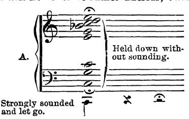

Depress, with- out sounding, the notes forming the harmonics of a low note; then ask some- one to sound that "fundamental" strongly, and to let go its key at once. All the harmonically related strings (as under, vide A) willl then be distinctly heard. The B flat willl however be rather unclear, owing to the harmonic 7th A. Held down with. out sounding. Strongly sounded and let go. being flatter than the "equal temperament" 7th; the higher harmonics are also fainter. Again, instead of this, hold down without sounding, the lowest of these notes the C. On then sounding any of the upper-partials strongly, and at once letting go their keys, we shall find that this low string is then sounding
-not as its own proper note, but as one, or more, of these upper-partials. This can be proved by letting its key rise, when they at once cease. The whole chord formed by these harmonics can thus be heard issuing from the single string. Each string, therefore, which can give the note sounded as a harmonic, and all the strings which are themselves harmonics of that note, sound in sympa- thy with it and thus re-enforce it when the pedal is down. (Vide Note to § 3, Chapter X.) To render this clear, we should remember that the fingers must in Le- gato keep the damper of each note away from its strings, until the moment

58 KEY-TREATMENT; INSTRUMENTAL ASPECT. To sum up Pedal-action in Legato:-The Pedal must as- cend as the next key or group of keys is descending, and this ascent must be so timed that the dampers reach the strings at the very moment that the next sound commences; or they must do so slightly later, if Legatissimo is required.
§ 9. A" Sostenente " Pedal is added to a few instruments, and forms a supplementary Damper-Pedal. This is so contrived, that its depression, immediately after the depression of any key or keys (as in the act of ordinary correct pedalling), willl prevent these implicated dampers alone from falling upon their strings until this pedal is again released. It thus en- ables us to sustain individual sounds by means of the foot.¹
§ 10. SIXTHLY: There is the pedal operated by the left foot- the "soft pedal." Several distinct devices have been adopted by different makers in connection with this pedal. None but the true Una Corda pedal should however be encouraged, since that is the effect intended in the works of BEETHOVEN, CHOPIN, SCHUMANN, and others of the great Pianoforte Masters
-an amply sufficient reason.2 The danger of the una corda being ousted from the Hori- zontal Grand is happily now past; but it appears to have be- come quite customary to omit it from the Upright, and this is greatly to be deplored. This una-corda device-the "mit Verschiebung" of the Germans-shifts the whole of the instrument's "action" a when the succeeding sound commences-or even beyond that moment. The consequence of depressing the pedal simultaneously with the keys would be, that the dampers of the preceding notes would not reach their strings at all, thus causing an ugly cacophonous effect-" smudging,” in fact. The contrivance consists either of a string placed across the whole length of the damper-wires, or of a complete set of little levers, which, when pushed forward by that pedal, form a stop and engage with any damper-wires that happen to be raised past this device, thus preventing their return when the at- tached keys are allowed to rise. 2 To deprive the instrument of this beautiful effect for the sake of conven- ience and cheapness in manufacture, or from faddist ideas as to its being "in- jurious to the instrument," is in fact a piece of sheer commercialism and van- dalism. Granted that the relentless use of the u. c.-its continuous use, and under a rough imperfectly trained touch, willl tend to throw out the unisons, and may under severe treatment even tend to twist the hammer-shanks; never- theless this forms no indictment against the u. c., for an appliance can only be designed for use, not for mis-use !

THE INSTRUMENT. 59 little to one side. Consequently, in the older instruments (which possessed but two strings to each note) one string only was reached by each hammer, whence the term. In modern instruments the hammers are only shifted to the extent of missing one of their three strings. The adjustment should be so arranged that the less-used, softer, and un-cut surface of the hammer reaches the remain- ing strings. Thence partially arises that peculiar, softer tinge of tone-quality obtainable from this device. The main cause of the difference however is: that with the shifted action, we have one string excited sympathetically-entirely without per- cussion, the hammer reaching only the other two strings; this gives a mellowness to the sound that is quite unattainable by any other means; not even by the most perfectly "sym- pathetic" key-treatment or "touch."
§ 11. The substitutes for the true una corda are of two kinds :-
--- The first consists of a strip of felt, which is made to inter- vene between the hammer and the strings when the pedal is depressed. It is an execrable contrivance, the effect of which reminds one of a dog with his head in a sack.¹ The other device is a less objectionable one, inasmuch as it is at all events not evil-sounding. Here the depression of the pedal brings the whole of the hammer-heads closer to the strings. As this lessens the distance the hammer-heads can travel, this reduces the leverage the mechanism offers under ordinary circumstances; whence it follows that the same degree of energy delivered to our end of the key willl nevertheless create less speed at the hammer-end, and hence less tone. Such power-cheating device is a quite unnec- essary appendage to the instrument, since the very softest sound is quite easily attainable, once the true principles of muscularly producing it are understood; for absolute pp is then found to be at once the simplest, easiest, and most secure of all touch-kinds. The term "celeste " pedal has been applied to this contrivance by some of its makers, possibly on the ground of its singular inappropriateness; or is it that its effect of "distance" is supposed to be suggestive of Heaven?

60 KEY-TREATMENT; INSTRUMENTAL ASPECT.
§ 12. The acquisition of good Tone-production is materially facilitated by the possession of a good instrument; for the better the instrument, the stronger is the prompting towards variety in tone, and the more perceptible are the aural differ- ences that result from good or bad production. Some hints on the choice of an instrument are therefore given in the Ap- pendix to this Part, Note VII.
§ 13. Reference should now be made to Fig. 1, forming a Diagram of the "action"; as the various points can here be studied. Opportunity offering, the student should however not fail to investigate an actual "key"-preferably that of a Grand. This opportunity offers itself in the detached "action" exhibited by most of the makers in their showrooms. RECAPITULATORY 1) The outer case of the instrument contains two distinct portions; the Instrument-proper, and the Implement by which to excite it into sound. 2) The instrument-proper consists of: a), the Sounding- board, and b), the Strings, with the wooden or iron Frame to take their tension. 3) The exciting-implement consists of the "Action" : Mechanism. or 4) This Action, or Mechanism, comprises the Key and all its appurtenances; these include:-
-
a): A Leverage-system, see-saw like, designed to facilitate the attainment of a high degree of velocity at the Hammer-end, and thus to communicate Energy to the String in the Form of Motion.
b): The Escapement, a device to enable the hammer to re- bound with and from the string, while the key remains de- pressed.
c): A supplementary device, to enable Repetition to be easily effected.
d): A "check," to catch the hammer on its rebound from the

THE INSTRUMENT. 61 string, so as to prevent its re-striking the string by a further rebound. 5) The "action" has the following accessories:- aa): The Damper, to stop the string's vibrations when the key is allowed to rise. bb): The damper Pedal, to raise the whole of the dampers off the strings, and thus leave them free to vibrate. cc): The soft pedal, the UNA CORDA pedal.

62 KEY-TREATMENT; INSTRUMENTAL ASPECT. evaly plate aa roker bb

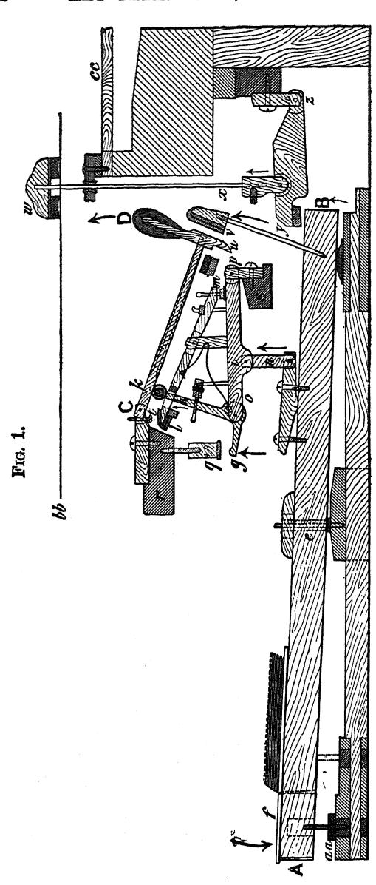

FIG. 1. hammer CC DESCRIPTION OF FIG. 1.-The above Diagram forms an illustration of the best type of present-day "Grand-action ; it is a type now adopted as to its principles by all the great makers, although each has slight modifications as to details. It is from a tracing for which I am indebted to the great kindness of Messrs. C. BECHSTEIN. We, as Pianists, should regard the whole of the mechanism from A to D, inclusive, as "KEY." The Piano-mechanic however often technically applies this term merely to the wooden rocker A-B. This rocker is pivoted at e and carries a finger-plate of ivory or ebony at f. C-D is the "hammer" pivoted at C; it has a leather-covered "roller" attached to its underside at k. r and s are immovable planks reaching across the full width of the key-board. The compound ESCAPEMENT is formed by the two straight levers p-o, and l-m, and by the bent

THE INSTRUMENT. 63 lever or L-crank g-h (termed the "hopper ") in conjunction with the before-mentioned "roller tached to the hammer, and the adjustable set-off screws q and t. The operation of the escapement is as follows:-
> at- So long as the key remains unmoved, the Hammer rests, supported through its Roller k, upon the end h of the hopper: this latter being for this purpose passed through an aperture in the lever l-m, the "es- capement-lever." When the key is depressed, the whole of the levers concerned in the escapement are raised through the Upright n, and through them, the hopper-supported hammer. Both the end C of the hammer, and the point p of the lever o-p however remain stationary, owing to their being pivoted to the planks r and s. To prevent the hammer, on reaching the string, from "blocking" against it, the set-off nut q is so ad- justed as to cause the hopper to tilt its g-end against this nut at the right moment. As the levers continue to rise while g is arrested by q, it follows that h slides from under the Hammer-roller, and as the rise of l has also been meanwhile arrested by the screw t, the hammer is thus left free to fall back. It cannot however, fall far away from the string, so long as the key is kept fully depressed, owing to its now resting on the lever l-m. It is the latter lever that willl enable us now to repeat the note without a full ascent of the finger-end of the key being previously required. For if the key is allowed to rise even slightly, then h willl at once slightly descend, as willl also the m end of the escapement-lever l-m; but as 7 is under a slight pressure from the spring underneath, it continues for awhile pressing upward against its screw t and thus holds the hammer still raised, though not in actual contact with the string. Meanwhile, a moment willl however soon be reached, when the Hopper (actuated by the same spring that also gives life to the escapement-lever) willl again be able to slip into position under the hammer-roller. We shall thus be able to repeat the note at willl. The neat way in which the escapement-lever (l—m) thus as it were lifts and replaces the hammer upon the top of the hopper is a real marvel of mechanical ingenuity. v is the Check; the u end of the hammer is caught by this on its recoil from the string. w is the damper, lying on its string; and y-z is a little crank by which this is lifted through its wire x by the end of the rocker A B when the key is depressed. At aa we also see the felt pads that prevent the key being taken down too far-the "key-beds" as they are here termed. bb represents the position of the string. cc, the edge of the sounding-board. The arrows indicate the direction of the movements resulting from key-depression.

64 INSTRUMENTAL ASPECT OF TONE-PRODUCTION.

### CHAPTER IX. ON SOUND

§ 1. If we would possess the power of obtaining at willl every possible kind of sound from the instrument, we must first realise what the instrument itself requires from us for each tone-shading. To form any clear ideas on this subject, it is essential that we should acquire at least a slight-elementary—understand- ing of:
a) The nature of the phenomena of Sound itself. :
b): The nature of the String's activity during sound-ex- citation.
c) The nature of the various kinds of treatment the Key demands, by means of which we are able to induce the desired kinds of string-movement.
d): The nature of the mechanical laws governing the appli- cation of energy to our end of the key. We willl now glance at these points in due succession, since this willl help us to understand Key-treatment "from its in- strumental aspect." 1 On Sound.
§ 2. Oscillations, in the sense of areas of alternate com- pression and rarefaction, travelling through the atmosphere, are, when they reach the Ear, transformed into Nerve-vibra- tions by that organ of sense. Such nerve-vibrations, are once We shall then further have to learn to understand Key-treatment from its "Muscular Aspect"; to learn what is required of our muscles, and to learn to provide these requisite muscular actions and inactions.

ON SOUND. 65 more transformed on reaching the living Brain, there giving rise to the sensation or consciousness of Sound.¹
§ 3. The repetition of such concussions of the air, percep- tible through the ear, remain distinguishable as separate shocks or ear-impressions, provided they do not recur oftener than about sixteen times per second. Beyond that limit- 16 per second,2 these separate impressions merge into each other; and we can then perceive but a continuous sensation through the ear, analogous to that produced upon the eye, when a point of light is moved in front of it with sufficient rapidity. For in this case also, the image ceases to remain recognisable as a point-of light, and becomes instead a continuous eye-impression-a streak of light; of which the pyrotechnic device, the "catherine - wheel," is a familiar illustration.
§ 4. Such continuous ear-impressions may either be built up of a regular, or of an irregular sequence of concussions: Sound caused by an irregular sequence, is apprehended as noise; whereas Sound caused by a regular sequence, is appre- hended as a musical note, i.e.: A continuous ear-impression, caused by an irregular set of repetitions forms but a noise; whereas, we shall experience a musical-sound-or note, when the component concussions of such continuous ear-impres- sion are regular in character; and this, however short such impressions may be as regards actual duration.
§ 5. Sounds even that appear to us as instantaneous aural- impressions, are nevertheless most probably built up of many air-oscillations, regular or irregular. Any apparently instantaneous ear-impression-such as a "9 1 Such recurrences or phases of alternate compression and rarefaction travelling through the air or other suitable medium, are termed "vibrations. It is found that these must however be well marked and definite, if they are to affect our ear; since there is after all a limit to the latter's sensitiveness. A good deal of confusion arises from there being a difference in the no- menclature of vibration-numbers in different countries. In our country, each "vibration " is understood to include a complete cycle of compression and rare- faction, the two together forming but one single attack on our ear; but in France for instance, the two alternate states are both counted, so that a note here said to be of 16 vibrations is there said to consist of 32.

66 INSTRUMENTAL ASPECT OF TONE-PRODUCTION. rap on the table with a pencil, or the click of a ratchet against the teeth of a ratchet-wheel, or a single puff of air ¹-willl more- over, when regularly repeated, fail to remain recognisable as a separate impression beyond a speed of 16 repetitions per second, as already previously pointed out.
§ 6. We have learnt, that the stream of ear-impressions caused by regularly-repeated impacts becomes blurred into a continuous musical-sound, when these impacts reach about the number of 16 per second.2 This sound is the note C, an octave lower than the lowest Pianoforte C, and termed " 32- foot" C in the terminology of the Organist. Any excess in the number of impacts received by the ear beyond 16 per second causes a corresponding rise in Pitch beyond 32-foot C; for the greater the number of the component ear-attacks per second, the higher is the translated note; such rise in acute- ness continuing until the number of repetitions is so high, that a point is reached where our ear willl no longer serve to render us conscious of their existence.³ It is in fact the function of the ear to count the number of impacts received, and discriminating thus the differences in vibration-number, to deliver the result to our consciousness, translated into a mental impression,-that of contrast in Pitch.
§ 7. Understanding that it is the number of vibrations com- 1 The Syren is an example of this class of tone-exciter. Or we can imitate the effect with our lips,-as we in fact do in the case of the Brass instruments, where the lips are helped by the mouthpiece to become vibrating reeds. (Vide Note VIII., Appendix to Part II.-"On Tone-exciters.") To be more accurate: when the regularly-repeated impressions on our consciousness reach that number. 3 Sound altogether vanishes from our ken when the impacts reach a speed of about 4,500 per second. This is because our organ of hearing is not adapted to receive nerve-excitations at a quicker rate than that. We do nev- ertheless possess nerve-ends differently armed or equipped, by means of which we are able to distinguish vibration-rates far quicker than those of Sound, even at their speediest. There are those different and far quicker vibrations, for instance, that form the physical reality of Light and Heat. Furthermore, there are forms of vibration, such as Electricity, for the perception of which we are entirely unprovided with any organs, and have therefore to rely on the artificial organs of the laboratory. Those inclined to be interested in this sub- ject should refer to a delightfully vivid lecture on "The Senses" by Professor Croome Robertson, to be found amongst the popular "Manchester Science Lectures"-Fifth Series (John Haywood).

ON SOUND. 67 pleted per second that determines the Pitch of a note, we have further to realise that it is upon the Intensity of these vibra- tions, that depends its Loudness, i.e.: The zones of alternate compression and rarefaction reaching a given spot in a given time, may be of small or of great intensity-may be small or great disturbances, and the impacts received by our ear from these may therefore be of little or of great violence; it is this distinction that causes the difference in sensation between loudness and softness,-that causes the difference in Tone- amount.
§ 8. But there is yet one other difference to be accounted for, and that is the difference in the character of the sound,
-the difference in quality, “timbre," or "clang-tint." To realise the nature of this difference, we must under- stand that the waves of alternate compression and rarefaction that reach our ears, are nearly all compound; excepting such almost "pure" sounds as those of the Tuning-fork, and the Open-Diapason" of the Organ, which are almost character- less in consequence of such freedom from Harmonics. 66 That is: The series of evenly-timed impacts upon our ear-drum, that forms a musical-note, may be accompanied by other series of fainter and quicker-timed impacts; these latter (technically termed harmonics or upper-partials) form mathematical time- divisions of the principal set of impacts. It is the presence of such harmonics-various in their combination and relative strength-that gives the particular character, or Quality, to each sound.¹ This fact it is that enables us to distin- guish between one instrument and another, between Flute and The aspect of the waves we perceive on the surface of the sea, can give us some insight into the nature of Compound Sound-Waves. We find, that the long sweeping waves are ornamented with countless small wavelets. Both pursue their course, while the main wave nevertheless remains the funda mental fact. In this sense the analogy is a good one, but we must remember, that we do not have to deal with a surface-wave, in the case of sound vibrations, but have to deal with a transmission of energy in all directions from a centre-in a series of ever-widening spheres of compression-points with intervening spheres of rarefaction.

68 INSTRUMENTAL ASPECT OF TONE-PRODUCTION. Clarionet, Trumpet and Oboe, Violoncello and the Human- voice; and allows us even to distinguish one voice from another; indeed enables us to recognise even one Pianist from another, owing to divergences in habits of Key-attack. The production of different qualities of sound from the same instrument, also forms one of the most powerful means of expression at our disposal. RECAPITULATORY
a): A musical-sound (or note) consists of a series of concus- sions, equally timed and of equal strength, recurring at a suf- ficiently great speed to render it impossible for us to recognise the separate impacts delivered upon our ear, which consequently blurs them into a continuous sense-effect.
b): Pitch, is the term used to designate the difference between a high and a low speed in the repetitions of the ear-impacts,— forming the difference between a high and low sound.
c): The pitch of a note depends solely upon the frequency with which the air is disturbed or beaten in a given time.
d): The Amount of Tone depends on the Intensity of such dis- turbance.
e): Most notes are built up of a fundamental strong series of ear-impacts, accompanied by divers quicker and weaker impacts, termed Harmonics.
f): Divergence in the Character, Timbre, or Quality of the tone, arises from the difference in the combination and strength of the harmonics heard with the fundamental sound.

THE STRING.

### CHAPTER X. THE STRING: ITS BEHAVIOUR DURING THE VARIOUS FORMS OF TONE-PRODUCTION

§ 1. In the sound emitted by the Pianoforte, the requisite air-concussions are induced, by setting a String in Motion. The two ends of the string are fixed points; the string can however be driven aside from its position of repose (in a di- rection at right angles to its length) owing to its elasticity. If it is thus driven aside, this same property of elasticity willl then cause the string to rebound, provided it is left free to do so, and it willl then continue in vibration (i.e., to-and-fro oscillation) until the energy communicated to it during its first deflection is exhausted; unless such gradual dissipa- tion of the original impetus is prematurely arrested by the mechanical means provided by the descent upon it of the Damper.¹
§ 2. The Length, Tension, and Thickness of the String de- termines how quickly it shall complete its vibration-to-and- fro. It is upon the frequency of the completion of such vibrations that depends the aural effect of Pitch; for the greater the number of complete vibrations per second, the The string, in thus beating or whipping the air, does not exactly strike it. The attack delivered upon the air by the string is rather in the nature of a compression in one direction, while it leaves a rarefaction in the other. The particles of air in immediate contact with the string, cannot cease to exist in front of the latter's swift advance, hence they are, as it were, heaped or crushed upon each other,—thus causing a momentary area of compression. Owing to the extreme elasticity of the medium, this wave of compression is passed on from particle to particle, and is followed by its natural consequence
-a rebound. We must not imagine that a current is produced in the air; it is simply the vibration that is transmitted, much in the same way that ever- widening circles arise on the surface of a sheet of water, disturbed by the fall- ing of a stone into it. The air waves are however transmitted not in circlets, but in ever widening spheres-of alternate compression and rarefaction. (Vide Note to 8 of last chapter.)

70 KEY-TREATMENT; INSTRUMENTAL ASPECT. more acute the sound; and the fewer the vibrations the lower is it.¹ It is here imperative not to confuse speed in the reiteration of these completed side-to-side movements, with the actual speed at which the substance of the string is travelling through the atmos- phere. The two are quite distinct phenomena. (Vide § 8.)
§ 3. As the slender String presents so small a surface for contact with the air, and is therefore unable to create a suf- ficiently considerable atmospheric disturbance to be conven- iently appreciated by the ear, it is found desirable to bring the SOUNDING-BOARD into requisition. The large sensitive surface of the sounding-board is in secure contact with the strings of the Pianoforte through the intervening bridges; and the sounding-board is thus com- pelled to vibrate in sympathy with the strings; and as a large area of vibrating material is here presented to the air, a far larger volume of air is in this way set in motion than could be ¹ As the vibrations of a String are mostly too minute and rapid to be dis- cernible by the eye-excepting those of the lowest Bass strings, we may better learn to understand the phenomena of Vibration, by studying other forms of it. The oscillation of a Pendulum offers us such opportunity; so does a person sitting in a swing. A bunch of keys, suspended at the end of its chain, also forms an admirable illustration; and one moreover that is always conveniently available. Now we shall find, on experimenting with one of these, that the to-and-fro swings of such pendulum remain the same as regards the number completed in a given time, so long as we leave the length of the pendulum unaltered that the oscillations willl complete themselves more rapidly if we shorten it; and that they willl take longer to do so if we lengthen it; and this, while the actual speed of the mass through the air remains unaltered; always excepting, that the originally given impetus willl by degrees exhaust itself. We shall moreover find, that we shall obtain twice the number of complete vibrations if we quarter the length of the pendulum; and that it willl take the pendulum twice as long to complete its recurring journeys, if we give quarter the length of pendulum. Somewhat the same thing applies to the Pianoforte string. For we shall find that if we touch it gently, midway between its two ends, whilst it is sounding, that its division into two halves in this way willl cause the two segments to continue in vibration, each on its own account; and as the two halves willl now complete their vibrations in exactly half the time of that of the whole string, we shall now hear the sound an octave higher. This experiment willl at once give us a practical insight into the nature of “ 'harmonics." We can continue the experiment; and by successively touching the vibrating string at a third of its total length, or at a quarter, eighth, or sixteenth, etc., of its length, we shall obtain its higher harmonics-the twelfth, the double-octave, the third above that, etc. (Vide Note to § 8, Chapter VIII.)

THE STRING. 71 accomplished by the unaided string. The larger volume of air thus disturbed gives us a correspondingly magnified sen- sation of sound.
§ 4. In the Pianoforte, the String is set in motion by the hammer. This is effected in the following manner: The hammer, moving swiftly and with great momentum, on reaching the string, carries this with it-a short distance out of its plane when at rest.¹ The extent of the deflection, thus caused, depends upon the degree of speed and momentum with which the hammer is moving. Such deflection of the string by the hammer seems infinitesimal to the eye; yet the short distance thus covered by the two in conjunction, amply suffices to enable the hammer to SHARE ITS SPEED AND MOMENTUM WITH THE STRING. The string, having thus been driven out of repose, rebounds, owing to the elasticity of its substance, takes the hammer back with it, and thus helps the latter to rebound and to catch against the "check " ready to receive it. The string meanwhile continues its journey to-and-fro, owing to the momentum it has acquired from the hammer during their shortlived connection; and this momentum is gradually exhausted, unless arrested by the damper's descent.
§ 5. The fact particularly to be noticed in this connection, is, that the act of tone-excitation at the Pianoforte must neces- sarily be fully completed within the course of but one single "vibration" of the string. Indeed the time available is even more limited than that, since it is only while the string is be- ing driven outwards from its position of rest, that the hammer can communicate its speed and momentum to the string; and it is therefore only during one quarter of one complete to-and- fro oscillation of the string, that we have the opportunity of conveying Energy in the form of Motion to it. This forms but a very rough-and-ready description of the known facts; but it suffices to enforce the point which it is imperative we should realise, viz. that tone production can only be attained by communicating Motion to the string. (Vide §§ 7 and 8.). This being the vital point that concerns us as Pianists, it is deemed inad. visable to give here a more minute description of the manner in which the string starts on its journey. Further detail would lead rather to confusion than to clearness, until this main fact is grasped.

72 KEY-TREATMENT; INSTRUMENTAL ASPECT. This is the fact that in the first instance determines the treatment we have to mete out to the string through the Pianoforte mechanism. We must therefore vividly and con- stantly bear in mind, that since we cannot influence the string beyond the moment of its first swing outwards, it follows, that we cannot influence it beyond the moment when sound breaks silence,-unless we repeat the act of tone-production.
§ 6. We are here brought face to face with the truth so often lost sight of in playing and teaching; viz., that the act of tone-production at the Pianoforte is not only a DISCONTINUOUS act, separate for each note, but that it is one of exceedingly short duration; of no greater duration in fact than it is per- ceived to be in the sharpest Staccatissimo.¹ Indeed, we shall presently find (Chapter XV., etc., Part III.) that here the Ear itself is apt to mislead one thoroughly at the Pianoforte, since the continuous aural effect of Tenuto or Legato may easily prompt us to a continuous muscular act in the place of the proper one,-one that is individually directed for each key-descent and carefully ceased on reaching sound,—ex- cepting always that slight residue of weight, which we shall find is necessary when we wish to retain the keys depressed in tenuto and legato.2
§ 7. Coming now to the problem of Tone-Amount, we find that the degree of comparative Loudness of a note directly ¹ We shall presently realise that there is a single exception to this rule, for we shall find that when the key is weighed into sound at its softest, that this act of weighing may in this case be continued beyond the moment of tone- emission; the result forming the true pp-Tenuto. (Vide next chapter, also Part III.) 2 It may here prove useful to compare this form of String-excitation to that employed in the Violin family -The Pianoforte hammer can give but one single impulse to its string; whereas, the Violin-bow imparts a continuous series of impulses to its string. The action here is, that the Bow carries the string along with it, some little distance out of the latter's position in repose. The greater the weight brought to bear upon the string through the bow, the greater willl be the frictional contact between the two, and the more willl the string consequently be carried out of its place, before the frictional union between the two is overcome by the tension thus caused in the string. The string flies back, owing to its elasticity, the moment this tension becomes too great; the impetus thus gained, then carries it beyond its natural point of rest, when it again falls an easy prey to the continuously moving bow, which then again automatically grips hold of it, and once more wrenches it along.

THE STRING. 73 depends upon the "amplitude" of each vibration of the string. That is the louder the sound required, the further apart must be the extreme points to which the string swings, when beating the air in conjunction with the Sounding-board.¹ For we have learnt, in the preceding chapter, that it is upon the degree of the air-disturbance (of alternate com- pression and rarefaction) that depends the loudness of the note.
§ 8. Now, as each particular string is compelled always to complete each of its vibrations in the same period of time, no matter how great or small the amplitude of such vibration a b

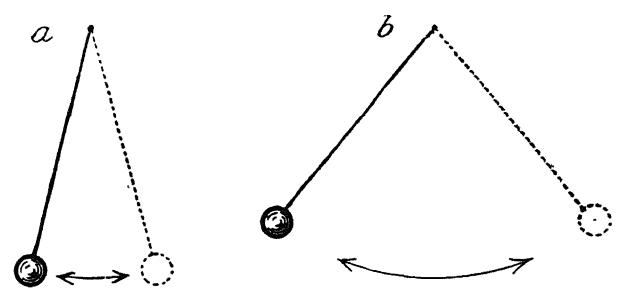

FIG. 2.-Comparison of large with small oscillations of a pendulum; both taking same space of Time for their completion. may be; it follows, that to enable the substance of the string to cover the greater space traversed for a louder note, it must here be made to move at a greater Speed. Fig. 2 willl make this clearer; for it willl be seen, that the greater the space traversed by the same pendulum in the same time, the more swiftly must it move to complete its journeys.
§ 9. We learn herefrom a fact of the utmost importance, and that is, that Tone-quantity is strictly determined by the String's Speed :—that the amount of Tone therefore depends 1 This increase in the amplitude of the string's vibration for each increase in tone-amount, can even be observed by the eye, in the case of the low Bass- strings.

74 KEY-TREATMENT; INSTRUMENTAL ASPECT. solely upon the degree of speed which we can manage to com- municate to the string.¹
§ 10. Coming now to the question, what it is in the nature of the String's behaviour that gives rise to the aural effect of difference in the Quality of the sound,-difference in timbre or Clang-tint, we find that the facts so far understood on this point, indicate, that the difference is of the same nat- ure as that difference which we Pianists find it necessary to make in our treatment of the Key, to induce those tone effects.2
§ 11. It is found that the difference in the string's behaviour that gives us differences of tone-quality depends on the manner in which the string is started upon its journey; and it is evident, that the difference between the production of the harsher, "Brilliant" tone-qualities, and the more pleasant "Sympathetic" qualities, lies in a greater or lesser percussive- ness; for the string is in the first case set a-going with abrupt- ness, suddenness and absolute Percussion, whereas in the sec- ond case, speed is imparted to it, with a far more gradual application of the total Energy employed. It is found that a too sudden application of energy tends to cause the string to move off rather into segmental vibration, 1 To enforce this point, we should always recur to the simile of the Swing, or Key-chain. (Vide Note to § 3 of this chapter, page 70.) For we shall find on repeating this experiment, that the number of completed oscillations in any given time remains practically the same, whether we complete the swings in great sweeps, or in small ones. Whence we deduce the fact, that far more ground must be covered in the same space of time when the swings are 66 ample " than when they are small in extent. It is also manifest that the person, String, or bunch of keys thus swinging, must travel at greatly increased speed to enable this greater distance to be covered in the same space of time during each swing; and finally it is evident, that in this case a more effective "shove-off" must have been delivered ;-unless the requisite speed is added during successive swings by muscular exertion, as can be done in the case of the Violin-string, or in that of a person on a swing,-but which remains im- possible in the case of Pianoforte Tone-production. 66 2 We shall find in the next chapter, that the more suddenly the key-depression is effected, the more harsh (" brilliant") and "short" willl be the resulting sound-quality; and that the more gradually the key-depression is effected, the more sympathetic," singing, and carrying willl the sound be;-Part III. willl further show us how these differences in Key-treatment result from the selection of the particular muscular conditions proper for each difference.

THE STRING. 75 than into those complete vibrations--of its whole length--that enforce the fundamental sound.¹ The more these segmental vibrations (or harmonics) pre- ponderate, especially the higher and harsher ones, the worse is the sound in every respect; it is less beautiful, and less full, and it is less able to travel or "carry." 3 2 66 ¹ Helmholtz has pointed out that a soft hammer coming into contact with the string "lies longer" on it than a harder hammer; i.e., the soft hammer does not instantly bound off, but the momentum with which it is moving drives its soft armature accumulatively against the string before the rebound arises. The Piano-makers sometimes make evil use of this knowledge-which they have acquired through practical experience. They supply hammers so soft that a harsh tone almost becomes impossible of attainment on instruments thus provided. Such heavy felting of the hammers, or toning" of them, although it does in a measure prevent the instrument from sounding unpleasant, even under the hands of the worst player, and although this may enhance its commercial value with some patrons, nevertheless renders it com- paratively inefficient as an instrument for the production of Variety of tone. It cannot therefore so well reflect the moods of the player through the " ouring" agency, and such instrument should therefore be shunned equally by Artist and Student. 66 2 Vide § 8, Chapter IX., page 67. 'col- 66
- Helmholtz, in his "The sensations of tone, as a physiological basis for the theory of music," maintains, that the difference in quality is caused by the difference between a mere KNOCK and a "SHOVE-OFF " of the string by the Hammer ;- circumstances that certainly do apply at our end of the Key. He says: 'In "Pianoforte playing the effect of the tone-excitation by means of the hammer "depends on the length of time the latter remains lying on the string. For if "the soft elastic surface of the hammer is brought against the string without "audible blow, then the movement has time to propagate itself before the hammer springs back, and increases gradually and constantly during the "time of contact ;"-i.e.: during one quarter of one complete string-vibration. This indeed seems to form the true explanation of the Phenomenon. DEN attack of the string no doubt tends to produce but a concussion at the string's surface, causing it as it were, to "wriggle off " into movement; hence a poor sound, harsh with harmonics, which although noisy in close proximity, exhibits but small carrying power. GRADUAL attack of the string tends, on the contrary, to give it a really far greater momentum, the resulting vibrations par- taking rather of the simple (fundamental) type than of the compound (har- monic) type; we consequently here obtain a large volume of pure, rich sound, that carries well, even at its softest. SUD- The example of the Swing, or bunch of keys on their chain, may here again help us to a better appreciation of the facts: If we desire to give a per- son seated in a swing a good "shove-off," it is useless to endeavour to do so by means of a sudden jerk or knock; we should on the contrary thus risk up- setting his balance on the seat ! The only (and familiar) way to secure an effective result, is, to apply force gradually by allowing our hand gently to come into contact with the person-without concussion therefore, and realis- ing the degree of the resistance to be overcome, we increase the energy of the push given, as the speed is felt to increase by virtue of it. : We shall also find, when the treatment of the key comes to be considered,

76 KEY-TREATMENT; INSTRUMENTAL ASPECT. RECAPITULATORY
a): At the Pianoforte, the requisite concussions that form sound are communicated to the atmosphere by means of to-and- fro motions (vibrations) of the String, enhanced by the Sounding- board.
b). The greater the number of such vibrations completed by the String per second, the higher (more acute in Pitch) is the re- sulting note.
c): The greater the extent of these String vibrations, the louder is the note.
d) The string must therefore traverse space more quickly the louder the note; since the time available (in which to traverse the larger distance embraced by the more ample vibration) re- mains the same as for a softer note.
e): To produce much tone, we must therefore induce much movement in the string. For the more quickly the string is made to move, the greater willl be the distance it can traverse during the course of each complete vibration. that we here have a very suggestive analogy, as to how we should use the key for Sympathetic tone. Another experiment forms a good demonstration in this connection :-One end of a long rope being fixed, take hold of the other end, and give it a violent jerk. The rope willl here be seen to "wriggle" into little curves. In- stead of this jerk, now give a carefully "aimed," gradual swing to the rope, and one may succeed in causing it by such means to swing in but one single curve, with hardly any subsidiary ones. A point that however still requires elucidation, is, the exact manner n which the hammer-end is able to transmit to the string the KNOWN differences in key-treatment that do cause the known differences in the string's vibra- tions-whence arise those differences in Quality, perceptible by the ear. As this subsidiary part of the problem still awaits final solution, we can here only rely on hypothesis and surmise, instead of upon fully ascertained facts. This point, although extremely interesting, is however of but small mo- ment here, where we are not concerned in completing the acoustical expla nation of the effects we hear, but are concerned with the way in which these effects are to be obtained from our end of the Key. On this latter point there is happily no question of "hypothesis," since the facts are all proven, -as are also the muscular-ones by means of which we are able to fulfil such laws of key-treatment. Those interested in this detail willl find some remarks bearing on it on re- ferring to the Appendix of this Part, Note No. IX., “On Quality.”

THE STRING. 77
f): The string is set into motion by the felt-covered end of the Pianoforte mechanism-the hammer.
g): The hammer, upon being brought into contact with the string, shares its speed with the latter whilst deflecting it. Both thereupon rebound; and the hammer, falling away from the string, leaves the latter free to continue in vibration, gradually expending the energy communicated to it, unless stopped by the Damper.
h): The hammer can therefore only communicate movement to the string during the latter's first vibration; and can only do so, during the first quarter of such first to-and-fro movement of the string.
i): As the hammer ceases to influence the string the very mo- ment that Sound begins, it follows, that this moment forms the conclusion and cessation of the Act of Tone-production; for the string cannot move quicker than it does at that moment, since it has ceased to be under the influence either of Key or Finger.
j): Tone-production at the Pianoforte is therefore a discontin- uous Act; an act separate for each note; and one that ceases with the moment when Silence changes into Sound.
k): Beauty in the Quality of a sound, depends on the string's vibrations tending rather toward the simple types of movement than toward the compound forms;-the resulting tone is thus less embarrassed with the harsher harmonics. 7). This simplicity in the string's vibration that furthers beauty of tone (vibration of the string rather as a whole than in sections) depends on the manner in which movement is communi- cated to it.
m): The harsher effects arise, when the string is suddenly set in motion; whereas the more sympathetic effects arise only when the string is set in motion as gradually as possible.

78 KEY-TREATMENT; INSTRUMENTAL ASPECT.

### CHAPTER XI. THE KEY—THE STRING-MOVING IMPLEMENT, ITS BEHAVIOUR AND REQUIREMENTS DURING TTHE ACT OF TONE-PRODUCTION

§ 1. The manner of attacking and using the Pianoforte-key is necessarily determined by the requirements of the String. The Key's requirements have therefore been fore- shadowed, and have in fact already been clearly indicated in the last chapter.
§ 2. Our unaided finger would find it impossible to propel the string into adequate speed;—a convenient implement, tool or machine is therefore offered us for this purpose in the shape of the Pianoforte Key. This Key, with its attached Mechanism or Action, is indi- vidually complete and separate for each note.
§ 3. It is important that the term "key" should here convey more to the mind than is suggested by the mere sight of its Ivory or Ebony-clad ends. By "Key" we must understand: the whole lever with its attached contriv- ances, from the ivory or ebony end, to the opposite Hammer end.¹
§ 4. Since the main object of this machine is, to enable the finger to communicate more Speed to the string than the finger could without being thus equipped, it follows, that we 'Manifestly, a significance far beyond the usual one is here attached to the term "key: " As ordinarily employed, it is applied to the visible plates that receive the Finger's contact. We find, on the other hand, that a Piano-regulator speaks of removing a key" from the instrument; he applying the term to the long wooden rocker or lever (vide A-B, in both Figs. 1 and 3) to one end of which the finger-plates are attached; and which is quite separate from the rest of the "action" in most instruments. 66 As Pianists, it is however essential that we should regard the whole of the compound-leverage system (from A to D inclusive, Figs. 1 and 3) as Key" or Implement. In this sense therefore is it, that the Key is applied to the String to move it,-just as another kind of key is applied to a lock to un- lock it.

THE KEY. 79 must look upon the Key as a contrivance to help us to translate Energy into Speed. The energy requisite for this purpose is derived from Weight, and from direct Muscular-exertion brought to bear. upon the key.¹
§ 5. This work of translation is accomplished by the key through the agency of the compound leverage-system it offers us. As we have already learnt (§ 3, Chapter VIII.), the depres- sion of our end of the key-lever to its fullest extent of about inch, causes the opposite end (with its felt-covered hammer) to rise some two inches. Now it is obvious that the hammer-end must travel at far greater speed than does our finger-tip in contact with the key, since the hammer traverses so much greater a distance than does our end of the key. (Vide Fig. 3.2) f C P2 p3 B 1 E

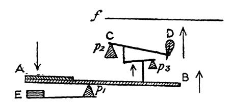

FIG. 3.-Diagrammatic representation of the principle of the compound-leverage involved, with omission of all details of the mechanism. A-B wooden rocker, with finger plate at A. C-D hammer. ƒ string. E key- pad. p1, p2, p3, are immovable centres or pivots. It is well therefore to regard the key as a mechanical coN- TINUATION OF OUR FINGER, to enable us more easily to induce String-speed.
§ 6. To induce movement in the key-end presented to us, we must bring greater Weight or Power into opposition with it, than it itself represents, when in a state of rest.³ 1 This part of the problem is dealt with in Part III. 2 We must however understand, that what we gain in speed in this way, has to be supplied as extra Energy at our end of the key. The key being a kind of See-Saw, upon the opposite end of which is the object that has to be speeded-into sound. 3 By "weight" of key, we must here understand not only its actual weight, but also the friction of the attached mechanism,-in fact the inertia of the whole mass.

80 KEY-TREATMENT; INSTRUMENTAL ASPECT. Such weight-opposition can only become translated into Key-speed-and string-speed-and Tone, provided its full ap- plication is consummated before the key's descent culminates in Tone.
§ 7. The key therefore ceases to induce string-speed the moment the beginning of Sound is heard; for the key-lever as it were falls in twain at that moment; i.e. the hammer at that moment slips off the hopper, rendering it impossible for us further to influence the string through its agency, unless we first allow the key slightly to rise, and thus regain control over the hammer. (Vide Chapter VIII., §§ 3 and 4, and Fig. 1, page 62.) This very potent fact in tone-production must always be kept in view.
§ 8. The action and reaction of Weight, Force, or Energy, in this connection, is, roughly speaking, as follows:
a): We shall obtain no key movement, so long as the weight or energy we apply to the key does not more than equal the resistance which the key itself offers us when in a state of rest.
b): We shall obtain the softest sound possible from the in- strument, if we bring weight or energy upon the key-surface up to the point that the latter's opposition to Movement is just overcome. For the key willl then be exactly outbalanced, and it willl then (and thus only) give way at the most gentle speed compatible with its sounding at all,-giving the effect of absolute pp.
c): To obtain more sound than this real pp, we shall have to apply far greater Weight (or Energy) than this to the key; and the louder the sound required, the greater willl have to be the sum of such application of Power. For increased Power willl be as it were swallowed up, before we can obtain the de- sired increase in Key-speed-and String-speed-and Tone.
d): Whence we also find, vice versa, that the Key resists us with increased effectiveness, with every increase in the speed we endeavour to induce in it; and this in spite of the fact, that the key's actual weight remains the same.
§ 9. A pair of scales may render these points clearer:
a): If we place, say, a pound-weight in each of the pans,

THE KEY. 81 we shall find that they merely balance each other, producing a state of equilibrium ;-no movement willl thence ensue.
b): Whereas, if we gently add weight to one of the pans, as for instance, by pouring sand into it rather sharply, then a moment willl arrive when that pan's inertia willl be just over- come; it willl be overbalanced, and in giving way to this slightly greater weight, it willl sink down and cause the pan at the opposite end of the lever to rise--also quite gently.
c): Again, if instead of thus carefully adding weight only up to the point that the pan willl just give way, we bring a whole extra pound or more to bear upon it, then we shall find that the opposite pan no longer rises gently as in the last ex- periment, but that it now does so with extremely increased swiftness. Here we see indicated, the nature of the diver- gence in Treatment demanded by the key, respectively during the production of pianissimo and fortissimo.
§ 10. In other words:
a): So long as we do not bring Weight or Energy to bear upon the key, beyond the latter's resistance to movement, we may rest on its surface without causing any movement whitso- ever.
b): If however we wish to induce sound, and that of the softest possible amount, then we must add weight or energy to that already resting upon the key at surface-level, until the key is just overbalanced into descent. This we can do with perfect accuracy, provided we watch the resistance the key offers to movement, by means of our muscular sense. It is the muscular-sense (with its co-operatives) that alone can ac- curately apprise us of the particular moment when the key begins to give way, and which can therefore also warn us when to discontinue the addition of weight or Power, if we mean pp.¹ 1 Such estimate of key - resistance can be formed in two ways, for it is formed differently in a slow passage than it is in a quick one: We can derive it in a slow passage from the resistance each individual key can then be felt to offer; in more rapid passages we must depend on the general impression of resistance the whole key-board offers, as our fingers pass across it. Allusion to the duties of the muscular-sense and its co-operatives is here unavoidable, although premature." This matter receives further consider- ation in the next Part. Vide Chapter XIII.)

82 KEY-TREATMENT; INSTRUMENTAL ASPECT.
c): If moreover, we wish to produce a sound louder than this real pp, then manifestly we must add weight or energy upon the key in excess of the amount that we find suffices merely to overcome its inertia--as in pp. In fact, the louder the required sound, the greater must be the Energy we bring to bear upon our end of the key, for the hammer willl then move more swiftly, the string-speed willl be greater, and the sound correspondingly louder.
§ 11. All this plainly teaches us to recognise the Key in its true aspect; viz.: to recognise it as a long lever or machine, intended to enable us to obtain a high velocity by means of its hammer-end. Once recognising this fact, we are inevitably forced to the conclusion, the true one: that any percussion caused at the key-surface forms absolute MIS-USE of the Pianoforte tone-pro- ducing mechanism. The supposition, that Tone-production at the Pianoforte should be attained by any real unmitigated hitting or "strik- ing" at the keys, being thus proved to be a complete fallacy— except in mere appearance, it follows that we are compelled to discard all doctrines of tone-production based on this fallacy; unless beauty of tone, ease and certainty are not worthy of consideration. To harbour such conception of the act of Pianoforte tone-production is almost equally far from the truth, as it would be to suppose a "stroke" at Tennis or Bill- iards to consist of an act of "striking" the racket or cue itself.¹ 'This fallacy has probably arisen, like so many other indefensible dogmas relating to Pianoforte-technique, owing to the initial mistake, that of studying the VISIBLE effects-of the limb-movements, etc., that accompany correct pro- duction-instead of studying the laws involved in the use of the Pianoforte key itself, and the muscular CONDITION of the implicated limbs. The com- paratively swift (AND CORRECT) movements of Finger, Hand and Arm towards the key-surface may indeed easily be mistaken for hitting; but the fact re- mains, that the true artist rarely permits himself really to hit at the keys; on the contrary, he always "follows-up" his keys, however much it may seem to others, and even to himself, like "punching the key-board. "" It should be noted, that the main fact against "key-hitting" is, that CON- CUSSION is thus caused at the key-surface,-between that and the finger-tip. This forms so much waste of Energy; the molecular vibrations of the key and finger-tip, thus caused, replacing to that extent the intended motion of the whole body of the key itself. The further disadvantage is, that accuracy

THE KEY. 83 Meanwhile, we must never lose sight of the all-important fact, that we must apply all the energy intended to produce Tone, before the moment when it becomes too late to do so; else we shall squeeze the key-beds, instead of making tone. That is: we must always remember, that it is too late to make sound when the key has reached its bed, and that the act of tone-production itself is always as short-lived as it is obvi- ously enough proved to be in Staccatissimo, and that we must therefore be constantly on the alert with our Ears, so that the very beginning of Sound-emission may instantly warn us that the opportunity for inducing String-speed by means of the Key is past.¹
§ 12. Coming now to the divergences in key-treatment that determine the differences in Tone-QUALITY, we willl first return once more to our pair of scales, which willl enable us to realise another instructive fact: We shall find that we can make the addition to the load on of expression must needs remain unattainable; since we have in this instance no means of accurately feeling the degree of resistance each key offers, and cannot therefore accurately guide it to its musically-intended consummation in tone-shading. There are other facts besides: The one pointed out above, that the key is a lever by which to move the string, should prove ample to prevent our look- ing upon the key in the light of a ball, etc. Experiment has moreover proved that the hammer instantly flies off the “ action" when the key is really hit- in which case all the elaborate leverage-system provided, by which gradu- ally to induce movement, becomes useless. Again, if the key is driven down over-suddenly by a really forcible blow, it is exceedingly probable, that the hopper" then instantly slips from under the hammer, thus similarly ren- dering futile the carefully planned leverage-system of the key. 66 Vide Note X., Appendix, 66 and a summary on these points. On key-hitting," which gives further details, ¹ Ignorance of this simple law-one would think it to be self-evident enough to occur to a child-often leads to the monstrous fallacy, and to the consequent complaints uttered by Pianists, that it is their supposed "want of Strength" that prevents their obtaining the full measure of intended tone! Those huge exertions we so lamentably often witness, even on the platform, are generally the immediate result of the performer not having so far recog nised this very first and obvious fact connected with his instrument, viz., that Tone-production absolutely ceases when the key-bed has been reached-or even before that; and that all the labour expended on the key-beds is but sheer waste, and is but impedimental to accurate expression. We may rest perfectly assured, when we see a performer labouring at his instrument as if he were lifting oxen, that he has certainly not conquered the mere "Elements" of using the key-board correctly,-has not learned his tech- nical A B C, however admirable his artistic instincts may be in other ways.

84 KEY-TREATMENT; INSTRUMENTAL ASPECT. one pan (vide § 8 and 9) by letting go the intended weight either suddenly, or by letting it slip through our fingers more gradually. We thus have the option of adding a given weight in either of these two ways, before the pan in question reaches its full depression. We can moreover, in either case, employ a weight sufficient to cause even a very swift ascent on the part of the opposite pan. The distinction thus illustrated, is, that we can either sud- denly or gradually induce a great speed in that opposite pan. It is just such a distinction between suddenly or gradually applied force, that willl, in the case of the Pianoforte-key (by inducing the contrast between suddenly or gradually-reached Key-speed) enable us to cause the aural contrast between "Brilliant" and "Sympathetic " tone-qualities.¹
§ 13. The nature of this divergence between the production of "brilliant" and "sympathetic" tone-qualities--the difference between Sudden or Gradual key-attack, or the French "avec attaque" and "sans attaque"-may become plainer through the following considerations and diagrams (vide Fig. 4), illus. trative of the two opposite extremes of this nature in key- treatment: aa ↓ Fig A Fig. B. aa bb bb
FIG. 4.

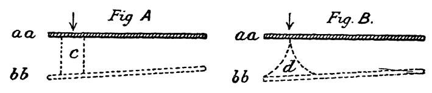

Of the two horizontally converging thick lines in both the above diagrams, the upper one (aa) illustrates the position of our end of the key when at rest-at "surface-level"; the lower In other words: The more suddenly we attack the key, the harder, shorter, and less carrying willl be the resulting tone; and the more gradually we propel the key into full speed, the more sympathetic"-resonant, rich, full and carrying-willl be the tone, and the more controlled willl it be. "" A really hit key cannot for this reason give a beautiful sound; although it may seem to cause much commotion and noise close to the instrument. Refer again to Note X., Appendix, "On key-hitting."

THE KEY. 85 of these lines represents the position of the key's surface when fully depressed. The vertical (dotted) lines in both diagrams are meant to exhibit the degree in the key's motion during descent, respec- tively in brilliant and in sympathetic tone-production. In diagram A, we have Energy applied suddenly-" avec attaque." Here the dotted lines c (supposed to represent the degree of speed) are seen to start at once some distance apart, but they remain only thus far apart to the end of the key's descent; for the key-descent is so sudden that it is prac- tically impossible to attain any increase in speed during it. 66 In diagram B, the key has on the contrary been reached practically without percussion, without suddenness,- sans attaque." The dotted lines d therefore here commence to- gether, and they widen out to represent the Speed-crescendo that can now be induced during descent; for the key is in this case started on its journey almost imperceptibly, but has en- ergy applied to it in increasing ratio during its short-lived de- scent, thus giving that almost unpercussive attack of the string whence arises Beauty of tone and control of gradation.¹
§ 14. We now come to the distinctions between Tenuto, Le- gato, and Staccato. To induce TENUTO, we must continue applying the Weight 'It seems well-nigh incredible that we should thus be able to GRADE the motion of a key (as demanded for sympathetic tone) during the minute inter. val of time expended during key-descent. Many of the muscular-acts of our every-day existence are however found to be equally minutely graded, when we analyse them. It is even possible (although extremely difficult) directly to grade key descent in this requisite manner by an exertion of the Will. This is however happily unnecessary, otherwise our Technique would for ever remain cum. brous and uncertain; for we can, by supplying the requisite MUSCULAR CON- DITIONS, encompass this end in quite a simple and reliable way, and it is thus that the effect of sympathetic-tone is wrought in actuality. By in fact placing the various muscles belonging to the Finger, Hand and Arm in the requisite relationship to each portion of the limb and the key, we are able to apply energy through so elastic a medium, that the desired gradation during key-descent accomplishes itself almost automatically, and with corre sponding certainty. To enable us to provide these requisite muscular-conditions, we must study key-treatment from its Muscular Aspect. This aspect of the study of Touch is dealt with in Part III. and the Parts that follow it.

86 KEY-TREATMENT; INSTRUMENTAL ASPECT. that just proves sufficient to overbalance the key into descent
-into its softest sound,¹ BEYOND THE MOMENT THAT THAT SOUND BEGINS; for it is obvious, that the amount of weight that proves ample to cause the key's deflection, must also suffice to retain it depressed and prevent its rebound, and thus keep its damper raised. Tenuto thus involves: that a light weight, sufficient to de- press the keys, must continue resting on them after the com- pletion of the act of Tone-production.
§ 15. LEGATO is induced in the same manner; the weight that suffices to depress the key, and which, if continued, therefore suffices to keep it depressed willl, if passed-on (or transferred) from key to key, create that merging of one sound into the next, termed Legato. This Transfer of light weight should be effected at the very moment that the next key's descent is desired to com- mence. The descent of the new key is in this way so timed, as to meet the ascent of the previous key about half-way, or thereabouts; the damper of the ascending key willl conse- quently reach its strings at the very moment that the next sound begins; and one sound willl thus be caused neatly to merge into the next, without smudge, and without break in continuity.2 This light weight, thus resting on the key-beds in Legato, and thus transferred from note to note, is contemporaneously continuous with the duration of each musical phrase; it in fact here forms the Act of Phrasing. SUPER-legato, legatissimo, is induced by slightly deferring the transfer of the light weight thus continuously resting on the key-board during each musical phrase, beyond the moment that the next sound commences. The sounds consequent- ly slightly overlap; causing an effect somewhat akin to the glissando of Violin playing, and to the portamento of Singing.
§ 16. To obtain STACCATO, we must cease all weight and 1 Vide §§ 8, 9 and 10.
• Vide remarks on legato pedalling, etc., Chapter VIII., § 8, page 57.

THE KEY. 87 force at the very moment that sound-excitation is completed, excepting that slight amount of weight that the key can bear at its surface-level-the amount the key can bear without de- flection. If we succeed in doing this, the key willl be free to re- bound, and willl do so instantaneously-even carrying up with it, the super-imposed finger.¹ The following experiment should here be made. (Vide Fig. 5.) Take a large lead pencil, the larger the better, and preferably armed with a rubber-end. Hold this vertically between the thumb and index fin- ger, letting its end rest on a key in the centre of the key-board. Now sharply depress the key by means of the pencil; but cease the grip on the pencil accu- rately at the moment that sound begins. .Key If the down-impetus is ceased accurately enough-instantaneously that sound arises, then the key, in recoiling, willl drive the pencil up,

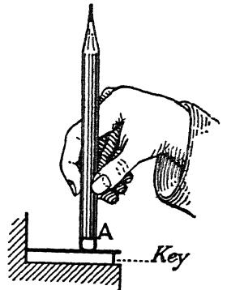

the latter slipping through the fingers ;-the FIG. 5.-A, a pencil, or other result being an absolute staccato. smooth object.
§ 17. No greater Weight or Force than just suffices to pre- vent such rebound of the key in Tenuto and Legato, should therefore ever be allowed to rest on the key-bed. In fact it is unnecessary that more force than this, should ever even reach the key-bed; except in a comparatively rare effect, a forced variety of Staccato, in which the rebound of the key and finger is assisted by delivering a blow to the key-bed, analogous to a jump or "kick-off." 2
§ 18. To sum up this Chapter : We find that the Key is a Speed-tool; and that the laws 'The act of Resting on the keys, in its two forms-the one so light as to have no effect upon the keys, as in Staccato, and the other slightly heavier, so as to compel their continued depression, as in Tenuto or Legato-willl be found more fully considered in Part III., for such Resting forms one of the chief concepts of correct Touch. There is also a certain form of cumbrous cantabile, in which slightly more weight may reach the key-beds than is necessary to ensure legato or legatissimo.

88 KEY-TREATMENT; INSTRUMENTAL ASPECT. that govern the use of other speed-tools must therefore equally apply in the case of the Pianoforte key. We should always bear in mind, as previously suggested, that this Tool is akin to the See-Saw in principle.¹ This willl prevent our being tempted either to squeeze it upon the pads beneath, or to punch its surface viciously, in our efforts to make Tone by its means. We shall then, on the contrary, take hold of it-upon it, and realising its resistance, feel it to be so intimately in connection with our finger-tip, as to seem literally a continuation of it. Projecting our minds meanwhile to the opposite end of this tool-the hammer-end, we shall bring Force in the shape of Weight and Muscular-exertion to bear upon its handle-its ivory or ebony end. We shall so TIME the application of this force, both as re- gards Amount and Gradation, that we shall ensure that the desired speed of the Key--and String—is reached before our end of the tool is brought into contact with its underlying pad, and we shall thus have succeeded in obtaining the exact tone-shading which our musical conscience prompted us to desire. 'It is well to keep this simile in mind, since it is so manifestly futile to con- tinue pressing down one end of a See-Saw, after this has reached the ground, if our purpose be to induce movement at its other end. (Vide also § 3, Chap ter VIII., page 54.)

RECAPITULATORY AND SUMMARY OF THE MAIN CONCLUSIONS OF PART II
a): The Pianoforte Key is a machine to facilitate the produc- tion of Speed in the String. It is a compound-lever, akin in prin- ciple to the See-saw.
b): It follows, that Tone-production can only be effected by giving Motion to the Key; since this forms our only means of conveying motion to the String.
c): Energy brought to bear upon the Key ceases to create Tone, the moment that the place in key-descent is reached, where the hammer's motion culminates, and causes Sound to begin.
d): The act itself of Tone-production can hence never take longer than it does in the most extreme Staccatissimo.
e): The Ear apprises us of this moment more quickly than can any other of our senses; hence we must listen for the begin- ning of sound, if we would have Accuracy in tone-production.
f): The greater the total speed we induce during each indi- vidual key-descent, the greater is the Tone-quantity.
g): The more gradually this key-speed is attained, the more beautiful is the Tone-character,-the fuller, more "sympathetic," singing and carrying is its quality, and the finer the control.
h): The more sudden the key-depression, the harsher is the resulting Tone-quality; it may be more "brilliant," but it willl be less effective in carrying power.
i): The softest possible sound is obtained, when Weight is brought upon the key until a point is reached where the key's opposition (or resistance) to movement is just overcome and it consequently slips down with the most gentle movement compati- ble with its hammer reaching the string.
j): Such amount of Weight, allowed to remain resting upon 89

90 RECAPITULATORY AND SUMMARY the key, beyond the moment that the latter's full depression is reached, forms the effect of TENUTO. The duration of such Tenuto is determined by the duration of such Resting.
k): The effect of LEGATO is induced by transferring such con- tinuously resting light Weight from key to key; such Transfer- ence being unbroken for each Musical Phrase. 7): Weight of less amount than this, insufficient therefore to cause key-depression, may be left resting on the keys without causing either Tenuto or Legato. It is such lightness in resting, that forms the Basis of all STACCATO effects, provided it is combined with an accurately- aimed Promptness in the cessation of the Energy that causes key-descent; for the keys are in this case left free to rebound the moment that Tone-production is completed.
m): Such combination (of light Resting and accurate Ceasing of the act of key-depression) also forms the secret of all great Agility in playing.
n). It is futile to squeeze the key upon its bed with the object of inducing Tone; since sound, if produced at all, is given off before the key reaches its full depression.
o): It is almost as futile to attempt to obtain good tone by knocking the key; since the concussion here caused at the key- surface forms waste of the Energy intended to create tone, and thus engenders inaccuracy in the tonal-result, the actual tone obtained not corresponding to the tone intended.
p): We find (also vide Part III) that instead of squeezing the key-bed, or hitting the key-top, that correct Tone-production de- mands-that the finger be brought comparatively gently into contact with the key-board surface, so that the Energy requisite to move the key may be there estimated by our sense of key-resist- ance. As the key-resistance varies with each change in Tone- shading, this willl lead to the requisite muscular-conditions being almost automatically prompted into existence,-in accurate re- sponse therefore to the dictates of our musical-consciousness as to Time, Tone-amount, Tone-quality, and Duration.

APPENDIX TO PART II. "ON CHOICE OF INSTRUMENT" NOTE VII.-For § 12, Chapter VIII., page 60. The main points that should be tested by the student, and artist, when choosing an instrument, are as follows: 1 Extent of the Tone-compass. This should form the most important element determining choice; for the larger the possible range and variety of tone, the more willl colouring" be stimulated. 66 2: Delicacy of the action. Responsiveness of the instrument's “touch.” The key should slip down "clean"-with the least possible amount of fric- tion. This does not imply that the key may not be considerably weighted. Friction is impedimental, but weight is not. A certain amount of weight is indeed desirable, as this permits the "Resting" at surface-level of the key to be more robust; thus not only enhancing one's sense of security, but also tempting one toward correct key-treatment, since key-tapping is more easily discerned to be futile in the case of the more heavily-weighted key. Heaviness of this kind must, moreover, not be confused with "stickiness" during descent-stickiness is a sure sign of a badly constructed mechanism, or of one in bad condition. A sufficiently weighted key is also quite a distinct thing from a heavily- felted, or deeply "toned" hammer-a hammer softened by pricking. Diffi- culty of enunciation is caused in the latter case, and the term "heaviness of touch" is here often misapplied. Vide § 5. 3: Sustaining-power, or as it would be better termed, continuation-power of the sounds, especially at and just above the centre of the instrument. 66 "" There are moreover two different points to be noticed in conjunction with this: (a) Sustaining-power in respect to the degree of sound continuing dur- ing a long note, and (b), sustaining-power in the very percussion itself of the sound-i.e., a certain "thickness as against shortness in that initiatory percussion of each sound, a percussion inseparable from our instrument-ex- cepting when it is almost eradicated under the finger of an expert "sympa- thetic " player. 4: Accuracy in the Damping. In this respect there must be absolute promptness and completeness. The sound must cease instantly the damp- ers reach the strings. Any continued "buzzing" makes for bad training, both in Staccato and in Legato, and also in Pedalling. 5: Hardness of hammer. For the platform, and for the student's practice- room, a considerably "hard" hammer is found helpful; the hammer should at all events not be over-felted or over-" toned." In the Concert-room, it un- doubtedly helps the artist, for he can hear what he is doing; in the Study, the harder hammer is more likely to lead to the acquisition of true pp (and all other forms of correct and sympathetic touch) than is the soft hammer. 91

92 APPENDIX TO PART II. The soft hammer is apt to hide faults in key-attack to a considerable extent, wherefore it is exceedingly beloved by amateurs of the insincere type. The harder hammer, on the other hand, gives far more pointed warning to the ear, of the commencement of each sound; and how important this is, we shall understand better presently. Enough, that those who have acquired correct forms of key-treatment, need no blanket of felt to hide their wrong- doing.¹ It is of course possible to have hammers too hard, for it is true that an instrument with a really large tone, requires a considerable thickness of ham- mer-felting to allow its tone to be displayed to best advantage. 6: The pads under the keys should preferably be of the harder type. The harder key-bed, through its sharper resistance, gives better warning than does the softer key-bed, of the moment when the tone-producing stresses have completed their duties; the harder pad thus helps to warn us not to carry these stresses beyond their proper place in key-descent. An ideally perfect executant would indeed be he, who could be so accurately led by his Ear, as to be able entirely to avoid playing against the key-bed in almost all forms of tone-production; he would be so perfect, that he could play without dam- age on an instrument altogether unprovided with pads under the keys! An ideal perfection of technique neither reached within measurable distance so far, nor ever likely to be reached! 7: Depth of touch. A deep touch is preferable to a shallow one. It ren- ders command over the finer tone-shadings more easy. An instrument that gives its tone out sharply, is for this reason usually provided with more depth in key-descent (to render pp easier) than is an instrument that has a more gradual sound-projection; both in the case where this slowness in sound- emission is caused by mere relative softness or "toning" of the hammers, and in the case where it is caused by the peculiarity of the sounding-board, as it is in some good Pianos: 8: Some instruments are far more slow of speech than others. It takes longer for each note sounded to develop its full tone. It should be noted that this difference is quite distinct from that compara- tive difficulty or ease of enunciation arising from the relative hardness or softness of hammer-covering. Vide § 5. It is a difference to be attributed to divergence in the construction of the sounding-board itself. It seems, that the sounding-board that gives out its full sound more gradually for each note, although far more trying to play upon than the one that sharply defines the beginning of each note, is nevertheless found to "carry" far better and to sound fuller in a large concert-room. On this point we must individually suit ourselves, bearing in mind, that the happy medium is the best in such cases. 9: The "repetition" power should be tested, as suggested in Note to § 4, Chapter VIII., page 55. A bad "repetition" does on the whole no harm in the study, since it merely forces one to allow the keys to rise well for each note in passages of repeated notes. A good repetition is however essential for the concert-room. The closer down the repetition is available the better. It not only renders the repetition of notes more certain of attainment, but also allows of certain extremely rapid pp shakes, etc., that are quite impossible on an instrument that demands a nearly fully raised key for each repetition of a note. 1 There is an authentic case of one artist of considerable renown, who plays on an instrument usually provided with rather over-felted hammers, and who, careful and "knowing" man that he is, insists on having the hammers of his Concert-grand pared down under his own direc- tion before appearing at important engagements !-a practice of proved advantage both to him- self and to the particular instrument he uses.

APPENDIX TO PART II. 93 "TONE-EXCITERS" NOTE VIII.-For § 5, Chapter IX., page 66. There are innumerable means of producing the required concussions or disturbances in the atmos- phere, that allow our ear to perceive a musical-note. A ratchet-wheel, or even the edge of a coin willl suffice, when rubbed against a metal or paper card; for the card willl beat" the air, in successively slip- ping off the teeth of the wheel or coin. The "reed" of a Clarionet, Organ-pipe, etc., is a closely-related form of exciter. Such “reed" consists of a slight tongue of metal or wood. It is fixed at one end, and free at the other; and it is accurately fitted into a little doorway, or aperture, opening from a wind-chamber. The reed is thus free to vibrate while nearly closing the wind-chamber behind it. The consequence is, that the free end of the reed is displaced when sufficient air-pressure is brought to bear behind it. The air, in escaping, momentarily reduces this wind-pressure, and the reed then falls back owing to its elasticity and recloses the door-way; the rapid reaction of these forces thus gives us the requisite air-concussions. In the Whistle, Flute, or " Flue" organ-pipe, such "reed takes the form of a sheet of air. This thin sheet of air is driven against a sharp metal or wooden edge, and as this air-sheet cannot as it were stand against this edge, it fluctuates from side to side, thus beating the air exactly in the same manner as its wooden or metal relative. The String beits the air much in the same way as a "reed" does; but its action is adequately considered in Chapter X.-"The String." "ON QUALITY OF SOUND" NOTE IX.-For § 11, Note 3, Chapter IX., page 76. THE EXPLANATION of the process by which the Hammer is able to transmit those known differ- ences in Key-treatment to the String, that cause the latter to emit either a purer or an impurer sound, has not yet been finally determined. We do know what is the nature of the difference in Key-treatment that gives us the contrasts in Tone-quality. We also know what is the result upon the String, for we know that it vibrates more as a whole, when emitting the purer (or more sympathetic) qualities of sound; while it vibrates more in individual segments of its whole length, when emitting the more impure (or harsher) qualities of sound. We know, moreover, that it is started off more ab- ruptly by the hammer when producing the harsher sounds, than it is when pro- ducing the more sympathetic sounds; and we know that in the latter case the hammer "lies longer" on the string. Again, we know, what is the physical difference in the resulting sound-waves,-for analysis proves that the harsher the sound-quality the more is the fundamental found to be prominently accompanied by a greater number of the higher and harsher upper-par- tials. But we do not know How these differences in key-treatment dur- ing descent are actually transmitted to the string by the felt-covered end of the hammer; at this point experimental science at present still fails us,-al- though it is quite certain that such transmission does take place, since each difference in key-treatment infallibly induces its particular concomitant dif- ference in sound-shading. Several hypotheses are here available: 1: The most plausible one, is, that the hammer does remain in communi. cation with our end of the key-and our finger-tip-up to the moment that

94 APPENDIX TO PART II. the string is fully deflected. If this is the true solution, then it is easy to con- Iceive how the gradually increased speed in key-descent (derived from elastic conditions of the arm and finger) that gives a singing, sympathetic or pure tone, causes the hammer to "lie longer" on the string, than it does under the impulse of a suddenly depressed key. The gradually increasing speed of the player's finger-tip would here obviously "shove" instead of jerk the string into movement. This hypothesis, however, meets with the following objec- tions: The escapement (vide Fig. 1, Chap. VIII., page 62) is so adjusted, that the hopper is tilted from underneath the hammer when the latter is still about one-sixteenth of an inch distant from the string. The hammer would thus appear to lose connection with the finger-tip before the string is even reached! This certainly does happen when the key is so slowly depressed as to cause no sound; for the hammer can then be seen to fall back, without reaching the string at all. It has, however, not been finally decided by experiment, how the escape- ment really does act during the process of successful tone-production; and the surmise is therefore permissible, that the hopper does not thus act-does not act so soon-when the key is depressed with sufficient momentum to cause even the faintest sound,-a considerable degree of momentum being required to overcome the friction of the action, and thus to allow the hammer to reach its string, even for the softest sound,-a degree of energy ascertained by the resistance the key (and action) offers to a "clean" weighed-down descent.¹ Is it not possible, that the gradual application of energy to the key during correct touch may here cause the escapement to fail in its action until a later moment ?-until in fact it is helped by the extra impetus derived from the string itself, when the latter returns after its first outward swing ?-a later ac- tion of the hopper that may arise possibly owing to a greater frictional-contact being set up between hammer and hopper during correct-touch, than is set up during a slow, non-sounding key-depression? That the hammer does not fly off the hopper during the last part of its journey to the string in sympathetic touch, but instead appears to remain in connection with the rest of the key, up to the last moment of the act of tone-production-up to the moment that the string itself is able by its recoil to assist the hopper-is a conclusion that seems forcibly pointed to, when we experiment with a note that "blocks;" i.e., when we experiment with a key that has its escapement so mal-adjusted as entirely to prevent the hammer from slipping off the hopper. That is: if we adjust the hopper-nut (q., Diagram Fig. 1) in such a way that the hopper is not tilted early enough, then the hammer willl be unable to slip off the hopper, and the hammer willl in consequence remain a rigid part-and-parcel of the key, even when it reaches the string. The hammer willl consequently be forcibly jammed against the string and willl remain against it, if the finger-tip fully depresses the key, thus quite killing the sound in its very birth. 99 Now, it is most noteworthy, that we can nevertheless produce quite a beau- tiful tone, even with the escapement thus mal-adjusted, provided we are now more careful in " aiming' the Key-descent-provided we are careful enough not to drive the key too far down. That is: we shall find, if we are careful to apply the desired degree of energy so that this shall culminate and cease at a point not quite so far down in key-descent as usual, that the string then seems able to drive the hammer back with it; and that a perfectly sym- The unclean sensation of the escapement giving way with great friction results from a false touch,-where the key is "put down " instead of weighed down. In this latter case one is never sure of one's pianissimo. This "sticky" sensation vanishes, the moment we employ correct touch; and pianissimo is then indeed at once the simplest and surest touch of all.

APPENDIX TO PART II. 95 pathetic tone is then in consequence easily attainable, even under these adverse conditions of the instrument! Moreover, we find, on making the opposite mal-adjustment,—so that the hopper is tilted from underneath the hammer-button much too soon, long be- fore the key has reached its full depression,-that the production of resonant sympathetic" tone, then becomes a practical impossibility. 66 In fact, if only the adjustment is bad enough, or if the hopper-spring has become displaced, then it become impossible to obtain any tone whatever! It is certainly conceivable, that the greater the momentum of the hammer, when it finally reaches the string, the longer willl it then" remain lying" upon the latter, the more willl the string-surface be driven into it,-the flatter willl the hammer in consequence become,-and the "less acute" willl then be the angle subtended by the string in its initial push-off ;-thus bringing the proc- ess into accord with HELMHOLTZ's teaching, as to the difference in attack that causes the string to move off in comparatively pure (fundamental) sound rather than in harmonics of the harsher kind. The consideration of this point may be helped, by reflecting on the differ- ent result that arises from the impact of two bodies on the same surface, one of which is a heavy ball, and the other a light one. The difference in mo- mentum willl be great, although both balls may reach the surface with iden- tical speed. If we then imagine such surface to be represented by a tense string, we can easily conceive how Helmholtz's 'elastic' and therefore "longer-lying" hammer willl result when there is much weight behind it- i.e., the weight of the player's arm; whereas a hammer with less weight be- hind it would fly back too early,—before having had time to impart that full swing to the string that makes for beauty of tone. 66 Another suggestive fact in this connection, is, that an elastic substance flattens upon impact. GANOT¹ says, that if a billiard ball were to strike an inked ground, it would be found to exhibit a greater circle of ink at the place of impact, the more forcible the impact ;-.e. that the more forcible the impact, the more would the ball be momentarily flattened,—
-a fact that vividly suggests what it is that may happen to the properly-used Piano-ham-
-a flattening that may be absent when the hammer reaches the string with but little momentum or added weight. mer, 2: The opposite theory may also be tenable: viz., that a too sudden pro- pulsion of the key may cause the escapement to act instantly;-too soon therefore to allow of sufficient momentum being attained by the hammer. For it is possible that the little spring that keeps the hopper under the ham- mer-roller (vide Fig. 1) may prove insufficiently strong to do its duty (to retain the hammer on the hopper) in the case of a too sudden key-attack, and that the hammer willl therefore here instantly slip off the hopper; with the conse- quence, that we shall fail to influence the hammer sufficiently, and that our energy willl be greatly wasted. 3: One of the reasons why a too sudden attack of the key, in the shape of a real hitting or striking of it, causes a thin quality of tone, is, because the hammer then evidently instantly flies off the hopper. This here again deprives us of all opportunity of “following-up” the ham- mer, or of inducing much momentum in it; for the hammer here quits the action (bounds off from its support) before the key can well be got under way. That the hammer does thus bound off the hopper, making a bad tone, the reader should prove for himself, by the following experiment :- Place some incompressible object, such as a piece of wood, under the 1 "Physics" translated by E. Atkinson. XX

96 APPENDIX TO PART II. edge of one of the damper-less keys.' This wooden stop should be so ar- ranged as to prevent the key being depressed beyond a very small extent,—a 16th or 32nd of an inch is ample. We now have a key in which the action cannot carry the hammer far upwards toward the string. On now hitting the key, it willl be found that the hammer nevertheless reaches the string. The concussion at the key-surface is thus proved to cause the hammer instant- ly to fly off the hopper; while the resulting tone-quality is distinctly of that well-known, thin, nasal, hard and unsympathetic type, apparently so gratify- ing to key-" striking" fanatics. 4: Another alternative hypothesis, once suggested to me by an amateur, a mining engineer, is, that the hammer-shank itself may momentarily bend under the strain, when too suddenly called upon to move the comparatively heavy hammer-head, and that the hammer may then reach the string at a wrong angle. This suggestion does not however appear to have much to rec- ommend it. 5: The exceedingly harsh effect produced by forcibly "over-driving" the keys, most probably arises owing to the whole action itself bodily rising by recoil from the wrest-plank,-e., Fig. 1. There seems nothing to prevent its doing so, and all the delicate adjustments of the key would in that case be momentarily rendered of no avail; the direct and inelastic transmission of such "brute force" may even lead to the breakage of hammer-shanks and strings. MANY FACTS may in the end be found to contribute to the ultimate ex• planation here still needed. Perhaps some of the above speculations--they are put forward merely as such-may contribute to this desideratum. Meanwhile, whatever may prove to be the ultimate explanation, nothing can alter the proven facts as to what we have to do at our end of the key. These latter are the facts we are more immediately concerned with in this work, and these latter facts we must thoroughly realise, if we would expe- ditiously learn to play and teach in the easiest and surest manner. "THE FALLACY OF KEY-HITTING OR STRIKING" NOTE X.-For notes to §§ 10 and 11, Chapter XI., pages 81-82. As this iniquitous doctrine is still rampant all over the Globe, it behoves us well to consider the many facts and arguments that prove its utter falsity. No doubt it was the influence of a certain German CONSERVATORIUM that gave it such wide currency. It was there adopted now some decades ago, and soon became disseminated in all directions-with the rapidity of a disease- microbe; teachers and institutions all over the Globe accepting it apparently without reflection, as if it were Gospel-Truth!" 66 A vast number of persons no doubt imagine that they attack the key by means of a blow, when they really do nothing of the kind. Again, there are many, who, being conscientious devotees at this false shrine, try hard to obey its doctrines, and who, while really somewhat percussing the key-surface, do nevertheless produce some good tone-occasionally; a success due to the fact, that their ear has led them unconsciously to "follow-up" such blow (although It is necessary to use one of the keys without dampers, as the experiment would otherwise be vitiated, owing to the damper failing to rise in time. There are also many who use the misleading expression "to strike the key," merely from want of a better term, never intending to convey the idea of a real stroke at all.

APPENDIX TO PART II. 97 faulty in itself) by a proper use of the key during its subsequent descent. The latter class more particularly-being wrong-doers more in theory than in ac- tual practice-willl find it difficult to realise how thoroughly useless and im- pedimental real key-percussion must be. Having once formed a conception of a muscular-act, it is always difficult to rearrange such conception, and to see the thing in a new light. It is peculiarly difficult in the present case, since well-raised fingers, hands and arms, do really prove helpful-when the Tempo is slow enough to admit of such preliminary movements without im- peding the speed,'-and since such commendable preliminary ample raising of the limb, and subsequent comparatively quick descent to the key-surface, is also so easily mistaken by the eye for a real hitting. The me- The deplorably evil effects of deliberately teaching key-hitting have proved incredibly far-reaching and disastrous to the progress of our art. chanically-wrong principle it involves, not only leads with absolute certainty toward paucity of tone, and evil-sounding tone; but it also renders all sub- tlety, accuracy and certainty of EXPRESSION a physical impossibility. Worse than this even, for it leads as a corollary to a stiffening of the limbs em- ployed,—a restrained use of the muscles, the dangers of which willl be better understood after consideration of Part III. This "held" condition of the arm, etc., gives rise to all kinds of physiological trouble-such as Piano- cramp, inflammation of the tendons-so often wrongly ascribed to "weak hands." Moreover, it is not alone from this involved stiff-held condition of the limbs that such trouble arises for it arises also directly from the severe concussions against the key-surface that are inseparable from the attempt to hit the key into sound. Such concussions indeed tend to form practically so many incipient sprains of the finger, hand (" wrist ") and arm-muscles ! But the power of fetish-worship is such-even in this twentieth century- that all powers of reasoning, perception and common-sense seem to desert the sufferer, once he comes under a spell such as this! Cases have come un- der my own observation, where teachers (otherwise apparently quite intelli- gent) were thus afflicted to such a state of imperviousness to outside impres- sions, as to completely close their ears, eyes, and musical-feeling to the experience of their every-day teaching-lives;-although these latter experi- ences formed heaven-shrieking testimony to the fallacy of the premises upon which their "method" had been built! 2 For instance, there have been cases, when such teachers have received as new pupils, such who already possessed considerable fluency in the production of beautiful tone in great variety, and Agility also. Yet these pupils, incredible as it may seem, were deliberately made to unlearn their really correct and facile forms of production, so that their doings might be made forsooth to LOOK LIKE Piano-playing in confor- mity with this orthodox fetish-worship! The natural result being, that these pupils played worse at each lesson ! Such result might, one would think, have caused a suspicion to enter the teachers' minds that the system" might after all be at fault?—Not so, the want of subsequent success, and eventual supervention of inflamed tendons, was here instead complacently attributed to "want of soul," "want of muscle," and "weak wrists," on the part of the unfortunate pupils! 66 Let us then sum up the main facts against key-striking, and the disadvan- tages that directly arise therefrom. 1 Owing to the fact, that ample movement before key-contact, does tend to ensure greater freedom of movement when the key is actually reached and is being depressed. In a word, instead of employing the aural faculty in the Class-room and Concert-room,-in- stead of employing the most natural, direct and important channel for information,-such teach- ers appear carefully to shun all ear-impressions; and endeavour to teach rather by eye than by ear. To such it would appear to signify more, how the thing looks, than how it sounds!

98 APPENDIX TO PART II. To attempt to make sound by really hitting at the key-surface causes:- I: LOSS OF ENERGY, with its consequences, paucity of tone, and limitation of contrast-power in this direction. II: IMPOSSIBILITY OF PRODUCING A MUSICAL OR SUBTLE QUALITY OF TONE; and again, loss of contrast-power in this direction. III: REDUCTION OF ACTUAL TONE-RESULT TO MERE CHANCE, with its corollary loss of Expression-power-from the resulting tones not being those intended. IV: Liability to PHYSICAL-DISABLEMENT, in the shape of inflamed ten- dons, and worse. The following are the chief reasons why these disadvantages accrue from key-hitting:
a): It is mechanically thoroughly wrong and ineffective; since the key is but a tool, intervening between finger-tip and string, for the purpose of setting the latter into motion. To knock the key-lever, forms as absurdly great a mis- application in the use of this tool, and forms as wasteful and disadvantageous an application of muscular-energy, as would be the case, were we to hit the handle of a tennis-racket, hammer, oar, or cue, or to stamp upon a cycle- pedal, instead of using those tools properly.
b): We cannot estimate the weight of the tool itself, nor the amount of energy required to move it at any particular grade of speed, or increase of speed during its movement, if we hit the end of the lever we are using,- whether this be that of the Piano-key, or any other of the just-mentioned tools; and it follows that we cannot direct such tool with any accuracy, and that we cannot therefore obtain any intended subtle result.
c): Loss of energy, and consequent paucity of tone, and inaccuracy in ex- pression result from the concussions arising at the key-surface. Such concus- sions swallow up Energy intended to produce tone;-molecular-vibrations of the key-surface and finger-surface taking the place of the desired movement of the key itself.
d): We are debarred from gradually obtaining momentum in the whole mass of the key-lever and hammer; since the hammer instantly quits its seat on the hopper, when the key is really struck,-with the consequence, that sym- pathetic (or beautiful) quality of tone is impossible of attainment.
e): A tendency towards percussion at the string-surface supervenes, in place of the intended movement of the whole body of the string; which again im- plies loss of power, and loss of tone-beauty.
f): Unreliability in the case of rapid reiterations of the same note. This is due to the fact that the key willl "wobble" if the finger-tip rapidly quits its surface. As the key in question may not have fully come to rest before its depression is again required, this induces uncertainty in enunciation, often amounting even to non-repetition of the note.
g): Impossibility of availing ourselves of the repetition-device: We can only make use of this refinement of touch,-which gives us the option of very rapidly reiterating a note at its softest, the so-called." Be- bung,"-provided we retain the finger-tip on the key in question, and keep the latter depressed almost (though not quite) to its fullest extent.
h): Unnecessary muscular fatigue; due to the improper application of energy as before-described.
i): Risk of overworking the muscles, and inflaming the tendons ;-owing to the incessant jarring, arising from the blows against the key-surface. 66
j): Finally, it debars us from truly using, directing or aiming" the key into sound. For if we hit at the key, we are compelled to think of the sur- face-concussion as the thing aimed at; whereas, as the sound does not appear

APPENDIX TO PART II. 99 until the key is almost fully depressed, it is to that point-the sound-begin- ning that our muscular-effort should be directed. The result being again, loss of power and beauty of tone, and besides that, inaccuracy and haziness in RHYTHM. It is however difficult to decide whether such" Key-striking" is the most fell disease, or whether there is not a worse one still-in the shape of KEY- BED SQUEEZING!

## PART III. KEY-TREATMENT FROM ITS MUSCULAR ASPECT

### CHAPTER XII. PREAMBLE: SYNOPSIS OF THE MAIN MUSCULAR FACTS

§ 1. THE "muscular aspect of Key-treatment" at once brings us face to face with the most important problems dealt with in this work, and concerning which there exists gener- ally the darkest ignorance and the most vicious teaching. This is mainly owing to the fact, that the necessary CONDITIONS of muscular activity and in-activity (which form our only means of influencing the Key) do not by any means correspond to the visible movements that accompany such conditions; and that these required actions and cessations are therefore not discoverable through the eye; indeed, the eye in this case often proves quite misleading. These required conditions willl often, however, be uncon- sciously provided by the muscularly gifted, if they have grasped the facts dealt with in the last Part; that is, if they have either consciously or unconsciously realised the Require- ments of the Key. The study of Part III. should therefore not be pursued until the fundamental facts of Part II. have first been thorough- ly mastered. As there are many who have not yet arrived within meas- urable distance of many of the unfamiliar truths and theories 101

102 KEY-TREATMENT; MUSCULAR ASPECT. here advanced, much reiteration is found desirable, in order to bring the various arguments into juxtaposition. The few who do not need such incessant repetition, must therefore here (as elsewhere) bear with the author, for the sake of the less-advanced student and beginner. For the same reason it is considered desirable to particu- larise somewhat more fully even in this Preamble. Such being the case, it willl be well for the student constantly to refer to this comparatively broad outline of the muscular aspect of our subject, when studying the subsequent chapters of this Part.
§ 2. Coming now at once to the consideration of the muscular means at our disposal for key-depression, we find that there are available THREE sharply defined MUSCULAR COMPONENTS or agents: The First of these components is a down-activity (or exertion) of the Finger; this exertion sets energy free at the finger-tip against the key, but this same exertion also bears UPWARDS against the knuckle of the hand by recoil, with an equal degree of energy.¹ The Second of the components referred to, is an ac- tivity (or exertion) of the Hand; this acts downwards upon the knuckle, and consequently by recoil, also acts upwards—in this instance against the Arm at the Wrist- joint. The Third component involved, is Arm-weight; this is set free by ceasing the activity of the muscles that otherwise support the arm; and the weight of the arm is consequently left free to be borne by the hand at the Wrist-joint.2 All Touch is built up from these three muscular-compo- This fact should at once be thoroughly recognised and mastered,—that we cannot exert muscular-force in any direction with full effect, unless we provide a basis, firm enough to take without flinching the recoil that super- venes with equal force in the opposite direction. This manifestation of Weight may (when necessary for extremely loud effects) be supplemented by a very slight down-activity of the arm itself, thus ultimately bringing into requisition the weight of the Shoulder, and even that of the Body. The Body itself must, however, never be exerted against the keys, it must always be allowed to remain a purely inert mass of reserve Weight.

PREAMBLE, PART III. 103 1 nents; for it is from their combination in an infinite variety of ways (presently to be described) that the short-lived Mus- cular-Conditions that are the means of consummating each individual act of key-depression, or Tone-production arise.
§ 3. These three components of Touch, should moreover be recognised as dividing respectively into a DOWNWARD and an UP- WARD manifestation of Energy. These two apparently antagonistic manifestations of Energy can be summed up as "Weight" and "Muscular-exertion," and these two elements meet at the Wrist-joint ;—where they may balance, without evincing any movement.2
§ 4. As all muscular-exertion at the Pianoforte is thus shown to act by recoil upwards against the Wrist (and in ex- treme cases upwards against the shoulder) and as it is only exertion that can give us a positive muscular-sensation, it fol- lows, that the SENSATION accompanying all correct Touch, must always convey the impression of work done UPWARDS, and not downwards, as one might at first sight be inclined to suppose. Touch, in a word, resolves itself ultimately into an act of levering more or less weight upon the key during descent.
§ 5. Every muscular exertion employed in playing, must moreover be given with perfect freedom, or absence of re- straint. That is, there must be no contrary exertion of the same part of the limb. However strongly we may wish to urge any particular set of muscles into activity, we must un- der no circumstances permit this exertion sympathetically to prompt the opposite set of muscles into action. If we do, it willl infallibly prevent our attaining any accuracy, either in tone-amount, kind or quality; and it willl consequently destroy all accuracy and subtlety in Expression; it willl besides prevent our attaining any true Agility. 1 Vide §§ 8, 9, and 10, and Chapters XVI., XVII. and XIX., etc. ? EXERTION (derived from Finger and Hand activities applied against the key) causes an upward tendency, felt at the Wrist-joint, although it does not necessarily occasion any movement there. WEIGHT (derived from Lapse in muscular-activity, lapse on the part of the arm-supporting muscles) on the contrary causes a downward tendency at the Wrist-joint; but not necessarily exhibited as an actual movement (or fall) of the arm.

104 KEY-TREATMENT; MUSCULAR ASPECT.
§ 6. It has been pointed out that no movement need neces- sarily arise from the combination of the two different manifes- tations of Force described.¹ A movement of some por- tion of the super-imposed limb is however bound to ensue, the moment the key gives way under the energy thus brought to bear upon its surface. This movement may take the form either of Finger-movement, Hand-movement, or Arm- movement ;-these we term respectively Finger-touch, Hand- touch (so-called "Wrist-action") and Arm-touch. Which of these three movements shall ensue, is purely determined by the RELATIVE balance existing during the moment of key-attack between the three Muscular-components previously described, and whence all Touch is derived. ARM-TOUCH (ie., Touch, accompanied by arm-move- ment) results, when the lapse in arm-support sets free more energy than can be fully supported by the de- gree of finger and hand activity employed at the mo- ment against the key. Arm, hand, and finger willl in this instance simultaneously descend with the key. HAND-TOUCH (so-called Wrist-touch) results, in the same way, when the total conditions of arm, hand, and finger, show a slight excess on the part of the hand- activity, which latter then prevents the Arm and Finger from showing any movement. FINGER-TOUCH results, when it is the finger-activity that slightly outbalances the other two elements; ie., when the finger-activity is slightly greater than the activity put forward by the hand, and is also in excess of any weight set free by lapse on the part of the arm- supporting muscles.?
§ 7. Variety in the QUANTITY of tone-the distinction be- tween forte and piano-depends on the fact that we can em- ¹i.e. Force derived from the Activities that bear upwards by recoil against the Wrist, and the Arm-Inactivities that produce a down-stress there. 2 It is of course understood, that those portions of the limb not showing any movement must not come into operation until the key-surface is reached. That is: In Arm-touch there is only Arm-lapse, until the key is reached. when the other two components begin to act. In Hand-touch, Arm and Finger do not change their condition until the key is reached. And in Finger-touch we have only finger-action until the key is reached.

PREAMBLE, PART IÎI. 105 ploy the three Muscular-components either to their full power, or not, as we wish; this being optional equally in the case of Finger, Hand or Arm movements. To sum this up: the amount of tone depends on the degree of energy with which we employ the three components of muscular-condition during key-descent; while the actual move- ment shown (whether that of the Finger, Hand or Arm) de- pends on the relative balance existing between these three at that crucial moment. 1
§ 8. Variety in TECHNIQUE-Technique adapted for all the multífarious requirements of an artistic performance, Tech- nique suitable respectively for slow and heavy passages, or for passages of extreme Agility and lightness, and for that great family of contrasts that comes under the heading of Tone-Quality, all this variety depends on the option we should possess of COMBINING the aforesaid three muscular components of Touch in divers ways; of which combinations three stand out so saliently as to deserve the title of Species. Distinctions merely in Movement (such as Finger, Hand or Arm touch) sink into insignificance beside the radical and cardinal distinctions in Technique that arise from these just- mentioned differences in Muscular Application. AGILITY itself, for instance, depends on the fact, that we need not employ all three Muscular-components simultane- ously. Instead of combining all three against the key (during descent) we may employ the Finger and Hand activities alone without calling Arm-weight to our aid; or we may even employ the Finger-activity alone, without using either hand-activity or arm-weight. It is this last-mentioned form of Technique that gives us the fullest measure of extreme Agility.2 ¹N.B. :—We must always keep clear in our minds the distinction between the Activity of a limb, and its Motion,-since Activity (or Exertion) does not by any means necessarily imply a movement of that portion. We find indeed that the possibility of our attaining a high degree of Agility, directly depends (as does the attainment of Quantity and Beauty of tone) on our implicit obedience to (and discrimination between) the particular laws of muscular combination and co-ordination here described. This dis- crimination and obedience we may attain either unconsciously (by the hap- hazard process), or by a conscious exertion of the willl, when we know what it is that has to be muscularly learnt.

106 KEY-TREATMENT; MUSCULAR ASPECT.
§ 9. So that we may at once better understand the nature of these three main principles (or Species) of Muscular-Combi- nation, or Touch-formation, let us particularise a little further :-- First Form (or Species) of Combination: The Arm gently supported by its own muscles, floits over the key-board; while the Hand, inactive, merely lies lightly on the keys at surface level. Work of key-depression is consequently here entirely relegated to the Finger, without aid either from Hand or Arm. Tone, limit- ed to the "brilliant" type, can also be but small in quan- tity; while Finger-movement is alone available. Per- mits, on the other hand, the attainment of the extremest grades of Agility or Velocity conceivable-provided we strictly adhere to the law of accurate cessation of work at the moment of sound-emission (§ 13) and pro- vided we do really enact this first form of muscular combination,-finger-use only, combined with a passive hand, and absence of all arm-weight or force. Second Form (or Species) of Combination: The Arm is supported as in last, while key-depression is wrought by Finger and Hand exertion,-unaided therefore by arm-Weight. Permits far less extreme Agility than the first combination. Tone-quality is here still restricted to the more aggressive (or "brilliant") types, but tone- quantity is less limited.2 Hand and Finger movements alone available. Third Form (or Species) of Combination: All three As the hand's activity does not here intervene to transmit the recoil from the finger, the elastically-supported arm is here also debarred from bearing any measure of this recoil; and as the mere weight of the lax hand is insignifi- cant, it follows, that the tone-amount thus available can be but small; and be ing entirely "initiated" by the finger, that it must also be thin in character, unless modified by other means.— - Vide §§ 10, 11, and 12; also next note. The quantity of tone is still somewhat limited, since finger and hand have only the elastically-supported arm (an insufficient basis) to act against. The quality of tone is limited for the same reason;-since there is no arm-weight set free, we cannot "initiate" tone by Weight (§ 10) but can do so only by Muscular-initiative-with its more sudden effect upon the key. Quality may, however, be influenced in some measure (as in all three forms of combination) by the choice that is left us, between "flat" and "bent finger-attitude. Vide § 12.

PREAMBLE, PART III. 107 components are here brought to bear upon the key dur- ing descent.-Offers fullest scope both as regards quality and quantity of Tone (Vide §§ 7 and 10, etc.) and it may take the form either of Arm, Hand, or Finger movement
-Arm, "Wrist" or Finger "touch." Speed is how- ever limited, owing to impossibility of providing the required arm-release and its cessation (individually directed to each sound) beyond a soon-reached limit of re-iteration.¹
§ 10. Variety in QUALITY of tone, mainly depends on the fact, that when we do employ the element of WEIGHT (third Species therefore) we then have the option of prompting the complete combination of Weight (arm-release, etc.), and Muscular-exertion (Hand and Finger activity) into operation against the key, by "willling" the employment of either of these two Elements, while the remaining Element then comes into operation automatically,-i.e., in response to the one we have “willled.” 2 In this way, we are able to apply the Weight we use, either suddenly or more gradually to the key (during descent), and it is in this way that we can influence the key either suddenly or gradually into the particular Speed required. Touch, thus initiated by muscular-exertion (with its more or less sudden key-descent) tends to make the tone-quality more or less aggressive or harsh; whereas Touch, initiated by While this form of muscular-combination is therefore only available when the speed required does not exceed a comparatively slow gait, it is nevertheless the only form that willl enable us to obtain the full measure of good tone permitted us by our particular physical-endowment, since this com- bination willl alone allow us to utilise the whole weight of the arm (and shoul- der even) as a recoil-breaker, or basis for the work of the finger and hand. We must be careful not to confuse this short-lived use of Arm-weight, with the slight but continuous release, required for Tenuto and Legato. Vide § 15. In other words: We may start or INITIATE the act of tone-production either by "willling" the finger and hand into Exertion, or may do so by "willl- ing" the arm-supporting muscles into Lapse; and we can rely on reflex-action to complete the remainder of the required muscular-act, provided, of course, that we have formed the necessary mental-muscular co-ordinations, or Habits. Arm-lapse is in the first case given in automatic-response to the willled exertion of the finger and hand; while finger-and-hand Exertion is in the second case given in automatic response to the willled Lapse of the Arm-support.

108 KEY-TREATMENT; MUSCULAR ASPECT. a partial or complete lapse of the whole arm (either incipient or actual as to Movement) furthers a more gradual increase of speed during key-descent, and therefore tends to make the tone-quality more carrying, round, full, sweet and singing; a tone-quality, which, when sufficiently thus marked in charac- ter is called "sympathetic." ¹
§ 11. The divergencies of Tone-colour that thus result from this difference in the locality of the initiatory-act are in fact so great, as to warrant our classifying all Touch (from the Artist's point of view) into two primary grand divisions, or contrast- ing Sub-GENERA, which may conveniently be termed Muscular- touch and Weight-touch respectively. To particularise still further, and to sum up this matter: In the first of these two Genera-Touch initiated by Muscular-action, the complete muscular-conditions re- quired for the particular note, are to be prompted into being, by our willling into action the depressing muscles of Finger and Hand; Weight, when required, is here to be called into play by a release of the arm, given in automatic-response to the recoil experienced at the Wrist. In the second of these two Genera-Touch initiated by Weight, it is on the contrary Weight-release that must be willled for each key's descent; it is therefore the weight of the free-set arm (with its potential or ac- tual fall) that must here automatically prompt the fin- gers and hand into the (slight) exertion necessary, an exertion necessary to prevent this said weight from fall- The reason why this difference in the locality of the muscular-initiative causes respectively sudden or gradual application of Weight, is that in the first case, the total-effect is more immediate upon the key, because the initia tory-step is here taken by the part of the limb CLOSEST to the key-the finger- and-hand element; whereas in the second case, the total effect reaches the key far more gradually, because the initiatory-act (in the form of a potential or actual fall of the Upper-arm) is here FURTHEST removed from the key; time is hence consumed in the second case before the response on the part of finger- and-hand fully takes effect, while the elastic medium here provided between the force set free (the arm) and its point of application (the key) also materi- ally delays the transmission of the full effect.

PREAMBLE, PART III. 109 ing at the wrist and elbow without taking effect upon the key.
§ 12. Variety in TONE-QUALITY, while it thus mainly depends upon the locality of the initiatory-prompting (forming the difference between "Muscular" and "Weight" Touch) is moreover much enhanced in its distinctive effects of "brill- iant" (or aggressive) key-attack, and "Melody" (or sympa- thetic) key-attack, by a further element of contrast in muscu- lar-application at our disposal: This arises from the option we have of applying the finger against the key in two diamet- rically opposite ways,-differences in FINGER-ATTITUDE which moreover bring in their train two relatively opposite con- ditions of the Upper-arm or Elbow. "" These latter contrasts in muscular-attitude have been recog nised by many, as "Hammer-touch" and "Clinging-touch respectively, or as the French have it: "Avec attaque" and "Sans attaque." In the first, or "hammer-touch" variety, which we willl term the BENT-FINGER attitude, or "Thrusting attitude," a greatly curved or bent position (like the hammer of an old-fashioned percussion-gun) is assumed by the finger when it is raised as a preliminary to the act of tone- production. The finger in this case un-bends (or un- curves) slightly, in descending towards and with the key; the nail-joint however, remaining vertical through- out. The Elbow has to take the brunt of the slightly backward tendency of the recoil that arises in this form of touch from the thrusting action of the finger against the key. The Upper-arm must therefore here be supported with a forward tendency (but not movement) towards the key-board, so that this forward- tendency at the Elbow may serve to counteract the re- coil-thrust of the finger experienced at the knuckle and elbow. In the second, or "clinging" variety of touch, which we willl term the FLAT-FINGER attitude (or "Clinging- attitude") a far less curved position is assumed by the

110 KEY-TREATMENT; MUSCULAR ASPECT. finger as a preliminary, and it may indeed be almost un- bent or "flat." Exertion is in this case almost entirely restricted to the under-tendons of the whole finger. The key is moreover reached (and moved down) with but little change from this flatter or straighter position, and its involved muscular-attitude. As the clinging ac- tion of the finger in this instance tends to drag the Elbow towards the key-board, this tendency must be counter- balanced by allowing a sufficient lapse to supervene in the supporting-muscles of the Upper-arm. Such release of the upper-arm tends to drag the elbow away from the key-board and thus balances the pull of the finger; whilst the additional weight thus set free, materially helps to drag the key down. The first kind of finger-attitude (with its correlated upper- arm conditions) is exceedingly less elastic than the second. When the most sympathetic quality of tone is required, we must therefore choose this second (flatter) attitude-with its elastic Knuckle and Wrist, and consequent furthering of grad- ual key-descent, and must employ this in conjunction with Weight-touch,-touch initiated by lapse in arm-support.
§ 13. The importance of CEASING the muscular-act the mo- ment its mission is accomplished, is the next point for consid- eration. As the act of providing Energy (in its various forms) against the key is required solely for the purpose of inducing speed in key-descent, it follows, that we must cease applying such Energy the moment this operation is completed-the very moment that the "sound place" is reached in key-descent.¹ Unless we do thus time this cessation accurately, some of the force intended to induce key-descent (or sound) willl instead be received by the key-pads,-with the inevi- table result that our technique willl be clumsy and inaccurate, and true Agility and Staccato willl be equally impossible, as well as all accuracy in tone-response-accuracy in "Expression." 1 Vide Part II., §§ 4 and 5, Chapter X., page 71; §§ 6 and 7, Chapter XI., page 80; and § 4, Chapter VII., page 50.

PREAMBLE, PART III. 111 All force employed to produce tone (whether obtained from Muscular-action or from Weight-release) must therefore cease the very moment that Sound-emission begins.¹ To enable us to provide this cessation with accuracy, we must (as already pointed out) listen for this moment, thus guiding our muscles by our Ear.2
§ 14. Now it is evident that STACCATO must result from the Tone-producing operations thus far considered, provided the law of accurately-timed Cessation is strictly adhered to, and provided also, that no Arm-weight (however slight) is mean- while permitted to lapse continuously upon the keys. For the key willl rebound, and willl even take up with it the super- incumbent finger and hand, provided the latter lie on it in a perfectly loose and inactive condition the moment they have completed their necessary action. Whence it willl be borne in upon us, that there must be another operation, to be performed in conjunction with the key-depressing one, if we would pro- duce any effect other than Staccato:- 3
§ 15. TENUTO (and Legato) we shall thus find, demands, that The cessation of Weight is induced by calling into re-activity the arm sup- porting muscles. In this connection it is important to note, that such resump- tion of work on the part of the arm-supporting muscles must not be prompted directly by the Will, but that such resumption must instead be prompted au- tomatically; that is, it must occur in response to the cessation of the fingers' and hand's activity against the key; a cessation timed (as so constantly in- sisted upon) at the moment that tone-production is individually completed for each sound. Our arm-supporting muscles must therefore here be called into action much in the same way that those of our legs would be (by reflex-action), were the chair we happened to be seated upon, suddenly to collapse under us. As this insistence on ATTENTION may to some seem exaggerated, it may be as well to call to mind the expression of intensest concentration to be ob- served on the faces of the great artists during performance ;--a concentration of mind amounting to complete self-effacement! We can observe it even in the case of a mere acrobat about to perform his "turn"; his face exhibits an almost painful expression of attention and concen- tration. Now, if such mental energy is required for the performance of a purely acrobatic feat, how much more intense must be the mental-forc that is required, when we have not only a series of most subtle and delicate acrobatic feits to perform, but have in addition to choose these, so that the most perfect expression of our Musical-feeling shall be accomplished! There is a peculiarly sharp Staccato, in which such rebound of the key (with its over-lying limb) is helped by a slight" drive” or “kick-off” against the key-bed.

112 KEY-TREATMENT; MUSCULAR ASPECT. we must rest continuously on the key-board, with sufficient weight to compel the implicated fingers to retain their keys depressed, while we must besides this operate against each key individually, to induce its proper speed. Vide: Chapter
XI., § 14, page 85. Also: Chapters XV. and XVII. Such RESTING should for obvious reasons be no heavier than willl just suffice to fulfil its purpose. Its degree of ponderousness should be determined by the degree of resist- ance the key itself offers to depression at its softest speech,-for the amount of weight required to overbalance the key must alance obviously also suffice to prevent its rebound.? This necessary weight is obtained by relaxing the whole arm from the shoulder, relaxing it sufficiently but no more, than willl just overbalance the key into descent. The weight thus obtained continues resting on the key-bed to the end of that note, in Tenuto; or in the case of Legato, on the key- board until the phrase is completed."
§ 16. LEGATO is obtained by the use and intervention of successive fingers during the continuance of such act of Rest ing-a Resting, light and yet heavy enough to compel some finger or other to continue a supporting-action of the super. imposed Weight.¹ ¹ We find indeed that the tone-production in all Tenuti (and Legati) of greater tone-amount_than_pp is as short-lived as in Staccato; and we might say, that all such Tenuti and Legati therefore contain a perfect staccato- production, although the equally required accuracy in cessation is as it were hidden from the Ear in Tenuto and Legato,-hidden by the continuous aural effect arising from the continued depression of the keys beyond the first mo- ment of tone-emission, a continued depression caused by this slightly heavier Resting." 66 2 Except in the case of certain very percussive-legato touches, etc., when slightly more weight than this is required to prevent the key-rebound, and consequent staccato effect. 3 We must be most careful to understand at once, that this light continuous Resting of the arm-the Tenuto and Legato Basis-is quite irrespective of what besides this is done to provoke Tone. We may indeed apply the full force of the finger and hand to the key during its descent, or may even apply the full weight of the arm (and shoulder) during that tone-making operation (third species of combination), and yet this light continuous Resting must go on undisturbed between the strong impulses thus delivered to the key (during descent only) to provoke the full tone. 4 There is however an exceptional form of LEGATO, which does not depend on such Resting-weight. In this case, we apply a slight (a very slight) con-

PREAMBLE, PART III. 113 Such legato-compelling weight must in this case be trans- ferred from finger to finger. This transfer must be effected to cach successive key at the moment that its deflection is de- sired to commence, if we would obtain that effect of perfect continuance between sound and sound (without smudge) which constitutes the perfect Legato (Vide § 15, page 86, Chapt. XI.). The transfer of weight is therefore made from the bottom of an already-sounded note, to the top-or surface of the note next to be sounded.¹ If Super-legato (legatissimo) is required, then such trans- fer must be effected a little later than just described, so that the transfer of the weight may be delayed until the next key has already reached its full depression; thus causing the de- sired overlapping of the sounds.2 tinuous exertion of the Hand alone, in place of the usual arm-release; while the arm here remains self-supported, as in Staccato. The fingers are therefore here again compelled to transfer a slight continuous pressure from key to key. Such gentle exertion of the hand, since it acts upwards by recoil against the Wrist, thus after all brings the necessary arm-weight to bear continuously upon the key-board, but does so in a rather more uncertain fashion than when the fingers and hand respond to actual and continuous release of the arm. This "artificial" Legato, as it may be termed, is suitable for Legato inflec- tions of short duration; and when added to the usual natural Weight-release- legato, forms a convenient means of inducing passing SUPER-LEGATO (Le- gatissimo) inflections. It can also be applied in certain rapid passages, when these are taken forte. In such cases, we must, however, be careful that the finger-impulses used are ample to prevent such continuous hand-pressure from really reaching the key-beds; otherwise Agility, and all else, willl be materially checked. The act of Running forms a good simile, when extra weight or press- ure is thus carried in a rapid passage; for the body carried either by the legs or the fingers, is in both cases kept floating off the ground by the rapid re-iter. ations of the jump-like acts performed respectively by the fingers, or the legs. 'This transfer in weight-supporting duty, from one finger to another (in unbroken continuity of weight) is effected exactly in the same manner that the weight of our bodies is transferred from leg to leg in the act of gently walking, walking without any stamping or rolling-about. That is: each successive finger's gentle weight-supporting action must be automat- ically prompted by the WILLED LAPSE in the preceding finger's duty. If we wish to produce a pianissimo-legato, we must indeed be most careful not to permit ourselves to think of USING (or “putting-down") the finger that is to sound a note, but must on the contrary direct the preceding finger to give way at the right moment. In this way we shall feel the preceding finger and its note as it were merged into, and become the new note. A very slight increase in resting-weight may also be desirable in this case; or, we may instead employ the "artificial” legato-influence described in the Note to § 16.

114 KEY-TREATMENT; MUSCULAR ASPECT.
§ 17. Variety of Touch-method under Legato and Tenuto is as manifold as it is under Staccato.¹ It is indeed even more so: for the un-aided Resting provides us in addition with a ppp tone-production-without any assistance from an "Added- impetus," (§ 18) individually directed to each key.2
§ 18. We shall now be prepared to accept the following concept, viz. that ALL TOUCH is in its nature COMPOUND—with one solitary exception, the ppp Tenuto and Legato. Touch, we find, implies a dual conception and act. This duality consists of a Resting on the key-board which is con- tinued parallel with each musical phrase, and an Added-impetus which is directed to, but which ceases with the consummation of each and every key-depression, and which is therefore dis- continuous. In other words, we have two distinct, yet co- existent acts and conceptions,-an act of Resting, interspersed with another act, that of individually supplying Energy to each key, sufficient to move it in the manner dictated by our musical conscience. 'We should notice, that Finger and Hand have in addition both to be slightly but continuously active in Tenuto and Legato, so as to ensure the re- tention of the keys beyond the moment that sound-emission commences. Here it is well to recapitulate the sources of the main tone-contrasts, which are therefore equally available both under Legato and Staccato. The energy required to provide tone greater than ppp, may be drawn either (a) from Finger alone, or (b) from Hand and Finger, or (c) from Arm-weight released behind both. When arm-weight is included, then we can at willl render the result of this combination more sudden or less sudden in its effect upon the key, as we direct either Finger- and-hand Activity or Weight release to start each act of tone-pro- duction.-A contrast between aggressive and sympathetic tone-quality which we can moreover intensify, by employing either the thrusting or the clinging attitudes of the Finger and their correlated Upper-arm conditions; which latter again, by their diversity in elasticity, so materially influence the resulting tone-quality. Such resulting differences in tone-amount and quality, can more- over be accompanied either by movements of the Finger, Hand, or Arm, or those of Rotation. Excepting always the single case of ppp Tenuto or Legato, where Rest- ing and Key-depression are synonymous.

PREAMBLE, PART III. 115 Touch, in a word, is found to consist of these two simulta- neous operations, the one continuous with the duration of each phrase, and the other intermittent, discontinuous, and lasting only during the space of time consumed in key-descent, and lasting therefore never longer than in the most abrupt staccatissimo;
-the latter being an act accurately "aimed " to cease the mo- ment our ear perceives the transition from Silence to Sound.¹
§ 19. STACCATO itself indeed forms no exception to this dual conception of the act of Touch. For we must re- member that all our playing (artistically considered) becomes mere un-reliable guesswork the moment we forget to judge key- resistance. We are hence forced to the conclusion that all Touch, in- cluding Staccatissimo, must contain this element of Resting, or else its correlative (or substitutionary-parallelism)—the re- sumption of "key-contact" (the resumption of the sense of key-resistance) as a preliminary to each tone-production.²
§ 20. We here again find the teaching of Chapter XI. re-en- forced; viz., that the difference between Staccato and Tenuto (and Legato) is determined solely by the weight of this Rest- 66 ' This “aiming" applies to each individual note in a slow succession of notes, but it becomes (like the act of Resting) merged into a general impres- tion" and general direction," in the case of a rapid succession of notes. 66 2 Vide Chapter XI., §§ 10, 11, and Note to § 11; also, §§ 16 and 17; Appendix to Part II., Note X., "Key-hitting;" also ditto of "Supplement.” Consideration of the requirements of the key proved to us, that we must not attempt to hit the key into sound, since this would debar us from realising the resistance it offers to movement; with the consequence, that we could not in this case judge with certainty the degree of force required to depress it at the required Speed, and required angle of Speed-increase during descent, that would compel the resulting tone-quantity and quality to correspond with the Music under interpretation. As a corollary, we also found, that Key-contact must take the form of a continuous Resting upon the key-board, continuous, or at least always resumed before each key-depression; such coming to "rest" upon the key, and the realisation of its resistance, not necessarily entailing an act discontinuous from that of the ensuing actual key-depression. Staccato may therefore also be said to "contain" the opposite element- the element of Legato !-In so far, that we must continuously rest upon the keys in Staccato as well as in Legato; the only difference being, that we must rest more lightly in the case of Staccato than in the case of Legato or Tenuto ;
--for we must be careful, in Staccato, not to rest more heavily on the keys than they willl bear without being thereby influenced into depression.

116 KEY-TREATMENT; MUSCULAR ASPECT. ing, two distinct degrees of it being optional. The basis for Staccato being a Resting that must not be heavier than the keys willl bear without giving way, while the basis for Tenuto and Legato is a Resting slightly heavier than the last,—suf- ficiently heavier just to overbalance the key into descent.¹
§ 21. There remains to be considered that single exceptional form of touch, which is SIMPLE in structure, and not COMPOUND like the rest. This we have in fact already considered, for it is obtained by employing alone (without the help of any "added-impetus ") the form of Resting that is the basis of all Tenuti and Legati. We therefore here have a Touch-mode that does not consist of two co-existent conceptions and oper- ations, inasmuch as there is here no difference between the muscular-conditions that determine key-depression, and those that obtain after the consummation of each descent; for the conditions that serve for key-descent do in this single instance continue un-altered after the completion of the act of Tone- production. This touch forms the only true absolute pianissimo, and as we have seen, it is also contained (as Basis) in all Tenuti and Legati.2 Moreover, while this weighed-pianissimo touch forms one of the most beautiful (and so far, most rarely em- ployed) effects of which our instrument is capable, it at the same time forms the simplest touch-method of all; and logically, it should therefore be mastered before any of the others.3 The muscular-conditions here required, are: we must allow the WHOLE arm to become slightly but sufficiently un-supported by its muscles to enable the weight, thus set free, precisely to out-balance the weight and friction 1 To re-state the case once again:-The Resting may occur upon the key either in its un-depressed or in its depressed condition. Of these two forms of Resting, the first cannot by itself at all induce tone-production,-such light resting at the surface-level of the key-board here only serving to enable us to locate the keys, and to discover the extent of their inertia whereas the second form, although heavy enough to contribute towards making sound, should nevertheless not by itself be employed to induce sound beyond the softest de- gree. 2 Vide "Supplement," No. III., “On Pianissimo Playing." 3 Vide Appendix to Part III., Note XI., "The 'Foundation-Touch' fallacy.” Vide also "Supplement," No. III., re pp playing. Fore-arm weight only in "Bent-finger" technique.

PREAMBLE, PART III. 117 of the particular key implicated.' Such weight must therefore be set free in automatic response to the re- sistance the key is felt to offer; and no further weight must be set free the moment the key is felt to sink down.2 The very softest sound the instrument is capable of uttering, willl in this way be attainable with absolute certainty from each key,—even when the keys vary in their resistance, as they mostly do.
§ 22. Beside these main facts of muscular condition, there are several subsidiary ones that must be understood. Chief among these, is, the principle of FORE-ARM ROTATION: The rotary exertions and especially the rotary lapses of the fore-arm, play a very important part in Technique. Unfort- unately such necessary changes in the state of the fore-arm remain practically invisible,³ unless deliberately made visible by exaggerating them. The consequence of the normal invis- ibility of this rotary-adjustment is, that many players never discover its necessity, and its far-reaching influence techni- cally for good or evil. Constant changes in the state of the fore-arm's rotary Release and rotary Support are imperative, if the fingers at opposite sides of the hand are to be equally strong";—¿.e., if the little finger and the thumb are to have equal successive apportionments of weight (or 66 The muscular combination used is the third,—§ 9. The weight thus more or less to be set free, must be that of the whole arin; lapse only in the support of the fore-arm willl not at all serve the pur- pose. Moreover, the note must be produced solely "by weight-lapse"; the slightest muscular-initiative on the part of finger or hand, willl inevitably pro- voke failure. We must also entirely rely on the key itself to prompt the amount of weight set free,-we must as it were trust ourselves to the see- saw-like end of the key. In a slow passage, this prompting is derived from the individual resistance of each key; in quick passages, as usual, it is the general impression of key-board-resistance that serves the purpose. Slight crescendi are also available by slightly fluctuating this resting-weight; but we must remember that we dare not increase such resting-weight greatly, as this would lead to loss of agility and clearness of enunciation, and above all, to inaccuracy of Tone. Excepting in a comparatively rarely employed form of touch, the so- called "Side-stroke,"-a touch performed by an actual tilting of the hand from side to side.

118 KEY-TREATMENT; MUSCULAR ASPECT. resistance) to act against, when one of these fingers is applied against the key. Weight must be re- leased rotarily towards the little-finger side of the hand, when the little finger is required to work effectively against its key;-a rotary lapse of the fore-arm, that must be precisely reversed, when we wish forcibly to em- ploy the thumb. In the same way, we have rotarily to support the thumb-side of the hand, when we wish to em- ploy a finger at the opposite side of the hand alone; and we must reverse the process, when the little-finger side of the hand has to be held off the key-board. Moreover, not only does EVENNESS of touch thus depend upon accuracy in the constantly changing rotary-adjustment of the fore-arm; but it is again upon this class of adjustment that we have mainly to depend when we desire to make a tone prominent at one side of the hand.
§ 23. Other subsidiary actions are as follows:-
a) Horizontal movements of the Hand and Wrist; which render easy the turning under and over of the thumb and fingers, and thus enable us to connect without break the various groups of fingerings of which passages are built up.
b): Side-to-side movements of the fingers themselves, which enable us to reach notes situated within a short range.
c): Slight rotary movements of the Upper-arm, which help us (in conjunction with a certain hidden raising or lowering of the fore-arm) to execute rapid skips within the radius of about two octaves, without any lateral displacement of the Elbow, and which consequently allow us to execute such skips not only with celerity, but with relative certainty.
d): A slight lowering and raising of the Wrist-joint, which enables us to reach alternate black and white keys in octave and chord passages, without any fore-and-aft displace- ment of the Elbow; thus obviating the otherwise more cum- brous movements of the whole arm, forwards and back- wards. Finally (e), there are the side-to-side movements of the Up-

THE LINK BETWEEN KEY AND MUSCLE. 119 per-arm itself, which give us the whole range of the key-board; enabling us to take the most extensive skips. Such skips, de- pending as they do in this case on a lateral movement of the whole arm, cannot however be taken at the relatively high speed of skips taken by the Forearm.- Vide (c).
§ 24. Having thus glanced at the whole subject of the Muscular-aspect of the subject, we must in the next Chapters consider the various details somewhat more fully.

### CHAPTER XIII. THE LINK BETWEEN KEY AND MUSCLE—OUR SENSE OF KEY-RESISTANCE

§ 1. We found, when studying the key's requirements in Part II., that for every shade in tone-difference demanded from the key, the latter exacts a difference in the application of Energy applied to it. The key's requirements in this re- spect differ with every individual instrument, and differ even with the various portions of the same instrument; and they vary again during the course of each key's descent during its short life as a tone-agent. Hence it becomes abundantly clear, that we must have an absolutely sure and ready means constantly at our disposal, which willl enable us to determine the precise degree of energy required by the key, if our Execution, Technique, or Tone- production shall be serviceable for any really artistic purpose; and that we must not here, at the very fountain-head, depend on mere surmise or guesswork. Our first step, before proceeding further, must therefore be thoroughly to understand how and by what MEANS we can with certainty be apprised of the key's exact requirements for the particular tone-inflection of each and every individual act of Tone-production-or key-deflection.
§ 2. Since its wants vary practically with each note, it is

120 KEY-TREATMENT; MUSCULAR ASPECT. evidently upon the Key itself that we must in the first instance rely for this necessary information. This notification the key offers us, through its ever-varying change in RESISTANCE.¹
§ 3. We are consequently forced to accept the following precept, and it forms probably the most important rule of all the rules of Technique:- That all the muscular conditions (both of action and of in- action) required for key-deflection, must be given strictly in answer to the felt resistance of the key itself, and that we must therefore CONSTANTLY WATCH KEY-RESISTANCE, before and during descent. This may be formulated by saying, that we must always muscularly watch the key-surface; or better still, that we must watch for the point (of resistance) at which the key willl give way in short, the giving-way-ness of the key.
§ 4. The medium through which we thus become aware of key-resistance is our muscular-sense and its co-operatives, which may appropriately therefore be termed our RESISTANCE- SENSE.3 1 For Key-resistance we must of course not mistake key-bed resistance, but the resistance the key offers before it willl move, and during its descent. 66 ? In a word, we must constantly weigh" the key as a preliminary to using it; for we can no more hope to use the key accurately without such constant preliminary weighing of it, than we can expect to use the Racket, Cue, etc., successfully, without a similar preliminary judgment of their weight, imme- diately before each 'stroke.' 66 The teaching of LESCHETITZKY, and others, that every finger must (in most passages) be in contact with every key before deflection, forms a recognition of this truth. In such teaching, this takes the form of insistance on the finger being in position on the key beforehand-several keys (whole fingering-positions) being even thus "prepared" before their depression is due. 66 We shall presently find (Vide Chapter XV., "The Concepts of Touch") that such insistance on position" is unnecessary and cumbrous, as the ele- ment of " RESTING (when understood, and carried out) compels such pre- paratory positions unconsciously and more naturally. "" "" "" 3 The term Muscular-sense (or Resistance-sense) as applied here, is one of convenience. It is not considered expedient to go more into detail. Enough, that the term is here intended to embrace the senses pathologically distin- "muscular-sense,' 66 guished as pressure-sense and "muscular-sensibility." Our object here is merely to insist on the necessity physically to feel key-resist- ance before and during key-descent, since the application of muscular-judg- ment in this sense forms the main distinguishing feature between certainty and un-certainty in Technique and Expression. There are many no doubt who have never realised that they possess such a sense, and it would be inter- esting to pursue the matter more minutely. Such a course would however,

THE LINK BETWEEN KEY AND MUSCLE. 121 It is by means of this alone, that we can be adequately re- minded of the ever-varying Resistance exhibited by the key— if we watch it.' And it is this Sense that may therefore be said to forge the LINK which in correct Touch brings our muscular-system and our mind into such intimate connection with . the key, as to cause the latter to seem a continuation of our finger-tip, so that our very flesh-and-blood seems to end only with the Hammer-felt.
§ 5. We find, that the resistance the key thus offers, is felt to be greater in direct proportion to the speed we wish to impart to it. Vice versa, if we wish to provoke a key into the pro- duction of a large tone, we must try to make the key resist us greatly during descent. For if we have succeeded in that, then we may feel assured that the Tone-result is large, even should wo be unable to judge the result by our ears-owing to the faulty acoustics of the room, or other cause.2
§ 6. This required muscular-judgment of the key is derived individually from each key in slow passages. In quick passages it is on the contrary derived from the general sensation merely confuse the ordinary student at this stage, and divert his attention from the main issue. Besides which, the precise relationship and even nature of these senses still remains somewhat obscure, and is debatable ground. 1 This reminder may be accomplished either consciously or unconsciously to ourselves. 2 The application of Muscular-attention to key-resistance therefore, not only enables us to gauge the degree of resistance the Key offers before it willl move at all, and the point when it willl give way at its softest (Vide Part II., page 80, § 8); but it also enables us to judge the opposition the key offers against moving at any higher grade of speed, and increase of speed during descent. Whence we realise, why it is by such means alone that we can with certainty be prompted to deliver the requisite Energy, and increase of it during descent, mutually demanded by Key and Musical-sense. Seeing how much indifferent execution (and un-musicality therefore) re- sults from its non-application, it is impossible to over-emphasise the necessity of giving a keen, unswerving, and ever-present attention to the Key by means of the Resistance-sense during Performance, in conjunction with the outer ear. It is true, that a certain grade of rough execution can be accomplished without such careful attention in this way :-a degree of un-musical (because colourless) execution that may content the musically un-educated, or those who do not consider the Pianoforte to be really a "musical" instrument !— Or it may content the artistically uneducated, such as are able to derive ear-gratification from rough, oleograph-like mis-reproductions of musical works--performances not far above the coarse de-musical tinkle and clatter of the barrel-piano!-that curse of our English lanes and by-ways, and which even pollutes the air of moor and lake!

122 KEY-TREATMENT; MUSCULAR ASPECT. of resistance the key-board offers as it is being rapidly traversed
-and used; the impression made by the separate key-units being in the latter case blended into a general-impression. Such general-impression varies in accordance with the varia- tion in resistance the keys offer, both at surface-level, and as they are being deflected either at great speed or at little speed, and suddenly or gradually.
§ 7. As so much depends on a correct understanding of this matter, it is advisable to attempt a clearer definition of Muscular-sensation or Resistance-sensation as here implied: What is mainly meant, is the sensation that arises when a muscular-exertion made by us meets with a check or resistance opposed to it-a sensation therefore, that is aroused by some- thing conflicting with our muscles. The sense we desire to enlist, cannot hence be aroused unless some muscle is exerted, for it cannot be aroused unless there is something in conflict with a muscle'. Nevertheless, although it is by means of muscular-exertion that the sense of key-resistance is excited, yet very little exertion willl suffice to stimulate the Sense. The resistance which the key is able to offer at surface-level without giving way (when the hand lies loosely upon it) is quite enough to cause the sensation; which is here caused by the infinitesimally gentle work done by the fingers in supporting the hand, thus loosely and inactively ly- ing upon the keys.2 "" 1 A proper realisation of the fact, that the sensation in question arises owing to a muscular-exertion being opposed, has important bearings educationally beyond those just considered. We shall presently find, that resistance to muscular-effort may arise within the limb itself,-caused by the " contrary muscles coming into action along with the necessary ones. The presence of resistance, the sense of conflict or impediment within the limb itself (and there- fore not derived from the key) should hence instantly warn us that we are not fulfilling the law of " Relaxation of all un-needed muscles," and that we are therefore not playing with the ease and freedom that might be possible. The sensation can moreover be materially intensified, without impairing the loose-lying condition of the hand (as required in Staccato and Agility passages for instance) by slightly wedging as it were, the front two phalanges of the finger between the key-surface and the light superincumbent weight of the hand. This is a muscular-subtlety, but it is one that is of great use artis- tically, since it greatly improves one's assurance in light running passages, both in staccato and quasi-legato.

THE LINK BETWEEN KEY AND MUSCLE. 123
§ 8. We must moreover, not mistake another sense for the required Resistance-sense, and that is the sense of TOUCH, prop- erly so-called. This last, the sensation of mere contact with a smooth or rough surface, is quite distinct from the more ponderous sensation of Resistance.' The sensation of Touch itself, is however also useful in playing, for it helps us to locate the exact place occupied by the key in space. The point is, that we must not rest satisfied with realising key-surface merely by this sense of contact or touch, but must besides realise the key's actual resisting-powers.
§ 9. The intimate relation that exists between this atten- tion to Key-resistance and MUSICAL-ATTENTION itself, is per- haps the most striking fact of all in this connection. For if we watch key-resistance as here insisted upon, we shall also find ourselves compelled to give Musical-attention. We give this as a direct result, the moment we bring our minds to watch key-resistance, since it would be purposeless to do so without at the same time considering for what purpose and at what moment that key is musically required. Our musical-judg- ment is consequently stimulated to decide what quality and quantity of tone is at that moment required, and hence again, our attention is instantly and acutely drawn towards cOLOUR- ING; and we are thus forced to rely upon the dictates of musical Feeling, Contour and Shape. (Vide the Table, page 40, Part I.) In a word, we cannot judge what the key requires muscu- larly, without immediate reference to the requirements of Musical-sense. (Vide also § 12, of next chapter.)2 The sensation of Touch seems to be derived from numerous nerve-ends distributed under the skin; these enable us as it were to count or measure the protuberances that form roughness of surface. 66 2 To sum up, although it may be granted that a certain degree of rough playing is attainable without such attention, yet the elements of artistic- playing (refinement and subtlety of Expression, and certainty in it) must re- main impossible of attainment without Key-judgment through the Resist- ance-sense "the act of Resting, and an equally un-swerving attention through the outer-ear; and an unfailing use of the player's musical conscience. For does not Artistic-execution, in short, imply, a Technique that enables us faith- fully to portray even the subtlest promptings of our musical-imagination and judgment?

124 KEY-TREATMENT; MUSCULAR ASPECT. RECAPITULATORY
a): Part II. demonstrates that each and every sound-colour-- both of quality and quantity-depends on the way we move the key during each short-lived process of descent.
b): The requirements the key exhibits, differ therefore with each difference in sound-kind-sound-shading or inflection.
c): It follows that we must precisely adjust our efforts to meet these constantly varying requirements.
d): Our only means of judging what these are, is through watching the Resistance the key itself offers us, before and dur- ing each descent, the "giving-way-point" of the key.
e): It is only by employing our "Resistance-sense" (the Mus- cular-sense and its co-operatives) that we can be apprised with certainty of these inexorable requirements of the key. at formin
f): This sense hence forms the Link between the key-board and ourselves..
g): It is not enough to use merely the sense of Contact or Touch w we must insist on feeling the actual resistance the key offers to our muscles before and during descent.]
h): So intimate willl the connection thus formed be, that finger and key willl appear as one to us;-the whole leverage- system, from shoulder to hammer-end, willl seem as one living lever to us.
i): Certainty, both as to Notes and as to Expression, can alone be secured in this way.
j): In slow successions of notes, each one is to be thus indi- vidually felt and judged. In quick passages, the separate units are merged into one general sensation and judgment of the key- board.
k): Attention to key-resistance also compels Musical-attention: for we cannot muscularly judge the key as to Tone and Time, unless we have a sound in our mind, exactly dictated by our Musical-feeling at that moment.

ON KEY-CONTACT.

### CHAPTER XIV. ON KEY-CONTACT: THE NATURE OF THE IMPACT OF THE FINGER AGAINST THE KEY

§ 1. In the last chapter the fact was insisted upon, that to enable us to obtain certainty in execution and beauty of tonal- effect, we must constantly observe the actual resistance the key offers us, ever-varying as this is, and only to be known and gauged through being physically felt. The corollary is, that key-hitting is demonstrated to be as undesirable a mode of bringing the Finger-tip into contact with the key, when considered from its muscular aspect, as it was proved to be fallacious when considered mechanically in Part II.; for it is obvious that such mode of contact would render impossible the intervention of our "Resistance-sense,' and would therefore prevent any direct judgment of the key's requirements, as well as any accurate exemplification of our musical feeling. As the key-hitting hypothesis has thus been found untenable, from the muscular as well as from the instrumental standpoint, let us now describe more precisely how the Finger-tip should reach the key.
§ 2. Our object being to obtain beauty and accuracy as to tone, we must be careful to reach the key, practically without percussion or concussion; i.e., we must reach it with no greater force than it can bear without giving way under the actual impact. Not even in fullest forte is there any real occasion to make the finger-tip impinge upon the key with more force, than could be borne with impunity by one of those glittering balls of thinnest glass, so much in evidence at Christmas. When beauty and accuracy of tone is a consideration, key- attack should therefore always take the form of a gentle fall

126 KEY-TREATMENT; MUSCULAR ASPECT. of the finger-tip upon the key, no matter whether the Finger alone is to move, or whether the Hand and Arm are to move with it. On reaching the key in this comparatively gentle way, we are able intimately to "take hold" of it as it were, before its actual depression commences; and we are thus able to feel the weight of the tool we mean to use, as demonstrated to be so necessary in the last chapter. See Notes, pp. 185, 145. Instead of really hitting the keys down-as is so often done by mistake-we must, even in the most forcible passages, try thus to "take hold" of the keys and weigh them, before using them. It is this difference in the beginning of the act of tone- production that constitutes much of the difference between the production of a really large and beautiful tone, and that of a harsh, ear-splitting unmusical noise, of no carrying power.'
§ 3. This comparatively gentle fall of the Arm, or Hand, or 'Although it may at first sight seem incredible that such careful contact should remain possible even in he quickest and loudest passages, yet not only is this possible, but it becomes perfectly easy, once we have formed the necessary habits both of body and mind. As already insisted upon, all our playing must remain mere " fluking," until such habits have been formed, and we are consequently able to use the key with certainty,—until each musical desire for a tone-shading at a precise moment can be automatically supplied through the co-operation of the muscular-system, prompted by an almost unconscious employment of the muscular-sense through the key's varying resistance. A performer, whose habits of key-attack allow him to produce perfectly good qualities of tone, and who therefore proves that he never really does merely hit the keys down, may nevertheless find it difficult to realise, that that which he has for years regarded-and may be cherished-as key-"striking,' is not really that at all; but that his key-attack consists on the contrary of a com- pound action, made up of an easy movement to the key, and a subsequent tone-making effort,-subsequent, though in unbroken continuity with the pre- liminary descent of the limb. In fact, sensibility to Beauty of Tone often unconsciously prevents the adoption of real hitting, although the performer may fancy he does hit, and is even an ardent advocate of that mischievous practice. Perhaps such an one might possibly be cured of his faith in it, by having demonstrated to him the appallingly harsh and yet poor tone that re- sults, when a chord is in reality (and not in fancy) struck down by, say by a twelve-inch descent of the arm. It is moreover true, that it is indeed one of the hardest technical tasks to obtain the fullest forte in combination with beauty of tone, requiring as this does considerable energy, but delivered gradually. Much of the difficulty is however enhanced, from the mistaken idea that it is "force" that is needed, no matter how applied! The moment we recognise that the key must be taken hold of, and used only "to" the tone, that moment our tone willl commence to grow in beauty, resonance, and power. It is worth trying for, for how rare are the Pianists that exhibit real beauty in their fortes!

ON KEY-CONTACT. 127 Finger upon the key-board, should in character be as far removed as possible from a muscular-exertion, i.e., the limb should not be put down upon the keys, but should instead be allowed to subside, lapse or sink down upon them,-the descent upon the key should arise rather from omission than from com- mission of exertion.
§ 4. It is only when we actually reach the key, and derive from it the necessary information as to its needs, that the actual process of tone-production can be said to commence-the process of pressing the key into motion.
§ 5. This however does not imply that the process of reach- ing the key, and the process of depressing it, must needs be separate. On the contrary, this felt contact with the key's sur- face (preliminary to its depression, whence arises the necessary preliminary physical judgment) need not occur any appreciable time before the key's depression is started, and it willl in this case seem to melt into the latter; proving indeed indistinguish- able from the act of key-moving, except under the severest analysis. That is, the comparatively slow preliminary de- scent of the limb to the key-surface, may be at once succeeded
--and without break in the continuity of the descending movement
-by a great increase in speed-production, when the key's resist- ance is encountered. Thus, in good Touch, the complete movement of the limb may form a continuous acceleration, from a preliminary well-raised position, down to that place in key- descent where our hearing apprises us that the act of tone- production is complete. The latter part of the descent-with the key-being however accomplished at a far greater ratio The This, owing to the fact that reflex-actions can be so prompt in their nature as to defy our witnessing the action of stimulus and its response. act of reaching the key, and the ensuing act of carrying the key down, willl hence appear as one act, when the requisite habits of Mind and Body have been formed, -the habits that willl cause us automatically to supply the energy the key demands under each particular circumstance. We must however take care deliberately to supply both the act of key. depression and its preliminary, until such required habits of co-ordination of Mind and Muscle have been successfully attained. It is only eventually, when key-judging has practically become an automatic habit, and from the rapidity with which such judging is then effected, that we may permit ourselves to seem to plunge down upon the keys with finger and arm.

128 KEY-TREATMENT; MUSCULAR ASPECT. of speed-increase than the earlier part of the descent, i.e., before the key was reached. ¹
§ 6. On the other hand, contact with the key need not be deferred until the last moment. On the contrary, it may be accomplished some time before the key is due to be provoked into movement. In quick, light passages, several fingers may indeed be thus ready beforehand. In fact, it is in this way that that "general judgment" of the key-board (rather than of its individual units) is brought about which forms the distinctive mode of applying the Resistance-sense in rapid passages, as already indicated in the last chapter."
§ 7. In illustration of the mechanically immeasurably su- perior effectiveness of the correct Touch-method (that almost always presses the key into movement) over mere key-hitting, the following two experiments should be made : Raise the hands, thumb upwards, and bring all the finger- tips of both hands into gentle contact, either bending the fin- gers or not; the hands and fingers together thus roughly assuming the figure of a horseshoe. For the first experiment: Draw one finger of one hand as far back as possible—exactly as in "lifting" the finger well at the key-board. From this "raised" (but in this case really lat- erally-moved) position, endeavour to strike the opposite finger with all possible force. The unexpected feebleness of the re- sult attainable in this way, willl then no doubt surprise many. For the second experiment: After once more placing all the finger-tips in contact, and now without any preliminary drawing-back, let one finger of one hand give the opposite one The descent of the limb through the air prior to the key being reached, is therefore not really very rapid, compared to the speed the Key has to attain just before Tone-emission is reached,-although the visual impression of a blow may be conveyed. This arises merely from the circumstance, that such movements of the Arm, Hand and Finger are quicker than can readily be followed by the eye, even in the case of the softest note.
* Vide Chapter XIII., §§ 18 and 19, page 115. Judgment of the individual units also becomes a less pressing matter in rapid passages, owing to the strong part then played by the Memory; for the exact impressions of Key-resistance experienced, can here remain vivid from note to note; also, the judgment can here be stimulated by the other fingers at work in such close propinquity, both as to Time, and as to nearness on the key-board itself.

ON KEY-CONTACT. 129 (already in contact with it) a sharp push or shove-off; the nature of this push or shove being not a long-continued squeeze, but a sharp, almost merely momentary action, analogous to such as we should employ in assisting a person to swing.¹ The far greater measure of Energy thus so easily brought into operation against the opposite finger, sufficiently demon- strates the true method of muscularly creating Motion in the Pianoforte-key.
§ 8. Energy, thus correctly applied to the key, still admits of the difference between a comparatively Sudden and a Gradual key-depression; for we can direct this application of energy to occur either suddenly, or with any desired degree of insinuation. It willl be explained in the later chapters of this Part how this difference can be wrought muscularly; for it depends on distinct and relatively opposite conditions of Arm and Finger. We shall then also have to consider whence the requisite energy is muscularly derived. Meanwhile, when we desire a harsh effect, there is no reason why we should not permit Key-contact slightly to approximate towards an actual Stroke.2 Such harsh effects are however comparatively rarely called for in Music.
§ 9. Players do often moreover deliberately employ such harsh sounds (produced therefore almost by a stroke) under the misapprehension that these harsh sounds are "effective.” Now there is no doubt that such over-sudden key-attack does cause much commotion of a kind close to the instrument; such noisy clatter nevertheless sounds merely thin and wiry at some little distance from the instrument, since it does not " carry;" and it therefore by no means conveys to the audience the per- 'In both forms of this experiment or demonstration, it is essential not to move or exert the opposite finger-the one attacked either by blow or by push. off. This opposite finger should be left quite passive, otherwise the experi ment willl be vitiated. ? We must remember, that if we do allow it to approximate too closely to a blow, we shall risk loss of Energy through concussion at the key-surface. In any case, such approximation at once reduces our directive-power over the key. True, a little inaccuracy as to tone-kind is not so noticeable in a forte passage as in a piano passage. Such lapse in "key-judging" however often leads to the note not being sounded at all, in the case of the softest passages.

130 KEY-TREATMENT: MUSCULAR ASPECT. former's intention of a "grand clashing effect"; for the tone cannot under such attack sound really full.¹ Unmitigated clatter, it is true, may itself occasionally be appropriate, such effects can be found in French Music especially; just as the Cymbals, Triangle and Gong find their place in an Orchestra. But do not let us mistake "the Kitchen utensils" for the Trombones and Tubas!
§ 10. We must moreover constantly adjust ourselves to the particular kind of instrument under our fingers. When we have to deal with a heavily-felted hammer, much more driving (not hitting) is permissible and even desirable than when our finger is armed with a more naked hammer. We must remember, that while an over-felted hammer does certainly in a measure hide bad (harsh) key-treatment, it renders "brilliancy" extremely difficult of attainment. The comparatively hard hammer (as hammers should be) on the other hand renders soft and sympathetic tone-production practically impossible for those who have not mastered the elements of correct Touch. Those, however, who have done so, delight in the "hard" hammer, since it gives them far greater range of tone-quality; for they know how to obtain the sympa- thetic effects when desired, by supplying the requisite Elas- ticity of attack, through the proper Arm, Hand and Finger conditions; such therefore require no false elasticity mechan- ically forced upon them by an over-felted hammer.
§ 11. It is desirable that the limb-movements by which the key is reached, should be as ample as commensurate with comfort. This applies particularly to forte passages, and applies equally, whether the movement accompanying tone- production be that of the Finger, Hand or Arm. In brilliant passages, played forte with the "Bent" finger, a full curving of the finger upwards (before use) is beneficial, The case is precisely analogous to that of a badly-produced voice. This often seems to be of huge volume in a small chamber, and may make one's ears ring with it. Yet it has no effect when placed in the Concert-room. While a well-produced Voice, and perhaps in reality a much smaller one, may sound far less forcible (compared to the badly produced one) in the small room, but willl in the larger space tell out immeasurably better;-even at its softest 'filling" the large room to its remotest corners. 66

ON KEY-CONTACT. 131
-such curving upwards meanwhile leaving the nail-phalange almost vertical.¹ Such preliminary "raising" must however under no cir- cumstances be permitted to induce stiffness; nor must exag- gerated importance be given to such raising, otherwise it willl tend rather towards the destruction than towards the acquisi- tion of an easy responseful Technique;—and it willl tend rather to impede and even maim the performer, than to assist him. (Vide Appendix to Part II., " On key-hitting," etc.) A sufficient lifting of the fingers is beneficial, not because of the reason so often ignorantly ascribed, viz.: that the finger may then "the better hit or strike the key "; but it is bene- ficial, because we can then better control the finger muscularly, can be more sure that it is free when it reaches the key and descends with the latter; and it is advantageous above all things, because we can thus better discriminate between finger and finger-can better realise which finger we are directing against each key, a point which undeniably has a happy influence towards "playing clean." Ample movements (when practicable) are also advantageous, because they are more healthy for the muscles concerned than are constantly recur- ring small and forcible movements; and it is also mechanically an advantage, to have the portion of the limb that executes the movement under weigh before the key is reached, especially when it is the huge mass of the arm; since we then overcome the mere inertia of the limb before we reach the key. In 1 Vide Part IV., " On Position"; also § 12 and Fig. 6, Chapter XVI. ; and $ 12, Chapter XVII. 2 The small space available at the Pianoforte, during which it is possible effectively to apply muscular-exertion to the key-during its short descent of only about three-eighths of an inch, is, with its rapid reiterations, very cramp- ing for the muscles concerned. This, as in Gold-beating, in Penmanship, and other pursuits demanding small rapid movements, is apt to lead to muscular- complaints, and even to deterioration, unless counteracted by ample, although otherwise not necessary movements. It is moreover more easy to direct—or to aim—with a limb already under muscular-movement, than when the application of Energy has to be made without any preparatory movement. Besides this, as already pointed out, it is an advantage to have the Arm, or Hand, or Finger already under way when the key is reached, since we then have only to start the Key and String into movement, instead of having also

132 KEY-TREATMENT; MUSCULAR ASPECT. such case we must however be careful to guard against con- cussion supervening. Manifestly, the slower the passage, the more easy is it thus to well raise the limb sections concerned in such preparatory and subsidiary movement, since we then have more time to do so. Conversely, it is also undesirable to insist upon an exaggerated and unnecessary lifting of the Finger, Hand or Arm, when the passage is rapid. The labour involved in making rapidly reiterated movements of the same portion of the limb, may then prove so irksome as to defeat the very object in view-Ease and Certainty of Technique. It may even prove physically disabling, if persevered in.¹ 66 99 It is indeed best never to allude to any raising' or "lifting" of the living levers concerned, as it may lead to the introduction of contrary exertions. Far better is it, to induce such amplitude in the preliminary movement, by speaking and thinking of "playing the keys from a distance," and with ease. For if we think of reaching the keys from a slight distance, the preceding lifting willl be done unconsciously, and in this case probably without any straining either during the ascent or during the subsequent descent.2
§ 12. Two comically opposite and contradictory fallacies have arisen in direct consequence of a hazy and but partial realisation of the two truths here enunciated,—(a) the truth, This applies par- to start to overcome the inertia of the motionless limb. ticularly where Tone-production is accompanied by movements of the larger limb-sections, such as the Fore-arm or the whole Arm. It is therefore well thoroughly to elevate Arm, Hand, or Finger, during the preparatory bringing of the finger-tip over its key when there is time to do so, although we must not subsequently use our limbs like bad hammers. Perhaps here it is well to protest against the exaggeration of such move- ments, when prompted by mere purposeless affectation; also against the temptation of employing them for the sake of their sheer muscular satisfaction as violent exhilarating exercise ;-a motive that, it is to be feared, is at the bottom of much of the enjoyment of both player and audience, in those 66 general kick-ups" of which most Pianists must at times plead guilty. Cases of "smashed wrists," etc., are mostly directly traceable to the physio- logical ignorance of teachers, who insist upon a superfluous degree of hand movement in rapid wrist-passages. The reiterated shocks thus given to the tendons must be terribly severe, the moment the slightest "stiffening" is permitted. Tendons could not withstand such maltreatment for any length of time, were they even of steel. Vide Appendix, Part III.; Note XII., "Exaggerated Finger-lifting."

ON KEY-CONTACT. 133 that the real act of Tone-production should not be started until the key is met and felt, if beauty of tone is a considera- tion; and (b), the truth that a plentiful preparatory movement of the limb is both helpful and healthy :- Thus the fact that all good tone-making must commence at the surface of the key, has been misinterpreted into the Dogma that "every note must be played from the surface"-in the sense, that neither Finger, nor Hand, nor Arm dare be lifted off the keys during performance! Certainly this forms a less baneful fallacy than the one, where the plentiful preparatory raising of the limbs (which conduces towards freedom and ease in key-attack) has been misinterpreted into doctrines of exaggerated limb-raising, especially so of the Finger, arising from the mistaken impression, that the further off the key, and the more strenuous such raising, the better should one be able to hit or "strike" at the key-like a boxer! 1
§ 13. We now see that accuracy in transmitting our musical feeling to the hearer, depends in the first instance on insisting on a proper Key-contact; one that is not really percussive, since this willl permit us to judge key-resistance constantly during performance, as shown to be necessary in the last chapter. To repeat once more: If we do thus make contact in the proper way, we can judge how much force is required to set the key into that slowest motion, compatible with merely sounding the note, and we can then judge how much more force willl be required for any higher grade of sound;-watch- 66 ¹ We see, that both these opposite so-called "systems," schools," or "methods" of Touch rest on a basis of-perverted-truth, in common with many other doctrines and superstitions. It is only too obvious how such misconceptions have arisen: The executive (and therefore artistic) success of Artists great and small, is correlative with their closer or looser adherence to these two vital laws of execution. Adherence to these laws causes certain appearances to accompany such good playing in a more or less marked degree. As it is easy to observe mere appearances, it was concluded that if one only succeeded in insisting upon such movements, that the good results would then also be attained; hence hasty generalisations and "theories" quite contrary to the facts. Obviously, one should first have waited to analyse the facts of key-treatment, instrumental and muscular, that enabled these successful artists to produce their effects; thus one would inev- itably have deduced their true modus operandi.

134 KEY-TREATMENT; MUSCULAR ASPECT. ing the "giving-way" point of each key like this, implies our using our musical judgment for each of the keys thus used ;— this we cannot do, unless we are also at the moment conscious of the course the Music is taking. As our mind is thus kept vividly on the course of the work under interpretation, through the supreme necessity of pre-conceiving what each sound should be (as to Time and Tone), we thus find ourselves employing our musical sense (and attention) to the fullest of its particular capacity. The difference between playing notes musically unconsidered, and notes thus properly musically considered-vividly consid- ered because of the necessities of the key, proves nothing short of marvellous to those previously unaware of the true form of musical attention, the main distinction between "unmusical " and "musical" playing.¹ RECAPITULATORY
a): The finger-tip must reach the key with but little percussion.
b): The preliminary fall of the limb upon the key-surface, should be free from perceptible exertion; it should arise rather from Relaxation.
c): It is not until we reach the key, that we can commence the act of pressing it into motion,—the act proper of tone-production.
d): The act of reaching the key, and the act of setting it into motion, need not necessarily be separate; the two may coalesce into an unbroken descent. ! e): Contact, may, on the other hand, be made some time before the note is required; several notes at a time may thus be previously felt, in certain rapid runs.
f): The difference between Sudden and Gradual depression of the key should mostly depend on the condition of the muscles during the subsequent operation.²
g): Harsh sounds do not carry; hence they do not sound so full and "grand" a little way off, as they seem to do close to the instrument. 1 § 9 of last chapter should here be re-read. That is, it should depend upon what we do during the operation of tilt ing the Key into sound.

THE CONCEPTS OF TOUCH. 135
b) Contact, and subsequent key-treatment, must be modified according to the softness or hardness of the hammer; a soft hammer requires more "driving" for the brilliant effects, while a harder hammer requires greater elasticity in the limb itself for the sympathetic effects.
i): Every key should be reached from as great a distance as conveniently possible this so, that the movement towards (and with the key) may be as free as possible; and so that we can the better individualise each finger in the quicker passages.
j): Amplitude in preparatory movement must not be insisted upon in very rapid passages, as it may lead to stiffening, and worse-even muscular damage.
k): Proper Contact with the key, is the first step towards Accuracy in Expression.

### CHAPTER XV. THE CONCEPTIONS OF TOUCH ARISING FROM CORRECT KEY-CONTACT AND DEFLECTION;—THE TWO CONCEPTS AND ACTS, OF RESTING AND ADDED-IMPETUS

§ 1. We must now go a step further, and endeavour to realise how the requisite muscular-conditions can be prompted by the brain, since it is only through mental-impressions stim- ulated by Feeling that we can diroct our muscles for artistic purposes. To enable such prompting to be given, there must be definite ideas or conceptions which the mind can grasp. We must have definite and correct concepts of the act of "Touch"-in the Pianistic acceptation of that term ;-definite concepts of the muscular aspect of Key-treatment.
§ 2. If the propositions and arguments of the last chapters have been intelligently followed, we shall now be prepared to accept the conclusion, that all correct Touch is dual in nature, and that it consists of two main acts, ¹ and concepts therefore: It is important to remember in this connection, when we attempt to describe the components of an Act or Thought, that this necessarily becomes disintegrated in the process. Hence, if we wish to fulfil such description, we must build up these disintegrated components into one single Act or Thought.

136 KEY-TREATMENT; MUSCULAR ASPECT.
I): An act of "Resting,"-a resting on the keys, an act more or less directly continuous during each musical phrase; II): An act of Key-deflection, or "Added-impetus."-The act of deliver- ing Energy individually to each key, for the purpose of its descent into Sound; an act co-operative therefore with the act of Resting, but consist- ing of Energy only momentarily added to such Resting-added to each key, during its descent only, and ceasing the moment that sound is reached. That is Our whole mental-muscular attitude towards the key-board technically, resolves itself ultimately into a con- ception embracing these two acts; and it is by more or less con- sciously directing these, that we are able to fulfil the promptings of our musical Sight.
§ 3. Let us review the grounds upon which this dual con- ception of Technique is based :—
a): Part II. proved to us (Vide page 85, §§ 14-17, chap. XI.) that Tenuto demands that the key must be rested upon sufficiently heavily to overbalance its weight and friction, thus preventing its rebound when Tone- excitation has been completed; and that the key-bed should not be rested upon more heavily than to fulfil this purpose.¹
b): We also found that such weight, continuing to rest upon the key-beds beyond the moment of the completion of the act of tone-production, may be transferred from key to key, and that the effect of legato can thus be in- duced.
c): Moreover, we found, that such act of continuous Resting might be even lighter than it is in Tenuto or Legato, and that the effect of staccato would thus be The keys must not be rested upon more heavily during the interspaces between the successive acts of tone-production than is necessary to induce Legato. Slight increases in the Resting-weight are nevertheless permissible for the production of slight crescendi, in the case of pp "weighed-touch," etc. Such slight increase of Resting-weight also becomes desirable in very loud pas- sages, especially when these are given with sudden tone-production. The Resting-weight would otherwise here not suffice to prevent the rebound of the keys. Nevertheless, weight thus used for Resting, must never (even in such forcible passages) be allowed to approximate to the energy (or weight) actually used upon the keys during descent to create forte; else the passage willl inevit ably "stick" and sound dead." (Vide Appendix, Part III. Note XVII.)

THE CONCEPTS OF TOUCH. 137 induced. For the resting weight is in this case incom- petent to prevent the key from rebounding, provided the tone-producing impetus given to the key is meanwhile accurately ceased. The key, in thus rebounding, willl also carry up with it the finger-tip lying on it, and we shall thus find our "Resting" occurring at the surface level of the keyboard, instead of at the depressed level, as in Legato.
d): The transference of such Resting therefore takes place from key to key at surface-level in Staccato; whereas in Legato it occurs from the depressed-level of one key to the surface level of the next.
e): The necessity of "Resting" was re-enforced in the last chapter, where we found that besides the physical ones there are also muscular reasons why a non-per- cussive renewal of the contact between player and keyboard is essential, if beauty and certainty in tone-result are a desideratum.
f): It is only in finger-passages that this contact between player and keyboard is really continuous as a Resting. In Hand-Touch ("wrist ") passages and in Arm-Touch passages we find an admirable equivalent in the ever-recurring gentle resumption of key-contact; which thus creates a ZONE of resistance, felt at the surface-level of the key-board. 1
g): As the lighter form of Resting ¹ does not by itself serve to create any sound whatever, it is also clear that we must here add Energy to each individual key to cause its deflection,-an Addition that must cease to exist the moment that tone is completed, and which must therefore be provided independently of the Resting.
h): Again, it follows, that a similar " Added Impetus " (as it may conveniently be termed) is also essential during each individual key-depression, when we require a Tenuto or Legato of more tone-quantity than absolute pp. For the resting, although in this case heavier than 'The Staccato form of it, which is also required for all Agility passages.

138 KEY-TREATMENT; MUSCULAR ASPECT. in Staccato, is nevertheless by itself only competent to depress the keys at their softest. And we dare not con- tinue on the key-beds the force here employed during key-descent, as this would militate against our aiming the intended Energy, and as this would in any case form waste of power. 66
i): Finally, we see that it is only when we take Tenuto or Legato in its softest or weighed" form, that we require no "Added-impetus." For the act of Resting here suffices, alone, to overbalance the key into sound; and since this same muscular-act here continues un- changed when key-depression is reached, the key re- mains in its depressed condition. The act of Resting and that of key-deflection are therefore in this solitary instance identical. This being so, Pianissimo-Tenuto or Legato constitutes the only SIMPLE form of Touch, muscularly; while all other touches are COMPOUND, con- taining as they do both the "Resting" and the “ Added- impetus."
§ 4. The first point all this serves to re-enforce upon our attention (and it cannot be too strongly impressed) is: that all passages, no matter whether they are Staccato or fully Legato, must be conceived as a series (or string) of DISCONTINUOUS muscular operations against the key-board, individually provided, directed and ceased for each of the sounds that form the passage ;-the solitary exception being pp-tenuto (weighed-pp) or pp-legato (weight-transfer-touch). The second point is, that we must conceive these distinct and separate muscular-acts (for each sound) as being accom- panied by a continuous act of light resting on the keys. Such Resting being continuous during each phrase in Finger-pas- sages, and in the form of a constantly resumed Contact in the case of Hand (Wrist), and Arm touches. This Resting being moreover, in the case of Staccato, not heavy enough to depress ¹ That form of Staccato, where hand and arm seem to bound right off the key-board, may at first sight appear to be a contradiction of this general principle. It is however no more so than is the detached ejaculation of words

THE CONCEPTS OF TOUCH. 139 1 the keys, nor heavy enough therefore to keep them depressed; here serving merely to remind us whence to commence the tone- producing stresses-the key-surface; whereas, in the case of Tenuto or Legato, the Resting is slightly less light, being here sufficiently heavy to depress the keys and to keep them depressed.2 3 In other words: all touches (always excepting pp Ten. or Leg.) consist of a series of discontinuous operations against the individual keys, in combination with a continuous one against the key-board. That is: we have a series of short-lived impetuses delivered to the individual keys, simultaneous with an act of Resting, continuous during each phrase, and which is somewhat more or less light, according as the desired result be Staccato or Legato. Or, finally, we might define Touch as consisting of an act of a refutation of the general principle, that our phrases are spoken “in one breath." The Staccato rebound of a limb during the course of a phrase, forms quite a distinct conception from that final (and more permanent) floating-up of the arm, which is more or less inseparable from the act of ending a phrase. In the quicker passages especially, such rebounds of the limb are unbrokenly followed by its re-descent, until the completion of each act of phrasing, and the sensation of continuous "Resting" is here therefore very distinct, in spite of the flow of rebounds. This matter willl become clearer, when we learn to recognise ( Vide Chapters
XVII. and XVIII.) how such apparent rebound of the limb right off the keys, is in reality a muscular lifting, strictly consequent upon (and automatically prompted by) the rebound of the key itself.-For it is not in this case an act of willful affectation, as it is often however observed to be in the case of those who endeavour to ape the merely visible evidences of good, free execution. The rebound of the key and finger, in extreme Staccatissimo, may be assisted by a slight driving-off action against the key-beds, analogous to the act of jumping or kicking. "" 2 Unless we accept this dual interpretation of the Act of Touch, we shall be reduced to a still more complex one, the only alternative: we shall have to conceive each individual 66 "" note as being (a) preceded by an individual act of key-weighing, (b) the process of depression, followed by (c) an individual act of resting on the key-bed in the case of Tenuti or Legato, or a "lifting off of the limb, in the case of Staccato. And while this triple conception would fail to embrace that sense of continuance between the notes of a phrase that characterises correct key-treatment (and would therefore not be in accord with facts) it would meanwhile prove insuperably complex. This fact, that the true aspect of all Technique (except pp Ten, or Leg.) consists of a series of discontinuous operations, is perhaps the most important of all the facts connected with Tone-production. Agility remains impossible unless this is thoroughly grasped (consciously or unconsciously) and all other technical accuracy as well as expression remains equally unattainable.

140 KEY-TREATMENT; MUSCULAR ASPECT. Resting, interspersed with a series of added Impetuses; the de- termining influence as to sound-duration being the level at which the Resting occurs; and the determining influence as to sound-kind, being the form taken by the Added impetus.¹
§ 5. Such correct conceptions of Touch teach us indeed to regard the key at its top-most level (and during depression to Sound) as the Object, or resistance, against which to apply ourselves in producing tone; thus at the same time forbidding us to regard the key-bed as that object. We learn indeed, that we must endeavour to feel the key as solid as possible at its surface-level, whilst avoiding that sensation so far as possible when the key is depressed. In a word, we must learn to depress the key solely for the sake of obtaining Sound,-and not at all for the sake of the mere muscular satisfaction of impinging against the key-bed.2
§ 6. The reason why the incipient player so rarely con- sciously, or unconsciously, discovers the fact of the discontin- uity of the muscular operations in playing, is to be attributed to the circumstance that the Ear itself is so misleading in this particular respect. This is not to be wondered at, when we remember, that all legato passages and phrases (and velocity passages too) form CONTINUOUS aural effects. Such continuous impression on the ear must hence almost inevitably suggest, and lead to, a ¹In fact, as already pointed out, one may say, that all Tenuti and Legati include-embrace-or contain-in their performance (muscularly) a stacca- tissimo for each note !-since each act of tone-production must always be con- cluded as sharply as in an actual Staccatissimo,-no matter whether the key is, or is not, subsequently retained by the state of the continuous Resting obtaining at the moment. Conversely, we may say that all Finger-staccato passages do also contain an element muscularly akin to that required for Legato !-For we here still have the element of Resting, although it must in this instance be light enough (at the surface of the key-board) not to compel the fingers to retain their keys depressed beyond the moment that the separate acts of tone-production have been completed. 2 One's primeval ideas of the key-board are thus totally reversed: Instead of imagining (as most of us do at first) that we have to deal with a flimsy surface and a solid key-bed, we must force ourselves to recognise that surface as being heavy and ponderous and potent, while nought but (un-solid) sound should be reached at the bottom-level-a solid surface" with holes for the sounds to come out."

THE CONCEPTS OF TOUCH. 141 continuous muscular stress upon the key-board, unless such muscular wrong-doing is corrected by knowledge or uncon- scious experience; knowledge, that individual muscular acts are required for each of the components of such continuous aural-effect. ¹
§ 7. We willl then take it as established, that the process of Touch (or Tone-production) is muscularly a dual or compound one, excepting always in the solitary case of pianissimo Tenuto or Legato, which latter is therefore the only simple Touch- kind. In applying these concepts directively in performance, all we therefore have to do, is to see to it (a) that the Resting is REAL, and of the kind required; and (b) that the Added-impetus is also of the kind required, and above all things, that this latter is "accurately aimed "—TIMED-to cease at the moment of its consummation in Sound.2 In short, we must more or less consciously choose the requisite kind of Resting and kind of Key-deflection, and must insist that the first is real, and that the latter is accurately "aimed" by the Ear to the time- spot musically due. (Vide Note XIII, Appendix to this Part, "The province of automaticity.")
§ 8. This consummation and ending of the muscular-act in In other words: the very fact of the aural effect being continuous, willl tend to prevent our discovering that the production of each individual unit of a passage should form an almost instantaneous operation,-separate and individual for each note, even in the most rapid, and in the most connected passages. In the case of most other instruments, we find that the aural effect and the muscular operation do coincide as to continuity. At the Pianoforte, on the contrary, the moment we permit such aural prompting to induce continuity in the muscular stresses employed (excepting in pp Ten. and Leg.), that moment all ease in technique vanishes, and passages become blurred to extinction. Hence the necessity to insist on mastering the conception of Touch, as consisting of a dual act of " Resting" and "Added-impetus," however difficult it may seem at first to do so.-This willl however become easier, when we have studied the later chapters, dealing with the "actions and in-actions," etc. 66 'We must remember, that we can and should be conscious of the place where sound begins, in each separate key-descent during a slow passage; but that such "aiming" must be transformed into a general impression" in the case of rapid passages,-a general impression of Place (near the key-beds) where the whole row of individual finger-impulses culminates. In the latter case, it is a continuous Place to which the timed-units of the passage are aimed, it is somewhat like driving a furrow along the key-depth, a furrow of care- fully uniform depth, and not too deep!

142 KEY-TREATMENT; MUSCULAR ASPECT. Sound, we must realise as the deed itself of tone-production- the Note. 66 Aiming" in its Pianoforte sense, we now see means, that we must finish each Key-depression at the moment the sound is musically due to commence. Our sense of rhythmical necessity is thus translated into a physical reality;-musical Imagination and physical Execution that moment merge or coalesce into one Identity; and we see again how it is on the common ground of RHYTHMICAL-DEFINITION, alone, that they unite.' (Vide Part I., Chap. V.)
§ 9. We learn moreover this important fact: that we must conceive and undertake the production of each sound at the piano- forte BEFORE the moment it is musically due; since it is at this moment that the production of the sound must arrive at completion. 2 That is, if we wish to play in time, we must begin the pro- cess of making each note sufficiently before the time its com- pletion is due, to allow us to feel and depress the key in the right way. In a singing passage this involves quite a per- ceptible lapse of time, owing to the very gradual form of pro- duction there required. Unless this fact is appreciated, it of- ten leads to an unconscious "spreading" between the hands.
§ 10. Here it willl be well to give a series of pedagogic defi- nitions of the nature and duties of the various forms of Resting and Added-impetus. These definitions at the same time form the "Recapitulatory " of this chapter. 1 Chapter XVIII, "The Muscular Tests," deals with the forms of Muscu- lar-testing that provide the means of our ensuring the acquisition, and sub- sequent constant application, of these two essentials of Technique-the reality of the Resting (or Key-weighing) and accuracy in "aiming" the consumma- tion and cessation of the key-deflecting impulse. The experience is here somewhat akin to that of production on the Trom- bone, where, owing to its slow speech, the actual commencement of the act of production has to be timed somewhat before the moment the sound is required.

THE CONCEPTS OF TOUCH. 143 RECAPITULATORY, AND DEFINITIONS
a): Touch consists of two concepts, and acts:
(a) a "Resting,"
(b) an "Added-impetus."
b): The act of Resting is analogous to that of breath-control in Speech, and Song. Phrasing is mainly made evident through the continuance or discontinuance of this element of Resting, or its equivalent.
c): The act of Resting is continuous during each phrase in all finger-passages, whether these be Legato or Staccato. It is also in a sense continuous even during "wrist” and arm passages.
d): We may "rest" upon the key-board in two distinct ways:-
(1) We may do so with weight no greater than the keys willl bear without their being thereby depressed. In this form it is the Basis of staccato.
(2) We may do so, with slightly more weight, suffi- cient just to over balance the key into descent, and thus to provoke its softest sound. This forms the basis of all Tenuti and Legati. In the first case we rest at the surface-level of the key- board; in the second case we rest at the depressed-level of the key-board.
e): The non-percussive renewal of Contact with the key-board forms an equivalent to the first-named form of the Resting.
f): The first, or lighter form of the Resting (at the surface- level of the key-board) keeps us informed where the key is in space, and of the degree of resistance it offers to movement; so that we may know whence to commence the stresses needed for tone-production, and their required intensity. Such Resting, unaided, is incapable of creating tone; the Added-impetus is therefore here required in any case to form the tone.
g): The second, or heavier form of Resting (at depressed key- level) includes the first. It compels the fingers to retain their

144 KEY-TREATMENT; MUSCULAR ASPECT. keys in a depressed condition, as required for Legato and Tenuto, and it gives us besides the same information as does the Surface- resting.
h): This second form of Resting should outbalance the key with no more weight than willl just suffice to overcome the fric- tion and inertia of the Key and String. This Resting, unaided, is competent to produce soft sounds; and it forms the sole means of obtaining the true, absolute pp. But when greater tone-amounts than pp are desired, an Added- impetus is also here required, just as in the Staccato form of the Resting.¹
i): Such "weighed " pp, moreover forms the only simple form of Touch; since it consists of but one act—that of Resting.
j): : All other forms of touch are compound, for these require the co-operation of the Added-impetus with the Resting.
k): The muscular-difference between Staccato and Tenuto consists therefore in the difference of level at which the Resting is accomplished. Such difference in level depends upon the slight difference in the Weight continuously resting upon the key-board. The heavier form of the Resting compels the fingers to continue working against their keys, beyond the completion of each indi- vidual act of tone-production; while the lighter form permits them to rebound with the key. 1): Legato consists of a sequence of complete Tenuti. The Resting is here transferred from finger to finger;-the transfer- ence being in this case effected from the bottom of a depressed key, to the surface of the key whose deflection we intend to start; whereas in Staccato, the transference is effected entirely at the surface-level of the key-board.
m): As all forms of Staccato, Tenuto and Legato (except abso- lute pp) require the Added-impetus to form the tone, we must be careful that Energy, thus applied for tone-production, is promptly and completely ceased when sound is reached. It is permissible to induce slight increments of tone beyond pp by means of slight increases in the transferred or "passed-on" Resting-weight. This for instance is appropriate in many of the gentle, but swiftly swirling arabesques or cadenzi of Chopin and Liszt.

THE CONCEPTS OF TOUCH. 145
n): Both Tone-quantity and quality (except ppp) depend on the form and application of this Added-impetus. It is the source of all colouring.
o): Touch consists therefore of a continuous Element (the Resting) which determines Duration; interspersed with a discon- tinuous Element (the Added-impetus) which determines Sound- kind.¹
p): In playing, we must hence be careful (a) to select the right kind of Resting, and to see that this is real; and (b) that the Added-impetus is accurately "aimed" to culminate and cease with each sound-beginning, and that it is muscularly of the re- quired kind. ¹ A Synopsis follows in tabular form. NOTE as to 8 h and i.-Refer to Note III, On Pianissimo Playing, ir "Some Commentaries on Pianoforte Technique; a Supplement to 'Act of Touch' and 'First Principles.'"-(Longmans.)

146 KEY-TREATMENT; MUSCULAR ASPECT. THE RESTING The continuous Element TABLE TOUCH Consists of:- Is coexistent with the duration of each phrase or sustained note: Either absolutely continuous, as in all finger passages, or of resumed continuance, in Hand and Arm passages. FIRST, OR LIGHTER FORM, SECOND, OR HEAVIER FORM, at key-surface only, is The Basis of all Staccati. Not heavy enough to depress the key; hence permits the key to rebound on the conclusion of the act of key-depression. at key-bed; includes the first form, and is The Basis of all Tenuti and Legati. Suffices to depress the key at its softest, and to retain it depressed.
(a) Tenuto, and all degrees of
*
(b) Legato, when Duration less transferred from the Tenuti are than that, down finger to finger. THE ADDED-IMPETUS The dis-continuous Element Lasts only during the moment of key-de- flection, and ceases instantly with the emission of sound, no matter what the kind of tone. Required to produce the sound in all staccati; also in all Tenuti and Legati of greater Tone-amount than pp. Its many-sidedness permits all tone-differ- ences both of Quality and Quantity. The various forms consequently required of it, are described in the Chapters that follow. to staccato. The Resting and the Added-impetus are hence identical in ppp-Tenuto or Legato, which thus forms the only simple form of Touch.

THE LIMBS EMPLOYED.

### CHAPTER XVI. THE NATURE OF THE LIMBS EMPLOYED, AND THEIR MUSCULAR EQUIPMENT

§ 1. The Limb, from finger-tip to shoulder, consists of four main sections in the shape of four levers, which we can employ either separately or in conjunction; these are : a. The Upper-arm-from Shoulder to Elbow. b. The Fore-arm-from Elbow to Wrist-joint.
c. The Hand-from Wrist to the Knuckle-joint; and
d. The four Fingers and the Thumb; the fingers com- mence at the Knuckle, and each consists of three lit- tle levers, termed the phalanges, of which the first one (nearest the Hand) is the Knuckle-phalanx, the second the Middle-phalanx, and the third the Nail-phalanx. The thumb also consists of three little levers, but in- stead of commencing at the Knuckle-joint like the fingers, its movement arises close to the wrist-end of the hand.
§ 2. Each of these four sections of the whole limb is pro- vided with its own set of muscles; thus giving us more or less independent use of each section.¹
§ 3. The whole limb can also be raised at the shoulder, in- In this way we are enabled to raise Finger, Hand, Fore-arm, or Upper- arm, either independently or conjointly.

148 KEY-TREATMENT; MUSCULAR ASPECT. dependently of any action or inaction on the part of any por- tion of the limb itself.¹
§ 4. The muscles that energise the limb are not necessarily found upon that portion of the limb to which they give move- ment. While they are attached (by tendons or otherwise) to the part of the limb they serve to move, they have their origin" on an adjoining portion, or even on a portion next again removed. 66
§ 5. Thus we find, that the movements of the hand are caused by muscles attached to the fore-arm and upper-arm; and that the fore-arm derives its attached muscles from the upper-arm and shoulder; while the muscles moving the fingers spring not only from the hand itself, but also from the forearm and upper-arm. It is also well to note, that the muscles that raise the upper-arm, pull it forward or drag it backward and rotate it either outwards or inwards, are placed on the shoulder-blades and on the chest and back;-and it is the raising (or forward-acting) muscles of the upper-arm which we must relax, if we wish to obtain the free weight of the upper- arm, as required in playing.2 'Although such movement is not required in playing, yet we must be careful also to train these raising-muscles, so that they may when required be left lax.
-- Such general ideas as to the location of the various muscles is of some value, since it may prevent our misunderstanding the muscular-effects re- quired when we try to cause some portion of a limb to act, or to remain lax. For example, if we wish to" release" the Fore-arm, unless we are aware that the muscles concerned are not at all on the fore-arm itself, but are instead on the upper-arm, we may in our ignorance endeavour to create a muscular- change inside the Fore-arm itself; and the result would probably then be a dead-lock, since such misplaced attention would certainly tend to cause a stif- fening of the limb, and would thus prevent the very effect desired. It is however quite possible to be over-zealous in this direction. Beyond a merely rudimentary understanding of the locality of the muscles, and the principles of their action, we cannot derive therefrom much direct or practi- cal help. Firstly, because we cannot directly induce a particular piece of flesh to contract or relax, although we may know it to be the implicated muscle. Secondly, because the use or disuse of even a portion of a limb, involves usu- ally far too complex a set of muscular co-ordinations to be thinkable, even if we had the power to "think" a muscle, which we have not,-for it is only through remembrance of the sensations that accompany particular muscular changes, that we can learn consciously to direct such changes. Besides this, there are muscles that have quite opposite functions, which are in many cases

THE LIMBS EMPLOYED. 149
§ 6. The Fingers are not only furnished with muscles that enable us to move or exert them upwards and downwards, but they are also provided with others by which we can move them from side to side.
§ 7. The Hand is similarly provided.¹
§ 8. The Fore-arm and the Upper-arm are similarly and separately endowed with muscles that willl provide movements or exertions directed either upwards or downwards, or side- ways.
§ 9. The Fore-arm can moreover be applied rotarily. That is, it can be partially rotated on its own axis, and can thus be exerted and relaxed in a rotary direction,-a twisting action that appears to arise at the Elbow-joint.? Fore-arm Rotation, besides the actual movement, has a far more important function; since it permits us both to equalise and un-equalise the effect of Hand-force upon the fingers.-It enables us to support the opposite side of the hand off the keys, when the thumb or little-finger is engaged against them; and by employing the release at either side of the hand (and arm), it also enables us to provide Weight behind either the little-finger or the thumb, when these are required to act energetically; so closely placed together anatomically, that it requires some dissection to separate them. It is therefore futile to attempt to learn much, by watching the actual muscular-contractions that accompany exertion or movement. What is required, is knowledge of the mechanical effects required from the various portions of the limbs—the leverages and stresses that can be induced by the living levers actuated by such muscles. These mechanical effects, we can formulate as Thought, through sensation ;-it is the activity or the in-activity of the living lever which results from the desired muscular-conditions, which we can think of, and can therefore learn to direct by the intervention of the Will. 1 Here it is interesting to note that the four chief muscles that energise the Hand, giving it both its vertical and horizontal powers, serve the double purpose. Situated on the fore-arm, their tendons cross the wrist-joint, and are inserted into the hand close to its wrist-end. They can either be paired so as to enable the hand to act upwards or downwards; or they can be paired to act in couples on either side, thus enabling the hand to give those side-to-side movements of itself or the wrist-joint, required to help the thumb when “ turn- ing under," and the fingers when "turning over. 66 Rotation of the Fore-arm—the act of pronation and supination-is really a twisting and un-twisting of the bones forming the Fore-arm. It is this twisting action that makes it seem as if the Fore-arm were rotated on a pivot at the Elbow, although there is no actual rotation at that point.

150 KEY-TREATMENT; MUSCULAR ASPECT. thus not only equalising the effect of the thumb and little. finger, but also giving us the option of rendering either side of the hand more powerful for the moment.
§ 10. The Upper-arm is somewhat similarly provided. The twisting in this case arises at the Shoulder-joint. This helps to give us that fan-like movement of the Fore-arm, that allows the hand to sweep across the key-board to a considerable dis- tance, while the Elbow itself remains stationary.¹ This en- ables us to take "skips" within a range of about two octaves with a certainty and a rapidity that would be far less easy of attainment, if not impossible, with a compound movement of the whole arm.
§ 11. Coming now back to the Fingers, we find that they have this peculiarity: that they can be moved or exerted in two quite distinct ways; for we find that they can be exerted either outwards, or inwards, during their downward action against the key;-or the difference might be described as either "forwards" or "backwards." It is imperative thoroughly to distinguish between these two completely opposite attitudes of the Finger, the difference between the thrusting (or bent) attitude, and the clinging (or flat) attitude :-
§ 12. The THRUSTING attitude of the finger implies, that it un-bends (un-folds, or expands) as it descends upon and with the key; the nail-phalanx here remains practically vertical throughout both the upward and the downward movement; while the finger assumes a more closely bent position the higher it is raised, preliminary to the act of tone-production. Vide Fig. 6, next page. The CLINGING attitude implies, that the finger tends, in descending, to fold in upon the hand, some- what as in the commencement of the act of grasping; all three phalanges of the fingers here act equally in the same 1 The Upper-arm bone rotates on its own axis, rotation taking place at the shoulder-joint, so that the hinge-shaped joint with the fore-arm faces alter- nately a little outwards or a little inwards. As the fore-arm is in a position al- most at an obtuse angle with the upper-arm during performance, the fore-arm with the hand is therefore carried from side to side, the level being maintained by slight accessory up and down adjustments of the fore-arm itself.

THE LIMBS EMPLOYED. 151 direction; while the finger assumes a more flat (or straighter) position, the higher its preliminary raising. Vide Fig. 7. W K

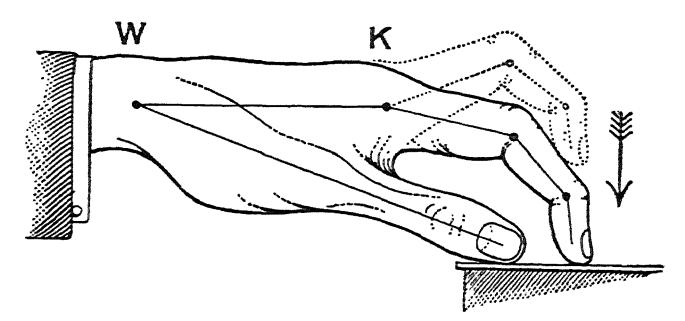

Fig. 6.-The Thrusting (Bent) Finger-attitude. The position is with depressed key; the dotted lines exhibit the index-finger fully raised. W is the Wrist, K the Knuckle. K W

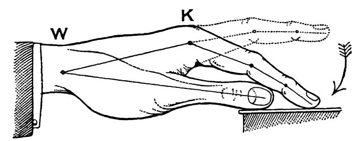

Fig. 7.-The Clinging (Flat) Finger-attitude. The position is with depressed key; the dotted lines exhibit the index-finger fully raised. The above two figures are designed to exhibit the two opposite Finger- attitudes employed in playing. They consist of differences in movement and action, and they demand totally opposite conditions of the Upper-arm. The actual Position assumed by the Wrist -joint and Knuckle may vary rather considerably, without interfering with the due operation of these two opposite sets of Muscular-conditions : The main point with the Thrusting-attitude, Fig. 6, is, that the Knuckle must be sufficiently high to allow it easily to take the thrust of the fingers ;- wherefore some teachers bend the fingers very fully and hold the Knuckle exceedingly high with a low-dropped wrist.* The Clinging-action (Fig. 7) even admits of the Wrist-joint being either
* Vide, for instance, the excessively high Knuckle (with dropped wrist) as illustrated in vox MELASFELD'S "Die Hand des Pianisten; "-Leschetizki Method.

152 KEY-TREATMENT; MUSCULAR ASPECT. held quite high, or of being dropped below the level of the key-board,-pro- vided no running passage be attempted in the latter case. It also admits of the finger being as much curved with full key-depression as in thrusting-action- but such contracted position in this case modifies the tone-character from that resulting from the fully "flat,”—and elastic" finger. The main difference to be noted by the eye, is, that when the finger is well- raised as a preliminary, it is much curved in the first attitude, whereas it is al- most fully opened-out in the second. These points willl be further elucidated in the next chapter, and also in Part IV., " On Position."
§ 13. As already indicated, besides having the power inde- pendently to move either the whole limb or a portion of it, we also possess the option of exerting the muscles that serve to actuate such movement, without any actual movement arising from such exertion; the attached limb instead exhibiting force or stress in one direction or the other : In this case there willl be no visual evidence of any Exertion or Lapse of it, and the only proof that there has been any change in muscular-condition willl be in the force or stress ex- hibited against either some outside object (such as the key) or against some other portion of the same limb. It so happens, that the most important Actions and In- actions required in tone-production are precisely the ones that are thus "hidden" for want of resulting movement, and it is these very ones that require the most careful direction when learning to play. We see therefore why it is so much more important to study Condition, than the merely resulting Po- sition of the limbs concerned.
§ 14. Absence of visible result from Exertion or Lapse of it, may arise from several causes:
a) Movement may be prevented from resulting from Muscular-exertion, by causes outside the limb; this willl happen if the resistance opposed to the free end of the limb is greater than the force exerted by it. To teach and acquire these "hidden" muscular-changes, they must (as already pointed out) be first demonstrated visually, i.e., as movements; after having been thus learnt, the same muscular-changes must then be slightly modified, thus eventually inducing them without the accompaniment of the non-required motion.

THE LIMBS EMPLOYED. 153
b) Movement may fail to arise, owing to contrary and balancing exertions, or the WEIGHT of other portions of the limb.
c) Movement may be impeded or prevented, by exertion of the contrary or opposing muscles of the same por- tion of the limb.'
§ 15. This last alternative has a most important bearing on the muscular aspect of technique. It must therefore be con- sidered more closely :- Let us clearly understand, that for every muscle or set of muscles designed to produce movement or stress, we are also provided with an opposite muscle or set of muscles, that en- ables us to execute the opposite movement or stress by means of that same section of the limb.
§ 16. It follows, that if opposite sets of muscles are equally exerted, that the two balance, and that there willl be no move- ment as a result of such exertion, and also no effect upon any outside object, such as the key. The only effect being, that the limb (or portion of it affected) becomes "set" or rigid for the time. Thus, we may exert the finger, or the hand and the finger together downwards, against an un-giving surface, and no movement willl arise unless the exertion exceeds a certain limit; and if it exceeds such limit, an upward movement of the knuckle and wrist-joint willl arise by recoil. Under- standing how such upward recoil arises from the downward action of the finger and hand against a surface, we can also realise how such upward re- coil can be prevented, by allowing the supporting muscles of the arm to lapse sufficiently; for the Weight thus set free willl bear downwards at the wrist, and willl thus prevent the recoil there. In thus preventing loss of energy by recoil, our fingers willl consequently act more effectively, for instance against the keys during descent.* Moreover, we can also understand, how the exertions of a limb can be either partly or completely nullified as regards application against an outside object, such as the key, if we permit the opposite exertion to be made along with the desired one-if, in making the exertion that serves to provoke the desired movement or stress, we also at the same time make the exertion that produces the opposite effects This we can illustrate, by holding an arm raised, and "stiffening" it; for the stiffening is purely owing to the conflict between the two opposite sets of muscles, each nullifying the other's influ We see the same apparent loss of energy in the "tug of war,"- when two parties of athletes pull on a rope in opposite directions, with hardly any visible effect either one way or the other; the energy applied by one party being almost or completely counteracted by their opponents. ence.
* Vide next Chapter for details on this point.

154 KEY-TREATMENT; MUSCULAR ASPECT. Such tendency towards rigidity is indeed bound to ensue, however slightly the opposite muscles are allowed to act. The latter must therefore remain perfectly quiescent, if we would obtain the best effects from our muscular efforts against the keys.
§ 17. It is imperative to bear in mind, that there can be no real "STIFFNESS" either of Finger, "Wrist" or Arm, except from such conflicting action of the muscles themselves. Ex- cepting, of course, in those rare cases of stiffening disease, such as rheumatism or gout, or other physical abnormality. All "stiffness” vanishes under normal circumstances, when we succeed in employing the required muscles only, and no others.¹ Hence the excellence of the doctrine of EASE. Ease-abso- lute freedom from all restraint in the muscular actions em- ployed at the Pianoforte,-or in any other athletic pursuit.
§ 18. Hence also, if we would learn to play with freedom and ease, the first step muscularly, is, to learn to separate or isolate all muscular activities from their opposite ones-giv- ing as complete relaxation to these opposite ones as possible." As already insisted upon, inexpertness in this respect, ab- solutely prevents the attainment of all certainty and subtlety of technique of every kind,—including tone-variety, control of ¹ Provided, also, that we carefully cease all unnecessary action, the moment the sound appears in key-descent. 2 The "Tonicity" of the muscles, as it is termed, sets a pathological limit to such relaxation; for an extremely slight residuum of tension probably re- mains in all muscles, even when we leave them as passive as we can. No doubt it is owing in part to the slight variations in degree of this ele ment of Tonicity-variations depending directly on our bodily health and nervous state, whence that daily, nay, hourly, variation in technical-power arises, which every player experiences more or less-often to his confusion and exasperation! Here however, we must always remain at the momentary mercy of our Body, and surrounding circumstances; as we must in that other essential matter, that of Musical-attention, given fully, willl-lessly and under emotional-stress-so often consecrated and sanctified under the name of "In- spiration." We can nevertheless help ourselves greatly in both these matters, once we recognise the immediate cause of our perhaps but momentary ineffici- ency :- Knowing that Relaxation, that Ease is essential-as essential indeed as Musical-attention or "Listening," knowing this, we can even when not mus cularly" fit," nor inspired," still succeed in forcing ourselves into a condition of Mind and Body, at all events somewhat less un-fit. 66

THE LIMBS EMPLOYED. 155 sound-entry (Time) and also that facility in Agility, to which the all-embracing term Technique is so often limited. Such Isolation of the muscular exertions from their oppo- site ones, certainly comes more easily to some than to others, Those who easily learn it-to whom it "comes naturally," in popular parlance—are indeed muscularly gifted for the Pianoforte, and for any other musical instrument; especially if they have in addition large muscles,-a good " Piano-voice in a word.¹ ""
§ 19. This passivity of the opposing muscles we can teach ourselves by a direct method:- In this case, we must first learn to recognise the muscular act we wish to omit. This we can do, by first allowing that act to induce a movement of the limb-section it is attached to, and noting the sensation which arises from such act,—a sensa- tion that can be intensified by applying such act against an object outside the limb, of sufficient power of resistance—a table for instance. Having thus learnt to recognise the muscular-sensation that accompanies the action of those muscles which we desire to render passive, we can then proceed to teach them this desired habit, by seeing to it, and insisting upon it, that the sensation that accompanies their activity is omitted when we employ that opposite movement of the limb (or stress by means of it) which we wish to render free and unrestrained.2 1 Here it is well to repeat, that such talent is, however, not at all neces- sarily accompanied by a musical faculty, any more than the latter is a necessary concomitant of the possession of a good vocal-apparatus; while the converse is also true,-for a bias towards Music does not necessarily bring in its train those valuable muscular-talents, that render the acquisition of Technique so much more easy of attainment. 2 An actual example of the general principles to be pursued, willl make this clearer: To free for instance the required downward act of the Hand ("wrist- action" so-called) from being opposed and rendered "stiff" by the raising muscles of the hand, we must first learn to recognise the particular muscular- sensation that willl warn us of our wrong-doing. This we may do, by simply raising the hand as stiffly as possible, and carefully noting the accompanying stiff sensation, which we have to avoid in playing; and following this experi- ment with a free movement of the hand. Or: we may place the back of the hand under the ledge of a table, and exert it upwards against the table, first pressing the knuckle thus against the table by the hand, and afterwards sub-

156 KEY-TREATMENT; MUSCULAR ASPECT. The Studies, or Exercises in Muscular-Discrimination, that form Part V. ("Relaxation ") of this work, willl here be found useful; for these are designed to supply the opportunity for such direct study of all the main muscular acts required in playing.
§ 20. To sum up : We must learn to segregate the exertions that willl enable us to move one finger independently of another, and each either in the "thrusting" or the "clinging" attitude, and in any direction sideways; also the Upper-arm from the Fore- arm; and the latter from the Hand. And while we can thus mentally separate one portion of the limb from another, we must also be able to isolate each separate exertion from its re- lated opposite exertion. We must first learn to recognise these differences; must then fix them in our memory, and subsequently form such dis- criminatory-powers into physical habits. Always remember- ing, that without perfect practical passivity of all contrary- muscles, it is quite impossible to direct the required exertior.s with that complete nicety and mastery that is imperative for artistic playing. RECAPITULATORY
a): The limb employed in playing consists of four main por- tions, four levers:-the Finger, the Hand, the Fore-arm and the Upper-arm.
b): Each portion or segment is individually provided with muscles; we can therefore control each portion separately-both as to exertion, and as to lapse of it.
c): The finger can be exerted in two completely different stituting the back of the fingers, to be thus pressed upwards by the hand. The sensation accompanying this upward action of the hand (the one to be avoided) should then be compared with the sensation arising from a free action of the hand downwards against the table. It is advisable not to employ much force in such trials or experiments; there is no occasion to do so, and it may even prove harmful. Exactly similar procedure willl teach us to avoid a restrained (or "stiff ") action of the fingers.

THE LIMBS EMPLOYED. 157 ways; the Bent or Thrusting attitude; and the Flat, or Clinging attitude.¹
d): Exertion implies muscular-action. For every exertion we are able to make in any direction, we are also provided with muscles to provide the reverse exertion.
e): : Exertion of a muscle leads to a visible result-motion of the limb-section to which it is attached, only when there be nothing to prevent such motion.
f): Four quite distinct effects may hence result from a muscular-exertion :-
(1) It may lead to an actual movement of the portion of the limb to which it is attached ;
(2) It may cause that limb-section to bear against some outside object, such as the Pianoforte key;
(3) Or may cause it to bear against another portion of the same limb;
(4) Lastly, if allowed to act in sympathy with its opposite neighbour, it willl deter that muscle (or set) in its work; thus leading to the work being done un-freely, or even inducing for the time a total stiffening or rigidity of the involved portion of the limb.
g): The isolation of each set of muscular impulses from its opposite set, is hence the first and most important step towards acquiring a correct Technique; since any inexpertness in this respect causes a "stiffness" of Finger and Wrist, etc., that in- fallibly precludes accuracy either in tonal or in rhythmical result.
b): RELAXATION-Ease, derived from the omission of all un- necessary muscular-exertion (in conjunction with accuracy in its application to the key), forms the main secret of all easy and therefore accurate Playing. 1 Vide Figs. 6 and 7, page 151.

158 KEY-TREATMENT; MUSCULAR ASPECT.

### CHAPTER XVII. THE MUSCULAR ACTIONS AND INACTIONS CONCERNED IN THE ACT OF TOUCH

The nature of
§ 1. The nature of the muscular act by means the Muscular- of which the necessities of Key-treatment are Operation. fulfilled, may at its broadest be defined as an ACT OF LEVERAGE. .. All good touch implies a levering of Weight upon and against the key,' to induce the latter to move. This act of leverage must be almost entirely fulfilled by the Finger and Hand..
§ 2. The Weight thus brought to bear upon the key, is that of the ARM. When more Weight is required than that of the Arm alone, then we must employ that of the Shoulder, bringing it to bear upon the keys through the leverage exerted by certain of the arm-muscles, in addition to those of the finger and hand. The WEIGHT of the Body itself may ultimately thus be requisitioned. The leverage-principle nevertheless remains unaltered,- any muscular-force, correctly employed in the act of tone- production must invariably act upwards against Weight. Exertion pro-
§ 3. To amplify this:--The consequence of duces an Up- the Finger acting downwards with its tip against ward-stress. the key, is, that it bears upwards (by recoil) with equal force against the knuckle of the hand. Similarly, 2 That is, Leverage against Weight,-leverage against the key, with a Basis for this leverage consisting of Weight, to prevent waste of Energy by recoil. That is, the finger bears upwards against the Knuckle with the same degree of force, that its tip is exerted against the key. As some of my readers may not be aware of the inevitableness of the law of recoil-the law that action and re-action are equal, I willl quote the follow- ing from GANOT, "Physics," translated by Atkinson, § 39:-" Reaction is al- ways equal and contrary to action: that is to say, mutual actions of two bodies on. each other are always forces equal in amount and opposite in direction. This law is perfectly general. and is equally true when the bodies are in motion as well as when they are at rest."

TTHE ACTIONS AND INACTIONS. 159 the consequence of the Hand acting downwards upon the Finger at its knuckle-end, is, that the Hand also equally bears upwards (with its Wrist-end) against the Fore-arm. We thus find, that the Finger and Hand bear upwards against the ARM (at the Wrist-joint) when we play, just as our legs bear upwards against our bodies in walking up (and down) stairs, or as in cycling. The ultimate foundation, or Basis, for the Fingers' and Hand's work against the key, is moreover seen to consist of Arm-weight,' sometimes supplemented by Shoulder-weight, or even Body-weight." Body-weight
4. For the extremest forte effects, we thus find that it is the PASSIVE Body which serves as an ultimate reserve of Weight, and it of course forms an inexhaustible reserve. not Body-force. Now it is extremely important that we should at once fully recognise and grasp the difference between correct and incor- rect muscular-condition in this connection: The exertion employed to impel the key into a high rate of speed, however great, must never exceed a tendency to force the shoulders and body upwards; such upward tendency being the recoil-result of the leverage exerted upon the key (during its descent) by the finger, hand and arm. That is, we must not permit ourselves to force the finger and hand down by using the muscles of the Body and Back, in place of such proper levering against a passive body. Or, in other words: Although the leverage exerted against the keys, may, when sufficiently great, tend by recoil to bear the body upwards by the shoulder, yet the body itself must nevertheless remain absolutely passive-loose, and lax; and 2 ¹ Vide Appendix to Part III., Note XIX. : "Arm-weight." This "bearing upwards against Weight" applies equally, whether the arm is released, or not, at the moment of key-depression; and it applies still, when we occasionally have to assist arm-weight, by having recourse to a slight activity of the arm itself as light activity that is mostly confined to the fore-arm; the arm, in its turn, bears still upwards,- against the loose-left Shoulder, or the Body itself. 3 Needless to add, we must not allow this recoil to cause any actual up- ward movement of the shoulder.

160 KEY-TREATMENT; MUSCULAR ASPECT. we must never be tempted to push forwards and downwards upon the finger and hand by any actual exertion of the body itself.¹ (Vide also, Appendix to this Part, Note XVI., “ Incor- rect v. correct Finger-technique.”) The accom- panying sen- sation.
§ 5. Since the exertions employed are almost entirely provided by the finger and hand, and since it is only Exertion which we can appre- ciate as muscular sensation, it follows that the sensation accompanying the employment of finger and hand exertion (against arm-weight) must be felt to be upwards;-and not downwards, as might be imagined. Moreover, as the action of the finger and hand is in the nature of a levering of weight upon the key, the sensation con- veyed may also be said to resemble a stepping-up on to the keys, to induce their descent. For the muscular act resembles that of stepping upstairs, and also that of bearing against the cycle-pedal with our legs. 2 This radical difference between good and bad action, should at once be made plain to every beginner, even the child-beginner. This can easily be done by means of the two following experiments, which should be repeated as often as necessary: Erperiment I: Place the fingers upon the key-board in an easy chord- position, without sounding the notes. Now force the arm and hand both for wards (towards the instrument) and downwards by means of the Body and Back; and we at once perceive the nature of the iniquitous " Body-squeezing process, so common a fault. n Erperiment II: Place fingers as before, but now leave the body perfectly passive and lax; and while insisting upon this condition, endeavour to raise the body from its seat, by means of the leverage exerted upon the keys by the fingers and hands, and the consequent stress upwards by recoil against the shoulder. N.B. No actual raising of the Body is possible, nor should it be attempted. The exertion in the direction indicated is all that is required. In the first case, we shall feel as if acting downwards; in the second case, the sensation willl unmistakably be felt to be upwards against weight. It should be insisted upon, that the first attitude willl assuredly compel the appearance of most of the faults (including stiffening and squeezing, etc.) which it should be our constant endeavour to avoid in learning Technique; whereas with the second attitude, our Technique may at once be on the correct lines, although even then it willl not necessarily be so, unless we also fulfil the many other necessary rules of procedure. 2 True, when we are in a hurry, it may seem that we "strike" the stairs with our feet; but this is not really so, unless we do so as naughty chil- dren, and "stamp" upstairs! We certainly do not "strike" the cycle- pedal-most carefully indeed do we guide our feet to "take hold" upon it, to propel ourselves. It is also true, that both in the case of the stairs, and the cycle-pedal,

TTHE ACTIONS AND INACTIONS. 161 Three main muscular- components.
§ 6. Seeing that we have to deal with Finger- exertion, Hand-exertion, and Arm-weight (and its co-operatives) as the main sources of Energy by which to set the key into motion, we now realise that all Touch is built up of these THREE MAIN MUSCULAR-COMPONENTS. We should carefully bear this in mind, for these three muscular-components (or elements) of force, can be applied to the key, combined in a great variety of ways. In fact, these modes of application can again be classified, as coming under three main principles of combination, forming THREE SPECIES OF TOUCH-FORMATION, or construction, viz.:
I.): Tone produced by exertion of Finger alone, with passive Hand and Arm.
II.): Finger and Hand both exerted against the key, with passive Arm.
III.): Arm-weight (etc.) combined with the Finger- and-hand exertion. In forming or constructing the Act of Touch, a thorough understanding of these different modes of combining the Elements of force at our disposal is essential; for it is of the highest practical utility both to Teacher and Performer, in acquiring and applying a true Technique-a Technique that willl serve the Artist. A separate chapter-(Chapter XIX.)--is therefore devoted to a fuller exposition of these points. Arm-weight
§ 7. To render the arm effective for its pur- employed in pose as a Basis, we may employ it in either of two ways. two distinct ways:¹ (a), We may support it gently by its raising-muscles; or (b), we may leave it un-supported during the act of Tone-production. "6 PRESSURE" does occur during the moment of propulsion; and in this sense, and this only, should "pressure" be experienced against the Piano-key. For we must be careful to understand, that such "pressure" willl not serve the purposes of Tone-making, unless it exists between finger-tip and key only during the short period that the key is being brought under way, and is moving. As so often here insisted upon, all force exerted against the key beyond the moment that the latter reaches Sound is futile, excepting only that very minute residue required to detain the key depressed in Tenuto and Legato. Unless such Basis or Foundation is supplied, energy willl be lost at the Knuckle or Wrist by these giving way upwards, when we apply the finger-tip against the key.

162 KEY-TREATMENT; MUSCULAR ASPECT. In the first case (when the arm is gently and easily sup ported by its proper muscles) its inertia becomes avail- able as the necessary basis for the Finger and Hand to act against; a basis sufficient for certain light touches, but insufficient where any large volume of tone is required. In the second case (when the arm is left momentarily un-supported, or "relaxed" during the crisis of Key- descent) its whole weight may become available behind the finger and hand,-thus rendering possible large volumes of tone of a perfectly beautiful and un-forced character.¹ Two sources of Energy, meeting at Wrist.
§ 8. We perceive, moreover, that the Energy required at the key-board is, broadly speaking, derived from TWO SOURCES; that is: (a), from activ- ity--the exertion of the Finger and Hand, and (b), from passivity--the weight of the Arm and Shoulder set free. Further, we should now recognise, that these two sources of Energy MEET AT THE WRIST-JOINT, there manifesting themselves:
(1), as an Activity upwards-derived from Finger and Hand; and (2), as a passive Weight there tending downwards." Quantity of
§ 9. It is from the sum-total of the energies sound depends derived from these two sources, and thus set free against the key during its descent, that directly arises the total QUANTITY of tone for each note;— the particular grade of tone-quantity depending on the particular sum-total of such Energy. on Total amount of energy. Quality of sound mainly determined by the locality of the Initiatory force-compo- nent.
§ 10. The QUALITY of the resulting tone on the other hand depends primarily on the fact, that the tone-production may be INITIATED by either of these same two sources of Energy, viz. : either (a), by Arm-lapse, or (b), by the Finger's and Hand's muscular activity. They thus form the distinction between WEIGHT-TOUCH and MUSCULAR-TOUCH. The sensation of a Loose-left Arm must be still paramount, even when it is itself employed to "lever" Shoulder-weight upon the keys; for the raising- muscles of the arm should remain perfectly lax, even when we are employing its down-muscles to lever or bear-up against the Shoulder from the keys during their descent. 'Finger and Hand thus act upwards at the Wrist against the Weight of the

TTHE ACTIONS AND INACTIONS. To describe these two GENERA of key-attack more fully: 163
a): We may start the muscular-operation required during the short space of Key-descent (or Tone-exci- tation) by "willling" the Arm-supporting muscles to LAPSE;-in this case, the finger and hand must automat- ically undertake the duty of supporting the Weight thus set free upon the key, doing so in response to the sensa- tion of weight felt to be left un-supported.
b): We may, on the contrary, start the process of Tone-excitation, by "willling" the muscles of the Finger and Hand to ACT. In this case, when required, we may also add Arm-weight, through lapse on the part of the arm-supporting muscles; but this lapse willl, under these circumstances be given in answer to the need for a firm Basis, felt at the Wrist-joint; for such need arises when Hand and Fingers act vigorously as in forte,-owing to the recoil upwards being equal to the force manifested against the key, as already pointed out.
§ 11. The tone-contrasts resulting from this difference in treatment are as follows: Tone initiated by Muscular-lapse-by Weight, tends towards an un-percussive, singing, and sympathetic quality, strongly possessing the characteristic of "carrying power." These qualities it owes to the fact, that the full speed of the key's descent is here attained gradually rather than suddenly. Tone, initiated on the contrary by Muscular-activity (that of the Finger and Hand), tends towards a percussive, sharp, aggressive, brilliant quality, possessing comparatively little fulness or carrying-power.¹ Reference should here be made to Fig. 4, Part II., Chapter XI.; §§ 12 and 13. arm; while the latter is for this purpose either left un-supported by its muscles to the desired extent, or is instead gently supported-when only a fraction of the weight becomes effectively available. (Vide Figs. 8 and 9, page 151.) The reason why this difference in the locality of the Initiative forms the main muscular difference between Brilliant and Sympathetic Touch, is, that in the one case the application of Energy to the key is more Sudden, and in the other case more Gradual. That is: If we start the tone-production by activity of the Finger and Hand, the energies set free are more immediately transferred to the key-surface; and, are therefore translated into more sudden key-descent

164 KEY-TREATMENT; MUSCULAR ASPECT. Quality of sound influ- enced also by difference be-
§ 12. The distinction between Sympathetic and Brilliant tone-qualities depends, further, on those two opposite relative conditions of the Arm and Finger, from which result the CLINGING tween Clinging and THRUSTING Finger-attitudes already alluded and Thrusting to in §§ 11 and 12 of last chapter.¹ That is, apart attitude. from the difference in tone-quality wrought by finger-and-hand Initiative, as against that wrought by weight- release Initiative, the distinction between "sympathetic" (full) tone, and "brilliant" (thin) tone, may be further enhanced by the optional employment of the FLAT finger-attitude, as against that of the BENT finger-attitude. These two opposite attitudes of the finger, available, seem at first sight but a slight distinction, but they also bring in their train completely opposite attitudes of the upper-arm.2 For this reason they give rise to two diametrically opposite kinds of technique: In the first case, that which enhances "Sympathetic" tone-tendency-the Finger is applied in a comparatively than if we start the tone-production by lapse of arm-support. In the latter case, the finger's and hand's supporting activities are given but in response to the promptings of the inauguratory arm-release, hence the energy takes longer to accumulate on the key, and thus induces that more gradual descent of the key which is associated with un-percussive tone. We shall have no difficulty in grasping this matter, if we bear in mind the duplex nature of the muscular conditions required for all tone,-consisting as these do of the Weight of arm versus Muscular-activity of finger and hand. (Vide § 8.) If we do this, it becomes easy to realise that either of these two elements may start the process of tone-production, although both are more or less needed for its consummation. The difference in general tendency of the muscular-attitude between sudden and gradual tone-production, may here be compared to the difference between mounting and descending a stair: Our legs support our bodies in both cases; but in the one case, there is "muscular-initiative," as it were; for in mounting, we have to do more than merely support the body. Whereas, in descending, we omit the exertion of our nether limbs just sufficiently to permit of a gentle descent of our body-one step at a time, and without percussion ! 1 Vide Figs. 6 and 7, Chap. XVl., p. 151. 2 We shall find on closer investigation, that the true cause of the difference between "beat" and flat" finger, is not to be traced to the difference in the finger's action, but rather to the difference in Condition of the Upper-arm or Elbow. In other words, it is owing to the last-mentioned fact-the fact of the Arm being either held supported forwards, or instead tending to hang loose, whence originates the finger's thrusting or clinging action, respectively. (Vide Chap. XIX., § 20.)

TTHE ACTIONS AND INACTIONS. 165 "FLAT" position. Its action here is, that it clings to the key, and tends to draw the Elbow towards the key-board. This tendency of the Elbow to be drawn forward by the finger's folding-up action,¹ must, however be prevented from actually taking place; it must be counterbalanced by a sufficient (and but momentary) lapse of the Upper- arm; such lapse being allowed to supervene at the proper moment during the act of key-depression. In this way, the finger's forward pull upon the Elbow is so neutralised by the backward-tending Weight of the Upper-arm, as to cause these two forces together to act in a perfectly VERTICAL direction at the Wrist and upon the key; creating there the sensation of verticality of ap- plication; and not necessarily evincing any actual back- ward or forward movement of the limb during key-de- pression. In the second case, that which makes for brilliancy and sharpness of tone, the Finger is applied in its fully curved or "BENT" position. In this instance, its tend- ency is to thrust against the key, and therefore (by recoil) it also tends to thrust the Elbow away from the key-board. Any actual movement, or thrusting-back of the Elbow, must also here be prevented; this is accomplished by exerting the Upper-arm itself forwards, doing this how- ever very slightly,—indeed not more so, than willl just serve to neutralise the finger's backward-thrust. In this way, we here again obtain perfect verticality in the application of the force; such being one's experience at the Wrist-joint, and indeed also at the key itself. (Vide Appendix, Part III., Note XV.: "Flat v. bent Finger- attitude.") These interactions of Exertion and Weight may become clearer by referring to the following two Figs., on the next page: The finger, in this case, acts as a whole,-all three segments of it in the same direction. It remains also almost straight during the process; while it feels like a mere rubber-stick or rope-as the arm does in hanging from a horizontal-bar;-a sensation very different from that derived from the legs in their thrusting action when mounting stairs.

166 KEY-TREATMENT; MUSCULAR ASPECT. a W Ꮳ CC E d

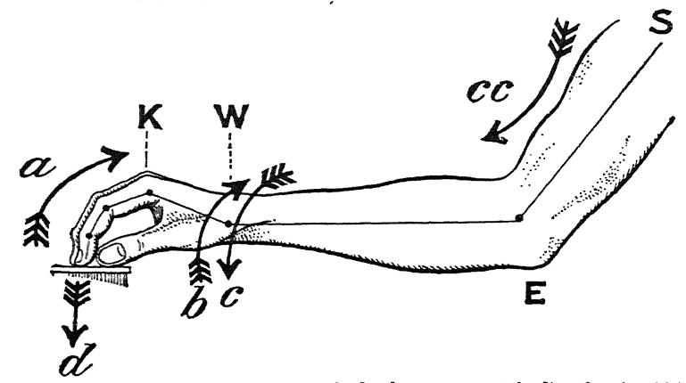

FIG. 8.-DESCRIPTION: *The arrows in the above, represent the directions in which the forces tend during BENT finger-attitude. a and b denote the direction of the energy resulting by recoil from the thrusting action of the finger and hand against the key, and manifesting itself upwards and back- wards respectively at the knuckle and wrist joints. c and cc, the energy that balances this, derived from arm-weight and force. K is the Knuckle; W the Wrist; E the Elbow, and S the Shoulder. K W CC E

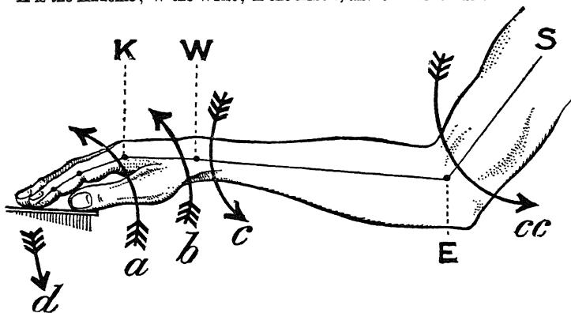

FIG. 9.-DESCRIPTION: The arrows denote the tendencies during FLAT finger- attitude. a and b denote the direction of the energy resulting from the finger and hand clinging to the key, and how it manifests itself as an upward and forward-drawing stress at the knuckle and wrist. c and cc, the direction in which the energy tends, that is set free in this case at the elbow and wrist, and derived from Arm-weight through its release. d, in both Figs., shows the direction of the total Energy-result,―vertical upon the key during its descent, and slightly dragging, in Fig. 9.
*In Fig. 6, page 151, the Bent-finger was shown with the wrist-position almost as high as it may be; in the above figure, the lower position-limit is illustrated. On this point, the various "Methods" differ completely as to their Dogma. The fact is, that the precise position adopted should vary in accordance with variety in hand-conformation. (Vide Part IV., “On Position.")

TTHE ACTIONS AND INACTIONS. 167 The difference between these two attitudes might also be expressed thus: With the Bent-finger attitude, the whole framework of arm, hand and finger tends to unbend from its normal position; whereas with the Flat-finger attitude the general tendency is precisely in the opposite direction. This can easily be made clear, by exaggerating these tend- encies and stresses of the limb into actual movements of it,- although such movements are not required in actual per- formance at the instrument, and are even to be deprecated.
Fig. 10 is an attempt to show this experiment, and its inter- actions, on paper: A KWW A. S S E B E

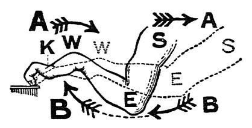

FIG. 10.-DESCRIPTION: Above Fig. represents the arm, hand and finger, in as fully doubled-up a position as it is possible to place them. In the case of Bent or Thrusting finger, the whole framework (from finger-tip to shoulder) willl tend to unbend from such position to the one shown in dotted outline;
-power to be derived from the finger and hand. In the case of Flat or Clinging finger, the tendency is, on the contrary, to contract from the fully extended position (in dotted outline) to the fully bent one. The arrows at A suggest the direction of force in thrusting-attitude; whereas those at B denote the direction in Clinging-attitude. Both positions are greatly exaggerated, to show the result of the required tenden- cies. Figs. 6 and 7, page 151, and Figs. 8 and 9, page 166, should be studied in conjunction with this experiment. In making this experiment (and for the time exaggerating into visible movement those actions which in actual playing should be mere tendencies and stresses) we must be careful that these movements are not caused by any action of the arm itself. The movement must in both cases be wrought only by the action of the finger and the hand. In illustrating the Thrusting attitude, it is therefore the finger and hand, thrust- ing against the keys, that must thrust the arm away backwards; and in the case of Clinging-attitude it must be the finger and hand that must draw the arm towards the key-board.

168 KEY-TREATMENT; MUSCULAR ASPECT. The thumb does not show these divergencies of attitude so markedly as do the other fingers, and it does so in a slightly different fashion. This minor point willl appear more clearly under "Position." (Vide Part IV.) The difference
§ 13. Let us for a moment consider why these in Elasticity is divergencies in treatment further the difference between sympathetic and brilliant tone-effects: the reason of the difference in result. The flat or clinging finger (with its correlated “hanging” upper-arm) reduces the whole system of finger-hand-and-arm into its most elastic condition ;-a disposition favouring therefore a gradual transmission to the key of the full amount of Energy employed,-with its result- ing gradual key-depression and more sympathetic (or un- percussive) quality of tone.' The bent or thrusting finger (with its correlated resisting upper-arm, or elbow) on the contrary, places the whole limb in an inelastically standing condition upon the keys;—a dispo- sition of the material therefore calculated to cause direct trans- mission of the full energy to the key;—with its resulting sudden depression of it, and consequent more brilliant tone-quality.2 The part that Elasticity plays in promoting beauty of tone, has already been dimly recognised by many. Some have gone no further than to suppose that the difference is wrought by bringing "the more fleshy part" of the finger into contact with the key. Others have gone somewhat further, and have recognised that the finger itself is more elastic when it is applied in the "flatter" position; while they have not succeeded in recognising the function of Arm-weight, nor the supreme necessity of ceasing "pressure "the moment that tone has been reached in Key-descent. In a recent work (FRANKLIN TAY- LOR, "Technique and Expression," page 10) we read for instance: "to pro- duce the most musical and singing quality, it is necessary that the finger, however firm the pressure, should be in an elastic condition, and it is there- fore important that every joint of the finger and hand, and even the wrist, should be kept loose, and should yield slightly with each pressure of the finger-tip." We now see, however, that it is the whole limb (from the shoulder) that becomes elastic if we employ Upper-arm Weight-lapse; the main cause of difference in tone-quality being the condition of the Up- per-arm, or Elbow. For if the upper-arm tends forward, not only are elbow and finger more rigid, but the weight of the upper-arm cannot then be set free; and conversely, if the upper-arm hangs on to the key during descent, it willl preclude our obtaining brilliance when we desire it, as we cannot then give a thrusting action of the finger. 'We observe that a “thrusting" finger demands a corresponding forward- tending Elbow: This is all very well so long as no very large quantity of tone is required.

TTHE ACTIONS AND INACTIONS. 169 Knuckle-joint action, its importance.
§ 14. It is imperative thoroughly to under- stand the duties of the three Finger-phalanges, respectively in "flat" and in "bent" attitudes, and the precise nature of the contrasts here evident:- The main point is, that it is the knuckle-phalanx (the portion of the finger next to the hand) that must do most of the actual work, both in clinging and thrusting attitudes. This portion of the finger must be exerted downwards upon the front two joints (and therefore upwards by recoil at the knuckle) no matter whether the two front joints are straightened out (as in clinging touch) or whether they are pointing downwards (as in thrusting touch). The essential difference between the two Attitudes is there- fore to be found in the action and resulting position of these two front phalanges,—(a), if these two phalanges are used in the comparatively vertical position, they thrust backwards in taking the down-force of the knuckle-phalanx behind them ;- the action of the whole finger being here analogous to that of the leg in getting up from a chair, or in cycling, or in mount- ing stairs. Whereas (b), if we leave these front two joints almost straightened out, or with but a slight clinging action, then the whole finger makes the arm cling to the key;-an action analogous to that of the hand and arm when clinging to a horizontal bar. 66 But if we adopt this form of technique or FORWARD TOUCH," as it may be termed, for a really full forte chord, then we shall find that the result is an exceedingly hard, sharp and disagreeable effect. An effect perhaps not ob- jectionable to us if we are accustomed to its ugliness, but most objectionable when we have discovered that the instrument can give something better. The fault is, that instead of doing as we should do, and allowing Arm-weight, and when necessary Shoulder-weight or even Body-weight to come upon the key-instead of "levering" Weight upon the key during its descent,-instead of the arm and shoulder being left free, so that finger and hand can "lift” this weight upon the key-instead of a perfect looseness of Body-in a word, instead of WEIGHT-TOUCH, we here as it were wedge the arm in between key and shoulder. The arm, in thus wedging itself against the keys, drives almost straight back against the shoulder, and not upwards practically, as in Weight-touch. The consequence is, that the muscles of the body and back are compelled to resist this drive backwards by in turn driving the body itself forwards against the key. Such rigid, real" down-arm" force (or Body-force) thus viciously employed in fortes, proves absolutely fatal to beauty of tone; although it forms a ready means of obtaining plenty of noise without much thought or care.

170 KEY-TREATMENT; MUSCULAR ASPECT.
§ 15. It is well to be urgently warned against The fault of relying upon the fatal fault so often connected with the flatter the two front and clinging finger-attitude, a fault, which, when phalanges. once formed is probably more difficult to eradicate than any other, viz.: the exertion of the two front portions of the finger with more force than the knuckle-portion. In this case, the two front phalanges pull inwards towards the body, while the knuckle-phalanx remains almost passive;
-causing the finger to feel quite helpless and weak.¹ This is owing to the exertion of the finger not being vertical upon the key as it should be-in the direction of the key's descent, but instead taking the form of an ineffective pull, or even back- ward rub. Such touch might aptly be dubbed "Key-tickling instead of Playing. Fig. 11 exhibits an exaggerated view of this faulty tendency: 99

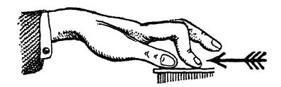

FIG. 11.-Faulty action of the two front phalanges of the finger, showing the result of these being exerted with greater force than the Knuckle-phalanx-which should be the main working-lever of the finger. In correct "flat" finger-touch action, the two front pha- langes should on the contrary be left comparatively passive, or almost completely so in fully sympathetic tone;—and it should always be the strong knuckle-phalanx (the one next to the hand) that provides the work of "levering weight" upon the key." The opposite fault is also occasionally met with, viz. : a thrusting finger (and arm) with a perfectly straight position! It forms a most inconvenient and ungainly Touch-method, with a most ugly tone-result. How Finger- action should be shown. The nature of Finger-action, in both its forms (and Hand- action also, in fact) is best made clear by inverting the hand, and laying it flat upon the table, or upon one's knee, and practising the following three exercises : Procure a small weight of a few ounces-or use the partial weight of the other arm, transmitted through a finger or pencil. Let this weight rest upon the Knuckle-phalanx of one finger of the inverted hand, and close to the middle- joint end of this phalanx. Now raise the weight by means of this phalanx; support and balance the weight thus for a few moments, meanwhile

TTHE ACTIONS AND INACTIONS. 171

A I C B
FIG. 12. C₁ B d A e e
FIG. 13.

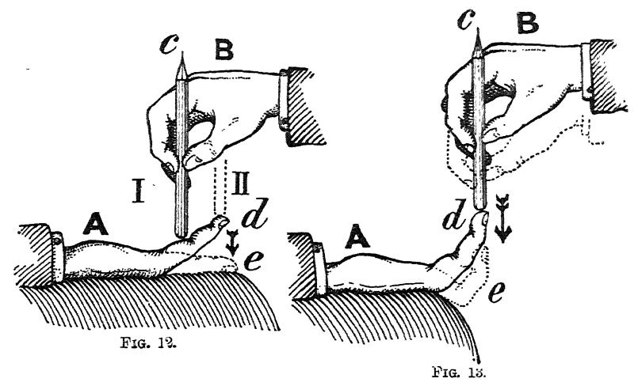

FIGS. 12 AND 13.-DESCRIPTION: A exhibits the learner's hand, lying inverted upon his knee. B the teacher's hand, its weight and energy being supported through the pencil c by the learner's finger d. To instruct and exercise the Knuckle-phalanx alone, the pencil or weight should be placed as at I in Fig. 12. To instruct and exercise the finger as required for clinging attitude, the pencil should be placed as at II (dotted outline) in Fig. 12. While for the thrusting-attitude the finger and pencil should be as in Fig. 13. If a weight is used in these exercises, it should be allowed to slide freely up and down between the fingers of the other hand, or the teacher's. If the weight is that of another arm (transmitted through a finger or pencil) then one should be careful that the resistance given be not too great; otherwise harm might be done. taking care not to move or exert the two front phalanges of the finger in question. Then, suddenly cease this supporting exertion, and thus allow the weight to fall with the finger. Repeat this process several times. Vide Position 1 of the pencil in Fig. 12. Next, place the weight (or finger, or pencil) on the soft tip of the working finger; and proceed again to lift, balance, and subsequently to let fall the weight with the finger. The two front joints are meanwhile to be left almost limp and inactive, and the position of the whole finger should therefore remain straight, while the work of lifting is to be done by the knuckle-phalanx itself, which should act precisely as in the first experiment. Vide Position II of the pencil in Fig. 12. We have thus practised the action of the "flat" or clinging finger, and we must now study the action of the "bent" or thrusting finger in the same way:- This is done thus: Bend the two front phalanges into the proper position- with nail phalanx vertical, and after placing the weight or pencil on the tip of this experimental finger close to its nail, now proceed again to exercise the finger in lifting, balancing and then suddenly ceasing to support the weight. Vide Fig. 13. Having in this way learnt and practised the proper action of the Knuckle-

172 KEY-TREATMENT; MUSCULAR ASPECT.
§ 16. From the foregoing we obtain the two following practical rules for obtaining the respective extremes of Sym- pathetic and Brilliant tone-colours :
(a): For extremely sympathetic-quality, we must allow the flat finger-attitude (with its hanging elbow) to co-operate with Weight-initiative; while (b) for extremely brilliant- quality we must on the contrary allow the bent finger- attitude with its forward-tending elbow to co-operate with Muscular-initiative. The distinc- tion between Finger, Hand and Arm touches.
§ 17. We now come to the distinctions in touch- method respectively termed Arm-touch, Hand- touch (so-called "Wrist-action ") and Finger- touch. We shall now be prepared to realise that these are by no means the distinctions radically of KIND which they at first sight appear to be. For the movement of the Arm, Hand or Finger, visible during Tone-production, results from a merely slight excess on the part of one or other of the com- ponents of the complete muscular condition requisite (and different) for each particular kind of tone. It is the SUM of the arm, hand and finger conditions (which creates the particular muscular operation), that determines each tone-kind; whereas the distinction as to mere movement (be it that of the Arm, Hand, or Finger) depends on the fact that one of these compo- nents slightly outbalances the other two. We therefore also perceive, taking the particular set of muscular conditions that produces any given kind of tone,' that such particular muscular-operation (with its resulting tone- shading) can be accompanied by a movement of either the phalanx, both in the clinging and thrusting attitudes, the next step to take is, to repeat the whole proceeding at the Piano, with the hand returned to its proper un-inverted position; and while fulfilling the same changes of action and in-action, seeing to it, that the knuckle-phalanx still executes most of the work-of key-depression. Subsequently, we must then learn to time this work accurately to cease the moment sound-emission is reached in descent. ¹Some muscular-combinations are however only available as Finger-touch and Hand-touch; while there are also a few available only as Finger-touch.

TTHE ACTIONS AND INACTIONS. 173 Finger, Hand or Arm, without materially affecting the tone- result.¹ Arm-touch. has § 18. Thus we find that : a
(a): ARM-TOUCH (tone-production accompanied by Arm-movement) results, when there is a state of balance between the three components that form the complete muscu- lar-operation against the key, during the latter's descent,- state of balance between the Arm, Hand and Finger conditions. For these three portions of the complete limb willl in this case retain their relative positions towards each other during the act of key-descent; and the visible product must therefore be: a movement of the whole arm.
(b): HAND-TOUCH (Wrist-touch)2 results when Hand-touch. Hand-exertion is slightly in excess of Arm-release and balances finger-exertion during key-descent. Hand-move- In a word, we find, that those differences in muscular co-ordination of Action and In-action ("Muscular-combinations ") which are respectively re- quired (a) to cause each possible difference in sound result; and (b) to give us command alike over ponderous passages and agility-passages, are practi- cally invisible. And it follows, that those other differences, which are so strik- ingly exhibited to the Eye as MOVEMENT of the Finger, Hand and Arm, are as nothing when compared to these invisible differences, just mentioned. Hand-touch is often mis-termed "Wrist-action," although the wrist can- not act, since it is merely a hinge. Finger-" action," and Arm-" action are also most misleading terms. Finger-action, for instance, would seem to imply, that the finger is alone "active."-Whereas we have learned, that from finger-movement alone no tone can possibly result beyond a quite soft and springy one, without the additional intervention of Hand-activity to lever weight against the key,-while this latter addition need also not necessarily imply hand-movement. "" Arm-"action" is also a peculiarly infelicitous term, since it must infallibly suggest to the unwary, an active " pounding" done by the arm. Especially so, as the beautifully free arm-movements of a great Artist (resulting from a more or less complete lapse of the arm-supporting muscles) are very likely to convey to the uninitiated eye, the impression of a real hitting-down of the keys by down-activity of the arm;-than which there can be no greater sin against the laws of tone-production, nor any, more far-reaching in its conse- quences. Wrist-action, anyway, is a complete misnomer; for if Touch accompanied by Hand-movement is to be thus styled, then surely to be consistent, we should speak of Finger-movement as Knuckle-action," and of arm-movement as "Elbow" or Shoulder " ACTION. 66 "" 66 The idea, however, really meant to be conveyed, is not at all that of "action" in the sense of work, but merely that of movement. Hence by so-called finger, hand (wrist) and arm actions," are meant tone-excitations accompanied respectively by movements of those portions of the whole limb. Now, as the whole of the main conditions of the arm, hand and finger are

174 KEY-TREATMENT; MUSCULAR ASPECT. ment must obviously here be the product, for the slight excess of hand-exertion willl suffice to prevent the Arm from falling (if it is muscularly-lapsed), while the finger-exertion (as it is not in excess of that of the hand) willl only suffice to retain the finger in its relative position towards the hand.
(c): FINGER-TOUCH results, when it is the finger- Finger-touch. exertion that slightly (but sufficiently) outbalances that of the Hand, and of any Weight that may be set free by arm-lapse during Key-descent. For the slight excess of Fin- ger-energy willl here prevent both Hand and Arm from show- ing any movement, and Finger-movement hence becomes the only visible product.¹ Vide, also appendix to this part, Note XVI., “Incorrect v. correct Finger-touch." impo To sum this up: The conditions of Arm, Hand, and Finger obtaining for any particular quantity and quality of tone remain practically identical, no matter whether these conditions exhibit arm, hand or finger movements as a result. Diversity of movement is quite a subsidiary difference, since it is simply the consequence of one of these components being very slightly in excess of the other two. The relative sensations of and Arm touches.
§ 19. It is well to note in this connection, that when we move the finger only, the sensation Finger, Hand resulting therefrom seems as it were to stop at the knuckle,-for the finger seems to thrust up against the Knuckle. When we employ hand- touch ("wrist-action") it appears as if we played upwards against the Wrist. Similarly, in employing only a movement of the fore-arm; 2 we find that the sensation may be described clearly identical for each different tone-kind, no matter whether these conditions involve a slight excess on the part of one or other of the three components of the muscular-act, it follows, that it must prove far less misleading, if we choose the neutral term of "TOUCH." This nomenclature has therefore been adopted in this work. In speaking of “Finger-touch," do not let us forget that the term merely signifies, an act of Tone-production accompanied by a movement of the finger; and that this does not preclude our employing all three muscular components, when desirable. All three Species of Touch-formation can indeed be applied as Finger-touch." (Vide § 6, and Chapter XIX., on these points.) 66 2 Vide Note 2 to next paragraph,―next page.

TTHE ACTIONS AND INACTIONS. 175 as being upwards against the Elbow; and likewise, if we employ a movement of the whole arm, and use the full" Piano- voice we possess, the sensation seems upwards against the always "upwards," by recoil from the key. ود, Shoulder, Arm, Hand and Finger movements, when appro- priate.
§ 20. Judicious choice between Arm, Hand and Finger touch (or movement), for each partic- ular passage is of considerable importance. It is the actual speed of the passage that should in the main determine such choice. Thus: ARM-touch (movement either of the whole arm, or of the fore-arm only) is the most appropriate to choose for a slow succession of chords or detached notes; in the same way that the most natural mode of picking up any object, when we are not in too great a hurry, is to move the arm towards it.2 Not only are slow successions of single notes and chords thus performed by arm-touch (i.e., key-depression accom- panied by arm-movement), but the beginnings practically of all phrases are performed in the same way; and this is done whatever the nature of the touch selected for the rest of the passage. The reason for this selection is, that it is more simple and easy thus to move the whole arm (or fore-arm) when there is time to do so, than first to move the arm towards the key (or other object) and then to commence another movement in taking hold of, and moving it.³ When the whole arm moves with key-descent, we must remember to avoid making a mistake, similar to one already warned against; that namely of using the down (and backward) muscular-exertion of the UPPER-arm. The keys should not be pulled down by a backward exertion of the upper-arm; on the contrary, the backward tendency at the elbow (forming Clinging-touch) should be wrought solely by allowing the upper-arm to lapse. For certain passages, that prove too fast for a movement of the whole arm, and for which nevertheless it is not desirable to use Hand-touch, we may adopt a movement of the fore-arm only—a movement of the arm from the Elbow. This fore-arm movement may nevertheless be accompanied (when desirable for "thick" tone) by lapse in the support of the Upper-arm,—in which case we employ the Weight of that portion of the limb, without how- ever showing any motion of it. If we do not employ such weight-lapse (of the upper-arm) then the touch becomes of the "forward or thrusting" description, with its less full, and more aggressive tone-character. "" 66 Non-apprehension of this fact, is at the root of much absurdity in the choice of touch. This arises from prejudice against "using the arm too much," etc.; and it causes stilted movements of the hand and finger. The absurdity of such prejudice becomes apparent, when we remember,

176 KEY-TREATMENT; MUSCULAR ASPECT. HAND-TOUCH (Wrist-touch) becomes imperative, when the passage is too quick to permit of the reiterations of arm- movement. For the hand is a much shorter lever than the arm, and it therefore admits of far quicker repetition of its movements. The speed-limit, when Hand-touch becomes imperative in the place of Arm-touch, is quite definite for each player. The speed at which Arm-repetitions become laborious (and even impossible) to the individual, should in fact be care- fully noted. FINGER-TOUCH becomes essential, when the speed required is still greater. For even the shorter Hand-lever becomes cumbrous beyond a certain limit of speed, and the shortest- lever, i.e., the Finger willl then alone avail.¹ Finger- movement is also compulsory for all true Legato passages, whatever the tempo; since Legato can only be obtained by continuously carrying the Tenuto-form of the Resting from note to note, through the interposition of the successive fingers. that no note can be played above mezzo-forte, without bringing the Arm-element into operation,-employed as it has to be either as an elastic, and then only partially effective Basis, or employed as a weight-providing component, i.e., to its fullest effect, by the momentary omission of its own muscular sup- port. Granted, it is right to object to Arm-movement, when the speed in note- repetitions exceeds that which can be conveniently executed by moving so long a lever; and granted also, that no prejudice against arm-movement can possibly be too strong when the said arm-movement signifies ARM-FORCE badly applied! The Flat-finger attitude permits of a refinement of action and movement suitable for extremely rapid (and delicate) passages, such as are occasionally to be met with; as for instance in Chopin's Berceuse, with its sound-waftings- mere breaths almost-of bare-laid Emotion. In such case we move only the front two phalanges of the finger; the knuckle-phalanx being hardly moved at all. The motion of the finger is here altogether of the slightest description, just the depth of key-depression in fact. It indeed forms the solitary excep- tion to the necessity of Knuckle-phalanx movement and exertion, so much insisted upon, which, in all other finger-touches should be paramount not only as to movement, but also as to action. As already pointed out (Vide
§ 15 and its note) movement and action are very cramped and ineffectual when restricted more or less to the front two phalanges. Therefore, excepting in the particular gossamer-like finger-touch here referred to, we must always remember that it is the strong knuckle-phalanx that must be relied upon to do most of the finger's work and movement;-just as the thigh of the leg is the most important factor in walking and cycling.

TTHE ACTIONS AND INACTIONS. 177 Combination- movements. ment.¹ Circumstances tend to modify the rules here given, since certain kinds of tone are more easy of attainment with a particular kind of move- Although it is undesirable, and even impossible to move the longer levers in the quicker passages, yet this does not debar us from moving the shorter levers in the slower passages. There is in fact no reason why we should not at times employ a movement of the hand, or even of the finger, in quite a slow passage-the latter movement being indeed imperative when dealing with a Legato. The movements of the arm, hand and finger may also at times be found desirable in combination. Thus, we may find passages suitable for a combination of finger and hand move- ment; or, a movement of the arm along with that of the hand.2 Choice of muscular-combina tion far more important
§ 21. Of far greater importance however than choice of limb-movement, is choice of MUSCULAR- COMBINATION-the particular choice of muscular- conditions that willl induce the right quantity and than choice of quality of tone-the choice also in this respect that willl permit our attaining the full measure of required agility. As already noted in § 6, consideration of this all-important matter, the consideration of the Three Species of Touch-formation, or construction, is deferred until Chapter XIX. (Vide also, Note to § 23.) movement. Arm-weight how obtained.
§ 22. We have elicited (§§ 2, 6, 7, 8 and else- where) that the use of Arm-weight is required for the "Added-impetus " during the moment of key- descent when the tone is to be full and round; and that we require it also in a slight and continuous form, for that second ¹ Singing-tone itself for instance is usually far more simple to obtain, when accompanied by a movement of the whole arm ;-although it can quite well be obtained, accompanied only by a movement of the hand or of the finger. As good examples of Finger-hand touch (finger and hand both moving) might be cited: The left-hand single-note staccato passage after the first octave subject, of Chopin's C-sharp minor Scherzo; and the left-hand staccato from the Allegretto of Beethoven's Sonata in E flat, Op. 31. Some players would also for instance find the octaves of the same Chopin Scherzo more convenient as an example of Arm-hand staccato, than as one of pure Hand-touch.

178 KEY-TREATMENT; MUSCULAR ASPECT. kind of "Resting," which, while being ponderous enough to create ppp-sound unaided, also forms the Basis of all natural Tenuti and Legati. It is therefore obviously essential, that we should be able to obtain Arm-weight with certainty; since all beauty and fulness of tone, and ease in Legato, directly depend on our facility in this direction. Hence the following details: To set Arm-weight free: we must relax (or cease acting with) the muscles that serve to move, or retain, or support the arm upwards. Now (a), the arm willl rise, if we exert these muscles sufficiently, and the exertion willl be hardly noticeable, it is so easy; while (b) the arm willl remain gently and lightly supported off the keys, if we exert these muscles slightly less than willl thus suffice to raise the arm; whereas (c), only if we cease acting with these same muscles (or relax them still further) willl arm-weight be set free ; for only then willl the arm become limp and ready to fall, which it willl in fact do, unless it is at that moment sup- ported at the wrist by the fingers and hand upon the keys.¹ It is important to notice, that the release required, is not that of the Fore-arm alone-a mistake often made-but that it is the whole arm (from the shoulder) that must be released. And as the muscles involved are partly situated on both sides of the shoulder and chest, it follows that the sensation of their exertion (and cessation of such exertion therefore) is not experienced in the arm itself, but is on the contrary felt to proceed from muscles situated upon the body-across the shoulders. Lapse in arm-support is hence felt as Shoulder- release. The warning is also necessary, that mere movement of the 1 No movement of the arm willl ensue, if we do thus support the loose-left arm at the wrist through such reactions of the finger and hand activities against the key, although we shall feel the full benefit of the released weight during tone-production. The amount of weight willl of course be in direct proportion to the extent that the arm-release is complete or incomplete; while the operation of this weight must, as so often insisted upon, cease instantly when sound is reached.

TTHE ACTIONS AND INACTIONS. 179 The arm can arm can very easily be mistaken for release of it. nevertheless be moved downwards with a hardly appreciable amount of restraint, and yet be in a totally unfit condition for either full or beautiful tone; for unless the arm is really re- leased, and is moreover released in answer to the key's felt resistance, failure willl assuredly result. In short, the movement of the arm, resulting from a real release, is perfectly free from all sensation of work done, and can be realised as a distinct lapse or cessation of work. Those who do not naturally employ un-restrained muscular- actions (Vide § 23), find it exceedingly difficult to give these necessary arm-releases; but unless they succeed in this, it is hopeless to endeavour to improve their tone-production.¹ 1 Those, for instance, who have been accustomed to employ their arms in a "held" instead of released condition during forte touches, find it exceedingly difficult to hit upon the requisite condition of the limb,-unused as they are to such conditions of it in conjunction with a comparatively forcibly-acting finger and hand. The main difficulty is of course the mental one: Such performers, to obtain the small and bad tone they have succeeded in obtaining, having formed the vicious habit of making violent exertions (either against the key-beds, or against their own muscles) find it an exceedingly difficult problem, to mentally disassociate a big tone from such huge exertions. To remedy this, they must learn to realise (as above insisted upon) that quite a large tone can be obtained by means of that which feels like a lapse (or absence) of all exertion. For that is undoubtedly the sensation uppermost during the production of a really "full" tone, produced as this should be, by the supporting muscles of the arm being made to cease their activity during the moment of key-descent. If these muscles are relaxed, the arm lies as loose as it does when we lie down in an easy chair. And it must be realised that it is this lax arm which has to be supported upon (or levered on to) the keys by the finger and hand ;—their exertion against the key while the latter is moving supporting the freed Weight at the Wrist-joint, by recoil. To secure such required absence of arm Down-force (with its concomitant Body-force) a good lesson is as follows: Obtain a chair with an almost straight back to it; sitting rather closer to the instrument than in the usual position, one should lie well back against this support, thoroughly resting the full weight of the body against it. The body-muscles (the forward-driving ones) be- ing now fully relaxed, the body no longer offers muscular force forwards against a backward-forcing arm. We shall therefore find ourselves strongly tempted to adopt unconsciously the desired touch-method, i.e., Arm-weight v. Finger-and-hand exertion,—the Weight-touch form of tone-production. I have known this device effect its object almost instantaneously on subjects who have had years of wrong habit behind them in this direction. But of course, it willl even then take time to form such newly-learnt manipulations into a strong habit. Curiously enough, some of the greater Artists have been observed deliberately to lie back in their chairs when commencing a slow movement ;-probably an unconscious action found provocative of the required more sympathetic tone.

180 KEY-TREATMENT; MUSCULAR ASPECT. Where there are wrong habits of long standing in this respect, the first steps towards the employment of Weight- release in playing, had best be undertaken away from the instrument, with its faulty mental-muscular associations.¹ For it is easy to realise that the arm willl fall of its own weight, if we only cease to support it by its own muscles, when the ac- quired faulty key-board-associations do not prevent our doing so. And having succeeded in this first step, it then becomes comparatively easy to realise, that the key also can be carried down by a similar lapse in arm-supporting work. The question
§ 23. As regards the required EXERTIONS of the of opposing- Finger and Hand, it has already been insisted muscles. upon (Chapter XVI., §§ 13-15) that every muscu- lar-exertion employed must be free from all contrary exertion; otherwise we cannot hope to play either with ease, or in response to our wish. It is therefore imperative, that we learn to direct the exertion of each set of muscles, without permitting the opposite set to act in sympathy with these required ones.2 To ensure this, we must eradicate all sensation of restraint during any of the movements required during performance. Every movement towards a key, or with it, must be kept perfectly free from any sensation of resistance not directly The freedom of action discussed here and in the next paragraph, and all the other main muscular discriminations required for tone-production, can be directly studied, taught and practised as to their fundamental principles, away from the instrument. The means of doing this, are indicated in Part V.,— “RELAXATION; Exercises in Muscular-discrimination," which see. "Much bad playing, with bad tone-production as its cause, no doubt arises in the case of elementary students (young children and others) from the difficulty experienced in distinguishing between Mental and Muscular effort. Mental effort is found necessary, and the hazy perception that an effort of some kind is required, leads consequently to the making of a general muscular-effort,-not a muscular-effort directed towards some particular key, during its descent only, and at a definite time, but an effort taking the form of muscular contractions all over the body, similar to those that supervene when one is startled. Stiffening thus caused, cannot be corrected by talking of tone-produc- tion. It can only be cured, by making clear its true cause the want of discrimination between the exertion of Will to concentrate, and muscular- exertion. Vide Chap. XVI., § 15, on the cause of stiffening, etc.

TTHE ACTIONS AND INACTIONS. 181 attributable to the resistance of the key itself, before and during its descent. This rule cannot be too strongly insisted upon.¹ The cessation of Weight.
§ 24. It is not enough to be able to set free Arm-weight when thus required for the "Added- impetus," but we must also be able to cease (or omit) such manifestations of Weight, the moment we have completed the act of tone-production. For unless we can, and do, thus "cease" the weight used, it willl come to bear upon the key-beds; in which case it willl greatly impede our at- tempts at Agility, and willl also vitiate our AIMING of the Added- impetus, and willl in this way preclude our obtaining the musical effects we intend.2 The process by which Weight is made to cease manifest- ing itself against the key, is, by calling the supporting (or “rais- ing") muscles of the arm into operation. Evidently, therefore, if Weight is to be accurately directed to tone-consummation, it follows that the required lapse on the part of the arm-support- ing muscles must not only be accurately ceased the moment the key reaches the point where Tone arises, but that the process must also at that very moment be reversed into an arm-sus- taining action. Since these arm-sustaining muscles must commence to act at the very moment that the down-muscles of the finger and hand must cease to act (in response to our hearing the beginning of sound), it is clear that it would be almost impossible for us directly to "willl" the arm-muscles in question into action. We could not accurately enough time 1 In speaking of the muscles and "Contrary" muscles, it is well to repeat, that it requires the co-operation and co-ordination of many muscles to produce some of the apparently most simple actions. (Vide Note to § 5, Chap. XVI.) 2 For it manifestly constitutes a case of bad " aiming," when the energy intended to induce Tone, reaches the pads under the keys instead. And we must remind ourselves that such bad aiming not only effectually prevents all Agility, but also strongly militates against accuracy in Tone-response (accu- racy in the correspondence of the deed to the wish), and renders a natural Staccato impossible, and finally makes the muscular-act of performance a vast labour instead of a delight. This rule, as to the cessation of all energy used for key-depression, obvi- ously applies as much to the energy derived from Weight, as it does to the energy derived from the finger and hand exertions.

182 KEY-TREATMENT; MUSCULAR ASPECT. them to do so; and we must therefore under no circumstances attempt to prevent Arm-weight from reaching the key-beds by directly "willling" these raising-muscles into action. These muscles must, on the contrary, be taught to act practi- cally by reflex-action; we must be able to rely on their acting automatically in response to the arm being suddenly "left in the lurch" at the wrist-joint, owing to the well-timed cessation of the finger and hand exertions against the key the very moment that tone-production is completed. That is: if we accurately time the exertions of the finger and hand to cease the moment that sound is reached, then the arm willl be felt to be suddenly left un-supported at the wrist, and the arm-raising muscles willl then (unconsciously to us) be induced to re-take charge of the arm (to prevent its falling) as before the commencement of the particular "Added-impetus" in question. Weight willl consequently at that moment cease to bear upon the key,
-and willl leave the latter either free to rebound (and thus cause Staccato); or if the Resting is sufficiently cumbersome, willl at all events relieve the key of all weight excepting that slight residue required to retain it depressed, for Tenuto or Legato. To sum this up: We shall only obtain a satisfactory result, when the arm is caught-up by its muscles in response to the sudden failure in its support at the Wrist-joint, aris- ing from our willling the hand and finger to cease their action against the key.¹ The question of Legato v. Staccato.
§ 25. We have recognised (Vide pp. 85, 111, and 136, etc.) that the physical difference between Stac- cato and Legato is the amount of weight al- lowed to rest upon the key before and after each individual act of key-depression;-that such "Resting" may occur either at the surface-level or at the bottom-level of the key;-that the key ¹ The muscles willl act far more promptly in this way, than if the action is directly willled by us; just as our legs willl act far more promptly, in response to reflex-action, than in direct response to our willl. For instance, the action of rising from our chair in direct response to our willl cannot be executed with the celerity with which it is accomplished by reflex-action, in the event of the chair suddenly collapsing under us.

TTHE ACTIONS AND INACTIONS. 183 66 willl rebound and form Staccato during the continuance of the 'Surface-resting," provided we cease each "Added-impetus " accurately at the moment of sound-emission; and that Tenuto willl arise, if the Resting is on the contrary ponderous enough to overbalance the key into descent, since the implicated fingers are in this case compelled to continue their work (to the extent of the Resting-weight) beyond the moment of sound- emission.¹ There remains to be considered (1) how the effect of Rest ¹ Besides the passive Staccato here considered,-
-a Staccato induced and as sured (a) by insisting on the continuous Resting-weight being so attenuated as not to compel the fingers to continue working beyond the moment that sound is reached, and (b) by insisting on accurately timing the cessation of each fin- ger's action; besides this natural Staccato, there is also a forced kind,- Staccatissimo, in which the key-bed is as it were "kicked" against by each finger.
-a While the raising-muscles of the finger and hand are not required in the natural Staccato, we find that in this "kick-off" Staccato they do come into operation in a slight measure. But even here, they must under no circum- stances be directly willled into action. If we do try to " willl" the raising of the limb, we shall only succeed in causing stiffness in its action. This is owing to the fact, that the raising-muscles must not commence to act, until the very moment that the down-action of the limb is completed, with the beginning of sound; and it is impossible for us willl-fully to time the raising muscles with accuracy, at the very moment that the downward ones cease their work. Hence the raising-muscles must here again be taught to act only in strict response to the suggestion and impetus derived from the rising key itself in its rebound. We must therefore only think of 'kicking" against the key-bed—an act analogous to the one of jumping, and the raising-muscles must act in auto- matic response to the felt rebound of the key; and coming thus into oper- ation automatically, these willl do so at the necessary moment. It is in this way that should be obtained this more rarely used, sharp and acrid form of Staccatissimo; and it is immaterial, in rising off the key, whether it is the finger, the hand, or the arm that is driven up. 66 The sharply accented initial staccato note, characteristic of a good Mazurka theme, may be cited as peculiarly appropriate for the application of this "kick-off" Staccato, and it can also be applied to staccatissimo running pas- sages of an incisive nature. As it can be formed into an excellent test for the employment of finger-and-hand force without the faulty arm-force, this mat- ter willl be more fully dealt with in Chapter XVIII., "The Tests," etc. Moreover, besides the natural Legato, determined by the continuous (al- though light) Resting-weight, there is also an "artificial" form of legato, occasionally suitable, which does not thus depend on Weight-release, but on an artificially-continued application of hand-exertion. This has already been described in the "Preamble" to this Part,-Note 4, page 112, and it willl be further discussed presently. (Vide Appendix, Part III., Note XVII. also Note 4 to § 27, page 185.) Vide

184 KEY-TREATMENT; MUSCULAR ASPECT. ing is obtained, muscularly, and (2) how the transfer of it is effected, muscularly. Staccato-rest- obtained.
§ 26. The first or lighter form of the Resting ing, how to be (the Surface-resting, required for Staccato and Agility) is induced by keeping the Arm supported by its own muscles, so that practically none of its weight reaches the key-board in a continuous form.¹ One is very liable to allow this complete and continuous self-support of the arm to lapse more or less; and we must be particularly aware of this danger, since the slightest weight of the arm, left continuously on the key-board, willl infallibly wreck all Staccato as well as extreme Agility-passages. The arm, while it must thus be adequately supported off the keys in Staccato and Agility, must nevertheless not be held in the least degree stiffly;-on the contrary, it must as it were float over the key-board. The weight employed for this lighter form of the Resting, is therefore not Arm-weight at all, but merely the weight of the Hand. For this purpose, the hand must remain quite passive, and must lie loosely upon the keys. It may indeed be described as hanging from the arm at ¹ The Resting we must remember, should be felt to be continuous during each phrase, even when it is not directly transferred from note to note, as it is in all Finger-passages-both staccato and legato. This applies for instance even in the case of a high-stepping "wrist-touch," where the hand is well raised off the keys preparatory to each sound-excitation: for the general im- pression of the normal attitude during each phrase must even in this case be that of a continuous resting on the key-board, and it must not seem, as if the normal position were the raised one. The latter idea is often used in teaching, but it is a doctrine that must be condemned as most mischievous. It implies a form of touch hardly ever ap- propriate; and it of course necessitates a continuous tension of the "contrary muscles for the time. "" This doctrine of the up-held hand, as the normal position in Hand-touch- 8 "hand springing back from the key" cannot indeed be too strongly con- demned. For it directly insures (a) stiff and clumsy performance of the act of key-depression; (b) risks inflamed tendons; and (c) reduces all playing to mere "fluking," since it prevents our judging with certainty where the keys are actually located, and the degree of resistance they offer to depression. It must be repeated, that we can only obtain Certainty of technique, when proper key-contact, or Resting, precedes the act of key-depression;-a pre- liminary act, we remember, that need not be separate from the ensuing act of key-depression, and which may, in the case of Velocity-passages, even merge into a mere general impression of key-board surface-resistance, felt to con- tinue apparently during each phrase.

TTHE ACTIONS AND INACTIONS. 185 the wrist-joint,¹ while the fingers gently support it on the keys at their surface-level. Its weight, while thus adequate to render the contact between finger-tip and key sufficiently intimate for Staccato, etc., willl not cause the keys to remain depressed, provided we are careful to insist on "aiming" the work of each finger to cease accurately, as each sound is reached." obtained. Legato-rest-
§ 27. The second, or heavier form of the Rest- ing, how to be ing (at bottom-level of the keys, as required for Tenuto and Legato) is, we have learnt, identical with the down-weighed key of absolute pianissimo touch (p. 145). Muscularly it should be induced by a slight lapse in the self- support of the arm. The whole arm must participate in the release in question, but this release of arm-weight must of course not be greater than willl just serve to overbalance the key into descent. In other words: the whole arm must be re- leased from the shoulder, just as it has to be for the momen- tary weight-release of the "Added-impetus," but in this in- stance continuously, and only to the extent the key is felt to resist depression at its softest. And as we have already learnt, it is the giving-way of the key that tells us how much weight is needed to encompass this, while that same amount of weight also manifestly suffices to retain the key depressed with the least waste of power, both for Tenuto and Legato. Legato 1 The fact, that the hand thus lies on the keys (or "hangs " from the wrist- joint), should not be understood to imply that the wrist should be placed in a higher level than the hand itself. Freedom it is, that should be striven for. This freedom we should often make sure of, by sliding the hand off the keys, and seeing whether it drops over the edge. The sensation of contact with the key derived from such mere passive Resting, can however be considerably intensified, if we add to the Resting a slight clinging action of the two front phalanges of the fingers, causing them in- dividually to contract and lock upon their respective keys at surface-level by their nail phalanges. Such attenuated "clinging" must however in this in- stance be so slight-so infinitesimal-as not in the least to call the Upper-arm into responsive Lapse-as in a true "clinging" touch, else the tone would be influenced, and the Staccato ruined. Such slight nail-joint-clinging to the key, if properly executed, willl however much enhance our confidence and se- curity in certain soft Agility-passages, enabling us to give them with far more evenness than could be otherwise attained. ³ Vide § 22, Arm-weight, how obtained. It is obvious that the finger and hand must act very slightly more in the heavier form of the Resting than in the lighter form, as a slightly heavier weight has to be supported continuously in the latter case. But such exer

186 KEY TREATMENT; MUSCULAR ASPECT. can only exist in the finger-touch form of all the Species, as al- ready pointed out in Chapter XV., for there is no other way of producing that actual transfer of light weight that causes the effect.¹ Weight-trans-
§ 28. We have learnt how a Pianissimo-tenuto, fer, its muscu- such as was considered in the last paragraph, lar-aspect. can be transformed into a ppp Finger-legato, by causing the light weight thus resting on the key-beds, to be transferred from key to key. Now one should be care- ful to insist, that such transfer of weight is effected by direct- ing each weight-supporting finger in turn to cease its gentle task; and that such cessation be timed to occur at the moment when the next key is desired to commence its descent. The finger already in contact with this next note willl in this case be automatically prompted into activity, prompted into sup- porting in its turn the continuous weight of the act of Resting.2 tion of the finger and hand (for the purpose of Resting, in both its forms) is so slight, as to be hardly noticeable, even when specially watched for. Any exertion, beyond this degree, felt against the key-beds, can therefore safely be assumed to be caused by some inaccuracy in the Conditions that should ob- tain during touch of any kind. Slightly more weight than is ordinarily re- quired for Tenuto and Legato, and pp Weight-touch, can however under exceptional circumstances be " carried along" with impunity in Finger-pas- sages. Such slight extra Weight is required for certain Over-legato passages and the "artificial 66 or pressure" Legati, already referred to. More- over, as already pointed out, a similar increment or weight can also be applied for certain heavy Staccato-passages. "" These exceptional matters receive further attention in the Appendix to this Part, Note XVII. "Certain exceptional forms of Legato and Staccato, and the slightly heavier Resting thus transmissible.” (Vide also Notes to §§ 25 and 27.) Hand or Arm Legato, does not exist, properly speaking; for there cannot be more than a mere approximation towards Legato, when the hand itself actu- ally rises with the key, and thus allows the damper to fall before the next key has begun to descend, unless the Pedal is used. So-called Legato by means of Hand and Arm-movements, is therefore necessarily but a close sequence of Tenuti, each one distinct for each note, in spite of the general impression of Resting on the key-beds that accompanies such touches;-an impression de- rived from the continuous series of Restings there accomplished after the completion of each individual tone-production unit; and owing also to the key-board-surface not being quitted between the sounds. Weight is thus suddenly as it were "left in the lurch," and it is this sen. sation which should by reflex action prompt the new finger into its necessary action. As already pointed out (Preamble to this Part, page 113, Note 1) we have an excellent analogy in the act of walking, when quietly fulfilled. For the transfer of the Resting-weight from finger to finger, is accomplished precisely in the same way as the weight of the body in walking,-the lapse in the sup-

TTHE ACTIONS AND INACTIONS. 187 An automatic and perfect Legato is thus secured, owing to the ascending and descending keys passing each other at the right moment. The sensation the Transfer.
§ 29. Coming now to the sensation that ac- accompanying companies correct transfer of the Resting-weight. As we here cause the new finger to act, not by directly "willling" it into action, but on the contrary, by tim- ing the cessation of the preceding finger's support of weight, we find as a consequence, that the sensation, so far from being an active one, is on the contrary passive in character. That is: the act of transference is felt rather as a lapse in exertion than as an exertion,-the transfer seems to "do itself," since it is accomplished without our willling any added-effort at the mo- ment. The weight is also felt to pass-on from the bottom of one key, to the top (or surface-level) of the next. The gen- eral sensation being, that each note seems successively to "be- come" another note, just as in vocal tone-production. deed, the idea of separate and detached acts of tone-production does here in a measure become blurred over,' owing to this sensation of one finger giving way to the next finger in causing the new note; thus creating a continuity in sensation, while inducing the continuity in sound.2 PP-Weight- touch accom- panies all Ten- uti and Legati. In-
§ 30. We now realise more clearly, how this same act which forms pianissimo-tenuto and le- gato, does also accompany ALL Tenuti and Le- gati, however much their tone-amount or qual- ity may differ from this Basis. That is: the Resting which causes Tenuto and Legato is practically never more ponderous than that which causes the softest "held" note, no matter what may meanwhile be the nature of the Added- impetus-that portion of energy communicated to the key porting-activity of one leg prompting the other to undertake its duty. The analogy would be perfect, if we were walking on a series of trap-doors, which gave way to us at every step. Some of the old organs were indeed blown on this principle, by the blower alternately stepping from one to another of a pair of bellows. The treadmill is another instance of the same principle of allowing the lapse of weight to induce movement. 1 In pp, it is entirely blurred over. In a rapid passage the impression is thus produced, of a train of up- springing keys behind one, in one's progress across the key-board.

188 KEY-TREATMENT; MUSCULAR ASPECT. to move it into sound, and which gives us our tone-vari- eties.¹ Rotary-adjust- ments of the Fore-arm.
§ 31. Evenness of Touch (and un-evenness at willl) depends greatly upon the proper condition of the Fore-arm in its ROTARY aspect;-upon the condition of the Fore-arm's rotary activities and inactivities, with their influence upon the hand in a tilting direction.² It is only by accurately adjusting these rotary possibilities of the fore-arm to the needs of each finger (and each particular tone-character) that Energy can be transmitted (either equally or un-equally as desired) to the Thumb and Little-finger sides. of the hand. Such adjustment of the fore-arm's condition enables us muscularly to support either side of the hand off the keys when required; it enables us to set free weight at either side; and it enables us even to provide muscular force in a rotary direction; while all these adjustments of Condition may moreover be accompanied either by an actual tilting move- ment, or not, as is deemed desirable. Thus :- The fore-arm's rotary activities should be equally ad- justed, when weight is required equally at both sides of the hand.³ But when one side of the hand is left without any finger to support it upon the keys, then that side of the hand must be sustained by the fore-arm tending to rotate upwards with it. Such fore-arm rotation must be reversed when that side of the hand has to serve as a foun- dation for a finger's action against the key. It is in this way, that we owe evenness of touch to the fore- As has already been insisted upon in Chapter XV. ("The Concepts"): the act which causes us to retain the key at its bottom-level after completion of the act of tone-production (in Legato and Tenuto), should never be more ponderous than in the softest tenuto, although we may have depressed the key with fullest force; so that in the case of forte-legato for instance, we have to provide an act of continuous Resting, just heavy enough to compel the down- retention of the successive keys, interspersed with forcible but short-lived acts of key-depression, which latter must cease with the moment of sound-emission, and which willl thus leave the gentle Resting unaffected between-whiles, and no different than for ppp. Also vide Note on p. 145 and "Supplement," Note No. III. 2 Refer to § 9 of last Chapter, and “Supplement,” Note No. I. Except the slight residue of activity required to keep the hand in its playing position, palm downwards.

TTHE ACTIONS AND INACTIONS. 189 arm's rotary tendencies; and also owe to it, the power of mak- ing notes "stand out" at either side of the hand at willl. tation-touch.
§ 32. Production of tone, as noticed above Fore-arm Ro- may be accompanied by an actual tilting or rolling movement of the hand,-in connection with a partial rotation of the fore-arm itself. These adjust- ments of the fore.arm, at other times invisible, are then rendered visible. Such movement has been termed "Side- stroke" by some of the German teachers. A far less objec- tionable term for this variety of movement is however found in "ARM-ROTATION-TOUCH," which, while describing it more ac- curately, also eliminates the word "stroke "-so objectionable when applied to any form of Touch.
§ 33. Rotation-touch, like all other kinds of touch-move- ments, may be wrought either by Muscular-initiative, or by Weight-initiative. (Vide §§ 10 and 11.) That is, the visible tilt- ing movement of the hand may result either (a) from a rotary down-activity of the arm upon that particular side of the hand, causing that to out-balance the finger under it; or (b) it may result, by applying a rotary lifting-exertion at the other side of the hand, which willl cause that side to tilt upwards, while setting free weight at the tone-producing side-owing to lapse of the supporting muscles on the latter side. Obviously, the first form willl tend towards "Muscular-initiative," with its more aggressive tone qualities, while the second form willl tend towards "Weight-initiative," with its more sympathetic tone-qualities. Horizontal ad- § 34. Another important muscular-adjustment, justments of is that of the Hand and Wrist-joint, in the HORI- ZONTAL (or lateral) direction :- Wrist. 1 Successive fingering-positions can only be linked together without break and unevenness, by lateral movements of the Thumb and Hand. To enable these to be amplified and unim- peded, we require lateral freedom of the Wrist-joint, and actual 1 By "fingering-position," is meant a group of notes that can be reached by the fingers of one hand, without the intervention of any "turning under” or over "of the thumb and finger. 66

190 KEY-TREATMENT; MUSCULAR ASPECT. movements also of the Hand and Wrist from side to side-in a plane with the key-board. This freedom can only be attained, by leaving such amplifying movements of the Hand and Wrist absolutely unrestrained—free from all contrary exertions. In this way they willl enable us to give the fullest scope to the Thumb in turning under the fingers, and to the fingers in "pass- ing over" the thumb, and willl also facilitate the passage of a longer finger over a shorter one in passages of double notes. They moreover help us to reach notes otherwise too far apart to come easily under the hand; and enable us to play widely laid-out chords (by spreading them) which at first sight appear to be extreme "extensions." 1 Lateral freedom of the wrist-joint can only be attained by learning to discriminate between the muscular-activities that move the Hand to one side (horizontally) and those that move it to the opposite side. For unless we leave the opposite set of muscles to the required ones practically passive, restraint, with all its accompanying evils, willl supervene during the re- quired adjustment. There are two kinds of movement requiring this horizontal freedom, and they seem at first sight quite distinct; for in one case (i.e., when the fingers are passed over the thumb), it is the hand that moves; whereas in the other case (ie., when the thumb is passed under a finger that is stationary on its key), the wrist-joint itself moves, carrying with it the fore-arm. The same set of muscles should however be employed for both these apparently dissimilar operations; that is: the Perfectly un-restrained mobility of the Hand from side to side, is re- quired during the performance of the notes comprised within fingering-posi- tions that embrace sounds beyond the extent of an octave; with most hands, such lateral movement is indeed required even within the limits of an octave. It is a very ordinary misconception, that such groups of notes, covering much key-board space, should be " STRETCHES," although they do not have to be sounded simultaneously. Widely laid-out harmonies should in fact never be regarded as "' stretches or extensions at all, unless they have actually to be sounded together. What is imperatively required, is, that all the implicat- ed fingers be successively brought over their respective keys by the lateral movements of the hand and wrist here considered, and that this " preparation over each note is effected, as it always should be, before the actual depression of each key is commenced. "" ""

TTHE ACTIONS AND INACTIONS. 191 muscles that move the hand from side to side are the ones that should be employed in both cases. Thus: When the thumb rests on a key, it acts as a pivot, and the hand itself then moves obviously enough, since its finger-end is here free to do so. When, however, one of the other fingers has to sus- tain a note, and the finger-end of the hand is therefore unable to travel, then the other end of the hand (the Wrist end) has to move instead. In the latter case, we have two pivots (a) the finger-tip upon its note, and (b) the Elbow; and while these two pivots do not move, the wrist is moved laterally by means of the hand- muscles in a plane with the key-board surface.¹ The sensation of rotary and lateral free- dom.
§ 35. If we fulfil these two last requirements, viz. perfect adjustment and freedom of the Fore- arm rotarily (§ 31) and perfect ease in the hand and wrist motions that assist the turning under and over of the fingers, we shall experience the sensation of always being ready-of always feeling VERTICAL-over every note before it is used, or played. Now, it follows, that if we insist on not playing unless we do experience this sensation of verticality, then we may also as- sume, that we are fulfilling these two extremely necessary re- quirements. And it is in fact only in this way that we should urge these muscular details into operation during the per- formance of a piece of music.2 When the wrist-joint itself thus moves from side to side, with a quiescent Elbow, we find that this also implicates a slight rotary movement of the UP- PER-ARM, thus allowing the fore-arm to move slightly from side to side at the wrist in following the hand. For it would be undesirable, during the actual performance of music, to allow our attention to stray towards the personal accomplishment of muscu lar-conditions, however necessary these are. To do so would take our thoughts off Music. And we must always re- member when we have to deal with Music, that our business is (a) to watch Key-resistance, and (b) to pre-conceive the time and tone-place of each note for the sake of the phrase, and the work-under performance. (Vide Table, page 40, Part I.) To insist on a general impression of "verticality does not detract from such necessary intention technically and musically; but to allow ourselves at such time to think of the details of "Rotation" and ""

192 KEY-TREATMENT; MUSCULAR ASPECT. The triple-as- pect of Wrist- freedom.
§ 36. Here is the place to sum-up the elements that make for a FREE WRIST-that desideratum striven for by teachers of all schools, old and For we shall now be in a position to realise, that freedom of the wrist-joint implies freedom in three distinct aspects :- new.
I. Vertical freedom.
II. Lateral freedom.
III. Rotary freedom,-really that of the Fore-arm.
a): The wrist must be perfectly mobile vertically, even under the strain of the severest forte passage,-nothing must be allowed to militate against ease of Wrist, in an upward and downward direction, however forcibly the hand and finger may be mo- mentarily applied to the keys during their descent.?
b): The wrist must be perfectly unrestrained horizontally, under the same conditions;—the hand (and wrist) during its movements from side to side, as well as during its position when quiescent at either point, must also be perfectly unim- peded in this plane.³
c): The hand (and the wrist and fore-arm therefore) must be equally unrestrained in a rotary or tilting direction :-The hand, whether actually tilted or not during the act of tone- production, or exerted without movement in either direction rotarily or not, must be likewise un-restrained in this respect.' "Horizontal adjustment" would probably do so. And this warning applies to all the rules of Technique in performance. We must indeed give close attention to the acquisition of the required fa- cilities, but we must study them at their proper time-while we are learning to play. On the other hand, the moment we wish to apply ourselves to the actual performance of a musical-work, we must strive to give our supreme at- tention to Music itself, through the necessary key-attention; and the laws of Technique must then be enforced semi-automatically, or entirely so. For it is obvious, that unless we succeed in this latter respect, we shall not be able to exhibit our musical perceptions untrammelled by the means of Execution, any more than we can freely converse in an unfamiliar language. Excepting those few, who by advocating the "rigid wrist," thereby prove themselves incredibly ignorant of the very first physical principles of all Tech- nique. Vide & 8, 23, 26, etc., also Tests, Nos. I. and III., Chapter XVIII. 3 Vide § 34. 4 Vide § 31.

TTHE ACTIONS AND INACTIONS. 193 In short:- The Wrist can only be said to be "really free" when it is felt to be equally un-impeded in all three of these aspects.¹ Fore-arm skips.
§ 37. Skips within the compass of about two octaves are executed by movement of the forearm alone. This horizontal or lateral movement of the fore-arm is fan-like in character, the Elbow forming its axis. With a quiet elbow, it allows us to perform such skips with great celerity and yet with comparative certainty; our muscular-memory enabling us to do so, since this movement is simpler and less cumbrous than that of the whole arm. The Elbow should in such cases be placed midway between the two notes forming the skip, preparatory to taking it, as the elbow would otherwise have to move.² Upper-arm Skips.
§ 38. Skips that are too large to be convenient for this fore-arm movement, must be taken by a horizontal (or lateral) movement of the Upper- arm itself;—a side-way movement of the Elbow, away from the body, or back towards it.³ Because of the clumsiness of this movement and because of its unreliability, such skips are found far more “risky." Skips, beyond the compass of two octaves, are therefore not often re- quired at a tempo so fast that the eye cannot direct them; and be- ing so uncertain of execution, they should therefore also not be written beyond that speed-limit.* ! During Practice, the greatest care should be taken to ensure this three- fold freedom, by constantly testing the mobility of the Wrist, as indicated in the next Chapter, and in Part V.-" On Relaxation." ? Such movement of the fore-arm with the elbow as an axis, is not at all so sim- ple muscularly as it appears. As already pointed out, in the last Note (page 191) of § 34, this movement is really formed by a combination of Upper-arm rotation with supplementary vertical movements of the Fore-arm. The rotation of the upper-arm alone, would take the fore-arm off the key-board plane; this upper- arm rotation is therefore here modified (or "corrected ") into a horizontal movement of the fore-arm, by slightly employing the latter's raising-muscles, or allowing these to lapse, as the case requires. 3 Refer to last Chapter, § 10. Such passages have however occasionally been written, not in ignorance, but deliberately for purposes of acrobatic display-the interest centring purely in the performer's knack of reaching the right keys in spite of difficulty and risk.

194 KEY-TREATMENT; MUSCULAR ASPECT. Lateral adjust- ments of the
§ 39. Small lateral movements of the fingers themselves, also help to bring them over their Fingers. respective keys. To these movements, which are so perfectly obvious to the eye, no further allusion need be made, except to point out, that they should be as un-restrained as all the other motions required in Technique, and that no greater extensions should be made by their means than is really necessary.¹ The behaviour of the thumb in this respect, willl be found explained under " Position "-Part IV. Muscular-dis-
§ 40. Consideration of the Actions and Inac- crimination, tions explained in this Chapter, willl enforce the its acquisition. conclusion, that we must acquire muscular dis- crimination in very definite directions, if we wish to learn to play with Ease and Certainty. These discriminatory- powers may be acquired either un-consciously, or consciously: We can acquire them unconsciously, if we experiment persistently enough at the key-board-and may succeed, if we possess exceptional powers of Ear, muscular adaptability, memory of Sound (especially as to quantity and quality) and memory of muscular-sensations. Few possess all these powers, and fewer still possess them all in an exceptional degree. Even amongst artists there are few, who attain to easy Technique in all its branches. The far quicker and more certain way to acquire this neces- sary muscular skill and perceptiveness, is therefore to use the Reason, as already suggested in Part I. By using our reason- ing-faculty, we can easily learn thoroughly to understand ex- actly what is required of our limbs in each and all of the various forms of Touch. Understanding this, we can then with assurance deliberately and directly proceed to teach our muscles to ful- fil each of the required conditions, thus gradually but surely teaching our Muscular-memory, and forming correct habits. To render this task easier, a list of the most necessary Muscular-discriminations required, is here appended.2 1 Vide Note to § 34, on page 190. 'Studies and exercises, mostly for use away from the instrument, willl be provided in Part V., as already explained.

TTHE ACTIONS AND INACTIONS. 195 TABLE OF THE MAIN MENTAL-MUSCULAR DISCRIMINATIONS REQUIRED TO ENABLE US TO FULFIL THE CONDITIONS OF ACTION AND IN- ACTION EMPLOYED DURING TTTHE ACT OF TOUCH.
I. Ability independently to leave lax-unsupported by their respective muscles :-
(a) The Hand,
b) The Fore-arm,
c) The Upper-arm,
(d) The Shoulder, so that we shall be able to set free their Weight as required, independently of any downward exertion of the finger or hand.¹
II. Isolation of the Finger's down-activity (or exertion) from that of the Hand-ability to exert the finger against the key, independently of any exertion downwards of the hand.2
III. Isolation of the Hand's down-activity from that of the Arm-ability to exert the hand downwards behind the fingers upon the keys, even to its fullest extent, without permitting any down-activity of the Arm.3
IV. Freedom of the Finger's action-isolation of the finger's down-exertion from its opposite exertion-freeing the finger's down-exertion from the upward one.¹
V. Freedom of the Hand's action-isolation of the hand's down-exertion from the upward one."
VI. Discrimination between the Thrusting and the Clinging application of the Finger against the key-with its correlated alternative, either of forward-supported or lax-left Elbow and Upper-arm.6
VII. Freedom in the rotary-adjustments of the Fore-arm-
-a) ability to leave the fore-arm lax in a tilting direction towards either side of the hand,-both fifth-finger and thumb sides. —b) ability to exert the fore-arm rotarily in either of these directions." 1 §§ 2, 3, 4, 6, 7, 22.
§ 6, etc. '§ 6, etc.
§ 23, also last chapter. 523, also last chapter. 6
§§ 12-15, also last chapter. ' § 31.

196 KEY-TREATMENT; MUSCULAR ASPECT.
VIII. Freedom of the Wrist and Hand horizontally-
-isolation of the muscular act that moves the hand to one side laterally, from the act that moves it in the opposite direction; required to assist the thumb in turning under, and the fingers in turning over.¹
IX. Ability accurately to time the cessation of the down-exer- tion of the Finger, employed during key-descent-
-ability to "aim" this exertion, so that it may culminate and cease at the moment of sound emission.2
X. Ability accurately to time the cessation of the down-exertion of the Hand, employed during key-descent—
-ability to aim the hand-exertion, so that it may also be di- rected by the ear, like that of the finger.³
XI. Ability accurately to time the cessation of WEIGHT, em ployed to produce tone--
-ability to time the application of any Arm-weight employed for the creation of key-descent, so that it may culminate and cease at the moment of sound emission.¹
XII. Freedom in the movements required of the Finger, the Hand, the Fore-arm and the Upper-arm in bringing the finger- tips into place over their required notes, antecedent to the act of key-depression-
-freedom in the lateral, or side-to-side movements: (a) of the Fingers and Thumb, (b) of the Hand, (c) of the Fore-arm, with the elbow as a pivot, and (d) of the Elbow and Upper-arm itself.5 1
§ 34.
§§ 24 and 28, vide also" The Added Impetus," last chapter. 24, vide The Added Impetus, last chapter. Å cessation that must be caused, by the arm-supporting muscles acting in strict response to the timed cessation of the up-bearing action of the finger and hand against the arm at the wrist, during the act of key-depression.* 5 §§ 24, 37, 38, and 39. 24 and last Chapter.

TTHE ACTIONS AND INACTIONS. 197 RECAPITULATORY
a): The Act of Touch implies levering weight upon the key, to cause its deflection.
b): This leverage-power is obtained: 1) by exerting the Finger, 2) by exerting the Hand in conjunction with the Finger.
c): When the finger is exerted against the key, it bears up- wards by recoil against the Knuckle of the hand, and with equal force.
d): The hand, when it is exerted, bears downwards upon the finger at the knuckle, and it likewise bears upwards (by reaction) with equal force-against the Arm at the Wrist joint.
e): At the Wrist-joint, these two combined forces meet the weight of the Arm; and it is therefore the Arm that forms the Basis for the operation of the finger and hand against the key. ƒ): The arm may be employed for this purpose in two distinct ways: 1) It may be self-supported by its muscles. 2) It may be left un-supported during the action of tone-production.
g): Arm-weight, if insufficient for extreme fortes, may be supplemented by a bearing-up against the Shoulder. The weight of the Shoulder and even of the Body itself thus forms the ulti- mate Basis, or Foundation. Body-force must never be employed instead.
b): All sensation, during the Act of Touch, must invariably be upwards. This is so because all the work done reacts upwards against Weight-thus producing a stepping-up against the Knuckle and the Wrist, and even against the Shoulder in extreme cases.

198 KEY-TREATMENT; MUSCULAR ASPECT.
i): There are therefore Three Muscular Components from which we can construct the Act of Touch, viz. : 1) Finger-exertion, 2) Hand-exertion, 3) Arm-weight, and its co-operatives.
j): These three components divide, broadly, into two distinct kinds-Exertion and Weight. The two opposite elements thus recognised, meet at the Wrist-joint. Exertion, there bearing upwards, meets the downward tendency of Weight.
k): The total quantity of tone (loudness) depends on the total amount of Energy used against the key during its descent, and obtained from these two sources. 1): The quality of the tone mainly depends on how we start this combination of Exertion and Weight against the key, viz.: 1) If we want tone of a beautiful quality, we must start the combination by Weight (i.e., by Arm-release); for the key is then more gradually driven into Speed. 2) If we want a tone of a brilliant, aggressive, or sharp quality, we must start the combination by Exertion (of the finger and hand); for the key is then driven more suddenly into Speed. We thus obtain two completely different genera of Touch- "Weight-touch" and " Muscular-touch."
m): The Tone-quality is further influenced by which attitude we adopt of the Finger and Upper-arm conjointly. There are two opposite attitudes: 1) The Clinging, or flat-finger attitude. 2) The Thrusting, or bent-finger attitude. The Clinging-attitude makes for beauty of the tone,-the singing-quality, with its carrying character; because the whole limb is here in its most elastic condition. The Thrusting-attitude makes for brilliancy and aggressive- ness, with its "short" Tone-character; because the whole limb is then in a more rigid condition.

TTHE ACTIONS AND INACTIONS. 199
n): To use the Clinging-attitude, we must leave the Upper- arm more or less relaxed during the moment of tone-production; thus causing the Elbow to tend to hang on to the fingers. Weight thus set free permits the finger to cling to the key to the necessary extent. The finger, in thus tending to drag the Elbow towards the key- board, should be used as a whole,-all three joints nearly straight or "flat."
o): To use the Thrusting-attitude, we must on the contrary support the Upper-arm-more or less forwards. This permits the finger to thrust against the key to the necessary extent, the thrust being taken by the Elbow. The finger, in thus tending to thrust against the Elbow, is used in a very rounded (or bent) position, and it tends to un-bend towards and with the key; the nail-joint remaining almost up- right. The action is like that of the leg in walking up- stairs.
p): Most of the work done by the finger, should be derived from the part of the finger next to the knuckle the knuckle- phalanx, i.e.: The part of the finger next to the knuckle (or hand), is the part that should do most of the work. This applies equally in "flat" and "bent" attitudes.
q): The action of the finger, in both attitudes, is best under- stood at first, by turning the hand palm upwards, and lifting a weight by the tip of the finger.
r): If we require the most sympathetic tone, we must com- bine Clinging-attitude with Weight-initiative. Remembering that the slightest "putting-down" of the key, willl destroy the desired result.
s): If we want a sharp incisive tone (sacrificing carrying- power) then we must combine the Thrusting-attitude with Muscu- lar-initiative.
t): Finger-touch, Hand-touch (Wrist-action") and Arm- touch, are terms not referring to the action or otherwise of the three various parts designated. They merely refer to movements of those parts, respectively. Whether an actual movement of the

200 KEY-TREATMENT; MUSCULAR ASPECT. Finger, Hand or Arm accompanies key-descent, depends purely upon which of the three components provides slightly more Energy. Thus: 1): Finger-touch (or movement) may involve the oper- ation of all three of the muscular components-finger-ex- ertion, hand-exertion, and arm-weight. Or, finger and hand exertion may alone be used; or, the finger-exertion alone. 2): Hand-touch (or movement) must involve finger-ex- ertion, and may also involve arm-weight. 3): Arm-touch (or movement) must involve exertion- both of the finger and the hand, accompanied by Arm- lapse.
u): Choice of movement is chiefly determined by the actual speed of the passage; i.e.: It is the actual speed of the passage that mostly determines which part of the limb we must move :- 1): Arm-movement (or touch) should be employed when the passage is sufficiently slow to admit of it. A more or less slight raising of the whole limb off the key-board renders the act of phrasing clearer. The first note of a phrase is therefore nearly always played by arm-descent. 2): Hand-movement (or touch) must be chosen, when the notes succeed each other too quickly to be conveniently played by arm-touch. 3): Finger-movement (or touch), as it provides the shortest lever, must be chosen for passages beyond the speed-capacity of Hand-touch. 4): Finger-movement (or touch) is however also employed for slower passages, and even for the slowest. This, because we can only obtain a true Legato through the intervention of the fingers, thus enabling us to trans- fer the second kind of Resting from key to key.
v): Choice of Touch-formation (the Muscular-combination em-

TTHE ACTIONS AND INACTIONS. 201 ployed during the act of key-depression) is however even more important than choice of Touch-movement. There are three main forms of such combination; forming Three Species of Touch-formation or construction : 1): Finger-exertion alone, with passive Hand and self- supported Arm. 2): Hand-exertion behind the Finger-exertion, with self-supported Arm. 3): Arm-weight (etc.) released in conjunction with the Finger-and-hand exertion.¹
w): The weight of the arm, thus required for the "Added- impetus," is obtained by omitting its self-support for the time. The whole arm must be released from the shoulder (to the necessary extent), not the Fore-arm only. Movement of the arm, is moreover no guarantee that it is really descending of its own weight.
x): Arm-weight thus employed in the form of "Added-im- petus" during the act of tone-production, must cease to bear upon the key the moment sound is reached; but we must not cause this cessation, by trying to lift the arm off the keys. On the contrary, the arm must be made to resume its self-support automatically. This it willl do, if we leave it in the lurch," at the Wrist, by promptly ceasing all work of the finger and hand against the key, the moment that sound is reached.
y): The continuous weight required to form the second (or slightly heavier) kind of "Resting," upon which depends the effect of Tenuto and Legato, is obtained in the same way: A very slight release of the whole arm suffices; not dis-continuous as for the Added-impetus, but here continuous, and no greater than just sufficient to overbalance the key into descent. ): This same process also forms the absolute-pp Weight- touch. This all-important matter, the muscular-construction of the act of Touch in its Three main Species, and the Varieties of these, is more fully dealt with in Chapter XIX., which see.

202 KEY-TREATMENT; MUSCULAR ASPECT. To obtain it, we must be careful really to weigh the key down by such arm-release, and not in the least to put it down by muscular-initiative. 1 aa): True Legato, we found, is only possible in finger-pas- sages; for the Tenuto form of the Resting (or pp Weight-touch) must here be transferred from finger to finger during the continu- ance of each phrase. This transfer should be effected by timing the previous finger to cease its weight-supporting activity at the moment that the next key's descent is required to commence. Thus the new finger is compelled to take up its duties automatically in response to the weight being "left in the lurch" by the preceding finger. bb): Without any Added-impetus, this forms pp Transfer-touch. Here again we must be careful not directly to influence the new finger's depression; we must instead insist on the previous finger giving way at the right moment. cc): The following facts willl now be clearer :— 2 Pianissimo Weight-touch accompanies all forms of Tenuto;
-since all tone beyond pp must be supplied by one of the multi- farious forms of the Added-impetus. Pianissimo Weight-transfer touch, in the same way accom- panies all Legati of greater tone-amount than pp. Tenuto and Legato of more tone than pp, hence consist of pp Weight-touch or Weight-transfer-touch respectively, with a tone-making operation added thereto for each note-the Added- impetus, the latter as short-lived as in Staccatissimo. dd): For the first (or Staccato) form of the Resting, the weight of the hand alone is sufficient. For this purpose, the hand must lie quite loosely upon the keys. Tone, of whatever kind, must of course be obtained by employment of the Added- impetus in one of its many forms. ee): Invisible adjustments of the Forearm are constantly re- quired in a rotary or tilting direction, to ensure Evenness of effect from all the fingers; and also to enable the fingers at either side 1 Except by intervention of the Damper-pedal. Chap. XV., etc. Already considered in Chapter XV. Vide also Ref. on p. 145.

TTHE ACTIONS AND INACTIONS. 203 of the hand to pronounce their notes prominently. These adjust- ments enable us to support either side of the hand off the keys when required; and enable us also to influence either side with more force or weight when that is required. ff): This forms Rotation-touch, when such adjustments are allowed to become visible as a tilting movement of the hand. gg): Lateral movements of the Hand and of the Wrist itself are also required to ensure Evenness. Without such movements, it would be impossible to connect without break or jerk the vari- ous fingering-positions out of which passages are formed. These side to side movements (whether great or small) must be abso- lutely unrestrained. bb): Rotary and lateral freedom of the Wrist enables one to feel always "ready "" over every note beforehand. ii): Purely Vertical freedom of the Wrist-joint itself must be insisted upon, besides this rotary and lateral freedom. Only in this way can a really free Wrist be ensured. jj): Per contra: if we always insist on feeling ready and vertical over each note, before attempting its production, we shall fulfil these three conditions of freedom of the Wrist-laterally, rotarily, and vertically. kk): To enable us to reach closely adjacent notes, slight lateral movements of the fingers themselves suffice. ll): To enable us to take larger skips, but such as do not ex- ceed about two octaves in extent, we must use lateral movements of the Forearm, with the Elbow as the apparent pivot. These are mainly induced by a partial rotation of the Upper-arm. mm): For still larger skips, the whole arm, from the shoul- der, must move sideways. Such large skips however become exceedingly uncertain, if attempted beyond a comparatively slow speed. nn): : Muscular - discriminations in very definite directions have thus been proved requisite. These should be studied in the Table annexed to this chapter.

204 KEY-TREATMENT; MUSCULAR ASPECT.

### CHAPTER XVIII. THE THREE CHIEF MUSCULAR TESTS REQUIRED DURING PRACTICE AND PERFORMANCE

§ 1. Three deductions of extreme importance are borne in upon us, after careful consideration of the muscular acts and in-actions discussed in the last chapter and the preceding ones. We shall perceive that good Technique must greatly depend upon close obedience to three salient laws: (a) effici- ency in the Resting, (b) efficiency in accurately aiming and ceasing the energy required to move the key, and (c) efficiency in actively employing both Finger and Hand (the Exertion elements) without any non-intended application of the down- muscles of the Arm. There are many more requirements to be fulfilled, but these three undoubtedly assume supreme importance.
•
§ 2. For this reason it is necessary that we should constantly test ourselves muscularly, both during Practice and during Performance, so that we may ensure the fulfilment of these three supreme requirements. This we can do by adopting THREE MUSCULAR TESTS as they may be termed. These Tests, we shall find if we observe closely enough, are indeed adopted-unconsciously for the most part-by all those artists who have learnt to succeed technically.
§ 3. We shall be convinced that such "testing" is really necessary, and is not merely a matter of personal habit or idiosyncrasy, if we consider for a moment the necessities of other vocations. Thus we find, that the Bank-clerk does not trust to his eye, in spite of his years of experience, whether he has to count out £500 or merely five sovereigns, he makes sure of the amount by using his fingers or his scales. The chemist is not satisfied unless he possesses the best scales and tests obtainable. Even the domestic cook of the better
-

THE THREE CHIEF MUSCULAR TESTS. 205 class, is learning rather to depend on actual measurements than on mere I rule of thumb." In fact we find that a 66 · striving after accuracy by Test obtains everywhere. We find it in all athletic avocations. The expert thrower weighs his ball consciously or unconsciously whilst aiming his throw; the tennis-player does likewise with his racquet, and the cricketer with his bat. Again, the billiard-player does not essay to propel his ball, until he has carefully tested both weight and direction of his cue, for he does not bring his implement into contact with his ball until he has tested his cue and his arm, by swinging his cue several times backwards and forwards towards the ball. In the same way, if we desire to estimate the weight of an object, we do not merely hold the latter at arm's length. On the contrary, we balance it; that is: we test our arm to see whether the exertion we are employing (to sustain that object) is freed from any contrary exertion-is freed from exertion of the contrary muscles; for experience has taught us that we can- not estimate the weight of an article unless we first eliminate any confusion in sensation arising from such contrary exer- tion. We therefore unconsciously move the article in question a few times, slightly upwards and downwards; and thus, by alternately using slightly more force, and then again slightly less force than is actually required to support the weight, we are by this means enabled to gauge the exertion required with great accuracy, and hence derive the exact sensation of weight (or resistance to our muscular effort) caused by the object thus tested.¹ Exactly in the same way, must we constantly test our muscular-conditions while engaged at the Pianoforte,—so that we may be able to estimate each key's resistance accurately, and may also be able to employ our muscles unfettered by their opposing ones,-in a word, that we may play with freedom. 1 If we have sufficient experience and a good muscular memory we shall also then be able to say how this sensation compares with those we have derived from previously tested accepted standards of Weight-lbs. and ozs.

206 KEY-TREATMENT; MUSCULAR ASPECT.
§ 4. Such testing must be unremitting, during the practice- hour, as well as during an actual performance. The Learner needs it, that he may gradually learn to discern between correct and incorrect application of energy. The Adept needs it, otherwise he cannot expect the instrument to respond either with accuracy or with certainty to his musical feeling and judgment. But the difference between Adept and Learner is, that the former need not show the means of testing he is compelled to adopt, since the slightest and almost unnoticeable movements willl suffice in his case-tests and reminders here accomplished more or less unconsciously, we must remember. Whereas in the case of the Learner, whose discriminatory-power, muscularly, is as yet weak, and who therefore requires far more salient tests to assure himself that he is doing right, such tests have for a time to be made with exaggerated movements, if they are to serve their purpose. Such exaggerated movements must subsequently be gradually reduced to the smallest limits. compatible with due efficiency; and they must of course be formed into almost unconscious habit. insidious faults, pre- venting suc- cessful Tech- nique.
§ 5. The most common and ever-present ten- The three most dencies towards faulty Technique lie in the fol- lowing three directions: (1) a tendency towards re- strained muscular-action, which vitiates efficiency in Resting, (2) a tendency towards unpromptness in ceasing the muscular-conditions required during key-descent, which vitiates the aiming of the Added-impetus, and (3) a tendency towards unclear discrimination between the necessary Exertion-element and the Weight-element.¹ Whence we see how necessary it is, as already forecast in § 1, that we should test for efficient Resting, for accuracy of Aim in using the key, and for the elimination of Arm down-exertion. This last fault means an imperfect separation or isolation of the Finger- and-hand down-exertions from Down-arm force and Arm-lapse; for it is so difficult to learn to act downwards with both finger and hand (quite forcibly as we sometimes have to do) whilst nevertheless leaving the ARM down-action muscles quiescent.

THE THREE CHIEF MUSCULAR TESTS. 207 The three tests required take the following shape:- The First of the Three
§ 6. To enable us to be sure of RESTING prop- erly, and by that means to be sure of accurately Tests constant- feeling the degree of resistance the keys offer us, ly required. we must insist that our fingers and hands are used against the keys whilst perfectly free from contrary (or raising) exertion. The required test must therefore in this case be identical with that slight up-and-down movement we employ, when we unconsciously test any other Weight, by balancing it.¹ At the Pianoforte, however, such balancing of the arm seems different to the eye. This is owing to the fact that the finger-tips must remain lying on the keys whilst the testing is done. The arm, slightly moving up and down, raises merely the wrist-joint, whilst the hand nevertheless remains passively lying on the keys without depressing them. We cannot be sure that we are leaving the "up" muscles of the hand passive, and the arm unrestrained, and that we are experiencing key-resistance (plus arm-weight), unless this gentle up-and-down swaying of the Wrist-joint does not in the least influence or alter the exact sensation of Weight experi- enced at the finger-tips. A similar test can be employed for the finger-muscles: In this case it takes the form of an alternate gentle rolling-up and unrolling of the fingers themselves; their tips not quit- ting their original places on the keys, and without any raising or lowering either of the Wrist or Knuckle joints. The arm here as it were merely rolls and unrolls the fingers, without in the least altering the sensation of weight experienced at the finger-tips, and without causing these to slide on the keys. The "up-tendons " of the fingers are proved to be passive, only when this sensation of weight here again remains unaf- fected by the testing-movement.
§ 7. To teach us and to remind us to CEASE with precision the muscular-conditions that cause key-descent the moment that 2 Vide the third paragraph of § 3 of this chapter.

208 KEY-TREATMENT; MUSCULAR ASPECT. The Second sound-emission is reached, we must test for this cessation at the place where Muscular-action and Weight mostly come into conflict, in their respective upward and downward tendencies:- of the Three Tests. As the muscular-force exerted against the key is mainly that of the finger and hand, and as this by recoil bears upward against Arm-weight-meeting the latter at the Wrist-joint, it follows, that it is at the Wrist-joint that we can best become cog- nisant of the conflict between these two elements of force dur- ing key-descent, and can also best realise their disappearance or cessation. It also follows, if we suddenly cease the muscular activity employed,¹ that the Wrist-joint itself willl then be suddenly left unsupported-that it willl be left" in the lurch," as it were, and willl consequently commence to fall, unless it is prompt- ly (and automatically) caught up by the up-muscles of the arm. To test accuracy in Cessation therefore, all we have to do, is, to weigh down an easily-gripped chord, etc., and the in- stant the tone-production of the chord is completed, to allow the wrist itself to drop, while the keys are nevertheless left free to rise; for if we succeed in ceasing all action of the finger and the hand (and Weight too) at that moment, then there is nothing to prevent the key from rebounding, in spite of the descending arm. It is in fact just here that we can obtain proof whether we have or have not accurately "aimed" our added-impetus. For we only have such proof, provided the keys are found to rebound freely (producing an absolute Staccato) in spite of the fact that the fingers remain lying on their respective key-sur- faces, and in spite of the fact, also, that the Wrist (and Arm therefore) is allowed actually to descend past the level of the key-board, for the purpose of this test. Unless we thus succeed in accurately ceasing all Force and Weight (excepting the slight weight of the resting hand), the keys willl fail thus to rebound. And if they fail to rebound, The activity or exertion of the finger and hand against the key.

THE THREE CHIEF MUSCULAR TESTS. 209 the sound willl be continued, instead of being Staccato, as in- tended. We must moreover insist on not pulling the hand up, it is the key that must rebound and carry up with it the hand.¹ Before practising this "Aiming-test," one should always practise merely balancing the keys, without sounding them at all. This balancing should be precisely analogous to the balancing of any other weight. The whole arm from the shoulder with the key to its hammer-end, should be slightly swayed up and down, until arm and key seem thoroughly to be- long together. Having established (and re-established) this intimate connection between arm-weight and key-weight, all subsequent use of the key starts from this basis, and is there- by rendered infinitely more certain. The Third of the Three Tests.
§ 8. To teach us and to remind us of ARM- FORCE ELIMINATION (which is the main secret in the attainment of Agility, etc.) we must again have some means of testing ourselves, so that we may in some measure be certain we are not forcing the arm down upon the fingers, when we desire either Finger-activity un- aided, or aided by Hand-force alone behind it. This test we can obtain, by allowing the Arm to be as it To make the test as useful and searching as possible in the Practice-room, it is preferable to employ Weight-touch as here directed, rather than Muscular- touch; employing it first in absolute pp, and afterwards in full forte; but always taking care to employ the weight of the Upper-arm, and not merely that of the Fore-arm. One should weigh the chord down, and yet leave the keys free so that they actually rebound on the completion of the act of tone- production, and thus form the natural Staccato. In this way we compel ourselves to cause the key to attain its speed as gradually as possible, and yet insist on accuracy and suddenness of cessation (or "aim") of the muscu- lar-operation. The test can nevertheless be practised with Muscular- touch occasionally. The Wrist willl however in this case not "drop past" the keyboard, but it willl instead tend to fly up, at the conclusion of the act of tone-production. This, owing to the fact, that brilliant (or passage) touch im- plies the thrusting finger-attitude, with a forward-tending upper-arm; and it is this slight exertion of the upper-arm that tends in this case to drive the wrist forwards, and afterwards upwards. STACCATO, thus accurately executed, in fact forms the best practice and test for accuracy of tone-production of all kinds: for the key cannot rebound (and thus create Staccato) unless the tone-producing stresses are successfully timed to cease at the right moment,- -a moment that is the same both in Stac- cato and in Tenuto or Legato. Even the dullest Ear can detect with-

210 KEY-TREATMENT; MUSCULAR ASPECT. were either driven off, or floated off the key-board at the end of a little run or arpeggio undertaken for the purpose. That is, we should play a short run or arpeggio, and the last finger used (say the little finger or the thumb) must then as it were kick against the key-bed. The arm is meanwhile to float with such exceeding lightness over the keys that this "kick-off"¹ willl suffice to start the arm in an upward direc- tion; and the arm being thus started, it can then automat- ically "take the hint" and continue its journey, assisted here- in by its own raising-muscles, the arm and hand thus rising together a considerable distance off the keys. Since the in- itiative of this "kick-off” of the arm has however been given by the finger (or hand and finger), it willl-and should-seem to the performer, as if this rising of the arm were entirely due to the impact against the keys. This test should be made both in forte and in pianissimo. In the first case, it causes a forcible accent with the end-note, and the arm seems forcibly driven up into the air. In the second case, no accent need result, and the arm then seems almost to float upwards.2 In both cases, the test can be considered properly fulfilled, out much difficulty or much effort of attention, when the tone itself does not Instantly cease-is not accurately cut short-on emission; whereas, it de- mands a comparatively fine ear, and fine muscular-sense, both considerably trained in listening and perception, easily to recognise when effort has been prolonged beyond the requisite moment in the case of Tenuto or Legato; and that the effort has consequently been mis-spent on the key-beds, and has ren- dered the tone harsher in quality. As Legato (of more tone than pp) is but an accurately produced Staccato, with the Resting altered to the slightly heavier form, it follows, that any accuracy gained through the practice of correct Staccato, must also improve our tone-production in Legato. Hence also, it is probable, that in spite of accepted doctrines to the con- trary, it is best for most students to learn Staccato before Tenuto or Legato,- provided that the Staccato is done naturally, as here insisted upon, and is not made an exhibition of Up-muscle work of the finger and hand, as so often erroneously taught. 66 We must perceive, that Legato only appears more easy" at first, because faults in production are not so glaringly obvious in Legato as they are in Stac- cato to the un-initiated. A "kick-off" or jumping action, delivered by the finger alone, or by the finger and hand in combination for the more forcible form of the Test. Both forms of this Test,-"kick-off" and "float-off," should moreover be practised in two ways:-firstly, with whole arm rising, from the shoulder; and secondly, with fore-arm alone rising.

THE THREE CHIEF MUSCULAR TESTS. 211 only when the cessation is so timed as to permit at the crucial moment an actual rebounding of the key from its bed,-form- ing the effect of absolute staccatissimo. No "willled" raising of the arm willl in the least serve the purpose, although it may appear to be almost the same thing to the onlooker, and it is often thus faultily imitated from a public performer's doings.
§ 9. Other muscular Tests are also desirable: Chief amongst these are two (a) for ROTATION-FREEDOM, and
(b) for LATERAL-FREEDOM of the Wrist. We should constantly test for freedom in both of these directions during Practice, and also even during Performance. Rotary-freedom of the forearm can be tested at the key-board, by allowing these adjust- ments, as they occur, to induce (for this purpose of testing) an actual slight but perfectly free tilting of the hand to either side. This tilting may be displayed during the act of key-depres- sion, and after its completion. Lateral-freedom of the wrist and hand is best tested when at the key-board, by allowing the horizontal adjusting-move- ments of the hand and wrist to be continued (for this purpose) beyond the moment that the finger has reached and has played its key. That is: the necessary horizontal (or lateral) move- ments may be exaggerated as a Test, so that the key is as it were depressed "en passant "-the lateral movement continu- ing perfectly freely during the act of key-depression, and after this is concluded.¹
§ 10. As the proper accomplishment of all such tests (in- cluding the three already discussed) appertains rather to the pedagogic, than to the explanatory side of the Art of Tone- The 1 For instance, it is generally found difficult to execute CHOPIN's chord study in E flat, No. 11, Op. 10, with the required lightness and grace. difficulty however vanishes for the most part, the moment we really succeed in leaving the wrist perfectly unrestrained not only rotarily, but also horizon- tally. This we can ensure, by compelling the horizontal movements to be free, by thus insisting on the relaxed movement continuing beyond the moment that the top note of each chord is reached. In fact, one might formulate it as a general principle, that we can test all the actions required in the act of touch, by continuing the necessary move- ments beyond the moment they are required for that act, but continuing them perfectly freely and freed-one might say in a "passive" fashion. All dead stops of the limbs employed, invariably suggest and create Stiffness.

212 KEY-TREATMENT; MUSCULAR ASPECT. production, further explanations and instructions concerning them must be deferred to Part V,-" Relaxation "-Muscular Discrimination Studies, where they find their proper place. RECAPITULATORY
a): Knowledge of what constitutes correct muscular action and in-action at the Piano, proves that three points of muscular effici- ency are of paramount necessity:
b):
I. We must learn to rest properly on the keys, by leav- ing our fingers and hands free from contrary exer- tion, when they are applied to the keys.
II. We must learn accurately to time the culmination and the cessation of the energy we apply to move the key.
III. We must acquire the power to use our fingers and hands quite independently of any downward-act- ing arm-force, and even independently of arm- weight.
c): We must test ourselves constantly during Practice and Performance, so that we may ensure compliance with these paramount necessities.'
d): The Three Muscular-tests required, are as follows: Test I. To ensure proper Resting, and use of the Muscular-sense; by freeing the finger and hand from contrary-exertions; two Exs.:- 1): Employ a slight up-and-down balancing movement of the arm at the Wrist; the hand to lie loose, and the fingers to remain in contact with their respective keys. See to it, that no alteration occurs in the Weight resting on the keys, which must remain at their surface-level. As these tests form preventives of wrong-doing, they should invariably be practised the first thing every day.

THE THREE CHIEF MUSCULAR TESTS. 213 2): Roll and unroll the fingers by means of a for- ward and backward movement of the arm and hand, while the finger-tips remain unaffected thereby, both as to position and as to the Resting-weight, as before.¹ "" Test II. To ensure proper aiming " of the Added-impetus; accuracy in Tone-production :- Play an easy chord (preferably by "weight" or cling- ing-touch³), and accurately cease all action of the finger and hand the moment that Sound is reached, so as to allow the Wrist to drop in consequence. The weight used, must also disappear in consequence of the cessation of its sup- port at the wrist. The keys willl thus be able to rebound of their own accord, in spite of the finger-tips resting on their surfaces, and in spite of the descending wrist and arm. See to it, that the resulting staccato is absolute, both when practised pp and when practised ff. Test III. To ensure elimination of Down-arm-exertion, and independence of the finger-and-hand exertions, even from arm-weight :- Play a short run or arpeggio, and drive the arm off the keys, in accenting the last note; using a kind of kick against the key-bed, delivered for the purpose by the fin- ger and hand. The key to rebound (forming staccatissimo) and to seem to drive the arm into the air.4 This, also to be practised pianissimo, without the final accent. The arm, in this case seems to float upwards, instead of being driven off. 1 Any alteration in the degree of Weight forms presumptive proof that contrary-exertions have been permitted; so does any forward or backward sliding of the finger-tips on the key-surfaces. No alteration occurs in either of these respects, if the contrary-muscles of both Hand and Finger are left as re- laxed as they should be. 'N. B.-The weight required for "Clinging-touch" must be obtained by release of the upper arm. If practised instead with "forward" or thrusting-touch, the wrist willl not fall, but willl rebound upwards-but the fingers must nevertheless remain on their respective keys, with the rising keys under them. This test should be practised in two ways: (a) with the whole arm rising in the air, and (b) with the fore-arm alone, thus responding to the rebound of the keys.

214 KEY-TREATMENT; MUSCULAR ASPECT.
e): Rotary and lateral freedom at the Wrist, should also con- stantly be tested for. This, by allowing the resulting movements to continue during the moment of key-depression and beyond that moment. Both kinds of movement to be perfectly free from all restraint.

### CHAPTER XIX. THE THREE SPECIES OF TOUCH-FORMATION: THE THREE CHIEF PRINCIPLES OF MUSCULAR-COMBINATION, AND THE ENSUING VARIETIES OF KEY-ATTACK

Knowledge tance.
§ 1. HOWEVER IMPORTANT the choice of appro- and Choice of priate movement may be the choice between Touch-forma- Arm, Hand, and Finger touches, it is far exceed- tion; its ex- ed in importance by the exercise of that Tech- treme impor- nical judgment which is required in quite another direction, as already pointed out.¹ For each particular passage differs in its technical requirements, and it is therefore supremely necessary that we should choose the most appropriate muscular-combination (or construction of touch) for each,—be it a singing-passage, or one of brilliance,
-a slow one or a quick one, be it light or ponderous in tone- character. We must now look more closely into this matter; for it completes our practical knowledge of the manner in which all touches are formed. Such knowledge willl enable us: (a) at once to construct each kind of touch-formation from its muscular constituents or components; (b) it willl enable us to 2 1 Vide chapter XVII., §§ 6, 21, and Note to § 28. 2 We found, in Chapter XVII., that the Energy employed against the key consists of three muscular constituents or components, viz.: Finger-force, Hand-force, and Arm-weight with its coöperatives. It is owing to the fact of these muscular-components being available under various forms of com- bination, that we owe the possibility of all those divergences of Key-attack, with their consequent Tone-varieties, that form the principal Means of Ex- pression at the Pianoforte, and enable us also to select the muscular-conditions suitable respectively for slow, and for rapid transit across the keys.

THE THREE SPECIES OF TOUCH-FORMATION. 215 teach others to do this; and finally, (c) it willl enable us to se- lect the appropriate technique for each passage. The three main § 2. The first step to take, is, to learn thor- Principles of oughly to recognise the nature of these main Combination. principles or forms of Combination, under which the physical components of Touch are available, with the par- ticular advantages and drawbacks peculiar to each combina- tion. We learnt in Chapter XVII. (§ 6), that there are three such Principles of Combination (or principles of Touch- formation) to which all others are subordinate. These, we found, are as follows: First Species of Touch-formation: Finger-activity alone, with loose- lying Hand, and self-supported Arm. Second Species of Touch-formation: Finger-activity with Hand- activity behind it, and self-supported Arm. Third Species of Touch-formation: Finger-and-hand activities, with relaxed Arm-weight (and its coöperatives) behind them-i.e., with Lapse in the self-support of the Arm momentarily added.¹
1. We must remember that the phrase "Arm-lapse," as used in this work, merely signifies a lapse or failure on the part of the arm-supporting muscles, and that this does not necessarily entail any actual movement of the arm itself. Here also, the warning must again be reiterated, not to confuse those two distinct ideas and acts, (a) the MOMENTARY lapse in arm-support required to assist each individual key-descent in Species III., and (b) the slight but CON- TINUOUS lapse in arm-support required to induce the natural Tenuto and Legato. Let us in fact always remember, that the difference between Staccato and Tenuto (or Legato) depends on the continuous state of the arm during each phrase, depends on whether the “RESTING” is so light (owing to the entire absence of arm-weight) as to permit the key and finger to rebound after each individual tone-production; or whether it is instead slightly heavier (owing to the slight but continuous lapse in arm-support); the resting being in the latter case sufficiently heavy to compel an attenuated residue of action on the part of the finger and hand beyond the moment that each individual act of key-de- pression is completed, thus compelling the keys to remain depressed. And we must recall, how such light continuous resting of arm-weight on the keys, is perfectly independent in thought and action, from those short-lived lapses of the arm which are individually directed for the consummation of Tone, in the form of the "Added-impetus." Moreover, we must be careful, not to permit this continuous slight arm- lapse (required for Legato) to VITIATE the act of aiming those momentary (though full) releases of the arm, required for the Added-impetus during forte Legato and Tenuto. Nor must we, on the other hand, lose sight of the continuous arm-support required during all Staccati, even when we happen in addition to employ those full, but momentary" arm-releases required to render the Staccato forte. In short, we must not allow such momentary

216 KEY-TREATMENT; MUSCULAR ASPECT. These three different ways of building up the muscular-op- eration against the key cause the greatest possible fundamental differences in the Act of Touch, muscularly considered; and the term Species is for this reason applied to them.¹ 2
§ 3. Whichever one we employ of these three Species of muscular-operation, it must only be applied to the key to in- duce its descent; and it must therefore always be recognised as a form of the "Added-impetus." Being an Added- impetus, it must also therefore cease to exist as such, the in- stant that sound is reached.3 Staccato and all three Species.
§ 4. All these three Species of the Added-impe- Legato, equally tus, it is clear, can be either Staccato, Tenuto, or applicable to Legato. They willl be STACCATO, if we employ, in conjunction therewith, the lighter form of the Resting-for the keys willl in this case be free to rebound, provided we accurately "aim" the cessation of such Added-impetus. willl be TENUTO, if we employ instead the slightly heavier form of the Resting. And they willl be LEGATO, if we transfer such Tenuto-resting from note to note. (Vide Chapters XV. and XVII., etc.¹) Whereas, the same Touch-formations arm-lapses to affect the idea of continuity in arm-support required during Stac- cato,-a continuity only broken during the momentary life of the "Added-im- petus." These points have been fully dealt with in Chapters XV. and XVII. I These differences are indeed far more distinct and radical, when muscularly considered, than those differences (a) in mere movement, respectively termed Finger, Hand, and Arm touches, which are so obvious to the eye; and those differences (b) in Duration (Legato and Staccato) which´arise from the two opposite forms of the Resting. Always excepting the solitary instance of ppp "Weight-touch," when Resting and Added-impetus are synonymous. Again, we realise the importance of distinguishing between the act of adding energy to the key to move it, and that other act: the act of Resting, which co-exists independently of such Added-impetus. 4 Here we must again urge the student never to lose sight of the fact, that our Tone-making impulses must always cease as accurately as in the extremest Staccatissimo, no matter how Tenuto or Legato a passage may be owing to the employment of the second or heavier form of the Resting; thus always keeping in view the "Warp and Woof" nature of all Touch,-and of which rule, ppp "Transfer-touch" forms the solitary exception. It is also instructive to note, that we may regard Legato of greater tone- amount than such ppp-transfer-touch, as being a combination of the last-named continuous touch with a series of key-speeding impulses, staccatissimo in them- selves as to duration, but which may take the form of any of these three Spe-

THE THREE SPECIES OF TOUCH-FORMATION. 217 Staccato as well as Legato, may moreover under any of the Species be either of the "inward" or " outward "-acting type- according as we employ either the flat or the bent-finger atti- tudes.¹ While we have the further option of either "pas- sive" or "active" Staccato,-for we may passively permit the key merely to rebound, or may actively assist this, by a slight kicking action against the key-beds, this active form being necessarily accompanied by a more aggressive tone-quality.
§ 5. To particularise somewhat more fully, we willl now con- sider each of these three forms of muscular-combination sepa- rately, and willl take them in reversed order :- The Third Species of tion. Finger-force and Hand-force, and Released Arm-Weight:-Since all three muscular-compo- Touch-forma- nents are here employed against the key during its descent, this Species offers us the option of all possible varieties of both tone-quantity and tone-quality,2- including the extreme antitheses of Forte v. Piano, Muscular- touches v. Weight-touches, or Passage-touches v. Melody- touches. 3
§ 6. For the same reason it also follows, that we may, in producing any of the varieties of this Species, optionally em- ploy movements either of the Arm, the Hand, or the Finger; i.e., this Species may optionally take the form either of Arm- touch, Hand-touch ("Wrist-action ") or Finger-touch."
§ 7. This Species, however, bears this disadvantage: that the actual speed, or transit across the key-board-Agility, is In cies of key-attack in question, or their Varieties; for the co-existence of a transferred continuous Weight, willl transform these staccato-executed Added- impetuses (whatever their Species) into a continuous aural-effect. short, do not let us forget, that the ppp-transfer-touch is the accompanying Basis of all natural Legati; and that it underlies (as the legato-forming element) the loudest Legati; and that the loudness must arise solely from a muscular- act, which, added to such transfer-touch, is as sharply defined and short of duration as in the shortest-lived sounds. 1 For further details on these opposite ways of quitting the keys in Stac- cato, vide Part IV. 2 Vide Chapter XVII., §§ 10-12. ³ i.e., The reason, that all three of the muscular-components here partici- pate in inducing key-descent. Fore-arm Rotation-touch is available, in addition.

218 KEY-TREATMENT; MUSCULAR ASPECT. considerably hampered and circumscribed. This, we must re- member, is owing to the fact, that Arm-weight (thus momen- tarily employed) must be individually supplied for each key- descent, and must be ceased each time that sound is reached ;— as we should otherwise make the passage "stick," and obtain a tone quite different to our intention. For we must again re- call, that the alternate release and subsequent "catch-up" of the arm, takes an appreciable time to accomplish, and that we cannot therefore employ this third Species, with its full tone- possibilities, beyond the speed at which we can reiterate these opposite conditions of the Upper-arm.¹
§ 8. While this form of muscular-combination is therefore only available, when the speed required does not exceed a com- paratively slow gait, it is nevertheless the only form that willl allow us to obtain the full measure of good tone permitted us by our particular physical endowment; for this combination alone willl permit us to utilise the whole weight of the relaxed arm and shoulder as recoil-breaker (or Basis) for the operations of the finger and hand against the key during its descent.2
§ 9. While Species III. thus offers us the opportunity of obtaining the fullest tone-amounts, this combination may with In short, Speed or Agility is here absolutely limited by the degree of swiftness with which the lapse and subsequent re-activity of the arm-supporting muscles can be reiterated. Some of the broader Finger-passages of BEETHOVEN, for instance, are however by no means too quick, to debar their being treated under this species of Touch-formation,-of course under its " finger-move- ment" aspect. It also follows, that a properly dignified interpretation of such passages (as so obviously desired by the composer), must necessarily be impossible to the pianist, whose Touch-repertory-or Tone-palette-does not include this particular form of Key-manipulation. Vide also, remarks as to third and second Species, in connection with Beethoven, to be found in Note
XVII., Appendix to this Part: "Certain exceptional forms of Legato and Staccato." 2 We must reiterate that we are here discussing the " Added-impetus.' The condition of the Arm, described above, does therefore not preclude a slight (and continuous) modification of it, to induce the form of "Resting" required, respectively for Tenuto and Legato, or for Staccato. For Legato resting, the arm would not be quite fully "self-supported"; whereas for staccato, it would be fully self-supported so far as the "Resting" is concerned; but this CONTINUOUS state of slighter or greater support, does not affect the general question of the arm's condition for the purpose of the Added-impetus-of tone-production. The Note (on page 215) to § 2, might here be referred to with advantage.

THE THREE SPECIES OF TOUCH-FORMATION. 219 equal facility be employed for the production of lesser tone- amounts, down to the least. For we can supply this com- bination (of Arm-release with activity of Finger and Hand) in a measure so slight-it can be minimised to such an extent- that the total effect upon the key need not exceed the amount necessary just to overbalance it into descent; thus forming the true pp by "Weight-touch," provided we are careful to eliminate all Finger and Hand Initiative.¹ Let us recall, that this absolute pp, both in its tenuto or legato form (the "Passing-on" or "Transfer-touch"), moreover forms the solitary exception there is to the rule, that "all tone-making impetuses must cease at the moment that tone is consummated"; for we must, in this solitary instance, continue on the key-beds the Weight employed to overbalance the key into its softest descent. The Nature of Here is the place to point out, that the GLISSANDO is only another and even simpler form of this very "transferred Glissando. Weight-touch." In this case the Weight that is to over- balance the key is applied through the back (the nail) of one finger; and the weight having reached the bed of the first key, and sounding it, this weight is then drawn along the key-board by a horizontal arm-movement. Glissando demands, that one or more phalanges of the finger (or fingers) employed, must be left in so gently elastic a condition, as to enable that portion of the finger to act the part of a ratchet, when the superincumbent gentle weight is drawn across the key-board. The phalanx or phalanges in question, must be suf- ficiently tense to permit of their supporting the Weight used without bringing the nail too flatly upon the keys. For unless the nail is sufficiently upright to form about an acute angle with the key, we cannot use it to surmount the suc cessive keys in the required wedge-like fashion. But there must be no greater tenseness of the finger than willl only just barely suffice for this purpose. Any greater tenseness, or the slightest arm-force applied, willl inevitably jam the fingers immovably against the key-beds. Glissando is therefore identical with the ppp-weight-transfer touch; and it even forms a most valuable and instructive channel through which to acquire the latter much-required touch; the only difference being, that in the latter case the transfer has to be effected through a sequence of fingers, in the place of the solitary one, used as a ratchet. Crescendi, of a limited nature, are prac- ticable in both the Glissando and ppp-Transfer-touch, by permitting slight in- creases to supervene in the resting and transferred weight,-a continuous weight, we must remember, in this solitary case, without any Added-impetus. But such increments in continuously-resting weight must be but slight; and they must of course be accompanied by correspondingly slight increases in the gentle finger and hand forces applied. A subtle variation of Species II., which forms a hybrid between Hand and Finger movement, is applicable to extremely rapid Octave-passages, such as in the Coda of the last movement of the "Waldstein" Sonata. Such passages cannot be easily performed glissando on the modern Piano. This hybrid touch can, however, give an almost identical effect. In it, all movement is almost entirely restricted to a movement of the fingers-to the extent of the key-depth. An extremely light glissando-like resting of the arm is thus caused to mount the successive keys, almost as in the true glissando.

220 KEY-TREATMENT; MUSCULAR ASPECT.
§ 10. The reason why this kind of touch-formation offers us all varieties of Tone-quality, as above referred to, lies in the fact, that we here alone have available those two so clearly contrasted forms of touch, respectively termed Weight-touch and Muscular-touch. We must recall, that this combination includes Arm-release and Muscular-exertion of Hand and Finger, and that we may therefore start (or "initiate") the whole of this combination into operation against the key in either of two ways-as we have learnt in Chapter XVII., § 10, etc. That is: we may di- rectly prompt either of the two implicated elements into use- either the element of Weight, or the element of Exertion, when the remaining element willl automatically respond to the other's initiative. In the first case-Weight-initiative-we have the conditions that make for "sympathetic" tone-colour; whereas in the second case, we have those that tend towards brilliancy.¹
§ 11. Meanwhile, we have the option of that additional Quality-influence, the contrast between "flat" and "bent " finger-attitudes, which helps those differences between beauty and harshness of tone respectively. tion. The Second
§ 12. Finger-force and Hand-force against a Species of Self-supported Arm.-When greater Agility is Touch-forma- required than is possible under the third species of Touch-formation, then we must sacrifice the element of Arm-release (or Weight), and we can consequently in this case only rely upon the remaining muscular-components (the Hand and Finger exertions) to fulfil the work of key-depression: thus forming the second Species of Touch-forma- tion. The arm is in this case to be supported by its own muscles To repeat: We may willl the lapse in Arm-support, and permit the Finger and Hand to act purely in response to the weight thus, set free, when their action willl serve to lever this weight upon the key, and thus prevent its drop- ping down past the key without influencing the latter. Or, we may instead prompt the Finger and Hand into activity, and allow the sensation of recoil (experienced against the Wrist-joint) to cause the Arm to be sufficiently re- leased in response, to prevent any loss of energy.

THE THREE SPECIES OF TOUCH-FORMATION. 221 gently, elastically, and certainly not stiffly, so that the arm as it were floits along the key-board, and thus carries the loosely lying hand and fingers towards the desired notes, which, being reached, are then depressed by the combined action of Hand and Finger.¹
§ 13. As there is here no question of Weight, it follows that the tone can only be muscularly initiated (§ 10) when this touch- formation is employed, and that the tone-quality is conse- quently here restricted to the sharper (or "brilliant ") kinds, modifiable only by the contrasts between the thrusting and clinging Finger-attitudes.
§14. The quantity of tone is also far more limited than in the previously-described combination, for the only Basis now available for the finger and hand to act against (or from) is the self-supported arm; and this implies an elastically supported weight, and therefore one that cannot offer much resistance or basis.3
§ 15. As the arm-element is not used, it also follows, that our choice of movement is limited to that of the Hand and Fin- ger, and that we are in this Species limited to Hand (“Wrist ”) and Finger touches.
§ 16. There is, however, this compensation, that we can under these circumstances get over the ground a great deal faster; i.e., that a far higher grade of Agility is here open to us, provided we obey the ever-present rules in this case, (a) of It is suggestive of the required free condition of the Wrist, to say, that "the Wrist-end of the Hand must be carried by the Arm." For it is certain, if the wrist-end of the loose-lying hand is "supported" by the arm, that the lat- ter is then also supported off the key-beds. ? That is, in other words: there is here no muscular-inflection (or change) in Arm-condition for the purpose of key-descent or Tone-production. This, we must remember, does not preclude that slight but continuous Lapse in Arm- support, which gives us Tenuto and Legato. 3 As this might be misunderstood to imply that the arm should sometimes not be in an 66 elastic" condition, it is here necessary to recall the fact, that a gently self-supported arm is necessarily in an elastic condition, owing to the elastic nature of muscle and tendon; the self-supported arm is thus "elastic" in the sense, that being in a state of balance, it can afford but little resistance to the recoil (or reaction) experienced from finger and hand, on their acting against the keys. Whereas the whole available arm-weight becomes service- able for a basis behind finger and hand, when the arm is left momentarily unsupported.

222 KEY-TREATMENT; MUSCULAR ASPECT. thus really supporting the arm (and not allowing it to influence key-descent by any change in itself) and (b) the rule of accuracy in ceasing the muscular-actions employed the very instant that sound is reached.-These two Rules (a, as to the supported Arm, and, b, as to the accuracy in Cessation) must indeed be unflinchingly adhered to, if we wish to master the problem of true Agility--and of Staccato.¹ The First Spe- formation.
§ 17. The First form of muscular-combina- cies of Touch- tion, finger-force alone, against a continuously loose- lying hand, and self-supported arm:-When a still higher grade of Agility is required than is attainable under the last-described combination, then we must forego exerting even the hand, and must in this case restrict all activity abso- lutely to the single remaining muscular-component here alone available-that of Finger down-exertion. The arm merely floits over the key-board in this instance, and it again "carries the Wrist-end of the Hand," as in the touch-formation last considered.2 The hand itself must meanwhile lie passively on the keys, supported thereon by the fingers, which must be individually exerted against their keys, either from a previously raised 'There is this further Rule in the case of both Hand and Finger touches at extreme Speed, especially when the same keys have to be repeated:-In such cases it is undesirable that the finger-tips should leave the surface of the key-board at all. The keys must be permitted merely to rebound with the finger or hand, and that is all; the finger-tips meanwhile-throughout the passage-must remain firmly upon the key-surface, or key-board surface.* Extreme rapidity indeed becomes almost impossible in the case of Hand-touches, if the Hand is actually raised off the keys;-it takes time to do so, and uncertainty results, owing to the impossibility of re-feeling key-resistance under such rapid "tapping" of the key-surfaces. The consequence of committing this fault, is, that the keys are felt to "wobble" under the hand, during repetition. This sensation arises owing to the key, when suddenly quitted, giving slight oscillations before com- ing to rest,—unless the fingers remain on the keys to prevent this occurring. Very rapid Hand-touch passages, whether quasi-legato or really staccato, must therefore be executed with " finger-tips close to the keys,"-causing one to experience a sensation of continuous contact, since the fingers remain on their keys when repeating them, and slide from one key to the next in other passages. 2 Again we must caution the reader, not to be confused by the slight (but continuous) divergence from this complete "self-support" of the arm, required to provide the slight, but continuous weight for the natural Tenuto and Legato. To enable such firm contact to be maintained without militating against the lightness of the "Resting," refer to Note 2 of § 26, Chapter XVII., page 185.

THE THREE SPECIES OF TOUCH-FORMATION. 223 position, or from a less-raised position, as deemed expedi- ent.
§ 18. Since the hand's activity here no longer intervenes to transmit the recoil of the finger from Knuckle to Wrist, the elastically-supported arm is here also debarred from bearing any measure of this recoil. Now, as the mere weight of the hand (now alone available) is insignificant, it follows that the fingers cannot here receive much Basis for their operations against the keys; whence it also follows, that the tone-amount available under these circumstances can be but very small, while its quality must of necessity, as in the second Species, belong to the "harder" type, since it is modifiable only by the difference between the "thrusting" and "clinging" atti- tudes.¹ Passages played lightly enough to admit of Species I., are, however, modifiable in their tone-quality, by employing the legato form of the Resting, in conjunction with this species of the Added-impetus. That is, we may combine with this form of the Added-impetus (Species I.) the "passing-on" (or "trans- fer-touch") form of the Resting; and as the whole tone-amount of this combination is not large, we shall thus obtain the sym- pathetic tendency of the latter's Weight-influence; for this willl here make itself strongly felt, owing to the small sum-total of the tone resulting from the combination.2
§ 19. On the other hand, this form of combination offers us the great advantage, that we can by its means attain any degree of Agility or VELOCITY which it is possible to conceive,-up to the highest degree in fact, at which we can direct the Rhythm Under this Species, the tone cannot, however, really reach “hardness,” owing to the small tone-total available, and the quality hence remains merely thin. Quality-contrasts derived from "thrusting" and "clinging," are moreover for the same reason reduced almost to nil, so far as the Ear is concerned although it is still important to have both modes of finger-attack equally at command. 66 Alone, the "passing-on" touch is necessarily sympathetic-being entirely weight-initiated.' Alone, the Species I. of the Added-impetus is necessarily "short" (except for its flat-finger modification)-being muscularly-initiated. But by combining these, we obtain a certain range of subtle tone-modifications; which prove very useful, since they are available under stress of Velocity.

224 KEY-TREATMENT; MUSCULAR ASPECT. by means of our automatic counting-capacity.¹ (Vide Appendix to Part I.: Note II., " On Rhythm," page 42.) To attain such lightning-like velocities, however, requires implicit obedience to the two laws previously enunciated: (a) that we must carefully exclude all Arm-weight (and of course all arm and body-force!) and Hand-activity; and (b), that we must cease each finger's activity so promptly, as to permit the key to rebound. It is of no use merely to allow the key to rise, it must be permitted really to rebound instantly.2 The reasons termine the
§ 20. Understanding what constitutes the very that should de- material difference between the third Species of touch-formation and the other two Species, it willl choice between now also be clearer to us why the “bent” finger "flat" and attitude becomes imperative for certain passages, "bent" finger. and the "flat" finger for others. Rapid passages, to be played forte with brilliance, demand the use of the "bent" finger. We shall discern the reason for this, if we consider for a moment, what it is that really causes the difference between the "thrusting" and the "clinging" attitudes : The cause is not to be found, as might be imagined, in the total difference of the muscular action of the implicated fingers. On the contrary, such difference in action, is itself but a result. For it is the variable condition of the Upper-arm, that induces the finger to act thus differently. That is: (a), if the Upper- arm tends to hang loose at the moment of tone-production, then the finger is compelled to cling to the key; whereas (b), if the Upper-arm does not thus hang loose, then it is supported or "held" in a more or less decidedly forward-tending direction; and the finger is in this case compelled into a thrusting action. ¹ Such light velocity-touch has often been aptly described as the "pearling" touch. A passage, taken at great speed, consequently appears to the player, as a trail of up-springing keys in the wake of the fingers as they rush along. We observe also, that the Staccato form of the Resting is the required one. ³ i.e., the presence or absence of Arm-weight.
• Many of the more rapid passages of BEETHOVEN have thus to be played "bent-finger." For instance, the passage commencing bar 52 of the first movement of the "Appassionata," must have all the non-accented notes played "bent" finger and second Species of touch, while for the accented notes we must add the arm-element in its "forward" variety.

THE THREE SPECIES OF TOUCH-FORMATION. 225 We know how this influences tone-quality. We must now also recognise, that herein lies the reason why we must choose "bent" finger, if we would be free to run rapidly across the key-board while playing forte. For the moment we allow the Upper-arm to lapse, that moment we have the third Species, which, we have learnt only permits velocity up to a very limited point-owing to the necessity, that Weight must here be sep- arately lapsed for each note in forte, as it willl otherwise bear continuously on the key-beds, with disastrous results.¹ Hence, as we cannot individualise weight-lapse beyond a certain speed-limit, we are compelled to support the Upper-arm at greater speeds; and this at once compels the finger to assume its thrusting action, and with (what should be) a more fully bent position. Moreover, should we make the mistake to em- ploy the flat (or clinging) finger forcibly, while supporting the arm (second Species therefore), such forcible action of the finger would then tend after all to drag the upper-arm weight on to the key-board, with the same laming effect as before-men- tioned. For it is obvious, since the clinging-finger fur- thers graduality in key-attack, that it willl in the same measure render prompt cessation less easy. Sympathetic effects are on the other hand impossible, ex- cept with the clinging attitude, and this must then be em- ployed with its drawbacks as to tone-amount when taken at speed.2 The Permits to Agility.
§ 21. Here it is useful once again to sum-up the true nature of the muscular-difficulties to be sur- mounted, if we would possess absolute Agility:-
(a) We must be able to produce the second Species of touch- 1 Except when Weight is used continuously, as it may be, in very soft passages-in the form of the "passing-on" or "transfer" touch. Most of CHOPIN's passages indeed require the "flat" finger. It is even probable that Chopin himself never understood the "bent" finger,—hence his supposed "weakness" on the Concert-room platform-probably in forte finger-passages. On the other hand, to attempt to play some of his more stren- uous passages with "flat" finger on a modern Pianoforte, would render them dull, clumsy, and uncertain. On the horns of such a dilemma, all we can do for such passages is to use a technique probably not intended by the composer (the "bent" finger),-
-as we should otherwise not obtain the contrasts and climaxes he undoubtedly did intend beyond everything else. ( Vide Note to § 25.)

226 KEY-TREATMENT; MUSCULAR ASPECT. formation; which means, that we must be able to apply finger- and-hand force against the key (quite violently if need be), while nevertheless not exerting the arm downwards. (b) For the higher grades of Velocity, we must be able to supply the first Species of touch-formation, and must therefore here be able to discriminate also between down Finger-force and down Hand-force, so that we can employ the former without also employing the latter.¹ (c) We must moreover be able to em- ploy both these two Species under the "bent" (or thrusting) attitude of the finger and its concomitant Upper-arm condition.
(d) Meanwhile our attention to the series of Sound-beginnings must be alert and ever-present, so that we may succeed in di- recting the finger-and-hand exertions to cease their work at the very moment of sound-emission.2 . . . A timing, we must .. 1 All sensation of activity or exertion seems in such touch to reach no further than the knuckle. The moment the sensation of exertion reaches the end of the hand at the wrist-joint-underneath, that moment all extreme agility is rendered impossible, for we are then using the Hand-are in fact probably employing Species II. instead of the intended Species I. Refer also to II. and III. of the Table of Muscular-discriminations appended to Chapter XVII. 2 The truth willl here become clearer to us, how all extreme Agility-key- treatment must as a matter of fact be purely STACCATO. Owing, however, to the extreme speed employed, the Ear cannot detect any Staccato, since the "damping" of the instrument cannot be prompt enough to permit any actual separation being exhibited between the sounds, when they occur in such close succession. In practising such passages slowly, it is therefore futile to practise them Legato, since the attainment of the desired speed depends so materially upon the accuracy of their Staccato production. The process of performance may even at times take the form of rows of light “kick-offs” against the key-beds, as alluded to in Note XVII., Appendix to this Part. But we must in this case be cautious not to allow the slightest continuous weight (or pressure) to reach the key-beds; else the keys willl be unable to rebound, and our RUN willl as certainly be impeded; in short, the Resting must here be entirely at the key-board surface. Such resilient passages, as before said, are indeed perfectly analogous to the act of running with our legs; for the continuous light weight used (that of the hand, etc.) is as it were kept floating in the air (or at the surface of the key-board) by the quick reiteration of "kicks" (or jump-like actions) delivered against the key-beds. In Species II., we may even permit a slight modicum of continuous arm-release to take effect behind the finger and hand, provided the passage is taken at a full forte and sufficiently fast, and yet not too fast. For the combined kick of the hand and finger willl here be sufficiently forcible to cope even with such additional continuous weight, and willl be able to prevent this from actu- ally reaching the key-beds. And while this slight extra weight willl have no ill effect on our Technique if successfully thus carried at the key-board sur-

THE THREE SPECIES OF TOUCH-FORMATION. 227 remember, not individually willled for each separate note in the case of great Agility, but instead willled as groups of Rhythm, and as a general (but precise) impression or realisa- tion of key-board DEPTH.¹ In short, we may say that Agility depends firstly on our in- sisting on the ELIMINATION of Arm-force, and Weight, while either using our fingers and hands conjointly, or using the fingers alone for key-descent; and that it depends secondly, on accuracy in cessation of the force used.2 Muscular-dis- crimination must be sys- tematically taught and practised.
§ 22. We realise indeed, more and more, that Agility itself, as well as the power of obtaining any particular Tone-amount or Tone-quality at willl, ultimately depends on an unconscious or conscious discrimination of the Muscular-causes that willl provoke the effects; thus re-enforcing the argument, that a systematic teaching and acquisition of these Muscular-discriminations should form the first steps in learn- ing to play. Such discrimination-exercises, indeed, form the only logical, natural, and direct way of acquiring the Basis of a good Technique.³ face, it willl enhance our tone-possibilities in this kind of passage, owing to the extra Basis thus provided for the vigorous but short-lived actions of the Finger and Hand against the Key during descent. ¹ Vide Note to § 7 of Chapter XV. Here it is well to point out, that it is an unconscious lapse of Arm-weight which so often vitiates not only our Agility, but also our Staccato, and even Pianissimo. If we reflect for a moment, we shall see, that to hold the heavy weight of the arm suspended over the keys (as it should be in such Touches) and not resting instead on the key-beds, must necessarily become very fatiguing when continued for a length of time. Hence, as the arm tires, we are apt un- consciously to allow it to lapse upon the keys more or less ;-and we then won. der why our fingers seem so lame and tired. The student should make the experiment, of holding his arm supported in front of him (away from the key-board) for some considerable time, and thus satisfy himself of this lurking danger to his Technique. Moreover, it must now be clearly manifest to us, how appalling an ab- surdity it is (indeed, it seems criminal, once these facts are understood) to give Technical Exercises, or Studies, or Pieces to old or young students, without first giving them those absolutely necessary directions as to what are the habits they should form BY MEANS OF SUCH MUSCULAR PRACTICE, and insisting upon attention to such directions during Practice. Without such directions, the unfortunate student (if he is conscientious) willl try to learn "somehow" to sound the notes of such Exercises, etc.,-and he willl meanwhile be sure to acquire countless wrong muscular habits-habits, to break which, willl sub- sequently demand his keenest willl-power, perseverance, and enthusiasm.

228 KEY-TREATMENT; MUSCULAR ASPECT. General Direc- tions as to Choice of
§ 23. We shall also now be able to realise why it is, that in our choice between these three Spe- cies of Touch-formation, we are compelled to bear Touch-forma- in mind (either consciously or unconsciously) the particular advantages and drawbacks of each; and that the speed required, and the tone-quality and quantity re- quired, are the determining influences in such choice.¹ tion. The following general broad principles of application, are appended for the guidance of the student, as it is at first diffi- cult to use one's reasoning power in this direction:-
§ 24. For passages of Agility, we must understand that we are limited to Species I. and II., and for fortes, to the Bent- finger form of these Species.2 When the speed is considerable, but not too excessive, we can employ Species II., and we then have at our disposal the benefits it confers in the way of considerable tone-compass; but for extreme speeds we cannot employ even Species II., but are restricted to Species I., with its extremely narrow possibili- ties in tone-amount, and variation of it.³ 3 "" The result of our failing to keep these facts constantly before us, willl render us liable to commit errors of judgment that willl preclude our obtaining due expression of our musical feeling, and willl meanwhile cause us to play unrhythmically, owing to the difficulty of our progress across the keys. For instance, we may try to play an Agility forte-passage with Species III., which willl have the effect of rendering such passage exceedingly laborious to us, or even impossible.-Or, wishing to play a forte-passage, we may employ Species I., when we shall probably ascribe our failure to "want of strength,' etc., that willl not permit of our obtaining any tone beyond the thinnest and smallest!-Or, again, when we want a full singing tone, not understanding the precise muscular conditions under which alone it can be obtained, we may se- lect Species II., and consequently willl find ourselves unable to obtain anything beyond a sharp brilliant effect !-Or, we may even select the correct Species- Species III.—and yet fail to obtain a true cantabile, owing to our not insisting on Weight-initiative, in coöperation with the flat or clinging finger-attitude! For Agility, we are limited to these two Species, except in the case of the softest Tenuto and Legato passages, when that exceptional touch, the "passing- on" touch (or Transfer touch) is also available under the conditions of full Agility. (Vide § 9 and its Note.) This exceptional touch-form has already often been referred to as the only true ppp-touch. As it is, in its "transfer" form, perfectly well adapted for Agility passages, we shall find that it is as such often suitable for those gossamer-like embroideries of CHOPIN, etc. . We must moreover bear in mind, that the slight continuous Weight, re- quired to induce Legato, must not be employed when we require the full ex-

THE THREE SPECIES OF TOUCH-FORMATION. 229 Quality of tone under either of these Species, is, however, slightly variable by means of the contrast between Thrusting and Clinging finger-attitudes.
§ 25. For passages of full tone,-tone, of full amount and thick quality, and tone of small amount but of thick quality— we are restricted to Species III. But we must bear in mind, as already insisted upon, that this Species is only available up to a very definitely limited speed. Beyond that speed, really full tone remains a physical impossibility; and if we never- theless attempt to apply its muscular-conditions beyond those speed-limits, we find such passages willl at once become "diffi- cult" and laborious, if not completely "sticky" and unclear. All cantando passages must be performed under this Spe- cies. The bent finger may be employed for the harder-toned forte-passages; but when a real cantando is required, we must have recourse at least to the Weight-initiative form of this Species. Moreover, to ensure the true subtle cantabile- such as CHOPIN nearly always demands for his melodic mat- ter, we must, in addition to Weight-initiative, insist upon the coöperation of that fully elastic condition of Finger, Hand, and Upper-arm, implied in the "clinging" finger-attitude.'
§ 26. As already pointed out in § 4,2 all three species of touch-formation are equally available under Staccato and Le- gato; the difference depending merely upon which of the two kinds of Resting accompanies these forms of the Added-impetus. We must, however, bear in mind, that the Resting must tremes of Agility these two Species render possible. Even such slight weight willl then prove an encumbrance, and willl detract from our Agility-power. As insisted upon in the second Note to § 21, extreme Agility-technique must really be staccato in its execution; although to the ear the sounds are merged into an unbroken succession. Unless the performer has this fully "sympathetic" cantabile in his reper- tory, it is a piece of sheer vandalism for him to attempt to play CHOPIN, for instance. Chopin-playing must indeed remain hopeless of attainment, until the performer is able to produce all shades of sympathetic (un-sudden) key. attack,-in Staccato as well as in Legato, in Pianissimo as well as in Forte. It is an experience worthy of Purgatory, to be compelled to hear a performer crunch through poor Chopin, with one of those brick and mortar tone-produc- tions affected by some who nevertheless fancy themselves to be Pianoforte- artists! Refer also to second Note to § 20; page 225. Also vide second Note to § 21; page 227.

230 KEY-TREATMENT; MUSCULAR ASPECT. remain at the key-surface in all passages of considerable Agil. ity, although the effect is not necessarily Staccato at these speeds.
-
§ 27. We must also note, that all three alternatives of move- ment (Arm, Hand, and Finger "touches ") are available under Species III.; while with Species II., we have only two such alternatives-Hand and Finger-touches; while lastly, Species
I., can only show Finger-movement. The question
§ 28. As to the order, in which to learn the va- of Order of rious touches, it is generally found easiest to ac- Study. quire the muscular-combinations of Species III. as Arm-movement in the first instance, applying them to single chords and notes; then proceeding to the acquisition of the same tonal and muscular-effects under their Finger-touch form; and lastly under their Hand-movement form. Species II. is, on the contrary, best learnt first as Hand- movement. When the touch-formation has been thoroughly mastered, it is easy to substitute Finger-movement in place of the Hand-movement first learnt.¹
§ 29. Even in these cases, however, much must be left to in- dividual idiosyncrasy,—the needful thing being, to learn that first, which is least unclear at the time. The same rule in some measure holds good as to the question, whether Passage- touches or Cantabile-touches should be first acquired. Personally, I am inclined to think that Singing-touch is the best first step for most people. In its softest aspect, it is muscularly the simplest touch of all. And once the important truth has been recognised, that a tone can be produced appar- ently by sheer "Relaxation," it willl become comparatively an The Finger-form of this Species might indeed be described as consisting of Hand-touch ("Wrist-action") without the Hand-movement; for the indi- vidualised activity of the hand here provided behind each finger would indeed induce Hand-movement, were the latter activity in excess of the finger-activity used at the moment, as it should be, if we wish for the finger-touch. Probably, it was this touch-combination, that unconsciously suggested to CHOPIN the desirability of "practising finger passages with wrist-touch." It undoubtedly is beneficial to do so, when the end in view is Species II., in its Finger-touch form. 999

THE THREE SPECIES OF TOUCH-FORMATION. 231 easy matter subsequently to learn to support the arm during tone-production. But although this seems the logical course, we have as teachers to deal with human beings, and the only way to deal with such, especially in their younger stages, is to seize the opportunity which any glimmering of intelligence or bodily-aptitude offers us, and to start the whole sequence of touch-learning from that point of vantage.¹ Caution neces- sary when cular-condi-
§ 30. Here it is as well once again to remind both Student and Teacher, that we must be careful, studying Mus- while striving to acquire the necessary muscular facilities, that we do not meanwhile forget to use the tions. Music, through Key Key, and thus ultimately forget the very Purpose movement, the of such muscular facility-the Musical-result! ever-present That is while striving to employ the correct mus- Purpose. cular-means that willl enable us to obtain any re- quired tone, we must always insist on directing such muscular operations solely to the production of Sound by means of the Key; and directing them not only to a sound, but to a defi- nitely desired kind of sound, and above all things to a definitely desired Time-spot for its beginning;—in short, we must always have Music as our ultimate Aim. Meanwhile we must also re- member, that it is only by means of such Purpose in Time, that this can be accomplished; since Purpose in Time is as insep- arable from the act of Tone-production as it is from Music it- self-if there is to be success; and that our conception of a musical work can only become translated into Performance, by means of the grip that Time-definiteness offers us.2 We must therefore constantly bear in mind how important it is, for us to LISTEN with vivid alertness for the beginning of each sound (for the moment where "silence changes into sound") so that we may be able accurately to direct the cul- mination of each correct muscular act, and its prompt cessation 'As every human being differs more or less from his fellows, we must in- sert the thin edge of the wedge of Knowledge, wherever the outer cuticle of Non-knowledge is least dense. To endeavour therefore to lay down strict laws of procedure in such matters is sheer folly, worthy only of an exagger. ated Militarism. Part I., Chapter V.

232 KEY-TREATMENT; MUSCULAR ASPECT. and reversal; meanwhile seeing to it, that this accurately aimed culmination and cessation of the muscular-operation against the key, is also compelled accurately to synchronise with a (consciously or unconsciously) selected moment in Time and Tone.¹ Moreover, it is necessary to insist that this rule also applies with equal force, when we are studying merely single sounds or chords, during the process of acquiring the art of tone- production; for it is here equally essential for us to have a definite moment of Time in our mind-to which to direct the speed-culmination of each key-descent, as we shall otherwise be meanwhile forming wrong habits of Attention. RECAPITULATORY 2
a): We have learnt that the three muscular-components available (Finger-force, Hand-force, and Arm-weight with its cooperatives) can be applied to the Key, under three main Prin- ciples of Combination, forming three distinct Species of Touch- formation: Description of the Three Species of Touch-formation:
b): The First Species consists of Finger-force alone acting against the key during descent; while the hand is passive, and the Arm self-supported. The Second Species consists of Hand-force acting in conjunc- tion with the Finger against the key during descent; while the Arm remains self-supported. The Third Species consists of all three components, operative ¹ In a word, we must always recall the rule enunciated in Part I., viz., that we must listen both outwardly and inwardly for each sound-beginning, so that it may arise in strict response to the imagined place in Time and Tone dictated by our musical intellect and feeling. For it is alone by such means-through accuracy of Rhythm, that we can make definiteness of purpose evident in our performance,-alone in this way, that our playing can become "living," and not mere unmeaning note-strumming. 'Chapter XVII., § 6.

THE THREE SPECIES OF TOUCH-FORMATION. 233 against the key during descent; Finger and Hand force being supplemented by Arm-weight, etc. How these Touch-formations are used:
c): To produce the 1st Species: the Arm must remain fully but elastically supported by its own muscles, and while the Arm thus floits over the key-board and supports the Wrist-end of the loose-lying Hand, the sound must be produced solely by the Finger's action against the key; such Finger-action ceasing the moment that sound is reached.
d): To produce the 2d Species: the Arm-condition is the same as in the last, but the Hand must here act behind the Finger during key-descent: both Finger and Hand accurately ceasing to act, the moment that sound is heard to begin.
e): To produce the 3d Species: we have to add Arm-weight behind the Finger and Hand, the latter acting as in the other Species. Such lapse in Arm-support must reach its climax at the moment of sound-emission, and it, as well as the finger-and- hand actions employed, must disappear at that very moment. The forms of Movement available:
f): The Third Species can be employed either in the form of Arm-touch (arm-movement), or Hand-touch¹ (Hand-movement), or as Finger-touch (Finger-movement); all three forms of move- ment being available in this Species, since it contains all the three muscular-components. The Second Species can only be employed either in the form of Hand-touch or as Finger-touch, since the Arm does not here change its condition during the act of tone-production. The First Species is only available as Finger-touch, since neither Hand nor Arm should here show any change of condition during key-descent. The speeds at which the Species are available :
g): The Third Species can however only be used, when the speed of the passage does not exceed a certain rate;-the speed 1 Wrist-action."

234 KEY-TREATMENT; MUSCULAR ASPECT. being restricted by the limit beyond which we cannot give the necessary repetitions of Arm-release.¹ The Second Species permits far greater Agility, while The First Species offers no physical limit to speed, beyond the mental difficulty of keeping the passage "in hand." The contrasts of Tone-quantity available :
b): The Third Species offers us the whole range of Tone, from the very softest to the loudest and fullest, owing to the presence of Arm-weight. The Second Species cannot procure us so much Tone, as the Hand and Finger here have only the self-supported (or suspended) Arm as a Basis. The First Species only renders a very small quantity of Tone available, since we here have only the slight weight of the loose- lying Hand as a Basis. The contrasts of Tone-quality available:
i): The Third is the only Species, under which all varieties of Tone-quality are available. For it is owing to the inclusion of Arm-release, that we can under this Species start the act of Tone- production either by Weight-release or by Muscular-exertion. ' The Second and First Species only permit "Muscular-initia- tive." No "singing" tone can therefore be obtained through them.
j): All three Species can moreover be somewhat modified (either towards Beauty or towards Harshness) by selecting either the flat (or clinging) attitude, or the bent (or thrusting) attitude.
k): To obtain fully "sympathetic" cantabile or cantando, we must combine the Clinging-attitude with the Third Species, in its Weight-initiative form. 1 Such alternations of Arm-release and renewed self-support, are, we must remember, not necessarily shown as arm-movements. What may be considered a Variety of this Species, is, however, also avail- able in full-speed passages, provided we do not attempt to obtain more tone than a piano-provided, therefore, that it takes the form of "transfer" (or 'passing-on ") touch. In this form it is also available as a GLISSANDO. 66 66 ? We must remember that with Weight-touch" the tendency is towards beauty of tone, while with "Muscular-touch” it is towards hardness, harsh- ness (or asperity) of quality.

THE THREE SPECIES OF TOUCH-FORMATION. 235 Bent finger, 2d Species, compulsory, for rapid forte passages. 1): We moreover now discern, that the Clinging (or flat) finger, requires some measure of Upper-arm release. This in- capacitates this form of touch for rapid passages, when these are required forte. For rapid forte passages, we must therefore use the self-sup- ported arm (Second Species) with the thrusting (or bent) finger in combination with it.¹
m): The secret of Agility, hence, is found to lie in the self- supported arm; and combined with it, the thrusting finger, when the passage is forte. Accuracy in ceasing the action at sound, is a law that meanwhile bears no breaking. The contrasts in Duration, how available:
n): All three Species of touch-formation are Staccato, provided we insist meanwhile on the Act of Resting being sufficiently light; so light that the arm is continuously in a state of com- plete self-support; and provided we are also careful to time our actions against the keys to cease so accurately as to permit these to rebound.2
o): All the Species can be transformed into Tenuti, by merely changing the Resting into a slightly heavier form, the arm (as to its continuous condition) being here not quite so fully supported as in Staccato.
p): All the Species can moreover be transformed into Legati, by transferring such Tenuto-form of the Resting from key to key. The danger of forgetting to think of Sound, when learning new muscular habits:
q): In endeavouring to acquire correct Muscular-conditions, we must meanwhile never lose sight of their Object, viz.: to move the Key for the sake of Music. ¹ The clinging-finger, would in rapid forte passages, tend to dull the pas- sage by dragging the Upper-arm on to the key-beds. 2 We must recall that the Continuous condition of the arm, here implied in the Resting, does by no means preclude our using the momentary lapses re- quired in Species III., to form the Added-impetus.

236 KEY-TREATMENT; MUSCULAR ASPECT. To succeed in this, we must remember to watch the key un- remittingly, both before depression for its weight, and during depression for the Place where tone-production culminates and ceases. We can moreover only ensure our doing this, by remem- bering to watch TIME. We must therefore insist on judging not only how, but where each note should sound. Thus, only, can we hope to learn to em- ploy Technique solely for a Musical Purpose.
r). The following Table should now be studied.

• TABLE SHOWING RELATIONSHIP BETWEEN THE THREE SPECIES OF ADDED-IMPETUS, MOVEMENT, AND THE RESTING, ETC. TTHE ACT OF ADDED-IMPETUS: required during the moment of key-descent for all tone-making, except PPP-ten. and leg., and always as short-lived as in staccatissimo:— FIRST SPECIES. Momentary finger-exertion alone, with lax hand and self-supported arm. SECOND SPECIES. Momentary hand-exertion behind the finger-exertion, with self- supported arm. THIRD SPECIES. Momentary Arm-weight release behind finger-and-hand exertion.
(a) WEIGHT-
(b) Muscu- LARLY- MOVEMENTS AVAILABLE:- FINGER-ARM ATTITUDES AVAILABLE:- TTHE ACT OF RESTING:
- required con- tinuously during each phrase :-
* Makes for thick tone. Finger-touches only. Finger-touches and Hand (Wrist) touches.
(a) The "flat," or Clinging
(b) The "bent," or Thrusting
- initiated.* initiated.t Finger-touches, Hand-touches, and Arm-touches. ‡ helps towards sympathetic quality. helps towards brilliant quality.
(A): The Staccato Basis, at Surface key-level :-
(B): The Tenuto or Legato Basis, at Depressed key-level :- + Makes for sharp tone. + Including arm-rotation touches. Hand-weight only,
--- insuffi- cient to depress keys, or to retain them depressed. Arm-weight §, sufficient, unassisted, to induce key-descent for PPP- tenuto and legato. $ The whole arm, slightly released continuously.

238 KEY-TREATMENT; MUSCULAR ASPECT.
xx.)

### CHAPTER XX. ENUMERATION AND CLASSIFICATION OF TOUCHES

§ 1. To facilitate the understanding of this matter, we must first once again briefly review the whole ground of Muscular- facts and Touch-construction. Enumeration of the main kinds of Touch follows; while Classification naturally ensues dur- ing the course of this Enumeration. After giving a Recapit- ulatory and Summary, several Tables are appended, exhibit- ing Enumeration and Classification from different points of view. Constant re-statements of the same facts are here involved, so that each successive point may be complete in itself so far as possible. As already pointed out, although this must prove tedious to many a reader, nevertheless it is essential for the sake of the ordinary student. Any Enumeration and Classification of Touches may at first seem to be an impossible achievement, when we see how end- less are the possible varieties and their modifications. The task nevertheless becomes quite feasible, if we keep in view the natural divisions that Touch falls into,-owing to the Three Species of Muscular-construction described in the last chapter. Duly bearing in mind these and other fundamental and rad- ical distinctions, the whole problem, so far from being com- 'Happily there is no limit to the possible combinations and gradations of Touch, any more than there is to the combination-possibilities of Melody, Har- mony and Rhythm, otherwise we should have to agree with JOHN STUART MILL, and, finding our Art to be miserably “limited” and‘finite,” give it up in despair.

ENUMERATION AND CLASSIFICATION. 239 plex, becomes one of extreme simplicity; and our understand- ing of it, as well as its practical application to the key-board, willl then be found perfectly clear and easy. The result, when brought down to figures, may at first glance seem alarmingly complicated and impracticable; but no such difficulty is found in actual practice. There is none, provided we always, both as Students and as Players, keep in view the few main and simple facts which explain the derivation of all this complicated array of possible Touch-varieties;-va- rieties that give us all options of tone-quantity and quality, and varying opportunities for Agility. We willl therefore first recall these general main facts, and then briefly reconsider the Three Species of Touch-formation, and their potentialities:
§ 2. These MAIN FACTS, we must remember, can be summed up under the following heads:-
a) The Resting-the continuous Element, in its two forms of Staccato and Legato-Basis.
b) The Added-impetus-the short-lived key-moving act.
c) The Three Species of Muscular - combination (or Touch-formation) under which the Added-impetus can be given.
d) Weight-initiated Touch, and Muscularly-initiated Touch-those two great distinctions which respectively make for Beauty and Harshness of Tone.
e) The Clinging and Thrusting Attitudes, which further influence Tone towards the Sympathetic and the Unsym- pathetic respectively.
§ 3. The THREE SPECIES of TOUCH-FORMATION, we must re- member, are as follows:-
I.) The First Species, implies a self-supported Arm, and loose-lying Hand; the sound being obtained solely by the action of the Finger.

240 KEY-TREATMENT; MUSCULAR ASPECT.
II.) The Second Species, implies a self-supported Arm, while sound is produced by the conjoint action of the Finger and Hand.
III.) The Third Species, implies the employment of all three muscular components against the key, during descent; viz., Arm-weight release, in conjunction with Hand and Finger-activity.
§ 4. We found Species III. to be the most important, be- cause, containing the element of separate Arm-release for each individual key-descent, it provides us with those radical dif- ferences in Tone-quality which we have termed respectively: "Weight-touch" and "Muscular-touch," and which are enti- tled to rank as Sub-genera. This Third Species is the 1 most important, also, because it offers us all three alterna- tives of Movement,-i.e., movement either of the Arm itself, or of the Hand, or of the Finger; and because it moreover gives us the largest range of Tone-quantity-ranging from the softest to the loudest possible.
§ 5. Species II. and I., while they neither give us the great Quality nor Quantity-contrasts of Species III., nevertheless offer us the advantage of easy progression across the key-board, and they are therefore both entitled to be called "Agility- touches." Species II., moreover, is more important than Species I., since the former (depending as it does both on Finger and Hand- force for key descent) offers us some considerable range of Tone-quantity, and the alternatives of Hand and Finger-move- ment; whereas, with Species I., we are restricted to the move- ment of the Finger itself, and to a very scant variety in Tone, as we only have finger-force to depend on.
§ 6. To complete this review of the derivation of Touch- variety, we must refer to the fact that any of these Species, and Sub-genera, can appear either under the "Thrusting" (Bent- We must recollect that Weight-touch is so called, because the complete combination (of Arm, Hand and Finger) is herein brought into operation through Arm-release initiative; whereas Muscular-touch is thus called, be- cause the complete combination is here, on the contrary, started into operation by the muscular-action of the Finger and Hand.

ENUMERATION AND CLASSIFICATION. 241 finger) attitude, or under the "Clinging” (Flat-finger) attitude. A fact which at one step doubles our number of Touch-vari- eties.¹
§ 7. There is, however, one kind of Touch not included in any of these Species, which is nevertheless perhaps one of the most important of all, and that is the ppp-Tenuto or Legato Weight-touch.2 This exceptional form of touch, we therefore classify as a tone-producing form of the Act of Resting itself; in fact, as the "Second form of the Resting,"-a Resting continued at key-bed level, and which is the Basis of all Tenuti and Legati.
§ 8. Being here again brought face to face with those two Mental-muscular Concepts which together form the foundation of all true Technique-the "Added-impetus" and the "Rest- ing," we are also reminded that it is merely the slight differ- ence in the weight of the Resting, that constitutes the cause of the distinction between Staccato and Tenuto or Legato.³ We are reminded, too, that if the Resting is heavy enough to take the key down, it is also sufficiently heavy to retain the key depressed; and that if we desire the natural Staccato effect, our resting must be even lighter than in the former case; i. e., it must then exist without the slightest vestige of Arm-weight. ¹
§ 9. Having thus reviewed our material, we can now proceed We also have the further alternative, that nearly all these Touches may be accompanied by the rotary-movement of the Fore-arm (or rocking of the Hand), termed Rotary-touch, in place of the more usual movements of the Arm, Hand or Finger. 2 ppp-Tenuto or Legato "Weight-touch" might be classified as a very light form of Species III., were it not that we have applied the term "Spe- cies" to those short-lived muscular acts which last only during key-descent. This exceptional form of Tone-production, on the contrary, continues to be of the same muscular-status, beyond the moment that the act of tone-production is concluded; and it is therefore identical with that continuous act of Resting on the key-board, which in its second form constantly attends the individualised acts of Key-speeding during Tenuto or Legato. 3 In addition to the wide range of contrasts that here opens out, in the shape of natural Staccati and Legati, we also have those subsidiary contrasts in this direction obtained from the "driven-off" Staccato in its many aspects, and that artificial Hand-induced Legato which has sometimes to be employed. 4 The reminder is here again necessary, not to confuse this continuous or continuously-resumed status of the Resting (and its Arm-conditions) with those discontinuous and rapidly alternating conditions of the Arm that obtain during the moment of key-descent in Species III.

242 KEY-TREATMENT; MUSCULAR ASPECT. to the desired Enumeration, at the same time exhibiting the natural Classification of Touches. Under such Classification, Touch first of all segregates into the two primary Divisions of Staccato and Legato,—with the "Resting" either at Surface or Depressed level of the Key-board. Under each of these Divis- ions we then have the three aspects of Movement; i.e., Finger- touch, Hand-touch, and Arm-touch. As Finger-Movement is available under all the Three Species of Muscular-combination (or Touch formation), and as Hand-movement is available under Species II. and III., and Arm-movement only under Species III., we then finally discover the number of the main Varieties available under each. ENUMERATION OF TOUCHES. DIVISION I.-Staccato. The act of "Resting" is here at the Surface-level of the Key-board. No greater weight must here rest continuously on the keys than these willl bear without depression. The Arm must therefore be in a state of continuous (or continuously resumed) Self-support.
§ 10. Finger-staccato Touches. There are eight distinct Varieties of Finger-staccato, as follows: 1 The sound-inducing Impetus may be produced: (a) by Fin- ger-exertion alone, (b) by Hand-exertion in conjunction with the Finger; and (c) by Arm-weight in conjunction with both. As the latter Species of touch (the third species) can exist as either of the two Sub-genera: (a) Weight-initiated touch, or
(b) Muscularly-initiated touch, it follows that this gives us four kinds of Touch. As all these four can exist either under the "Thrusting" (bent) attitude, or the “Clinging" (flat) atti- tude, this raises the complete number of Finger-staccato touches to eight.2 'Do not let us confuse Touch-construction with mere Movement. DRIVEN-OFF Staccato. As the muscularly-initiated Staccati can be ren- dered more prompt (and aggressive in tone-character) by assisting the other-

ENUMERATION AND CLASSIFICATION. 243
§ 11. Hand-staccato Touches. There are Six distinct Varieties of Hand-staccato (Wrist-staccato} touches: Species II. and III. can both exist as Hand-touch ("Wrist- action") if we permit the Hand-activity slightly to outbalance the other muscular-components. Species II. (Hand acting in conjunction with the Finger) willl thus give us two kinds of Hand-touch, since it can appear either under the guise of the "Bent" or the "Flat" attitude. Species III. willl give us four more, since we have the alternative Sub-genera in the shape of initiatory Weight-release or initiatory Muscular-action, with the further alternatives to each of these of "Bent" and "Flat" attitudes; thus raising the complete number of Hand-staccato touches to SIX.¹
§ 12. Arm-staccato Touches. There are Four Varieties of Arm-staccato Touch: A very slight excess of Arm-lapse over the other two muscular-constituents which form Species III. willl cause Arm- movement to supervene in place of either Finger or Hand movement. As we can start the complete muscular conditions required in Species III., either by Lapse of Weight, or by Activity of the Finger-and-Hand, and as either of these Sub- genera can exist either in the “Thrusting" or "Clinging" form, this shows FOUR to be the complete number of Arm-staccato touches.2 DIVISION II.-Tenuto and Legato. The act of "Resting" is here at depressed level of the keys. The "resting" Weight must therefore be sufficient to over-balance the keys into descent; and it therefore also wise "passive" rebound of the key and its superimposed limb, through the application of a sharp "kick-off," we in this way gain several more or less well-defined additional Sub-varieties of Finger-staccato. 1 The addition of a key-bed "kick-off" or "drive-off" offers us, as in the case of the Finger-staccato touches, a further series of Touch-modifications or Varieties. The "Driven-off" Staccato gives us, in the case of Arm-movement, four additional well-defined Sub-varieties of Touch.

244 KEY-TREATMENT; MUSCULAR ASPECT. suffices to retain them depressed beyond the moment the act of tone-production is complete. The Arm-sustaining muscles must therefore here be in a state of contin- uous (or continuously resumed) slight lapse.¹
§ 13. This second form of the "resting" we have recog- nised as being itself a Tone-producing agent. Employed alone (i. e., without any "Added Impetus ") it gives us the softest sound obtainable from the instrument, and at the same time forms Tenuto. Such Tenuto, transferred un- brokenly from key to key by the fingers, thus forms Legato. It is also the Basis of all other Tenuto and Legato touches, however loud, or brilliant, or sympathetic they may be. It moreover forms the only simple form of Touch; and it can be accompanied either by Arm-movement, Hand-movement, or Finger-movement.2 It can also be employed as a tone-quality modifying agent, when it is combined (in the form of weight-transfer-touch) with the light finger-touches of Species I. For its weight influence (making for sympathetic quality) can here make itself felt, owing to the fact that the muscular-initiative influence of this form of the Added-impetus is too light to prove overpowering. (Vide § 17, Chapter XIX.)
§ 14. Finger-tenuto and Legato touches. There are Ten distinct Varieties of Finger-tenuto (or Legato) touches, as follows: To begin with, we may obtain sound by the unaided "Rest- ing" itself, and as we may employ either the "Thrusting" or the "Clinging" attitude, this gives us two Touch-varieties. ¹ We must recall that the appearance of this slight degree of Arm-weight must be continuous during each musical Phrase or Sentence, or must else be unremittingly resumed during such musical divisions. 2 As before explained, it is the only form of simple touch; since there is here no change in the muscular conditions existing during key-descent and after key-descent,-for the conditions that cause the tone, and the conditions that cause Tenuto and Legato are here identical; whereas in all other touches (Staccato as well as Legato) we are obliged to have a separate set of muscular- conditions to provoke each tone,-separate from the conditions that give us the "Resting" either at key-surface or key-bed. 3 When transferred from note to note, in the form of Legato, this kind of key-attack forms "Transfer-touch" or Passing-on touch." 66

ENUMERATION AND CLASSIFICATION. 245 The remaining eight varieties are obtained by adding to this "second form of the Resting" any of the previously enumerated eight FINGER-STACCATO forms of Tone-production, or forms of the Added-impetus. That is: We may combine an Added- impetus with this act of Resting, and this Added-impetus may be in the form of any of the three Species of Touch-formation ;- while the third Species is moreover available in either of its Sub-genera; and all of these again, either under "Bent" or "Flat" option. Thus we find that the complete number of Finger-touches available as Tenuto (or Legato) is TEN.'
§ 15. Hand ("Wrist ") tenuto touches. There are Eight Hand-tenuto touches: The "Resting" unaided (as simple "weight-touch ") pro- vides two varieties, since it can be applied either in "Bent" or Flat" attitudes. Then, again, we may add to this Tenuto-element any of the six previously enumerated forms of Hand-staccato tone-pro- duction. Thus we have the option of the third Species of Touch-formation in either of its Sub-generic forms, and also the second Species, while we have the further option of giving any of these three, either in the "Bent" or the "Flat" modifica- tions; thus showing the full number of Hand-tenuto Touches to be EIGHT.2 66 ." 1 In addition, we can obtain the artificial" legato, as previously explained, by employing a continuous but very slight exertion of the Hand and Fingers (or pressure") in the place of the usual slight Arm-weight. This is oc- casionally applicable, and, as before noted, it is by its means that we should obtain those short-lived slight extra "pressures" required during momentary inflections of Legato and Super-Legato, or Legatissimo. 2 We often hear of "" Wrist or "Arm Legato touch." This, however, is merely a term of convenience, as already pointed out. For it is obvious that no true Legato can exist apart from Finger-touch (or movement) except through the intervention of the Damper-pedal.-Without the Damper-pedal we can only approximate towards Legato in Hand and Arm touches, by insisting on making the successions of Tenuti as close as possible. The term "Semi-legato" is a similar misnomer when physically considered. The Duration-effect in question should be termed Semi-tenuto; for it is ob- tained by discontinuing each of the successive Tenuto effects before the ap- pearance of each new note.

246 KEY-TREATMENT; MUSCULAR ASPECT.
§ 16. Arm-tenuto touches. There are Six varieties of Arm-tenuto: The "Resting" itself supplies two varieties, since we can apply it to the keys either under the "Thrusting" or the Clinging" form.¹ 66 We owe the remaining four Varieties to the fact that the third Species can be applied either as Weight-touch or as Muscular-touch; and that both of these Sub-genera can again appear either under the "Bent" or the "Flat" Finger atti- tudes; thus completing the full number, SIX, of Arm-tenuti. 2
§ 17. Rotary Touches: Most of the touches so far enumerated are (more or less conveniently) available as Fore-arm Rotation-touches, or so- called "Side-stroke" touch. They are transformed into such, by permitting the ever-present adjustments of the Fore- arm-rotation to manifest themselves as an actual rocking move- ment of Hand and Fore-arm; these adjustments being in this case slightly in excess of the other muscular-components of Touch, and this rocking movement therefore here taking the place of the more usual movements of the Finger, Hand, or Arm. As the appropriate application of Rotary-touch is compar- atively rare, it is undesirable to encumber this page with a minute enumeration of the possible Varieties of this kind of touch; especially as such differentiations depend on precisely the same causes as in the case of all other touch-formations. ¹ We must remember that simple pianissimo Weight-touch takes the form of Arm-movement when the Finger and Hand are insufficiently exerted to support the gently (and but slightly) relaxing Weight of the whole Arm,- and the Arm itself in consequence sinks down with the key. Arm-movement forms the best (and usual) mode of applying this simplest of the Touches, in slow successions of notes or chords. 2 The Student must here once again be warned, clearly to keep in mind the difference between that continuous (or continuously resumed) slight arm-lapse which constitutes the act of Simple-touch (and is the Basis of all Tenuti and Legati in the form of the second kind of "Resting") and that other act, a MO- MENTARY lapse of the Arm-supporting muscles,- -a lapse that may be complete, and may even have Shoulder-weight and Body-weight behind it, but which act is only added to give the necessary impulse to the key in the larger Tone- forms; and which ceases to exist with the very moment of Tone-emission.

ENUMERATION AND CLASSIFICATION. 247
§ 18. While we thus find that there are 42 main kinds of key- attack that can be enumerated, it by no means follows that it is either necessary or even desirable that we should keep these distinctions in view when playing. On the contrary, the less we are compelled to think of these distinctions the better— provided we do correctly produce and apply them.¹ ation. Certainly, in learning to play, we must at first employ them consciously-purposefully; but we must also gradually learn to employ them more and more unconsciously, until at least Musical-suggestion willl itself suffice to prompt them into oper- Moreover, in thus, as it were, gradually losing sight of these mechanical (but necessary) distinctions, we should do so in their natural order of importance;-the less easily mis- used and less important actions being hence the first to reach almost unconscious (but correct) application. It is well, therefore, in this connection to bear in mind, that Movement (the distinction between Finger, Hand, and Arm touch) is the least important thus muscularly considered; that the difference in Resting (the difference between Legato and Staccato Basis) comes next; and that the distinctions formed by the Bent and Flat Attitudes and by the Three Species of Touch-formation, on the contrary, are the most important, espe- cially as the third of these brings with it the distinction be- tween WEIGHT-touch and MUSCULAR-touch. Even the Artist must ever remain careful to use good judg ment in these last respects when he is "laying-out" a work for study. The distinctions between (a) the Three Species of Forma- tion, (b) Weight v. Muscular touch, (c) Bent v. Flat finger, hence always remain burning questions, whether we think of them under this actual nomenclature, or think of them as undefined Means towards the attainment of real music. ¹ In any case it is not Phrases that have to be kept in view, but Facts that must be realised and made into Habit through Practice.

248 KEY-TREATMENT; MUSCULAR ASPECT. RECAPITULATORY AND SUMMARY.
a): Enumeration and Classification only become possible (and easy) if we bear in mind the main facts of Touch-construction, viz.:— 1): The Resting. 2) The Added-impetus. 3) The Three distinct Species of muscular-combina- tion, or Touch-formation; and 4): The two great distinctions thence elicited:
I.) Weight-initiated Touch.
II.): Muscularly-initiated Touch. 5) The Distinction between Clinging and Thrusting attitudes.
b): To attain our present object, we must review some of the potentialities of these Elements: 1) The Third Species of Muscular-combination (or Touch-formation) alone offers us (because of its two Sub- genera) the option both of Muscular-initiative and of Weight-initiative; the other Species being necessarily Muscularly-initiated. This Third Species, as regards movement, can be ex- hibited either as Finger-touch, Hand-touch, or as Arm- touch. 2): The Second Species only offers the option between Finger-touch and Hand-touch. 3) The First Species can only be obtained as Finger- touch. 4): The Thrusting and Clinging muscular-attitudes tend to qualify all Touch towards the Brilliant type and towards the Sympathetic type, respectively. 5) The whole of these Tone-producing Elements can be applied either under the first (Key-surface) form of

ENUMERATION AND CLASSIFICATION. 249 the Resting, or under the second (Key-depressed) form of the Resting: In the first case the effect is STACCATO; and in the second case it is TENUTO, and the latter can, moreover, in the case of Finger-touch, be transformed into Legato. 6): The Second form of the Resting, applied by itself to the key (without the assistance of any Added-impetus) forms the true pp-tenuto or Legato-pp Weight-touch or Transfer-touch. It is identical with the muscular-combination, Species
III., and can therefore exist either in the guise of Finger, Hand, or Arm-movement.¹
c): Enumerating the forms of Key-attack thus reviewed, we find there are :—
I.): Eight distinct kinds of Finger-staccato; and ten kinds of Finger-tenuto, or Legato.
II.): Six forms of Hand (" Wrist") staccato; and eight forms of Hand-tenuto.
III.): Four forms of Arm-staccato and six forms of Arm-tenuto.
d): These 42 well-defined modes of Key-attack, meanwhile each offer us a greater or smaller range of Tone-quantity and quality, and of Speed-possibility, respectively, according to their construction, as demonstrated in the previous chapters.
e): Subsidiary modifications are :— 1) An additional set of touch-forms, exhibited as Fore-arm Rotation-touch, sometimes advisable, and avail- able under most forms of touch-construction. 2): The "Kick-off" Staccato influence; capable of being added to all the enumerated forms of Staccato. 3): The "Artificial" form of Legato, induced by slight and continuous pressure of the hand and fingers, in place of the usual heavier form of the Resting.
f): All these distinctions need not be consciously kept in This Resting, when applied in conjunction with a 1st Species Added- impetus, subtly modifies the latter's tone-quality.

250 KEY-TREATMENT; MUSCULAR ASPECT. view, once we have mastered their application. But we must more or less remain conscious of those few main principles re- called in §§ a and g of this Recapitulatory.
g): From the Artist's point of view—and the Student-colour- ist's¹-Classification must therefore needs take the following aspect:
Div. I.
Div. II. Weight v. Muscular-initiative.) Flat v. Bent Finger-arm Atti- tude (Clinging v. Thrusting). Forming the distinctions of tone-quality : round- ness v. hardness, or Sym- pathetic v. Aggressive.
Div. III. The Three Species of Added-im-) Giving various options petus-construction of tone-quantity, and Agility-powers.
Div. IV. Key-surface v. key-bed Rest-) Forming the distinctions ing and lastly, between Legato and Staccato.
Div. V. Finger, Hand, and Arm-touches. Forming the distinctions of mere movement.
b): The following three Tables should now be referred to. 1 Without Colouring, Piano-playing is reduced to mere strumming.

Movement.* FINGER- Touches: HAND
(Wrist) Touches: ARM- Touches: The Resting: 1st form. 2d form. Insufficient to depress keys-The Basis of STACCATO t- enables one to feel the key surface-resistance. Sufficient, un-aided, to depress keys at their softest- The Basis of Tenuto and Legato**-serves also to show us Key-resistance, and helps tone to the pp-extent. TABLE I. ENUMERATION-SUMMARY. The Added-Impetus : Muscularly-started, makes for Hard- ness; Weight-release started, for Roundness. First Species. Second Species. Third Species: Weight-initiated. Muscularly- initiated. Second Species. Third Species: Third Species:
* Rotation-touch is also occasionally required. Weight-initiated. Muscularly- initiated. Weight-initiated. Muscularly- initiated. Enumeration Totals. The Bent or Flat Attitude: Staccato. The Thrusting Attitude helps to modify Quality towards Brilliance. The Clinging Attitude helps to modify tone towards the Sympathetic. Legato or Ten. Eight Varieties. Ten Varieties.tt Six Varieties. Eight Varieties.+t Four Varieties. Six Varieties. †The Staccato can be helped in promptness by the key-bed "kick-off" or drive-off.
**An Artificial Legato is occasionally required-formed without a heavier Resting, and with a slight hand pressure instead. †† We have two touches obtained from the Resting, alone: since it gives us a Ten. or Leg. pianissimo, while this can be given in either Bent or Flat attitude.

TABLE II. CLASSIFICATION, No. I. DURATION (STACCATO AND LEGATO) AND MOVEMENT HERE FORM THE MAIN BASIS FOR CLASSIFICATION. Tone-produc- tion induced by: DIVISION I: WITH FIRST FORM OF 'RESTING' (at surface level of the Key-board). STACCATO.* Either Thrusting (Bent) or Clinging (flat) attitude :— Finger-staccati, 8 kinds.
(a) Finger activity alone.-First species of touch-formation.
(b) Finger and Hand activity- Second species of touch-for- mation.
(c) Finger and Hand activity, and Arm-weight-Third species of touch-formation: Weight-touch- (Weight release in- itiated). Under Two alter- native Subgenera ·
(ii) Muscular-touch- (Muscularly-initiated). Under Hand ("Wrist ") staccati, 6 kinds. Arm-staccati, 4 kinds.
(a) Finger and Hand activity, Finger and Hand activity, and second species.
(b) Finger and Hand activity, and Arm-weight species: Two alter- native Sub-3 genera. third ((i) Weight-touch- (Weight-release in- itiated).
(ii) Muscular-touch- (Muscularly-initiated) A "drive-off" the key-beds may exceptionally be added. Arm-weight-third species:
(i) Weight-touch- (Weight-release in- itiated). Under Two alter- native Sub- genera.
(ii) Muscular-touch- (Muscularly-initiated).

TABLE II.-Continued. DIVISION II: WITH SECOND FORM OF 'RESTING (at depressed level of Key-board). TENUTO and LEGATO.* Either Thrusting (Bent) or Clinging (flat) attitude :- Finger-tenuti or Legati, 10 kinds. Hand ("Wrist ") tenuti, 8 kinds. Arm-tenuti, 6 kinds. Tone-produc- tion induced by :- tenuto Touch
(a) The unaided Resting: PPP (a) The unaided Resting: PPP (a) The unaided Resting: weight or transfer Touch- Continuous during note, or phrase.
(b) Finger activity, alone, added during key-descent: first species.
(c) Finger and Hand activity, added during key-descent: second species. Under
(d) Finger and Hand activity, with Arm-weight added dur- ing key-descent: third species:
(i) Weight-touch- (Weight - release in- itiated). Two alter- native Sub- genera.
(ii) Muscular-touch- (Muscularly-initiated).
- Continuous.
(b) Finger and Hand activity, added during key-descent, second species. Under
(c) Finger and Hand activity, with Arm-weight added, third species: Two Sub- genera.
(i) Weight-touch- (Weight-release in- itiated).
(ii) Muscular-touch- (Muscularly-initiated).
* The artificial (pressure) Legato-influence is occasionally appropriate. PPP-tenuto Touch
-Continuous.
(b) Finger and Hand activity, with Arm - weight added: third species: Under Two Sub- genera. ((i) Weight-touch- (Weight-release in- itiated).
(ii) Muscular-touch- (Muscularly-initiated).

TABLE III. FINAL CLASSIFICATION. TONE-QUALITY is here the basis of Classification. It is the one that should be kept in view both by the Performer and Student-COLOURIST. WEIGHT-TOUCH. DIVISION I. (Makes for Roundness of tone.) DIVISION II. MUSCULAR-TOUCH. (Makes for Brilliancy of tone.)
(a) SPECIES III, in its 1st Sub-genus- (Species I, Obtained solely Weight-release initiated, and Obtained under Species II, or under :
(b) Second form of the Resting when em- either: ployed unaided. Species III, in its 2nd Sub-genus-Muscu- larly-initiated. Both Divisions may be further modified, either towards Beauty, or towards Aggressiveness of tone, by the "Clinging" attitude and the "Thrusting" attitude, respectively.
(a) The STACCATO Basis-The Resting at Surface-level of Key-board;* or Both may be accompanied either by: (b) The TENUTO and LEGATO Basis-The Resting at depressed-level of Key- board. † Can be exhibited under the following aspects of a: Finger-touch. Movement:
** b: Hand (Wrist) touch. C: Arm-touch. Can be exhibited under the following aspects of а: Finger-touch. (1st Species, 2nd Species, Formed either under or 3rd Species, in its 2nd Sub- genus. Movement:** b: Hand (Wrist) touch. Formed either under: 2nd Species, or 3rd Species, in its 2nd Sub- genus.
* Or with addition of "kick-off." † Or with addition or alternative of " Pressure-legato" element. Formed under C: Arm-touch. 3rd Species, in its 2nd Sub-genus.
** Also as Rotation-touch.

### CHAPTER XXI. RECAPITULATORY AND SUMMARY OF THE MAIN CONCLUSIONS OF PART III (THE LINK)

1): During the process of learning the requisite Muscular-habits (when we must of necessity pay at- tention to the muscular-details) we must not permit this to divert our attention from the instrument's requirements; these must always be kept supremely in view, and for the sake of the re- quired musical-effect. That is: Muscular-action must only be thought of and applied-for the purpose of fulfilling the requirements of the key, and these again solely for the purpose of Musical-result. 2): The key's requirements vary according to each difference in sound-shading dictated by our musical sense. Accurate and musical Technique hence demands that our muscular-efforts must vary correspondingly. 3): We can only insure this correspondence by an unswerv- ing attention to the RESISTANCE the keys offer before and dur- ing descent. We must therefore constantly notice the "giving- way point" of the key, even in the case of our employing a con- siderable movement before reaching it. 4): Attention thus given through our resistance-sense, also enforces Musical-attention and intention; for we find ourselves compelled to refer to our musical-conscience, the moment we en- deavour to judge what should be done to each key. On Key- 5): It follows, that Key-contact must never take Contact.2 the form of a real blow, if we desire musical-accuracy. page 114. For explanation of §§ 2 to 4, refer to Chapter XIII., 'Explanation of §§ 5 to 7, found in Chapter XIV., page 125. 255

256 KEY-TREATMENT; MUSCULAR ASPECT. 6): Not only should we therefore reach the key-surface quite easily and lightly; but we must also be most careful to remem- ber, that the required tone has to be made during the ensuing short descending movement of the key.¹ 7): This light fall of the limb upon, and subsequent move- ment with the key, may either form an unbroken descent, or we may instead bring the finger into contact with the key before the moment its depression is due. But in either case we must, before using the key, insist on feeling its resistance. Concepts of Touch." 8): Since careful Contact is so essential, and since Tenuto and Legato further require the op- eration of a light resting Weight, and as we must nevertheless often apply much energy to the key in addition to this Resting to provoke the key into the necessary tone, it fol- lows that TOUCH consists of the combination of two muscular operations, viz.:
a) The act of "Resting,” and
b) The act of " Added-impetus.” 9): The act of "Resting" is practically continuous during each phrase, but may differ in its actual weight. This consti- tutes the difference in Basis between Staccato and Legato. 10): The "Added-impetus" is applied only for and during key-descent; and it must cease to exist the very moment that tone-emission commences. This law applies both in Legato and in Staccato. 11): For Staccato, the Resting must be no heavier than the key willl bear at its top-most level. For Tenuto and Legato, the Resting should never be heavier than willl just suffice to retain the keys depressed. 12): The Legato-resting, employed without any Added- impetus, is the only simple form of touch; and thus employed, it gives us an absolute ppp Tenuto or Legato. For the act of Tone-production does not really commence until we have actually reached the key. Explanation of §§ 8 to 15, found in Chapter XV., page 135.

SUMMARY OF PART III. 257 13): Legato implies a sequence of complete Tenuti, trans- ferred from finger to finger. 14): Duration therefore depends on the kind of Resting, while Sound-kind depends on the kind of Added-impetus. The limbs and their muscles.¹ 15): Four distinct living-levers are employed, viz.: the Finger, the Hand, the Fore-arm, and the Upper-arm. 16): The finger itself can be exerted in two completely dif- ferent ways:
a) The Bent, or thrusting attitude, and
b) The Flat, or clinging attitude.2 17): By means of attached muscles, we can exert any of these living-levers in many directions. 18): Moreover, for every direction in which we can thus ex- ert these levers, we can also exert them in the opposite direction, by means of opposite muscles. 19): Stiffness is induced, when we exert both these sets of muscles simultaneously. We must therefore carefully guard against doing this; for unless we provide every required action and movement with perfect freedom, we shall certainly spoil all our playing. The Actions and In-actions.3 20): The muscular-operation against the key implies leverage on the part of the finger and hand. This leverage re-acts upwards: (a) against the hand at the knuckle, and (b) against the arm at the wrist. 21): To form the necessary Basis, the arm may be employed in two ways: (a) it may be fully self-supported by its own mus- cles, or (b) its weight may be set free by relaxation, during each act of key-depression.* 1 Explanation of SS 16 to 19, found in Chapter XVI., page 147. 2 Vide Figs. 6 and 7, page 151. 3 Explanation of SS 20 to 43 are found in Chapter XVII., page 158. For extreme fortes, in addition to the full use of arm-weight, we may lever the weight of the shoulder on to the key.

258 KEY-TREATMENT; MUSCULAR ASPECT. 22) The sensation of exertion is always upwards in correct touch, since the required exertions should be mainly derived from finger-and-hand leverage-which by reaction from the keys operates upwards against knuckle and wrist.¹ 23): There are three main muscular-components: Finger and Hand down-exertion, and Arm-weight. 24) Loudness depends on the total degree of Energy thus derived. 25): Quality mainly depends on the locality of the initiatory muscular-component;-i.e.: whether we start the act of key-depression by Muscular-initiative or Weight-initiative. The first makes for sudden key-depression-sharpness of tone; whereas the second makes for that gradual attainment of key- speed associated with beauty of tone. 26): Quality is moreover modified in these same directions, by the contrast obtainable between the Thrusting and the Cling- ing finger-attitudes, and their related upper-arm conditions;-i.e.: by the contrast between a forward-held, or a backward-hanging Elbow.2 27): To obtain the extreme effects of Quality, we must combine both of these influences. 28): The most active portion of the finger should always be that next to the knuckle of the hand. This applies equally in Thrusting and in Clinging touch. 29): Movement—the distinction between Finger-touch, Hand- touch, and Arm-touch-depends upon which one of the three muscular-components is slightly in excess of the other two, dur- ing the process of key-speeding (descent). 3 30) Choice of Movement should be mainly determined by the speed of the passage. Finger-movement (Finger-touch), however, can be employed both in quick and in slow pas- sages. 31): Good choice of Touch-formation—or Species of touch- 1 The reaction is upwards against the shoulder in extreme cases.
* Vide Figs. 8 and 9, page 166; Fig. 10, page 167; and Figs. 12 and 13, page 171. Finger-force, Hand-force, and Arm-weight.

SUMMARY OF PART III. 259 is nevertheless far more important, since upon it depends the kind and degree of tone, and our agility-possibilities. 32): There are three ways of forming or constructing the act of Touch from its three muscular-components. These three muscular-combinations are:-(a) First Species of Touch-formation, Finger-exertion only, with passive hand and self-supported arm;
(b) Second Species of Touch-formation, Hand and finger exertions, combined with the self-supported arm; (c) Third Species of Touch- formation, Arm-weight employed in conjunction with the exer- tions of the finger and hand. 33): Arm-weight, whenever it is employed,' must be ob- tained by releasing or relaxing the arm-supporting muscles. The whole arm from the shoulder must thus be relaxed, to the extent required by the key; and we must guard against endeavouring to obtain the required weight from the Fore-arm only. 34): The slight but continuous release of Arm-weight which induces the second (or slightly heavier) form of the Resting- and which forms the basis of all natural Tenuti and Legati, is identical with the act of tone-production at its very softest. To obtain this effect, we must release arm-weight upon the key, until the latter's resistance is just overcome. The consequent sinking down of the key feels more like a passive process than like an active one. 35) Arm-weight, when applied as an "Added-impetus," must cease to operate against the key the very moment that sound is reached. This cessation must be wrought by accurately timing the hand-and-finger exertions against the key. And it is in response to the consequent disappearance of support at the Wrist that the arm-supporting muscles must be automatically called into action. 36) Natural Legato arises, when we transfer the second form of the "Resting" from finger to finger. The result is ppp, unless we meanwhile add force in some form during key-depression;-i.e.: unless we also employ the Added-impetus in one of its numberless forms. 1 ¹ Both in its forms of "Added-impetus" and of "Resting."

260 KEY-TREATMENT; MUSCULAR ASPECT. 37): Such transfer of the Resting-weight must also occur automatically—i.e.: in response to the cessation of the last finger's supporting action upon the key; this being timed to occur at the moment the next finger's key is desired to commence its descent. 38) For the Staccato-form of the "Resting," the weight of the hand is found sufficient, and this is not ponderous enough to prevent the required rebound of the key. 39): We must remember that the "Added-impetus" is quite as short-lived in Tenuto and Legato as it is in Staccatissimo. 40): The fore-arm Rotation-element is extremely important. To it we owe our possibilities of Evenness of Touch, and also the power to render notes prominent at either side of the hand. The adjustments in question must therefore be constant, although for the most part invisible. 1 This adjustment, when it is allowed to become visible as an actual tilting of the hand, is termed Rotation-touch. 41): Lateral freedom of the Wrist and Hand is imperative. Free horizontal movements of the hand are also required to pro- mote evenness, when turning over the thumb and turning under the fingers. ·42): "Wrist-freedom," which is so much desired by everyone, must hence be insisted upon in all these three aspects the ver- tical, rotary and horizontal. We can insure such freedom by insisting on feeling vertical over each key, before commencing to use it. 43): Subsidiary points are:-freedom in the horizontal move- ments of the fore-arm itself, and of the fingers, and of the upper- arm, when bringing the finger-tips over their respective keys. Muscular Testing.¹ 44): Three Muscular Tests are essential, so that we may insure our fulfilling the required Mus- cular Conditions. These tests, which should be practised every day before anything else, are as follows: 45): Test No. I.: —A slight up-and-down swaying of the Explanations of §§ 44 to 47, found in Chapter XVIII., page 204.

SUMMARY OF PART III. ,261 Wrist-joint, while the finger-tips remain lying on their keys; also a rolling and un-rolling of the fingers themselves, while they support a certain proportion of the weight of the hand on the keys. Designed to insure the elimination of all contrary exer- tions from those required from the finger and the hand. 46): Test No. II. :-A drop of the Wrist-joint, occurring in response to the accurately-timed cessation of the finger-and-hand exertion, at the moment of sound-emission; thus permitting the keys to rebound while the Wrist falls past them. Designed to secure accuracy in "aiming" the act of Tone-production. This should be practised in four ways: Staccato, pp and ff; Legato, pp and ff. 47) Test No. III:-The performance of a short, light run, ending in a rebound of the arm off the keys with the last note; practised (a) with the whole arm thus rebounding, and (b) with the fore-arm alone thus rebounding; and practised both with a vigorous bounding-off and with a gentle floating-off of the arm. Designed to insure the elimination of Down-arm-force from the required down-exertions of the finger and the hand. The Three Spe- 48): All three species can be applied as “Added- cies of Touch- impetus" both during Legato and during Staccato. formation.' 49): The First Species can only be applied through finger-movement "finger-touch." It enables us to provide the highest degrees of Agility, but it offers us only slight possibil- ities of Tone-contrast. 50): The Second Species can be applied both as Finger-touch and as Hand-touch-"Wrist-touch." It enables us to provide greater contrasts in tone-quantity than the first species, but agility-power is here more restricted. 51): The Third Species can be applied in all three forms of Movement; víz.: as Finger-touch, Hand-touch, and as Arm- touch. This species permits us to attain not only the fullest con- trasts in Tone-quantity, but also those of Tone-quality. 1 Explanation of §§ 48 to 52, found in Chapter XIX., page 214.

262 KEY-TREATMENT; MUSCULAR ASPECT. Agility is however still more limited, owing to the rapid alter- nations of arm-release and re-support here required. 52): We must bear in mind the particular scope (the possi- bilities and limitations) of these Three Species, when we (con- sciously or un-consciously) choose the touch-formation for each particular passage; we may otherwise fail to employ the most appropriate form. Enumeration 53): Enumeration and Classification are possible, and Classifica- if we recall the main facts of Touch-construction. We thus find there are some 42 distinct kinds of key-attack, as follows: tion of Touches.' 54): Finger-staccato, eight kinds :-for we can employ either the 1st Species of touch-formation, or the 2nd, or the 3rd, and the latter in either of its two aspects (either as Weight-touch or as Muscular-touch), and we can employ these four either as Clinging or as Thrusting-touch. 55): Finger-legato, ten kinds :—for we have the same options as in Finger-Staccato, and have in addition the option of using the Resting unaided (ppp Ten., or Leg.) either under the Bent or Flat finger conditions. 56): Hand (wrist) staccato, six kinds :-in the form either of 2nd Species, or 3rd Species under its two aspects, and these again either as Clinging or Thrusting-touch. 57): Hand (wrist) tenuto, eight kinds :-the same options as in Hand-staccato, and in addition, the Bent and Flat finger forms of the un-aided Resting. 58): Arm-staccato, four kinds :-3rd Species either in its muscularly-initiated or weight-initiated form, and these taken either Bent or Flat. 59): Arm-tenuto, six kinds :-the same alternatives as with Arm-staccato, but with the additional ones obtained under the unaided Resting, with either thrusting or clinging key-attack. 60): From the Artist's and Colourist's point of view, Classifi- 1 Explanation of §§ 53 to 60, found in Chapter XX., page 338.

SUMMARY OF PART III. 263 cation is as follows:-Weight-touch and Muscular-touch; these under Flat or Bent attitudes; these all under any of the Three Species of Touch-formation; these again under the two alterna- tives of Resting, with their Staccato or Legato result; and finally all these under the aspect of movement-either Arm, or Hand, or Finger-touch.

APPENDIX TO PART III THE " FOUNDATION-TOUCH" AND MONO-METHOD FALLACIES 66 "" NOTE XI.—To § 20, Chapter XII. Seeing how great is the multiplicity of radically different Touch-methods available, and that we cannot find any really great Artist who is not compelled to avail himself of the means of constant contrast these different touch-methods afford, to enable him to communicate his Musical-feeling to us; seeing all this, we are inevitably driven to the con- clusion, that without this element of COLOURING there can be nothing worthy the name of Pianoforte-playing, as already insisted upon in the Preface. Moreover, as so many of these available touches are of equal importance, it also follows that it must be a gross fallacy to speak of any "foundation- touch.' For who willl undertake to decide between Melody-touches or Passage-touches-which is the most important? Or between those touch- methods that give us large, full tone-kinds, and those touch-methods that en- able us to attain all degrees of Agility? To suppose that there can be but one "correct" method of touch, or one "foundation-touch," to which all others are subservient, or tolerated orna- mental appendages, is as foolish as to suppose that there is but one correct form of using the voice in Speech or Song; or but one colour to paint with! Indeed, it seems inconceivable how such fallacy can have arisen, in the face of the actual doings of the great Artists. The fact is, there should be nothing in Pianoforte playing akin to the black and white element in the art of delineation. In Pianoforte playing, there is no "drawing to be learnt first, and then painting"; on the contrary, at the Pianoforte we must always be learning to "paint," and learning to paint bet- ter every day. However, teachers and students are liable to make this mistake, if they have not realised that our powers of "Expression" almost entirely depend on variety in Touch-method. Otherwise, if they happen after many failures to discover some mode of producing tone, or agility, that proves effective, this success willl most probably cause them to fly to the conclusion, that this dis- covery forms the best, or even sole possible form of correct touch! " Such, led away by the effectiveness of their discovery, often go the same lengths as do the faddists mentioned in Appendix to Part II.-" On Key-strik- ing. Like these, they do not hesitate to close their ears and minds to all out- side impressions which are contrary to the ones they expect; and they hence fail to perceive that the really great artist does not exhibit any one “method” of production, but that he on the contrary employs all kinds of tone-produc- tion-kaleidoscopic in the constant though subtle variety of their contrasts. We come upon far more debatable-and difficult-ground, when the ques- tion arises, in what order should we acquire these innumerable forms of pro- duction open to us? For it is obvious we can only learn one kind of touch at 264

APPENDIX TO PART III. 265 a time, although we may at once grasp the general principles that underlie all Touch-acquisition. "" "" 66 Here again we must beware of Method-mania,-that bane of so many Educational systems; that pandering to automaticity, laziness, and lack of initiative on the part of teachers. Indeed, the less 'method" there is here in the sense of a rigidly fixed COURSE OF STUDY the better for the stu- dent.-A fixed course of study resembles the system of having ready-made boots! Not one person in a hundred can thus be properly fitted! Rigid methods are all very well for the rough and ready education required in the drill-room of a barracks, but they should assuredly have no place in any edu- cational system that purposes to impart anything in connection with Art. The only good system is that which adapts the course of teaching to the individual needs of each and every particular pupil. All have eventually to learn the same things; but the order, and the ways employed, must depend almost entirely on individual needs. Failure in Art, arises in the main from lack of Imagination and lack of DISCRIMINATION. It is therefore the acquisition of discriminatory power which we must insist upon in connection with our present subject. As regards Touch, we must for instance insist on discrimination between the proper and the improper way of making key-contact, with its intimate corol- lary, the idea that sound can only be made by means of Key-movement. Dis- crimination between the two families of Weight-touch and Muscular-touch should also at once be made clear, just as should be the two absolutely oppo- site attitudes of the Finger and Upper-arm. Having distinguished between these fundamental points of difference,-which involves a preliminary under- standing of the three muscular-components whence we derive the act of touch, it might first be expedient to learn to act with the finger alone, with loose-lying hand, and self-supported arm-the first species of touch-formation; subse- quently learning to add to this combination the action of the hand—the second species; and finally learning to employ the weight of the arm in conjunction with these two actions, during key-depression-the third species. "" But even here, the bias of each pupil must be carefully studied. One's "system" should be, to seize upon the easiest " 'opening.' Perceiving the pupil's inclination to find one point easier to grasp than another, we must if possible start our instructions from this point of vantage, and let the rest of the necessary information unfold itself from that basis-the basis proved easiest to commence with. But more about this anon. Vide 28, Chapter XIX.; § 18, Chapter XX., and concluding chapter of Part IV. EXAGGERATED FINGER-LIFTING NOTE XII.-For § 10, Chapter XIV. Some teachers have actually made the absurd mistake of recommending that "the fingers must be more raised the quicker the passage"! This fallacy has arisen from a partial apprehension of the real facts of Touch, and from the experience, that badly aimed Tone-pro- duction proves more obviously fatal in quick passages than it does in slower ones. For in the quicker passages, if we inaccurately direct the force we employ to produce tone, this willl not only lead to inaccuracy of tone-result, but it willl in this case also cause the passage to become "difficult" and " sticky"; —whereas in correct Agility-touches, the keys willl be free to rebound with the fingers. Hazy perception of this fact-that the key must imperatively be left free the moment each tone-making is completed (with its consequent

266 APPENDIX TO PART III. resilient rebounding of the keys with the fingers), has therefore obviously mis- led the aforesaid faulty reasoners to imagine that the fingers themselves should be sharply pulled away from the keys !-For this faulty action (that of sharply pulling the fingers up after each successive sound) has some analogy to the correct condition, that in such touch the keys and fingers should be felt to rebound. It is hardly necessary to repeat, that in such pulling-up action of the fingers, we should in the first place hamper ourselves with an extra and unnecessary action, which extra exertion we should, in the second place, find almost impossible to time accurately-so that it might coincide with the necessary cessation of the operation of driving the key down. For we must remember, that in correct touch, all we have to do, is to aim the culmination and cessation of the key-speeding act. In a word, we must see that all our key-moving operations form a sharply defined aim to the sound-beginning, and not a merely indefinite un-located impulse against the key-with some added fallacies in the way of up-pulled fingers. THE PROVINCE OF AUTOMATICITY NOTE XIII.-To § 9, Chapter XV. We shall now be in a better position to perceive how the function of Automaticity can help us in Technique. In the Introductory Part it was urged, that Execution must be as "natural" (i.e., as semi-automatic) as a familiar language, before it can become an implement for really artistic playing. Fluent use of a language remains impossible so long as we have to consider the pronunciation of the individual words; and the necessary combinations of muscular effort and relaxation must therefore be automatically or semi-automatically prompted. If, however, we are anxious to convey exact meanings and subtle shades of feeling, or wish to be as intel- ligible as possible in our utterances, then we must choose our word-shadings far less automatically than we do as a rule in colloquial speech. In speaking by means of the Pianoforte keys, the same thing applies. For, although we cannot play fluently until the muscular-details of Tone-production can be provided practically in automatic response to the mere wish for a particular tone-colour, yet the general choice (and even production) of a particular kind of technique must not become completely automatic, if our performance is not to degenerate into mere automaticity, in the place of really living, "felt' Music-playing. It is here that the true conceptions of Touch can greatly help us. By seeing to it, for instance, that we choose the correct kind of Resting and Added-Impetus, we gain mastery over our muscles and force them to express our musical ideas. "" Before we can reach this ultimate stage of facility in execution-when the dictates of our musical feeling directly prompt muscular-action, we must first, however, be content to acquire consciously those details of muscular-attitude that cause each different kind of key-descent. These details we shall proceed to study in the following chapters.-We must first learn by Analysis, what are the constituents of muscular-attitude (or Condition) that willl give us each par- ticular tone-result; we can then, by Synthesis, teach ourselves (and others) these required muscular-operations. Having thus acquired the power to pro- vide correct Key-treatment consciously, we must proceed, by constantly using our Ear, to form a strong bond of mental association between these correct muscular-actions (and sensations) and the related Sound-effects, until at last the mere wish for a particular Sound-kind brings automatic response from the muscles concerned. It is then that semi-conscious attention to "Resting" and "Aiming," etc., willl suffice.

APPENDIX TO PART III. 267 ON ARM-WEIGHT NOTE XIV.-To § 3, Chapter XVII. The enormous advantage accruing from the use of the released weight of the Upper-arm and Shoulder, in place of mere brute arm-force, is so patent to anyone who has heard the infinitely superior tonal-result, that no further commendatory words are here required. The true explanation of the benefit of Weight-use, is however by no means so simple as might be assumed. The explanation is not, for instance, that the greater the weight used, the quicker its descent. For a weight tends to grav- itate towards the centre of the earth with the same speed, no matter whether it is an ounce or a ton that is in question! The true explanation is, that presence of weight behind the finger and hand, enables these to act more effectively against the key than without this Basis. For instance, if we use the supported arm-supported elastically by its muscles, the only resistance which the finger and hand then have behind them, is the mere Inertia of the arm, and the moment this is overcome, the arm willl commence to give way upwards. Or we shall have even a weaker Basis, if, we "hold" the arm rigidly. We may, on the contrary, release the arm at the moment that the finger and hand commence to act against the key, and we shall then have the full benefit of that weight as a basis. And we have learnt that we can promote the operation of this Basis either (a) by allowing the arm-lapse to occur in response to the finger-and-hand's recoil experienced at the wrist, or (b) by allowing the arm-lapse itself to initiate the tone, in which case, the finger-and- hand activity must occur in response to such lapse; and since this latter com- bination willl (owing to its elasticity) come to bear upon the key in growing measure during its descent, we shall thus have the fullest benefit that can be derived from weight and muscular-action. Meanwhile the fact remains, that the greater the weight we thus have at our disposal to release against the key, the fuller and larger can be the tone. This once again seems to re-enforce the hypothesis, that we do not really lose control over the hammer until the moment that String-deflection is complete; and that it is there- fore a fallacy to suppose that the hopper does (in actual tone-production) escape before the hammer actually reaches the string. For although it is true that a weight (excepting for friction) falls with the same speed, be it an ounce or a ton, yet the IMPACT produced respectively by an ounce and a ton, differs vastly ! 1 As regards the actual weight of the arm, only half of it is available as free weight at the finger tip, since half the weight is necessarily supported at the shoulder, unless the shoulder itself is also released at the moment of key descent, when the whole weight of the arm may become available. Experi- ments that were made on a number of male and female subjects, showed the effective average weight of the arm to vary between 3 and 5 lbs., in the case of males, while the female arm proved lighter on an average. In the case of males, an average difference was also observed of about four ounces in favour of the right arm over the left arm. While in one case, that of an exception- ally muscular woman, the effective weight reached 7 lbs. For the valu- able experiments made in this connection in the dissecting room, and on sub- jects under chloroform, I should like to express my indebtedness to Dr. David Hepburn, and Dr. Charles Kennedy, of Edinburgh. 1 Vide Appendix, Part II., Note IX., page 39,

268 APPENDIX TO. PART III. BENT VERSUS FLAT FINGER-ATTITUDE NOTE XV.-To § 13, Chapter XVII. A few additional words on this subject seem desirable. We have found that the "flat-finger"-with its ten- dency to fold or curl-up, demands a corresponding release of the Upper-arm; the consequence being, that the Elbow hangs on to the finger, while this in turn clings to the key, during the latter's descent. The bent" finger- with its tendency to un-curl or "thrust" outwards, on the contrary, demands that the Upper-arm does not thus hang-on to finger and key, but that it is here more or less supported by its own muscles. The Elbow or Upper-arm, there- fore here tends (although but slightly) to thrust forwards upon the key. Or we may say, that it is the upper-arm's Condition that in both cases causes the difference in finger Action and Position. These forward and backward forces, willl moreover in both kinds of touch- method be felt at the Wrist as a conflict between KNUCKLE and ELBOW, for the two forces should almost entirely balance at the Wrist-joint; i.e., the direc- tion of the sum-total of force at the Wrist-joint should there be quite vertical, as it should also be at the key itself, excepting that slightest of slight tendencies either to thrust or to cling, already alluded to. The Clinging-touch attitude becomes clearer, if we take care to realise, that the Upper-arm, on its being released, would cause the Elbow and Finger to- gether to slide away from the key-board, were it not for the action of the cling- ing-finger, which, in thus clinging, supports the arm-weight at the Wrist-joint through the hand-from underneath. This point can be illustrated by taking an open book, and holding it by its outside edge, while the opposite edge rests on the key-board, thus:

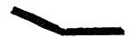

The back of the book is consequently not to be directly supported, and it willl serve to represent the Elbow. Now, the moment we cease fully to support the book, it willl tend to drop, to slide off the keys, and to fold-up (or close) in so doing. The similar tendency of the upper-arm, thus to slip-away from the key-board, may indeed be defined as the immediate cause of the fingers evincing their clinging attitude during "sympathetic" touch. We may be better able to realise these contrasts in muscular-condition, if we call to mind some analogies to be found in other already familiar actions ;- analogies, which, although they form good working ones, owing to their sug- gestiveness, must not be considered as being exact, physiologically. Thus we find, that the bent finger attitude, or thrusting-touch, is somewhat analogous · to the action of the LEG, when used in the act of rising from a chair; or in stepping upstairs, or in depressing the cycle-pedal. From a more or less con- tracted position, the leg here somewhat unfolds in the act of propulsion. The movement of the knuckle-phalanx of the finger here corresponds to that of the thigh. The same attitude of the finger is employed in bringing it upon the violin string. In fact the peculiar action here required, has given a nick- name to the muscle most concerned in fulfilling it; and it is interesting to note, that the tendon from this "fiddler's-muscle" is connected with the under-side of the Knuckle-phalanx, and then passes to the upper portion of the front two phalanges; the muscle itself (one to each finger) lying entirely in the hand. This muscle thus helps to cause the descent of the Knuckle-phalanx, while it at the same time assists the front two phalanges in what is really a rising ac-

APPENDIX TO PART III. 269 tion-relatively to the descending knuckle-phalanx; and the nail-phalanx is thus able to remain erect in spite of the descent or ascent of the rest of the finger. The flat-finger action, or clinging touch, is on the other hand analogous to the action of the ARM, when, extended before us, we employ it to assist us in rising from a chair,-by exerting it downwards upon some object in front of us, such as a table. The manner in which we can help ourselves upstairs by our arms on the bannisters, is another kindred case. So, in some measure, is the action of our legs in walking; for we then employ our leg-muscles dif- ferently to what we do in cycling, or when mounting stairs. Hence the sense of relief experienced when we pass from one to the other mode of leg-exertion. And we experience a similar sense of freshness at the Pianoforte, when, after having practised brilliant " passages, we pass to singing passages, or vice versa;-this, owing to the change involved from "bent" to "flat" finger action. 66 We can also experimentally suggest this contrast in finger-action, if, when seated upon a chair, we first extend our legs fully in front of us, and try to rise by their help in this "flatter" and elastic condition-although, of course, we cannot really raise ourselves in this case; and then contrast this "flat- attitude," by placing our feet almost under our chair, and rising in this case in the usual manner,-the un-bending of the leg in this instance admirably serving to suggest (although with some exaggeration) the action of the finger against the key, in the "bent" or thrusting- attitude. IN-CORRECT VERSUS CORRECT FINGER-TECHNIQUE The Contrast between the Non individualised and the Individualised Finger. 66 NOTE XVI. To §§ 4 and 18, Chapter XVII. The distinction here in ques- tion, is the one between (a) 'stickiness" of finger, with its un-rhythmical passages, and (b) fluency and ease of finger, with its clean-cut, rhythmically definite passages-with every note perfectly "placed" and evenly sounded. The point that should be enforced, is, that the fault can usually be traced to the employment of defective muscular-conditions, which in their turn render it impossible for the sufferer willfully to direct his fingers in quick passages, either as regards Time or Tone. The muscular fault in such cases is the one so often here alluded to and condemned, the use of continuous Arm-pressure behind the fingers. It is, we must remember, the most natural fault to make:-We wish to make the key before us move down,-what more natural, than that we should try to induce this by using the muscles of the back, with down-pressure of the arm? If we wished to press down anything in the ordinary course of our existence, we should certainly act thus, and rightly so. At the Piano the temptation to act likewise is commensurately great, and it must at any cost be resisted. This tendency must indeed be absolutely eliminated, if we wish to succeed in play- ing passages with ease, and wish to avoid liability to a sudden and com- plete collapse of our Technique, when the moment of stress arrives. How often do we find an otherwise admirable performer, suddenly lose all clean- ness and fluency of finger! An unduly felted or over-toned hammer is per- haps presented for his use, and being thus prevented from hearing what a con- siderable degree of force he is already applying to the keys, he endeavours to

270 APPENDIX TO PART III. apply more,—and he willl then be tempted to transgress the laws of finger- technique, and willl permit himself to apply that fatal thing, Arm-pressure, unless the laws of Agility have been fixed into secure habit of mind and body. If these laws are ignored, the passages go from bad to worse, until they become almost obliterated under the more and more laboured progress that ensues upon the key-beds, and the performer leaves the instrument with perspiration streaming from him, and feeling as if he had suffered under the incubus of a nightmare. The fault of all faults to be guarded against is therefore: a continuous PRESSURE exerted downwards upon the fingers by the arm; a condition of affairs that renders the hand as helpless as if it were a hoof, with five prongs attached, instead of fingers. If such pressure is continuous, and at all severe, it absolutely stops all movement across the key-board. To help one to avoid this fault, one should commit it deliberately, doing so in a scale or arpeggio; so that its sensation of stickiness may be vividly experienced, and so that its unfailing result, the complete breakdown of all technique may be as vividly remembered. Less obvious than this continuous arm-pressure, is the occasionally at- tempted correction of it. Many a musician, with even mediocre reasoning power, willl soon learn to avoid the continuous effort behind the fingers just condemned, since he finds himself thereby deprived of all Agility. But this willl not prevent his using the same muscular-combination (ie., direct down- arm force behind his fingers) when he wishes to play forte finger-passages, provided he now carefully ceases such force the moment that tone is reached with each key. And many a player's technique never advances beyond this stage, since it enables him to " get along" somehow, and even at consid- erable speed. Naturally enough, he willl fail to recognise his inefficiency technically, unless his ears are sufficiently quick to detect, that other (and better) players are able to play similar passages with greater ease, and with far more beautiful tone;-or unless he some day, by lucky accident, happens to discover the correct technique,—and is able to recognise it as such at the moment. No, the arm must neither be continuously pressed down upon the fingers, nor may it be "jabbed " down on them for each individual note. There must be none of this, in any shape whitsoever! The only forms of technique that willl permit of the attainment of real Agility, are those two forms in both of which the arm is almost_or entirely supported off the keys by its own muscles-the first and the second Species of Touch-formation; and, either in conjunction with these, or unaided, the Weight- transfer touch-or second form of the act of Resting. Vide Chapter XIX. In this connection it behoves us to remember, that the Wrist-joint must ever remain absolutely free and flexible ;-in proper touch there should never be sufficient down-pressure upon it, to prevent its being so. In the first two species of technique (where the finger and hand alone act against the key, while the arm remains self-supported) the Wrist-joint is indeed in a condition so elastic, that it is almost on the point of being driven off the keys by the rapidly recur- ring, short-lived actions of the finger and hand against the keys--whence we see the reason for insisting on the constant practice of the third of the " Mus- cular-tests described in Chapter XVIII. The wrist should consequently feel as if it were floating in space, in spite of the perhaps quite vigorous finger. and-hand exertions against the individual keys, -exertions, which must of course be so fleeting, and must be so carefully timed in all Agility-touches as "" 1 Perspiration does not however arise only from violent and un-necessary muscular-work at the key-board. It is often indeed copiously induced, by the highly-strung, nervous state of an excitable performer.

APPENDIX TO PART III. 271 to vanish before they induce the slightest impeding action against the key. beds. We can in fact often suggest the correct muscular-attitude here required, by simply insisting upon the Wrist-joint remaining absolutely free,--free almost to the rebounding point, as just described, owing to the upward-recoil kicks re- ceived by it at each sound-consummation. It is also well to remember, that all action must here seem to end either at the Knuckle, or at the Wrist-end of the hand, such action being there felt as an up-driving one, from the keys upwards against the knuckle and wrist,-and such action being individualised for each sound, and as short-lived as the shortest Staccatissimo always proves the act of tone-production to be in its nature. CERTAIN EXCEPTIONAL FORMS OF STACCATO AND LEGATO, AND THE SLIGHTLY HEAVIER RESTING THUS TRANSMISSIBLE "" NOTE XVII.-For Note to § 28, Chapter XVII, page 186. Slightly more Weight than has been described under the two forms of the Resting, can under certain exceptional conditions be continuously applied in finger-passages, both Staccato and Legato. That is, the fingers can carry such slightly-increased load without harm, provided the speed of the passage is considerable, and yet does not exceed a certain limit; and provided moreover, that the individual fingers are used with sufficient vigour in forming the short-lived" Added-impetuses against the keys;-for the exceptionally vigorous momentary action of the fingers, willl in this case prevent such additional weight from actually reaching the key-beds. The process is analogous to the action of the legs in running: for in this case our body is kept floating off the ground by the rapid succession of jump-like acts delivered against it by the legs-a fact that can easily be demonstrated by Snap-shot camera. In such exceptional touches, we can therefore employ a slightly increased weight (or slight hand-pressure, as the case may be) borne by the successive fingers, and as it were kept floating (away from the key-beds) by the aforesaid sharp, individually-aimed (and ceased) exertions of the fingers. The weight (or pressure) must however never be greater than the fingers can thus keep in a "floating" condition, by the rapid succession of their momentary “kicks" or impacts against the key-beds." Provided the Weight thus carried does not exceed a soon discovered limit, we thus obtain a running form of the "kick-off" Staccato, already described; this is suitable for certain bright, brisk, but forte Staccato-passages. By a slightly different adjustment of the continuous weight versus the briskly stepping finger, this kind of technique can be transformed into a softer but legato form, or even into a Legatissimo, such as we often meet with in BEETHOVEN. The extra weight thus continuously carried, might preferably in this case be provided by a slight, continuous activity of the Hand and Fingers, rather than by any extra arm-release. For the slight continuous pressure, 1 I have, in this connection often found it very suggestive, actually to touch the ends of the tendons that chiefly serve to draw the hand down against the keys. The "insertions" of these tendons into the hand at its wrist-end. usually form two easily found slight protuberances at the base of the hand, at its little-finger and thumb side, respectively. 2 Vide Note XVI.; especially the last two paragraphs.

272 APPENDIX TO PART III. thus produced by the hand and fingers, levers arm-weight continuously on to the keys at willl, and the weight is thus more directly and momentarily modifiable, and more elastic, than would be the case did we relax the arm sufficiently to obtain the full amount of weight necessary to induce the effect of Super-legato, for instance. This gentle, added Hand-pressure is therefore particularly suitable to induce the over-lapping of the sounds required in the super-legato inflections of Legato. We here have the "artificial" legato, already several times referred to. To distinguish this from the natural, or Weight-legato, it might be termed a pressure-legato." 66 "I No passage should however be attempted in this form of technique unless the speed is ample to admit of such " pressure being kept in the floating state described, otherwise stickiness is bound to ensue. The cumbrousness of it, also precludes the employment of this form of technique beyond a soon- reached limit of velocity. Now it so happens, that many of the rapid cantabile passages of BEETHOVEN do unmistakably demand just this very treatment. It follows, that here we also find the limit of Speed defined for us, beyond which such passages cannot be performed, if we would fulfil the com- poser's obvious intentions as to Tone. The first part of the Rondo from the "Waldstein" is a case in point. How lamentably often is it attempted at a Tempo, not only faster than Musical-sense commands, but faster than it is physically possible to execute the rapid cantabile semiquavers, with the ob- viously required thick tone! Instead of employing (as should be done) the second Species of muscular-combination either in its normal (Weight) legato form, or in the artificial (Pressure) legato form here considered, we often hear these beautiful melody-passages SKIMMED through with first Touch-species, with its thin passionless tone;-so that the performer may forsooth have the opportunity of making his audience gape at his supposed wonderful Achieve- ment in racing across the keys "at incredible speed !' Knowledge of the Components of the various touch-kinds, and the respec- tive Speed and Tone possibilities of the three species of formation, willl there- fore often assist us in determining even the Tempo of a piece.. BEETHOVEN, for instance, rarely, if ever, employs the first Species,-indeed, he probably never discovered that trick of modern extreme Agility-passage touch! He mostly requires second Species, and often the third, with its fullest of full tones, but comparatively low Speed-power. Besides the possibility of thus producing Legatissimo inflections by slight Hand-pressures, we may also in similar manner produce such inflections by slight pressures, sufficiently continued, but derived from the fingers alone. Such un-aided finger-pressures, are the ones most suitable for the legatissimo inflections of light running passages. 1 Vide Preamble to this Part, Note 4, page 112. 2 Vide Chapter XIX., Note to § 7 and § 12.
• Vide § 6, Chapter XVII., and Chapter XIX. Vide. Also the Note. No. VII of "Supplement" on "Artificial" Legato.

## PART IV. ON POSITION

### CHAPTER XXII. PREAMBLE: SYNOPSIS OF THE MAIN ASPECTS OF POSITION

§ 1. CORRECT POSITION of limb and body, in nearly all its details, willl arise as a necessary consequence, if we adopt the correct muscular Actions and Inactions required in playing. Readers who have even slightly grasped the truths treated of in the preceding chapters, hardly require to have it pointed out, how deplorable has been the mistake committed by nearly all teachers until recently, in attaching such vastly exagger- ated importance to the subject of "POSITION," as to cause them to place implicit reliance on what has proved a veritable quick- sand. Many indeed going so far as to make it into an abso- lute fetish.¹ "" Now although it must be granted, that we cannot play cor- rectly (that is at our easiest) unless the chosen positions are also correct-unless they are the most convenient ones, yet it does not in the least follow, that the adoption of "correct Position, at rest, and during the necessary movements, willl in the least ensure our employing those particular muscular-atti- tudes (or conditions of Activity and In-activity) which alone enable us to fulfil the requirements of the Key for each partic- ular variety of tone.? 'Vide Appendix to this Part, Note XVIII. :- "The fallacy of 'Position' worship." Vide, for instance: § 13 of Chap. XVI., page 152. 273

274 ON POSITION. Bad Position and incorrect Movement no doubt form valu- able warnings, since they form visible signs that totally ineffi- cient muscular conditions are being employed, or that the de- sirable ones are being employed not at their easiest. Correct position, on the other hand, unfortunately does not form any guarantee whitsoever that the very fundamentals of Tech- nique are correct, since it forms no reliable indication either that the muscular-conditions are correct, or that the mechan- ical-requirements of the key are being fulfilled. It is necessary to insist on this point, since a degree of importance has been generally attached to Position that is absurdly out of all proportion to its real significance. The fallacy has been, to perceive in Position the CAUSE of good technique; whereas we must now recognise it in its true as- pect and let it arise, mostly, as a RESULT of the correct muscu- lar and mechanical conditions being fulfilled at their easiest.¹
§ 2. The subject of Position includes the normal positions of the body and limbs when seated before the key-board, with the hands at rest upon the keys, and it also includes the posi- tions that have to be assumed during the execution of the various movements that accompany the individual acts of tone-production, and that precede such. As the subject thus naturally divides into two sections, it willl be best to con- sider its details also in a measure separately.
§ 3. Since our rule must be, to adopt the positions and movements that enable us most easily to fulfil the required muscular-conditions, it also follows that not only are slight 1 Often indeed do we find the unwary hoping to attain good Technique by watching and imitating the visible effects exhibited by great players, while they are not in the least discouraged by finding no amelioration of their Tech- nique as a result of such mimicry. Such seem to fancy that Playing depends on the look of it, and not on the sound of it! This does not signify that we should under-estimate the advantage of hear- ing a good performance. On the contrary, it may prove invaluable, if we willl but use our ears chiefly, instead of our eyes. Musically, it may help to fire our enthusiasm, and technically it may also help us greatly; the example of beauty of tone, of variety in all its subtlest gradations, the evident ease with which all is accomplished, may, if we are earnest seekers for musical-success, cause us to experiment until we find ourselves also capable of obtaining simi- larly beautiful effects from our instrument.

PREAMBLE, PART IV. 275 variations of position from the mean allowable, but that they are often an absolute necessity. For there are no two players whose bodily conformation is absolutely identical, whereas the Pianoforte remains an "unchanging quantity" as regards the size of the keys it presents to the player. Every detail as to the actual or relative size of the finger, hand, fore-arm, and especially of the upper-arm, and of the body itself from the hips upwards, must therefore influence our ulti- mate choice of easy posture. While there must thus be slight divergences in Position in some directions, there are others however, in which there can hardly be any variation without seriously militating against the mechanical efficiency of the concerned limbs.
§ 4. Here we consequently come to some really important facts relative to Position. But even here, we shall not choose wrongly if we plainly bear in mind those necessities of muscular-action and inaction we have learnt to recognise during the preceding chapters. These points of greatest importance are three in number, for unless these are attended to, we shall find it impossible to provide certain of these much desired muscular-conditions at their easiest. "
§ 5. First and foremost amongst these, is the one relating to position of the shoulder relatively to the keys, a position depending upon the relative length of the fore-arm and up- per-arm. The law being, that the shoulder must be suffi- ciently removed from the keys to enable the arm to be unbent almost into an obtuse angle, so that we can conveniently reach all portions of the key-board, and more important still, so that we can when required, allow the weight of the upper-arm to take effect upon the keys by mere lapse in its support ;—an operation that becomes impossible if we sit too close to the key-board.
§ 6. The next point is, when we employ "bent-finger" touch-brilliant or thrusting touch, and are playing the finger for this purpose from a distance, that the finger's position when raised, can then indicate whether or not we shall be able to employ the requisite muscular-conditions for this kind of

276 ON POSITION. touch. For we shall find ourselves unable to provide these, unless the finger does in a measure unbend towards and with the key in its descent, and unless consequently the finger is started in a position the more curved the greater its prelimi- nary elevation.¹ For the clinging, or flat-finger touch, we must likewise note that the finger must here be the "flatter" the more we raise it as a preliminary to the act of tone-production."
§ 7. The third point is, that the hand must be so placed in its lateral direction relatively to the keys, as to avoid all un- necessary lateral movements so far as possible, while executing with perfect ease those that are necessary for the convenient passage of the thumb, etc., and for the negotiation of exten- sions. We here find that the hand and fingers remain in a straight line with the keys during "five-finger" positions; that they remain pointing inwards during scales; that in dou- ble-notes passages they point in the direction in which the pas- sage is travelling; and that in arpeggi and in other spread- out passages, while the normal position of the hand is the inward-pointing one (or "wrist outwards"), additional hori- zontal movements are required of it to bring the fingers prop- erly over their notes.
§ 8. Subsidiary details willl receive further treatment in the following chapters; but it may meanwhile be pointed out, that the wrist-level should neither be exaggeratedly low or high, but about level with the fore-arm, an over high position being likely to cause forward-driving from the shoulder. The knuckle of the hand must also be held well away from the keys, and about level with the wrist and fore-arm, or very slightly higher, so as to give plenty of opportunity for the fingers to bear up- wards there, a position which of course is totally at variance with the "knuckle-in" fallacy. Our seat at the instrument should also be always in the centre, sufficiently distant from the instrument, and of such height as to allow the lower part of the fore-arm to be on a level with the keys; since 1 Vide Fig. 6, page 151. 2 Vide Fig. 7, page 151.

PREAMBLE, PART IV. 277 " a lower position willl render brilliancy more difficult, although it rather tends to further clinging touches.
§ 9. The finding of correct notes, has so far been regarded as one of the aspects of Position. The previous chapters have nevertheless demonstrated to us that this ground is also cov- ered, by simply insisting on the proper fulfilment of the act of Resting-in either of its two forms; for not only does the act of Resting induce certainty as to Tone (i.e., certainty as to Expression") but it also furthers certainty in reaching the correct keys. 66 If we properly fulfil the act of Resting, we can—and must- reach each successive key through muscular-sensation; it fol- lows that we must reach each successive key as a progression laterally from each preceding key. We hence realise and exe- cute each sequence of notes, as a succession of distances accu- rately judged from each preceding key; and we thus find, that the act of Resting, conscientiously fulfilled, engenders cer- tainty in Notes, as well as certainty in Tone-kind and degree.
§ 10. Understanding then thoroughly, that correct position is no guarantee whatever that the essential muscular-condi- tions are being satisfactorily promoted, and that the sub- ject of Position is only important in so far, that inaccuracy in this respect does render it more difficult to provide these correct conditions, the fact nevertheless remains that the study of Position is indeed important, although not so important as has been popularly supposed, and certainly not one of those "short cuts" to the top of Mount Parnassus, so beloved of the amateur reasoner.

278 ON POSITION.

### CHAPTER XXIII. THE DETAILS OF POSITION

MOST of the details of Position have already been fully dealt with in Part III., under the aspect of muscular action and inaction. In addition, it has been pointed out in the last chapter, that there are certain of these details of Position that require careful watching. For the sake of completeness, however, it is now desirable to go over the whole ground from its positional aspect. In doing this, we must not forget, that correct Position should be but the natural result of the fulfil- ment of the exact muscular-conditions required by correct Key-treatment, and that we must beware of falling into the error of regarding Position, itself, as the cause of correct touch.
§ 1. Two distinct positions of the finger, ver- Finger-position, tically, are available, corresponding to the differ- vertical aspect. ence between the Thrusting and Clinging attitudes. This distinction between the comparatively "bent" and com- paratively "flat" finger, should arise directly from the finger's duties relatively to the upper-arm;-the position assumed should occur as the natural consequence of the Elbow tending either to lie forwards, or to hang backwards, thus causing the finger either to thrust or to cling. But it is important to pay close attention to the accompanying divergences of position; since incorrect position, here, may actually prevent our using our fingers correctly, muscularly,-although it does not follow that correct action willl supervene owing to correct position.
§ 2. These differences in position are not so noticeable, when the finger is depressed, as when it is raised. Indeed, the curvature assumed may be almost identical, when the finger See Chapter XVI., § 11. etc., page 150; Figs. 6 and 7, page 151; Chap- ter XVII., § 12. etc., page 164; Figs. 8 and 9, page 166; Fig. 10, page 167;
Fig. 11, page 170; and Figs. 12 and 13, page 171.

THE DETAILS OF POSITION. 279 is depressed, unless it is a question of obtaining the more ex- treme effects of either "brilliant" or "sympathetic" tone-qual- ities. Whereas, if we require either of these tone-char- acters very definitely, then the fingers must assume their full distinction in curvature, even with fully depressed key. These distinctions nevertheless always display themselves in a marked manner when the finger is raised, especially if it is well-raised; and it is here therefore that we can best study and watch finger-position. And it is moreover in the case of the nail-phalanx and its neighbour, that the distinction in pos- ture is particularly noticeable.
§ 3. IN THRUSTING-ATTITUDE (“bent-finger"), the higher the preliminary raising, the more does the finger tend to bend upon itself. Conversely, it unbends (or tends to open-out) as it falls upon the key, and moves down with the latter. The nail-phalanx is here employed in an almost vertical position, which it retains both during the ascent and descent of the finger. Unless we do thus start with a well-bent finger, it willl be difficult to attain a really brilliant finger-touch.¹ IN CLINGING-ATTITUDE ("flat-finger"), on the contrary, the finger straightens out in proportion to its preliminary raising; while it either remains straight during descent, or tends to close upon itself." If we start with a flat finger, we shall, in bringing the finger against the key, either curve it inwards, and thus cause the clinging effect; or, if we try to avoid that, we shall probably jerk the elbow forwards with each finger-a most reprehensible action. Hence, the importance of seeing to it, that Bent- finger touch starts bent.
(a) 66
(b) Let us consider these distinctions somewhat further:-The Elbow, when it tends forward, requires the thrusting finger to support it upon the key. The finger's duty (during key-descent) is here akin to that of a flying buttress " (Vide a, Fig. 14); the stresses it undergoes and its position approximating to that contriv- ance. The meeting-point of buttress and wall here corre- sponds to the meeting-point of the finger and hand at the Knuckle; and the finger natu- rally assumes its convex posi- tion because the force exerted

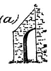 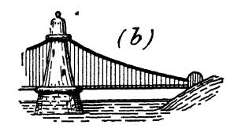

FIG. 14. by it is upwards and backwards against the knuckle,-by re-action from the The backward-tending Elbow, on the contrary, demands a lax-left key.

280 ON POSITION.
§ 4. We notice that the difference between the two finger attitudes is most shown when the finger is considerably raised off the keys, and we can thus detect certain faults by the eye; such as that of commencing with the opened-out finger when "thrusting" or bent-finger touch is nevertheless intended; or the opposite fault, that of "nipping" with the finger, when a round tone is intended. The very MOVEMENT itself of the finger, in falling towards the key, can moreover in some measure indicate when certain faults of action are committed; the finger, for instance, that sins in really hitting its key, goes down like a flash, whereas the finger that is used with intention-" that means to use its key," can usually be actually seen to begin its descent upper-arm, with its corresponding clinging action of the finger, to draw weight upon the key-during descent. In this case the finger's duty and condition may be compared to that of the suspension-bridge cable (Vide b, Fig. 14). The point where the cable reaches the tower is here supposed to represent the Knuckle of the hand. And although the analogy does not hold good in so far that the cable does not support the tower, and also that the finger never really assumes so concave a position as the cable, yet the tendency is towards such concave position,—a comparatively flat (or even completely flat) position the finger is compelled to assume because the stresses of the middle of the finger are here not dissimilar to those we can imagine the cable to undergo. Comparing the forms of arch exhibited by the finger in these two contrasting capacities, we also find that the arch is far more acute in the case of thrusting touch than in the clinging form. For thrusting-touch, the finger is indeed so greatly rounded, that it forms approximately a quarter of a complete circle, from knuckle to tip (Vide
Fig. 15); while for clinging-touch, on the con- trary, the finger forms merely a small portion of an immensely larger circle, and the arch being so much weaker, this increases the finger's elasticity.

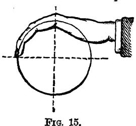

FIG. 15. The arch-form is indeed quite lost sight of, when we require tone really of the fullest sympathetic character. The front two phalanges are in this case left so limp, that the finger completely loses its curve, and may indeed almost turn "inside out," without harm. In this connection it is interesting to note that CHOPIN evidently often em- ployed the "fully sympathetic touch," for we find eye-witnesses remarking with astonishment, that "he seemed at times to play with his fingers perfectly flat." The singing-touch shape of the fingers is also very clearly expressed in a cast of Chopin's hand in the possession of Mr. E. W. Hennell,- -a cast, which I think must have been taken with the hand on the key-board, its position is so natural for the kind of touch most required in the Master's music. (Vide Note 2, to § 20, of Chap. XIX., page 225.)

THE DETAILS OF POSITION. 281 towards the key quietly-persuasively, however well-raised it may be to start with, and however loud and quick the passage may be.
§ 5. In flat-finger touch, the fleshy part of the finger (the part opposite to the nail) is brought into contact with the key,¹ whereas in bent-finger touch, contact is made by the very tip close to the nail-the nail itself however not being permitted to touch the key. Owing to the clinging nature of the flat finger's action, the tendency is also, to draw the flesh towards (and even round) the nail; whereas the thrusting action of the bent finger not only precludes this tendency, but would encourage the op- posite tendency (to draw the flesh away from the nail), were it not, that an absolutely vertical application should be insisted upon. (Refer again to Fig. 6, page 151.)
§ 6. In bent-finger touch, the fingers should all be nearly equally rounded. In the case of the fifth finger being abnor- mally short, it may however be used in a very slightly straight- er position. It should nevertheless not be used straighter (in this kind of touch) than is necessary to enable us conveniently to reach the key-board with it and the thumb simultaneously.?
§ 7. Ample preliminary movement of the finger is healthy, provided it is not excessive, and does not lead to "hitting," and provided there is time for it. Provided also, that such ample raising—or "playing from a distance "—is undertaken solely for the purpose of attaining freedom during the subse- quent stepping-upon the key, or key-attack. We must be par- ticularly on our guard, lest we fall into the common error of 'Hence has arisen the absurd fallacy, that the more sympathetic result of "flat-finger" is owing to this "more sensitive" part of the finger touching the key! The moment the finger is much straightened out, it tends to become more elastic, although we may meanwhile try to insist on its thrusting action. A really short fifth finger is hence found to be a considerable disadvantage for brilliant touch, although this is often not discovered by its owner, owing to his avoidance of this finger during the course of brilliant-touch passages. And when used at the ends of such passages, the disadvantage is not strik- ingly obvious, owing to the advantage the finger may then receive in the form of rotation-touch. (Vide § 12; Also Note XIX., Appendix to this Part: "The straight fifth-finger.”)

282 ON POSITION. allowing such raising, itself, to be looked upon as the object to be attained, instead of its being regarded merely as the accompaniment of free action.1 The Thumb.
§ 8. The difference in attitude (action) exhib- ited by the thumb corresponds to those of the other fingers, although the visible differences in movement are small. Thus the thumb tends to unbend in descending towards the key in thrusting touch, and it tends to contract in cling- ing touch. And although there is a very marked difference muscularly, the resulting difference in movement is (and should be) so slight as almost to baffle the eye. The thumb should usually form a sufficient angle upwards towards the hand at the wrist, to give it ample freedom of movement, even when it has occasionally to be used under the hand. The thumb should therefore never be allowed to be held contracted against the hand-held tight against the base 2 1 We must always bear in mind, that if key-attack is to be certain in its musical results, it must commence without much actual hitting of the key- surfaces, and that all tone-producing stresses should occur in more or less un- conscious response to the resistance experienced from the keys themselves. Excessive raising of the fingers actually impedes their action. Nothing can be more pernicious than pulling the fingers up until they "kink." 66 "" The nail-phalanx should moreover never be permitted actually to point up- wards-even in the flattest touches. This phalanx may reach an almost level (or horizontal) position, when the "flat" finger is raised to its fullest extent,-- Vide Fig. 7, page 151,-but beyond such level it cannot be raised with- out vitiating the subsequent act of tone-production. And we see moreover, that this nail-phalanx must remain upright in "bent "-finger touches, both when it is raised and depressed,-the tip of the finger, close to the nail, here continuously pointing towards the key-Vide Fig. 6, page 151. As already animadverted upon, (pages 131, 132) one cannot too strongly deprecate that particular little" corner "in fetish-worship, the "high-raised finger." So far from its being productive of good results, we find it is gen- erally associated with the fallacy, that the fingers should act as hammers against the keys-the fact that it is the strings we have to play by means of the keys being quite lost sight of! 66 Nearness breeds contempt," is by many people reversed into "Far-ness breeds veneration" (to alter the old adage slightly), and as the doings of the departed are therefore apt to be of greater authority than those of the living, it may be well here to point out, that as regards the finger-action of that greatest of Pianoforte-wizards, FRANZ LISZT, it often seemed (as ob- served by myself and others) "as if his fingers hardly moved at all," his marvellously soft, rapid passages appearing merely to glide along, absolutely without effort.so "close to the key-surfaces" was his technique at such times. 2 Vide Fig. 6, page 151.

THE DETAILS OF POSITION. 283 of the index finger, as in accompanying Fig. 16. It is a fault that is frequently to be met with, and it cannot be combated too early. More on this point appears under the horizontal aspect of the fingers. (Vide § 12 of this chapter, and illustra- tion of correct thumb-position, § 13, page 290.)
§ 9. The movement of the thumb arises near the wrist-end of the hand, whereas the movement of the finger arises at the

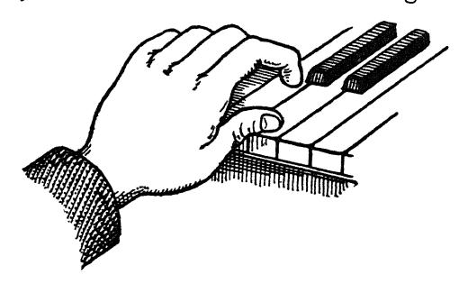

FIG. 16.-Faulty position of the thumb. knuckle of the hand. That the thumb's movement thus dates further back than that of the fingers, and that its pivot, as it were, is some inches behind that of the knuckle, is a fact often not realised, and this leads to a constrained action of the thumb; the learner trying to bend it vertically in the middle, which of course is impossible. Finger-position
§ 10. In Hand-touch, the fingers required to in Hand touch the keys, should assume their fully de- ("Wrist ") pressed condition relatively to the hand, before touch. commencing the downward movement of the hand. In rapid passages of this nature, the new finger (or fin- gers) should take up their position while the hand (and pre- viously used fingers) are ascending from the last played notes;-i.e., the next required fingers should be as it were, "left behind" as the hand rises, so that no movement is re- quired of the fingers during the subsequent descent of the hand.¹ This trick of allowing the new fingers to assume their depressed position relatively to the hand, during the latter's ascent, can be easily acquired, by

284 ON POSITION. In passages of single notes (or of double-notes, when the extension is small) it is possible to combine finger and hand down-movement against the keys; but in passages of exten- sion, such as octaves, this is most un-desirable, as it seems to hamper the free movement of the hand. During the continu- ance of such passages, the thumb and little finger should re- main depressed relatively to the hand once they have been placed in position. The same rules apply to touch accom- panied by Arm-movement. Finger-staccato.
§ 11. Since there are two kinds of Finger- arm Attitude-the Clinging and the Thrusting, it follows that there must be two corresponding kinds of Stac- cato available. In the case of Finger-staccato, this dif- 4

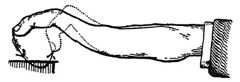

FIG. 17; showing movement of the finger in flat-finger (or clinging-touch) Staccato. ference in muscular action manifests itself in a slight difference in the return-movement of the finger—a slight difference in the way the finger rises off the keys. . . This return move- ment is continuous with the descent, for the ascent should commence as a rebound at the instant that tone is reached. The consequence is: that in finger-staccato with Thrusting- attitude, the finger bounces back in the same line as in its de- scent, or it may even tend to drive slightly outwards. Whereas, in the case of the Clinging-attitude, a slight in- ward pull of the front two phalanges accompanies the rebound of the finger; and the finger thus assumes a more rounded po- sition as it rises, than before its descent. (Vide Fig. 17.1¹) practising the following Exercise :-Execute a free throw-up of the hand (as in the "Third Daily Test "-Page 209) and allow the whole of the fingers simultaneously to recede (or fold) into the hand. I say "allow the fingers to fold," advisedly, for it is of no use doubling them up with effort. There must be absolute freedom in their folding thus during the hand's ascent, and they must seem really to " remain behind," '-so leisurely must be the action. It is a curious fact, that while certain Piano "methods" have insisted upon the exclusive use of the bent finger for all Legato passages, they have

THE DETAILS OF POSITION. 285 The explanation of the process is as follows: As all three pha- langes are equally exerted in Clinging-touch-or the knuckle phalanx more than the others, it follows, when we suddenly cease the finger-exertion, that it is more natural to begin this cessation (and consequent recoil) with the knuckle phalanx; and the front two phalanges consequently still slightly continue their contraction while the key drives the finger up, and prompts its knuckle phalanx into an upward action. The re- sult is, that the finger is more bent at the end of such move- ment, than at starting; the front phalanges giving a slight fillip inwards somewhat analogous to the similar action of the horse's foreleg. As all unnecessary movement is always to be deprecated, the inward swing of the fore-part of the finger should never be great-and it is even slightly exagger- ated in Fig. 17. Finger position, horizontal aspect.
a): During Fibe-finger position: When the pas- sage is of the five-finger order, with the five fingers (or fewer) falling on adjacent notes, diatonic or chromatic, i.e., when the notes lie so conveniently under the hand that they can be evenly executed without the intervention of any lateral (horizontal) movement of the hand, then the normal position is: that the middle-finger remains in a straight line with its key, and this, no matter where the hand is located on the key-board.
§ 12. Looking down upon them from above, the position of the fingers relatively to the keys varies with the kind of passage to be performed: The places where the fingers should reach the keys are in this case such, that with the five-finger position on five adja- cent white keys, the middle finger reaches its white key close to the front edge of the black keys. The other fingers fall upon 1 also exclusively insisted upon the flat finger for Finger-staccato! It never oc- curring to the sufferers, that "bent” and “flat" are equally applicable to both Legato and Staccato! The middle finger should play thus close to the edge of the black keys, because this willl permit our reaching the black keys without having to shift our hand and arm forwards and backwards, which clumsy movement would otherwise be necessary. The fingers should therefore normally be sufficiently bent in thrusting-touch, to admit of their reaching the black keys without greatly losing their "bent" characteristics. In clinging-touch, the fingers can

286 ON POSITION. their keys slightly nearer the edge of the key-board, each accord- ing to its length-the actual places thus varying with each indi- vidual hand. Employing a normal hand in the bent at- 5 ..4.. 3 2

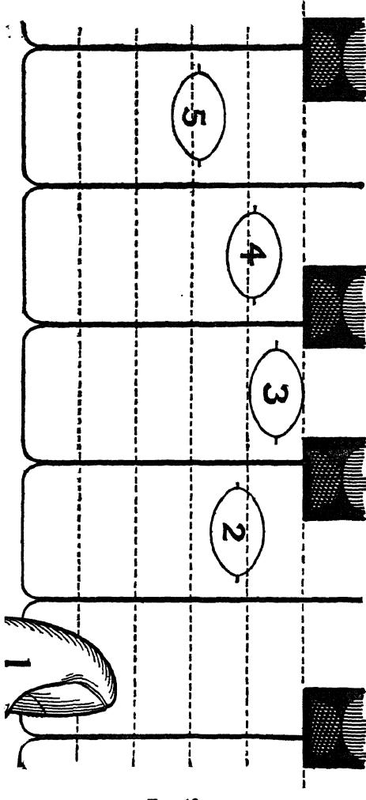

FIG. 18. titude for thrusting touch, it willl be found that the index finger willl be nearly one finger- thickness behind the middle finger, if we look at the fingers sideways; the ring-finger willl be half-way between these two points on the key- board; the little-finger willl come one finger- thickness again behind the index-finger, while the thumb willl fall into line one finger-thick- ness behind the little- finger. Thus, taking the dotted lines drawn 1 across the keys in Fig. always easily reach the black keys with no risk of altering the touch-character. It is for this reason that tonalities with many black keys lie so easily under the fingers for this kind of touch. 1 The extent to which the thumb should reach on to its white key-its distance from the edge of the key-depends
(a) on the length of the thumb, and (b), on the_comparative height of the Knuckle and Wrist. The shorter the thumb, the nearer the edge does it naturally fall; while it is brought more on the key the more we raise the knuckle and lower the wrist.

THE DETAILS OF POSITION. 287 18 to represent the thickness of the finger-tips, we should approximately obtain the relative results there depicted, taken from a rather large hand,—the result roughly forming a semi- circle.¹ The fingers also naturally fall into this shape, if they are placed round a ball of the exact size that willl cause their tips to reach a level line; an experiment that also indicates the proper curve of the thumb.2 Employing such a normal hand, but in the flat attitude in place of the "bent," the middle-finger remains close to the edge of the black keys, as just described, but the other fingers must fall either slightly nearer the edge of the white keys, or further away from it, than in the example given. The partic- ular conformation of the fingers determines the exact place. This, it must be understood, is always the case, since this point willl not admit of any hard and fast rules being laid down; and the example (Fig. 18) is given purely as an illustration of what happens in this particular case, a normally large male hand. That the fingers should reach the keys all in a straight line, is a fallacy, as already alluded to in § 7, and in Note XIX. of the Appendix to this Part- "The straight finger," which see. It has arisen from the false idea, that un- less the fingers reach the keys at the same distance from their edge, thus giving the same leverage, that this willl cause un-evenness of touch.—A very pretty theory, and quite correct so far as the leverage-power over the keys is con cerned; but it fails to take into account that none of the fingers are naturally equally powerful; and that to make up for this deficiency, so far from placing the little finger and thumb in a line with the other fingers, it would (accord- ing to this argument) be better to place them nearer the edges of the keys. And it altogether loses sight of the fact, that the fingers do individually and instantly adapt themselves to the constant change of key-leverage presented to them during performance, if the performer has learnt to be guided by his sense of Key-resistance, -as he should be. Unless we did thus constantly adapt ourselves to the key-board, how for instance could we execute any passage with evenness that lies across and between the black keys? On the con- trary, we find that the fingers instantly adjust themselves to the changed lev- erage, provided we do employ our muscular-sense and our ear with proper alertness. The practice of all the scales and arpeggi with the major fingering, which forms such excellent training, and has been termed "level- ling the key-board," may be cited as a useful object lesson to those faddists who would endeavour to obtain Evenness by placing all the fingers in a row, no matter how long or short they happen to be! Such natural position at the key-board is, however, only possible with a normally large hand. An abnormally small or large hand must therefore diverge slightly from this most natural position, since the key-board itself remains unchangeable.

288 ON POSITION. The position given in the figure, is moreover bodily trans- ferred forward, when we require the five-finger position with the thumb on the black keys. The line formed by the edge of the black keys must in such case be regarded as the limit of the key-board, and those fingers requiring white keys must reach them as well as they can in between the black keys. Moreover, if the fingers are too thick-tipped conveniently to do this, then the hand must be slightly turned either outwards or inwards (as described under b and e) to enable them to do so. 6): When the passage, on the contrary, demands a lateral displacement of the hand, such as is required to allow the thumb to "pass under,"-as in the single-note scale and arpeg- gio, then the fingers no longer remain in line with the keys, but are instead placed at an angle with them, the thumb being more or less extended, and the Hand being turned slightly inwards, or the Wrist outwards, as already explicitly ex- plained in Chapter XVII., § 34; and further alluded to in § 23 of this chapter.¹ But whichever way we turn the fingers (or the wrist, or hand), the middle finger should remain close to the edge of the black keys, so long as the passage does not require the help of the thumb on a black key.
-
c): Scale-position: During the single-note scale, this out- wardly turned Wrist (or inward-pointing hand) becomes the normal position for the time, since we should otherwise have to make unnecessary to-and-fro movements of the hand twice during each octave.
d): Arpeggio-position: During the single-note arpeggio, not only must the normal position be the same as in the single- 1 In thus turning the hand or wrist outwards or inwards, it should always seem as if the initiative came from the FINGER;-i.e., it should seem as if the fingers drew the hand from side to side, or turned the wrist outwards or in- wards; and it is probable that a slight sideway activity of the fingers does really help to encompass such movement of the hand, or wrist itself. Un- less the fingers thus prompt the movement, we are apt to have a mental put- ting of the cart before the horse. And not only this, but we are likely to em- ploy the arm-moving muscles for the purpose, which we should certainly not do; for the movement should arise entirely from the side-to-side activity of the HAND-muscles-perhaps supplemented by those of the fingers themselves, as just suggested. Vide, also, Note to § 23, as to the turning under of the thumb, etc., and also § 24.

THE DETAILS OF POSITION. 289 note scale (with inward-turned hand and fingers), but the ex- tensions involved in turning under or over, here demand in addition a sufficiently ample horizontal movement of the hand or wrist; this movement being however provided to an extent no greater than is really necessary to enable the fingers and thumb to reach their notes easily.¹
e): Double-notes scales: For double-notes scales in thirds, the fingers and hands have to be turned in the opposite direction— the hand outwards, or the wrist inwards-when the passage moves from the centre towards the extreme ends of the key- board. This is to allow of our passing a longer finger over a shorter finger in making the connections between the succes- sive fingering-positions. The reverse rule applies when the passage moves back towards the centre of the key-board, and we can formulate all this, by saying: "In double-notes passages, the hand must be turned in the direction in which the passage is travelling."
f): Other double-notes passages: The last mentioned rules apply to all double-notes passages, equally,-including those constructed on the double-note (or quadruple) arpeggio; these latter, however, demand slight lateral movements in addi- tion. In this connection it should be noted, that when we turn the fingers over the thumb, or a long finger over a short one, in double-notes passages, that we cannot then retain both notes depressed their full value. In these cases, it is the thumb or the little finger, alone, that for the moment continues the act of "Resting." Again, when we use the thumb twice in succes- sion in such double-notes passages, since we cannot continue the Resting by means of the thumb during its repetition, it follows that the Resting must here be carried from key to key by the other fingers, so as to enable the thumb to rise and take its second key. These things should be carefully attend- ed to by learner and teacher; for the formation of habits is easy, whereas the eradication of them is difficult. 1 Such ample lateral movements of the hand and wrist, enable us to avoid any unnecessary, excessive "turning under" of the thumb, and the consequent helplessness of that member.

290 ON POSITION. The curve of the thumb.
13. The thumb, looking down upon it from above, should moreover always be more or less curved convexly, unless used under the hand, or upon two adjacent keys.' That is, its nail-phalanx must always remain in a straight line with the key it is employed upon, as shown in the accompanying Fig. 19; and not twisted, as for instance in Fig. 16, on page 283. The exceptions are: when
FIG. 19.-Correct po- sition of the thumb. the thumb is required to sound two adjacent white or black keys. The last-mentioned rule is then reversed, and the thumb is then extended almost straight from the hand, or it may even be concavely curved-curved out- wards. The thumb must also be held straight, or even concavely, when it has to reach under the other fingers.
§ 14. Finally, it need hardly be pointed out, that each finger should reach the very centre of its key. Unless we constantly en- deavour to make the finger do this, we risk sounding two keys in place of the one intended, thus "splitting" splitting" our notes, or smudging them. On note-find- ing.
§ 15. The fingers should find their keys before any attempt is made to depress either finger or key. It is quite wrong to reduce into a single ac- tion, the act of finding the keys, and the act of depressing them. The two actions may form a continuous movement, but they must be separate, mentally. The position of each key, should, moreover whenever possible, be derived from the note or notes last played. Close attention to this rule, forms an in- fallible cure for wrong note playing."2 66 1 One should especially be careful to train the thumb to prepare its note in turning-under while the preceding fingers are still engaged in sounding their (Vide to 24.) notes. Whenever practicable, we should not quit the key last used until the next key is found; and we can still retain our hold of the previously used key, although we may have allowed it to rise.

THE DETAILS OF POSITION. 291 Both these last rules become automatically fulfilled, if we insist on the Act of Resting, as set forth in Part III. On sound-find- ing.
§ 16. Position INSIDE the keys, however, is an even more important matter, than the finding of the right notes. -Our ears must for this purpose be constantly on the alert, so that we may accurately observe where in its descent the key's speed must culminate, and our tone-making efforts cease. All accuracy in Expression depends on this.¹ Position of the Hand and Knuckles.
§ 17. It is important that the Hand should be held level. That is: the knuckle of the fifth finger should be at least as well raised off the keys as the knuckle of the index-finger. It is better even to err on the side of giving the fifth finger the advantage in this respect. There is no difficulty in encompassing this, if we adopt the outwardly-turned Wrist as the normal position.²
§ 18. We now come to the much debated question as to the height of the knuckles off the keys. After study of Parts
II. and III. of this work, there can be no difficulty about this question, for it is obvious that the height of the hand at its knuckle-end should arise solely as the direct result of correct action on the part of the fingers that support it there. If the finger activity is the correct one, and of requisite degree, then the correct position of the knuckle must of necessity ensue; and it is well to remember that it is of no use insisting on cor- rect position here, unless it is provoked by the correct con- dition of balance between Finger-force and the other two com- ponents of Touch-structure. 1 If we "play too late"-in key-descent, as so often already insisted upon, not only does this constitute loss of Energy, and loss of accuracy in Expres- sion, but we are also then liable to overdrive the mechanism of the instrument, creating real hardness of tone, and even risking damage to the hammers and strings. 2 Not only is the fifth finger placed at a great disadvantage, mechanically, unless we keep that side of the hand well up, but the reach of the thumb is also materially impaired. Also, if we allow the hand to slope towards the fifth finger, we shall find that the fingers willl have to be used against the keys at an angle, instead of vertically as they should be; and the thumb willl also be unable to reach its key with the side of its tip-close to the nail, as it should.

292 ON POSITION. Relatively to the wrist the Knuckle may either be level or somewhat higher. (Vide Figs. 6 and 7, page 151, also Figs. 8 and 9, page 166.) The actual height off the keys, and height relatively to the fingers, varies (a) with the form of touch employed, (b) with the size and conformation of each individual hand, and (c) with the height of seat habitual to the player. It is therefore quite a mistake to imagine that uniformity of position should here be a law. On the contrary, it is likely to lead to uni- formity and restriction of touch "method"—to one-sidedness and want of colour in performance. Thrusting-touch is nevertheless usually found more easy of attainment with the knuckle kept somewhat higher relatively to the finger than it is in Clinging touch, but the reverse may even here be found more convenient with some hands. As the keys are an "unchangeable quantity," a large hand also usually finds a higher knuckle more suitable in all touches than does a small hand, this being particularly noticeable in thrusting-touch.¹ There is however one point that can be definitely laid down as a law, and this is: that the knuckle must never be lower than any part of the finger WHEN THE LAT- TER HAS DEPRESSED ITS KEY. The knuckle should therefore be kept well raised off the key-board by the fingers. It should be kept so well raised as to allow absolutely free passage and movement to the thumb, when turning under. Although the knuckle may thus under certain circumstances be level with the knuckle-phalanx, yet, as a rule, it is found best that it should form (more or less slightly) the highest point of the finger, when this is depressed. Figs. 6 and 7, and Figs. 8 and 9 should here again be referred to.2 1 The knuckle-phalanx (from knuckle to first joint) willl in these cases slightly slope downwards-when the finger is depressed on a white key. When the same finger is on the contrary depressed with a black key, there may be hardly any such sloping noticeable. And with certain hands this knuckle- phalanx is normally thus held level; although the slightly higher knuckle does undoubtedly form the stronger position for thrusting-touch. 2 The doctrine, that the knuckle should be "held in "-that the hand should be crushed down on the fingers and keys, cannot be too strongly condemned. It has done so much harm that it must again be referred to. Natural Law is no respecter of persons, however halo-crowned (and deservedly so) they may

THE DETAILS OF POSITION. 293 As already pointed out, the actual height off the keys varies with the form of touch employed. The only exception, perhaps, to the rule of the well kept-up knuckles, is in the case of clinging-touch of the most sympa- thetic order, such as in that ultra-elastic touch-form so often required for the CHOPIN melos. In this case the fingers are left so "flabby," that the weight of the arm may then perhaps cause the knuckle slightly to fall in.
§ 19. All beginners, though they be young children, should at once be shown the necessity of thus keeping the knuckle (especially that of the fifth finger) well raised off the key- board surface, and of keeping it either at least as high as any part of the depressed finger, or even as the highest point, slightly, of the hand itself. There is no difficulty in this, if we at once point out how the knuckle can easily be kept up have been as artists. And as this "depressed-knuckle" fallacy has been so widely promulgated and adhered to, this renders emphatic contradiction all the more necessary. As a direct preventive of all ease in playing, noth- ing more effectual could possibly have been devised. To endeavour to play with the knuckle "in "-close to the keys, is quite as ridiculously uncomfort- able, un-natural, and above all things, as mechanically wrong, as it would be to try to walk or run, while "sitting upon one's haunches! Those who en- deavour to play under such false conditions, may rest assured that they suc- ceed to the extent they do, in spite of being grossly handicapped. As already pointed out, Note 2 to § 18, and elsewhere, this misconception must have arisen through noticing that the knuckle is lower than the middle joint of the finger, when this is greatly raised as a preliminary to the act of tone-production. And as a well-raised finger is likely to lead to free use of it, one would be liable falsely to ascribe the good effect caused by such freedom to the position of the knuckle; and looking down upon the latter from above, one would also be liable to overlook the fact that the knuckle was not really any lower than usual respectively to the keys, but that the highly raised fingers created the delusion. "" While on this point, a similar fallacy with regard to the WRIST-JOINT may also here be alluded to: This also arises from a similarly superficial observa- tion of the real facts of "Wrist-touch" or Hand-touch :-In this case, if we raise the hand well as a preliminary to the act of touch, we shall find, that the knuckles are for the moment higher than the wrist-level. It follows, if we notice this, looking down from above, that we may fall into the error of im- agining that "all octave-playing requires a lowered wrist '-a doctrine often promulgated by the adherents of "Methods" opposite to the one of the "Knuckle-in" dogma! Here again, obviously it is the preliminarily highly- raised knuckle that has created the delusion. As a matter of fact, as already noticed, most players find a wrist raised slightly higher than usual, the position most comfortable for rapid octave passages-especially if these are played in thrusting attitude, as they mostly should be.

294 ON POSITION. from beneath owing to the re-action of the finger-tip against the key, provided we insist on a proper balance being main- tained respectively between the finger-exertion used and the hand-exertion and arm-weight behind it, and provided more- over that we do not employ mere brute down-arm-force in- stead.¹ Hand-movement, vertical.
§ 20. HAND-touch (Wrist-touch) demands an actual vertical movement of the hand itself; the movement dating from the wrist-joint, and being visible as a movement of the knuckles, bodily. This movement need be no greater than the actual depth of the key,-about 3-inch. The movement should indeed not exceed this actual necessity, when fullest speeds are re- quired in Hand-touch. The hand should in this case rise only sufficiently with the key to permit of the finger-tips being slid on to the next keys, preparatory to their depression. At slower tempi, it not only becomes possible, but even con- venient and advantageous, to allow the hand to rise consider- ably say an inch or so, provided such recoil of the hand is in response to the key's recoil. The knuckle may in this instance rise considerably beyond the level of the Wrist-joint in preparing for the act of touch. Excessive raising of the hand in hand-touch, however, is strongly to be deprecated. It is as futile and mischievous as an excessive raising of the ¹ Great care should especially be taken with children in this respect, since they are particularly liable to contract this vicious habit—that of forcing the knuckle in, by means of force derived from the down-exertion of the arm and body itself. To apply the full force of our bodies downwards, is the most natural error to fall into, when we first have the key-board presented to us, for it is the most natural way of applying force in ordinary life, when we wish to force something away from us. Children are especially liable to this fault, because their fingers are necessarily comparatively weak-although not so weak for Pianoforte purposes as generally supposed. We must therefore constantly
(a) warn them against using arm or body-force, (b) remind them of the see- saw nature of the Key-lever, and the impossibility of producing any tone-effect once the hammer has rebounded off the strings, and (c) that the act of the finger in "bent" touch is upwards against the knuckle-" like sharply getting up from a chair by one's legs; " and (d) that Clinging-touch is an act of weigh- ing the keys into sound. These things are quite easily understood, and gladly carried out by the little ones-who care for Music, and it is far more easy to teach them correct habits than their seniors, who, instead of "the clean slate," have theirs scribbled over with bad writing!

THE DETAILS OF POSITION. 295 finger. The hand should never be lifted to its fullest limit, any more than should be the finger, if perfect ease and cer- tainty are desired. We must never forget, that all movements required at the instrument must be provided solely for the sake of ease in using the key, and certainly not for the sake of making our attitudes "look like Piano-playing." (Vide the strictures on this subject under Note 2 to § 18, and elsewhere.) Position of the Wrist vertically.
§ 21. The position of the wrist-joint relative- ly to the knuckle and relatively to the forearm and elbow varies with the size and general con- formation of the player's hand and arm, and with the habitual height of chair. The actual height of the wrist does not materially influence either tone or ease. Inexorable rules are therefore undesirable here, and they would be even more out of place than in the case of the related position of the knuckle, discussed in § 18. It is well, however, to bear the following suggestions in mind:-
a) Relatively to the Key-board: the height of the wrist should arise naturally as the consequence of a proper balance between the three components of touch-the balance between finger-and-hand exertion and arm weight. The wrist should be 1 "" It is difficult to find a phrase sufficiently condemnatory of the puerile idea, that" Wrist-action" consists in " throwing the hand up from the keys.' 2 As just stated, the Hand, preparatory to the act of touch, may be consid- erably raised off the keys-provided the passage is not too fast. In the early stages of learning, it assists the acquisition of Freedom thus to allow the hand to rise sufficiently. We can thus more easily learn to realise that it is essen- tial to commence the act of Hand-touch by a complete release and consequent fall of the hand; and we can also (with such preliminary-raising) more easily perceive whether the hand-movement is unrestrained or not. But once we have arrived beyond the Instruction-book stage, we should learn to obtain this freedom without much preliminary raising. For the closer we keep to the key-surfaces in rapid octaves, etc., the greater willl become our facility-rapid- ity and reliability. If we take care accurately to cease the employed exertions (and weight if used) the very instant each tone is completed, we shall find, that the recoil of the keys easily raises the loose-left-lying hand to the surface and no greater "raising" than that is imperative. To attempt to play rapid octaves-or slow octaves for that matter—with a flail-like purpose-empty flapping of the hand, forms one of those senseless Pianoforte-superstitions bred in the last century, but happily now exploded:
-for we find that the greatest artists do not at all flap the Piano, but on the contrary, allow their rapid octaves to approximate very closely to a glissando,
-a glissando executed at the surface of the key-board, with just sufficient Added-impetus for each octave given "in the nick of time."

296 ON POSITION. high enough to give free play to the thumb. In rapid pas- sages, especially, it is therefore desirable to keep it supported sufficiently high, to enable the thumb to reach its key with a slight downward slope. In slower passages, this does not so much matter. 6) Relatively to the knuckle and fore-arm: the height is greatly determined by the height of chair used. Sitting very low, causes the Wrist to be much higher than the fore-arm; while sitting excessively high, willl cause it to be depressed be- low the arm and hand levels. Manifestly it is better to sit too low than too high. On the whole, the wrist and knuckle are best placed about on a level; but one can play quite well with the wrist some- what higher or somewhat lower than this, provided neither position be too exaggerated. With a large hand it is however usually found more convenient to allow the wrist to drop slightly below the level of the knuckles, for the long fingers of a large hand are else apt to set the thumb too far back near the edge of the keys.
c) In hand-touch-" wrist-touch": The movement of a limb is easiest when it is moved about the middle of its com- pass. Hence we should infer that the wrist would be in the most suitable position for octave playing and all other hand- touch passages, when placed about level with fore-arm and knuckle; and this, indeed, we find not only holds good in theory, but in practice also.' The argument is thus re-en- forced, that the normal position of the wrist should be about level with the knuckle. Nevertheless, the precise position must be determined in the case of Hand-movement (as in Finger-touch) by the size of the hand, height of chair, and kind of touch used. 1 We must be careful not to place the wrist too high, as this is likely to lead to the hand and digits being "jabbed" down on the keys by arm- force, in place of the proper down-activity of the hand during the moment of key-depression,-an activity, which by reaction bears upwards against the wrist. Also, at other times, we must not allow the wrist to drop too low, since in this case we shall not be able to pass the thumb under, without changing the level of the wrist every time such passage is required.

THE DETAILS OF POSITION. 297 While the actual height of the wrist is thus quite a vari- able quantity, yet it is one of the points around which argu- ment has most fiercely raged, and dogma has been most em- phatic! (Vide Note XX., Appendix to this Part: "The high wrist and low wrist dogmas.") Moreover, as in all cases of already fixed habit, if one is used to an exaggerated position either way, it willl certainly be found awkward at first to attempt to play under the opposite position, or even a position midway between the two; so much so, that one is likely to allow sensation rather than reason to be the guide, and one willl thus be tempted to pro- nounce emphatically in favour of -the already acquired habit! Wrist-adjust- ment, with
§ 22. The height of the wrist relatively to the fore-arm and knuckle, must slightly vary during thumb on alter- rapid octave and chord passages in which white nate black and keys alternate in close succession with black white keys. The same necessity arises when rapid finger-passages require the thumb on black and white keys in close alternation, as sometimes occurs. keys. In all such passages, the wrist-level should be slightly higher for the white keys than for the black keys. This slight kinking as it were, of the wrist upwards and downwards, per- mits us to reach white keys and black keys with equal facility. Thus we obviate any backward and forward movement of the Elbow (and upper-arm), which clumsy movement would other- wise have to be employed, to bring our fingers over their re- spective keys.¹
§ 23. The lateral movements of the hand and Hand and Wrist wrist, which enable us to place the fingers in po- sition, respectively for five-finger, scale, arpeg- gio and double-note purposes, have already been movement, horizontal. 1 Such change of wrist-level from note to note, should however be exceed- ingly slight; it should in fact be no greater than the difference in height be- tween black and white keys. Moreover, during octave passages lying on al- ternate black and white keys, we should be careful to keep both thumb and little-finger (when on the white keys) close to the front ends (or edges) of the black keys; thus reducing the necessity for fore-and-aft movements as much as possible.

298 ON POSITION. 1 discussed in § 12. We there learnt that: (a) for five-fin- ger positions, the wrist has to be so adjusted as to allow the middle-finger to be in a straight line with its key, no matter on what part of the key-board; (b) for the single-note scale, the wrist is slightly turned outwards-to ease the passage-un- der of the thumb; (c) for the single-note arpeggio the same normal position applies, but the passage and extension of the thumb must be helped by slight lateral movements of the wrist; while (d) for double-notes passages, the wrist must nor- mally be turned inwards when the passage is travelling in the direction of the fifth finger-to enable the longer fingers to be passed over the fifth finger and ring-finger. In addition to these facts, we should now note, that for passages of short compass, we must allow the FORE-ARM to move with the hand, as we change from one fingering-position to another during the course of such passage; and that the WHOLE ARM must move in similar manner, when the passage is more extended,-is extended beyond the compass of two oc- taves or so. In this connection the following are good working rules:-
a): For short velocity-passages which rapidly return upon themselves, within the compass of the octave, the Hand alone need move laterally-horizontally.
b): For somewhat more extended passages of the same nature, the Wrist (and with it, the fore-arm) should move in addition.
c): For similar passages, beyond the compass of two octaves, the Elbow itself (and with it the Upper-arm) 'It may seem incredible, but the suggestion has actually been made, that Scale and Arpeggio playing should be reduced to a sort of "Hop and skip" process, to avoid "the difficulty" of turning the thumb under, and the fingers over! This sounds more like one of MR. BERNHARD SHAW'S jokes than a serious suggestion, and is manifestly so absurdly puerile as to need no discussion. Such fallacy can only arise from an astounding ig- norance of the requirements of the Pianoforte Repertory. There is no "" "difficulty whatever in the turning under and over processes, if we but recognise the elementary necessity of horizontal Wrist-freedom. True, there are a few modern passages which depend on cleverly disguised skips, executed by Fore-arm movement; but such devices are subterfuges, and by their exception only prove the rule.

THE DETAILS OF POSITION. 299 must move in addition to the lateral Fore-arm-move- ment.
d): Finally, for slow passages, or such as move up the key-board or down, while not at once returning upon themselves, both Elbow and Fore-arm (the whole arm) must assist the transition from one fingering-position to the next.
§ 24. Thus, for instance, in learning or teaching the SCALE, we should insist on great care being bestowed on the charac- ter of the lateral movement that assists in connecting the suc- cessive fingering-positions. For example:-travelling up the scale of C, with the right hand, the thumb should be moving towards its note (F) while the index and middle fingers respectively play D and E. We must however not fall into the error of moving the hand outwards when the thumb reaches its F; on the contrary, the whole arm should already have been travelling slightly in the direction of the scale (with wrist turned slightly outwards), and while the thumb is engaged with its F, the arm should be allowed to travel still further in the same direction, sufficiently so to allow the index-finger to be brought ready over the G previously to its depression,-the thumb meanwhile assuming an extended (and inwardly curved) position,' owing to its being as it were "left behind" on the key-board. Similar procedure obtains during the next fingering-position and turning of the thumb under the ring-finger, and subsequent preparation of the index-finger over the octave d. The index-finger being thus always placed in position, not by a turning of the hand, but by the wrist itself being bodily carried up the key-board. In this way, we are enabled to adhere to the "outwardly-turned" wrist, as the normal position for the scale. The ARPEGGIO is treated in like manner to the scale; slight movements of the hand and wrist, however, must here assist us:- Taking the arpeggio of C'for example: we start with the nor- mally outwardly-held wrist, and the whole arm here follows the ¹ The inwardly turned thumb is shown in Fig. 19, page 290.

300 ON POSITION. fingers, while the arpeggio begins to travel up the key-board in the right hand. But the wrist must be slightly turned still more outwards when the middle finger engages G, to enable the thumb easily to reach its c; and then, while the thumb is thus engaged on c (and is "left behind," as in the scale) the Hand itself must move slightly outwards, to enable the index-finger to reach its e;-this outward movement of the hand being only just sufficient to bring the wrist-position back to the normal. The arpeggio, in ascending, is thus accom- panied by a gradual movement of the whole arm in the same direction, while wrist and hand ALTERNATELY also move in the same direction, relatively to the fore-arm and wrist respective- ly. The reverse movements of course accompany the return arpeggio. Wrist-rota- tion.
§ 25. A rocking movement is sometimes re- quired of the Hand and Wrist. This is really a rotary one of the Fore-arm with the Elbow as its apparent axis, and constitutes the "touch by side-stroke" of the Germans. Such "Rotation-touch" is suitable for pas- sages in which we have to alternate notes lying under the op- posite sides of the hand. Like Hand-touch, it is only available up to a certain speed, beyond which it must be supplanted by finger-movement. During an act of key-depression accom- panied by this tilting or rocking movement of the hand, wrist and fore-arm, the fingers should remain unmoved relatively to the hand, as in the case of octave-playing;-the fingers should assume their depressed condition previously to such tilting.¹ 1 We must recall, that such alternations of rotary activity and inactivity of the fore-arm, are also more or less required in all other touches, although the movement is that of the arm, hand, or finger, and although the adjustments are then invisible-not then taking the form of rotary movement. Without such constant readjustments rotarily, evenness must remain unattainable. These matters have been fully dealt with in Chapter XVII., which should be referred to. The following additional positional hint is however note- worthy : The Elbow, itself, should be placed a little more OUTWARDS than usual, when we require Rotation-touch at the more extreme ends of the key-board in the form of a free rotary movement TOWARDS THE THUMB. The same hint applies, when no actual tilting is required towards the thumb, but merely FREEDOM towards that side of the hand, when engaged near the key-board extremities.

THE DETAILS OF POSITION. 301 Position of the Fore-arm.
§ 26. The fore-arm position depends on the height of the wrist. As we have learnt that the wrist-height is determined by the height of the chair, and that of the knuckle, etc., it follows that also here we cannot lay down any definite and invariable rules, unless it be to warn against exaggeration and mannerism. With the wrist high, the fore-arm willl slope somewhat downwards tow- ards the elbow, while it may even slope upwards if the wrist is very low. The most natural position seems, as usual, to be midway between these extremes; and the fore-arm (from elbow to wrist) willl then assume about a level position, or one, per- haps, that is somewhat higher than the key-level at the wrist, while somewhat lower than the key-level at the Elbow. Position of the Upper-arm and Elbow.
§ 27. Coming now to the position of the Upper-arm and Elbow, we find that this is really a vital matter in playing. We must therefore recognise as the most important law of Position, that the SHOULDER SHOULD BE SUFFICIENTLY DISTANT FROM THE KEY-BOARD, to allow the Upper-arm to subtend an obtuse angle with the fore-arm-or nearly that. (Vide Fig. 20.) It is even desirable to err rather on the side of opening the arm out too much to make it too straight, than to risk its approximat- ing to a right angle, as in Fig. 21. S E S W E W

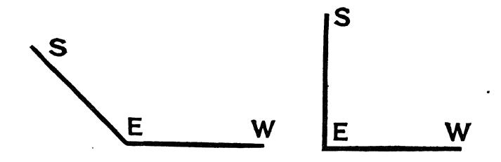

FIG. 20.-Approximately correct position of Arm. FIG. 21.-Incorrect position of Arm. S represents the shoulder; E the elbow; and W the wrist-joint. Unless the arm is thus sufficiently open-with the upper- arm sloping forwards, there can be no free movement of it in front of the body, nor can the Weight of the upper-arm become

302 ON POSITION. properly available. On the other hand, we must not really put the arm into a straight line (from shoulder to key); such unnatural position might lead to stiffness, and we should lose the very thing desired-the option of free Arm-weight.
§ 28. The distance of the Elbow from the Body, SIDEWAYS, varies with the part of the key-board the hands are engaged upon at the moment. Viewing the elbow from behind the per- former's person, the Elbow should hang down in a straight line from the shoulder (or nearly so) when the hands are re- quired upon keys exactly in front of the shoulder; the Elbow meanwhile fulfilling the previous rule as to position forwards, when viewed in profile. This normal position of the elbow (sideways) willl however only allow us to reach about one octave of notes from the centre note of the position, by a movement of the fore-arm alone-with quiet elbow. To reach more distant parts of the key-board, we are therefore compelled to make use of a horizontal displace- ment of the Elbow-the whole arm in this case moving a little, sideways. Such lateral movements of the whole arm, should however be avoided, if a lateral movement of the fore-arm alone (with quiet elbow) willl suffice to bring the fingers over their keys.¹ Arm-touch.
§ 29. The vertical movements of the arm which form arm-touch, are of two kinds: (a) the fore-arm may move alone, in which case the elbow remains quiescent; or (b) the whole arm may move, in which case the elbow itself also moves vertically. As pointed out in Chapter XVII. such descent of the arm should arise solely from the greater or lesser relaxation of the arm-supporting muscles; the arm thus falling of its own weight, and not owing to down-exertion. Only rarely does one require the help of such down-exertion of the arm in addition to the fullest re- laxation of the "up"-muscles; and then only in the slightest degree. And we must remember that the addition of such 1 We should remember, that Fore-arm skips, to be executed with safety, demand that the Elbow be placed about midway between the two points to be reached, or even slightly nearer the outer note.

THE DETAILS OF POSITION. 303 down-exertion at once tends to colour the tone towards harsh- ness.¹ All important phrasings are executed by arm-movement. Since the key-board should be quitted with the last note of every important phrase by means of an Arm-movement, it also follows, that the arm must descend for the beginning of the next phrase; although it may do this quite gently. In thus raising the arm, it constitutes good practice, to allow the finger-end of the hand to "remain behind" as it were; the tips of the fingers remaining on the key-surfaces a little while after the arm has begun to raise the wrist. This tends to ensure that supreme necessity of good Technique—a loose-lying hand.2 Position of the Body.
§ 30. The position of the Body, itself, is main- ly determined by the necessity for sufficient space between Shoulder and Key-space to enable the arm to be sufficiently unbent, as explained in § 27. To obtain this requisite space between shoulder and key (with its consequent downward and forward slant of the upper- arm) there are two opposite positions of the body available, including the modifications between these extremes :- 1 Vide § 2 of Chapter XII., and § 2, etc., of Chapter XVII. It is well here to remind the student how imperatively needful it is, to pay attention to the law, that the Hand must never be supported by its own muscles during the act of tone-production; i.e. that it must never be held in the least. Whether the arm is fully supporting the hand at its wrist-end, or whether the arm itself is being supported by the fingers and hand, and how- ever greatly we may therefore, have to exert the hand downwards momen- tarily, yet the opposite exertion of the hand, the up-holding one, must always be as carefully as possible eliminated during the act of touch. It follows, that the hand willl remain lying on the keys, although the wrist is being raised by the arm,-unless we also at that moment choose to raise the hand on its own account. Appreciation of the loose-lying hand, obviously led that excellent teacher LUDWIG DEPPE, to speak of the wrist as being "curved when the arm is raised;" a fact, however, of which he does not appear to have grasped the full muscular significance,—for his disciples only speak of its Position, not of its Condition. This wrist-" curvature," we are told, he insisted must only grad- ually be lowered into the normal “carried" position of the hand and wrist, the normal position not being fully regained, indeed, until the consummation of the tone-production of "the third note from the beginning of the phrase,” he very properly premising, that the first note of every phrase should be played by arm-descent. Vide CALAND, pp. 24 and 25, "Die Deppische Lehre des Clavierspiels.' Also see: Appendix to this Part; Note-XVII. “ On Position-worship." "" T

304 ON POSITION.
a): We may sit well away from the instrument, and reach the key-board by leaning slightly forwards, from the hips;¹ or
b): We may sit somewhat nearer the instrument, and can then reach the keys whilst remaining almost fully erect or upright.2 Each performer must discover for himself which of these two tendencies is best in keeping with his particular bodily conformation. But the Upright position (or one closely ap- proximating towards it) is obviously the more graceful, and also the least fatiguing, when feasible. This choice must be determined by the relative propor- tions of body-height and arm-length.³ As illustrating the forward-leaning type of position, a sil- houette of ANTON RUBINSTEIN, is given as Fig. 22 on opposite page. Position of Chair.
§ 31. One should be seated sufficiently dis- tant from the instrument to enable one to open the arm to the necessary extent, as described in
§ 27. The chair or stool should also be in the centre of the instrument; the E on the first line of the treble staff may be taken to represent this centre. The height should be such, that the fore-arm is about level with the keys.¹ ¹ Such leaning-forward from the hips must not be understood to signify that STOOPING is to be countenanced. In leaning forward, the back may, and should, remain perfectly straight; whereas in stooping, the spine itself would be bent. Stooping is objectionable from every point of view. 2 We require to be seated rather higher for the forward-leaning position, than we do for the upright position of body. The relative height of the body from the hips, and the length of the up- per-arm and fore-arm vary considerably-while the height of the keys is in- variable; Pody-position must hence vary almost for every individual. As a rale one finds, that when the arm is long, relatively to the body, that the tendency is to sit higher and further away from the instrument while leaning forward; and that a shorter upper-arm may prompt one to adopt a more upright position of the body, with a lower chair placed nearer the in- strument. Piano-stools are as a rule made too high. In such a predicament, an easy remedy is, to sit further back than usual, and to lean forward, slightly, as described in § 30.

THE DETAILS OF POSITION. 305 Position of the feet..
§ 32. The position of the feet should be such, that the weight of the leg can rest upon the ground through the heel, when the toe or ball of the foot is engaged upon the pedal. The right foot

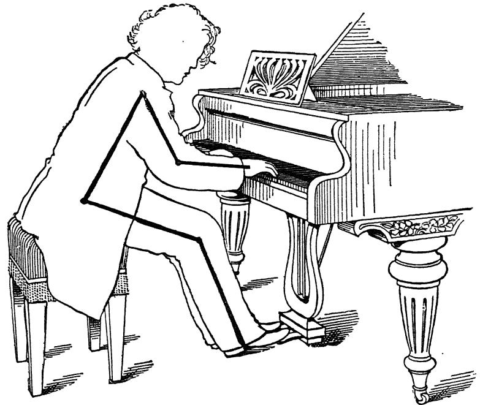

FIG. 22.-The outlined figure of the Master is probably from a Daguerreotype. The stool and key-board have been drawn in. should always be thus in contact with its pedal; the left foot, when not required for the una corda pedal, is best placed fur- ther back, with the sole of the foot only touching the ground, and with its toe almost as far back as the heel of the right foot
-when the latter is engaged upon its pedal. This helps somewhat, when we occasionally have to employ those slight side-to-side movements of the whole body, which enable us to reach either extreme of the key-board with the opposite hand,

306 ON POSITION.
-movements especially required if our arms happen to be short. Unnecessary movements.
§ 33. When we succeed in playing with per- fectly unrestrained muscles, there remains noth- ing to prevent very free movements of hand, wrist, arm, and even of the body itself; movements, that are quite distinct from those demanded by the process of key-depres- sion itself. Such movements are however often of great help to the player, indirectly, and several of these are indeed indispen- sable as "Tests," owing to their facilitating non-restraint, free- dom, and accuracy of Tonal-aim. In the pupilage stages, these movements are therefore also practically unavoidable. On the other hand, there is this objection to one's giving way unreservedly to the temptation such movements offer, and that is, that the slightest movements of a performer become glar- ingly noticeable on the Concert-platform; and however com- fortable, and even necessary they may be to the player, they prove undoubtedly disturbing and distasteful to the audience. Hence, it behoves us to eschew all unnecessary move- ment so far as possible, once we have formed the habits of Freedom, and of careful Key-aiming, and to learn to reduce the necessary Test-movements to the smallest limits compat- ible with a due fulfilment of their purpose;-always provided that such self-abnegation does not lead to restraint and stiff- The more quiet the artist's demeanour is on the platform, compatibly with good technique, the more is the hearer free to give undivided attention aurally, and the greater his enjoyment.¹ ness. SUMMARY: 66
§ 34. In conclusion, it must be reiterated, that most of these details of Position should demand but little attention, since they are likely to fulfil themselves ¹ If one is inclined to play at all stiffly-with a 'held "arm for instance, then one really dare not move even a quarter of an inch without courting disaster! A rough estimate may indeed be formed of a performer's tech- nical powers,-whether they are probably bad or possibly good, by observing whether all mobility of the body and arm is either completely absent, or in some measure present. A very slight swaying of the body and arms being really necessary, is therefore also not found objectionable by the listener. On the contrary, it may enhance the gracefulness of a performance visually,— owing to its unconsciously suggesting ease and comfort.

THE DETAILS OF POSITION. 307 automatically, provided we insist upon the correct muscular conditions. On many of these points, moreover, we find that it is obviously unwise to attempt to bind every individual down to the same conventions. On the other hand, it must also be reiterated, that there are several points where atten- tion cannot be too carefully given. These are:-
a): Sufficient distance between shoulder and key, so that the upper-arm may lie sufficiently forwards; our chair being for this purpose also sufficiently removed from the instrument, but in the centre of the key-board.
b): The difference in the actual movement of the finger it- self, exhibited most markedly when the finger is well raised previously to the act of touch; and which demands that we start with it far more fully bent for Thrusting-touch than for Clinging-touch.
c): Adjustment of the position of the wrist or hand later- ally to the needs of the passage; the hand being straight with the keys in five-finger positions; turned slightly inwards for scales and arpeggi; and turned in the direction the pas- sage is travelling, in the case of double-notes passages.
d): Ample distance between Knuckle and Key-board, with avoidance of the inwardly-held knuckle.
e): Above all things, care in preparing every finger over every key, before using it; and care to aim Key-use to the place in Key-descent where tone emission commences.

Finger, verti- cally consid- ered.

### RECAPITULATORY OF CHAPTER XXIII., AND OF PART IV

1): Two quite distinct positions of the finger are available. The difference between the two is more noticeable when the finger is raised than when it is depressed with its key :— 2): The Thrusting-finger is more bent the higher the prepara- tory raising, and it tends to unbend as it descends towards, and with, the key. The nail-phalanx consequently remains almost vertical (per- pendicular) both in the raised and in the depressed position of the finger. This verticality of the nail-joint must carefully be insisted upon with the raised finger, otherwise we shall neither attain a true thrusting-touch, nor real brilliancy. 3): The Clinging-finger becomes more open, the higher its pre- liminary raising, and it tends to close upon the keys in descend- ing; or it may even be applied to the key without any change from the preliminary flatter position, for the more extremely sympathetic tone-qualities. 4): The tip of the finger, close to the nail, reaches the key in Thrusting-touch; whereas the fleshy part, opposite to the nail, does so in Clinging-touch. In Clinging-touch the flesh is consequently pressed against the nail, and it even tends to creep round the latter. 5): In Bent-attitude, the fingers should all be nearly equally rounded. But if the little-finger is abnormally short, we may be compelled to use it slightly straighter, in spite of the consequent disadvantage for thrusting-touch. 6): Ample preliminary raising of the finger is healthy, when 808

RECAPITULATORY OF CHAPTER XXIII., AND PART IV. 309 there is time for it, and provided we do so solely for the sake of using our fingers freely. We must, however, not allow such finger-raising to become our Object, in place of key-use. We must also carefully avoid hitting the key, in consequence of such ample raising. Raising the finger off the key should be avoided, when the same finger has to reiterate its note rapidly. 7): It is upon the proper condition of the Upper-arm, that depends the proper action of the fingers in both attitudes, as ex- plained in Part III. The Thumb. 8): The difference in movement between Bent and Flat attitudes is less exhibited by the Thumb than it is by the fingers. There is nevertheless a slight tendency for the thumb slightly to open-out towards (and with) the key in Thrusting-touch; and for it slightly to close upon the key in Clinging-touch. 9): The movement of the thumb arises near the wrist-end of the hand. This may cause difficulties unless noted, owing to the fact that the movements of the other fingers arise at the knuckle. The Fingers, in 10): In Hand-touch (Wrist-touch), the required Hand-Touch. fingers should assume their depressed condition rela- tively to the Hand, before the latter descends. In rapid passages the required fingers "remain behind," as the hand rises from its preceding notes. Finger-Stac- cato. 11): The return (or rising) movement of the finger differs in Staccato, in strict correspondence to the respective difference between the Thrusting and Clinging conditions of the finger and arm during the act of key- descent. In Thrusting-touch, the front two phalanges of the finger rise from the key into exactly the same bent position they started from, before descent. In Clinging-touch, on the contrary, these two front phalanges continue their folding-in movement slightly beyond the moment of Tone-commencement; the necessary rebound of the key being assured by allowing the knuckle-phalanx to rebound at that moment,-just as happens in the bent-finger form of Staccato.

310 ON POSITION. Fingers, Hori- zontally Con- sidered. 12): Seen from above, the fingers should reach the centre of their keys. In the case of white-key passages the middle-finger should reach its white key close to the front-edge of the black keys, the remaining fingers reaching their keys slightly behind this position—slightly nearer the outside edge of the key-board, each finger according to its relative shortness.¹ 13): When the fingering-position requires the thumb on a black key, we must consider the edge of the black keys to form the limit of the key-board for the time, and the other fingers must, if required on the white keys, reach these between the black keys; and if necessary the hand must be slightly turned to permit of this, either to the left or to the right.2 Thumb Posi- tion. ously. 14): The Thumb should have its nail-phalanx always in a straight line with its key; unless we require it to sound two adjacent keys simultane- 15): The position of each key should, whenever Key-Position. possible, be directly derived from the position of keys previously played. This is a vital matter, which however willl accomplish itself automatically, provided we duly insist upon the Act of Resting, in one of its two forms, as previously explained. 16): The act of finding the position of a key, and the act of depressing it, should always be regarded as two distinct acts, al- though there need be no break in continuity between the two. 17): Position INSIDE the key is however the most vital point of all the place in key-descent where the hammer is heard to reach the string, the place to which all tone-making effort must be carefully aimed to culminate and cease. Hand, Wrist, and Finger, 18): FIVE-FINGER fingering positions (whether complete or not) lying on adjacent keys, diatonic Horizontally. or chromatic, should have the middle-finger in a straight line with its key-looking upon it from above. It is a total fallacy to suppose that the fingers must reach their keys all in the same line. ¹ Vide §§ 18-22.

RECAPITULATORY OF CHAPTER XXIII., AND PART IV. 311 19): THE SCALE, owing to the required passage of the thumb sideways, demands a slightly outwardly-turned Wrist-or inwardly-pointing hand and fingers, as the normal position. 20): THE ARPEGGIO, in addition to this normally out- wardly-turned position of the Wrist, as in the scale, requires slight lateral movements of the hand and wrist to enhance the lateral stretch of the thumb and fingers. 21): DOUBLE-NOTES SCALES, owing to the required passage of the longer fingers over the shorter ones, require an inwardly- turned Wrist (or outwardly-pointing hand and fingers) when the scale moves towards the end of the key-board natural to each hand; a position which is reversed on the return journey. In short: the hand and fingers must here be turned in the direction the scale is travelling. 22): OTHER DOUBLE-NOTES PASSAGES-arpeggi and the like, require in addition to the last, slight lateral movements of the hand and wrist. 23): In double-notes passages, we cannot transfer the Resting- weight in both of the parts forming the double progression at those points where the turning under or over of the fingers oc- curs. At such point the Resting-weight must be momentarily supported by a single finger which thus acts as a pivot, while the next two keys are prepared for depression. The Hand. 24): The hand, at the Knuckles, should be kept sufficiently well raised off the keys by the fingers, to give the fingers ample space for free action. The knuckles should never be allowed to be lower than any portion of the finger, when the latter is (with its key) in a depressed condition. The knuckle may, on the contrary, form the highest point of hand and finger, especially in the case of large hands, and in the case of Thrusting-touch. 25): There is no difficulty in acquiring this habit, provided we remember that the knuckles should be kept up by the reaction of the fingers against the keys; and provided we do not viciously force the arm down upon the fingers. 26): The hand should be about level;-the little finger should

312 ON POSITION. keep its side of the hand as well raised as the index-finger side of the hand; or if anything, the little-finger side should be favoured. The only apparent exception is in the case of Rotation-touch, when the hand itself tilts a little from side to side. 27): Hand-touch (Wrist-touch), implies a movement of the hand during the act of key-depression. This movement arises at the wrist-joint, and is visible as a movement of the hand at the knuckle-end. It is not necessary that this movement should exceed the dis- tance from key-surface to key-bottom; but the hand may, like the finger, play "from a distance" when there is ample time for such preliminary movement. Any such preparatory raising of the hand, must however be followed by its falling upon the keys, thus remaking contact without any real hitting of the ivories. 28) The fingers do not move relatively to the hand in Hand-touch. (Vide § 10.) The Wrist. 29): The height of the Wrist is determined by the position of the fingers. Its normal position is usually about level with the knuckles, or slightly lower, if these are well-raised. The wrist-level may, however, vary con- siderably without causing any discomfort, provided we do not confine ourselves either to an exaggeratedly high or low position of it. Rapid octave passages are moreover usually found easier with the wrist-level slightly higher than the normal. 30): The wrist must alternately rise and fall, slightly, when a passage requires the thumb on alternate black and white keys. In this case the wrist is lower for the black key than for the white key. But the movement should not be greater than willl just suffice to enable the Elbow to remain quiet. Wrist and Arm. 31): Lateral movements are required of the wrist, fore-arm and upper-arm, to enable us to bring the finger-tips over their keys. The larger the distance to be reached, the larger is the portion of the limb chosen, by means of which to execute the movement. 32): These lateral movements of the fore-arm and upper-

RECAPITULATORY OF CHAPTER XXIII., AND PART IV. 313 arm and their relationship to those of the thumb and wrist,' re- quire very careful attention, when first learning the scale and arpeggio. 33): A rotary movement of the hand and fore-arm may ac- company the act of touch, when the extreme fingers of the hand are required to sound notes. This movement is then substituted for the more usual descending movements of the finger, hand or In such "rotation-touch” the required fingers should be placed in their depressed position, preliminarily to the act of touch.2 arm. 34): The actual height of the Fore-arm depends on the posi- tion of the Wrist. The most natural position is about level; or with the under-surface of the fore-arm slightly higher than the keys at the wrist, and slightly lower than these at the elbow. The Upper- Arm or Elbow. 35): Correct position of the upper-arm or elbow is most important. This is an absolutely vital mat- ter; for it is impossible to obtain either freedom of reach, or the free weight of the Upper-arm, unless the latter slopes sufficiently forward, from the shoulder. The whole arm, from shoulder to wrist, must hence be opened-out almost into an obtuse angle.³ 36): The elbow, viewed from behind, should while thus lying forward, be neither pressed to the side, nor should it be unduly protruded sideways. The elbow must nevertheless freely change its position sideways, when a passage travels to the more extreme portions of the key-board. Arm-Touch. 37): Vertical movements of the arm are of two kinds, either of the whole arm from the shoulder, or of the fore-arm alone, from the elbow. The beginning and the end of each phrase is usually accom- panied by arm-movement. Body-Position. 38): The position of the body itself is mainly determined by the necessity for having the arm suf- 1 Vide §§ 18-22. 'We should recall, that rotary-adjustments must accompany almost every act of touch, although mostly unaccompanied by rotary-movement, and there. fore invisible.
• Vide Fig. 20, page 301.

314 ON POSITION. ficiently opened-out, as described in § 35. Sufficient distance is therefore required between the shoulder and the key-board; and to enable us to give this, we must sit sufficiently distant from the instrument. This requisite distance from the key-board can be obtained in two ways: either (a) while sitting perfectly upright (or nearly so), or (b) while leaning forward from the hips—without stoop- ing. This choice depends upon the length of the arm rel- atively to the height of the body from the hips. Height of Seat. 39): The chair should be placed in the centre of the instrument. Its height is determined by the height and position of the body from the hips. When the chair is too high, we are compelled to move uncomfortably far away from the instrument, to ensure the requisite distance between shoulder and key, as described in §§ 35 and 38. Music-stools are often found insufficiently depressable. The Feet. 40): The feet, when employed upon the pedals, should reach the latter with the ball of the foot, while the edge of the heel is placed upon the ground, and takes the weight of the leg. The left foot, when not required upon the una corda pedal, should be placed further back than the right one (on its pedal) and with the sole alone reaching the ground. Unnecessary Movements. 41): All unnecessary movements should be strictly eschewed. Even those secondary move- ments, required to enable us to test ourselves for freedom, and which must be greatly exaggerated in the learning-stage, should nevertheless subsequently be gradually reduced to the smallest limits compatible with a due fulfilment of their purpose. Main Points of 42): The main points requiring attention in Position-Sum- Position, are as follows:- mary.

RECAPITULATORY OF CHAPTER XXIII., AND PART IV. 315
a): Sufficient distance between shoulder and key, with the seat sufficiently removed from the instrument to admit of this.
b): The distinction between the two kinds of finger- movement, with the finger sufficiently bent before its descent, in thrusting touch.
c): Avoidance of the depressed knuckle.
d): Lateral adjustment of the hand and wrist to each particular passage; the hand being turned inwards for single-notes scales and arpeggi, and turned in the direction travelled, during double-notes passages.
e): Above all things, one should insist (a) that each fin- ger is in position, and feels each key, before the act of key-depression proper is commenced; and (b), that the position in key-descent is aimed for, where key-depression culminates in sound-beginning ;- so that each key-propulsion is aimed to culminate at the very moment that the hammer reaches the string. Subsidiary Points of importance are:—
f): Not to allow the hand to slope towards the fifth fin- ger—unless apparently so during the movement of Rotation-touch. To keep the thumb well away from the hand,- with the nail-phalanx in line with its key.
h): Not as a rule to allow the fingers to reach the keys near the outside edge of the key-board.
j): The slight re-adjustments of wrist-height, in passages with the thumb alternately on black and white keys.
k): In Hand-touch, and Arm-touch, the assumption of the depressed position of the fingers relatively to the hands, before the down-movement of the hand or arm. 1): Attention to the two alternative return-movements of the finger in thrusting or clinging Finger-staccato, respectively.

### CHAPTER XXIV. CONCLUSION: GLOSSARY AND SUMMARY OF THE MAIN TEACHINGS OF THIS WORK

Part I, Intro- ductory-the
§ 1. THE Act of Playing demands perception and facility in two distinct directions: (a) Musi- act of playing: cal-perception, and (b) Technical-facility.
§ 2. Musical-perception implies that of Feel- ing and that of Shape.
§ 3. Technique implies (a) knowledge of the requirements of Taste, and (b) knowledge of, and facility in Key-treatment.
§ 4. Key-treatment, again, has two aspects: (a) Knowledge, or perception of the instrument's requirements, and (b) knowl- edge of, and facility in muscularly fulfilling these. Part II, Instru-
§ 5. Tone-production can solely be wrought mental aspect by causing the key to move. of Key-treat- ment:
§ 6. Loudness depends purely on the degree of speed attained by the key during its descent.
§ 7. Beauty of tone depends on our inducing this key-speed as gradually as possible. Tone control depends upon the same element.
§ 8. Opportunity for causing or influencing tone, absolutely ceases the moment the hammer reaches the string and re- bounds therefrom.
§ 9. This moment, the beginning of the note (the moment of transition from Silence to Sound) must be listened for, so that our propulsion of the key can be accurately aimed to it.
§ 10. The key, in the shape of weight and friction, offers resistance to movement.
§ 11. The energy required to overcome this resistance, 316

SUMMARY AND CONCLUSION. 317 varies with different keys, and with the speed at which we try to impel them. Part III, the Muscular as- pect of Key- treatment.
§ 12. We can only gauge key-resistance, by physically feeling it through the muscular-sense, before and during Key-depression.
§ 13. The act of Attention during performance is dual, since it implies attention musically and attention in- strumentally. We must listen inwardly and outwardly, so that we hear what should be, and so that we also hear the ac- tual result; and we must meanwhile constantly feel the giving- way point of the keys, so that we can gauge the necessary efforts.
§ 14. Since the key must be reached so carefully, the con- tact should never be in the form of an actual blow, unless ac- curacy as to notes and expression do not matter.
§ 15. The act of Touch is consequently a Duplex process- excepting in the case of ppp-Tenuto or Legato :— It consists of the two acts (a) of Resting, and (b) of Adding Energy to the key to move it.
§ 16. The act of Resting (which is continuous during each phrase) may either occur (a) at surface-level of key-board, or
(b) at bottom-level of key-board. This slight difference in Resting-weight constitutes the difference in Basis between Staccato and Tenuto, or Legato.
§ 17. The first (or lighter) form of Resting does not assist key-depression. The second (or heavier) form does;-being slightly heavier, it suffices to overbalance the key into de- flection. Both forms of Resting serve to tell us where the keys are, and their resistance.
§ 18. The absolute pp is obtained by employing this second form of the Resting, unassisted by any Added-impetus.
§ 19. The Added-impetus (Energy momentarily applied to the key during descent) is meanwhile required in all touches (except in ppp-Ten. or Leg.) to induce the requisite tone-amount and quality.

318 THE ART OF TOUCH.
§ 20. This Added-impetus must absolutely cease to exist at the moment that sound-emission begins,-in Legato as well as in Staccato.
§ 21. The Added-impetus can be muscularly provided in the following three forms of Touch-construction or formation:- 1st Species: Finger-exertion alone, with passive hand and self-supported arm. 2d Species: Hand-exertion behind the finger, with self- supported arm. 3d Species: Momentary lapse in arm-support, behind the hand and finger exertions.
§ 22. The Muscular-components which provide the Act of Touch are therefore: (a) Finger-exertion, (b) Hand-exertion, and (c) Arm-weight.
§ 23. The sensations of correct touch are hence always UP- WARDS―upwards by reaction from the key, against knuckle and wrist. This, because we can only positively feel the actions of the finger and hand, and not the operation of arm-weight, since the latter is derived from lapse in muscular-exertion.
§ 24. Movement during key-descent, depends on which of these three components is slightly in excess of the other two at the moment. The resulting distinctions of movement are termed: Finger-touch, Hand-touch and Arm-touch.
§ 25. The third Species is available in either of two Sub- genera: either as "Weight-touch" or as "Muscular-touch." This, because the combination of the three touch-components may, in this Species, be started either (a) by Weight-release- that of the arm, or (b) by Exertion-that of the finger and hand. The first makes for roundness of tone; the second for brill- iance and even hardness.
§ 26. Hardness or harshness is bound to ensue if we ap- ply arm down-force to any appreciable extent, and when we apply our efforts too far down in key-descent.
§ 27. We should therefore be careful always to play "only to the sound."

SUMMARY AND CONCLUSION. 319
§ 28. Quality of tone is moreover influenced by the two di- verse Attitudes of the finger and upper-arm, respectively termed, the "Clinging" and the "Thrusting." The first helps towards sympathetic (and carrying) tone, the second towards brilliant (and short) tone.
§ 29. It is the condition of the upper-arm (or elbow) that determines in which of these two ways the finger shall act.
§ 30. Most of the finger's work must be done by the Knuckle- phalanx; this applies equally in clinging and in thrusting at- titude.
§ 31. To obtain the most sympathetic effect, we must pro- vide key-descent through the co-operation of the clinging atti- tude with the third species, in the latter's weight-initiated form.
§ 32. Arm-weight, when employed in the Added impetus, must automatically cease its operation-in response to the ac- curately-timed cessation of the up-bearing stress at the wrist- joint.
§ 33. The transfer of the Resting weight should likewise be an automatic process, occasioned by the accurately-timed cessation of the supporting duty of the finger last used.
§ 34. Perfect freedom is imperative in all the movements and muscular actions employed in playing,-freedom from contrary-exertion.
§ 35. Rotary-freedom of the fore-arm must be insisted upon, as well as horizontal and vertical freedom of the wrist- joint. Rotary actions are required for every note. Lack of rotary-freedom, especially, is one of the most com- mon faults, since the here continually required adjustments mostly remain invisible. Part IV, on Position:
§ 36. The shoulder must be at such a distance from the instrument, as willl enable the arm to be opened-out almost into an obtuse angle, thus enabling us to employ its Weight when required. We must be seated sufficiently distant from the instrument to admit of this.

320 TTTHE ACT OF TOUCH. ""
§ 37. We must distinguish between the "flat" and "bent positions and movements of the finger, that respectively accom- pany the Clinging and Thrusting attitudes, and their corre- lated upper-arm conditions.
§ 38. The wrist and hand must constantly adjust their position laterally, so that we can easily connect fingering-posi- tions by means of lateral movements of the thumb, etc. The wrist must meanwhile be neither too high nor too low; and it must change its height, slightly, when the thumb al- ternates between black and white keys.
§ 39. The hand must be level, since the little-finger would otherwise be placed at a disadvantage. More important still, the knuckles must never be permitted to fall in, as a normal position.
§ 40. The fingers should not move during key-descent, ex- cept in Finger-touch.
§ 41. The thumb, in its normal position, should be well away from the hand, and its nail-phalanx should always be in the same line as its key, unless it is required upon two keys simultaneously.
§ 42. Above all things, we must always insist on being properly in position over-and even on-each key, before using it, so that Energy can be applied to it, vertically.
§ 43. Each of the keys forming a passage must not be con- ceived as a separate unit;-each key's position must be con- ceived and must be found as a particular distance from each preceding key, or set of keys.
§ 44. In conclusion: The student and teacher must once again be warned not to forget the purpose of Technique whilst studying its neces- sary details. The reminder is essential, for in studying these details, the mind is apt to dwell on one aspect of the problem, to the almost complete exclusion of the others. Thus, in endeavouring to secure the visible effects of correct Position and Movement, we are apt to forget that these are quite sub-

SUMMARY AND CONCLUSION 321 sidiary to those of correct Condition-the muscular actions and inactions required of us by the key, at the moment. Again, although we may not lose sight of this more important matter, we may so concentrate our mind on the re- quired Muscular-conditions, as to cause us to forget to apply these, accurately-timed, to the key! And even if we do not forget this, we shall nevertheless fail, unless we do meanwhile use the key only in response to the promptings of our Musi- cal-sense ;—for " Execution" itself should always be prompted by the performer's wish to give expression to his Musical- sight. Hence, we must study the details of Position only for the sake of obtaining the Muscular-act at its easiest, and we must apply the latter only in answer to the resistance the keys are constantly offering us in varying measure. And while thus muscularly judging the key, we must do so solely for the sake of the Musical-effect perceived to be necessary by our musi- cal intelligence and feeling. In short we must apply Energy to the key, only in strict response to what we feel is there needed to fulfil the Sound we musically wish at that moment. A final Summary follows.

FINAL SUMMARY OF SOME OF THE MAIN TECHNICAL POINTS TO BE INSISTED UPON IN TEACHING OURSELVES AND OTHERS. 1
I. We must remember: how sound can only be made through key-movement; and how beauty of tone can only be obtained by insisting upon the gradual depression (gradual propulsion) of each key; and how we must listen for the beginning of each sound, if we would accurately "aim" the efforts by which we intend to produce it.
II. We must remember: how Touch consists of the two ele- ments, the Resting and the Added-impetus; how the one is con- tinuous and the other not only dis-continuous, but always as short-lived as in Staccatissimo. How the act of touch is muscularly mainly built up of the three components, Finger and Hand exertion, versus Arm-weight, etc., and why we must there- fore always feel the act of touch as one of leverage upwards. How these components can be combined into three main species of Touch-formation, of which the third offers us the two great distinctions between Weight and Muscularly-initiated touch, with the consequent divergences in Quality of tone; and how Quality is further influenced by the opposite Arm-and-finger conditions re- spectively termed Clinging and Thrusting. How Weight must be ceased automatically, and how this also applies to the act of transferring weight in Legato. Also the great im- portance of insisting upon the Rotary-adjustments of the forearm; and how the doctrine of Ease implies perfect freedom from contrary-exertion in all the movements and actions required, in- cluding those horizontal ones of the Hand and Wrist. These last Summaries are useless, unless the preceding portions of this work have been studied. 322

FINAL SUMMARY. 323
III. How Position, whilst mainly a result, and not a cause, includes nevertheless some points of importance: such as the sufficiently-opened arm; the difference between the raised bent and flat finger; the lateral adjustments of the hand; and the teaching, that every key must be felt before being played, and must be found as a lateral distance from its preceding fellow.
IV. Above all things, we must always remember that the ul- timate purpose of our study is not to obtain correct Movements, nor correct Muscular-habits, but that our purpose is to obtain Com- mand over Musical-expression. With this purpose in view, we must, in playing, constantly feel key-resistance, so that we may thus be muscularly prompted to fulfil the requirements both of Key and Music. Good tone-production can in fact be thus defined :—we must al- low Key-resistance and Musical-sense to prompt us easily to move each key at requisite speed and increase of speed, to a definite Place in Time and Key-descent.

APPENDIX TO PART IV. THE FALLACY OF "POSITION" WORSHIP "9 NOTE XVIII.-To § 1, Chapter XXII., page 273: Most of the “teaching of Technique, hitherto, seems to have consisted in insisting upon the adoption of such visible attitudes during rest and movement, as have been exhibited by successful players during performance. It was fallaciously assumed, that if one could only succeed in making Position and Movement correspond to those thus exhibited, that the result as to tone and agility would also cor- respond! Now the previous chapters have demonstrated the fact, that it is almost en- tirely upon the paruticlar CONDITIONS of Action and Inaction of the arm, hand and finger that each particular kind and degree of tone and of agility must of necessity depend ;-so that however closely one might succeed in observing and in reproducing the precise positions and movements employed by a suc- cessful player under all the varying requirements of Technique, yet this would not form the slightest guarantee that we should succeed in applying our forces against the key in the same manner as he, nor that our tonal results would prove similar. Indeed, owing to the fact that Position and Movement give so unreliable an indication of those ever-changing conditions of muscular- action and release which alone form the true cause of all tonal-effect, it is ob- vious that the most painstaking copying of "the look of the thing" willl prove of no avail, unless we also happen to hit upon the required (but hidden) muscular-changes required. On the other hand, it is also abundantly clear, that pro- vided we do adopt the correct Condition of the limb during key-descent, and apply such muscular-condition to the key in proper measure and proper time, that correct Position and Movement must almost of necessity arise as a result from such fulfilment of the laws of Key-treatment. One may well marvel at the display of mechanical ignorance, want of power of analysis and observation exhibited by teachers and artists, who have spent their whole lives in endeavouring to help others to do the right things technically, while they have nevertheless totally failed to observe those most obvious rudimentary facts of muscular-action and key-action that form the direct cause respectively of technical failure and success, both in themselves and in their pupils and fellow-artists! That the case is so black would be incredible, did we not every day have proof of it, and did we not remember how irksome most artistic natures find analysis and logical-reasoning. The consequence has been, that even the most celebrated teachers of this last century have wofully failed to discern the true causes of (or permits to) good Technique-the A, B, C of the Piano, as found in correct Key-treatment, instrumental and muscular. For instance, in a work published last year, purporting to teach Technique, and which is avowedly the "only authorised publication of the teachings" of 324

APPENDIX TO PART IV. 325 LESCHETIZKY—the justly-renowned Artist-teacher,' we fail to find any descrip- tion of the true causes and explanations of correct Technique. Instead, the little advice given relatively to tone-production, relies almost exclusively on Position and on Movement, and on the practice of carefully-planned methods of Note-practice,-on exercises, the practice of which does not, however, in the least ensure that the learner willl happen to discover for himself HÓW he should use the key or his own muscles, i.e.-what key-treatment and muscu- lar-habit should be, in any of its manifold aspects! Thus, on referring to this work, Chapter XIV., " On Touch-varieties," after pertinently quoting "C'est le ton qui fait la musique," we find the following:-"If the Cantilene "is to be in the shape of a large strong tone, legato, then willl Finger-force, alone, not serve. One must here help by means of Wrist-pressure in the 'following manner. One should reach the key lightly, and one should, "without discontinuing the contact with the key, press the latter down deeply by means of a rapid upward movement of the Wrist-joint; wrist "and finger joints being fixed at this moment." 66 66 66 66 66 · 66 "" 2 "The same effect can also be attained by a quick, downward movement of "the Wrist. The wrist must return to its normal position immediately after "the note is sounded, while the finger continues lightly to hold the key "down." In Staccato the keys are not to be pressed down, instead "they are to be sounded" (i.e., hit down) "from above.' "The dif- 'ference between Finger-staccato and Wrist-joint staccato depends on "whether it is the Knuckle-joint or the Wrist-joint that provides the motive- "force. Finger-staccato is, playing by means of thrown fingers. In wrist- staccato, the bent finger is thrown down upon the key by means of the wrist- 66 joint. After a short sounding of the note (Nach kurzem Anschlag), the finger "is to be immediately sprung back by means of the wrist-joint.' A few paragraphs further on we read, that the noise occasioned by the fingers tap- ping or hitting the keys "cannot be avoided in staccato"! It is even sug- gested that this noise can help the musical effect "in burlesque moments"! No further advice is tendered as to the Act of Touch-as to key-treat- ment and the implicated muscular-conditions. And while we find no distinc- tions drawn between the factors that cause Tone, and the factors that cause Duration (Leg., and Stacc.), we also find that Position and Movement are almost exclusively pointed to as the cause of all the effects-instead of recog- nising these as merely accompanying results, for the most part! That is, instead of any attempt to analyse the muscular factors that are the immediate cause of all tonal effects, we find movements described and recommended, which it is assumed must lead to the desired effects,-movements moreover, in this case, which, as a matter of fact do not at all necessarily accompany the act of Singing-touch, although they may be allowed to follow such act of touch
-when it is completed." To the apparent non-recognition of the function of Arm-weight, may also probably be attributed a certain hardness in forte passages often observed in Leschetizky pupils. All this does not detract from the splendid work done by this great Master- 1 "Die Grundlage der Methode Leschetizky," Malwine Brée. 2" Man berührt die Taste leicht und zwingt-ohne den Contac tmit derselben aufzugeben- durch eine rasche Handgelencksbewegung nach aufwärts den Finger, die Taste tief niederzu- drücken." 3 Obviously, the "rising" or "falling" wrist here alluded to, is an unconscious discovery (80 often made by artists) of what I have described as the “ Aiming-test" (Vide Chapter XIX., page 207); movements which certainly prove of use provided they are employed (as they should be) as a test to ensure the cessation (a) of all Action and (b) of all Weight, immediately that sound is reached, the wrist rising, when it is the Weight-element that first ceases its operation; and the wrist falling, when it is the Finger-and-hand exertion that first ceases its operation upon the key.

326 APPENDIX TO PART IV. teacher; for although his results have apparently been achieved almost en- tirely by empiric methods, or by force of good example, yet he has proved himself to be one of the giants of the nineteenth century. We find the same fallacy-of relying mostly on the phenomena of Posi- tion and Movement-exhibited by those who profess to teach the methods of another of the last century's really great teachers-LUDWIG DEPPE, who indeed was probably the most advanced of all the well known nineteenth-cen- tury teachers. He, for instance, clearly recognised the necessity for the free wrist, and its source, the "carried" arm; also he instructed in touch by weight-release, although he perhaps hardly recognised that the released weight of the arm was the cause. (Vide "Die Deppeschs Lehre des Klavier- spiels," E. CALAND.) On reading this little work one clearly perceives that Deppe himself must have been able to obtain the true "sympathetic" touch- quality, and that he stimulated his pupils to do likewise. His idea of the arm-carried hand "lapsing "upon the key," being indeed within reach of that full realisation of the real facts of the case, which, after all, seems to have eluded him. And this, in spite of what was truly a monumental striving after Truth in the matter; especially when we take into consideration the state of absolute ignorance of first principles-and disbelief in there being any-in which he found the musical world. (Vide Note to § 29, Chapter XXIII.) 66 "THE STRAIGHT FIFTH FINGER' NOTE XIX.-To Note of § 6, Chapter XXIII., page 281 :-The doctrine that the little finger should be held straight, or nearly so, even in "bent-finger" touch, is another of those fallacies, which, having first arisen through inaccurate rea- soning, have then become a tradition. That the little finger owes its fre- quently supposed weakness to its being short, was the beginning of the fallacy. The very fact of using it "flat" while the other fingers are employed in the rounded form necessary for brilliance, would place it in a comparatively disadvantageous position. To begin with, it would be more elastic than the others. This would also most likely lead to its attempted re-enforcement, by surreptitious thrusts from the arm, or else by a rotary poking action from the hand; for it is difficult to give the requisite thrusting action of the finger, if we start with it straight. We must remember that "thrusting touch" implies a slight tendency of the finger to open-out towards the key; true, this uncurling must indeed be slight, but it must be sufficient to permit the finger to be applied vertically to the key-and this we cannot do, if it is straight in the first instance, for it willl then be compelled to pull inwards upon the key, as in clinging touch. Moreover, the little finger is by no means so weak as it is popularly supposed to be, as we find, when we ask even a child to grip us with it. As already indicated, its apparent weakness at the instrument results in most cases from failure to adjust the Fore-arm Rotation-element to its needs. 66 " As the finger is a lever of the third order, it requires no very high grade of elementary mechanical knowledge to prove how great is the delusion that the finger gains in power by being straightened! On the contrary, since its muscular force is applied between the fulcrum (the knuckle) and the resistance (the key), it follows that the straighter we hold the finger, the further off is its work placed, and the less is its power. The same argument, also, in another form, viz. that the fingers must be placed in as straight a line as possible on the keys-that their tips should be in as straight a row as possible-is the climax of foolish reasoning. The nearer the finger is applied to the edge of the key, the greater is the lever-

APPENDIX TO PART IV. 327 age (or power) exercised over the key, hence, again, we give the little finger less power when we straighten it, for it then approaches nearer the fulcrum of the key! Moreover, the fingers form separate units, as a matter of fact; each one is provided with its own individual muscles. Evenness of result is hence attained by the individual training received by each finger to fit it amongst its fellows- the muscles of the weaker ones are taught to exert themselves slightly more than those of the stronger fingers. They are thus taught to create the same relative effect upon the keys, each finger at its own particular point of contact rela- tively to the others. Meanwhile, do not let us lose sight of the fact, that evenness of finger is induced, not so much by training the fingers into equal strength (or weakness), as by obedience to the law, that the tone-making stresses should all be given in strict response to what the keys themselves suggest-by their resistance. That is, if we constantly watch Key-resistance, as we should, then each finger willl more or less unconsciously adapt itself to the needs of the moment, and evenness thus ensues automatically. And it could then be obtained even if we used the fingers with the hand turned upside down! "THE HIGH WRIST AND LOW WRIST DOGMAS” NOTE XX. To § 21, Chapter XXIII.:-While the height of the wrist is perhaps the one point in Position which least demands hard and fast rules, since it may (and must) vary considerably owing to so many considerations, yet it seems to be the point around which debate has flourished most hotly and dogmatically, probably owing to this very fact that the precise actual height may vary with impunity according to personal idiosyncrasy! For we find players, with excellent technique, who strictly adhere to "low wrist," because they have been brought up on that fad; while we find others, equally excel- lent, who employ the "high wrist" whenever they possibly can. Obviously, neither position is harmful, provided it is not exaggerated. Personally I find that one position suits certain passages, while the opposite one suits others. It is the unflinching adherence to one position that proves objectionable. a rule quick passages are found really easiest with a higher wrist, especially in the case of double-notes passages. As The point of real importance (as insisted upon in Part III.) is, that the wrist-joint must be free. And it is this necessity, imperfectly recognised, that has no doubt led to these two opposite dogmas on the subject. Thus we found, that all Agility-technique demands that the arm be self-supported, with the hand lying loose. If we unconsciously obey this rule-and imperfectly recognise its real significance, it follows that our instinctive feeling may cause us slightly to raise the wrist, since this willl be more suggestive of the "dan- gling" sensation of the loose-lying hand. Conversely, if we desire a singing touch, and have more or less unconsciously recognised that it requires the loose-left arm to weigh the keys (and hand) down, such elastic and almost flabby state of the wrist and knuckle (here required at the moment of key- descent) may naturally suggest a dropping-in of the wrist-and even of the knuckle. So little, however, does the actual position of the wrist relatively to the hand influence tonal-result, that the wrist-joint may at times be allowed to rise quite high up, without in the least disturbing one's Technique. I have seen LISZT himself assume an absurdly exaggerated position of this nature (obviously the result of his unconscious sense of the correct muscular-conditions) although he, of course, did not affect it normally. I have also seen others imitating a simi-

328 APPENDIX TO PART IV. lar position, or the opposite exaggeration, obviously hoping to induce thereby the much coveted "sympathetic touch"; but as they had not realised the req- uisite muscular conditions—of really “ weighing the key "into sound-their movements were reduced to mere meaningless contortions and mannerisms. It seems almost superfluous to add, that such great alterations of position are not only not required, but that they are also in themselves not in the least suggestive of the desired tonal results! Nevertheless it is obviously in this way that the various wrist "methods" have arisen-through imperfect rea- soning. For instance, superficially it must have seemed to be an unim- peachable syllogism to say :
a) "The wrist-joint must be free."
b) "If I let the wrist drop, then the wrist-joint is free."
c)" Hence a dropped wrist (i.e., a low wrist !) means a free wrist." Of course this would form admirable logic, were it not that its conclusion depends on a mere word-quibble !—For a dropping (or falling) wrist may cer- tainly be assumed to be free at the moment, provided it be really falling. But a wrist that is placed in a "dropped" or low position, is no more necessarily in an unrestrained condition, than if it were placed high, or midway between either extremes. The wrist-joint we must remember, is only free when none of the opposing muscles are permitted to act,-provided none of those muscles are allowed to act, that are opposite in function to those required of the finger, hand, and arm. And the wrist is not truly free, unless it is so not only verti- cally, but also horizontally, and rotarily, as discussed in Chapter XVII. (Vide page 193, and preceding pages.)

With 22 Illustrations. 8vo, pp. xlii + 328. $1.60 * TTTHE ACT OF TOUCH IN ALL ITS DIVERSITY · TOBIAS BY MATTHAY (Fellow, Professor and Examiner of the Royal Academy of Music, London). PART I. INTRODUCTORY. The Problems of Pianoforte Education. PART II.—The Instrumental Aspect of Key-treatment. PART III.-The Muscular Aspect of Key-treatment. PART IV.-On Position. LONGMANS, GREEN, AND CO. FOURTH AVENUE & 30TH STREET, NEW YORK LONDON, BOMBAY, AND CALCUTTA FROM BRITISH REVIEWS :--
• · The publication of this book marks an Up till now the methods employed Professor Matthay's book must
• "Why Music hath Charms.' . epoch in musical pedagogics. have been more or less empirical. alter all this, introduce system and order into what has been practically chaos. No pianoforte student can'afford to dispense with a diligent study of this masterly work, and there are few artists and teachers who willl not find it invaluable in their profession."-Daily Chronicle. 66 ". . . The thousand technical details entailed in thorough systematic pianoforte training are set out with an expository skill that cannot but win the book a wide estimation among teachers and executants. It is a close and minute scientific analysis. An elaborate, scholarly, and valuable book, it deserves the attention of all intimate students of the subject."- The Scotsman. 66
• ". . . The market is full of methods,' which one is afraid few people read. Mr. Matthay, however, has struck out a new path. . . . We have no hesitation in saying that Mr. Matthay has made good his claims. Some of his aphoristic sayings . go to the very root of the matter student must go to the book itself."-Glasgow Herald. · the "... For the serious reader there is a great deal that willl interest and instruct him, and the inquiry into the real causes of a beautiful touch has borne excellent fruits."-The Times. 66 · This book . . . represents an immense amount of thought and labour."-Morning Post. 66 ·
• · Will be of great use to the conscientious teacher."—Daily News.

Reviews of Tobias Matthay's "Act of Touch. "Every teacher of the pianoforte and everyone seriously interested in that instrument may be safely recommended to study Professor Matthay's book among works of English origin or written in English it is the most important contribution to the pedagogic literature that has appeared for many years. The book, which obviously embodies the experience ... of a lifetime, is not light reading. But it is well worth the time that is necessary to master it. The repetitions, which a casual reader finds wearisome, serve to show how thoroughly the writer has thought out his system, the extremely multifarious details being finely consistent with each other."-Manchester Guardian. "... The professor has dealt with the question from its fundamentals upward."-Liverpool Post. ... ·
• "... For the artist or teacher. it is simply invaluable. . . . The author treits of... with a grasp and thoroughness that is remarkable, and his clear definitions and logical reasoning combined with the explana- tion of failure and success in pianoforte playing willl commend themselves to every thinker.. The book should be in the hands of every musician the record of years of thoughtful labour."—Belfast Northern Whig. ... The author is well known.. . as a successful teacher, and what he has to say on a subject of essential importance in the art of pianoforte playing is sure to be worth serious attention a careful study of his text can hardly fail to be of use to the teacher."-Nottingham Guardian. "... . Mr. Matthay... writes vigorously and convincingly-in such a way, indeed, as cannot fail to evoke gratitude from all pianoforte players who are not too wise to amend the errors into which they may have fallen. The book willl be a surprise to many who have persuaded themselves that they were on the best of terms with the prince of musical instruments."
-Bristol Daily Mercury. ...
• ". . . This hopeful and inspiriting message should encourage the student to read and act upon every line of the book, while the teacher willl find it of the greatest value. . . . It may also be remarked that nothing is advanced without a reason. What is particularly admirable about the book is its clearness of arrangement and expression. in the repeated summaries and recapitulations the plan of the beautifully articulated system may be seen almost at a glance."-The Queen. 66 FROM MUSICAL PAPERS :- ... Every page has its deep pregnant idea expressed in carefully chosen language. In Mr. Matthay's explanations and arguments there is always an undercurrent of appeal to first principles of the relations of mind and matter and natural law generally.... The book is no mere meandering .. with obscure transcendentalism; the tread of its logic is firm, and the clearness of its diction bears witness to the amplitude of Mr. Matthay's vocabulary and the width and depth of his reading. The arrangement of the book is masterly.. What willl be the influence of this extraordinary book? It should be deep and widespread.”—Musical Times "... So... I sharpen my pencil and open the volume that has been so much looked forward to by all who are interested in pianoforte playing and teaching, and who know of Mr. Matthay's success as a teacher. First, then, the book is unlike all other books on technique, in that it is

Reviews of Tobias Matthay's "Act of Touch." " ·
• • •
• NOT a book of exercises. It is a treatise. The book, therefore, has a message for the amateur as well as for the platform artist. The serious student makes a précis of every chapter of a book he wishes to master . . but Mr. Matthay saves you the trouble. He makes your précis for you. He not only hands you his book to read, but tells you how to read it. Mr. Matthay, has a forceful and graphic way of putting his points; it is a book no pianist-whether artist, teacher, or amateur-can afford to be without."—1st Review : A. J. C. in Musical Herald.
• •
• · "The publication of a large and important work like "The Act of Touch" by Mr. Matthay is an event which ought to claim the attention of all who are interested in pianoforte playing. My own chief impression was a feeling of admiration for the author's industry and ability. He marshalls his facts most clearly.”—2nd Review: Dr. FISCHER in Musical Herald. 2.1 "A Weighty Book.'-Surely never was any subject gone into more thoroughly and methodically by anyone than this of piano playing by Mr. Matthay. Mr. Matthay's thorough investigations the intellectual acumen he displays in this work: he, indeed, shows in it the high gifts requisite for scientific philosophy 'full of meat' from beginning to end."-Musical News.
• • • ... · • "... Nothing like it has ever been attempted before. . . . The method adopted in this book is scientific in an extreme degree it must be acknowledged that he has written an elaborate work which ought to secure for his views attention and respect."-London Musical Courier. 6
• "It is no secret that our author, Mr. Tobias Matthay, is already one of the most successful pianoforte teachers, not only of this country, but of the world generally. He is no mere theorist. This is, indeed, a WONDERFUL book which lies open before us, and one which every pianoforte teacher ought to read, mark, and inwardly digest;'... the book is a real credit, not only to its author, but to the entire musical profession through him . . ... a book so monumental-an obvious life-work of its author.... The most we can do is to draw the admiring attention of our readers to a few points of more than usual excellence, and then to strongly advise our friends to read the book for themselves. The plan of the book is very simple. . . The first point which strikes the reader is the thoroughness and truthfulness of the definitions .. the acoustical portion of his subject is dealt with in the most masterly and convincing Mr. Matthay's graphic style of writing."-Dr. PEARCE in The Organist and Choirmaster. manner.
• "This is, indeed, a notable and important volume. Nothing to our knowledge so exhaustive or scientifically conceived with respect to piano- forte tone-production, has previously appeared. . . . His work is, indeed, a weighty one, and its importance accrues from its being backed up by a singularly lengthy and varied experience, a mind evidently capable of dealing with minute and subtle differences, and an unlimited store of patience. every pianoforte artist, professor or student who can bring themselves. to master the details of the work, willl be in possession, we should think, of all the information it is possible to gather concerning this many-sided subject."—The Journal of the Incorporated Society.
• • "Those who wish to excel should not fail to secure a copy of this valuable work and fully digest its contents."-Musician's Journal.

Reviews of Tobias Matthay's "Act of Touch." FROM AMERICAN REVIEWS:— "Mr. Matthay's book is a prodigiously thorough, logical, and learned application of scientific principles to one important and fundamental matter in pianoforte playing. It is the art of tone-production with which the book deals in a way that has never been attempted before . . . its idea and general method of carrying out are admirable."-RICHARD ALDRICH, New York Times. "It is an exhaustive inquiry into the nature of the connection between the mechanical action of the fingers and the operation of the mechanism of the piano in producing musical tones. In plan the book is extremely clear, and it is written in a common sense fashion which is sure to commend it to teachers and students.”—The Sun (NEW York). 66 ·
• ". . . A highly scientific work on pianoforte playing. His text is not presented in narrative form, although very probably to experts his pages willl be as fascinating as a novel, but in logical mathematical sequence. . . . To the teacher it willl convey suggestions of new things."- New York Times. 66 In Professor Matthay's opinion Touch is no more a gift than is the art of articulate speech itself, and 'can be acquired by every person of average intelligence.' If this be true, it is the most important news communicated to the musical world for many years. The author's plan consists in analysing . . . the doings of successful artists, and thence deducing the laws governing successful playing. Pianists cannot be too strongly advised to study it as a guide to the art of tone-colouring. By directly acquiring a tone-palette (or touch-palette) they may thus, as the author justly claims, save years of time, which would be wasted in futile experiments and in forming bad habits. One more point, and we must take leave of this suggestive . book. The remarks incapacitating nervousness at a public performance 66 · · on are alone worth the price of the volume."-Nation (NEW YORK CITY), also New York Post. As a technical work for teachers and advanced musicians, as well as for beginners ... it willl prove interesting and instructive reading."
-The Dial (CHICAGO). ... "... The majority of musical practitioners accept, without question, principles and methods bequeathed them by their predecessors. Yet, among these slaves of routine are those who are continually searching for a larger fund and a better quality of information. Analytical minds are resolving traditional theories into their component parts, in order to use them more effectively, or to discard them. Occasionally the studies of these minds disturb the placid progress of routine, and challenge attention in the form of a book. The Act of Touch'. is such a book. . . . It must be read slowly and read again; the principles it an nounces and the conclusions it draws are to be studied carefully.. Piano teachers can make the coming long vacation profitable by devoting time to a careful study of this really important addition to musical literature." The Messenger (Mass). 66
- a good book for every music student to have Musical Million (VIRGINIA). LONGMANS, GREEN, AND CO. .. •
-The

L

786.4 M 43

musi
786.4 M43 UNIVERSITY OF MINNESOTA Matthay, Tobias, 1858-1945. The act of touch in all its diversity: 3 1951 002 350 956 J П MINITEX Minnesota Library Access Center 9ZAR04D24S15TLK