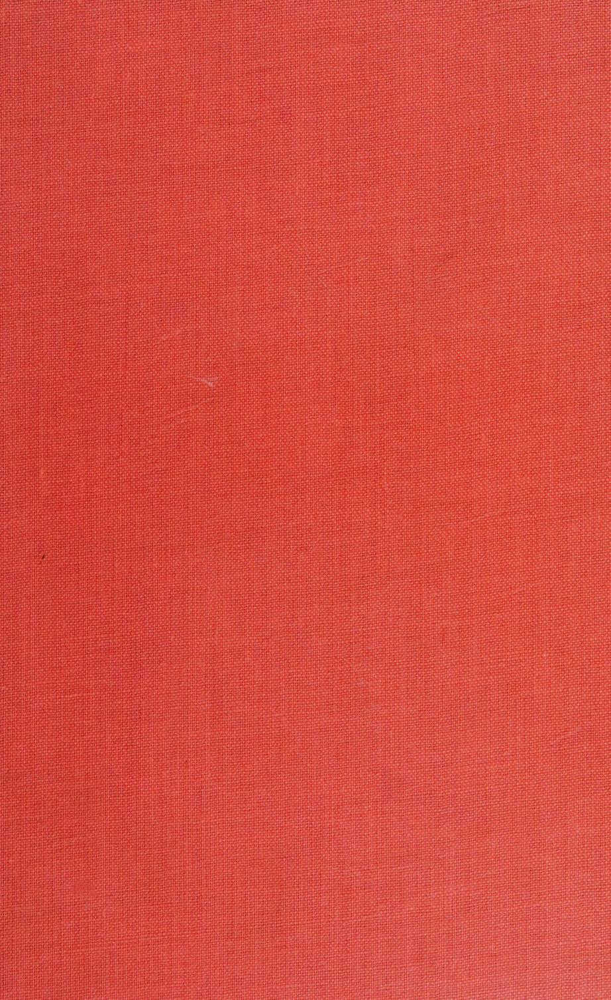

*Greenville College Library*

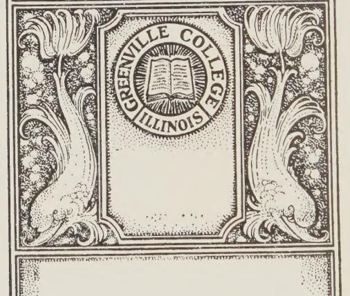

786.3 M43

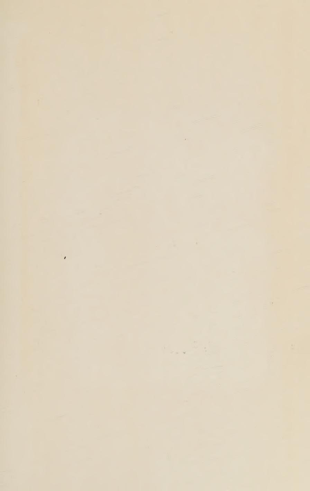

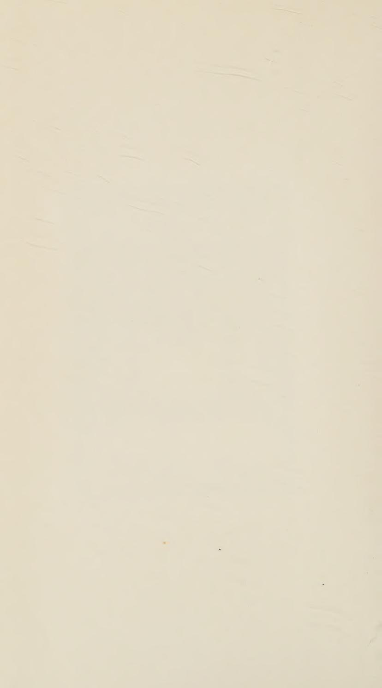

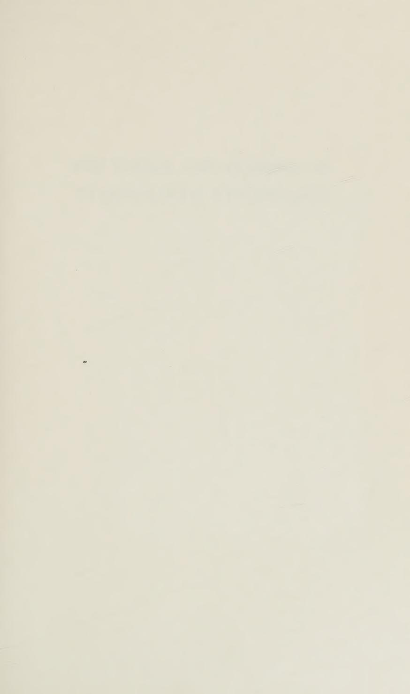

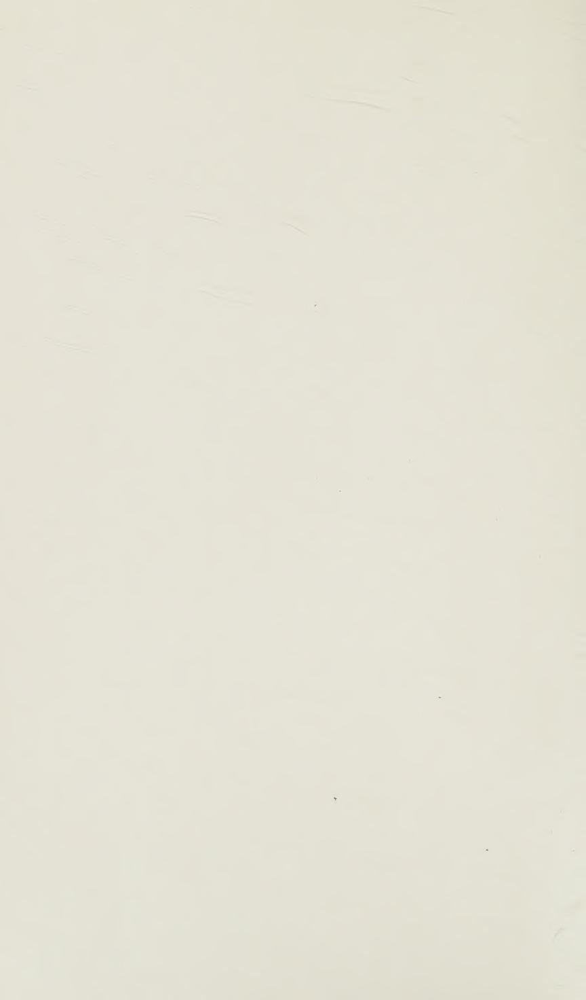

# THE VISIBLE AND INVISIBLE IN PIANOFORTE TECHNIOUE
## Table of Contents
- [[#THE VISIBLE AND INVISIBLE IN PIANOFORTE TECHNIQUE]]
  - [[#FOREWORD]]
  - [[#PREFACE]]
- [[#CONTENTS]]
  - [[#CONTENTS OF DIGEST]]
- [[#Chapter I]]
  - [[#PREAMBLE]]
  - [[#The meaning and purpose of Technique]]
      - [[#Definitions:]]
      - [[#Technique and Music inseparable:]]
      - [[#The Act of Timing:]]
      - [[#Relaxation:]]
      - [[#The connection between Music and Technique:!]]
      - [[#The four forms of Rhythmical Movement:]]
  - [[#Chapter II]]
  - [[#THE PHYSICAL OR KEY-ASPECT OF TECHNIQUE]]
      - [[#Tone-production:]]
      - [[#Good and bad tone:]]
      - [[#Key acceleration:]]
  - [[#How to play ppp:]]
      - [[#The repetition of soft notes, and the ''Bebung'"':]]
      - [[#Tone-production, momentary:]]
      - [[#The short duration of the Tone-producing impulse:]]
      - [[#Tenuto and Legato, and Tone-cessation:]]
      - [[#Production of Tone and Duration always distinct:]]
      - [[#Staccato:]]
  - [[#Agility and Accuracy of Tone-making:]]
  - [[#Chapter III]]
  - [[#THE LINK OR BOND BETWEEN MUSIC AND TECHNIQUE]]
      - [[#The Work-sense:]]
  - [[#LINK OR BOND BETWEEN MUSIC AND TECHNIQUE 13 Always "feel the Key":]]
      - [[#Key-attention is Dual:]]
      - [[#Key-sense and Music-sense inseparable:]]
- [[#Chapter IV]]
  - [[#THE PHYSIOLOGICAL PROBLEMS]]
      - [[#Limb-Knowledge is required, not Muscle-Knowledge:]]
      - [[#Correct limb-stresses can be learnt:]]
      - [[#Technique is mental:]]
      - [[#The meaning of Stiffness:]]
      - [[#Never hit a Key down:]]
      - [[#Make tone with the Key:]]
      - [[#To strike a Key down precludes sense of its needs:]]
      - [[#Exertion required of the Finger:]]
      - [[#The distinction between Exertion and Movement:]]
      - [[#Action and Reaction:]]
      - [[#Hand-exertion the Basis for the Finger:]]
      - [[#Arm as Basis for Hand-exertion:]]
- [[#Chapter V]]
  - [[#THE PHYSIOLOGICAL DETAILS]]
  - [[#A. The FINGER and how to use it:]]
      - [[#The two distinct modes of Finger-use:]]
      - [[#The two ways of Finger-use, muscularly:]]
      - [[#The second way of Finger-use needs Hand-exertion.]]
  - [[#B. The HAND and how to use it:]]
  - [[#Finger v. Hand Movement.]]
  - [[#C. THE ARM and how it is needed. — The Hand's Basis.]]
  - [[#The six ways of Arm-functioning : —]]
      - [[#Arm-vibration Touch:]]
      - [[#Weight-transfer Touch:]]
      - [[#Weight-transfer touch again:]]
      - [[#Continuous Hand-exertions:]]
      - [[#Continuous Rotatory stresses:]]
      - [[#B) The Forearm Rotation Element]]
      - [[#Forearm Rotatory Stresses mostly invisible:]]
      - [[#The Four Optional Forms of Arm-use:]]
  - [[#I) Forearm Weight.]]
      - [[#''Arm off"? not necessarily a Movement:]]
      - [[#''Arm-on"' also not necessarily a Movement.]]
  - [[#II) Whole-arm Weight.]]
      - [[#Movements are optional:]]
      - [[#Both Weight and Exertion need Timing:]]
      - [[#First learn to play with Weight, then without.]]
      - [[#Heavy Resting-weight kills Music.]]
  - [[#WI) Forearm Down-force with Upper-arm Weight.]]
      - [[#Use of the Forearm lever:]]
  - [[#IV) Upper-arm Forward-dig. — The form of Arm-use to be avoided.]]
      - [[#Forward-drive occasionally appropriate:]]
      - [[#Upper-arm forward for ppp:]]
      - [[#Weight-transfer or Passing-on Touch Again.]]
  - [[#The Truth about Weight-touch. — "Free-fall of Arm" fallacy:]]
      - [[#Ample movement of Arm, when advantageous:]]
      - [[#Weight does not produce tone directly:]]
      - [[#The true function of Weight:]]
  - [[#Weight-initiated v. Muscularly-initiated Weight-touch.1]]
  - [[#The Dual Nature of the Muscular Equipment.]]
      - [[#Instinctive obedience to the Laws of Touch:]]
  - [[#Coda. The Merging of Touch-forms:]]
      - [[#A) Movement-merging:]]
      - [[#B) Touch-construction merging:]]
      - [[#Weight-transfer and Arm-vibration also may merge:]]
      - [[#Mentally, ali the Touch-distinctions must remain clear:]]
      - [[#Technique itself must become subconscious:]]
- [[#Chapter VI]]
  - [[#THE FOREARM-ROTATION ELEMENT]]
      - [[#Preamble.]]
      - [[#Not Movements, but hidden actions.]]
      - [[#Successful players have always obeyed rotation:]]
      - [[#The ignorant use rotatory-exertions all the time:]]
      - [[#Forearm Rotation in daily avocations:]]
      - [[#The Nature of the Action:]]
      - [[#Again a double muscular action:]]
      - [[#Timing the cessation of Rotation:]]
      - [[#Rotatory relaxation often suffices:]]
      - [[#Direction of Rotatory-help:]]
  - [[#Rotatory direction with thumb under a finger:]]
      - [[#Bad Scales:]]
      - [[#The purpose of Rotation:]]
      - [[#Rotation-stresses must be given freely:]]
      - [[#Passages by similar motion made "difficult" by rotatory conflict:]]
      - [[#Passages by contrary motion first:]]
      - [[#Stiffness possible, while apparently passive:]]
      - [[#Upper-arm re Forearm Rotation:]]
      - [[#Upper-arm v. Forearm-rotation Test:]]
      - [[#Octaves, etc., need Rotation invisibly provided:]]
      - [[#'""Finger-work'' defined:]]
      - [[#Rotatory Movements:]]
      - [[#Rotational Analysis of passages:]]
- [[#Chapter VIL]]
  - [[#ON THE MOVEMENTS OF TOUCH — during and before Key-descent]]
  - [[#Right and Wrong ways of reaching the Key:]]
      - [[#Finger-lifting and striking:]]
      - [[#Reiterated notes:]]
      - [[#Test movements not necessarily essential:]]
- [[#Chapter VILL]]
  - [[#THE PROCESS OF HOLDING NOTES DOWN]]
      - [[#Notes held only by the weak muscles:]]
      - [[#Simplicity of transition from powerful to gentle effort:]]
      - [[#Tests for holding rightly:]]
      - [[#Further Tests:]]
      - [[#The ''Holding-notes" Test-exercise:]]
- [[#Chapter LX]]
  - [[#THE BENT AND FLAT FINGER-ACTIONS]]
      - [[#A curling or uncurling action:]]
      - [[#Clinging-finger, a gripping action:]]
      - [[#The Bent-finger unbends in moving down:]]
      - [[#Bent-finger needs Elbow forward:]]
      - [[#A Recapitulation of Arm-condition v. Finger-condition:]]
      - [[#Playing on tip-toe:]]
      - [[#Duration also affected by these Finger-contrasts:]]
- [[#Chapter X]]
  - [[#HOW TO FIND THE RIGHT NOTES]]
      - [[#Don't try to see the notes, feel them!]]
      - [[#Take no "chances" in Skips and Octaves:]]
      - [[#On Lateral movements:]]
      - [[#"From," yet "Towards":]]
      - [[#The Sense of ''Resting'':]]
- [[#Chapter XI]]
  - [[#HOW TO PLAY LEGATO AND STACCATO]]
      - [[#Staccato defined:]]
      - [[#The Act of Staccato:]]
      - [[#The '"'Resting"'' in Agility-passages and Octave-passages:]]
      - [[#The Act of Tenuto and Legato:]]
      - [[#Natural or ''compelled'' Legato:]]
      - [[#Uncompelled or ''artificial'' Legato:]]
      - [[#On Duration-inflections:]]
      - [[#Reminders as to Finger-actions and ''Keybedding"':]]
- [[#Chapter XII]]
  - [[#WEIGHT-TRANSFER AND ARM-VIBRATION TOUCHES]]
      - [[#Definition of Weight-transfer touch.]]
      - [[#Weight-transfer, where inappropriate:]]
      - [[#Weight-transfer always light:]]
      - [[#Weight-transference by cessation.of the last-used finger:]]
      - [[#On Key-bedding:]]
      - [[#Legato Pressures:]]
      - [[#Weight-transfer touch, where appropriate and where not:]]
      - [[#Where to avoid Weight-transfer touch:]]
      - [[#Matters of Taste:]]
      - [[#Where Weight-transfer is non-optional:]]
      - [[#The Slur.]]
      - [[#Arm-vibration Touch.]]
      - [[#Description:]]
      - [[#Arm-vibration fallacies:]]
      - [[#Arm-vibration legato:]]
      - [[#Arm-vibration v. Arm-lapse:]]
      - [[#The bane of excessive Speed:]]
      - [[#Never quicker than musical thought:]]
      - [[#A musical run sounds quicker than an un-thought one:]]
  - [[#30. Coda — Summary of this Chapter:]]
- [[#Chapter XIII]]
  - [[#: ON POSITION — AND MOVEMENT]]
      - [[#Preliminary movements and Touch-movements distinct:]]
      - [[#Horizontal movements of Wrist and Hand: —]]
      - [[#On Skips:]]
      - [[#Hand-position:]]
      - [[#The Wrist-level:]]
      - [[#The ''Knuckles-in" fallacy:]]
      - [[#How to correct sunk-in knuckies and nail-joints:]]
      - [[#A bent spine is ugly:]]
      - [[#Unnecessary Body and Arm movements:]]
      - [[#Do not ape Movements:]]
- [[#Chapter XIV]]
  - [[#NOMENCLATURE]]
  - [[#On the Naming of Things]]
      - [[#Terms in the Past and Present:]]
      - [[#The "Species" of Touch:]]
      - [[#The terms Arm-vibration and Weight-transfer Touches.]]
      - [[#Optional terms:]]
      - [[#Clichés v. technical Nomenclature:]]
      - [[#Empiric phrases:]]
      - [[#Harmful Nomenclature:]]
      - [[#Recoil must be countered, but not by "Fixation'':]]
      - [[#Knowledge of facts useful but not of Names:]]
- [[#CODA]]
- [[#ADDITIONAL NOTES]]
  - [[#Additional Note No. I]]
  - [[#ON PRACTISING]]
  - [[#Additional Note No. II]]
  - [[#AT THE BEGINNING]]
  - [[#Additional Note No. III]]
  - [[#FOREARM-ROTATION]]
  - [[#Additional Note No. IV]]
  - [[#ON BEAUTY AND UGLINESS IN PIANO TOUCH]]
  - [[#Additional Note No. V]]
  - [[#EFFECTIVE AND INEFFECTIVE FINGER-WORK]]
  - [[#Additional Note No. VI]]
  - [[#PIANOLA VERSUS HUMAN PASSAGE-WORK]]
      - [[#The Pianola and the Pianist]]
  - [[#Additional Note No. VIT]]
  - [[#REPRODUCED VERSUS SELF-PRODUCED MUSIC]]
      - [[#The Real Menace.]]
      - [[#Music and Education.]]
  - [[#Additional Note No. VIIT]]
  - [[#A PLEA FOR MUSIC-MAKING]]
  - [[#Additional Note No. X]]
  - [[#THE DISTINCTION BETWEEN THE VISIBLE AND INVISIBLE IN PIANO PLAYING]]
      - [[#Old-fashioned Teaching.]]
      - [[#Finger-Touch.]]
      - [[#Forearm Rotation.]]
      - [[#""Rotation-Touch."]]
      - [[#A Summary.]]
- [[#Additional Note No. X]]
  - [[#THE "PURE FINGER-WORK" MYTH]]
  - [[#Additional Note No. XI]]
  - [[#USEFUL VERSUS USELESS ANATOMY TEACHING]]
  - [[#Additional Note No. XII]]
  - [[#ON KEY-BEDDING]]
  - [[#Additional Note No. XIII]]
  - [[#BENT AND FLAT FINGER — An amplification]]
- [[#Additional Note No. XIV]]
  - [[#THE THREE "LIVING LEVERS"]]
- [[#Additional Note No. XV]]
  - [[#AN IMPOSSIBLE RECONCILIATION]]
  - [[#Additional Note No. XVI]]
  - [[#THE NATURE OF RHYTHM]]
  - [[#Additional Note No. XVIT]]
  - [[#ON STRONG VERSUS WEAK FINGERS]]
- [[#Additional Note No. XVIII]]
  - [[#AN ALTERNATIVE ~p METHOD]]
  - [[#Additional Note No. XTX]]
  - [[#RHYTHMICAL ATTENTION]]
  - [[#FOREWORD TO EPITOME]]
  - [[#Section I. THE MEANING OF TECHNIQUE]]
  - [[#Section II. THE PHYSICAL ASPECT — How you must use the Piano-key]]
  - [[#Section Ill. ACCURACY OF TONE, AND THE LINK BE-TWEEN MUSIC AND TECHNIQUE]]
  - [[#Section IV. THE PHYSIOLOGY OF TECHNIQUE]]
  - [[#Section V. THE PHYSIOLOGICAL DETAILS OF TOUCH]]
      - [[#The Finger:]]
      - [[#The Hand:]]
      - [[#The Arm:]]
  - [[#11. The Two Compulsory Forms of Arm-use are:]]
      - [[#18. The Rotative Forearm:]]
      - [[#The Poised Arm, and The Rofative Arm,]]
  - [[#SOME ADDITIONAL ADVICE ON ARM-USE]]
  - [[#Section VI. FOREARM ROTATION]]
  - [[#Section VII. THE MOVEMENTS OF TOUCH]]
      - [[#The Movements of Touch:]]
      - [[#3. I. Finger-Movement, caused either: —]]
  - [[#Section VIII. ON HOLDING NOTES]]
  - [[#Section IX. BENT AND FLAT FINGER-ACTION]]
      - [[#Thrusting v. Clinging.]]
  - [[#A): THE "THRUSTING" OR "BENT" FINGER ACTION]]
      - [[#B): THE "CLINGING" OR "FLAT"? FINGER ACTION]]
  - [[#Section X. HOW TO FIND THE RIGHT NOTES]]
  - [[#Section XI. STACCATO AND LEGATO]]
  - [[#Section XII. WEIGHT-TRANSFER AND ARM-VIBRATION TOUCHES]]
  - [[#Section XII. ON POSITION — And Movement.]]
  - [[#Section XIV. ON NOMENCLATURE — THE NAMING OF THINGS]]
- [[#FIFTY-FIVE DAILY MAXIMS — For all players.]]
  - [[#Final Precepts]]

---

Digitized by the Internet Archive in 2023 with funding from Kahle/Austin Foundation

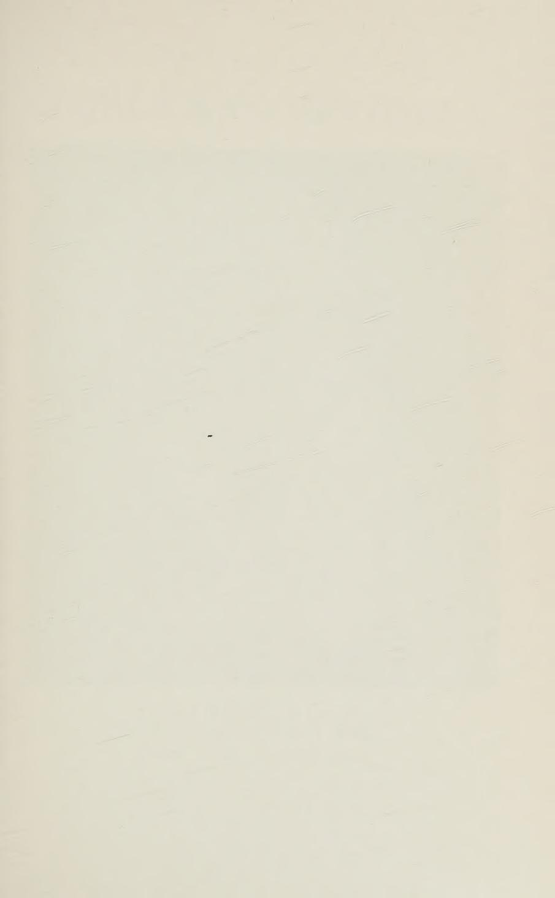

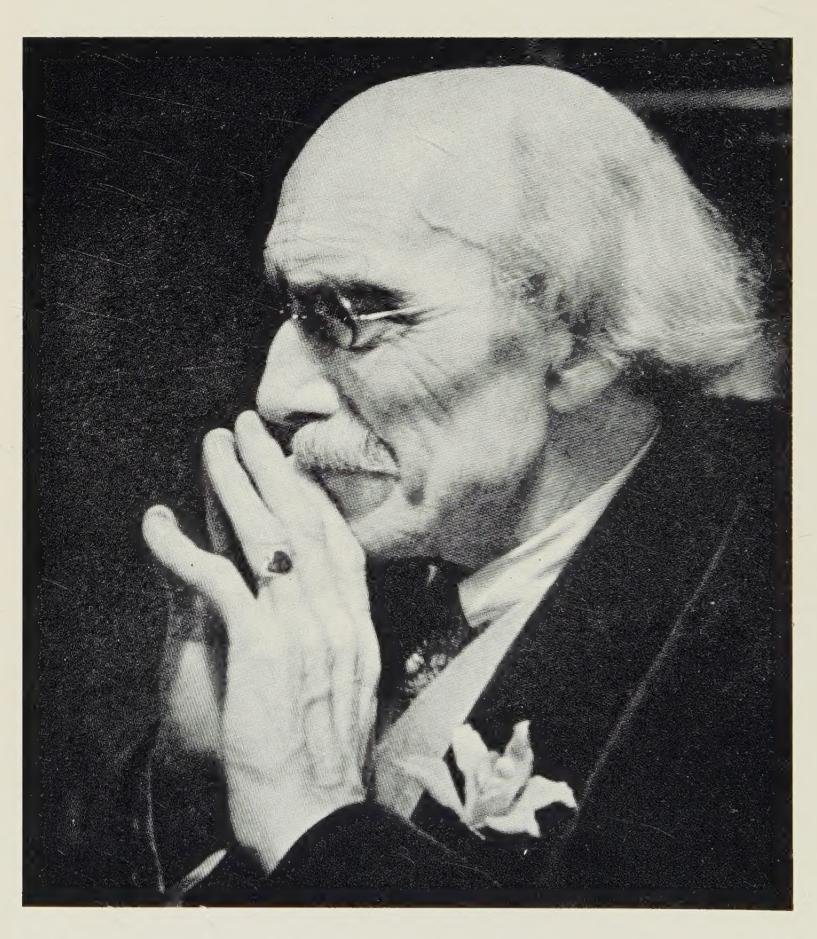

TOBIAS MATTHAY 1933

# THE VISIBLE AND INVISIBLE IN PIANOFORTE TECHNIQUE

being a DIGEST of the author's technical teachings up to date

> BY TOBIAS MATTHAY

LONDON OXFORD UNIVERSITY PRESS NEW YORK TORONTO

*Oxford University Press, Amen House, London E.C.4*

GLASGOW NEW YORK TORONTO MELBOURNE WELLINGTON BOMBAY CALCUTTA MADRAS KARACHI LAHORE DACCA CAPE TOWN SALISBURY NAIROBI IBADAN ACCRA KUALA LUMPUR HONG KONG

> First published 1932 Reprinted with corrections 1947 Reprinted 1960 and 1964

Printed Lithographically in Great Britain by The Hollen Street Press Limited London W.1

*To My Wife*

WITHOUT WHOSE CONSTANT ENCOURAGEMENT NO BOOK OF MINE PROBABLY WOULD EVER HAVE SEEN THE LIGHT "For teaching is only of whither and how to go, the vision itself is the work of him who hath willed to see." Plautinus

## FOREWORD

In the thirty-odd years since the first publication of this book a great part of its teaching, originally so revolutionary, has been widely accepted and absorbed into the minds of teachers and performers. But in writing this foreword for the present re-issue I am specially anxious, since I had the advantage of growing up with the book, to address myself to young people, who may take all this knowledge for granted without fully understanding the fundamental simplicity of Mr. Matthay's teaching.

Today there is an immensely high standard of piano playing from a physical point of view; yet there is so often no clear understanding of the true demands of the instrument. Players tend to treat the piano as a challenge to be overcome, rather than as something that should become a musical extension of themselves.

Matthay spent his whole life in eliminating difficulties, so that musical development was never delayed by the wrong kind of mechanical practice. We are all creatures of habit: therefore how important it is that we should form good ones, so that we may avoid an endless waste of time in hopeful but thoughtless work. We all know that it is not possible to play perfectly always; but the habit of right thinking and practising will enable us to approach more often our ideal in performance. So, too, will Matthay's never-failing injunction to a student going on the platform: '' Enjoy the music''.

This is not a book to read and put away: it is one to refer to

continually, The reader might do well to begin with the Epitome and then work through the more detailed earlier parts. In them he will find a complete and accurate explanation of the laws of piano playing.

It takes a lifetime to develop one's individual musical nature. How grateful we can be, therefore, for the clear and time-saving guidance of Tobias Matthay.

January, 1960 Myra HEss

## PREFACE

It is now over a quarter of a century since my "Act of Touch" appeared — in 1903 — my first essay on Pianoforte Technique.

Necessarily it was cumbrous, since there was then little, if any, common-sense knowledge of the subject; and as the great majority of the ideas I had put forward were new, these were of necessity protected and fenced round with defensive arguments. But now all this has changed, the basic principles of my teachings are generally accepted, and indeed have become axiomatic as pianistic knowledge. !

True, some things which then seemed of the gravest importance have since passed into better perspective, while others, which then seemed almost subsidiary, have since loomed up into greater prominence. I have endeavoured both to clarify and simplify, enlarge and modify, my ideas in subsequent books and lectures, which have become more and more concise in utterance as the facts have become more widely accepted,—indeed my last booklet ''The Nine Steps towards Finger Individualization'' covers only four pages!

However, I feel the time has now come when all this material should be gathered together, for the convenience of teacher and learner, and also to prevent misunderstanding as to what my

1In fact they have become so much '' Common Knowledge" that they are no longer attributed to me! Already in rgr3 the '"' Musical Times" wrote: "And now? The one man's fad (as it had been supposed to be) has within ten "Short years altered radically the whole system of modern pianoforte teaching. . . . "Probably never before in art has an almost world-wide revolution been accom- "dlished in so short a space of time."

teachings really are today. In fact, there have been issued lately a number of piratical works and writings founded on my ideas, sometimes avowedly so, which, while showing much felicity in expression, are nevertheless inadequate, and most inaccurate upon very important matters, thereby forming actual perversions of my teachings. To mention only one instance, these writers have almost entirely overlooked the important changes of state of exertion and relaxation of the playing limb which form THE REAL BASIS OF GOOD TECHNIQUE, but which, being invisible, have escaped their attention. Hence I feel that it is most urgent that the present AUTHORITATIVE work be issued by me, and trust that it will serve as a corrective to so much spurious '' Matthay teaching" which is to be met with today.

It will be seen that I do not here more minutely stress the locality of muscles or anatomical details at greater length than I thought fit in my first work, "The Act of Touch." There is good reason for this. The fact remains, that beyond certain quite simple generalizations, the attempted realization of the precise locality of the muscles concerned is not only futile, but is bound to impede the learner's progress, since it must take his attention away from the points where it is most directly needed. Anyway, it is futile, since it is practically zmpossible, both physiologically and psychologically, for us to influence or provoke any particular muscle directly into action, however hard we may try. No muscle responds that way! Moreover, were such attempt possible, it would indeed be hopeless to essay so to impart or acquire the correct playing actions, considering that even the most simple actions of our limbs (both the visible and the invisible ones) require a complexity of muscular interplay that would at once render such problem unthinkable.

Moreover, the precise action of the deeper-seated muscles in playing is still largely a matter of conjecture.

What we can learn and should teach is what may be termed the general Muscular Mechanics of the limbs we use. We can learn which section of the playing limb should be exerted and which should be left lax; and by thus willing the desirable tmwpstresses into action and by inhibiting the undesirable ones, the concerned complex muscular co-ordinations will indirectly but surely be called into responsive operation. This basic principle which underlies all my technical teachings is also carried out in the present work.

Our business as teachers is to make clear to the learner which are the /imb-stresses (both visible and invisible) needed in playing, and which are the ones to be avoided. It is the only way by which the learner can be directly helped.

The physiological aspect of Touch and Technique is usually found to be the most difficult problem to grasp by the learner. Necessarily it is complex. It is here that the most fantastic notions have arisen in the past, and are indeed still lamentably evident even in the work of some writers of today, who ought to know better.

To ensure that consideration of the necessary details does not jeopardize the true apprehension of the subject as a whole, I have planned my work on the same lines as in actual teaching; although in teaching one is able to bring the details to the notice of che pupil as required at the particular moment.

The main physiological facts are therefore first stated broadly in Chapter IV, "' The Physiology of Touch.' This is followed by an exposition of the details implicated in Chapter V, "The Physiological Details.' These are further elaborated in the succeeding Chapters. 'Additional Notes" are added in further elucidation of these matters. All is then clinched in a Recapitulatory Section of the work — a close-up Summary, under the title of "' Epitome."

This Epitome, however, is sufficiently complete in itself to form an independent booklet, and is issued separately for School use, etc.,—an important mission. It is followed by fifty-five "Daily Maxims" and a page of "Final Precepts" — concise axiomatic outlines intended as constant "'close-up"' reminders of the main technical essentials to be kept in view alike by Student, Teacher, and Artist.

Obviously this plan entails much repetition and reiteration. But unless the various facts are thus brought into close juxtaposition in their presentation, their bearing upon each other might easily be overlooked and lead to serious misunderstandings.

While such reiteration may be resented by the casual reader, it is imperative for the true student. It is only by repetition of the same point under various aspects that facts are eventually brought home and grasped; and vision of the whole not lost sight of while in pursuit of the details of structure.

A genius may not need such treatment; he may see things in a flash of intelligence. Geniuses in the past have thus subconsciously realized the true processes of technique, else there never would have been any great players before the appearance of the "Act of Touch"! A work of the present nature, however, is designed as an endeavour to help the ordinary worker and Seeker after Truth; the genius, himself, may also save years of time and feel surer of his ground by taking the trouble to master the facts thus intellectually, as well as by "intuition."

Note. — Where more detailed information is desired, my older works should be referred to, preferably in the inverse order of their publication. Thus: —

"The Nine Steps towards Finger Individualization" along with "The Child's First Steps" (Joseph Williams), and its complement for Children, "' The Pianist's First Music-Making" (Oxford University Press), "First Solo Book" and "' Playthings for Little Players" (O. U. Press), "First Principles" and its complement "Some Commentaries on Piano Technique'? (Longmans); 'Relaxation Studies" (Bosworth), and finally, '' The Act of Touch'' (Longmans). Along with these should be studied (not merely read through) my most important work of all, "'musIcAL INTERPRETATION, its laws and principles" (Williams); and the recently issued supplement to this "The Slur or Couplet of Notes" (O. U. Press); also when needed: "On Method in Teaching," ""On Memorizing"' (O. U. Press), 'Forearm Rotation" (Williams), etc., etc.

I wish to acknowledge the great help I have had with my proofs from my devoted disciple Alvin Goodman.

Norte. — Also I must thank Miss Helen Marchant for her patiently devoted work as stenographer and typist.

Tosras MatTTuHay.

HASLEMERE. SURREY, ,ENGLAND. April, 1931.

# CONTENTS

## CONTENTS OF DIGEST

|                  |                                                                        | PAGE |
|------------------|------------------------------------------------------------------------|------|
| FOREV            | WORD                                                                   | vii  |
| PREFA CHAPTER |                                                                        | xi   |
| I.               |                                                                        | 3    |
| II.              | How to Use the Piano-key                                               | 6    |
| III.             | ACCURACY OF TONE, AND THE LINK BETWEEN MUSIC                           |      |
|                  | AND TECHNIQUE                                                          | 12   |
| IV.              | How to Use Limb and Muscle                                             | 14   |
| V.               |                                                                        | 22   |
| ٧.               | (a) The Finger and how to use it                                       | 22   |
|                  | The two distinct modes of Finger-use, ¶2                               | 22   |
|                  | The two muscular ways, ¶3                                              | 23   |
|                  | (b) The Hand and how to use it, ¶4                                     | 24   |
|                  | Ten Hands needed, Note to ¶4                                           | 25   |
|                  | Finger v. Hand movement, $\P 5 \ldots \ldots$                          | 25   |
|                  | (c) The Arm and how it is needed, ¶6                                   | 26   |
|                  | The six ways of Arm-functioning, ¶6                                    | 26   |
|                  | The two compulsory ways of Arm-use                                     | 27   |
|                  | 1. The Poised Arm, ¶7                                                  | 27   |
|                  | 2. The Rotative Forearm, ¶18                                           | 30   |
|                  | The four optional ways of Arm-use, ¶19                                 | 31   |
| 3                | 1. Forearm Weight, ¶21                                                 | 31   |
| 1                | 2. Whole-arm Weight, ¶22                                               | 33   |
|                  | 3. The same with Forearm down-exertion,                                | 35   |
| 1                | ¶27                                                                    | 33   |
|                  | drive (to be avoided), ¶29                                             | 36   |
|                  | (d) Arm-vibration touch, ¶8                                            | 27   |
|                  | (e) Weight-transfer touch, ¶¶9–13 and 34 28, 29                        |      |
|                  | (f) The Touch shout Weight touch ¶25                                   | 39   |
|                  | (f) The Truth about Weight touch, ¶35                                  | 37   |
|                  | (g) Weight-initiated v. Muscularly-initiated touch, ¶23, Note, and ¶39 | 42   |
|                  | (h) The Dual nature of the muscular equipment, ¶40                     | 43   |
|                  | (i) The Merging of Touch-forms, ¶48                                    | 48   |
| (                | (1) The Merging of Touch-forms, #10                                    | 10   |

|                | ONTENTS OF DIGEST AND ADDITIONAL NOT                |      |
|----------------|-----------------------------------------------------|------|
| CHAPTER 1/T | THE USE AND MISUSE OF FOREARM ROTATION              | PAGI |
|                | THE MOVEMENTS OF TOUCH, DURING AND BEFORE KEY-      | -1,  |
| V 11.          | DESCENT                                             | 65   |
| VIII           | ON HOLDING NOTES — THE RIGHT WAY AND THE            |      |
| VIII.          | WRONG WAY                                           | 68   |
| IX.            | BENT AND FLAT (Thrusting v. Clinging) FINGER-ACTION | 73   |
|                | How to Find the Right Notes                         | 80   |
|                |                                                     | 83   |
| XII.           | Weight-transfer and Arm-vibration Touch             | 89   |
| XIII.          | On Position — AND MOVEMENT                          | 105  |
| XIV.           | On the Naming of Things (Nomenclature)              | 113  |
| A Pac          | GE OF CODA                                          | 121  |
|                |                                                     |      |
|                | ADDITIONAL NOTES                                    |      |
| NOTE           | ADDITIONAL NOTES                                    |      |
|                | ON PRACTISING                                       | 122  |
| II.            | At the Beginning                                    | 123  |
| III.           | FOREARM-ROTATION MISUNDERSTANDINGS                  | 125  |
|                | — and Misrepresentations                            |      |
| IV.            | ON BEAUTY AND UGLINESS OF TOUCH                     | 135  |
|                | - The Question of Quality again, and the importance |      |
|                | of correct Arm-use                                  |      |
|                | Effective and Ineffective Finger-work               | 140  |
| VI.            | PIANOLA v. HUMAN PASSAGE-WORK                       | 141  |
| VII            | Reproduced v. Self-produced Music                   | 144  |
| V 221          | - "The Man and the Machine"                         | 177  |
| VIII.          | A PLEA FOR MUSIC-MAKING                             | 146  |
| IX.            | THE DISTINCTION BETWEEN THE VISIBLE AND INVISIBLE   | 149  |
| X.             | THE "PURE FINGER-WORK" MYTH                         | 154  |
| XI.            | THE FUTILITY OF ANATOMICALLY-DIRECTED PEDAGOGICS    | 156  |
|                | — Useful v. Useless Anatomy-teaching                | 200  |
| XII.           | On Key-bedding                                      | 161  |
|                | FLAT " BENT FINGER ACTION                           | 160  |

| CONTENTS OF EPITOME XV                            |
|---------------------------------------------------|
| NOTE                                              |
| XIV. THE THREE "LIVING LEVERS" 164                |
| XV. An Impossible Reconciliation 163              |
| XVI. On the Nature of Rhythm                      |
| XVII. Strong v. Weak Fingers and Piano Voices 169 |
| XVIII. AN ALTERNATIVE ppp Method 17               |
| XIX. On Rhythmical Attention                      |
| — Individualism v. Mechanism                      |
|                                                   |
| CONTENTS OF EPITOME                               |
| FOREWORD TO EPITOME Ev                            |
| I. THE MEANING OF TECHNIQUE E3                    |
| II. How to Use the Piano-key                      |
| III. Accuracy of Tone, and the Link Between Music |
| AND TECHNIQUE                                     |
| IV. How to Use Your Limbs and Muscles E7          |
| V. How to Use Your Finger, Hand and Arm E10       |
| The Finger Element E 10                           |
| The Hand Element E11                              |
| The Arm Element E11                               |
| The Six Ways of Arm-use E 12–18                   |
| VI. THE USE AND MISUSE OF FOREARM ROTATION E18-26 |
| VII. THE MOVEMENTS OF TOUCH, DURING AND BEFORE    |
| KEY DESCENT                                       |
| WRONG WAY                                         |
| IX. BENT AND FLAT (Thrusting v. Clinging) FINGER- |
| ACTION                                            |
| X. How to Find the Right Notes                    |
| XI. STACCATO AND LEGATO                           |
| XII. WEIGHT-TRANSFER AND ARM-VIBRATION TOUCH E41  |
| XIII. On Position — and Movement                  |
| XIV. On the Naming of Things (Nomenclature) E49   |
| "Daily Maxims" (55 Pianistic Aphorisms) E 53-58   |
| "Final Precepts" <b>E</b> 59                      |

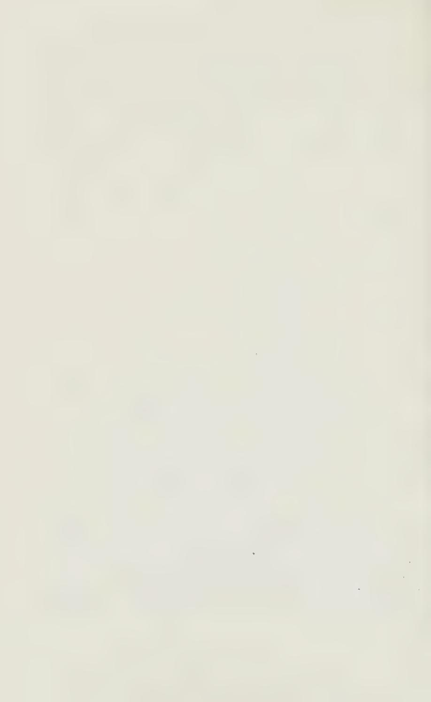

# Chapter I

## PREAMBLE

## The meaning and purpose of Technique

#### Definitions:

- 1. TECHNIQUE means the power of expressing oneself musically. It embraces all the physico-mechanical means through which one's musical perceptions are expressed.
- 2. It is therefore absurd and hopeless to try to acquire Technique dissociated from its purpose to express Music.
- 3. Typewriter-like strumming or note-rattling does not constitute Music.

Technique is rather a matter of the Mind than of the "fingers."

4. To acquire the necessary muscular discrimination for playing, implies the acquisition mentally of the power muscularly, so to direct your limbs in their work, that your musical purpose shall accurately be fulfilled.

#### Technique and Music inseparable:

- 5. To acquire Technique therefore implies that you must induce and enforce a particular mental-muscular association and co-operation for every possible musical effect.
- 6. The folly in the past has been to suppose that one could acquire a musical technique dissociated from the practice of actual, real Music.
- 7. On the contrary, be sure to realize from the very beginning, that what you have to do, is to make a strong bond between Musical Intention and the means of its practical Fulfilment. From the very first, you must try to make strict association between the spiritual and physical in playing.

8. Never sound a single note without a distinct musical purpose. This implies a definite rhythmical Intention for each note, and also applies to your very first experiments at the keyboard.

#### The Act of Timing:

Realize that you cannot play any note with musical purpose without such accurate Timing.

9. Pianoforte technique is therefore essentially an act of "aiming"? or timing the right activities of the limb at the musically right moment during key-descent — an accurate timing of the beginning, culmination, and cessation of the needed limbexertions for each note. Solely by such Act of Timing, can you bind Technique and Music together.

#### Relaxation:

10. RELAXATION implies (a) the Elimination of all unnecessary exertions, (6) the Cessation of the needed impulses at the right moment, and (c) Weight-release — the cessation of limb-support, and hence Weight-manifestation where and when needed.

#### The connection between Music and Technique:!

- 11. To summarize this: no successful technique can ever be acquired without this element of timing. Mastery of Technique and mastery of Interpretation alike rest on the same basis — a basis of rhythmic impulse and control.
- 12. You now realize why the study of Technique should never be separated from the study of Music; how they are connected-up, and why they must be associated from the very beginning.

You must acquire a strict mental Association between every musical effect and its technical reproduction. Hence it is harmful to try to acquire a Technical effect without making such association.

13. In short: every note must be sounded with definite 1 This is enlarged upon in Chapter ITI.

musical purpose — rhythmical purpose and tonal purpose, and this from the very beginning.

#### The four forms of Rhythmical Movement:

- 14. There are four main divisions of rhythmical purpose or attention in playing: —
  - (2) Key-movement the swing of the key downwards, towards 'Tone-emission.
  - (b) The group-sensing of notes in a quick passage, as groups of notes always leading towards each next pulse or beat.
  - (c) The growth or progression of the Phrase-unit towards its rhythmical climax — near the end of the phrase, and
  - (d) The movement or progression of the piece as a Whole towards its climax.
- 15. The ever-present problem during Practice and Performance is never to let your attention flag or waver, either musically or pianistically, no matter whether you are a beginner or an experienced artist.

Remember, only through the rhythmical sense can you bring your mind on the needs of the Music and the Keyboard for every note. "'Time-spot" is the ground upon which Mind and Matter here meet. This also fully describes every other act of Concentration.

16. While musical attention and technical attention thus coalesce (or are linked together) in the riythmical act, we must remember that besides the laws of Physical technique there are also just as inexorable laws of Interpretation. These laws we must equally learn to obey, if the emotional effect of the music is to be achieved in good taste and effectively.

1 These laws of Interpretation are dealt with in my " Musical Interpretation" (Joseph Williams, London, and Boston Music Co., U.S. A.) and in its Supplement: "The Slur or Couplet of Notes in all its Variety" (Oxford University Press).

## Chapter II

## THE PHYSICAL OR KEY-ASPECT OF TECHNIQUE

#### Tone-production:

1. The more speed in the string, the louder the resultant sound. Only by making the Key (and the String therefore) move quickly can you produce loudness. There is no other way."

2. The Piano Key is a leverage system, a machine, to enable you to get speed with the string, and to ensure dynamic con-

trol — of the exact speed (or tone) desired.

3. Open your Piano lid, so that you can watch the Hammerheads. Now put a finger upon a key, and notice, when you depress the key its 3 of an inch, that the hammer-head moves about five times that distance, and therefore exaggerates by five times, the speed with which you depress the key.

4. Also notice that it falls back the instant it has reached the string and has set the same into vibration (or movement) —although you may be keeping the key depressed afterwards. This is owing to the hopper device, which allows the hammer to rebound from the string. Without such a device the hammer would be jammed against the string, and all tone destroyed.

5. Note also, that as you put the key down you are lifting the damper away from its strings, thus leaving them free to continue sounding; and that the damper returns to the strings when you allow the Key to come up again, thus arresting (or "damping'') the sound.

1 Do not confuse speed with vibration of the string, they are two different things; the first implies Joudness, the second implies pitch. You cannot alter the vibrationnumber of a string, it is constant; but you can alter the amplitude of those vibrations, — whether the vibrations are of small or large extent, — and that implies variation in the degree of speed, and the consequent degree of loudness. See p. 73, "The Act of Touch" (Longmans, Green & Co.).

6. The "Grand" action also includes a device (the "repetition lever") which enables you to re-sound the note, without having to allow the Key #0 rise fully; about an eighth of an inch should suffice.

The Action is also provided with a "check," which brings the hammer to rest after it has fallen back from the string, so as to prevent its rebounding and re-striking the string on its own, and thus spoiling the tone.

Nore. — See The Act of Touch (Longmans, Green & Co.) where these things are described at length, and where a Diagram of the Pianoforte action is given on page 62.

#### Good and bad tone:

- 7. Realize, then, that you can only make tone by making the Key move and thus convey speed to the String.
- 8. The greater the motion attained during key-descent, the louder the sound.

Nore. — Speed of the Key, during descent, must not be confused with speed in the succession of the notes! It seems unnecessary to point out that the quickest passages can quite well be played softly — but I have had letters on this question!

- 9. Bad tone, and lack of control over tone, arises when the Key is jerked down by a too suddenly applied impulse.?
- 10. We see then that Tone-amount depends purely on Keyspeed, but Control of tone and Quality depends on how you produce that speed.

#### Key acceleration:

- 11. Good tone, ease in production, and control of tone, can only be obtained by gradually pressing the Key into motion. Only in this way can you obtain perfect control over tone, good "singing" tone, and good quality of tone.
- 12. Moreover, this necessary acceleration of the Key (for every note) is mot a Plain Acceleration, but should be an accel-

1 In this case the harsh upper-partials of the string are brought into prominence.

eration in acceleratingly progressive proportion during that short 2 inch of descent.

You cannot control tone, and cannot play musically unless you succeed in acquiring this way of managing Key-descent.

Increase at in- 13. This law of increase at increasing ratio apcreasing ratio, ies in our use of all "Speed-Tools."' applies every-

where Nore. — The racket, the bat, the golf-club, the hammer, the hatchet, even the gun, are illustrations of such ''Speed-tools" — working at mounting-up increase!

Cresc. and dim. It isexemplified, also, in effectively played crescenand accel. and he : ri, also come 205, and diminuendos, ritardos, and accelerandos under same law a]] must be played as an increase at increasing rate.

The notation of cresc. or dim. is quite inaccurate. They should never be played as at A, but as at B:

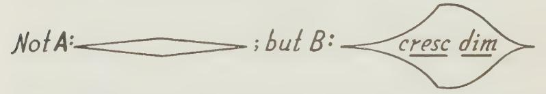

14. While this curve of acceleration is the "law of the Key" for all singing or good tone, it applies equally in the production It applies also Of the softest pp. Thus, for real pp, you must in pianissimo slowly feel your way to that point in key-descent where you can feel the hopper beginning to slide from underneath the hammer "button"; you can feel this as a slight impediment, and from there only may you add the true tone-producing impulse; ppp-playing, in fact, is exaggerated singing-tone — so far as method of production is concerned.!

Nore. — This slight impediment is caused by the lower end of the L-shaped hopper coming into contact with its set-off screw, and you then feel you are compressing the hopper-spring.

Unless you master this knack, you can never command a true Ppp; and unless you can command that, your whole range of tone is much narrowed. Moreover, realize that your fortes are

1 See Additional Note XVIII, An alternative form of ppp.

truly fortes only in proportion that your pianos are truly pianos; and that you can therefore only produce the effect of a true forte by being able to produce the softest sound.

## How to play ppp:

15. To gain this trick of real ppp playing: Take a chord of three or four notes, and with fingers tolerably firmly fixed against the key-surfaces, move those keys down only so far as the hopperimpediment, and let them rise again. Repeat this a number of times, until you feel confident with it, then follow this movement to the hopper by the very slight additional one that will swing the hammer to the string, and will thus sound the notes really at their very softest. It is an excellent way of realizing what is meant by "'Key-attention"'!

#### The repetition of soft notes, and the ''Bebung'"':

16. Notice also, that on a Grand Piano, properly adjusted, you can repeat the note softly without allowing the key to rise more than 7th of an inch or so. This you are enabled to do, because the repetition lever of your Grand enables the hopper again to slip under the "'button" of the hammer. Also, when you do this, the note can be repeated perfectly legato; because when you allow the key to rise so little, the damper does not reach the strings. Thus you can play the repeated chords of the opening of the ''Waldstein"' Sonata perfectly legato — and pp -— quite a different effect from that produced when you allow the keys fully to rise. Try it!

As other examples, take the accompanying chords of the slow movement of Schumann's Sonata in G minor; also those softest ''reverberated"' chords (the second of each couplet) of the opening of Chopin's G minor Ballade. The reverberated effect here (''Bebung"') is the same as required at various points in the slow movement of Beethoven's Op. 110, etc.

Note. — See "The Slur or Couplet of Notes." (Oxford University Press.)

#### Tone-production, momentary:

#### The short duration of the Tone-producing impulse:

- 17. Next realize, that No tone, whether in staccato or legato, ever takes longer to produce than for Staccatissimo — the hammer instantly rebounds from the string, whatever you do, and thus leaves the tone after that quite unalterable.
- 18. Hence you have to live your "'touch-life'"' during that short moment of Key-descent! You must imtend the musicallyneeded sound, and you must accomplish the production of any desired tone-inflection during that flash of descent with the Key. Nothing, after that, avails as to tone-production.

#### Tenuto and Legato, and Tone-cessation:

19. To make a tone continue (as in tenuto or legato) you must hold the key down after the initial short sound-producing impulse has been completed; thus you hold the dampers off the strings, which continue sounding for a while, or until you allow the key to rise, when the dampers silence them.

#### Production of Tone and Duration always distinct:

20. The action of holding a note down should always be quite distinct from the action of sounding it.

Norte. — Muscularly, it should also be quite distinct and different — a most important matter, as we shall see presently. See Chapter XIII, "On the Holding of Notes."

The key may be depressed quite violently for a forte, yet the holding down needs but a gentle action.

#### Staccato:

21. Staccatissimo is obtained by allowing the key to spring up the instant that its journey downwards is completed; the damper being thus allowed to reach the strings, the sound is instantly checked.

22. Clearly, you cannot make or compel a key to rise. You can only allow the key instantly to rise upon tone-production, thus permitting the damper instantly to reach the string.

Nore. — To obtain Staccatissimo the effort of tone-production and its subsequent immediate cessation must be so accurately timed that the key may rebound Most Staccati \_ instantly. Anything less short than staccatissimo is therefore are incomplete always in the nature of a Tenuto. This tenuto may last any degree Tenuti up to the full extent of the written note. You may even allow the tone to last Jonger than its written value, and may thus overlap it into the next sound, when desirable; thus creating a legatissimo or super-legato. See Chapter XI, "How to play Staccato and Legato."

23. If you mis-apply (mis-time) the force with which you intend to produce' a tone, and thus, instead of producing keymotion (and string-speed) allow the force to be wasted on the beds or pads under the keys, then your tone cannot correspond with your musically-intended wish, and the effect will be wnmusical in proportion to your misjudgment of the exact requirements of the key.

Norte.— I have termed this mis-timing of the TONE-PRODUCING FORCE " Keybedding." If, however, you apply some slight force purposely upon the key-beds On '"'Key-bed- so that you may feel sure you are holding those keys depressed, ding" and Key- that does Not constitute key-bedding " within the meaning of the holding Act"! Whereas, to misfire one's intended tone-producing impulse upon the key-beds is bound to be tragically unmusical. See Additional Note XII, "On Key-bedding." ^keybedding-definition

## Agility and Accuracy of Tone-making:

24. Agility, to be attained with ease, also implies accuracy in TONE-AIMING in this sense. Each Key-moving impulse must be delivered accurately before it is too late to produce the intended key-motion (and tone), else your fingers, hand and arm, will become mechanically locked against the key-beds, and will thus not only ruin all musicality, but will also inevitably hamper all ease in your progression across the key-board — or so-called " Agility." Agility, therefore, depends upon rhythmical accuracy in this respect. In short, Agility is a rhythmical act!

Nore. — Hence the benefit derived from practising Agility-passages staccatissimo at a slow tempo — provided your staccato is properly produced! — with hand lying loosely on Key-surface, between each note-sounding.

i2 DIGEST

## Chapter III

## THE LINK OR BOND BETWEEN MUSIC AND TECHNIQUE

- 1. Clearly, you cannot make real music unless you can, at will, produce the precise degree and kind of intended tone — at the precise moment it is musically due.
- 2. Successfully to obtain the requisite tone, thus musically demanded for each note, you must accurately apply the right degree of force required for each key-descent.
- 3. The only way to achieve certainty in this respect is by actually sensing the varying resistance the key itself offers during descent.

#### The Work-sense:

4. This gauging of key-resistance is attained by the application of your Muscular-sense, or Work-sense.

Note. — This is not merely a touch or contact-sense, but a sensation mainly Same degree of derived from work being done by our muscles; wherefore, the Energy required American psychologists call this the ''Kinesthetic"' sense, and forloud and soft include in this'not only true muscular-sensation, but also the notes, but feels sensations caused by tension of the tendons, and the pressure or diferent tension within the joints themselves. See Edward Bradford Tichener: A Beginner's Psychology (Macmillan), page 45, etc.

1 Note also, that it always takes precisely the same amount of force whether you move the key slowly or quickly, just as it takes the same amount of force whether you walk or run upstairs, etc. But to move the key quickly the total amount of work has to be concentrated during a shorter space of time, hence our muscles feel the strain more severely the quicker the work is done, and it is this difference in the resulting muscular-sensation of which we can become aware, if we atlend to the key as we should, through our muscular-sense, Key-resistance-sense, or in short "Key-sense."'

The phlegmatic servant, in cleaning a room, spends the same total amount of energy as the more energetic one; but the latter does the work in double-quick Time! He spends less Time, but he has to concentrate more vitality for the shorter period!

## LINK OR BOND BETWEEN MUSIC AND TECHNIQUE 13 Always "feel the Key":

S. Unless you thus insist on judging what you are doing during each key-descent, you cannot make Music except by lucky accident. Therefore be sure always to "feel the key."

Nore. — Moreover, this necessity quite puts out of court any system of Teaching founded on such flagrant misconceptions as Key-striking or hitting; since this would preclude judging the key's needs.

The swing-down to the key is always a comparatively slow process, but the movement with the key may on the contrary be a very swift one. This is a distinction not realizable through the eye, to which the correct action may seem like a blow. Hence arose, in days gone by, all that fallacious teaching of "keystriking."

#### Key-attention is Dual:

- 6. You will now realize, that Key-attention (or Technicalattention) is a dwal form of attention: —
  - (a) You must feel the key, so as to supply the requisite force to move it with properly graduated acceleration; and
  - (6) You must listen for the beginning of each sound, so that you may successfully time and apply the force before it is too late in key-descent — a rhythmical act.}

#### Key-sense and Music-sense inseparable:

7. Now you cannot choose this requisite force, nor time it, unless you have each note in your mind as a purposed musical wish. It is therefore only through this form of attention — ATTENTION TO MUSIC THROUGH THE PIANO-KEY for every note — that you can successfully forge the Bond or connection between each spiritually-conceived musical effect, and its material realization through the Piano-key.

"SENSING THE Key" is the main factor towards expressing 'what you musically feel. There never has been any musical playing without its conscious or subconscious intervention.'

1 Moreover, not only must the key go down rightly, but the holding-down and

' the coming-up must also be exact.

2 This principle applies in all performance, whatever the instrument, and also | in any pursuit needing muscular nicety of action; and the giving of such attention } must of course become habit or "second nature'' — subconscious — before we ( can freely translate our feelings through any instrument.

# Chapter IV

## THE PHYSIOLOGICAL PROBLEMS

— and how to use finger, hand and arm.

1. Preamble: (a) Technically to play well, necessarily implies the power to provide the correct limb-actions and inactions muscularly, and their being accurately timed with the Key.

(b) The problem is, how to bring such knowledge of correct doing within the learner's ken. Here, at the very outset, we are faced with formidable difficulties, for we must successfully analyse correct Doing muscularly, and discover its true

principles.

(c) In the past, it was sought to accomplish such Diagnosis of Touch (or Technique) by carefully observing the MOvVE-MENTS exhibited by successful players.' Unfortunately, this method is not only very precarious, but is often quite misleading, since the movements which accompany touch give but little (or even illusionary and misleading) indication of those hidden and invisible stresses — exertions and relaxations of limb, which are the real CAUSE of the desirable and undesirable effects. Correct movements are therefore no guarantee whatever that the correct actions are being provided. Moreover, quite unusual movements may accompany quite correct actions!

Note. — For instance, in playing a note or chord with singing tone, you may approach the keyboard quite wrongly — with a visible forward movement of arm Eye, the de- and elbow, and may yet reverse all this during the subsequent ceiver moment of key-depression; to the eye this will seem wrong, and yet to the ear it will sound acceptable! Or, vice versa, you may allow arm and wrist apparently to lapse quite nicely, sympathetically, towards the key, and you may yet, while actually moving the key, invisibly deliver a nasty, tone-destroying dig! The ear will be shocked, but to the eye it will seem quite in order!

In short: Touch cannot be analysed by the eye.

1 Even some recent writers have tried to perpetuate this fallacy!

#### Limb-Knowledge is required, not Muscle-Knowledge:

- (d) Of late it has been essayed to help the student totally from the opposite side, by trying to instruct him as to the precise locality and nomenclature of the muscles employed. This is even a more precarious and misleading method than the last, and is in fact not only futile, but likely to prove seriously harmful to the learner.! The anatomical road, moreover, is impracticable, and useless (so far as learning and teaching are concerned) for the two following cogent and quite insuperable reasons: —
  - I. It is physiologically and psychologically impossible for us directly to provoke or prompt any particular muscle into activity by any act of thinking of it, or wishing or willing it, no matter how concentrated our effort. Muscles can only be provoked into action INDIRECTLY, by our willing a particular limb-exertion or movement.
  - II. The muscular processes needed for many quite simple actions are so complex as to be practically unthinkable, even if we could separately prompt the required muscles into action — which we cannot do.?

#### Correct limb-stresses can be learnt:

(e) What we must know, and can know, is what particular stresses and relaxations are required of the various portions of our playing-limb — which parts of the limb to exert and which to leave passive. This knowledge is attainable, and is immediately and directly helpful. Such knowledge, however, cannot be got at from without, neither from eye-evidence nor from

1 See PREFACE on this point, also Additional Note XI, "Useful and Useless Anatomy-teaching."'

2 A somewhat urgent warning is here desirable. With the excellent intention of being "thorough" or "griindlich" the folly has recently been committed, de-

liberately to urge (and misinstruct) the unfortunate student to try to think hard of his own muscles; this is advocated under the delusion that he could thereby learn to apply them accurately in playing! As I have just shown, this is bound to lead to disaster. A Warning

See Additional Note XI on this point: "Useful and Useless Anatomy-teaching."

anatomical conjecture. It can only be obtained through analysis from within — by analysis of the sensations experienced while actually producing the right effects, and in no other way. Only by the sensations thus experienced can we realize what are the limb-conditions that obtain both in good and in bad playing, and by calling-up or recalling such sensations we can then reproduce the effects and can acquire right habits, and can teach others to acquire them. Here, however, we are again faced with a difficulty. Those few gifted ones, who instinctively stumble upon Right Doing, physically, are usually precisely the ones least fitted to help us by self-analysis. The greater their temperamental, emotional and musically-imaginative gifts, the more likely are they to be disinclined, opposed and even resentful towards any exercise of self-analysis, mechanically and physically. Hence we find that these usually prove to be quite bad teachers, technically, in spite of their own well-doing. Nevertheless, it is only a successfully musical player, who has really achieved technical mastery, and is at the same time gifted with powers of analytical and mechanical reasoning (a rare combination) who can possibly supply the needed information; that is, HOW IT FEELS, physically, to play rightly, and also how it feels to play wrongly!

It was by this method of self-analysis and synthesis that The Act of Touch was produced in 1903; and Time has proved that its general principles of technical teaching were founded on the right lines. Now to come to details: —

#### Technique is mental:

2. As already noted, you cannot teach your limbs or your muscles to act. All you can do is teach your mind to direct the required /imb-conditions of aetivity and inactivity.

Nore. — There is no such thing as "muscular habit" ! It is always mental habit — located either in the brain itself or in its subsidiary automatic centres.

3. The first important thing to learn physically (i.e. mentally) is to supply solely the required exertions, without interference from any undesirable ones.

#### The meaning of Stiffness:

4. If we allow the opposite exerticns to be provoked into action along with the required ones, then we experience "'stiffness"' — a tug-of-war — within the limb, or portion of it.

Norte. — If the two antagonistic exertions are precisely equal, then nothing happens viszbly, but you can feel the tense struggle if you are observant, and your audience will certainly hear it —if they are musical. If the two exertions, however, are not quite of equal intensity, then some action or movement may result, but it will be constrained. And any such "stiffness" will preclude our attaining any accuracy in tone, or ease in performance; therefore it must be carefully guarded against. ^matthay-antagonistic-struggle

- 5. Now remember, as already pointed out under § 1 (d I), you cannot directly will, prompt or think any muscle into action; you can only induce the exertion of a muscle by willing the required exertion of a limb or portion of it.
- 6. If you try directly to actuate a muscle, you will only petrify yourself and lose all control, for you are taking your mind AWAY from the only road open to you, and that is to concentrate upon the limb-action itself —in strict association with the musical effect needed from that particular Piano-key at that particular moment.

Nore. — In short, as already indicated, you must be able to recall the sensation accompanying the correct exertion or movement of the limb. And to acquire such sensations of Right Doing, you must experiment, guided by information such as here given you.

#### Never hit a Key down:

- 7. The muscular process of sounding a note at the Piano is, however, by no means the simple thing it seems to the eye.
- 8. To begin with, it should never be in the nature of a blow upon the key, however much it may look like that. It never is in good playing, although the player himself may imagine that he is hitting the notes down.
- 9. Always realize, that the action of moving éo a key and the action of subsequently moving with that key during its descent, should always be two quite distinct things.

#### Make tone with the Key:

10. You may reach the key either by a movement of the Arm, Hand or Finger, but whichever you employ, and however swift the movement may seem to the eye, the true tone-producing action is not applied until after you reach the key — if you play rightly.

11. Tone-production is always in the nature of a "follow-on" pressure upon the key after it is reached, and during key-depression. This tone-producing pressure must increase in intensity during key-descent. Yet it becomes useless (so far as tone-production is concerned) the moment the key is down, and

it should therefore be ceased forthwith.

12. So-called "Finger-touch" may appear to the eye as if the fingers were used "like little hammers" (the "hammerette"' action of the old German Schools), but in reality, with a good player, there never is any such real knocking action.

13. To the eye, the finger of a good player may seem to descend upon the key fairly swiftly, but its exertion upon the key (and with it during its descent) is always a thing added after contact.

#### To strike a Key down precludes sense of its needs:

14. Clearly, if you really knock a key down, this will inevitably prevent your playing musically, since it precludes your judging how much force is required for the colouring of each note, and precludes your giving that due acceleration of the key during descent necessary for good Touch.

Nore. — Even a good typist does not really knock the keys down, although it may seem like that to her, and there is no actual tone to spoil in this case!

#### Exertion required of the Finger:

15. Obviously, it is by means of the Finger-tip that you must depress the Key into sound. Also it is obvious that your finger must therefore be exerted during the moment of key-depression.

Nore. — Unless you play with your closed fist, as I recommend should be your first step at the Piano.!

16. Moreover, there is practically no such thing as tone-production solely by exertion of the finger. It must always be Finger-exertion PLUS hand and arm, in some form or other.

Nore. — Theoretically, finger-exertion, alone, is a possibility, as I showed in The Act of Touch; and Finger-exertion, with loose-lying hand, may suffice to hold a note down once it is sounded; but in actual practice it does not suffice to sound notes with certainty (even in the softest passage) on our modern Pianoforte, whatever may have been the case in the old Clavichord days. But we are here learning to play the Pianoforte, not the Clavichord.

#### The distinction between Exertion and Movement:

17. Now, do not confuse Exertion and Movement of a limb as meaning the same thing. They are two quite distinct facts. It is possible to obtain a movement without exertion, as you do when you let the hand or arm fall of their own weight; but, on the other hand, you may make an exertion without showing any corresponding outward movement, as you do when you firmly hold something in your hand— maybe quite a considerable exertion — and yet nothing is revealed wszbly.

Nore. — As already pointed out, most of the exertions and relaxations required in playing are not revealed by corresponding movements — they are invisible. Movement vy. Hence have arisen so many false theories on Touch. For instance, muscular the old fallacy of '"'Pure Finger Touch" arose from the foolish condition attempt to diagnose the process of playing by observation of the finger-movements exhibited during performance. Whereas, as we have seen, movement gives hardly any indication whatever of what really does happen — no indication whatsoever of those constant changes in muscular exertion and relaxation of a limb (unaccompanied and undisclosed by movement), which conditions or states of limb form the true Cause of all Technique, whether of the past, present or future. It is essential to master this fact at the very beginning. See Additional Note, No. X: "The Pure Finger-work Myth."

As an example: when you play a forte chord with what looks like (but is not) a fall of your whole arm, the fingers seem to be passive, whereas, as a matter of fact, when your finger-tips touch the keys the fingers must be exerted (maybe quite

1 See" Child's First Steps" (Joseph Williams); "' Pianist's First Music-making"; "Nine Steps towards Finger-individualization"; and "First Solo Book." (Oxford University Press.)

violently) during the moment of key-depression, — and the hand also! Unless they are thus exerted there will be no chord! Yet nothing is seen of this necessary exertion of the finger (and hand) during the moment of key-depression, therefore, it is often overlooked and not supplied; and then the chord playing, or singingpassage, sounds "flabby." Hence, also, have arisen those stupid criticisms from some quarters, that '"RELAXATION and Weight-touch, etc., lead to flabby playing!" Indeed, if you attempt to use your fingers in playing without due help from the arm (as other obtuse ones would recommend) then, indeed, your tone will certainly be "flabby," more flabby in fact than when you spoil your "Weight-touch" by not giving correspondingly adequate finger-and-hand exertions! It is therefore of extreme importance that you understand this radical distinction between Condition and Movement — the condition of your finger, hand and arm during the action of Touch, and the movements that may optionally accompany such changes of Condition muscularly — and most of these last are quite invisoble.

Until this distinction is clearly grasped, you cannot hope to form any rational idea whatever, of the processes (or rationale) of Touch or Technique.

#### Action and Reaction:

18. It is now necessary to realize that Action and Reaction are always equal. Thus, when you exert your finger-tip against the key downwards, there is an equal reaction (or recoil) at the other end of that finger-lever, upwards therefore at the knuckle. This invisible reaction or recoil upwards at the knuckle must again be countered at the knuckle by supplying a sufficiently stable Basis (or foundation) there for the desired action of the finger.

In short, the exerted finger needs a Basis at the knuckle-joint, equal to the force to be exerted against the Key.

Norte. — This necessity of a firm basis for every action was instinctively felt even by some of the older pedagogues; unfortunately they were quite vague and unclear as to what it meant physiologically; hence arose their mistaken idea of "FIxaTION" — fixation of the joints during the moment of touch! A terrible mistake, leading to a paralyzing stiffening of the whole limb, unhappily copied by some recent authors. True, such Basis or Foundation must certainly be rendered stable and immobile during the moment of Touch, but it failed to occur to these writers that this stable condition can only be achieved by supplying an invisible stress from the next-door portion of the limb behind the joint or hinge in question!

#### Hand-exertion the Basis for the Finger:

19. This Basis for the Finger should be provided at the right moment by a downward exertion of the Hand — at the knucklejoint. This exertion of the hand must be precisely timed along with the exertion of the finger itself, during the moment of keydepression. Realize again, that no movement of the hand need be visible — however marked the exertion of it "behind" the finger.

20. Again in turn, the Hand also needs its own proper Basis during the moment of tone-production, else the wrist-joint will be driven-up by reaction or recoil, and Power and accuracy of tonal-result again lost.

#### Arm as Basis for Hand-exertion:

- 21. Now, at last, the Basis for this hand-exertion, must be provided by the Arm itself, in one of the six forms to be described in the next Chapter.
- 22. Thus we see that the Playing Apparatus roughly consists of Four Components — of four Living Levers: ! —
  - 1. Finger
  - 2. Hand
  - 3. Forearm, and
  - 4. Upper-arm

We must now consider all these four Components or Elements of Touch in further detail.

1 Some little while ago an absurd controversy was raised on this point. The writer contended that "The Act of Touch" was inaccurate in thus speaking of these four "'living levers." He contended that they could not be levers! That a lever must have a "fixed fulcrum,"' whereas my '"'supposed" levers could not be "levers" because the fulcrums were movable! For my reply to this quibble on words see Additional Note XIV. Wonderful, how some people only seem to think in words, instead of the facts the words stand for!

fap DIGEST

# Chapter V

## THE PHYSIOLOGICAL DETAILS

## A. The FINGER and how to use it:

1. The finger-tip is exerted downwards with the key during its moment of descent. The finger must not hit the key down; it must reach the key quite gently, but must then be exerted more or less forcibly, as needed by the tone.

#### The two distinct modes of Finger-use:

- 2. One can bring the finger ¢o the key and exert it with the key during descent, in two quite distinct ways or directions: —
  - (a) One can use it in a folding-in direction, as in everyday life, when grasping anything. It is the best and should be the most usual action at the Piano; or
  - (b) One can use it in the opposite direction, as an unfolding or opening-out of the finger. One sometimes uses the middle finger like that, for instance when playing at marbles!

The condition of the upper-arm differs in sympathy with these two quite distinct finger-activities, as we shall see later.

This difference in the direction or mode of the finger-action and exertion (which may be invisible) becomes visible when you play with ample preliminary movements to the key — that is, with a considerable preliminary raising of the fingers.

In this case you will see that with a) (the '"'clinging"' fingeraction) the finger when raised, is in a somewhat flattened-out position, and that it folds in when descending towards and with the key. Whereas with b) (the "thrusting" finger-action) the finger when raised, is considerably bent, or even fully bent

1 See Chapter [X, "Flat v. Bent Finger-actions." See also Chapters XIII and XIV, "On Position and Nomenclature." See also "The Act of Touch," Chapters XVI and XVII, etc.

into an arch, and in this case the finger opens out when descending towards and with the key. This last has also been termed "bent finger' action, while the other has been called "flat finger."' Nevertheless, this "flat" finger may be quite curved when it is down with the key — in fact, may then be as much curved as in "'bent finger" technique. See photos of these two finger-actions, given in the EPITOME, facing page 35.

#### The two ways of Finger-use, muscularly:

- 3. Most important of all is the fact that both these movements or exertions of the finger (''bent" or "flat'') can be provided in two quite distinct ways MUSCULARLY. That is, you can produce the action of the finger either by: —
  - 1. Exertion of its "small"? (or weak) muscles only; or,
  - 2. Exertion also of its "strong" (or large) muscles.

Now the ''small"' flexing muscles of the finger (the lumbricales) are situated on the inside of the hand, whereas its '"'strong"' flexing muscles are situated on the forearm. To make this clear to you as sensation, try the following experiment: —

- (a) Rest very lightly on a table with all five fingers and a loose-lying hand. Now repeatedly tap the table quite lightly with one finger only — and you will find, (provided you do this lightly enough) that you are now using only the "small"? muscles of the finger — you feel no action beyond the Knuckle.
- (b) Now, instead, press considerably upon the table with the same finger, and notice the marked reaction at the Wristjoint, and at the Knuckle also, which is almost driven up by it; you are now using the "strong" muscles of the finger, and you can feel a momentary tension on the under side of the wrist.

It is this second way of exerting the finger which you must employ in sounding the notes; whereas the first way suffices to hold

notes down once they are sounded. See { 40 of this Chapter, on the discoveries of the late John Hunter on this point.!

Whenever you find your finger-passages ''out of form,"' recall this experiment.

#### The second way of Finger-use needs Hand-exertion.

When the finger is exerted in the second way (by its strong muscles), this demands a down-exertion of the hand each time the finger is used, as will be explained presently. Both ways also demand accurate adjustment of the Forearm Rotational-stress, as, you will also realize later on.

## B. The HAND and how to use it:

4. To enable the finger to do its work efficiently with the key (as just indicated), you must exert the hand downwards upon it, each time momentarily and individually with each finger, during the moment of Key-descent, so as to form a stable Basis or Foundation for its action.

Nore. — To talk of '"' Anchorages" or " Fixations" in this connection, is only a vague and misleading way of stating the plain fact, that a certain portion of our playing-limb must either be (invisibly) exerted or left lax, so as to form a stable and secure Foundation or Basis for the exertion or movement of other portions. Definite statements are here needed: as to which portions of a limb to leave passive or supported, and which to exert. That alone will help us. Whereas, merely to name the point (or joint or hinge) where the limb must be immobile during the act of touch, does not in the least inform us how to produce such immobility (or " Anchorage"' or ''Fixation") or stable Foundation from which to exert our limb effectively. We are not in the least instructed what to do, nor WHat not to do, by being directed to render immobile (for the moment) certain of our bodily hinges!

To be told to render such and such a bodily-hinge immobile, or set, or "'fixed"' or "anchored,"' can only lead to stiffness, and general technical incapacity. The term "Fixation" should therefore be strictly banished from the Pianist's vocabulary. It is incalculably harmful; and "anchorage," though not so evillysuggestive, is little better; while, as pointed out, both are quite uninformative as to the cause of well doing — as to what we have to do to produce such needed Stable Foundations for our work against the key. "

See also Chapter XIV, "On Nomenclature."

1 See Chapter VIII, "On the Holding of Notes"; also Additional Note XIII, "The Flat and Bent Fingers."

It is clear that without such help from the hand (visible or invisible) there is no foundation for the finger to work against for you cannot apply the "strong" muscles of the finger (see J 3 and § 42) without also exerting the hand; and without such hand-help, finger action alone is too uncertain and feeble.!

Also, vice versa, it is obvious that you cannot bring your handforce to bear upon the key, without a corresponding exertion of the intervening finger — visible or invisible as the case may be.

Nore. — Indeed, it would be a great convenience, at the Piano, if we had a separate hand for each finger; much bad technique would be impossible! But as We need we only have one hand available for each set of five fingers, so we ten hands must be careful to use it five times as often as we do the fingers, since that one hand has to do duty, individually, for each one of these five fingers!

Whenever a so-called "'finger-passage"' is not clear-cut, or powerful enough, always recall the fact that you really need ten hands! The fault is corrected instantly if you correctly apply the hand-force (not Movement!) each time individually for each finger — unless you are holding yourself stiffly rotationally! See 4 18, and also Chapter VI, "On Forearm Rotation."

## Finger v. Hand Movement.

- 5. Now, with this muscular combination (of Finger-force and Hand-force) you have two optional MOVEMENTS available.
  - (az) A movement of the finger alone while the exertion of the hand remains znviszble, or,
  - (b) a movement of the hand instead, while the fingerexertion may here remain quite hidden from view.

When the finger provides the movement, this is called '" Fingertouch," although the action is here compounded of exertions both of the hand and the finger; the first invisible but the second visible."

Whereas, when the hand provides the actual movement, then it is called '"'Hand-touch," or in the old days, ''Wrist-touch," although the action is here compounded of both finger and hand exertions — the first here invisible, but the second visible.

1 See Additional Note X, '""The Pure Finger-work Myth."

2 See Chapter XIV, "'On Nomenclature."

Such difference in movement is determined by one of these two exertions being slightly in excess of the other; thus when the hand-exertion is slightly in excess of its fellow, we have "' Handtouch"; whereas with the finger-exertion in excess, we have "Finger-touch."

Nore. — This difference in MOVEMENT has little influence on the actual tone. It is merely a matter of convenience. Thus, for the quickest passages, the shortest lever, the finger, can more easily be reiterated than can be the hand along with the finger, since this forms a far longer lever.

When the Tempo of the passage is slow enough to allow of it, we may, instead, use movements of those still longer levers — the Forearm or the Whole arm. But the longer and heavier the lever the heavier also is the mass of Inertia you have to cope with; since more force is required to overcome the sluggishness of a larger mass than that of a smaller mass, and this materially affects the problem of choice of Movement. See Chap. VII, on Movements, and Chap. XIII, "'On Position."

## C. THE ARM and how it is needed. — The Hand's Basis.

6. The Hand, when vigorously applied in helping the fingers, again in turn needs a stable basis for its operation. This basis is here needed at the Wrist-joint, else the Wrist-joint itself would give way upwards, under the stress of the reaction or recoil arising from the down-exertion of the hand and finger against the moving key.

For this purpose of Basis at the Wrist-joint, the Arm has to be employed; and it is available in Six Distinct Ways. Succinctly stated, these are as follows:

## The six ways of Arm-functioning : —

- I. The Poitsed-arm element
- II. The Forearm-rotation element
- III. Forearm weight.
- IV. Whole arm weight.
  - V. Forearm down-exertion added to the full weight; and lastly
- VI. Upper arm forward-drive along with Forearm down-exertion usually the cause of all bad Tone.

Note: A pull of the upper-arm, backwards, is often faultily substituted for No.V a seventh form of Arm-use! It should be avoided so far as possible, as it makes for harshness.

The first two of these six ways of using the Arm are invariably needed, whatever the nature of the passage — they are COMPULSORY; whereas the last four ways of applying the Arm are needed only during the moment of key-descent. Choice here depends on the tone required; these last four ways are therefore OPTIONAL.

We will first consider the two compULSORY arm conditions the "' Poised Arm" and the "' Rotative Fore-arm," under A and B, as follows:

7. A) The Poised Arm. You may "poise" (or balance) the whole arm by its raising muscles, causing it (as it were) to float above or on the keyboard. No part of its weight or force rests upon the keyboard when the arm is FULLY poised — or completely balanced by its own muscles. When fully (or nearly fully) poised, its inertia,! alone, suffices as a basis for the exertion of the hand-and-finger in light, rapid passages, etc. Also, thus poised, it serves, in every passage (in between the sounding of the notes), as Basis for the action of the fingers in holding down notes, as in "'artificial"' legato, etc.

Note. — See Chapter XI, "On Legato and Staccato."

#### Arm-vibration Touch:

8. In rapid "Agility" passages, where you must thus use the fully-poised arm continuously, the tone is produced by individually-timed exertions of the finger and hand (either exhibited as 'finger movement or as hand-movement), and the arm itself will here be sympathetically driven into vibration by reaction from these individual and momentary impulses of the finger-andhand, against and with the keys. This constitutes "Arm-vibration touch," and all rapid but musical passages should thus be played by arm-vibration touch, whether legato or not.

1 That is: Sluggishness of response to a motion-impulse.

#### Weight-transfer Touch:

9. Whereas, with the Arm less fully poised, a measure of its weight may actually come to bear continuously (although gently) upon the keybeds.

This constitutes "'Weight-transfer"' or ''Passing-on"' touch. It also thus forms the basis oi "' Natural-legato," since it compels each finger in turn to hold down its note until relieved by the next finger. See 413.

Nore. — These matters are fully elucidated in Chapter XI, "On Legato and Staccato"; Chapter VIII, "On the Holding of Notes"; and Chapter XII, " Weight-transfer and Arm-vibration Touches."

10. All successful Agility passages must necessarily be played either as ''Arm-vibration"' or as " Weight-transfer" touch; and speedy finger-passages form the very backbone of all real Pianomusic.

Understanding of these matters is therefore of prime importance, and will be found fully dealt with in Chapter XII, which is wholly devoted to the further elucidation of these — the distinction between Weight-transfer touch and Arm-vibration touch. We will now further consider the Poised Arm Element.

- 11. With the arm fully poised the hand remains uninfluenced by its weight, and it can here lie quite loosely on the keyboardsurface.
- 12. The fully-poised condition of the arm may however be slightly modified in rapid finger passages, when played forte; a more substantial Basis is then needed for the rapidly succeeding but powerful finger-and-hand impulses, and the arm may then be allowed actually to rest a little on the Keyboard. This is feasible, provided the passage is sufficiently rapid to prevent such extra weight from coming to bear solidly and continuously on the Key-beds.

Nore. — If, however, the degree of the weight thus borne along is allowed to outbalance the sum of the upward reactions experienced (from the rapidly succeeding momentary finger-and-hand impulses against the keys), then the weight will after all come to bear continuously upon the key-beds, and we shall thus lose the advantages of Arm-vibration touch, and shall instead have Weight-transfer touch, with all its disadvantages musically, as shown in the next paragraphs, and in Chapter XII.

#### Weight-transfer touch again:

13. We have seen ({[ 10) that with the somewhat less fullypoised arm-condition (or heavier form of " Resting") this weight comes to bear continuously upon the key-beds, and when purely passed on from Key-bed to Key-bed forms '' Weight-transfer" or " Passing-on"' Touch.

Nore. — "Purely passed-on weight" here signifies without those momentarily applied individual impulses of the finger-and-hand which constitute Arm-vibration Touch.

#### Continuous Hand-exertions:

14. Realize, at once, the important fact, that any such continuously-resting Arm-weight on the Key-beds (as in Weighttransfer touch), although still light, in turn also compels you to EXERT YOUR HAND CONTINUOUSLY.!

In short: The main distinction between Weight-transfer and Arm-vibration lies in the CONTINUITY or DISCONTINUITY of the exertion of the Hand. In Weight-transfer you have con-TINUOUSLY applied hand-pressures (the degree of which is determined by the amount of weight carried), whereas, with Arm-vibration, the hand-exertions are applied INDIVIDUALLY for each finger during key-descent only. This would indeed be much simpler, if we had TEN hands instead of two only!

15. Such continuously "passed-on'' Weight AND Hand-force may again be slightly increased to correspond to the required degree of tone.

#### Continuous Rotatory stresses:

Moreover, such continuously passed-on Weight may here compel the Forearm rotational-stresses also to be continuously

1 That is, your hand cannot here Jie loosely upon the keys in between the sounding of the notes, as with the Arm-vibration type of touch, but must be continuously exerted (although lightly) in direct proportion to the degree of the continuously resting Arm-weight here allowed to be transferred from key-bed to key-bed.

applied for "bunches" of notes at a time proceeding in the same direction.!

- 16. Finally, the inevitable drawback in the use of " Weighttransfer'' touch lies in the fact that it very materially interferes with your ability to choose the tone for each note individually both with regard to loudness and duration, and thus to the detriment of your musical craftsmanship.
- 17. In short, with "Passing-on" (or Weight-transfer) touch, we can practically only have 'Mass-production" effects swirls of crescendo and diminuendo, produced by the respective gradual increases or decreases of this passed-on Weight-basis.

Therefore strictly avoid ''Weight-transfer" touch for all passages which need every note to be musically individualized —that is, for all melodic passages; since melodic passages always require meticulous selectivity of tone and duration for every note. All this is further elaborated in Chapter XII under ''Weight-transfer v. Arm-vibration."'

#### B) The Forearm Rotation Element

#### Forearm Rotatory Stresses mostly invisible:

18. Forearm rotatory exertions and relaxations must be adjusted to every note you play. They are either repeated or reversed from note to note. Mostly, however, they are applied WITHOUT any outward indication whatever of their presence or absence. The Forearm Rotation Element applies all through your playing, and either makes or mars it. Without its application your hand would stand upright on the keyboard (with thumb up) instead of lying prone upon it.?

Indeed, you cannot touch the Piano without its incidence. It

1 Hence have arisen those fantastic "Undulatory" and "Curvilinear" theories of touch first put forward in the dark ages of piano-teaching, when everything was tentative, owing to the fundamental muscular facts not having been grasped, since Eye-evidence was alone depended upon — theories resuscitated, however, by some recent writers!

2 Unless you purposely play without any Forearm rotational exertion — and therefore with your hand sideways, as recommended in my "Child's First Steps" and "Nine Steps towards Finger-individualization," which refer to.

is needed for all single notes, octaves, chords, and for singing passages as well as for every note in the speediest of Agility "finger" passages, whatever the form or type of touch employed. It is required equally for loud or soft playing, for staccato and legato, and however slow or quick the passage. Most ruined playing is to be traced to ignorance of its inexorable laws.

Understanding and mastery of Rotation is therefore usually the solution of most "'finger-work"' troubles. Attention to it indeed largely constitutes "'L'art de délier les doigts,"' or '"' Fingerfertigkeit," to quote CZERNY.! .

Of all the six forms of Arm-use or condition here enumerated, Forearm Rotation is the most important. It therefore needs far more detailed elucidation than is desirable at this stage, hence it receives a separate Chapter to itself further on — Chapter VI.

#### The Four Optional Forms of Arm-use:

- 19. As already noted, the first two forms of Arm-use (the Poised arm and the Rotative arm) are COMPULSORY in every passage, whatever its nature, whereas the remaining FOUR WAYS are OPTIONAL.
- 20. These last four (optional) ways of arm-use are applied only during the moment of each individual Key-descent. 'They are required where the poised arm condition, alone, does not offer a sufficiently substantial Basis for the work of the finger and hand. Choice, therefore, here largely depends on the kind of tone required.

We will now consider these last four propositions in further detail, under I, II, III, and IV, as follows: —

## I) Forearm Weight.

21. You can, during key-descent, set free (or "lapse"') the weight of the forearm ONLY, as a Basis for the exertions of the finger and hand. This comparatively light weight (of the Fore-

1 But do not forget that you also usually need "ten hands"! See Note, page 25.

arm only) is very suitable for light chords, etc., where no great resonance is needed, and where the general musical effect is to be lightsome and delicate.

Realize, however, that this release of the upholding muscles of Movement re the forearm does not NECESSARILY entail any actual Condition again ovement or "fall" of the arm.

Nore. — It seems incredible that anyone could be so dense as to misunderstand or misinterpret my teachings as to the Element of Weight. Recent authors, however, seem to believe that I refer to Movement, when, instead, I refer to those invisible changes of state in the limb, whence arise the phenomena of Weight set free. Apparently, I presumed too much on the intelligence of my earlier readers!

#### ''Arm off"? not necessarily a Movement:

Anyway, let it now be clearly understood that when I speak of "Arm off" it does mot mean that the arm should be raised-up into the air! All I wish to convey by '"'Arm off" is that the incidence of this weight is here to be omitted; and, therefore, that the arm should here assume or resume its poised condition through its self-supporting muscles coming into action.

#### ''Arm-on"' also not necessarily a Movement.

Again, when I direct that the Arm-weight is to be "lapsed," this does not mean that the arm is necessarily actually to FALL or move, but that the arm, for the moment, is to be left unsupported by its muscles (to the needed degree), so that this weight, invisibly supported and countered by the exertion of the hand and fingers, may thus serve as a Basis for their action.

Indeed, the full weight of the arm can be applied (and mostly should be) without the slightest outward or visible indication of its presence.}

1 Such misunderstandings are on a level with one that occurred recently in class. After a lecture of mine on these very points, a member of the class at her next lesson asked me to explain "How can one possibly play legato if one takes one's arm 'off'?'' —and illustrated her question by sliding her hand and arm "orr" — the keyboard! This came from a quite intelligent woman! But she had probably only listened to half I said; all the ideas were new to her, and of course she had been brought up under the sway of that paralyzing fetish of Movement — which always seems to throw a dark pall over the sufferer's intelligence.

## II) Whole-arm Weight.

- 22. In order to obtain louder effects, you need greater stability (or Basis) for your finger-and-hand actions than Forearmweight alone can give; you here need the weight of the whole Arm (both of the upper-arm and forearm) more or less liberally released. With a medium-sized arm this will offer ample basis for cantando and cantabile-tone in single notes, and for some chord-effects.1. Or No. III may be used — see page 35.
- 23. Good Singing-tone, in the making, feels as if Weightrelease "'produced"' the tone. Weight alone, however, does not really occasion it. Remember, Weight only serves as a Basis, and it must correspond to the desired exerlion of the finger and hand. In trying to give Arm-weight, do not instead pull the arm down, backwards.

#### Movements are optional:

Only one of these three Elements of touch-construction need be visible during the act of touch — that is, visible ezther as Finger, or Hand or Arm movement; the other two remaining invisible.

Norte. — Moreover, you may prompt into being this three-fold combination (of Arm, Hand and Finger for singing tone) in two ways — either by thinking of Weight v. the sensation of the Weight-release, or of the Exertions implied.

Muscularly- Thus (1), you may call up the feeling of the release of the Arm- "initiated" weight, and rely on the finger and hand to do their work by sym- Touch pathetic reflex-action, owing to the Weight being left unsupported

— but see that they do their work! Or (2), you may call up the sensation of the work being done (by finger-and-hand exertion) and thus allow the required Weightlapse (No, no, not Movement!) to occur, owing to the sympathetic or co-ordinated sense of the need of a Basis.

This distinction I called " Weight-initiated" v. "Muscularly-initiated" touch in "The Act of Touch." It is further dealt with under § 34 of this Chapter. Also see "'The Act of Touch" itself, pages 162-164, and also page 198.

1 Cantabile, however, not only implies good carrying tone, or tonal contrast, Cantabile needs but also needs good J/egato. It is through the legato and superboth good tone legato (legatzssimo) inflections of Duration, that cantabile achieves and legato its charm,

#### Both Weight and Exertion need Timing:

24. Moreover, realize, that to produce a telling, vital tone, it does not suffice merely to provide the correct Weight and corresponding exertions. On the contrary, effectively to make use of such weight and exertion you must always carefully direct and time your finger and hand exertions along with the Weight release. That is, you must insist on giving the proper acceleration TO THE KEY during its short journey downwards — in short, you must "'think the key" unremittingly.

Also, remember that this acceleration must always be ''at increasing ratio" during the flash-like process of key-descent.!

#### First learn to play with Weight, then without.

25. Thus you must first carefully learn to supply Weight (visibly or invisibly as the case may require), and then you must as carefully learn to OMIT it at the right moment, and on the right occasion.

Norte. — Thus, the very first step at the keyboard is to play by Weight-release only, pp, as shown in my "Child's First Steps" and "Nine Steps towards Fingerindividualization." Only when this principle has been grasped for chord and melody-playing, may you proceed to play with '" Weight-off" — as required for Agility-passages.

#### Heavy Resting-weight kills Music.

26. Arm-weight, allowed to rest too heavily upon the keyboard in-between-the-sounding of the notes, inevitably does infinite harm both technically and musically. It will certainly mar all Agility and clearness, and cause '"'stickiness"; and it will also render every passage, thus misplayed, thoroughly dull and uninteresting musically, since such solidly-resting weight precludes that nice choice of the tone-colour for each note, so imperatively needed if the result is to be Music-making.?

Hence, you must learn correctly to apply the arm, and must

1 See { 35, and also {{ 11, 12 and 13 of Chapter II.

2 Vide J 10,on Weight-transfer Touch, and §9,on Arm-vibration'Touch; and also Chapter XII on this subject.

learn also to avoid its incidence on the Keyboard, when not needed.

Indeed, the arm may badly mar technique as well as make it!

Note. — More harm, in fact, has been done (and also, unhappily is still being done) by such false ideas of Weight-transfer touch, than was done in the past by a deliberate striking or hitting the keys down with its vaunted "little hammerette"' action of the fingers. Indeed, all teaching that recommends various more or less heavy grades of passed-on Arm-weight — or "Schwere Tastenbelastung'' — should be strictly shunned. This more recent form of German mis-teaching (copied by recent writers who ought to know better) has done incalculable harm, and has crippled almost irretrievably many a would-be and promising pianist; in fact it has done as much harm (and perhaps more) than the older folly of forced finger-lifting. False Weighttransfer Touch

The question of Weight-transfer (where it should be used, and where not) is

fully elaborated in Chapter XII.

## WI) Forearm Down-force with Upper-arm Weight.

27. For fullest tone, both in Singing passages and everywhere else, you need a still more substantial basis than the fullest Arm-weight can supply, unaided. Here you must learn to add a down-exertion of the Forearm to the previously discussed momentary Weight-release of the whole arm. That is, you must leave free the weight of the whole arm, while you nevertheless exert your Forearm downwards; that is, a down-exertion of the Forearm in addition to this whole-arm Weight.

#### Use of the Forearm lever:

Note. — This conjoint Forearm down-exertion with released Weight is needed for a certain penetrating singing-tone. Pure Weight-release does not suffice here. Use of the This exertion of the Forearm downwards is again quite a natural Forearm lever action. It is really a lifting action! For it is similar to the natural use of the bannisters as a help in mounting the stairs. The Shoulder, therefore, in this case becomes the Basis for your playing action — it is lifted against, and thus, through your shoulder, the whole mass of your body (quietly resting on the chair) becomes the ultimate Basis.

- 28. The main secret of producing large tone without harshness lies in this down-exertion of the forearm in conjunction with a FREE UPPER-ARM.!
- 1 No doubt, we may alsv on rare occasions add a light downward (and backward) exertion of the upper-arm, thus helping the Elbow backwards. But remember,

## IV) Upper-arm Forward-dig. — The form of Arm-use to be avoided.

- 29. Finally, we see that a fourth optional Form of Arm-use is possible. It is one, however, that should be carefully avoided — unless used very lightly indeed. Here, along with the downexertion of the Forearm, you drive forwards with the Upperarm, instead of leaving it lax as in No. III. It feels (and is) a horrible digging action into the keyboard with arm and elbow, and the Elbow feels thoroughly rigid during its perpetration.
- 30. This last (and undesirable) form of Arm-condition, the fourth, at once calls for more amplified consideration, as it forms one of the worst and most frequent causes of bad tone, and perhaps more often spoils musicality of effect than any of the many other possible forms of misdemeanor at the Pianoforte.

It is only too frequently heard in the playing of otherwise quite good pianists, and even popular artists. (Only the very rare, truly musical player avoids it consistently.)

Norte. — Many artists, while achieving perfect beauty in cantabiles up to mf (by means of No. III genre of tone-production), unfortunately reverse all this, and apply the upper-arm forward-drive (the No. IV, and bad genre of tone) when they try to play a real forte. The Additional Note, No. IV, "On Beauty and Ugliness in Touch," is important in this connection (the use and misuse of the third and fourth optional ways of Arm-use) and this should therefore be carefully studied.

31. Certainly, this fourth way of Arm-use is the easiest, most natural — and nastiest — way of obtaining plenty of noise from the Piano. It is, in fact, an instinctive action in Self-defence!!

when this action is properly produced, the Elbow still feels perfectly free and elastic, and tends to fall back, and thus pulls the fingers upon their keys. Also, do not forget in the meantime to intend, time, and aim that due acceleration of the key during each Key-descent, without which good and controlled tone remains impossible.

1 Recall its helpfulness, should you have the misfortune to be attacked in some lonely lane one night! In that case, do use your pianistically strong arm just in Jujutsu at this way behind your fist, and you can easily deliver a splendidly the Piano effective knock-out blow! But avoid delivering such musically catastrophic knock-out blows upon the inoffensive strings of your Piano — if you

Its application in fact forms a strong confutation of that quasiscientific folly, the assertion that "'quality-differences" cannot be produced by any treatment we may mete out to the Key.

Nore. — The fine experiments on this point by the American Steel and Wire Company's acoustical department under Professor William Braid White, have any-An experiment way proved that quality-differences do arise with differences of on Quality- touch; although, so far, these experiments have only shown them contrasts to arise in conjunction with variations in Tone-intensity. Whether they cannot be given without change in tone-intensity still remains to be decided. This matter is elaborated in the previously alluded to Additional Note, No. IV, "On Beauty and Ugliness in Touch." ... As an experiment, in the meantime, try a crescendo on a repeated single note, or chord, first in this horrible way (with an upper-arm forward-jerk along with Down-forearm and thrusting finger-andhand exertion), and then play the crescendo again, but with a properly free Upperarm and Elbow, and clinging-finger, along with the necessary Forearm downexertion to bring the tone up beyond a mere forte. It is irrefutably convincing which is the wrong way of treating the Pianoforte, and which is the right way/

But, as insisted upon in this Additional Note, No. IV, it reaily does not signify whether you ascribe the difference between good and bad effect to gualitvdifferences, or to an over-forcing of the action in playing too loudly. The fact remains, that if you wish to behave in a civilized way at the Piano, you must learn to avoid the No. IV tone-destroying type of touch, and must instead make a habit of No. III, the true tone-producing method.

Moreover, be sure to make the suggested experiment with a really hard-hammered Piano — since a soft hammer materially hides such gross maltreatment.

Indeed it is from an instinct of self-preservation, that all Piano-makers are Soft v. hard provoked to provide hammers with felts fur too soft, and which hammer therefore tend to nullify our colouring efforts. It is naturally resorted to by the makers, to protect their good name from the onslaught of the forward-driving Piano-wrecker.

The softer the hammer presented to the player, however, the harder is he compelled to learn to "drive," so as to obtain some measure of contrast, or colouring; and the better the player succeeds in this, the more does the maker try to counter him by still softer hammers! And so the struggle continues, like the fight between gun and ironside in the Navy!

Realize, here, that the most musical Piano is the one that can, at will, be made to sound quite harsh — within reason! Whereas, the most un-musical Piano is precisely the one that turns a pleasant face, however badly you pommel it!

would like it to remain in condition, or your hearer a friend! Such forward-drive touch, with its destructive resistless onslaught, is bound to knock the strings out of tune in the shortest possible time, even if you apply it with only moderate force. Whereas, if you apply it really viciously, you are likely to break strings and even hammer-shanks. Its only recommendation therefore is, that it is good for trade!

A soft-hammered Piano, with its pretty agreeable "ready-made" tone (as . Cuorin used to say) is a quite inartistic instrument. It is absolutely dishearten- ''Ready-made" ing to the musical artist who has learnt to usE his instrument tone useless rightly, and who is out to play with all possible shades of colourartistically ing. It is disheartening, just precisely because any real measure of guality-differences (as I prefer to call them) are almost unattainable with such woollen-blanket type of hammer.

I, myself, when testing a new student's ear, always use the crescendo and decrescendo experiment previously noted, with its repeated chord played both ways alternately, and it is curious to note, that the colour-ear is far more frequently

met with than the pitch-ear.

The obvious moral of this is, that if you wish to make the musical section of your public happy, carefully refrain from No. IV type of tone mal-production, and always rely upon No. III, even for your fullest fortes.

#### Forward-drive occasionally appropriate:

32. This objectionable No. IV type of arm-combination nevertheless occasionally finds its use. Gently, it can be applied with good effect, for producing certain '"'dry"' effects; and for that comparatively rare effect, a true staccatissimo, it serves admirably — used thus gently. It is also responsible for certain special colour effects — for instance, that gentle little knock, suggestive of distant "Horns," is produced in this way.!

#### Upper-arm forward for ppp:

33. Also, strangely enough, this forward action of the upperarm can actually help us to obtain the very lightest effects. But to succeed in this, we must carefully avoid any vestige of Fore-arm down-drive with it, and indeed must also almost eliminate all forearm weight.

Thus, when you lightly exert the upper-arm forward (away from you) you really lift its weight off the keyboard — visibly or invisibly, as the case may be, and you can thus achieve light-

? A pupil of mine, however, suggests that this '' Horn'' effect is partly owing to a form of "half-pedalling"' produced in this way by the fingers themselves, Horn instead of by the toes — and that the slight knock delivered with imitations this stifish hand and fingers causes a slight momentary rebound of the key with its damper. Possibly he is right, and it seems to be a plausible explanation.

ness to any degree. But do not overdo this trick, else you will miss your notes!

As two noteworthy instances of its application you will find that it is the only way of playing with certainty the up-beat (the opening note) of Beethoven's Sonata in A, Op. 2; and also the first note of the Fugue in the last movement of his Sonata in A, Op. 101.

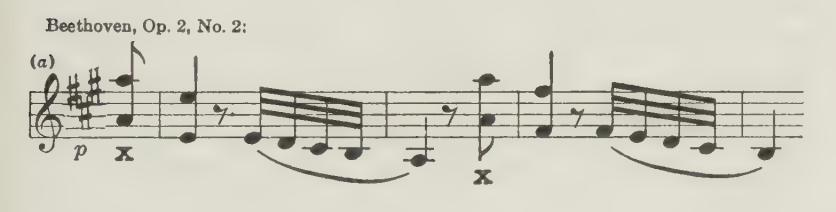

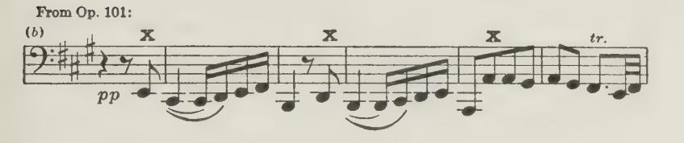

#### Weight-transfer or Passing-on Touch Again.

34. Arm weight, moreover, as we have seen in 4/{[10 and 13, can also be correctly applied for tone-production while continuously (but lightly) resting on the keyboard for certain light, soft effects. See Chapter XII on this subject. Also Note under {26 of this present Chapter.

## The Truth about Weight-touch. — "Free-fall of Arm" fallacy:

35. Do not imagine that it is by an actual fall of the weight that tone is produced, and that "the greater the weight the quicker the speed." That is a total misapprehension, and quite untrue physically. An ounce falls with precisely the same

speed as a ton — although the impact of a ton is a vastly different matter from the impact of an ounce!

Weight is needed solely as a Basis. True, the height from which a weight falls would influence the speed, for a weight gathers speed as it falls. But this fact cannot be taken advantage of in playing the Piano — since such "'free fall'' of the arm would preclude our attaining any musical certainty. The reason being, that if you ''drop" your arm uncontrolled upon the key, you cannot possibly feel and judge how much force is needed by that key for that particularly desired tone —and it always should be a desired tone. Nor can you thus provide the due degree of acceleration needed during Key-descent. Such uncontrolled drop of the arm would instead reduce everything to mere guesswork and good luck — or more probably, bad luck!

It is altogether alien to the expression of Music-sense. Therefore, never let your arm drop or fall upon the keys uncontrolled by its upholding muscles.

36. Deliberately to instruct the student to "drop the arm from a greater height the louder the required tone' is therefore sheer folly, and constitutes thoroughly bad, mischievous teaching.!

Nore. — Some two years ago an author published the following really comical statements as to my teaching of " Weight': — ''A further defect that arose lay in Rea supposed the Uncontrolled use of the weight; too much insistence on drop of the complete instead of gradual and balanced relaxation of the con-Arm trolling muscles was the cause of this, and the result too often a hard tone. . . . Matthay's maximum of tone was limited by the amount that could be obtained by weight and its speed from different heights."

This, among other fabrications as to my teachings, was also copied (possibly without investigation) in a more recent compilation. To attribute to me such folly as that the key should ever be struck or hit down by a Weight "dropped" from a greater or lesser height, is so incredibly stupid and comic that it hardly needs serious contradiction; yet there may be many who have never read '"'The Act of Touch'; or who may have glanced through it as cursorily and unintelligently as these authors seem to have done, and who therefore might accept such misstatements as truth! Other authors may or may not have taught such nonsense as this about Weight, but nothing I have ever written, said, or suggested could be thus misconstrued. Particularly when it is remembered that I have in-

1 See the extra Note on " Arm-fall," on the next page.

sisted all along (perhaps ad nauseam!) that one cannot possibly play musically if one hits the Key down, either by Weight, or in any other way.

My reiterations on all these points however still seem to have been too infrequent to overcome the resisting obtuseness of some minds, complacently smothered by the old obsession of Movement, when confronted with an analysis of the Invisible in Touch — the thing that really matters! See {35 on "The Truth about Weight."

Extra Nore. — As a matter of fact, a good-sized arm, really "dropped" from a height of say eighteen inches or so from above the keyboard, and taken by a resist-Arm-drop real, ing finger and hand, would probably smash the strings or the or seeming hammer or even the finger! If in doubt as to the truth of this, try it on your own Piano — but not on mine! The fact is, that again the eye is the deceiver. A freely descending arm certainly looks like a true "fall" or drop. A musical player, however, never adopts such mis-touch. Instead, he always controls the descent of the weight (by the wp-muscles of his arm) so as to reach the surface of the keys with insufficient speed to knock the keys down. That is, he is careful to reach the key with not enough impact to preclude his taking hold upon the key, and depressing it as he feels its need during descent.

In short, you must always give the necessary access of force when and after the key is met, and finger and hand can then provide the required proper acceleration by their guided co-operation — although all this may remain quite invisible.

#### Ample movement of Arm, when advantageous:

37. When playing forte by arm-movement, it is an advantage to allow your arm to descend and subside from some little distance. The ineriza (sluggishness) of its mass is thus in a measure overcome as a preliminary to the actual tone-producing act which, remember, must never begin until the surface of the keyboard is reached. Therefore, even in this case, you must reach the keys quite gently —so that you can still judge the resistance met with from them.

#### Weight does not produce tone directly:

38. Moreover, realize that Weight never really produces the tone. As already insisted upon, Weight can but form a Basis for the activities of the Finger and Hand. Arm-weight could only be said to "'produce"' the tone, if allowed to subside with the key unaided by any intervening exertion of finger and hand. This is manifestly impossible; therefore (as I pointed out in "The Act of Touch''), whenever you apply Weight never forget to use (exert) both hand and finger.

Note. - The only case when Weight may be said to "produce" tone is, when you play with your fist sideways, as shown in No. I of my "Nine Steps towards Finger Individualization," - the four-page pamphlet issued by The sole case the Oxford University Press. Here, certainly, your whole arm of Tone-production by and fist descend with the Keys and produce the required pp Weight-release! tone — if relaxed precisely to the needed extent. This alone exemplifies tone-excitation purely by Weight-descent - although a vestige of hand exertion, sideways, must participate even here! The moment, however, that you place your finger-tips upon the keys (as in "Step IV"), that moment your fingers and hand are compelled actively to respond (by reflex action) to what is felt as an impending descent of the Weight, and they then (in response) actively (exertionally) support that Weight upon the descending keys - arm, hand and fingers here descending as a whole. This visual effect has led to the stupid mistake made by some, that finger and hand are not exerted in "Weight-touch"!

Moreover, if the finger and hand exertions are slightly in excess of the Armweight released, then they will move instead of the Arm.

The Weight (or

Weight-touch does not imply non-exertion of Finger and Hand Arm) will therefore not be allowed to descend at all here—although its influence thus invisibly supplies the finger and hand with the required Basis for their action. Hence it is also clear, that although we call such process "Weight-touch," yet, truly speaking, "Weight-touch" really is touch by finger-and-hand

exertions, although these are prompted into action by the Weight-release.

#### The true function of Weight:

In short, as already reiterated so often, the function of Weight in playing is solely that of Basis, whether it moves or not; that is, its function always is but to form a stable foundation, sufficient to resist the reactions of finger-and-hand exertions, so that these can be effectively applied to the Key.

## Weight-initiated v. Muscularly-initiated Weight-touch.1

39. This is a psychological distinction rather than a physical one. It implies that the triple combination of Weight versus finger-and-hand exertion required for singing-tone can be prompted into co-operation in two ways. You can either (1) give your mind to the sensation of Weight-release of the arm; or (2) give your mind to the sensation of Work-to-bedone by the finger-and-hand.

The timing of this complete Triple-combination will thus

&lt;sup>1 Already indicated in Note to ¶26 of this Chapter.

ensue somewhat differently, and will slightly affect the quality of the resultant touch-action. If you think of the sensation of Weight-lapse, the needed finger-and-hand exertions arise in response to it by reflex action, and are therefore slightly laggard in their response; whereas, if you recall the sensation of work being done (by finger and hand) then the Weight-response will be infinitesimally delayed in its incidence. The first will lead to better key-acceleration than the last, and therefore the tone will be "rounder" and "sharper" respectively. The difference is like slightly changing the "timing" of the magneto of your motor-car engine. Some will aver that there can be but little difference in the actual sound-quality arising from this distinction in touch. Possibly there may not be much, but the difference in sensation is quite marked — and therefore matters, since it leads to material (though subtle) differences musically; and such subtle distinctions in musical effect are everything, when we have risen beyond the mere strumming stage, and are out really to express the spiritual in Music.

## The Dual Nature of the Muscular Equipment.

40. The researches and discoveries of the Australian physiologist, the late Dr. Joun Hunter (as already indicated in 73 of this Chapter), have important bearing on our work as Piano teachers. They indeed strikingly corroborate the teachings of "The Act of Touch" in many particulars; and the importance of his discovery of the dual nature of our muscular equipment cannot be overrated.

Norte. — These discoveries were first made known in a lecture delivered at London University in January, 1925, by Professor G. Elliot-Smith, and com-John Hunter's mented upon by Sir Oliver Lodge in his Résumé (in The Daily discoveries News) of the previous year's "Memorable" doings, as "one of the biggest in possibilities that has been done for along time." Dr. Elliot-Smith referred to the "culmination of the researches into muscular movement made by a brilliant young Australian, Dr. John Hunter," who had died recently in London upon the eve of describing his discoveries in a series of lectures. "Hunter showed" (said Dr. Elliot-Smith) "first that the muscular system is DUAL, one kind of muscle doing the actual work, and another maintaining pos tion when the work is done. To

illustrate: An oyster closes its shell with 'A' muscle, and keeps it closed with 'B' muscle. This diminishes fatigue and prevents jerkiness."

41. This discovery, that we possess two distinct sets of muscles for the same limb-action, one by which to do the serious work of a limb, and the other by which to do the light work, is most important, for we find this applies again and again in our Pianowork.

Note. — Do not confuse this duality of muscle for a particular purpose with that implied by muscles with antagonistic function.

#### Examples of this Duality:

42. As instances: (a) to raise your arm you are aware of the necessary muscular exertion, but to retain it raised seems no effort at all — because the ''small'' muscles alone then remain active. (b) To sound notes we have to use the "'strong"' flexor muscles of the fingers situated on the forearm, a fact we become conscious of by the sensation of tension through and at the lower side of the wrist-joint.! Whereas, we can and should hold the Keys down quite lightly, after the sounding, by using only the activity of the "small" (or weak) muscles inside the hand the '"lumbricales."" (c) Much of the failure to understand how Forearm rotational actions can help or mar playing, arises from the fact that we can so easily recognize that an exertion is necessary to turn the hand into its playing position, — for we then use the strong rotatory muscles. Whereas, to maintain the hand in its thus turned-over position, we find that the small or weak muscles fulfill this duty quite well; but we are apt to overlook this fact, and are then likely to be deceived into imagining that we are "doing nothing" muscularly! Whence arises the fault, that when we try to use a finger at the fifth-finger side of the hand after the thumb, we are likely wrongfully to continue this unperceived light action of the rotatory small muscles towards the thumb (even when we do not commit the worse error of continuing the "strong" muscles' action!) and we shall thus inevitably impede

1 See Chapter VIII on "The Holding of Notes," also page 23, { 3.

the exertion of those other fingers by destroying their rotative Basis. And s0, also, has arisen all that folly as to the supposed ''weakness"' of the 4th and Sth fingers! They are bound to be amply strong if only we do not impede their action by continuing this faulty but invisible rotatory exertion towards the thumb — when it should be discontinued.!

43 These discoveries in fact clarify and simplify the explanation — and the doing — of much that seemed somewhat difficult before. For instance, we used to think that in making a strong effort with the fingers and then continuing it lightly (as one should for tenuto or legato) that this implied reducing the same exertion to the precise minimum needed; whereas, we now realize, that at first we must exert both sets of the finger flexing-muscles concerned, but must then simply cease all activity, completely and promptly, of the powerful muscles, while carrying-on solely with the "'weak'' ones — a complete cutting-out process quite easy in comparison to the first.

#### Further Examples and Experiments on Strong v. Weak muscularaction:

- 44. Experiment and satisfy yourself on these points thus: —
- I. Realize that the difference between holding your arm nicely "'poised," and holding it clumsily and stiffly, depends precisely on this distinction. Evidently the arm should be sustained solely by its weak "up''-muscles — ample for the purpose, and noi by the strong exertion you must employ, say, when pulling a tree up by its roots! As another instance: you cannot continue the comparatively strong exertion needed to lift your arm, when you afterwards try to keep it stationary half-way up, unless you then also employ an antagonistic exertion thus to keep it immovable — against this wrongly-continued exertion of the raising-muscles. What you must learn to do, is gently to raise the arm by its "strong"

1 All this is fully explained in Chapter VI under "'Forearm Rotation."

and weak muscles, and then sustain it in that position solely by its "weak"? muscles left active, and while cutting out the strong muscles. Try both methods; it is instructive.

II. Again, you will vitiate that light "tap" of the forearm, sometimes required, if you use the same down-forearm exertion required of it, which you need when you help yourself upstairs by the bannisters! Or when you need it (moderately) for tone beyond f or ff as in that form of '"'arm-use'' described earlier, under No. III. Try both methods!

III. Sound the notes of a finger-passage forcibly and correctly as needed in forte, but then wrongly continue the action of these powerful muscles (as well as the weak ones) after sounding the notes, and thus unmistakably 7am your hand down upon the keybeds, while ruining the passage — just as all bad players do. Then play it again, properly, sounding the notes strongly, yet afterwards holding them down quite lightly — solely therefore by the '"'small'? muscles of the fingers, and with the hand itself almost if not quite inactive —or only active with zts own small muscles, and thus realize the absurdity of doing the thing wrongly.

IV. Or play an octave passage (or any double-notes passage) with the hand jammed down upon the keybeds, and then repeat it with the notes held down quite lightly — again solely by the ''weak'' muscles of hand and finger.

V. Or turn the hand over into its playing position, and hold it there firmly (and wrongly!) by a powerful rotatory exertion; and then again Jeave it there, apparently effortlessly — by the residual exertion only of its ""weak'"' muscles.

Try both ways, and realize what is really implied by rotatory "adjustment."

Here, in fact, you have a root-difference between playing easily and playing with the greatest possible difficulty — as you would do, if you obeyed the old teachers! Experiment on the above lines, and convince yourself of the truth of these facts, and how you can encompass Ease.

#### Instinctive obedience to the Laws of Touch:

45. A technical genius (or so-called " Finger-talent"') of course instinctively obeys all these laws (without knowing what they are) and he usually does not forget the right sensations by which to recall these right actions — unless, unhappily, his naturallygained facility is destroyed by the old iniquitous misteaching to "press down firmly upon the keybeds," or to "strike the keys well"' with the "'Jittle hammerette action" or other such soul and musically-destructive ideas.!

## Coda. The Merging of Touch-forms:

46. Here it is well at once to realize that all touch-forms can in application merge or dissolve one into the other. All forms of Movement as well as all forms of Touch Construction can thus be modified and approximated in practice.

#### A) Movement-merging:

47. Thus, any desirable combination may be used in place of well-defined movements solely of the finger, hand or arm (vertically or rotationally). That is, the movement may be a combination of finger and hand movements, or with vertical or rotational arm movements.

1 Recently, it has even been tried to revive some of these pernicious teachings, A proposed and it has been claimed that there can be a " Reconciliation " impossible between our present-day knowledge of the facts, and these now "Recon- happily exploded ideas of Key-hitting and keybed burying of the psliacon tone-impulses. In fact, it is misdirected that one should press "'deep" into the keybeds, "deep down," "past them" and "down to the floor!"

Obviously, there can be no possible "Reconciliation" between ideas thus diametrically contradictory — between Knowledge of the fundamental facts of Pianoplaying and Un-knowledge of them! You must subscribe either to one or the other, and if you are possessed with the old pernicious out-of-date ideas and cannot wipe them out of your mind, then Natural Selection will very probably eliminate you musically, and thus put an end to your Piano-misdoings! See Additional Note, No. XIV, "An Impossible Reconciliation."

#### B) Touch-construction merging:

48. In the same way, the various kinds of Touch-construction may also coalesce. For instance: during key-descent, to the always necessary finger-and-hand exertions and forearm rotational-changes, you need not solely add forearm weight, or solely whole-arm weight, or solely forearm down-force along with upper-arm weight.

Instead, you may supply any desired in-between muscularinflection or combination; and may omit drawing a sharp line of distinction between them when desirable — they may merge one into the other at will. But the distinctions exist

none the less.

#### Weight-transfer and Arm-vibration also may merge:

49. In the same way, there need be no well-defined distinction between Weight-transfer touch and Arm-vibration touch in certain passages — again the two forms may coalesce in a measure. Continuous Weight-transfer may thus imperceptibly pass over into individualized Arm-vibration touch, and vice versa. It is like a walk gradually becoming a trot, and finally a run — but with the distinction that at the Piano we can modify the weight, so as to render the running easier!

#### Mentally, ali the Touch-distinctions must remain clear:

50. Unless, however, you clearly understand all the various touch-elements and types discussed, and have them at your disposal in their unadulterated forms, you cannot choose the most appropriate for the passage in hand. For instance, you cannot fully realize the musical effect of a swift but melodic passage, if you allow a certain degree of weight-transfer musically to mar and muddy the needed pure, individualized Arm-vibration touch demanded in such passages — whether played resiliently or in true legato. ;

Carefully, therefore, master all these distinctions of Construc-

tion and Movement, and learn to apply them separately when needed, but also do not fear to combine them where that is desirable.

#### Technique itself must become subconscious:

51. In the meantime, realize that when all these things have been learnt, they must be forgotten! That is, having purposefully learnt to obey all these physical and physiological laws involved in Technique, they must be relegated to the SuBcon-SCIOUSNESS before they can truly help you in purposeful Musicalperformance.

Just as with any other language, all must be learnt; but a language cannot serve as a vehicle for expression until use of it - has become second-nature — until it has become promptable by the Subconsciousness.!

# Chapter VI

## THE FOREARM-ROTATION ELEMENT

#### Preamble.

- 1. We must now undertake the further elucidation of this element — perhaps the most important of all pianistically, physiologically, and pedagogically. Hence this special chapter is
- 1 In a recent compilation the claim is made of a world-reeling Discovery, viz., the teaching of Technique by means of "Conscrous-Mental-Muscular-Control."' It is, however, conveniently overlooked that all this was taught in full detail nearly thirty years'ago in The Act of Touch. True, I did not adopt it as a "slogan," etc. Unfortunately, it is also overlooked that I carefully warned the student, even then, that while all technical Correct Doing can and should thus be taught, yet he must not be satisfied until all this has been made into Habit, so that it is available for free artistic speech in his purposeful efforts to Make Music.

devoted to it; and if the keen-minded reader finds overmuch reiteration and repetition, he must kindly bear with me for the sake of his less keen-witted fellows.

2. Success or failure technically (and therefore musically) depends on a clear understanding and due mastery of these Forearm Rotatory-adjustments. Just here, however, we find perhaps more vagueness and misunderstanding than anywhere else. In spite of all that I have written and lectured on this very point, I am still persistently and stupidly misrepresented as dealing solely with rotatory MOVEMENTS — movements which had already been recognized and approved "'for occasional use" in tremolos, etc., half a century ago! Whereas, throughout, I am referring to rotatory actions or stresses, inactions and reactions, mostly unaccompanied by any movements whatsoever.

#### Not Movements, but hidden actions.

- 3. Let us be quite clear then, to begin with, that my discoveries on this point do mo? refer merely to the actual rotatory movements before-mentioned, but, on the contrary, deal particularly with those invisible changes of state rotationally (momentary reversals or repetitions of stress and relaxation rotationally) which, although unseen, are needed for every note we play, whether we know of them or not, and ever have been needed, and ever will be — so long as keyboards are used. The fact is, that no player ever has been successful, nor could be, without the closest conscious or unconscious obedience to these very laws of Forearmrotation, which although mostly unseen in their incidence, are nevertheless aurally and physically only too patent and inexorable.
- 4. As these all-important alternations and repetitions of rotational stress are comparatively rarely disclosed to the eye (being usually unaccompanied by any rotational movement whatsoever) and, being thus hidden, they have totally escaped attention or recognition, alike by players and teachers during all these past centuries of keyboard use.

Note. — The trouble all along has been, that since these exertions were not disclosed by movements, they completely escaped notice; and teachers of the past, unaware of these facts, were therefore unable to help their pupils easily to achieve technical mastery.

Correct Doing was therefore only achieved in rare cases by the musically and physically supersensitive, who were able to sense the physical needs through their own musical insistence, and through repeated experimental failure to ultimate success. But what a pitiable waste of time!

#### Successful players have always obeyed rotation:

5. Obviously, all players in the past, who successfully happened to master their instrument, must also have perfectly fulfilled these inexorable hidden changes in the Forearm stresses rotationally, although unaware they were obeying any natural laws. Yet such Master-artists (as always) were but few and far 'between; all the rest lumbered along with supposed irremediably "stiff" limbs, and supposed "'weak"' fourth and fifth fingers.

#### The ignorant use rotatory-exertions all the time:

6. Clearly realize that the fault of the unsuccessful player is not that he "'does not use Rotation" (as often imagined!) but that, on the contrary, he does use Rotation most of the time too much, and does so violently and stiffly, and in fact has not learnt to omit rotatory-exertion when he should, and does not apply it freely when its application 7s needed. Indeed it cannot be reiterated too often, that without freedom rotationally — as everywhere else — there never has been any Easy Technique, nor can there be in the nature of things.

#### Forearm Rotation in daily avocations:

7. Moreover, Forearm rotatory-actions are not a special process, solely applicable for piano playing. Quite the contrary, for Forearm rotatory-exertions and relaxations are used everywhere in our daily lives. A few instances: You have to apply them when you bring your fork down to your plate, prongs downwards, and again when you bring your food to your mouth — unless you impolitely use your fork as a spoon! In writing, it is

the *invisible* rotatory exertion of your Forearm which turns your hand over, and which presses your pen upon the paper. You turn your door-handle, your key in its lock — you apply the rotational force *invisibly* until the door-handle or the key gives way, and discloses the true nature of the exertion in movement. Obviously, you wind your watch by *visibly* disclosed rotatory exertions. The screwdriver and the bradawl need Forearm rotatory-actions, both *visible* and *invisible*.

·You use it (mostly invisibly) when you play Tennis, Golf or Cricket; and you cannot hold your Billiard-cue without its constant help.

As a final example, you cannot properly press your bow on your Violin or 'Cello strings, without such *invisible* rotatory-exertion of the Forearm, freely given! Hence so much bad bowing, since this fact has been overlooked by teachers, through ignorance of such *invisible* rotatory actions.

Note. — I have heard of Violinists and 'Cellists who despaired of attaining a free action of the bow-arm, but who, after only six weeks' accidental practice at the Piano of my "First Solo Book" and "Pianesertions and the Bow-arm ist's First Music-making," found, to their astonishment, that they had cured a life-long fault — rotational stiffness of the bow-arm, and had acquired a free, full tone!

8. There is, then, hardly any action in everyday life that does not largely depend upon visible or invisible Forearm rotatory-help; and when we come to so delicate an operation as Pianoplaying, the least disobedience to its laws inevitably mars all our playing.

#### The Nature of the Action:

- 9. Yet, strictly speaking, there is no such thing as true Forearm rotation. Not "Rotation" in the sense that the Forearm itself rotates as a whole, with the Elbow as a pivot as it seems to the eye.
- 1 No doubt screws were given right-hand threads, because rotatory-actions and movements were found easier outwards (towards the little-finger side) than inwards (towards the thumb), and very possibly this fact influenced clock-makers to choose a "clockwise" movement for the hands on their dials!

The fact is, that you can only "rotate" the Forearm at its wrist-end, and the wrist-joint and hand turn along with it; and you can only rotate about half a turn. It is really a twisting process of the Forearm-bones.

10. The Forearm consists of two bones, normally lying side by side. These are pivoted both at the Elbow and at the Wristjoints; you can feel their position by touching the elbow, and the hand at the wrist.

Now, when you turn (or "'rotate'') your hand into its playing position, palm downwards, you twist the outer of these ; two bones, the ''radius,'' upon the inner Wrist... bone, the ''ulna,'' just as you can twist one finger over another. In this way you obtain that partial rotation of the wrist aa \ by which the hand is swung over into its playing position.!

11. Obviously, everyone (whether he --Elbow.. understands Rotation or not) is com- Diagrammatic Represenpelled (and always has been compelled) tation of the Two Forearm to make this rotatory movement to bring Bonesof the Left Arm, before ' 2 ae rotation and after. his hand into the playing position, palm

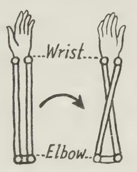

downwards. He is also compelled to continue a slight, although now invisible, exertion (rotationally) to retain his hand thus in level position; although the hand itself may in the meantime be lying quite loose and inactive on the keyboard. Moreover, to sound the thumb-note at all strongly, he is compelled momentarily to increase the rotary-exertion of the Forearm inwards, so that the thumb may be amply helped to move its key down efficiently.

#### Again a double muscular action:

12. Evidently we also possess "strong" and " weak"' muscles rotationally, just as in the case of the finger. The hand is evidently turned over into its playing-position (or "supination'')

1 The ulna, itself, can also rotate, with a stationary radius as pivot. Thus any finger-tip can become the axis of rotation. See p. 56.

by the exertion of both the '"'strong" and "weak" muscles concerned in Forearm-rotation; whereas the '"'weak'' muscles evidently suffice to retain it thus turned over, and the "strong" muscles may therefore promptly and completely stop work. Note. — Obviously, it is this prompt and complete cessation of the strong,

"inward-twisting" muscles that has led to the delusion that mo muscular exertion is needed to retain the hand in its level playing position.

To help the thumb to sound its note (as already noted) a momentary action of the "strong" muscles is needed. The application of these "strong" muscles is therefore always intermittent and momentary; whereas the action of the "weak" muscles may be continuous fora time. Realize also, that even in forte, it is actually but a comparatively gentle exertion of the Forearm rotationally, that is needed. This is not noticeable unless attention is drawn to it. In fact, as already said, none of the exertions used in playing should ever be really violent. If they are, you may be sure you are playing stiffly, and badly!

#### Timing the cessation of Rotation:

13. Now, the trouble is, if this exertion inwards (momentarily required to help the thumb) is instead CONTINUED at full strength, then the Basis for the action of the other fingers is taken away from them; and they will then seem weak and incapable. Hence the invention of those thousands of futile exercises designed to overcome this supposed "weakness" of these fingers. Whereas we now know, that these supposed "weak" fingers are rendered quite "strong," the very moment this unneeded and paralyzing (but unseen) exertion rotatorily towards the thumb is ceased.

Norte. — Such exertion towards the thumb may, however, be so very slight that we are likely to overlook it. Any exertion, nevertheless, in the wrong direction, will here inevitably impair the efficacy of the finger next used. Be sure therefore that you avoid any such residue of rotatory exertion in the wrong direction, even from the "weak" rotation muscles! It is owing to non-comprehension of this point that has arisen the superstition as to the supposed " weakness"' of the fourth and fifth fingers at the Piano. Hence, also, so much sticky, clumsy and uncertain Technique, generally. Remember, these fingers are indeed rendeted helpless so long as you continue a strong rotational exertion towards the thumb after it is played, and thus deprive those other fingers of the necessary basis for their action against their keys; whereas these fingers are instuatly transformed into "strong" ones, provided that when you wish to use them you are careful to eliminate (inhibit, or cease) any residue of unneeded rotatory exertion towards the thumb — even of the "weak"? rotation-muscles!

As a matter of fact, these supposed "weak" fingers themselves are naturally really stronger at the Piano than the thumb itself — with its sideway action, provided you do not spoil their effectiveness by leaving your forearm rotationally stiff, or even antagonistic to their well-being, pianistically.

#### Rotatory relaxation often suffices:

- 14. With the hand lying loosely on the keyboard the hand will quite naturally roll upward onto its side (with the little finger as a pivot) when you cease the slight rotatory exertion towards the thumb. Now, if at that very moment, however, you sufficiently exert the little finger, it will act as a strut, and will thus prevent the hand from rolling upward. You cannot see any rotatory movement, but you can feel the stress in the direction of the little finger, and how this is thereby helped.
- 15. For soft notes, cessation of all the rotatory exertion towards the thumb hence suffices to give the little finger the necessary basis for its work in sounding that soft note. But when more tone is required, then you must, BESIDES ceasing the exertion towards the thumb, also add a rotatory exertion towards the little-finger side, to enable you sufficiently to exert that finger.

Note. — To recapitulate: Be sure to realize through experiment at the keyboard, that if you cease the exertion Inwards (towards the thumb) this will leave the fore-

The relationship of Rotatory-help to Rotatory Movement arm and hand free to roll over Outwards (towards the little finger), and that this tumbling-over tendency of the forearm, thus caused by relaxation, can provide for more tone from your little finger than you would at first credit, with so little Basis for it. For greater tone, however, you must, in addition, exert the fore-

arm outwards, although this rotative exertion is not necessarily displayed as movement, neither in this case nor the former one. As everywhere else in Technique, movement or its absence is no criterion whatever that you are doing rightly or wrongly. For instance, if you cease the rotatory exertion towards the thumb (as just discussed), the hand would naturally fall over to its side, but such rotatory movement will be prevented if you accurately time a sufficient exertion of the little finger (or other finger) at that moment, and you then have only a finger-movement with the key, while the rotational relaxation is not in the least disclosed to the eye.

That is, the rotatory change towards the little finger will not be seen, if you hide it by a sufficient exertion (and movement) of the little-finger, or fourth finger or any other finger at that moment. On the other hand, the exertion of the finger itself will be hidden, if you outbalance it during key-descent by a

greater exertion (and movement rotationally) of the Forearm — and you then have rotative movement (or "'Rotation-touch'') in place of finger movement (or "finger-touch'') with the key. In slower passages (as beforesaid) actual rocking or rotatory movements may optionally be employed, but in really quick passages there is no time for such. In short: Finger-movements are usually preferable in quick passages, but of course with the proper individual Forearmstresses invisibly applied, along with the exertion of each individual finger.

#### Direction of Rotatory-help:

- 16. Realize next, that the direction of rotatory help is always from the finger last used, and towards the finger being used and you must always supply such rotatory help with perfect freedom.
- 17. Thus, when a passage moves melodically alternately upwards and downwards, the rotational stresses are alternately Inwards and Outwards. Try the following: —

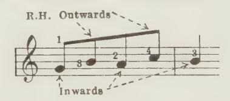

18. Per contra, when the melodic movement proceeds in the same direction, as in a straight-on five-finger exercise, then you must repeat your rotative stresses in the direction of the passage, instead of alternating them.

Now it is easy to realize that in repeating the same note you must repeat the same stress rotationally; yet it is not so easy when you have to repeat the same rotational stresses, but with different fingers. Thus: —

In the straight-on five-finger succession of notes, evidently you must help your thumb by a rotatory exertion Inwards — towards it — during-the moment of moving the key. But when you use your index-finger after it, you must reverse all this — the Inward rotatory exertion must cease,

1 See Chapter XIV, "On Nomenclature."

and a relaxation Outwards (or even an exertion Outwards) must replace the Inward-stress while you depress the key with that index-finger. For the next note (played by the middle-finger) the index-finger serves as a pivot (from either the surface or depressed level of the keyboard), and rotational help for it is again outwards; therefore you must repeat what you did for the last note. The ring-finger needs another similar repetition of the outward rotational-impulse (with pivot on third finger), and the fifth finger likewise (from fourth finger). Thus, after the thumb (with its Inward rotation) you have four Outward impulses (or stresses) rotationally; and when returning (after the little finger with its Outward impulse) you must then provide four inward impulses rotationally to help these fingers. Refer to the Examples given on p. 22 of EpIToMe.

- 19. Taken slowly, you can show these stresses by actual rotatory movements each time, as directed. The hand, in this case, turns back (each time) before each rotatory-movement, and then turns again in the direction of (and along with) the next finger you play.
- 20. In a quick passage, however, such rotatory-movements cannot be attempted — there is not time for them.

Instead, the rotational-stresses are here completely disguised, hidden and replaced by finger movements. Nevertheless, you must supply the necessary help individually for each note by invisible forearm rotative exertions or relaxations, precisely as you do when you allow actual rotative movements to accompany each note.

21. The law hence becomes clear, that the direction of rotation (whether accompanied by actual rotatory-movement or not) is always in the Direction of the new finger and away from the last finger, which each time becomes the pivot for the new action. ^matthay-invisible-rotation

Nore. — Thus, when you play the Middle-finger after the Thumb, rotational help is given to it outwards, whereas when you play it after the Little-finger, rotational help is inwards — towards the Thumb.

## Rotatory direction with thumb under a finger:

22. The rule applies with equal force when you turn a finger over the thumb, unexpected although it may seem. Therefore, to help a finger turned over the thumb, you must still give the invisible or visible rotatory help outwards (towards the littlefinger side), in spite of the fact that the note sounded by the finger is on the wrong side of the thumb.

Thus, in a shake played with a finger turned over the thumb, you should give alternate rotations Inwards and Outwards whether visible or not. Thus: —

Try it with rotation supplied first in the correct direction and then in the wrong direction. It is quite convincing!

#### Bad Scales:

23. Much scale-playing, etc., is uneven and sticky, because this rule has not been grasped.

This rule, however, is precisely reversed when you turn a long finger over a short one, as in double-notes scales, etc. Hence, when the middle-finger is turned over the fifth, you must here help the middle-finger by a rotational-stress towards the thumbside!

24. In the EprromE I have noted the first steps towards acquiring this required co-ordination between Forearm and Finger, and it is useless to reprint them here.

Nore. — These First Steps (for Young and Old) are more fully dealt with in my "Nine Steps towards Finger-individualization" (Oxford University Press) ; "Child's First Steps" (Joseph Williams); '" Pianist's First Music Making" (Oxford University Press) and "First Solo Book," etc. (Oxford University Press).

Some additional warnings may, however, here be useful:

#### The purpose of Rotation:

25. In the meantime, do not forget to bear in mind the ultimate purpose of these rotational stresses and relaxations. Whether allowed to become visible as actual rocking movements or not, the purpose is to help the fingers in their work by correct rotational stresses, and not to impede them by wrong ones. Therefore, do not forget to exert the fingers themselves. If you forget that, all is lost!

#### Rotation-stresses must be given freely:

26. Remember, the rotatory possibilities of the forearm must always be applied at their free-est. That is, always without the exertion of both "pronation" and "supination" muscles at the same moment — in plain English, without exerting the forearm rotationally both outwards and inwards at the same moment which would create a technique-destroying muscular conflict. You must contrive to send your nerve-message solely to one set of muscles, and must not allow some of it to leak or stray over to the opposite or "antagonistic" side. ^pronation-supination-conflict

Notre. —In short, when you use your arm rotationally, be sure to exert it only in the required direction, and strictly inhibit the opposite exertion of it.

#### Passages by similar motion made "difficult" by rotatory conflict:

27. Such antagonistic action is, however, very likely to arise in passages where the two hands move by similar motion melodically. Here the rotatory impulses are needed for the most part in contrary direction in the two hands. Hence such passages are often found not so easy to play as to write! The direction of rotation is confused by the two hands moving alike melodically — and our ear actually may mislead us here. Hence "stiffening" ensues. This difficulty vanishes forthwith when this rotatory contrariness is duly recognized.

28. Moreover, this tendency thus to make "'difficulties"' may Also applies, | also supervene when the two hands are not played when hands : ° < played in suc- Simultaneously, but when a melodically-alike pascession sage is repeated in close succession by the two hands, as in a canon.

Note. — Play through the first sixteen bars of Bach's C-sharp major Prelude, from the first Book of the Forty-eight; and you will feel that there is a great temptation to play the theme in its left-hand version with the same rotatory impulses as before used for the right hand, thus leading to its impairment and your confusion!

#### Passages by contrary motion first:

- 29. Because of these reasons, co-ordination between forearm rotation and fingers should first be studied im passages needing a reversal, rotationally, each time from note to note; and when the hands are first played together, passages should be chosen, so far as possible, which need the rotational help in similar direction in both hands, and which, therefore, move melodically by contrary motion.
- 30. In the early stages both in the case of a real beginner, and, in the far worse case, of one who has been playing upsidedown technically for years, this practice of passages by contrary motion melodically, and with constant reversals from note to note, rotationally, should be insisted upon for a while — since in this way the rotatory adjustments are more likely to be provided correctly, almost instinctively. Studies and pieces which exemplify such conditions should therefore be chosen. Music for the student, at this early stage, should also be written in accordance with these principles.

Notre. — I have myself tried to set a good example for composers in this respect, but it is not easy to evolve interesting matter under such onerous restrictions. The reader may, however, be referred to my " Playthings for Little Players," Book I, and my " First Solo Book"' (Oxford University Press). Several numbers in these works conform quite strictly to these rather severe restrictions. The Preface to these sets of little pieces fully explains these desirable restrictions. Also, in "The Pianist's First Music Making" (Oxford University Press), the dry first

steps are made interesting by the addition of a Duet accompaniment, for the teacher. These I consider to be quite a manifestation of genius on the part of my collaborator here — FELtx SwINSTEAD.

#### Stiffness possible, while apparently passive:

31. It is even possible to make this mistake of antagonistic and self-defeating rotational actions, while your hand, itself, lies quite loosely and inactive upon the keyboard. Try it! Let your hand lie loosely on the keyboard-surface, and see whether your forearm is really quite free rotationally, and is not perhaps slightly stiffened-up.! This rotatively "free" condition of the forearm is always a pleasant sensation — or absence of sensation — toa Pianist, since it gives him confidence that he is going to play easily — and is not going to play with irksome, troublesome technical restraint.

#### Upper-arm re Forearm Rotation:

- 32. Another and perhaps important warning is, never to substitute upper-arm rotation-stresses where those of the Forearm are called for.
- 33. Understand the distinction: It is possible to bring your hand into playing position by raising the upper arm and elbow sideways and outwards with the hand upon the keyboard. Thus the sockets of the two forearm bones at the elbow are themselves turned outwards, and brought almost perpendicularly one over the other.

True, you could try to help the thumb to sound its note in this — ridiculous — way; but to substitute such clumsy action in place of the natural and easy one of Forearm-rotation is obvious folly!

Nore. — It is necessary, however, to allude to this possibility, since a comparatively recent author has seriously suggested this Upper-arm rotatory process (with its digging action) im place of Forearm-rotation — which he pronounces to

1 Free from all antagonistic exertion, but not without that slight exertion of the ''small"' muscles, required to keep the hand in its level position!

be "impossible in quick passages"!— and since copied elsewhere. This, of course, only proves that the author has had no inkling of the real meaning of my Forearm-rotation teaching; and imagines it to refer solely to rotational Movements, as so wildly misunderstood also by some not unrecent German writers! See Additional Note III, 'On Forearm-rotation Misunderstandings," etc.

#### Upper-arm v. Forearm-rotation Test:

- 34. If you are not quite sure of this distinction between Upper- and Fore-arm rotation, refer to the following convincing "Test-exercises":
  - 1. Fold your arm in front of your chest. Poise it nicely and freely. Now rotate the forearm, while thus in front of you, as easily and freely as you should do when executing a tolerably quick tremolo. With the arm thus bent at right angles, you are bound to use solely forearm rotation, and Upper-arm rotation is altogether "cut out" for the time being.
  - 2. Next, stretch your whole arm straight out in front of you, and again, with the Forearm only, execute your free and easy tremolo movements.
  - 3. And now, instead of this comfortable Forearm-rotatory tremolo, try to substitute a twisting of the whole arm from the shoulder-socket — Upper-arm rotation. Although you may partially succeed in doing this (but accompanied by very ugly and clumsy circular movements of the Elbow itself), you will still find that the Forearm rotatory-vibration is incomparably more easy and natural.
  - 4. Now apply the rotatory tremolo of ihe Forearm to the keyboard itself, via any two fingers.

Finally, again try to execute it instead by means of Upperarm rotation, and the folly of this mistake is amusingly evident — for it would need a circling elbow, and would be sure to be stiff at that! Carefully eliminate any such false and ugly technique from your technical scheme.!

1 See "Additional Note," No. III, "On Rotation-misunderstandings," where these experiments are amplified.

#### Octaves, etc., need Rotation invisibly provided:

35. FOR OCTAVES, and passages in double-notes (double-thirds, sixths, etc.), the law is, that the rotatory conditions must be remade each time, individually, for each double-note effect; but in the meantime do not forget the required exertions of the two fingers concerned! Double-third passages, rotationally, are often a cross between octave and single note playing. In some places the rotational effect has merely to be repeated, whereas in others a single finger acts as a pivot, and the rule as to single notes, rotationally, then supervenes. Difficulty in octave passage playing is most frequently traceable to disobedience of this law. Remake the required set of conditions each time for each octave, and the difficulty forthwith vanishes. Give sufficient rotatoryexertion each time towards the thumb to enable this adequately to sound its note; and also, be sure to provide for each successive octave, individually, the exertion each time of the thumb and little finger during key-descent.

Note. — The hand cannot be "formed" for the octave passage, as the old teachers so fondly imagined — and hence wrought so much mischief technically. The folly of To attempt any setting or "'fixation"' of the fingers, would only '"'hand-form- result in stiff fingers and hands, unable to do their work, and a ing'' for stiff forearm unable to fulfill its duties. In the old days, mcreyes only geniuses could play so-called "lightning octaves" — because their healthy instinct compelled them to disobey their teachers! Nowadays, however, every student can and should be directly taught this "great secret" — of gliding along the surface of the keyboard, and for each octave remaking a momentary rotational exertion to help the momentary finger-and-hand exertions.

#### '""Finger-work'' defined:

36. We realize, then, that not only is there no "Fingertechnique" without Hand- and Arm-help in some form or other, but also, that the Forearm rotatory help must always be provided for every note played, whatever the form of touch used.

Norte. — So-called '"Finger-work" is never finger-exertion only, but always implies finger-exertions either invisibly or visibly backed up by Forearm rotativestresses and hand-exertions, plus the other arm elements, when and where required.

Or, we might go even further, and define "Finger" passagework as consisting of: —

"Individually applied FOREARM-rotation impulses TRANSMITTED to the keyboard by the OBEDIENT exertion of the finger and hand for each note,''— that is: Forearm-rotational and Hand-and-Finger impulses accurately timed for each key-descent, and optionally helped by the other arm elements when required.

#### Rotatory Movements:

- 37. As to rotatory movements themselves (as indicated earlier) these are optional. During slow passages they are not only harmless, but may even be particularly helpful. Whereas, in quick passages they may become a hindrance, and even impossible, and finger-movements must here be substituted — but do not in the meantime lose the benefit of the INVISIBLE rotational help given individually for each note.
- 38. Whether, in the end, you choose to exhibit rotative Movements in a passage, or instead choose finger or hand Movements, depends upon which of these three components you place in the ascendant at the moment.

Note. — For further information on Rotation, read the Additional Note, No. III, and also refer to " Forearm-Rotation" and "Child's First Steps" (Joseph Williams). Also "First Solo Book" (with its Preface); ''Playthings for Little Players'? (two books), and ' Pianist's First Music Making" (three books) and ""Nine Steps towards Finger-Individualization" (Oxford University Press),

#### Rotational Analysis of passages:

39. Finally, since correct Rotation is so all-important, whenever a passage '"'goes doubtfully" play it through once or twice so slowly that you can analyse and re-analyse. the DIRECTION of the succession of its rotatory-impulses. Do this so slowly that you can actually rock the hand from side to side for each note — a rolling or rocking' movement towards each note, after first rocking backwards. Thus you impress upon your mind

the direction of the rotational help which eventually you have to provide invisibly and wirHouT actual rotatory movement, and yet correct in the incidence of its rotational stresses for every note.

Nore. — As there has been a good deal of misunderstanding (and worse) as to the true nature of the Forearm-rotation Element (and apparently still is in some benighted quarters), I again refer the interested reader to the Additional Note, No. III, which fully deals with all the points raised.

# Chapter VIL

## ON THE MOVEMENTS OF TOUCH — during and before Key-descent

1. Ample preliminary movements to the key are not to be discouraged, provided the Tempo of the passage admits of such. Often they are quite helpful when used in the right way.

## Right and Wrong ways of reaching the Key:

The right way is to reach the keys always quite gently with your finger-tips. The resistance of the key can then be gauged on the way down; whereas, the wrong way is to "lift" the fingers, etc., 'so that the key may be hit down" —a now exploded theory of the past.

2. Remember, it is only after your finger-tip has reached the surface of the key that the true tone-producing action must "follow-on." There need not necessarily be any break between the two distinct activities of reaching the key and bringing the same into motion. The finger-movement éo the key should always be quite light; whereas, the tone-producing stress during the 'follow-on'? may be quite forcible at times.

- 3. Thus, for instance, when you turn your hand over into its playing position, your thumb reaches the key-surface quite gently; but to sound its note, the forearm rotatory exertion as well as the thumb exertion must both be materially increased during the moment of Key-descent.'
- 4. The Movement during key-descent may, in this case, be either a movement of the thumb, or of the forearm rotationally. Movement of the Thumb results when its exertion outbalances that of the Forearm; whereas an actual rotatory movement of the Forearm results when that element is in the ascendant.

#### Finger-lifting and striking:

To teach finger-lifting so as to be able to "strike" better, was one of the worst fallacies and superstitions of the teachers of the Past; and this, because it precludes any judging of the key's resistance, and therefore also precludes musical playing — if really carried out.

#### Reiterated notes:

- 5. For quickly reiterated notes do not leave the surface of the key at all; and for very soft effects do not even allow the keys to rise fully to surface-level.
- 6. If you have already formed the habit of ridiculously pulling up your fingers, it is best for a time never to raise the tips beyond key-level, until you have made a saner habit —that of taking hold upon the key so that you can use it to make Music.

Nore. — The really musical pupil of course never 7id obey such injunctions, and his ear and his instincts instead forced him to play correctly, in spite of his "teaching"'!

- 7. For a slow succession of notes, the whole arm (or the forearm only) may be moved; for quicker passages, the hand; and for the quickest, finger-movement only is available.
- 1 Neither the "strong" muscles of the Forearm, rotationally, need participate until the key is reached, nor those of the finger.

8. Further details of Movement are given in the Epitome, Section VII, page 27, to which refer. Also see Note to 912 of next chapter.

#### Test movements not necessarily essential:

9. Certain vertical movements of the wrist-joint, with hand on the keyboard and elbow quiescent, are recommended in my "Relaxation Studies" in learning to "aim" the tone-producing impulse required in "Weight-touch."1 I find, however, that these festing movements have been misunderstood by some (or purposely misinterpreted) to signify that I insist on such movements as a necessary part of the technical process! Must I repeat for the mth time that such up-and-down movements of the wrist have been suggested only as éest-movements during the learning stage, and that I have Nor recommended them during actual performance except as an occasional reference-test for freedom?

The exercises in question certainly form an admirable way of acquiring that necessary co-ordination (and timing during keydescent) between finger-and-hand exertion and lapse of armweight, needed to ensure success technically — but they are not a necessary part of Technique.

Nore. — The full weight of the arm (full lapse of the arm) can indeed be quite well applied during tone-production without showing the slightest hint of any movement of the arm or wrist whatever! The arm can be either fully or partially relaxed irrespective of any actual movement of it — provided the finger-and-hand exertions are ample and are properly timed — or '"'aimed"' to the tone.

The same question arises with regard to the constant reversals and repetitions of the Forearm-rotational conditions réquired from note to note. They may be allowed to become evident as actual movements, or they may be totally hidden from view, while a movement of the finger only may be substituted. In fact, most of the processes of tone-production need not be disclosed as movements, and vice versa, visible, actual movements form no sure indication of the actual processes employed or needed in Touch.

1 See Section II, page 9, Relaxation Studies (Bosworth).

# Chapter VILL

## THE PROCESS OF HOLDING NOTES DOWN

— the Right way and the Wrong way.

- 1. As important as the proper sounding of notes is also the proper mode of holding them down once they are sounded.
- 2. All accuracy, musically, and ease in keyboard progression is instantly ruined if you hold notes down wrongly, by continuing the same force needed to sound them — except in pp; it will ruin Agility, and accuracy of tone-response to your wish. As already insisted upon, however powerfully you may need to move the key down, once it is down it must be held quite lightly. This is a first law of Technique.
- 3. Now recall that you can only satisfactorily sound a note when you actuate the finger by its "strong'' muscles — which are situated on the forearm. During the flash of key-descent you will therefore quite properly feel a slight tension on the underside of the wrist-joint.
- 4. But in sounding the note you are also using the "small" muscles of the finger, which are situated on the inside of the hand.

#### Notes held only by the weak muscles:

Now, it is imperative to learn to hold notes down solely by continuing the action of these last, the so-called ''small"' muscles (or "'lumbricales'') of the finger.!

- 5. Remember, precisely the same applies with regard to the Hand. When helping the finger-exertion by hand-exertion during key-descent, you may use the "strong" flexor muscles of the
- 1 See Chapter V, {40 —on the late John Hunter's discoveries.of the Dual nature of the muscular equipment. Herein lies a great part of the secret of good, easy technique.

hand; whereas to hold the notes down these are no longer required.

6. The moment, therefore, that you have completed the action of sounding a note, you must instantly cease the action of the "strong" muscles — with their slight straining across the wrist, underneath; and you must fulfil the holding of that note in tenuto or legato solely by the ''weak" (or "'small'') muscles, with complete cessation therefore of the strain across the wrist-joint, and it will then feel as if the holding were done on the underside of the fingers themselves — in fact, it may seem as if there were no effort at all!

#### Simplicity of transition from powerful to gentle effort:

\_ 7, This complete and accurately-timed TRANSITION from the powerful sounding-effort to the gentle holding-effort, which I have shown to be requisite for all musical playing, seemed a rather complex process before the advent of Dr. John Hunter's wonderful discovery of the dual nature of the muscular equipment.!

We now see why this transition is a perfectly natural process, perfectly simple, neat, and easy to control.

Thus, to recapitulate: in sounding the note, we can quite forcibly apply both the "strong" and "weak"' sets of in-folding ("flexing") muscles both of the finger AND hand, and we can nevertheless completely cease the action of the strong flexors (both of finger and hand) at the right moment, and then carry on solely with the weak ones to hold our note down — a perfectly simple process!

Briefly: exert your finger and hand as fully as you like during Key-descent to attain that duly required acceleration just up to the point of sound, and then completely cease all that work, and hold on to the key solely by that gentle elastic action of finger and hand which leaves knuckles, wrist, and fingers quite elastic.

1 See again Note to §/40 of Chapter V.

In other words: Exert the strong flexors both of the finger and hand during key-descent, but hold the notes solely by the continuance of the weak ones.

Nore. — Remember that excellent example of the Oyster, quoted by Hunter, and it should not prove an insuperable difficulty for an intelligent would-be Pianostudent to learn thus to sound a note rightly, and yet hold it correctly afterwards even at his first lesson!

8. This law of holding lightly (by means solely of the ''weak"' finger muscles) applies equally, whether you hold the notes fully depressed (as for Tenuto or Legato) or whether you hold the notes instead at their surface-level, as in staccato, and in all light Agility passages.

#### Tests for holding rightly:

9. The TEsTt for correct action in this respect is found in watching for mobility at the knuckle-joint. If you can freely sway the knuckle of the hand up-and-down while holding the notes down, this proves that you are using the right fingermuscles — the "'small'"' ones; whereas, the slightest impediment in this floating, vertical movement at the Knuckle, is proof that you are using the wrong ones. Frequently test in this way, even during the actual performance of passages.!

Note. — But this does not mean that you must always sway the knuckles up and down while playing! Such swaying merely serves as a visible Test to ensure knuckle-mobility — which last is usually invisible.

10. To demonstrate the possibility of this two-fold action, experiment as follows: —

Clench your hand somewhat firmly, pressing your fingertips well into the palm of your hand. Notice, that while you continue doing this, there is @ slight strain across the wrist, on its under-side. Now move the hand slightly and very carefully up-and-down, and you will notice this tension better. Now completely relax this straining across the wrist-joint, while

1 See 413, on the holding-notes Test.

still leaving the tips of your fingers gently in contact with the palm of your hand. It is solely this second form of quite light, gentle pressure that is required of your fingers, when you hold down the notes of your Pianoforte correctly.

You can also test for this correct holding of notes, by seeing whether the knuckles can float up-and-down while you hold the notes down.

#### Further Tests:

- 11. Test also for mobility at the wrist-joint. There must never be any so-called (and mis-called) "'fixing."' Such "fixing" should instead imply the sufficient exertion only of the folding-in muscles of the fingers, during the moment of key-descent, in conjunction with a down-exertion of the hand when required, and should never be allowed to degenerate into a general stiffening or fixing of the whole limb (owing to the use of antagonistic muscles) which inevitably destroys all Technique.
- 12. In my "Relaxation Studies" are described many other tests and exercises to assist in the acquisition of requisite skill in this particular respect. Very helpful are the first two quoted in Section I of that work.!

Note. — These forward-and-backward Tests of the Arm, and up-and-down swayings of the Wrist-joint, which I there recommend (in my Relaxation Studies) solely as tests, are no doubt akin to the puerile "undulatory TheUndulatory, : A Curvilinear, or Theories of Touch" of some recent writers; but, whereas I put '¢Kurven" these (and rotational Movements) forward in 1911 as occasional ese of Tests for Freedom at the knuckles and wrist-joint, these "un ouc dulatory theories" have been seriously proposed as an integral part (and explanation) of the processes of Touch in general!

As indicated elsewhere, these undulatory theories are obviously again the result of trying to analyse touch from the outside — from the movements exhibited by successful players. Almost every artist sooner or later develops certain amiable little fads of movement, quite unessential, but which he has accidentally associated with the sense of freedom in certain passages; such harmless movements are of course actually of the same nature as these very Tests, here alluded to. They are adopted by such artists simply as Tests for freedom at the knuckle and

1 &quot; Relaxation Studies," page 4, etc. (Bosworth).

wrist and for rotation, and which are therefore movements quite extraneous to the Act of Touch itself. The incapable analyst, however, comes on the scene (himself probably quite incapable of playing rightly) and imagines that these quite unessential movements form '"'The Great Secret" of the witnessed artist's success! And the poor student is then instructed when playing certain rising successions of notes (such as the ascending five-finger exercise) that he must wave his arms forwards, upwards, and roundwise (rotationally), and must, for the descending succession of notes, reverse these wriggles, and unwind himself.

But there is nothing new under the sun! Even Lupwic DrEppPeE (born 1828), who was valiantly trying to break away from the horribly stiff pedagogy then in vogue, is found still using such empirical ''Suggestion-devices"' in his '"'Kurven"' Theories — curvilinear (or ''undulatory'') up-and-down and rotational swayings, which he imagined to be a necessary part of the process of playing Arpeggios, etc.!

While such movements might optionally accompany passages successfully played, imitation of such (sometimes amiable) fads will certainly not necessarily conduce to the acquisition of correct habits of Key-treatment, nor do they give any inkling of the things that matter. Moreover, the fact is, that the public does not enjoy them, and is apt to become restless under the infliction.

#### The ''Holding-notes" Test-exercise:

13. Perhaps the most important and useful of such Technical Tests are the age-known " Holding-notes Exercises."' They must, however, be practised correctly in the way shown in my aforesaid '' Relaxation Studies." Practised wrongly, as they mostly were in the past — with the notes held down "firmly" as we were told to do — they are bound to prove more baneful than any other mis-practised exercises. In fact, thus practised, they would tend to build up a sure bar to one's ever acquiring a correct Technique!

Norte. — Holding the notes '"'at surface level" was certainly a step forward, but even with this improvement, the '"' Holding-notes"' exercise is still bound to be dangerous, since one can hold one's hand quite stiffly while thus executing it!

The only safeguard is to insist on the test for freedom at the knuckle-joint. The proper mode of practice is fully explained in Set XIV, pp. 106 and 107 of these "Relaxation Studies" of mine, which see.

14. The most efficacious positions of this holding-notes Test are the three following ones, and they cover the ground.

Sound the sf note quite strongly by the strong finger muscles (and hand-exertion also) — but then at once hold it quite lightly by the small finger-muscles; so lightly indeed that your knuckles can be swayed up-and-down freely as a Test while you sound the subsequent notes. See next page:

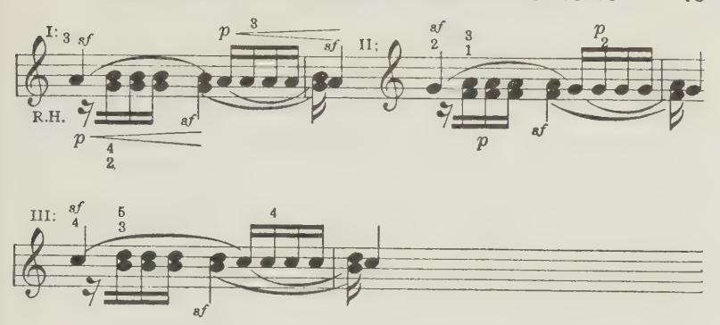

15. The "Throw-off' and ''Float-off" Test-exercises — and others — quoted under Set III, pages 24-33 of these "'Relaxation Studies," incidentally also serve this very same purpose.

# Chapter LX

## THE BENT AND FLAT FINGER-ACTIONS

- 1. There are two quite opposite forms of finger-action possible, as already described in Chapter IV, § 2, etc. Formerly this difference was but vaguely understood. Hence arose the terms ''Bent-finger" and ''Flat-finger," because of the wsual difference when the finger is much raised from the keyboard, in its preliminary movement. See Chapter V, § 2.
- 2. The point to understand is, that you can move towards the key and with the key, in two quite distinct and opposite ways. With either of these two actions, however, once the finger has fulfilled its movement, and the key is down, your finger may actually be equally more or less flat or bent. See the photographs given on page 34 of the Epirome.

#### A curling or uncurling action:

- 3. Thus, (a) you can exert or move your finger in a folding or curling-in direction; or (b) you can do the opposite thing, and open-out or uncurl the finger as it moves towards and with the key.
- 4. With the folding-in action against the key, you will in a measure exert a pulling or clinging action upon the key with the finger-tips; hence its designation "'clinging-touch"' (or flatfinger) because, if you lift the finger well beforehand, you will then start this folding-in action with the finger in a more or less straightened-out or flat preliminary position.

#### Clinging-finger, a gripping action:

5. This folding-in or "clinging" action is the most natural and generally useful one at the Piano. It is precisely the same action of the finger as in all our ordinary avocations when we grip hold of anything. It is the same action as folding your finger-tips into the palm of your hand; but at the Piano this complete folding-in of the finger is baulked, since the keyboard intervenes.

#### The Bent-finger unbends in moving down:

6. With the opposite action — the unfolding or opening-out action, you will, on the contrary, thrust or shove with your finger against the key — in place of that pulling of it towards you, which you experience with the "'clinging"' form of touch.

In this shoving, or thrusting action (as I have called it), if you start from a well-raised position, you will find that the finger is more or less fully bent or curved — hence its name; but when you move down towards (and with) the key, you actually open it out, or uncurl it, more or less. The nail-phalange (or nailjoint), however, here remains more or less vertical throughout.

7. This thrusting action of the finger is more artificial and complex than is the clinging or gripping action; and this, because when you descend towards (and with) the key by this

form of finger-action, you have actually to raise the two outermost portions of the finger (the nail and middle phalanges), relatively to the descending knuckle-phalange — indeed, a much more complex and conflicting action when compared to the natural gripping process of clinging or flat finger.?

#### Bent-finger needs Elbow forward:

8. Moreover, the bent or thrusting finger-action, being in the nature of a thrust or shove, has this disadvantage, that it needs, as a basis for its shove, either a forwardly poised or actually forwardly exerted wpper-arm, or Elbow."

In this case, however, you totally cut out any assistance from Upper-arm weight. Whereas with the clinging-finger, the Upperarm can be relaxed more or less fully, thus providing a far more satisfactory basis for (pleasant) tone-making than does the "straight from the shoulder" action or bent finger, with its more or less forward driven Upper-arm and downward-acting Forearm.

9. As already pointed out (Chapter V, §[33) this forwardlypoised Upper-arm, with its thrusting finger, is however sometimes required for soft light passages, since the weight is thus taken off the keyboard — provided you avoid any fore-arm down-exertion in the meantime.

With such poised condition of the Upper-arm you may optionally employ either ''flat"' or "bent"' finger.

10. Note also, that with the clinging action you may have the finger almost or completely flat, straight, and therefore fully elastic, where a certain tone-quality or delicate tonecontrol demands this; whereas, with the thrusting finger-action the finger must remain more or less arched to the last — and therefore, more or less rigid, and inelastic — physically and tonally. See the photos of Finger-position given on page 34 of the EPITOME.

1 In ordinary life, this thrusting action of the finger is rarely employed, except when pushing something away, or playing at marbles, etc.! 2 No, this does Nor mean necessarily a Movement forward of the Elbow!

Nore. — I myself, personally, hardly ever use anything but Flat-finger. Being gifted with really strong fingers, I can make quite a fine harsh noise when I wish it, even with the elastically-disposed Clinging finger!

Also, when I need a penetrating singing tone, I contract the clinging-finger well inwards until it is fully arched when the Key is down. This, however, does The tonal effect "ot constitute Bent-finger-action, although to the eye it may of Flat v. Bent seem like it. Forte passages played by the old-fashioned rigid, bent finger sound an abomination to me, personally. But these things are matters of Taste, — either good, or bad!

For neat, sharp, ''dry"' (z.e. fully staccato) effects, the use of the Bent-finger is certainly appropriate, and such effects cannot so easily be produced by the

Flat-finger.

#### A Recapitulation of Arm-condition v. Finger-condition:

- 11. Here recall, as shown in Chapter V under "The Six Armconditions," that these two opposite forms of finger-use also demand a correspondingly opposite attitude or condition of the Upper-arm, more or less marked according to the amount of tone. Thus: when you use the Clinging-finger, the implied tendency (not Movement!) of the Upper-arm is to fall away from the keyboard — while thus setting its whole weight more or less completely free (as a basis for the pulling action of the finger-tip against the key) during the moment of its descent.
- 12. For full tone in chords, or cantando and cantabile, this relaxation of the Upper-arm is more or less complete during each separate act of tone-touch.
- 13. For fortissimo,' you must add to this Relaxation of the Upper-arm also the down-exertion of the Forearm, during the moment of key-depression. But remember, you must nevertheless leave free the Upper-arm (with elastic Elbow therefore) when you thus employ this down-force (or lifting-exertion!) of the Forearm against the moving key, else your tone will become forced and ugly, and you will certainly lose all nicety of tonecontrol.
- 14. Remember also, that for véry light passages, and also when holding notes down, or when feeling your way along the surface of the keyboard, that the nicely poised Upper-arm serves

1 And also for certain penetrating singing tones.

best. In rapid passages there is no option, as there is not time for those separate lapses of the arm, which can be used in slower passages.

Norte. — But with the "poised" arm, naturally the amount of tone available is far smaller than with separate Arm-lapses, etc., for each note; this is the reason why you cannot play rapid finger-passages with the same degree The tonal sae = advantage of of tone as you can give in chords and cantabiles. alternate hands Hence also, the device of taking alternate notes in a rapid for alternate passage with alternate hands. The passage, technically, is thus at peree half the speed of its Sound-effect; and separate lapses of armweight here become possible for each note, with a correspondingly greater volume of tone.

15. With the thrusting action of the finger, the Upper-arm condition is bound to be of the "forward" type. Although no movement may here be visible, the condition of the Upper-arm is that of a push-forward, more or less.

Nore. — In soft passages this may need merely a forward-poised Arm with its tendency to lift the Upper-arm and Elbow forwards and upwards. For fortes, however, the tone cannot be thus produced without a marked forward-forcing exertion of the upper-arm, — a forward-swinging exertion. This, again, may be given without any movement to divulge or indicate its presence, since the armforce may be completely taken up by the implicated finger, and may thus be hidden from view. Remember, however, that this forward pressure of the Upperarm, while quite invisible, may yet destroy all tonal beauty, or nicety of tonecontrol.

16. Moreover, recall again, that with the Thrusting-finger you cannot have the help of upper-arm Weight, since you are supporting it off the keyboard! Due to this, is the curious contradiction, that this very condition of the Upper-arm (thus poised forwards) can also give you the lightest possible effects — provided you avoid any straight-down action of the Forearm in conjunction with this forward poise of the Upper-arm. Refer again to Chapter V.

#### Playing on tip-toe:

17. Very light and gossamer effects are in fact best produced by the arm in this fully poised condition, while the fingers, as it

were, play on tip-toe. With flat-topped fingers (as my own) one can play such delicately-light passages on the very top of the finger — with nails almost (or really) touching the keys; the finger being here so greatly curved that the nail-joint may actually be slightly bent inwards. With sharp-pointed fingers, however, this ballet-dancing device is impracticable!

18. As an example of its application, take those little "echo" effects required in an already soft passage, such as in the F minor Study of Chopin's, Op. 25, No. 2:—

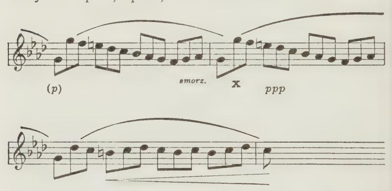

The arm is here so light that the hand is "just bounced along" by the light tip-toe impulses of the fingers — and forearm, rotationally. Much of the eerie effect (as it should be) of the Finale of Chopin's B Flat Minor Sonata also depends on this particularly subtle kind of finger-technique. See Additional Note, No. XVIII, "An Alternate ppp Method."

19. You will have realized, that *except* in very light passage work you cannot help the Unfolding or Thrusting-finger by this forward action of the Upper-arm without also applying the Down-exertion of the Forearm, more or less forcibly.

It follows, if you do employ this triple combination at all forcibly (that is, with elbow forward and down-exertion of the forearm along with the thrusting finger), that you are then bound to produce a hard, harsh, nasty tone, more or less uncontrolled, since the whole limb is here in a totally inelastic, ungiving condition.

Norte. — This hard, machine-like playing (or strumming?) seems to be the ideal of some so-called artists. The notes are just spat out like so many cherry stones, Piano without inflection, and the result has nothing to do with the ex-Typewriting pression of Musical-feeling. The Radio and Gramophone, however, may perhaps be gradually educating the public to expect something better than this typewriter kind of playing. Perhaps, in the near future, the mere virtuoso will have to give way more and more to the true maker of Music!

#### Duration also affected by these Finger-contrasts:

- 20. Moreover, in the same way that the flat (or clinging) Finger-technique (because of its elastic condition) renders easier that due acceleration of the key during descent (which therefore makes for delicacy of tone-control, and good quality), it also renders easier the attainment of Non-abrupiness in Durationinflections. That is, the elastic (flat) finger not only renders "oradual" key-descent easier, but it also influences key-ASCENT in the same way. With Thrusting-finger action one is therefore more likely to produce abrupt staccato than with Clingingfinger action; and abrupt staccatos (Staccatissimos) are comparatively rarely required, and may easily sound ugly and out of place.
- 21. Finally, remember, that both these ways of Finger-action can be achieved either by the application of the ''small'' muscles only, to hold the notes down, or in combination with a momentary use of the "strong" muscles, necessary to produce the tone.

# Chapter X

## HOW TO FIND THE RIGHT NOTES

#### Don't try to see the notes, feel them!

1. To find the right notes, however quick the passage, you must physically feel your way, and must do so each time FROM the last-played note, — you must sense the Physical Intervals on the keyboard as well as the Melodic Intervals! Thus successfully feeling your way along the keyboard from finger to finger, you gain perfect security, and cannot sound "wrong notes"!

Nore. — The Blind are compelled thus to learn. Eyesight often proves an actual stumbling-block to one's Pianistic Education!

- 2. This "feel" of the surface of the keyboard depends mainly on the true sense of touch — the sense of contact.
- 3. This sense of physical continuity in passages should also apply in one's Staccato-passages, and equally in passages broken between the hands.
- 4. Thus, in all passages broken between the hands, be careful not to lose contact with the key last played by one hand until you have felt a place on the keyboard for the first note of the next hand — that is, until you have located the next note physically.?
- 5. Thus you attain a sense of physical-continuity and security during every passage. This physical continuity (corresponding to its musical continuity) may be felt either at the depressed level of the keyboard im Legato, or at surface-level in Staccato; and you also thus acquire a physical sense of the continuity of the phrase-unit itself.

Two examples, from Bach's "Chromatic Fantasia" and from my own "Moods of a Moment," are illustrations of this point, and follow on next page.

1 Here refer to "'Musical Interpretation" (Joseph Williams), Section IJ, page 51, for a full elaboration of this point, and all it implies.

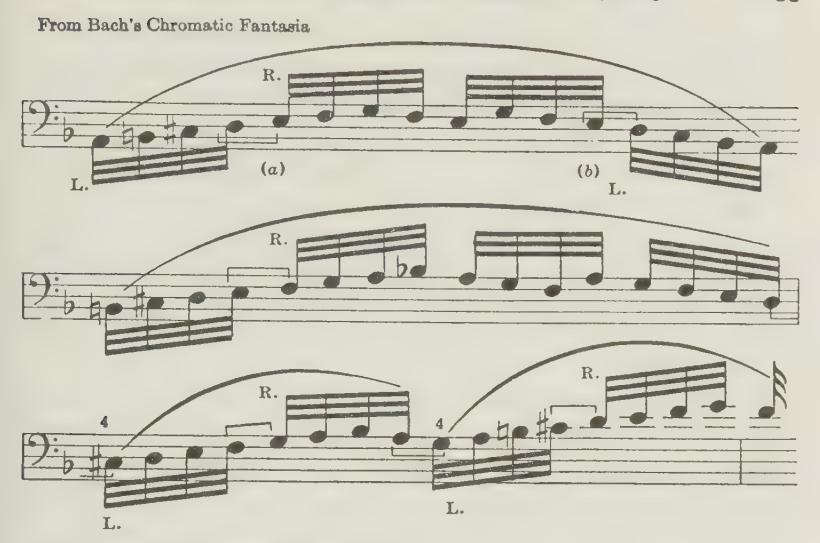

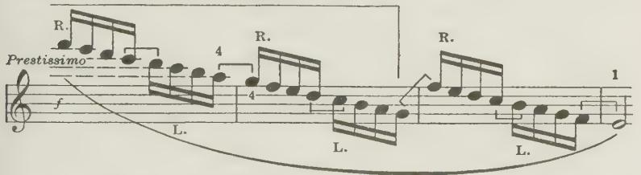

Thus, at the beginning of the above passage (from Bach's Chromatic Fantasia) do not quit the D with the left hand until your right-hand thumb has found its E, etc. Likewise, in the excerpt from "' Moods of a Moment," join the thumbs and the ring-fingers respectively.

#### Take no "chances" in Skips and Octaves:

6. Even in Skips you must still feel your way along the keyboard — a glissando, as it were, at key-surface. This applies equally in Octave-passages — which, in a sense, consist of a succession of glissando skips. The rule to remember in Octave-playing is, that when the passage travels outwards (away from the centre of the keyboard), you must feel your way along with the thumb; whereas, when the passage moves inwards, then the fourth and fifth fingers must guide you.

- 7. We shall find that this is the main secret of cleanness in Octave-playing in conjunction with proper *repetition* of the Forearm-rotation impulse, and finger-exertions individually given for each octave.
- 8. The double level of the keyboard (with its black and white keys) renders all this easier.
- 9. Until you gain this tactile sense of the keyboard you cannot play in a darkened room; and until you can play in a dark room your technique will ever remain unreliable, unsure and insecure.

#### On Lateral movements:

- 10. To enable you to move from note to note on the keyboard, you have to supply *sideway* (or horizontal) movements of the fingers, hand and arm both of the upper-arm and the forearm. As these movements are visible, they are too obvious to need much explanation.1
  - 11. There are, however, three points to notice: —
  - In taking skips within the compass of two octaves it is best Not to move the Elbow (and Upper-arm), but to leave that stationary. To succeed in this, you must, before beginning the skip, turn the elbow out sufficiently, to enable you to reach the furthest-out note conveniently. See Octave-playing, ¶ 35, Chapter VI.
  - 2. When your fingers have to be turned over your thumb (or in turning over thumb, etc.

    wice versa) this requires a movement of the hand with the thumb stationary. Whereas, when you move the thumb under a stationary finger, this requires a movement (sideways) both of the wrist and forearm.
- 1 Some of the apparently simplest actions, however, are quite complex. For instance, moving the right arm and hand up the Keyboard, from its centre, seems a simple enough action, yet it can only be accomplished, muscularly, by the harmonious blending of four distinct muscular movements! Thus, (1), you must rotate the Upper-arm outwards (Upper-arm rotation); this, alone, however, would swing your arm and hand right up from the Keyboard in a quarter-circle! (2), You must therefore transform this up-movement into a horizontal one, by lowering the forearm; but this would entail turning the hand over outwards, and

3. When playing scales, etc., it is best to have the Wrist For scales, turned somewhat "'outwards" —away from you; oe this allows of your turning the fingers over the thumb without disturbing the relative position of wrist and forearm during the passage.

#### "From," yet "Towards":

- 12. While thus physically always feeling your way FROM the last note to the next, you must nevertheless never forget also rhythmically to think and foresee your way FORWARDS, as insisted upon earlier; that is, forwards towards tone in key-depression, towards the next pulse-place in quick passages, towards the phrase-climax, and towards the climax of the whole movement.
- 13. Briefly, to find the right notes, you must always play "from" the last note, while to ensure the right time and rhythm you must, nevertheless, also always think ''towards'"' some rhythmical point or other ahead, while you are playing.

#### The Sense of ''Resting'':

- 14. Now all this implies a sense of RESTING on the keyboard during each phrase, section or musical unit.
- 15. Thus you may either rest (or lie) on the keyboard either at its surface-level or else at its depressed-level; and this brings us to the consideration of the problem of Legato and Staccato.

# Chapter XI

## HOW TO PLAY LEGATO AND STACCATO

- 1. Remember, you cannot sound a note at the Piano without EXERTING your finger to produce the down-movement of the key.!
- can only be corrected, (3), by your rotating your forearm inwards! Finally, (4), to prevent the little finger being swept off the Keyboard, you have to turn the hand itself inwards, laterally.
- 1 Except in the first steps of playing, as shown in my "Child's First Steps," and "Nine Steps towards Finger-individualization," where, instead, you sound the notes with the side of your hand.

- 2. Even for the very softest sound, you must still exert the finger — though very gently, and with no more force than will just suffice.
- 3. These two preliminary reminders may seem redundant, but they are not. The exertion of the finger is so often overlooked — as also the exertion of the hand to help it!

#### Staccato defined:

4. Now, a true Staccato should signify a note without Duration. Therefore the key must here be free to rebound the very moment that tone-production is completed, so that the damper can stop the sound instantaneously.

Nore. — Colloquially, every passage that is not Jegato (or tenuto) is loosely termed "'Staccato.'' But this is manifestly an error, since everything that is not a true staccato (or staccatissimo) is necessarily a tenuto of shorter or more complete duration.

Always, therefore, be on your guard, and look with suspicion on "staccato" marks, for they do not relieve you from the great care necessary to give the precise degree of DURATION to such supposed "'staccato"' notes, if you are out to make real Music.!

1 Some students, it appears, find it difficult to grasp the distinction between the terms "'Length" and "Duration" of a note. Realize that "Length" solely Length v. refers to the space of time covered by a note-sign, whereas "' Du-Duration ration" refers to the proportion of that length during which it is kept sounding. That is, the note-sign indicates a definite guantity of Time, but we do not necessarily prolong the sound to its full Time-value; we may cut it short, or may even extend it beyond its note-value — in legatissimo. It only forms one of the many anomalies of our musical notation!

Length is therefore a definite, compulsory quantity of Time, and may only be varied in a succession of notes, in Rubato or ritardando or accelerando, where the relative time-proportions of the notes nevertheless remain paramount. Whereas Duration (implying the contrast between Legato and Staccato) cannot be accurately noted in the text any more than can be the contrast between forte and piano — since all such contrasts are always largely a matter of Judgment and Taste as to degree, and are varied in a measure with the mood of the performer at the moment. A rest, on the other hand, is definite — except, again, that the Timequantities can also be inflected in Rubato, etc., and that its silence may be encroached upon by a prolongation of a previous note's duration — at the taste of the performer.

In short, the length of Time between the beginning of a note and the beginning of the next note (or rest) is the same whether that first note be kept sounding its full Time-valse or not — and this last comes under the term of Duration.

#### The Act of Staccato:

- 5. A true Staccato implies that you must accurately time your tone-producing exertion, etc., to cease completely with the very moment of tone-emission, so that the key may here be free torebound. You cannot thus cease each finger-action unless you also as accurately time the cessation of the help it receives from the hand and arm, during the moment of key-descent.
- 6. Staccato therefore implies, that you must rest very lightly on the keyboard, else you cannot accurately cease the fingeraction (etc.), when needed.
- 7. In short, during Staccato, rest no more heavily on the keyboard than the keys will bear at their surface-level. If you rest thus lightly enough, you can succeed in playing staccato, \_ always provided that you (as beforesaid) accurately cease the tone-producing impulses with the moment of tone-emission, so that keys and dampers may be free to rebound and ''damp" each sound instantaneously.

#### The '"'Resting"'' in Agility-passages and Octave-passages:

- 8. Most AcILITy passages need this same light form of Resting, and also need equal accuracy in timing the complete cessation of the separate down-impulses with tone-emission. When your tone is dull in Agility-passages, the cure always is, to recall these facts of Staccato-resting, and accuracy of timing.
- 9. OCTAVE-PASSAGES equally need this lightest form of Resting —a glissando along the surface of the keyboard with a separate impulse for each octave.?
- 10. Now, to achieve this light form of Resting, your arm must be so nicely "poised" (or supported by its own muscles) that it floats over the keyboard, and thus allows the hand to
- 1 See Chapter X, 6, and Chapter VI, 36, etc., on Octave-Playing; and for further directions as to octave-playing refer to the Epitome, page 30, and also to the Section on Octave-playing, pages 91 to 99, in Relaxation Studies (Bosworth), where full instruction is given.

remain lying loosely and freely upon the keyboard at its surfacelevel, between the sounding of the notes.

#### The Act of Tenuto and Legato:

11. To obtain LEcATo — that is, the ''natural" form of it you must allow this Act of Resting to be very slightly heavier, but still quite light and gentle. Your finger will now be compelled, by this extra (but still light) weight, to hold down the notes until relieved by other fingers, or until you relieve the keyboard of this slight extra degree of continuously-resting Armweight.!

#### Natural or ''compelled'' Legato:

12. I have called this the "natural" (or automatic) form of Legato, since it is this continuous (but light) resting weight which here compels the fingers to "carry on" from finger to finger. It might also be termed Compelled Legato — because it is wrought or "compelled" by this slightly heavier, continuously-resting Weight.

#### Uncompelled or ''artificial'' Legato:

- 13. You can also obtain a Legato without this compelling action of Weight. You may, instead, employ the lightest form of Resting (precisely as needed for Staccato), and yet you can quite well hold the notes down. The notes are here held down by the continued action of the "small" muscles of your finger, directly prompted by your Will, and not here compelled to continue by the prompting of the heavier Resting, as considered in 9/10 and 11. This form of Legato I have called the artiFIcIAL form of Legato.
- 14. With this "artificial" legato then, there is not sufficient Resting-weight to compel the finger to hold its note down, as in
- 1 A recent writer advocates some two pounds or more of weight to remain thus heavily resting on the keyboard! A mistake made by BREITHAUPT and others of the German school — "'schwere Tastenbelastung," they call it. As already pointed out, this teaching of a heavy weight carried along the keyboard or keybeds has wrecked many an aspiring Pianist. Avoid the error at all cost.

"natural" legato. And with this lighter Resting, the keys jump up, the moment you cease the light individual holding-action of the finger. This form of legato might therefore also be iermed "uncompelled"' legato, since it is not compelled by a continuously resting Weight.

Note. — There has been much misconception on this point. The distinction, however, is really quite simple; although, as everywhere else, a point will always appear "'difficult," so long as it is not understood. Yet the difficulty never is in the fact; it always lies in the reader's insufficient alertness.

To help towards the understanding of this distinction between the two types of Legato, try the following experiments: —

Experiment in (a) Place your feet almost under the chair you are sitting elucidation of | upon. Now, if someone were rude enough to try to pull that '\*Natural'? and chair from under you, you would, instantly, but quite automati- " Artificial" cally, exert your legs, ard would find yourself standing. Here Legato h d l 6 " you have a good analogy to "'compelled"' or natural Tenuto and

Legato! Whereas, (b) if, while sitting on the chair like that, you press your feet against the floor (as in getting up), you will then also bring the weight of your body to bear upon the floor, but now only so long as (and to the extent) you willfully exert your legs. Here you have uncompelled, or "artificial," or non-automatic Legato!

#### On Duration-inflections:

15. Fluctuations (or inflections) of Legato and Tenuto (both in staccato and legato passages) are mostly produced in this last way — by the individually prompted holding of notes by the finger, that is, without the Continuous-weight compelling element.

This, in fact, is the form of Legato most often used. A true Cantabile is impossible without it, and so is Bacu-playing. Natural legato, however, is easiest at first, yet this second or " artificial'? type of Legato should be acquired as soon as possible, and in the end both types are often used simultaneously.

Note. — In passages which are on the whole Staccato, the varying durations of the notes, more or less marked (or waverings in the staccato of the passage), are best effected by such holding "without weight," rather than by a separate lapsing of weight for particular notes. Moreover, for legatissimo inflections, it is the only way. The notes are here "overlapped" not by individual increases in the Restingweight (far too clumsy a way), but instead they are over-held by the needed fingers, without any "'compelling" Weight.

#### Reminders as to Finger-actions and ''Keybedding"':

- 16. I have elsewhere explained the physiological difference in the action of the finger while producing the tone, and its subsequent light action in holding the notes — the "small" muscles of the finger here alone doing the work. See Chapter VIII, "On the Holding of Notes"; also, Additional Note, No. XII ,"On Keybedding."'
- 17. Remember, the pressure required on the keybed to hold a note down is not necessarily more than will suffice to sound the note at its softest; it is in fact slightly less, since it takes more force to move a limb than to keep it in position afterwards. But, as already indicated, it is often useful to use a little more pressure on the key-pads than actually necessary to hold the notes down. It gives one a sense of comfort to feel one is holding the note, and it helps to warn one to let go when time is up!
- 18. Also, as already insisted upon, this extra pressure does not constitute ""keybedding."' Remember, keybedding arises when you misapply to the keybeds any force intended to PRODUCE the Tone. Keybedding implies that you have ill-timed your tone-making effort, and have in fact buried it upon the key-pads, instead of applying it early enough during Key-descent to fulfill its purpose — in Tone-production. So long as you keep separate in your mind the Act of tone-making and the Act of tone-holding there isnoharmdone. But you must always remember this distinction, else your efforts will fail to express your musical sense whatever your endowments may be in that respect.}

1 See ¢{9 and 10 of Chapter IV.

# Chapter XII

## WEIGHT-TRANSFER AND ARM-VIBRATION TOUCHES

— The true nature of all so-called "' Finger-passages"'

1. Preamble: All rapid passages approximate either towards the 'Arm-vibration" or "Weight-transfer"' type of technique. Manifestly it must then be of extreme importance thoroughly to understand these matters, since all real Piano music so largely consists of such rapid (or ''Agititv'') work, owing to the nonsustaining power of our instrument. Hence this Chapter is devoted to the further elucidation of these points.

What I mean by "Arm-vibration" and " Weight-transfer" is concisely defined in §{[ 8 and 9 of Chapter V, ''The Physiological Details'? — which see. Enough, to repeat here, that the distinction between the two mainly is: that with ''Armvibration touch" the arm floats over the keys (and upon the keyboard) at surface-level, and the successive tones are produced by momentary (and individual) impulses from the finger and hand during key-descent — helped of course by the forearm rotationally; whereas, with ''Weight-transfer," the arm is not so fully poised, and a certain light measure of its weight is passed on (as in Legato Resting) from keybed to keybed, and does not here cease with each act of tone-production.

In slower passages, however, instead of either of these forms of floating weight, it is possible to have as basis (for the finger and hand exertion) a separate lapse for each note from the normally "poised" (or self-sustained) condition of the arm —a great advantage, and a necessity where the larger tone-volumes are needed. In fact, this is "'Third species of touch," as termed in "The Act of Touch." That is, the arm-supporting muscles are momentarily allowed to stop work during key-descent, and

the arm-weight (thus set free during that moment) serves as a very substantial basis indeed, so that finger and hand can be effectively and fully exerted during the moment of keyacceleration. Or we may even add to this a momentary downexertion of the forearm. Or we may use only forearm weight in place of whole-arm weight. All these points have already been noted in Chapter V under the '"'Six Possible Arm-conditions."

It is well to repeat, however, that although the arm does not necessarily show its momentary ponderous incidence by any movement, yet its whole weight (or more) may thus be available during the act of tone-production, while the normal condition of Arm-poise is instantly resumed upon its completion. All cantandos and cantabiles are thus played — even up to some considerable speed.

Beyond a certain speed, however, these separate arm-lapses (no, not Movements!) become impossible. Beyond such definite tempo, this "Third species" form of technique (with the arm separately lapsed for each note) gradually merges either into Arm-vibration touch, or into Weight-transfer (or '' Passing-on"') touch when the arm is left somewhat less fully supported, and some measure of its weight therefore then bears continuously upon the fingers, hand, and keybeds.

These matters must now be dealt with in greater detail.

2. Clearly, the two forms of "Resting" (legato and staccato resting) considered under ''Legato and Staccato" in Chapter IX (arising from differences in the degree of the Poised arm) themselves form the main difference in basis between " Weight-transfer" (or "Passing-on'') touch, and ''Arm-vibration touch."

#### Definition of Weight-transfer touch.

3. We have seen, in Chapter V, {[10, that the "' poised arm," when not quite fully poised, may itsélf become a Basis for toneproduction in rapid passages, while continuously (but still lightly) resting on the Keybeds—and that it thus forms " Weighttransfer touch."" Now, such continuously resting weight, passed on from finger to finger and keybed to keybed (as already pointed out earlier), also entails a continuously active (exerted) Hand, and may even entail continuous (although alternating) rotatory stresses of the Forearm.

4. Such continuously passed-on pressure applied from note to note (although slight) unfortunately greatly impairs our possibility to choose the tone or duration of each individual note, as already pointed out. The serious drawback of Weight-transfer touch is, that the successive sounds are hereby reduced more or less to a dead level of tone and duration, and therefore, under such form of technique, our passage-work will sound as musically dead as passages played on the Organ or Pianola, since the possibility of a Mind tonally operative and purposeful behind each individual note is here lacking.

All that is possible with Weight-transfer touch are gradual inflections of tone and duration — swirls of crescendos and diminuendos, and gradwal changes in the degree of legato and staccato.

#### Weight-transfer, where inappropriate:

5. Musical passage-work, on the contrary, imperatively entails inflections from note to note — that is, the tone and duration of each note must be meticulously chosen with musical purpose.

Therefore, since such tonal selectivity is so greatly impaired and hampered (if not almost rendered impracticable in Weighttransfer touch), sternly avoid using it for musically-alive passages; instead (wherever practicable) use Arm-vibration touch, — with its fully poised arm and individually applied action, and its option therefore of tonal differentiation from note to note, as already repeatedly insisted upon.

6. The obvious moral is, that you should never play such melodically-musical passages amy quicker than you can thus musically purpose each individual note, nor quicker therefore than you can apply such arm-vibration touch physically, since

beyond a certain definite rate of speed you are bound to lapse into ''Weight-transfer touch," with its drawbacks musically. More on this point under §[{/26, 27, and 28, further on.

Norte. — Some otherwise excellent artists, however, often ignore this required keen musical and physical individualizing of the notes in Passage-work (which the Arm-vibration type of technique alone offers), and instead, they indolently lapse into convenient but banal Weight-transfer Velocities!

#### Weight-transfer always light:

- 7. Moreover, as already insisted upon, the weight actually transferred from keybed to keybed in Weight-transfer touch should always remain comparatively light, even during the production of those swirls of possible crescendo inflections. For the most part it should be little heavier than suffices to sound a note softly by Weight-touch.
- 8. Note. Moreover, as already anticipated in Chapter V, in high-speed passages a somewhat greater modicum of Resting-weight can be carried along in Weight-At higher transfer Touch without this extra weight coming to bear solidly speed, extra and deleteriously upon the Keybeds. Similarly, with Arm-vibraweight possible tion touch, during swift passages, some extra Resting-weight can be carried without impairing the efficacy of those individually-directed hand-andfinger impulses for (and with) each key, which Arm-vibration touch alone offers us, as demanded in rapid, but musical Passage-work.

The reason is, that at high speed of progression across the Keyboard a greater number of such impulses in a given time help to support the Resting-weight off the keybeds than at a slower speed. Thus more weight can be carried at high speed, without Arm-vibration touch (with its floating weight) deteriorating into Weighttransfer touch with its weight resting solidly upon the keybeds, and which would render Arm-vibration touch impracticable.

In short: the louder the passage (and the more energetic therefore these shortlived impulses of the finger-and-hand), the more readily can such extra weight be kept floating (or resting lightly) upon the keyboard.

An express train has been known actually to jump a small gap in a bridge at high speed! At slower speed the wheels would certainly have sunk in! See also the Note to {20 of this Chapter, and "On the Merging of Touch-forms" in Chapter V.

#### Weight-transference by cessation.of the last-used finger:

9. Tone-production in Weight-transfer touch is effected by transferring the basis of light Resting-weight from -finger to finger and keybed to keybed. This transference of weight is

effected by each finger in turn being prompted into exertion strictly in response to the accurately-timed CESSATION of the previous finger's work. Such reflex-action (in response to the weight thus felt to be "left in the lurch" as it were) is akin to the act of polite walking — and not stamping along, as a child does at first! Each leg in turn should be prompted into action by the cessation of the exertion of the previously-used leg. Experiment on these lines, both on the keyboard and on the floor, and the nature of this process immediately becomes apparent. Perhaps a better analogy than walking, however, is the process of stepping on to the treads of a Treadmill.1\_ Now, if we step on to the treads of a treadmill, we find that each tread gives way As we bring our weight upon it. The exertions are the same as used in walking upstairs, only instead of mounting any further up we are turning a wheel by the exertion of our legs. Here note, it is the muscular exertion which does the work, and we again realize how '' Weight" (as everywhere in playing) serves only as a Basis, or stable Foundation (but not as a "'Fixation''), so as to render effective the work being done by finger and hand.

Norte. — True, in the act of walking on level ground, we do transfer the whole weight of our bodies from foot to foct — we cannot do otherwise; whereas in "walking" on the Piano with our fingers, we must never carry along the whole, fully-released weight of our whole arm (or armforce instead!) else our playing will certainly be crippled. Do not forget, therefore, that, even when most ponderous, only a comparatively slight release of the whole arm is required for such Resting.? A Walking Analogy

1 We may gain some notion of this by trying to walk up a descending "escalator," or by watching the efforts of white mice in their revolving cage!

Obviously, playing under such hampering conditions not only renders the individualization of tone-inflection (tonal selectivity from note to note) impossible, but, as indicated, it has often ended in the unfortunate student being actually

physically disabled.

2 In Germany and elsewhere this was overlooked, as already pointed out, and the student was instructed to carry the full weight (or even full arm force — The Full- "Volle Spielbelastung") — from note to note without a break weight-transfer between! This grave misteaching has been responsible for many fallacy a broken-down student and player. Yet, even today, some misguided people are trying to revive this iniquity!

#### On Key-bedding:

10. This again brings us back to the much misunderstood question of "keybedding." Merely carrying a measure of Weight on the Keybeds (as in Weight-transfer touch) does *not* constitute "Key-bedding" within the meaning of the Act.

As a matter of fact, I invented the term "keybedding" thirty years ago as a term of CENSURE, to denote quite another thing. "Keybedding" simply denotes the misapplication (or mistiming on to the pads under the keys) of the force intended to PRODUCE SOUND. In other words, the force (weight, or muscular work) is here applied too late during key-descent to be effective in producing the intended key-movement and tone. As a result, the tone-intended force is "buried" on the keybeds, instead of creating tone. (See Footnote below, also Additional Note, No. XII, "On Keybedding." See also ¶18, page 88.)

#### Legato Pressures:

11. Nevertheless (as pointed out earlier), it is sometimes desirable actually to provide a certain (but still slight) degree of continuous PRESSURE on the key-beds themselves. This however does not constitute "keybedding," and there is no harm, provided this continuous pressure is always kept distinct from the actual (momentary) tone-producing impulses.

Such gentle key-bed pressure may be, and indeed should be, quite legitimately and usefully applied to apprise us clearly how long

Many cases of such taught misdoing have come under our care to be cured; and we have had to act as a "Kuranstalt" for players crippled by this particular form of evil "method."

&lt;sup>1 A recent writer, after quite rightly stating that "the process of resting part of the weight of the arm on the keybeds must not be confounded with keybedding," yet continues quite wrongly thus—"which consists of pressing on the keybeds by means of muscular energy"!

This quotation hardly gives much "Sidelight" on this vital point. In the first place, it is quite impossible to press on the keybeds at all without such "definite muscular energy" of the fingers and hand; or does the writer imagine that armweight can possibly be applied to the keys without the intercession of Finger-exertion?—and hand exertion also?

we are holding those notes down. Thus applied, it forms quite good playing, and certainly does not constitute "keybedding,"' in its obnoxious sense. See Chapter XI, 417.

Again, it must nevertheless be reiterated, that such legitimate pressure on the key-beds must nevertheless be kept within reasonable bounds, whether the necessary finger-and-hand exertion is "compelled" by a Resting-weight or not, else it will of a certainty hamper Agility and destroy tone-selectivity. Moreover, remember not to use the "strong"? muscles of the fingers and hand for such sustaining pressure, but only the "weak" or "small" finger muscles — as shown in Chapter VIII, ''The Holding of Notes."

#### Weight-transfer touch, where appropriate and where not:

12. As to the appropriate application of Weight-transfer (or "Passing-on'') touch, from what has already been inferred, it is only appropriate in soft passages not of a melodic character, not needing tonal rhythmical definition of their constituent notes passages, the main purpose of which is to hide in a measure the non-sustaining powers of our instrument, by keeping the harmonies to the fore. '"'Weight-transfer" is needed for many soft accompanying passages and figurations, speedy arabesques, ornamental virtuosities, "'filling-up" arpeggios and scales not of a melodic nature. As an instance of such accompanying figurations, perhaps best played by Weight-transfer touch, take this example from one of my own " Monothemes"': —

Moncthemes, No. 5, Tobias Matthay, Op. 13. Weight touch Weight touch

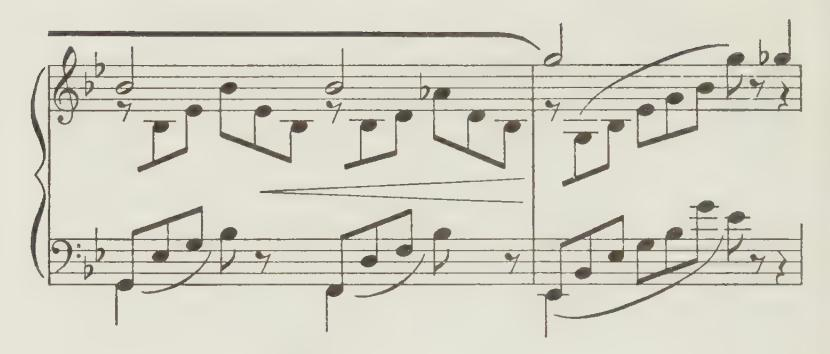

As a similar instance, all that fairy-like, atmospheric ppp accompaniment of Chopin's A Flat study, No. I, Op. 25, must thus be played — and also with the keys all played "from halfway down'"': —

Chopin: Study in A Flat, Op. 25

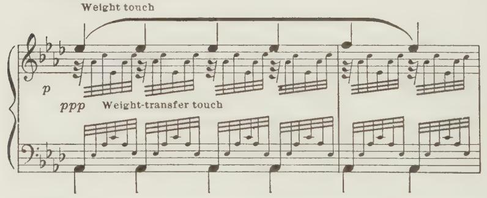

Yet in the climax of this piece Weight-transfer again merges into Arm-vibration.

Most of Chopin's study in C, No. I, Op. 10, is also best thus played by Weight-transfer; yet where the harmonies become more important, and need more playing out, one must again use "'Arm-vibration"' touch, gradually exchanging from one into the other. Certain outstanding (or prominentized) notes of course need actual Weight-touch again, as shown in the Examples on the next page.

*Weight-transfer, Arm-vibration Touches 97*

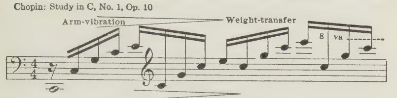

Rubato ---- rit----- accel----

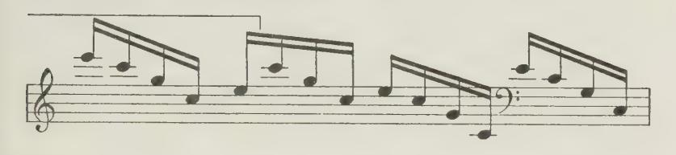

Here is another example (from my own Monothemes, No. 6) of such contrasts all within one phrase:—

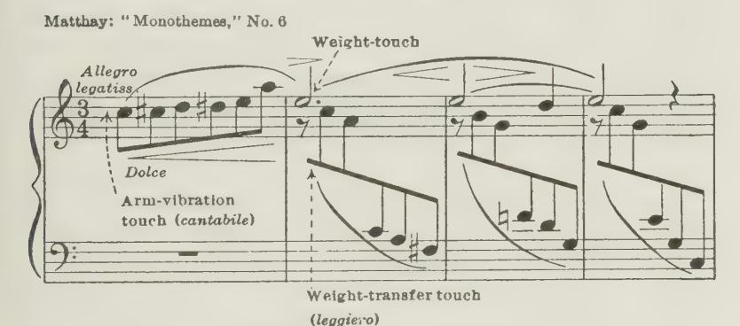

Weight-touch
legaties

"Arm-vibration"
again

"Weight-transfer" again

#### Where to avoid Weight-transfer touch:

12. On the other hand, it is quite wrong to play rapid but yet melodic passages such as those of Chopin's C sharp minor Fantasie-Impromptu, or of his Fantasia, or the B minor Scherzo, as mere harmonic swirls of Passing-on touch, as indeed too often heard. Such swift Chopin passages are indeed in the nature of true Pianoforte melodies, and as such they need that individualized playing of the notes which Passing-on touch cannot supply. I feel this applies even in such pieces as his F minor study, Op. 25, No. 2, although this is too often misplayed and turned into mere musical (or unmusical) note-rattling.

#### Matters of Taste:

13. Here we enter upon the domain of Taste. The rhythmically indefinite and inflectionally flat effect of ''Weighttransfer'? may strongly appeal to one person for a particular Chopin or Debussy passage, whereas another may feel and wish that same passage to be fully alive and rhythmically-melodious, with inflections from note to note; but in that case Arm-vibration touch must be substituted.

Notre. — Moreover, it is a good plan to practise through all Agility passages with Arm-vibration touch, also staccatissimo, even when Passing-on touch is to be applied ultimately. Anyway, it ensures their being played through slowly enough to be really thought out!

#### Where Weight-transfer is non-optional:

14. Finally, when we come to the melodic passage-work of Bach, Mozart, and Beethoven, then there is no option possible. To play such passages by '' Weight-transfer" is a crime, and is indubitable proof of total musical blindness and insensibility.

Yet it must be conceded that such vandalism is often enough committed by otherwise quite musical players; just as we find other artists trying to approximate Chopin to their correct Beethoven-playing!

Note. — How rarely does one find a Beethoven and Chopin player combined in the same person! Might one venture to suggest that this may perhaps largely be attributed to non-comprehension of the difference between the Weight-transfer and Arm-vibration types of technique? There have been, and are, exceptions. In the past, for instance, Liszt and ANTON RUBINSTEIN always kept their Chopin and Beethoven technique distinct, as it should be — just as distinct as the character of their Music.

15. Spread (or rolled) chords are usually and correctly played by such Weight-transfer (or ''Passing-on'') touch. As an instance, take the E flat chord study of Chopin's, Op. 10. Here each chord is an example of Weight-transfer. The melody notes, however, need individualized ''Weight-touch," and where the Bass changes, those notes also need it: —

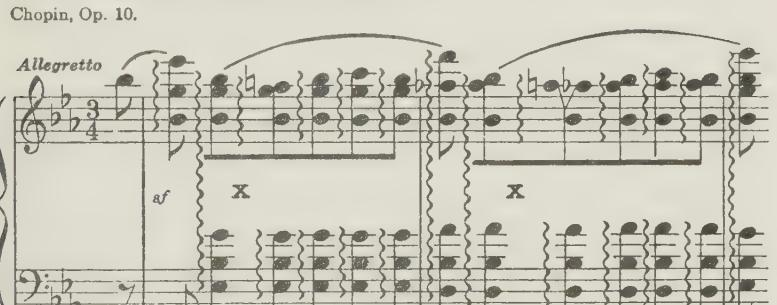

16. Moreover, for more slowly spread chords, etc., in place of such pure Passing-on touch, a certain degree of individualized finger-action is available when desirable, in addition to the weight transmitted from finger to finger.

Nore. — But as a light hand-pressure is necessarily constant with the carried weight, the individualized finger-action is here analogous to stamping with the feet. Passages analogous to spread chords can also thus be slightly modified, and the musically deadening effect of passed-on weight thus somewhat mitigated. Passed-on weight, nevertheless, always remains a serious handicap, musically.

#### The Slur.

17. Pure Weight-transfer touch is also required, for instance, in playing the soft final note of the ordinary slur. Here be sure that the new finger is prompted into action by the carefully

1 See "The Slur or Couplet of Notes," Oxford University Press.

timed cessation of the previous finger's action, and this without any "individualized" action of its own, or of the hand, else that last note will not be so soft as intended.

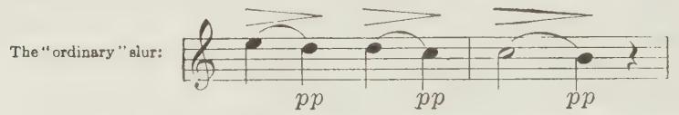

18. As a rule then, as already insisted upon, AVOID using Weight-transfer touch wherever possible, since it reduces your passage-work to the boring dead level of Pianola-like strumming, and instead use Arm-vibration touch whenever applicable.

#### Arm-vibration Touch.

#### Description:

19. This implies the lightest (or staccato) form of Resting. That is, the arm must be in its perfectly poised or balanced condition. The reiterated impulses of the finger and hand (given during key-descent only), assisted by the Forearm rotatory impulses, will (by reaction) here set the whole arm "vibrating," or trembling in sympathy with these individually applied fingerand-hand impulses against the keys; hence the term Arm-vibration. In Arm-vibration touch the hand is felt beating upwards In short: Arm-vibration means, that against the wrist. the Arm (in its finely-poised or balanced condition) is in rapid passages brought into sympathetic vibration by reaction, owing to the rapidly-reiterated but short-lived impulses of the Finger and Hand and rotative Forearm delivered against the key during each act of touch; the Finger-exertion here alone shows itself as Movement, while the hand and forearm rotative stresses may remain quite invisible.

Note. — As already emphasized in a previous Note (to  $\P 8$ ), just as we have compared Weight-transfer touch to the act of walking, so we can compare Arm-vibration touch to the act of running. In running, the impulses of our legs against the ground suffice to keep our body bouncing along, and kept as it were floating in the air. Running, in fact, consists of a series of jumps!

&lt;sup>1 Here refer back to ¶9, page 92, where this is explained.

- 20. Thus, in Arm-vibration touch, if we really maintain the nicely poised condition of the arm, it will be kept bounced off the keybeds, kept floating off them (but not necessarily off the keyboard surface) by the closely reiterated kicks delivered by the fingers against the keybeds. Adjust the weight carefully, however, else instead of Arm-vibration touch you will again merge into Weight-transfer touch — with its weight transferred on the keybeds instead of at surface-level of the keyboard — as it should be in Arm-vibration touch.
- 21. In this vibratile condition, the inertia of the fully-poised arm serves as a quite sufficiently substantial basis for all quick passages needing tonal selectivity — both in the case of finger and hand Movement, and both for forte and piano passages.!
- 22. Moreover, since the tone for each note is here produced by the individually-applied impulses of the finger and hand (and rotative-forearm) you can here accurately and meticulously select each tone and duration, and can thus retain your listener's alert attention, however rapidly you play — provided you are not musically lazy, and can think quickly enough.

Norte. — Remember, as already pointed out in 9/7, that in rapid forte Armvibration passages (just as in Weight-transfer touch), some extra weight can be On Extra carried without doing harm, because the arm is then kept in a Weight state of flotation by the rapidly repeated, powerful impulses from possibilities hand and finger during key-descent. Moreover, a certain degree of continuous action of the "small" Hand-flexors may carry such continuous weight without impairing the individually directed impulses of the "strong" hand flexors. Thus we see, again, how easily Arm-vibration can approximate and merge into the Weight-transfer type of touch, and vice versa.

Refer to Note to 47, of this Chapter, and also to Chapter V, 448, "On the Merging of the Touch-forms."

Understand these possibilities, but do not worry over the precise point of balance where they should differentiate. In fact:

Understand Touch, but unless you have to diagnose faulty playing, leave the selection to musical instinct.

Never play the Piano for the sake of using touches, but use touches for the sake of making Musicl

1 See Note under next paragraph.

#### Arm-vibration fallacies:

23. This sympathetically-induced Vibration of the arm has, however, been misinterpreted by some recent writers (Breithaupt, etc.), who have seriously recommended that the fingers and hand should be "' shaken into vibration" BY THE ARM, like using a flail— a mistake worthy of a Till Eulenspiegel!

Nore. — This forms yet another glaring instance of mistaken diagnosis wrought by the precarious attempt to analyse the touch processes by observation of their outward (but so often misleading) manifestations of Movement. Indeed, the right and wrong actions here certainly /ook much alike — except to the highly practised eye. Be urgently warned against this mistake, since the result of trying to produce the vibration-effect by Arm-initiative will certainly provoke a very ugly form of technique. The correct effect may be likened to the vibration caused in the body of a stationary motor car with engine running — the car is here shaken by the engine, but it is not the engine that is shaken by the car! Correct arm-vibration touch feels upwards at the wrist, not downwards. The correct action may also be likened to the one used when carefully and neatly handling a pepper-pot — a vibrant action of the hand, and you would certainly spoil your lunch if-you shook the pepper on to it by a Breithauptian Arm-initiated Vibration!

#### Arm-vibration legato:

24. To ensure musical playing you should (as already insisted upon) always choose this resilient form of touch for all Agility passages wherever possible.

Usually it is needed with "bouncing" keys — that is, Staccato in reality, although not easily recognizable as such by the ear at the speed. Nevertheless, this touch also admits of Legato but necessarily only of the "'artificial" type.!

#### Arm-vibration v. Arm-lapse:

- 25. Arm-vibration touch, in fact, is required for al] musical passages taken at a greater speed than will admit of SEPARATE arm-lapses or stresses for each note individually, which last
- 1 A reminder: Artificial or "uncompelled'" legato means that there is here insufficient Resting-weight to compel the fingers into Legato. By the use of their "small" muscles the fingers can nevertheless quite well hold the notes down for every desired Duration-effect — such as Tenuto, Legato or even Legatissimo. See Chapter XI, "On Staccato and Legato."

are only possible at a comparatively slow Tempo — as already reiterated in the Preamble of this Chapter. Obviously, it is only in comparatively slow passages that you cam thus help the individual notes by separate Arm-lapses and stresses.

#### The bane of excessive Speed:

26. Moreover (as already hinted in {| 6), you will find, when you try thus to individualize each note (as you should in all musical passage-work, by means of Arm-vibration touch), that you cannot then play the passages quicker than they were thought by the composer himself. Unless, of course, you throw overboard all musical self-respect, and instead use some form of Passing-on touch, when you certainly can, and probably will, play everything far beyond the intended Tempo! !

#### Never quicker than musical thought:

- 27. Arm-vibration (to reiterate once again) is therefore the staple touch-form for all quick but musically-meant melodic passages, both soft and loud, such as you find, as beforesaid, in Bach, Mozart, Chopin, and Beethoven. It follows, from all this, that you must never play such " Melos" quicker than you can thus really think, time and mean the individual notes musically and physically.?
- 1 Many purely virtuoso-players evidently do so, for the sake of obtaining cheap applause from the musically undiscerning. A real composer, however, is necessarily a musical person, and hence must choose Tempi at which he can think and play his own music. As instances, try through, say, the G major Prelude, from the first book of '"'The forty-eight,'' or Chopin's F minor, C sharp minor or A minor studies, or his Prelude in B flat minor, or Fantasie-Impromptu, first by "Passing-on"' touch (as musical smears taken at unthinkable speed) and then play them through again, really meaning every note — by means of Arm-vibration technique —and realize how immeasurably more musical is the effect for everyone concerned.
- 2 Remember, it is so easy to lapse musically, and to rattle through passages by Weight-transfer at great speed! The remedy is, to play slower and to try to think the musical value of each note.

#### A musical run sounds quicker than an un-thought one:

28. As a matter of fact, such passages actually sound quicker when thus thought through with vitally chosen and produced tones than when they are merely skimmed, rushed, and rattled through at an actually quicker tempo! The reason is, that you make the listener attend to every note if you yourself do so, and he is therefore far more busy than when you offer him but smears with a few landmarks thrown in! Nore. — Certainly, there are only too many cases where unmusicality of

utterance is really owing simply to sheer musical insensibility, and there is no remedy then! Moreover, it is true that provided the weight passed-on is not too greatly excessive, you can, if gifted with strong fingers, plough your way through passages at any speed. Some indeed may regard this as a form of "Sport," but to the musically-sensitive listener it constitutes real musical misery. It is yet another of the many crimes committed in the name of St. Cecilia! Such playing does not constitute Music-making; it is only an exhibition of Sporting Athletics or Calisthenics, and is only applauded as such. See Additional Note, No. XVII, on Strong fingers v. Weak fingers — "Strong v. Weak Piano voices."

29. After all this, it is needless to repeat the warning not to try to play with a quite heavy weight continuously " passed on," or with "Schwere Spielbelastung,"' as actually advocated by certain comparatively recent German authors, and their illadvised English imitators. Obviously, such misdoing not only precludes any intimate selectivity of Tone, but also renders all attempts at Agility clumsy, sticky, and in fact unattainable as a musical effect.

## 30. Coda — Summary of this Chapter:

The essential difference, then, between these two very distinct types of technique is, that with Weight-transfer a just sufficiently heavy weight rests continuously on the Keybeds, and tone is produced by each finger in turn giving way to the next in transferring this weight; whereas, with Arm-vibration the weight is insufficient to rest upon the keyBeDs, and tone is produced by the individually-initiated and momentary action of each finger in turn, abetted by similarly individualized and momentary hand and forearm rotational impulses.

In brief, "' Arm-vibration" implies that in place of a continuous Hand-exertion, the Hand-exertion must be supplied separately for each note, and must be as short-lived as in Staccatissimo, even in Legato.

Remember, you really need "ten hands"!

# Chapter XIII

## : ON POSITION — AND MOVEMENT

1. Remember, good Position is the RESULTANT of correct balance in the forces used. The reverse does not hold good. You may obey all the orthodoxies of Position and yet the invisible actuating processes may be quite wrong, and you will play badly.

Provide the right muscular conditions, and Position (on the whole) will take care of itself. To stress Position calls attention to results instead of to the causes of the desired results. There are, however, some points it is well to consider. Thus: —

2. AVOID SITTING TOO CLOSE TO THE INSTRUMENT. Manifestly, if your upper-arm hangs straight down from the shoulder or even slants backwards, its weight cannot become available.}

It is best to sit sufficiently far away to allow the elbow to be moved in front of the body, so that you can easily reach the extreme limits of the keyboard. The best Elbow position is therefore with the upper-arm more or less sloping forward. Thus the free-set upper-arm Weight can exert a "pull" on the fingers when needed.

Nore. — See my portrait at the Piano, page 46 of the "Epitome"; also that of Anton Rubinstein in "'The Act of Touch," p. 305.

1 If you sit too close you will be tempted to poke forward, and thus render all your playing stilted and uncomfortable and unpleasant.

3. As a matter of fact, the whole arm, if bent at the elbow, would balance itself by swinging the elbow behind the level of the body.

Try the following experiment: —

Open a penknife at right angles, and balance it with the tip of the blade between your finger and thumb, and you will find it will come to rest something like this at b): —

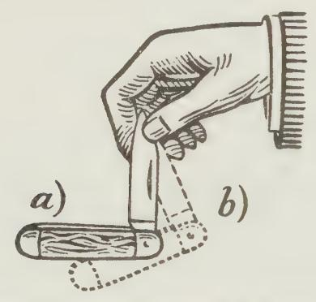

That is: the weight of the blade (upper-arm, a) is here pushed back by the weight of the hand and forearm, the handle, at bd.

This is only a very rough representation of the whole-arm weight balance, but it is instructive. If you play with the upperarm either straight down, or with the elbow actually swung back behind the body-line, you are almost bound to poke forward when you try to play loudly (with "thrusting" finger) and you will make a nasty noise instead of nice music.

4. Do NOT SIT TOO HIGH NOR TOO Low — the Elbow about level with the Keys. Sitting too high naturally suggests "Arm off'; this may seem to render running passages easier, but is likely to make you poke forward, with its usual dire results. Sitting too low suggests "' Arm-lapse,"'.and hence seems to render singing-passages easier. Lying back in a chair exercises a similarly beneficial suggestion-influence for weight-release in singing-tone; but it rather impedes Agility.

If, however, you provide the right muscular conditions you can play all passages in spite of the most exaggeratedly high or low position of the arm.

Nevertheless, a medium position is manifestly the most sensible one — Elbow about level with the keys. If you have a long upper-arm you are therefore compelled actually to use a higher seat than if born with a short upper-arm.!

#### Preliminary movements and Touch-movements distinct:

- 5. ALWAYS KEEP DISTINCT THE MOVEMENT towards A KEY AND THE MOVEMENT with Ir. Always be over or upon the key before sounding it. The action with the key should always, so far as possible, be vertical. In extending the finger, or the hand, or the arm towards a key, therefore, be sure to keep that move-
- 1 In a compilation on Piano Technique recently issued is a page of four illustrations supposed to show the different ''positions"' affected by the various ''Schools"'; thus, respectively: (1) '"'The Older Methods," (2) '"Safonoff," (3) ''Leschetizki,"' and (4) '"'Maithay." The last illustrates an arm almost straightened-out and hanging down at an obtuse angle of about 45°, and with the keyboard indicated at a level rather lower than the hips!

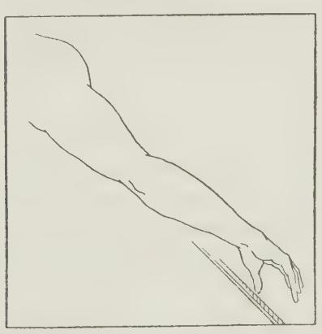

Is it really imagined that I instruct my pupils to play standing in front of the keyboard? — or seated on an Office-stool or Step-ladder! Misrepresentation such as this hardly seems appropriate in a book presumably meant to be seriously instructive.

ment or action distinct from the tone-producing one; else you will lose tone-control through the sideway pokes or stabs of the arm, etc. Not only will this spoil your option to select the tone, but it may even cause you to miss the notes altogether, or to split them. Therefore invariably keep the two movements distinct. This applies particularly when taking skips. Find your note first and then play it.!

#### Horizontal movements of Wrist and Hand: —

- 6. WHEN TURNING THE FINGERS OVER THE THUMB, the hand must be turned slightly inwards (or the wrist outwards) horizontally. Thus the nail-phalange of the thumb can remain in a straight line with its key, and you avoid sounding two notes with it. When playing a scale it is well to keep the hand turned inwards throughout the scale— both in ascending and in descending. This reduces unnecessary horizontal movements.
- 7. When, on the contrary, YOU TURN A LONG FINGER OVER A SHORTER ONE, as in double-notes passages, all this is reversed, and you must then turn the Hand outwards — or Wrist inwards.
- 8. In ARPEGGIO PLAYING, to-and-fro (horizontal) movements of the hand cannot be avoided altogether. These occur in conjunction with to-and-fro motions of the hand and forearm itself at the wrist-joint.

#### On Skips:

9. IN skips within two octaves of compass, start with the Elbow held sufficiently outwards. This enables you to reach the outermost note without any Movement of the Elbow itself during the skip. 'This renders such skips less fatiguing and safer.?

#### Hand-position:

10. The much-debated POSITION OF THE HAND is mostly a personal equation. No two hands are alike, whereas the key-

1 See 20, also 49, on the taking of skips.

2 Also see § 20 on this point.

board is inflexible. However, never really "hold in" the knuckles of the hand. A large hand, on the contrary, must indeed be made markedly Aollow — with knuckles well raised above wrist and fingers. This position enables one easily to reach the keys with fingers and thumb, and avoids unnecessarily driving the longer fingers between the black keys. This also places one's finger-joints in a mechanically more advantageous position. Something like this is probably the most comfortable position for every hand.

#### The Wrist-level:

11. THE LEVEL (OR HEIGHT) OF THE Wrist should be a resultant of the position and condition of the hand. With the hand and fingers arched as described above, the underside of the wrist is slightly lower than the Knuckles and Elbow; yet it may be somewhat higher or lower without harm.

Notre. — Having a tolerably large hand myself, I am compelled mostly to use the ''well-arched hand" to avoid sprawling my long fingers in between the black keys while keeping my thumb on the keys. This entails my usually dropping my wrist slightly below the level of the knuckles. Yet for certain passages, I may drop it still more, and for others raise it considerably! Also, for certain delicate singing tones, for the sake of the Elasticity it brings with it, I allow my fingers actually to flatten or straighten out — a precedent which, as already pointed out, CHOPIN himself provided.

#### The ''Knuckles-in" fallacy:

12. THE ''KNUCKLES-IN"' DOCTRINE, OR METHOD, is not only a total fallacy, but is also thoroughly harmful. To imagine that sunk-in knuckles give ''more strength" is a delusion, only too likely to lead to stiffness and loss of finger-power. This delusion has been caused by an illusion. Thus: if you happen to be able to raise your fingers considerably higher than the level of your hand at the knuckles, then it will seem to you asif the knuckles were sunk-in. But the hand itself may for all that be level with the wrist, and well above key-level; therefore, after all, there is here no ''sunk-in" knuckle! This illusion has been the cause of much misery to innocent and unwary students!

#### How to correct sunk-in knuckies and nail-joints:

- 13. If, however, your knuckles really do drop in while pi- ying, possibly you are not exerting the fingers sufficiently to keep the knuckles up. Here the correction is simple — exert your fingers better! Or, the fault may be, that you are using too much down-force from hand and arm relatively to the fingers' reaction upwards from the key? The obvious correction here is, do not spoil the balance! The balance should be correct both ways — the finger-exertion should balance the basis provided for it by hand and arm.
- 14. In the same way, if your Nail-joint is inclined to turn in, try to correct this by exerting the nail-phalange more, relatively to the rest of the finger. This, however, may be a purely physical defect —- maybe of the bones, muscles or tendons. In this case it is waste of time trying to alter it; it cannot be altered, and besides is of small moment. (See p. 170, The Act of Touch.)

Note. — One of the greatest woman-pianists of the last generation habitually played with all those nail-joints sunk in, and she had quite a colossal technique in spite of it! So those afflicted with this mal-position may take courage!

15. FINGER POSITION AND MOVEMENT have been fully discussed under "Flat and Bent Finger," Chapter IX; also Additional Note, No. XIII, which see.

#### A bent spine is ugly:

- 16. Do Nor SIT LIKE A HUNCHBACK. It is distinctly unhealthful, and of no profit technically. Besides, to see an ugly thing before him, is likely to make the listener imagine that the sounds also are ugly. Freely and easily keep your body erect, or nearly so. A slight leaning forwards from the hips is more comfortable for some; it was ANTON RUBINSTEIN's habit.!
- 17. Playing freely, with the constantly recurring relaxations of your upper-arm and shoulder, is likely to tempt you to relax also the muscles that keep your body erect. Have a care this does not happen.

1 See the outlined figure of the Master on page 305 of The Act of Touch.

Nore. — If you have fallen into this error, notice that the pull of the muscles and tendons that prevent your spine from collapsing can be felt at the lower part of your back. Make the necessary exertions there, and your body flattens out and rises from the stooping position.

#### Unnecessary Body and Arm movements:

18. Do NOT SWAY YOUR BODY AND ARMS UNNECESSARILY. Unnecessary movements of the body and arm are manifestly waste of energy; also they do not make for a sense of security. Moreover, the worst feature is, that such movements will attract the would-be listener's Eye-attention to your body, and will thus distract his Ear-attention from your Music-making.

Nore. — Should you play stiffly and badly, you are almost compelled also to sit stiffly — and more or less immobile, since you feel you dare not move at all for fear of losing your place on the keyboard! Whereas, if you play freely you find you can move about considerably without any such precariousness of location.

Nevertheless, do not allow this freedom to tempt you into wild movements!

19. WHEN YOU EMPLOY ROTATORY movEmENTS always let them be of the Forearm — not of the upper-arm.

The substitution of Upper-arm rotation, whether as action or as movement, as already pointed out, is a very clumsy thing and spoils Technique. It also entails circular movements of the Elbow like making a pudding — far too clumsy for use at the Piano!

20. FoR SKIPS WITHIN THE TWO-OCTAVE RANGE, as already noted, 49, place your Elbow midway between the two notes, so that you need not move the elbow itself sideways during the skip — it is unsafe and clumsy. All skips and sideway movements of the arm entail adjustments of the hand sideways, so that thumb or fifth finger may not be swept off the keyboard.'

#### Do not ape Movements:

- 21. ExTRANEOUS AND UNNECESSARY MOVEMENTS are often indulged in by artists — movements of the wrist, elbow and even
- 1 Refer to {9 on the sideway movements of finger, hand, and arm with quiet elbow.

shoulder. Do not be misled by these. As already indicated, although harmless fads on the whole, they are not essential to the act of playing, but are in the nature of fest movements, of the same nature as some of those given in my " Relaxation Studies'? — tests by which the artist tries to recall the sense of freedom enjoyed when playing well.

Nore. — As already pointed out, there have been attempts in the past to teach Technique empirically by deliberately adopting certain unessential movements in a forlorn hope to arrive at correct Doing by such roundabout ways — hence the "Curvilinear" and "Undulatory" Theories of Touch, probably first propounded by DrEppe.

The resuscitation of such exploded empiric ideas nowadays seems incredible, yet we find it being attempted!

22. In short, do not ape the mere bodily mannerisms of a great artist, but instead try to fulfill the correct muscular conditions just as he does — as needed and prompted by the dictates of his musical sense; then your playing may improve.

Obey facts, not make-believe fads! ?

23. FINALLY, then, it is only by supplying a correct BALANCE between action and reaction that you will naturally acquire correct Position and Movement.

Moreover it is clear that the Visible elements of Technique — Position and Movement — are of quite insignificant importance compared with the Invisible Elements — the actuating muscular

1 Among other things, one of my would-be critics charges me with actually teaching ugly movements of the Elbow, Wrist and Shoulder — supposed to be Ugly and the result of "Rotation"! As I have just said, such movements unnecessary are adopted by some artists as "fads," but they have nothing Movements to do with my teaching — or the teaching of anyone else who understands the fundamental causes of Touch.

The delusion that freedom or exertion of the Forearm rotationally could or should induce rotatory (or "undulatory" or "curvilinear"') movements of the Elbow itself is particularly amusing, since -rotatory-movements of the Elbow obviously can only possibly ensue from Rotation of the UPPER-ARM itself, as shown earlier. This fallacy, among others with regard to Rotatory movements, is fully exposed in the Additional Note, No. III, on "Forearm-rotation Misunderstandings," etc.

changes in the state (stress and relaxation) of the various portions of the playing limb.

It is this last problem, primarily, which you have to learn to master. Only by doing so can you hope to produce your tones accurately in response to your musical wish, and can you succeed in true Music-making.!

# Chapter XIV

## NOMENCLATURE

## On the Naming of Things

1. NOMENCLATURE of a thing is quite unimportant when compared to the actual knowledge of a thing. I may recognize a certain flower, may know its shape, colour, the number of petals, its habits of life, where it is to be found, and how it propagates itself; I may subsequently learn its name, but my real knowledge of the flower is not in the least bettered by the sound of its name, though it may seem so at the time. All I have learnt is how to allude to it and classify it when in communication with my fellows. Nomenclature (or Terminology) is a convenience, therefore, but the correct naming of things is no guarantee whatever that the facts have been understood.

#### Terms in the Past and Present:

- 2. When I wrote "'The Act of Touch" I was faced with the difficulty that my fellow musicians and precursors had adopted certain terms to denote the outward, visible manifestations of
- 1 For further details on Position, and illustrations, read Chapter XXIII of The Act of Touch (Longmans, Green & Co.).

the Act-of-sounding notes, but had almost completely ignored the underlying (and invisible) basic phenomena. To prevent confusion I had to retain the already accepted terms, but I also had to add new terms to designate the new knowledge of the causal facts.

3. ''ToucH"' was one of these accepted terms, a generic term, including everything appertaining to the sounding of notes

in playing.

4. Thus, in the past, we had "'forte and piano Touch"; ''legato and staccato Touch"; and ''arm, wrist, and finger Touches" —to denote the various movements which may accompany the true processes of touch.

Nore. — Later on, rotatory movements were also recognized as "'Rollung"' or "Rotatory Touch" — although there was still no glimmering presentiment that all these aural and visual effects are quite subsidiary to those actuating muscular stresses and relaxations which are quite hidden from the ear and eye, and only discernible and provable by correct deductions, and as limb-sensations.

5. To these terms of classification I therefore had to add and invent new ones, to denote Touch-construction — the physical constitution of the various processes of Tone-production, actuating stresses of limb, mostly invisible, which are the true cause of Touch in all its aspects, but which were ignored by the old teachers except in purely empirical suggestions. Hence the new terms: "Species of Touch" (the three species of Touch-construction), "Weight-iransfer touch," and " Arm-vibration touch," etc.

#### The "Species" of Touch:

- 6. Thus we have: —
- (a) "First Species" —of Touch-construction, denoting touch produced solely by Finger-exertion, with loose-lying hand, helped by individually (but invisibly) applied impulses from the Forearm rotationally. This allows only of Finger and Rotatory movements.
- (b) "SECOND Spectres" where the actuating process consists of Finger-exertion, helped either visibly or invisibly by

Hand-exertion — and by the Forearm rotatively, of course. This may be accompanied either by Finger or hand movements — or by rotational ones.

- (c) "Turrp Species'? which includes the co-operation of the Arm-element — in one of the Four optional ways in which its vertical stress can be individually applied to help the Finger and Hand (and the Forearm rotationally) for each note. Manifestly all forms of Movement are here possible during Keydescent — either Finger, Hand, Arm or Rotation "touches."
- 7. Vice versa, we now see that down-arm-movement must always imply some form of "'Third Species"; whereas Handmovement and Finger-movement may be built-up of any of the "Three Species."
- 8. In other words: All four forms of Movement, Finger, hand and arm (vertical as well as rotational) are available with "Third Species,' whereas Arm-movement is cut out with "Second Species," and Hand movement also with "'First Species."' See Chapter XIX of 'The Act of Touch," and an Additional Note on ''The Distinction between Touch-species and Touch-movements" in '' Relaxation Studies'' (Bosworth and Co.).

Nore. — Manifestly, the Forearm rotational Element cannot be classified as a "Fourth species,'' as a confused-minded writer has suggested. Since it co-operates in all of the three Species it cannot itself be a "Species."" The Poised arm, for the same reason, also cannot possibly come under the appellation of a "Species of Touch," since it either operates in between the sounding of all notes (whatever the Touch-form) or is applied continuously, without break, as the basis of running passages where the lightest form of Resting is required. See Additional Note, No. IX: the distinction between the Visible and Invisible.

#### The terms Arm-vibration and Weight-transfer Touches.

- 9. Arm-vibration touch fundamentally consists of 'Second Species," with its accurately timed individual finger and hand impulses for every note; but it may approximate either towards first species or third species— when it might be termed a "hybrid" touch.
  - 1 Vide The Arm element, under the headings I, II, III, IV, of Chapter V.

10. Weight-transfer touch: Here the stress of the continuouslyresting weight practically wipes out that sensation of the individualized actions of the finger, hand and arm, whence has arisen the term ''Species."

Those obsessed with Nomenclature might, however, rightly claim that there is an approximation to third Species when you derive your passed-on Weight from a slight relaxation of the Arm upholding muscles, in conjunction with the continuous Hand-pressure here needed; whereas, without Weight, but with Hand-pressure alone (but not too much of it, please!), there is an approximation to SECOND Species; and with the loose-lying hand alone it would certainly be First Species. But is it worth driving this demon to such lengths? Particularly when we find that Arm-vibration and Weight-transfer touch so often merge into each other! See Chapter V, §[ 48, ""On the Merging of Touch-forms."

Nore. — As indicated in earlier Chapters, ''First Species" is too precarious a The place for proposition, anyway, to be practically available with our modern First Species Pjano-action, however well it may have sounded in Clavichord days. Possibly, however, one may thus play the alternative pp) shown in the Additional Note, No. XIX, and also thus play the first three pp notes of the socalled "'slide." Indeed it might be called a very light form

» of Weight-transfer touch with Hand-weight only!

- True "First Species" implies solely the use of the "'small"' — finger-muscles, with loose-lying hand; since, if you use the hy "strong" muscles, this necessitates also the use of Hand-

exertion, — but that is no longer First Species, but Second Species!

#### Optional terms:

11. No doubt, many another term might have served as well as "Species of Touch." For instance, one might have said "'The three main species of playing," or "The three kinds of Touchconstruction," or "The three actuating or three main causationforms of Touch," etc.

#### Clichés v. technical Nomenclature:

12. As a matter of fact, I myself, in teaching Interpretation, hardly ever use any such terms of mere classification or cataloguing of Touch. Instead, I constantly (where necessary) refer to the bare physical facts themselves, and use a multitude of concise clichés and ejaculations, which those of my readers who have patiently borne with me thus far can now easily appreciate, such as the following: —

"Arm off" — lighter! 'Elbow free!" "Weight, not Push-touch!" 'Rotationally free"; or: "Rotational repetitions here, not alternations!"' "More finger-grip!" '' Knuckles free!" 'Don't hold your notes down rigidly — only lightly by the 'small' finger muscles!"' 'Arm-vibration here — not Weight-transfer!"' 'Always hand behind the finger!" "Hand separately for each finger — imagine you have ten hands, not two only!" "Ten arms needed for Singing-tone!"' "More than weight here — Fore-arm down-exertion needed!"' Or: "Forearm-weight only for these light chords — not whole arm!"' 'Don't poke — never upper-arm forward with forearm downwards!" 'Not too late —in key-descent!" "To the tone, not the floor!" 'Not staccatissimo — always SOME duration even in 'staccato'!"" 'Choose — choose always every note!' 'Choose Tone and choose Duration also!" "Listen for every note!" "Time every note!" 'Listen inwardly, but also outwardly!"" And perhaps my favourite one: "How MUCH?" — for every note; and: "Don't think of Technique — think of Music!"

#### Empiric phrases:

Such labels are useful in teaching; but notice that those here given always refer to actualities. They are a form of Tabloidknowledge! They are in a totally different category from purely empiric phrases, which neither convey nor denote any true knowledge of facts, and are often directly misleading.

Norte. — For instance, such dear old phrases as: " Press the key like ripe fruit" — for singing tone. Or "Snatch at the keys, like hot cinders" — for Staccato! Or "Press well into the key-beds" — an infallible way of killing all playing!

Caution however is needed even here, in the use of such Tabloid-clichés. Be sure that your pupil really does know to what they refer!

A teacher is so likely to assume that the pupil understands under such labeling the same knowledge as that possessed by the teacher. Hence a wise precaution is constantly to re-explain what such ejaculatory phrases really signify; else you may find to your dismay, later on, that the pupil has attached a totally wrong meaning to them!

Nore. — Remember the example of my lecture-pupil, who thought that by " Arm-off!"" I meant sliding one's hands off the keyboard — and naturally could not reconcile this with Legato playing! Not more stupid however than some "misunderstandings" of my teachings on this point alluded to elsewhere!

13. All this seems uncalled-for, since I insist on the unimportance of Terminology. Unfortunately, it is necessary to be explicit with these facts, since so many persist in confusing Touchconstruction and touch-movement — the Invisible with the Visible!

Nore. — Such confusion however (it must be repeated) has arisen solely from persistently mistaking the visible movements (the trappings of Touch) as the Cause of Touch, whereas the true causes and processes of Touch are mostly invisible. There can be no such "'confusion'"' if this is clearly kept in mind.

In fact, there is no innate difficulty in comprehending the difference between Touch-RATIONALE and Touch-Movement. The difficulty usually arises from the Why presence of wrong Preconceptions — from long-standing habits

Touch-facts of mis-regarding movement as the explanation of Touch. sometimes The simple explanation is, that it is difficult to get rid of such seem difficult particular mental misconceptions, like all other mental habits or to grasp aberrations. Obviously, the longer such false conceptions have

lived in a mind, the harder are they to eradicate, and the harder for the sufferer (or the possessed!) to allow saner ideas to enter. This fetish with regard to Touchmovements (or reversal of Cause and Effect) is however just as childish as to imagine that it is the wsible revolution of the wheels of a locomotive which causes the "puff, puff, puff" issuing from its funnel! No doubt, the child will presently experience quite a mental upheaval when he has to reverse all that, and learns to understand pistons and cylinders and steam pressures, etc.

A veteran or even middle-aged musician. may likewise find it most uncomfortably confusing and difficult to rid himself of his thoroughly fixed but wrong notions of Movement as being Touch. But unless he has the necessary modicum of strength of mind to budge these wrong preconceptions, he cannot improve his teaching ways, or be a real teacher, in the sense now expected by the public.

#### Harmful Nomenclature:

14. While Nomenclature, classification or cataloguing is really then of little moment, nevertheless an ill-chosen term may do much harm. As indicated earlier, 'Fixation' is a baneful term of this nature, since it is likely to suggest everything one should not do in playing! Obviously, it was invented by someone ignorant of the true Causal-conditions of good technique evidently by someone who tried (as always, in the past) to analyse touch from its visual aspect. Also, in the past, incredible though it may seem now, it was thought that one really should stiffen one's knuckles, wrist, elbow (and even shoulder) during the act of tone-production — "'so as to give firmness to one's touch!'" Whereas, as demonstrated, what is needed, is, - momentarily, a fully effective but elastic steadying of those hinges (or joints), when needed during the moment of key-propulsion.

#### Recoil must be countered, but not by "Fixation'':

15. This required steadying of the joints, however, as demonstrated, you must never attempt to supply by any "Fixation" —or Tug-of-war derived from the simultaneous exertion of antagonistic or "contrary" muscles, the tendons from which run across those joints. On the contrary, as insisted upon earlier, this steadying — or resistance — or Basis you must supply by delivering a countering action from the next adjacent part of that limb.

Norte. — As shown in Chapter V, to steady the knuckle momentarily, you must supply an invisible down-exertion of the hand, and thus counter the momentary recoil upwards felt at the knuckle owing to the finger's action against the key during its depression.

Again, to steady the Wrist-joint, you must there supply some form of downstress from the arm, and thus counter and receive the recoil, there, of the hand's down-exertion when helping the finger against the moving key.

Yet all this remains invisible!

16. There never is any stiffening or '' Fixation" in good playing — and never has been! Indeed, "Fixation" is always a sure indication of bad unresponsive technique. As said before, what

you must always provide, is a state of nice balance between Action and Reaction, that is all — but it is everything!

#### Knowledge of facts useful but not of Names:

17. Nomenclature, then, is a convenience, but is of no importance unless it conveys a harmful suggestion!

What does matter, is that you must learn to understand and supply the right conditions (and resulting movements) of those living levers of yours— the Upper-arm, Forearm, Hand and Fingers.

True understanding of the correct processes of Touch (mostly hidden from sight) will then assuredly help you in your endeavours to re-create Music to the full extent of your MusicaL VISION.

# CODA

CLEARLY then, the solution of the problems of Technique are not to be found in knowledge of Nomenclature, nor of Movement, nor of Position.

They are matters of Mind and Muscle, mostly Invisible, and therefore not soluble by Eye-analysis. To help yourself pianistically and musically you need: —

KNOWLEDGE AND UNDERSTANDING OF: —

Key-movement.

Key-attention.

The shortness of the act of tone-production.

The six ways of arm-use.

Finger-and-hand exertions individualized for each key-descent. The distinction between the sounding and the holding of notes.

The inseparability of technique from the constant exercise of MUSICAL PURPOSE.

# ADDITIONAL NOTES

## Additional Note No. I

## ON PRACTISING

PRACTISING does not consist (as so often supposed by teachers and students in the past, and even in these enlightened days by some teachers — and most students) in playing through a passage ten times, or twenty times, fifty times, a hundred, or even five hundred times, either slowly or quickly, and more or less thoroughly wrongly. But it consists in your trying to find out all about that passage; all about it musically and technically, the HOW of it — every note of it, for the sake of the Whole. It consists in your trying to find out precisely where its emotion and beauty lies, and what are the required inflections of Tone, of Duration and Time, to bring that beauty to the surface; and also what are the precise technical means which you must employ for that purpose — hence the ""How"' musically and the "How" technically. It implies consideration of every note before it is sounded, and hearing how it actually does sound. It means you must alertly notice, must find out, must analyse how and when each note should sound and how it does sound.

Moreover, you must notice how each note turns into each next note horizontally — that is, what the intervals are melodically and physically, and also, how each note fits in vertically with the notes of the other hand — where precisely they meet in Time — and all this is implied in the learning of the text — the mere '"'notes'" of the passage; and' all the while you must be recognizing better what musical value each note has with regard to all the other notes in the passage and the piece as a Whole the greater or lesser musical importance or unimportance of each. Finally, playing itself, Performance, means actually doing this all the time — so that the musical beauty of the thought shall come through.

If your work is not on these lines, then it is merely strumming —a misuse of the keyboard as a typewriter. Instead, always try to make Music.

## Additional Note No. II

## AT THE BEGINNING

I have shown how I think a child should begin at the keyboard in my '"'Child's First Steps," and in the books complementary to that: ''The Pianist's First Music Making" (with Swinstead's music), and also in my own "First Solo Book" and "Playthings for Little Players."'?

One thing is learnt at a time. I begin by making the child sound notes at their softest with the side of his hand, by armrelease accurately timed with the key. It has however been recently suggested that this is far too complicated a first step for the beginner, as he has not only to learn to release his arm and to time its action, but also has to time all this with the key. At first, this argument of course seems perfectly logical; and the propounder therefore suggested that before touching the keyboard the child should learn not only to relax his whole arm, but learn also to do this as a timed action. I think, however, that this preliminary is not necessary in the case of the normal child. A child is not normally stiff; that usually comes to us later, through misuse of our muscular and mental systems!

1 &quot;Child's First Steps" — Joseph Williams; the others by The Oxford University Press.

It is, however, overlooked that long before.a child touches the Piano, he has already learnt not only to relax his arm when required, but also to time such process. For instance, he cannot comfortably allow his arm to descend to che table to take hold of his spoon (indeed a very early necessity) without neatly relaxing his arm, and also accurately tiring such release to reach that spoon when he wants to. It is a timing lesson he is compelled to learn quite early in life!! He also has to learn neatly at that moment to grip his spoon, somewhat like gripping hold of the Piano Key. Probably he will at first poke it into his eyes a few times, but there is nothing like adversity to teach one to be careful! Therefore, having already acquired these fundamental acts, when he comes to the Piano (after having been shown its mechanism — what remains, is to learn to associate this timing of the arm along with the key itself. Hence I consider that my "First Step" is quite vindicated as such, and clearly is the correct first step at the Piano in most cases. But in the case of an abnormal child, with inherited muscular tension, or in the case of adults who have fallen into bad habits, or have been mistaught, it may be better at first to learn the timing of the relaxations of the arm, etc., away from the keyboard. In all such cases, undoubtedly, it is easier to acquire a notion of freedom away from the evil-suggestive Pianoforte! Hence, it is precisely for such that many of my Relaxation Studies are arranged.

Nore. — For instance, see Set V, ''Hand-release"; Set VI, ''Forearm-release"'; Set VII, "Upper-arm release"; and Set VIII, for "' Upper-arm release along with Forearm-down"'; and, for the sake of learning to time these with the key, Set II of these Relaxation Studies (Bosworth & Co.).

1 Unless learnt, every cup-of tea would be spilt!

## Additional Note No. III

## FOREARM-ROTATION

Misunderstandings, Misrepresentations — and worse

Some years ago, a writer tried to denounce my teachings of Forearm-rotation on several indictments, and this denunciation has since been accepted as truth (apparently without investigation), adopted, and copied with frills by still more recent compilers of things technical.

Moreover, I find that some have gravely considered these stupid propositions. Such reiterated misunderstandings and misstatements of what I mean by ''The Rotational Element" are naturally amusing to those who have successfully grasped the facts, particularly as these follies have been advanced by writers who proclaim their own scientific superiority. Such misrepresentations obviously condemn themselves; yet for the sake of any unscientific readers who might possibly be nonplussed and misled by what may appear to them as plausibility, it is perhaps worth while to clear them up forthwith.

Thus (1), it is falsely alleged that I advocate rotatory MOVE-MENTS from note to note in quick passages; also that anything to do with Fore-arm rotation ''must strictly be avoided" except in the case of tremolandos and trills and such like.

Here is a passage from the earlier writer: —

"To use the rotatory movement [N.B. Movement] of the forearm to play arpeggios or even extended passages such as Dominant sevenths, etc., is a mistake, and subversive of good technique. Some teachers [i.e., Matthayites] even go so far as to teach its use in five-finger exercises. Anything more unscientific, and indeed mistaken, than this it is difficult to imagine."

And here are some quotations from his apparent imitator and adaptor: —

(2) "In all circumstances we must avoid in clear-cut finger work rotatory action whether 'visible' or 'invisible' since this is bound to interfere with pure finger articulation."

(b) "Since, however, the most valuable tone qualities (which must be pure and clear) require abstinence from rotary action and definite clear-cut finger action, our muscular system must be trained to prevent the participation of the former."

(c) "Rotation cannot replace finger work because the tonal effect is entirely dif-

ferent and in many cases inadequate."

? "Cannot replace," is particularly amusing, since I have never suggested such nonsense.

(d) "No rotary movements, i.e., supinating and pronating movements, should be introduced except as control of the supinating and pronating muscles."

ce How can a movement wrought by a muscle control" that muscle P

"Nor should five-finger exercises, scales and arpeggios be taught on such principles as moving rotationally to each note."

(e) "Although our forearm must be free rotarily, in correct finger legato it

must not be exerted in the rotary direction."

(f) "If we depress the key with a rotary Movement of the hand and arm to each note the key is struck obliquely."

Obviously, it is again the Spectre of Movement that rears its head and is the misleader. Let us try to lay it once again.

Must I repeat for the mth time that my teachings with regard to Rotation do not refer solely or mainly to those quite unessential and purely optional movements which were indeed already recognized fifty years ago or more? — but that we are here mainly concerned with that really vital matter, the rationale of the material changes in the state or condition of the forearm rotationally, which either make or mar all technique, whatever its type — but which are mostly totally hidden from observation. It seems absurd constantly to have to reiterate such a point, selfevident as it is, once it has been really grasped. It is just as absurd as having to "explain," when discussing the manifestations of Force or Energy, that one is not at all necessarily referring to actual visible movements.!

&#x27; Possibly one might expect to find it difficult to "explain" such elementary matters even to so intelligent an animal as a clever horse, dog or cat — but surely one has a right to expect something better from a human intelligence?

This stubborn inability — or disinclination — to grasp the really quite simple (although *invisible*) facts of Rotation (as demonstrated) is just as futile as it would be to deny the fact of the *invisible exertions* of your arm upwards, when holding in front of your eyes this very book you are reading, "because" there is no visible *movement* upwards while you are steadily holding the book in its raised position, with hand turned backwards; or to be unable to realize that you are, in fact, all the while also exerting your forearm *rotationally*, outwardly (or "supinationally" if preferred!) so long as you continue thus to hold this very book *level* before your eyes — and although this continuous rotatory-twist remains totally hidden from your *eyesl* 

Yet thus persistently is ignored the chasm between the previously accepted ideas of Rotation (as visible movements "occasionally applicable" in tremolos, etc.) and the true facts of Rotation as I have demonstrated them — those invisible muscular changes of state of the forearm (invisible rotational stresses) reversed or repeated from note to note, and imperative in all passages, quick or slow — stresses which have been correctly although unconsciously applied by every successful player, ever since the invention of the keyboard! 1

The immanence of Forearm-Rotation in this sense (of *invisible* changes of state or condition of limb) will perforce remain a closed book to all and sundry who persist in misreading *Movement* into my explanations of the causal but invisible foundations of Touch.

(II). It is then seriously advocated that one should "substitute" UPPER-arm rotation (i.e. Elbow-rotation) in place of this much-condemned Forearm-rotation! And, in fact, that Upper-arm rotation is Forearm-rotation! All this, as Euclid

&lt;sup>1 True, I have pointed out, that for the sake of realizing the correct rotational direction from note to note, that it is well sometimes to take a passage slowly, thus giving the opportunity of analysing the rotational problems involved, by tentative actual movement-TESTS in this case. Nowhere, however, have I made the absurd statement that one should provide rotational movements for each note in rapid scale or arpeggio passages, as falsely asserted.

would say, is "'absurd" — since it is quite impracticable, and untrue.

Upper-arm twist cannot possibly help the finger "instead of" Forearm-twist; it is impossible, because the forearm bones intervene, and any action of the upper-arm cannot therefore be transmitted to the keyboard without the exertion also of the forearm rotatory muscles concerned! Also, the Twist of the Upper-arm could only become available as a hand and wrist twist (i.e. forearm-rotation) provided the whole arm were kept in a straight line from shoulder to keyboard — with the arm unbent!

But we cannot play the Piano without our arms being bent at the elbow. Now, if we thus bend our arm, then any rotative action of the upper-arm inevitably tends to swing the whole of the forearm and hand upwards, right away from the keyboard! — describing a quarter-circle of movement upwards, and downwards again, when the upper-arm twist is reversed. On the other hand, if the fingers are forced to remain in contact with the keyboard (by an added vertical, up or down, action of the forearm itself, as the case may be), then the elbow itself will be sent into those ugly 'curvilinear movements" which Liszt so rightly derided as ''making omelette."

In proof of the invalidity of these contentions, try the following six experiments: —

- 1. Stretch your arm straight out from the shoulder, unbent at the Elbow. Now rotate the upper-arm (which involves rotation of the Elbow) and you find that this necessarily also induces a rotation of the hand and forearm.
- 2. With the arm thus perfectly straighicned out, now bring your fingers upon the keyboard, and you may certainly be able to ''help the fingers" by upper-arm rotation, but since the forearm intervenes, you are bound to use forearm rotatory exertions as well—else the upper-arm rotational exertion could not be transmitted to the keyboard!

Moreover, thus to enable you to assist the forearm rotatively by upper-arm rotation, you are compelled to sit at an imprac-

ticable distance away from the keyboard, else you cannot keep your arm straight, as would be necessary to encompass this unneeded and disconcerting "'help" from the upper-arm.

- 3. Now repeat No. 1 experiment, away from the Piano, twisting hand and forearm (and elbow) by means of this clumsy upper-arm rotation — while keeping the arm straight out in front of you; and then, while still keeping the whole arm thus straightened-out, substitute FOREARM rotation only (in place of the previous upper-arm-rotation experiment) and realize how incomparably easier is this Forearm movement.
- 4. Next, place your thumb upon the keyboard in the ordinary playing position (with arm bent) and if you now really twist the upper arm "clockwise," but with Elbow stationary, you will find that your forearm is now swung sideways and up into the air — right away from the keyboard. Hence it is clear that you cannot help the little finger by such "upperarm rotation" since the whole limb is moved sideways and lifted off the keyboard by it."
- 5. Now, finally, try to insist on all the fingers remaining in contact with the keyboard, while you twist the upper-arm inwards and outwards in turn. You will now discover that this will compel an alternate outward and inward swing of the Elbow itself — the derided "Omelette" movement!
- 6. Test for Upper arm-rotation by grasping the two protruding ends of the Elbow between thumb and middle-finger.
- (III.) Upper-arm rotational exertions, however, are useful, but not in the way imagined. When you take skips, by means of horizontal movements along the keyboard-surface, with elbow stationary, although these movements are apparently caused by forearm-swings sideways, yet you are really instead using invisible upper-arm twists; in fact you are here countering

1 To prove this: open a penknife half-way. Rest the "Elbow" of this bent arm on a table, and twist the handle between the fingers and thumb, and the blade is seen to swing sideways, and also upwards, if this "elbow" is turned slightly outwards as in playing.

what would be the resultant up-and-down movements of the forearm by an INVISIBLE alternate lowering and raising action of the forearm itself, and thus translating the upper-arm twists into horizontal movements!

Of course, if some people prefer winding their watches by a clumsy upper-arm twisting action, instead of by normal forearm rotation, none can say them nay! Personally, I prefer winding mine by neat, easy, gentle forearm-twistings.

And I like twisting-out my finger-passages at the Piano in a precisely similar manner, to help my finger and hand exertions, but mostly do so without any rotatory movements whatever the fact which seems completely to baffle some unclear thinkers.

(IV.) Even a more amusing fallacy advanced by one writer (and duly subscribed to by the other) as a supposed "scientific" argument "against the use of Forearm rotational movements" (n.B. always Movements!) is that they are '' mechanically wrong" — because (as falsely alleged) they form an application of Force "at an oblique angle," instead of vertically or in direct line with its required incidence. Copious diagrams are then used in the endeavour to enforce this supposed ''scientific"' incapacitation of the Forearm. Verily, if the blind lead the blind, both shall fall into the ditch!

Thus we read: —

"Tf then the rotatory forearm movement [N.B. always movement] be used, this fulcrum is not in direct line, as the leverage starts from an oblique angle po-SIMON ee ee

"The motion is oblique, and the leverage therefore has no direct fulcrum."

It does not seem to have dawned upon these investigators that the movement of the free end of any and every lever (since it moves on a fixed fulcrum) must inevitably be a path describing an ''oblique angle," or, more correctly, part of an Arc, or circle.

Granted, it is correct enough to assert that a rotatory movement, whether caused by forearm or (if preferred) by upper-arm rotation, must be, for part of its journey downwards (towards the surface of the key), at an "oblique" angle — or, more correctly,

at an angle describing part of an arc. Yet, when we come to the thing that matters, and consider the invisible rotativestress (and in this case also movement!) during the moment of doing work (i.e. during the 3 inch of Key-descent, this moment of the tone-producing process), we find that the direction of force is then practically vertical after all, and the degree of arc so small as to be negligible as a loss of power. In fact, the rotational force is here applied more vertically than in the case of Finger-action itself! — for in ''clinging-touch" the finger-tip certainly does swing inwards (at an "'angle" with the key) during tone-production; and in "'thrusting-touch" the business-end of the knucklephalange also similarly swings round in part of an arc.

Indeed, if you swing your thumb towards its key from a verti- - cal position (with the hand resting sideways, and with the little finger on a key as pivot) then, as depicted in these two books, the tip of the thumb will certainly describe a quarter-circular movement during the rotatory movement of the hand and forearm in bringing it into the playing position. (See Fig. 1, next page.) But then, one never should try to hit or strike a key down —not in this twentieth century, either by Forearm rotatory action, or finger action or in any other way — in spite of the instructions to the contrary by ''the teachers of the old school''! No, the key must never be hit down, for that indeed is quite unmechanical! Instead, the tone-producing stress against and with the key must not be begun until the key itself has been reached —as insisted upon elsewhere. It follows, that during its short transit down with the key the thumb after all moves practically vertically; just as vertically in fact as do the fingers themselves at the keyboard; and although, theoretically, there is a slight curve inwards in all these cases, it is negligible as a practical proposition.

In short, the preliminary movement may describe quite a large part of an arc, whereas by the time the key is reached this curve becomes so small as to be negligible, and for practical purposes vertical with the key, as shown on the following page, Fig. 1.

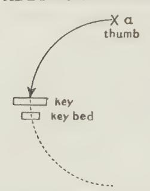

Fic. 1.—a, Tip of thumb raised off keyboard owing to the hand being turned up into its fully vertical position, with little finger resting on keyboard.

Moreover, it is clear that the same law must hold good in the action of any and every possible lever. Since a lever swings on a fulcrum, its "'business-end" is bound to describe part of an arc —or '"'oblique angle" as alleged! According to these authors' dicta, then, it would seem that all levers must be "unmechanical"' machines!

Levers, nevertheless, seem remarkably efficient! The reason is that their action is practically direct while actually doing work, a fact that seems to have escaped these scientists.

As a matter of fact, our end of the key-lever, being the free end of a lever, also swings in part of an arc — and moreover in an arc opposite to that of the finger actuating it! Thus roughly: —

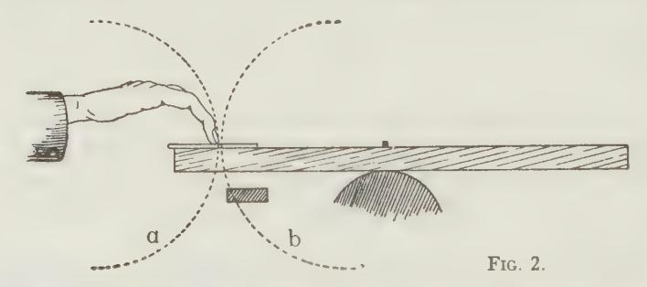

1 Possibly, if our finger-tips were not padded as they are, we might therefore experience a considerable degree of friction. Possibly also this partly accounts for the unpleasant experience of playing with dry fingers; or playing on celluloid keys. See also the Photos C 1, 2, 3, on page 35 of the Epitome.

Perhaps the following may serve to make this matter clear even to those least-gifted with mechanical insight: —

Consider the motion of one cog of a cog-wheel transmitting power to another, as shown in Fig. 3 below. While the cog moves down towards its position for doing work, it describes a whole quarter of a circle of movement. It, however, only begins to do work when it engages with the cog on the opposite, driven wheel.

Certainly, it moves at an "obtuse angle" (as our authors describe that motion) before doing work, but notice that while the cog is actually transmitting power to its neighbour, the motion is practically vertical and direct, so small and negligible is the curve during that solely effective moment. Thus:

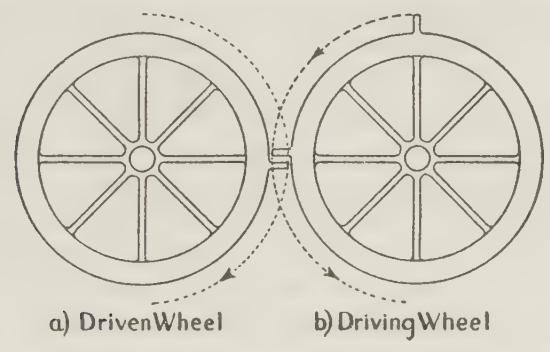

Fic. 3. — Showing the movement of one cog before and while doing work.

The action of your thumb, when helped by an actual rotatory movement of the Forearm, is identical with this; however large the preliminary distance travelled, and however large the portion of arc subtended, yet, while you are doing work with the key, the motion is quite comfortably vertical after all!

So it is to be hoped we shall hear no more of this absurdly unmechanical contention, that Rotatory movements (and actions) of the Forearm are in any way more ''unmechanical"' than are the Finger-actions themselves.

Finally, as to the assertion that the application of the Fore-

arm-rotation Element creates or induces "'ugly movements"? of the Elbow itself, etc., that is as wn-scientific a proposition as could well be imagined. Here, again, the Spectre of Movement is the misleading genie. How can a twisting and untwisting of the bones of the forearm cause a movement oF the Elbow itself? The folly of this you can easily prove for yourself; thus: —

Actually rotate the forearm freely, as in playing a tremolo by actual rotatory movements. Do it as violently as you like, yet the Elbow remains perfectly quiescent — provided you do your tremolo freely — as you should.'

Certainly, as I have pointed out in Chapter XIII, §/ 21, there are some artists who have accidentally acquired various forms of unnecessary movement, to which, afterwards, they attach importance.? Such movements are but harmless fads. They may even prove useful, by recalling the feeling of freedom associated with Right Doing. Such extraneous movements, however, have nothing to do with the actualities of touch; and imitation of them will assuredly mot lead to the wished-for results. Need it be pointed out that I have never anywhere advocated or countenanced such absurd, useless and unsightly movements? To lay them at my door cannot therefore be excused under the convenient terms of misunderstanding or misapprehension.°

As old as literature itself is the device of thinking to obtain

2 PACHMANN, for instance, for one season affected a tremolando on the depressed

key, averring that it improved his singing tone!

1 True, if you wear a loose sleeve, the rotatory vibration of the forearm may induce a flopping about of-part of that sleeve on your upper-arm. But no one, gifted with even a minimum of scientific investigatory power, should be misled by that into imagining that the upper-arm, under that sleeve, is also moving.

3 Moreover, after asserting that the teaching of Rotation is responsible for much ugliness of movement, these very same writers then gravely advocate precisely such (previously condemned) "'undulatory"" movements, as essentials of the Touch-actions! We are in fact expected to welcome these unnecessary movements as things of Beauty and Joy-for-ever, when advanced under new and fascinating titles, such as: '' The Coffee mill" — rotatory movements of the Elbow, "The Cater pillar" — up-and-down movements of the Wrist itself, and "The Pump" — up-and-down movements of the Shoulder. I leave it at that!

kudos by trying to find flaws in the teaching of the famous. And there are worse devices. One of these is to put false words into the victim's mouth, or false construction on what he actually has said, and then to demolish these false structures with a triumphant flourish of victorious superiority. This may be clever and ingenious — but it is not ''cricket."

But "the Proof of the pudding is in the Eating." Indeed, most bad finger-passage playing must probably be attributed to non-apprehension of the simple facts of Rotation as I have shown them to be. Thousands of players all the world over have been cured by having learnt to understand them. And as JoHN ADAMS, that great psychologist, has well said: —

"The ordinary person may lead a blameless life although unable to explain the true cause of error. For the teacher this is impossible. It is his business to understand the real causes of error and to be able to remove them!"

For a Piano teacher not to understand the true bearing of this ever-present (but invisible) Rotation-Element is therefore unpardonable!

## Additional Note No. IV

## ON BEAUTY AND UGLINESS IN PIANO TOUCH

The following, from my pen, appeared in "THE Music TEACHER" of March, 1931: —

The Braid-White experiments of the American Steel Institute, to which Mr. Ernest Newman has recently called attention in an admirable article, and which were described fully in The Music

Teacher, are of extreme significance to every pianist, whether amateur or professional. Incidentally they prove the folly of key hitting and "striking," and the reason of the loss of power by so doing. But with regard to the question of quality-differences, recently published letters show that the deductions made from these experiments may easily be erroneous and quite misleading. Hence, in the interests of the musical public, a little clearing of the air may not be amiss.

It seems to be mistakenly assumed that these experiments prove quality-differences to be impossible, whereas in point of fact they triumphantly prove their existence; and, moreover, show them to arise from differences in the upper-partials or harsher harmonics, precisely as insisted upon in The Act of Touch.

Pseudo-scientists in the past have always tried to persuade us, musicians, that variations in the degree of loudness were the only possible ones, and that we, who insisted we could hear variations in the quality (or timbre) of the tone were suffering from foolish hallucinations. That is all changed now, and the tables are turned on our would-be traducers, for science declares that our ears did not deceive us. The false assumptions were based on the fact that the hammer, during the last thirtysecond of an inch of its journey to the string, is thrown at it, and "therefore" only quantitative inflections were possible; quite overlooking the fact that the string has some say in the matter, and also that we are dealing with an elastic hammer-shank, which, when ill-used, may cause a raking of the hammer-head on the string, thus calling forth from it unparliamentary language! Other elements may also contribute — for instance, the key itself lies loosely on the key-frame and may jump.

That quality-differences are achievable by the act of touch your readers can easily prove for themselves by the two following experiments:

(1) Play a chord by a rigid rien forward of the whole arm upper-arm (or elbow) exerted forward, while the forearm is exerted downwards. It is analogous to delivering a knock-out

blow in boxing. It certainly tends to kill music — and incidentally the instrument.

(2) Now instead, play a chord with the upper-arm (or elbow) lax, while the forearm may nevertheless be exerted downwards, and you will find it practically impossible to achieve a nasty noise.

It is best in both cases to repeat the chord in a crescendo and with pedal down, so as to eliminate any suspicion of durational contrast.

To produce the well-sounding effect you must be careful to time the necessary finger-and-hand exertion accurately in cooperation with the arm condition. It must all be done before it is foo late in key-descent to have effect, and the tone must be attained by a proper acceleration during key-descent; in fact, an "'acceleration"' at geometrically increasing ratio — a law which applies in piano-touch just as much as in the case of every other exertion the object of which is to provoke Movement, such as rowing, tennis, golf or billiards. Give a jerk-action and you lose control and power, and at the piano it is the same — or worse.

These experiments should also be made on a "'hard"' hammered (bright toned) instrument. The very purpose of a soft hammer is to disguise in a measure the assaults of the tonally bad player, but it also largely deprives the sensitive player of colouring power.

Yet there is a fly in the ointment! These experiments also seem to prove that quality-differences can only arise along with quantity-differences; in fact, that every grade of tone-level also has its corresponding quality-inflection, so that harsh effects can only be attained by playing loudly enough, and that if we wish to avoid such, we must not go beyond a definite tone-amount.

But the experiments here are not at all convincing or final. Evidently the artists who experimented did play more harshly as they played louder; the records of the harmonics prove that. Yet that is no proof that other artists might not be able to show louder effects without so much harshness. Indeed, we find that

there are many artists who charm us with the beauty of their tone in singing passages, here producing their tone as in No. 2 experiment, whereas the moment they attempt anything beyond a forte (or even mf) they change over to the type of touch indicated in No. 1 experiment, and thus become strident, or give dull thuds, which form a libel on the instrument used. Indeed, many famous artists mar their performances by such misdoings — and knowledge on their part of the No. 2 type of touch would greatly enhance the pleasure we receive from them.

Whatever is ultimately found to be the full explanation of the effects we hear, it can make no difference to the teaching of touch.

If we misplay by using No. 1 type of touch, we shall certainly have comparatively little control over our tone-gradations, whereas with No. 2 type we can graduate the tone with perfect nicety down to an almost inaudible whisper — and consequently we thus have at our command a huge range of crescendo without reaching harshness. In fact, it is possible that the ultimate explanation may prove to be that with No. 2 type of Key-treatment, the whole range of tone, while ample, is given at a lower level, whereas with No. 1 it starts higher up in tone, and hence the tone has to be forced to create the desired contrasts.

The fact we have to realize is that if we act in one way the musical ear objects to the result as being ugly, whereas in the other way the result is acceptable.

The moral of all this is, whether you are merely a beginnerstudent or are one of the most famous of artists, at all costs avoid the forward-drive type of technique which so easily causes harshness and dull thuds and thus offends the susceptibilities of the musical ear.

We musicians, who love the beautiful in tone, can now work on unperturbed and even with more assurance than before. Or, if we belong to the order that subsists on musical mustard and cayenne, unalloyed, we also know how to ensure the ugliest possible effects.

The Ugly is very easy of attainment. It is the difficulty to

ON BEAUTY AND UGLINESS IN PIANO TOUCH 139 attain beauty and subtlety that has called forth the adage: "Art is long and Life is short."

No, quality-distinctions are not an illusion of the eye; they are often only too real—as Ear-pain! To master the No. 2 form of tone-making in forte is, therefore, the gate towards musical playing. Remember, you can still retain perfect mastery over tone-inflection when playing forte, so long as you leave your upper arm (and elbow) free when you have to add the necessary downexertion of the forearm; and that it is then almost impossible for you to make a really nasty noise.1\_ Whatever the ultimate explanation of the effect, you will thus play your forte and fortissimo with a full, pleasant tone, even on a hard-hammered Piano, and it will actually sound REALLY louder than with the forced variety! And although your tone will not sound noisy close up (just as in the case of a badly produced voice), it will carry well, will "fill" the concert-hall with a large volume of sound, and will make the instrument sound at its best and not at its worst and dullest, and twangiest! Nomenclature signifies no more here than anywhere else. It does not matter in the least whether you accept the beautiful effect as representing 'good quality" of sound, or whether you call it "un-forced," or "unloud," or "XYZ" tone, the fact is that you will fail to reach the full height, musically, of which you might be capable, unless you have mastered these facts!

1 Refer to No. III of the four optional forms of arm-use, p. 35, Chapter V.

## Additional Note No. V

## EFFECTIVE AND INEFFECTIVE FINGER-WORK

It is often mistakenly assumed that Finger-passages, to be effective, must be very loud.1 There is no greater mistake! Indeed, for BEETHOVEN passages, a certain degree of tone and ruggedness is often requisite — and plenty of legato also. But effectiveness does not depend on the quantity of tone. It really depends on good, true ''finger-individualization." Now this implies in the first instance the accurate timing of each action that is, the accurate foreseeing of each note's due musical place; and secondly, the physical timing of the tone-producing action itself — the separate timing of the hand and forearm-rotational impulses along with the finger, so that the work shall be completed early enough during Key-descent.

Therefore the ability to play successful finger-passages mainly depends on such accuracy in timing, since the forces used are else wasted on the beds under the keys, as indeed they so often are by the inexpert.? Hence, also, the utility of practising all passages staccatissimo.

Ultimately, however, the effectiveness of passage-work depends on the degree of Musical Purpose felt with every key used. The artisan (we will not say ''artist"'!) who strums through his passages automatically, just like a Pianola — however loudly and quickly he does so — has no real chance of artistic life nowadays against the true artist, whose whole soul is concerned in making beautiful and significant the succession of notes he employs. True, when you are condemned to play on a softhammered instrument, you may be sorely tempted to force your way through the felts in order to obtain some brilliance and

1 See Additional Note, No. XVII, "On Strong v. Weak Fingers."

\* There are some gifted with Samson-like muscles, however, who can nimbly get over the ground and play quite loudly in spite of much wrong-doing in this respect!

colour; but the best remedy in such predicament is, not to behave like a bad artist, but instead, to refuse to play on an abomination to which the makers are compelled to resort as a protection against Piano-smashers and Non-artists.!

## Additional Note No. VI

## PIANOLA VERSUS HUMAN PASSAGE-WORK

#### The Pianola and the Pianist

Mr. Ernest Newman, in an article in a Sunday Times of October, 1929, pleaded for q revival of the Pianola, and the following letter from me which he published on October 27 under the heading '""Mr. Marruay Repties," explains itself: —

Sir, Mr. Ernest Newman has written a stirring article in your last issue. We must all thank him for "giving us furiously to think"' but we pianists and teachers must be allowed to protest against some of his dicta.

He asserts that it takes years of "'leathering away at exercises" before you can play notes in rapid succession by hand, whereas, with the Pianola you can achieve this at once and at any speed.

All depends here on what we accept as worthy of the name of 'playing'? — that is the crux of the matter.

Now, the great charm and fascination of a Chopin passage, for instance, lies in the fact that you can with your fingers inflect each and every note you play as to Tone, Duration, and Time. It is this individualization of sounds which renders a

1 Indeed, if you have an arm like a blacksmith's you can drive your way through the softest hammer — incidentally, ruining its purpose. But every Piano-maker, who knows his vocation, will nevertheless be willing to provide the hard Hammer (with its full range of colour) for every true artist whom he can trust not to misrepresent his instrument.

The next Note on "Pianola v. Human Passage-work"' confirms this one.

passage played by the musical player so infinitely more interesting than when strummed through by the Unmusical and Unthinking.

Some years ago I attended a lecture, with musical illustrations on the Pianola. I had anticipated that the rapid passage-work might perhaps sound almost as well as when played by hand; but that the true failure would arise in the slow movements. It was quite the reverse! In the slow movements the operator had time to alter tone, duration and time from note to note. The result was not altogether unpleasant — but it most obviously needed highly skilled use of the levers and bellows, which must have cost the operator much "'leathering"' at the Pianola, and training as a musician. When, however, he came to a Chopin G flat study the effect was utterly boring —a total burlesque of Music. The succession of the notes was here far too quick to admit of any lever manipulation for each individual note, and only mass-production effects were available, hence the irritating dullness of the result.

Clearly, then, it is infinitely more difficult to render a passage musically acceptable through the Pianola than by hand. Therefore, the quickest and only way to learn to use the keyboard is patiently to acquire the use of your own fingers, hand and arm, and Mind, if you honestly wish to make Music. This does not nowadays imply ''leathering away at exercises" — wrongly for years! No doubt that was so in Mr. Newman's youth. Nowadays, however, a child is at once put straight on the right road, and if musical can achieve fluency and musicality in rapid passages without any of the drudgery Mr. Newman deplores, and is directly shown through the practice of actual music how to use the Piano as a musical instrument — and not as a typing machine.

While inserting my letter, Mr. Newman made further comments on the subject, and I sent the following letter, which, however, he did not insert; but in fact dropped the subject: —

October 31, 1929.

Dear Mr. Newman,

Thank you for inserting my letter. In your comments thereon you remark:

"Some of the excellencies" in hand playing may be "purely imaginary." "The player fancies he is doing all sorts of wonderful things that exist only in his will and wish to do them; they do not materialize for the listener."

I quite agree there is some truth in this, but the whole truth is not quite as you put it. Pianists, certainly, sometimes do things which do not ''come over.'' For instance, I have seen players lift themselves off their seats in frantic endeavours to make \_ tone — wrongly! The fact, moreover, is, that a really musical and subtle player often uses inflections so delicate that they escape some listeners, simply because their ears (and minds) are too dull to notice them, and the message goes over their heads. Indeed, ''it takes a genius to appreciate a genius" fully; and it takes the really musical to appreciate musical playing to the full.

These divergencies of ear, or lack of it, no doubt largely account for those extreme divergencies of opinion where really musical players are concerned.

I fear that Pianola practice will hardly help to sharpen the ear in these respects.!

*Cordially yours, Tobias Matthay*

1 I might have added: In fact, we know of cases where most delicately musical artists have received apparently spiteful criticisms in London papers and have actually been accused of "lack of colouring"! Whereas, the critic may have been quite honest, but too dull-eared to hear the delicate nuances by which the player aroused his more musical listeners to ecstasy. One of these dullards advised Casats (after a wonderful performance of a Bach Concerto) not to "waste his time over such mechanical stuff" !

## Additional Note No. VIT

## REPRODUCED VERSUS SELF-PRODUCED MUSIC

"The Man and the Machine," and the Future of Piano Teaching

This article appeared in the Daily Telegraph of Jan. 4, 1930. It explains itself: —

WHEN the pianola first appeared on the scene many piano teachers foresaw therein the doom of their profession, but it proved to be a false alarm. There is, however, a real menace at present. The gramophone and wireless have come to stay.

True, so far, reproduction gives but a faint semblance of actual performance, and the pianoforte comes off worst of all. Colouring has to be whittled down at both ends. The engineer has to cut down the fortes to prevent "'blasting,"' and he has to heighten the delicate nuances or nothing comes through. So we receive but a pale reproduction of a real performance, and the fine subile artist's doings are reduced to pale shadows, and he seems little better than his quite ordinary fellows.

#### The Real Menace.

But it is safe to predict that the microphone will yet be immensely improved, and that it will in the end give us equal definition of the lowest bass as of the highest treble, and will adjust itself to all extremes of tone-gradation.

The real menace, however, does not lie in the wireless and gramophone reproduction itself, however perfected it may be. The danger is in the very likely misinterpretation of the whole situation by the layman. He may ask why, as a few bits of wire and a crystal (or valve) or a clock and a whirl-table give him quite a considerable degree of musical delectation in the

home, he should spend money on educating his children to give performances far less adequate than those so conveniently provided.

This will seem an irrefutable argument, and he may, therefore, in ignorance, condemn his children to forego one of the greatest joys of existence — self-expression musically. Indeed, it is a great happiness to listen to good music adequately performed, but it is not the same joy as that of personal music-making, however humble the effort; and personal creation, artistically, is an inextinguishable impulse in the human breast.

The woodcut, the lithograph, and the etching have not extinguished painting, and the layman cheerfully pays school fees for lessons in drawing and painting, in spite of the far better pictures on his walls, or even in his newspaper, than any his children can achieve. Witnessing a tennis tournament of the greatest players does not give one the same joy as one's own miserable attempts. The splendid results achieved by our camera do not compare with our own perhaps very crude sketching attempts. The supreme artistry of a Pavlova and Karsavina do not deter papa from spending money on dancing lessons.

Moreover, learning to make music (on the right lines) is a very potent form of general education, far more potent than has so far been conceded by educationists, although the pendulum has indeed begun to swing in the right direction, and music is now officially recognized as a school subject even in our country.

Music-making —I do not mean strumming — indeed always demands such keen attention rhythmically that it forms a most direct means of realizing what is meant by Concentration of Mind, which is fundamentally a rhythmical act; even granting that we must learn to re-apply this act for each distinct subject, as some psychologists contend. To quote from a psychology lecture of my own: —

"Tt seems to me that to make him learn to perceive the beautiful through sound is a far more direct way of educating the individual (in the true sense of that word) than, for instance, by making him automatically repeat yards and miles of words, formulas and phrases, an unthinking repetition of which cannot seriously be expected to better him one jot as a sentient human being, or to bring him into closer touch with the Universe."

#### Music and Education.

"This last point should, indeed, be insisted upon by musicians, for there still is a tendency among education-authorities to belittle the truly practical utility of our art as a direct form of education. Indeed, they fail to realize what a very strong factor the pursuit of every art, and our own art particularly, can be in bettering the life of the race."'

Seen from the right angle there is every reason, then, why the lay mind should not condemn the child to non-participation in personal music-making, and it is, indeed, the urgent duty of every music teacher to insist on these facts, and thus help to save Music and his profession from a possible temporary partial eclipse.

I emphasized the same points in my Annual Speech on our Prize Day at Queen's Hall, in July, 1930, and a reprint of part of this follows, as Note No. VIII. I am also glad to find that in America a strong propaganda is being carried on with the same purpose in view, under the auspices of Harold Bauer and others.

## Additional Note No. VIIT

## A PLEA FOR MUSIC-MAKING

The following is an excerpt from rny Queen's Hall Speech at the Annual Prize-distribution and Concert of July, 1930. After alluding to the continued success of the School, I spoke as follows: —

While all this is most cheering, there is, however, another side to which I feel it is urgent I should allude, and which "gives one to think."

For the first time in the history of this School — and this year IT HAS REACHED ITS TWENTY-FIFTH BIRTHDAY — a quarter of a century of existence — for the first time the ANNUAL IN-CREASE in the total studentship has ceased; and, in fact, we have to confess to an actual slight drop in our numbers. Such set-back, however, is the experience of every music school in the country at this moment, and I fear others are worse off than we are. It is also the same tale all over Europe, and even from America we hear that 273% of the musicians there are out of work!

These are signs that cause the gravest anxiety to us, leaders of the profession here, and elsewhere. It is not wise to bury our heads in the sand, and try to ignore them. These hard facts must be bravely faced, and, if possible, they must be modified by the efforts of all of us who profess to be TRUE LOVERS OF MUSIC.

Music, indeed, is at the parting of the ways. One of these may lead to greater appreciation of the great potentialities of music, while the other may lead to the most disastrous consequences, and may even endanger the very existence of the Art of Music in the future. Depression of trade, high taxation, the Wall Street and Hatry episodes, and the motor-car have contributed, but these may all prove to be but passing phases. The real menace, however, comes from the Rapio and the GRAmo-PHONE. Here, on the one side, it is clear that knowledge of the literature of music is, at the moment, being enormously furthered by these agencies. But, on the other hand, unless we look clearly ahead, and act (all of us), we may presently find the door to musical progress closed. At best, the pale effects inevitable with a mechanical diaphragm are no more like the emotional effects of true, real, musical performance than are lithographic reproductions like real paintings. The public perfectly

well understands the difference here — and the lithograph serves but as a stimulus to induce us to make the effort to see the original masterpiece.

The case with Music, however, is different. For the public MAY easily BE MISLED. Many may fancy that the real thing HAS been experienced, when, after all, but a faint semblance of Music has been presented. And however charming a record may be at first hearing, repetition of it soon palls, since nothing new is being said. It is, therefore, every music-lover's bounden duty to insist on the fact that actual performance is a vastly more rousing experience, emotionally, than ever can be obtained from the best of loud speakers or earphones, else the layman may imagine he has heard all that music has had to offer him — when he has become BORED by the mass of feeble music-imitations and mechanical repetitions he has heard at his own fireside.

Moreover, there is the fact TO INSIST UPON, that Self-expression, however tentative and inadequate, is a vastly greater influence zsthetically, educationally and morally, than ever can be mere listening, even the listening to real performances. Here it is not possible to overestimate the extreme value of personal musical striving in any scheme of general education as a fine direct mental discipline, and as an opening-up of the mind to things Beautiful.

I therefore plead that every child should be given the advantage of music-instruction in some form or other of actual performance, as part of every school curriculum.

Public opinion must be roused, and must force our Education Boards and Councils to recognize Music as a truly serious means of education. 'True, something already has been done — but in wide-awake America more has been done. Why not here? Surely the serious cultivation of Music will tend to make better and happier citizens of our children, the grown-ups of the future, and the Wireless and the Gramophone will then indeed help instead of hinder Music — and civilization.

Such words coming from the Principal of a thriving Music School may seem somewhat discouraging. Discouragement, however, is far from my intention. I am still an optimist! I firmly believe in the future of Music. In fact, there will always be a large section of the public that will insist upon personal selfexpression through Music, and this public will indeed need the help both of the performer and teacher — so there is still hope for our profession! And there is always ROOM AT THE TOP.

After this \$.0.S. to save Music, I need add but a few words of appeal for our STUDENTS' Aip Funp. Without an interpreter Music ever remains dumb. The average person cannot read a score as he reads a book, and never will. The perpetuation of Music therefore immediately depends on the pursuit of it By PERSONS OF TALENT, etc.

## Additional Note No. [X

## THE DISTINCTION BETWEEN THE VISIBLE AND INVISIBLE IN PIANO PLAYING

The following, which appeared in The Music Teacher of April, 1929, fully explains itself: —

I have followed with much interest the admirable articles of Mr. A. C. and am thoroughly in sympathy with them; therefore I am sorry that I must ask you to allow me to correct a misquotation he has inadvertently made. It is, however, a point on which there has been much non-apprehension in the past, and still appears to be, if one may judge from the errors perpetrated in recent piratical publications. Hence in the interest of your readers it would seem desirable for me to make this correction.

Mr. C. quotes me as speaking of "'First species (or Finger-

touch)," "Second species (ov Hand-touch)," and '"'Third species (or Arm-touch)," etc.; and emphasizes this mistaken '"'or"' by suggesting I should have catalogued Rotatory movements as a "Fourth species" of touch! Now I have never written anything so confusing and contradictory! On the contrary, from the very beginning, I have tried my best to prevent my readers from confusing these two quite distinct facts — the Visible movements of the limb with the Invisible actions of the limb. Indeed I wrote an extra chapter in my "Commentaries" and in '"'Relaxation Studies" in order to make this matter clear. To confuse these two distinct sets of facts as so often done, is just as absurd as to imagine that the wheels by the use of which a car is propelled are the source of the motive-power! We see ''the wheels go round," but it is the Aidden engine which does the work. We cannot be good chauffeurs unless the engine has no mysteries for us! I feel sure Mr. C. has not made this mistake, but his misquotation or misstatement may mislead others.

#### Old-fashioned Teaching.

In the old days musicians only recognized "'legato and staccato touches"' and "'finger, wrist and arm touches" while they completely ignored the action of the engine! That is precisely what I essayed to set right in The Act of Touch. But, for obvious reasons, I had to retain the "finger, hand and arm-touch" nomenclature to denote the already recognized three main forms of visible movement which may accompany the act of toneproduction. ''Touch" is the generic term covering the whole ground, whereas ''finger, hand and arm touch"' refers solely to the particular kind of movement manifested. Therefore I had to invent the term "Species of Touch" in order to classify the three broad distinctions of muscular combination (action and inaction of limb) which provide the key-moving energy and are therefore the true cause of the effects — the "'engine"' in fact! Broadly speaking this engine-action may take the following forms: (1) You may have Arm-touch, that is, visible arm-

movement. This is bound to imply for each movement and sound a change in the condition (or state) of the upholding or down-pulling muscles of the arm itself to allow of the movement, and, combined with this, invisible exertions of the finger and hand are necessary. Or (2) you may have Hand-touch — that is, visible hand movement. This necessarily implies change in the actuating muscles of the hand, and the finger-exertion in conjunction therewith, although these changes again remain invisible. Moreover, when the hand itself thus moves and is exerted in the act of tone-production, you have the choice of two conditions: either (a) no change in the poised condition of the arm (which implies no change in the sustaining muscles of the arm), or (b) you may allow the weight of the arm (whole arm or forearm, etc.) to take effect along with the invisible finger and hand exertion, and the actual movement of the hand itself. In short, "'hand' touch may consist either of ''second or third species" of touchconstruction, state or constitution — call it what you like.

#### Finger-Touch.

Finally, coming to so-called ''Finger-Touch" (that is, visible movement of the finger itself), you here have all three "species" of touch-constitution available. This means that, when you employ finger-movement, this may consist either solely of an exertion of the finger itself (''first species') or you may add thereto an invisible exertion of the hand (''second species''), or finally you may add thereto an invisible arm-basis, in its several available ways. Yet all these three totally diverse forms of action (or "'species'') here come under the heading of so- 'called ''Finger-touch," because only the finger is seen to move.

Moreover, Arm-basis in the production of tone may itself be one of four distinct kinds: you may either (a) allow the weight of the whole arm (visibly or invisibly) to help during the act of tone-production; or (b) the weight of the forearm only; or (c) you may combine with the full relaxation of the upper-arm a down-exertion of the forearm (both invisible) to enable you

to produce your fullest forte without harshness; or finally (d) you may instead invisibly drive forward with the upper arm while giving this down-exertion of the forearm. This last combination is, however, sure to produce a viciously hard tone in fortes, and should never be used except quite gently, for light, "dry" effects. If you are fond of nomenclature these four forms of arm-help (during the act of touch) might be classified as four "sub-species."'

There is also to be considered that constant condition of the arm in between the successive tone-producing acts, in its nicely poised or balanced condition, which enables you lightly to remain in contact with the keyboard, and forms the physical basis of phrasing; it also forms the basis of 'Arm-vibration touch" (used for most finger passages), a hybrid between second and third species.

#### Forearm Rotation.

Finally, along with all this, whatever the "species" of the forms of touch, and also whatever the Movements of touch, you must correctly employ the most important element of all, that is, the Forearm Rotative Element which applies everywhere, although mostly zmvisible, because not necessarily accompanied by any actual visible rotatory movement. For you cannot provide either finger, hand or arm-movement, or any kind or "species" of tone-production without the intervention of this twisting or untwisting function of the forearm -— changes or repetition of action or inaction as the case may be — but required for every note you play, if you wish to play as easily as you can, and not as difficult-ly as you can! Now this Rotation-element, although usually hidden from observation, may also sometimes be allowed to display itself in actual rotative movements. As, however, this Forearm-rotatory element is necessarily implied in all forms of movement as well as in all forms of ''touch-species" (touchconstruction) it cannot also be considered to be .a separate "Fourth species,' as Mr. C. suggests—-a Rotation-Species of

touch! That would be like speaking of three different ''species"' of bird, such as the Eagle, Dove and Sparrow, and then speak of "bird"' as a '"'fourth species"'!

#### ""Rotation-Touch."

But I fully agree with him when he urges that we should adopt the term "Rotation-Touch"" when we accompany the usually invisible rotative changes and repetitions with actual movements. Indeed, I suggested this nomenclature twenty-five years ago in my Act of Touch, p. 189, section 32. Evidently he overlooked this! Here is the passage: —

"Production of tone may be accompanied by aun actual tilting cr rolling movement of the hard in connection with a partial rotation of the forearm. These adjustments of the forearm, at other times invisible, are here rendered visible. Such movement has been termed 'sidestroke' by some of the German teachers. A far less objectionable term for this variety of movement is, however, found in ' Forearm-Rotation-Touch,' which, while describing it more accurately, also eliminates the word 'stroke' — so misleading when applied to any form of Touch."

#### A Summary.

A little Summary of all this seems desirable here. The forms of visible Movement available are: —

Finger, Hand and Arm Touch, and the last may be either whole-arm movement, Forearm movement or Forearm-rotatory movement.

The forms of invisible Touch-Construction or "species"' available during the moment of Tone-production are: —

- (1) Finger exertion only, with loose-lying hand and poised arm.
- (2) Hand exertion added to the Finger exertion and poised arm.

(3) Arm-basis along with Finger- and Hand-exertion. This arm-basis may either be Whole-arm-weight, or Forearm-weight, or Forearm down-force along with free upper arm; or lastly (and to be avoided as much as possible!) Upper-arm forced forward along with the down-forced Forearm.

Moreover, our poised arm (a more or less fully supported arm) is required im between the sounding of all notes whether in legato or staccato; and, finally:

The Forearm-rotation Element is universally required in all forms of Touch, always has been and ever will be.

Meanwhile remember, in learning these necessary things, that the purpose must ever be: the making of Music.

# Additional Note No. X

## THE "PURE FINGER-WORK" MYTH

Some lamentations heard in the London Press, etc. (even recently) over the absence of "' Pure Finger-touch" in "our modern playing"' would be amusing, were it not so tragic — for it shows such complacent and abysmal ignorance of the most elementary fundamentals of all technique, past and present. This superstition as to 'Pure Finger-Work"' is caused by the persistence of the old notion that in MOVEMENT one could find the explanation of our touch-effects. The finger or the hand was seen to move and it was straightaway assumed that the cause of touch had thus fully manifested itself. Whereas, as I have proved all along, Movement is no evidence whatever that the touch-processes are right or wrong. This obsession is caused by lack of apprehension that Finger-movements may nevertheless entail the invisible use of the full weight of the arm, etc., forearm-rotation and hand-exertion, although all supplied quite invisibly.

There never has been any such thing as "pure finger-touch," as thus ignorantly alleged. No passage can ever have been played on any keyboard without the intervention at least of the Forearm-rotational element along with the finger. ''First species" (with its light finger-force only, in conjunction with Rotational stresses) may possibly have served well enough on the Clavichord; but, since the arrival of the " Hammerklavier," to try to play a cantabile with "First species" would be just as foolish, and worse, than trying to play a Double-bass with a Violin bow! When you really use finger-exertion (by its "small" muscles only) for each note without individualized actions of the hand, that indeed forms a true "' First Species" of touch —rarely however applicable. Yet, even this demands the help of Forearm-rotation, like every other touch-form, and it needs, besides, the arm in its continuously poised condition. In no form of touch, therefore, can the hand and arm be said to be "'absent." Thus, with "First Species," along with the Forearm-rotationalelement and poised arm, you have individualized actions solely of the finger — with loose-lying hand; while in "Second Species" individualized (reiterated) exertions of the hand are added for each note; and for ''Third Species" individualized down-stresses from the Whole-arm or Forearm.

&quot;Pure-finger-touch"' is therefore a Pure Myth.'

1 See also the previous Note, "On the Visible and Invisible in Piano-playing."'

## Additional Note No. XI

## USEFUL VERSUS USELESS ANATOMY TEACHING

The Futility of Anatomically-directed Pedagogics

A reiterated warning is perhaps here necessary, since anatomical teaching can be useful and is indeed necessary in some directions, whereas in others it is not only useless, but can be positively harmful to the student. In fact, the demon of Nomenclature has once again tried to raise its head.

To comprehend the playing-actions (his physical equipment) the student certainly needs some (but quite elementary) knowledge of the mechanics of his own limbs — some "skeletal" knowledge; he needs some understanding of the actions, reactions and interactions of the set of levers which form his playing outfit—the upper-arm, forearm, hand and finger levers. Also, he must have some common-sense understanding of their muscular endowment; he must understand that to produce a movement, or, what is more important, an exertion of one of these "'living levers," he must call into activity the attached muscles. Itis well also to understand that for every direction in which he can thus actwate any of these levers, they are also endowed with muscles that have the opposite, or 'antagonistic, " effect, and that if he allows both of these to act simultaneously, then the resulting invisible tug-of-war will necessarily create stiffness, with all its disabling effects. Also, it is helpful to know that we have a dual muscular equipment for most actions, 2.e., strong muscles and weak muscles for the same action. It is also well to recognize the fact that the actuating muscles of a limb (or portion of a limb) are mostly lécated on the next portion since by his being able to notice the sensation of tension across a joint, he can learn both to avoid the unrequired stresses, and to provide the right ones.

But beyond this, Anatomy cannot help the student, but may indeed hamper him, since any attempt to "think" the required actions in terms of individual muscles will only lead to confusion of mind, and will distract his attention from where it is urgently needed — and that is: on imb-action, purposed to move the key for the sake of an intended Musical Effect. Excepting then the broad and general principles enunciated, any further detailed anatomical knowledge can be of little service to the student, even were it attainable. As a matter of fact, however, accuracy in this respect is unattainable, owing to the practical difficulties in the way. 'True, by dissection we can discover which are the main muscles attached to the various portions of our playing-limb, but dissection cannot tell us exactly how and where we must use them in playing. Experiments, on the other hand, made on the living body, are not only unreliable and misleading, but are often even impossible to attempt. Mechanical tests of the tension or laxity of muscles and tendons during the actual performance of a sufficiently competent artist suffer from the grave disadvantage and uncertainty that the player is quite unlikely to "be himself" under such ordeal, and is instead likely to become more or less selfconscious and tense, and to do quite unusual things muscularly at the critical moment. Moreover, it is manifestly impossible to test the more deep-seated muscles in the living subject by calipers or other machines. And again, most of the apparently quite simple actions are in reality quite complex in the muscular co-ordinations required, and therefore far too brain-reelingly complex to calculate, or to direct as separate muscular impulses, even if we could know exactly what they are, and could directly influence muscles into action — neither of which is possible to us!

Thus, in the end, the anatomical method can only offer us vague conjecture (instead of the supposed certainty) as to what really does happen in many of the actions of actual playing.

Finally, even were such analysis not impossible, it would yet be useless and quite futile for the simple (but quite final) reason

that it is physiologically and psychologically impossible for us directly to prompt, influence, or stimulate any muscle into action by any exertion of our will, however concentrated our attention.

Muscles will only consent to spring into action in response to our desire for a particular limb-exertion or limb-movement. All we can do is earnestly to will and time the exertion or movement of the limb, or portion of it, by recalling the accompanying sensations, and the suitable muscles may then spring into responsive activity. To think of the particular muscle is futile!?

In a recently published book, however, great stress is laid on the utility of knowledge of the precise locality and anatomical names of the muscles concerned, and it is copiously illustrated with more or less accurate diagrams and pictures of the dissected arm, hand and finger — reproduced from Anatomy-primers. It is mistakenly assumed that the pupil will thus be able at will to call up any required muscle. We see, however, that all this is based on fallacy, for, as already stated, it is physically impossible to call any muscle directly into action; and let me repeat it, the only way to call any muscle into action, the only way to obtain its help, is to wil] the required action of the limb to which it is attached — and at the Piano to time this wish accurately with the Key.

For instance, we may be inclined to smile at what seems to be this author's impossible proposition, but we cannot summon up the faintest smile by trying to influence our facial muscles directly; the only way to call up that smile is either to think of the required facial expression, or, better still, to try to see the humorous side of the proposition before us— and the needed muscles will obediently line-up!

Or, as another instance, supposing I wish to sound a note at the Piano with my middle finger, it is folly to say to the bits of

1 This holds good even in the case of our being startled, when all our muscles may become more or less tense. This tenseness occurs in response to our S.O.S., our call for preparedness, for self-defence; we instinctively then call upon all our limbs to be ready for attack, and all the muscles again respond to the indirect stimulus.

flesh on my forearm and inside my hand, "Here, John and Jane (and other helpers), look alive and be busy and give that middle finger a pull inwards"! Try it, yourself, by calling upon them by their pet anatomical names, yet nothing will happen! Or, if the foolish attempt to influence them in this way is persisted in, probably "Thomas and Emily, and James and Kitty" and all the rest of the family may indirectly be roused up and called into undesirable activity, and you will find your whole arm, and whole body perhaps, become stiff and set, including perhaps your jaw and your toes! No, to obtain definite muscular response, the only way is vividly to recall the precise sensation of the particular émb-activity needed — of the required invisible stress, or exertion, or the required viszble movement, and unconsciously our automatic centres will then call up the right muscles to act — if we have been good limb-teachers! It is only by experiment that we can acquire such automatic response, and thus acquire remembrance of the right or wrong limb-sensations. Moreover, pedagogically, the point is to guide these experiments into the right channels by knowledge of what is required not of our individual muscles (which we cannot guide) but of our limbs, so that our efforts may not be wasted in wrong directions.

It is also claimed that this (misplaced) reliance on anatomical names and places is more "scientific" than my own "Act of Touch"! This, however, is again a delusion; my work should have been read a little more attentively!

To be '"'scientific" signifies to be in accord with attainable Truth. Whereas, to try to bring the student's mind upon the names and addresses of muscles is a totally wrong road by which to achieve Limb-control — and therefore un-scientific! Moreover, the attempt is again made to analyse the touch-actions from outside, as so often done before. Therefore, any work thus based on such pedagogic fallacies, so far from having achieved any hoped-for "scientific" status, must be pronounced to be sadly lacking in this respect!

It has lately been suggested that candidates for professional

Diplomas should be expected to possess this useless and misleading knowledge of muscular Names and Places!

Anything more retrograde could not well be imagined. It would only be a case of ''Eye-wash."" Even when a medical practitioner is inclined to dally with anatomical language, we generally begin to suspect his ability.

Coming now to a more recent book, that of Otto Ortmann, which has appeared while this one was preparing for Press, this is on a different plane altogether. Here we have honest research by means of patient and painstaking experiments — laboratory experiments — and it is delightful to find so many corroborations of what was already said in ''The Act of Touch." But here again, far too much reliance seems to have been placed on Touchanalysis from without, analysis based on the visible movements, instead of analysis from inside — through the sensations experienced during right doing. Far too much importance is also again attached to knowledge of the precise locality of the muscles employed, which, while thoroughly interesting, is, as we see, of little avail to teacher and learner. No one would claim that such unpractical knowledge would benefit the Golfer, Cricketer, Tennis or Billiard player. Whence then this obsession that it can help the Pianist? It is with regret that one cannot at all agree with some of the deductions he makes from these admirable experiments. Finally, granted, that such anatomical knowledge may be quite interesting (although useless in practical application) and that all knowledge is certainly entrancing and mind-awakening, and we have also seen that some broad facts of anatomy may be helpful — yet to imagine that a glib knowledge of the precise locality of his muscles can help the Piano-student to use his muscles and keys rightly, is just as hopeless as to suppose that he could be helped therein by an intimate knowledge, say, of the habits and names of Flowers, or a knowledge (very far-off knowledge indeed!) of the stars in the vastness of the night skies.

During the years I was engaged upon my "Act of Touch," being of German descent, I was therefore naturally bent on being "'recht griindlich" as to my facts; I, also, for a time was misled into the anatomical field. Consequently I misspent (?) a good deal of time trying to master, anyway, our part of Anatomy; and was well abetted therein by my late brother-in-law, Dr. CHARLES KENNEDY, of Edinburgh, an excellent anatomist. When, however, it dawned upon me that it was impossible to obtain any muscular response by directing one's attention upon the concerned muscle, I had the common-sense to throw all this overboard, and to delete unnecessary encumbrances from my pages, voluminous though my work had to be in those dark ages of Pianistic ignorance! I therefore restricted myself on this point to about one single page (p. 148 of " The Act of Touch'') devoted to rudimentary facts, and that single page is ample for the aspiring Pianist!

## Additional Note No. XII

## ON KEY-BEDDING

The following, which appeared in the London Musical Times of Feb. 1, 1931, explains itself: —

Str, — May I, in the public interest, correct a misstatement in your last issue?

Your correspondent, ....... , asserts there are two kinds of ""key-bedding."' There are not. AsI invented the term twentyeight years ago for my "Act of Touch" I suppose I have the best right to its definition! It was invented to denote that most pernicious of all faults — which has killed so much music-making and so many pianists — the fault of applying the muscular impulse intended to produce a tone too lute during key-descent to effect its purpose. It denotes misapplication upon the key-beds of the force intended to produce key-movement — obviously a purely

mechanical fact. Whether the muscular co-ordinations employed at the moment would serve to produce a tone pleasant to the ear, or a tone of that extreme stridency apparently enjoyed by some modern writers and players, has nothing to do with the matter. If the tone-making impulse, good or bad, is misplaced on the key-beds the tonal result is bound to be /ess in amount than that intended, and therefore cannot accurately represent the performer's musical intention.

Ef eal ae: chooses to direct her pupils to "press deeply into the key-beds,"' "past them," or "down to the floor," that is her lookout; it does not alter the meaning of the term "Keybedding."

## Additional Note No. XIII

## BENT AND FLAT FINGER — An amplification

In the old days "Position" was the All-god of every Piano "Method." It was the only thing that seemed to matter, and nothing else was ever thought of, except the mandate '' Never, oh, never, move the arm!" Hence full reliance was\*placed on pictures of the "well-arched"' hand, with '"'well-curved fingers," and all was thought to be well and safe if left "to instinct and inspiration."' Later on, Movement became the idol. Nevertheless, as we have seen, reliance on either of these fetishes forms no guarantee whatever that those invisible changes of limbcondition will be fulfilled which form the Cause of right-doing, muscularly.

The terms "bent" and "flat" finger, used in the past, prove however that there was, even then, some vague notion of the distinction between the "thrusting" and ''clinging'"' actions of the finger.'

Perhaps it would have been better to adopt instead of these terms the more embracing one: the Unfolding and Infolding finger-action, since the finger must either "unfold" or "infold" during the act of touch. But it seems difficult to dislodge a term once it has come to be accepted.

Moreover, as insisted upon earlier, the Position of the finger on the keyboard with key down, gives no indication as to which of the two has been applied. Thus the bent (incurved) position of the finger can be reached both during thrusting and clinging touches.

Conversely, we may reach a quite "flat" position with key down, and yet may have been applying that nasty, vicious upper-arm forward-thrust or dig (with forearm down-exertion) which we should strictly avoid, except in rare cases.

The difference is, that with "bent" finger, we must start with a fully-bent position, the finger opening out towards and with the key; whereas with "'flat" finger we may start with the finger more or less fully straightened out, and may then curve it inwards — more or less — during the subsequent journey towards and with the key. The final Position may therefore be precisely the same in both cases. See photos on page 35 of the Epitome.

Thus it is again proved that reliance on the outside trappings of touch (Movement and Position) must be relegated to oblivion as one of those primitive superstitions which have done so much in the past to impede progress pianistically. As I have shown before (Chapter XIII), the position of the finger and hand must necessarily adapt itself to the actual size and conformation of one's hand, since the keyboard is an inflexible quantity. The large hand is therefore compelled to be more arched than a small hand hardly able to stretch an octave.

"Piano-Tutors," in the past, were apparently always written

1 As we know, Chopin is reported often to have mystified his pupils by using a "flat finger."

by large men! And it is amusing to find a more recent one, evidently written by the possessor of a medium-sized hand, therefore recommending a far more flat position of the knuckles as being ''more modern"'!

# Additional Note No. XIV

## THE THREE "LIVING LEVERS"

The following appeared in the Musical Times of July 1,1924: —

Sir, Dr. R. asserts that my Act of Touch is criticizable, and then proceeds to fill a page of your valuable space with quibbles supposed to prove that in two instances my Terminology is wrong!

The Act of Touch was published just a quarter of a century ago. It may be a satisfaction to Dr. R. to know that I, myself, have adversely criticized its Terminology ever siice but the facts have remained unshaken! — 'The laws of nature never apologize."

Dr. R. contends that I have no right to speak of the finger, hand and arm as levers, and his ground of objection is that their fulcrums '"'are movable." He cites as an instance of the true lever the bar of a pair of scales. Does Dr. R. then seriously contend that if I use a pair of scales on board of a moving train this acknowledged lever will then no longer be a true lever since its fulcrum will then be moving, say, at sixty miles per hour; and that the scales are no longer scales, but should be called, say, a Mangle or Garden-roller? My motor car has many levers, but when I start the car many of these fulcrums are on the move, hence (according to Dr. R.'s contention) these levers all instantly cease to be levers, and perhaps the car should then be called — say,a Boat? The sheer muddle he makes of the Rotational-element is a natural consequence of such perverseness of outlook.

Seriously, however, I must protest that I have nowhere in my writings ever made the idiotic statement that the fulcrum of the finger is "'at its tip,' nor have I ever said that the knuckle of the hand or the wrist-joint must "move upwards" during or "'after"' the "act of touch"!

Such misstatements show the true spirit of Dr. R.'s attempted criticisms, and I leave it to your readers to apply the correct Terminology!

# Additional Note No. XV

## AN IMPOSSIBLE RECONCILIATION

Recently, it has been claimed that a "Reconciliation" can be effected between the old exploded technical teachings and our present-day knowledge of the facts. Such obviously puerile proposition hardly needs serious refutation; but let us examine the facts.

We have read of the attempts to reconcile Science and Religion —and Art. That is a possible task, seeing that all three are but various ways of becoming conscious of the Something beyond Material Things. But one cannot reconcile Truth and Untruth as to the facts of Pianistic physics and physiology! Either these facts are understood or they are not! Refer to Note to 445 of Chapter V.

The "old"? notion was that tone-production could be and should be effected by a blow upon the Key, whereas we now know that hitting a key down is not permissible if the playing is to be musical; nor is the old notion of squeezing the tone out of the key-beds (''like ripe-fruit"'?) compatible with our knowledge

that tone is fully-produced even before the key fully reaches its bottom level. How can such opposite ideas be "reconciled"? How can there be any reconciliation between the fallacious ideas of Touch-Cause precariously founded on the observed Movements — the trappings of touch, and those based upon analysis of the constantly changing (but invisible) Condition or State of the limbs concerned? You cannot realize that each and every tone in a musical passage must have a separate musical and technical entity, and at the same time believe in the "full weight of the arm'' (Breithaupt's ''Schwere Tastenbelastung'') carried from key-bed to key-bed — to the utter destruction of Music-sense, and risk to limb and Piano! The claimant to this proposed wizardry complains of having suffered from "cramp"; and is not ''cramp"' (or Neuritis) so often induced precisely by such fallacious and clumsy full-weight-carrying process?

How can one reconcile the old primitive ideas of visible Forearm Rotation, or ''Rollung," which dealt solely with tremolos, etc. (tremolos played by actual rolling movements) with our understanding of the immanence of the Forearm rotational invisible stresses and relaxations, repetitions and alternations from note to note in every passage that ever is, or has been played easily, or ever will be? Is our present knowledge that the Arm participates largely as weight or force in many forms of touch compatible with the old insistence on "the penny on the back of the hand," intended to prevent at all costs any participation of the Arm? How can there possibly be any "reconciliation" between ideas so diametrically contradictory?

It would be like trying to '"'reconcile"' the pre-Galileo and post-Galileo ideas of Astronomy — the ancient idea that the Sun rotates around the earth, and recognition of the fact that it is the earth that rotates around the sun. You cannot subscribe to both notions! You cannot subscribe both to the pre-Darwinian and post-Darwinian ideas of Evolution! The discovery of Oxygen entirely revolutionized our ideas of combustion, and you cannot "reconcile" the old chemistry, with its belief

in the supposed substance, "'Phlogiston" (as resident in things which made them burn!), with our knowledge that it is the Oxygen, etc., outside that is the cause of the effect.

Either you do recognize the fact that in Finger-passage work (both f and p) the "individualized finger' implies the coordination, co-operation and coincidence for each individual note of finger-exertion plus an invisible hand-exertion and forearm rotational stress, or you do not, and are still under the delusion that there is such a thing as '' Pure Finger Touch"' without help from hand and arm — but which last would imply a true " First Species," produced solely by the small muscles of the finger and producing but a feeble tickling of our modern keyboard!?

Incidentally, it does not constitute a world-shattering discov- \_ ery to substitute a new term for "' Finger-individualization," for it does not in the least affect the facts as shown in my various books! Either the facts of Technique are as I have stated them in The Act of Touch or they are not. You can accept them or reject them, but you cannot ''reconcile" them with the false tenets of the Past! Right and wrong are ever opposite, and any attempted reconciliation between them is therefore not only untenable, but is in fact fatuous.

Yet, the facts of Technique are in the main as demonstrated in The Act of Touch. No doubt these facts may yet be stated more clearly, and new knowledge may be added. That is precisely what I have attempted in the present volume.

1 See Additional Note, No. X, The "Pure Finger-Work" Myth.

## Additional Note No. XVI

## THE NATURE OF RHYTHM

As there may still be many who have not grasped the true nature of the sensation of Rhythm in Music, I feel that a reprint of the annexed letter to the R.A.M. Magazine may prove helpful. It explains itself: —

In your last issue the following, from a recent book, is sponsored by a contributor of yours as being '"'the most complete and satisfying definition [of Rhythm ] which I have as yet read." This definition runs thus:

"Rhythm is that property of a succession (sequence) of events in time which produces on the mind of the observer the sense of proportion between the duration of the several events or groups of events of which the succession is composed."

May one venture a gentle protest against this recommendation of a definition which again exemplifies that vague outlook as to the nature of musical Rhythm (and lack of rhythmical sense) which is at the root of so much failure musically? It avoids the real issue, and is like the play of Hamlet without the Prince!

Some thirty years ago I defined Rhythm as musical Motion; that is, ''The sensing of a succession of sounds as Movement, Progression or Growth'? — Movement in its four main aspects: 1), the progression of a series of sounds towards the Phrase-climax; 2), the movement of a group of quick notes towards the next beat; 3), the growth of the successive phrases into those larger Shapes constituting a piece (or Movement) of music as a palpable Whole; and at the Pianoforte, 4), the precisely-directed movement of the Piano-key itself.

This elucidation of Rhythm has since become axiomatic.

Accentuation certainly is not Rhythm, it is but a means of expressing the rhythmical sense of Growth or Movement.

Indeed, as the years roll on, I feel more and more convinced

that the main distinction between the only half-musical and really musical person lies just in the degree of this perception of Rhythm as a sense of Movement. All vitality implies Growth — a striving onwards, and musical vitality forms no exception. Without this sense of Onwardness or Towardsness rhythmically, successions of notes mean nothing.

Whatever other (perhaps admirable) excellencies there may be in one's teaching or performing or composing, if there be weakness or vagueness with regard to this sense of musical Progression, then all remains fundamentally unconvincing, flabby, drab — and dead! !

## Additional Note No. XVIT

## ON STRONG VERSUS WEAK FINGERS

As to the question of "strong finger passages"' the fact is here quite overlooked that there are differences in Piano voices just as much as there are in larynxeal voices, as already pointed out in "The Act of Touch," pp. 42 and 262.

We, teachers, can only teach a performer successfully to obtain the full benefit of such voice (and such modicum of musical imagination) as he may happen to have inherited. A powerful man should therefore indeed be expected to play his fingerpassages far more powerfully in fortes than can a girl of fragile build. .

In the end, however, it is not at all mere volume that counts; a CLARA Butt may astonish and ravish the public with the wonderful resonance of her beautiful organ, but we also have singers with "'a mere thread of a voice" who, nevertheless, can move us to tears by the sheer perfection of their art. It is the same at the Pianoforte. The really great artists are indeed found to

1 See Additional Note, No. XIX, "On Rhythmical Attention " — a reprint from 1893.

produce their most striking technical effects, not at all by lionlike roaring, but by exemplifying tones at their softest.

It was the perfect pp of the great giants of the past that struck one most — Liszt, ANTON RUBINSTEIN and PADEREWSKI, — but happily Paderewski is still with us! The three greatest living Piano writers of the day — MEDTNER, RACHMANINOFF and our own ARNOLD Bax, show the same predilection in their own playing; and the greatest living Pianists of today all excel in their real pianissimos — to mention only one, our Myra HEss, generally accepted as ''The Empress of Pianists," as America has well said!

Paso CASALs (perhaps the greatest living instrumentalist of all) also does not strive to make the greatest possible noise, but instead always relies on the least possible tone appropriate for the occasion in hand. Forte, after all, is only a contrast to piano!

Certainly, if you wish to produce nasty, harsh, strident effects (and in showing you how to avoid them I have also shown you how to produce them), nothing is easier. See Chapter V on the fourth of the four optional Arm-conditions.

Certain of our present-day composers apparently revel in this! Unable to invent new things beautiful, and thereby achieve acclamation, they have tried (and succeeded too!) in gaining notoriety by writing things ugly, and they like these played as aggressively as possible — a brilliant idea that never occurred to the great Masters, who only tried to evolve the Beautiful, and did not write for advertisement purposes. Happily, there are some few composers of today, ahead of their times, who use all the newest harmonic, melodic and rhythmic contrivances, and yet who try to evolve the beautiful, the romantic and classical, and who still advocate the use of Music as the most direct language of the emotions. ;

Personally, I confess preference for the Tone-range from pppp to ff — with an occasional fff. Yet I am no purist, for I enjoy the "kitchen utensils" of the orchestra when the musical occasion is propitious. Indeed, I revel in that beating-out of Rhythm by close reiterations of the cymbals in that marvellous climax in DvorAx's "Husitzka" Overture. It is an effect here justified, musically, and not a flamboyant advertisement-device. But I intensely dislike the tone-range apparently advocated by some of my would-be critics, that is, starting no lower than a bare piano, and then constantly going up to sheer cacophonous clatter. I loathe it, just as one loathes people who insist on always talking with full use of the larynx, and Pianists who try to approximate to a pneumatic stone-drill.

Indeed, I prefer (and I believe the public also is learning to prefer) the "still, small voice'? — musical sensitiveness in place of the most overwhelming raukishness.

However much it may seem like Sport to some to witness a Pianist v. Piano contest, it has no relationship to the Art of Music.

# Additional Note No. XVIII

## AN ALTERNATIVE ~p METHOD

Instead of the method of producing ppp shown on page 8 of this Digest, and on page 5 of the Epitome, an alternate way is optional. Here, instead of beginning the tone-producing action "half-way down" (or strictly speaking two thirds down), i.e., FROM that "hump" which we can feel during key-descent (on every Piano more or less markedly), we must in this alternate ppp touch-form begin our tone-producing action from key-surface (as in all other touches), but we must here swing the key down only To that "hump." 'That is, we must aim our action fo it, and

must promptly cease it there, and not, as usual, play through it so as to take the key right down.'

Owing to the little knock or jerk delivered ai this "hump," the hammer in this case flies off the hopper at this point, and is therefore here not helped on beyond it to the point where the hopper-escapement acts, as in ordinary touch.

In this way the Key-lever is again deprived of half its efficacy, just as by the previously explained ppp method, and thus renders very soft playing easier. The difference between the two methods is, that when we play From "half-way down" we use the lower half of key-descent; whereas, in the alternative way we use only the first half. A very thin, thread-like tone is the result, which can be whittled down almost to inaudibility. The action required is in the nature of a gentle little staccato blow delivered at that hump-obstruction. Beware, however, not instead to knock at the key itself — at surfacelevel! As the action must be so delicate and subtle, needless to add that the arm must be in its perfectly poised or floating condition; a good-sized hand, lying loosely on the keyboard, may prove to be an ample basis without any exertion of it whatever; and the forearm, rotationally, just holds the hand level by its '"small"' muscles only.

This alternative ppp method serves well where swift passages are required at their softest, and non-legato. Obviously, as the key is only taken down half-way, and allowed to rebound from there, there can be no real Jegato, although the ear may be deceived at the speed. For artistic playing both methods should be mastered, but when and where to apply them is largely a matter of Taste. I, personally, for instance, like to play the

1 As explained before, the "hump" or obstruction felt during key-descent arises from the repetition-lever being pressed-up against its regulating screw, thus compressing the little spring which actuates both it and the hopper. It is the compression of this spring which we feel as an obstruction during the course of key- \_ descent. The exercise given on page 9 can be of great help towards the acquisition of both forms of ppp-playing — taking a chord down repeatedly only so far as this obstruction, and without sounding the notes at all.

swift delicate accompaniment of the Chopin A Flat study (quoted on page 96) by "'passing-on" touch, and therefore for this accompaniment use the '"'second half" of key-descent only, so as to attain the required ppp; whereas in the F minor study (quoted on page 78) for the ''echo"' effects I prefer the alternate method, with its "first half" of the key only used, and its rebounding staccato touch; and with fingers fully bent and more —on their tips, close to the nail!

Evidently, some artists have succeeded in instinctively acquiring one or even both of these two methods of obtaining the softest sounds; but now that the explanations are at hand, every player who strives for artistic finish should make a point of mastering both, since it ensures a greater colour-range.

## Additional Note No. XTX

## RHYTHMICAL ATTENTION

Individualism v. Mechanism

In this connection, and in view of the extreme importance of Rhythmical Attention (and certain discussions lately) the following verbatim reprint of an article of mine which appeared in The Keyboard as long ago as November, 1893, may prove helpful: —

All musicians of course admit and preach, and are agreed, that rhythm is the most important of all in music. Yet it is just this very point which is not sufficiently insisted upon, not sufficiently clearly seen, and most often failed in! It would therefore seem profitable to investigate this a little.

Undoubtedly, it is impossible to conceive anything existing in the entire absence of the element Time. Nevertheless, looking at a painting, for instance, we are not at all particularly

conscious of time-space. But when we come to music, its very foundation is *Duration*. Hence the importance of Rhythm — Rhythm not only with regard to contrasts of tone, accentuation, etc., but Rhythm in the sense of contrast of note-lengths.

Now here comes the particular point the importance of which I would impress as vividly as possible upon all — myself included! - whether young students or full-fledged artists. And this point is: that the "rhythm" must be a NEW THING every time a piece is played. It must be done - made - at that very instant, and must not merely "occur" automatically. The notes can be, and should be, found automatically by the fingers, it is true; but not so with regard to rhythm. A sheer automatic performance is the result as soon as the rhythm is allowed to "do" itself. In it will be found to lie the greatest difference between the performances of a barrel-organ and of a sentient being. In the machine, the rhythm is not remade, originated, not at the moment produced for each note; in the human performance it may be. And when it is, then we hear a real performance. Notes may be wrong by the hundred, the phrasing and conception may be totally against our notions of what they should be, but when the rhythm is turned out a new thing by the player at the moment of playing, then we all are compelled to concede that we are anyway witnessing a real "reading" of the piece - a performance which, though it may or may not meet with our approval, we all the same feel to be a real living thing. In a word, it is an intended thing, and not an article turned out by the dozen.

Very well then, what is the moral of all this? . . . How often has it not been preached — "Concentration," "Attention" — and yet how little living fruit does this preaching seem to bear after all! The failure results from people not seeing how to insure this necessary concentration. Here we learn why intimately close attention on the rhythm is so immeasurably important.

With the very best will in the world we may say to ourselves: "Now then, 'attention'!" "Now then, concentration on the piece I am playing" — and yet the desired "grip" will not come!

The reason is that such phrases are too indefinite to help us. To bring our attention to bear, we must have some definite point. One may look on a page of music with complete attention, and yet truly see nothing of the text! It is only when the vision is brought to bear on a particular passage, or single note, that one really sees! In other words, attention only succeeds when there is for the moment a definite point.

"Nervousness," too, is of course merely incapacity of solely arresting the attention upon the matter in hand. How important then is it, indeed, to gain this power of giving one's mind fully at will. And the point I am endeavouring to lead up to is THE way, and the only way, to succeed in this.

It is simplicity itself! Every note in every piece most certainly has a spot in time at which it should occur. Now just here we do have the something definite required, which the mind may grip:

"Will," intend, determine, then, that the first note of the piece, and every subsequent one, does sound just when your own rhythmical sense of the moment demands it shall sound, "and the trick is done." Play each note at the beginning of a beat rhythmically on purpose. Wilfully put, place, spot, each intervening note and rest, and at once you feel (and everyone who listens feels it too) that you ''have" the piece. It is felt that you have grip of it. Determining the occurrence of each note just like this is playing the piece on purpose. Concentrated attention is necessarily at once fully given. For to think of the place in Time at which the sounds shall occur, involves that the place on the keyboard, and the particular finger for that moment belonging to it, is also mentally realized. Hence accuracy is promoted all round. And as it is impossible to determine the rhythmical details of a piece without also considering the musical sense of it, the aim of all playing is fulfilled more adequately.

Let it be clearly understood, it is not merely "playing in time" that is required — a barrel-piano can do that quite excellently! no, it is the making the time on purpose at the very moment of

performance, that is the point. The executant's idea may be quite different from a metronome's diction; yet, if he really intends the time-spot for each note, his version will sound infinitely more satisfying than the un-living metronome's! That, in fact, precisely is the difference: in "making the rhythm" he makes the music live — putting some of his own Life into it. And undoubtedly that is just the difference between all Art and mere Mechanism, however finished and perfect the latter may "The artist lives in his work" - i.e., those who be as such. listen, or see, or read, feel a fellow-human's individuality asserting itself. They are conscious of being in the presence of living thought - whether expressed in picture, novel or a musical creation or performance, it is all the same - and that is something ever incalculably higher than the most perfect resultant of a penny-in-the-slot system!

## FOREWORD TO EPITOME

This Epitome forms the Summary of 'The Visible and Invisible in Piano-playing"" —a complete Revise and Digest of my teachings up to date. The Epitome is complete in itself, being designed for separate publication as a School Text-book. I have been urged to issue this at once, without awaiting the publication of its parent work, the demand for such Epitome appearing to be imperative. The Daily Maxims and Final Precepts appended form a concise survey of the most vital points of the subject. When more detailed information is required, refer to the same Section in the Digest itself, and to my earlier works.

Topias MATTHAY

## Section I. THE MEANING OF TECHNIQUE

- 1. The sole purpose of Technique should be to express Music. It is useless therefore to practise Technique as such.
- 2. While trying to gain this technical equipment to express music you must unremittingly give close attention to Music itself. Not to do this is self-defeating and harmful.
- 3. To try to acquire Technique (as in the past) without constant reference to Music itself is just as stupid as trying to learn the use of the cricket-bat, tennis-racket or golf-club without reference to the ball!
- 4. Definitely to give musical-attention, you must successfully imagine the precise Time-place and Tone-place needed for every note you play, and you must also choose the kind of Tone, and precise Duration required for every note.
- 5. Likewise, to enable you definitely and purposefully to sound (and use) the Piano-key you must give to it the same definite attention (as to Time and Tone) for every note you play.
- 6. Musical attention and Technical attention therefore equally demand Time-attention and Tonal attention. Here they meet and become one. It is the only way you can bring them into close association and co-operation. There is no other way.

Nore. — It is the only way to avoid strumming, and the only way to make your hearer listen to you with pleasure.

- 7. Therefore you must never dissociate these things, not even in your first attempts at the keyboard.
- 8. In short: during Practice and Performance never allow your Time-attention to flag for a moment.

- 9. The four main aspects of Rhythmical Attention in playing are: —
  - (a) You must time the movement of the key itself towards Sound.
  - (b) You must feel the swing of each group of quick notes towards the pulse ahead.
  - (c) You must feel the growth of each phrase-unit to its climax near the end of each phrase; and
  - (d) You must realize the Growth of a Movement into a | Whole.

Nore. — To enable you to "think" Music and Technique, you must thus feel the sense of Progression or Movement all the while you are playing.

## Section II. THE PHYSICAL ASPECT — How you must use the Piano-key

- 1. The "hopper" action of the key-mechanism allows the hammer to fall back at the moment you have struck the string with it — otherwise it would jam against the string and stop the sound.?
- 2. Consequently, once the key is down you cannot do anything further to make the sound.

Note. — In fact, when you feel the key's motion stopped by the keybed the hammer has already struck the string and made the sound. All you can do after this is to keep the damper up, and thus allow the string to continue sounding — but you are not then making any sound, you are only allowing it to continue.

1 See Chapter II, Musical Inter pretation — Joseph Williams.

2 See The Act of Touch, Chapter VIII — "' The Instrument.' (Longmans, Green and Co.) You will there find an illustration of the Piano-action, and full explanation of it.

- 3. You can only produce sound by making the key move.
- 4. The louder you wish the sound to be, the quicker must you move the key down.
- 5. To obtain the best result from this tone-producing motion you must never hit or jerk a key down.
- 6. Instead, you must always produce the down-speed gradually — by acceleration.
- 7. This acceleration during descent must be not only "gradual," it must be at an increasing rate of increase as the finger goes down with the key — it must be at ''increasing ratio.''!
- 8. It does not matter whether you call the result a better quality of tone, or merely a better controlled tone. Unless you form this habit of acceleration during key-depression you cannot control the tone with nicety, and your playing will always be unmusical to the extent that you are careless in this respect.
- 9. For ppp you must exaggerate this solely correct form of key-attack. Here you must bring the key down some twothirds of the way before you give it the final little tone-producing swing.
- 10. You can only stop the sound by allowing the key to rise, when the damper at once returns to the string and stops its motion.
- 11. For a true Staccato you must allow the key actually to rebound — with your finger-tip on it.
- 12. Tone, in the making, can never take longer than it does for the most absolute staccatissimo.
- 13. It takes no more force to hold a key down for Tenuto or Legato, than it does to sound it at its softest. In fact, it takes rather less.

1 The principle applies in a measure even for the sharpest percussion touch.

## Section Ill. ACCURACY OF TONE, AND THE LINK BE-TWEEN MUSIC AND TECHNIQUE

- 1. Your playing cannot sound musical unless you mean every note of it rightly.
- 2. You can only produce your musical intentions tonally by using your ''key-sense"' for each and every note.
- 3. "Key-sense" means physically feeling how much force is needed before and during each key-descent, and applying this force in due acceleration for each note.
- 4. Your feeling the key's resistance to motion in this way is mainly a muscular-sense — a sense of work being done during key-descent — it is a Work-sense, in fact.
- 5. You cannot purposefully produce any note nor can your playing sound intentional and musically intelligent unless you use this work-sense for every note.
- 6. You can only tell how short-lived is the force needed to produce the tone by listening alerily.
- 7. By thus listening, and also feeling the key, your musical and technical attention become one and indivisible.
- 8. Your playing cannot mean anything musically unless you do thus both listen and feel for every note.
- 9. To Sum Up: (1) You must feel the key before and while you move it down; (2) You must feel it while you are holding it down; and (3) You must feel its coming up — you must feel the cessation of the holding-down action; and unless you do this last you cannot be sure of your Duration effects —i.e., the precise length of your tenuti.

## Section IV. THE PHYSIOLOGY OF TECHNIQUE

- 1. The acquisition of any muscular habit, good or bad, is always a mental act.
- 2. You cannot teach your muscles to act rightly, you can only teach your brain to direct your muscles rightly.
- 3. "Stiffness" arises when you exert a limb (or portion of it), not only in the required direction, but also in the opposite and contrary direction.
- 4. Thus you create a tug-of-war between the two opposite limb-exertions.

To remedy this, teach your mind to distinguish between these conflicting and antagonistic limb-states — or conditions.

- 5. Two opposite exertions nullify each other completely if they are equal, but the slightest contrariness is sufficient to spoil your playing. You cannot see this fault, but you can feel it, if you are sufficiently alert.
  - 6. Indeed, there are three distinct ways of ''stiffening"':
  - (1) You may use the antagonistic muscles as well as the required ones.
  - (2) You may jam your limb against the keybeds by playing 'too late," ! and
  - (3) You may allow the psychological effect of Fear to cause you to contract more or less every muscle in your body!
- 7. By no possible effort of mind can you directly actuate any muscle. You can only actuate a muscle by vividly imagining and wanting the required action or exertion OF YOUR LIMB.

And you can only achieve free action of the limb by wishing its action to be free.?

- 1 That is, by continuing the effort intended to produce tone after the tone is made!
- 2 This applies both when you need an actual movement and when you need a stress without movement.

- 8. Therefore do not try to think of the actual muscles used, or their locality. This will only lead to self-consciousness and stiffness, and will inevitably hamper you in the acquisition of easy technique and sure musicality of expression. Remember, you can only "think" or prompt Limp-action, not muscular action!
- 9, You cannot sound any note without actuating (i.e. exerting) the finger concerned.

Nore. — Unless you use your fist sideways, as you should do in the first steps of learning. Here refer to my "Nine Steps," "First Solo Book," '"Child's First Steps," "First Music Making," "Playthings," etc., Oxford University Press.

- 10. This exertion of the finger may be accompanied by a movement of the finger (relatively to the hand), but not necessarily so.
- 11. Realize, in applying Power, that action and re-action are always equal. Therefore, in order effectively to apply power (or Force, or Energy) at the business end of a limb, or portion of it (such as the finger) you must supply a sufficiently stable basis as required at the other end of that limb (or portion of it) else the force you use will be there misspent, and you will fail to attain the intended tone.!
- 12. Hence you cannot actuate or exert your finger efficiently, unless you help it by the Hand-and-Arm element in some form or other.

Without such efhcient Basis or Foundation, your fingeraction will certainly fail in its purpose to move the key accurately.

13. When you apply force with the tip of your finger against the key to move it, the reaction is felt at the knuckle; consequently you must supply a stable basis there at that moment the knuckle must not give way, else you will lose your intended

1 The necessity of a stable foundation for each action was vaguely felt in the past, hence those fallacious ideas of "Fixation," unhappily copied by some recent authors.

effect. This required steady Basis at the knuckle is obtained by exerting (or actuating) your Hand during the moment you use your finger for key-depression.

14. This exertion of the hand does not necessarily imply a movement of it.

Nore. — You can exert the hand without moving it. Try it on the top of a table. Press quite forcibly — you can feel it, but cannot. see it.

15. Again, when you thus help the finger by a down-exertion of the Aand at the knuckle, the re-action is then felt at the Wristjoint — up towards the arm there. Clearly then, you must there also supply a stable Basis when the tone requires it, else the wrist will be driven up.

But this Basis for the down-exertion of the hand upon the finger is provided by the Arm-element, in one of its six forms, considered later.

16. Roughly speaking, therefore, the physiological elements available are three: —

- (1) Finger exertion
- (2) Hand-exertion and
- (3) The Arm-element.
- 17. You can optionally apply any or all of these three elements at the moment of key-descent, while depressing the key by the Movement of only one of these; i.e., there need be only a movement of one of these, the other two elements showing no movement whatever.
- 18. Be sure not to confuse the exertion or relaxation of a limb with the movement of it.
- 19. Also, do not confuse the application of Weight with movement of the weight.

Note. — When you drop your arm at your side, you have an example of Movement without exertion. Whereas, when your arm lies passively on a table, you can feel the Weight of it there, but there is no movement. In the same way, you can exert your arm, or hand or finger without showing any Movement. See Note to F14.

- 20. Indeed, most of the muscular changes-in-state which you have to apply in playing are quite hidden from the eye.
- 21. The particular movement is a relatively unimportant matter, but the particular Condition (or state of limb) is allimportant. And this last is almost always invisible.

## Section V. THE PHYSIOLOGICAL DETAILS OF TOUCH

— How to use your finger, hand, and arm:

#### The Finger:

- 1. Never try to hit the key down. Instead bring the finger gently upon the surface of the Key, and when you reach this surface exert the finger (maybe quite vigorously) during keydescent, to the extent you feel the key needs for each particular Tone.
  - 2. There are two possible modes of finger-use:
    - (a) You can use a folding-inwards or gripping exertion, or —
  - (b) You can use an opening-out or unfolding exertion and you can supply both without any corresponding movement whatever. See Section IX, "Bent v. Flat Finger-use."
- 3. The CONDITION of the Upper-arm and Elbow is compeiled to be in sympathy with these two opposite forms of finger action.!

1 For quite soft running passages the inertia of the perfectly poised arm will serve sufficiently as basis both for "clinging" and ''thrusting"' finger; but for larger tones played by "'clinging" finger the upper arm and elbow must tend to fall backwards, whereas with "'bent-finger'' the upper arm tends to be exerted forwards. See Section IX, "Flat and Bent Finger."'

#### The Hand:

- 1. To enable the finger to do its work effectively, you must exert the hand downwards upon it at the knuckle during each momentary act of tone-production, as pointed out in 411 and 12 of this Section. This, however, does not necessarily imply any movement whatever of the hand itself.
- 2. As you cannot exert the finger vigorously against the key without this corresponding exertion of the hand, you also cannot exert your hand upon the key without the corresponding exertion of the intervening finger.
- 3. When you exert both finger and hand you may move either the finger only, or the hand only, during key-descent. Therefore, one of these exertions will then be entirely hidden from view.
- 4. Thus, in all normal playing by finger-movement (or so-called "finger-touch"') you must always back-up your finger exertion by a hand-exertion, delivered for each note individually, although this hand-exertion may remain quite invisible.

#### The Arm:

1. This matter is bound to seem complex at first sight, but is perfectly simple once it is grasped.

Without mastery of it, there cannot be any real understanding of the rationale of Technique.

- 2. To enable finger and hand to have their proper basis, you must (as shown) back-up the hand exertion by some form of Arm-use — some particular condition or state of the arm.
  - 3. There are sIx WAYS you can thus apply the Arm: —
- 4. Four of these are OPTIONAL, being determined by the desired tone. These four are applied only during the moment of key-descent — to enable the finger and hand to do their work effectively.
- 5. Whereas two are COMPULSORY, and constantly needed, whatever the nature of the passage.

- 6. The Four Optional and Momentary Forms of Arm-Use:
  - I. THe WEIGHT OF THE WHOLE Ary, relaxed only during key-descent.
  - II. THE WEIGHT OF THE FORE-ARM (/NLY in place of wholearm weight.
- III. A Down-ExERTION OF THE FOREARM; but in conjunction with the loosened upper-arm and lastly
- IV. Tus SAME Down-EXERTION OF THE FOREARM, but here in conjunction with a FORWARD-DRIVEN UPPER-ARM.

Note. — This No. IV is a type of technique carefully to be shunned in forte!

7. Singing-tone, chords, etc., demand the use of No. I — here you must momentarily release the whole arm (either fully or less fully) as felt necessary for the particular tone.?

This triple combination of arm-weight, finger and hand exertion needed for singing tone, lends itself to the distinction between "Weight-initiated" and '"'Muscularly-initiated"' touch, and is one you must also learn to recognize. If you think of Weight-release the musical result will be rounder and fuller than when you think of the implied Finger-and-hand exertions.

Nore. — This is more a psychological than a physical distinction, but none the less real, musically, for all that. See 'Act of Touch," Chapter XX, etc.

- 8. Lighter effects need only No. II here release only Forearm Weight.
- 9. For greater tone than can be provided by the full Weightbasis (No. I alone), No. III is needed — here you must exert
- 1 The key-resistance encountered during the moment of key-descent tells you how much, if you attend alertly. This gives you pp up to mf, and possibly f — but do not forget also the required momentary exertions of finger and hand! — so as to render the weight of the arm effective behind the exerted finger and hand during the moment of key-descent, or when continuously so needed (slightly) for "Passing-on" touch or legato "Resting,'' etc. (Sections VIII and XII).

This weight-release, however, does Nor necessarily imply any movement whatever of the arm itself.

the Forearm downwards in addition to the full release of the Upper-arm, with its free elbow.

10. Never use No..IV instead for loud tones —i.e., never, for fortes, exert the Upperarm forwards while you exert the Forearm downwards.

Norte. — This Forward-drive of the Upper-arm, given very gently indeed, may however occasionally be appropriate for light "dry" effects. But in fortes this forward-driven Upper-arm and down-forced Forearm (with its rigid Elbow) is responsible for all those harsh, noisy, dull, thuddy effects one so often hears, even from otherwise quite good artists. It is not only destructive of all natural beauty and control of utterance, but is also most injurious to the instrument itself. Avoid it!

## 11. The Two Compulsory Forms of Arm-use are:

- (A) THE Potsep Arm, and (B) THE RorTaTIvE FOREARM.
- 12. (A) THe Potsrep Arm is used for all passages, but is applied either Continuously, or Intermittently.
- (B) THE ForREARM ROTATIVE CONDITIONS must be applied correctly to every note, whatever the Touch-form used.
  - 13. The Poised Condition of the Whole Arm:

This is a freely-balanced, self-supported, floating or buoyant state (or condition) of the whole arm. It is used in the two ways: —

- (a) Intermittently, and (6) Continuously. Thus: —
- 14. (a) INTERMITTENTLY, the poised arm is applied in-between the sounding of all the notes in passages which require the arm during key-descent in one of the four ways mentioned in 6.

In this case the arm reverts to its poised condition znstanily on the completion of each separate act of tone-production, both in loud and soft passages, and both in Legato and Staccato.

15. (b) Continuvousty, the poised arm is needed, without break, for the duration of each phrase in most Agility passages.

It forms the Basis of Arm-vibration touch, and also "The

Act of Resting,' both in Staccato and in '' Artificial Legato." See Sections VIII, XI, and XII.

- 16. This continuously poised arm may, moreover, be either used in its FULLY-POISED or in a SLIGHTLY LESS poised condition. This: —
  - (a) When fully-poised (or self-supported) none of its weight reaches the keybeds — and you "'rest" at the surface-level of the keyboard.
  - (b) When slightly less than fully-poised, enough weight may be allowed to rest on the keybeds (and there passed on from keybed to keybed) to form "Natural" Legato-resting, and also for '"'Passing-on"' or ''Weight-transfer Touch."' (See Sections VIII and XI, for Legato and Staccato, and Section XII for Weight-transfer Touch.)

Nore. — In playing the louder swirls of ''Passing-on" touch, the arm may be released a little more to provoke crescendi; and even with '"'Arm-vibration" touch it may bea little less than fully-poised in rapid forte passages, without such weight reaching the keybeds after all. Anything beyond this (still light) degree of continuously passed-on Weight will ruin your possibility of accurately choosing your tones, will seriously impede all Agility and may even injure your arms, hands, and fingers — unless you have exceptionally strong arms and fingers, when possibly you may go unscathed in spite of much wrong-doing! See Section XII.

17. All these matters will become clearer when more fully dealt with under their respective headings. See Section XI, '""How to play Staccato and Legato," page 38, and Section XII, on ''Arm-vibration and Weight-transfer Touches," page 41.

#### 18. The Rotative Forearm:

Reversals or Repetitions in the condition (or state) of the Forearm, rotatively, are needed for every note played, either as alternate changes of state, or as repetitions.

They are mostly quite invisible, but so important that the next Section (VI) is entirely devoted to their consideration.

19. These different forms of Arm-help can be applied during the act of touch either without any accompanying visible movements of the arm itself, or while exhibiting such visible movements. In the last case, these may be either vertical movements

of the whole arm or forearm only, or they may be rotational movements of the forearm.

Norte. — Distinction in MOVEMENT is however quite an unimportant matter. It merely signifies that one particular component of touch here outbalances the remaining components, hence this one becomes visible, while the rest remain invisible.

Thus, we call it '"Arm-touch"' when the whole arm or forearm is moved vertically; whereas we call it "'Rotation-touch" when the Forearm is rocked rotationally. See Section VII, "The Movements of Touch," and Section XIV, "The Names of Touch."

- 20. To sum up these facts as to the arm: —
- (a) To enable you to help the necessary (but momentary) Finger-exertion required for each note, a momentary exertion of the HAND is also required, together with the right Arm-conditions.
  - (b) You must learn to apply the arm in six distinct ways:
- (c) Four of these are optional, and only applied during keydescent; whereas fwo are compulsory in all passages.
- (d) The four optional and momentary applications of Armenergy are: —
  - 1. The whole arm more or less than fully released during the act of tone-production — for singing and chord effects.
    - 2. The forearm weight alone released for light effects.
  - 3. Forearm down-exertion added to upper-Arm Weightrelease for loudest tone effects.
  - 4. Upper-arm forward-drive along with the Forearm down-exertion — to be strictly avoided — unless for special effects.
- (e) Whereas the two compulsory forms of arm-condition are: —

#### The Poised Arm, and The Rofative Arm,

- these two forms apply to all Technique.
- (f) The POISED Arm is used CONTINUOUSLY for all true Agility passages needing tonal selectivity for each note.

It can be used either fully-poised as in Staccato Resting and Agility-work, or slightly less fully-poised as for Legato Resting, and for Weight-transfer Touch.

(g) The Poised Arm is nevertheless applied INTERMIT-TENTLY when one of the above optional ways of Arm-use is applied during key-descent.

That is, the Arm must always resume its poised condition in-between the sounding of the notes in all passages, even when it is "lapsed" during the Act of Tone-production.

(hk) The Forearm rotational exertions and relaxations (reversed or repeated) must in the meantime be correctly applied to every note you play, without exception — unless you play with your fist sideways, as required in my "First Steps"!

## SOME ADDITIONAL ADVICE ON ARM-USE

- 21. If a singing or chord passage sounds too thin in tone, probably the error is that you are not using arm-weight properly during key-descent; either you are but imperfectly relaxing it, or not relaxing the whole mass from the shoulder, or are doing so too late during key-descent.
- 22. Remember, if you relax (or lapse) your whole arm properly (with or without movement) your Elbow will feel free and elastic, and will tend to fall away from the keys, and the whole arm will tend to collapse or fold up at the Elbow — like a book allowed to slip down.
- 23. Beauty of tone and Control of tone directly depend on the elision of any stiffness or rigidity at the Elbow-joint.
- 24. For louder passages you must add (as noted) an exertion of the Forearm downwards to this relaxation of the up-holding muscles of the Whole arm — both those of the forearm and upperarm.

Nore. — When you help yourself upstairs by the bannisters you are employing a similar leverage action as this one for forte tone.

25. Whenever your forte tone sounds harsh or dead, you are using the objectionable poke-forward of the Upper-arm along with the required down-exertion of the Forearm.

However long-standing your bad habits are in this respect, you can instantly cure this Music and Piano killing muscular gesture by realizing the cause of the fault, as here shown.

- 26. For light effects the weight of the Forearm by itself suffices; but remember here to keep the Upper-arm in its nicely poised or balanced condition.
- 27. Morecver, for the gentlest lightest effects you may use the Upper-arm forwards — provided you carefully avoid using any down-exertion of the Forearm at that moment.
- 28. For so-called ''Finger-passages"' at quick Tempo, it is best to use ''Arm-vibration touch" if you desire to retain selectivity of tone. This demands that you must keep the Arm throughout in its fully poised condition. The whole arm must here be so accurately poised or balanced that it can be set into sympathetic vibration by reaction from the momentary finger AND HAND impulses delivered against the keys. This use of the inertia of the poised arm gives "body" to your finger-passages. (See Section XII, on 'Arm-vibration and Weight-transfer Touches'; also Note to §/16.)
- 29. ''Arm-off" is therefore the slogan and secret of Agility. Realize also that ''arm-off"' applies when you are holding notes! (See Section VIII.)
- 30. Thus you must first learn to use Arm-weight, etc., when necessary, and then you must carefully learn to avoid it — when it is not required.
- 31. If your running passages are clumsy, colourless or sticky, you are either allowing your arm continuously to rest too heavily on the keyboard, or you are not timing your action accurately enough for each individual note, or — and most probably of all — you are applying rotatory stresses of the Forearm where they should be omitted.
  - 32. Realize, then, that you must '"'actuate"' (or exert) your

finger and hand, separately for every note, whether showing an actual movement or not; and also at the same moment provide the requisite Forearm rotatory conditions.

- 33. The determining factor in Tone and Agility always lies in the correct application of these four optional and the two ever-present distinct arm-elements, which help the finger and hand, visibly or invisibly as the case may be.
- 34. The most important of all to insist upon are the two "ever-present" arm-elements described under A and B of ¶11, page 15—the Forearm Rotational element and the Poised arm-element, since without mastery of these all true Technique remains unattainable.

The Forearm rotational stresses and relaxations, although mostly *invisible*, are indeed so vital to one's well-being pianistically that they now receive the following Section VI to themselves.

## Section VI. FOREARM ROTATION

- Its visible movements and its invisible stresses. When to apply them and when not.
- 1. No playing is possible without the intervention of Forearm-rotation, and never has been. Mostly, however, the Forearm Rotative Element remains QUITE INVISIBLE.
- 2. It is used both in its visible and invisible forms in almost everything you do, as, for instance, when trying to turn a stiff door handle you can feel the stress before the handle gives way.
- 3. In its visible form it implies a partial rotation of the forearm at the wrist, and when thus shown as movement is called "Ro-

tation-touch."' The effect is caused by your twisting the two forearm-bones (socketed at the elbow) one upon the other, and then allowing these to untwist again.

- 4. These rotatory exertions you can disclose by actual movements, or you can apply them WITHOUT ANY MOVEMENT WHAT-SOEVER.
- 5. At the Piano they have been totally overlooked in the past when not exhibited as Movement.!
- 6. To practise scales and exercises with the object of ''equalizing the fingers," or to "'strengthen the fourth and fifth fingers" is therefore the height of folly, and thoroughly harmful, unless you see to it that these rotatory impulses of the forearm are correctly delivered.
- 7. Learn to apply this twisting and untwisting action properly, and your fingers will at once all be equally '"'strong" and responsive.
  - 8. To render this clear, try the following experiments: —

Drop your arm at your side, really fully relaxed. You will find that your hand now hangs flat with the side of your body — because you have really relaxed the rotatory effort towards the thumb.

- Or: Drop your arm on your knees, equally relaxed, and you find that your hand tends to roll over almost onto its back. Now with this completely relaxed and inactive state of the forearm, rotationally, bring your hand onto the surface of the keyboard — with the hand sideways therefore, and with the thumb turned up.
- 9. Clearly, now, if you wish to turn your hand into its usual level playing position, you are compelled to exert and turn the forearm rotationally towards the thumb-side of the hand.
- 1 Even today there are still writers who fail to grasp this simple fact, that rotational stress does Nor necessarily signify Movement; and their attempted Touch-explanations lamentably and completely founder in consequence of this misapprehension.

In the old days this was excusable, but not Now!

It is indeed a very slight exertion towards the thumb, but is an exertion for all that.

10. Now note particularly, that zf you wish to retain your hand in that level position, you must also continue this slight but invisible exertion towards the thumb, otherwise the hand will again roll back onto its side, with thumb up.

Note. — Evidently, we possess both "weak" and "strong" forearm-rotative muscles, both for twisting the forearm inwards and outwards — "pronation" and "supination."" Now we have to use both to turn our hand over into its level playing position; but the "'small'' muscles suffice to retain the hand in this position.

The dual nature of our muscular equipment is here again likely to mislead us. We may imagine, because we have quite correctly ceased the activity of the "strong" muscles, that there is xo exertion continued towards the thumb, in spite of the fact that the '"'weak" muscles are retaining the hand in its level position.

Yet, unless we cease even this slight residue of rotational exertion towards the thumb (thus provided by these '' weak'' muscles) we shall inevitably gravely impair the action of the next finger in sounding its note, and it will seem "' weak," because deprived of its natural rotational help — to the little finger side. See Sect. VIII, "On Holding Notes," p. 31.

11. Next realize, that when you wish to sound that thumb note strongly, you must increase that slight forearm rotatory exertion towards the thumb — precisely to the extent you wish to exert the thumb during the moment of key-depression.

That is where all the mischief arises and has arisen!

- 12. No one ever yet has been able fo retain the hand in its playing position, nor to sound the thumb strongly, without this usually INVISIBLE rotatory help. But as this help is mostly applied without any visible movement of the forearm, it is likely to escape attention as in the past, hence this Rotative Exertion is then unwittingly continued beyond the moment of tone-production, instead of being ceased instantly. And if this invisible exertion towards the thumb is thus unwittingly continued, and not accurately ceased, this will inevitably prevent your attaining any ease or fluency technically.
- 13. Therefore, the first thing to learn, is, completely to CEASE this rotative exertion towards the thumb the very moment it has fulfilled its purpose.

14. When you cease it thus completely and promptly, your hand will tend to roll over onto its side — outwards — unless caught up by one of the other fingers.

Nore. — As already noted under 410, evidently we possess "weak" as well as "strong" rotative muscles, just as in the case of the fingers. Now be sure that you cease all residue of rotatory exertion (even of these "'weak" rotation-muscles) in the wrong direction when you play the next finger. Else you will inevitably impair the rotative-help due to that finger.

- 15. When playing softly, this pure relaxation of the forearm rotationally will here serve amply as basis for any of the other fingers used after the thumb. But to sound these other notes at all forcibly, you must also add an actual rotative exertion of the forearm in their direction — towards the little finger side.
- 16. Apply this process to the sounding of either fourth or fifth fingers after the thumb, and you will at once find those fingers perfectly "'strong'' — and not needing thousands of futile and music-killing exercises!
- 17. The simple law is, if you wish to give rotatory help in one direction be sure to omit the opposite exertion.
- 18. As with any other muscular exertion required at the Piano (or anywhere else) freedom and ease are the most essential factors — without any tug-of-war between opposite or antagonistic sets of muscles.
- 19. Moreover, in rapid finger passages, be careful to give the rapid, but here invisible, rotative reversals or reiterations always in the right DIRECTION.

Nore. — In referring to the necessary rotatory help of the forearm for each individual note of a rapid "finger'"' passage, remember I am speaking of INVISIBLE actions, alternate reversals or reiterations muscularly, and undisplayed by any rotatory or rocking movements. This warning is repeatedly necessary, as I find that some have foolishly imagined that in speaking of Rotation in this connection I mean movement — actual visibility. I do not, whatever mistake others have made in this respect! Certainly, in slower passages, actual movements may optionally be displayed. In the learning stage actual movements are in fact an advantage, but the Tempo must then be slow enough to admit of such movements.

20. The direction of Rotation is always FROM the finger last used, and TrowarDs the finger next used. Thus, for instance: —

When you use the middle-finger after the thumb, your forearm must rotationally help in the direction of the little finger; whereas, when you use this same middle-finger after the little finger, then your forearm must rotationally help in the opposite direction — towards the thumb.

21. When a passage moves with notes melodically alternately rising and falling, then you must supply ALTERNATE conditions rotatively; but when the fingers succeed each other in their natural order then you must REPEAT the same rotatory impulse for each note.

Nore. — Either accompanied by a visible rolling movement, or none whatever.

22. Thus, in a straight-on five-finger succession (or five-finger exercise) if you begin with the thumb, you must give rotatory help towards the thumb, but must follow this by four repeated rotatory impulses towards the /itile finger. Wheteas, in returning, you must give four repeated rotatory impulses towards the thumb.

Thus

Ex. No. 1.

23. This law of Direction applies equally when you turn a finger over the thumb. Thus in a Scale or Arpeggio, when you turn your finger over, the direction of rotation is not (as you might suppose) in the direction of the passage, but instead, the rotatory help must be given in the direction of the little finger.

Nore. — Try a shake or tremolo with the thumb under the fingers. Try it first with reiterated rotations towards the thumb (visible or invisible), and then with alternate rotations, and the matter will be clear to you forever afterwards.

24. Next realize, when you play a passage with the two hands moving melodically in the same direction, that the rotatory changes required are in the opposite direction in the two hands.

Unless you recognize this fact, you are likely to make such passage in similar motion a difficulty, where none really exists.

It even applies when the hands are not playing together but are playing the passage alternately.

Note. — Hence, for the beginner, it is always best when he first plays his hands together, to have the notes moving by contrary motion melodically, so far as possible. This principle has been carried out in "Pianist's First Music Making" and in my "First Solo Book," and "Playthings," Book I — Oxford University Press.

- 25. Octave playing usually fails simply owing to rotational stiffening. In all octave and double-notes passages the required slight (but invisible) rotatory exertions towards the thumb must be repeated freely each time, individually, for each octave, and likewise for any other passage in double-notes, sixths, etc.}
- 26. The quickest and most certain way to acquire this required harmony between finger and forearm, rotatively, is to work through the logically successive steps indicated in my little pamphlet 'The Nine Steps towards Finger Individualization"? — a Summary of "'The Child's First Steps'? — to which refer."
- 27. Whenever any finger-passage seems sticky or otherwise technically deficient, again and again recur to THE FIRST FOUR of these Steps; also rotationally re-analyze the passage in question. This can be done in a few minutes, and the passage is at once bettered.

1 No, they are not movements rotationally — the help is invisible! The old idea of 'forming the hand" for the octave passage was sheer folly, with its stiff arm, wrist, and forearm rotationally set; in fact it was criminally bad teaching!

2 "The Nine Steps towards Finger Individualization'" (The Oxford Press). "The Child's First Steps" (Joseph Williams). These steps are the ONLY POSSIBLE ones, and they are given in the only possible logical order. One step only is taken at a time, and they naturally lead up to the straight-on five-finger exercise. See also "On Method in Teaching' — Oxford University Press.

- 28. Remember, these first four steps are: —
- I. With the hand closed as a fist, and vertical, with the thumb up — sound two adjacent black keys, pp.

Ex. No. 2.

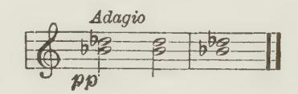

II. Do the same, but with the fist now horizontal — in playing position.

III. Now rhythmically rock on the same two notes, still with fist horizontal and still pp — and the slightest weight only.

IV. Now add to this last (the soft passing on of light weight from note to note) and still with your fist, a stronger impulse (rotationally) during each key-descent, from pp to f, thus: —

Notice, that no finger at all has so far been used in this, but you will nevertheless have SET RIGHT the basis for your fingeraction!

Then follow this by the five remaining steps, adding fingeraction to the preceding, and thus leading up to the five-finger exercise, as shown in "The Nine Steps" — which see.

29. Or, for an advanced player or artist, instead substitute the two following test-exercises only, or the last one only, as this covers the ground. Atter that, transmit the right sensations thus learnt to the passage that has given trouble, and you will find the difficulty has vanished.

The in-between notes quite light, but the accents well pronounced. The hands separate at first, then together, and lastly by similar motion. Each bar might be repeated several times before proceeding to the next.

- 30. Finally, realize that you can only attain successful "finger" passage-work (or any other form of technique) by your insisting on attuning perfect harmony between finger and forearm in this respect. The forearm rotational-help must be correctly forthcoming for each note, and the finger itself (and hand) must be sufficiently exerted to make use of this help; and the movement may either be that of the Finger, or Hand, or Forearm-Rotation itself!
  - 31. In short, the finger and the forearm elements must be

accurately balanced and timed for every note you play. Without such balancing and timing it is impossible to succeed.

32. Finally, always play freely.

The word "RELAXATION" is however sometimes turned into a Fetish. It has even been stupidly (and lately maliciously) perverted and twisted into signifying a general flabbiness, feebleness and Ineptitude! It means nothing of the kind! Without Relaxation you cannot play at all, and noone ever has or ever will.

- 33. Realize and master the three distinct réles of Relaxation in Technique. Thus:
  - (1) To obtain the use of the free weight of your Arm, you must learn to relax its upholding muscles.
  - (2) To enable you to play freely you must learn to relax the antagonistic (or contrary) muscles.
  - (3) To enable you to ensure tonal accuracy you must learn to relax all stresses used during and for tone-production the moment their mission is complete.

Nore. — This last does not preclude a light "'after-pressure" upon the key-beds for Legato, which helps to apprise you how long you are holding those notes down; and this does mot constitute what I meant when I invented the term "keybedding." Key-bedding signifies a mis-timing of the tone-intended force, too late in key-descent — a burying of the tone therefore!

- 34. Remember, THAT THE SOLE PURPOSE OF RELAXATION is to enable you to exert your Finger and hand adequately and easily in playing. Never forget that!
- 35. In past days only geniuses stumbled upon the correct processes of Technique or Touch. Nowadays you and everyone else who can or will use his brains sufficiently to understand the facts herein made plain, and will work on these lines, can and assuredly will succeed — technically!
- 36. But remember, ''successful technique" only signifies the power to express that which you can see or feel musically.

Therefore, do try all the while to perceive musical sense, for only in this way can you also improve your Musical Sight — and your Technique!

## Section VII. THE MOVEMENTS OF TOUCH

— Before the key 1s reached, and with it.

#### The Movements of Touch:

- 1. Most of the harmful attempts to teach Touch have arisen from the delusion that the CAUSE of Touch lies in the exhibited accompanying visible movements; whereas, obviously, the true causes of Touch'can only be found in the actuating but quite invisible muscular changes in state of the Arm, Hand, and Finger.
- 2. While all Touch demands reversals or repetitions in the visible or mostly invisible state of the Forearm rotatively for every note, and all touch also needs the "'poised"' (or self-supported) state of the Arm in its several ways — either continuous during each phrase, or instantly reswmed during each interval between the sounding of the notes — you may accompany these actuating conditions either by Finger, Hand, or Arm movements. Thus:

#### 3. I. Finger-Movement, caused either: —

(a) Solely by exertion of the "small'' muscles of the finger (situated inside the hand) but really too weak ior certainty in tone-production, but most suitable for holding notes down after they have been sounded.

Note. — A touch-form only suitable for certain quite light effects, grace-notes, etc., and no doubt available in the old Clavichord days. It has indeed been said of Bach that he sometimes used only the Nail-phalanges!

(0) By the exertion of the "strong"? muscles of the finger (situated on the Forearm); but this implies also an exertion via the Hand, as these tendons run through the wristjoint: the Arm in the meantime remains continuously either in its fully or slightly less-fully "poised" condition. Or optionally: The finger may be helped in its work of toneproduction (via an invisible exertion of the hand) by a momentary but again invisible application of down-arm energy in one of the four ways noted below under Arm-movement, and already fully discussed (as actuating causes) in Section V — "The Arm,"' which see.

- II, Hand-Movement caused by an exertion of the Hand itself, along with an invisible exertion of the Finger, and either with:
  - (a) The Poised condition of the Arm, or
  - (6) Helped again by momentary but invisible Down-arm impulses, provided in either of the before-mentioned four ways.
- III. Arm-Movement (either Whole-arm or Forearm vertically, or Forearm rotationally) along with invisible exertions of both Finger and Hand; an arm-movement caused either: —
  - (a) by a momentary relaxation of the whole arm from its poised condition, or —
    - (b) by Forearm weight only; or —
  - (c) by amomentary down-exertion of the Forearm in conjunction with the relaxation of the Upper-arm — for full fortes; or —
  - (d) by a momentary forward-drive of the Upper-arm along | with the down-exertion of the Forearm. |

Norte. — But, as already said, a form of touch imperatively to be avoided except for special effects, if you wish your fortes to sound pleasant to the ear!

4. The determining factor as to which of these movements shall arise, lies in the respective balance of power between the three main factors — Finger, Hand, and Arm —

For instance, when you use the complete muscular combination of Finger-Hand-and-Arm, you will have Fingermovement when the finger-exertion is slightly in excess of the other two components of Touch; whereas you will have Handmovement when the hand-exertion is slightly in excess; whereas Arm-movement itself will supervene, when finger and hand exertions are slightly in the minority.

Nore. — Rotatory movements of the Forearm are available whatever the Touchform.

- 5. Touch-movements, moreover, also tend to merge one into the other, just as do the various causal Touch-actwations themselves.
- 6. No laws can be laid down as to which movement should be used for any particular passage, as this depends largely on Taste, and thus the artistic impulse or caprice of the moment often determines choice of Movement as well as Touch-kind.
- 7. The only certain point is, that for quicker passages the shorter levers are more convenient to move. Thus for slow passages, you can conveniently move the whole arm or forearm only for each note, whereas for quicker passages, Hand or Rotation movements are more comfortable; while for the quickest successions of notes there is no time except for Finger-movement. Small oscillatory (rotational) movements of the Forearm, however, are quite serviceable even in quick tremolos and shakes, since the forearm, rotationally, is very agile!
  - 8. The PRELIMINARY gentle movements of the finger, hand, arm towards the key (preliminary to the true act of touch, which is with the key) may and should be quite ample, if the speed of the passage admits of it.
  - 9. Plenty of movement helps freedom and is healthy for the muscles, since it promotes circulation.

Such preliminary movements, however, should always occur naturally, and neither finger nor hand should ever be strained back. Moreover, the force needed to depress the key must not be supplied until and after the key is reached.!

10. In the case of actual movements of the arm, it is mechanically helpful, however, to get the arm under way before reaching the key, since this enables you to overcome the sluggishness (or Inertia) of the mass of the arm before you actually begin

1 Hence also the mis-teaching that "the louder the note the higher must be the fall'' of your arm — another fallacy which a recent author and his subsequent imitator have had the impudence to ascribe to myself (of all people!) in books replete with similar total misrepresentations of my teachings. How could one judge Key-resistance if the arm were really thus "dropped down"!

the act of tone-production — from the surface-level of the keyboard.

11. Moreover, be careful never actually to hit the key down; for you cannot feel how much the key needs for each sound if you do, and your playing must then suffer musically.

Nore. — In the old days finger and hand "lifting" were made into a craze under the foolish notion that the higher one "lifted" one's fingers and hand the harder could one "Hit" or "Strike" the key down! But that is now a long exploded notion, since we realize, as here shown, that if one hits a note down one cannot possibly feel how much the key needs, and cannot choose one's tone-colour with any certainty.

- 12. Do not quit the surface of the key, when you have to repeat a note quickly.
- 13. For comparatively soft notes, on a Grand, you do not even need to let the key rise fully before sounding it afresh, since the ''Repetition-lever"' is designed with this very purpose.

On an Upright Piano, however, you must let the key rise fully.

- 14. For Octave passages, which necessarily imply muscular repetitions, also as a rule do not quit the keyboard, but slide your way along from note to note — unless you play by armmovement. See Section X, 5-7. This sliding is done by the thumb when moving outwards, and by the fifth or fourth fingers when moving towards you.
- 15. Finally, remember always, that such visible manifestations of Movement do not in the least indicate what is happening "behind the scenes'' — what is happening invisibly in the way of Limb-exertion or relaxation during the processes of touch. These causal actions you must acquire through experiment and sensation, and your eye cannot help you.!

1 See Additional Note in " Digest" — "'The pure Finger-work fallacy."

## Section VIII. ON HOLDING NOTES

- The right way and the wrone way.
- 1. You must almost invariably use the 'strong'? muscles of the finger to sound the notes at the Pianoforte. These "strong" muscles are situated on the Forearm.
- 2. Therefore, during key-descent you may be able to notice a slight tension across the under-side of the eS A during the moment of key-depression.
- 3. Promptly cease working with these '"'strong" muscles the - very moment you hear the sound begin.
  - 4. In the meantime you have also used the ''small"' muscles of the fingers during the moment of key-depression. These "'small"' muscles lie inside the hand itself.
  - 5. Now, you must always hold the key down in tenuto and legato (or at surface-level during Staccato) solely by continuing the gentle exertion of these small muscles of the finger. To know their names or the precise locality of these muscles will not help you in the least, but when you do the right thing, remember it feels as if the exertion were solely on the underside of the finger itself — the gentlest tension on their underside, and seemingly located between finger-tip and knuckle.
  - 6. That is, you may use all the muscles connected with the finger during the sounding-action, but you must hold the notes afterwards solely by these ''small" muscles.'
  - 7. Constantly test yourself for such light holding of notes, by insisting on freedom (or mobility) at the knuckles while holding notes; or even while depressing the Keys."

1 Or, translated into the impressive quasi-scientific jargon affected by some recent writers: 'Use both the /umbricalis and the flexor sublimis digitorum during key-descent." This, however, does not seem materially to help things forward?

2 See "Relaxation Studies" for these three and other test-exercises.

- 8. To teach you this correct way of holding notes down, and the distinction between the action of sounding notes and the action of holding them, the simplest test is as follows: —
  - (a) Clench your fingers firmly into the palm of your hand, and notice that while you continue this stress it provokes a certain rigidity of the wrist at its under-side. (b) Suddenly let go this strain, while still keeping the finger-tips touching the palm of your hand — but now quite lightly. You will find that you can now freely move your hand in every direction so long as you thus use only the ''small"" muscles of the fingers — and this without the slightest sensation of strain across the wrist. This is the only right way to hold notes.
- 9. Also practise the traditional ''Holding-notes exercise" at the keyboard. But always be careful to do so accurately in accordance with this knowledge — that the "'holding"' must be done perfectly lightly. You can easily ensure this, provided you insist on employing only these ''small'' muscles of the fingers — with free and mobile knuckles.

Note. — This "'holding-notes exercise" is one of the oldest and best known of all exercises. Practised correctly it is extremely helpful as a test for correct technique, whereas, practised wrongly (as mostly done!) nothing can be more harmful. It forms Section XVI of my "Relaxation Studies" (Bosworth). Many others of the Test-exercises there given, also help towards the same purpose, suchas Sets I, III, and XIII.

- 10. By testing yourself in the way here indicated, you can learn to realize the nature of the correct muscular habits required, and can learn to avoid one of the worst of all the wrong ones — the sustaining of notes stiffly and clumsily!
- 11. In short, hold down your notes (in legato and tenuto) quite comfortably firmly, by pressure solely of the "small" muscles of the ieee — with loose knuckles. This slight "afterpressure" is not "key-bedding"'!

Don't do so with the "strong" finger muscles, which you have to use in sounding the notes. That is " key-bedding," because

you are then mis-timing the forces intended to produce the tones, and are technically and musically spoiling all your playing.'

## Section IX. BENT AND FLAT FINGER-ACTION

— Thrusting v. Clinging, or Unfolding v. In-folding actions.

#### Thrusting v. Clinging.

1. As already pointed out in Section V, 42, you can use the finger itself in two quite distinct and opposite ways while moving towards the key and with it. Thus: —

## A): THE "THRUSTING" OR "BENT" FINGER ACTION

- 2. In this mode of action, the raised finger is considerably curved (bent or folded-in) and you then open it out somewhat during its descent to the key, and with the key during keydescent, the nail-phalange (the end ''joint" of the finger) remaining almost vertical throughout — both with finger up and with finger down.
- 3. This thrusting, shoving, "'bent" or unfolding action of the finger needs for its invisible basis a more or less forwardly supported (or even forwardly exerted) Upper-arm and Elbow. See 4th form of Arm-use, Section V.
- 4. This thrusting or shoving action of the finger (a downward and outward action) is, however, really quite a complex process — while the middle joint descends, the nail-phalange has to remain vertical.

Carefully compare the "up" and "down"' positions of the "bent" finger in the photos annexed.

1 See Note to 714, of Section XI, "Staccato and Legato."

Note. — With the "thrusting" finger the tone can neither be sympathetic, full, nor carrying in melodic passages. Nicety of tone-control is also greatly stultified. For ''dry"' effects it may be appropriate, but the unavoidable elision of upper-arm weight with this form of finger-action precludes all true volume or resonance in fortes — as a musical ear would describe the result.

#### B): THE "CLINGING" OR "FLAT"? FINGER ACTION

- 5. In complete contrast to this "'thrusting"' form of fingeraction, the finger here starts more or less opened-out; and will then be more or less folded inwards while moving towards the key and with it. In this case, zf you raise the finger considerably before playing, the nail-phalange (or end "'joint"") may actually become visible to you for the moment.
- 6. This "clinging" or ''flat"' action of the finger needs as its invisible Basis a more or less relaxed (and therefore backwardtending) Upper-arm, and with it a likewise backward-tending Elbow. See 1st and 3rd forms of Arm-use, Section V.

Note. — Applied to the key, the whole limb here remains far more elastic than in the opposite forward or thrusting touch previously described. Thus it renders proper key-acceleration more easy for you, and thus also an easier attainment of full, sympathetic, carrying tone, and of nicety of tonal gradation and control.

- 7. This folding-in action of the finger is by far the most natural form of finger-use at the Piano. It is the same action you naturally use all day when gripping hold of objects. It thus enables you also to '"'take hold of" (and ''cling"') to the key.
- 8. Actually, with the "'flat"' or clinging (or in-folding) action, the finger May fold in so much that when the key is down it is as much bent-in as with "'bent"' finger-touch.

But notice, that although the position, with finger down, S both modes of finger-action may be identical, that with ''clinging" finger it is most bent when down, whereas with ''thrusting"' finger it is most bent when up. (See annexed photos.)

Norte. — With the key down, the eye cannot distinguish which has been used although your ear apprises you of the difference in sound.

9. Alternatively, with this "clinging" action you may also leave the finger almost straight (or ''flat'') during the whole of its action, and it may remain thus flat with the key down. Thus has arisen, in the past, its name "'flat finger."

10. Realize also that with the Upper-arm relaxed during the moment of key-descent you are compelled to use the in-folding ('flat') action of the finger, whereas with the upper-arm (or Elbow) in the least pushing forward you are compelled to use the unfolding (bent or thrusting) action of the finger.

But with the upper-arm nicely poised, you have the option of using either of the two finger-actions, in softer passages.

Note. — Moreover, with the "poised" arm, you may, for quite light passages, even play on tip-toe as it were — on the very tips of the fingers — provided you have flat, paddy finger tips, and your nails are not too long!

## Section X. HOW TO FIND THE RIGHT NOTES

1. To reach the right places on the keyboard (the right notes) is obviously an important matter. To attain Certainty in this respect, you must always physically feel your way along from the last note played.

2. You must spiritually want to hear the needed melodic succession of intervals, and you must also physically feel the corresponding set of physical intervals on the keyboard.

- 3. This "'feeling-your-way" is mostly done by the true touch-sense — sense of contact or tactile faculty; it is done, for the most part, by your not quitting the last note until you have found the next one."
- 4. The law applies equally in skips— you must still feel your way along the key-surface from note to note.
- 5. It consequently also applies in octave passages. You must feel your way from one octave to the next. Thus becomes possible the trick of so-called "lightning octave passages."
- 6. Both in octave passages and larger skips you must feel your way along with your thumb, when the passage travels outwards — away from you; whereas, you must feel your way along with your fifth or fourth fingers, etc., when the passage moves inwards — towards you. See Section VII, 414.
- 7. In the meantime do not forget, that each octave you play demands the repetition each time of the necessary forearm rotatory exertion towards the thumb, besides the exertion each time of the two fingers concerned, and also that of the hand.
- 8. This law of physical continuity on the keyboard-surface is equally imperative when you play passages distributed between the two hands. Here do not quit the keyboard with one hand until you have found the place of the next-following note with a finger of the other hand. In the meantime also think such passage in Rhythmical Continuity.

The "secret" of such passages lies in your insisting upon Rhythmical Continuity as well as Physical Continuity. Such passages thus become quite easy of attainment. Whereas, if you do not give this double form of attention (by touch-sense and rhythmic sense) then they are impossible.

1 Supplemented no doubt by our muscular and "kinesthetic" sensations and memories generally.

But "a bird in hand is worth more than two in the bush," therefore depend as much as possible on the actual touch-sensation of the last-used note until you find the next. It is safest!

9. In short, while always thus feeling your way along the Keyboard-intervals FRom the last-played note to the next, you must, nevertheless, in the meantime, also think and play TOWARDS the rhythmical landmarks ahead.

Note. — That is: you must think towards tone in key-descent; towards each next Pulse (or beat) ahead in groups of quick notes; towards the rhythmical climax point of each Phrase or Section, and towards the point of consummation of the Whole piece. See "'Child's First Steps," "First Principles," and "Musical Interpretation," p. 28, etc. (Joseph Williams).

- 10. To enable you to travel from one note to another, you must, where necessary, supply sideway movements of the fingers, of the hand, and of the arm — both of the whole upper-arm and the forearm. As these lateral or horizontal movements are visible, they are obvious and need little explanation.
  - 11. There are however three points to notice: —
  - I. In taking skips within the compass of two octaves it is best to leave the Elbow stationary. To succeed in this, you must, before beginning the skip, turn the elbow out sufficiently to enable you to reach the note furthest out.
  - II. When you turn your finger over your thumb (or vice versa) this requires a movement of the hand — with the thumb stationary; whereas, when you move the thumb under a stationary finger, this requires a movement (sideways) both of the wrist and of the forearm — though not of the Elbow.
  - III. When playing scales, etc., it is best to have the wrist (and consequently the forearm also) turned rather ''outwards" (away from you), as this allows of your turning the fingers over the thumb without disturbing the relative position of wrist and forearm during the passage.!
- 12. This necessity to feel your way along physically finally resolves itself into an ''ACT OF RESTING on the keyboard," either at its surface, or depressed level; and this leads us naturally into the consideration of the problems of Staccato and Legato.

1 The Forearm therefore here travels with the wrist 7 advance, when the passage moves outwards. See also: 414, 15, etc. of Section XII, ''On Position."

## Section XI. STACCATO AND LEGATO

- 1. The term staccato should properly signify "staccatissimo," practically without duration, as short as possible. The term "Staccato," as used colloquially and loosely, is however unfortunately applied to all notes not played Tenuto or Legato. Hence, when playing passages marked staccato, remember that the sounds, in spite of their notation, may probably, nevertheless, need more or less slight durations. Therefore, be most careful to choose the precise degree of Duration musically needed for every note marked "staccato."
- 2. Now, in true Staccato (or *Staccatissimo*) the key must be free to *rebound*, so that the damper may instantaneously stop the sound, almost at its birth.
- 3. To obtain such true Staccato you must accurately *time* your tone-making impulse to cease completely the moment you reach sound in key depression. Thus the key will be free to rebound even with your finger-tip still upon it, and the damper will consequently reach the strings instantly.

Note. — The following Diagram may here prove suggestive:

- (a) Staccato resting at surface-level of keyboard continuous.
- (b) Tone-producing impulses, directed and aimed to:
- (c) The tone-emission level.
- (d) The key-bed level momentarily touched but rebounded from, for each note.
- 4. Realize particularly, that you cannot "make" staccato by trying to *pull* the key or your fingers up! All you can do is accurately to stop both the down-impulse of your finger, as well as the help given by hand and arm during key-descent.

5. To enable your finger, etc., in Staccato thus to stop its action accurately and completely, you must rest very lightly indeed on the keyboard-surface — not more heavily than the keys will bear at their surface-level, without becoming depressed.

Thus, in Staccato, in between the sounding of the notes, your arm must be more or less completely ''poised"' (supported by its own muscles) and with the hand, alone, lying loosely upon the keyboard-surface for the sake of the sense of continuity. See "The Poised Arm,' Section V.

6. Agility passages as a rule demand a precisely similar light Resting on the keyboard, — arm "'off" with hand lying loosely on the keys; and with similar accuracy in the aiming and cessation of your finger-action, etc.

The arm thus comes into sympathetic vzbration in consequence of the reiterated impulses of the finger and hand against the Keys, and thus forms true '""Arm-vibration"' touch. See Section XII for this.

7. To obtain TENUTO, do not, as in Staccato, thus fully and completely cease your finger-exertion, etc., but allow this exertion to continue in a slight measure on the key-beds — just sufficient exertion to keep the keys depressed.

This Tenuto will last just so long as you continue this slight action upon the key-beds with your finger-tips.

Nore. — This sustaining action must be provided solely by the ''small muscles" of tne fingers. See Section VIII, {4 and 5, also Note to 6 — "The Holding of Notes."

- 8. Moreover, to obtain a true Jegato you must continue this light holding action wntil the next sound; and if you continue it beyond that moment you obtain legatissimo.
- 9. It is in this way that you produce the ARTIFICIAL form of legato. Notice, however, that you do not here employ sufficient weight continuously resting on the keyboard to compel the fingers to hold their notes down. The keys are only held down so long as you choose, thus quite lightly but sufficiently to exert your fingers and hand upon the key-beds. The moment,

however, that you stop this slight exertion, that moment the key jumps up, and the sound stops. This ''artificial"' form of legato is therefore un-compelled by the resting-weight.

10. There is also another form of Legato — the NATURALlegato.

Here you very slightly relax the arm, so that it is mot so fully poised or balanced as for staccatc, or for ''artificial" legato. A very little of the weight of the forearm or whole arm is here allowed to lie continuously on the key-beds during each phrase. This extra weight compels some finger or other to continue its slight exertion in support of the weight, until relieved of its duty by another finger. Realize that one finger or other is consequently here compelled to support this carried weight, until relieved by another taking its duty.

You thus have a legato automatically induced by the weight you allow to rest on the keys at bottom-level. This "natural" legato you might also term ''Compelled legato"'; for it is compelled by this slightly heavier Resting-weight.

- 11. It is easiest to learn this ''compelled" form of legato first. But the un-compelled (or ''artificial'') form of legato is the one you will have to use most often in playing. You may even use it along with the "compelled" form at times.
- 12. To sum this up: You can produce Legato, or Tenuto, in either of two quite distinct ways: —
  - (a) You can compel your fingers to hold notes down by a continuous and sufficient Resting-weight — "Natural legato"; or
  - (b) You can hold notes down by your fingers without such compelling weight — "Artificial legato."'

Note. — In the meantime, as already insisted upon, uever hold notes down except by the '"'small" muscles of the fingers -— with loose knuckles. Never hold them by the "strong" playing muscles (situated on the forearm) with immobile knuckles and wrist, and consequent fatal pressure-inducing effects. See Section VIII, "On Holding Notes," 45, etc.

*Weight-transfer, Arm-vibration Touches E 41*

- 13. Obviously, it does not take more force to hold a note down than is required to sound it at its softest in fact rather less.
- 14. There is, however, no harm in occasionally using a little more pressure on the key-beds than thus necessary, provided you do so purposely, and so long as you keep clear in your mind the distinction between the sounding and the holding of notes.

You should apply such "after-pressure" only for the sake of comfortably knowing that you are holding those particular notes down, and so as to warn you, muscularly, when to let them go.

Note. — As already pointed out, this *slight* extra pressure on the keybeds, thus purposely used to remind you that you are holding certain notes down, does *not* constitute "key-bedding" as you might imagine.

"Key-bedding," as a fault, arises when you mis-time the action intended to produce a tone, and mis-apply this force to the pads under the Keys instead of carefully timing its culmination and completion during key-descent and with the tone, and its cessation forthwith.

See the next Section — "On Weight-transfer" or Passing-on Touch, also Section VIII, "On Holding Notes." This reiteration is emphatically necessary.

## Section XII. WEIGHT-TRANSFER AND ARM-VIBRATION TOUCHES

- 1. Weight passed-on from note to note much as in the case of the heavier form of "Resting" used for "natural legato" may itself form a cause of tone-production, and thus constitutes "Weight-transfer" or "passing-on" touch.
- 2. Such continuously passed-on Weight (though light) also entails a CONTINUOUS (but quite invisible) exertion of the Hand—in place of the individual hand-impulses used in all other touches.

3. The essential difference between "' Passing-on" and "Armvibration" touches lies in this difference in the (invisible) application of this continuous Hand-force: —

In Passing-on touch the Hand-exertion is continuous (to the extent of the weight carried); whereas with Arm-vibration touch it is separately applied for each finger.

Nore. — This continuous action of the hand may also entail intermittentlycontinuous Rotatory conditions. See {21 and 22.

- 4. The use of Passing-on touch however seriously handicaps musicality, since it almost entirely precludes tonal selectivity from note to note — the very life and soul of playing, and also precludes Duration-contrasts shorter than Legato.
- 5. All rapid musical passage-work, such as you find in Bacu, BEETHOVEN, and CuHopin for instance, imperatively demands such tonal and durational individualization, or musical choice from note to note by Arm-vibration touch. This forms the difference between musical playing and mere rattling through!
- 6. Moreover, however advanced a player you may be, there is a very definite speed-limit beyond which you cannot give these separate (but invisible) hand exertions for each note, and beyond which speed they are bound to merge into a continuous though light hand pressure behind the racing-along fingers (Passing-on touch therefore) to the destruction of Music.
- 7. The moral is, never play musical passage-work faster than you can give these separate hand-stresses for each note.

Notre. — The composer surely meant them to be played musically, but he himself could not play them musically beyond a definite speed. Always remember this fact — unless you do not mind giving up everything to mere Agilityvirtuosity and Display, and have no sense of Musical Morality!

8. Passing-on (or Weight-transfer) touch is only appropriate for certain light Arabesques and harmonic swirls of notes needing no more than ''mass-production" effects of Crescendo and Diminuendo, and for accompanying passages not needing Note-

*Weight-transfer, Arm-vibration Touches E 43*

individualization. Spread chords, and the soft end-notes of the ordinary "'slur"' also call for it.

- 9. As already indicated (see Section V, §18) all musically melodic passage-work demands the use of Arm-vibration touch, since the fully poised arm alone allows you to apply the hand separately (but invisibly) for each finger used, and thus enables you really to choose your tones.
- 10. The advantage of the fully poised arm is, that by reaction from the reiterated shocks it receives from the momentary impulses you deliver against the keys with your finger and hand, it is here actually brought into vibration as before explained; and it thus serves as an ample Basis for their exertion — and hence its name. — See Section V, {{[/14, 15, and 28.
- 11. This sympathetic, trembling effect of the arm should however always arise by reaction from these short-lived and tonally accurately-aimed impulses of finger and hand. Never, instead, try to produce the effect by shaking your arm — as supposed by some misguided ones. It will certainly ruin your playing!
- 12. Above all things remember that the hand must (invisibly) act separately for each note!
- 13. The seemingly absurd reminder is here called for, that you have only one hand for each set of five fingers!

Much passage-work, however, founders just because this simple fact is overlooked!

Ponder well on this, and realize its truth the next time you touch the Piano!

Note. — It is so easy to see the movement of the five fingers in succession, but not so easy to realize that you must give five successive (although invisible) exertions of that one Hand to render those five fingers effective!

14. Remember, the arm condition is precisely identical for Arm-vibration touch and for the Staccato Resting; for you must

1 See "The Slur or Couplet of Notes — in all its Variety, its Interpretation and Execution." Oxford University Press.

rest at the surface-level of the keyboard in both — with the hand lying loosely on it in-between the sounding of the notes. — (See Section XI, on ''Staccato and Legato."') In fact all light Agility passages must be played with this lighter, or Staccato-Resting, although the aural impression may be Legato!

Norte. — Do not forget that the difference between "lightness" and "heaviness" in musical effect depends mostly on difference in Duration — on the presence or absence of holes in the continuity of the sound.

- 15. But while all rapid Staccato passages necessarily take the form of ''Arm-vibration," it does of follow that all Armvibration passages are necessarily Staccato! Arm-vibration touch can be turned into a Legato, by applying the "'artificial legato" process to it. (See Section XI, {9.) Remember, that you here hold the notes down — on their beds — by the fingers 'working on their own," and not here compelled into holdingaction by a light superimposed Weight resting on the key-beds —as in "Natural-legato" Resting. See Section XI.
- 16. Here once again the urgent reiteration, that you must not hold notes down by the '"'strong"' muscles of the fingers (situated on the Fore-arm) through which you sound the notes, but instead you must hold them down solely by their "small" muscles.!
- 17. Always realize, if you (wrongly) continue on the key-beds the exertion of the "strong" finger-muscles you use during Tone-making, that you hereby again lapse into ''Passing-on" (or Weight-transfer) touch, with all its disadvantages musically and physically.

Norte. — Moreover, if, in addition to this fault, you continue to lapse the "FULL WEIGHT" of the arm on the key-beds, you are doing your best to wreck your playing and your Piano, and besides, seriously risk contracting Cramp and Neuritis, and all the physical ills associated with bad Technique —an evil teaching-inheritance of the Past, and which some of our present-day writers are foolishly trying to revive or perpetuate!

- 18. Much of the musically arid passage playing, and '"'too fast" playing (rattling and strumming) so often heard even
- ? Or "jumbricalis," to use the anatomical jargon affected by certain writers of today. See Section VIII, {4 and 5.

from the Concert-platform must be laid to the door of the mis-use of Passing-on (or Weight-transfer) touch in place of the needed Arm-vibration touch, — unless it is the outcome of sheer laziness, in which case no Touch-form can help the un-maker of music!

- 19. Anyway, avoid the folly of trying to run at the Piano with a heavily-resting Arm. In ordinary life, when you wish to run, you rid yourself of all unnecessary baggage!
- 20. Reversals or reiterations of the Forearm-rotatory Element are obviously needed for Arm-vibration touch (as everywhere else) for each note individually — although usually quite hidden from the eye in a rapid passage.
- 21. But with Weight-transfer touch the rotative changes may occur sometimes in conjunction with whole groups of notes.

That is, with the continuously applied hand-and-arm stresses of Passing-on touch you have the option also of Forearm-rotatory continuity (in a measure) in place of the usual individually applied rotative reversals or repetitions from finger to finger; whereas, in other touches there cannot be such option. tf: however, such optional continuous rotation-stress is used, it will then naturally alternate in direction according to the various succession of fingering groups.

22. Lastly, with such exceptional touch-form, you may allow actual rotatory group-movements to accompany such optional continuous rotatory impulses. For instance, a scale moving outwards would be in éwo groups, with a rolling movement from thumb to middle finger, then a momentary reversal to the thumb, followed again by another continuous roll till the ring or little finger is reached.

Nore. — No doubt such optional rolling movements (or rotational grouping of notes), feasible with Passing-on touch, have suggested those childish " Undulatory Theories of Touch" which certain recent authors (and some more ancient ones) have propounded. Such fancies, however, can never be accepted as the explanation of Touch, since we know that mere movements cannot be the actuating Cause of Touch. Some artists may have adopted such particular fads of Movement, as they also adopt others; but they do not owe their success to such "undulatory" movements, or to any other fancy of the moment; but because they nevertheless

happen (invisibly) to exemplify the right things muscularly in the meantime along with a sufficiency of Musical Sight. And given that, any amiable little fads are quite forgivable!

23. This chapter is earnestly commended to very searching study. Perhaps it is the most important of all, since so many otherwise fine players often fail owing to lack of understanding of the facts herein made plain.

## Section XII. ON POSITION — And Movement.

- 1. Good Position is the resultant— but not an assurance of correct balance in the forces you use. Position, on the whole, will take care of itself if you apply the actuating forces correctly — but these are mostly invisible.
- 2. While neither good nor bad Position can ensure good or bad playing, yet there are some points where ill-chosen Position may make things that matter more difficult. Hence study the following warnings and advice."
- 3. Avoid sitting too close to the instrument, with your upperarm straight down from the shoulder, since you then lose the option and advantage of Upper-arm weight when you need it for singing tones, etc. Sit sufficiently far away, so that your upperarm slopes forward with the Elbow, and does not hang straight down or even slope backwards.

Norte. — See also page 305, "The Act of Touch,"— the outlined figure of ANTON RUBINSTEIN. ;

1 Study also this same Section in the "Digest" itself, and the Chapter on "Position" in "The Act of Touch"? — Longmans, Green & Co.

2 You may hold your fingers, hands and arms in perfectly orthodox positions and yet your (invisible) playing-actions may be perfectly wrong and ineffective.

4. Sit neither too high nor too low. It is best that the Elbow should be about level with the keys or slightly lower.

If you sit higher than this, you are likely to drive forward when you should be using Upper-arm Weight; and if you sit lower you are likely to allow the upper-arm to hang on to the keyboard, when its Weight should be "off."

- 5. If you have a long Upper-arm you are compelled to sit higher than those born with a shorter upper-arm, else your Elbow will be too low to be comfortable.
- 6. Do not sit all hunched and bunched up do not relax all your Body-muscles because you have to relax your arms at times! It is distinctly unhealthy, of no profit technically, and ugly. Besides, to see an ugly thing before him, is apt to make the listener imagine that the sounds also are ugly.

Freely and easily therefore keep your body erect.

7. Do not sway and move about unnecessarily — neither with your body nor with your arms.

If you make the listener watch your body, to that extent he listens less to your soul — which one hopes you may be trying to express!

Note. — If you play freely as you should, it is easy to move about — but don't! Whereas you dare not move about if you play stiffly and badly. But don't play stiffly and badly for the sake of sitting immobile!

8. Avoid using UPPER-arm rotatory movements — and exertions — in place of the much neater, easier, and effective forearm rotatory movements, when playing tremolos, etc.

Again, this is waste of energy and also distinctly ugly. Liszt used to deride such Elbow-circling —he called it ''making Omelette!"

Nore. — In any case it is abominably bad Technique to substitute upper-arm rotatory stresses (actions and relaxations) in place of the necessary ones of the Forearm.

- 9. Always keep distinct the process of moving towards a note from the process of actually sounding a note, when found.
  - 10. Avoid jabbing at the notes with sideway (horizontal)

actions of your arm. First arrive on each key, or over it, and then proceed purposefully to play that note. This does not mean that you should pause between the two operations!

11. As already pointed out in Section X, J11, to enable you to turn your fingers over the thumb easily, allow the Wrist to turn slightly ouwtwards— with the hand therefore pointing slightly znwards.

During Scale playing retain that position permanently. It avoids unnecessary to-and-fro movements of Wrist, Hand, and

Forearm.

- 12. Reverse this when turning a long finger over a shorter one, as in double-notes passages — turn the wrist inwards then.
- 13. In arpeggio playing you cannot permanently keep your hand thus turned inwards. To-and-fro (sideway) movements of the hand, wrist, and forearm cannot here be avoided, but let their range be as small as need be.

Nore. — Slight rolling movements, even, may also be permissible, although not in the least essential.

- 14. When taking skips within a two-octave range, turn the elbow outwards sufficiently, before beginning the skip. To move the elbow during such skips is cumbrous and unsafe. See Section X, 911.
- 15. For larger skips you cannot avoid moving the whole arm. A composer who knows how to write well for his instrument usually bears this in mind, unless it is done for ''sport"'!
- 16. With regard to Hand-position, the main point is, avoid kinking the knuckles in. It isa very bad method of playing, and is almost sure to render hand and fingers stiff and weak.
- 17. If you allow your knuckles thus to drop in, or to be forced in, you are either (a), applying too much energy from the hand and arm, or (0), you are insufficiently exerting the fingers themselves at the moment of depressing the key — or after that!
- 18. The same thing applies at the wrist-joint. If your wrist drops down too much, you are either exerting your hand insufficiently, or are giving too much Arm-energy in proportion

to the finger and hand exertions, — since action and reaction should always nicely balance.

19. The actual shape assumed by the hand and fingers, however, varies with each individual, and even with each passage whereas the keyboard never varies! Hence the folly of laying down any inflexible rule on this point, although it is well to realize that the arch is mechanically more effective than any other position.

In short, the Position of your hand and fingers which enables you to play at your easiest (and therefore best) is also the best possible position!,

Nore. — I, personally, vary the position of my wrist, hand and fingers to suit each particular passage. Position is not a thing to worry over, it effects itself, if you correctly supply the invisible actions.

- 20. Finger-position and movement have been fully discussed in Section IX, "'Flat and Bent Finger," and in Section VII, and illustrations are there given.
- 21. Finally then, if you learn to provide the correct balance between the exertions and relaxations of your finger, hand and arm which we have discussed, well-poised Position will ensue naturally.

## Section XIV. ON NOMENCLATURE — THE NAMING OF THINGS

- 1. Nomenclature is of little consequence. It is only a matter of convenience.
- 2. "Touch" is a generic term, including everything relating to Tone-production and Technique.
  - 3. In past days it included: —
  - (a) Tone contrasts ''Forte and Piano touch."
  - (b) Duration "Legato and Staccato touch."
  - (c) Movement ''Finger, Hand, and Arm touch."

- 4. Nomenclature in the past thus referred only to the aural and visual effects noticed, and not at all to the invisible causal processes of Touch — those far more important but invisible stresses of Touch which you have to provide, so to create the differences in Tone, Duration and Time-inflection.
  - 5. Thus you can help your finger exertion by:
    - (1) a loose-lying hand (and rotation), (''First Species"), or
  - (2) a down-exerted hand (along with these), ("Second Species''), or
  - (3) some form of arm-stress (along with these), "Third Species"') — and the arm can give you four sub-species!
- 6. For rapid finger-passages you may use either Weighttransfer or Arm-vibration touch, preferably the last, or else a cross between the two.

Nore.— Remember: Weight-transfer touch is a modification of the heavier form of Resting needed for '' Natural Legato"; whereas Arm-vibration touch mainly consists of ''second species," with a well-poised arm, but may waver towards first and third "species" as occasion demands.

- 7. It does not help things much whether you remember or not that I adopted the term '"'Species of Touch" to denote these three basic differences in DoING, so long as you vividly remember the facts concerned in actual performance.!
- 8. Likewise, it does not matter whether you call the differences between horrid-sounding and well-sounding tone a difference in quality of Tone, or ""XYZ and VWQ-tone," or call it a difference of ''Quantity." But unless you have mastered and can exemplify such differences in playing, you cannot fully express yourself musically."

1 See "The Act of Touch," Chapter XII (Longmans); also an additional Chapter on this point in "Relaxation Studies" (Bosworth); and ' "Commentaries" on the merging of the three species, p. 14.

2 See Additional Note in the Digest: "On the Ugly and Beautiful in Piano Touch."

- 9. Nomenclature suggestive of wrong Doing may however prove harmful the term "Fixation" is such a term. It is obnoxious as it suggests "'stiffening."' !
- 10. ''Fixation"' was invented to express the fact that there must be an immobile, stable, or resisting Basis for all the actions we use in playing. Unfortunately, as shown in previous pages, it suggests quite the wrong way of attaining such required Basis.
- 11. Remember, the proper way to counter the upward reactions is by supplying a down-stress (in some form or other) from the next adjacent part of the limb.'
- 12. Avoid, therefore, this ill-gotten term ''Fixation," and at all cost learn to avoid all ''stiffening."
- 13. Finally: all such cataloguing, or naming of things is very arid, and does not matter musically — unless suggestive of illdoing! What does matter, is to acquire and remember the sensations of Right Doing — expertness in sensation-ally recalling and thus re-creating the necessary tonal effects, so that your musical Self-expression shall be unfettered, and shall fully convey to others what you are able to perceive musically.
- 14. Unless you have mastered Technique in this practical and spiritual way you will ever remain an inefficient Pianist, instead of being a true Music-maker, or even a Prophet of Music!

1 It was invented in the recent past by those who could still see no further than the observed Movements, hence their wrong diagnosis of Touch.

2 Thus to recapitulate once again; to use your finger effectively against the Key you must indeed do something to counter its reaction upwards against the knuckle during Key-descent. But it was wrongly supposed that the knuckle must therefore be stiffened — hence this term " Fixation." Whereas you now know, that although the knuck!es must be made to resist during the finger's action against the Key, there should be no "stiffening" whatever, but instead you must give a nicely-timed down-exertion of the hand to counter the recoil at the knuckle; moreover, remember, that this down-exertion of the hand must cease instantly it has served its purpose, and that the knuckle must therefore be quite mobile and loose in-between the sounding of the notes; while the "small" muscles of the finger alone continue the holding of the key either at surface or key-bed level.

# FIFTY-FIVE DAILY MAXIMS — For all players.

- 1. Without Rhythm there is but Emptiness.
- 2. The day for Piano-typewriting is past. But it is never past for Music!
- 3. What you have to learn is to intend every note you play an intentional sound and an intentional time — and an intentional Duration.

Norte. — To succeed in this, Lrup-Knowledge is needed — not Muscle-Knowledge!

- 4. That is the long and short of "'Technique." Therefore you cannot learn Technique without learning to attend just like that — to Music.
- 5. The worst crime in the Past was to try to teach Technique apart from exercise in Music.
- 6. Musically, always sound each note as late as you dare, yet technically always make each note early enough — in key-descent!
- 7. First learn to use Arm-weight so that you can sing.' After that, learn to keep the arm '"'off'? —so that you can run. Feel and hear it is "'off'? — you cannot see it!
- 8. Don't put your arm down, but instead allow it to ''give," when you need its weight.
- 9. The arm is never ''dropped"' upon the keys, "'the louder the note, the greater the height," except by fools! ?
- 1 That is: the whole arm momentarily free from the shoulder (to the tonerequired extent) — either visibly or invisibly — with elbow always free.

2 To ascribe such mis-teaching to myself is indeed folly at its height!

- 10. Jf you really hit the key down by a "'drop"' of the arm, you can neither '"'feel" the key nor make Music!
- 11. You need the Poised Arm (the self-supported, floating "'arm-off"' condition) in every passage — either fully poised, or sometimes a little less so. But in some passages (for Agility, Staccato, etc.) this poised condition is continuous, whereas elsewhere (for chords, cantabile, etc.), it is momentarily relaxed during key-descent, but afterwards instantly resumed.
- 12. To kill Music and your Piano, drive well forward and downward with rigid Elbow! But don't be so foolish!

Even when you momentarily use Forearm Down-force in addition to Upper-arm weight, always keep the Elbow still free !

- 13. In the meantime don't forget to ''use"' your key and to exert your finger — and hand-exertion behind it — for each note, every time.
- 14. If you want to run you throw all baggage away! At the Piano do the same — keep the "'arm-off"" when you want to play arun! With the arm "off," choose every note's tonal and durational inflection when playing real music at speed.

Never play faster than you can thus choose.

- 15. In-between the sounding of the notes (however heavily you sound them) again '"'Arm-off,'"' with nicely loose knuckles — if you wish to play musically.
- 16. The teaching of '"'Weight" without insistence on its due cessation is just as pernicious and mischievous as the old teaching of key-hitting ''solely by finger-stroke!"'

Nore. — In very quick passages you may carry along slightly more weight with impunity, as the so quickly succeeding keys here keep the burden off the key-beds.

17. Always hold notes solely by the '"'small"' muscles of the finger — with free, mobile knuckles, however forcibly your

finger may "'grip" the key during its descent. Else you can neither choose your tone, nor move along freely.

- 18. Don't make cantabile passages sting, make them sing instead!
- 19. For singing tone, keep the elbow elastic, keep it free, easy — always easy at the Elbow.
- 20. While the Elbow feels free to fall, catch and grip well at the keys with your finger and your hand each time — just as naturally as when gripping hold of anything else.
- 21. Let the grip be an increasing grip as you swing the key into movement. Don't do it too late — always remember Maxim 6!
- 22. Never use Poke-touch or Shove-touch, with Elbow and Forearm digging into the keyboard. Nor pull the Elbow backwards.
- 23. Nor jab the key down instead always feel your way with it.
- 24. To help the finger, there are sz ways of using the arm. Don't mis-use them!

You must always use: the PoIsED-ArRM and the RorarivE-FOREARM.

You may use during Key-descent:

Forearm weight only, or Whole-arm weight, or Forearm Down-exertion with the last, or finally Upper-arm forward-exertion with the last.

Avoid the last in all forte-playing!

- 25. The most popular Mis-use of the arm is in its Forearmrotational aspect. It has thus been misused — invisibly — ever since the invention of the Keyboard!
- 26. The mischief at the root of most bad Passage-work is in the wrong rotatory exertions of the Forearm — invisibly applied.
  - 27. Be sure, therefore, to cease all rotatory exertion in the

wrong direction — even of the "'weak"' rotatory muscles — when you have to reverse the rotatory help required from finger to finger.

- 28. Freedom, rotationally, is a sine qua non in all playing.
- 29. Rotational Freedom, in its direction, must always be away from the finger last used.

This applies also when a finger is turned over the thumb.

- 30. When in doubt about a passage, always re-analyse it rotationally.
- 31. The very first time you use your fingers on any keyboard learn at once what is meant by rotational-help. Learn it first as Movement, but afterwards learn to give the required stresses without any such rocking movement whatsoever.
- 32. When in doubt, no matter how advanced a player you may be, refer to the first four of the '' Nine Steps towards Fingerindividualization'"' — played by your fist, just as a child should do.
- 33. Learn correct Doing at the age of four. It is easiest then! Don't wait until you are perhaps forty, and then have to un-learn all the acquired "Wrongih," rotationally, and in many another way!
- 34. Avoid '"Passing-on" (Weight-transfer) touch for quick passages that demand musical and muscular individualization of the successive notes. Use Arm-vibration touch instead.

Passed-on Weight means passed-on Tone — musical aridness and barrenness.

- 35. Never play really musical passages quicker than you can thus select, time and mean each note.
- 36. Only use Weight-transfer touch for spread chords, arabesques, slur-end notes, and for certain quick passages which do not need musical individualization from note to note.
- 37. Remember, to the extent you pass-on continuous Weight, to the same extent you are compelled to pass-on and transfer continuous Hand-stress.

Nore. — This last may sometimes be accompanied by actual rolling (rotatory) movements over groups of notes. This quite exceptional touch-form has however given rise to absurd '"' Undulatory Theories of Touch." Avoid them!

- 38. Correct PosiTIon is the resultant of good Balance between the invisible and visible playing elements.
- 39. CHOPIN said "if your playing looks well it probably also sounds well." One might add: "If you do well it will also probably look well!"
- 40. Don't sit at the Piano as at a Dinner-table! Give armweight a chance, by your sitting reasonably far away.
- 41. Sit with elbow about level with the keys, and better too low than too high.
- 42. Avoid pressing your knuckles ''im."' You cannot run nor walk comfortably with your legs bent double!
- 43. Don't try to express yourself by wild movements of your body and arms; — "' Don't leak," as Myra Hess has well said!
- 44. Don't force the listener to use his eyes upon you, instead of his ears upon your music.
- 45. Don't sit all huddled up; it is unhealthy and looks ugly. You want your playing to sound well, therefore avoid distracting the hearer by making it look ugly.
  - 46. The Naming of things does not explain things!
- 47, Always substitute a softer note for a louder one, whenever you can. People only BEGIN éo listen to you when you play softly.
- 48. This does not imply flabbiness in your singing passages, nor anywhere else.

On the contrary, make every melody note carry. Play "inside" the key, even in ppp.

- 49. Nor does this mean that you should not use the fullest tone in your climaxes.
- 50. But quality in performance is everything in spite of the Foolishness that has been talked, and whatever the explanation. Mere noise never convinces anyone!

- 51. Never rattle along. Instead, always try to see Music.
- 52. Always try to see the Beautiful through Key and Time.
- 53. Look for the Beautiful, which is always there if it be music — look for the physical, emotional, and spiritual beauty.
  - 54. Always use both your physical and your spiritual Ear.
- 55. If it is Nor Music, then it is not worth worrying over. A typewriter will serve as well!

## Final Precepts

- I. Never touch the keyboard without meaning to make Music.
  - II. Even in your first exercises —

mean the Moment of each sound, and see that you get it.

mean the Kind of sound for each note, and see that you get it.

- III. Feel what the musical effect should be and feel the Key — and how you move it.
- IV. 'Elbow elastic" for all singing and big tone during Key-descent — not rigid and pushed into the key.
- V. ''Arm-off" in between the sounding of all notes, and during all light running passages.
- VI. You have ten fingers! So do not forget that you usually need ten separate hands to help them, and often also ten separate arms!
- VII. The Duration of each note is as important as the kind of tone.
  - VIII. In the quickest passages mean every note.
- IX. Be a sentient human being, not a contemptible automaton musically.
- X. Cleanliness is said to be next to godliness. Sense of the Beautiful is sense of God.

*Date Due Printed in U.S.A. Gaylord*

**Greenville College Library**

786.3M43 C001 MATTHAY, TOBIAS AUGUSTUS, 1 THE VISIBLE AND INVISIBLE IN PIANO STX

DISCARDED

67536

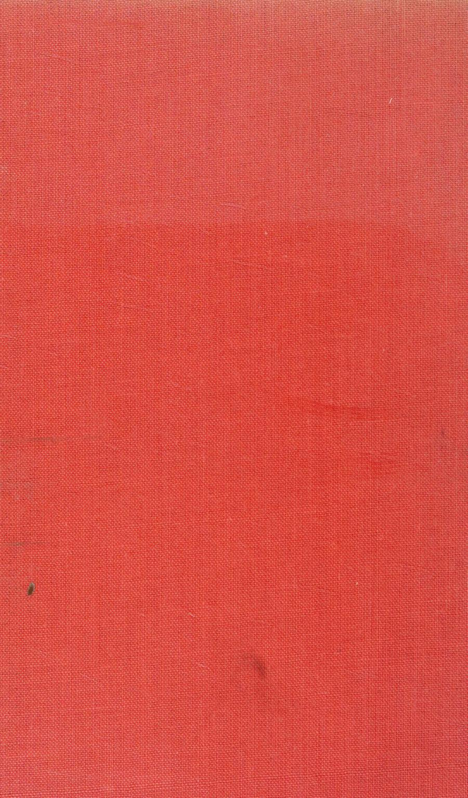